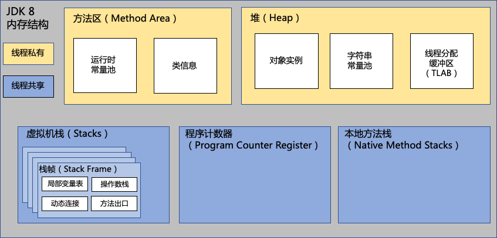
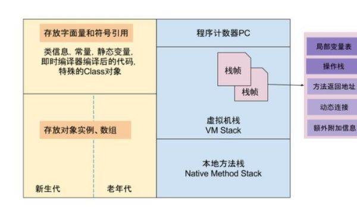

# jvm内存模型

jvm 内存模型：Java 代码是运行在 **Java 虚拟机**之上的，由 Java 虚拟机通过解释执行 (解释器)或编译执行 (即时编译器) 来完成，故 Java 内存模型，也就是指 Java 虚拟机的运行时内存模型。


运行时内存模型，分为**线程私有**和**共享数据区**两大类，

+ **线程私有的数据区包含程序计数器、虚拟机栈、本地方法区**，
+ **所有线程共享的数据区包含 Java 堆、方法区，在方法区内有一个常量池**。

java 运行时的内存模型图，如下：



从图中，可知内存分为线程私有和共享两大类：

+ **线程私有区**，包含以下 3 类：

  + 程序计数器，记录正在执行的虚拟机字节码的地址；

  + 虚拟机栈：方法执行的内存区，每个方法执行时会在虚拟机栈中创建栈帧；

  + 本地方法栈：虚拟机的 Native 方法执行的内存区；

+ **线程共享区**，包含以下 2 类
  + Java 堆：对象分配内存的区域；
  + 方法区：存放类信息、常量、静态变量、编译器编译后的代码等数据；
  + 常量池：存放编译器生成的各种字面量和符号引用，是方法区的一部分。


提到的 Java 栈，一般而言是指图中的虚拟机栈，在代码中的方法调用过程中，往往需要从一个方法跳转到另一个方法，执行完再返回，那么在跳转之前需要在当前方法的基本信息压入栈中保存再跳转。

关于寄存器的问题对于 java 最常用的虚拟机，sun 公司提供的 hotspot 虚拟机，是基于栈的虚拟机; 而对于 android 的虚拟机，则采用 google 提供的 dalvik，art 两种虚拟机，在 android 5.0 以后便默认采用 art 虚拟机，这是基于寄存器的虚拟机。  楼主问的是 jvm（即 java vm），这是基于栈的虚拟机。那么关于虚拟机栈，这块内存的内容，我们再进一步详细分析，如下图：




可以看到，在虚拟机栈有一帧帧的 **栈帧组成**，而栈帧包含**局部变量表**，**操作栈**等子项，那么线程在运行的时候，代码在运行时，是通过程序计数器不断执行下一条指令。真正指令运算等操作时通过控制操作栈的操作数入栈和出栈，**将操作数在局部变量表和操作栈之间转移**。

# 自加自减运算

理解：`++`  运算，表示`自增1`。同理，`--` 运算，表示`自减1`，用法与++ 一致。

1、单独使用

* 变量在单独运算的时候，变量`前++`和变量`后++`，是没有区别的。
* 变量`前++`   ：例如 `++a` 。
* 变量`后++`   ：例如 `a++` 。

```java
public class ArithmeticTest3 {
	public static void main(String[] args) {
		// 定义一个int类型的变量a
		int a = 3;
		//++a;
		a++;
        // 无论是变量前++还是变量后++，结果都是4
		System.out.println(a);
	}
}
```

2、复合使用

* 和`其他变量放在一起使用`或者和`输出语句放在一起使用`，`前++`和`后++`就产生了不同。

- 变量`前++` ：变量先自增1，然后再运算。
- 变量`后++` ：变量先运算，然后再自增1。

```java
public class ArithmeticTest4 {
	public static void main(String[] args) {
		// 其他变量放在一起使用
		int x = 3;
		//int y = ++x; // y的值是4，x的值是4，
		int y = x++; // y的值是3，x的值是4
		
		System.out.println(x);
		System.out.println(y);
		System.out.println("==========");
        
		// 和输出语句一起
		int z = 5;
		//System.out.println(++z);// 输出结果是6，z的值也是6
		System.out.println(z++);// 输出结果是5，z的值是6
		System.out.println(z);
        
	} 
}
```

3、++ 或 -- 运算，`不会改变变量的数据类型`

```java
short s1 = 10;
//方式1：
//编译不通过
//s1 = s1 + 1;//short 运算时转换为int，返回值需要int接受

s1 = (short)(s1 + 1); 
System.out.println(s1);

//方式2：
s1++;
System.out.println(s1);

//结论：++ 或 -- 运算，不会改变变量的数据类型！
```


# 从字节码分析

## 获取字节码方式：

1. idea插件  `jclasslib Bytecode Viewer`

2. 那么从反编译 `javap -v xx.class` 文件之后，可以看到一下指令

## 常用指令：

```
iconst_1	将 int 型 1 推送至栈顶
istore_1	将栈顶 int 型数值存入第二个本地变量   将操作栈数弹出，到局部变量表
iload_1		将第二个 int 型本地变量推送至栈顶    	局部变量表压入操作栈
inc 1 by 1 这是一个双参数指令，主要的功能是将局部变量表中索引为1的值自增一个常量值
iadd	将栈顶两 int 型数值相加并将结果压入栈顶
```


设计概念：

局部变量表：实例方法局部变量表第一个位置（下标为0）总是保存一个this引用

操作栈：进行表达式运算 如 + - * / 

## 字节码分析

````java
int i = 0;

i = i++;
i= ++i;
````

字节码解读：

```java
 0 iconst_0   //将 int 型 0 推送至栈顶
 1 istore_1   //将栈顶 int 型数值存入第二个本地变量
 /*  0-1行解释
  i = 1
  局部变量表[this,0]
 */
 
 2 iload_1  
 3 iinc 1 by 1
 6 istore_1
/* 2-6解释 ： i = i++;
	
    iload_1		:从局部变量表中第二个值(0)到操作栈中
    iinc 1 by 1	:变量i直接在局部变量表的slot上进行运算，并不影响操作数栈已经存在的值，此时局部变量表中i=1
    istore		:将此时操作栈顶的值(0)弹出,存入局部变量表i中,并将刚刚iinc自增的值覆盖掉 i =0
*/	
 
 7 iinc 1 by 1
10 iload_1
11 istore_1
/* 7-22行解释： i= ++i;
    innc:代表了局部变量表中的变量进行自增操作,此时局部变量表中i=1
    iload:从局部变量表中加载数字(1)到操作栈中
    istore:将此时操作栈顶的值(1)弹出,存入局部变量表中,并将局部变量表中值覆盖掉
*/


12 return
```

`++i` 是先在自己的局部变量表中自增了之后，再将局部变量的值入操作数栈并再返回。所以为 1。 

`i++` 是，先入了操作数栈，栈中为 0，而局部变量表 i 自增为 1，接下里栈中 0 出栈赋值给了 i，所以为 0。


## 案例分析

### **第一题**

```java
int i = 1;
i = ++i + i++;
System.out.println(i);
```

思考一下，再看分析过程

```java
 0: iconst_1  //将常量数字1入栈
 1: istore_1 //出栈赋值给局部变量表i=1
 
 // ++i
 2: iinc 1 by 1 // 局部变量表i，自增加1 等于2
 5: iload_1 // 2入栈
 
 // i++
 6: iload_1 //2再次入栈
 7: iinc 1 by 1  // 局部变量表i自增1，等于3
 
 //将栈顶两 int 型数值相加并将结果压入栈顶
10: iadd // 操作数栈中的2+2相加等于4
    
// i =   2 + 2
11: istore_1 //出栈，替换局部变量表i的3为4。
```

所以结果为 4。

### **第二题**

```java
int i = 1;
i = i++ + ++i + i++ + ++i;
System.out.println(i);
```

```
0: iconst_1 	数值1入栈
1: istore_1 	数值1出栈赋值给i
2: iload_1 		i(1)入操作数栈
3: iinc 1, 1 	i在局部变量表自增1，此时i=2
6: iinc 1, 1 	i在局部变量表自增1,此时i=3
9: iload_1 		i继续入栈，第二次为3
10: iadd 		相加，与第一次栈中1和第二次的3相加为4，此时栈中为只有一个值且4
11: iload_1 	又把局部变量表中的i=3入栈
12: iinc 1, 1  	局部变量表中i为3自增1，变为了4
15: iadd 		4+3等于7
16: iinc 1, 1 	局部变量表中i为4自增1，变为了5
19: iload_1 	i=5入操作数栈
20: iadd 		与原本操作数栈中的7相加，等于12
21: istore_1 	出栈返回给局部变量表中的i，即此时i从5变为了12
```

所以结果为 12

## 总结

以上就是 i++ 和 ++i 的底层分析，终极区别是，是否先入栈再自增，还是先自增再入栈。

# 附录  字节码指令

| 字节码 | 助记符          | 指令含义                                                     |
| ------ | --------------- | ------------------------------------------------------------ |
| 0x00   | nop             | None                                                         |
| 0x01   | aconst_null     | 将 null 推送至栈顶                                           |
| 0x02   | iconst_m1       | 将 int 型 - 1 推送至栈顶                                     |
| 0x03   | iconst_0        | 将 int 型 0 推送至栈顶                                       |
| 0x04   | iconst_1        | 将 int 型 1 推送至栈顶                                       |
| 0x05   | iconst_2        | 将 int 型 2 推送至栈顶                                       |
| 0x06   | iconst_3        | 将 int 型 3 推送至栈顶                                       |
| 0x07   | iconst_4        | 将 int 型 4 推送至栈顶                                       |
| 0x08   | iconst_5        | 将 int 型 5 推送至栈顶                                       |
| 0x09   | lconst_0        | 将 long 型 0 推送至栈顶                                      |
| 0x0a   | lconst_1        | 将 long 型 1 推送至栈顶                                      |
| 0x0b   | fconst_0        | 将 float 型 0 推送至栈顶                                     |
| 0x0c   | fconst_1        | 将 float 型 1 推送至栈顶                                     |
| 0x0d   | fconst_2        | 将 float 型 2 推送至栈顶                                     |
| 0x0e   | dconst_0        | 将 double 型 0 推送至栈顶                                    |
| 0x0f   | dconst_1        | 将 double 型 1 推送至栈顶                                    |
| 0x10   | bipush          | 将单字节的常量值 (-128~127) 推送至栈顶                       |
| 0x11   | sipush          | 将一个短整型常量 (-32768~32767) 推送至栈顶                   |
| 0x12   | ldc             | 将 int,float 或 String 型常量值从常量池中推送至栈顶          |
| 0x13   | ldc_w           | 将 int,float 或 String 型常量值从常量池中推送至栈顶 (宽索引) |
| 0x14   | ldc2_w          | 将 long 或 double 型常量值从常量池中推送至栈顶 (宽索引)      |
| 0x15   | iload           | 将指定的 int 型本地变量推送至栈顶                            |
| 0x16   | lload           | 将指定的 long 型本地变量推送至栈顶                           |
| 0x17   | fload           | 将指定的 float 型本地变量推送至栈顶                          |
| 0x18   | dload           | 将指定的 double 型本地变量推送至栈顶                         |
| 0x19   | aload           | 将指定的引用类型本地变量推送至栈顶                           |
| 0x1a   | iload_0         | 将第一个 int 型本地变量推送至栈顶                            |
| 0x1b   | iload_1         | 将第二个 int 型本地变量推送至栈顶                            |
| 0x1c   | iload_2         | 将第三个 int 型本地变量推送至栈顶                            |
| 0x1d   | iload_3         | 将第四个 int 型本地变量推送至栈顶                            |
| 0x1e   | lload_0         | 将第一个 long 型本地变量推送至栈顶                           |
| 0x1f   | lload_1         | 将第二个 long 型本地变量推送至栈顶                           |
| 0x20   | lload_2         | 将第三个 long 型本地变量推送至栈顶                           |
| 0x21   | lload_3         | 将第四个 long 型本地变量推送至栈顶                           |
| 0x22   | fload_0         | 将第一个 float 型本地变量推送至栈顶                          |
| 0x23   | fload_1         | 将第二个 float 型本地变量推送至栈顶                          |
| 0x24   | fload_2         | 将第三个 float 型本地变量推送至栈顶                          |
| 0x25   | fload_3         | 将第四个 float 型本地变量推送至栈顶                          |
| 0x26   | dload_0         | 将第一个 double 型本地变量推送至栈顶                         |
| 0x27   | dload_1         | 将第二个 double 型本地变量推送至栈顶                         |
| 0x28   | dload_2         | 将第三个 double 型本地变量推送至栈顶                         |
| 0x29   | dload_3         | 将第四个 double 型本地变量推送至栈顶                         |
| 0x2a   | aload_0         | 将第一个引用类型本地变量推送至栈顶                           |
| 0x2b   | aload_1         | 将第二个引用类型本地变量推送至栈顶                           |
| 0x2c   | aload_2         | 将第三个引用类型本地变量推送至栈顶                           |
| 0x2d   | aload_3         | 将第四个引用类型本地变量推送至栈顶                           |
| 0x2e   | iaload          | 将 int 型数组指定索引的值推送至栈顶                          |
| 0x2f   | laload          | 将 long 型数组指定索引的值推送至栈顶                         |
| 0x30   | faload          | 将 float 型数组指定索引的值推送至栈顶                        |
| 0x31   | daload          | 将 double 型数组指定索引的值推送至栈顶                       |
| 0x32   | aaload          | 将引用类型数组指定索引的值推送至栈顶                         |
| 0x33   | baload          | 将 boolean 或 byte 型数组指定索引的值推送至栈顶              |
| 0x34   | caload          | 将 char 型数组指定索引的值推送至栈顶                         |
| 0x35   | saload          | 将 short 型数组指定索引的值推送至栈顶                        |
| 0x36   | istore          | 将栈顶 int 型数值存入指定本地变量                            |
| 0x37   | lstore          | 将栈顶 long 型数值存入指定本地变量                           |
| 0x38   | fstore          | 将栈顶 float 型数值存入指定本地变量                          |
| 0x39   | dstore          | 将栈顶 double 型数值存入指定本地变量                         |
| 0x3a   | astore          | 将栈顶引用类型数值存入指定本地变量                           |
| 0x3b   | istore_0        | 将栈顶 int 型数值存入第一个本地变量                          |
| 0x3c   | istore_1        | 将栈顶 int 型数值存入第二个本地变量                          |
| 0x3d   | istore_2        | 将栈顶 int 型数值存入第三个本地变量                          |
| 0x3e   | istore_3        | 将栈顶 int 型数值存入第四个本地变量                          |
| 0x3f   | lstore_0        | 将栈顶 long 型数值存入第一个本地变量                         |
| 0x40   | lstore_1        | 将栈顶 long 型数值存入第二个本地变量                         |
| 0x41   | lstore_2        | 将栈顶 long 型数值存入第三个本地变量                         |
| 0x42   | lstore_3        | 将栈顶 long 型数值存入第四个本地变量                         |
| 0x43   | fstore_0        | 将栈顶 float 型数值存入第一个本地变量                        |
| 0x44   | fstore_1        | 将栈顶 float 型数值存入第二个本地变量                        |
| 0x45   | fstore_2        | 将栈顶 float 型数值存入第三个本地变量                        |
| 0x46   | fstore_3        | 将栈顶 float 型数值存入第四个本地变量                        |
| 0x47   | dstore_0        | 将栈顶 double 型数值存入第一个本地变量                       |
| 0x48   | dstore_1        | 将栈顶 double 型数值存入第二个本地变量                       |
| 0x49   | dstore_2        | 将栈顶 double 型数值存入第三个本地变量                       |
| 0x4a   | dstore_3        | 将栈顶 double 型数值存入第四个本地变量                       |
| 0x4b   | astore_0        | 将栈顶引用型数值存入第一个本地变量                           |
| 0x4c   | astore_1        | 将栈顶引用型数值存入第二个本地变量                           |
| 0x4d   | astore_2        | 将栈顶引用型数值存入第三个本地变量                           |
| 0x4e   | astore_3        | 将栈顶引用型数值存入第四个本地变量                           |
| 0x4f   | iastore         | 将栈顶 int 型数值存入指定数组的指定索引位置                  |
| 0x50   | lastore         | 将栈顶 long 型数值存入指定数组的指定索引位置                 |
| 0x51   | fastore         | 将栈顶 float 型数值存入指定数组的指定索引位置                |
| 0x52   | dastore         | 将栈顶 double 型数值存入指定数组的指定索引位置               |
| 0x53   | aastore         | 将栈顶引用型数值存入指定数组的指定索引位置                   |
| 0x54   | bastore         | 将栈顶 boolean 或 byte 型数值存入指定数组的指定索引位置      |
| 0x55   | castore         | 将栈顶 char 型数值存入指定数组的指定索引位置                 |
| 0x56   | sastore         | 将栈顶 short 型数值存入指定数组的指定索引位置                |
| 0x57   | pop             | 将栈顶数值弹出 (数值不能是 long 或 double 类型的)            |
| 0x58   | pop2            | 将栈顶的一个 (对于非 long 或 double 类型) 或两个数值 (对于非 long 或 double 的其他类型) 弹出 |
| 0x59   | dup             | 复制栈顶数值并将复制值压入栈顶                               |
| 0x5a   | dup_x1          | 复制栈顶数值并将两个复制值压入栈顶                           |
| 0x5b   | dup_x2          | 复制栈顶数值并将三个 (或两个) 复制值压入栈顶                 |
| 0x5c   | dup2            | 复制栈顶一个 (对于 long 或 double 类型) 或两个 (对于非 long 或 double 的其他类型) 数值并将复制值压入栈顶 |
| 0x5d   | dup2_x1         | dup_x1 指令的双倍版本                                        |
| 0x5e   | dup2_x2         | dup_x2 指令的双倍版本                                        |
| 0x5f   | swap            | 将栈顶最顶端的两个数值互换 (数值不能是 long 或 double 类型)  |
| 0x60   | iadd            | 将栈顶两 int 型数值相加并将结果压入栈顶                      |
| 0x61   | ladd            | 将栈顶两 long 型数值相加并将结果压入栈顶                     |
| 0x62   | fadd            | 将栈顶两 float 型数值相加并将结果压入栈顶                    |
| 0x63   | dadd            | 将栈顶两 double 型数值相加并将结果压入栈顶                   |
| 0x64   | isub            | 将栈顶两 int 型数值相减并将结果压入栈顶                      |
| 0x65   | lsub            | 将栈顶两 long 型数值相减并将结果压入栈顶                     |
| 0x66   | fsub            | 将栈顶两 float 型数值相减并将结果压入栈顶                    |
| 0x67   | dsub            | 将栈顶两 double 型数值相减并将结果压入栈顶                   |
| 0x68   | imul            | 将栈顶两 int 型数值相乘并将结果压入栈顶                      |
| 0x69   | lmul            | 将栈顶两 long 型数值相乘并将结果压入栈顶                     |
| 0x6a   | fmul            | 将栈顶两 float 型数值相乘并将结果压入栈顶                    |
| 0x6b   | dmul            | 将栈顶两 double 型数值相乘并将结果压入栈顶                   |
| 0x6c   | idiv            | 将栈顶两 int 型数值相除并将结果压入栈顶                      |
| 0x6d   | ldiv            | 将栈顶两 long 型数值相除并将结果压入栈顶                     |
| 0x6e   | fdiv            | 将栈顶两 float 型数值相除并将结果压入栈顶                    |
| 0x6f   | ddiv            | 将栈顶两 double 型数值相除并将结果压入栈顶                   |
| 0x70   | irem            | 将栈顶两 int 型数值作取模运算并将结果压入栈顶                |
| 0x71   | lrem            | 将栈顶两 long 型数值作取模运算并将结果压入栈顶               |
| 0x72   | frem            | 将栈顶两 float 型数值作取模运算并将结果压入栈顶              |
| 0x73   | drem            | 将栈顶两 double 型数值作取模运算并将结果压入栈顶             |
| 0x74   | ineg            | 将栈顶 int 型数值取负并将结果压入栈顶                        |
| 0x75   | lneg            | 将栈顶 long 型数值取负并将结果压入栈顶                       |
| 0x76   | fneg            | 将栈顶 float 型数值取负并将结果压入栈顶                      |
| 0x77   | dneg            | 将栈顶 double 型数值取负并将结果压入栈顶                     |
| 0x78   | ishl            | 将 int 型数值左移指定位数并将结果压入栈顶                    |
| 0x79   | lshl            | 将 long 型数值左移指定位数并将结果压入栈顶                   |
| 0x7a   | ishr            | 将 int 型数值右 (带符号) 移指定位数并将结果压入栈顶          |
| 0x7b   | lshr            | 将 long 型数值右 (带符号) 移指定位数并将结果压入栈顶         |
| 0x7c   | iushr           | 将 int 型数值右 (无符号) 移指定位数并将结果压入栈顶          |
| 0x7d   | lushr           | 将 long 型数值右 (无符号) 移指定位数并将结果压入栈顶         |
| 0x7e   | iand            | 将栈顶两 int 型数值 "按位与" 并将结果压入栈顶                |
| 0x7f   | land            | 将栈顶两 long 型数值 "按位与" 并将结果压入栈顶               |
| 0x80   | ior             | 将栈顶两 int 型数值 "按位或" 并将结果压入栈顶                |
| 0x81   | lor             | 将栈顶两 long 型数值 "按位或" 并将结果压入栈顶               |
| 0x82   | ixor            | 将栈顶两 int 型数值 "按位异或" 并将结果压入栈顶              |
| 0x83   | lxor            | 将栈顶两 long 型数值 "按位异或" 并将结果压入栈顶             |
| 0x84   | iinc            | 将指定 int 型变量增加指定值 (如 i++, i--, i+=2 等)   不是操作的操作栈，是局部变量表中 |
| 0x85   | i2l             | 将栈顶 int 型数值强制转换为 long 型数值并将结果压入栈顶      |
| 0x86   | i2f             | 将栈顶 int 型数值强制转换为 float 型数值并将结果压入栈顶     |
| 0x87   | i2d             | 将栈顶 int 型数值强制转换为 double 型数值并将结果压入栈顶    |
| 0x88   | l2i             | 将栈顶 long 型数值强制转换为 int 型数值并将结果压入栈顶      |
| 0x89   | l2f             | 将栈顶 long 型数值强制转换为 float 型数值并将结果压入栈顶    |
| 0x8a   | l2d             | 将栈顶 long 型数值强制转换为 double 型数值并将结果压入栈顶   |
| 0x8b   | f2i             | 将栈顶 float 型数值强制转换为 int 型数值并将结果压入栈顶     |
| 0x8c   | f2l             | 将栈顶 float 型数值强制转换为 long 型数值并将结果压入栈顶    |
| 0x8d   | f2d             | 将栈顶 float 型数值强制转换为 double 型数值并将结果压入栈顶  |
| 0x8e   | d2i             | 将栈顶 double 型数值强制转换为 int 型数值并将结果压入栈顶    |
| 0x8f   | d2l             | 将栈顶 double 型数值强制转换为 long 型数值并将结果压入栈顶   |
| 0x90   | d2f             | 将栈顶 double 型数值强制转换为 float 型数值并将结果压入栈顶  |
| 0x91   | i2b             | 将栈顶 int 型数值强制转换为 byte 型数值并将结果压入栈顶      |
| 0x92   | i2c             | 将栈顶 int 型数值强制转换为 char 型数值并将结果压入栈顶      |
| 0x93   | i2s             | 将栈顶 int 型数值强制转换为 short 型数值并将结果压入栈顶     |
| 0x94   | lcmp            | 比较栈顶两 long 型数值大小, 并将结果 (1, 0 或 - 1) 压入栈顶  |
| 0x95   | fcmpl           | 比较栈顶两 float 型数值大小, 并将结果 (1, 0 或 - 1) 压入栈顶; 当其中一个数值为`NaN`时, 将 - 1 压入栈顶 |
| 0x96   | fcmpg           | 比较栈顶两 float 型数值大小, 并将结果 (1, 0 或 - 1) 压入栈顶; 当其中一个数值为`NaN`时, 将 1 压入栈顶 |
| 0x97   | dcmpl           | 比较栈顶两 double 型数值大小, 并将结果 (1, 0 或 - 1) 压入栈顶; 当其中一个数值为`NaN`时, 将 - 1 压入栈顶 |
| 0x98   | dcmpg           | 比较栈顶两 double 型数值大小, 并将结果 (1, 0 或 - 1) 压入栈顶; 当其中一个数值为`NaN`时, 将 1 压入栈顶 |
| 0x99   | ifeq            | 当栈顶 int 型数值等于 0 时跳转                               |
| 0x9a   | ifne            | 当栈顶 int 型数值不等于 0 时跳转                             |
| 0x9b   | iflt            | 当栈顶 int 型数值小于 0 时跳转                               |
| 0x9c   | ifge            | 当栈顶 int 型数值大于等于 0 时跳转                           |
| 0x9d   | ifgt            | 当栈顶 int 型数值大于 0 时跳转                               |
| 0x9e   | ifle            | 当栈顶 int 型数值小于等于 0 时跳转                           |
| 0x9f   | if_icmpeq       | 比较栈顶两 int 型数值大小, 当结果等于 0 时跳转               |
| 0xa0   | if_icmpne       | 比较栈顶两 int 型数值大小, 当结果不等于 0 时跳转             |
| 0xa1   | if_icmplt       | 比较栈顶两 int 型数值大小, 当结果小于 0 时跳转               |
| 0xa2   | if_icmpge       | 比较栈顶两 int 型数值大小, 当结果大于等于 0 时跳转           |
| 0xa3   | if_icmpgt       | 比较栈顶两 int 型数值大小, 当结果大于 0 时跳转               |
| 0xa4   | if_icmple       | 比较栈顶两 int 型数值大小, 当结果小于等于 0 时跳转           |
| 0xa5   | if_acmpeq       | 比较栈顶两引用型数值, 当结果相等时跳转                       |
| 0xa6   | if_acmpne       | 比较栈顶两引用型数值, 当结果不相等时跳转                     |
| 0xa7   | goto            | 无条件跳转                                                   |
| 0xa8   | jsr             | 跳转至指定的 16 位 offset 位置, 并将 jsr 的下一条指令地址压入栈顶 |
| 0xa9   | ret             | 返回至本地变量指定的 index 的指令位置 (一般与 jsr 或 jsr_w 联合使用) |
| 0xaa   | tableswitch     | 用于 switch 条件跳转, case 值连续 (可变长度指令)             |
| 0xab   | lookupswitch    | 用于 switch 条件跳转, case 值不连续 (可变长度指令)           |
| 0xac   | ireturn         | 从当前方法返回 int                                           |
| 0xad   | lreturn         | 从当前方法返回 long                                          |
| 0xae   | freturn         | 从当前方法返回 float                                         |
| 0xaf   | dreturn         | 从当前方法返回 double                                        |
| 0xb0   | areturn         | 从当前方法返回对象引用                                       |
| 0xb1   | return          | 从当前方法返回 void                                          |
| 0xb2   | getstatic       | 获取指定类的静态域, 并将其压入栈顶                           |
| 0xb3   | putstatic       | 为指定类的静态域赋值                                         |
| 0xb4   | getfield        | 获取指定类的实例域, 并将其压入栈顶                           |
| 0xb5   | putfield        | 为指定类的实例域赋值                                         |
| 0xb6   | invokevirtual   | 调用实例方法                                                 |
| 0xb7   | invokespecial   | 调用超类构建方法, 实例初始化方法, 私有方法                   |
| 0xb8   | invokestatic    | 调用静态方法                                                 |
| 0xb9   | invokeinterface | 调用接口方法                                                 |
| 0xba   | invokedynamic   | 调用动态方法                                                 |
| 0xbb   | new             | 创建一个对象, 并将其引用引用值压入栈顶                       |
| 0xbc   | newarray        | 创建一个指定的原始类型 (如 int, float, char 等) 的数组, 并将其引用值压入栈顶 |
| 0xbd   | anewarray       | 创建一个引用型 (如类, 接口, 数组) 的数组, 并将其引用值压入栈顶 |
| 0xbe   | arraylength     | 获取数组的长度值并压入栈顶                                   |
| 0xbf   | athrow          | 将栈顶的异常抛出                                             |
| 0xc0   | checkcast       | 检验类型转换, 检验未通过将抛出 ClassCastException            |
| 0xc1   | instanceof      | 检验对象是否是指定类的实际, 如果是将 1 压入栈顶, 否则将 0 压入栈顶 |
| 0xc2   | monitorenter    | 获得对象的锁, 用于同步方法或同步块                           |
| 0xc3   | monitorexit     | 释放对象的锁, 用于同步方法或同步块                           |
| 0xc4   | wide            | 扩展本地变量的宽度                                           |
| 0xc5   | multianewarray  | 创建指定类型和指定维度的多维数组 (执行该指令时, 操作栈中必须包含各维度的长度值), 并将其引用压入栈顶 |
| 0xc6   | ifnull          | 为 null 时跳转                                               |
| 0xc7   | ifnonnull       | 不为 null 时跳转                                             |
| 0xc8   | goto_w          | 无条件跳转 (宽索引)                                          |
| 0xc9   | jsr_w           | 跳转至指定的 32 位 offset 位置, 并将 jsr_w 的下一条指令地址压入栈顶 |