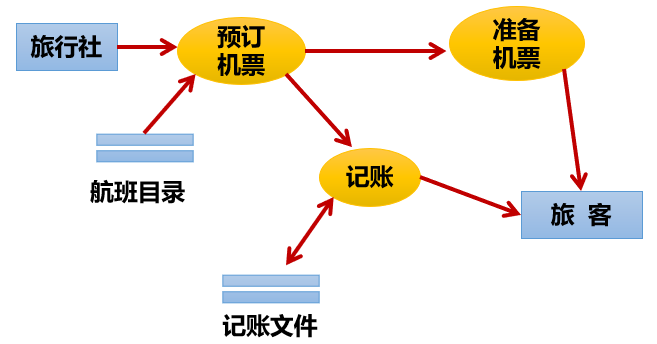
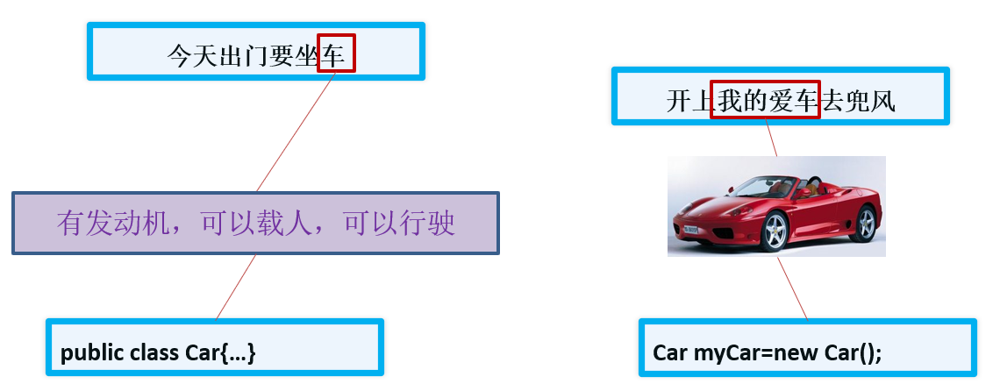
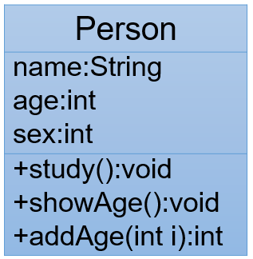
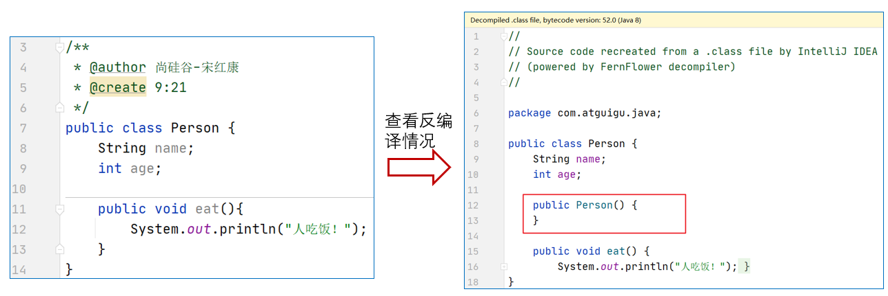
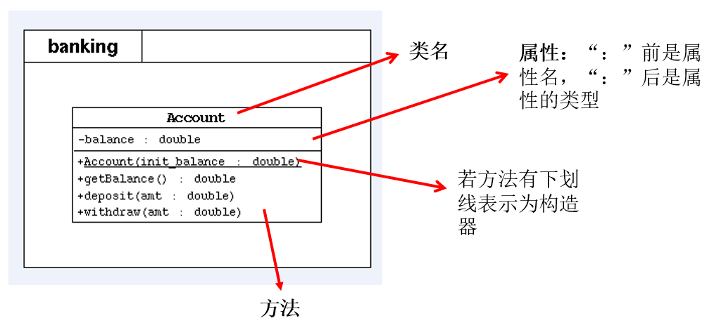
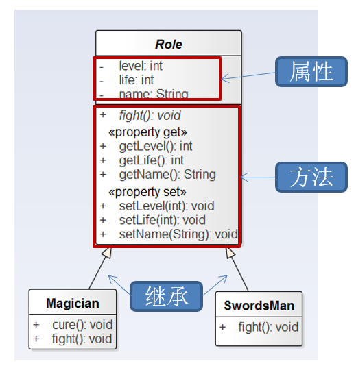

# 第06章_面向对象编程（基础）

讲师：尚硅谷-宋红康（江湖人称：康师傅）

官网：[http://www.atguigu.com](http://www.atguigu.com/)

***

## 本章专题与脉络


***

**学习面向对象内容的三条主线**

- Java类及类的成员：（重点）属性、方法、构造器；（熟悉）代码块、内部类
- 面向对象的特征：封装、继承、多态、（抽象）
- 其他关键字的使用：this、super、package、import、static、final、interface、abstract等

## 1. 面向对象编程概述(了解)

### 1.1 程序设计的思路

面向对象，是软件开发中的一类编程风格、开发范式。除了`面向对象`，还有`面向过程`、`指令式编程`和`函数式编程`。在所有的编程范式中，我们接触最多的还是面向过程和面向对象两种。

> 类比：史书类型
>
> - 纪传体：以人物传记为中心，“本纪”叙述帝王，“世家”记叙王侯封国和特殊人物，“列传”记叙民间人物。
> - 编年体：按年、月、日顺序编写。
> - 国别体：是一部分国记事的历史散文，分载多国历史。

早期先有面向过程思想，随着软件规模的扩大，问题复杂性的提高，面向过程的`弊端`越来越明显，出现了面向对象思想并成为目前主流的方式。

**1. 面向过程的程序设计思想（Process-Oriented Programming）**，简称`POP`

- 关注的焦点是`过程`：过程就是操作数据的步骤。如果某个过程的实现代码重复出现，那么就可以把这个过程抽取为一个`函数`。这样就可以大大简化冗余代码，便于维护。
- 典型的语言：C语言
- 代码结构：以`函数`为组织单位。
- 是一种“`执行者思维`”，适合解决简单问题。扩展能力差、后期维护难度较大。

**2. 面向对象的程序设计思想（ Object Oriented Programming）**，简称`OOP`

- 关注的焦点是`类`：在计算机程序设计过程中，参照现实中事物，将事物的属性特征、行为特征抽象出来，用类来表示。
- 典型的语言：Java、C#、C++、Python、Ruby和PHP等
- 代码结构：以`类`为组织单位。每种事物都具备自己的`属性`和`行为/功能`。
- 是一种“`设计者思维`”，适合解决复杂问题。代码扩展性强、可维护性高。

### 1.2 由实际问题考虑如何设计程序

**思考1：如何开车？**

面向过程思想思考问题时，我们首先思考“`怎么按步骤实现？`”并将步骤对应成方法，一步一步，最终完成。 这个适合`简单任务`，不需要`过多协作`的情况。针对如何开车，可以列出步骤：


面向过程适合简单、不需要协作的事务，重点关注如何执行。 

**思考2：如何造车？**

造车太复杂，需要`很多协作`才能完成。此时我们思考的是“`车怎么设计？`”，而不是“怎么按特定步骤造车的问题”。这就是思维方式的转变，前者就是面向对象思想。所以，面向对象(Oriented-Object)思想更契合人的思维模式。

用面向对象思想思考“如何设计车”：


自然地，我们就会从“车由什么组成”开始思考。发现，车由如下结构组成：


我们找轮胎厂完成制造轮胎的步骤，发动机厂完成制造发动机的步骤，...；这样，大家可以同时进行车的制造，最终进行组装，大大提高了效率。但是，具体到轮胎厂的一个流水线操作，仍然是有步骤的，还是离不开面向过程思维！

因此，**面向对象可以帮助我们从宏观上把握、从整体上分析整个系统。** 但是，具体到实现部分的微观操作（就是一个个方法），仍然需要面向过程的思路去处理。

> 注意：
>
> 我们千万不要把面向过程和面向对象对立起来。他们是相辅相成的。面向对象离不开面向过程！

**类比举例1：**


> 当需求单一，或者简单时，我们一步步去操作没问题，并且效率也挺高。
>
> 可随着需求的更改，功能的增多，发现需要面对每一个步骤很麻烦了，这时就开始思索，**能不能把这些步骤和功能进行封装，封装时根据不同的功能，进行不同的封装，功能类似的封装在一起。**这样结构就清晰了很多。用的时候，找到对应的类就可以了。这就是面向对象的思想。

**类比举例2：人把大象装进冰箱**

- 面向过程

  ```
  1.打开冰箱
  
  2.把大象装进冰箱
  
  3.把冰箱门关住
  ```
  
  面向对象
  
  ```
  人{
      打开（冰箱）{
  		冰箱.开门();	
      }
      操作(大象){
               大象.进入(冰箱);
      }
      关闭(冰箱){   
            冰箱.关门();     
      }
  }
  
  冰箱{
       开门(){ }  
       关门(){ }
  }
  
  大象{
       进入(冰箱){  }
  }
  ```

**练习：**抽象出下面系统中的“类”及其关系



### 1.3 如何掌握这种思想？


## 2. Java语言的基本元素：类和对象 

### 2.1 引入

人认识世界，其实就是面向对象的。比如，我们认识一下美人鱼（都没见过）


经过“仔细学习”，发现美人鱼通常具备一些特征：

- 女孩
- 有鱼尾
- 美丽

这个总结的过程，其实是`抽象化`的过程。抽象出来的美人鱼的特征，可以归纳为一个`美人鱼类`。而图片中的都是这个类呈现出来的`具体的对象`。

### 2.2 类和对象概述

`类(Class)`和`对象(Object)`是面向对象的核心概念。

**1、什么是类**

**类**：具有相同特征的事物的抽象描述，是`抽象的`、概念上的定义。

**2、什么是对象**

**对象**：实际存在的该类事物的`每个个体`，是`具体的`，因而也称为`实例(instance)`。


可以理解为：`类 => 抽象概念的人`；`对象 => 实实在在的某个人`

***


***



### 

**3、类与对象的关系错误理解**

```
曰：“白马非马，可乎？”
曰：“可。”
曰：“何哉？”
曰：“马者，所以命形也。白者，所以命色也。命色者，非命形也，故曰白马非马。”
```


### 2.3 类的成员概述

> 面向对象程序设计的重点是`类的设计`
>
> 类的设计，其实就是`类的成员的设计`

- 现实世界的生物体，大到鲸鱼，小到蚂蚁，都是由最基本的`细胞`构成的。同理，Java代码世界是由诸多个不同功能的`类`构成的。

  

- 现实生物世界中的细胞又是由什么构成的呢？细胞核、细胞质、… 
  
  Java中用类class来描述事物也是如此。类，是一组相关`属性`和`行为`的集合，这也是类最基本的两个成员。
  
  - **属性**：该类事物的状态信息。对应类中的`成员变量`
    - **成员变量 <=> 属性 <=> Field**
  - **行为**：该类事物要做什么操作，或者基于事物的状态能做什么。对应类中的`成员方法`
    - **(成员)方法 <=> 函数 <=> Method**


- 举例：


### 2.4 面向对象完成功能的三步骤（重要）

#### 步骤1：类的定义

类的定义使用关键字：class。格式如下：

```java
[修饰符] class 类名{
	属性声明;
    方法声明;
}
```

举例1：

```java
public class Person{
    //声明属性age
    int age ;	                   
    
    //声明方法showAge()
    public void eat() {        
	    System.out.println("人吃饭");
    }
}

```

举例2：

```java
public class Dog{
    //声明属性
	String type; //种类
	String nickName; //昵称
	String hostName; //主人名称
	
    //声明方法
	public void eat(){ //吃东西
		System.out.println("狗狗进食");		
	}
}
```

```java
public class Person{
    String name;
    char gender;
    Dog dog;
    
    //喂宠物
    public void feed(){
        dog.eat();
    }
}
```

#### 步骤2：对象的创建


- 创建对象，使用关键字：**new**
- 创建对象语法： 

```java
//方式1：给创建的对象命名
//把创建的对象用一个引用数据类型的变量保存起来，这样就可以反复使用这个对象了
类名 对象名 = new 类名();

//方式2：
new 类名()//也称为匿名对象

```

- 举例：

```java
class PersonTest{
	public static void main(String[] args){
		//创建Person类的对象
		Person per = new Person();
		//创建Dog类的对象
		Dog dog = new Dog();
	}
}
```

#### 步骤3：对象调用属性或方法

- 对象是类的一个**实例**，必然具备该类事物的属性和行为（即方法）。

- 使用"`对象名.属性`" 或 "`对象名.方法`"的方式访问对象成员（包括属性和方法）

举例1：

```java
//声明Animal类
public class Animal { //动物类
    public int legs;

    public void eat() {
        System.out.println("Eating.");
    }

    public void move() {
        System.out.println("Move.");
    }
}
```

```java
//声明测试类
public class AnimalTest {
    public static void main(String args[]) {
        //创建对象
        Animal xb = new Animal();
        xb.legs = 4;//访问属性
        System.out.println(xb.legs);
        xb.eat();//访问方法
        xb.move();//访问方法
    }
}
```

图示理解：

举例2：针对前面步骤1的举例2：类的实例化（创建类的对象）

```java
public class Game{
    public static void main(String[] args){
        Person p = new Person();
        //通过Person对象调用属性
        p.name = "康师傅";
        p.gender = '男';
        p.dog = new Dog(); //给Person对象的dog属性赋值
        
        //给Person对象的dog属性的type、nickname属性赋值
        p.dog.type = "柯基犬";
        p.dog.nickName = "小白";
        
        //通过Person对象调用方法
        p.feed();
    }
}
```

### 2.5 匿名对象 (anonymous object)

- 我们也可以不定义对象的句柄，而直接调用这个对象的方法。这样的对象叫做匿名对象。
  - 如：new Person().shout(); 

- 使用情况
  - 如果一个对象只需要进行一次方法调用，那么就可以使用匿名对象。 
  - 我们经常将匿名对象作为实参传递给一个方法调用。 

## 3. 对象的内存解析

### 3.1 JVM内存结构划分

HotSpot Java虚拟机的架构图如下。其中我们主要关心的是运行时数据区部分（Runtime Data Area）。


其中：

`堆（Heap）`：此内存区域的唯一目的就是存放对象实例，几乎所有的对象实例都在这里分配内存。这一点在Java虚拟机规范中的描述是：**所有的对象实例以及数组**都要在堆上分配。

`栈（Stack）`：是指虚拟机栈。虚拟机栈用于存储局部变量等。局部变量表存放了编译期可知长度的各种基本数据类型（boolean、byte、char、short、int、float、long、double）、对象引用（reference类型，它不等同于对象本身，是对象在堆内存的首地址）。 方法执行完，自动释放。

`方法区（Method Area）`：用于存储已被虚拟机加载的类信息、常量、静态变量、即时编译器编译后的代码等数据。

### 3.2 对象内存解析

举例：

```java
class Person { //类：人
    String name;
    int age;
    boolean isMale;
}

public class PersonTest { //测试类
    public static void main(String[] args) {
        Person p1 = new Person();
        p1.name = "赵同学";
        p1.age = 20;
        p1.isMale = true;

        Person p2 = new Person();
        p2.age = 10;

        Person p3 = p1;
        p3.name = "郭同学";
    }
}
```

内存解析图：


> 说明：
>
> - 堆：凡是new出来的结构(对象、数组)都放在堆空间中。
> - 对象的属性存放在堆空间中。
> - 创建一个类的多个对象（比如p1、p2），则每个对象都拥有当前类的一套"副本"（即属性）。当通过一个对象修改其属性时，不会影响其它对象此属性的值。
> - 当声明一个新的变量使用现有的对象进行赋值时（比如p3 = p1），此时并没有在堆空间中创建新的对象。而是两个变量共同指向了堆空间中同一个对象。当通过一个对象修改属性时，会影响另外一个对象对此属性的调用。

**面试题：对象名中存储的是什么呢？**

答：对象地址

```java
public class StudentTest{
    public static void main(String[] args){
        System.out.println(new Student());//Student@7852e922

        Student stu = new Student();
        System.out.println(stu);//Student@4e25154f
        
        int[] arr = new int[5];
		System.out.println(arr);//[I@70dea4e
    }
}
```

直接打印对象名和数组名都是显示“类型@对象的hashCode值"，所以说**类、数组都是引用数据类型，引用数据类型的变量中存储的是对象的地址，或者说指向堆中对象的首地址。**


### 3.3 练习

根据代码，画出内存图

```java
class Car {
    String color = "red";
    int num = 4;

    void show() {
        System.out.println("color=" + color + ",num=" + num);
    }
}

class CarTest {
    public static void main(String[] args) {
        Car c1 = new Car();   //建立对象c1
        Car c2 = new Car();   //建立对象c2
        c1.color = "blue";   //对对象的属性进行修改
        c1.show();   //使用对象的方法
        c2.show();
    }
}
```

## 4. 类的成员之一：成员变量(field)

### 4.1 如何声明成员变量

- 语法格式：

```java
[修饰符1] class 类名{
    [修饰符2] 数据类型 成员变量名 [= 初始化值]; 
}
```

- 说明：
  - 位置要求：必须在类中，方法外
  - 修饰符2(暂不考虑)
    - 常用的权限修饰符有：private、缺省、protected、public
    - 其他修饰符：static、final 
  - 数据类型
    - 任何基本数据类型(如int、Boolean) 或 任何引用数据类型。
  - 成员变量名
    - 属于标识符，符合命名规则和规范即可。
  - 初始化值
    - 根据情况，可以显式赋值；也可以不赋值，使用默认值

示例：

```java
public class Person{
	private int age;             //声明private变量 age
	public String name = “Lila”;    //声明public变量 name
}

```

### 4.2 成员变量 vs 局部变量

**1、变量的分类：成员变量与局部变量**

- 在方法体外，类体内声明的变量称为成员变量。
- 在方法体内部等位置声明的变量称为局部变量。


> 其中，static可以将成员变量分为两大类，静态变量和非静态变量。其中静态变量又称为类变量，非静态变量又称为实例变量或者属性。接下来先学习实例变量。
>

**2、成员变量 与 局部变量 的对比**

- 相同点
  - 变量声明的格式相同： `数据类型  变量名 = 初始化值`
   * 			变量必须先声明、后初始化、再使用。
   - 变量都有其对应的作用域。只在其作用域内是有效的

- 不同点

1、声明位置和方式
（1）实例变量：在类中方法外
（2）局部变量：在方法体{}中或方法的形参列表、代码块中

2、在内存中存储的位置不同
（1）实例变量：堆
（2）局部变量：栈

3、生命周期
（1）实例变量：和对象的生命周期一样，随着对象的创建而存在，随着对象被GC回收而消亡，
			而且每一个对象的实例变量是独立的。
（2）局部变量：和方法调用的生命周期一样，每一次方法被调用而在存在，随着方法执行的结束而消亡，
			而且每一次方法调用都是独立。

4、作用域
（1）实例变量：通过对象就可以使用，本类中直接调用，其他类中“对象.实例变量”
（2）局部变量：出了作用域就不能使用

5、修饰符（后面来讲）
（1）实例变量：public,protected,private,final,volatile,transient等
（2）局部变量：final

6、默认值
（1）实例变量：有默认值
（2）局部变量：没有，必须手动初始化。其中的形参比较特殊，靠实参给它初始化。


**3、对象属性的默认初始化赋值**

当一个对象被创建时，会对其中各种类型的成员变量自动进行初始化赋值。


**4、举例**

```java
class Person {//人类
    //1.属性
    String name;//姓名
    int age = 1;//年龄
    boolean isMale;//是否是男性

    public void show(String nation) {
        //nation:局部变量
        String color;//color:局部变量
        color = "yellow";
    }
}

//测试类
class PersonTest {
    public static void main(String[] args) {
        Person p = new Person();
        p.show("CHN");
    }
}
```


## 5. 类的成员之二：方法(method)

### 5.1 方法的引入


《街霸》游戏中，每次人物出拳、出脚或跳跃等动作都需要编写50-80行的代码，在每次出拳、出脚或跳跃的地方都需要重复地编写这50-80行代码，这样程序会变得`很臃肿`，可读性也非常差。为了解决代码重复编写的问题，可以将出拳、出脚或跳跃的代码提取出来放在一个{}中，并为这段代码起个名字，这样在每次的出拳、出脚或跳跃的地方通过这个名字来调用这个{}的代码就可以了。

上述过程中，所提取出来的代码可以被看作是程序中定义的一个方法，程序在需要出拳、出脚或跳跃时调用该方法即可。

### 5.2 方法(method、函数)的理解

- `方法`是类或对象行为特征的抽象，用来完成某个功能操作。在某些语言中也称为`函数`或`过程`。 

- 将功能封装为方法的目的是，可以`实现代码重用，减少冗余，简化代码`

- Java里的方法`不能独立存在`，所有的方法必须定义在类里。
- 举例1：
  - Math.random()的random()方法
  - Math.sqrt(x)的sqrt(x)方法
  - System.out.println(x)的println(x)方法
  - new Scanner(System.in).nextInt()的nextInt()方法
  - Arrays类中的binarySearch()方法、sort()方法、equals()方法
  
- 举例2：

  ```java
  public class Person{
      private int age;
      public int getAge()  {  //声明方法getAge()
  		return age; 
      }
      public void setAge(int i) {  //声明方法setAge
  		age = i;        //将参数i的值赋给类的成员变量age
      }
  }
  
  ```

### 5.3 如何声明方法

**1、声明方法的语法格式**

```java
[修饰符] 返回值类型 方法名([形参列表])[throws 异常列表]{
        方法体的功能代码
}
```

（1）一个完整的方法 = 方法头 + 方法体。

- 方法头就是`[修饰符] 返回值类型 方法名([形参列表])[throws 异常列表]`，也称为`方法签名`。通常调用方法时只需要关注方法头就可以，从方法头可以看出这个方法的功能和调用格式。
- 方法体就是方法被调用后要执行的代码。对于调用者来说，不了解方法体如何实现的，并不影响方法的使用。

**（2）方法头可能包含5个部分**

- **修饰符**：可选的。方法的修饰符也有很多，例如：public、protected、private、static、abstract、native、final、synchronized等，后面会一一学习。
  - 其中，权限修饰符有public、protected、private。在讲封装性之前，我们先默认使用pulbic修饰方法。
  - 其中，根据是否有static，可以将方法分为静态方法和非静态方法。其中静态方法又称为类方法，非静态方法又称为实例方法。咱们在讲static前先学习实例方法。

- **返回值类型**： 表示方法运行的结果的数据类型，方法执行后将结果返回到调用者。
  - 无返回值，则声明：void
  - 有返回值，则声明出返回值类型（可以是任意类型）。与方法体中“`return 返回值`”搭配使用

- **方法名**：属于标识符，命名时遵循标识符命名规则和规范，“见名知意”

- **形参列表**：表示完成方法体功能时需要外部提供的数据列表。可以包含零个，一个或多个参数。
  - 无论是否有参数，()不能省略
  - 如果有参数，每一个参数都要指定数据类型和参数名，多个参数之间使用逗号分隔，例如：
    - 一个参数： (数据类型  参数名)
    - 二个参数： (数据类型1  参数1,  数据类型2  参数2) 
  - 参数的类型可以是基本数据类型、引用数据类型

- **throws 异常列表**：可选，在【第09章-异常处理】章节再讲

**（3）方法体**：方法体必须有{}括起来，在{}中编写完成方法功能的代码

**（4）关于方法体中return语句的说明：**

- return语句的作用是结束方法的执行，并将方法的结果返回去

- 如果返回值类型不是void，方法体中必须保证一定有 return 返回值; 语句，并且要求该返回值结果的类型与声明的返回值类型一致或兼容。
- 如果返回值类型为void时，方法体中可以没有return语句，如果要用return语句提前结束方法的执行，那么return后面不能跟返回值，直接写return ; 就可以。
- return语句后面就不能再写其他代码了，否则会报错：Unreachable code

补充：方法的分类：按照是否有形参及返回值


**2、类比举例**


**3、代码示例：**

```java
package com.atguigu.test04.method;

/**
 * 方法定义案例演示
 */
public class MethodDefineDemo {
    /**
     * 无参无返回值方法的演示
     */
    public void sayHello(){
        System.out.println("hello");
    }

    /**
     * 有参无返回值方法的演示
     * @param length int 第一个参数，表示矩形的长
     * @param width int 第二个参数，表示矩形的宽
     * @param sign char 第三个参数，表示填充矩形图形的符号
     */
    public void printRectangle(int length, int width, char sign){
        for (int i = 1; i <= length ; i++) {
            for(int j=1; j <= width; j++){
                System.out.print(sign);
            }
            System.out.println();
        }
    }

    /**
     * 无参有返回值方法的演示
     * @return
     */
    public int getIntBetweenOneToHundred(){
        return (int)(Math.random()*100+1);
    }
    
    /**
     * 有参有返回值方法的演示
     * @param a int 第一个参数，要比较大小的整数之一
     * @param b int 第二个参数，要比较大小的整数之二
     * @return int 比较大小的两个整数中较大者的值
     */
    public int max(int a, int b){
        return a > b ? a : b;
    }
}

```

### 5.4 如何调用实例方法

方法通过方法名被调用，且只有被调用才会执行。

**1、方法调用语法格式**

```java
对象.方法名([实参列表])
```

**2、示例**

举例1：

```java
package com.atguigu.test04.method;

/**
 * 方法调用案例演示
 */
public class MethodInvokeDemo {
    public static void main(String[] args) {
        //创建对象
        MethodDefineDemo md = new MethodDefineDemo();

        System.out.println("-----------------------方法调用演示-------------------------");

        //调用MethodDefineDemo类中无参无返回值的方法sayHello
        md.sayHello();
        md.sayHello();
        md.sayHello();
        //调用一次，执行一次，不调用不执行

        System.out.println("------------------------------------------------");
        //调用MethodDefineDemo类中有参无返回值的方法printRectangle
        md.printRectangle(5,10,'@');

        System.out.println("------------------------------------------------");
        //调用MethodDefineDemo类中无参有返回值的方法getIntBetweenOneToHundred
        md.getIntBetweenOneToHundred();//语法没问题，就是结果丢失

        int num = md.getIntBetweenOneToHundred();
        System.out.println("num = " + num);

        System.out.println(md.getIntBetweenOneToHundred());
        //上面的代码调用了getIntBetweenOneToHundred三次，这个方法执行了三次

        System.out.println("------------------------------------------------");
        //调用MethodDefineDemo类中有参有返回值的方法max
        md.max(3,6);//语法没问题，就是结果丢失
        
        int bigger = md.max(5,6);
        System.out.println("bigger = " + bigger);

        System.out.println("8,3中较大者是：" + md.max(8,9));
    }
}

```

举例2：

```java
//1、创建Scanner的对象
Scanner input = new Scanner(System.in);//System.in默认代表键盘输入

//2、提示输入xx
System.out.print("请输入一个整数："); //对象.非静态方法(实参列表)

//3、接收输入内容
int num = input.nextInt();  //对象.非静态方法()
```

### 5.5  使用的注意点

（1）必须先声明后使用，且方法必须定义在类的内部

（2）调用一次就执行一次，不调用不执行。

（3）方法中可以调用类中的方法或属性，不可以在方法内部定义方法。

正确示例：

```java
类{
    方法1(){
        
    }
    方法2(){
        
    }
}
```

错误示例：

```java
类{
    方法1(){
        方法2(){  //位置错误
        
   		}
    }
}
```

### 5.6 关键字return的使用

- return在方法中的作用：
  - 作用1：结束一个方法
  - 作用2：结束一个方法的同时，可以返回数据给方法的调用者 
- 注意点：在return关键字的直接后面不能声明执行语句

### 5.7 方法调用内存分析

- 方法`没有被调用`的时候，都在`方法区`中的字节码文件(.class)中存储。
- 方法`被调用`的时候，需要进入到`栈内存`中运行。方法每调用一次就会在栈中有一个`入栈`动作，即给当前方法开辟一块独立的内存区域，用于存储当前方法的局部变量的值。
- 当方法执行结束后，会释放该内存，称为`出栈`，如果方法有返回值，就会把结果返回调用处，如果没有返回值，就直接结束，回到调用处继续执行下一条指令。

- 栈结构：先进后出，后进先出。

举例分析：

```java
public class Person {
    public static void main(String[] args) {
        Person p1 = new Person();
        p1.eat();

    }
    public static void eat() {
        sleep();
        System.out.println("人：吃饭");
    }
    public static void sleep(){
        System.out.println("人：睡觉");
        doSport();
    }
    public static void doSport(){
        System.out.println("人：运动");
    }
}
```

内存分析：


### 5.8 练习

**练习1：**创建一个Person类，其定义如下：



要求：

(1)创建Person类的对象，设置该对象的name、age和sex属性，调用study方法，输出字符串“studying”，调用showAge()方法显示age值，调用addAge()方法给对象的age属性值增加2岁。
(2)创建第二个对象，执行上述操作，体会同一个类的不同对象之间的关系。

**练习2：**利用面向对象的编程方法，设计圆类Circle，包含属性（半径）和计算圆面积的方法。定义测试类，创建该Circle类的对象，并进行测试。

**练习3：**

3.1 编写程序，声明一个method方法，在方法中打印一个`10*8的*型矩形`，在main方法中调用该方法。

3.2 修改上一个程序，在method方法中，除打印一个`10*8的*型矩形`外，再计算该矩形的面积，并将其作为方法返回值。在main方法中调用该方法，接收返回的面积值并打印。

3.3 修改上一个程序，在method方法提供m和n两个参数，方法中打印一个`m*n的*型矩形`，并计算该矩形的面积， 将其作为方法返回值。在main方法中调用该方法，接收返回的面积值并打印。

**练习4：**声明一个日期类型MyDate：有属性：年year,月month，日day。创建2个日期对象，分别赋值为：你的出生日期，你对象的出生日期，并显示信息。

**练习5（课下练习）：**用面向对象的方式编写用户登录程序。

用户类：
- 属性：用户名，密码
- 方法：登录

界面类：
- 在界面类中添加main方法，接受用户输入，并调用用户类的登录方法进行验证。
  - 输出：
    - 登录失败：用户名或密码错误！
    - 登录成功：欢迎你，用户名！

参考代码：

```java
public class User {
    String name;
    String password;//密码

    /**
     * 实现用户登录的判断
     *
     * @param inputName 输入的用户名
     * @param inputPwd  输入的密码
     */
    public void login(String inputName,String inputPwd){
        if(name.equals(inputName) && password.equals(inputPwd)){
            System.out.println("登录成功：欢迎你，" + name);
        }else{
            System.out.println("登录失败：用户名或密码错误！");
        }
    }

    /**
     *  实现用户登录的判断
     * @param inputName 输入的用户名
     * @param inputPwd 输入的密码
     * @return true:登录成功  false:登录失败
     */
    public boolean login1(String inputName,String inputPwd){
//        if(name.equals(inputName) && password.equals(inputPwd)){
//            return true;
//        }else{
//            return false;
//        }

        //简化为：
        return name.equals(inputName) && password.equals(inputPwd);
    }

}
```

```java
/**
 *
 * 用户界面类UserInterface：
 *
 * - 在用户界面类中添加main方法，接受用户输入，并调用用户类的登录方法进行验证。
 * - 输出：
 *     - 登录失败：用户名或密码错误！
 *     - 登录成功：欢迎你，用户名！
 *
 * @author 尚硅谷-宋红康
 * @create 9:58
 */
public class UserInterface {
    public static void main(String[] args) {

        User u1 = new User();
        u1.name = "Tom";
        u1.password = "abc123";


        Scanner scanner = new Scanner(System.in);
        System.out.print("请输入用户名：");
        String name = scanner.next();
        System.out.print("请输入密码：");
        String pwd = scanner.next();

        //演示1：
//        u1.login(name,pwd);

        //演示2：
        boolean isLogin = u1.login1(name, pwd);
        if(isLogin){
            System.out.println("登录成功：欢迎你，" + u1.name);
        }else{
            System.out.println("登录失败：用户名或密码错误！");
        }

        scanner.close();
    }
}
```

## 6. 对象数组

数组的元素可以是基本数据类型，也可以是引用数据类型。当元素是引用类型中的类时，我们称为对象数组。

**1、案例**

定义类Student，包含三个属性：学号number(int)，年级state(int)，成绩score(int)。 创建20个学生对象，学号为1到20，年级和成绩都由随机数确定。

问题一：打印出3年级(state值为3）的学生信息。

问题二：使用冒泡排序按学生成绩排序，并遍历所有学生信息

提示：

1) 生成随机数：Math.random()，返回值类型double; 

2) 四舍五入取整：Math.round(double d)，返回值类型long。

```java
/*
 * 定义类Student，包含三个属性：学号number(int)，年级state(int)，成绩score(int)。
 */
public class Student {
	
	int number;//学号
	int state;//年级
	int score;//成绩
	
	
	public void info(){
		System.out.println("number : " + number 
				+ ",state : " + state + ",score : " + score);
	}
	
}
```

```java
public class StudentTest {

	public static void main(String[] args) {

		// Student s1 = new Student();
		// s1.number = 1;
		// s1.state = (int)(Math.random() * 6 + 1);//[1,6]
		// s1.score = (int)(Math.random() * 101);//[0,100]
		//
		// Student s2 = new Student();
		// s2.number = 2;
		// s2.state = (int)(Math.random() * 6 + 1);//[1,6]
		// s2.score = (int)(Math.random() * 101);//[0,100]
		//
		// //....
		// 对象数组
		// String[] arr = new String[10];
		// 数组的创建
		Student[] students = new Student[20];
		// 通过循环结构给数组的属性赋值
		for (int i = 0; i < students.length; i++) {
			// 数组元素的赋值
			students[i] = new Student();
			// 数组元素是一个对象，给对象的各个属性赋值
			students[i].number = (i + 1);
			students[i].state = (int) (Math.random() * 6 + 1);// [1,6]
			students[i].score = (int) (Math.random() * 101);// [0,100]
		}

		// 问题一：打印出3年级(state值为3）的学生信息。
		for (int i = 0; i < students.length; i++) {

			if (students[i].state == 3) {
				students[i].info();
				
			}

		}
		System.out.println("******************************");
		// 问题二：使用冒泡排序按学生成绩排序，并遍历所有学生信息
		// 排序前
		for (int i = 0; i < students.length; i++) {		
			students[i].info();
		}

		System.out.println();
		// 排序：
		for (int i = 0; i < students.length - 1; i++) {
			for (int j = 0; j < students.length - 1 - i; j++) {
				if (students[j].score > students[j + 1].score) {
					Student temp = students[j];
					students[j] = students[j + 1];
					students[j + 1] = temp;
				}
			}
		}

		// 排序后：
		for (int i = 0; i < students.length; i++) {
			students[i].info();
		}

	}

}
```

内存解析：


**2、注意点**

对象数组，首先要创建数组对象本身，即确定数组的长度，然后再创建每一个元素对象，如果不创建，数组的元素的默认值就是`null`，所以很容易出现`空指针异常NullPointerException`。

**3、练习**

（1）定义矩形类Rectangle，包含长、宽属性，area()返回矩形面积的方法，perimeter()返回矩形周长的方法，String getInfo()返回圆对象的详细信息（如：长、宽、面积、周长等数据）的方法

（2）在测试类中创建长度为3的Rectangle[]数组，用来装3个矩形对象，并给3个矩形对象的长分别赋值为10,20,30，宽分别赋值为5,15,25，遍历输出

```java
package com.atguigu.test08.array;

public class Rectangle {
    double length;
    double width;

    public double area(){//面积
        return length * width;
    }

    public double perimeter(){//周长
        return 2 * (length + width);
    }

    public String getInfo(){
        return "长：" + length +
                "，宽：" + width +
                "，面积：" + area() +
                "，周长：" + perimeter();
    }
}

```

```java
package com.atguigu.test08.array;

public class ObjectArrayTest {
    public static void main(String[] args) {
        //声明并创建一个长度为3的矩形对象数组
        Rectangle[] array = new Rectangle[3];

        //创建3个矩形对象，并为对象的实例变量赋值，
        //3个矩形对象的长分别是10,20,30
        //3个矩形对象的宽分别是5,15,25
        //调用矩形对象的getInfo()返回对象信息后输出
        for (int i = 0; i < array.length; i++) {
            //创建矩形对象
            array[i] = new Rectangle();

            //为矩形对象的成员变量赋值
            array[i].length = (i+1) * 10;
            array[i].width = (2*i+1) * 5;

            //获取并输出对象对象的信息
            System.out.println(array[i].getInfo());
        }
    }
}
```

内存解析：


## 7. 再谈方法

### 7.1 方法的重载（overload）

#### 7.1.1 概念及特点

- **方法重载**：在同一个类中，允许存在一个以上的同名方法，只要它们的参数列表不同即可。
  - 参数列表不同，意味着参数个数或参数类型的不同
- **重载的特点**：<u>与修饰符、返回值类型无关，只看参数列表，且参数列表必须不同</u>。(参数个数或参数类型)。调用时，根据方法参数列表的不同来区别。
- **重载方法调用**：JVM通过方法的参数列表，调用匹配的方法。
  - 先找个数、类型最匹配的
  - 再找个数和类型可以兼容的，如果同时多个方法可以兼容将会报错

> 如何判断两个方法是相同的呢？ 
>
> 方法名相同，且形参列表相同。（形参列表相同指的是参数个数和类型都相同，与形参名没关系）
>
> 
>
> 要求：在一个类中，允许存在多个相同名字的方法，只要他们的形参列表不同即可。
>
> 编译器是如何确定调用的某个具体的方法呢？先通过方法名确定了一波重载的方法，进而通过不同的形参列表，确定具体的某一个方法。

#### 7.1.2 示例

举例1：

```java
//System.out.println()方法就是典型的重载方法，其内部的声明形式如下：
public class PrintStream {
    public void println(byte x)
	public void println(short x)
	public void println(int x)
	public void println(long x)
	public void println(float x)
	public void println(double x)
	public void println(char x)
	public void println(double x)
	public void println()

}

public class HelloWorld{
    public static void main(String[] args) {
        System.out.println(3);
        System.out.println(1.2f);
        System.out.println("hello!");
    }
}

```

​	举例2：**存在自动类型提升**
`add(10,20)   如果不存在第一个add(int x,int y)，形参会按照自动类型提升匹配到add(double x,double y)`

```java
//返回两个整数的和
public int add(int x,int y){
    return x+y;
}

//返回三个整数的和
public int add(int x,int y,int z){
    return x+y+z;
}
//返回两个小数的和
public double add(double x,double y){
    return x+y;
}
```

​	举例3：方法的重载和返回值类型无关

```java
public class MathTools {
    //以下方法不是重载，会报错
    public int getOneToHundred(){
    	return (int)(Math.random()*100);
    }
    
    public double getOneToHundred(){
    	return Math.random()*100;
    }
}

```

#### 7.1.3 练习

**练习1：**判 断与`void show(int a,char b,double c){}`构成重载的有：

```java
a)void show(int x,char y,double z){}     // no

b)int show(int a,double c,char b){}      // yes

c) void show(int a,double c,char b){}    // yes

d) boolean show(int c,char b){}          // yes

e) void show(double c){}                 // yes

f) double show(int x,char y,double z){}  // no   和返回值无关

g) void shows(){double c}                // no   名称不一样
```

**练习2**：编写程序，定义三个重载方法并调用。

- 方法名为mOL。

- 三个方法分别接收一个int参数、两个int参数、一个字符串参数。分别执行平方运算并输出结果，相乘并输出结果，输出字符串信息。

- 在主类的main ()方法中分别用参数区别调用三个方法。

**练习3**：定义三个重载方法max()，第一个方法求两个int值中的最大值，第二个方法求两个double值中的最大值，第三个方法求三个double值中的最大值，并分别调用三个方法。


#### 7.1.4 面试题

```java
public class InterviewTest {
    public static void main(String[] args) {

        //public void println(Object x)
        int[] arr = new int[]{1, 2, 3}; 
        System.out.println(arr);//地址值

        //public void println(char[] x)
        char[] arr1 = new char[]{'a', 'b', 'c', 'd', 'e'};
        System.out.println(arr1);//abc

        // public void println(Object x)
        boolean[] arr2 = new boolean[]{false, true, true};
        System.out.println(arr2);//地址值

    }
}
```


### 7.2 可变个数的形参

在**JDK 5.0 **中提供了**Varargs(**variable number of arguments**)**机制。即当定义一个方法时，形参的类型可以确定，但是形参的个数不确定，那么可以考虑使用可变个数的形参。

**格式：**

```
方法名(参数的类型名 ...参数名)
```

**举例：**

```java
//JDK 5.0以前：采用数组形参来定义方法，传入多个同一类型变量
public static void test(int a ,String[] books);

//JDK5.0：采用可变个数形参来定义方法，传入多个同一类型变量
public static void test(int a ,String...books);

```

**特点：**

1. 可变参数：方法参数部分指定类型的参数个数是可变多个：0个，1个或多个

2. 可变个数形参的方法与同名的方法之间，彼此构成重载

3. 可变参数方法的使用与方法参数部分使用数组是一致的，二者不能同时声明，否则报错。

4. 方法的参数部分有可变形参，需要放在形参声明的最后

5. 在一个方法的形参中，最多只能声明一个可变个数的形参

**案例分析：**

案例1：n个字符串进行拼接，每一个字符串之间使用某字符进行分割，如果没有传入字符串，那么返回空字符串""

```java
public class StringTools {
    String concat(char seperator, String... args){
        String str = "";
        for (int i = 0; i < args.length; i++) {
            if(i==0){
                str += args[i];
            }else{
                str += seperator + args[i];
            }
        }
        return str;
    }
}
```

```java
package com.atguigu.test05.param;

public class StringToolsTest {
    public static void main(String[] args) {
        StringTools tools = new StringTools();

        System.out.println(tools.concat('-'));
        System.out.println(tools.concat('-',"hello"));
        System.out.println(tools.concat('-',"hello","world"));
        System.out.println(tools.concat('-',"hello","world","java"));
    }
}
```

案例2：求n个整数的和

```java
public class NumberTools {
    public int total(int[] nums){
        int sum = 0;
        for (int i = 0; i < nums.length; i++) {
            sum += nums[i];
        }
        return sum;
    }

    public int sum(int... nums){
        int sum = 0;
        for (int i = 0; i < nums.length; i++) {
            sum += nums[i];
        }
        return sum;
    }
}
```

```java
public class TestVarParam {
    public static void main(String[] args) {
        NumberTools tools = new NumberTools();

        System.out.println(tools.sum());//0个实参
        System.out.println(tools.sum(5));//1个实参
        System.out.println(tools.sum(5,6,2,4));//4个实参
        System.out.println(tools.sum(new int[]{5,6,2,4}));//传入数组实参

        System.out.println("------------------------------------");
        System.out.println(tools.total(new int[]{}));//0个元素的数组
        System.out.println(tools.total(new int[]{5}));//1个元素的数组
        System.out.println(tools.total(new int[]{5,6,2,4}));//传入数组实参
    }
}
```

案例3：如下的方法彼此构成重载

```java
public class MathTools {
    //求两个整数的最大值
    public int max(int a,int b){
        return a>b?a:b;
    }

    //求两个小数的最大值
    public double max(double a, double b){
        return a>b?a:b;
    }

    //求三个整数的最大值
    public int max(int a, int b, int c){
        return max(max(a,b),c);
    }
    
    //求n个整数的最大值
    public int max(int... nums){
        int max = nums[0];//如果没有传入整数，或者传入null，这句代码会报异常
        for (int i = 1; i < nums.length; i++) {
            if(nums[i] > max){
                max = nums[i];
            }
        }
        return max;
    }
    /*    //求n整数的最大值
    public int max(int[] nums){  //编译就报错，与(int... nums)无法区分
        int max = nums[0];//如果没有传入整数，或者传入null，这句代码会报异常
        for (int i = 1; i < nums.length; i++) {
            if(nums[i] > max){
                max = nums[i];
            }
        }
        return max;
    }*/

/*    //求n整数的最大值
    public int max(int first, int... nums){  //当前类不报错，但是调用时会引起多个方法同时匹配
        int max = first;
        for (int i = 0; i < nums.length; i++) {
            if(nums[i] > max){
                max = nums[i];
            }
        }
        return max;
    }*/
}
```

### 7.3 方法的参数传递机制

#### 7.3.1 形参和实参

* 形参（formal parameter）：在定义方法时，方法名后面括号()中声明的变量称为形式参数，简称形参。
* 实参（actual parameter）：在调用方法时，方法名后面括号()中的使用的值/变量/表达式称为实际参数，简称实参。

#### 7.3.2 参数传递机制：值传递

Java里方法的参数传递方式只有一种：`值传递`。 即将实际参数值的副本（复制品）传入方法内，而参数本身不受影响。

- 形参是**基本数据**类型：将实参基本数据类型变量的**“数据值”**传递给形参 -- 数据值传递

- 形参是**引用数据**类型：将实参引用数据类型变量的“地址值”传递给形参 -- 地址值传递

#### 7.3.3 举例

**1、形参是基本数据类型**

案例：编写方法，交换两个整型变量的值

```java
public class ValueTransferTest1 {
	public static void main(String[] args) {
		int m = 10;
		int n = 20;
		
		System.out.println("m = " + m + ", n = " + n);
		//交换m和n的值
//		int temp = m;
//		m = n;
//		n = temp;
		
		ValueTransferTest1 test = new ValueTransferTest1();
		test.swap(m, n);
		
		System.out.println("m = " + m + ", n = " + n);
	}
	
	public void swap(int m,int n){
		int temp = m;
		m = n;
		n = temp;
	}
	
}
```

内存解析：


**2、形参是引用数据类型**

```java
public class ValueTransferTest2 {
	public static void main(String[] args) {
		
		Data d1 = new Data();
		d1.m = 10;
		d1.n = 20;
		
		System.out.println("m = " + d1.m + ", n = " + d1.n);
		
		//实现 换序
		
		ValueTransferTest2 test = new ValueTransferTest2();
		test.swap(d1);
		
		System.out.println("m = " + d1.m + ", n = " + d1.n);
		
	}
	
	public void swap(Data data){
		int temp = data.m;
		data.m = data.n;
		data.n = temp;
	}
}
```

```java
class Data{
	int m;
	int n;
}
```

内存解析：


**3、形参数不可变对象**

不可变对象：String Integer、LocalDateTime等

```java
public class TestExam {
	public static void main(String[] args) {
		int i = 1;
		Integer j = new Integer(2);//包装类对象不可变
		Circle c = new Circle();
		change(i,j,c);
		System.out.println("i = " + i);//1
		System.out.println("j = " + j);//2
		System.out.println("c.radius = " + c.radius);//10.0
	}
	
	/*
	 * 方法的参数传递机制：
	 * （1）基本数据类型：形参的修改完全不影响实参
	 * （2）引用数据类型：通过形参修改对象的属性值，会影响实参的属性值
	 * 这类Integer等包装类对象是“不可变”对象，即一旦修改，就是新对象，和实参就无关了
	 */
	public static void change(int a ,Integer b,Circle c ){
		a += 10;
		b += 10;//等价于  b = new Integer(b+10);
		c.radius += 10;
		/*c = new Circle();
		c.radius+=10;*/
	}
}
class Circle{
	double radius;
}
```


#### 7.3.4 练习

练习1：判断如下程序输出的结果

```java
public class AssignNewObject {
    public void swap(MyData my){
        my = new MyData(); //考虑堆空间此新创建的对象，和main中的data对象是否有关
        int temp = my.x;
        my.x = my.y;
        my.y = temp;
     
    }

    public static void main(String[] args) {
        AssignNewObject tools = new AssignNewObject();
        
        MyData data = new MyData();
        data.x = 1;
        data.y = 2;
        System.out.println("交换之前：x = " + data.x +",y = " + data.y);//
        tools.swap(data);//调用完之后，x与y的值交换？
        System.out.println("交换之后：x = " + data.x +",y = " + data.y);//
    }
}

class MyData{
    int x ;
    int y;
}
```

练习2：如下操作是否可以实现数组排序

```java
public class ArrayTypeParam {

    //冒泡排序，实现数组从小到大排序
    public void sort(int[] arr){
        for (int i = 0; i < arr.length - 1; i++) {
            for (int j = 0; j < arr.length - 1 - i; j++) {
                if(arr[j] > arr[j+1]){
                    int temp = arr[j];
                    arr[j] = arr[j+1];
                    arr[j+1] = temp;
                }
            }
        }
    }
    //打印数组的元素
    public void print(int[] arr){
        for (int i = 0; i < arr.length; i++) {
            System.out.print(arr[i]+" ");
        }
        System.out.println();
    }

    public static void main(String[] args) {
        ArrayTypeParam tools = new ArrayTypeParam();

        int[] nums = {4,3,1,6,7};
        System.out.println("排序之前：");
        tools.print(nums);

        tools.sort(nums);//对nums数组进行排序

        System.out.println("排序之后：");
        tools.print(nums);//输出nums数组的元素

    }
}
```

练习3：通过内存结构图，写出如下程序的输出结果

```java
//栈：每个方法在调用时，都会有以栈帧的方法压入栈中。栈帧中保存了当前方法中声明的变量：方法内声明的，形参
//堆：存放new出来的"东西"：对象（成员变量在对象中）、数组实体（数组元素）。 
//注意：变量前如果声明有类型，那么这就是一个新的刚要定义的变量。如果变量前没有声明类型，那就说明此变量在之前已经声明过。
public class TransferTest3 {
    public static void main(String args[]) {
        TransferTest3 test = new TransferTest3();
        test.first();
    }
    public void first() {
        int i = 5;
        Value v = new Value();
        v.i = 25;
        second(v, i);
        System.out.println(v.i);
    }
    public void second(Value v, int i) {
        i = 0;
        v.i = 20;
        Value val = new Value();
        v = val;
        System.out.println(v.i + " " + i);
    }
}

class Value {
    int i = 15;
}

```

内存解析：


练习4：`貌似是`考查方法的参数传递


```java
	//法一：
    public static void method(int a, int b) {
        // 在不改变原本题目的前提下，如何写这个函数才能在main函数中输出a=100，b=200？ 
        a = a * 10;
        b = b * 20;
        System.out.println(a);
        System.out.println(b);
        System.exit(0);
    }

    //法二：
    public static void method(int a, int b) {

        PrintStream ps = new PrintStream(System.out) {
            @Override
            public void println(String x) {

                if ("a=10".equals(x)) {
                    x = "a=100";
                } else if ("b=10".equals(x)) {
                    x = "b=200";
                }
                super.println(x);
            }
        };

        System.setOut(ps);

    }
```

练习5：将对象作为参数传递给方法

（1）定义一个Circle类，包含一个double型的radius属性代表圆的半径，一个findArea()方法返回圆的面积。
（2）定义一个类PassObject，在类中定义一个方法printAreas()，该方法的定义如下：public void printAreas(Circle c, int time)，在printAreas方法中打印输出1到time之间的每个整数半径值，以及对应的面积。例如，times为5，则输出半径1，2，3，4，5，以及对应的圆面积。
（3）在main方法中调用printAreas()方法，调用完毕后输出当前半径值。程序运行结果如图所示。


### 7.4 递归(recursion)方法

举例1：


举例2：

```
从前有座山,山上有座庙,庙里有个老和尚,老和尚在给小和尚讲故事,讲的啥?
      从前有座山,山上有座庙,庙里有个老和尚,老和尚在给小和尚讲故事,讲的啥?
          从前有座山,山上有座庙,庙里有个老和尚,老和尚在给小和尚讲故事,讲的啥?
              从前有座山,山上有座庙,庙里有个老和尚,老和尚在给小和尚讲故事,讲的啥?...
    			...
老和尚没了,庙塌了,小和尚还俗结婚了。
```

**递归方法调用**：方法自己调用自己的现象就称为递归。

**递归的分类:**直接递归、间接递归。

* 直接递归：方法自身调用自己。

  ```java
  public void methodA(){
  	methodA();
  }
  ```

* 间接递归：可以理解为A()方法调用B()方法，B()方法调用C()方法，C()方法调用A()方法。

  ```java
  public static void A(){
  	B();
  }
  
  public static void B(){
  	C();
  }
  
  public static void C(){
  	A();
  }
  ```

**说明**：

- 递归方法包含了一种`隐式的循环`。
- 递归方法会`重复执行`某段代码，但这种重复执行无须循环控制。
- 递归一定要向`已知方向`递归，否则这种递归就变成了无穷递归，停不下来，类似于`死循环`。最终发生`栈内存溢出`。

**举例：**

举例1：计算1 ~ n的和

```java
public class RecursionDemo {
	public static void main(String[] args) {
        RecursionDemo demo = new RecursionDemo();
		//计算1~num的和，使用递归完成
		int num = 5;
      	// 调用求和的方法
		int sum = demo.getSum(num);
      	// 输出结果
		System.out.println(sum);
		
	}
  	/*
  	  通过递归算法实现.
  	  参数列表:int 
  	  返回值类型: int 
  	*/
	public int getSum(int num) {
      	/* 
      	   num为1时,方法返回1,
      	   相当于是方法的出口,num总有是1的情况
      	*/
		if(num == 1){
			return 1;
		}
      	/*
          num不为1时,方法返回 num +(num-1)的累和
          递归调用getSum方法
        */
		return num + getSum(num-1);
	}
}
```

代码执行图解：


举例2：递归方法计算n!

```java
public int multiply(int num){
	if(num == 1){
		return 1;
	}else{
		return num * multiply(num - 1);
	}
}
```


举例3：已知有一个数列：f(0) = 1，f(1) = 4，f(n+2)=2*f(n+1) + f(n)，其中n是大于0的整数，求f(10)的值。**【朝着一直方向走】**

```java
public int f(int num){
	if(num == 0){
		return 1;
	}else if(num == 1){
		return 4;
	}else{
		return 2 * f(num - 1) + f(num - 2);
	}
}
```

举例4：已知一个数列：f(20) = 1,f(21) = 4,f(n+2) = 2*f(n+1)+f(n)，其中n是大于0的整数，求f(10)的值。

```java
public int func(int num){
	if(num == 20){
		return 1;
	}else if(num == 21){
		return 4;
	}else{
		return func(num + 2) - 2 * func(num + 1);
	}
}
```

举例5：计算斐波那契数列（Fibonacci）的第n个值，斐波那契数列满足如下规律，

```java
1,1,2,3,5,8,13,21,34,55,....
```

即从第三个数开始，一个数等于前两个数之和。假设f(n)代表斐波那契数列的第n个值，那么f(n)满足：f(n) = f(n-2) + f(n-1); 

```java
	//使用递归的写法
    int f(int n) {//计算斐波那契数列第n个值是多少
        if (n < 1) {//负数是返回特殊值1，表示不计算负数情况
            return 1;
        }
        if (n == 1 || n == 2) {
            return 1;
        }
        return f(n - 2) + f(n - 1);
    }

    //不用递归
    int fValue(int n) {//计算斐波那契数列第n个值是多少
        if (n < 1) {//负数是返回特殊值1，表示不计算负数情况
            return 1;
        }
        if (n == 1 || n == 2) {
            return 1;
        }
        //从第三个数开始，  等于 前两个整数相加
        int beforeBefore = 1; //相当于n=1时的值
        int before = 1;//相当于n=2时的值
        int current = beforeBefore + before; //相当于n=3的值
        //再完后
        for (int i = 4; i <= n; i++) {
            beforeBefore = before;
            before = current;
            current = beforeBefore + before;
            /*
            假设i=4
                beforeBefore = before; //相当于n=2时的值
                before = current; //相当于n=3的值
                current = beforeBefore + before; //相当于n = 4的值
            假设i=5
                beforeBefore = before; //相当于n=3的值
                before = current; //相当于n = 4的值
                current = beforeBefore + before; //相当于n = 5的值
                ....
             */
        }
        return current;
    }
```

举例6： 汉诺塔

```java
    public static void main(String[] args) {

        Hanoi(3,"A","B","C");
    }

    /**
     * @param num 层数
     * @param A   开始位置
     * @param B   过渡位置
     * @param C   目标位置
     */
    public static void Hanoi(int num, String A, String B, String C) {
        if (num == 0) {
            return;
        }

        //将n-1层 从A开始 以C为过渡，移动到 B
        Hanoi(num - 1, A, C, B);
        System.out.println(A + " -->" + C);//此时A为一个最大盘，将其移动到c
        //将n-1层 从B开始 以A为过渡，移动到 C
        Hanoi(num - 1, B, A, C);


    }
```

举例7：面试题

> 宋老师，我今天去百度面试，遇到一个一个双重递归调用的问题，我琢磨了一下，完全不知道为什么。打断点了，也还是没看懂为什么程序会那样走。您有空可以看一下，求指教。


```java
	private int count = 0;

    public int recursion(int k) {
        count++;
        System.out.println("count1:" + count + "  k:" + k);
        if (k <= 0) {
            return 0;
        }
        return recursion(k - 1) + recursion(k - 2);//287
        //return recursion(k - 1);//11
        //return recursion(k - 1) + recursion(k - 1);//2047
    }
```

剖析：


> 最后说两句：
>
> 1. 递归调用会占用大量的系统堆栈，内存耗用多，在递归调用层次多时速度要比循环`慢的多`，所以在使用递归时要慎重。
>
> 2. 在要求高性能的情况下尽量避免使用递归，递归调用既花时间又`耗内存`。考虑使用循环迭代

题目：

> 案例：不死神兔  【斐波拉契数列】
> 用递归实现不死神兔：故事得从西元1202年说起，话说有一位意大利青年，名叫斐波那契(Fibonacci)。
> 在他的一部著作中提出了一个有趣的问题：假设一对刚出生的小兔一个月后就能长成大兔，
> 再过一个月就能生下一对小兔，并且此后每个月都生一对小兔，没有发生死亡，
> 问：现有一对刚出生的兔子2年后(24个月)会有多少对兔子?
>
> 月份       1    2   3    4    5
> 兔子对数    1    1   2    3    5


> 拓展：走台阶问题
> 假如有10阶楼梯，小朋友每次只能向上走1阶或者2阶，请问一共有多少种不同的走法呢？
>
> 阶数  1   2   3   4   。。。
> 走法  1   2   3   5   。。。
> 从n为3开始：f(n) = f(n - 1) + f(n - 2)
>
> 理解：到达10级台阶有两种方式  ：
>
> 1、从第九级过去
>
> 2、从第八级过去


>
> 【奇妙的属性】随着数列的增加，斐波那契数列前一个数与后一个数的比值越来越逼近黄金分割的数值0.618。

## 8. 关键字：package、import

### 8.1 package(包)

package，称为包，用于指明该文件中定义的类、接口等结构所在的包。

#### 8.1.1 语法格式

```java
package 顶层包名.子包名 ;
```

举例：pack1\pack2\PackageTest.java

```java
package pack1.pack2;    //指定类PackageTest属于包pack1.pack2

public class PackageTest{
	public void display(){
		System.out.println("in  method display()");
	}
}
```

说明：

- 一个源文件只能有一个声明包的package语句
- package语句作为Java源文件的第一条语句出现。若缺省该语句，则指定为无名包。
- 包名，属于标识符，满足标识符命名的规则和规范（全部小写）、见名知意
  - 包通常使用所在公司域名的倒置：com.atguigu.xxx。
  - 大家取包名时不要使用"`java.xx`"包，涉及安全机制。
- 包对应于文件系统的目录，package语句中用 “`.`” 来指明包(目录)的层次，每`.`一次就表示一层文件目录。
- 同一个包下可以声明多个结构（类、接口），但是不能定义同名的结构（类、接口）。不同的包下可以定义同名的结构（类、接口）

#### 8.1.2 包的作用

- 包可以包含类和子包，划分`项目层次`，便于管理
- 帮助`管理大型软件`系统：将功能相近的类划分到同一个包中。比如：MVC的设计模式
- 解决`类命名冲突`的问题
- 控制`访问权限`

#### 8.1.3 应用举例

举例1：某航运软件系统包括：一组域对象、GUI和reports子系统


**举例2：MVC设计模式**

MVC是一种软件构件模式，目的是为了降低程序开发中代码业务的耦合度。

MVC设计模式将整个程序分为三个层次：`视图模型(Viewer)层`，`控制器(Controller)层`，与`数据模型(Model)层`。这种将程序输入输出、数据处理，以及数据的展示分离开来的设计模式使程序结构变的灵活而且清晰，同时也描述了程序各个对象间的通信方式，降低了程序的耦合性。

```java
视图层viewer：显示数据,为用户提供使用界面，与用户直接进行交互。
 >相关工具类   view.utils
 >自定义view  view.ui

控制层controller：解析用户请求，处理业务逻辑，给予用户响应
 >应用界面相关    controller.activity
 >存放fragment   controller.fragment
 >显示列表的适配器 controller.adapter
 >服务相关的        controller.service
 >抽取的基类        controller.base
    
模型层model：主要承载数据、处理数据
 >数据对象封装 model.bean/domain
 >数据库操作类 model.dao
 >数据库      model.db

```


#### 8.1.4 JDK中主要的包介绍

`java.lang`----包含一些Java语言的核心类，如String、Math、Integer、 System和Thread，提供常用功能
`java.net`----包含执行与网络相关的操作的类和接口。
`java.io`   ----包含能提供多种输入/输出功能的类。
`java.util`----包含一些实用工具类，如定义系统特性、接口的集合框架类、使用与日期日历相关的函数。
`java.text`----包含了一些java格式化相关的类
`java.sql`----包含了java进行JDBC数据库编程的相关类/接口
`java.awt`----包含了构成抽象窗口工具集（abstract window toolkits）的多个类，这些类被用来构建和管理应用程序的图形用户界面(GUI)。  

### 8.2 import(导入)

为了使用定义在其它包中的Java类，需用import语句来显式引入指定包下所需要的类。相当于`import语句告诉编译器到哪里去寻找这个类`。

#### 8.2.1 语法格式

```java
import 包名.类名;
```

#### 8.2.2 应用举例

```java
import pack1.pack2.Test;   //import pack1.pack2.*;表示引入pack1.pack2包中的所有结构

public class PackTest{
	public static void main(String args[]){
		Test t = new Test();          //Test类在pack1.pack2包中定义
		t.display();
	}
}
```

#### 8.2.3 注意事项

- import语句，声明在包的声明和类的声明之间。

- 如果需要导入多个类或接口，那么就并列显式多个import语句即可

- 如果使用`a.*`导入结构，表示可以导入a包下的所有的结构。举例：可以使用java.util.*的方式，一次性导入util包下所有的类或接口。

- 如果导入的类或接口是`java.lang`包下的，或者是`当前包下`的，则`可以省略此import语句`。

- 如果已经导入java.a包下的类，那么如果需要使用<u>a包的子包下的类的话，仍然需要导入</u>。

- 如果在代码中使用<u>不同包下的同名的类</u>，那么就需要使用<u>类的全类名的方式指明调用的是哪个类</u>。

- （了解）`import static`组合的使用：调用指定类或接口下的静态的属性或方法

## 9. 面向对象特征一：封装性(encapsulation)

### 9.1 为什么需要封装？

* 我要用洗衣机，只需要按一下开关和洗涤模式就可以了。有必要了解洗衣机内部的结构吗？有必要碰电动机吗？
* 我要开车，我不需要懂离合、油门、制动等原理和维修也可以驾驶。

- 客观世界里每一个事物的内部信息都隐藏在其内部，外界无法直接操作和修改，只能通过指定的方式进行访问和修改。

随着我们系统越来越复杂，类会越来越多，那么类之间的访问边界必须把握好，面向对象的开发原则要遵循“`高内聚、低耦合`”。

> 高内聚、低耦合是软件工程中的概念，也是UNIX 操作系统设计的经典原则。
>
> 内聚，指一个模块内各个元素彼此结合的紧密程度；耦合指一个软件结构内不同模块之间互连程度的度量。内聚意味着重用和独立，耦合意味着多米诺效应牵一发动全身。

而“高内聚，低耦合”的体现之一：

* `高内聚`：类的内部数据操作细节自己完成，不允许外部干涉；
* `低耦合`：仅暴露少量的方法给外部使用，尽量方便外部调用。

### 9.2 何为封装性？

所谓封装，就是把客观事物封装成抽象概念的类，并且类可以把自己的数据和方法只向可信的类或者对象开放，向没必要开放的类或者对象隐藏信息。

**通俗的讲，把该隐藏的隐藏起来，该暴露的暴露出来。这就是封装性的设计思想。**

### 9.3 Java如何实现数据封装

- 实现封装就是控制类或成员的可见性范围。这就需要依赖访问控制修饰符，也称为权限修饰符来控制。


- 权限修饰符：`public`、`protected`、`缺省`、`private`。具体访问范围如下：


| 修饰符    | 本类内部 | 本包内 | 其他包的子类 | 其他包非子类 |
| --------- | -------- | ------ | ------------ | ------------ |
| private   | √        | ×      | ×            | ×            |
| 缺省      | √        | √      | ×            | ×            |
| protected | √        | √      | √            | ×            |
| public    | √        | √      | √            | √            |

- 具体修饰的结构：
  - 外部类：public、缺省
  - 类的内部成员--成员变量、成员方法、构造器、成员内部类：public、protected、缺省、private


### 9.4 封装性的体现

#### 9.4.1 成员变量/属性私有化

**概述：私有化类的成员变量，提供公共的get和set方法，对外暴露获取和修改属性的功能。**

实现步骤：

**①** 使用 `private` 修饰成员变量

```java
private 数据类型 变量名 ；
```

代码如下：

```java
public class Person {
    private String name;
  	private int age;
    private boolean marry;
}
```

**②** 提供 `getXxx`方法 / `setXxx` 方法，可以访问成员变量，代码如下：

```java
public class Person {
    private String name;
  	private int age;
    private boolean marry;

	public void setName(String n) {
		name = n;
    }

    public String getName() {
        return name;
	}

    public void setAge(int a) {
        age = a;
    }

    public int getAge() {
        return age;
    }
    
    public void setMarry(boolean m){
        marry = m;
    }
    
    public boolean isMarry(){
        return marry;
    }
}
```

**③** 测试：

```java
public class PersonTest {
    public static void main(String[] args) {
        Person p = new Person();

        //实例变量私有化，跨类是无法直接使用的
		/* p.name = "张三";
        p.age = 23;
        p.marry = true;*/

        p.setName("张三");
        System.out.println("p.name = " + p.getName());

        p.setAge(23);
        System.out.println("p.age = " + p.getAge());

        p.setMarry(true);
        System.out.println("p.marry = " + p.isMarry());
    }
}
```

**成员变量封装的好处：**

* 让使用者只能通过事先预定的方法来`访问数据`，从而可以在该方法里面加入控制逻辑，限制对成员变量的不合理访问。还可以进行数据检查，从而有利于保证对象信息的完整性。
* `便于修改`，提高代码的可维护性。主要说的是隐藏的部分，在内部修改了，如果其对外可以的访问方式不变的话，外部根本感觉不到它的修改。例如：Java8->Java9，String从char[]转为byte[]内部实现，而对外的方法不变，我们使用者根本感觉不到它内部的修改。

**开心一笑：**

```
A man and woman are in a computer programming lecture. The man touches the woman's breasts.

"Hey!" she says. "Those are private!"

The man says, "But we're in the same class!"

```

#### 9.4.2 私有化方法

```java
/**
 * 
 * @Description 自定义的操作数组的工具类
 * @author 尚硅谷-宋红康 Email:shkstart@126.com
 * @version
 *
 */
public class ArrayUtil {

	/**
	 * 
	 * @Description 求int型数组的最大值
	 * @author 尚硅谷-宋红康
	 * @param arr
	 * @return
	 */
	public int max(int[] arr) {
		int maxValue = arr[0];
		for(int i = 1;i < arr.length;i++){
			if(maxValue < arr[i]){
				maxValue = arr[i];
			}
		}
		return maxValue;
	}

	/**
	 * 
	 * @Description 求int型数组的最小值
	 * @author 尚硅谷-宋红康
	 * @param arr
	 * @return
	 */
	public int min(int[] arr){
		int minValue = arr[0];
		for(int i = 1;i < arr.length;i++){
			if(minValue > arr[i]){
				minValue = arr[i];
			}
		}
		return minValue;
	}

	/**
	 * 
	 * @Description 求int型数组的总和
	 * @author 尚硅谷-宋红康
	 * @param arr
	 * @return
	 */
	public int sum(int[] arr) {
		int sum = 0;
		for(int i = 0;i < arr.length;i++){
			sum += arr[i];
		}
		return sum;
	}

	/**
	 * 
	 * @Description 求int型数组的元素的平均值
	 * @author 尚硅谷-宋红康
	 * @param arr
	 * @return
	 */
	public int avg(int[] arr) {
		int sumValue = sum(arr);
		return sumValue / arr.length;
	}

	// 创建一系列重载的上述方法
	// public double max(double[] arr){}
	// public float max(float[] arr){}
	// public byte max(byte[] arr){}

	/**
	 * 
	 * @Description 遍历数组
	 * @author 尚硅谷-宋红康
	 * @param arr
	 */
	public void print(int[] arr) {
		for(int i = 0;i < arr.length;i++){
			System.out.print(arr[i] + "  ");
		}
		System.out.println();
	}

	/**
	 * 
	 * @Description 复制数组arr
	 * @author 尚硅谷-宋红康
	 * @param arr
	 * @return
	 */
	public int[] copy(int[] arr) {
		int[] arr1 = new int[arr.length];
		for(int i = 0;i < arr.length;i++){
			arr1[i] = arr[i];
		}
		return arr1;
	}

	/**
	 * 
	 * @Description 反转数组
	 * @author 尚硅谷-宋红康
	 * @param arr
	 */
	public void reverse(int[] arr) {
		for(int i = 0,j = arr.length - 1;i < j;i++,j--){
			int temp = arr[i];
			arr[i] = arr[j];
			arr[j] = temp;
		}
	}

	/**
	 * 
	 * @Description 数组的排序
	 * @author 尚硅谷-宋红康
	 * @param arr
	 * @param desc 指明排序的方式。 ascend:升序    descend:降序
	 */
	public void sort(int[] arr,String desc) {
		
		if("ascend".equals(desc)){//if(desc.equals("ascend")){
			for (int i = 0; i < arr.length - 1; i++) {
				for (int j = 0; j < arr.length - 1 - i; j++) {
					if (arr[j] > arr[j + 1]) {
//						int temp = arr[j];
//						arr[j] = arr[j + 1];
//						arr[j + 1] = temp;
						swap(arr,j,j+1);
					}
				}
			}
		}else if ("descend".equals(desc)){
			for (int i = 0; i < arr.length - 1; i++) {
				for (int j = 0; j < arr.length - 1 - i; j++) {
					if (arr[j] < arr[j + 1]) {
//						int temp = arr[j];
//						arr[j] = arr[j + 1];
//						arr[j + 1] = temp;
						swap(arr,j,j+1);
					}
				}
			}
		}else{
			System.out.println("您输入的排序方式有误！");
		}
	}
	
	private void swap(int[] arr,int i,int j){
		int temp = arr[i];
		arr[i] = arr[j];
		arr[j] = temp;
	}

	/**
	 * 
	 * @Description 查找指定的value值在arr数组中出现的位置
	 * @author 尚硅谷-宋红康
	 * @param arr
	 * @param value
	 * @return 返回value值出现的位置 或 -1：未找到
	 */
	public int getValue(int[] arr, int value) {
		//方法：线性查找
		for(int i = 0;i < arr.length;i++){
			if(value == arr[i]){
				return i;
			}
		}
		
		return - 1;
	}
}

```

> 注意：
>
> 开发中，一般成员实例变量都习惯使用private修饰，再提供相应的public权限的get/set方法访问。
>
> 对于final的实例变量，不提供set()方法。（后面final关键字的时候讲）
>
> 对于static final的成员变量，习惯上使用public修饰。

### 9.5 练习

练习1：

创建程序：在其中定义两个类：Person和PersonTest类。定义如下：

用setAge()设置人的合法年龄(0~130)，用getAge()返回人的年龄。在PersonTest类中实例化Person类的对象b，调用setAge()和getAge()方法，体会Java的封装性。


练习2：

自定义图书类。设定属性包括：书名bookName，作者author，出版社名publisher，价格price；方法包括：相应属性的get/set方法，图书信息介绍等。

## 10. 类的成员之三：构造器(Constructor)

我们new完对象时，所有成员变量都是默认值，如果我们需要赋别的值，需要挨个为它们再赋值，太麻烦了。我们能不能在new对象时，直接为当前对象的某个或所有成员变量直接赋值呢？

可以，Java给我们提供了`构造器（Constructor)`，也称为`构造方法`。

### 10.1 构造器的作用

作用1：搭配new关键字，创建类的对象
作用2：在创建对象的同时，可以给对象的相关属性赋值

举例：Person p = new `Person(“Peter”,15)`;

解释：如同我们规定每个“人”一出生就必须先洗澡，我们就可以在“人”的构造器中加入完成“洗澡”的程序代码，于是每个“人”一出生就会自动完成“洗澡”，程序就不必再在每个人刚出生时一个一个地告诉他们要“洗澡”了。

### 10.2 构造器的语法格式

```java
[修饰符] class 类名{
    [修饰符] 构造器名(){
    	// 实例初始化代码
    }
    [修饰符] 构造器名(参数列表){
        // 实例初始化代码
    }
}
```

> 说明：
>
> 1. 构造器名必须与它所在的类名必须相同。
> 2. 它没有返回值，所以不需要返回值类型，也不需要void。
> 3. 构造器的修饰符只能是权限修饰符，不能被其他任何修饰。比如，不能被static、final、synchronized、abstract、native修饰，不能有return语句返回值。

代码如下：

```java
public class Student {
    private String name;
    private int age;

    // 无参构造
    public Student() {}

    // 有参构造
    public Student(String n,int a) {
        name = n;
        age = a;
    }

    public String getName() {
        return name;
    }
    public void setName(String n) {
        name = n;
    }
    public int getAge() {
        return age;
    }
    public void setAge(int a) {
        age = a;
    }

    public String getInfo(){
        return "姓名：" + name +"，年龄：" + age;
    }
}

```

```java
public class TestStudent {
    public static void main(String[] args) {
        //调用无参构造创建学生对象
        Student s1 = new Student();

        //调用有参构造创建学生对象
        Student s2 = new Student("张三",23);

        System.out.println(s1.getInfo());
        System.out.println(s2.getInfo());
    }
}
```

### 10.3 使用说明

1. 当我们没有显式的声明类中的构造器时，<u>系统会默认提供一个无参的构造器并且该构造器的修饰符默认与类的修饰符相同</u>

   

2. 当我们显式的定义类的构造器以后，系统就不再提供默认的无参的构造器了。

3. 在类中，至少会存在一个构造器。

4. 构造器是可以重载的。

### 10.4 练习

**练习1：**编写两个类，TriAngle和TriAngleTest，其中TriAngle类中声明私有的底边长base和高height，同时声明公共方法访问私有变量。此外，提供类必要的构造器。另一个类中使用这些公共方法，计算三角形的面积。

**练习2：**

(1)定义Student类,有4个属性：
  String name; 
  int age; 
  String school; 
  String major;

(2)定义Student类的3个构造器:

- 第一个构造器Student(String n, int a)设置类的name和age属性；
- 第二个构造器Student(String n, int a, String s)设置类的name, age 和school属性；
- 第三个构造器Student(String n, int a, String s, String m)设置类的name, age ,school和major属性；

(3)在main方法中分别调用不同的构造器创建的对象，并输出其属性值。

**练习3：**

1、写一个名为Account的类模拟账户。该类的属性和方法如下图所示。

该类包括的属性：账号id，余额balance，年利率annualInterestRate；

包含的方法：访问器方法（getter和setter方法），取款方法withdraw()，存款方法deposit()。

 

**提示：**在提款方法withdraw中，需要判断用户余额是否能够满足提款数额的要求，如果不能，应给出提示。

2. 创建Customer类。

 

a. 声明三个私有对象属性：firstName、lastName和account。
b. 声明一个公有构造器，这个构造器带有两个代表对象属性的参数（f和l）
c. 声明两个公有存取器来访问该对象属性，方法getFirstName和getLastName返回相应的属性。
d. 声明setAccount 方法来对account属性赋值。
e. 声明getAccount 方法以获取account属性。

3.写一个测试程序。

（1）创建一个Customer ，名字叫 Jane Smith, 他有一个账号为1000，余额为2000元，年利率为 1.23％ 的账户。
（2）对Jane Smith操作。
存入 100 元，再取出960元。再取出2000元。
打印出Jane Smith 的基本信息

```
成功存入 ：100.0
成功取出：960.0
余额不足，取款失败
Customer [Smith, Jane] has a account: id is 1000, annualInterestRate is 1.23％, balance is 1140.0
```

## 11. 阶段性知识补充

### 11.1 类中属性赋值过程

**1、在类的属性中，可以有哪些位置给属性赋值？**

① 默认初始化

② 显式初始化

③ 构造器中初始化

④ 通过"对象.属性"或"对象.方法"的方式，给属性赋值


**2、这些位置执行的先后顺序是怎样？**

顺序：① - ② - ③ - ④

> 使用jclasslib插件查看字节码指令中方法属性

3、说明：

- 上述中的①、②、③在对象创建过程中，只执行一次。

 *    ④ 是在对象创建后执行的，可以根据需求多次执行。

```java
// 验证初始化顺序
public class UserTest {
    public static void main(String[] args) {
        User u1 = new User();

        System.out.println(u1.age);

        User u2 = new User(2);
        System.out.println(u2.age);
        u2.age = 3;
        u2.age = 4;
    }
}

class User {
    // 属性(或实例变量)
    String name;// 默认值null
    int age = 10;// ①默认值0 ②显示赋值10

    public User() {
        age = 20; // ③ 构造器赋值20
    }

    public User(int a) {
        age = a;
    }

}
```


### 11.2 JavaBean

- JavaBean是一种Java语言写成的可重用组件。

  - 好比你做了一个扳手，这个扳手会在很多地方被拿去用。这个扳手也提供多种功能(你可以拿这个扳手扳、锤、撬等等)，而这个扳手就是一个组件。

- 所谓JavaBean，是指符合如下标准的Java类：
  - 类是公共的
  - 有一个无参的公共的构造器
  - 有属性，且有对应的get、set方法

- 用户可以使用JavaBean将功能、处理、值、数据库访问和其他任何可以用Java代码创造的对象进行打包，并且其他的开发者可以通过内部的JSP页面、Servlet、其他JavaBean、applet程序或者应用来使用这些对象。用户可以认为JavaBean提供了一种随时随地的复制和粘贴的功能，而不用关心任何改变。

- 《Think in Java》中提到，JavaBean最初是为Java GUI的可视化编程实现的。你拖动IDE构建工具创建一个GUI 组件（如多选框），其实是工具给你创建Java类，并提供将类的属性暴露出来给你修改调整，将事件监听器暴露出来。

- 示例

  ```java
  public class JavaBean {
      private String name; // 属性一般定义为private
      private int age;
      public JavaBean() {
      }
      public int getAge() {
          return age;
      }
      public void setAge(int a) {
          age = a;
      }
      public String getName() {
          return name;
      }
      public void setName(String n) {
          name = n;
      }
  }
  
  ```

### 11.3 UML类图

- UML（Unified Modeling Language，统一建模语言），用来描述`软件模型`和`架构`的图形化语言。

- 常用的UML工具软件有`PowerDesinger`、`Rose`和`Enterprise Architect`。

- UML工具软件不仅可以绘制软件开发中所需的各种图表，还可以生成对应的源代码。

- 在软件开发中，使用`UML类图`可以更加直观地描述类内部结构（类的属性和操作）以及类之间的关系（如关联、依赖、聚合等）。
  - +表示 public 类型， - 表示 private 类型，#表示protected类型
  - 方法的写法: 
    方法的类型(+、-)  方法名(参数名： 参数类型)：返回值类型
  - 斜体表示抽象方法或类。





