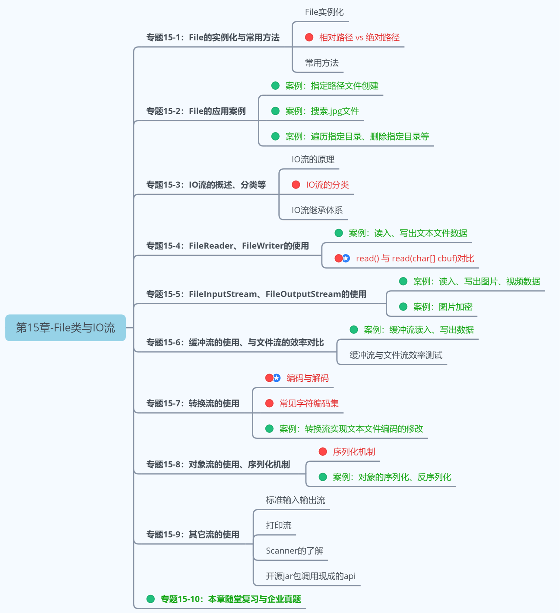
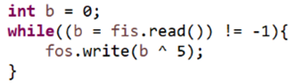
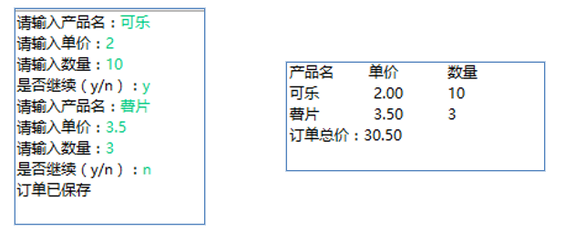
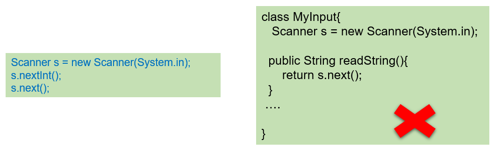
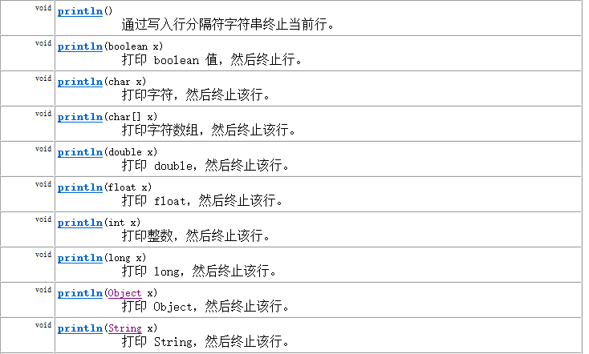

# 第15章_File类与IO流

讲师：尚硅谷-宋红康（江湖人称：康师傅）

官网：[http://www.atguigu.com](http://www.atguigu.com/)

***

## 本章专题与脉络



***

## 1. java.io.File类的使用

### 1.1 概述

-  File类及本章下的各种流，都定义在java.io包下。
-  一个File对象代表硬盘或网络中可能存在的一个文件或者文件目录（俗称文件夹），与平台无关。（体会万事万物皆对象）
- File 能新建、删除、重命名文件和目录，但 File 不能访问文件内容本身。如果需要访问文件内容本身，则需要使用输入/输出流。
  - File对象可以作为参数传递给流的构造器。
- 想要在Java程序中表示一个真实存在的文件或目录，那么必须有一个File对象，但是Java程序中的一个File对象，可能没有一个真实存在的文件或目录。


### 1.2 构造器

* `public File(String pathname) ` ：以pathname为路径创建File对象，可以是绝对路径或者相对路径，如果pathname是相对路径，则默认的当前路径在系统属性user.dir中存储。
* `public File(String parent, String child) ` ：以parent为父路径，child为子路径创建File对象。
* `public File(File parent, String child)` ：根据一个父File对象和子文件路径创建File对象

关于路径：

* **绝对路径：**从盘符开始的路径，这是一个完整的路径。
* **相对路径：**相对于`项目目录`的路径，这是一个便捷的路径，开发中经常使用。
  * IDEA中，main中的文件的相对路径，是相对于"`当前工程`"
  * IDEA中，单元测试方法中的文件的相对路径，是相对于"`当前module`"
  * 经验：通过`getAbsolutePath()`方法查看绝对路径

举例：

```java
package com.atguigu.file;

import java.io.File;

public class FileObjectTest {
    public static void main(String[] args) {
        // 文件路径名
        String pathname = "D:\\aaa.txt";
        File file1 = new File(pathname);

        // 文件路径名
        String pathname2 = "D:\\aaa\\bbb.txt";
        File file2 = new File(pathname2);

        // 通过父路径和子路径字符串
        String parent = "d:\\aaa";
        String child = "bbb.txt";
        File file3 = new File(parent, child);

        // 通过父级File对象和子路径字符串
        File parentDir = new File("d:\\aaa");
        String childFile = "bbb.txt";
        File file4 = new File(parentDir, childFile);
    }
    
    @Test
    public void test01() throws IOException{
        File f1 = new File("d:\\atguigu\\javase\\HelloIO.java"); //绝对路径
        System.out.println("文件/目录的名称：" + f1.getName());
        System.out.println("文件/目录的构造路径名：" + f1.getPath());
        System.out.println("文件/目录的绝对路径名：" + f1.getAbsolutePath());
        System.out.println("文件/目录的父目录名：" + f1.getParent());
    }
    @Test
    public void test02()throws IOException{
        File f2 = new File("/HelloIO.java");//绝对路径，从根路径开始
        System.out.println("文件/目录的名称：" + f2.getName());
        System.out.println("文件/目录的构造路径名：" + f2.getPath());
        System.out.println("文件/目录的绝对路径名：" + f2.getAbsolutePath());
        System.out.println("文件/目录的父目录名：" + f2.getParent());
    }

    @Test
    public void test03() throws IOException {
        File f3 = new File("HelloIO.java");//相对路径
        System.out.println("user.dir =" + System.getProperty("user.dir"));
        System.out.println("文件/目录的名称：" + f3.getName());
        System.out.println("文件/目录的构造路径名：" + f3.getPath());
        System.out.println("文件/目录的绝对路径名：" + f3.getAbsolutePath());
        System.out.println("文件/目录的父目录名：" + f3.getParent());
    }
    @Test
    public void test04() throws IOException{
        File f5 = new File("HelloIO.java");//相对路径
        System.out.println("user.dir =" + System.getProperty("user.dir"));
        System.out.println("文件/目录的名称：" + f5.getName());
        System.out.println("文件/目录的构造路径名：" + f5.getPath());
        System.out.println("文件/目录的绝对路径名：" + f5.getAbsolutePath());
        System.out.println("文件/目录的父目录名：" + f5.getParent());
    }
}
```

> 注意：
>
> 1. 无论该路径下是否存在文件或者目录，都不影响File对象的创建。
>
> 2. window的路径分隔符使用“\”，而Java程序中的“\”表示转义字符，所以在Windows中表示路径，需要用“\\”。或者直接使用“/”也可以，Java程序支持将“/”当成平台无关的`路径分隔符`。或者直接使用File.separator常量值表示。比如：
>
>    File file2 = new File("d:" + File.separator + "atguigu" + File.separator + "info.txt");
>
> 3. 当构造路径是绝对路径时，那么getPath和getAbsolutePath结果一样
>
>    当构造路径是相对路径时，那么getAbsolutePath的路径 = user.dir的路径 + 构造路径

### 1.3 常用方法

#### 1、获取文件和目录基本信息

* public String getName() ：获取名称
* public String getPath() ：获取路径 
* `public String getAbsolutePath()`：获取绝对路径
* public File getAbsoluteFile()：获取绝对路径表示的文件
* `public String getParent()`：获取上层文件目录路径。若无，返回null
* public long length() ：获取文件长度（即：字节数）。不能获取目录的长度。
* public long lastModified() ：获取最后一次的修改时间，毫秒值

> 如果File对象代表的文件或目录存在，则File对象实例初始化时，就会用硬盘中对应文件或目录的属性信息（例如，时间、类型等）为File对象的属性赋值，否则除了路径和名称，File对象的其他属性将会保留默认值。


举例：

```java
package com.atguigu.file;

import java.io.File;
import java.time.Instant;
import java.time.LocalDateTime;
import java.time.ZoneId;

public class FileInfoMethod {
    public static void main(String[] args) {
        File f = new File("d:/aaa/bbb.txt");
        System.out.println("文件构造路径:"+f.getPath());
        System.out.println("文件名称:"+f.getName());
        System.out.println("文件长度:"+f.length()+"字节");
        System.out.println("文件最后修改时间：" + LocalDateTime.ofInstant(Instant.ofEpochMilli(f.lastModified()),ZoneId.of("Asia/Shanghai")));

        File f2 = new File("d:/aaa");
        System.out.println("目录构造路径:"+f2.getPath());
        System.out.println("目录名称:"+f2.getName());
        System.out.println("目录长度:"+f2.length()+"字节");
        System.out.println("文件最后修改时间：" + LocalDateTime.ofInstant(Instant.ofEpochMilli(f.lastModified()),ZoneId.of("Asia/Shanghai")));
    }
}
```

```java
输出结果：
文件构造路径:d:\aaa\bbb.java
文件名称:bbb.java
文件长度:636字节
文件最后修改时间：2022-07-23T22:01:32.065

目录构造路径:d:\aaa
目录名称:aaa
目录长度:4096字节
文件最后修改时间：2022-07-23T22:01:32.065
```

#### 2、列出目录的下一级

* public String[] list() ：返回一个String数组，表示该File目录中的所有子文件或目录。
* public File[] listFiles() ：返回一个File数组，表示该File目录中的所有的子文件或目录。 

```java
package com.atguigu.file;

import org.junit.Test;

import java.io.File;
import java.io.FileFilter;
import java.io.FilenameFilter;

public class DirListFiles {
    @Test
    public void test01() {
        File dir = new File("d:/atguigu");
        String[] subs = dir.list();
        for (String sub : subs) {
            System.out.println(sub);
        }
    }

}
```

#### 3、File类的重命名功能

- `public boolean renameTo(File dest)`:把文件重命名为指定的文件路径。

>  file1.renameTo(file2):要想此方法执行完，返回true。要求：
>
> ​    file1必须存在，且file2必须不存在，且file2所在的文件目录需要存在。

#### 4、判断功能的方法

- `public boolean exists()` ：此File表示的文件或目录是否实际存在。
- `public boolean isDirectory()` ：此File表示的是否为目录。
- `public boolean isFile()` ：此File表示的是否为文件。
- public boolean canRead() ：判断是否可读
- public boolean canWrite() ：判断是否可写
- public boolean isHidden() ：判断是否隐藏


举例：

```java
package com.atguigu.file;

import java.io.File;

public class FileIs {
    public static void main(String[] args) {
        File f = new File("d:\\aaa\\bbb.java");
        File f2 = new File("d:\\aaa");
        // 判断是否存在
        System.out.println("d:\\aaa\\bbb.java 是否存在:"+f.exists());
        System.out.println("d:\\aaa 是否存在:"+f2.exists());
        // 判断是文件还是目录
        System.out.println("d:\\aaa 文件?:"+f2.isFile());
        System.out.println("d:\\aaa 目录?:"+f2.isDirectory());
    }
}
```

```
输出结果：
d:\aaa\bbb.java 是否存在:true
d:\aaa 是否存在:true
d:\aaa 文件?:false
d:\aaa 目录?:true
```

> 如果文件或目录不存在，那么exists()、isFile()和isDirectory()都是返回true

#### 5、创建、删除功能

- `public boolean createNewFile()` ：创建文件。若文件存在，则不创建，返回false。
- `public boolean mkdir()` ：创建文件目录。如果此文件目录存在，就不创建了。如果此文件目录的上层目录不存在，也不创建。
- `public boolean mkdirs()` ：创建文件目录。如果上层文件目录不存在，一并创建。
- `public boolean delete()` ：删除文件或者文件夹
  删除注意事项：① Java中的删除不走回收站。② 要删除一个文件目录，请注意该文件目录内不能包含文件或者文件目录。

举例：

```java
package com.atguigu.file;

import java.io.File;
import java.io.IOException;

public class FileCreateDelete {
    public static void main(String[] args) throws IOException {
        // 文件的创建
        File f = new File("aaa.txt");
        System.out.println("aaa.txt是否存在:"+f.exists()); 
        System.out.println("aaa.txt是否创建:"+f.createNewFile()); 
        System.out.println("aaa.txt是否存在:"+f.exists()); 

        // 目录的创建
        File f2= new File("newDir");
        System.out.println("newDir是否存在:"+f2.exists());
        System.out.println("newDir是否创建:"+f2.mkdir());
        System.out.println("newDir是否存在:"+f2.exists());

        // 创建一级目录
        File f3= new File("newDira\\newDirb");
        System.out.println("newDira\\newDirb创建：" + f3.mkdir());
        File f4= new File("newDir\\newDirb");
        System.out.println("newDir\\newDirb创建：" + f4.mkdir());
        // 创建多级目录
        File f5= new File("newDira\\newDirb");
        System.out.println("newDira\\newDirb创建：" + f5.mkdirs());

        // 文件的删除
        System.out.println("aaa.txt删除：" + f.delete());

        // 目录的删除
        System.out.println("newDir删除：" + f2.delete());
        System.out.println("newDir\\newDirb删除：" + f4.delete());
    }
}
```

```java
运行结果：
aaa.txt是否存在:false
aaa.txt是否创建:true
aaa.txt是否存在:true
newDir是否存在:false
newDir是否创建:true
newDir是否存在:true
newDira\newDirb创建：false
newDir\newDirb创建：true
newDira\newDirb创建：true
aaa.txt删除：true
newDir删除：false
newDir\newDirb删除：true
```

> API中说明：delete方法，如果此File表示目录，则目录必须为空才能删除。

### 1.4 练习

练习1：利用File构造器，new 一个文件目录file

​      1) 在其中创建多个文件和目录

      2) 编写方法，实现删除file中指定文件的操作


练习2：判断指定目录下是否有后缀名为.jpg的文件。如果有，就输出该文件名称

```java
public class FindJPGFileTest {
	//方法1：
	@Test
	public void test1(){
		File srcFile = new File("d:\\code");
		
		String[] fileNames = srcFile.list();
		for(String fileName : fileNames){
			if(fileName.endsWith(".jpg")){
				System.out.println(fileName);
			}
		}
	}
    //方法2：
	@Test
	public void test2(){
		File srcFile = new File("d:\\code");
		
		File[] listFiles = srcFile.listFiles();
		for(File file : listFiles){
			if(file.getName().endsWith(".jpg")){
				System.out.println(file.getAbsolutePath());
			}
		}
	}
    //方法3：
	/*
	 * File类提供了两个文件过滤器方法
	 * public String[] list(FilenameFilter filter)
	 * public File[] listFiles(FileFilter filter)

	 */
	@Test
	public void test3(){
		File srcFile = new File("d:\\code");
		
		File[] subFiles = srcFile.listFiles(new FilenameFilter() {
			
			@Override
			public boolean accept(File dir, String name) {
				return name.endsWith(".jpg");
			}
		});
		
		for(File file : subFiles){
			System.out.println(file.getAbsolutePath());
		}
	}
	
}

```

练习3：遍历指定目录所有文件名称，包括子文件目录中的文件。

  拓展1：并计算指定目录占用空间的大小

  拓展2：删除指定文件目录及其下的所有文件

```java
public class ListFilesTest {
	//练习3：(方式1)
    public static void printSubFile(File dir) {
        // 打印目录的子文件
        File[] subfiles = dir.listFiles();

        for (File f : subfiles) {
            if (f.isDirectory()) {// 文件目录
                printSubFile(f);
            } else {// 文件
                System.out.println(f.getAbsolutePath());
            }

        }
    }

    // //练习3：(方式2)
    public void listAllSubFiles(File file) {
        if (file.isFile()) {
            System.out.println(file);
        } else {
            File[] all = file.listFiles();
            // 如果all[i]是文件，直接打印
            // 如果all[i]是目录，接着再获取它的下一级
            for (File f : all) {
                listAllSubFiles(f);// 递归调用：自己调用自己就叫递归
            }
        }
    }
    @Test
    public void testListAllFiles(){
        // 1.创建目录对象
        File dir = new File("E:\\teach\\01_javaSE\\_尚硅谷Java编程语言\\3_软件");

        // 2.打印目录的子文件
        printSubFile(dir);
    }

    // 拓展1：求指定目录所在空间的大小
    public long getDirectorySize(File file) {
        // file是文件，那么直接返回file.length()
        // file是目录，把它的下一级的所有file大小加起来就是它的总大小
        long size = 0;
        if (file.isFile()) {
            size = file.length();
        } else {
            File[] all = file.listFiles();// 获取file的下一级
            // 累加all[i]的大小
            for (File f : all) {
                size += getDirectorySize(f);// f的大小;
            }
        }
        return size;
    }

    // 拓展2：删除指定的目录
    public void deleteDirectory(File file) {
        // 如果file是文件，直接delete
        // 如果file是目录，先把它的下一级干掉，然后删除自己
        if (file.isDirectory()) {
            File[] all = file.listFiles();
            // 循环删除的是file的下一级
            for (File f : all) {// f代表file的每一个下级
                deleteDirectory(f);
            }
        }
        // 删除自己
        file.delete();
    }

}
```

## 2. IO流原理及流的分类


### 2.1 Java IO原理

- Java程序中，对于数据的输入/输出操作以“`流(stream)`” 的方式进行，可以看做是一种数据的流动。

  

- I/O流中的I/O是`Input/Output`的缩写， I/O技术是非常实用的技术，用于处理设备之间的数据传输。如读/写文件，网络通讯等。
  - `输入input`：读取外部数据（磁盘、光盘等存储设备的数据）到程序（内存）中。
  - `输出output`：将程序（内存）数据输出到磁盘、光盘等存储设备中。
  


### 2.2 流的分类

`java.io`包下提供了各种“流”类和接口，用以获取不同种类的数据，并通过`标准的方法`输入或输出数据。

- 按数据的流向不同分为：**输入流**和**输出流**。
  - **输入流** ：把数据从`其他设备`上读取到`内存`中的流。 
    - 以InputStream、Reader结尾
  - **输出流** ：把数据从`内存` 中写出到`其他设备`上的流。
    - 以OutputStream、Writer结尾

- 按操作数据单位的不同分为：**字节流（8bit）**和**字符流（16bit）**。
  - **字节流** ：以字节为单位，读写数据的流。
    - 以InputStream、OutputStream结尾
  - **字符流** ：以字符为单位，读写数据的流。
    - 以Reader、Writer结尾

- 根据IO流的角色不同分为：**节点流**和**处理流**。
  - **节点流**：直接从数据源或目的地读写数据

    

  - **处理流**：不直接连接到数据源或目的地，而是“连接”在已存在的流（节点流或处理流）之上，通过对数据的处理为程序提供更为强大的读写功能。

    

小结：图解


### 2.3 流的API

- Java的IO流共涉及40多个类，实际上非常规则，都是从如下4个抽象基类派生的。

| （抽象基类） |   输入流    |    输出流    |
| :----------: | :---------: | :----------: |
|    字节流    | InputStream | OutputStream |
|    字符流    |   Reader    |    Writer    |

- 由这四个类派生出来的子类名称都是以其父类名作为子类名后缀。


**常用的节点流：** 　

* 文件流： FileInputStream、FileOutputStrean、FileReader、FileWriter 
* 字节/字符数组流： ByteArrayInputStream、ByteArrayOutputStream、CharArrayReader、CharArrayWriter 
  * 对数组进行处理的节点流（对应的不再是文件，而是内存中的一个数组）。

**常用处理流：**

* 缓冲流：BufferedInputStream、BufferedOutputStream、BufferedReader、BufferedWriter
  * 作用：增加缓冲功能，避免频繁读写硬盘，进而提升读写效率。
* 转换流：InputStreamReader、OutputStreamReader
  * 作用：实现字节流和字符流之间的转换。
* 对象流：ObjectInputStream、ObjectOutputStream
  * 作用：提供直接读写Java对象功能


**执行步骤：**
第1步：创建读取或写出的File类的对象
第2步：创建输入流或输出流
第3步：具体的读入或写出的过程。
     读入：read(char[] cbuffer)
     写出：write(String str) / write(char[] cbuffer,0,len)
第4步：关闭流资源，避免内存泄漏

## 3. 节点流之一：FileReader\FileWriter

### 3.1 Reader与Writer

Java提供一些字符流类，以字符为单位读写数据，**专门用于处理文本文件**。不能操作图片，视频等非文本文件。

> 常见的文本文件有如下的格式：.txt、.java、.c、.cpp、.py等
>
> 注意：.doc、.xls、.ppt这些都不是文本文件。

#### 3.1.1 字符输入流：Reader

`java.io.Reader`抽象类是表示用于读取字符流的所有类的父类，可以读取字符信息到内存中。它定义了字符输入流的基本共性功能方法。

- `public int read()`： 从输入流读取一个字符。 虽然读取了一个字符，但是会自动提升为int类型。返回该字符的Unicode编码值。如果已经到达流末尾了，则返回-1。
- `public int read(char[] cbuf)`： 从输入流中读取一些字符，并将它们存储到字符数组 cbuf中 。每次最多读取cbuf.length个字符。返回实际读取的字符个数。如果已经到达流末尾，没有数据可读，则返回-1。 
- `public int read(char[] cbuf,int off,int len)`：从输入流中读取一些字符，并将它们存储到字符数组 cbuf中，从cbuf[off]开始的位置存储。每次最多读取len个字符。返回实际读取的字符个数。如果已经到达流末尾，没有数据可读，则返回-1。 
- `public void close()` ：关闭此流并释放与此流相关联的任何系统资源。    

> 注意：当完成流的操作时，必须调用close()方法，释放系统资源，否则会造成内存泄漏。

#### 3.1.2 字符输出流：Writer

`java.io.Writer `抽象类是表示用于写出字符流的所有类的超类，将指定的字符信息写出到目的地。它定义了字节输出流的基本共性功能方法。

- `public void write(int c)` ：写出单个字符。
- `public void write(char[] cbuf) `：写出字符数组。 
- `public void write(char[] cbuf, int off, int len) `：写出字符数组的某一部分。off：数组的开始索引；len：写出的字符个数。 
- `public void write(String str) `：写出字符串。 
- `public void write(String str, int off, int len)` ：写出字符串的某一部分。off：字符串的开始索引；len：写出的字符个数。
- `public void flush() `：刷新该流的缓冲。  
- `public void close()` ：关闭此流。

> 注意：当完成流的操作时，必须调用close()方法，释放系统资源，否则会造成内存泄漏。

### 3.2 FileReader 与 FileWriter

#### 3.2.1 FileReader

`java.io.FileReader `类用于读取字符文件，构造时使用系统默认的字符编码和默认字节缓冲区。

- `FileReader(File file)`： 创建一个新的 FileReader ，给定要读取的File对象。   
- `FileReader(String fileName)`： 创建一个新的 FileReader ，给定要读取的文件的名称。  

**举例：**读取hello.txt文件中的字符数据，并显示在控制台上

```java
public class FileReaderWriterTest {
    
    //实现方式1
    @Test
    public void test1() throws IOException {
        //1. 创建File类的对象，对应着物理磁盘上的某个文件
        File file = new File("hello.txt");
        //2. 创建FileReader流对象，将File类的对象作为参数传递到FileReader的构造器中
        FileReader fr = new FileReader(file);
        //3. 通过相关流的方法，读取文件中的数据
//        int data = fr.read(); //每调用一次读取一个字符
//        while (data != -1) {
//            System.out.print((char) data);
//            data = fr.read();
//        }
        int data;
        while ((data = fr.read()) != -1) {
            System.out.print((char) data);
        }

        //4. 关闭相关的流资源，避免出现内存泄漏
        fr.close();

    }

    //实现方式2：在方式1的基础上改进，使用try-catch-finally处理异常。保证流是可以关闭的
    @Test
    public void test2() {
        FileReader fr = null;
        try {
            //1. 创建File类的对象，对应着物理磁盘上的某个文件
            File file = new File("hello.txt");
            //2. 创建FileReader流对象，将File类的对象作为参数传递到FileReader的构造器中
            fr = new FileReader(file);
            //3. 通过相关流的方法，读取文件中的数据
            /*
             * read():每次从对接的文件中读取一个字符。并将此字符返回。
             * 如果返回值为-1,则表示文件到了末尾，可以不再读取。
             * */
//            int data = fr.read();
//            while(data != -1){
//                System.out.print((char)data);
//                data = fr.read();
//            }

            int data;
            while ((data = fr.read()) != -1) {
                System.out.println((char) data);
            }

        } catch (IOException e) {
            e.printStackTrace();
        } finally {
            //4. 关闭相关的流资源，避免出现内存泄漏
            try {
                if (fr != null)
                    fr.close();
            } catch (IOException e) {
                e.printStackTrace();
            }
        }
    }

    //实现方式3：调用read(char[] cbuf),每次从文件中读取多个字符,提升效率
    @Test
    public void test3() {
        FileReader fr = null;
        try {
            //1. 创建File类的对象，对应着物理磁盘上的某个文件
            File file = new File("hello.txt");
            //2. 创建FileReader流对象，将File类的对象作为参数传递到FileReader的构造器中
            fr = new FileReader(file);
            //3. 通过相关流的方法，读取文件中的数据
            char[] cbuf = new char[5];
            /*
             * read(char[] cbuf) : 每次将文件中的数据读入到cbuf数组中，并返回读入到数组中的
             * 字符的个数。
             * */
            int len; //记录每次读入的字符的个数
            while ((len = fr.read(cbuf)) != -1) {
                //处理char[]数组即可
                //错误：
//                for(int i = 0;i < cbuf.length;i++){
//                    System.out.print(cbuf[i]);
//                }
                //错误：
//                String str = new String(cbuf);
//                System.out.print(str);
                //正确：
//                for(int i = 0;i < len;i++){
//                    System.out.print(cbuf[i]);
//                }
                //正确：
                String str = new String(cbuf, 0, len);
                System.out.print(str);
            }
        } catch (IOException e) {
            e.printStackTrace();
        } finally {
            //4. 关闭相关的流资源，避免出现内存泄漏
            try {
                if (fr != null)
                    fr.close();
            } catch (IOException e) {
                e.printStackTrace();
            }
        }
    }
}
```

不同实现方式的类比：


#### 3.2.2 FileWriter

`java.io.FileWriter `类用于写出字符到文件，构造时使用系统默认的字符编码和默认字节缓冲区。

- `FileWriter(File file)`： 创建一个新的 FileWriter，给定要读取的File对象。   
- `FileWriter(String fileName)`： 创建一个新的 FileWriter，给定要读取的文件的名称。  
- `FileWriter(File file,boolean append)`： 创建一个新的 FileWriter，指明是否在现有文件末尾追加内容。

举例：

```java
public class FWWrite {
    //注意：应该使用try-catch-finally处理异常。这里出于方便阅读代码，使用了throws的方式
    @Test
    public void test01()throws IOException {
        // 使用文件名称创建流对象
        FileWriter fw = new FileWriter(new File("fw.txt"));
        // 写出数据
        fw.write(97); // 写出第1个字符
        fw.write('b'); // 写出第2个字符
        fw.write('C'); // 写出第3个字符
        fw.write(30000); // 写出第4个字符，中文编码表中30000对应一个汉字。
		
        //关闭资源
        fw.close();
    }
	//注意：应该使用try-catch-finally处理异常。这里出于方便阅读代码，使用了throws的方式
    @Test
    public void test02()throws IOException {
        // 使用文件名称创建流对象
        FileWriter fw = new FileWriter(new File("fw.txt"));
        // 字符串转换为字节数组
        char[] chars = "尚硅谷".toCharArray();

        // 写出字符数组
        fw.write(chars); // 尚硅谷

        // 写出从索引1开始，2个字符。
        fw.write(chars,1,2); // 硅谷

        // 关闭资源
        fw.close();
    }
	//注意：应该使用try-catch-finally处理异常。这里出于方便阅读代码，使用了throws的方式
    @Test
    public void test03()throws IOException {
        // 使用文件名称创建流对象
        FileWriter fw = new FileWriter("fw.txt");
        // 字符串
        String msg = "尚硅谷";

        // 写出字符数组
        fw.write(msg); //尚硅谷

        // 写出从索引1开始，2个字符。
        fw.write(msg,1,2);	// 硅谷

        // 关闭资源
        fw.close();
    }
    
    @Test
    public void test04(){
        FileWriter fw = null;
        try {
            //1. 创建File的对象
            File file = new File("personinfo.txt");
            //2. 创建FileWriter的对象，将File对象作为参数传递到FileWriter的构造器中
            //如果输出的文件已存在，则会对现有的文件进行覆盖
            fw = new FileWriter(file);
//            fw = new FileWriter(file,false);
            //如果输出的文件已存在，则会在现有的文件末尾写入数据
//            fw = new FileWriter(file,true);

            //3. 调用相关的方法，实现数据的写出操作
            //write(String str) / write(char[] cbuf)
            fw.write("I love you,");
            fw.write("you love him.");
            fw.write("so sad".toCharArray());
        } catch (IOException e) {
            e.printStackTrace();
        } finally {
            //4. 关闭资源，避免内存泄漏
            try {
                if (fw != null)
                    fw.close();
            } catch (IOException e) {
                throw new RuntimeException(e);
            }
        }
    }
    /*
     * 需求：复制一份hello.txt文件，命名为hello_copy.txt
     * */
    @Test
    public void test5() {
        FileReader fr = null;
        FileWriter fw = null;

        try {
            //1. 创建File类的对象
            File srcFile = new File("hello.txt");
            File destFile = new File("hello_copy.txt");

            //2. 创建输入流、输出流
            fr = new FileReader(srcFile);
            fw = new FileWriter(destFile);

            //3. 数据的读入和写出的过程
            char[] cbuffer = new char[5];
            int len;//记录每次读入到cbuffer中的字符的个数
            while ((len = fr.read(cbuffer)) != -1) {
                //write(char[] cbuffer,int fromIndex,int len)
                fw.write(cbuffer, 0, len); //正确的
//                fw.write(cbuffer); //错误的
            }

            System.out.println("复制成功");
        } catch (IOException e) {
            e.printStackTrace();
        } finally {
            //4. 关闭流资源
            //方式1：
//            try {
                //if (fw != null)
//                  fw.close();
//            } catch (IOException e) {
//                e.printStackTrace();
//            }finally {
//
//                try {
                    //if (fr != null)
//                    fr.close();
//                } catch (IOException e) {
//                    e.printStackTrace();
//                }
//            }
            //方式2：
            try {
                if (fw != null)
                    fw.close();
            } catch (IOException e) {
                e.printStackTrace();
            }
            try {
                if (fr != null)
                    fr.close();
            } catch (IOException e) {
                e.printStackTrace();
            }
        }


    }
}
```

#### 3.2.3 小结

```
① 
因为出现流资源的调用，为了避免内存泄漏，需要使用try-catch-finally处理异常

② 
对于输入流来说，File类的对象必须在物理磁盘上存在，否则执行就会报FileNotFoundException。如果传入的是一个目录，则会报IOException异常。

对于输出流来说，File类的对象是可以不存在的。
   > 如果File类的对象不存在，则可以在输出的过程中，自动创建File类的对象
   > 如果File类的对象存在，
      > 如果调用FileWriter(File file)或FileWriter(File file,false)，输出时会新建File文件覆盖已有的文件
      > 如果调用FileWriter(File file,true)构造器，则在现有的文件末尾追加写出内容。
```

### 3.3  关于flush（刷新）

因为内置缓冲区的原因，如果FileWriter不关闭输出流，无法写出字符到文件中。但是关闭的流对象，是无法继续写出数据的。如果我们既想写出数据，又想继续使用流，就需要`flush()` 方法了。

- `flush()` ：刷新缓冲区，流对象可以继续使用。
- `close() `：先刷新缓冲区，然后通知系统释放资源。流对象不可以再被使用了。

注意：即便是flush()方法写出了数据，操作的最后还是要调用close方法，释放系统资源。

举例：

```java
public class FWWriteFlush {
    //注意：应该使用try-catch-finally处理异常。这里出于方便阅读代码，使用了throws的方式
    @Test
    public void test() throws IOException {
        // 使用文件名称创建流对象
        FileWriter fw = new FileWriter("fw.txt");
        // 写出数据，通过flush
        fw.write('刷'); // 写出第1个字符
        fw.flush();
        fw.write('新'); // 继续写出第2个字符，写出成功
        fw.flush();

        // 写出数据，通过close
        fw.write('关'); // 写出第1个字符
        fw.close();
        fw.write('闭'); // 继续写出第2个字符,【报错】java.io.IOException: Stream closed
        fw.close();
    }
}
```

## 4. 节点流之二：FileInputStream\FileOutputStream

如果我们读取或写出的数据是非文本文件，则Reader、Writer就无能为力了，必须使用字节流。


> 但是FileInputStream\FileOutputStream处理文本时，拆包读取时会出现乱码，使用建议：
>
> + 对于字符，字符串的读取一般使用字符流，或者使用ByteArrayOutputStream进行缓存到到内存
>
> + 对于拷贝移动等不关心拆包粘包的问题可以使用字节流

### 4.1 InputStream和OutputStream

#### 4.1.1 字节输入流：InputStream

`java.io.InputStream `抽象类是表示字节输入流的所有类的超类，可以读取字节信息到内存中。它定义了字节输入流的基本共性功能方法。

- `public int read()`： 从输入流读取一个字节。返回读取的字节值。虽然读取了一个字节，但是会自动提升为int类型。如果已经到达流末尾，没有数据可读，则返回-1。 
- `public int read(byte[] b)`： 从输入流中读取一些字节数，并将它们存储到字节数组 b中 。每次最多读取b.length个字节。返回实际读取的字节个数。如果已经到达流末尾，没有数据可读，则返回-1。 
- `public int read(byte[] b,int off,int len)`：从输入流中读取一些字节数，并将它们存储到字节数组 b中，从b[off]开始存储，每次最多读取len个字节 。返回实际读取的字节个数。如果已经到达流末尾，没有数据可读，则返回-1。 
- `public void close()` ：关闭此输入流并释放与此流相关联的任何系统资源。    

> 说明：close()方法，当完成流的操作时，必须调用此方法，释放系统资源。

####  4.1.2 字节输出流：OutputStream

`java.io.OutputStream `抽象类是表示字节输出流的所有类的超类，将指定的字节信息写出到目的地。它定义了字节输出流的基本共性功能方法。

- `public void write(int b)` ：将指定的字节输出流。虽然参数为int类型四个字节，但是只会保留一个字节的信息写出。
- `public void write(byte[] b)`：将 b.length字节从指定的字节数组写入此输出流。  
- `public void write(byte[] b, int off, int len)` ：从指定的字节数组写入 len字节，从偏移量 off开始输出到此输出流。  
- `public void flush() ` ：刷新此输出流并强制任何缓冲的输出字节被写出。  
- `public void close()` ：关闭此输出流并释放与此流相关联的任何系统资源。  

> 说明：close()方法，当完成流的操作时，必须调用此方法，释放系统资源。
>

### 4.2 FileInputStream 与 FileOutputStream

#### 4.2.1 FileInputStream

`java.io.FileInputStream `类是文件输入流，从文件中读取字节。

- `FileInputStream(File file)`： 通过打开与实际文件的连接来创建一个 FileInputStream ，该文件由文件系统中的 File对象 file命名。 
- `FileInputStream(String name)`： 通过打开与实际文件的连接来创建一个 FileInputStream ，该文件由文件系统中的路径名 name命名。  

举例：

```java
//read.txt文件中的内容如下：
abcde
```

读取操作

```java
public class FISRead {
    //注意：应该使用try-catch-finally处理异常。这里出于方便阅读代码，使用了throws的方式
    @Test
    public void test() throws IOException {
        // 使用文件名称创建流对象
        FileInputStream fis = new FileInputStream("read.txt");
        // 读取数据，返回一个字节
        int read = fis.read();
        System.out.println((char) read);
        read = fis.read();
        System.out.println((char) read);
        read = fis.read();
        System.out.println((char) read);
        read = fis.read();
        System.out.println((char) read);
        read = fis.read();
        System.out.println((char) read);
        // 读取到末尾,返回-1
        read = fis.read();
        System.out.println(read);
        // 关闭资源
        fis.close();
        /*
        文件内容：abcde
        输出结果：
        a
        b
        c
        d
        e
        -1
         */
    }

    @Test
    public void test02()throws IOException{
        // 使用文件名称创建流对象
        FileInputStream fis = new FileInputStream("read.txt");
        // 定义变量，保存数据
        int b;
        // 循环读取
        while ((b = fis.read())!=-1) {
            System.out.println((char)b);
        }
        // 关闭资源
        fis.close();
    }
	
    @Test
    public void test03()throws IOException{
        // 使用文件名称创建流对象.
        FileInputStream fis = new FileInputStream("read.txt"); // 文件中为abcde
        // 定义变量，作为有效个数
        int len;
        // 定义字节数组，作为装字节数据的容器
        byte[] b = new byte[2];
        // 循环读取
        while (( len= fis.read(b))!=-1) {
            // 每次读取后,把数组变成字符串打印  有问题 修复版本见下面
            System.out.println(new String(b));
        }
        // 关闭资源
        fis.close();
        /*
        输出结果：
        ab
        cd
        ed
        最后错误数据`d`，是由于最后一次读取时，只读取一个字节`e`，数组中，
        上次读取的数据没有被完全替换，所以要通过`len` ，获取有效的字节
         */
    }

    @Test
    public void test04()throws IOException{
        // 使用文件名称创建流对象.
        FileInputStream fis = new FileInputStream("read.txt"); // 文件中为abcde
        // 定义变量，作为有效个数
        int len;
        // 定义字节数组，作为装字节数据的容器
        byte[] b = new byte[2];
        // 循环读取
        while (( len= fis.read(b))!=-1) {
            // 每次读取后,把数组的有效字节部分，变成字符串打印
            System.out.println(new String(b,0,len));//  len 每次读取的有效字节个数
        }
        // 关闭资源
        fis.close();
        /*
        输出结果：
        ab
        cd
        e
         */
    }
}
```

#### 4.2.2 FileOutputStream

`java.io.FileOutputStream `类是文件输出流，用于将数据写出到文件。

- `public FileOutputStream(File file)`：创建文件输出流，写出由指定的 File对象表示的文件。 
- `public FileOutputStream(String name)`： 创建文件输出流，指定的名称为写出文件。
- `public FileOutputStream(File file, boolean append)`：  创建文件输出流，指明是否在现有文件末尾追加内容。

举例：

```java
package com.atguigu.fileio;

import org.junit.Test;

import java.io.FileOutputStream;
import java.io.IOException;

public class FOSWrite {
    //注意：应该使用try-catch-finally处理异常。这里出于方便阅读代码，使用了throws的方式
    @Test
    public void test01() throws IOException {
        // 使用文件名称创建流对象
        FileOutputStream fos = new FileOutputStream("fos.txt");
        // 写出数据
        fos.write(97); // 写出第1个字节
        fos.write(98); // 写出第2个字节
        fos.write(99); // 写出第3个字节
        // 关闭资源
        fos.close();
      /*  输出结果：abc*/
    }

    @Test
    public void test02()throws IOException {
        // 使用文件名称创建流对象
        FileOutputStream fos = new FileOutputStream("fos.txt");
        // 字符串转换为字节数组
        byte[] b = "abcde".getBytes();
        // 写出从索引2开始，2个字节。索引2是c，两个字节，也就是cd。
        fos.write(b,2,2);
        // 关闭资源
        fos.close();
    }
    //这段程序如果多运行几次，每次都会在原来文件末尾追加abcde
    @Test
    public void test03()throws IOException {
        // 使用文件名称创建流对象
        FileOutputStream fos = new FileOutputStream("fos.txt",true);
        // 字符串转换为字节数组
        byte[] b = "abcde".getBytes();
        fos.write(b);
        // 关闭资源
        fos.close();
    }
    
    //使用FileInputStream\FileOutputStream，实现对文件的复制
    @Test
    public void test05() {
        FileInputStream fis = null;
        FileOutputStream fos = null;
        try {
            //1. 造文件-造流
            //复制图片：成功
//            fis = new FileInputStream(new File("pony.jpg"));
//            fos = new FileOutputStream(new File("pony_copy1.jpg"));

            //复制文本文件：成功
            fis = new FileInputStream(new File("hello.txt"));
            fos = new FileOutputStream(new File("hello1.txt"));

            //2. 复制操作（读、写）
            byte[] buffer = new byte[1024];
            int len;//每次读入到buffer中字节的个数
            while ((len = fis.read(buffer)) != -1) {
                fos.write(buffer, 0, len);
//                String str = new String(buffer,0,len);
//                System.out.print(str);
            }
            System.out.println("复制成功");
        } catch (IOException e) {
            throw new RuntimeException(e);
        } finally {
            //3. 关闭资源
            try {
                if (fos != null)
                    fos.close();
            } catch (IOException e) {
                throw new RuntimeException(e);
            }
            try {
                if (fis != null)
                    fis.close();
            } catch (IOException e) {
                throw new RuntimeException(e);
            }
        }

    }
}
```

### 4.3 练习

**练习：**实现图片加密操作。

提示：

 

```java
public class FileSecretTest {
    /*
    * 图片的加密
    * */
    @Test
    public void test1(){
        FileInputStream fis = null;
        FileOutputStream fos = null;
        try {
            File file1 = new File("pony.jpg");
            File file2 = new File("pony_secret.jpg");
            fis = new FileInputStream(file1);
            fos = new FileOutputStream(file2);

            //方式1：每次读入一个字节，效率低
//            int data;
//            while((data = fis.read()) != -1){
//                fos.write(data ^ 5);
//            }
            //方式2：每次读入一个字节数组，效率高
            int len;
            byte[] buffer = new byte[1024];
            while((len = fis.read(buffer)) != -1){

                for(int i = 0;i < len;i++){
                    buffer[i] = (byte) (buffer[i] ^ 5);
                }

                fos.write(buffer,0,len);

            }


            System.out.println("加密成功");
        } catch (IOException e) {
            e.printStackTrace();
        } finally {

            try {
                fos.close();
            } catch (IOException e) {
                e.printStackTrace();
            }
            try {
                fis.close();
            } catch (IOException e) {
                e.printStackTrace();
            }
        }
    }

    /*
     * 图片的解密
     * */
    @Test
    public void test2(){
        FileInputStream fis = null;
        FileOutputStream fos = null;
        try {
            File file1 = new File("pony_secret.jpg");
            File file2 = new File("pony_unsecret.jpg");
            fis = new FileInputStream(file1);
            fos = new FileOutputStream(file2);

            //方式1：每次读入一个字节，效率低
//            int data;
//            while((data = fis.read()) != -1){
//                fos.write(data ^ 5);
//            }
            //方式2：每次读入一个字节数组，效率高
            int len;
            byte[] buffer = new byte[1024];
            while((len = fis.read(buffer)) != -1){

                for(int i = 0;i < len;i++){
                    buffer[i] = (byte) (buffer[i] ^ 5);
                }

                fos.write(buffer,0,len);

            }

            System.out.println("解密成功");
        } catch (IOException e) {
            e.printStackTrace();
        } finally {

            try {
                fos.close();
            } catch (IOException e) {
                e.printStackTrace();
            }
            try {
                fis.close();
            } catch (IOException e) {
                e.printStackTrace();
            }
        }
    }
}
```

## 5. 处理流之一：缓冲流

- `为了提高数据读写的速度`，Java API提供了带缓冲功能的流类：缓冲流。

- 缓冲流要“套接”在相应的节点流之上，根据数据操作单位可以把缓冲流分为：
  - **字节缓冲流**：`BufferedInputStream`，`BufferedOutputStream` 
  - **字符缓冲流**：`BufferedReader`，`BufferedWriter`

- 缓冲流的基本原理：在创建流对象时，内部会创建一个缓冲区数组（缺省使用`8192个字节(8Kb)`的缓冲区），通过缓冲区读写，减少系统IO次数，从而提高读写的效率。


### 5.1 构造器

* `public BufferedInputStream(InputStream in)` ：创建一个 新的字节型的缓冲输入流。 
* `public BufferedOutputStream(OutputStream out)`： 创建一个新的字节型的缓冲输出流。

代码举例：

```java
// 创建字节缓冲输入流
BufferedInputStream bis = new BufferedInputStream(new FileInputStream("abc.jpg"));
// 创建字节缓冲输出流
BufferedOutputStream bos = new BufferedOutputStream(new FileOutputStream("abc_copy.jpg"));
```

* `public BufferedReader(Reader in)` ：创建一个 新的字符型的缓冲输入流。 
* `public BufferedWriter(Writer out)`： 创建一个新的字符型的缓冲输出流。

代码举例：

```java
// 创建字符缓冲输入流
BufferedReader br = new BufferedReader(new FileReader("br.txt"));
// 创建字符缓冲输出流
BufferedWriter bw = new BufferedWriter(new FileWriter("bw.txt"));
```

### 5.2 效率测试

查询API，缓冲流读写方法与基本的流是一致的，我们通过复制大文件（375MB），测试它的效率。

```java
//方法1：使用FileInputStream\FileOutputStream实现非文本文件的复制
public void copyFileWithFileStream(String srcPath,String destPath){
    FileInputStream fis = null;
    FileOutputStream fos = null;
    try {
        //1. 造文件-造流
        fis = new FileInputStream(new File(srcPath));
        fos = new FileOutputStream(new File(destPath));

        //2. 复制操作（读、写）
        byte[] buffer = new byte[100];
        int len;//每次读入到buffer中字节的个数
        while ((len = fis.read(buffer)) != -1) {
            fos.write(buffer, 0, len);
        }
        System.out.println("复制成功");
    } catch (IOException e) {
        throw new RuntimeException(e);
    } finally {
        //3. 关闭资源
        try {
            if (fos != null)
                fos.close();
        } catch (IOException e) {
            throw new RuntimeException(e);
        }
        try {
            if (fis != null)
                fis.close();
        } catch (IOException e) {
            throw new RuntimeException(e);
        }
    }
}

@Test
public void test1(){
    String srcPath = "C:\\Users\\shkstart\\Desktop\\01-复习.mp4";
    String destPath = "C:\\Users\\shkstart\\Desktop\\01-复习2.mp4";

    long start = System.currentTimeMillis();

    copyFileWithFileStream(srcPath,destPath);

    long end = System.currentTimeMillis();

    System.out.println("花费的时间为：" + (end - start));//7677毫秒

}

//方法2：使用BufferedInputStream\BufferedOuputStream实现非文本文件的复制
public void copyFileWithBufferedStream(String srcPath,String destPath){
    FileInputStream fis = null;
    FileOutputStream fos = null;
    BufferedInputStream bis = null;
    BufferedOutputStream bos = null;
    try {
        //1. 造文件
        File srcFile = new File(srcPath);
        File destFile = new File(destPath);
        //2. 造流
        fis = new FileInputStream(srcFile);
        fos = new FileOutputStream(destFile);

        bis = new BufferedInputStream(fis);
        bos = new BufferedOutputStream(fos);

        //3. 读写操作
        int len;
        byte[] buffer = new byte[100];
        while ((len = bis.read(buffer)) != -1) {
            bos.write(buffer, 0, len);
        }
        System.out.println("复制成功");
    } catch (IOException e) {
        e.printStackTrace();
    } finally {
        //4. 关闭资源(如果有多个流，我们需要先关闭外面的流，再关闭内部的流)
        try {
            if (bos != null)
                bos.close();
        } catch (IOException e) {
            throw new RuntimeException(e);
        }
        try {
            if (bis != null)
                bis.close();
        } catch (IOException e) {
            throw new RuntimeException(e);
        }

    }
}
@Test
public void test2(){
    String srcPath = "C:\\Users\\shkstart\\Desktop\\01-复习.mp4";
    String destPath = "C:\\Users\\shkstart\\Desktop\\01-复习2.mp4";

    long start = System.currentTimeMillis();

    copyFileWithBufferedStream(srcPath,destPath);

    long end = System.currentTimeMillis();

    System.out.println("花费的时间为：" + (end - start));//415毫秒

}
```

### 5.3 字符缓冲流特有方法

字符缓冲流的基本方法与普通字符流调用方式一致，不再阐述，我们来看它们具备的特有方法。

* BufferedReader：`public String readLine()`: 读一行文字。 
* BufferedWriter：`public void newLine()`: 写一行行分隔符,由系统属性定义符号。 

```java
public class BufferedIOLine {
    @Test
    public void testReadLine()throws IOException {
        // 创建流对象
        BufferedReader br = new BufferedReader(new FileReader("in.txt"));
        // 定义字符串,保存读取的一行文字
        String line;
        // 循环读取,读取到最后返回null
        while ((line = br.readLine())!=null) {
            System.out.println(line);
        }
        // 释放资源
        br.close();
    }

    @Test
    public void testNewLine()throws IOException{
        // 创建流对象
        BufferedWriter bw = new BufferedWriter(new FileWriter("out.txt"));
        // 写出数据
        bw.write("尚");
        // 写出换行
        bw.newLine();
        bw.write("硅");
        bw.newLine();
        bw.write("谷");
        bw.newLine();
        // 释放资源
        bw.close();
    }
}

```

> 说明：
>
> 1. 涉及到嵌套的多个流时，如果都显式关闭的话，需要先关闭外层的流，再关闭内层的流
>
> 2. 其实在开发中，只需要关闭最外层的流即可，因为在关闭外层流时，内层的流也会被关闭。

### 5.4 练习

**练习1：**分别使用节点流：FileInputStream、FileOutputStream和缓冲流：BufferedInputStream、BufferedOutputStream实现文本文件/图片/视频文件的复制。并比较二者在数据复制方面的效率。

**练习2：**

姓氏统计：一个文本文件中存储着北京所有高校在校生的姓名，格式如下：

```
每行一个名字，姓与名以空格分隔：
张 三
李 四
王 小五
```

现在想统计所有的姓氏在文件中出现的次数，请描述一下你的解决方案。

```java
	public static void main(String[] args) {
        HashMap<String, Integer> map = new HashMap<>();
        BufferedReader br = null;
        try {
            br = new BufferedReader(new FileReader(new File("e:/name.txt")));
            String value = null; // 临时接收文件中的字符串变量
            StringBuffer buffer = new StringBuffer();
            flag:
            while ((value = br.readLine()) != null) { // 开始读取文件中的字符
                char[] c = value.toCharArray();
                for (int i = 0; i < c.length; i++) {
                    if (c[i] != ' ') {
                        buffer.append(String.valueOf(c[i]));
                    } else {
                        if (map.containsKey(buffer.toString())) {
                            int count = map.get(buffer.toString());
                            map.put(buffer.toString(), count + 1);
                        } else {
                            map.put(buffer.toString(), 1);
                        }
                        buffer.delete(0, buffer.length());
                        continue flag;
                    }
                }
            }
        } catch (Exception e) {
            e.printStackTrace();
        } finally {
            if (br != null) {
                try {
                    br.close();
                } catch (IOException e) {
                    e.printStackTrace();
                }
            }
        }
        Set<Map.Entry<String, Integer>> set = map.entrySet();
        Iterator<Map.Entry<String, Integer>> it = set.iterator();
        while (it.hasNext()) {
            Map.Entry<String, Integer> end = (Map.Entry<String, Integer>) it.next();
            System.out.println(end);
        }

    }
```

## 6. 处理流之二：转换流

### 6.1 问题引入

**引入情况1：**

使用`FileReader` 读取项目中的文本文件。由于IDEA设置中针对项目设置了UTF-8编码，当读取Windows系统中创建的文本文件时，如果Windows系统默认的是GBK编码，则读入内存中会出现乱码。

```java
package com.atguigu.transfer;

import java.io.FileReader;
import java.io.IOException;

public class Problem {
    public static void main(String[] args) throws IOException {
        FileReader fileReader = new FileReader("E:\\File_GBK.txt");
        int data;
        while ((data = fileReader.read()) != -1) {
            System.out.print((char)data);
        }
        fileReader.close();
    }
}

输出结果：
���
```

那么如何读取GBK编码的文件呢？ 

**引入情况2：**

针对文本文件，现在使用一个字节流进行数据的读入，希望将数据显示在控制台上。此时针对包含中文的文本数据，可能会出现乱码。

> gbk文件一个字符两个byte
>
> UTF-8是变长字符集

### 6.2 转换流的理解

**作用：转换流是字节与字符间的桥梁！**


具体来说：


### 6.3 InputStreamReader 与 OutputStreamWriter

- **InputStreamReader** 
  - 转换流`java.io.InputStreamReader`，是Reader的子类，是从字节流到字符流的桥梁。它读取字节，并使用指定的字符集将其解码为字符。它的字符集可以由名称指定，也可以接受平台的默认字符集。 

  - 构造器

    - `InputStreamReader(InputStream in)`: 创建一个使用默认字符集的字符流。 
    - `InputStreamReader(InputStream in, String charsetName)`: 创建一个指定字符集的字符流。

  - 举例

    ```java
    //使用默认字符集
    InputStreamReader isr1 = new InputStreamReader(new FileInputStream("in.txt"));
    //使用指定字符集
    InputStreamReader isr2 = new InputStreamReader(new FileInputStream("in.txt") , "GBK");
    ```

  - 示例代码：

    ```java
    package com.atguigu.transfer;
    
    import java.io.FileInputStream;
    import java.io.IOException;
    import java.io.InputStreamReader;
    
    public class InputStreamReaderDemo {
        public static void main(String[] args) throws IOException {
            // 定义文件路径,文件为gbk编码
            String fileName = "E:\\file_gbk.txt";
            //方式1：
            // 创建流对象,默认UTF8编码
            InputStreamReader isr1 = new InputStreamReader(new FileInputStream(fileName));
            // 定义变量,保存字符
            int charData;
            // 使用默认编码字符流读取,乱码
            while ((charData = isr1.read()) != -1) {
                System.out.print((char)charData); // ��Һ�
            }
            isr1.close();
    		
            //方式2：
            // 创建流对象,指定GBK编码
            InputStreamReader isr2 = new InputStreamReader(new FileInputStream(fileName) , "GBK");
            // 使用指定编码字符流读取,正常解析
            while ((charData = isr2.read()) != -1) {
                System.out.print((char)charData);// 大家好
            }
            isr2.close();
        }
    }
    ```

- **OutputStreamWriter**
  - 转换流`java.io.OutputStreamWriter` ，是Writer的子类，是从字符流到字节流的桥梁。使用指定的字符集将字符编码为字节。它的字符集可以由名称指定，也可以接受平台的默认字符集。 

  - 构造器

    - `OutputStreamWriter(OutputStream in)`: 创建一个使用默认字符集的字符流。 
    - `OutputStreamWriter(OutputStream in,String charsetName)`: 创建一个指定字符集的字符流。

  - 举例：

    ```java
    //使用默认字符集
    OutputStreamWriter isr = new OutputStreamWriter(new FileOutputStream("out.txt"));
    //使用指定的字符集
    OutputStreamWriter isr2 = new OutputStreamWriter(new FileOutputStream("out.txt") , "GBK");
    ```

  - 示例代码：

    ```java
    package com.atguigu.transfer;
    
    import java.io.FileOutputStream;
    import java.io.IOException;
    import java.io.OutputStreamWriter;
    
    public class OutputStreamWriterDemo {
        public static void main(String[] args) throws IOException {
            // 定义文件路径
            String FileName = "E:\\out_utf8.txt";
            // 创建流对象,默认UTF8编码
            OutputStreamWriter osw = new OutputStreamWriter(new FileOutputStream(FileName));
            // 写出数据
            osw.write("你好"); // 保存为6个字节
            osw.close();
    
            // 定义文件路径
            String FileName2 = "E:\\out_gbk.txt";
            // 创建流对象,指定GBK编码
            OutputStreamWriter osw2 = new OutputStreamWriter(new                     
                                                    FileOutputStream(FileName2),"GBK");
            // 写出数据
            osw2.write("你好");// 保存为4个字节
            osw2.close();
        }
    }
    ```


### 6.4 字符编码和字符集

#### 6.4.1 编码与解码

计算机中储存的信息都是用`二进制数`表示的，而我们在屏幕上看到的数字、英文、标点符号、汉字等字符是二进制数转换之后的结果。按照某种规则，将字符存储到计算机中，称为**编码** 。反之，将存储在计算机中的二进制数按照某种规则解析显示出来，称为**解码** 。

**字符编码（Character Encoding）** : 就是一套自然语言的字符与二进制数之间的对应规则。

**编码表**：生活中文字和计算机中二进制的对应规则

**乱码的情况**：按照A规则存储，同样按照A规则解析，那么就能显示正确的文本符号。反之，按照A规则存储，再按照B规则解析，就会导致乱码现象。

```
编码:字符(人能看懂的)--字节(人看不懂的)

解码:字节(人看不懂的)-->字符(人能看懂的)

原因：
字节由8个bit位表示，最早的编码是ASCII码，ASCII码是单字节的编码字符。因为单字节8个bit位对于中文字符和其他国家的字符来说根本不够用，需要更多的bit位来表示字符。我们现在常见的编码有GBK，BIG5，GB2312，UTF-8，通过编码映射表可以确定bit位和字符之间的映射关系。
```

#### 6.4.2 字符集

* **字符集Charset**：也叫编码表。是一个系统支持的所有字符的集合，包括各国家文字、标点符号、图形符号、数字等。

- 计算机要准确的存储和识别各种字符集符号，需要进行字符编码，一套字符集必然至少有一套字符编码。常见字符集有ASCII字符集、GBK字符集、Unicode字符集等。


可见，当指定了**编码**，它所对应的**字符集**自然就指定了，所以**编码**才是我们最终要关心的。

* **ASCII字符集** ：
  
  * ASCII码（American Standard Code for Information Interchange，美国信息交换标准代码）：上个世纪60年代，美国制定了一套字符编码，对`英语字符`与二进制位之间的关系，做了统一规定。这被称为ASCII码。
  * ASCII码用于显示现代英语，主要包括控制字符（回车键、退格、换行键等）和可显示字符（英文大小写字符、阿拉伯数字和西文符号）。
  * 基本的ASCII字符集，使用7位（bits）表示一个字符（最前面的1位统一规定为0），共`128个`字符。比如：空格“SPACE”是32（二进制00100000），大写的字母A是65（二进制01000001）。
  * 缺点：不能表示所有字符。
  
* **ISO-8859-1字符集**：
  * 拉丁码表，别名Latin-1，用于显示欧洲使用的语言，包括荷兰语、德语、意大利语、葡萄牙语等
  * ISO-8859-1使用单字节编码，兼容ASCII编码。
  
* **GBxxx字符集**：
  
  * GB就是国标的意思，是为了`显示中文`而设计的一套字符集。
  * **GB2312**：简体中文码表。一个小于127的字符的意义与原来相同，即向下兼容ASCII码。但两个大于127的字符连在一起时，就表示一个汉字，这样大约可以组合了包含`7000多个简体汉字`，此外数学符号、罗马希腊的字母、日文的假名们都编进去了，这就是常说的"全角"字符，而原来在127号以下的那些符号就叫"半角"字符了。
  * **GBK**：最常用的中文码表。是在GB2312标准基础上的扩展规范，使用了`双字节`编码方案，共收录了`21003个`汉字，完全兼容GB2312标准，同时支持`繁体汉字`以及日韩汉字等。
  * **GB18030**：最新的中文码表。收录汉字`70244个`，采用`多字节`编码，每个字可以由1个、2个或4个字节组成。支持中国国内少数民族的文字，同时支持繁体汉字以及日韩汉字等。
  
* **Unicode字符集** ：
  
  * Unicode编码为表达`任意语言的任意字符`而设计，也称为统一码、标准万国码。Unicode 将世界上所有的文字用`2个字节`统一进行编码，为每个字符设定唯一的二进制编码，以满足跨语言、跨平台进行文本处理的要求。
  * 一个字符(char)占用2个字节。在内存中使用的字符集称为Unicode字符集。
  
  - Unicode 的缺点：这里有三个问题：
    - 第一，英文字母只用一个字节表示就够了，如果用更多的字节存储是`极大的浪费`。【所以GDK9将String底层存储结构改为byte[]】
    - 第二，如何才能`区别Unicode和ASCII`？计算机怎么知道两个字节表示一个符号，而不是分别表示两个符号呢？
    - 第三，如果和GBK等双字节编码方式一样，用最高位是1或0表示两个字节和一个字节，就少了很多值无法用于表示字符，`不够表示所有字符`。
  - Unicode在很长一段时间内无法推广，直到互联网的出现，为解决Unicode如何在网络上传输的问题，于是面向传输的众多 UTF（UCS Transfer Format）标准出现。具体来说，有三种编码方案，UTF-8、UTF-16和UTF-32。
  
  > 注意：提及一下我们一般用来验证中文的正则表达式：[\u4e00-9fa5]，这个是不全面的，这只是常用汉字的Unicode范围，
  
* **UTF-8字符集**：

  * Unicode是字符集，UTF-8、UTF-16、UTF-32是三种`将数字转换到程序数据`的编码方案。顾名思义，UTF-8就是每次8个位传输数据，而UTF-16就是每次16个位。其中，UTF-8 是在互联网上`使用最广`的一种 Unicode 的实现方式。
  * 互联网工程工作小组（IETF）要求所有互联网协议都必须支持UTF-8编码。所以，我们开发Web应用，也要使用UTF-8编码。UTF-8 是一种`变长的编码方式`。它使用1-4个字节为每个字符编码，编码规则：
    1. 128个US-ASCII字符，只需一个字节编码。
    2. 拉丁文等字符，需要二个字节编码。 
    3. 大部分常用字（含中文），使用三个字节编码。
    4. 其他极少使用的Unicode辅助字符，使用四字节编码。

- 举例

Unicode符号范围  | UTF-8编码方式

```
Unicode范围 (hex) | UTF-8（二进制）
——————————————————|—–—–—–—–—–—–—–—–—–—–—–—–—–—–
U+ 0000 ~ U+  007F: 0XXXXXXX
U+ 0080 ~ U+  07FF: 110XXXXX 10XXXXXX
U+ 0800 ~ U+  FFFF: 1110XXXX 10XXXXXX 10XXXXXX
U+10000 ~ U+10FFFF: 11110XXX 10XXXXXX 10XXXXXX 10XXXXXX
```

根据上表中的编码规则，之前的「知」字的码位 U+77E5 属于第三行的范围：

           7    7    E    5    
        0111 0111 1110 0101    二进制的 77E5
    --------------------------
        0111   011111   100101 二进制的 77E5
    1110XXXX 10XXXXXX 10XXXXXX 模版（上表第三行）
    11100111 10011111 10100101 代入模版
       E   7    9   F    A   5

这就是将 U+77E5 按照 UTF-8 编码为字节序列 E79FA5 的过程。反之亦然。


- 小结


> 注意：在中文操作系统上，ANSI（美国国家标准学会、AMERICAN NATIONAL STANDARDS INSTITUTE: ANSI）编码即为GBK；在英文操作系统上，ANSI编码即为ISO-8859-1。

### 6.5 练习 gbk转换utf-8

把当前module下的《康师傅的话.txt》字符编码为GBK，复制到电脑桌面目录下的《寄语.txt》，
字符编码为UTF-8。

在当前module下的文本内容：

```
六项精进：
（一）付出不亚于任何人的努力
（二）要谦虚，不要骄傲
（三）要每天反省
（四）活着，就要感谢
（五）积善行、思利他
（六）不要有感性的烦恼
```

代码：

> 使用char数组，将gbk编码读取为Unicode码，内存中使用char【两个字节】保存

```java
public class InputStreamReaderDemo {

    @Test
    public void test() {
        InputStreamReader isr = null;
        OutputStreamWriter osw = null;
        try {
            isr = new InputStreamReader(new FileInputStream("康师傅的话.txt"),"gbk");

            osw = new OutputStreamWriter(new FileOutputStream("C:\\Users\\shkstart\\Desktop\\寄语.txt"),"utf-8");

            char[] cbuf = new char[1024];
            int len;
            while ((len = isr.read(cbuf)) != -1) {
                osw.write(cbuf, 0, len);
                osw.flush();
            }
            System.out.println("文件复制完成");
        } catch (IOException e) {
            e.printStackTrace();
        } finally {
            try {
                if (isr != null)
                    isr.close();
            } catch (IOException e) {
                e.printStackTrace();
            }
            try {
                if (osw != null)
                    osw.close();
            } catch (IOException e) {
                e.printStackTrace();
            }
        }

    }

}
```

## 7. 处理流之三/四：数据流、对象流

### 7.1 数据流与对象流说明

如果需要将内存中定义的变量（包括基本数据类型或引用数据类型）保存在文件中，那怎么办呢？

```java
int age = 300;
char gender = '男';
int energy = 5000;
double price = 75.5;
boolean relive = true;

String name = "巫师";
Student stu = new Student("张三",23,89);
```

Java提供了数据流和对象流来处理这些类型的数据：

- **数据流：DataOutputStream、DataInputStream**
  - DataOutputStream：允许应用程序将基本数据类型、String类型的变量写入输出流中

  - DataInputStream：允许应用程序以与机器无关的方式从底层输入流中读取基本数据类型、String类型的变量。
- 对象流DataInputStream中的方法：
  
```java
  byte readByte()                short readShort()
  int readInt()                  long readLong()
  float readFloat()              double readDouble()
  char readChar()				 boolean readBoolean()					
  String readUTF()               void readFully(byte[] b)
```

- 对象流DataOutputStream中的方法：将上述的方法的read改为相应的write即可。
- 数据流的弊端：只支持Java基本数据类型和字符串的读写，而不支持其它Java对象的类型。而ObjectOutputStream和ObjectInputStream既支持Java基本数据类型的数据读写，又支持Java对象的读写，所以重点介绍对象流ObjectOutputStream和ObjectInputStream。
- **对象流：ObjectOutputStream、ObjectInputStream**
  
  - ObjectOutputStream：将 Java 基本数据类型和对象写入字节输出流中。通过在流中使用文件可以实现Java各种基本数据类型的数据以及对象的持久存储。
  - ObjectInputStream：ObjectInputStream 对以前使用 ObjectOutputStream 写出的基本数据类型的数据和对象进行读入操作，保存在内存中。

> 说明：对象流的强大之处就是可以把Java中的对象写入到数据源中，也能把对象从数据源中还原回来。

### 7.2 对象流API

**ObjectOutputStream中的构造器：**

`public ObjectOutputStream(OutputStream out) `： 创建一个指定的ObjectOutputStream。

```java
FileOutputStream fos = new FileOutputStream("game.dat");
ObjectOutputStream oos = new ObjectOutputStream(fos);
```

**ObjectOutputStream中的方法：**

- public void writeBoolean(boolean val)：写出一个 boolean 值。
- public void writeByte(int val)：写出一个8位字节
- public void writeShort(int val)：写出一个16位的 short 值
- public void writeChar(int val)：写出一个16位的 char 值
- public void writeInt(int val)：写出一个32位的 int 值
- public void writeLong(long val)：写出一个64位的 long 值
- public void writeFloat(float val)：写出一个32位的 float 值。
- public void writeDouble(double val)：写出一个64位的 double 值
- public void writeUTF(String str)：将表示长度信息的两个字节写入输出流，后跟字符串 s 中每个字符的 UTF-8 修改版表示形式。根据字符的值，将字符串 s 中每个字符转换成一个字节、两个字节或三个字节的字节组。注意，将 String 作为基本数据写入流中与将它作为 Object 写入流中明显不同。 如果 s 为 null，则抛出 NullPointerException。
- `public void writeObject(Object obj)`：写出一个obj对象
- public void close() ：关闭此输出流并释放与此流相关联的任何系统资源

**ObjectInputStream中的构造器：**

`public ObjectInputStream(InputStream in) `： 创建一个指定的ObjectInputStream。

```java
FileInputStream fis = new FileInputStream("game.dat");
ObjectInputStream ois = new ObjectInputStream(fis);
```

**ObjectInputStream中的方法：**

- public boolean readBoolean()：读取一个 boolean 值
- public byte readByte()：读取一个 8 位的字节
- public short readShort()：读取一个 16 位的 short 值
- public char readChar()：读取一个 16 位的 char 值
- public int readInt()：读取一个 32 位的 int 值
- public long readLong()：读取一个 64 位的 long 值
- public float readFloat()：读取一个 32 位的 float 值
- public double readDouble()：读取一个 64 位的 double 值
- public String readUTF()：读取 UTF-8 修改版格式的 String
- `public void readObject(Object obj)`：读入一个obj对象
- public void close() ：关闭此输入流并释放与此流相关联的任何系统资源

### 7.3 认识对象序列化机制

**1、何为对象序列化机制？**

`对象序列化机制`允许把内存中的Java对象转换成平台无关的二进制流，从而允许把这种二进制流持久地保存在磁盘上，或通过网络将这种二进制流传输到另一个网络节点。//当其它程序获取了这种二进制流，就可以恢复成原来的Java对象。

- 序列化过程：用一个字节序列可以表示一个对象，该字节序列包含该`对象的类型`和`对象中存储的属性`等信息。字节序列写出到文件之后，相当于文件中`持久保存`了一个对象的信息。 


- 反序列化过程：该字节序列还可以从文件中读取回来，重构对象，对它进行`反序列化`。`对象的数据`、`对象的类型`和`对象中存储的数据`信息，都可以用来在内存中创建对象。


**2、序列化机制的重要性**

序列化是 RMI（Remote Method Invoke、远程方法调用）过程的参数和返回值都必须实现的机制，而 RMI 是 JavaEE 的基础。因此序列化机制是 JavaEE 平台的基础。

序列化的好处，在于可将任何实现了Serializable接口的对象转化为**字节数据**，使其在保存和传输时可被还原。

**3、实现原理**

- 序列化：用ObjectOutputStream类保存基本类型数据或对象的机制。方法为：
  - `public final void writeObject (Object obj)` : 将指定的对象写出。

- 反序列化：用ObjectInputStream类读取基本类型数据或对象的机制。方法为：
  - `public final Object readObject ()` : 读取一个对象。


### 7.4 如何实现序列化机制

如果需要让某个对象支持序列化机制，则必须让对象所属的类及其属性是可序列化的，为了让某个类是可序列化的，该类必须实现`java.io.Serializable ` 接口。`Serializable` 是一个`标记接口`，不实现此接口的类将不会使任何状态序列化或反序列化，会抛出`NotSerializableException` 。

* 如果对象的某个属性也是引用数据类型，那么如果该属性也要序列化的话，也要实现`Serializable` 接口
* 基本数据类型默认是可序列化。
* 该类的所有属性必须是可序列化的。如果有一个属性不需要可序列化的，则该属性必须注明是瞬态的，使用`transient` 关键字修饰。
* `静态（static）变量`的值不会序列化。因为静态变量的值不属于某个对象。

举例1：

```java
package com.atguigu.object;

import org.junit.Test;

import java.io.*;

public class ReadWriteDataOfAnyType {
    @Test
    public void save() throws IOException {
        String name = "巫师";
        int age = 300;
        char gender = '男';
        int energy = 5000;
        double price = 75.5;
        boolean relive = true;

        ObjectOutputStream oos = new ObjectOutputStream(new FileOutputStream("game.dat"));
        oos.writeUTF(name);
        oos.writeInt(age);
        oos.writeChar(gender);
        oos.writeInt(energy);
        oos.writeDouble(price);
        oos.writeBoolean(relive);
        oos.close();
    }
    @Test
    public void reload()throws IOException{
        ObjectInputStream ois = new ObjectInputStream(new FileInputStream("game.dat"));
        String name = ois.readUTF();
        int age = ois.readInt();
        char gender = ois.readChar();
        int energy = ois.readInt();
        double price = ois.readDouble();
        boolean relive = ois.readBoolean();

        System.out.println(name+"," + age + "," + gender + "," + energy + "," + price + "," + relive);

        ois.close();
    }
}

```

举例2：自定义类的序列化和反序列化

```java
package com.atguigu.object;

import java.io.Serializable;

public class Employee implements Serializable {
    //static final long serialVersionUID = 23234234234L;
    public static String company; //static修饰的类变量，不会被序列化
    public String name;
    public String address;
    public transient int age; // transient瞬态修饰成员,不会被序列化

    public Employee(String name, String address, int age) {
        this.name = name;
        this.address = address;
        this.age = age;
    }

    public static String getCompany() {
        return company;
    }

    public static void setCompany(String company) {
        Employee.company = company;
    }

    public String getName() {
        return name;
    }

    public void setName(String name) {
        this.name = name;
    }

    public String getAddress() {
        return address;
    }

    public void setAddress(String address) {
        this.address = address;
    }

    public int getAge() {
        return age;
    }

    public void setAge(int age) {
        this.age = age;
    }

    @Override
    public String toString() {
        return "Employee{" +
                "name='" + name + '\'' +
                ", address='" + address + '\'' +
                ", age=" + age +
                ", company=" + company +
                '}';
    }
}

```

```java
package com.atguigu.object;

import org.junit.Test;

import java.io.*;

public class ReadWriteObject {
    @Test
    public void save() throws IOException {
        Employee.setCompany("尚硅谷");
        Employee e = new Employee("小谷姐姐", "宏福苑", 23);
        // 创建序列化流对象
        ObjectOutputStream oos = new ObjectOutputStream(new FileOutputStream("employee.dat"));
        // 写出对象
        oos.writeObject(e);
        // 释放资源
        oos.close();
        System.out.println("Serialized data is saved"); // 姓名，地址被序列化，年龄没有被序列化。
    }

    @Test
    public void reload() throws IOException, ClassNotFoundException {
        // 创建反序列化流
        FileInputStream fis = new FileInputStream("employee.dat");
        ObjectInputStream ois = new ObjectInputStream(fis);
        // 读取一个对象
        Employee e = (Employee) ois.readObject();
        // 释放资源
        ois.close();
        fis.close();

        System.out.println(e);
    }
}
```

举例3：如果有多个对象需要序列化，则可以将对象放到集合中，再序列化集合对象即可。

```java
package com.atguigu.object;

import org.junit.Test;

import java.io.*;
import java.util.ArrayList;

public class ReadWriteCollection {
    @Test
    public void save() throws IOException {
        ArrayList<Employee> list = new ArrayList<>();
        list.add(new Employee("张三", "宏福苑", 23));
        list.add(new Employee("李四", "白庙", 24));
        list.add(new Employee("王五", "平西府", 25));
        // 创建序列化流对象
        ObjectOutputStream oos = new ObjectOutputStream(new FileOutputStream("employees.dat"));
        // 写出对象
        oos.writeObject(list);
        // 释放资源
        oos.close();
    }

    @Test
    public void reload() throws IOException, ClassNotFoundException {
        // 创建反序列化流
        FileInputStream fis = new FileInputStream("employees.dat");
        ObjectInputStream ois = new ObjectInputStream(fis);
        // 读取一个对象
        ArrayList<Employee> list = (ArrayList<Employee>) ois.readObject();
        // 释放资源
        ois.close();
        fis.close();

        System.out.println(list);
    }
}

```

### 7.5 反序列化失败问题

**问题1：**

对于JVM可以反序列化对象，它必须是能够找到class文件的类。如果找不到该类的class文件，则抛出一个 `ClassNotFoundException` 异常。  

**问题2：**

当JVM反序列化对象时，能找到class文件，但是class文件在序列化对象之后发生了修改，那么反序列化操作也会失败，抛出一个`InvalidClassException`异常。发生这个异常的原因如下：

* 该类的序列版本号与从流中读取的类描述符的版本号不匹配 
* 该类包含未知数据类型  

解决办法：

`Serializable` 接口给需要序列化的类，提供了一个序列版本号：`serialVersionUID` 。凡是实现 Serializable接口的类都应该有一个表示序列化版本标识符的静态变量：

```java
static final long serialVersionUID = 234242343243L; //它的值由程序员随意指定即可。
```

- serialVersionUID用来表明类的不同版本间的兼容性。简单来说，Java的序列化机制是通过在运行时判断类的serialVersionUID来验证版本一致性的。在进行反序列化时，**JVM会把传来的字节流中的serialVersionUID与本地相应实体类的serialVersionUID进行比较，如果相同就认为是一致的，可以进行反序列化，否则就会出现序列化版本不一致的异常(InvalidCastException)。**
- 如果类没有显示定义这个静态常量，它的值是Java运行时环境根据类的内部细节`自动生成`的。若类的实例变量做了修改，serialVersionUID `可能发生变化`。因此，建议显式声明。
- 如果声明了serialVersionUID，即使在序列化完成之后修改了类导致类重新编译，则原来的数据也能正常反序列化，只是新增的字段值是默认值而已。

```java
package com.atguigu.object;

import java.io.Serializable;

public class Employee implements Serializable {
    private static final long serialVersionUID = 1324234L; //增加serialVersionUID
    
    //其它结构：略
}
```

### 7.6 面试题&练习

面试题：谈谈你对java.io.Serializable接口的理解，我们知道它用于序列化，是空方法接口，还有其它认识吗？

```java
实现了Serializable接口的对象，可将它们转换成一系列字节，并可在以后完全恢复回原来的样子。这一过程亦可通过网络进行。这意味着序列化机制能自动补偿操作系统间的差异。换句话说，可以先在Windows机器上创建一个对象，对其序列化，然后通过网络发给一台Unix机器，然后在那里准确无误地重新“装配”。不必关心数据在不同机器上如何表示，也不必关心字节的顺序或者其他任何细节。
    
由于大部分作为参数的类如String、Integer等都实现了java.io.Serializable的接口，也可以利用多态的性质，作为参数使接口更灵活。

```

练习：

- 需求说明：
  - 网上购物时某用户填写订单，订单内容为产品列表，保存在“save.bin”中。
  - 运行时，如果不存在“save.bin”，则进行新订单录入，如果存在，则显示并计算客户所需付款。

- 分析：
  - 编写Save()方法保存对象到“save.bin”
  - 编写Load()方法获得对象，计算客户所需付款



##  8. 其他流的使用

### 8.1 标准输入、输出流

- `System.in`和`System.out`分别代表了系统标准的输入和输出设备
- 默认输入设备是：键盘，输出设备是：显示器（理解为控制台输出）
- System.in的类型是InputStream
- System.out的类型是PrintStream，其是OutputStream的子类FilterOutputStream 的子类
- 重定向：通过System类的setIn，setOut方法对默认设备进行改变，底层调用C++。
  - `public static void setIn(InputStream in)`
  - `public static void setOut(PrintStream out)`

**举例：**

从键盘输入字符串，要求将读取到的整行字符串转成大写输出。然后继续进行输入操作，直至当输入“e”或者“exit”时，退出程序。

```java
System.out.println("请输入信息(退出输入e或exit):");
// 把"标准"输入流(键盘输入)这个字节流包装成字符流,再包装成缓冲流  还可以使用scanner
BufferedReader br = new BufferedReader(new InputStreamReader(System.in));
String s = null;
try {
    while ((s = br.readLine()) != null) { // 读取用户输入的一行数据 --> 阻塞程序
        if ("e".equalsIgnoreCase(s) || "exit".equalsIgnoreCase(s)) {
            System.out.println("安全退出!!");
            break;
        }
        // 将读取到的整行字符串转成大写输出
        System.out.println("-->:" + s.toUpperCase());
        System.out.println("继续输入信息");
    }
} catch (IOException e) {
    e.printStackTrace();
} finally {
    try {
        if (br != null) {
            br.close(); // 关闭过滤流时,会自动关闭它包装的底层节点流
        }
    } catch (IOException e) {
        e.printStackTrace();
    }
}

```

**拓展：**

System类中有三个常量对象：System.out、System.in、System.err

查看System类中这三个常量对象的声明：

```java
public final static InputStream in = null;
public final static PrintStream out = null;
public final static PrintStream err = null;
```

奇怪的是，

- 这三个常量对象有final声明，但是却初始化为null。final声明的常量一旦赋值就不能修改，那么null不会空指针异常吗？
- 这三个常量对象为什么要小写？final声明的常量按照命名规范不是应该大写吗？
- 这三个常量的对象有set方法？final声明的常量不是不能修改值吗？set方法是如何修改它们的值的？

```java
final声明的常量，表示在Java的语法体系中它们的值是不能修改的，而这三个常量对象的值是由C/C++等系统函数进行初始化和修改值的，所以它们故意没有用大写，也有set方法。
```

```java
public static void setOut(PrintStream out) {
    checkIO();
    setOut0(out);
}
public static void setErr(PrintStream err) {
    checkIO();
    setErr0(err);
}
public static void setIn(InputStream in) {
    checkIO();
    setIn0(in);
}
private static void checkIO() {
    SecurityManager sm = getSecurityManager();
    if (sm != null) {
        sm.checkPermission(new RuntimePermission("setIO"));
    }
}
private static native void setIn0(InputStream in);
private static native void setOut0(PrintStream out);
private static native void setErr0(PrintStream err);
```

**练习：**

Create a program named MyInput.java: Contain the methods for reading int, double, float, boolean, short, byte and String values from the keyboard.

自己实现scanner



```java
package com.atguigu.java;
// MyInput.java: Contain the methods for reading int, double, float, boolean, short, byte and
// string values from the keyboard

import java.io.*;

public class MyInput {
    // Read a string from the keyboard
    public static String readString() {
        BufferedReader br = new BufferedReader(new InputStreamReader(System.in));

        // Declare and initialize the string
        String string = "";

        // Get the string from the keyboard
        try {
            string = br.readLine();

        } catch (IOException ex) {
            System.out.println(ex);
        }

        // Return the string obtained from the keyboard
        return string;
    }

    // Read an int value from the keyboard
    public static int readInt() {
        return Integer.parseInt(readString());
    }

    // Read a double value from the keyboard
    public static double readDouble() {
        return Double.parseDouble(readString());
    }

    // Read a byte value from the keyboard
    public static double readByte() {
        return Byte.parseByte(readString());
    }

    // Read a short value from the keyboard
    public static double readShort() {
        return Short.parseShort(readString());
    }

    // Read a long value from the keyboard
    public static double readLong() {
        return Long.parseLong(readString());
    }

    // Read a float value from the keyboard
    public static double readFloat() {
        return Float.parseFloat(readString());
    }
}

```

### 8.2 打印流

- 实现将基本数据类型的数据格式转化为字符串输出。


- 打印流：`PrintStream`和`PrintWriter`
  - 提供了一系列重载的print()和println()方法，用于多种数据类型的输出

    

    

  - PrintStream和PrintWriter的输出不会抛出IOException异常

  - PrintStream和PrintWriter有自动flush功能

  - PrintStream 打印的所有字符都使用平台的默认字符编码转换为字节。在需要写入字符而不是写入字节的情况下，应该使用 PrintWriter 类。

  - **System.out返回的是PrintStream的实例**

- 构造器
  - `PrintStream(File file)` ：创建具有指定文件且不带自动行刷新的新打印流。 
  - PrintStream(File file, String csn)：创建具有指定文件名称和字符集且不带自动行刷新的新打印流。 
  - PrintStream(OutputStream out) ：创建新的打印流。 
  - PrintStream(OutputStream out, boolean autoFlush)：创建新的打印流。 autoFlush如果为 true，则每当写入 byte 数组、调用其中一个 println 方法或写入换行符或字节 ('\n') 时都会刷新输出缓冲区。
  - PrintStream(OutputStream out, boolean autoFlush, String encoding) ：创建新的打印流。 
  - PrintStream(String fileName)：创建具有指定文件名称且不带自动行刷新的新打印流。 
  - PrintStream(String fileName, String csn) ：创建具有指定文件名称和字符集且不带自动行刷新的新打印流。

- 代码举例1


```java
package com.atguigu.systemio;

import java.io.FileNotFoundException;
import java.io.PrintStream;

public class TestPrintStream {
    public static void main(String[] args) throws FileNotFoundException {
        PrintStream ps = new PrintStream("io.txt");
        ps.println("hello");
        ps.println(1);
        ps.println(1.5);
        ps.close();
    }
}

```

- 代码举例2： System.out输出到文件

```java
PrintStream ps = null;
try {
    FileOutputStream fos = new FileOutputStream(new File("D:\\IO\\text.txt"));
    // 创建打印输出流,设置为自动刷新模式(写入换行符或字节 '\n' 时都会刷新输出缓冲区)
    ps = new PrintStream(fos, true);
    if (ps != null) {// 把标准输出流(控制台输出)改成文件
        System.setOut(ps);
    }
    for (int i = 0; i <= 255; i++) { // 输出ASCII字符
        System.out.print((char) i);
        if (i % 50 == 0) { // 每50个数据一行
            System.out.println(); // 换行
        }
    }
} catch (FileNotFoundException e) {
    e.printStackTrace();
} finally {
    if (ps != null) {
        ps.close();
    }
}

```

- 代码举例3：自定义一个日志工具

```java
/*
日志工具
 */
public class Logger {
    /*
    记录日志的方法。
     */
    public static void log(String msg) {
        try {
            // 指向一个日志文件
            PrintStream out = new PrintStream(new FileOutputStream("log.txt", true));
            // 改变输出方向
            System.setOut(out);
            // 日期当前时间
            Date nowTime = new Date();
            SimpleDateFormat sdf = new SimpleDateFormat("yyyy-MM-dd HH:mm:ss SSS");
            String strTime = sdf.format(nowTime);

            System.out.println(strTime + ": " + msg);
        } catch (FileNotFoundException e) {
            e.printStackTrace();
        }
    }
}
```

```java
public class LogTest {
    public static void main(String[] args) {
        //测试工具类是否好用
        Logger.log("调用了System类的gc()方法，建议启动垃圾回收");
        Logger.log("调用了TeamView的addMember()方法");
        Logger.log("用户尝试进行登录，验证失败");
    }
}
```

### 8.3 Scanner类

构造方法

* Scanner(File source) ：构造一个新的 Scanner，它生成的值是从指定文件扫描的。 
* Scanner(File source, String charsetName) ：构造一个新的 Scanner，它生成的值是从指定文件扫描的。 
* Scanner(InputStream source) ：构造一个新的 Scanner，它生成的值是从指定的输入流扫描的。 
* Scanner(InputStream source, String charsetName) ：构造一个新的 Scanner，它生成的值是从指定的输入流扫描的。

常用方法：

* boolean hasNextXxx()： 如果通过使用nextXxx()方法，此扫描器输入信息中的下一个标记可以解释为默认基数中的一个 Xxx 值，则返回 true。
* Xxx nextXxx()： 将输入信息的下一个标记扫描为一个Xxx

```java
package com.atguigu.systemio;

import org.junit.Test;

import java.io.*;
import java.util.Scanner;

public class TestScanner {

    @Test
    public void test01() throws IOException {
        Scanner input = new Scanner(System.in);
        PrintStream ps = new PrintStream("1.txt");
        while(true){
            System.out.print("请输入一个单词：");
            String str = input.nextLine();
            if("stop".equals(str)){
                break;
            }
            ps.println(str);
        }
        input.close();
        ps.close();
    }
    
    @Test
    public void test2() throws IOException {
        Scanner input = new Scanner(new FileInputStream("1.txt"));
        while(input.hasNextLine()){
            String str = input.nextLine();
            System.out.println(str);
        }
        input.close();
    }
}
```

### 8.4 随机存取文件流RandomAccessFile 

RandomAccessFile 是随机访问文件(包括读/写)的类。它支持对文件随机访问的读取和写入，即我们可以从指定的位置读取/写入文件数据

+ RandomAccessFile 声明在java.io包下，但**直接继承于java.lang.Object类**。并且它实现了DataInput、DataOutput这两个接口，也就意味着**这个类既可以读也可以写。**
+ **RandomAccessFile** 类支持 “随机访问” 的方式，**程序可以直接跳到文件的任意地方来读、写文件**
  + 支持只访问文件的部分内容
  + 可以向已存在的文件后追加内容
+ RandomAccessFile 对象包含一个`记录指针`，用以标示当前读写处的位置。 RandomAccessFile 类对象可以自由移动记录指针：
  + `long getFilePointer()`：获取文件记录指针的当前位置
  + `void seek(long pos)`：将文件记录指针定位到 pos 位置

应用：我们可以用RandomAccessFile这个类，来实现一个**`多线程断点下载`**的功能，用过下载工具的朋友们都知道，下载前都会建立`两个临时文件`，一个是与被下载文件大小相同的空文件，另一个是记录文件指针的位置文件，每次暂停的时候，都会保存上一次的指针，然后断点下载的时候，会继续从上一次的地方下载，从而实现断点下载或上传的功能

**构造器**

```java
RandomAccessFile(File file, String mode)
RandomAccessFile(String fileName, String mode)
```

RandomAccessFile共有4种模式："r", "rw", "rws"和"rwd"。

```
"r"    以只读方式打开。调用结果对象的任何 write 方法都将导致抛出 IOException。  
"rw"   打开以便读取和写入。
"rws"  打开以便读取和写入。相对于 "rw"，"rws" 还要求对“文件的内容”或“元数据”的每个更新都同步写入到基础存储设备。  
"rwd"  打开以便读取和写入，相对于 "rw"，"rwd" 还要求对“文件的内容”的每个更新都同步写入到基础存储设备。  
```

**说明**：
**(01) 什么是“元数据”，即metadata？**
英文解释如下：

```
The definition of metadata is "data about other data." With a file system, the data is contained in its files and directories, and the metadata tracks information about each of these objects: Is it a regular file, a directory, or a link? What is its size, creation date, last modified date, file owner, group owner, and access permissions?
```

**大致意思**是：
metadata是“关于数据的数据”。在文件系统中，数据被包含在文件和文件夹中；metadata信息包括：“数据是一个文件，一个目录还是一个链接”，“数据的创建时间(简称ctime)”，“最后一次修改时间(简称mtime)”，“数据拥有者”，“数据拥有群组”，“访问权限”等等。

**(02) "rw", "rws", "rwd" 的区别。**
当操作的文件是存储在本地的基础存储设备上时(如硬盘, NandFlash等)，"rws" 或 "rwd", "rw" 才有区别。
当模式是 "rws" 并且 操作的是基础存储设备上的文件；那么，每次“更改文件内容[如write()写入数据]” 或 “修改文件元数据(如文件的mtime)”时，都会将这些改变同步到基础存储设备上。
当模式是 "rwd" 并且 操作的是基础存储设备上的文件；那么，每次“更改文件内容[如write()写入数据]”时，都会将这些改变同步到基础存储设备上。
当模式是 "rw" 并且 操作的是基础存储设备上的文件；那么，关闭文件时，会将“文件内容的修改”同步到基础存储设备上。至于，“更改文件内容”时，是否会立即同步，取决于系统底层实现。

**测试**

```java
import java.io.File;
import java.io.FileDescriptor;
import java.io.FileInputStream;
import java.io.FileOutputStream;
import java.io.BufferedInputStream;
import java.io.BufferedOutputStream;
import java.io.PrintStream;;
import java.io.RandomAccessFile;
import java.io.IOException;

/**
 * RandomAccessFile 测试程序
 *
 * 运行结果(输出如下)：
 * c1=a
 * c2=b
 * buf=9876543210
 *
 * 此外,
 * (01) 在源文件所在目录生成了file.txt。
 * (02) 注意RandomAccessFile写入boolean, byte, char, int,所占的字符个数。
 *
 */
public class RandomAccessFileTest {

    private static final String FileName = "file.txt";

    public static void main(String[] args) {
        // 若文件“file.txt”存在，则删除该文件。
        File file = new File(FileName);
        if (file.exists())
            file.delete();

        testCreateWrite();
        testAppendWrite();
        testRead();
    }

    /**
     * 若“file.txt”不存在的话，则新建文件，并向文件中写入内容
     */
    private static void testCreateWrite() {
        try {
            // 创建文件“file.txt”对应File对象
            File file = new File(FileName);
            // 创建文件“file.txt”对应的RandomAccessFile对象
            RandomAccessFile raf = new RandomAccessFile(file, "rw");

            // 向“文件中”写入26个字母+回车
            raf.writeChars("abcdefghijklmnopqrstuvwxyz\n");
            // 向“文件中”写入"9876543210"+回车
            raf.writeChars("9876543210\n");

            raf.close();
        } catch(IOException e) {
            e.printStackTrace();
        }
    }

    /**
     * 向文件末尾追加内容
     */
    private static void testAppendWrite() {
        try {
            // 创建文件“file.txt”对应File对象
            File file = new File(FileName);
            // 创建文件“file.txt”对应的RandomAccessFile对象
            RandomAccessFile raf = new RandomAccessFile(file, "rw");

            // 获取文件长度
            long fileLen = raf.length();
            // 将位置定位到“文件末尾”
            raf.seek(fileLen);

            // 以下向raf文件中写数据
            raf.writeBoolean(true); // 占1个字节
            raf.writeByte(0x41);    // 占1个字节
            raf.writeChar('a');     // 占2个字节
            raf.writeShort(0x3c3c); // 占2个字节
            raf.writeInt(0x75);     // 占4个字节
            raf.writeLong(0x1234567890123456L); // 占8个字节
            raf.writeFloat(4.7f);  // 占4个字节
            raf.writeDouble(8.256);// 占8个字节
            raf.writeUTF("UTF严"); // UTF-8格式写入
            raf.writeChar('\n');   // 占2个字符。“换行符”

            raf.close();
        } catch(IOException e) {
            e.printStackTrace();
        }
    }

    /**
     * 通过RandomAccessFile读取文件
     */
    private static void testRead() {
        try {
            // 创建文件“file.txt”对应File对象
            File file = new File(FileName);
            // 创建文件“file.txt”对应的RandomAccessFile对象，以只读方式打开
            RandomAccessFile raf = new RandomAccessFile(file, "r");

            // 读取一个字符
            char c1 = raf.readChar();
            System.out.println("c1="+c1);
            // 读取一个字符
            char c2 = raf.readChar();
            System.out.println("c2="+c2);

            // 跳过54个字节。
            raf.seek(54);

            // 测试read(byte[] buffer, int byteOffset, int byteCount)
            byte[] buf = new byte[20];
            raf.read(buf, 0, buf.length);
            System.out.println("buf="+(new String(buf)));

            raf.close();
        } catch(IOException e) {
            e.printStackTrace();
        }
    }
}
```


## 9. apache-common包的使用

### 9.1 介绍

IO技术开发中，代码量很大，而且代码的重复率较高，为此Apache软件基金会，开发了IO技术的工具类`commonsIO`，大大简化了IO开发。

Apahce软件基金会属于第三方，（Oracle公司第一方，我们自己第二方，其他都是第三方）我们要使用第三方开发好的工具，需要添加jar包。

### 9.2 导包及举例

- 在导入commons-io-2.5.jar包之后，内部的API都可以使用。


 

- IOUtils类的使用

```java
- 静态方法：IOUtils.copy(InputStream in,OutputStream out)传递字节流，实现文件复制。
- 静态方法：IOUtils.closeQuietly(任意流对象)悄悄的释放资源，自动处理close()方法抛出的异常。
```

```java
public class Test01 {
    public static void main(String[] args)throws Exception {
        //- 静态方法：IOUtils.copy(InputStream in,OutputStream out)传递字节流，实现文件复制。
        IOUtils.copy(new FileInputStream("E:\\Idea\\io\\1.jpg"),new FileOutputStream("E:\\Idea\\io\\file\\柳岩.jpg"));
        //- 静态方法：IOUtils.closeQuietly(任意流对象)悄悄的释放资源，自动处理close()方法抛出的异常。
       /* FileWriter fw = null;
        try {
            fw = new FileWriter("day21\\io\\writer.txt");
            fw.write("hahah");
        } catch (IOException e) {
            e.printStackTrace();
        }finally {
           IOUtils.closeQuietly(fw);
        }*/
    }
}
```

- FileUtils类的使用

```java
- 静态方法：void copyDirectoryToDirectory(File src,File dest)：整个目录的复制，自动进行递归遍历
          参数:
          src:要复制的文件夹路径
          dest:要将文件夹粘贴到哪里去
             
- 静态方法：void writeStringToFile(File file,String content)：将内容content写入到file中
- 静态方法：String readFileToString(File file)：读取文件内容，并返回一个String
- 静态方法：void copyFile(File srcFile,File destFile)：文件复制
```

```java
public class Test02 {
    public static void main(String[] args) {
        try {
            //- 静态方法：void copyDirectoryToDirectory(File src,File dest);
            FileUtils.copyDirectoryToDirectory(new File("E:\\Idea\\io\\aa"),new File("E:\\Idea\\io\\file"));


            //- 静态方法：writeStringToFile(File file,String str)
            FileUtils.writeStringToFile(new File("day21\\io\\commons.txt"),"柳岩你好");

            //- 静态方法：String readFileToString(File file)
            String s = FileUtils.readFileToString(new File("day21\\io\\commons.txt"));
            System.out.println(s);
            //- 静态方法：void copyFile(File srcFile,File destFile)
            FileUtils.copyFile(new File("io\\yangm.png"),new File("io\\yangm2.png"));
            System.out.println("复制成功");
        } catch (IOException e) {
            e.printStackTrace();
        }
    }
}
```


## 10.NIO.2中Path，Paths Files类的使用

- Java NIO (New IO，Non-Blocking IO)是从Java 1.4版本开始引入的一套新 的IO API，可以替代标准的Java IO API。NIO与原来的IO有同样的作用和目 的，但是使用的方式完全不同，NIO支持面向缓冲区的(IO是面向流的)、基于通道的IO操作。**NIO将以更加高效的方式进行文件的读写操作**。

- Java API中提供了两套NIO，一套是针对标准输入输出NIO，另一套就是网络编程NIO。

  ```
  |----java.nio.channels.Channel
  		|----FileChannel  处理本地文件
  		|----SocketChannel TCP网络编程的客户端channel
  		|----ServerSocketChannel TCP网络编程的服务端channel
  		|----DatagramChannel UDP网络编程中发送端和接收端的channel
  ```

  ##### NIO. 2

  - 随着 JDK 7 的发布，Java对NIO进行了极大的扩展，增强了对 文件处理和文件系统特性的支持，以至于我们称他们为 NIO.2。 因为 NIO 提供的一些功能，NIO已经成为文件处理中越来越重要的部分。

##### Path、Paths和Files核心API

- 早期的Java只提供了一个File类来访问文件系统，但File类的功能比较有限，所 提供的方法性能也不高。而且，大多数方法在出错时仅返回失败，并不会提供异 常信息。

- NIO. 2为了弥补这种不足，引入了Path接口，代表一个平台无关的平台路径，描 述了目录结构中文件的位置。Path可以看成是File类的升级版本，实际引用的资 源也可以不存在。

  ```java
     //在以前O操作都足这样写的:        import java.io.File
      File file = new File("index.html");
      //但在Java7中,我们可以这样写import java.nio.file.Path   import.java.nio.file.Paths,
      Path path = Paths.get("index.html");
  ```

  

- 同时，NIO.2在java.nio.file包下还提供了Files、Paths工具类，Files包含 了大量静态的工具方法来操作文件；Paths则包含了两个返回Path的静态 工厂方法。

- Paths 类提供的静态 get() 方法用来获取 Path 对象：

  - `static Path get(String first, String … more)` : 用于将多个字符串串连成路径
  - `static Path get(URI uri)`: 返回指定uri对应的Path路径

###### Path接口

- Path 常用方法：
  - String toString() ： 返回调用 Path 对象的字符串表示形式
  - boolean startsWith(String path) : 判断是否以 path 路径开始
  - boolean endsWith(String path) : 判断是否以 path 路径结束
  - boolean isAbsolute() : 判断是否是绝对路径
  - Path getParent() ：返回Path对象包含整个路径，不包含 Path 对象指定的文件路径
  - Path getRoot() ：返回调用 Path 对象的根路径
  - Path getFileName() : 返回与调用 Path 对象关联的文件名
  - int getNameCount() : 返回Path 根目录后面元素的数量
  - Path getName(int idx) : 返回指定索引位置 idx 的路径名称
  - Path toAbsolutePath() : 作为绝对路径返回调用 Path 对象
  - Path resolve(Path p) :合并两个路径，返回合并后的路径对应的Path对象
  - File toFile(): 将Path转化为File类的对象

###### Files 类

java.nio.file.Files 用于操作文件或目录的工具类。

- **Files常用方法**：用于判断
  - boolean exists(Path path, LinkOption … opts) : 判断文件是否存在
  - boolean isDirectory(Path path, LinkOption … opts) : 判断是否是目录
  - boolean isRegularFile(Path path, LinkOption … opts) : 判断是否是文件
  - boolean isHidden(Path path) : 判断是否是隐藏文件
  - boolean isReadable(Path path) : 判断文件是否可读
  - boolean isWritable(Path path) : 判断文件是否可写
  - boolean notExists(Path path, LinkOption … opts) : 判断文件是否不存在
- **Files常用方法**：用于操作内容
  - SeekableByteChannel newByteChannel(Path path, OpenOption…how) : 获取与指定文件的连 接，how 指定打开方式。
  - DirectoryStream newDirectoryStream(Path path) : 打开 path 指定的目录
  - InputStream newInputStream(Path path, OpenOption…how):获取 InputStream 对象
  - OutputStream newOutputStream(Path path, OpenOption…how) : 获取 OutputStream 对象

```java
package com.atguigu.java;

import org.junit.Test;

import java.io.File;
import java.nio.file.Path;
import java.nio.file.Paths;

/**
 * 1. jdk 7.0 时，引入了 Path、Paths、Files三个类。
 * 2.此三个类声明在：java.nio.file包下。
 * 3.Path可以看做是java.io.File类的升级版本。也可以表示文件或文件目录，与平台无关
 * <p>
 * 4.如何实例化Path:使用Paths.
 * static Path get(String first, String … more) : 用于将多个字符串串连成路径
 * static Path get(URI uri): 返回指定uri对应的Path路径
 *
 */
public class PathTest {

    //如何使用Paths实例化Path
    @Test
    public void test1() {
        Path path1 = Paths.get("d:\\nio\\hello.txt");//new File(String filepath)

        Path path2 = Paths.get("d:\\", "nio\\hello.txt");//new File(String parent,String filename);

        System.out.println(path1);
        System.out.println(path2);

        Path path3 = Paths.get("d:\\", "nio");
        System.out.println(path3);
    }

    //Path中的常用方法
    @Test
    public void test2() {
        Path path1 = Paths.get("d:\\", "nio\\nio1\\nio2\\hello.txt");
        Path path2 = Paths.get("hello.txt");

//		String toString() ： 返回调用 Path 对象的字符串表示形式
        System.out.println(path1);

//		boolean startsWith(String path) : 判断是否以 path 路径开始
        System.out.println(path1.startsWith("d:\\nio"));
//		boolean endsWith(String path) : 判断是否以 path 路径结束
        System.out.println(path1.endsWith("hello.txt"));
//		boolean isAbsolute() : 判断是否是绝对路径
        System.out.println(path1.isAbsolute() + "~");
        System.out.println(path2.isAbsolute() + "~");
//		Path getParent() ：返回Path对象包含整个路径，不包含 Path 对象指定的文件路径
        System.out.println(path1.getParent());
        System.out.println(path2.getParent());
//		Path getRoot() ：返回调用 Path 对象的根路径
        System.out.println(path1.getRoot());
        System.out.println(path2.getRoot());
//		Path getFileName() : 返回与调用 Path 对象关联的文件名
        System.out.println(path1.getFileName() + "~");
        System.out.println(path2.getFileName() + "~");
//		int getNameCount() : 返回Path 根目录后面元素的数量
//		Path getName(int idx) : 返回指定索引位置 idx 的路径名称
        for (int i = 0; i < path1.getNameCount(); i++) {
            System.out.println(path1.getName(i) + "*****");
        }

//		Path toAbsolutePath() : 作为绝对路径返回调用 Path 对象
        System.out.println(path1.toAbsolutePath());
        System.out.println(path2.toAbsolutePath());
//		Path resolve(Path p) :合并两个路径，返回合并后的路径对应的Path对象
        Path path3 = Paths.get("d:\\", "nio");
        Path path4 = Paths.get("nioo\\hi.txt");
        path3 = path3.resolve(path4);
        System.out.println(path3);

//		File toFile(): 将Path转化为File类的对象
        File file = path1.toFile();//Path--->File的转换

        Path newPath = file.toPath();//File--->Path的转换

    }
}
```

### 优雅的操作文件：java.nio.file 库介绍

#### 概述

在早期的 Java 版本中，文件 IO 操作功能一直相对较弱，主要存在以下问题：

1.  缺乏对现代文件系统的支持：只提供的基础的文件操作，不支持很多现代的文件系统
2.  API 不够直观：文件操作的 API 设计相对较为复杂和冗长，使用体验感很差
3.  对于大文件处理和并发性能不够：简单的 I/O 模型，没有充分利用现代硬件的性能优势，而且还有很多同步的问题

但 Java 在后期版本中引入了 `java.nio.file` 库来提高 Java 对文件操作的能力。还增加的流的功能，似乎使得文件变成更好用了。所以本章，我们就来主要介绍 `java.nio.file` 中常用的类和模块，大致如下：

1.  Path 路径：Paths 模块和 Path 工具类介绍
2.  Files 文件：File 和 FileSystems 工具类介绍
3.  文件管理服务：WatchService 、PathMatcher 等等文件服务

#### Path 路径

`java.nio.file.Paths` 和 `java.nio.file.Path` 类在 Java NIO 文件 I/O 框架中用于处理文件系统路径。以下是对它们的简单介绍：

*   `Paths` 模块：`Paths` 模块提供了一些静态方法来创建 `Path` 对象，`Path` 对象表示文件系统中的路径。例如，可以使用 `Paths.get()` 方法创建一个 `Path` 对象，这个对象表示一个文件路径。
*   `Path` 类：`Path` 类代表一个文件系统中的路径，它提供了一系列的方法来操作文件路径。例如，可以使用 `Path.toAbsolutePath()` 方法获取一个绝对路径，或者使用 `Path.getParent()` 方法获取路径的父路径。

> 关于跨平台：Path 对象可以工作在不同操作系统的不同文件系统之上，它帮我们屏蔽了操作系统之间的差异

以下是一些简单使用场景示例：

```java
import java.nio.file.Path;
import java.nio.file.Paths;

public class PathExample {

    public static void main(String[] args) {
        // 创建一个绝对路径
        Path absolutePath = Paths.get("C:\\Users\\phoenix\\file.txt");     // 这里传入 "example\\file.txt" 创建的相对路径
        System.out.println("Absolute path: " + absolutePath);
        // 获取父路径
        System.out.println("Parent path: " + absolutePath.getParent());
        // 获取文件名
        System.out.println("File name: " + absolutePath.getFileName());
        // 获取根路径
        System.out.println("Root path: " + absolutePath.getRoot());
        // 合并路径
        Path resolvePath = Paths.get("C:\\Users\\phoenix").resolve("file.txt");
        System.out.println("Merged path:" + resolvePath);
    }
}
```

输出结果：

```java
Absolute path: C:\Users\phoenix\file.txt
Parent path: C:\Users\phoenix
File name: file.txt
Root path: C:\
Merged path:C:\Users\phoenix\file.txt
```

从这里你不仅可以看出关于 `Paths` 和 `Path` 类对于文件路径的一些操作方法的使用，还能看得出我使用的是 `Windows` 操作系统。还有更多的用法可以查看官方的 API 文档，这里就不过多赘述了。

#### Files 文件

`java.nio.file.Files` 类是 Java NIO 文件包中的一个实用工具类，它提供了一系列静态方法，可以让你方便地执行文件系统中的各种操作，例如文件的创建、删除、复制、移动、读取和写入等。例如，可以使用 `Files.exists()` 方法检查一个文件是否存在，或者使用 `Files.createDirectory()` 方法创建一个新目录。

以下是一些简单使用场景示例：

```java
import java.io.IOException;
import java.nio.charset.StandardCharsets;
import java.nio.file.*;
import java.util.Arrays;
import java.util.List;

public class PathExample {

    public static void main(String[] args) throws IOException {
        Path path = Paths.get("example.txt");
        // 1：检查文件是否存在
        boolean exists = Files.exists(path);
        System.out.println("File exists: " + exists);
        if (!exists) {
            // 2：不存在则创建文件
            Files.createFile(path);
        }
        // 3：复制一个文件
        Path target = Paths.get("example2.txt");
        Files.copy(path, target, StandardCopyOption.REPLACE_EXISTING);
        // 4：创建目录
        Path newDirectory = Paths.get("example");
        Files.createDirectories(newDirectory);
        // 4：移动文件：将 example2.txt 移动到 example 目录下
        Files.move(target, newDirectory.resolve("example2.txt"), StandardCopyOption.REPLACE_EXISTING);
        // 5：删除文件和目录
        Files.delete(newDirectory.resolve("example2.txt"));
        Files.delete(newDirectory);				// 只能删除空目录
        // 6：将字节数组写入文件
        Files.write(path, "Hello World".getBytes());
        // 7：将文本行序列写入文件
        List<String> lines = Arrays.asList("Line 1", "Line 2", "Line 3");
        Files.write(path, lines, StandardCharsets.UTF_8, StandardOpenOption.CREATE);
        // 8：读取文件，并且打印所有行
        Files.readAllLines(path, StandardCharsets.UTF_8).forEach(System.out::println);
    }
}
```

输出结果：

```
File exists: true
Line 1
Line 2
Line 3
```


以上代码示例展示了如何使用 `Files` 类进行常见的文件操作。在实际项目中，您可以根据需要组合使用这些方法来满足您的需求。

补充：

Files.delete 函数只能删除空目录，这个设计是有意为之的，因为递归地删除文件和目录可能是一个非常危险的操作，尤其是当您不小心删除了一个包含重要数据的目录时。如果您想删除一个包含子目录和文件的目录，您需要先递归地删除目录中的所有子目录和文件，然后再删除目录本身。可以借助 `Files.walkFileTree` 遍历文件目录，然后调用 `Files.delete` 即可。

#### FileSystems 文件系统

`FileSystems` 类提供了一组静态方法来访问和操作默认文件系统（通常是操作系统的本地文件系统）以及其他文件系统实现。以下是一个简单的示例：

```java
public class FileSystemsExample {

    public static void main(String[] args) {
        // 获取默认文件系统
        FileSystem fileSystem = FileSystems.getDefault();
        // 获取文件系统的路径分隔符
        String pathSeparator = fileSystem.getSeparator();
        System.out.println("Path separator: " + pathSeparator);
        // 获取文件系统的根目录
        for (Path root : fileSystem.getRootDirectories()) {
            System.out.println("Root directory: " + root);
        }
        // 使用文件系统创建一个 path 路径对象
        Path path = fileSystem.getPath("path", "to", "file.txt");
        System.out.println(path);
        // 是否只读
        System.out.println("is read only ?: " + fileSystem.isReadOnly());
        // 文件系统的提供者
        System.out.println("provider: " + fileSystem.provider());
    }
}
```

输出结果：

```
Path separator: \
Root directory: C:\
path\to\file.txt
is read only ?: false
provider: sun.nio.fs.WindowsFileSystemProvider@5b480cf9
```

`FileSystem` 工具类的方法并不多，可以参考它的 API，但通过 `FileSystem` 可以创建 WatchService 和 PathMatcher 子类

##### WatchService 文件监控

WatchService 是一个文件系统观察者，基于 `FileSystem` 创建，主要用于监控文件系统事件（如创建、修改、删除文件或目录）。它可以帮助我们实时地检测和处理文件系统中的变化。如果你的业务中有需要监控文件变化的场景，你可能会需要用到它，例如：

*   文件上传
*   实时备份
*   热加载配置

以下是一个简单的示例：

```java
import java.io.IOException;
import java.nio.file.*;

public class WatchServiceExample {

    public static void main(String[] args) throws IOException, InterruptedException {
        // 创建 WatchService
        WatchService watchService = FileSystems.getDefault().newWatchService();

        // 注册监听指定的目录
        Path dir = Paths.get("C:\\Users\\phoenix");
        dir.register(watchService, StandardWatchEventKinds.ENTRY_CREATE, StandardWatchEventKinds.ENTRY_MODIFY, StandardWatchEventKinds.ENTRY_DELETE);

        while (true) {
            // 获取并处理事件
            WatchKey key = watchService.take();
            for (WatchEvent<?> event : key.pollEvents()) {
                System.out.println("Event: " + event.kind() + " - " + event.context());
            }

            // 重置 key，继续监听
            if (!key.reset()) {
                break;
            }
        }
        watchService.close();
    }
}
```

启动以上程序，程序就会监控我当前系统的用户目录，当我在用户目录创建文件并且编辑，删除，程序会输出以下内容：

```
Event: ENTRY_CREATE - 新建 文本文档.txt
Event: ENTRY_DELETE - 新建 文本文档.txt
Event: ENTRY_CREATE - helloWorld.txt
Event: ENTRY_MODIFY - helloWorld.txt
Event: ENTRY_MODIFY - helloWorld.txt
Event: ENTRY_MODIFY - helloWorld.txt
Event: ENTRY_DELETE - helloWorld.txt
```

##### PathMatcher 文件匹配

PathMatcher 是一个文件路径匹配接口，它可以帮助我们在遍历文件系统时，根据特定规则过滤出符合条件的文件或目录。它可以使用多种匹配语法（如 glob 和 regex），使得处理文件名或目录名的模式变得更加灵活和高效。PathMatcher 的使用场景包括：

*   文件过滤：在搜索文件时，我们可能需要根据文件名或目录名的模式来过滤结果
*   批量操作：当我们需要对文件系统中的一组文件或目录执行批量操作时，PathMatcher 可以帮助我们找到符合特定规则的文件或目录
*   目录监控：可以结合 WatchService 对目录监控，然后通过 PathMatcher 过滤找出我们想要文件，如：.log 文件的创建，修改等

以下是一个简单示例代码：

```java
import java.io.IOException;
import java.nio.file.*;
import java.util.stream.Stream;

public class PathMatcherExample {

    public static void main(String[] args) throws IOException {
        // 创建 PathMatcher，使用 glob 语法：匹配所有以 .tmp 结尾的文件（临时文件）
        FileSystem fileSystem = FileSystems.getDefault();
        PathMatcher matcher = fileSystem.getPathMatcher("glob:*.tmp");
        // 在指定目录，找到匹配的文件，然后进行删除
        try (Stream<Path> walk = Files.walk(Paths.get("path/to/directory"))) {
            walk.filter(path -> matcher.matches(path.getFileName())).forEach(path -> {
                System.out.println(path.getFileName());
                try {
                    Files.delete(path);
                } catch (IOException e) {
                    throw new RuntimeException(e);
                }
            });
        }
    }
}
```

上面的示例程序是通过 PathMatcher 匹配 .tmp 结尾的临时文件，然后进行删除的示例，结合 PathMatcher 可以轻松的完成一个清理临时文件的小程序。

#### 读文件内容

上面的示例都是操作文件和目录，这里介绍一下如何读文件的内容，为了方便演示读取文件，先在 `path/to/file.txt` 相对目录下创建一个示例文本：

```
Java is a high-level programming language.
Python is an interpreted, high-level programming language.
JavaScript is a scripting language for Web development.
C++ is a general-purpose programming language.
Rust is a systems programming language.
```

读文件主要用到 Files 类的两个方法：

1.  `readAllLines()` 方法：一次性加载，主要用于读取小到中等的文件
2.  `lines()` 方法：逐行读取，适用于大文件

##### 小文件

`readAllLines()` 适用于读取小到中等大小的文件，因为它会将整个文件内容加载到内存中，这个方法适用于在读取文件内容后立即处理整个文件的情况。使用示例：

```java
public class LinesExample {

    public static void main(String[] args) throws IOException {
        // 读取全部文件
        List<String> lines = Files.readAllLines(Paths.get("path/to/file.txt"), StandardCharsets.UTF_8);

        // 对文件内容进行处理
        Map<String, Long> wordFrequency = lines.stream()
                .flatMap(line -> Arrays.stream(line.split("\\s+")))
                .map(String::toLowerCase)
                .collect(Collectors.groupingBy(word -> word, Collectors.counting()));

        System.out.println("Word Frequency:");
        wordFrequency.forEach((word, count) -> System.out.printf("%s: %d%n", word, count));
    }
}
```

##### 大文件

`lines()` 方法： 使用场景：适用于读取大型文件，因为它不会一次性将整个文件内容加载到内存中。通过使用 Java 8 的 Stream API，可以在读取文件内容时同时处理每一行，从而提高处理效率。使用示例：

```java
public class LinesExample {

    public static void main(String[] args) throws IOException {
        Path filePath = Paths.get("path/to/file.txt");

        // 逐行读取，并且在内容进行处理
        Stream<String> lines = Files.lines(filePath);
        Map<String, Long> wordFrequency = lines
                .skip(3)            // 跳过前 3 行
                .flatMap(line -> Arrays.stream(line.split("\\s+")))
                .map(String::toLowerCase)
                .collect(Collectors.groupingBy(word -> word, Collectors.counting()));

        System.out.println("Word Frequency:");
        wordFrequency.forEach((word, count) -> System.out.printf("%s: %d%n", word, count));
        lines.close();
    }
}
```

输出结果：

```
Word Frequency:
rust: 1
a: 2
c++: 1
systems: 1
language.: 2
is: 2
programming: 2
general-purpose: 1
```

#### 总结

在过去，`java.io` 包主要负责处理文件 I/O。但是它存在一些问题，例如性能不佳、API 不直观、文件元数据操作困难等。为了解决这些问题，后期的 Java 版本引入了新的 `java.nio.file` 库。现在 `java.nio.file` 已经成为处理文件 I/O 的首选库。 `Path`、`Files`、`FileSystem` 等工具类，可以更方便快捷的访问和操作文件系统。目前大多数的开发人员普遍认为 `java.nio.file` 比传统的 `java.io` 包更直观且易于使用。虽然 `java.nio.file` 库已经非常成熟，但是随着操作系统和文件系统的发展，我们仍然可以期待在未来的 Java 版本中看到它的一些扩展和改进。
