# 第18章_JDK8-17新特性（上）

讲师：尚硅谷-宋红康（江湖人称：康师傅）

官网：[http://www.atguigu.com](http://www.atguigu.com/)

***

## 本章专题与脉络

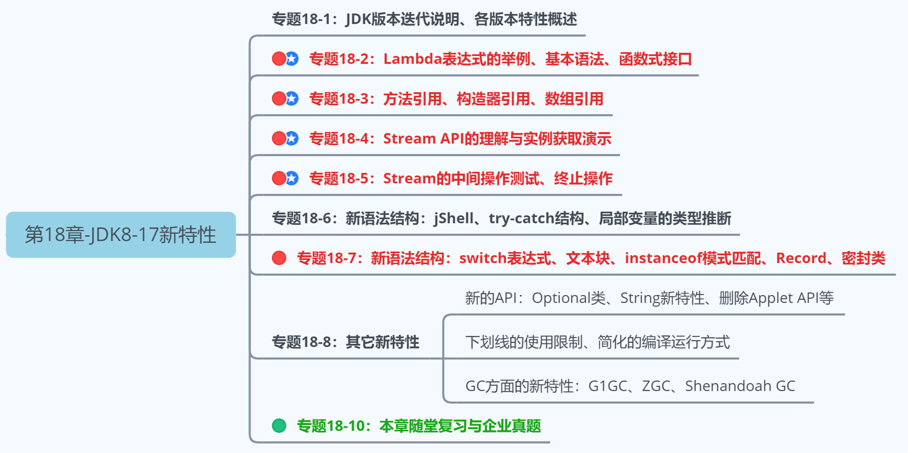


***

## 1. Java版本迭代概述

### 1.1 发布特点（小步快跑，快速迭代）

| 发行版本  |  发行时间  |                             备注                             |
| :-------: | :--------: | :----------------------------------------------------------: |
| Java 1.0  | 1996.01.23 |             Sun公司发布了Java的第一个开发工具包              |
| Java 5.0  | 2004.09.30 | ①版本号从1.4直接更新至5.0；②平台更名为JavaSE、JavaEE、JavaME |
| Java 8.0  | 2014.03.18 | 此版本是继Java 5.0以来变化最大的版本。是长期支持版本（`LTS`） |
| Java 9.0  | 2017.09.22 |                **此版本开始，每半年更新一次**                |
| Java 10.0 | 2018.03.21 |                                                              |
| Java 11.0 | 2018.09.25 |     JDK安装包取消独立JRE安装包，是长期支持版本（`LTS`）      |
| Java 12.0 | 2019.03.19 |                                                              |
|    ...    |    ...     |                                                              |
| Java17.0  |  2021.09   |   发布Java 17.0，版本号也称为21.9，是长期支持版本（`LTS`）   |
|    ...    |    ...     |                                                              |
| Java19.0  |  2022.09   |               发布Java19.0，版本号也称为22.9。               |

从Java 9 这个版本开始，Java 的计划发布周期是 `6个月`。

这意味着Java的更新从传统的以`特性驱动`的发布周期，转变为以`时间驱动`的发布模式，并且承诺不会跳票。通过这样的方式，开发团队可以把一些关键特性尽早合并到 JDK 之中，以快速得到开发者反馈，在一定程度上避免出现像 Java 9 两次被迫延迟发布的窘况。

针对企业客户的需求，Oracle 将以`三年`为周期发布长期支持版本（long term support）。

Oracle 的官方观点认为：**与 Java 7->8->9 相比，Java 9->10->11的升级和 8->8u20->8u40 更相似。**

新模式下的 Java 版本发布都会包含许多变更，包括`语言变更`和 `JVM 变更`，这两者都会对 IDE、字节码库和框架产生重大影响。此外，不仅会新增其他 API，还会有 `API被删除`（这在 Java 8 之前没有发生过）。

目前看这种发布策略是非常成功的，**解开了 Java/JVM 演进的许多枷锁，至关重要的是，OpenJDK 的权力中心，正在转移到开发社区和开发者手中。**在新的模式中，既可以利用 LTS 满足企业长期可靠支持的需求，也可以满足各种开发者对于新特性迭代的诉求。因为用 2-3 年的最小间隔粒度来试验一个特性，基本是不现实的。

### 1.2 名词解释

#### 名词解释：Oracle JDK和Open JDK

这两个JDK最大不同就是许可证不一样。**但是对于个人用户来讲，没区别。**

|              | Oracle JDK                                                   | Open JDK                  |
| ------------ | ------------------------------------------------------------ | ------------------------- |
| 来源         | Oracle团队维护                                               | Oracle和Open Java社区     |
| 授权协议     | Java 17及更高版本 Oracle Java SE 许可证<br>Java16及更低版本甲骨文免费条款和条件 （NFTC） 许可协议 | GPL v2许可证              |
| 关系         | 由Open JDK构建，增加了少许内容                               |                           |
| 是否收费     | 2021年9月起Java17及更高版本所有用户免费。 16及更低版本，个人用户、开发用户免费。 | 2017年9月起，所有版本免费 |
| 对语法的支持 | 一致                                                         | 一致                      |

#### 名词解释：JEP

JEP(JDK Enhancement Proposals)：jdk 改进提案，每当需要有新的设想时候，JEP可以提出非正式的规范(specification)，被正式认可的JEP正式写进JDK的发展路线图并分配版本号。

#### 名词解释：LTS

LTS（Long-term Support）即长期支持。Oracle官网提供了对Oracle JDK个别版本的长期支持，即使发发行了新版本，比如目前最新的JDK19，在结束日期前，LTS版本都会被长期支持。（出了bug，会被修复，非LTS则不会再有补丁发布）所以，一定要选一个LTS版本，不然出了漏洞没人修复了。

| 版本      | 开始日期  | 结束日期  | 延期结束日期 |
| --------- | --------- | --------- | ------------ |
| 7（LTS）  | 2011年7月 | 2019年7月 | 2022年7月    |
| 8（LTS）  | 2014年3月 | 2022年3月 | 2030年12月   |
| 11（LTS） | 2018年9月 | 2023年9月 | 2026年9月    |
| 17（LTS） | 2021年9月 | 2026年9月 | 2029年9月    |
| 21（LTS） | 2023年9月 | 2028年9月 | 2031年9月    |

如果要选择Oracle JDK，目前可选的LTS版本为8、11、17三个。

### 1.3 各版本支持时间路线图

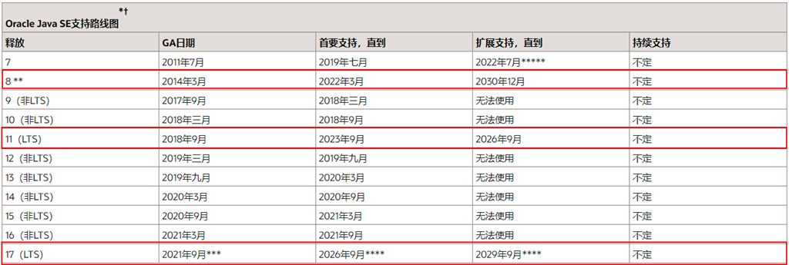

### 1.4 各版本介绍

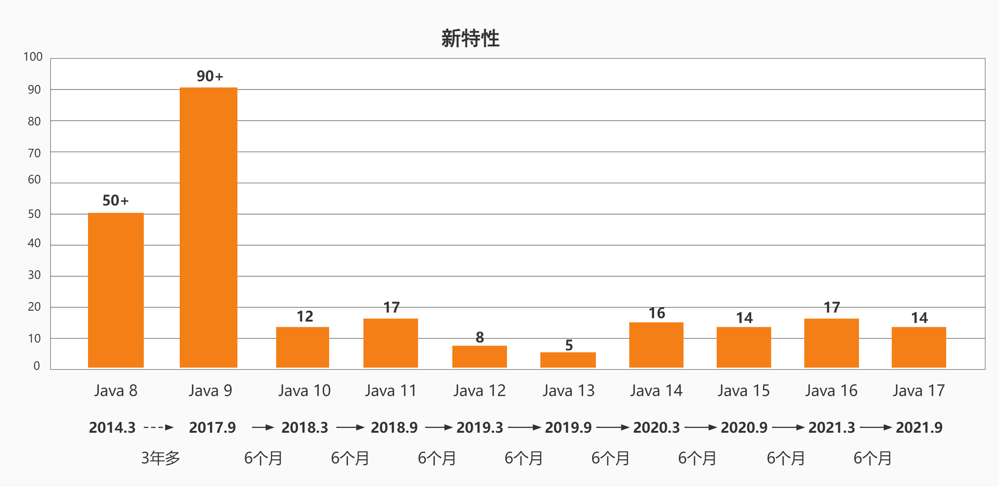

#### jdk 9

Java 9 提供了`超过150项`新功能特性，包括备受期待的模块化系统、可交互的 REPL 工具：jshell，JDK 编译工具，Java 公共 API 和私有代码，以及安全增强、扩展提升、性能管理改善等。

特性太多，查看链接：

https://openjdk.java.net/projects/jdk9/

#### jdk 10

https://openjdk.java.net/projects/jdk/10/

> 286: [Local-Variable Type Inference](http://openjdk.java.net/jeps/286) 局部变量类型推断
>  296: [Consolidate the JDK Forest into a Single Repository](http://openjdk.java.net/jeps/296) JDK库的合并
>  304: [Garbage-Collector Interface](http://openjdk.java.net/jeps/304) 统一的垃圾回收接口
>  307: [Parallel Full GC for G1](http://openjdk.java.net/jeps/307) 为G1提供并行的Full GC
>  310: [Application Class-Data Sharing](http://openjdk.java.net/jeps/310) 应用程序类数据（AppCDS）共享
>  312: [Thread-Local Handshakes](http://openjdk.java.net/jeps/312) ThreadLocal握手交互
>  313: [Remove the Native-Header Generation Tool (javah)](http://openjdk.java.net/jeps/313) 移除JDK中附带的javah工具
>  314: [Additional Unicode Language-Tag Extensions](http://openjdk.java.net/jeps/314) 使用附加的Unicode语言标记扩展
>  316: [Heap Allocation on Alternative Memory Devices](http://openjdk.java.net/jeps/316) 能将堆内存占用分配给用户指定的备用内存设备
>  317: [Experimental Java-Based JIT Compiler](http://openjdk.java.net/jeps/317) 使用Graal基于Java的编译器
>
> 319: [Root Certificates](http://openjdk.java.net/jeps/319) 根证书
>  322: [Time-Based Release Versioning](http://openjdk.java.net/jeps/322) 基于时间定于的发布版本

#### jdk 11

https://openjdk.java.net/projects/jdk/11/

> 181: [Nest-Based Access Control](https://openjdk.java.net/jeps/181)  基于嵌套的访问控制
> 309: [Dynamic Class-File Constants](https://openjdk.java.net/jeps/309) 动态类文件常量
> 315: [Improve Aarch64 Intrinsics](https://openjdk.java.net/jeps/315) 改进 Aarch64 Intrinsics
> 318: [Epsilon: A No-Op Garbage Collector](https://openjdk.java.net/jeps/318) Epsilon — 一个No-Op（无操作）的垃圾收集器
> 320: [Remove the Java EE and CORBA Modules](https://openjdk.java.net/jeps/320) 删除 Java EE 和 CORBA 模块
> 321: [HTTP Client (Standard)](https://openjdk.java.net/jeps/321)  HTTPClient API
> 323: [Local-Variable Syntax for Lambda Parameters](https://openjdk.java.net/jeps/323)  用于 Lambda 参数的局部变量语法
> 324: [Key Agreement with Curve25519 and Curve448](https://openjdk.java.net/jeps/324) Curve25519 和 Curve448 算法的密钥协议
> 327: [Unicode 10](https://openjdk.java.net/jeps/327)
> 328: [Flight Recorder](https://openjdk.java.net/jeps/328) 飞行记录仪
> 329: [ChaCha20 and Poly1305 Cryptographic Algorithms](https://openjdk.java.net/jeps/329) ChaCha20 和 Poly1305 加密算法
> 330: [Launch Single-File Source-Code Programs](https://openjdk.java.net/jeps/330) 启动单一文件的源代码程序
> 331: [Low-Overhead Heap Profiling](https://openjdk.java.net/jeps/331) 低开销的 Heap Profiling
> 332: [Transport Layer Security (TLS) 1.3](https://openjdk.java.net/jeps/332) 支持 TLS 1.3
> 333: [ZGC: A Scalable Low-Latency Garbage Collector
>    (Experimental)](https://openjdk.java.net/jeps/333) 可伸缩低延迟垃圾收集器
> 335: [Deprecate the Nashorn JavaScript Engine](https://openjdk.java.net/jeps/335) 弃用 Nashorn JavaScript 引擎
> 336: [Deprecate the Pack200 Tools and API](https://openjdk.java.net/jeps/336)  弃用 Pack200 工具和 API

#### jdk 12

https://openjdk.java.net/projects/jdk/12/

> 189：[Shenandoah: A Low-Pause-Time Garbage Collector (Experimental)](https://openjdk.java.net/jeps/189) 低暂停时间的GC
> 230: [Microbenchmark Suite](https://openjdk.java.net/jeps/230) 微基准测试套件
> 325: [Switch Expressions (Preview)](https://openjdk.java.net/jeps/325) switch表达式
> 334: [JVM Constants API ](https://openjdk.java.net/jeps/334) JVM常量API
> 340: [One AArch64 Port, Not Two](https://openjdk.java.net/jeps/340) 只保留一个AArch64实现
> 341: [Default CDS Archives](https://openjdk.java.net/jeps/341) 默认类数据共享归档文件
> 344: [Abortable Mixed Collections for G1](https://openjdk.java.net/jeps/344) 可中止的G1 Mixed GC
> 346: [Promptly Return Unused Committed Memory from G1](https://openjdk.java.net/jeps/346) G1及时返回未使用的已分配内存

#### jdk 13

https://openjdk.java.net/projects/jdk/13/

> 350: [Dynamic CDS Archives](https://openjdk.java.net/jeps/350) 动态CDS档案
> 351: [ZGC: Uncommit Unused Memory](https://openjdk.java.net/jeps/351) ZGC:取消使用未使用的内存
> 353: [Reimplement the Legacy Socket API](https://openjdk.java.net/jeps/353) 重新实现旧版套接字API
> 354: [Switch Expressions (Preview)](https://openjdk.java.net/jeps/354) switch表达式（预览）
> 355: [Text Blocks (Preview)](https://openjdk.java.net/jeps/355) 文本块（预览）

#### jdk 14

https://openjdk.java.net/projects/jdk/14/

> 305: [Pattern Matching for instanceof (Preview)](https://openjdk.java.net/jeps/305) instanceof的模式匹配
> 343: [Packaging Tool (Incubator)](https://openjdk.java.net/jeps/343) 打包工具
> 345: [NUMA-Aware Memory Allocation for G1](https://openjdk.java.net/jeps/345) G1的NUMA-Aware内存分配
> 349: [JFR Event Streaming](https://openjdk.java.net/jeps/349) JFR事件流
> 352: [Non-Volatile Mapped Byte Buffers](https://openjdk.java.net/jeps/352) 非易失性映射字节缓冲区
> 358: [Helpful NullPointerExceptions](https://openjdk.java.net/jeps/358) 实用的NullPointerExceptions
> 359: [Records (Preview)](https://openjdk.java.net/jeps/359) 
> 361: [Switch Expressions (Standard)](https://openjdk.java.net/jeps/361) Switch表达式
> 362: [Deprecate the Solaris and SPARC Ports](https://openjdk.java.net/jeps/362) 弃用Solaris和SPARC端口
> 363: [Remove the Concurrent Mark Sweep (CMS) Garbage Collector](https://openjdk.java.net/jeps/363) 删除并发标记扫描（CMS）垃圾回收器
> 364: [ZGC on macOS](https://openjdk.java.net/jeps/364) 
> 365: [ZGC on Windows](https://openjdk.java.net/jeps/365) 
> 366: [Deprecate the ParallelScavenge + SerialOld GC Combination](https://openjdk.java.net/jeps/366) 弃用ParallelScavenge + SerialOld GC组合
> 367: [Remove the Pack200 Tools and API](https://openjdk.java.net/jeps/367) 删除Pack200工具和API
> 368: [Text Blocks (Second Preview)](https://openjdk.java.net/jeps/368) 文本块
> 370: [Foreign-Memory Access API (Incubator)](https://openjdk.java.net/jeps/370) 外部存储器访问API

#### jdk 15

https://openjdk.java.net/projects/jdk/15/

> 339: [Edwards-Curve Digital Signature Algorithm (EdDSA)](https://openjdk.java.net/jeps/339) EdDSA 数字签名算法
> 360: [Sealed Classes (Preview)](https://openjdk.java.net/jeps/360) 密封类（预览）
> 371: [Hidden Classes](https://openjdk.java.net/jeps/371) 隐藏类
> 372: [Remove the Nashorn JavaScript Engine](https://openjdk.java.net/jeps/372) 移除 Nashorn JavaScript 引擎
> 373: [Reimplement the Legacy DatagramSocket API](https://openjdk.java.net/jeps/373) 重新实现 Legacy DatagramSocket API
> 374: [Disable and Deprecate Biased Locking](https://openjdk.java.net/jeps/374) 禁用偏向锁定
> 375: [Pattern Matching for instanceof (Second Preview)](https://openjdk.java.net/jeps/375) instanceof 模式匹配（第二次预览）
> 377: [ZGC: A Scalable Low-Latency Garbage Collector](https://openjdk.java.net/jeps/377) ZGC：一个可扩展的低延迟垃圾收集器
> 378: [Text Blocks](https://openjdk.java.net/jeps/378) 文本块
> 379: [Shenandoah: A Low-Pause-Time Garbage Collector](https://openjdk.java.net/jeps/379) Shenandoah:低暂停时间垃圾收集器
> 381: [Remove the Solaris and SPARC Ports](https://openjdk.java.net/jeps/381) 移除 Solaris 和 SPARC 端口
> 383: [Foreign-Memory Access API (Second Incubator)](https://openjdk.java.net/jeps/383) 外部存储器访问 API（第二次孵化版）
> 384: [Records (Second Preview)](https://openjdk.java.net/jeps/384) Records（第二次预览）
> 385: [Deprecate RMI Activation for Removal](https://openjdk.java.net/jeps/385) 废弃 RMI 激活机制

#### jdk 16

https://openjdk.java.net/projects/jdk/16/

> 338: [Vector API (Incubator)](https://openjdk.java.net/jeps/338) Vector API（孵化器）
> 347: [Enable C++14 Language Features](https://openjdk.java.net/jeps/347) JDK C++的源码中允许使用C++14的语言特性
> 357: [Migrate from Mercurial to Git](https://openjdk.java.net/jeps/357) OpenJDK源码的版本控制从Mercurial (hg) 迁移到git
> 369: [Migrate to GitHub](https://openjdk.java.net/jeps/369) OpenJDK源码的版本控制迁移到github上
> 376: [ZGC: Concurrent Thread-Stack Processing](https://openjdk.java.net/jeps/376) ZGC：并发线程处理
> 380: [Unix-Domain Socket Channels](https://openjdk.java.net/jeps/380) Unix域套接字通道
> 386: [Alpine Linux Port](https://openjdk.java.net/jeps/386) 将glibc的jdk移植到使用musl的alpine linux上
> 387: [Elastic Metaspace](https://openjdk.java.net/jeps/387) 弹性元空间
> 388: [Windows/AArch64 Port](https://openjdk.java.net/jeps/388) 移植JDK到Windows/AArch64
> 389: [Foreign Linker API (Incubator)](https://openjdk.java.net/jeps/389) 提供jdk.incubator.foreign来简化native code的调用
> 390: [Warnings for Value-Based Classes](https://openjdk.java.net/jeps/390) 提供基于值的类的警告
> 392: [Packaging Tool](https://openjdk.java.net/jeps/392) jpackage打包工具转正
> 393: [Foreign-Memory Access API (Third Incubator)](https://openjdk.java.net/jeps/393) 
> 394: [Pattern Matching for instanceof](https://openjdk.java.net/jeps/394) Instanceof的模式匹配转正
> 395: [Records](https://openjdk.java.net/jeps/395) Records转正
> 396: [Strongly Encapsulate JDK Internals by Default](https://openjdk.java.net/jeps/396) 默认情况下，封装了JDK内部构件
> 397: [Sealed Classes (Second Preview)](https://openjdk.java.net/jeps/397) 密封类

#### jdk 17

https://openjdk.java.net/projects/jdk/17/

> 306: [Restore Always-Strict Floating-Point Semantics](https://openjdk.java.net/jeps/306) 恢复始终严格的浮点语义
>
> 356: [Enhanced Pseudo-Random Number Generators](https://openjdk.java.net/jeps/356) 增强型伪随机数生成器
>
> 382: [New macOS Rendering Pipeline](https://openjdk.java.net/jeps/382) 新的macOS渲染管道
>
> 391: [macOS/AArch64 Port](https://openjdk.java.net/jeps/391) macOS/AArch64端口
>
> 398: [Deprecate the Applet API for Removal](https://openjdk.java.net/jeps/398) 弃用Applet API后续将进行删除
>
> 403: [Strongly Encapsulate JDK Internals](https://openjdk.java.net/jeps/403) 强封装JDK的内部API
>
> 406: [Pattern Matching for switch (Preview)](https://openjdk.java.net/jeps/406) switch模式匹配（预览）
>
> 407: [Remove RMI Activation](https://openjdk.java.net/jeps/407) 删除RMI激活机制
>
> 409: [Sealed Classes](https://openjdk.java.net/jeps/409) 密封类转正
>
> 410: [Remove the Experimental AOT and JIT Compiler](https://openjdk.java.net/jeps/410) 删除实验性的AOT和JIT编译器
>
> 411: [Deprecate the Security Manager for Removal](https://openjdk.java.net/jeps/411) 弃用即将删除的安全管理器
>
> 412: [Foreign Function & Memory API (Incubator)](https://openjdk.java.net/jeps/412) 外部函数和内存API（孵化特性）
>
> 414: [Vector API (Second Incubator)](https://openjdk.java.net/jeps/414) Vector API（第二次孵化特性）
>
> 415: [Context-Specific Deserialization Filters](https://openjdk.java.net/jeps/415) 上下文特定的反序列化过滤器

### 1.5 JDK各版本下载链接

```http
https://www.oracle.com/java/technologies/downloads/archive/
```

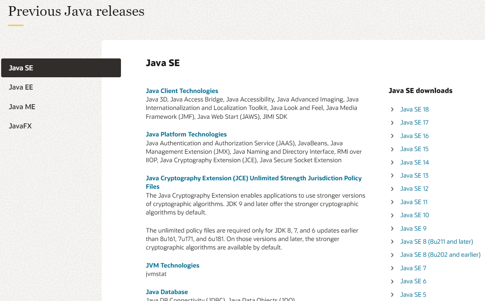

> 链接：https://pan.baidu.com/s/15QrBUOvfE9vjlTzN_EeVLg 
> 提取码：yyds 

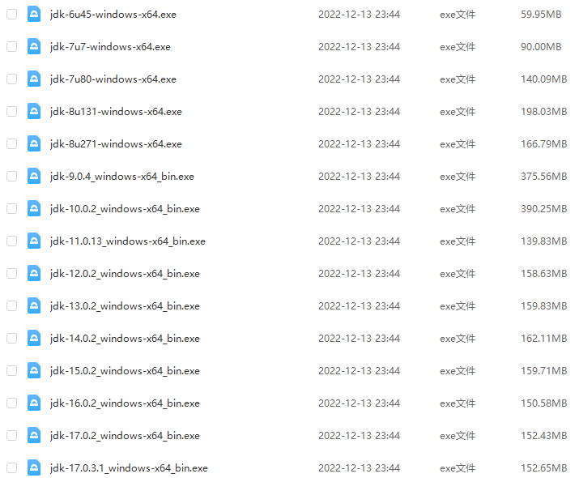

### 1.6 如何学习新特性

对于新特性，我们应该从哪几个角度学习新特性呢？

- 语法层面：

  - 比如JDK5中的自动拆箱、自动装箱、enum、泛型、
  - 比如JDK8中的lambda表达式、接口中的默认方法、静态方法
  - 比如JDK10中局部变量的类型推断
  - 比如JDK12中的switch
  - 比如JDK13中的文本块

- API层面：

  - 比如JDK8中的Stream、Optional、新的日期时间、HashMap的底层结构
  - 比如JDK9中String的底层结构
  - 新的 / 过时的 API

- 底层优化

  - 比如JDK8中永久代被元空间替代、新的JS执行引擎

  - 比如新的垃圾回收器、GC参数、JVM的优化


## 2. Java8新特性：Lambda表达式

### 2.1 关于Java8新特性简介

Java 8 (又称为 JDK 8或JDK1.8) 是 Java 语言开发的一个主要版本。 Java 8 是oracle公司于2014年3月发布，可以看成是自Java 5 以来最具革命性的版本。Java 8为Java语言、编译器、类库、开发工具与JVM带来了大量新特性。

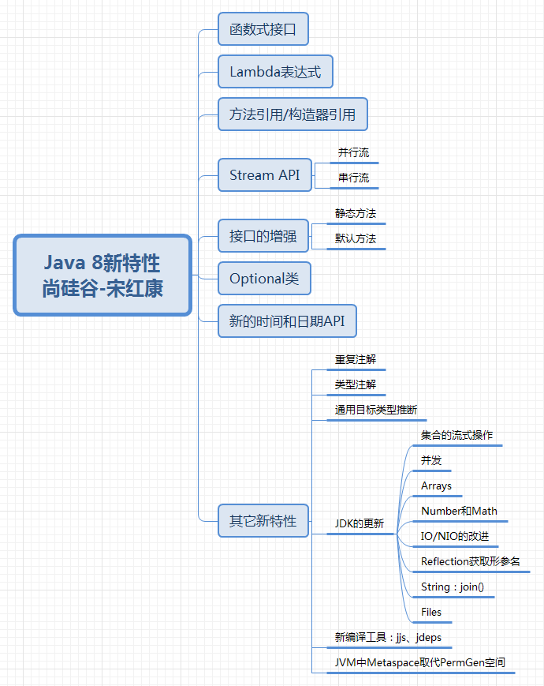

- 速度更快

- 代码更少(增加了新的语法：**Lambda** **表达式**)

- 强大的 **Stream API**

- 便于并行
  - **并行流**就是把一个内容分成多个数据块，并用不同的线程分别处理每个数据块的流。相比较串行的流，并行的流可以很大程度上提高程序的执行效率。
  - Java 8 中将并行进行了优化，我们可以很容易的对数据进行并行操作。Stream API 可以声明性地通过 parallel() 与 sequential() 在并行流与顺序流之间进行切换。

- 最大化减少空指针异常：Optional

- Nashorn引擎，允许在JVM上运行JS应用
  - 发音“nass-horn”，是德国二战时一个坦克的命名
  - javascript运行在jvm已经不是新鲜事了，Rhino早在jdk6的时候已经存在。现在替代Rhino，官方的解释是Rhino相比其他JavaScript引擎（比如google的V8）实在太慢了，改造Rhino还不如重写。所以Nashorn的性能也是其一个亮点。
  - Nashorn 项目在 JDK 9 中得到改进；在JDK11 中`Deprecated`，后续JDK15版本中`remove`。在JDK11中取以代之的是GraalVM。（GraalVM是一个运行时平台，它支持Java和其他基于Java字节码的语言，但也支持其他语言，如JavaScript，Ruby，Python或LLVM。性能是Nashorn的2倍以上。）

### 2.2 冗余的匿名内部类

当需要启动一个线程去完成任务时，通常会通过`java.lang.Runnable`接口来定义任务内容，并使用`java.lang.Thread`类来启动该线程。代码如下：

```java
package com.atguigu.fp;

public class UseFunctionalProgramming {
    public static void main(String[] args) {
        new Thread(new Runnable() {
            @Override
            public void run() {
                System.out.println("多线程任务执行！");
            }
        }).start(); // 启动线程
    }
}
```

本着“一切皆对象”的思想，这种做法是无可厚非的：首先创建一个`Runnable`接口的匿名内部类对象来指定任务内容，再将其交给一个线程来启动。

**代码分析：**

对于`Runnable`的匿名内部类用法，可以分析出几点内容：

* `Thread`类需要`Runnable`接口作为参数，其中的抽象`run`方法是用来指定线程任务内容的核心；
* 为了指定`run`的方法体，**不得不**需要`Runnable`接口的实现类；
* 为了省去定义一个`RunnableImpl`实现类的麻烦，**不得不**使用匿名内部类；
* 必须覆盖重写抽象`run`方法，所以方法名称、方法参数、方法返回值**不得不**再写一遍，且不能写错；
* 而实际上，**似乎只有方法体才是关键所在**。

> Lambda表达式的本质：
>
> 一方面，lambda表达式作为接口的实现类的对象。  ---> "万事万物皆对象"
> 另一方面，lambda表达式是一个匿名函数。

### 2.3 好用的lambda表达式

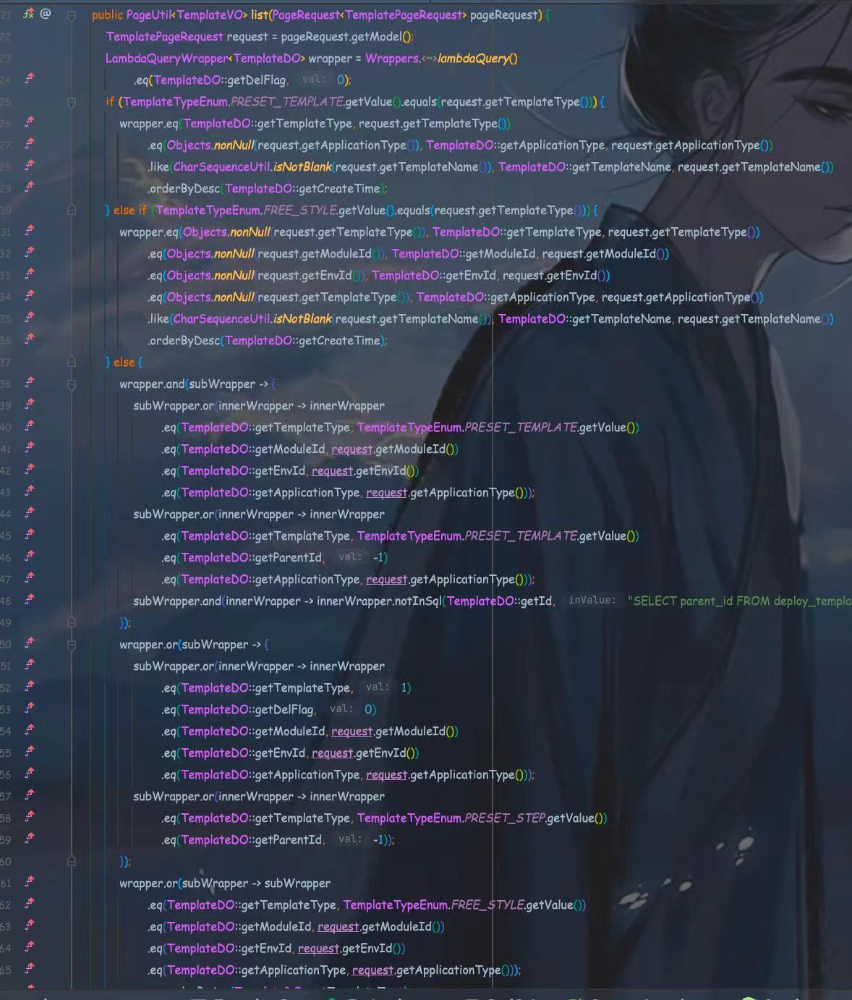

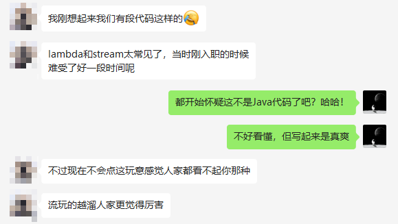

### 2.4 Lambda 及其使用举例

Lambda 是一个**匿名函数**，我们可以把 Lambda 表达式理解为是**一段可以传递的代码**（将代码像数据一样进行传递）。使用它可以写出更简洁、更灵活的代码。作为一种更紧凑的代码风格，使Java的语言表达能力得到了提升。

- 从匿名类到 Lambda 的转换举例1

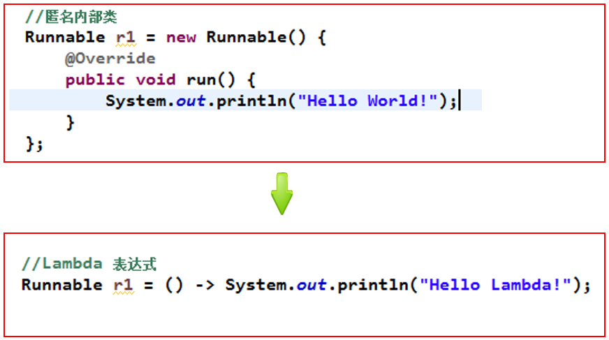

- 从匿名类到 Lambda 的转换举例2

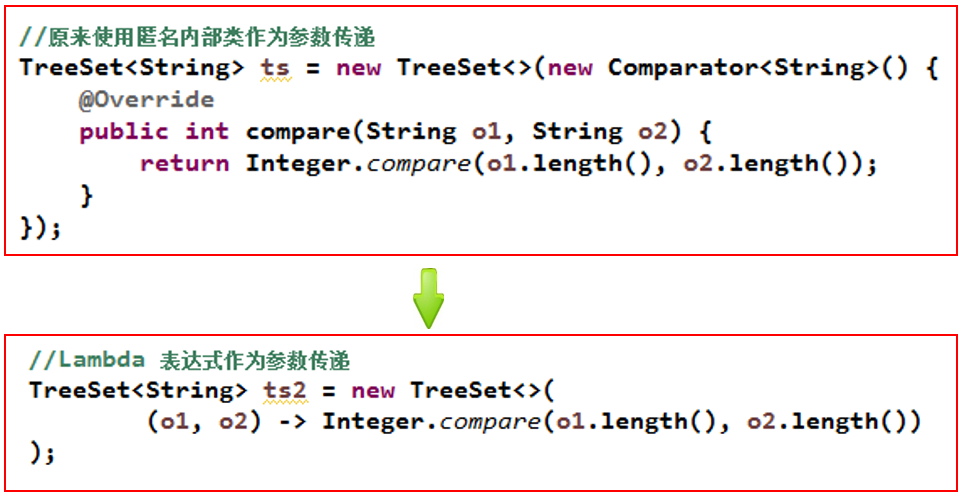

### 2.5 语法

Lambda 表达式：在Java 8 语言中引入的一种新的语法元素和操作符。这个操作符为 “`->`” ， 该操作符被称为 `Lambda 操作符`或`箭头操作符`。它将 Lambda 分为两个部分：

- 左侧：指定了 Lambda 表达式需要的参数列表
- 右侧：指定了 Lambda 体，是抽象方法的实现逻辑，也即 Lambda 表达式要执行的功能。


 **Lambda表达式的语法规则总结**

`->` 的左边：lambda形参列表，参数的类型都可以省略。如果形参只有一个，则一对()也可以省略。

`->` 的右边：lambda体，对应着重写的方法的方法体。如果方法体中只有一行执行语句，则一对{}可以省略。
                                       如果有return关键字，则必须一并省略。

**语法格式一：**无参，无返回值

```java
@Test
public void test1(){
    //未使用Lambda表达式
    Runnable r1 = new Runnable() {
        @Override
        public void run() {
            System.out.println("我爱北京天安门");
        }
    };

    r1.run();

    System.out.println("***********************");

    //使用Lambda表达式
    Runnable r2 = () -> {
        System.out.println("我爱北京故宫");
    };

    r2.run();
}
```


**语法格式二：**Lambda 需要一个参数，但是没有返回值。

```java
@Test
public void test2(){
    //未使用Lambda表达式
    Consumer<String> con = new Consumer<String>() {
        @Override
        public void accept(String s) {
            System.out.println(s);
        }
    };
    con.accept("谎言和誓言的区别是什么？");

    System.out.println("*******************");

    //使用Lambda表达式
    Consumer<String> con1 = (String s) -> {
        System.out.println(s);
    };
    con1.accept("一个是听得人当真了，一个是说的人当真了");

}
```


**语法格式三：**数据类型可以省略，因为可由编译器推断得出，称为“类型推断”

```java
@Test
public void test3(){
    //语法格式三使用前
    Consumer<String> con1 = (String s) -> {
        System.out.println(s);
    };
    con1.accept("一个是听得人当真了，一个是说的人当真了");

    System.out.println("*******************");
    //语法格式三使用后
    Consumer<String> con2 = (s) -> {
        System.out.println(s);
    };
    con2.accept("一个是听得人当真了，一个是说的人当真了");

}
```


**语法格式四：**Lambda 若只需要一个参数时，参数的小括号可以省略

```java
@Test
public void test4(){
    //语法格式四使用前
    Consumer<String> con1 = (s) -> {
        System.out.println(s);
    };
    con1.accept("一个是听得人当真了，一个是说的人当真了");

    System.out.println("*******************");
    //语法格式四使用后
    Consumer<String> con2 = s -> {
        System.out.println(s);
    };
    con2.accept("一个是听得人当真了，一个是说的人当真了");


}
```


**语法格式五：**Lambda 需要两个或以上的参数，多条执行语句，并且可以有返回值

```java
@Test
public void test5(){
    //语法格式五使用前
    Comparator<Integer> com1 = new Comparator<Integer>() {
        @Override
        public int compare(Integer o1, Integer o2) {
            System.out.println(o1);
            System.out.println(o2);
            return o1.compareTo(o2);
        }
    };

    System.out.println(com1.compare(12,21));
    System.out.println("*****************************");
    //语法格式五使用后
    Comparator<Integer> com2 = (o1,o2) -> {
        System.out.println(o1);
        System.out.println(o2);
        return o1.compareTo(o2);
    };

    System.out.println(com2.compare(12,6));


}
```


**语法格式六：**当 Lambda 体只有一条语句时，return 与大括号若有，都可以省略

```java
@Test
public void test6(){
    //语法格式六使用前
    Comparator<Integer> com1 = (o1,o2) -> {
        return o1.compareTo(o2);
    };

    System.out.println(com1.compare(12,6));

    System.out.println("*****************************");
    //语法格式六使用后
    Comparator<Integer> com2 = (o1,o2) -> o1.compareTo(o2);

    System.out.println(com2.compare(12,21));

}

@Test
public void test7(){
    //语法格式六使用前
    Consumer<String> con1 = s -> {
        System.out.println(s);
    };
    con1.accept("一个是听得人当真了，一个是说的人当真了");

    System.out.println("*****************************");
    //语法格式六使用后
    Consumer<String> con2 = s -> System.out.println(s);

    con2.accept("一个是听得人当真了，一个是说的人当真了");

}
```


### 2.6 关于类型推断

在语法格式三 Lambda 表达式中的参数类型都是由编译器推断得出的。Lambda 表达式中无需指定类型，程序依然可以编译，这是因为 javac 根据程序的上下文，在后台推断出了参数的类型。Lambda 表达式的类型依赖于上下文环境，是由编译器推断出来的。这就是所谓的“`类型推断`”。

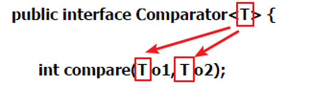

举例：

```java
@Test
public void test() {
    //类型推断1
    ArrayList<String> list = new ArrayList<>();
    //类型推断2
    int[] arr = {1, 2, 3};

}
```


## 3. Java8新特性：函数式(Functional)接口

### 3.1 什么是函数式接口

- 只包含`一个抽象方法`（Single Abstract Method，简称SAM）的接口，称为函数式接口。当然该接口可以包含其他非抽象方法。
- 你可以通过 Lambda 表达式来创建该接口的对象。（若 Lambda 表达式抛出一个受检异常(即：非运行时异常)，那么该异常需要在目标接口的抽象方法上进行声明）。
- 我们可以在一个接口上使用 `@FunctionalInterface` 注解，这样做可以检查它是否是一个函数式接口。同时 javadoc 也会包含一条声明，说明这个接口是一个函数式接口。
- 在`java.util.function`包下定义了Java 8 的丰富的函数式接口

### 3.2 如何理解函数式接口


- Java从诞生日起就是一直倡导“一切皆对象”，在Java里面面向对象(OOP)编程是一切。但是随着python、scala等语言的兴起和新技术的挑战，Java不得不做出调整以便支持更加广泛的技术要求，即Java不但可以支持OOP还可以支持OOF（面向函数编程）
  - Java8引入了Lambda表达式之后，Java也开始支持函数式编程。
  - Lambda表达式不是Java最早使用的。目前C++，C#，Python，Scala等均支持Lambda表达式。
- 面向对象的思想：
  * 做一件事情，找一个能解决这个事情的对象，调用对象的方法，完成事情。
- 函数式编程思想：
  * 只要能获取到结果，谁去做的，怎么做的都不重要，重视的是结果，不重视过程。
- 在函数式编程语言当中，函数被当做一等公民对待。在将函数作为一等公民的编程语言中，Lambda表达式的类型是函数。但是在Java8中，有所不同。在Java8中，Lambda表达式是对象，而不是函数，它们必须依附于一类特别的对象类型——函数式接口。
- 简单的说，在Java8中，Lambda表达式就是一个函数式接口的实例。这就是Lambda表达式和函数式接口的关系。也就是说，只要一个对象是函数式接口的实例，那么该对象就可以用Lambda表达式来表示。

### 3.3 举例

举例1：

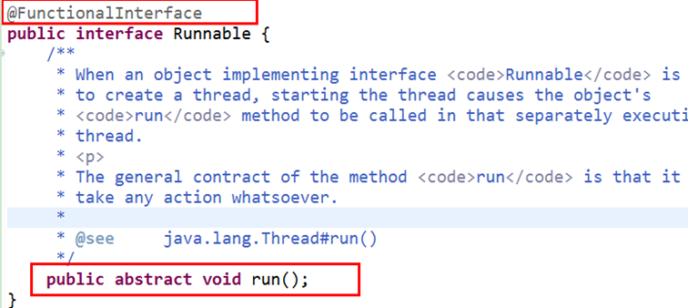

举例2：

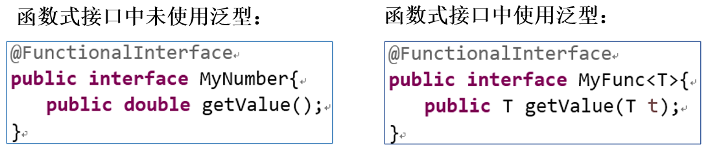

作为参数传递 Lambda 表达式：

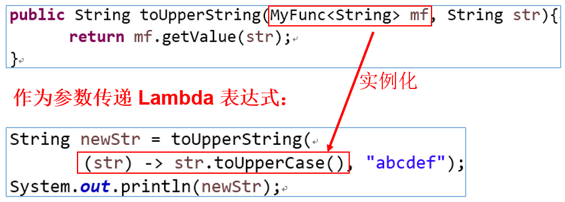

> 作为参数传递 Lambda 表达式：为了将 Lambda 表达式作为参数传递，接收Lambda 表达式的参数类型必须是与该 Lambda 表达式兼容的函数式接口的类型。

### 3.4 Java 内置函数式接口

#### 3.4.1 之前的函数式接口

之前学过的接口，有些就是函数式接口，比如：

- java.lang.Runnable
  - public void run()
- `java.lang.Iterable<T>`
  - `public Iterator<T> iterate()`
- `java.lang.Comparable<T>`
  - public int compareTo(T t)
- `java.util.Comparator<T>`
  - public int compare(T t1, T t2)

#### 3.4.2 四大核心函数式接口

| 函数式接口         | 称谓       | 参数类型 | 用途                                                         |
| ------------------ | ---------- | -------- | ------------------------------------------------------------ |
| `Consumer<T>  `    | 消费型接口 | T        | 对类型为T的对象应用操作，包含方法：  `void accept(T t)  `    |
| `Supplier<T>  `    | 供给型接口 | 无       | 返回类型为T的对象，包含方法：`T get()  `                     |
| `Function<T, R>  ` | 函数型接口 | T        | 对类型为T的对象应用操作，并返回结果。结果是R类型的对象。包含方法：`R apply(T t)  ` |
| `Predicate<T>  `   | 判断型接口 | T        | 确定类型为T的对象是否满足某约束，并返回 boolean 值。包含方法：`boolean test(T t)  ` |

#### 3.4.3 其它接口

**类型1：消费型接口**

消费型接口的抽象方法特点：有形参，但是返回值类型是void

| 接口名               | 抽象方法                       | 描述                       |
| -------------------- | ------------------------------ | -------------------------- |
| BiConsumer<T,U>      | void accept(T t, U u)          | 接收两个对象用于完成功能   |
| DoubleConsumer       | void accept(double value)      | 接收一个double值           |
| IntConsumer          | void accept(int value)         | 接收一个int值              |
| LongConsumer         | void accept(long value)        | 接收一个long值             |
| ObjDoubleConsumer<T> | void accept(T t, double value) | 接收一个对象和一个double值 |
| ObjIntConsumer<T>    | void accept(T t, int value)    | 接收一个对象和一个int值    |
| ObjLongConsumer<T>   | void accept(T t, long value)   | 接收一个对象和一个long值   |

**类型2：供给型接口**

这类接口的抽象方法特点：无参，但是有返回值

| 接口名          | 抽象方法               | 描述              |
| --------------- | ---------------------- | ----------------- |
| BooleanSupplier | boolean getAsBoolean() | 返回一个boolean值 |
| DoubleSupplier  | double getAsDouble()   | 返回一个double值  |
| IntSupplier     | int getAsInt()         | 返回一个int值     |
| LongSupplier    | long getAsLong()       | 返回一个long值    |

**类型3：函数型接口**

这类接口的抽象方法特点：既有参数又有返回值

| 接口名                  | 抽象方法                                        | 描述                                                |
| ----------------------- | ----------------------------------------------- | --------------------------------------------------- |
| UnaryOperator<T>        | T apply(T t)                                    | 接收一个T类型对象，返回一个T类型对象结果            |
| DoubleFunction<R>       | R apply(double value)                           | 接收一个double值，返回一个R类型对象                 |
| IntFunction<R>          | R apply(int value)                              | 接收一个int值，返回一个R类型对象                    |
| LongFunction<R>         | R apply(long value)                             | 接收一个long值，返回一个R类型对象                   |
| ToDoubleFunction<T>     | double applyAsDouble(T value)                   | 接收一个T类型对象，返回一个double                   |
| ToIntFunction<T>        | int applyAsInt(T value)                         | 接收一个T类型对象，返回一个int                      |
| ToLongFunction<T>       | long applyAsLong(T value)                       | 接收一个T类型对象，返回一个long                     |
| DoubleToIntFunction     | int applyAsInt(double value)                    | 接收一个double值，返回一个int结果                   |
| DoubleToLongFunction    | long applyAsLong(double value)                  | 接收一个double值，返回一个long结果                  |
| IntToDoubleFunction     | double applyAsDouble(int value)                 | 接收一个int值，返回一个double结果                   |
| IntToLongFunction       | long applyAsLong(int value)                     | 接收一个int值，返回一个long结果                     |
| LongToDoubleFunction    | double applyAsDouble(long value)                | 接收一个long值，返回一个double结果                  |
| LongToIntFunction       | int applyAsInt(long value)                      | 接收一个long值，返回一个int结果                     |
| DoubleUnaryOperator     | double applyAsDouble(double operand)            | 接收一个double值，返回一个double                    |
| IntUnaryOperator        | int applyAsInt(int operand)                     | 接收一个int值，返回一个int结果                      |
| LongUnaryOperator       | long applyAsLong(long operand)                  | 接收一个long值，返回一个long结果                    |
| BiFunction<T,U,R>       | R apply(T t, U u)                               | 接收一个T类型和一个U类型对象，返回一个R类型对象结果 |
| BinaryOperator<T>       | T apply(T t, T u)                               | 接收两个T类型对象，返回一个T类型对象结果            |
| ToDoubleBiFunction<T,U> | double applyAsDouble(T t, U u)                  | 接收一个T类型和一个U类型对象，返回一个double        |
| ToIntBiFunction<T,U>    | int applyAsInt(T t, U u)                        | 接收一个T类型和一个U类型对象，返回一个int           |
| ToLongBiFunction<T,U>   | long applyAsLong(T t, U u)                      | 接收一个T类型和一个U类型对象，返回一个long          |
| DoubleBinaryOperator    | double applyAsDouble(double left, double right) | 接收两个double值，返回一个double结果                |
| IntBinaryOperator       | int applyAsInt(int left, int right)             | 接收两个int值，返回一个int结果                      |
| LongBinaryOperator      | long applyAsLong(long left, long right)         | 接收两个long值，返回一个long结果                    |

**类型4：判断型接口**

这类接口的抽象方法特点：有参，但是返回值类型是boolean结果。

| 接口名           | 抽象方法                   | 描述             |
| ---------------- | -------------------------- | ---------------- |
| BiPredicate<T,U> | boolean test(T t, U u)     | 接收两个对象     |
| DoublePredicate  | boolean test(double value) | 接收一个double值 |
| IntPredicate     | boolean test(int value)    | 接收一个int值    |
| LongPredicate    | boolean test(long value)   | 接收一个long值   |

#### 3.4.4 内置接口代码演示

举例1：

```java
package com.atguigu.four;

import java.util.Arrays;
import java.util.List;

public class TestConsumer {
    public static void main(String[] args) {
        List<String> list = Arrays.asList("java","c","python","c++","VB","C#");
        //遍历Collection集合，并将传递给action参数的操作代码应用在每一个元素上。
        list.forEach(s -> System.out.println(s));
    }
}
```

举例2：

```java
package com.atguigu.four;

import java.util.function.Supplier;

public class TestSupplier {
    public static void main(String[] args) {
        Supplier<String> supplier = () -> "尚硅谷";
        System.out.println(supplier.get());
    }
}
```

举例3：

```java
package com.atguigu.four;

import java.util.ArrayList;

public class TestPredicate {
    public static void main(String[] args) {
        ArrayList<String> list = new ArrayList<>();
        list.add("hello");
        list.add("java");
        list.add("atguigu");
        list.add("ok");
        list.add("yes");

        System.out.println("删除之前：");
        list.forEach(t-> System.out.println(t));
		
        //用于删除集合中满足filter指定的条件判断的。
        //删除包含o字母的元素
        list.removeIf(s -> s.contains("o"));

        System.out.println("删除包含o字母的元素之后：");
        list.forEach(t-> System.out.println(t));
    }
}
```

举例4：

```java
package com.atguigu.four;

import java.util.function.Function;

public class TestFunction {
    public static void main(String[] args) {
        //使用Lambda表达式实现Function<T,R>接口，可以实现将一个字符串首字母转为大写的功能。
        Function<String,String> fun = s -> s.substring(0,1).toUpperCase() + s.substring(1);
        System.out.println(fun.apply("hello"));
    }
}

```

#### 3.4.5 练习

**练习1：无参无返回值形式**

假如有自定义函数式接口Call如下：

```java
public interface Call {
    void shout();
}
```

在测试类中声明一个如下方法：

```java
public static void callSomething(Call call){
		call.shout();
}
```

在测试类的main方法中调用callSomething方法，并用Lambda表达式为形参call赋值，可以喊出任意你想说的话。

```java
public class TestLambda {
	public static void main(String[] args) {
		callSomething(()->System.out.println("回家吃饭"));
		callSomething(()->System.out.println("我爱你"));
		callSomething(()->System.out.println("滚蛋"));
		callSomething(()->System.out.println("回来"));
	}
	public static void callSomething(Call call){
		call.shout();
	}
}
interface Call {
    void shout();
}
```

**练习2：消费型接口**

代码示例：Consumer<T>接口

在JDK1.8中Collection集合接口的父接口Iterable接口中增加了一个默认方法：

`public default void forEach(Consumer<? super T> action) `遍历Collection集合的每个元素，执行“xxx消费型”操作。

在JDK1.8中Map集合接口中增加了一个默认方法：

`public default void forEach(BiConsumer<? super K,? super V> action)`遍历Map集合的每对映射关系，执行“xxx消费型”操作。

案例：

（1）创建一个Collection系列的集合，添加一些字符串，调用forEach方法遍历查看

（2）创建一个Map系列的集合，添加一些(key,value)键值对，调用forEach方法遍历查看

示例代码：

```java
	@Test
	public void test1(){
		List<String> list = Arrays.asList("hello","java","lambda","atguigu");
		list.forEach(s -> System.out.println(s));
    }
	@Test
	public void test2(){
		HashMap<Integer,String> map = new HashMap<>();
		map.put(1, "hello");
		map.put(2, "java");
		map.put(3, "lambda");
		map.put(4, "atguigu");
		map.forEach((k,v) -> System.out.println(k+"->"+v));
	}
```

**练习3：供给型接口**

代码示例：Supplier<T>接口

在JDK1.8中增加了StreamAPI，java.util.stream.Stream<T>是一个数据流。这个类型有一个静态方法：

`public static <T> Stream<T> generate(Supplier<T> s)`可以创建Stream的对象。而又包含一个forEach方法可以遍历流中的元素：`public void forEach(Consumer<? super T> action)`。

案例：

现在请调用Stream的generate方法，来产生一个流对象，并调用Math.random()方法来产生数据，为Supplier函数式接口的形参赋值。最后调用forEach方法遍历流中的数据查看结果。

```java
	@Test
	public void test2(){
		Stream.generate(() -> Math.random()).forEach(num -> System.out.println(num));
	}
```

**练习4：功能型接口**

代码示例：Function<T,R>接口

在JDK1.8时Map接口增加了很多方法，例如：

`public default void replaceAll(BiFunction<? super K,? super V,? extends V> function) `按照function指定的操作替换map中的value。

`public default void forEach(BiConsumer<? super K,? super V> action)`遍历Map集合的每对映射关系，执行“xxx消费型”操作。

案例：

（1）声明一个Employee员工类型，包含编号、姓名、薪资。

（2）添加n个员工对象到一个HashMap<Integer,Employee>集合中，其中员工编号为key，员工对象为value。

（3）调用Map的forEach遍历集合

（4）调用Map的replaceAll方法，将其中薪资低于10000元的，薪资设置为10000。

（5）再次调用Map的forEach遍历集合查看结果

Employee类：

```java
class Employee{
	private int id;
	private String name;
	private double salary;
	public Employee(int id, String name, double salary) {
		super();
		this.id = id;
		this.name = name;
		this.salary = salary;
	}
	public Employee() {
		super();
	}
	public int getId() {
		return id;
	}
	public void setId(int id) {
		this.id = id;
	}
	public String getName() {
		return name;
	}
	public void setName(String name) {
		this.name = name;
	}
	public double getSalary() {
		return salary;
	}
	public void setSalary(double salary) {
		this.salary = salary;
	}
	@Override
	public String toString() {
		return "Employee [id=" + id + ", name=" + name + ", salary=" + salary + "]";
	}
	
}
```

测试类：

```java
import java.util.HashMap;

public class TestLambda {
	public static void main(String[] args) {
		HashMap<Integer,Employee> map = new HashMap<>();
		Employee e1 = new Employee(1, "张三", 8000);
		Employee e2 = new Employee(2, "李四", 9000);
		Employee e3 = new Employee(3, "王五", 10000);
		Employee e4 = new Employee(4, "赵六", 11000);
		Employee e5 = new Employee(5, "钱七", 12000);
		
		map.put(e1.getId(), e1);
		map.put(e2.getId(), e2);
		map.put(e3.getId(), e3);
		map.put(e4.getId(), e4);
		map.put(e5.getId(), e5);
		
		map.forEach((k,v) -> System.out.println(k+"="+v));
		System.out.println();
		
		map.replaceAll((k,v)->{
			if(v.getSalary()<10000){
				v.setSalary(10000);
			}
			return v;
		});
		map.forEach((k,v) -> System.out.println(k+"="+v));
	}
}
```

**练习5：判断型接口**

代码示例：Predicate<T>接口

JDK1.8时，Collecton<E>接口增加了一下方法，其中一个如下：

`public default boolean removeIf(Predicate<? super E> filter)` 用于删除集合中满足filter指定的条件判断的。

`public default void forEach(Consumer<? super T> action) `遍历Collection集合的每个元素，执行“xxx消费型”操作。

案例：

（1）添加一些字符串到一个Collection集合中

（2）调用forEach遍历集合

（3）调用removeIf方法，删除其中字符串的长度<5的

（4）再次调用forEach遍历集合

```java
import java.util.ArrayList;

public class TestLambda {
	public static void main(String[] args) {
		ArrayList<String> list = new ArrayList<>();
		list.add("hello");
		list.add("java");
		list.add("atguigu");
		list.add("ok");
		list.add("yes");
		
		list.forEach(str->System.out.println(str));
		System.out.println();
		
		list.removeIf(str->str.length()<5);
		list.forEach(str->System.out.println(str));
	}
}
```

**练习6：判断型接口**

案例：

（1）声明一个Employee员工类型，包含编号、姓名、性别，年龄，薪资。

（2）声明一个EmployeeSerice员工管理类，包含一个ArrayList<Employee>集合的属性all，在EmployeeSerice的构造器中，创建一些员工对象，为all集合初始化。

（3）在EmployeeSerice员工管理类中，声明一个方法：ArrayList<Employee> get(Predicate<Employee> p)，即将满足p指定的条件的员工，添加到一个新的ArrayList<Employee> 集合中返回。

（4）在测试类中创建EmployeeSerice员工管理类的对象，并调用get方法，分别获取：

* 所有员工对象
* 所有年龄超过35的员工
* 所有薪资高于15000的女员工
* 所有编号是偶数的员工
* 名字是“张三”的员工
* 年龄超过25，薪资低于10000的男员工

示例代码：

Employee类：

```java
public class Employee{
	private int id;
	private String name;
	private char gender;
	private int age;
	private double salary;
	
	public Employee(int id, String name, char gender, int age, double salary) {
		super();
		this.id = id;
		this.name = name;
		this.gender = gender;
		this.age = age;
		this.salary = salary;
	}
	public Employee() {
		super();
	}
	public int getId() {
		return id;
	}
	public void setId(int id) {
		this.id = id;
	}
	public String getName() {
		return name;
	}
	public void setName(String name) {
		this.name = name;
	}
	public double getSalary() {
		return salary;
	}
	public void setSalary(double salary) {
		this.salary = salary;
	}
	@Override
	public String toString() {
		return "Employee [id=" + id + ", name=" + name + ", gender=" + gender + ", age=" + age + ", salary=" + salary
				+ "]";
	}
}
```

员工管理类：

```java
class EmployeeService{
	private ArrayList<Employee> all;
	public EmployeeService(){
		all = new ArrayList<Employee>();
		all.add(new Employee(1, "张三", '男', 33, 8000));
		all.add(new Employee(2, "翠花", '女', 23, 18000));
		all.add(new Employee(3, "无能", '男', 46, 8000));
		all.add(new Employee(4, "李四", '女', 23, 9000));
		all.add(new Employee(5, "老王", '男', 23, 15000));
		all.add(new Employee(6, "大嘴", '男', 23, 11000));
	}
	public ArrayList<Employee> get(Predicate<Employee> p){
		ArrayList<Employee> result = new ArrayList<Employee>();
		for (Employee emp : result) {
			if(p.test(emp)){
				result.add(emp);
			}
		}
		return result;
	}
}
```

测试类：

```java
public class TestLambda {
	public static void main(String[] args) {
		EmployeeService es = new EmployeeService();
		
		es.get(e -> true).forEach(e->System.out.println(e));
		System.out.println();
		es.get(e -> e.getAge()>35).forEach(e->System.out.println(e));
		System.out.println();
		es.get(e -> e.getSalary()>15000 && e.getGender()=='女').forEach(e->System.out.println(e));
		System.out.println();
		es.get(e -> e.getId()%2==0).forEach(e->System.out.println(e));
		System.out.println();
		es.get(e -> "张三".equals(e.getName())).forEach(e->System.out.println(e));
		System.out.println();
		es.get(e -> e.getAge()>25 && e.getSalary()<10000 && e.getGender()=='男').forEach(e->System.out.println(e));
	}
}
```

## 4. Java8新特性：方法引用与构造器引用

Lambda表达式是可以简化函数式接口的变量或形参赋值的语法。而方法引用和构造器引用是为了简化Lambda表达式的。

### 4.1 方法引用

**当要传递给Lambda体的操作，已经有实现的方法了，可以使用方法引用！**

方法引用可以看做是Lambda表达式深层次的表达。换句话说，方法引用就是Lambda表达式，也就是函数式接口的一个实例，通过方法的名字来指向一个方法，可以认为是Lambda表达式的一个语法糖。

> 语法糖（Syntactic sugar），也译为糖衣语法，是由英国计算机科学家彼得·约翰·兰达（Peter J. Landin）发明的一个术语，指计算机语言中添加的某种语法，这种语法`对语言的功能并没有影响，但是更方便程序员使用`。通常来说使用语法糖能够增加程序的可读性，从而减少程序代码出错的机会。

#### 4.1.1 方法引用格式

- 格式：使用方法引用操作符 “`::`” 将类(或对象) 与 方法名分隔开来。
  - 两个:中间不能有空格，而且必须英文状态下半角输入

- 如下三种主要使用情况：
  - 情况1：`对象 :: 实例方法名`
  - 情况2：`类 :: 静态方法名`
  - 情况3：`类 :: 实例方法名`

#### 4.1.2 方法引用使用前提 及案例

**要求1：**Lambda体只有一句语句，并且是通过调用一个对象的/类现有的方法来完成的

例如：System.out对象，调用println()方法来完成Lambda体

​           Math类，调用random()静态方法来完成Lambda体

**要求2：**

+ 针对情况1：函数式接口中的**抽象方法a在被重写时使用了某一个对象的方法b**。如果方法a的形参列表、返回值类型与方法b的**形参列表、返回值类型都相同**，则我们可以使用方法b实现对方法a的重写、替换。

注意：此方法b是非静态的方法，需要对象调用。

```java
	// 情况一：对象 :: 实例方法
	//Consumer中的void accept(T t)
	//PrintStream中的void println(T t)
	@Test
	public void test1() {
		Consumer<String> con1 = str -> System.out.println(str);//调用了System.out实例的方法
		con1.accept("北京");

		System.out.println("*******************");
		PrintStream ps = System.out;
		Consumer<String> con2 = ps::println;
		con2.accept("beijing");
	}
	
	//Supplier中的T get()
	//Employee中的String getName()
	@Test
	public void test2() {
		Employee emp = new Employee(1001,"Tom",23,5600);

		Supplier<String> sup1 = () -> emp.getName();
		System.out.println(sup1.get());

		System.out.println("*******************");
		Supplier<String> sup2 = emp::getName;
		System.out.println(sup2.get());

	}
```


+ 针对情况2：函数式接口中的**抽象方法a在被重写时使用了某一个类的静态方法b**。如果方法a的形参列表、返回值类型与方法b的**形参列表、返回值类型都相同**，则我们可以使用方法b实现对方法a的重写、替换。

注意：此方法b是静态的方法，需要类调用。

```java
	// 情况二：类 :: 静态方法
	//Comparator中的int compare(T t1,T t2)
	//Integer中的int compare(T t1,T t2)
	@Test
	public void test3() {
		Comparator<Integer> com1 = (t1,t2) -> Integer.compare(t1,t2);
		System.out.println(com1.compare(12,21));

		System.out.println("*******************");

		Comparator<Integer> com2 = Integer::compare;
		System.out.println(com2.compare(12,3));

	}
	
	//Function中的R apply(T t)
	//Math中的Long round(Double d)
	@Test
	public void test4() {
		Function<Double,Long> func = new Function<Double, Long>() {
			@Override
			public Long apply(Double d) {
				return Math.round(d);
			}
		};

		System.out.println("*******************");

		Function<Double,Long> func1 = d -> Math.round(d);
		System.out.println(func1.apply(12.3));

		System.out.println("*******************");

		Function<Double,Long> func2 = Math::round;
		System.out.println(func2.apply(12.6));
	}
```


+ 针对情况3：函数式接口中的抽象方法a在被重写时使用了某一个对象的方法b。如果方法a的返回值类型与方法b的**返回值类型相同**，**同时方法a的形参列表中有n个参数，方法b的形参列表有n-1个参数，且方法a的第1个参数作为方法b的调用者**，且方法a的后n-1参数与方法b的n-1参数匹配（类型相同或满足多态场景也可以）

注意：此方法b是非静态的方法，需要对象调用。但是形式上，写出对象a所属的类 （笔误，改为：写成对象所属的类）

```java
	// 情况三：类 :: 实例方法  (有难度)
	// Comparator中的int comapre(T t1,T t2)
	// String中的int t1.compareTo(t2)
	@Test
	public void test5() {
		Comparator<String> com1 = (s1,s2) -> s1.compareTo(s2);
		System.out.println(com1.compare("abc","abd"));

		System.out.println("*******************");

		Comparator<String> com2 = String :: compareTo;
		System.out.println(com2.compare("abd","abm"));
	}

	//BiPredicate中的boolean test(T t1, T t2);
	//String中的boolean t1.equals(t2)
	@Test
	public void test6() {
		BiPredicate<String,String> pre1 = (s1,s2) -> s1.equals(s2);
		System.out.println(pre1.test("abc","abc"));

		System.out.println("*******************");
		BiPredicate<String,String> pre2 = String :: equals;
		System.out.println(pre2.test("abc","abd"));
	}
	
	// Function中的R apply(T t)
	// Employee中的String getName();
	@Test
	public void test7() {
		Employee employee = new Employee(1001, "Jerry", 23, 6000);


		Function<Employee,String> func1 = e -> e.getName();
		System.out.println(func1.apply(employee));

		System.out.println("*******************");
		Function<Employee,String> func2 = Employee::getName;
		System.out.println(func2.apply(employee));
	}
```

### 4.2 构造器引用

当Lambda表达式是创建一个对象，并且**满足Lambda表达式形参**，正好是给**创建这个对象的构造器的实参列表**，就可以使用构造器引用。

格式：`类名::new`

> 调用了类名对应的类中的某一个确定的构造器
> 具体调用的是类中的哪一个构造器呢？取决于函数式接口的抽象方法的形参列表！

举例：

```java
public class ConstructorRefTest {
	//构造器引用
    //Supplier中的T get()
    //Employee的空参构造器：Employee()
    @Test
    public void test1(){

        Supplier<Employee> sup = new Supplier<Employee>() {
            @Override
            public Employee get() {
                return new Employee();
            }
        };
        System.out.println("*******************");

        Supplier<Employee>  sup1 = () -> new Employee();
        System.out.println(sup1.get());

        System.out.println("*******************");

        Supplier<Employee>  sup2 = Employee :: new;//调用的是Employee类中空参的构造器
        System.out.println(sup2.get());
    }

	//Function中的R apply(T t)
    @Test
    public void test2(){
        Function<Integer,Employee> func1 = id -> new Employee(id);
        Employee employee = func1.apply(1001);
        System.out.println(employee);

        System.out.println("*******************");

        Function<Integer,Employee> func2 = Employee :: new; //调用的是Employee类中参数是Integer/int类型的构造器
        Employee employee1 = func2.apply(1002);
        System.out.println(employee1);

    }

	//BiFunction中的R apply(T t,U u)
    @Test
    public void test3(){
        BiFunction<Integer,String,Employee> func1 = (id,name) -> new Employee(id,name);
        System.out.println(func1.apply(1001,"Tom"));

        System.out.println("*******************");

        BiFunction<Integer,String,Employee> func2 = Employee :: new;//调用的是Employee类中参数是Integer/int、String类型的构造器
        System.out.println(func2.apply(1002,"Tom"));

    }

}
```

```java
package com.atguigu.java2;


public class Employee {

	private int id;
	private String name;
	private int age;
	private double salary;

	public int getId() {
		return id;
	}

	public void setId(int id) {
		this.id = id;
	}

	public String getName() {
		return name;
	}

	public void setName(String name) {
		this.name = name;
	}

	public int getAge() {
		return age;
	}

	public void setAge(int age) {
		this.age = age;
	}

	public double getSalary() {
		return salary;
	}

	public void setSalary(double salary) {
		this.salary = salary;
	}

	public Employee() {
		System.out.println("Employee().....");
	}

	public Employee(int id) {
		this.id = id;
		System.out.println("Employee(int id).....");
	}

	public Employee(int id, String name) {
		this.id = id;
		this.name = name;
	}

	public Employee(int id, String name, int age, double salary) {

		this.id = id;
		this.name = name;
		this.age = age;
		this.salary = salary;
	}

	@Override
	public String toString() {
		return "Employee{" + "id=" + id + ", name='" + name + '\'' + ", age=" + age + ", salary=" + salary + '}';
	}

}

```

### 4.3 数组构造引用

当Lambda表达式是创建一个数组对象，并且**满足Lambda表达式形参，正好是给创建这个数组对象的长度，就可以数组构造引用**。

格式：`数组类型名::new`

举例：

```java
//数组引用
//Function中的R apply(T t)
@Test
public void test4(){
    Function<Integer,String[]> func1 = length -> new String[length];
    String[] arr1 = func1.apply(5);
    System.out.println(Arrays.toString(arr1));

    System.out.println("*******************");

    Function<Integer,String[]> func2 = String[] :: new;
    String[] arr2 = func2.apply(10);
    System.out.println(Arrays.toString(arr2));

}
```

## 5. Java8新特性：强大的Stream API

### 5.1 说明

- Java8中有两大最为重要的改变。第一个是 Lambda 表达式；另外一个则是 Stream API。
- Stream API ( java.util.stream) 把真正的函数式编程风格引入到Java中。这是目前为止对Java类库`最好的补充`，因为Stream API可以极大提供Java程序员的生产力，让程序员写出高效率、干净、简洁的代码。
- Stream 是 Java8 中处理集合的关键抽象概念，它可以指定你希望对集合进行的操作，可以执行非常复杂的查找、过滤和映射数据等操作。 **使用Stream API 对集合数据进行操作，就类似于使用 SQL 执行的数据库查询。**也可以使用 Stream API 来并行执行操作。简言之，Stream API 提供了一种高效且易于使用的处理数据的方式。

### 5.2 为什么要使用Stream API

实际开发中，项目中多数数据源都来自于MySQL、Oracle等。但现在数据源可以更多了，有MongDB，Radis等，而这些NoSQL的数据就需要Java层面去处理。

### 5.3 什么是Stream

Stream 是数据渠道，用于操作数据源（集合、数组等）所生成的元素序列。

Stream 和 Collection 集合的区别：**Collection 是一种静态的内存数据结构，讲的是数据，而 Stream 是有关计算的，讲的是计算。**前者是主要面向内存，存储在内存中，后者主要是面向 CPU，通过 CPU 实现计算。

注意：

①Stream 自己不会存储元素。

②Stream 不会改变源对象。相反，他们会返回一个持有结果的新Stream。

③Stream 操作是延迟执行的。这意味着他们会等到需要结果的时候才执行。即一旦执行终止操作，就执行中间操作链，并产生结果。

④ Stream一旦执行了终止操作，就不能再调用其它中间操作或终止操作了。

### 5.4 Stream的操作三个步骤

**1- 创建 Stream**
一个数据源（如：集合、数组），获取一个流

**2- 中间操作**
每次处理都会返回一个持有结果的新Stream，即中间操作的方法返回值仍然是Stream类型的对象。因此中间操作可以是个`操作链`，可对数据源的数据进行n次处理，但是在终结操作前，并不会真正执行。

**3- 终止操作(终端操作)**
终止操作的方法返回值类型就不再是Stream了，因此一旦执行终止操作，就结束整个Stream操作了。一旦执行终止操作，就执行中间操作链，最终产生结果并结束Stream。

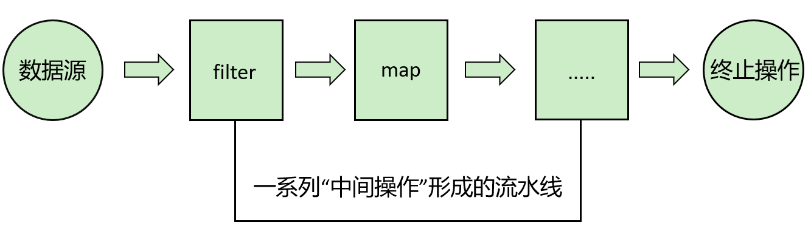

#### 5.4.1 创建Stream实例

好的，关于 **创建 Stream 流操作** 的汇总，我们可以将其分为以下几类。这些方法通常是 `java.util.stream.Stream` 类（或其他基本类型特化流如 `IntStream`, `LongStream`, `DoubleStream`）的静态工厂方法，或者来自其他数据结构的方法。

**创建 Stream 流操作汇总**

| 类别                     | 方法/来源                                                    | 描述                                                         | 返回类型                                | 示例                                          | 备注                                  |
| ------------------------ | ------------------------------------------------------------ | ------------------------------------------------------------ | --------------------------------------- | --------------------------------------------- | ------------------------------------- |
| **从集合**               | `Collection.stream()`                                        | 从任何 `Collection` （如 `List`, `Set`）创建顺序流。         | `Stream<T>`                             | `myList.stream()`                             | 最常用，方便将现有集合转换为流。      |
|                          | `Collection.parallelStream()`                                | 从任何 `Collection` （如 `List`, `Set`）创建并行流。         | `Stream<T>`                             | `myList.parallelStream()`                     | 适合大数据量并行处理。                |
| **从数组**               | `Arrays.stream(T[] array)`                                   | 从一个对象数组创建流。                                       | `Stream<T>`                             | `Arrays.stream(new String[]{"a", "b"})`       |                                       |
|                          | `Arrays.stream(int[] array)`                                 | 从一个 `int` 数组创建 `IntStream`。                          | `IntStream`                             | `Arrays.stream(new int[]{1, 2, 3})`           | 避免装箱拆箱。                        |
|                          | `Arrays.stream(long[] array)`                                | 从一个 `long` 数组创建 `LongStream`。                        | `LongStream`                            | `Arrays.stream(new long[]{1L, 2L, 3L})`       | 避免装箱拆箱。                        |
|                          | `Arrays.stream(double[] array)`                              | 从一个 `double` 数组创建 `DoubleStream`。                    | `DoubleStream`                          | `Arrays.stream(new double[]{1.0, 2.0})`       | 避免装箱拆箱。                        |
| **通过值**               | `Stream.of(T... values)`                                     | 从一组指定元素创建顺序流。                                   | `Stream<T>`                             | `Stream.of("a", "b", "c")`                    | 简单直观地创建包含少量元素的流。      |
|                          | `IntStream.of(int... values)`                                | 从一组指定 `int` 元素创建 `IntStream`。                      | `IntStream`                             | `IntStream.of(1, 2, 3)`                       |                                       |
|                          | `LongStream.of(long... values)`                              | 从一组指定 `long` 元素创建 `LongStream`。                    | `LongStream`                            | `LongStream.of(1L, 2L, 3L)`                   |                                       |
|                          | `DoubleStream.of(double... values)`                          | 从一组指定 `double` 元素创建 `DoubleStream`。                | `DoubleStream`                          | `DoubleStream.of(1.0, 2.0)`                   |                                       |
| **空流**                 | `Stream.empty()`                                             | 创建一个空的顺序流。                                         | `Stream<T>`                             | `Stream.empty()`                              | 用于避免返回 `null`。                 |
|                          | `IntStream.empty()`                                          | 创建一个空的 `IntStream`。                                   | `IntStream`                             | `IntStream.empty()`                           |                                       |
|                          | `LongStream.empty()`                                         | 创建一个空的 `LongStream`。                                  | `LongStream`                            | `LongStream.empty()`                          |                                       |
|                          | `DoubleStream.empty()`                                       | 创建一个空的 `DoubleStream`。                                | `DoubleStream`                          | `DoubleStream.empty()`                        |                                       |
| **可为空的流 (Java 9+)** | `Stream.ofNullable(T t)`                                     | 从一个可能为 `null` 的元素创建流。如果元素为 `null`，则创建空流；否则创建包含该元素的流。 | `Stream<T>`                             | `Stream.ofNullable(someObject)`               | 避免 `NullPointerException`。         |
| **生成流**               | `Stream.generate(Supplier<T> supplier)`                      | 使用一个 `Supplier`（函数式接口）来无限生成流元素。          | `Stream<T>`                             | `Stream.generate(Math::random)`               | 生成无限流，需要配合 `limit()` 使用。 |
|                          | `Stream.iterate(T seed, UnaryOperator<T> f)`                 | 从一个种子值开始，通过重复应用一个函数来无限生成流元素。     | `Stream<T>`                             | `Stream.iterate(0, n -> n + 2)`               | 生成无限流，需要配合 `limit()` 使用。 |
|                          | `Stream.iterate(T seed, Predicate<? super T> hasNext, UnaryOperator<T> next)` | (Java 9+) 从一个种子值开始，通过重复应用一个函数来生成流元素，直到不满足 `hasNext` 条件。 | `Stream<T>`                             | `Stream.iterate(0, n -> n < 10, n -> n + 1)`  | 生成有限流，更方便控制迭代结束。      |
|                          | `IntStream.range(int startInclusive, int endExclusive)`      | 生成从 `startInclusive` 到 `endExclusive-1` 的整数序列。     | `IntStream`                             | `IntStream.range(1, 5)` (1, 2, 3, 4)          | 常用数值序列。                        |
|                          | `IntStream.rangeClosed(int startInclusive, int endInclusive)` | 生成从 `startInclusive` 到 `endInclusive` 的整数序列。       | `IntStream`                             | `IntStream.rangeClosed(1, 5)` (1, 2, 3, 4, 5) | 常用数值序列。                        |
|                          | `LongStream.range(long startInclusive, long endExclusive)`   | 类似 `IntStream.range`，但用于 `long` 类型。                 | `LongStream`                            |                                               |                                       |
|                          | `LongStream.rangeClosed(long startInclusive, long endInclusive)` | 类似 `IntStream.rangeClosed`，但用于 `long` 类型。           | `LongStream`                            |                                               |                                       |
| **连接流**               | `Stream.concat(Stream<? extends T> a, Stream<? extends T> b)` | 连接两个流，形成一个新的流，新流包含两个原始流的所有元素。   | `Stream<T>`                             | `Stream.concat(stream1, stream2)`             | 两个流的元素类型必须兼容。            |
| **从文件/IO**            | `Files.lines(Path path)`                                     | 从文件中读取行并生成一个 `Stream<String>`。                  | `Stream<String>`                        | `Files.lines(Paths.get("file.txt"))`          | 适用于处理文本文件。                  |
|                          | `BufferedReader.lines()`                                     | 从 `BufferedReader` 读取行并生成 `Stream<String>`。          | `Stream<String>`                        | `new BufferedReader(reader).lines()`          |                                       |
| **其他**                 | `Pattern.splitAsStream(CharSequence input)`                  | (Java 8+) 将字符串按正则表达式分割成一个流。                 | `Stream<String>`                        | `Pattern.compile(",").splitAsStream("a,b,c")` |                                       |
|                          | `Random.ints()` / `longs()` / `doubles()`                    | (Java 8+) 从 `Random` 对象生成无限的随机数流。               | `IntStream`/`LongStream`/`DoubleStream` | `new Random().ints()`                         |                                       |


##### **方式一：通过集合**

Java8 中的 `Collection 接口`被扩展，提供了两个获取流的方法：

- `default Stream<E> stream()` : 返回一个顺序流

- `default Stream<E> parallelStream()` : 返回一个并行流

```java
@Test
public void test01(){
    List<Integer> list = Arrays.asList(1,2,3,4,5);

    //JDK1.8中，Collection系列集合增加了方法
    Stream<Integer> stream = list.stream();
}
```


##### **方式二：通过数组**

Java8 中的 `Arrays 的静态方法 stream()` 可以获取数组流：

- `static <T> Stream<T> stream(T[] array):` 返回一个流
  - `public static IntStream stream(int[] array)`
  - `public static LongStream stream(long[] array)`
  - `public static DoubleStream stream(double[] array)`


```java
@Test
public void test02(){
    String[] arr = {"hello","world"};
    Stream<String> stream = Arrays.stream(arr); 
}

@Test
public void test03(){
    int[] arr = {1,2,3,4,5};
    IntStream stream = Arrays.stream(arr);
}
```


##### **方式三：通过Stream的of()**

可以调用Stream类静态方法 of(), 通过显示值创建一个流。它可以接收任意数量的参数。

- `public static<T> Stream<T> of(T... values)` : 返回一个流

```java
@Test
public void test04(){
    Stream<Integer> stream = Stream.of(1,2,3,4,5);
    stream.forEach(System.out::println);
}
```


##### **方式四：创建无限流(了解)**

可以使用静态方法 Stream.iterate() 和 Stream.generate(), 创建无限流。

- 迭代
  `public static<T> Stream<T> iterate(final T seed, final UnaryOperator<T> f)` 

- 生成
  `public static<T> Stream<T> generate(Supplier<T> s)` 

```java
// 方式四：创建无限流
@Test
public void test05() {
	// 迭代
	// public static<T> Stream<T> iterate(final T seed, final
	// UnaryOperator<T> f)
	Stream<Integer> stream = Stream.iterate(0, x -> x + 2);
	stream.limit(10).forEach(System.out::println);
    
    //stream.limit(10).forEach(System.out::println);//如果没有limit截断，会无限打印

	// 生成
	// public static<T> Stream<T> generate(Supplier<T> s)
	Stream<Double> stream1 = Stream.generate(Math::random);
	stream1.limit(10).forEach(System.out::println);
}

```

#### 5.4.2 一系列中间操作

多个中间操作可以连接起来形成一个流水线，除非流水线上触发终止操作，否则中间操作不会执行任何的处理！而在终止操作时一次性全部处理，称为<span style="color:#000099;">“惰性求值”。</span>

Stream API 的中间操作是链式调用的关键，它们不会立即执行，而是构建一个操作管道，直到遇到终止操作才真正开始处理数据。


**Java Stream API 中间操作汇总**

| 操作类型                    | 方法名称                        | 描述                                                         | 返回类型       | 是否是有状态操作？ | 是否短路？ | Java 版本 (如果非Java 8) |
| --------------------------- | ------------------------------- | ------------------------------------------------------------ | -------------- | ------------------ | ---------- | ------------------------ |
| **筛选/过滤**               | `filter(Predicate)`             | 过滤流中的元素，只<span style="color:#0000FF;">保留满足给定条件</span>的元素。 | `Stream<T>`    | 否                 | 否         |                          |
| **映射/转换**               | `map(Function)`                 | 对流中的每个元素应用一个函数，将<span style="color:#0000FF;">其转换为另一种类型或形式</span>，生成一个新的流。 | `Stream<R>`    | 否                 | 否         |                          |
|                             | `mapToInt(ToIntFunction)`       | 将流中的元素映射为 `IntStream`（原始 `int` 类型流）。        | `IntStream`    | 否                 | 否         |                          |
|                             | `mapToLong(ToLongFunction)`     | 将流中的元素映射为 `LongStream`（原始 `long` 类型流）。      | `LongStream`   | 否                 | 否         |                          |
|                             | `mapToDouble(ToDoubleFunction)` | 将流中的元素映射为 `DoubleStream`（原始 `double` 类型流）。  | `DoubleStream` | 否                 | 否         |                          |
| **扁平化映射**              | `flatMap(Function)`             | 将<span style="color:#0000FF;">流中的每个元素映射到一个新的流</span>，然后将所有这些新的流连接（扁平化）成一个单一的流。常用于处理嵌套集合。 | `Stream<R>`    | 否                 | 否         |                          |
|                             | `flatMapToInt(Function)`        | 将流中的元素映射为 `IntStream`，然后扁平化。                 | `IntStream`    | 否                 | 否         |                          |
|                             | `flatMapToLong(Function)`       | 将流中的元素映射为 `LongStream`，然后扁平化。                | `LongStream`   | 否                 | 否         |                          |
|                             | `flatMapToDouble(Function)`     | 将流中的元素映射为 `DoubleStream`，然后扁平化。              | `DoubleStream` | 否                 | 否         |                          |
| **多映射 (Java 16+)**       | `mapMulti(BiConsumer)`          | 更通用的映射操作，允许一个输入元素映射为零个、一个或多个输出元素。 | `Stream<R>`    | 否                 | 否         | Java 16+                 |
|                             | `mapMultiToInt(BiConsumer)`     | 将元素映射到 `int` 类型并提供给下游。                        | `IntStream`    | 否                 | 否         | Java 16+                 |
|                             | `mapMultiToLong(BiConsumer)`    | 将元素映射到 `long` 类型并提供给下游。                       | `LongStream`   | 否                 | 否         | Java 16+                 |
|                             | `mapMultiToDouble(BiConsumer)`  | 将元素映射到 `double` 类型并提供给下游。                     | `DoubleStream` | 否                 | 否         | Java 16+                 |
| **去重**                    | `distinct()`                    | 返回一个由流中不重复元素组成的流（基于 `equals()` 方法）。   | `Stream<T>`    | 是                 | 否         |                          |
| **排序**                    | `sorted()`                      | 返回一个按自然顺序排序的流。                                 | `Stream<T>`    | 是                 | 否         |                          |
|                             | `sorted(Comparator)`            | 返回一个按指定 `Comparator` 排序的流。                       | `Stream<T>`    | 是                 | 否         |                          |
| **调试/观察**               | `peek(Consumer)`                | 对流中的每个元素执行一个操作，但不改变流本身。主要用于调试。  <span style="color:#0000FF;">开一个观察窗</span> | `Stream<T>`    | 否                 | 否         |                          |
| **截断/跳过**               | `limit(long maxSize)`           | <span style="color:#0000FF;">截断流</span>，使其元素不超过给定数量。 | `Stream<T>`    | 是                 | 是         |                          |
|                             | `skip(long n)`                  | 跳过流中的前 `n` 个元素，返回剩余元素的流。                  | `Stream<T>`    | 是                 | 否         |                          |
| **条件截取/丢弃 (Java 9+)** | `takeWhile(Predicate)`          | 它用于**从流的开头开始**，**依次获取满足条件的元素**，<span style="color:#0000FF;">一旦遇到第一个不满足条件的元素，**就停止处理，后面的元素不再处理**</span> | `Stream<T>`    | 是                 | 是         | Java 9+                  |
|                             | `dropWhile(Predicate)`          | 从流的开始处丢弃满足给定谓词的元素，直到遇到第一个不满足条件的元素，然后返回剩余的元素。 | `Stream<T>`    | 是                 | 否         | Java 9+                  |
| **并行/顺序**               | `parallel()`                    | 将当前流转换为并行流。                                       | `Stream<T>`    | 否                 | 否         |                          |
|                             | `sequential()`                  | 将当前流转换为顺序流。                                       | `Stream<T>`    | 否                 | 否         |                          |
| **无序标记**                | `unordered()`                   | 标记流为无序的。在某些情况下，可以提高并行流操作的性能。     | `Stream<T>`    | 否                 | 否         |                          |
| **资源管理**                | `onClose(Runnable)`             | 注册一个在流关闭时执行的 `Runnable`。                        | `Stream<T>`    | 否                 | 否         |                          |

**表格说明：**

* **操作类型**: 对操作功能进行分类。
* **方法名称**: Stream API 中对应的中间操作方法名。
* **描述**: 对该操作功能的简要说明。
* **返回类型**: 执行该操作后返回的流类型。
* **是否是有状态操作？**:
    * **是**: 意味着该操作需要知道流中之前或所有元素的完整状态才能执行（例如，`distinct` 需要知道所有已处理元素才能去重；`sorted` 需要知道所有元素才能排序）。有状态操作在并行流中通常开销更大。
    * **否**: 意味着该操作只依赖于当前处理的元素，不依赖于流中其他元素的状态。
* **是否短路？**:
    * **是**: 意味着在满足某个条件时，流的处理可以提前停止，不需要处理所有元素（例如 `limit` 在达到指定数量后就会停止）。
    * **否**: 意味着需要处理所有相关的元素才能完成操作。
* **Java 版本 (如果非Java 8)**: 标明该操作是在哪个Java版本中引入的，默认是Java 8。


##### 1-筛选与切片

| **方   法**             | **描   述**                                                  |
| ----------------------- | ------------------------------------------------------------ |
| **filter(Predicatep)**  | 接收  Lambda ， 从流中排除某些元素  过滤，Predicate .test() 方法返回 true，则表示该元素符合过滤条件，filter() 方法会将该元素保留在新生成的流中。 |
| **distinct()**          | 筛选，通过流所生成元素的  hashCode() 和 equals() 去除重复元素 |
| **limit(long maxSize)** | 截断流，使其元素不超过给定数量                               |
| **skip(long n)**        | 跳过元素，返回一个扔掉了前  n 个元素的流。<br>若流中元素不足 n 个，则返回一个空流。**与 limit(n) 互补** |

##### 2-映 射

| **方法**                        | **描述**                                                     |
| ------------------------------- | ------------------------------------------------------------ |
| **map(Function f)**             | 接收一个函数作为参数，该函数会被应用到每个元素上，并将其映射成一个新的元素。<br/>**`Function<? super T, ? extends R> mapper` ：入参 一个元素  返回单个值** |
| mapToDouble(ToDoubleFunction f) | 接收一个函数作为参数，该函数会被应用到每个元素上，产生一个新的 DoubleStream。 |
| mapToInt(ToIntFunction  f)      | 接收一个函数作为参数，该函数会被应用到每个元素上，产生一个新的  IntStream。 |
| mapToLong(ToLongFunction  f)    | 接收一个函数作为参数，该函数会被应用到每个元素上，产生一个新的  LongStream。 |
| **flatMap(Function  f)**        | 接收一个函数作为参数，将流中的每个值都**换成另一个流返回**，然后**把所有流连接成一个流**<br>**`Function<? super T, ? extends Stream<? extends R>> mapper`：入参一个元素，返回值是一个流**<br/>flat  【adv.	平直地；直截了当地；adj.	水平的；平坦的；平滑的；扁平的】 |

##### 3-排序

| **方法**                       | **描述**                           |
| ------------------------------ | ---------------------------------- |
| **sorted()**                   | 产生一个新流，其中按自然顺序排序   |
| **sorted(Comparator** **com)** | 产生一个新流，其中按比较器顺序排序 |

##### 代码举例：

```java
package com.atguigu.stream;

import org.junit.Test;

import java.util.Arrays;
import java.util.stream.Stream;

public class StreamMiddleOperate {
	@Test
    public void test01(){
        //1、创建Stream
        Stream<Integer> stream = Stream.of(1,2,3,4,5,6);

        //2、加工处理
        //过滤：filter(Predicate p)
        //把里面的偶数拿出来
        /*
         * filter(Predicate p)
         * Predicate是函数式接口，抽象方法：boolean test(T t)
         */
        stream = stream.filter(t -> t%2==0);

        //3、终结操作：例如：遍历
        stream.forEach(System.out::println);
    }
    @Test
    public void test02(){
        Stream.of(1,2,3,4,5,6)
                .filter(t -> t%2==0)
                .forEach(System.out::println);
    }
    @Test
    public void test03(){
        //去重
        Stream.of(1,2,3,4,5,6,2,2,3,3,4,4,5)
                .distinct()
                .forEach(System.out::println);
    }
    @Test
    public void test04(){
        //打印前三个
        Stream.of(1,2,3,4,5,6,2,2,3,3,4,4,5)
                .limit(3)  //截断 最大为3    
                .forEach(System.out::println);
    }
    @Test
    public void test05(){
        // 去重 筛选奇数  取前三个
        Stream.of(1,2,2,3,3,4,4,5,2,3,4,5,6,7)
                .distinct()  //(1,2,3,4,5,6,7)
                .filter(t -> t%2!=0) //(1,3,5,7)
                .limit(3)
                .forEach(System.out::println);
    }
    @Test
    public void test06(){
        // 跳过前5个
        Stream.of(1,2,3,4,5,6,2,2,3,3,4,4,5)
                .skip(5)
                .forEach(System.out::println);//6, 2, 2, 3, 3, 4, 4, 5
    }
    @Test
    public void test07(){
        Stream.of(1,2,3,4,5,6,2,2,3,3,4,4,5)
                .skip(5)
                .distinct()
                .filter(t -> t%3==0)
                .forEach(System.out::println);
    }
    @Test
    public void test08(){
        long count = Stream.of(1,2,3,4,5,6,2,2,3,3,4,4,5)
                .distinct()
                .peek(System.out::println)  //Consumer接口的抽象方法  void accept(T t)
                .count();
        System.out.println("count="+count);
    }
    @Test
    public void test09(){
        //希望能够找出前三个最大值，前三名最大的，不重复
        Stream.of(11,2,39,4,54,6,2,22,3,3,4,54,54)
                .distinct()
                .sorted((t1,t2) -> -Integer.compare(t1, t2))//Comparator接口  int compare(T t1, T t2)
                .limit(3)
                .forEach(System.out::println);
    }
    @Test
    public void test10(){
        Stream.of(1,2,3,4,5)
                .map(t -> t+=1)//Function<T,R>接口抽象方法 R apply(T t)
                .forEach(System.out::println);
    }
    @Test
    public void test11(){
        String[] arr = {"hello","world","java"};

        Arrays.stream(arr)
                .map(t->t.toUpperCase())
                .forEach(System.out::println);
    }
    @Test
    public void test12(){
        String[] arr = {"hello","world","java"};
        Arrays.stream(arr)
                .flatMap(t -> Stream.of(t.split("|")))//Function<T,R>接口抽象方法 R apply(T t)  现在的R是一个Stream
                .forEach(System.out::println);
    } 
}

```

练习：

```java
/**
 * 测试Stream的中间操作
 */
public class StreamAPITest1 {

    //1-筛选与切片
    @Test
    public void test1() {
//        filter(Predicate p)——接收 Lambda，从流中排除某些元素。
        //练习：查询员工表中薪资大于7000的员工信息
        List<Employee> list = EmployeeData.getEmployees();
        Stream<Employee> stream = list.stream();
        stream.filter(emp -> emp.getSalary() > 7000).forEach(System.out::println);

        System.out.println();
//        limit(n)——截断流，使其元素不超过给定数量。
        //错误的。因为stream已经执行了终止操作，就不可以再调用其它的中间操作或终止操作了。
//        stream.limit(2).forEach(System.out::println);
        list.stream().filter(emp -> emp.getSalary() > 7000).limit(2).forEach(System.out::println);

        System.out.println();
//        skip(n) —— 跳过元素，返回一个扔掉了前 n 个元素的流。若流中元素不足 n 个，则返回一个空流。与 limit(n) 互补
        list.stream().skip(5).forEach(System.out::println);


        System.out.println();
//        distinct()——筛选，通过流所生成元素的 hashCode() 和 equals() 去除重复元素
        list.add(new Employee(1009, "马斯克", 40, 12500.32));
        list.add(new Employee(1009, "马斯克", 40, 12500.32));
        list.add(new Employee(1009, "马斯克", 40, 12500.32));
        list.add(new Employee(1009, "马斯克", 40, 12500.32));

        list.stream().distinct().forEach(System.out::println);

    }

    //2-映射
    @Test
    public void test2() {
        //map(Function f)——接收一个函数作为参数，将元素转换成其他形式或提取信息，该函数会被应用到每个元素上，并将其映射成一个新的元素。
        //练习：转换为大写
        List<String> list = Arrays.asList("aa", "bb", "cc", "dd");
        //方式1：
        list.stream().map(str -> str.toUpperCase()).forEach(System.out::println);
        //方式2：
        list.stream().map(String :: toUpperCase).forEach(System.out::println);

        //练习：获取员工姓名长度大于3的员工。
        List<Employee> employees = EmployeeData.getEmployees();
        employees.stream().filter(emp -> emp.getName().length() > 3).forEach(System.out::println);

        //练习：获取员工姓名长度大于3的员工的姓名。
        //方式1：
        employees.stream().filter(emp -> emp.getName().length() > 3).map(emp -> emp.getName()).forEach(System.out::println);
        //方式2：
        employees.stream().map(emp -> emp.getName()).filter(name -> name.length() > 3).forEach(System.out::println);
        //方式3：
        employees.stream().map(Employee::getName).filter(name -> name.length() > 3).forEach(System.out::println);

    }

    //3-排序
    @Test
    public void test3() {
        //sorted()——自然排序
        Integer[] arr = new Integer[]{345,3,64,3,46,7,3,34,65,68};
        String[] arr1 = new String[]{"GG","DD","MM","SS","JJ"};

        Arrays.stream(arr).sorted().forEach(System.out::println);
        System.out.println(Arrays.toString(arr));//arr数组并没有因为升序，做调整。

        Arrays.stream(arr1).sorted().forEach(System.out::println);

        //因为Employee没有实现Comparable接口，所以报错！
//        List<Employee> list = EmployeeData.getEmployees();
//        list.stream().sorted().forEach(System.out::println);


        //sorted(Comparator com)——定制排序
        List<Employee> list = EmployeeData.getEmployees();
        list.stream().sorted((e1,e2) -> e1.getAge() - e2.getAge()).forEach(System.out::println);

        //针对于字符串从大大小排列
        Arrays.stream(arr1).sorted((s1,s2) -> -s1.compareTo(s2)).forEach(System.out::println);
//        Arrays.stream(arr1).sorted(String :: compareTo).forEach(System.out::println);
    }
}

public class EmployeeData {
	
	public static List<Employee> getEmployees(){
		List<Employee> list = new ArrayList<>();
		
		list.add(new Employee(1001, "马化腾", 34, 6000.38));
		list.add(new Employee(1002, "马云", 2, 19876.12));
		list.add(new Employee(1003, "刘强东", 33, 3000.82));
		list.add(new Employee(1004, "雷军", 26, 7657.37));
		list.add(new Employee(1005, "李彦宏", 65, 5555.32));
		list.add(new Employee(1006, "比尔盖茨", 42, 9500.43));
		list.add(new Employee(1007, "任正非", 26, 4333.32));
		list.add(new Employee(1008, "扎克伯格", 35, 2500.32));
		
		return list;
	}
	
}

public class Employee {

	private int id;
	private String name;
	private int age;
	private double salary;
}
```

#### 5.4.3 终止操作

- 终端操作会从流的流水线生成结果。其结果可以是任何不是流的值，例如：List、Integer，甚至是 void 。

- 流进行了终止操作后，不能再次使用。

Stream API 的终止操作是 Stream 管道的最后一步，它们会触发所有中间操作的执行，并产生一个最终结果或一个副作用。一旦一个终止操作被执行，该 Stream 就被“消费”了，不能再被重用。


**Java Stream API 终止操作汇总**

| 操作类型           | 方法名称                                                  | 描述                                                         | 返回类型                                                     | 是否短路？ | 是否产生副作用？ | Java 版本 (如果非Java 8) |
| ------------------ | --------------------------------------------------------- | ------------------------------------------------------------ | ------------------------------------------------------------ | ---------- | ---------------- | ------------------------ |
| **消费/迭代**      | `forEach(Consumer)`                                       | 对流中的每个元素执行提供的操作。不保证执行顺序，尤其在并行流中。 | `void`                                                       | 否         | 是               |                          |
|                    | `forEachOrdered(Consumer)`                                | 对流中的每个元素按照源的遭遇顺序执行提供的操作。在并行流中仍能保证顺序。 | `void`                                                       | 否         | 是               |                          |
| **转换/收集**      | `toArray()`                                               | 将流中的所有元素收集到一个新的 `Object[]` 数组中。           | `Object[]`                                                   | 否         | 否               |                          |
|                    | `toArray(IntFunction)`                                    | 将流中的所有元素收集到一个指定类型的数组中。                 | `A[]`                                                        | 否         | 否               |                          |
|                    | `collect(Collector)`                                      | 将流中的元素聚集 (accumulate) 成一个结果，可以是各种数据结构或聚合值。 | `R`                                                          | 否         | 否               |                          |
|                    | `toList()`                                                | 将流中的元素收集到一个 `List` 中。 (通常是 `ArrayList`)      | `List<T>`                                                    | 否         | 否               | Java 16+                 |
| **聚合/归约**      | `reduce(BinaryOperator)`                                  | 使用一个累积函数将流中的元素组合起来，生成一个单一的结果。返回 `Optional<T>`。 | `Optional<T>`                                                | 否         | 否               |                          |
|                    | `reduce(identity, BinaryOperator)`                        | 使用一个初始值和累积函数将流中的元素组合起来，生成一个单一的结果。 | `T`                                                          | 否         | 否               |                          |
|                    | `reduce(identity, BiFunction, BinaryOperator)`            | 使用一个初始值、累积函数和组合器函数。用于并行流。           | `U`                                                          | 否         | 否               |                          |
|                    | `count()`                                                 | 返回流中元素的数量。                                         | `long`                                                       | 否         | 否               |                          |
|                    | `min(Comparator)`                                         | 根据提供的 `Comparator` 找出流中的最小元素。返回 `Optional<T>`。 | `Optional<T>`                                                | 否         | 否               |                          |
|                    | `max(Comparator)`                                         | 根据提供的 `Comparator` 找出流中的最大元素。返回 `Optional<T>`。 | `Optional<T>`                                                | 否         | 否               |                          |
| **匹配/检查**      | `anyMatch(Predicate)`                                     | 检查流中是否有任何元素与给定的谓词匹配。一旦找到匹配的元素，就会短路。 | `boolean`                                                    | 是         | 否               |                          |
|                    | `allMatch(Predicate)`                                     | 检查流中的所有元素是否都与给定的谓词匹配。如果有一个不匹配的元素，就会短路。 | `boolean`                                                    | 是         | 否               |                          |
|                    | `noneMatch(Predicate)`                                    | 检查流中是否没有任何元素与给定的谓词匹配。如果找到一个匹配的元素，就会短路。 | `boolean`                                                    | 是         | 否               |                          |
| **查找**           | `findFirst()`                                             | 返回流中的第一个元素。返回 `Optional<T>`。对于顺序流，这是确定的。 | `Optional<T>`                                                | 是         | 否               |                          |
|                    | `findAny()`                                               | 返回流中的任意一个元素。返回 `Optional<T>`。在并行流中，可能比 `findFirst` 性能更好。 | `Optional<T>`                                                | 是         | 否               |                          |
| **迭代器**         | `iterator()`                                              | 返回此流元素的 `Iterator`。允许回到传统的迭代方式。          | `Iterator<T>`                                                | 否         | 否               |                          |
| **原始类型流特有** | `sum()` (IntStream/LongStream/DoubleStream)               | 计算原始类型流中所有元素的总和。                             | `int`<br/>`long`<br/>`double`                                | 否         | 否               |                          |
|                    | `average()` (IntStream/LongStream/DoubleStream)           | 计算原始类型流中所有元素的平均值。返回 `OptionalDouble`/`OptionalLong`/`OptionalInt`。 | `OptionalDouble`<br/>`OptionalLong`<br/>`OptionalInt`        | 否         | 否               |                          |
|                    | `summaryStatistics()` (IntStream/LongStream/DoubleStream) | 返回一个包含计数、总和、最小值、最大值和平均值的统计对象。   | `IntSummaryStatistics`<br>`LongSummaryStatistics`<br/>`DoubleSummaryStatistics` | 否         | 否               |                          |


**表格说明：**

* **操作类型**: 对操作功能进行分类。
* **方法名称**: Stream API 中对应的终止操作方法名。
* **描述**: 对该操作功能的简要说明。
* **返回类型**: 执行该操作后返回的结果类型。
* **是否短路？**:
    * **是**: 意味着在满足某个条件时，流的处理可以提前停止，不需要处理所有元素（例如 `anyMatch` 找到一个匹配项就停止）。
    * **否**: 意味着需要处理所有相关的元素才能完成操作。
* **是否产生副作用？**:
    * **是**: 意味着操作可能会修改外部状态（例如 `forEach` 打印到控制台，或修改一个外部变量）。
    * **否**: 意味着操作只计算结果，不修改外部状态。
* **Java 版本 (如果非Java 8)**: 标明该操作是在哪个Java版本中引入的，默认是Java 8。


##### 1-匹配与查找

| **方法**                        | **描述**                                                     |
| ------------------------------- | ------------------------------------------------------------ |
| **allMatch(Predicate  p)**      | 检查是否匹配所有元素                                         |
| **anyMatch(Predicate  p)  **    | 检查是否至少匹配一个元素                                     |
| **noneMatch(Predicate**  **p)** | 检查是否没有匹配所有元素                                     |
| **findFirst()**                 | 返回第一个元素                                               |
| **findAny()**                   | 返回当前流中的任意元素                                       |
| **count()**                     | 返回流中元素总数                                             |
| **max(Comparator c)**           | 返回流中最大值                                               |
| **min(Comparator c)**           | 返回流中最小值                                               |
| **forEach(Consumer c)**         | 内部迭代(使用  Collection  接口需要用户去做迭代，称为外部迭代。<br>相反，Stream  API 使用内部迭代——它帮你把迭代做了) |

##### 2-归约

| **方法**                                  | **描述**                                                 |
| ----------------------------------------- | -------------------------------------------------------- |
| **reduce(T  identity, BinaryOperator b)** | 可以将流中元素反复结合起来，得到一个值。返回  T          |
| **reduce(BinaryOperator  b)**             | 可以将流中元素反复结合起来，得到一个值。返回 Optional<T> |

备注：map 和 reduce 的连接通常称为 map-reduce 模式，因 Google 用它来进行网络搜索而出名。


> `T reduce(T identity, BinaryOperator<T> accumulator);`详细说明：
>
> 使用提供的标识值和关联累积函数对此流的元素执行缩减，并返回缩减后的值。这相当于：但不限于按顺序执行
> ```java
> T result = identity; //初始值
> for (T element : this stream)     
>     result = accumulator. apply(result, element) 
> return result;
> ```
>
>
> 归约过程:
>
> **==reduce(identity, accumulator) 方法的工作流程大致如下：==**
>
> 1. **==初始化: 将 identity 值作为初始的累积结果值 (result)。==**
> 2. **==遍历流: 遍历流中的每一个元素 (element)。==**
> 3. **==累积操作: 对于每个元素，调用 accumulator.apply(result, element)，将当前的累积结果值 result 和当前的流元素 element 作为输入，计算得到新的累积结果值，并将这个新值更新为 result。==**
> 4. **==返回结果: 当流遍历完成后，最终的 result 值就是归约操作的结果，reduce() 方法会将这个值返回。==**     
>
> 
>
> 
>
> 参数说明：
>
> + `identity` – 它是**归约操作的初始值**，也是当流为空时返回的默认值 
> + `accumulator` (累积函数):   这是一个 函数式接口，它接受两个参数，并返回一个结果。
>       参数 1 (第一个参数): 是当前累积的结果值 (在第一次执行时，它的值是 identity)。
>       参数 2 (第二个参数): 是流中当前正在处理的元素。
>       返回值: 是新的累积结果值，它将被作为下一次 accumulator 函数的第一个参数。
>       
>
> accumulator 函数必须满足以下条件：
>
> + **关联性** (Associative): (a op b) op c 必须等于 a op (b op c)。 这保证了在并行流中，归约操作可以以任意顺序进行，最终结果保持一致。 例如，加法 (a + b) + c == a + (b + c) 和乘法 (a * b) * c == a * (b * c) 都满足关联性。
> + **非干扰性** (Non-interfering): accumulator 函数不应该修改流的源数据。
> +  **无状态性** (Stateless): accumulator 函数的执行不应该依赖于任何外部状态，每次执行的结果只应该依赖于它的输入参数。
>
> 应用场景：
>
> API说明：
> 求和、求最小值、求最大值、求平均值以及字符串连接都是归约的特殊情况。对数字流求和可以表示为：
>
> ```java
> Integer sum = integers. reduce(0, (a, b) -> a+b);    
> ```

​    

##### 3-收集

将流转换为其他形式。接收一个  Collector接口的实现，用于给Stream中元素做汇总的方法

 `<R> R collect(Supplier<R> supplier, BiConsumer<R, ? super T> accumulator, BiConsumer<R, R> combiner);`

`<R, A> R collect(Collector<? super T, A, R> collector);` 


###### 详解`collect(supplier,accumulator,combiner)`

`collect(supplier, accumulator, combiner)` 是 Java Stream API 中用于执行**可变归约操作（mutable reduction operation）**的一个核心方法。它允许你将 Stream 中的元素汇聚到一个可变的容器中，例如 `List`、`Set` 或 `Map`，或者构建一个复杂的自定义数据结构。

理解这三个参数的工作流程是掌握 `collect` 方法的关键：

------

1. `supplier` (供应器)

- **作用：** `supplier` 是一个函数，负责提供一个新的、空的**可变结果容器**。
- 调用时机：
  - 对于**顺序流（sequential stream）**，`supplier` 通常只会被调用一次，用于创建最终结果的初始容器。
  - 对于**并行流（parallel stream）**，`supplier` 可能会被调用多次，为每个并行处理的任务创建独立的中间结果容器。这意味着每个线程都会有自己的容器来累积部分结果。
- **类型：** `Supplier<R>`，其中 `R` 是最终结果容器的类型。
- **示例：** `ArrayList::new` (创建一个新的 `ArrayList`) 或 `StringBuilder::new` (创建一个新的 `StringBuilder`)。

------

2. `accumulator` (累加器)

- **作用：** `accumulator` 是一个 `BiConsumer` 函数，负责将 Stream 中的一个元素合并到当前的**可变结果容器**中。
- **调用时机：** 对于 Stream 中的每一个元素，`accumulator` 都会被调用一次。它接收当前的容器和当前元素作为输入，并将元素添加到容器中。
- **类型：** `BiConsumer<R, ? super T>`，其中 `R` 是结果容器的类型，`T` 是 Stream 元素的类型。
- 示例：
  - 对于 `List`：`(list, item) -> list.add(item)`
  - 对于 `StringBuilder`：`(sb, char) -> sb.append(char)`

------

3. `combiner` (合并器)

- **作用：** `combiner` 是一个 `BiConsumer` 函数，负责将两个**部分结果容器**合并成一个。
- 调用时机：
  - 对于**顺序流**，`combiner` **通常不会被调用**，因为只有一个结果容器在进行累加。
  - 对于**并行流**，Stream 会被分成多个子流进行并行处理，每个子流都会通过 `supplier` 创建自己的容器并使用 `accumulator` 进行累加。当所有子流处理完毕后，`combiner` 就负责将这些独立的、部分结果的容器合并成一个最终的结果容器。
- **类型：** `BiConsumer<R, R>`，其中 `R` 是结果容器的类型。
- 示例：
  - 对于 `List`：`(list1, list2) -> list1.addAll(list2)` (将 `list2` 中的所有元素添加到 `list1` 中)
  - 对于 `StringBuilder`：`(sb1, sb2) -> sb1.append(sb2)`

------

**==工作流程总结==**

1. **初始化 (Supplier):** 首先，`supplier` 会被调用来创建一个或多个（并行流情况下）空的容器，用于存放收集到的元素。
2. **累加 (Accumulator):** 接着，Stream 中的每个元素都会依次传递给 `accumulator`。`accumulator` 会将当前元素添加到对应的容器中。这个过程是“可变”的，意味着容器本身会被修改。
3. **合并 (Combiner - 仅限并行流):** 如果是并行流，在不同的线程中，多个部分结果容器会并行地积累数据。当所有并行处理完成后，`combiner` 会被用来将这些独立的部分容器合并成一个单一的最终结果容器。

------

示例

假设我们有一个字符串 Stream，想要将它们连接成一个单一的字符串：

```Java
import java.util.stream.Stream;

public class CollectWorkflowExample {
    public static void main(String[] args) {
        Stream<String> words = Stream.of("Hello", " ", "World", "!");

        // 使用 supplier, accumulator, combiner
        StringBuilder result = words.collect(
            StringBuilder::new,           // supplier: 创建一个新的 StringBuilder
            StringBuilder::append,        // accumulator: 将每个字符串追加到 StringBuilder
            StringBuilder::append         // combiner: 将两个 StringBuilder 合并
        );

        System.out.println(result.toString()); // 输出: Hello World!

        // 如果是并行流，combiner 的作用会更明显
        StringBuilder parallelResult = Stream.of("H", "e", "l", "l", "o")
                                             .parallel()
                                             .collect(
                                                 StringBuilder::new,
                                                 StringBuilder::append,
                                                 StringBuilder::append
                                             );
        System.out.println(parallelResult.toString()); // 输出可能类似: Hello
                                                         // 注意：并行流的顺序不保证，但这里是连接操作，结果通常是正确的
    }
}
```

------

什么时候使用 `collect(supplier, accumulator, combiner)`？

通常情况下，我们更倾向于使用 `collect(Collector collector)` 方法，因为它封装了 `supplier`、`accumulator` 和 `combiner` 以及其他一些可选的函数（如 `finisher`），并且 `Collectors` 类提供了许多内置的常用收集器，如 `Collectors.toList()`、`Collectors.toSet()`、`Collectors.joining()` 等。

然而，当你需要执行以下操作时，直接使用 `collect(supplier, accumulator, combiner)` 会非常有用：

1. **自定义复杂的数据结构：** 你想将 Stream 元素收集到一个 Java 标准库中没有直接对应的自定义容器中。
2. **性能优化：** 在某些特定场景下，直接提供这些函数可以避免创建额外的 `Collector` 对象，从而可能带来微小的性能提升（尽管通常不明显）。
3. **理解 `Collector` 的底层机制：** 深入理解这三个参数的工作方式有助于你更好地理解 `Collector` 接口的实现原理。

------


###### 详解`collect(Collector)`

这个方法是 Stream API 中进行**可变归约 (mutable reduction)** 的核心方法，它允许您使用预定义或自定义的 **`Collector`** 来将流中的元素收集到各种不同的数据结构中，例如 `List`, `Set`, `Map`, 字符串，或者执行更复杂的数据聚合操作。

**`collect(Collector<? super T, A, R> collector)` 方法详解**

这个方法只接收一个参数：

1. **`Collector<? super T, A, R> collector` (收集器)**：
   - **作用:**  `Collector` 接口封装了**如何执行可变归约操作**的所有逻辑。 它定义了创建容器、累积元素、合并容器以及完成最终转换的步骤。
   - **类型参数:** `Collector` 是一个泛型接口，它有三个类型参数：
     - **`T` (输入元素类型 - 逆变):**  `? super T` 表示 `Collector` 可以接受类型为 `T` 或 `T` 的父类型的元素。 这使得 `Collector` 具有一定的灵活性，可以处理更广泛的元素类型。
     - **`A` (累积器类型 - 可变容器类型):**  `A` 是 **accumulator type** 的缩写，表示 **可变的累积容器类型**。 这是在收集过程中用于临时存储结果的容器类型，例如 `ArrayList`, `HashSet`, `HashMap`, `StringBuilder` 等。
     - **`R` (结果类型):**  `R` 是 **result type** 的缩写，表示 **最终的收集结果类型**。 这是 `collect` 方法最终返回的类型，例如 `List<T>`, `Set<T>`, `Map<K, V>`, `String`, `Integer` 等。

**`Collector` 接口的核心组件 (隐式定义):**

`Collector` 接口本身并没有显式的方法定义，但它通过其类型参数和预定义的 `Collectors` 类，隐式地定义了可变归约操作的几个关键组件：

1. **`Supplier<A> supplier()` (容器提供器):**
   - **作用:**  负责**创建一个新的、空的、可变的结果容器 (类型为 `A`)**。
   - **示例:**  对于 `Collectors.toList()`，`supplier` 会创建一个新的 `ArrayList`。 对于 `Collectors.toSet()`，`supplier` 会创建一个新的 `HashSet`。
2. **`BiConsumer<A, T> accumulator()` (累加器):**
   - **作用:**  负责将**流中的元素 (类型为 `T`) 逐个添加到结果容器 (类型为 `A`) 中**。
   - **示例:**  对于 `Collectors.toList()`，`accumulator` 会调用 `ArrayList.add(element)` 方法将元素添加到列表中。 对于 `Collectors.joining()`，`accumulator` 会将字符串元素追加到 `StringBuilder` 中。
3. **`BinaryOperator<A> combiner()` (组合器):**
   - **作用:**  在**并行流**的情况下，当多个线程并行处理流的不同部分并将结果收集到各自的容器后，`combiner` 负责**将这些独立的容器 (类型都为 `A`) 合并成一个最终的结果容器 (类型也为 `A`)**。
   - **示例:**  对于 `Collectors.toList()`，`combiner` 会将两个 `ArrayList` 合并成一个。 对于 `Collectors.toSet()`，`combiner` 会将两个 `HashSet` 合并成一个。
4. **`Function<A, R> finisher()` (完成器):**
   - **作用:**  在所有元素都累积到容器 `A` 中后，`finisher` 负责执行**最终的转换操作，将累积容器 (类型为 `A`) 转换为最终的结果类型 `R`**。  在某些情况下，累积容器类型 `A` 和结果类型 `R` 可以是相同的，这时 `finisher` 可以是 `Function.identity()`，表示直接返回容器本身，不做任何转换。
   - **示例:**  对于 `Collectors.toList()` 和 `Collectors.toSet()`，`finisher` 通常是 `Function.identity()`，因为 `ArrayList` 和 `HashSet` 本身就是最终的结果类型。  对于 `Collectors.joining()`，`finisher` 会调用 `StringBuilder.toString()` 方法将 `StringBuilder` 转换为最终的 `String` 结果。
5. **`Set<Collector.Characteristics> characteristics()` (特征集):**
   - **作用:**  返回一个 `Set` 集合，包含 `Collector` 的**特征 (Characteristics)**，用于优化归约过程，例如是否支持并行收集、是否保持元素顺序、是否是 identity-finish 等。 这些特征可以帮助 Stream API 在执行 `collect` 操作时进行性能优化。

**预定义的 `Collectors` (常用示例):**

Java 提供了 `Collectors` 工具类，其中包含很多预定义的静态工厂方法，用于创建各种常用的 `Collector` 对象，例如：

- **`Collectors.toList()`:**  将流中的元素收集到一个 `List` 中。
  - `T`: 流元素类型
  - `A`: `ArrayList<T>`
  - `R`: `List<T>`
- **`Collectors.toSet()`:**  将流中的元素收集到一个 `Set` 中 (去重)。
  - `T`: 流元素类型
  - `A`: `HashSet<T>`
  - `R`: `Set<T>`
- **`Collectors.toMap(keyMapper, valueMapper)`:**  将流中的元素收集到一个 `Map` 中，需要提供 key 和 value 的映射函数。
  - `T`: 流元素类型
  - `A`: `HashMap<K, V>`
  - `R`: `Map<K, V>`
- **`Collectors.groupingBy(classifier)`:**  根据分类器函数对流中的元素进行分组，生成一个 `Map`，key 是分类结果，value 是同一组的元素列表。
  - `T`: 流元素类型
  - `A`: `HashMap<K, List<T>>`
  - `R`: `Map<K, List<T>>`
- **`Collectors.joining(delimiter, prefix, suffix)`:**  将流中的字符串元素连接成一个字符串，可以指定分隔符、前缀和后缀。
  - `T`: `CharSequence` (例如 `String`)
  - `A`: `StringBuilder`
  - `R`: `String`
- `Collectors.counting()`:  统计流中元素的个数。
  - `T`: 流元素类型
  - `A`: `LongAccumulator` (内部使用)
  - `R`: `Long`
- `Collectors.summingInt(ToIntFunction mapper)` / `summingLong` / `summingDouble`:  对流中的元素进行求和 (针对数值类型)。
  - `T`: 流元素类型
  - `A`:  例如 `IntegerAccumulator` (内部使用)
  - `R`: `int`, `long`, `double`
- `Collectors.averagingInt(ToIntFunction mapper)` / `averagingLong` / `averagingDouble`:  计算流中元素的平均值 (针对数值类型)。
  - `T`: 流元素类型
  - `A`:  例如 `DoubleAccumulator` (内部使用)
  - `R`: `double`
- `Collectors.maxBy(Comparator comparator)` / `minBy(Comparator comparator)`:  根据比较器查找流中的最大值/最小值。
  - `T`: 流元素类型
  - `A`:  内部使用，用于跟踪当前最大/最小值
  - `R`: `Optional<T>` (可能为空流)

**示例代码： 使用 `collect(Collector)` 收集 List 和 Set**

```java

public class StreamCollectExample {
    public static void main(String[] args) {
        List<String> names = Arrays.asList("Alice", "Bob", "Alice", "Charlie", "Bob");

        // 收集到 List
        List<String> nameList = names.stream()
                .collect(Collectors.toList());
        System.out.println("List: " + nameList); // 输出: List: [Alice, Bob, Alice, Charlie, Bob]

        // 收集到 Set (去重)
        Set<String> nameSet = names.stream()
                .collect(Collectors.toSet());
        System.out.println("Set: " + nameSet); // 输出: Set: [Bob, Charlie, Alice] (顺序可能不同)
    }
}
```

**示例代码： 使用 `collect(Collector)` 连接字符串**

```Java
public class StreamCollectExample {
    public static void main(String[] args) {
        List<String> words = Arrays.asList("Hello", ", ", "World", "!");

        // 使用 Collectors.joining() 连接字符串，使用空格分隔
        String sentenceWithSpace = words.stream()
                .collect(Collectors.joining(" "));
        System.out.println("使用空格连接: " + sentenceWithSpace); // 输出: 使用空格连接: Hello , World !

        // 使用 Collectors.joining() 连接字符串，使用逗号分隔，添加前缀和后缀
        String sentenceWithComma = words.stream()
                .collect(Collectors.joining(",", "[", "]"));
        System.out.println("使用逗号连接，带前后缀: " + sentenceWithComma); // 输出: 使用逗号连接，带前后缀: [Hello,,,World,!]
    }
}
```

**总结:**

`collect(Collector<? super T, A, R> collector)` 方法是 Java Stream API 中功能最强大、最灵活的收集操作。 通过使用 `Collector`，您可以轻松地将流中的元素收集到各种不同的数据结构中，并执行各种复杂的数据聚合和转换操作。  `Collectors` 工具类提供了大量的预定义 `Collector`，可以满足绝大多数常见的收集需求。  理解 `Collector` 接口的组成部分和预定义 `Collectors` 的使用，对于高效地使用 Java Stream API 进行数据处理至关重要。


###### Collectors 

Collector 接口中方法的实现决定了如何对流执行收集的操作(如收集到 List、Set、Map)。

另外， Collectors 实用类提供了很多静态方法，可以方便地创建常见收集器实例，具体方法与实例如下表：

| **方法**   | **返回类型**             | **作用**             |
| ---------- | ------------------------ | -------------------- |
| **toList** | Collector<T, ?, List<T>> | 把流中元素收集到List |

```java
List<Employee> emps= list.stream().collect(Collectors.toList());
```

| **方法**  | **返回类型**            | **作用**            |
| --------- | ----------------------- | ------------------- |
| **toSet** | Collector<T, ?, Set<T>> | 把流中元素收集到Set |

```java
Set<Employee> emps= list.stream().collect(Collectors.toSet());
```

| **方法**  | **返回类型**              | **作用**            |
| --------- | ------------------------- | ------------------- |
| **toMap** | Collector<T, ?, Map<K,U>> | 把流中元素收集到Map |

```java
Map<String, Student> studentIdToStudent  = students.stream().collect(  toMap(Student::getId,Function.identity()));
```

| **方法**         | **返回类型**       | **作用**                   |
| ---------------- | ------------------ | -------------------------- |
| **toCollection** | Collector<T, ?, C> | 把流中元素收集到创建的集合 |

```java
Collection<Employee> emps =list.stream().collect(Collectors.toCollection(ArrayList::new));
```

| **方法**     | **返回类型**          | **作用**           |
| ------------ | --------------------- | ------------------ |
| **counting** | Collector<T, ?, Long> | 计算流中元素的个数 |

```java
long count = list.stream().collect(Collectors.counting());
```

| **方法**       | **返回类型**             | **作用**                 |
| -------------- | ------------------------ | ------------------------ |
| **summingInt** | Collector<T, ?, Integer> | 对流中元素的整数属性求和 |

```java
int total=list.stream().collect(Collectors.summingInt(Employee::getSalary));
```

| **方法**         | **返回类型**            | **作用**                        |
| ---------------- | ----------------------- | ------------------------------- |
| **averagingInt** | Collector<T, ?, Double> | 计算流中元素Integer属性的平均值 |

```java
double avg = list.stream().collect(Collectors.averagingInt(Employee::getSalary));
```

| **方法**           | **返回类型**                          | **作用**                                |
| ------------------ | ------------------------------------- | --------------------------------------- |
| **summarizingInt** | Collector<T, ?, IntSummaryStatistics> | 收集流中Integer属性的统计值。如：平均值 |

```java
int SummaryStatisticsiss= list.stream().collect(Collectors.summarizingInt(Employee::getSalary));
```

| **方法**    | **返回类型**                       | **作用**           |
| ----------- | ---------------------------------- | ------------------ |
| **joining** | Collector<CharSequence, ?, String> | 连接流中每个字符串 |

```java
String str= list.stream().map(Employee::getName).collect(Collectors.joining());
```

| **方法**  | **返回类型**                 | **作用**             |
| --------- | ---------------------------- | -------------------- |
| **maxBy** | Collector<T, ?, Optional<T>> | 根据比较器选择最大值 |

```java
Optional<Emp>max= list.stream().collect(Collectors.maxBy(comparingInt(Employee::getSalary)));
```

| **方法**  | **返回类型**                 | **作用**             |
| --------- | ---------------------------- | -------------------- |
| **minBy** | Collector<T, ?, Optional<T>> | 根据比较器选择最小值 |

```java
Optional<Emp> min = list.stream().collect(Collectors.minBy(comparingInt(Employee::getSalary)));
```

| **方法**     | **返回类型**                 | **作用**                                                     |
| ------------ | ---------------------------- | ------------------------------------------------------------ |
| **reducing** | Collector<T, ?, Optional<T>> | 从一个作为累加器的初始值开始，利用BinaryOperator与流中元素逐个结合，从而归约成单个值 |

```java
int total=list.stream().collect(Collectors.reducing(0, Employee::getSalar, Integer::sum));
```

| **方法**              | **返回类型**      | **作用**                           |
| --------------------- | ----------------- | ---------------------------------- |
| **collectingAndThen** | Collector<T,A,RR> | 包裹另一个收集器，对其结果转换函数 |

```java
int how= list.stream().collect(Collectors.collectingAndThen(Collectors.toList(), List::size));
```

| **方法**       | **返回类型**                     | **作用**                               |
| -------------- | -------------------------------- | -------------------------------------- |
| **groupingBy** | Collector<T, ?, Map<K, List<T>>> | 根据某属性值对流分组，属性为K，结果为V |

```java
Map<Emp.Status, List<Emp>> map= list.stream().collect(Collectors.groupingBy(Employee::getStatus));
```

| **方法**           | **返回类型**                           | **作用**                |
| ------------------ | -------------------------------------- | ----------------------- |
| **partitioningBy** | Collector<T, ?, Map<Boolean, List<T>>> | 根据true或false进行分区 |

```java
Map<Boolean,List<Emp>> vd = list.stream().collect(Collectors.partitioningBy(Employee::getManage));
```

##### 举例：

```java
package com.atguigu.stream;

import java.util.List;
import java.util.Optional;
import java.util.stream.Collectors;
import java.util.stream.Stream;

import org.junit.Test;

public class StreamEndding {
    @Test
    public void test01(){
        Stream.of(1,2,3,4,5)
                .forEach(System.out::println);
    }
    @Test
    public void test02(){
        long count = Stream.of(1,2,3,4,5)
                .count();
        System.out.println("count = " + count);
    }
    @Test
    public void test03(){
        boolean result = Stream.of(1,3,5,7,9)
                .allMatch(t -> t%2!=0);
        System.out.println(result);
    }
	@Test
    public void test04(){
        boolean result = Stream.of(1,3,5,7,9)
                .anyMatch(t -> t%2==0);
        System.out.println(result);
    }
	@Test
    public void test05(){
        Optional<Integer> opt = Stream.of(1,3,5,7,9).findFirst();
        System.out.println(opt);
    }
	@Test
    public void test06(){
        Optional<Integer> opt = Stream.of(1,2,3,4,5,7,9)
                .filter(t -> t%3==0)
                .findFirst();
        System.out.println(opt);
    }
	@Test
    public void test07(){
        Optional<Integer> opt = Stream.of(1,2,4,5,7,8)
                .filter(t -> t%3==0)
                .findFirst();
        System.out.println(opt);
    }
    @Test
    public void test08(){
        Optional<Integer> max = Stream.of(1,2,4,5,7,8)
                .max((t1,t2) -> Integer.compare(t1, t2));
        System.out.println(max);
    }
    @Test
    public void test09(){
           Integer reduce = Stream.of(1, 2, 4, 5, 7, 8)
                .reduce(100, (t1, t2) -> t1 + t2);//BinaryOperator接口   T apply(T t1, T t2)
        System.out.println(reduce);//127
    }
    @Test
    public void test10(){
        Optional<Integer> max = Stream.of(1,2,4,5,7,8)
                .reduce((t1,t2) -> t1>t2?t1:t2);//BinaryOperator接口   T apply(T t1, T t2)
        System.out.println(max);
        
    }
    @Test
    public void test11(){
        List<Integer> list = Stream.of(1,2,4,5,7,8)
                .filter(t -> t%2==0)
                .collect(Collectors.toList());

        System.out.println(list);
    }   
}
```

练习：

```java
/**
 * 测试Stream的终止操作
 */
public class StreamAPITest2 {

    //1-匹配与查找
    @Test
    public void test1(){
//        allMatch(Predicate p)——检查是否匹配所有元素。
//          练习：是否所有的员工的年龄都大于18
        List<Employee> list = EmployeeData.getEmployees();
        System.out.println(list.stream().allMatch(emp -> emp.getAge() > 18));

//        anyMatch(Predicate p)——检查是否至少匹配一个元素。
        //练习：是否存在年龄大于18岁的员工
        System.out.println(list.stream().anyMatch(emp -> emp.getAge() > 18));
//         练习：是否存在员工的工资大于 10000
        System.out.println(list.stream().anyMatch(emp -> emp.getSalary() > 10000));

//        findFirst——返回第一个元素
        System.out.println(list.stream().findFirst().get());


    }

    @Test
    public void test2(){
        // count——返回流中元素的总个数
        List<Employee> list = EmployeeData.getEmployees();
        System.out.println(list.stream().filter(emp -> emp.getSalary() > 7000).count());

//        max(Comparator c)——返回流中最大值
        //练习：返回最高工资的员工
        System.out.println(list.stream().max((e1, e2) -> Double.compare(e1.getSalary(), e2.getSalary())));

//        练习：返回最高的工资：
        //方式1：
        System.out.println(list.stream().max((e1, e2) -> Double.compare(e1.getSalary(), e2.getSalary())).get().getSalary());
        //方式2：
        System.out.println(list.stream().map(emp -> emp.getSalary()).max((salary1, salary2) -> Double.compare(salary1, salary2)).get());
        System.out.println(list.stream().map(emp -> emp.getSalary()).max(Double::compare).get());

//        min(Comparator c)——返回流中最小值
//        练习：返回最低工资的员工
        System.out.println(list.stream().min((e1, e2) -> Double.compare(e1.getSalary(), e2.getSalary())));


//        forEach(Consumer c)——内部迭代
        list.stream().forEach(System.out::println);


        //针对于集合，jdk8中增加了一个遍历的方法
        list.forEach(System.out::println);
        //针对于List来说，遍历的方式：① 使用Iterator ② 增强for ③ 一般for ④ forEach()
    }

    //2-归约
    @Test
    public void test3(){
//        reduce(T identity, BinaryOperator)——可以将流中元素反复结合起来，得到一个值。返回 T
//        练习1：计算1-10的自然数的和
        List<Integer> list = Arrays.asList(1, 2, 3, 4, 5, 6, 7, 8, 9, 10);
        System.out.println(list.stream().reduce(0, (x1, x2) -> x1 + x2));//55
        System.out.println(list.stream().reduce(0, (x1, x2) -> Integer.sum(x1,x2)));
        System.out.println(list.stream().reduce(0, Integer::sum));


        System.out.println(list.stream().reduce(10, (x1, x2) -> x1 + x2));//65


//        reduce(BinaryOperator) ——可以将流中元素反复结合起来，得到一个值。返回 Optional<T>
//        练习2：计算公司所有员工工资的总和
        List<Employee> employeeList = EmployeeData.getEmployees();
        System.out.println(employeeList.stream().map(emp -> emp.getSalary()).reduce((salary1, salary2) -> Double.sum(salary1, salary2)));
        System.out.println(employeeList.stream().map(emp -> emp.getSalary()).reduce(Double::sum));


    }

    //3-收集
    @Test
    public void test4(){
        List<Employee> list = EmployeeData.getEmployees();
//        collect(Collector c)——将流转换为其他形式。接收一个 Collector接口的实现，用于给Stream中元素做汇总的方法
//        练习1：查找工资大于6000的员工，结果返回为一个List或Set
        List<Employee> list1 = list.stream().filter(emp -> emp.getSalary() > 6000).collect(Collectors.toList());
        list1.forEach(System.out::println);
        System.out.println();
        list.forEach(System.out::println);

        System.out.println();
//        练习2：按照员工的年龄进行排序，返回到一个新的List中
        List<Employee> list2 = list.stream().sorted((e1, e2) -> e1.getAge() - e2.getAge()).collect(Collectors.toList());
        list2.forEach(System.out::println);
    }
}
```


### 5.5 Java9新增API

**新增1：Stream实例化方法**

ofNullable()的使用：

Java 8 中 Stream 不能完全为null，否则会报空指针异常。而 Java 9 中的 ofNullable 方法允许我们创建一个单元素 Stream，可以包含一个非空元素，也可以创建一个空 Stream。

```java
//报NullPointerException
//Stream<Object> stream1 = Stream.of(null);
//System.out.println(stream1.count());

//不报异常，允许通过
Stream<String> stringStream = Stream.of("AA", "BB", null);
System.out.println(stringStream.count());//3

//不报异常，允许通过
List<String> list = new ArrayList<>();
list.add("AA");
list.add(null);
System.out.println(list.stream().count());//2
//ofNullable()：允许值为null
Stream<Object> stream1 = Stream.ofNullable(null);
System.out.println(stream1.count());//0

Stream<String> stream = Stream.ofNullable("hello world");
System.out.println(stream.count());//1

```

iterator()重载的使用：

```java
//原来的控制终止方式：
Stream.iterate(1,i -> i + 1).limit(10).forEach(System.out::println);

//现在的终止方式：
Stream.iterate(1,i -> i < 100,i -> i + 1).forEach(System.out::println);

```

### 5.5 Array和 List相互转换

**转换数组为 List**

使用 Stream中的 Collector 收集器，代码:

```java
String[] arrays = new String[]{"a", "b", "c"};
List<String> listStrings = Stream.of(arrays).collect(Collectors.toList());
```

使用 java.util.Arrays 工具类中的 asList() 方法（这个不是 Java8 中新增的内容）:

```java
String[] arrays = new String[]{"a", "b", "c"};
List<String> listStrings = Arrays.asList(arrays);
```

**转换 List 为数组**

使用 Stream:

```java
String[] ss = listStrings.stream().toArray(String[]::new);
```

使用 List 中的 toArray() 方法

```java
String[] sss = listStrings.toArray(new String[listStrings.size()]);
```

### 5.7 练习

现在有两个 ArrayList 集合存储队伍当中的多个成员姓名，要求使用传统的for循环（或增强for循环）依次进行以
下若干操作步骤：

1. 第一个队伍只要名字为3个字的成员姓名；存储到一个新集合中。
2. 第一个队伍筛选之后只要前3个人；存储到一个新集合中。
3. 第二个队伍只要姓张的成员姓名；存储到一个新集合中。
4. 第二个队伍筛选之后不要前2个人；存储到一个新集合中。
5. 将两个队伍合并为一个队伍；存储到一个新集合中。
6. 根据姓名创建 Person 对象；存储到一个新集合中。
7. 打印整个队伍的Person对象信息。

Person 类的代码为：

```java
public class Person {
    private String name;
    public Person() {}
    public Person(String name) {
        this.name = name;
    }    
    public String getName() {
        return name;
    }
    public void setName(String name) {
        this.name = name;
    }
    @Override
    public String toString() {
        return "Person{name='" + name + "'}";
    }
}
```

两个队伍（集合）的代码如下：

```java
public static void main(String[] args) {
       //第一支队伍
        ArrayList<String> one = new ArrayList<>();
        one.add("迪丽热巴");
        one.add("宋远桥");
        one.add("苏星河");
        one.add("石破天");
        one.add("石中玉");
        one.add("老子");
        one.add("庄子");
        one.add("洪七公");
        //第二支队伍
        ArrayList<String> two = new ArrayList<>();
        two.add("古力娜扎");
        two.add("张无忌");
        two.add("赵丽颖");
        two.add("张三丰");
        two.add("尼古拉斯赵四");
        two.add("张天爱");
        two.add("张二狗");
    
		// ....编写代码完成题目要求 
    }
```

参考答案：

```java
public static void main(String[] args) {
       //第一支队伍
        ArrayList<String> one = new ArrayList<>();
        one.add("迪丽热巴");
        one.add("宋远桥");
        one.add("苏星河");
        one.add("石破天");
        one.add("石中玉");
        one.add("老子");
        one.add("庄子");
        one.add("洪七公");
    
        //第二支队伍
        ArrayList<String> two = new ArrayList<>();
        two.add("古力娜扎");
        two.add("张无忌");
        two.add("赵丽颖");
        two.add("张三丰");
        two.add("尼古拉斯赵四");
        two.add("张天爱");
        two.add("张二狗");
        
		// 第一个队伍只要名字为3个字的成员姓名；
        // 第一个队伍筛选之后只要前3个人；
        Stream<String> streamOne = one.stream().filter(s ‐> s.length() == 3).limit(3);
    
        // 第二个队伍只要姓张的成员姓名；
        // 第二个队伍筛选之后不要前2个人；
        Stream<String> streamTwo = two.stream().filter(s ‐> s.startsWith("张")).skip(2);
    
        // 将两个队伍合并为一个队伍；
        // 根据姓名创建Person对象；
        // 打印整个队伍的Person对象信息。
        Stream.concat(streamOne, streamTwo).map(Person::new).forEach(System.out::println);
        
}
```
