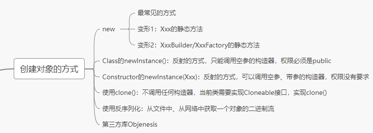

# 第17章：随堂复习与企业真题（反射机制）

***

## 一、随堂复习

### 1. 反射的概述（熟悉）

- Java给我们提供了一套API，使用这套API我们可以在运行时动态的获取指定对象所属的类，创建运行时类的对象，调用指定的结构（属性、方法）等。
- API：
  - `java.lang.Class`：代表一个类
  - java.lang.reflect.Method：代表类的方法
  - java.lang.reflect.Field：代表类的成员变量
  - java.lang.reflect.Constructor：代表类的构造器
  - … …
- 反射的优点和缺点
  - **优点：**
    - 提高了Java程序的灵活性和扩展性，`降低了耦合性`，提高`自适应`能力

    - 允许程序创建和控制任何类的对象，无需提前`硬编码`目标类
  - **缺点：**
    - 反射的`性能较低`。
      - 反射机制主要应用在对灵活性和扩展性要求很高的系统框架上
    - 反射会`模糊`程序内部逻辑，`可读性较差`。
- 反射，平时开发中，我们使用并不多。主要是在框架的底层使用。

### 2. Class:反射的源头

- Class的理解 （掌握）

  ```
  针对于编写好的.java源文件进行编译(使用javac.exe)，会生成一个或多个.class字节码文件。接着，我们使用
  java.exe命令对指定的.class文件进行解释运行。这个解释运行的过程中，我们需要将.class字节码文件加载(使用类的加载器)到内存中(存放在方法区)。加载到内存中的.class文件对应的结构即为Class的一个实例。
  ```

- 获取Class的实例的几种方式（前三种）

  - 类.class
  - 对象.getClass()
  - （使用较多）Class调用静态方法forName(String className)
  - (了解)使用ClassLoader的方法loadClass(String className)

- Class 可以指向哪些结构。

  ```
  简言之，所有Java类型！
  （1）class：外部类，成员(成员内部类，静态内部类)，局部内部类，匿名内部类
  （2）interface：接口
  （3）[]：数组
  （4）enum：枚举
  （5）annotation：注解@interface
  （6）primitive type：基本数据类型
  （7）void
  ```

### 3. 类的加载过程、类的加载器（理解）

- 类的加载过程

  ```
  过程1：类的装载(loading)
  将类的class文件读入内存，并为之创建一个java.lang.Class对象。此过程由类加载器完成
  
  过程2：链接(linking)
  > 验证(Verify):确保加载的类信息符合JVM规范，例如：以cafebabe开头，没有安全方面的问题。
  > 准备(Prepare):正式为类变量（static）分配内存并设置类变量默认初始值的阶段，这些内存都将在方法区中进行分配。
  > 解析(Resolve):虚拟机常量池内的符号引用（常量名）替换为直接引用（地址）的过程。
  
  过程3：初始化(initialization)
  执行类构造器<clinit>()方法的过程。
  类构造器<clinit>()方法是由编译期自动收集类中所有类变量的赋值动作和静态代码块中的语句合并产生的。
  ```

- 类的加载器

  ```
  5.1 作用：负责类的加载，并对应于一个Class的实例。
  
  5.2 分类（分为两种）：
  > BootstrapClassLoader:引导类加载器、启动类加载器
       > 使用C/C++语言编写的，不能通过Java代码获取其实例
       > 负责加载Java的核心库（JAVA_HOME/jre/lib/rt.jar或sun.boot.class.path路径下的内容）
  
  > 继承于ClassLoader的类加载器
      > ExtensionClassLoader:扩展类加载器
              > 负责加载从java.ext.dirs系统属性所指定的目录中加载类库，或从JDK的安装目录的jre/lib/ext子目录下加载类库
      > SystemClassLoader/ApplicationClassLoader:系统类加载器、应用程序类加载器
              > 我们自定义的类，默认使用的类的加载器。
      > 用户自定义类的加载器
              > 实现应用的隔离（同一个类在一个应用程序中可以加载多份）；数据的加密。
  ```

### 4. 反射的应用1：创建运行时类的对象（重点）

```
Class clazz = Person.class;

//创建Person类的实例
Person per = (Person) clazz.newInstance();

System.out.println(per);
```

```
要想创建对象成功，需要满足：
条件1：要求运行时类中必须提供一个空参的构造器
条件2：要求提供的空参的构造器的权限要足够。
```

### 5. 反射的应用2：获取运行时类所有的结构

```
（了解）获取运行时类的内部结构1：所有属性、所有方法、所有构造器
（熟悉）获取运行时类的内部结构2：父类、接口们、包、带泛型的父类、父类的泛型等
```

### 6. 反射的应用3：调用指定的结构（重点）

```
3.1 调用指定的属性（步骤）
步骤1.通过Class实例调用getDeclaredField(String fieldName)，获取运行时类指定名的属性
步骤2. setAccessible(true)：确保此属性是可以访问的
步骤3. 通过Filed类的实例调用get(Object obj) （获取的操作）
                  或 set(Object obj,Object value) （设置的操作）进行操作。

3.2 调用指定的方法（步骤）
步骤1.通过Class的实例调用getDeclaredMethod(String methodName,Class ... args),获取指定的方法
步骤2. setAccessible(true)：确保此方法是可访问的
步骤3.通过Method实例调用invoke(Object obj,Object ... objs),即为对Method对应的方法的调用。
     invoke()的返回值即为Method对应的方法的返回值
     特别的：如果Method对应的方法的返回值类型为void，则invoke()返回值为null

3.3 调用指定的构造器（步骤）
步骤1.通过Class的实例调用getDeclaredConstructor(Class ... args)，获取指定参数类型的构造器
步骤2.setAccessible(true)：确保此构造器是可以访问的
步骤3.通过Constructor实例调用newInstance(Object ... objs),返回一个运行时类的实例。
```

### 7. 反射的应用4：注解的使用（了解）

略

### 8. 体会：反射的动态性

```java
public class ReflectTest {

    //体会：静态性
    public Person getInstance(){
        return new Person();
    }

    //体会：反射的动态性
    //举例1：
    public <T> T getInstance(String className) throws Exception {

        Class clazz = Class.forName(className);

        Constructor con = clazz.getDeclaredConstructor();
        con.setAccessible(true);

        return (T) con.newInstance();

    }

    @Test
    public void test1() throws Exception {
        Person p1 = getInstance();
        System.out.println(p1);

        String className = "com.atguigu04.other.dynamic.Person";
        Person per1 = getInstance(className);
        System.out.println(per1);

        String className1 = "java.util.Date";
        Date date1 = getInstance(className1);
        System.out.println(date1);
    }

    //体会：反射的动态性
    //举例2：
    public Object invoke(String className,String methodName) throws Exception {
        //1. 创建全类名对应的运行时类的对象
        Class clazz = Class.forName(className);

        Constructor con = clazz.getDeclaredConstructor();
        con.setAccessible(true);

        Object obj = con.newInstance();

        //2. 获取运行时类中指定的方法，并调用
        Method method = clazz.getDeclaredMethod(methodName);
        method.setAccessible(true);
        return method.invoke(obj);
    }

    @Test
    public void test2() throws Exception {
        String className = "com.atguigu04.other.dynamic.Person";
        String methodName = "show";

        Object returnValue = invoke(className,methodName);
        System.out.println(returnValue);
    }

}
```


## 二、企业真题

### 2.1 反射概述

#### 1. 对反射了解吗？反射有什么好处？为什么需要反射？（微*银行）

```
类似问题：
> Java反射的作用是什么？(三*重工、上海*和网络)
> Java反射机制的作用有什么？(上海明*物联网)
> 反射的具体用途？（阿***芝*信用项目组）
```

略

#### 2. 反射的使用场合和作用、及其优缺点（*软国际）

```
类似问题：
> 反射机制的优缺点(君*科技)
> Java反射你怎么用的？（吉*航空）
```

略

#### 3. 实现Java反射的类有什么？(君*科技)

```
类似问题：
> Java反射 API 有几类？(北京*蓝)
```

问API。

#### 4. 反射是怎么实现的？（上海立*网络）

从Class说起。


### 2.2 Class的理解

#### 1. Class类的作用？生成Class对象的方法有哪些？(顺*)

反射的源头。 主要有三种。

#### 2. Class.forName("全路径") 会调用哪些方法 ？ 会调用构造方法吗？加载的类会放在哪？（上*银行外包）

**Class.forName() 会执行执行类构造器<clinit>()方法。**

不会调用构造方法

加载的类放在方法区。

### 2.3 类的加载

#### 1. 类加载流程（汇\*\*通、同\*顺、凡*科技）

略

###  2.4 创建对象

#### 1. 说一下创建对象的几种方法？（华油***集团、\*科软、凡\*科技）

```
类似问题：
> 除了使用new创建对象之外，还可以用什么方法创建对象？(*云网络)
```




#### 2. 如何找到对象实际类的？（*度）

对象.getClass();

```
Object obj = new Date();

obj.getClass();// 获取到的是Date。
```


#### 3. Java反射创建对象效率高还是通过new创建对象的效率高？(三*重工)

new 的方式。

### 2.5 调用属性、方法

#### 1. 如何利用反射机制来访问一个类的方法？（神州**软件）

```
调用指定的方法（步骤）
步骤1.通过Class的实例调用getDeclaredMethod(String methodName,Class ... args),获取指定的方法
步骤2. setAccessible(true)：确保此方法是可访问的
步骤3.通过Method实例调用invoke(Object obj,Object ... objs),即为对Method对应的方法的调用。
     invoke()的返回值即为Method对应的方法的返回值
     特别的：如果Method对应的方法的返回值类型为void，则invoke()返回值为null
```


#### 2. 说一下Java反射获取私有属性，如何改变值？（阿\*\*\**麻信用项目组）

```
调用指定的属性（步骤）
步骤1.通过Class实例调用getDeclaredField(String fieldName)，获取运行时类指定名的属性
步骤2. setAccessible(true)：确保此属性是可以访问的
步骤3. 通过Filed类的实例调用get(Object obj) （获取的操作）
                       或 set(Object obj,Object value) （设置的操作）进行操作。
```

```
针对于核心源码的api，内部的私有的结构在jdk17中就不可以通过反射调用了。
```

