- [1. java 基础知识图解](#1-java-基础知识图解)
- [2. 软件基础](#2-软件基础)
	- [2.1. 软件开发介绍](#21-软件开发介绍)
	- [2.2. 常用dos命令](#22-常用dos命令)
- [3. 程序语言概述](#3-程序语言概述)
	- [3.1. Java简介](#31-java简介)
		- [3.1.1. java 简史](#311-java-简史)
		- [3.1.2. Java技术体系平台](#312-java技术体系平台)
		- [3.1.3. java领域应用](#313-java领域应用)
		- [3.1.4. Java语言的特点](#314-java语言的特点)
		- [3.1.5. Java两种核心机制](#315-java两种核心机制)
			- [3.1.5.1. 内存泄露和溢出](#3151-内存泄露和溢出)
	- [3.2. 开发环境搭建](#32-开发环境搭建)
		- [3.2.1. 什么是JDK，JRE](#321-什么是jdkjre)
		- [3.2.2. 安装JDK](#322-安装jdk)
		- [3.2.3. 配置系统变量](#323-配置系统变量)
	- [3.3. HelloWorld](#33-helloworld)
		- [3.3.1. 准备](#331-准备)
		- [3.3.2. 编码](#332-编码)
		- [3.3.3. 常见问题即解决办法](#333-常见问题即解决办法)
		- [3.3.4. 总结](#334-总结)
	- [3.4. 注释（Comment）](#34-注释comment)
		- [3.4.1. 单行和多行注释](#341-单行和多行注释)
		- [3.4.2. 文档注释](#342-文档注释)
	- [3.5. Java API的文档](#35-java-api的文档)
	- [3.6. 良好的编程风格](#36-良好的编程风格)
	- [3.7. 常用的Java开发工具](#37-常用的java开发工具)
- [4. 基础法语](#4-基础法语)
	- [4.1. 关键字和保留字](#41-关键字和保留字)
		- [4.1.1. 关键字(keyword)的定义和特点](#411-关键字keyword的定义和特点)
		- [4.1.2. 保留字(reserved word)](#412-保留字reserved-word)
	- [4.2. 标识符（Identifier）](#42-标识符identifier)
	- [4.3. 变量(variable)](#43-变量variable)
	- [4.4. 数据类型](#44-数据类型)
		- [4.4.1. 八种基本类型](#441-八种基本类型)
		- [4.4.2. 类型转换](#442-类型转换)
			- [4.4.2.1. 自动类型转换：](#4421-自动类型转换)
			- [4.4.2.2. 强制类型转换](#4422-强制类型转换)
		- [4.4.3. 基本类型的字面值（5条）](#443-基本类型的字面值5条)
		- [4.4.4. 基本类型运算规则（5条)](#444-基本类型运算规则5条)
		- [4.4.5. 进制](#445-进制)
	- [4.5. 运算符](#45-运算符)
		- [4.5.1. 算数运算符](#451-算数运算符)
		- [4.5.2. 赋值运算符](#452-赋值运算符)
		- [4.5.3. 比较运算符](#453-比较运算符)
		- [4.5.4. 逻辑运算符](#454-逻辑运算符)
		- [4.5.5. 位运算符](#455-位运算符)
			- [4.5.5.1. 如何求一个0~255范围内的整数的十六进制值，例如60的十六进制表示形式3C](#4551-如何求一个0255范围内的整数的十六进制值例如60的十六进制表示形式3c)
			- [4.5.5.2. `两个变量交换的三种方式`](#4552-两个变量交换的三种方式)
		- [4.5.6. 运算符优先级](#456-运算符优先级)
- [5. 流程控制](#5-流程控制)
	- [5.1. 顺序结构](#51-顺序结构)
	- [5.2. 分支结构](#52-分支结构)
		- [5.2.1. if-else结构](#521-if-else结构)
		- [5.2.2. switch-case](#522-switch-case)
			- [5.2.2.1. 例题：](#5221-例题)
		- [5.2.3. 分支结构的选择](#523-分支结构的选择)
	- [5.3. 循环结构](#53-循环结构)
		- [5.3.1. for循环](#531-for循环)
			- [5.3.1.1. 例题：](#5311-例题)
		- [5.3.2. while循环](#532-while循环)
		- [5.3.3. do-while循环](#533-do-while循环)
		- [5.3.4. 嵌套循环](#534-嵌套循环)
			- [5.3.4.1. 例子：](#5341-例子)
			- [5.3.4.2. 三种跳出多重循环方法：](#5342-三种跳出多重循环方法)
		- [5.3.5. 特殊关键字的使用：break、continue](#535-特殊关键字的使用breakcontinue)
	- [5.4. 家庭收支记账软件](#54-家庭收支记账软件)
- [6. 数组](#6-数组)
	- [6.1. 数组的概述](#61-数组的概述)
	- [6.2. 一维数组的使用](#62-一维数组的使用)
		- [6.2.1. 声明](#621-声明)
		- [6.2.2. 初始化](#622-初始化)
		- [6.2.3. 数组元素的引用](#623-数组元素的引用)
		- [6.2.4. 数组元素的默认初始化值](#624-数组元素的默认初始化值)
		- [6.2.5. 内存分析](#625-内存分析)
		- [6.2.6. 代码](#626-代码)
		- [6.2.7. 练习题：](#627-练习题)
	- [6.3. 多维数组](#63-多维数组)
		- [6.3.1. 练习题](#631-练习题)
	- [6.4. 数组中涉及的常见算法](#64-数组中涉及的常见算法)
		- [6.4.1. 数组元素的赋值(杨辉三角、`回形数`等)](#641-数组元素的赋值杨辉三角回形数等)
		- [6.4.2. 求数值型数组中元素的最大值、最小值、平均数、总和等](#642-求数值型数组中元素的最大值最小值平均数总和等)
		- [6.4.3. 数组的复制、反转、查找(线性查找、二分法查找)](#643-数组的复制反转查找线性查找二分法查找)
		- [6.4.4. 数组元素的排序算法](#644-数组元素的排序算法)
			- [6.4.4.1. 算法概念](#6441-算法概念)
			- [6.4.4.2. 冒泡排序](#6442-冒泡排序)
			- [6.4.4.3. 快速排序](#6443-快速排序)
			- [6.4.4.4. 各种内部排序方法性能比较](#6444-各种内部排序方法性能比较)
			- [6.4.4.5. 排序算法的选择](#6445-排序算法的选择)
	- [6.5. Arrays数组工具类](#65-arrays数组工具类)
	- [6.6. 数组使用中的常见异常](#66-数组使用中的常见异常)
- [7. 面向对象（OOP）](#7-面向对象oop)
	- [7.1. 面向过程和面向对象](#71-面向过程和面向对象)
		- [7.1.1. 面向对象的思想概述](#711-面向对象的思想概述)
	- [7.2. 类和对象](#72-类和对象)
		- [7.2.1. Java类及类的成员](#721-java类及类的成员)
			- [7.2.1.1. 常见的类的成员有：](#7211-常见的类的成员有)
			- [7.2.1.2. 语法：](#7212-语法)
			- [7.2.1.3. 创建自定义类](#7213-创建自定义类)
		- [7.2.2. 对象的创建与使用](#722-对象的创建与使用)
			- [7.2.2.1. 类与对象的关系：](#7221-类与对象的关系)
			- [7.2.2.2. java内存结构](#7222-java内存结构)
			- [7.2.2.3. 匿名对象](#7223-匿名对象)
			- [7.2.2.4. 代码](#7224-代码)
	- [7.3. 类的结构之一：属性(field）](#73-类的结构之一属性field)
		- [7.3.1. 语法](#731-语法)
		- [7.3.2. 分类](#732-分类)
		- [7.3.3. 局部变量与成员变量的区别](#733-局部变量与成员变量的区别)
		- [7.3.4. 成员变量vs局部变量的内存位置](#734-成员变量vs局部变量的内存位置)
		- [7.3.5. 成员变量默认初始值](#735-成员变量默认初始值)
		- [7.3.6. 代码](#736-代码)
	- [7.4. 类的结构之二：方法（method）](#74-类的结构之二方法method)
		- [7.4.1. 定义](#741-定义)
		- [7.4.2. 语法：](#742-语法)
		- [7.4.3. 分类](#743-分类)
		- [7.4.4. 方法的调用过程](#744-方法的调用过程)
		- [7.4.5. 代码](#745-代码)
		- [7.4.6. 对象数组的内存解析](#746-对象数组的内存解析)
		- [7.4.7. 方法重载（overload）](#747-方法重载overload)
		- [7.4.8. 可变形参方法](#748-可变形参方法)
		- [7.4.9. 方法参数的值传递机制](#749-方法参数的值传递机制)
		- [7.4.10. 递归(recursion)方法](#7410-递归recursion方法)
	- [7.5. 面向对象特征一：封装](#75-面向对象特征一封装)
		- [7.5.1. 概念](#751-概念)
		- [7.5.2. 四种权限修饰符](#752-四种权限修饰符)
		- [7.5.3. 代码](#753-代码)
		- [7.5.4. 封装性的体现：](#754-封装性的体现)
	- [7.6. 类的结构之三：构造器/构造方法(constructor)](#76-类的结构之三构造器构造方法constructor)
		- [7.6.1. 概念](#761-概念)
		- [7.6.2. JavaBean（POJO）](#762-javabeanpojo)
		- [7.6.3. UML类图](#763-uml类图)
		- [7.6.4. this关键字](#764-this关键字)
			- [7.6.4.1. 概念](#7641-概念)
			- [7.6.4.2. 练习：](#7642-练习)
		- [7.6.5. package](#765-package)
		- [7.6.6. import](#766-import)
	- [7.7. 面向对象特征二：继承性(inheritance)](#77-面向对象特征二继承性inheritance)
		- [7.7.1. 引入](#771-引入)
		- [7.7.2. 概念及作用](#772-概念及作用)
		- [7.7.3. 代码及总结](#773-代码及总结)
		- [7.7.4. 方法的重写(override/overwrite)](#774-方法的重写overrideoverwrite)
		- [7.7.5. 关键字：super](#775-关键字super)
		- [7.7.6. 子类对象实例化过程](#776-子类对象实例化过程)
	- [7.8. 面向对象特征三：多态](#78-面向对象特征三多态)
		- [7.8.1. 概念](#781-概念)
		- [7.8.2. 代码](#782-代码)
		- [7.8.3. 多态性应用举例](#783-多态性应用举例)
		- [7.8.4. 虚拟方法调用(Virtual Method Invocation)](#784-虚拟方法调用virtual-method-invocation)
		- [7.8.5. 小结](#785-小结)
			- [7.8.5.1. 重写与重载小结](#7851-重写与重载小结)
			- [7.8.5.2. 多态小结](#7852-多态小结)
		- [7.8.6. 对象类型转换](#786-对象类型转换)
			- [7.8.6.1. instanceof 操作符](#7861-instanceof-操作符)
			- [7.8.6.2. 对象类型转换（casting）](#7862-对象类型转换casting)
		- [7.8.7. 多态和继承变量方法综合练习](#787-多态和继承变量方法综合练习)
	- [7.9. Object类的使用](#79-object类的使用)
		- [7.9.1. 概述](#791-概述)
		- [7.9.2. ==操作符与equals方法](#792-操作符与equals方法)
		- [7.9.3. toString() 方法](#793-tostring-方法)
	- [7.10. 包装类的使用](#710-包装类的使用)
		- [7.10.1. 代码](#7101-代码)
		- [7.10.2. 包装类用法举例](#7102-包装类用法举例)
		- [7.10.3. 面试题](#7103-面试题)
		- [7.10.4. 单元测试步骤](#7104-单元测试步骤)
	- [7.11. static](#711-static)
		- [7.11.1. 概述](#7111-概述)
		- [7.11.2. 代码总结](#7112-代码总结)
		- [7.11.3. 类变量 vs 实例变量内存解析](#7113-类变量-vs-实例变量内存解析)
		- [7.11.4. 练习题：](#7114-练习题)
		- [7.11.5. 单例模式](#7115-单例模式)
			- [7.11.5.1. 应用场景](#71151-应用场景)
		- [7.11.6. main方法扩展使用](#7116-main方法扩展使用)
	- [7.12. 类的成员之四：代码块](#712-类的成员之四代码块)
		- [7.12.1. 概念](#7121-概念)
		- [7.12.2. 代码及总结](#7122-代码及总结)
		- [7.12.3. 程序中成员变量赋值的执行顺序](#7123-程序中成员变量赋值的执行顺序)
		- [7.12.4. 综合练习](#7124-综合练习)
	- [7.13. final](#713-final)
	- [7.14. 抽象类与抽象方法abstract](#714-抽象类与抽象方法abstract)
		- [7.14.1. 匿名子类](#7141-匿名子类)
		- [7.14.2. 模板方法设计模式(TemplateMethod)](#7142-模板方法设计模式templatemethod)
	- [7.15. 接口（interface）](#715-接口interface)
		- [7.15.1. 概念](#7151-概念)
		- [7.15.2. 匿名实现类](#7152-匿名实现类)
		- [7.15.3. 代理模式(Proxy)](#7153-代理模式proxy)
			- [7.15.3.1. 概念](#71531-概念)
			- [7.15.3.2. 静态代理](#71532-静态代理)
			- [7.15.3.3. 动态代理（JDK+ CGLIB）](#71533-动态代理jdk-cglib)
		- [7.15.4. 接口和抽象类区别](#7154-接口和抽象类区别)
		- [7.15.5. 面试题：排错](#7155-面试题排错)
		- [7.15.6. 接口新特性](#7156-接口新特性)
	- [7.16. 类的成员之五：内部类](#716-类的成员之五内部类)
- [8. 异常处理](#8-异常处理)
	- [8.1. 异常概述与异常体系结构](#81-异常概述与异常体系结构)
	- [8.2. 常见异常](#82-常见异常)
	- [8.3. 异常处理机制一：try-catch-finally](#83-异常处理机制一try-catch-finally)
	- [8.4. 异常处理机制二：throws](#84-异常处理机制二throws)
	- [8.5. 手动抛出异常：throw](#85-手动抛出异常throw)
	- [8.6. 用户自定义异常类](#86-用户自定义异常类)
	- [8.7. 异常五个关键字总结](#87-异常五个关键字总结)
- [9. eclipse](#9-eclipse)
	- [9.1. 快捷键](#91-快捷键)


# 1. java 基础知识图解


# 2. 软件基础

[语言排行榜](https://www.tiobe.com/tiobe-index/)  https://www.tiobe.com/tiobe-index/

## 2.1. 软件开发介绍

+ 软件开发

> 软件，即一系列按照特定顺序组织的计算机数据和指令的集合。有系统软件和应用软件之分。

+ 人机交互方式
> 图形化界面(Graphical User Interface GUI)这种方式简单直观，使用者易于接受，容易上手操作。

> 命令行方式(Command Line Interface CLI)：需要有一个控制台，输入特定的指令，让计算机完成一些操作。较为麻烦，需要记录住一些命令。


## 2.2. 常用dos命令

```shell
dir : 列出当前目录下的文件以及文件夹
md : 创建目录
cd : 进入指定目录
cd.. :  退回到上一级目录
cd \: 退回到根目录
rd : 删除目录，只能删除空目录
del : 删除文件可以使用通配符  	rg：*.txt删除所有txt文件   del文件目录，将目录下的文件全部删除
exit : 退出 dos 命令行

补充：echo javase>1.doc  ：  将javase写出到1.doc文件中
```

常用快捷键

```
← →：移动光标
↑ ↓：调阅历史操作命令
Delete和Backspace：删除字符
```

# 3. 程序语言概述

编程语言发展历史：机器语言、汇编语言、高级语言（面向过程 | 面向对象）

java面向对象：

+ 是SUN(Stanford University Network，斯坦福大学网络公司 ) 1995年推出的一门高级编程语言。

+ 是一种面向Internet的编程语言。Java一开始富有吸引力是因为Java程序可以在Web浏览器中运行。这些Java程序被称为Java小程序（applet）。applet使用现代的图形用户界面与Web用户进行交互。 applet内嵌在HTML代码中。

+ 随着Java技术在web方面的不断成熟，已经成为Web应用程序的首选开发语言。

后台开发语言：Java、PHP、Python、Go、Node.js...

## 3.1. Java简介

### 3.1.1. java 简史

+ Java语言的诞生

java之父James Gosling团队在开发”Green”项目时，发现C缺少垃圾回收系统，还有可移植的安全性、分布程序设计和多线程功能。最后，他们想要一种易于移植到各种设备上的平台。

Java确实是从C语言和C++语言继承了许多成份，甚至可以将Java看成是**类C语言**发展和衍生的产物。比如Java语言的变量声明，操作符形式，参数传递，流程控制等方面和C语言、C++语言完全相同。但同时，Java是一个**纯粹的面向对象**的程序设计语言，它继承了C++语言面向对象技术的核心。Java舍弃了C语言中容易引起错误的指针（以引用取代）、运算符重载（operator overloading）、多重继承（以接口取代）等特性，**增加了垃圾回收器功能**用于回收不再被引用的对象所占据的内存空间。JDK1.5又引入了泛型编程（Generic Programming）、类型安全的枚举、不定长参数和自动装/拆箱

+ 简史

1991年 Green项目，开发语言最初命名为Oak (橡树)
1994年，开发组意识到Oak 非常适合于互联网
**1996年，发布JDK 1.0**，约8.3万个网页应用Java技术来制作
1997年，发布JDK 1.1，JavaOne会议召开，创当时全球同类会议规模之最
1998年，发布JDK 1.2，同年发布企业平台J2EE
1999年，Java分成J2SE、J2EE和J2ME，JSP/Servlet技术诞生
**2004年，发布里程碑式版本：JDK 1.5，为突出此版本的重要性，更名为JDK 5.0**
2005年，J2SE -> JavaSE，J2EE -> JavaEE，J2ME -> JavaME
2009年，Oracle公司收购SUN，交易价格74亿美元
2011年，发布JDK 7.0
**2014年，发布JDK 8.0，是继JDK 5.0以来变化最大的版本**
2017年，发布JDK 9.0，最大限度实现模块化
2018年3月，发布JDK 10.0，版本号也称为18.3
2018年9月，发布JDK 11.0，版本号也称为18.9


### 3.1.2. Java技术体系平台

+ Java SE(Java Standard Edition)标准版

> 支持面向桌面级应用（如Windows下的应用程序）的Java平台，提供了完整的Java核心API，此版本以前称为J2SE

+ Java EE(Java Enterprise Edition)企业版

> 是为开发企业环境下的应用程序提供的一套解决方案。该技术体系中包含的技术如 :Servlet 、Jsp等，主要针对于Web应用程序开发。版本以前称为J2EE

+ Java ME(Java Micro Edition)小型版

> 支持Java程序运行在移动终端（手机、PDA）上的平台，对Java API有所精简，并加入了针对移动终端的支持，此版本以前称为J2ME

+ Java Card

支持一些Java小程序（Applets）运行在小内存设备（如智能卡）上的平台

### 3.1.3. java领域应用

从Java的应用领域来分，Java语言的应用方向主要表现在以下几个方面（web、大数据、客户端-安卓）：

+ **企业级应用**：主要指复杂的大企业的软件系统、各种类型的网站。Java的安全机制以及它的跨平台的优势，使它在分布式系统领域开发中有广泛应用。应用领域包括金融、电信、交通、电子商务等。

+ Android平台应用：Android应用程序使用Java语言编写。Android开发水平的高低很大程度上取决于Java语言核心能力是否扎实。

+ **大数据平台开发**：各类框架有Hadoop，spark，storm，flink等，就这类技术生态圈来讲，还有各种中间件如flume，kafka，sqoop等等 ，这些框架以及工具大多数是用Java编写而成，但提供诸如Java，scala，Python，R等各种语言API供编程。

+ 移动领域应用：主要表现在消费和嵌入式领域，是指在各种小型设备上的应用，包括手机、PDA、机顶盒、汽车通信设备等。


### 3.1.4. Java语言的特点

+ 特点一：**面向对象**
√两个基本概念：类、对象
√三大特性：封装、继承、多态
+ 特点二：健壮性
√吸收了C/C++语言的优点，但去掉了其影响程序健壮性的部分（如指针、内存的申请与释放等），提供了一个相对安全的内存管理和访问机制
+ 特点三：**跨平台性**
√跨平台性：通过Java语言编写的应用程序在不同的系统平台上都可以运行。“Write once，Run Anywhere”
√原理：只要在需要运行java应用程序的操作系统上，先安装一个**Java虚拟机**（JVM Java Virtual Machine）即可。因为有了JVM，同一个Java程序在三个不同的操作系统中都可以执行。这样就实现了Java程序的跨平台性。

### 3.1.5. Java两种核心机制

+ Java虚拟机（Java Virtal Machine）

	+ JVM是一个虚拟的计算机，具有指令集并使用不同的存储区域。负责执行指令，管理数据、内存、寄存器。
	+ 对于不同的平台，有不同的虚拟机。
	+ 只有某平台提供了对应的java虚拟机，java程序才可在此平台运行
	+ Java虚拟机机制屏蔽了底层运行平台的差别，实现了“一次编译，到处运行”

+ 垃圾收集机制（Garbage Collection）
  + 不再使用的内存空间应回收——垃圾回收。
  + 在C/C++等语言中，由程序员负责回收无用内存。
    Java 语言消除了程序员回收无用内存空间的责任：它提供一种系统级线程跟踪存储空间的分配情况。并在JVM空闲时，检查并释放那些可被释放的存储空间。
+ 垃圾回收在Java程序运行过程中自动进行，程序员无法精确控制和干预。
  **Java程序还会出现内存泄漏和内存溢出问题吗？Yes！**

#### 3.1.5.1. 内存泄露和溢出

+ 内存溢出 `out of memory`，是指**程序在申请内存时，没有足够的内存空间供其使用**，出现out of memory；

+ 内存泄露 `memory leak`，是指**程序在申请内存后，无法释放已申请的内存空间**，一次内存泄露危害可以忽略，但内存泄露堆积后果很严重，无论多少内存，迟早会被占光。

>memory leak会最终会导致out of memory！


## 3.2. 开发环境搭建

### 3.2.1. 什么是JDK，JRE

JDK(Java Development Kit    Java开发工具包)

> JDK是提供给Java开发人员使用的，其中包含了java的开发工具，也包括了JRE。所以安装了JDK，就不用在单独安装JRE了。

+ 其中的开发工具：编译工具(javac.exe)  打包工具(jar.exe)等

JRE(Java Runtime Environment    Java运行环境) 

> 包括Java虚拟机(JVM Java Virtual Machine)和Java程序所需的核心类库等，如果想要运行一个开发好的Java程序，计算机中只需要安装JRE即可。


`简单而言，使用JDK的开发工具完成的java程序，交给JRE去运行。`

```
JDK=JRE+java的开发工具（javac.exe、java.exe、javadoc.exe）
JRE=JVM+java的核心类库
```


### 3.2.2. 安装JDK

下载地址

```
www.oracle.com
java.sun.com
```

### 3.2.3. 配置系统变量

1、`JAVA_HOME`		配置jdk安装目录（bin的上一层）
2、配置环境变量path：`%JAVA_HOME%\bin`，并提到path的第一个，避免出现其他环境
3、`javac`    或者 `Java -version`   验证命令

> 傻瓜式安装中，下一步是会提示安装jre，保留版本号，安装目录不要有中文空格


> **添加环境变量原因：**
>
> 每次执行 java 的工具都要进入到bin目录下，是非常麻烦的。可不可以在任何目录下都可以执行java的工具呢？
>
> ​	根据windows系统在查找可执行程序的原理，可以将java工具所在路径定义到path 环境变量中，让系统帮我们去找运行执行的程序。
> ​	配置方法：
> ​	我的电脑--属性--高级系统设置--环境变量
> ​	编辑 path 环境变量，在变量值开始处加上java工具所在目录，后面用 “ ; ”和其他值分隔开即可。
> ​	打开DOS命令行，任意目录下敲入javac。如果出现javac 的参数信息，配置成功。


## 3.3. HelloWorld

### 3.3.1. 准备

步骤：
1.将Java 代码编写到扩展名为 .java 的文件中。
2.通过 javac 命令对该 java 文件进行编译。
3.通过 java 命令对生成的 class 文件进行运行。


### 3.3.2. 编码

**一、编写**

> 系统准备：
> + 系统显示文件后缀
> + java严格区分大小写
> + Windows不区分大小写


新建文件`HelloWorld.java`

```java
public class HelloWorld{
    public static void main(String[] args) {
        System.out.println("Hello World");
    }
}
```

**二、编译**

```bash
javac  HelloWorld.java 
javac  -encoding utf-8 HelloWorld.java //指定编码
```

+ 有了java源文件，通过编译器将其编译成JVM可以识别的字节码文件。
+ 在该源文件目录下，通过javac编译工具对 HelloWorld..java文件进行编译。
+ 如果程序没有错误，没有任何提示，但在当前目录下会出现一个Test.class文件，该文件称为字节码文件，也是可以执行的java的程序。

**三、运行**

```bash
java -Dfile.encoding=UTF-8 HelloWorld
```

+ 有了可执行的java程序(Test.class字节码文件)
+ 通过运行工具java.exe对字节码文件进行执行。

### 3.3.3. 常见问题即解决办法

| 报错                                                         | 分析原因                                                     |
| ------------------------------------------------------------ | ------------------------------------------------------------ |
| 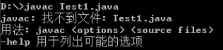 | 源文件名不存在或者写错<br />当前路径错误<br />后缀名隐藏问题 |
|  | 类文件名写错，尤其文件名与类名不一致时，要小心<br/>类文件不在当前路径下，或者不在classpath指定路径下 |
|  | 声明为public的类应与文件名一致，否知编译失败                 |
|  | 编译失败，注意错误出现的行数，再到源代码中指定位置改错       |

总结：

学习编程最容易犯的错是语法错误。Java要求你必须按照语法规则编写代码。如果你的程序违反了语法规则，例如：忘记了**分号、大括号、引号，或者拼错了单词，java编译器都会报语法错误**。**尝试着去看懂编译器会报告的错误信息。**

### 3.3.4. 总结

+ Java源文件以“java”为扩展名。源文件的基本组成部分是类（class），如本例中的HelloWorld类。
+ Java应用程序的**执行入口是main()方法**。它有固定的书写格式：
`public static void main(String[] args)  {...}`
+ **Java语言严格区分大小写**。
+ Java方法由一条条语句构成，**每个语句以“;”结束**。
+ **大括号都是成对**出现的，缺一不可。
+ **一个源文件中最多只能有一个public类。其它类的个数不限，如果源文件包含一个public类，则文件名必须按public所修饰的类名同名。**

## 3.4. 注释（Comment）

+ 用于注解说明解释程序的文字就是注释。
+ Java中的注释类型：
  - 单行注释
  - 多行注释
  - 文档注释 (java特有)
+ 提高了代码的阅读性；**调试程序的重要方法（注释掉一部分，判断出错范围）**。
+ 注释是一个程序员必须要具有的良好编程习惯。
+ 将自己的思想通过注释先整理出来，再用代码去体现

### 3.4.1. 单行和多行注释

```java
// 单行注释

/* 
多行注释 1
多行注释 2
*/
```

> 对于单行和多行注释，被注释的文字，不会被JVM（java虚拟机）解释执行。
> 多行注释里面不允许有多行注释嵌套。

### 3.4.2. javaDoc文档注释

```java
/**
 * 文档注释doc
 * 
 * @author 指定java程序的作者
 * @version 指定源文件的版本
 */
public class HelloWorld {
    /**
     * 文档注释： main方法：程序的入口
     */

    /*
     * 多行注释： main方法：程序的入口
     */
    public static void main(String[] args) {
        // 单行注释
        System.out.println("Hello world");
    }
}
```

注释内容可以被JDK提供的工具 *javadoc* 所解析，生成一套以网页文件形式体现的该程序的说明文档。

命令：

```
使用默认编码：javadoc -d mydoc -author -version HelloWorld.java
使用指定编码：javadoc -d mydoc -author -version -encoding utf-8 HelloWorld.java
```

​		其中

+ `-d mydoc` :表示新建一个mydoc的文件夹存放相关HTML、css、js相关文件

+ 注意Windows命令行的编码格式为gbk

  


---

### javaDoc拓展

写在类上的文档标注一般分为三段：

- 第一段：概要描述，通常用一句或者一段话简要描述该类的作用，以英文句号作为结束
- 第二段：详细描述，通常用一段或者多段话来详细描述该类的作用，一般每段话都以英文句号作为结束
- 第三段：文档标注，用于标注作者、创建时间、参阅类等信息

#### 第一段：概要描述

单行示例：

```java
package org.springframework.util;
/**
 * Miscellaneous {@link String} utility methods.
 * 
 */
public abstract class StringUtils {}
```

多行示例：

```java
package java.lang;

/**
 * Class {@code Object} is the root of the class hierarchy.
 * Every class has {@code Object} as a superclass. All objects,
 * including arrays, implement the methods of this class.
 */
public class Object {}
```

在注释中出现以@开头东东被称之为Javadoc文档标记，是JDK定义好的，如@author、@version、@since、@see、@link、@code、@param、@return、@exception、@throws等。

1. **@link：{@link 包名.类名#方法名(参数类型)} 用于快速链接到相关代码**

@link的使用语法`{@link 包名.类名#方法名(参数类型)}`，其中当包名在当前类中已经导入了包名可以省略，可以只是一个类名，也可以是仅仅是一个方法名，也可以是类名.方法名，使用此文档标记的类或者方法，可用通过按住Ctrl键+单击 可以快速跳到相应的类或者方法上，解析成html其实就是使用< code> 包名.类名#方法名(参数类型)< /code>

@link示例

```java
// 完全限定的类名
{@link java.lang.Character}

// 省略包名
{@link String}

// 省略类名，表示指向当前的某个方法
{@link #length()}

// 包名.类名.方法名(参数类型)
{@link java.lang.String#charAt(int)}
1234567891011
```

2. **@code： {@code text} 将文本标记为code**

{@code text} 会被解析成`<code> text </code>`
将文本标记为代码样式的文本，在code内部可以使用 < 、> 等不会被解释成html标签, code标签有自己的样式

一般在Javadoc中只要涉及到类名或者方法名，都需要使用@code进行标记。

#### 第二段：详细描述

详细描述一般用一段或者几个锻炼来详细描述类的作用，详细描述中可以使用html标签，如`<p>、<pre>、<a>、<ul>、<i>`等标签， 通常详细描述都以段落p标签开始。
详细描述和概要描述中间通常有一个空行来分割

```java
package org.springframework.util;

/**
 * Miscellaneous {@link String} utility methods.
 *
 * <p>Mainly for internal use within the framework; consider
 * <a href="http://commons.apache.org/proper/commons-lang/">Apache's Commons Lang</a>
 * for a more comprehensive suite of {@code String} utilities.
 *
 * <p>This class delivers some simple functionality that should really be
 * provided by the core Java {@link String} and {@link StringBuilder}
 * classes. It also provides easy-to-use methods to convert between
 * delimited strings, such as CSV strings, and collections and arrays.
 *
 */
public abstract class StringUtils {}
```

一般段落都用p标签来标记，凡涉及到类名和方法名都用@code标记，凡涉及到组织的，一般用a标签提供出来链接地址。

3. **@param**

一般类中支持泛型时会通过@param来解释泛型的类型

```java
/**
* @param <E> the type of elements in this list
*/
public interface List<E> extends Collection<E> {}
```

4. **@author**

详细描述后面一般使用@author来标记作者，如果一个文件有多个作者来维护就标记多个@author，@author 后面可以跟作者姓名(也可以附带邮箱地址)、组织名称(也可以附带组织官网地址)

```java
// 纯文本作者
@author Rod Johnson

// 纯文本作者，邮件
@author Igor Hersht, igorh@ca.ibm.com

// 超链接邮件 纯文本作者
@author <a href="mailto:ovidiu@cup.hp.com">Ovidiu Predescu</a>

// 纯文本邮件
@author shane_curcuru@us.ibm.com

// 纯文本 组织
@author Apache Software Foundation

// 超链接组织地址 纯文本组织
@author <a href="https://jakarta.apache.org/turbine"> Apache Jakarta Turbine</a>
1234567891011121314151617
```

5. **@see 另请参阅**

@see 一般用于标记该类相关联的类,@see即可以用在类上，也可以用在方法上。

```java
/**
 * @see IntStream
 * @see LongStream
 * @see DoubleStream
 * @see <a href="package-summary.html">java.util.stream</a>
 * /
public interface Stream<T> extends BaseStream<T, Stream<T>> {}
1234567
```

6. **@since 从以下版本开始**

@since 一般用于标记文件创建时项目当时对应的版本，一般后面跟版本号，也可以跟是一个时间，表示文件当前创建的时间

```java
package java.util.stream;

/**
* @since 1.8
*/
public interface Stream<T> extends BaseStream<T, Stream<T>> {}
123456
package org.springframework.util;

/**
* @since 16 April 2001
*/
public abstract class StringUtils {}
123456
```

7. **@version 版本**

@version 用于标记当前版本，默认为1.0

```java
package com.sun.org.apache.xml.internal.resolver;
 /**
 * @version 1.0
 */
public class Resolver extends Catalog {}
12345
```

------

#### 三：写在方法上的Javadoc

写在方法上的文档标注一般分为三段：

- 第一段：概要描述，通常用一句或者一段话简要描述该方法的作用，以英文句号作为结束
- 第二段：详细描述，通常用一段或者多段话来详细描述该方法的作用，一般每段话都以英文句号作为结束
- 第三段：文档标注，用于标注参数、返回值、异常、参阅等

方法详细描述上经常使用html标签来，通常都以p标签开始，而且p标签通常都是单标签，不使用结束标签，其中使用最多的就是p标签和pre标签,ul标签, i标签。

pre元素可定义预格式化的文本。被包围在pre元素中的文本通常会保留空格和换行符。而文本也会呈现为等宽字体，pre标签的一个常见应用就是用来表示计算机的源代码。

一般p经常结合pre使用，或者pre结合@code共同使用(推荐@code方式)
一般经常使用pre来举例如何使用方法

注意：pre>标签中如果有小于号、大于号、例如泛型 在生产javadoc时会报错

```
/**
 * Check whether the given {@code CharSequence} contains actual <em>text</em>.
 * <p>More specifically, this method returns {@code true} if the
 * {@code CharSequence} is not {@code null}, its length is greater than
 * 0, and it contains at least one non-whitespace character.
 * <p><pre class="code">
 * StringUtils.hasText(null) = false
 * StringUtils.hasText("") = false
 * StringUtils.hasText(" ") = false
 * StringUtils.hasText("12345") = true
 * StringUtils.hasText(" 12345 ") = true
 * </pre>
 * @param str the {@code CharSequence} to check (may be {@code null})
 * @return {@code true} if the {@code CharSequence} is not {@code null},
 * its length is greater than 0, and it does not contain whitespace only
 * @see Character#isWhitespace
 */
public static boolean hasText(@Nullable CharSequence str) {
	return (str != null && str.length() > 0 && containsText(str));
}
1234567891011121314151617181920
<pre>{@code
     Person[] men = people.stream()
                        .filter(p -> p.getGender() == MALE)
                        .toArray(Person[]::new);
}</pre>
12345
```

**8. @param**

@param 后面跟参数名，再跟参数描述

```
/**
* @param str the {@code CharSequence} to check (may be {@code null})
*/
public static boolean containsWhitespace(@Nullable CharSequence str) {}
1234
```

**9. @return**

@return 跟返回值的描述

```
/**
* @return {@code true} if the {@code String} is not {@code null}, its
*/
public static boolean hasText(@Nullable String str){}
1234
```

10. **@throws**

@throws 跟异常类型 异常描述 , 用于描述方法内部可能抛出的异常

```
/**
* @throws IllegalArgumentException when the given source contains invalid encoded sequences
*/
public static String uriDecode(String source, Charset charset){}
1234
```

11. **@exception**

用于描述方法签名throws对应的异常

```
/**
* @exception IllegalArgumentException if <code>key</code> is null.
*/
public static Object get(String key) throws IllegalArgumentException {}
1234
```

12. **@see**

@see既可以用来类上也可以用在方法上，表示可以参考的类或者方法

```
/**
* @see java.net.URLDecoder#decode(String, String)
*/
public static String uriDecode(String source, Charset charset){}
1234
```

13. **@value**

用于标注在常量上，{@value} 用于表示常量的值

```
/** 默认数量 {@value} */
private static final Integer QUANTITY = 1;
12
```

14. **@inheritDoc**

@inheritDoc用于注解在重写方法或者子类上，用于继承父类中的Javadoc

- 基类的文档注释被继承到了子类
- 子类可以再加入自己的注释（特殊化扩展）
- @return @param @throws 也会被继承

------

#### 四：示例

spring-core中的StringUtils 示例

```java
package org.springframework.util;

/**
 * Miscellaneous {@link String} utility methods.
 *
 * <p>Mainly for internal use within the framework; consider
 * <a href="http://commons.apache.org/proper/commons-lang/">Apache's Commons Lang</a>
 * for a more comprehensive suite of {@code String} utilities.
 *
 * <p>This class delivers some simple functionality that should really be
 * provided by the core Java {@link String} and {@link StringBuilder}
 * classes. It also provides easy-to-use methods to convert between
 * delimited strings, such as CSV strings, and collections and arrays.
 *
 * @author Rod Johnson
 * @author Juergen Hoeller
 * @author Keith Donald
 * @author Rob Harrop
 * @author Rick Evans
 * @author Arjen Poutsma
 * @author Sam Brannen
 * @author Brian Clozel
 * @since 16 April 2001
 */
public abstract class StringUtils {

	/**
	 * Decode the given encoded URI component value. Based on the following rules:
	 * <ul>
	 * <li>Alphanumeric characters {@code "a"} through {@code "z"}, {@code "A"} through {@code "Z"},
	 * and {@code "0"} through {@code "9"} stay the same.</li>
	 * <li>Special characters {@code "-"}, {@code "_"}, {@code "."}, and {@code "*"} stay the same.</li>
	 * <li>A sequence "{@code %<i>xy</i>}" is interpreted as a hexadecimal representation of the character.</li>
	 * </ul>
	 * 
	 * @param source the encoded String
	 * @param charset the character set
	 * @return the decoded value
	 * @throws IllegalArgumentException when the given source contains invalid encoded sequences
	 * @since 5.0
	 * @see java.net.URLDecoder#decode(String, String)
	 */
	public static String uriDecode(String source, Charset charset) {}

    
package com.example.demo;

/**
 * 类 {@code OrderService} 订单服务层.
 *
 * <p> 主要包括 创建订单、取消订单、查询订单等功能更
 *
 * @see Order
 * @author <a href="mailto:mengday.zhang@gmail.com">Mengday Zhang</a>
 * @since 2018/5/12
 */
public class OrderService {

	/** 默认数量 {@value} */
    private static final Integer QUANTITY = 1;

    /**
     * 创建订单.
     *
     * <p> 创建订单需要传用户id和商品列表(商品id和商品数量).
     *
     * <p><pre>{@code
     *  演示如何使用该方法
     *  List<Goods> items = new ArrayList<>();
     *  Goods goods = new Goods(1L, BigDecimal.ONE);
     *  Goods goods2 = new Goods(2L, BigDecimal.TEN);
     *  items.add(goods);
     *  items.add(goods2);
     *
     *  Order order1 = new Order();
     *  order.setUserId("1");
     *  order.setItems(items);
     *  OrderService#createOrder(order);
     * }
     * </pre>
     *
     * @param order 订单信息
     * @throws NullPointerException 参数信息为空
     * @exception IllegalArgumentException  数量不合法
     * @return 是否创建成功
     * @version 1.0
     * @see {@link Order}
     */
    public boolean createOrder(Order order) throws IllegalArgumentException{
        Objects.requireNonNull(order);

        List<Goods> items = order.getItems();
        items.forEach(goods -> {
            BigDecimal quantity = goods.getQuantity();
            if (quantity == null || BigDecimal.ZERO.compareTo(quantity) == 0) {
                throw new IllegalArgumentException();
            }
        });

        System.out.println("create order...");

        return true;
    }
}
```

#### 五：生成Javadoc

idea生成javadoc https://www.cnblogs.com/cyberniuniu/p/5021910.html

通过IDEA生成Javadoc： Tools --> Generate JavaDoc -->
注意要配置编码，如果不配送为生成乱码，还需要配置Output directory


## 3.5. Java API的文档

API （Application Programming Interface,应用程序编程接口）是 Java 提供的基本编程接口。

`http://www.oracle.com/technetwork/java/javase/downloads/index.html`

## 3.6. 良好的编程风格

+ 正确的注释和注释风格
  + 使用文档注释来注释整个类或整个方法。
  + 如果注释方法中的某一个步骤，使用单行或多行注释。
+ 正确的缩进和空白
  + 使用一次tab操作，实现缩进
  + 运算符两边习惯性各加一个空格。比如：2 + 4 * 5。
+ 块的风格
  + Java API 源代码选择了行尾风格（根据开头大括号换行还是在结尾区分）

## 3.7. 常用的Java开发工具

+ 记事本
+ UltraEdit
+ EditPlus
+ TextPad
+ NotePad

Java集成开发环境（IDE)：
+ JBuilder：http://edn.embarcadero.com/cn/jbuilder
+ NetBeans：https://netbeans.org/features/index.html
+ Eclipse：https://eclipse.org/
+ MyEclipse：http://www.myeclipsecn.com/
+ IntelliJ IDEA：https://www.jetbrains.com/idea/

# 4. 基础法语

## 4.1. 关键字和保留字

### 4.1.1. 关键字(keyword)的定义和特点

定义：被Java语言赋予了特殊含义，用做专门用途的字符串（单词）
特点：`关键字中所有字母都为小写`
官方地址：https://docs.oracle.com/javase/tutorial/java/nutsandbolts/_keywords.html


### 4.1.2. 保留字(reserved word)

Java保留字：现有Java版本尚未使用，但以后版本可能会作为关键字使用。自己命名标识符时要避免使用这些保留字
`goto` 、`const`

## 4.2. 标识符（Identifier）

+ 标识符：
  		Java 对各种变量、方法和类等要素命名时使用的字符序列称为标识符
      技巧：凡是自己可以起名字的地方都叫标识符。比如类名、变量名、包名。。。
+ 定义合法标识符规则：
  + 由26个英文字母大小写，0-9 ，_或$ 组成
  + 数字不可以开头。
  + 不可以使用关键字和保留字，但能包含关键字和保留字。
  + Java中严格区分大小写，长度无限制。
  + 标识符不能包含空格。
  
+ 命名规范

Java中的名称命名规范：
+ 包名：多单词组成时所有字母都小写：xxxyyyzzz

+ 类名、接口名（大驼峰）：多单词组成时，所有单词的首字母大写：XxxYyyZzz

+ 变量名、方法名（小驼峰）：多单词组成时，第一个单词首字母小写，第二个单词开始每个单词首字母大写：xxxYyyZzz

+ 常量名：所有字母都大写。多单词时每个单词用下划线连接：XXX_YYY_ZZZ

> 注意1：在起名字时，为了提高阅读性，要尽量有意义，“见名知意”。
> 注意2：java采用unicode字符集，因此标识符也可以使用汉字声明，但是不建议使用。

## 4.3. 变量(variable)

变量的概念：
		内存中的一个存储区域
		该区域的数据可以在同一类型范围内不断变化
		变量是程序中最基本的存储单元。包含`变量类型、变量名和存储的值`
变量的作用：
		用于在内存中保存数据
**使用变量注意：**
		`Java中每个变量必须先声明，后使用`
		使用变量名来访问这块区域的数据
		变量的作用域：其定义所在的一对{ }内
		变量只有在其作用域内才有效，出了作用域就失效
		同一个作用域内，不能定义重名的变量


```java
声明变量
 	语法：<数据类型> <变量名称>
 	例如：int var;
变量的赋值
 	语法：<变量名称> =  <值>
 	例如：var = 10;
声明和赋值变量
 	语法： <数据类型> <变量名> =  <初始化值>
 	例如：int var = 10;
```

案例：

```java
public static void main(String[] args) {
    // 变量的定义
    int age = 12;
    // 变量的使用
    System.out.println(age);

    // System.out.println(myNumber);// 报错，myNumber未定义

    // 变量的声明
    int myNumber;

    // System.out.println(myNumber);// 报错，myNumber未赋值

    // 变量的赋值
    myNumber = 12;
    // 变量的使用
    System.out.println(myNumber);
}
```


## 4.4. 数据类型

### 4.4.1. 八种基本类型

对于每一种数据都定义了明确的具体数据类型（强类型语言），在内存中分配了不同大小的内存空间。


| 类型        | 字节  | 默认值 | 解释                                                         |
| ----------- | ----- | ------ | ------------------------------------------------------------ |
| **byte**    | **1** | **0**  | **-27****到27-1****或者-128****到127****（中间含0****）**    |
| **short**   | 2     | 0      | -215到215-1                                                  |
| **int**     | 4     | 0      | -231到231-1（默认用的最多的类型）                            |
| **long**    | 8     | 0L     | -263到263-1（科学计算）                                      |
| **float**   | 4     | 0.0f   | 单精度，对小数部分的精度要求不高                             |
| **double**  | 8     | 0.0d   | 双精度，精确的小数部分并操作值很大时                         |
| **char**    | 2     | \u0000 | 0到65535（键盘ASCII码，a=97）；char  a=‘A’（单引号内单字符）；   可以保存一个字母、数字、汉字（char a=’汉’）和ASCII码值（使用统一码Unicode） |
| **boolean** | 1     | false  | 真true（非0） 假false（0）                                   |

> 1字节=8位(1 byte = 8bit)

1. 整数类型：byte、short、int、long

java各整数类型有固定的表数范围和字段长度，不受具体OS的影响，以保证java程序的可移植性。
**java的整型常量默认为 int 型，声明long型常量须后加‘l’或‘L’**
**java程序中变量通常声明为int型，除非不足以表示较大的数，才使用long**


```java
// 1、整数：byte(1byte)/short(2byte)/int(4byte)/long(8byte)
// ①byte范围：-128~127
byte b1 = 12;
byte b2 = -128;
// byte b3 = 128;//编译不通过
System.out.println(b1);
System.out.println(b2);

// ②声明long型变量，必须以“l”或者“L”结尾
// ③开发中常用int
short s1 = 128;
int iq = 12345;
long l1 = 555555555L;
```

2. 浮点类型：float、double

   遵守规范：**[IEEE](https://zh.wikipedia.org/wiki/电气电子工程师协会)二进位浮点数算术标准**（**IEEE 754**）

+ 与整数类型类似，Java 浮点类型也有固定的表数范围和字段长度，不受具体操作系统的影响。
+ 浮点型常量有两种表示形式：

  + 十进制数形式：如5.12	512.0f	.512（必须有小数点）

  + 科学计数法形式：5.12e2	512E2	100E-2

+ float:单精度，尾数可以精确到7位有效数字。很多情况下，精度很难满足需求。 double:双精度，精度是float的两倍。通常采用此类型。
+ **Java 的浮点型常量默认为double型，声明float型常量，须后加‘f’或‘F’**。


```java
// 2、浮点数：float(4byte)/double(8byte)
// ①浮点型，表示带小数点的数值
// ②float表示的数值范围比long还大
double d1 = 123.3;
// ③定义float类型变量是，变量要以“f”或者“F”结尾
// float f1 = 12.3;//编译不通过
float f1 = 12.3f;
//④通常定义浮点型变量时，使用double型
```
> 注意：不用做精确运算，不用做if、for的条件判断

3. 字符类型：char

+	char 型数据用来表示通常意义上“字符”(2字节)
+	Java中的所有字符都使用Unicode编码，故一个字符可以存储一个字母，一个汉字，或其他书面语的一个字符。
+	字符型变量的三种表现形式：
  +	字符常量是用单引号(‘ ’)括起来的单个字符。例如：char c1 = 'a';   char c2 = '中'; char c3 =  '9';
  +	Java中还允许使用转义字符‘\’来将其后的字符转变为特殊字符型常量。例如：char c3 = ‘\n’;  // '\n'表示换行符
  +	直接使用 Unicode 值来表示字符型常量：‘\uXXXX’。其中，XXXX代表一个十六进制整数。如：\u000a 表示 \n。
+	char类型是可以进行运算的。因为它都对应有**Unicode**码。

转义字符表

| **转义序列** | **名称** | **Unicode** | **转义序列** | **名称** | **Unicode** |
| ------------ | -------- | ----------- | ------------ | -------- | ----------- |
| **\b**       | 退格     | \u0008      | \\”          | 双引号   | \u0022      |
| **\t**       | 制表     | \u0009      | \’           | 单引号   | \u0027      |
| **\n**       | 换行     | \u000a      | \\\\         | 反斜杠   | \u005c      |
| **\r**       | 回车     | \u000d      |              |          |             |

ASCII码一共规定了128个字符的编码

Unicode：一种编码，将世界上所有的符号都纳入其中。每一个符号都给予一个独一无二的编码，使用 Unicode 没有乱码的问题。

UTF-8 是在互联网上使用最广的一种 Unicode 的实现方式。

```java	
        // 3.字符型char（2byte）
        // ①定义char型变量，通常使用一对‘’
        char c1 = 'a';
        char c2 = 'A';
        // char c3 ='AB';//编译不通过只能一个字符
        char c4 = '中';
        System.out.println(c1 + c2 + c4);
        //②表示方式：1.声明一个字符 2.转义字符  3.unicode 4.char范围内int直接赋值
        char c5 ='\n';//换行
        char c6 ='\u0043';//C
        System.out.println(c5);
        System.out.println(c6);
		char c7 = 97;//int在char、byte、short范围内直接赋值
```

4. 布尔类型：boolean

+ boolean 类型用来判断逻辑条件，一般用于程序流程控制：
	+ if条件控制语句；
	+ while循环控制语句；
	+ do-while循环控制语句；
	+ for循环控制语句；
+ `boolean类型数据只允许取值true和false，无null`。
	+ 不可以使用0或非 0 的整数替代false和true，这点和C语言不同。
	+ Java虚拟机中没有任何供boolean值专用的字节码指令，Java语言表达所操作的boolean值，在编译之后都使用java虚拟机中的int数据类型来代替：true用1表示，false用0表示。———《java虚拟机规范 8版》

```java
// 4.布尔型：boolean
// ①只能去两个值之一：true/false
// ② 常常在条件判断、循环结构中使用
boolean bb1 = true;
boolean bb2 = false;
```

### 4.4.2. 类型转换

#### 4.4.2.1. 自动类型转换：

容量小的类型自动转换为容量大的数据类型。数据类型按容量大小排序为：（`float存储范围比long大`）


+ 有多种类型的数据混合运算时，系统**首先自动将所有数据转换成容量最大的那种数据类型，然后再进行计算。**
+ **byte,short,char之间不会相互转换，他们三者在计算时首先转换为int类型**。
+ **boolean类型不能与其它数据类型运算**。
+ 当把**任何基本数据类型的值和字符串(String)进行连接运算时(+)，基本数据类型的值将自动转化为字符串(String)类型**。

#### 4.4.2.2. 强制类型转换

​	自动类型转换的逆过程，将容量大的数据类型转换为容量小的数据类型。使用时要加上强制转换符：()，但可能造成精度降低或溢出,格外要注意。
​	通常，字符串不能直接转换为基本类型，但通过基本类型对应的包装类则可以实现把字符串转换成基本类型。

​	如： String a = “43”; int i = Integer.parseInt(a);
​	**boolean类型不可以转换为其它的数据类型。**

```java
/*
基本数据类型的运算规则：

前提：这里讨论只是7中基本数据类型变量间的运算，不包括boolean类型

一.自动类型提升
    结论：当容量小的数据类型的变量和容量大的数据类型的变量做运算是，结果自动提升为容量大的 
    byte 、 short 、char -> int -> long -> float -> double

    特别：byte 、 short 、char三种类型的变量做运算是，结果为int型

二.强制类型转换：自动类型提升的逆运算。
    1.需要使用强转符号：（）
    2.注意点：强制类型转换，可能导致精度损失

说明：容量的大小指的是，表示数的范围的大和小，比如：float容量要大于long的容量
三、自动装箱拆箱
    Integer i = 100 ;  等价于 Integer i=Integer.valueOf(100);注意Integer的缓存池
    Double d = 100;  //编译不通过，自动装箱会以字面值装箱，整数的字面值int，小数的字面值double
*/
public class VariableTest2 {
    @Test
    public void autoChange() {

        byte b1 = 2;
        int i1 = 129;
        // byte res = b1 + i1;//编译不通过
        int res = b1 + i1;
        System.out.println(res);

        // ************特别的：byte、short、char运算时会转换成int计算********************
        char c1 = 'a';// 97
        int i2 = 10;
        int res1 = c1 + i2;

        short s1 = 2;
        char c2 = 'a';
        // short res = s1+c2;//编译报错 Type mismatch: cannot convert from int to short
        init res2 = s1 + c2;

        byte b2 = 2;

        // short res2 = b2 + s1;//编译报错 Type mismatch: cannot convert from int to short
        int res3 = b2 + s1;
    }

    @Test
    public void strongChange() {
        //精度损失
        double d1 = 12.9;
        int i1 = (int) d1;// 截断操作

        // 没有精度损失
        long l1 = 123;
        short s2 = (short) l1;

        //精度损失
        int i2 = 128;
        byte b = (byte) i2;
        System.out.println(b);//-128

    }
    
     @Test//练习题
    public void homework() {
        short s = 5;
        s = s - 2;//判断：NO

        byte b = 3;
        b = b + 4;//判断：NO
        b = (byte) (b + 4);//判断：Yes

        char c = 'a';
        int i = 5;
        float d = .314F;
        double result = c + i + d;//判断：Yes

        byte b = 5;
        short s = 3;
        short t = s + b;//判断：NO
    }

}
```

字符串类型：String

+ String不是基本数据类型，属于引用数据类型
+ 使用方式与基本数据类型一致。例如：String str = “abcd”;
+ 一个字符串可以串接另一个字符串，也可以直接串接其他类型的数据。

```java
/*
Sting类型变量的使用
1、String属于引用数据类型，字符串
2、声明String类型变量是，使用一对“”
3、String可以和8种基本数据类型做运算，且只能是连接运算：+
*/
public class StringTest {
    public static void main(String[] args) {
        String s1 = "Hello World";
        String s2 = "";
        // char c = '';//编译报错
        char c = '国';

        // *********************************
        int no = 10;
        String str = "abcdef";
        String str1 = str + "xyz" + no;
        str1 = str1 + "123";

        System.out.println(str1 + true);// abcdefxyz10123true

        // **********练习题1*************
        char c1 = 'a';
        int num = 10;
        String str2 = "hello";
        System.out.println(c1 + num + str2);// 107hello
        System.out.println((c1 + num) + str2);// 107hllo
        System.out.println(c1 + (num + str2));// a10hello
        System.out.println(num + (c1 + str2));// 10ahello

        // *    *   
        System.out.println('*' + '\t' + '*');//93
        System.out.println("*"+ '\t'+"*");//*       *

    }
}
```


### 4.4.3. 基本类型的字面值（5条）

+ 整数字面值是int类型

```java
int a = 9999999999;//错，右侧是int类型，但是**超出范围**
```

+ 浮点数的字面值是double类型

```java
double a=3.14;//对
float a=3.14;//错，右面是double，float是四字节，double是八字节，存不下
float a=3.14f;//****对**
```

+ byte，short，char三种比int小的整数可以用范围内的值直接赋值

```java
byte b=127;//对，byte的取值范围-128~127
byte b=128;//错，右面已经超过byte范围是int类型的数据
```

+ 字面值后缀L、F、D（l、f、d）

`字面值后缀l f d（不区分大小写）建议使用大写，小写的“l”不好区分`

说明：   L是可以把整数转成long类型

F是可以把小数转成float类型

D是可以把整数转成doub1e类型

L –long  如：

`long a = 99999999999; //错，整数的字面值是int类型,超出范围，解决方案加L`

改：`long a = 99999999999L；`

F –float  如：

`float a = 3.14;//错，右面是double类型，解决方案加F`

改：`float a = 3.14F;`

D –double 如：

`double a=3;//错，右面是int，解决方案加D或者改成3.0→`

改：`double a=3d`

+ 进制前缀0x（十六进制）、0（八进制）、\u（c

`Integer.toBinaryString（）`十进制转换二进制*

| **简写** | 前缀 | **名称**                                  | 举例10 |
| -------- | ---- | ----------------------------------------- | ------ |
| **HEX**  | 0x   | 十六进制（Hexadecimal）                   | A      |
| **DEC**  |      | 十进制（Decimal system）                  | 10     |
| **OCT**  | 0    | 八进制（Octal number system）             | 12     |
| **BIN**  | 0b   | 二进制（Binary system）（8bit，一个字节） | 1010   |

\u  -char类型，16进制

### 4.4.4. 基本类型运算规则（5条)

+ 运算结果的数据类型，与最大类型一

```java
long a = 666L/60;//对
int a = 666L/60;//报错，后面最大类型为long，不能赋值到int
System.out.println(3/2);//输出1；两个数据均为int类型，最后结果也是int型
System.out.println(3d/2);//输出1.5；最大类型为double类型，最后结果double 
```

+ byte,short,char三种比int小的整数，运算时会先自动转换成int

```java
byte a=2;
byte b=5;
System.out.println(b/a);
byte c=a+b;//错，运行时，byte会先自动转成int再运算，int+int还是int，即运算后结果是int
改：byte c = （byte）（a+b）//对
```

+ 整数运算溢出

整数运算，类似于一个中标，转到最大时，再转会回到最小。（舍去高位）

计算：光速运行一年的长度是多少米

```java
System.out.println(300000000*60*60*24*365);// 错，输出：659193856，全部是int类型，最后结果为int，溢出
System.out.println((long)(300000000*3600*24*365)); //错，输出：659193856，运算结果是int类型，数据溢出，再进行类型转换
System.out.println(300000000*3600*24*365L);//错，-46585446400，运算有先后顺序，在运算到365L时，前面运算为int类型，已经发生溢出
System.out.println(3000 000 00L*60*60*24*365);// 对，输出：9460800000000000
```

| 659193856             | 10 0111 0100 1010 1000 0000 0000  0000                       |
| --------------------- | ------------------------------------------------------------ |
| 9,460,800,000,000,000 | 10 0001 1001 1100  1000 1100 0010 0111 0100 1010 1000 0000 0000 0000 |

+ 浮点数运算不精

java提供了解决方案，后面就会讲到。

```java
System.out.println(1-0.8);//输出：0.19999999999999996
System.out.println(4.35*100);//输出结果：434.99999999999994
```

+ 浮点数的特殊值

```java
System.out.println(3.14/0);//小数运算时分母可以为0，输出结果Infinity
```

`Infinity 无穷大 3.14/0 `

```java
System.out.println(0.0/0);//小数运算时分子分母同时为0，输出：NaN
```

`Nan not a number 0/0.0`

**Nan** **是Java中唯一与****与自己不相等的值**

### 4.4.5. 进制

所有数字在计算机底层都以二进制形式存在。

对于整数，有四种表示方式：
+ 二进制(binary)：0,1 ，满2进1.以**0b或0B**开头。
+ 十进制(decimal)：0-9 ，满10进1。
+ 八进制(octal)：0-7 ，满8进1. 以数字0开头表示。
+ 十六进制(hex)：0-9及A-F，满16进1. 以**0x或0X开头**表示。此处的A-F不区分大小写。如：0x21AF +1= 0X21B0

```java
    public static void main(String[] args) {
        int num1 =0b110;
        int num2=110;
        //int num3=0128;//0开头表示八进制，0-7
        int num3 = 0130;
        int  num4=0x110A;

        System.out.println(num1);//6
        System.out.println(num2);//110
        System.out.println(num3);//88
        System.out.println(num4);//4362

    }
```

二进制的整数有如下三种形式：

+ 原码：直接将一个数值换成二进制数。最高位是符号位
+ 负数的反码：**是对原码按位取反，只是`最高位（符号位）确定为1`**。
+ 负数的补码：其反码加1。

**计算机底层以二进制补码的形式保存所有的整数**。

+ 正数的原码、反码、补码都相同
+ 负数的补码是其反码+1

> 为什么要使用原码、反码、补码表示形式呢？
>
> 计算机辨别“符号位”显然会让计算机的基础电路设计变得十分复杂! 于是人们想出了将符号位也参与运算的方法. 我们知道, 根据运算法则减去一个正数等于加上一个负数, 即: 1-1 = 1 + (-1) = 0 , 所以机器可以只有加法而没有减法, 这样计算机运算的设计就更简单了。


进制的基本转换

+ 十进制 二进制互转
   + 二进制转成十进制 乘以2的幂数
   + 十进制转成二进制 除以2取余数
 + 二进制 八进制互转（`3个二进制 -> 1位8进制    111-> 07`）
+ 二进制 十六进制互转（`4个二进制 -> 1位16进制  1010 -> 0xA`）


二进制---> 十进制的相互转换


十进制---->二进制（除2取余的逆）


## 4.5. 运算符

分类：

> 算术运算符
> 赋值运算符
> 比较运算符（关系运算符）
> 逻辑运算符
> 位运算符
> 三元运算符


算术运算符的注意问题

+ 如果对负数取模，可以把模数负号忽略不记，如：5%-2=1。 但被模数是负数则不可忽略。此外，取模运算的结果不一定总是整数。

+ 对于除号“/”，它的整数除和小数除是有区别的：整数之间做除法时，只保留整数部分而舍弃小数部分。 例如：int x=3510;x=x/1000*1000;  x的结果是？

+ “+”除字符串相加功能外，还能把非字符串转换成字符串.例如：System.out.println(“5+5=”+5+5); //打印结果是？ 5+5=55 ?

### 4.5.1. 算数运算符

`+ - * / % 前++ 后++  前-- 后--`

> 注意点：++ ，--不会改变变量本身的数据类型

```java
/*
运算法之一：算法运算符
+ - * / % 前++ 后++  前-- 后--

*/
public class AriTest {
    public static void main(String[] args) {
        // 除号：/
        int num1 = 13;
        int num2 = 5;
        int res = num1 / num2;// 2

        int res2 = num1 / num2 * num2;// 10

        double res3 = num1 / num2;// 2.0

        double res4 = num1 * 1.0 / num2;// 2.6 首先自动将所有数据转换成容量最大的那种数据类型，然后再进行计算

        double res5 = (double) (num1 / num2);// 2.0

        // % ：取余运算
        // 结果的符号与被模数符号相同
        // 开发中，经常使用%来判断是否除尽
        int number1 = 13;
        int number2 = 5;
        int res6 = number1 % number2;// 3 13/5=2...3

        // ++ --
        // 前++：先自增1，然后进行运算
        // 后++：先运算，在自增1
        int a1 = 10;
        int b1 = ++a1;
        System.out.println("a1 = " + a1 + ",b1 = " + b1);// a1 = 11,b1 = 11

        int a2 = 10;
        int b2 = a2++;
        System.out.println("a2 = " + a2 + ",b2 = " + b2);// a2 = 11,b2 = 10
        
        // 注意点：++ ，--不会改变变量本身的数据类型
        short s1 = 10;
        // s1 = s1+1;//编译失败
        //s1 = (short)s1+1;
        s1++;
        System.out.println(s1);


        // 前--：先自减1，然后进行运算
        // 后--：先运算，在自减1

        int a3 = 10;
        int b3 = --a3;
        System.out.println("a3 = " + a3 + ",b3 = " + b3);// a3 = 9,b3 = 9

        int a4 = 10;
        int b4 = a4++;
        System.out.println("a4 = " + a4 + ",b4 = " + b4);// a4 = 11,b4 = 10
        
        //运算题
        int n = 10;
		n += (n++) + (++n);//n= n+ (n++)+(++n) 
        System.out.println(n);//32
    }
}
```

### 4.5.2. 赋值运算符

+ 符号：=
  + 当“=”两侧数据类型不一致时，可以使用自动类型转换或使用强制类型转换原则进行处理。
  + 支持连续赋值。

+ 扩展赋值运算符： +=, -=, *=, /=, %=（不会改变变量本身的数据类型）

```java
/*
运算符之二：赋值运算符
= += *= -= /= %=
*/
public class SetValueTest {
    public static void main(String[] args) {
        // 赋值符号：=
        int i1 = 10;
        int j1 = 10;

        int i2, j2;
        i2 = j2 = 10;// 连续赋值

        int i3 = 10, j3 = 10;

        // ********************************
        int num1 = 10;
        num1 += 2;// num1 = num1 + 2;
        System.out.println(num1);// 12

        short s1 = 10;
        s1 += 2;// 结论：不会改变变量本身的数据类型
        System.out.println(s1);// 12

        // 开发中，如果希望变量实现+2的操作，实现方式
        int num = 10;
       
        num =num +2;
        num += 2;//推荐

    }

}
```

### 4.5.3. 比较运算符


+ 比较运算符的结果都是boolean型，也就是要么是true，要么是false。
+ **比较运算符“==”不能误写成“=” 。**

```java
/* 运算法之三：比较运算符
        == != >= <= instanceof
结论：
1.比较运算符的结果是boolean类型
2.区分== 和 =
*/
public class CompareTest {
    public static void main(String[] args) {
        int i = 10;
        int j =20;
        System.out.println( i == j);//false
        System.out.println( i = j);//20=>等价于赋值后输出i
        
    }
    
}
```


### 4.5.4. 逻辑运算符


+ 逻辑运算符用于连接布尔型表达式，在Java中不可以写成3<x<6，应该写成x>3 & x<6 。

+ “&”和“&&”的区别：
  + 单&时，左边无论真假，右边都进行运算；
  + 双&时，如果左边为真，右边参与运算，**如果左边为假，那么右边不参与运算**。

+ “|”和“||”的区别同理，||表示：当左边为真，右边不参与运算。

+ 异或( ^ )：两边不一致是true，一致false。

> 理解：异或，追求的是“异”!

```java
/* 运算法之四：逻辑运算符
       & | ! && || ^(异或)
说明：
    1.逻辑运算符操作的都是boolean类型的变量，而且结果也是boolean值
    
*/
public class LogicTest {
    public static void main(String[] args) {
        // 区分 & &&
        //相同点1：& &&  的运算结果相同
        //相同点2：符号左边是true时，二者都会执行符号右边的运算
        // 不同点：符号左边是false时，&继续执行符号右边的运算，&& 不在执行符号右边的运算
        //开发中推荐使用 &&
        boolean b1 = false;
        int num1 = 10;
        if (b1 & (num1++ > 10)) {
            System.out.println("if=======");
        } else {
            System.out.println("else=======");//else=======
        }
        System.out.println(num1);//11

        boolean b2 = false;
        int num2 = 10;
        if (b2 && (num2++ > 10)) {
            System.out.println("if=======");
        } else {
            System.out.println("else=======");//else=======
        }
        System.out.println(num2);//10

        // 区分 |  与  ||  类比
        //相同点1：| ||  的运算结果相同
        //相同点2：符号左边是false时，二者都会执行符号右边的运算
        // 不同点：符号左边是true时，|继续执行符号右边的运算，||不在执行符号右边的
        //开发中推荐使用 ||
    }

}
```

练习题

```java
int x = 1,y = 1;
if(x++==1 || ++y==1){//++y被短路了
	x =7;
}
System.out.println("x="+x+",y="+y);//x=7,y=1
```

```java
		boolean x = true;
        boolean y = false;
        short z = 42;
        if ((z++ == 42) && (y = true))
            z++;
        if ((x = false) || (++z == 45))
            z++;
        System.out.println("Z=" + z);// 46
```

### 4.5.5. 位运算符


| 符号 | 解释       | 运算规则                                                     |
| ---- | ---------- | ------------------------------------------------------------ |
| <<   | 左移[ x2]  | 空位补0：被移除的最高位丢弃，空缺位补0。                     |
| >>   | 右移[ /2]  | 根据被移除的最高位不同【即符号位】     <br>最高位0，右移后，空缺位补0；      <br/>最高位1，右移后，空缺位补1； |
| >>>  | 无符号右移 | 被移除的最高位无论是0还是1，空缺位都用0补。                  |
| &    | 与         | 二进制位进行&运算，只有1&1时结果是1，否则是0；               |
| \|   | 或         | 二进制位进行\|运算，只有0\|0时结果是0，否则是1；             |
| ^    | 异或       | 相同二进制位进行^运算，结果是0；1^1=0，0^0=0      <br/>不相同二进制位^运算结果是1。1^0=1，0^1=1 |
| ~    | 取反       | 正数取反，各二进制码按补码各位取反      <br/>负数取反，各二进制码按补码各位取反 |

- 参考 [4.4.5. 进制](#445-进制)  原码 补码反码

  二进制的整数有如下三种形式：

  + 原码：直接将一个数值换成二进制数。最高位是符号位
  + 负数的反码：**是对原码按位取反，只是`最高位（符号位）确定为1`**。
  + 负数的补码：其反码加1。

  **计算机底层以二进制补码的形式保存所有的整数**。

  + 正数的原码、反码、补码都相同
  + 负数的补码是其反码+1

```java
/* 
运算符之五：位运算符

结论：
1.位运算符操作的都是整型的数据
2.<< : 在一定范围内，每向左移1位，相当于 * 2
  >> : 在一定范围内，每向右移1位，相当于 / 2

面试题：最高效计算2*8   2 << 3

*/
public class BitTest {
     @Test
    public  void testBit() {
        // 正数 : 原码 反码 补码 一样
        // 负数数 : 补码=反码 + 1  【符号位始终保持不变】
      /*
         -10  运算转换成int
         原码：10000000 00000000 00000000 00001010
         反码: 11111111 11111111 11111111 11110101
         补码: 11111111 11111111 11111111 11110110 计算机底层保存
        */

        /* ------------------------------[-10 >> 2]-----------------------------------------
            [-10补码]       1 1111111 11111111 11111111 11110110
            补码>> 2运算后   1 1111111 11111111 11111111 11111101   考虑符号位，负数补1，正数补0
                    -1     1 1111111 11111111 11111111 11111100
             取反得到结果    1 0000000 00000000 00000000 00000011   结果十进制-3
         */
        System.out.println(-10 >> 2);// -3
        /*----------------------------[10 >> 2]-------------------------------------------
            10   00000000 00000000 00000000 00001010[原码,反码,补码]

           [补码]    00000000 00000000 00000000 00001010
            >> 2    00000000 00000000 00000000 00000010
                                       [补码还原]    -> 2
         */
        System.out.println(10 >> 2);// 2

        /*------------------------------[-10 << 2]-----------------------------------------
            [-10补码]       1 1111111 11111111 11111111 11110110
            补码<<2运算后    1 1111111 11111111 11111111 11011000   考虑符号位，负数补1，正数补0
                    -1     1 1111111 11111111 11111111 11010111
             取反得到结果    1 0000000 00000000 00000000 00101000   结果十进制-10
         */
        System.out.println(-10 << 2 );//-40
        /*-----------------------------[10 >> 2]------------------------------------------
            10   00000000 00000000 00000000 00001010[原码,反码,补码]

           [补码]    00000000 00000000 00000000 00001010
            << 2    00000000 00000000 00000000 00101000
                                       [补码还原]    -> 40
         */
        System.out.println(10 >> 2);// 40


        /* -------------------------[ -10 >>>2]----------------------------------------------
        -10补码         1 1111111 11111111 11111111 11110110
        补码>>>2运算后   0 0111111 11111111 11111111 11111101考虑符号位，负数补1，正数补0
        最高位0，反码一致 0 0111111 11111111 11111111 11111101
        最高位0，补码一致 0 0111111 11111111 11111111 11111101   结果十进制1073741821
         */
        System.out.println(-10 >>> 2);//1,073,741,821
        /* -------------------------[ 10 >>>2]----------------------------------------------
        10补码          0 0000000 00000000 00000000 00001010
        补码>>>2运算后   0 0000000 00000000 00000000 00000010
        最高位0，反码一致 0 0000000 00000000 00000000 00000010
        最高位0，补码一致 0 0000000 00000000 00000000 00000010   结果十进制1073741821
         */
        System.out.println(10 >>> 2);//2

       /*-------------------------- & | ^ ~ --------------------------------------
              原码           反码          补码
         -3   1000 0011     1111 1100     1111 1101
         10   0000 1010     0000 1010     0000 1010
         */

        // 1111 1101 & 0000 1010 = 0000 1000[补码]  -->  0000 1000[原码]   8
        System.out.println(-3 & 10);//8

        // 1111 1101 | 0000 1010 = 1111 1111[补码]  -->  1000 0001[原码]  -1
        System.out.println(-3 | 10);//-1

        // 1111 1101 | 0000 1010 = 1111 0111[补码]  -->  1000 1001[原码]  -9
        System.out.println(-3 ^ 10);//-9

        // ~1111 1101 =  0000 0010[补码]  -->  0000 0010[原码]  2
        System.out.println(~ -3 );//2

        // ~0000 1010 =  1111 0101[补码]  -->  1000 1011[原码]  -11
        System.out.println(~ 10 );//-11

        int i = 21;
        // 因为运算符优先级，需要加括号
        System.out.println("i << 2 : " + (i << 2));// 84 相当于* 2²
        System.out.println("i << 26 : " + (i << 26));// 1409286144
        System.out.println("i << 27 : " + (i << 27));// -1476395008

        int j = -21;
        System.out.println("i << 2 : " + (j << 2));// -84
        System.out.println("i << 26 : " + (j << 26));// -1409286144
        System.out.println("i << 27 : " + (j << 27));// 1476395008

        int m = 12, n = 5;
        System.out.println("m & n ： " + (m & n));//4
        System.out.println("m | n ： " + (m | n));//13
        System.out.println("m ^ n ： " + (m ^ n));//9

        System.out.println(~(6));// -7
        // 6的补码：      0000 0110
        // 取反          1111 1001
        //还原成原码：    1000 0111 = -7（原码、补码、反码不操作符号位）
    }
}
```

####  4.5.5.1. 如何求一个0~255范围内的整数的十六进制值，例如60的十六进制表示形式3C

```java
// 方式一：自动实现
String str1 = Integer.toBinaryString(60);
String str2 = Integer.toHexString(60); 

// 方式二：手动实现
int i1 = 60;
int i2 = i1 & 15;//0000 1111 取出低位
String j = (i2 > 9) ? (char) (i2 - 10 + 'A') + "" : i2 + "";
int temp = i1 >>> 4;//将高位移动到低位，>>>不考虑符号位
i2 = temp & 15;//取出低位
String k = (i2 > 9) ? (char) (i2 - 10 + 'A') + "" : i2 + "";
System.out.println(k + "" + j);
```

####  4.5.5.2. `两个变量交换的三种方式`

```java
 // ***********练习:交换两个变量的值*****
int num1 = 10;
int num2 = 20;

// 方式一：定义临时变量
int temp = num1;
num1 = num2;
num2 = temp;
System.out.println(num1 + " " + num2);
// 方式二：加法:
// 弊端：① 相加之后溢出 ②有局限性：只能是数值型
// 好处：不用定义临时变量
num1 = num1 + num2;
num2 = num1 - num2;
num1 = num1 - num2;
System.out.println(num1 + " " + num2);

// 方式三：使用异或运算：规律 n = m ^ n ^ m
num1 = num1 ^ num2;
num2 = num1 ^ num2;
num1 = num1 ^ num2;
System.out.println(num1 + " " + num2);
```

三元运算符

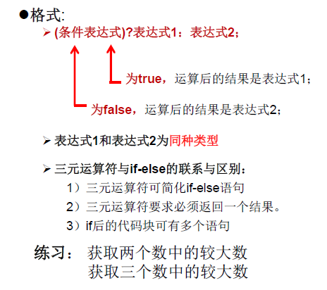


```java
/*
 * 运算符之六：三元运算符
 *  1.结构：（条件表达式）？表达式1 ：表达式2 2.
 * 2.说明： 
 * ①条件表达式的结果为boolean类型
 * ②根据条件表达式真或假:true ->执行表达式1 false -> 执行表达式2
 * ③表达式1和表达式2要求可以统成一个类型
 * ④三元运算符可以嵌套使用
 * 3.凡是使用三元运算符的地方都可以使用if-else替换，反之不成立
 * 4.如果程序既可以使用三元运算符，又可以使用if-else结构，优先使用三元，原因：简介，执行效率高
 */
public class SanYuanTest {
    public static void main(String[] args) {
        // 获取两个整数最大值
        int m = 12, n = 5;
        int max = m > n ? m : n;
        System.out.println(max);
        System.out.println(m > n ? 2 : 1.0);// 2.0
        // System.out.println(m > n ? 2 : “hh”);// 编译错误

        // 获取三个数排序
        int num1 = 1, num2 = 2, num3 = 3;
        int sum = num1 + num2 + num3;
        int maxNum = num1 > num2 ? (num1 > num3 ? num1 : num3) : (num2 > num3 ? num2 : num3);
        int minNum = num1 < num2 ? (num1 < num3 ? num1 : num3) : (num2 < num3 ? num2 : num3);
        int mid=sum - maxNum - minNum;
        System.out.println(String.format("%d %d %d",minNum,mid,maxNum));

    }
}
```

### 4.5.6. 运算符优先级


# 5. 流程控制

+ 流程控制语句是用来控制程序中各语句执行顺序的语句，可以把语句组合成能完成一定功能的小逻辑模块。

+ 其流程控制方式采用结构化程序设计中规定的三种基本流程结构，即：
  + 顺序结构：
    + 程序从上到下逐行地执行，中间没有任何判断和跳转。
  + 分支结构：
    + 根据条件，选择性地执行某段代码。
    + 有if…else和switch-case两种分支语句。
  + 循环结构：
    + 根据循环条件，重复性的执行某段代码。
    + 有while、do…while、for三种循环语句。
    + 注：JDK1.5提供了foreach循环，方便的遍历集合、数组元素。

## 5.1. 顺序结构


## 5.2. 分支结构

### 5.2.1. if-else结构


+ 条件表达式必须是布尔表达式（关系表达式或逻辑表达式）、布尔变量
+ **语句块只有一条执行语句时，一对{}可以省略，但建议保留**
+ if-else语句结构，根据需要可以嵌套使用
+ 当if-else结构是“**多选一**”时，**最后的else是可选的，根据需要可以省略**
+ **当多个条件是“互斥”关系时，条件判断语句及执行语句间顺序无所谓当多个**
+ **条件是“包含”关系时，“小（包含关系的小范围）上大下 / 子上父下”**
+ 

```java
/*  
分支结构中的if-else（条件判断结构）
一、三种结构
第一种：if（条件表达式）{
    执行表达式1；
}
第二种：if（条件表达式）{
    执行表达式1；
}else{
    执行表达式2；
}
第三种：多选一
if（条件表达式1）{
    执行表达式1；
}else if（条件表达式2）{
    执行表达式2；
}
...
else {
    执行表达式n；
}

*/
public class IfTest {
    public static void main(String[] args) {
        int score = new Scanner(System.in).nextInt();

        if (score > 90) {
            System.out.println("优秀");
        } else if (score <= 90 && score >= 60) {
            System.out.println("合格");

        } else {
            System.out.println("不及格");
        }
    }
}
```

键盘获取输入`new Scanner(System.in)`

```java
import java.util.*;

/*                
如何从键盘获取不同类型的变量，需要使用Scanner类
具体实现：
1.导包：import java.util.Scanner;
2.Scanner的实例化对象：Scanner sc = new Scanner(System.in);
3.调用Scanner类的相关方法（next()/nextXxx()），来获取指定类型的变量的值

注意：
需要按照相应的方法，来输入指定类型的值，如果输入的数据类型与规定类型不匹配时，会报异常：InputMismatchException，导致程序终止
 */
public class ScannerTest {

    public static void main(String[] args) {

        Scanner sc = new Scanner(System.in);
        System.out.println("请输入姓名");
        String name = sc.next();

        System.out.println("请输入年龄");
        int age = sc.nextInt();

        System.out.println(name+ age);

    }

}

```

if-else按就近原则进行匹配


获取随机数

> `Math.random()返回[0.0-1.0)`
>
> 公式：`[a,b]   (int)Math.random()*(b - a + 1)+ a`

获取一个随机数：10-99:		`(int)Math.random()*90+10`	


### 5.2.2. switch-case


> 没有break会发生穿透

+ switch(表达式)中表达式的值必须是下述几种类型之一：`byte，short， char，int，枚举 (jdk 5.0)，String (jdk 7.0)`；
+ `case子句中的值必须是常量`，不能是变量名或不确定的表达式值；
+ 同一个switch语句，`所有case子句中的常量值互不相同`；
+ `break语句用来在执行完一个case分支后使程序跳出switch语句块；如果没有break，程序会顺序执行到switch结尾`
+ default子句是可任选的。同时，`位置也是灵活的（注意穿透效果）`。当没有匹配的case时，执行default

```java
/*
分支结构之二：switch-case

1.格式：
switch（表达式）{
    case 常量1：
        执行语句1；
        //break；
    case 常量2：
        执行语句3；
        //break；
    ...
    default：
        语句n；
}
2.说明：
① 根据switch表达式中的值，一次匹配各个case中的常量，一旦匹配成功，则进入相应case中的执行语句，当调用完执行语句之后，则任然继续向下执行其他case结构中的执行语句，直到遇到break关键字或switch-case末尾结束为止。
② break可以使用在switch-case结构中，一旦执行到此关键字，就跳出switch-case
③ switch结构中的表达式，只能是如下的6中数据类型之一：byte、short、int、枚举类型（1.5新增）、String（7.0增加）
④ case后面只能声明常量，不能声明范围。
⑤ break关键字是可选的。
⑥ default：类似if-else中的else，也是可选的，default的位置也是灵活的，可以放在结构中的任意位置，（注意穿透效果）
*/

public class SwitchCaseTest {
    public static void main(String[] args) {
        int num = 2;// 结果：two three other
        switch_case(num);

         int num1 = 1;// 结果：one 
         switch_case(num1);

    }

    private static void switch_case(int num) {
        switch (num) {
        case 0:
            System.out.println("zero");
        case 1:
            System.out.println("one");
            break;
        case 2:
            System.out.println("two");
        case 3:
            System.out.println("three");
        default:
            System.out.println("other");
        }
    }
}
```

####   5.2.2.1. 例题：

说明：`如果switch-case结构中的多个case的执行语句相同，则可以考虑进行合并`

```java
/*2.	对学生成绩大于60分的，输出“合格”。低于60分的，输出“不合格”。
 */
public class SwitchCaseTest1 {
    public static void main(String[] args) {
        int score = 79;

        switch (score / 10) {//score / 60更简洁
        case 0:
        case 1:
        case 2:
        case 3:
        case 4:
        case 5:
        case 6:
            System.out.println("不合格");
            break;
        case 7:
        case 8:
        case 9:
        case 10:
            System.out.println("合格");
            break;
        }
        switch (score / 60) {//score / 60更简洁
            case 0:
 
                System.out.println("不合格");
                break;
            case 1:
                System.out.println("合格");
                break;
         }
    }
}
```

利用穿透效果例题：

```java
import java.util.Scanner;

/*
从键盘上输入year的“month”和“day”，要求通过程序输出输入的日期为2019年的第几天。
*/

public class SwitchCaseTest2 {

    public static void main(String[] args) {
        Scanner scanner = new Scanner(System.in);
        System.out.println("year：");
        int year = scanner.nextInt();

        System.out.println("mouth：");
        int mouth = scanner.nextInt();
        System.out.println("day：");
        int day = scanner.nextInt();

        int sum = 0;

        switch (mouth-1) {// 利用穿透效果，逆序：如果是7月，只会从7开始进入穿透
        case 12:
            sum += 31;
        case 11:
            sum += 30;
        case 10:
            sum += 31;
        case 9:
            sum += 30;
        case 8:
            sum += 31;
        case 7:
            sum += 31;
        case 6:
            sum += 30;
        case 5:
            sum += 31;
        case 4:
            sum += 30;
        case 3:
            sum += 31;
        case 2:
            if ((year % 4 == 0 && year % 100 != 0) || year % 400 == 0) {//闰年：1.被4整除但不能呗100整除 2. 被400整除
                sum += 29;
            } else {
                sum += 28;
            }
        case 1:
            sum += 31;
        default:
            sum += day;
        }

        System.out.println(year+"年-" + mouth + "-" + day + "是：" + sum);

    }

}
```

### 5.2.3. 分支结构的选择

1. 如果判断的具体**数值不多**，而且符合**byte、short 、char、int、String、枚举**等几种类型。虽然两个语句都可以使用，**建议使用swtich语句**。因为效率稍高。
2. 其他情况：对**区间判断**，对结果为boolean类型判断，使用if，if的使用范围更广。也就是说，使用switch-case的，都可以改写为if-else。反之不成立。


## 5.3. 循环结构

在某些条件满足的情况下，反复执行特定代码的功能

环语句的四个组成部分

+ 初始化部分(init_statement)
+ 循环条件部分(test_exp)
+ 循环体部分(body_statement)
+ 迭代部分(alter_statement)

### 5.3.1. for循环

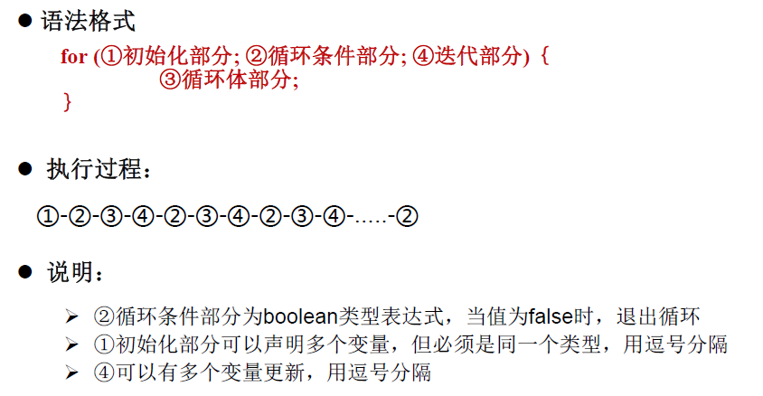


>  迭代部分每次循环结束都会执行  ，注意continue  时while  和for循环不的不同

```java
/*
for循环结构的使用
一、循环结构的4个要素
①初始化部门
②循环条件部分（boolean类型表达式）
③循环体部分
④迭代条件
二、for循环的结构
for(①;②;④){
    ③;
}
执行过程：①| ② ③ ④ ② ③ ④ ....②

*/

public class ForTest {

    public static void main(String[] args) {
        int i = 0;
        for (System.out.print("a"); i < 5; System.out.print("c"), i++) {
            System.out.print("b");
        } // 结果：abcbcbcbcbc

        // 遍历100内偶数
        int sum = 0;
        for (int j = 0; j <= 100; j++) {
            if (j % 2 == 0) {
                System.out.println(i);
                sum += i;
            }
        }
        System.out.println(sum);
    }

}
```

#### 5.3.1.1. 例题：

```java
import java.util.Scanner;

/*

题目：输入两个正整数m和n，求其最大公约数和最小公倍数。比如：12和20的最大公约数是4，最小公倍数是60。
说明：break关键字的使用
*/

public class ForTest {

    public static void main(String[] args) {
        Scanner scanner = new Scanner(System.in);

        int m = scanner.nextInt();
        int n = scanner.nextInt();

        // 最大公约数,从最大开始循环，找到两者都可以整除的数即跳出循环
        int min = (m > n ? n : m);
        int maxY = 1;
        for (int i = min; i > 0; i--) {
            if (m % i == 0 && n % i == 0) {
                System.out.println("最大公约数" + i);
                break;
            }
        }

        // 最小公倍数
        int max = (m > n ? m : n);
        for (int i = max; i < m * n; i++) {
            if (i % m == 0 && i % n == 0) {
                System.out.println("最小公倍数：" + i);
                break;
            }
        }

    }

}
```

### 5.3.2. while循环


```java

/*
while循环结构的使用
一、循环结构的4个要素
①初始化部门
②循环条件部分（boolean类型表达式）
③循环体部分
④迭代条件
二、while循环的结构
①
while(②){
    ③;
    ④;
}
执行过程：①| ② ③ ④ ② ③ ④ ....②
说明：
1.写while循环千万小心不要丢了迭代条件，一旦丢了，就可能导致死循环。
2.写程序，要避免出现死循环。
3.while和for循环可以相互转换的。
    区别：for循环和while循环的初始化条件部分的作用范围不同，for的作用域在代码块中

算法：有限性

*/

public class WhileTest {
    public static void main(String[] args) {
        // 遍历100内所有偶数
        int i = 0;
        while (i <= 100) {
            if (i % 2 == 0) {
                System.out.println(i);
            }
            i++;
        }
    }

}

```

### 5.3.3. do-while循环


```java
/*
do-while循环结构的使用
一、循环结构的4个要素
①初始化部门
②循环条件部分（boolean类型表达式）
③循环体部分
④迭代条件
二、while循环的结构
①
do{
    ③;
    ④;
}while(②)
执行过程：① ③ ④ |—② ③ ④ ② ③ ④ ....②

说明：
1.do-while循环至少会执行一次循环体
2.开发中使用for和while循环多。较少使用do-while
3.do-while

*/

public class DoWhileTest {
    public static void main(String[] args) {
        // 遍历100内的偶数
        int i = 1;
        do {
            if (i % 2 == 0) {
                System.out.println(i);
            }
            i++;

        } while (i <= 100);

        // ***********************
        int num1 = 10;
        while (num1 > 10) {// 不会输出
            System.out.println("while===========");
            num1--;
        }

        int num2 = 10;

        do {//会输出
            System.out.println("do-while===========");
            num2--;
        } while (num1 > 10);

    }

}

```

循环语句综合例题

```java
import java.util.Scanner;

/*
题目：
从键盘读入个数不确定的整数，并判断读入的正数和负数的个数，输入为0时结束程序。

说明：
1. 最简单“无限” 循环格式：while(true) , for(;;),无限循环存在的原因是并不知道循环多少次，需要根据循环体内部某些条件，来控制循环的结束。
2.结束循环有几种方式:
    方式一：循环条件部分返回false
    方式二：在循环体中国，执行break
*/
public class LoopTest {

    public static void main(String[] args) {
        Scanner scanner = new Scanner(System.in);

        int positiveNumber = 0;// 记录正数的个数
        int negativeNumber = 0;// 记录负数的格式
        while (true) {
            int i = scanner.nextInt();
            if (i > 0) {
                positiveNumber++;
            } else if (i < 0) {
                negativeNumber++;
            } else {
                break;// 输入0的时候退出
            }

        }
        System.out.println("正数个数：" + positiveNumber);
        System.out.println("负数个数：" + negativeNumber);

        // *********for的死循环  版本

        for (;;) {
            int i = scanner.nextInt();
            if (i > 0) {
                positiveNumber++;
            } else if (i < 0) {
                negativeNumber++;
            } else {
                break;// 输入0的时候退出
            }
        }

    }

}

```

### 5.3.4. 嵌套循环

+ 将一个循环放在另一个循环体内，就形成了嵌套循环。其中，
  for ,while ,do…while均可以作为**外层循环**或**内层循环**。
+ 实质上，嵌套循环就是把内层循环当成外层循环的循环体。当只有内层循环的循环条件为false时，才会完全跳出内层循环，才可结束外层的当次循环，开始下��次的循环。
+ 设外层循环次数为m次，内层为n次，则内层循环体实际上需要执行m*n次。
+ **外层循环控制行数，内层循环控制列数**

#### 5.3.4.1. 例子：

1. 99乘法表

```java
/*  99乘法表 */
public class MoreLoopTest {
    public static void main(String[] args) {

        for (int i = 1; i <= 9; i++) {
            for (int j = 1; j <= i; j++) {
                System.out.print(i + " * " + j + " = " + i * j + "\t");
            }
            System.out.println();
        }

    }

}
```

2. 质数及优化

```java
/*
100000以内的所有质数的输出。实现方式二
质数：素数，只能被1和它本身整除的自然数。-->从2开始，到这个数-1结束为止，都不能被这个数本身整除。

对PrimeNumberTest.java文件中质数输出问题的优化
*/
public class PrimeNumber {
    public static void main(String[] args) {
        long start = System.currentTimeMillis();//获取距离1970-1-1 00:00:00的毫秒数 

        for (int i = 2; i <= 100000; i++) {
            boolean flag = true;// 默认是一个质数
            for (int j = 2; j * j <= i ; j++) {//优化二：极限值为：开方  Math.sqrt(a),对非质数有效   
                if (i % j == 0) {// 如果发生一次整除，修改标记，就不是质数
                    flag = false;
                    break;//优化一：只对本身非质数的自然数是有效的
                }
            }
            if (flag) {
                System.out.println(i);
            }
        }

        long end = System.currentTimeMillis();
        System.out.println("耗时："+(end-start)+" ms");
    }

}
```


#### 5.3.4.2. 三种跳出多重循环方法：

说明：两重for循环，当 i == 2和 j == 2时，就退出多重循环体，执行后续代码

+  第一种———break 配合标签(label)

用标签标记多重循环为一个块，遇到break+标签时，跳出所标记的块用标签标记多重循环为一个块，遇到break+标签时，跳出所标记的块

```java
public class Test_2020_4_9 {
	public static void main(String[] args) {
		System.out.println("三种跳出多重循环循环");
		System.out.println("第一种———break 配合标签");

		 // 标签标记对每层循环做标记
		loop1:for (int i = 1; i < 4; i++) {
			System.out.println(String.format("外层循环%d======", i));
			for (int j = 1; j < 4; j++) {
				if (i == 2 && j == 2) {
					break loop1;// 跳转标签
				}
				System.out.println(String.format("\t内层循环%d", j));
			}
			System.out.println(String.format("%dEND=========", i));
		}
		System.out.println("循环结束");
	}
}
```

输出结果：
 三种跳出多重循环循环
 第一种———break 配合标签
 外层循环1======
 内层循环1
 内层循环2
 内层循环3
 1END=========
 外层循环2======
 内层循环1
 循环结束

+ 第二种———添加判断变量到布尔表达式中做与运算

```java
public class Test_2020_4_9 {
	public static void main(String[] args) {
		System.out.println("三种跳出多重循环循环");
		System.out.println("第二种———添加判断变量到布尔表达式中做与运算");
		boolean variable = true;
		for (int i = 1; i < 4 && variable; i++) {
			System.out.println(String.format("外层循环%d======", i));
			for (int j = 1; j < 4 && variable; j++) {
				if (i == 2 && j == 2) {
					variable = false;
					break;
				}
				System.out.println(String.format("\t内层循环%d", j));

			}
			System.out.println(String.format("%dEND=========", i));
		}
		System.out.println("循环结束");
	}

}
```


输出结果：
 三种跳出多重循环循环
 第二种———添加判断变量到布尔表达式中做与运算
 外层循环1======
 内层循环1
 内层循环2
 内层循环3
 1END=========
 外层循环2======
 内层循环1
 2END=========
 循环结束

+ 第三种———try catch制造异常跳出、或者return结束方法


### 5.3.5. 特殊关键字的使用：break、continue


特殊流程控制语句说明

+ break只能用于`switch语句`和`循环语句中`。
+ continue 只能用于`循环语句`中。
+ 二者功能类似，但continue是终止`本次`循环，break是终止`本层`循环。
+ break、continue之后不能有其他的语句，因为程序永远不会执行其后的语句。
+ 标号语句必须紧接在循环的头部。标号语句不能用在非循环语句的前面。
+ 很多语言都有goto语句，goto语句可以随意将控制转移到程序中的任意一条语句上，然后执行它。但使程序容易出错。Java中的break和continue是不同于goto的。
+ continue 后for循环的第三部分仍然执行


```java
/*
break和continue关键字的使用
           
break  
    使用范围：  switch-case、循环结构中
    循环中使用的作用(不同点) ：结束当前循环
                      
continue         
    使用范围：循环结构中
    循环中使用的作用(不同点) ：结束当次循环，继续下一次记循环

相同点：关键字后面不能声明执行语句
*/

public class BreakeContinueTest {

    public static void main(String[] args) {
        for (int i = 1; i < 6; i++) {
            if (i == 4) {
                // break;//123
                continue;// 12356
            }
            System.out.println(i);
        }

        // *******************带标签的break和continue*******************

      label:for (int i = 1; i < 4; i++) {

            for (int j = 1; j < 10; j++) {
                if (j % 4 == 0) {
                   // break;// 默认跳出包裹此关键字的最近的一层循环

                   // continue label;//结束指定标识的一层询函结构当前循环，继续下一次
                    break label;//结束指定标识的一层循环结构
                }
                System.out.print(j);
            }
            System.out.println();

        }

    }

}
```

```java
/**
 * 验证continue后for循环的第三部分仍然执行   与while 和 do-while不同
 */
public class For {

    public static void main(String[] args) {
        whileTest();
    }

    private static void forTest() {
        for (int i = 0; i < 10; i++) {
            if (i % 2 == 0) {
                continue;
            }
            System.out.print(i + "\t");//1	3	5	7	9
        }

    }

    private static void whileTest() {
        int i = 0;
        while (i < 10) {
            if (i % 2 == 0) {
                continue;
            }
            System.out.print(i + "\t");//程序会卡主  因为 0%2==0  ，之后的i++未执行  i的值没有刷新
            i++;
        }

    }
}
```


质数改版：

```java
/*输出质数 */
public class PrimeNumber2 {

    public static void main(String[] args) {

        label:for (int i = 2; i < 1000; i++) {

            for(int j =2;j <= Math.sqrt(i);j++){
                 if(i%j==0){
                     continue label;
                 }
            }
            //能执行到此步骤的都是质数
            System.out.println(i);
        }
    }
}
```


## 5.4. 家庭收支记账软件

目标


util:从键盘获取值封装

```java
import java.util.Scanner;
/**
Utility工具类：
将不同的功能封装为方法，就是可以直接通过调用方法使用它的功能，而无需考虑具体的功能实现细节。
*/
public class Utility {
    private static Scanner scanner = new Scanner(System.in);
    /**
	用于界面菜单的选择。该方法读取键盘，如果用户键入’1’-’4’中的任意字符，则方法返回。返回值为用户键入字符。
	*/
	public static char readMenuSelection() {
        char c;
        for (; ; ) {
            String str = readKeyBoard(1);
            c = str.charAt(0);
            if (c != '1' && c != '2' && c != '3' && c != '4') {
                System.out.print("选择错误，请重新输入：");
            } else break;
        }
        return c;
    }
	/**
	用于收入和支出金额的输入。该方法从键盘读取一个不超过4位长度的整数，并将其作为方法的返回值。
	*/
    public static int readNumber() {
        int n;
        for (; ; ) {
            String str = readKeyBoard(4);
            try {
                n = Integer.parseInt(str);
                break;
            } catch (NumberFormatException e) {
                System.out.print("数字输入错误，请重新输入：");
            }
        }
        return n;
    }
	/**
	用于收入和支出说明的输入。该方法从键盘读取一个不超过8位长度的字符串，并将其作为方法的返回值。
	*/
    public static String readString() {
        String str = readKeyBoard(8);
        return str;
    }
	
	/**
	用于确认选择的输入。该方法从键盘读取‘Y’或’N’，并将其作为方法的返回值。
	*/
    public static char readConfirmSelection() {
        char c;
        for (; ; ) {
            String str = readKeyBoard(1).toUpperCase();
            c = str.charAt(0);
            if (c == 'Y' || c == 'N') {
                break;
            } else {
                System.out.print("选择错误，请重新输入：");
            }
        }
        return c;
    }
	
	/**
     * 从键盘获取指定长度的字符串
     * @param limit 长度
     * @return
     */
    private static String readKeyBoard(int limit) {
        String line = "";

        while (scanner.hasNext()) {
            line = scanner.nextLine();
            if (line.length() < 1 || line.length() > limit) {
                System.out.print("输入长度（不大于" + limit + "）错误，请重新输入：");
                continue;
            }
            break;
        }

        return line;
    }
}

```

项目代码：使用String拼接记录收支明细，定义账户金额变量，定义循环退出标记

```java
public class FamilyAccount {
    public static void main(String[] args) {
        boolean isBreak = true;//退出标记
        String details = "";// 用于记录收支明细
        int balace = 10000;// 初始金额
        while (isBreak) {
            System.out.println("\n家庭收支记账软件\n");
            System.out.println("\t\t1：收支明细");
            System.out.println("\t\t2：登记收入");
            System.out.println("\t\t3：登记支出");
            System.out.println("\t\t4.退出");
            System.out.print("\t请输入1-4：");

            // 从键盘获取菜单选择
            char selection = Utility.readMenuSelection();

            switch (selection) {
            case '1':// 1：收支明细
                System.out.println("-----------------当前收支明细记录-----------------");
                System.out.println("收支\t账户金额\t收支金额\t说明");
                System.out.println("-------------------------------------------------");
                System.out.println(details);
                System.out.println("-------------------------------------------------");
                break;
            case '2':// 2：登记收入
                System.out.println("本次收入金额：");
                int money = Utility.readNumber();
                System.out.println("本次收入说明：");
                String info = Utility.readString();

                balace += money;// 改变收入金额
                details += "收入\t" + balace + "\t" + money + "\t" + info + "\n";

                System.out.println("-----------------登记完成-----------------");

                break;
            case '3':// 3：登记支出
                System.out.println("本次支出金额：");
                int money1 = Utility.readNumber();
                System.out.println("本次支出说明：");
                String info1 = Utility.readString();
                if (money1 <= balace) {
                    balace -= money1;// 改变收入金额
                    details += "收入\t" + balace + "\t" + money1 + "\t" + info1 + "\n";
                    System.out.println("-----------------登记完成-----------------");
                } else {
                    System.out.println("-----------------余额不足-----------------");
                }

                break;
            case '4':// 退出
                System.out.println("\t\t确认是否退出");
                char readConfirmSelection = Utility.readConfirmSelection();
                if (readConfirmSelection == 'Y' || readConfirmSelection == 'y') {
                    isBreak = false;
                }
                break;
            }
        }
    }

    public static void meau() {

    }
}

```


# 6. 数组

## 6.1. 数组的概述

+ 数组(Array)，是多个**相同类型数据**按**一定顺序排列的集合**，并使用**一个名字命名**，并通过**编号**的方式对这些数据进行统一管理。
+ 数组的常见概念
  + 数组名
  + 下标(或索引)
  + 元素
  + 数组的长度

+ 数组本身是引用数据类型，而数组中的元素可以是**任何数据类型**，包括基本数据类型和引用数据类型。
+ 创建数组对象会在**`（堆）内存`**中开辟一整块**连续的空间**，而**`数组名（栈）中`**引用的是这块连续空间的`首地址`。
+ **数组的长度一旦确定，就不能修改**。
+ 我们可以直接通过下标(或索引)的方式调用指定位置的元素，速度很快。
+ 数组的分类：
  + 按照维度：一维数组、二维数组、三维数组、…
  + 按照元素的数据类型分：基本数据类型元素的数组、引用数据类型元素的数组(即对象数组)

## 6.2. 一维数组的使用

### 6.2.1. 声明


### 6.2.2. 初始化


### 6.2.3. 数组元素的引用


### 6.2.4. 数组元素的默认初始化值


### 6.2.5. 内存分析

jvm内存的简化模型


### 6.2.6. 代码

```java
package com.atguigu.java;

/**
 * 一、数组的概念 
 * 1.数组的理解：数组(Array)，是多个相同类型数据按一定顺序排列的集合， 并使用一个名字命名，并通过编号的方式对这些数据进行统一管理。
 * 2.数组的相关概念： 
 * 		>数组名 
 * 		>元素 
 * 		>下标 、角标、索引
 * 		>数组的长度：元素的个数
 * 
 * 3.数组的特点：
 * 1）数组是有序排列的
 * 2）数组属于引用数据类型的变量。数组的元素，既可以是基本数据类型，也可以是引用数据类型
 * 3）创建数组对象会在内存中开辟一整块连续的空间
 * 4）数组的长度一旦确定，就不能修改
 * 
 * 4.数组的分类
 * 		①按照维数：一维数组、二维数组
 * 		②按照数组元素的类型：基本数据类型元素的数组、引用数据类型元素的数组
 * 5.一维数组的使用
 * 		①一维数组的声明和初始化
 * 		②如何调用数组的指定位置的元素
 * 		③如何获取数组的长度
 * 		④如何遍历数组
 * 		⑤数组元素的默认初始化值
 * 		⑥数组的内存解析
 * 
 */
public class ArrayTest {
	public static void main(String[] args) {
		//1. 一维数组的声明和初始化
		int[] arr = new int[5];
		
		//1.1 静态初始化:数组的初始化和数组元素的赋值操作同时进行
		int[] ids = new int[] {101,102,103};
		
		//1.2 动态初始化：数组的初始化和数组元素的赋值操作分开同时进行
		String[] names = new String[5];

		//错误的写法
	//	int[] arr1=new int[]; 
	//	int[] arr1=new int[5] {1,2,3,4,5}; 
	//	int[5] arr1=new int[5];
		
		//也是正确的
		int[] arr4= {1,2,5,3,6};//类型推断
		int arr5[]=new int[5];
		//总结：一旦初始化完成，其长度就确定了。
		
		//2. 如何调用数组的指定位置的元素：通过角标的方式调用
		//数组的角标（或索引）从0开始的，到数组的长度-1结束
		names[0] = "张三1";
		names[1] = "张三2";
		names[2] = "张三3";
		names[3] = "张三4";
		names[4] = "张三5";		
	 // names[5] = "张三5";	//ArrayIndexOutOfBoundsException
		
		//3.如何获取数组的长度。
		//属性：length
		System.out.println(names.length);//5
		
		//4. 如何遍历数组
		/*System.out.println(names[0]);
		System.out.println(names[1]);
		System.out.println(names[2]);
		System.out.println(names[3]);
		System.out.println(names[4]);*/
		
		for (int i = 0; i < names.length; i++) {		
			System.out.println(names[i]);	
		}
		
		//5.数组元素的默认初始化值
		/*
		 *	>数组元素是整形：0
		 *	>数组元素是浮点型：0.0
		 *	> 数组元素是char型：'\u0000'或0 (不是'0')
		 *	> 数组元素是boolean型：false
		 *
		 *	> 数组元素是引用数据类型：null
		 */
		int a[]=new int[4];
		for (int i = 0; i < a.length; i++) {
			System.out.println(a[i]);//0
		}
		
		short[] s1=new short[4];
		for (int i = 0; i < s1.length; i++) {
			System.out.println(s1[i]);//0
		}
		
		double[] d1=new double[4];
		System.out.println(d1[0]);//0.0
		
		char[] c1=new char[4];
		System.out.println(c1[0]);//'\u0000'
		System.out.println(c1[0] == 0);//true
		
		boolean[] b1= new boolean[4];
		System.out.println(b1[0]);//false
		
		String[] sArr = new String[5];
		System.out.println(sArr[0]);//null
		
		
		//6.数组的内存解析
		
	}
}
```

### 6.2.7. 练习题：

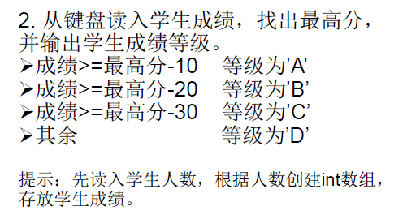

```java
package com.atguigu.exer;

import java.util.Scanner;

public class ArrayDemo {
	public static void main(String[] args) {

		// 1.使用Scanner获取学生人数
		Scanner sc = new Scanner(System.in);
		System.out.println("请输入学生人数：");
		int number = sc.nextInt();
		System.out.println("输入成绩：");

		// 2.创建数组，存储学生成绩：动态初始化
		int[] scores = new int[number];

		// 3.给数组中的元素赋值

		int maxScore = 0;
		for (int i = 0; i < scores.length; i++) {
			int score = sc.nextInt();
			scores[i] = score;
			// 4.获取数组中国的元素的最大是：最高分
			maxScore = maxScore > score ? maxScore : score;
		}

		// 5.根据学生成绩与最高分差值，得到每个学生的等级，并输出等级和成绩
		for (int i = 0; i < scores.length; i++) {
			char level;
			if(maxScore-scores[i]<=10) {
				level='A';
			}else if(maxScore-scores[i]<=20) {
				level='B';
			}else if(maxScore-scores[i]<=30) {
				level='C';
			}else {
				level='D';
			}
			System.out.println("学生"+(i+1)+"成绩："+scores[i]+"等级"+level);
			
		}
	}
}
```

## 6.3. 多维数组

+ java 语言里提供了支持多维数组的语法。
+ 如果说可以把一维数组当成几何中的线性图形，那么二维数组就相当于是一个表格，像右图Excel中的表格一样。
+ 对于`二维数组的理解，我们可以看成是一维数组array1又作为另一个一维数组array2的元素而存在`。其实，**从数组底层的运行机制来看，其实没有多维数组**。


```java
package com.atguigu.java;

/**
 * 二维数组的使用
 * 1.理解：
 * 对于二维数组的理解，我们可以看成是一维数组array1又作为另一个一维数组array2的元素而存在。
 * 其实，从数组底层的运行机制来看，其实没有多维数组。
 * 
 * 2.二维数组的使用
 * 		①二维数组的声明和初始化
 * 		②如何调用数组的指定位置的元素
 * 		③如何获取数组的长度
 * 		④如何遍历数组
 * 		⑤数组元素的默认初始化值
 * 		⑥数组的内存解析
 *
 */
public class ArrayTest2 {
	public static void main(String[] args) {
		//1.二维数组的声明和初始化
		int[] arr = new int[] {1,2,3};//一维数组
		// 静态初始化
		int[][] arr1 = new int[][] {{1,2,3},{5},{7,8,9}};
		
		//1.2 动态初始化1
		String[][] arr2 = new String[3][2];
		// 动态初始化2
		String[][] arr3 = new String[3][];
		
		//也是正确的写法
		int[] arr4[] =new int[][] {{1,2,3},{5},{7,8,9}};
		int[] arr5[] ={{1,2,3},{5},{7,8,9}};
		
		//2. 如何调用数组的指定位置的元素
		System.out.println(arr1[0][1]);//2
		System.out.println(arr2[1][1]);//null
		
		//System.out.println(arr3[1][0]);//NullPointerException
		
		//3.获取数组的长度
		System.out.println(arr4.length);//3
		System.out.println(arr4[1].length);//1
		
		//4.如何遍历数组
		for (int i = 0; i < arr4.length; i++) {
			for (int j = 0; j < arr4[i].length; j++) {
				System.out.print(arr4[i][j]+"\t");
			}
			System.out.println();
		}
		
		//5.数组元素的默认初始化值
		/*二维数组分为外层数组的元素，内层数组的元素
			外层元素：a[0],a[1]
			外层元素：a[0][1],a[0][2]
			
		针对于初始化方式一：比如：int[][]arr=new int[4][3]；
			外层元素的初始化值为：地址值
			内层元素的初始化值为：与一维数组初始化情况相同
			
		针对于初始化方式二：比如：int[][]arr=new int[4][]；
			外层元素的初始化值为：nu11
			内层元素的初始化值为：不能调用，否则报错。	
		 */

		int[][] array = new int[4][3];
		System.out.println(array[0]);//[I@41a4555e内部默认初始化的数组的地址值
		System.out.println(array[0][0]);//0
		
		System.out.println(array);//[[I@3830f1c0 :解释[[ ：二维数组 I：整数 3830f1c0：16进制地址值	
		
		//-------------------------------------
		String[][] sArr = new String[4][2];
		System.out.println(sArr[0]);//[Ljava.lang.String;@39ed3c8d
		System.out.println(sArr[0][0]);//null
		
		//------------------------------------
		double[][] dArr = new double[4][];
		System.out.println(dArr[0]);//null
		//System.out.println(dArr[0][0]);//NullPointerException	
	}
}
```

内存分析：


### 6.3.1. 练习题

+ 初始化问题


+ 杨辉三角


```java
public class YangHuiSanJiao {

	public static void main(String[] args) {
		//1.声明并初始化二维数组
		int[][] arr = new int[10][];
		//给数组元素赋值
		for (int i = 0; i < arr.length; i++) {
			arr[i] = new int[i + 1];
			for (int j = 0; j <= i; j++) {
				if (j == 0 || j == i) {//给首末元素赋值
					arr[i][j] = 1;
				} else {//中间列赋值
					arr[i][j] = arr[i - 1][j - 1] + arr[i - 1][j];
				}
			}
		}
		for (int i = 0; i < arr.length; i++) {
			System.out.println(Arrays.toString(arr[i]));
		}
	}
}
```


## 6.4. 常见算法

### 6.4.1. 数组元素的赋值(杨辉三角、`回形数`等)

+ 杨辉三角


```java
public class YangHuiSanJiao {

	public static void main(String[] args) {
		//1.声明并初始化二维数组
		int[][] arr = new int[10][];
		//给数组元素赋值
		for (int i = 0; i < arr.length; i++) {
			arr[i] = new int[i + 1];
			for (int j = 0; j <= i; j++) {
				if (j == 0 || j == i) {//给首末元素赋值
					arr[i][j] = 1;
				} else {//中间列赋值
					arr[i][j] = arr[i - 1][j - 1] + arr[i - 1][j];
				}
			}
		}
		for (int i = 0; i < arr.length; i++) {
			System.out.println(Arrays.toString(arr[i]));
		}
	}
}

```

+ 回形数格式方阵的实现

从键盘输入一个整数（1~20） 

则以该数字为矩阵的大小，把1,2,3…n*n 的数字按照顺时针螺旋的形式填入其中。例如： 输入数字2，则程序输出： \

1 2 
4 3 

输入数字3，则程序输出： 

1 2 3 
8 9 4 
7 6 5 

输入数字4， 则程序输出： 

1  2  3  4 
12 13 14 5 
11 16 15 6 
10  9 8  7

方式一：

```java
class RectangleTest {
	public static void main(String[] args) {
		Scanner scanner = new Scanner(System.in);
		System.out.println("输入一个数字");
		int len = scanner.nextInt();
		int[][] arr = new int[len][len];

		int s = len * len;
		/*
		 * k = 1:向右 k = 2:向下 k = 3:向左 k = 4:向上
		 */
		int k = 1;
		int i = 0, j = 0;
		for (int m = 1; m <= s; m++) {
			if (k == 1) {
				if (j < len && arr[i][j] == 0) {
					arr[i][j++] = m;
				} else {
					k = 2;
					i++;
					j--;
					m--;
				}
			} else if (k == 2) {
				if (i < len && arr[i][j] == 0) {
					arr[i++][j] = m;
				} else {
					k = 3;
					i--;
					j--;
					m--;
				}
			} else if (k == 3) {
				if (j >= 0 && arr[i][j] == 0) {
					arr[i][j--] = m;
				} else {
					k = 4;
					i--;
					j++;
					m--;
				}
			} else if (k == 4) {
				if (i >= 0 && arr[i][j] == 0) {
					arr[i--][j] = m;
				} else {
					k = 1;
					i++;
					j++;
					m--;
				}
			}
		}

		// 遍历
		for (int m = 0; m < arr.length; m++) {
			for (int n = 0; n < arr[m].length; n++) {
				System.out.print(arr[m][n] + "\t");
			}
			System.out.println();
		}
	}
}

```

方式二：

```java
class RectangleTest1 {

	public static void main(String[] args) {
		int n = 7;
		int[][] arr = new int[n][n];

		int count = 0; // 要显示的数据
		int maxX = n - 1; // x轴的最大下标
		int maxY = n - 1; // Y轴的最大下标
		int minX = 0; // x轴的最小下标
		int minY = 0; // Y轴的最小下标
		while (minX <= maxX) {
			for (int x = minX; x <= maxX; x++) {
				arr[minY][x] = ++count;
			}
			minY++;
			for (int y = minY; y <= maxY; y++) {
				arr[y][maxX] = ++count;
			}
			maxX--;
			for (int x = maxX; x >= minX; x--) {
				arr[maxY][x] = ++count;
			}
			maxY--;
			for (int y = maxY; y >= minY; y--) {
				arr[y][minX] = ++count;
			}
			minX++;
		}

		for (int i = 0; i < arr.length; i++) {
			for (int j = 0; j < arr.length; j++) {
				String space = (arr[i][j] + "").length() == 1 ? "0" : "";
				System.out.print(space + arr[i][j] + " ");
			}
			System.out.println();
		}
	}
}

```

### 6.4.2. 求数值型数组中元素的最大值、最小值、平均数、总和等

数值型数组中元素的最大值、最小值、平均数、总和

```java
	/*
	 * 定义一个int型的一维数组，包含10个元素，分别赋一些随机整数， 然后求出所有元素的最大值，最小值，和值，平均值，并输出出来。
	 * 要求：所有随机数都是两位数。
	 */

	public static void main(String[] args) {

		int[] arr = new int[10];

		for (int i = 0; i < arr.length; i++) {
			arr[i] = (int) (Math.random() * 90) + 10;// 需要加括号，注意优先级

		}
		//遍历
		System.out.println(Arrays.toString(arr));
		
		// 求数组元素的最大值
		int maxValue = arr[0];
		for (int i = 1; i < arr.length; i++) {
			maxValue = maxValue > arr[i] ? maxValue : arr[i];

		}
		System.out.println("最大值："+maxValue);
		
		// 求数组元素的最小值
		int minValue = arr[0];
		for (int i = 1; i < arr.length; i++) {
			minValue = minValue < arr[i] ? minValue : arr[i];

		}
		System.out.println("最小值："+minValue);
		
		//求数组元素的和
		int sum=0;
		for (int i = 0; i < arr.length; i++) {
			sum+=arr[i];
			
		}
		System.out.println("和"+sum);
		System.out.println("平均值"+sum/arr.length);

	}
```


数组复制地址分析

```java
public class ArratExer {
	/*
	 * （1）创建一个名为ArrayExer2的类，在main（）方法中声明array1和array2两个变量，他们是int[]类型的数组。
	 * （2）使用大括号{}，把array1初始化为8个素数：2，3，5，7，11，13，17，19。 （3）显示array1的内容。
	 * （4）赋值array2变量等于array1，修改array2中的偶索引元素，使其等于索引值（如array[e]=e，array[2]=2）。
	 * 打印出array1。 思考：arrayl和array2是什么关系？arrayl和array2地址值相同，都指向了堆空间的唯一的一个数组实体。
	 * 拓展：修改题目，实现array2对array1数组的复制
	 */
	public static void main(String[] args) {

		int[] arr1 = { 2, 3, 5, 7, 11, 13, 17, 19 };
		int[] arr2 = arr1;//不能称作数组的复制，两个数组指向堆内存中同一段内存，arr1、arr2都是保存的数组的首地址

        // 显示array1的内容
		for (int i = 0; i < arr1.length; i++) {
			System.out.print(arr1[i] + "\t");
		}

		// 修改array2中的偶索引元素，使其等于索引值(如array[0]=0,array[2]=2)
		for (int i = 0; i < arr2.length; i++) {
			if (i % 2 == 0) {
				arr2[i] = i;
			}
		}
		// 显示array1的内容
		for (int i = 0; i < arr1.length; i++) {
			System.out.print(arr1[i] + "\t");
		}

	}
}
```
> 内存分析


数组的复制+反转

```java
package com.atguigu.java;

import java.util.Arrays;

public class ArrayTest3 {
	public static void main(String[] args) {
		String[] arr = { "JJ", "DD", "MM", "GG", "KK" };

		// 数组复制
		String[] arr1 = new String[arr.length];
		for (int i = 0; i < arr.length; i++) {
			arr1[i] = arr[i];
		}

		// 数组反转
		// 方式一：对位交换
		for (int i = 0; i < arr.length / 2; i++) {
			String temp = arr[i];
			arr[i] = arr[arr.length - 1 - i];
			arr[arr.length - 1 - i] = temp;
		}
		System.out.println(Arrays.toString(arr));
		// 方式2:双指针
		for (int i = 0, j = arr.length - 1; i < j; i++, j--) {
			String temp = arr[i];
			arr[i] = arr[j];
			arr[j] = temp;
		}
		System.out.println(Arrays.toString(arr));


	}
}
```

### 6.4.3. 查找算法(线性查找、二分法查找)

线性查找

```java
		// 查找（搜索）
		// 线性查找： 查找“MM”
		String dest = "MM";
		for (int i = 0; i < arr.length; i++) {
			if (arr[i].equals(dest)) {
				System.out.println("查找到" + dest + " 位置：" + (i + 1));
				break;
			}

		}
```

二分法


```java
		// 二分法查找: 前提：数组需要有序
		int[] array = { 1, 2, 4, 6, 8, 9, 10, 50, 60 };

		int target = 60;

		int head = 0;// 初始的首瘦索引
		int end = array.length - 1;// 初始的末索引

		boolean isFlag = false;
		for (; head <= end;) {
			int mid = (head + end) / 2;
			if (array[mid] == target) {
				System.out.println("找到指定元素，位置：" + (mid+1));
				isFlag = true;
				break;
			} else if (array[mid] > target) {
				end = mid - 1;
			} else {
				head = mid + 1;
			}
		}
		if (!isFlag) {
			System.out.println("未找到");
		}
```

### 6.4.4. 排序算法

[十大经典排序算法]: ./十大经典排序算法最强总结（动图9代码）.md


#### 6.4.4.1. 算法概念


+ 衡量排序算法的优劣：

1.	**时间复杂度**：分析关键字的比较次数和记录的移动次数
2.	**空间复杂度**：分析排序算法中需要多少辅助内存
3.	**稳定性**：若两个记录A和B的关键字值相等，但排序后A、B的先后次序保持不变，则称这种排序算法是稳定的。

> 稳定性解释：1,2,3,4,3,5          排序牌后两个3的相对位置不会发生改变，即第一个3还是在前面，第二个在后面


+ 排序算法分类：内部排序和外部排序

内部排序：整个排序过程不需要借助于外部存储器（如磁盘等），所有排序操作都在内存中完成。
外部排序：参与排序的数据非常多，数据量非常大，计算机无法把整个排序过程放在内存中完成，必须借助于外部存储器（如磁盘）。外部排序最常见的是多路归并排序。可以认为外部排序是由多次内部排序组成。


+ 算法的五大特征


#### 6.4.4.2. 冒泡排序


> 第一次会把第一大的排到最后
> 第二次会把第二大的排到倒数第二
> 第三次会把第二大的排到倒数第三
> 每次循环即比较少一次，
> 遇到本轮没有发生交换即停止

```java
import java.util.Arrays;

/**
 * 数组的冒泡排序的实现
 */
public class BubbleSortTest {
	public static void main(String[] args) {
		int[] arr = { 1, 5, 3, 6, 10, -30, 5, 1, 0 };

		// 冒泡排序
		for (int i = 0; i < arr.length; i++) {
			boolean flag=false;
			//每一轮会挑出一个最大值到最后，每次循环少一个
			for (int j = 0; j < arr.length - i - 1; j++) {
				if (arr[j] > arr[j + 1]) {
					int temp = arr[j];
					arr[j] = arr[j + 1];
					arr[j + 1] = temp;
					flag=true;
				}
			}
			if(flag) {//没发生交换即停止
				break;
			}
		}
		System.out.println(Arrays.toString(arr));

	}

}
```

#### 6.4.4.3. 快速排序

+ 介绍：

快速排序通常明显比同为O(nlogn)的其他算法更快，因此常被采用，而且快排采用了`分治法`的思想，所以在很多笔试面试中能经常看到快排的影子。可见掌握快排的重要性。
快速排序（Quick Sort）由图灵奖获得者Tony Hoare发明，被列为20世纪十大算法之一，是迄今为止所有内排序算法中速度最快的一种。冒泡排序的升级版，交换排序的一种。快速排序的时间复杂度为O(nlog(n))。

+ 排序思想：


基本思想：将待排序的元素根据基准元素，以基准元素为中心，分成两部分，递归分治

```java

/**
 * 快速排序
 * 通过一趟排序将待排序记录分割成独立的两部分，其中一部分记录的关键字均比另一部分关键字小，
 * 则分别对这两部分继续进行排序，直到整个序列有序。
 */
public class QuickSort {
	private static void swap(int[] data, int i, int j) {
		int temp = data[i];
		data[i] = data[j];
		data[j] = temp;
	}

	private static void subSort(int[] data, int start, int end) {
		if (start < end) {
			int base = data[start];
			int low = start;
			int high = end + 1;
			while (true) {
				while (low < end && data[++low] - base <= 0)
					;
				while (high > start && data[--high] - base >= 0)
					;
				if (low < high) {
					swap(data, low, high);
				} else {
					break;
				}
			}
			swap(data, start, high);
			
			subSort(data, start, high - 1);//递归调用
			subSort(data, high + 1, end);
		}
	}
	public static void quickSort(int[] data){
		subSort(data,0,data.length-1);
	}
	
	
	public static void main(String[] args) {
		int[] data = { 9, -16, 30, 23, -30, -49, 25, 21, 30 };
		System.out.println("排序之前：\n" + java.util.Arrays.toString(data));
		quickSort(data);
		System.out.println("排序之后：\n" + java.util.Arrays.toString(data));
	}
}

```
```java

public class QuickSort {

    public static int partition(int[] array, int low, int high) {
        // 取最后一个元素作为基准元素
        int pivot = array[high];
        // 定义指向比中心元素大的指针，首先指向第一个元素
        int pointer = low;
        // 遍历数组中的所有元素，将比中心元素大的放在右边，比中心元素小的放在左边
        for (int i = low; i < high; i++) {
            if (array[i] <= pivot) {
                // 将比中心元素小的元素和指针指向的元素交换位置
                // 如果第一个元素比中心元素小，这里就是自己和自己交换位置，指针和索引都向下一位移动
                // 如果元素比中心元素大，索引向下移动，指针指向这个较大的元素，直到找到比中心元素小的元素，并交换位置，指针向下移动
                int temp = array[i];
                array[i] = array[pointer];
                array[pointer] = temp;
                pointer++;
            }
            System.out.println(Arrays.toString(array));
        }
        // 将中心元素和指针指向的元素交换位置
        int temp = array[pointer ];
        array[pointer] = array[high];
        array[high] = temp;
        return pointer;
    }

    public static void quickSort(int[] array, int low, int high) {
        if (low < high) {
            // 获取划分子数组的位置
            int position = partition(array, low, high);
            // 左子数组递归调用
            quickSort(array, low, position -1);
            // 右子数组递归调用
            quickSort(array, position + 1, high);
        }
    }

    public static void main(String[] args) {
        int[] array = {6,72,113,11,23};
        quickSort(array, 0, array.length -1);
        System.out.println("排序后的结果");
        System.out.println(Arrays.toString(array));
    }
}

```


#### 6.4.4.4. 各种内部排序方法性能比较

1.	从平均时间而言：快速排序最佳。但在最坏情况下时间性能不如堆排序和归并排序。
2.	从算法简单性看：由于直接选择排序、直接插入排序和冒泡排序的算法比较简单，将其认为是简单算法。对于Shell排序、堆排序、快速排序和归并排序算法，其算法比较复杂，认为是复杂排序。
3.	从稳定性看：直接插入排序、冒泡排序和归并排序时稳定的；而直接选择排序、快速排序、 Shell排序和堆排序是不稳定排序
4.	从待排序的记录数n的大小看，n较小时，宜采用简单排序；而n较大时宜采用改进排序。


#### 6.4.4.5. 排序算法的选择

(1)若n较小(如n≤50)，可采用`直接插入`或`直接选择排序`。
当记录规模较小时，直接插入排序较好；否则因为直接选择移动的记录数少于直接插入，应选直接选择排序为宜。
(2)若文件初始状态基本有序(指正序)，则应选用`直接插`入、`冒泡`或`随机的快速排序为宜`；
(3)若n较大，则应采用时间复杂度为O(nlgn)的排序方法：`快速排序、堆排序或归并排序`。

## 6.5. Arrays数组工具类


```java
import java.util.Arrays;

/*
 * java.util.Arrays:操作数组的工具类，里面定义了很多操作数组的方法
 */
public class ArraysTest {
	public static void main(String[] args) {
		
		//1.boolean equals(int[] a,int[] b):判断两个数组是否相等。
		int[] arr1 = new int[]{1,2,3,4};
		int[] arr2 = new int[]{1,3,2,4};
		boolean isEquals = Arrays.equals(arr1, arr2);
		System.out.println(isEquals);
		
		//2.String toString(int[] a):输出数组信息。
		System.out.println(Arrays.toString(arr1));
		
			
		//3.void fill(int[] a,int val):将指定值填充到数组之中每一个索引。
		Arrays.fill(arr1,10);
		System.out.println(Arrays.toString(arr1));
		

		//4.void sort(int[] a):对数组进行排序。
		Arrays.sort(arr2);
		System.out.println(Arrays.toString(arr2));
		
		//5.int binarySearch(int[] a,int key)
		//前提：有序
		int[] arr3 = new int[]{-98,-34,2,34,54,66,79,105,210,333};
		int index = Arrays.binarySearch(arr3, 210);
		if(index >= 0){
			System.out.println(index);
		}else{
			System.out.println("未找到");
		}
		
		
	}
}
```

## 6.6. 数组使用中的常见异常


```java
/**
 * 数组中的常见异常：
 *1.数组角标越界异常：ArrayIndexOutOfBoundsException
 *2.空指针异常：
 */
public class ArrayExceptionTest {
	public static void main(String[] args) {
		//1.数组角标越界异常：
		int[] arr = new int[] {1,2,3,4,5,6,7};
//		System.out.println(arr[7]);//ArrayIndexOutOfBoundsException
//		System.out.println(arr[-1]);//ArrayIndexOutOfBoundsException
		
		//2.空指针异常：
		//情况一：
		int[] arr1= new int[] {1,2,3};
		arr1=null;
		//System.out.println(arr1[0]);//NullPointerException
		
		//情况2
		int[][] arr2=new int[5][];
		System.out.println(arr2[2]);//null  数组属于引用对象，默认值null
		//System.out.println(arr2[2][2]);//NullPointerException
		
		//情况三：
		String[] arr3=new String[] {"AA","BB","CC"};
		arr3[0]=null;
		//System.out.println(arr3[0].toString());//NullPointerException
	}

}
```

# 7. 面向对象（OOP）

## 7.1. 面向过程和面向对象

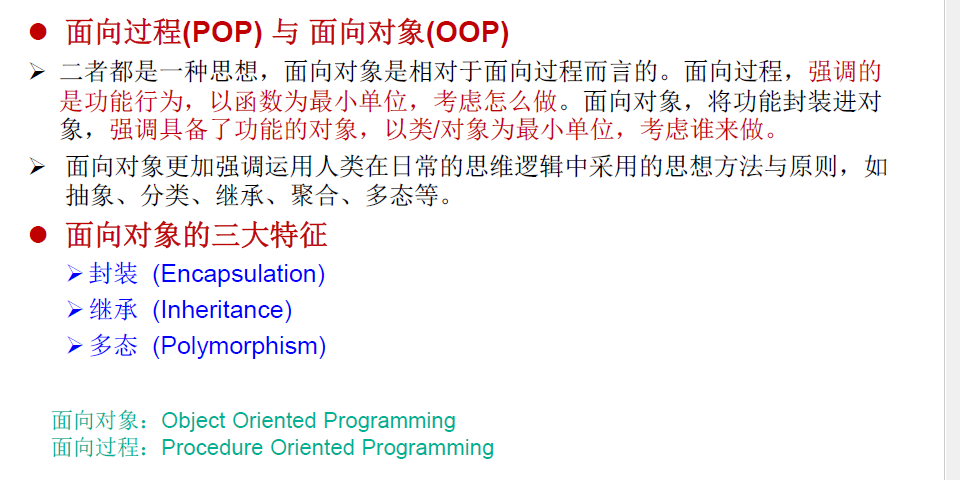


>  一、理解“万事万物皆对象”
>   1.在java语言范畴中，我们都将功能、等结构等封装到类中，通过类的实例化，来调用具体的功能结构
>   2.涉及到java语言与前端HTML、后端数据库交互式，前后端的结构在java层面交互式，都体现为类、对象。


### 7.1.1. 面向对象的思想概述

+ 程序员从面向过程的**执行者**转化成了面向对象的**指挥者**

+ 面向对象分析方法分析问题的思路和步骤：
  + 根据问题需要，选择问题所针对的**现实世界中的实体**。
  + 从实体中寻找解决问题相关的属性和功能，这些属性和功能就形成了**概念世界中的类**。
  + 把抽象的实体用计算机语言进行描述，**形成计算机世界中类的定义**。即借助某种程序语言，把类构造成计算机能够识别和处理的数据结构。
  + 将类实例化成计算机世界中的对象。对象是计算机世界中解决问题的最终工具。

## 7.2. 类和对象

+ **类(Class)**和对象(Object)是面向对象的核心概念。
  + 类是对一类事物的描述，是**抽象的**、概念上的定义
  + 对象是**实际存在**的该类事物的每个个体，因而也称为实例(instance)。

+ “万事万物皆对象”


```java
/**
 *一、java面向对象学习的三条主线：
 *1.java类及类的成员：属性、方法、构造器、代码块、内部类
 *2.面向对线的三大特征：封装、继承、多态、（抽象性） 
 *3.其他关键字：static、package、this、super、final、abstract、interface、import
 *
 *二、“冰箱与大象”
 *面向过程：强调的是功能行为，以函数为最小单位，考虑怎么做
 *	①.打开冰箱门
 *	②.把大象放进去
 *	③.把门关上
 *面向对象：强调具备了功能的对象，以类/对象为最小单位，考虑谁来做
主体：人、大象、冰箱
	 人{
	 	打开（冰箱）{
	 		冰箱.开开（）；
	 	}
	 	抬起（大象）{
	 		大象.进入（冰箱）；
	 	}
	 
	 	关闭（冰箱）{
	 		冰箱.闭合（）{}
	 	}
	 
	 }
	 
	 冰箱{
	 	开开（）{}
	 	闭合（）{}
	 }
	 
	 大象{
	 	进入（冰箱）{}
	 	
	 }
	 
	三、面向对象的两个要素：
	 类：对一类事物的描述，是抽象的、概念上的定义
	 对象：是世纪存在的该类事物的每个个体，因而也称为实例（instance）
	 >面向对象程序成绩的重点是类的设计
	 >设计类，就是设计类的成员
 */
```

### 7.2.1. Java类及类的成员

#### 7.2.1.1. 常见的类的成员有：

+ 属 性：对应类中的成员变量
+ 行 为：对应类中的成员方法


#### 7.2.1.2. 语法：


#### 7.2.1.3. 创建自定义类


### 7.2.2. 对象的创建与使用

+ 创建对象语法： `类名 对象名 = new 类名();`
+ 使用“`对象名.对象成员`”的方式访问对象成员（包括属性和方法）

#### 7.2.2.1. 类与对象的关系：

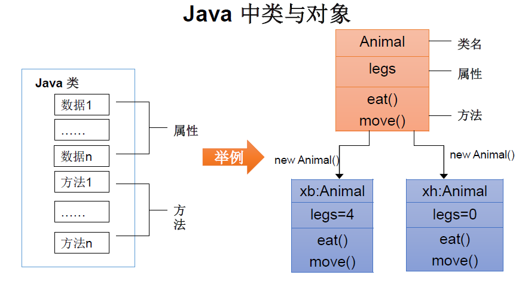

对象的产生：


对象的使用


对象的声明周期


#### 7.2.2.2. java内存结构

便已完成源程序以后，生成一个或多个字节码文件。

我们使用JVM中的类的加载器

《JVM规范》---推荐周志明

+ 虚拟机栈，即为平时提到的栈结构。我们`将局部变量储存在栈结构中`

+ 堆：我们new出来的结构（比**如数组、对象）加载到堆空间**中。补充，对象的属性（非static的）加载到堆空间中。

+ 方法区：`类的加载信息、常量池、静态属性（静态域）`。


对象的内存分析：


#### 7.2.2.3. 匿名对象

理解：new出来的对象没有显式的赋给一个变量名，即为匿名对象
特征：匿名对象只能使用一次

+ 我们也可以不定义对象的句柄，而直接调用这个对象的方法。这样的对象叫做匿名对象。
  如：`new Person().shout();`

+ 使用情况
  + 如果`对一个对象只需要进行一次方法调用`，那么就可以使用匿名对象。
  + 我们`经常将匿名对象作为实参传递给一个方法调用`。

#### 7.2.2.4. 代码

```java
/**
 * 一、设计类：其实就是设计类的成员
 *属性 = 成员变量 = field = 域、字段
 *方法 = 成员方法 = 函数 = method
 *
 *创建类的对象 = 类的实例化 = 实例化类
 *
 *二、类和对象的使用（面向对象思想落地的实现）：
 *①创建类，设计类的成员
 *②创建类的对象
 *③调用属性和方法
 *三、如果创建一个类的多个对象，则每个对象都独立的拥有一套类的属性。（非static的）
 *意味着：如果我们修改一个对象的属性a，则不影响另外一个对象属性a的值。
 *
 *四、对象的内存解析：
 */

//测试类
public class PersonTest {
	public static void main(String[] args) {
		//创建Person类的对象
		Person p1=new Person();
		
		//调用对象的结构：属性、方法
		//调用属性	:	"对象.属性"
		p1.name="Tom";
		p1.isMale=true;
		
		System.out.println(p1.name);
		
		//调用方法："对象.方法()"
		p1.eat();
		p1.sleep();
		p1.talk("汉语");
		
		// ********************************
		Person p2=new Person();
		System.out.println(p2.name);//null 成员变量的默认值null
		System.out.println(p2.isMale);//null 成员变量的默认值null
		
		// ********************************
		//将p1变量保存的对象地址值赋给p3，导致p1和p3指向了对空间中同一个对象实体
		Person p3=p1;
		System.out.println(p3.name);//Tom
		p3.age=10;
		System.out.println(p1.age);//10
        
        new Person().eat();//匿名对象
	}
	
}

class Person{
	//属性
	String name;
	int age;
	boolean isMale;
	
	//方法
	public void eat() {
		System.out.println("人可以吃饭");
	}
	
	public void sleep() {
		System.out.println("人可以睡觉");
	}
	
	public void talk(String language) {
		System.out.println("人可以说话，使用的语言" + language);
	}
}
```

## 7.3. 类的结构之一：属性(field）

### 7.3.1. 语法


### 7.3.2. 分类


### 7.3.3. 局部变量与成员变量的区别


### 7.3.4. 成员变量vs局部变量的内存位置


### 7.3.5. 成员变量默认初始值


### 7.3.6. 代码

```java
/**
 * 类中属性的使用
 * 
 * 属性（成员变量） vs	局部变量
 * 1.相同点
 * 		1.1定义变量的格式：数据类型 变量名 = 变量值;
 * 		1.2先声明，后使用
 * 		1.3变量都有其对应的作用域
 * 
 * 2.不同点：
 * 		2.1 在类中声明的位置的不同
 * 			属性：直接定义在类的一对{}内
 * 			局部变量：声明在方法内、方法形参、代码块、构造器形参、构造器内部的局部变量
 * 		2.2 关于权限修饰符的不同
 * 			属性:可以再声明属性时，指明其权限使用权限修饰符
 * 				常用的权限修饰符：private，缺省，protected，public
 * 			局部变量：不可以使用权限修饰符
 * 		2.3 默认初始化值的情况
 * 			属性：类的属性根据其类型，都有默认初始化值。
 * 				整型（byte、short、int、long）：0
 * 				浮点型：（float、double）：0.0
 * 				字符型（char）：0（或'\u0000'）
 * 
 * 				引用数据类型（类、数组、结构）：null、
 * 
 * 			局部变量：没有默认初始化值。
 * 				意味着：我们在调用局部变量之前需要显式赋值
 * 				特别的：形参在调用时，赋值即可
 * 		2.4 在内存中加载位置：
 * 			属性：加载到堆空间（非static，static是加载到方法区的）
 * 			局部变量：加载到栈空间
 * 		
 *
 */
public class UserTest {
	public static void main(String[] args) {
		User user = new User();
		System.out.println(user.name);
		System.out.println(user.age);
		System.out.println(user.isMale);
	}

}


class User{
	//属性（或成员变量）
	String name;
	int age;
	boolean isMale;
	
	public void talk(String language) {//language 形参，局部变量
		System.err.println(name+"使用"+ language);
		
	}
	public void eat() {
		String food="馒头";//局部变量
		System.out.println(name+"吃"+food);
	}
}
```

## 7.4. 类的结构之二：方法（method）

### 7.4.1. 定义


### 7.4.2. 语法：


### 7.4.3. 分类


### 7.4.4. 方法的调用过程


> 注意：

+ 方法被调用一次，就会执行一次
+ 没有具体返回值的情况，返回值类型用关键字void表示，那么方法体中可以不必使用return语句。如果使用，仅用`return ；`来结束方法。
+ 定义方法时，方法的结果应该返回给调用者，交由调用者处理。
+ 方法中只能调用方法或属性，不可以在方法内部定义方法。

### 7.4.5. 代码

```java
/**
 * 类中方法的声明和使用
 * 
 * 方法：描述类应该具有的功能
 * 	比如：Math类：是sqrt()、random()
 * 		Scanner类：nectXxx()
 * 1.举例：
 * 2.方法的声明： 
 * 		权限修饰符 返回值类型 方法名(形参列表){
 * 			方法体;
 * 		}
 * 	注意：static、final、abstract来修饰的方法，后面展开
 * 3.说明：
 * 		3.1 权限修饰符：
 * 			java中规定的4中权限修饰符：private 、缺省、protected、public  -->封装性
 * 		3.2 返回值类型：有返回值  VS  没有返回值
 * 				3.2.1 如果方法有返回值，则必须在方法声明时，指定返回值的类型，同时，方法中需要使用return关键字来返回指定类型的变量或常量。
 * 					  如果方法没有返回值，则方法声明时。使用void来表示。通常没有返回值的方法中就不需要使用return，但是，如果使用只能“return；”，表示结束此方法
 * 				3.2.2 定义方法该不该有返回值？
 * 					①题目要求
 * 					②凭经验：具体问题具体分析
 * 		3.3 方法名：属于标识符，遵循标识符的规则和规范，“见名知义”，
 * 		3.4 形参列表：方法可以声明0，1，或者多个形参
 * 				3.4.1 格式：数据类型1 形参1,数据类型2 形参2...
 * 				3.4.2 定义方法需不需要形参？
 * 					①题目要求
 * 					②凭经验：具体问题具体分析
 * 		3.5 方法体：方法功能的体现。
 * 4. return 关键字的使用：
 * 		1. 使用返回：使用在方法体中
 * 		2. 作用：	①结束方法	
 * 				②针对有返回值类型的方法，使用"return 数据"方式返回所需要的数据
 * 		3. 注意点：return关键字后面不可以声明执行语句。
 * 5. 方法的使用中，可以调用当前类的属性或方法
 * 			特殊的：方法A中又调用了A，叫作递归，需要终止条件
 * 		方法中不可以定义方法
 */
public class CustomerTest {
	public static void main(String[] args) {
		Customer customer = new Customer();
		//customer.eat();//私有方法，不能调用
	}

}

class Customer{
	//属性
	String name;
	int age;
	boolean isMale;
	
	private void eat() {
		System.out.println("客户吃饭");
		return;//void 返回值类型的方法，表示结束此方法
		//System.out.println("客户吃饭");//return后不能有表达式
	}
	
	public void sleep(int hour) {
		eat();//方法调用
		System.out.println("休息" + hour + "小时");
	}
	
	public String geyName() {
		return name;
	}
	public String getNation(String  nation) {
		return "国籍："+nation;
	}
}

```

数组+对象综合练习+冒泡

```java
/**
 * 4. 对象数组题目： 定义类Student，包含三个属性：学号number(int)，年级state(int)，成绩score(int)。
 * 创建20个学生对象，学号为1到20，年级和成绩都由随机数确定。 
 * 
 * 问题一：打印出3年级(state值为3）的学生信息。
 * 问题二：使用冒泡排序按学生成绩排序，并遍历所有学生信息
 * 
 * 提示： 
 * 1）生成随机数：Math.random（），返回值类型double； 
 * 2）四舍五入取整：Math.round（double * d），返回值类型long。
 */
public class Exer4 {
	public static void main(String[] args) {
		// 声明Student类型的数组
		Student[] stus = new Student[20];

		for (int i = 0; i < stus.length; i++) {
			// 给数组元素赋值
			stus[i] = new Student();
			// 给Student学号赋值
			stus[i].number = i + 1;
			// 年级年纪1-6
			stus[i].state = (int) (Math.random() * (6 - 1 + 1) + 1);// 成绩

			// 成绩0-100
			stus[i].score = (int) (Math.random() * (100 - 0 + 1));
		}

		for (int i = 0; i < stus.length; i++) {
			System.out.println(stus[i]);
		}
		System.out.println("***************************");

		// 问题一：打印出3年级(state值为3）的学生信息。
		for (int i = 0; i < stus.length; i++) {
			if (stus[i].state == 3) {
				System.out.println(stus[i]);
			}
		}
		System.out.println("***************************");

		// 问题二：使用冒泡排序按学生成绩排序，并遍历所有学生信息
		for (int i = 0; i < stus.length; i++) {

			boolean isFlag = false;
			for (int j = 0; j < stus.length - i - 1; j++) {
				if (stus[j].score > stus[j + 1].score) {
					// 如果需要换序，交换的是数组的元素：Student对象！！
					Student temp = stus[j + 1];
					stus[j + 1] = stus[j];
					stus[j] = temp;
					isFlag = true;
				}
			}
			if (!isFlag) {// 还是等于false 表示未发生交换，即退出
				break;
			}
		}

		for (int i = 0; i < stus.length; i++) {
			System.out.println(stus[i]);
		}
	}

}

class Student {
	int number;// 学号
	int state;// 年级
	int score;// 成绩

	@Override
	public String toString() {
		return "Student [number=" + number + ", state=" + state + ", score=" + score + "]";

	}

}
```

### 7.4.6. 对象数组的内存解析

1.`引用类型的变量，只肯储存两类值：null 或 地址值（含变量的类型）`


### 7.4.7. 方法重载（overload）

> 如何确定某一个类中的方法的调用：`方法名+参数列表`


```java

/**
 * 方法的重载（overload）
 * 1.定义：在同一个类中，允许定义一个以上的同名方法。只要他们的参数个数或者参数类型不同即可。
 * 	"两同一不同"：	同一个类、相同方法名
 * 				参数列表不同：参数个数不同，参数类型不同
 * 	 
 * 2.举例 ：方法名相同，参数列表不同
 * 		Arrays.copyOf()、Arrays.sort()
 * 3.判断是否是重载
 * 		跟方法的权限修饰符、返回值类型、形参变量名、方法体都没有关系
 * 4.在再通过对象调用方法时，如何确定某一个指定的方法
 * 		①方法名 ---> 参数列表
 */
public class OverLoadTest {
	
	public void getSum(int i ,int j) {
		System.out.println(1);
	}
	//与第一个注意自动类型提升
	public void getSum(double d1 ,double d2) {
		System.out.println(2);
	}
	public void getSum(int i ) {
		
	}
	
	//与返回值无关
//	public int getSum(int i ,int j) {
//		System.out.println(1);
//	}
	
	//与权限修饰符无关
//	private void getSum(int i ,int j) {
//		System.out.println(1);
//	}
   //与形参名无关无关
//	private void getSum(int m ,int n) {
//		System.out.println(1);
//	}
	
	
	// *******************练习***************
	/*
	 2.	编写程序，定义三个重载方法并调用。方法名为mOL。
		三个方法分别接收一个int参数、两个int参数、一个字符串参数。
		分别执行平方运算并输出结果，相乘并输出结果，输出字符串信息。
		在主类的main ()方法中分别用参数区别调用三个方法。
	 */
	
//	定义三个重载方法并调用
	public void mOl(int i) {
		System.out.println(i*i);	
	}
	
	public void mOl(int i,int j) {
		System.out.println(i*j);
		
	}
	public void mOl(String s) {
		System.out.println(s);
	}
}

```

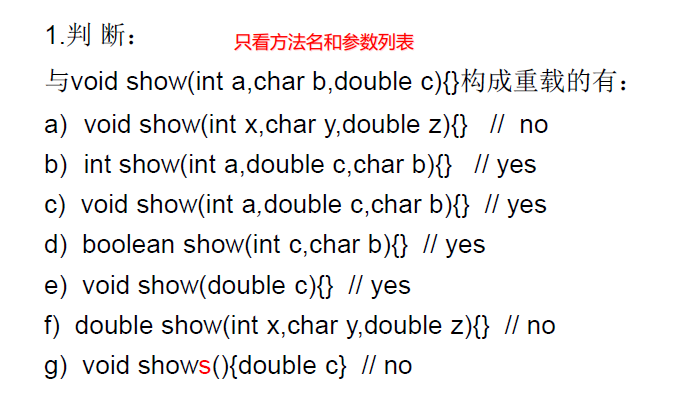

### 7.4.8. 可变形参方法


1.	声明格式：`方法名(参数的类型名 ...参数名)`
2.	可变参数：方法参数部分指定类型的参数个数是可变多个：`0个，1个或多个`
3.	可变个数形参的方法与同名的方法之间，彼此构成重载
4.	可变参数方法的使用与方法参数部分使用`数组是一致`的
5.	方法的参数部分有可变形参，需要`放在形参声明的最后`
6.	在一个方法的形参位置，`最多只能声明一个可变个数形参`

```java
package com.atguigu.java1;

/**
 * 可变个数形参的方法 
 * 1.jdk 5.0新增的内容 
 * 2.具体使用：
 * 	2.1 可变个数形参的格式：数据类型...变量名
 * 	2.2 当调用可变个数形参的方法时，传入的参数个数可以是：0个，1个，2个，。。。
 *	2.3 可变个数形参的方法与本类中方法名相同，形参不同的方法之间构成重载
 *	2.4 可变个数形参的方法与本类中方法名相同，形参类型也相同的数组之间不构成重载。换句话说，二者不能共存。
 *	2.5 可变个数形参在方法的形参中，必须声明在未尾。
 *	2.6 可变个数形参在方法的形参中，最多只能声明一个可变形参。
 */
public class MethodArgsTest {
	public static void main(String[] args) {

		MethodArgsTest argsTest=new MethodArgsTest();
		argsTest.show();
		argsTest.show("tom");
		argsTest.show("tom","jack");
		
	}

	public void show(int i) {
		System.out.println(1);
	}
	
	public void show(String  s) {
		System.out.println(2);
	}

	public void show(String... s) {
		System.out.println(3);
		
		for (int i = 0; i < s.length; i++) {
			System.out.println(s[i]);
		}
	}
	
	//与上一个冲突
//	public void show(String[] s) {
//		
//	}

	// The variable argument type String of the method 
	// show must be the last parameter
//	public void show(String...strings,int i) {
//		
//	}
}
```

### 7.4.9. 方法参数的值传递机制


```java
// 值传递机制
public class ValueTransferTest {
	public static void main(String[] args) {
		
		//  字符串是不可修改的
		String s1 = "hello";//指向方法区的常量池地址
		
		new ValueTransferTest().change(s1);//将地址赋值给形参s
		
		System.out.println(s1);

	}

	public void change(String s) {
		s = "Hi~~";//重新赋地址值
	}

}

```


练习


### 7.4.10. 递归(recursion)方法

+ 递归方法`：一个方法体内调用它自身`。 

+ 方法递归包含了一种隐式的循环，它会重复执行某段代码，但这种重复执行无须循环控制。 

 *    `递归一定要向已知方向递归`，否则这种递归就变成了无穷递归，类似于死循环。

```java
/**
 * 递归方法：一个方法体内调用它自身。 
 *  
 * 1.递归方法：一个方法体内调用它自身
 * 2. 方法递归包含了一种隐式的循环，它会重复执行某段代码，但这种重复执行无须循环控制。 
 *    递归一定要向已知方向递归，否则这种递归就变成了无穷递归，类似于死循环。
 *
 */
public class RecursionTest {

	//计算自然数之和
	//getSum(100) = 5050
	public static int getSum(int n) {
		if(n == 1) {
			return 1;
		}
		
		return n+ getSum(n-1);
		
	}
	
	//请用Java写出递归求阶乘(n!)的算法
	//getFactorial(5) = 120
	public static int getFactorial(int n) {
		if(n == 1) {
			return 1;
		}
		
		return n * getFactorial(n-1);
		
	}
	
	//已知有一个数列：f(0) = 1,f(1) = 4,f(n+2)=2*f(n+1) + f(n),
	//其中n是大于0的整数，求f(10)的值。
	//f(10) = 10497
	public static int f(int x) {
		if(x == 0) {
			return 1;
		}
		if(x == 1) {
			return 4;
		}
		
		return 2 * f(x - 1) + f(x - 2);//递归一定要向已知方向递归
	}
	
	
	//已知一个数列：f(20) = 1,f(21) = 4,f(n+2) = 2*f(n+1)+f(n),
	// 其中n是大于0的整数，求f(10)的值。
	public static int f1(int x) {
		
		if(x == 20) {
			return 1;
		}else if(x == 21) {
			return 4;
		}else {
			return f1(x + 2)- 2 * f1( x + 1);//递归一定要向已知方向递归
		}	
	}
	
	//练习7.4：输入一个数据n，计算斐波那契数列(Fibonacci)的第n个值
	//1  1  2  3  5  8  13  21  34  55

	// 规律：一个数等于前两个数之和
	//	要求：计算斐波那契数列(Fibonacci)的第n个值，并将整个数列打印出来
	public static int fibonacci(int n) {
		if(n == 1) {
			return 1;
		}else if (n == 2) {
			return 1;
		}
		
		return fibonacci(n - 1) + fibonacci(n - 2);
	}
}
```

#### **八皇后**

```java
/**
 * <pre>
 *在8×8格的国际象棋上摆放八个皇后，使其不能互相攻击，即任意两个皇后都不能处于同一行、同一列或同一斜线上，问有多少种摆法
 * 思路：
 * 第一个皇后先放第一行第一列，
 * 然后第二个皇后放在第二行第一列、然后判断是否OK，
 * 然后第二列、第三列、依次把所有列都放完，找到一个合适，
 * 继续第三个皇后，还是第一列、第二列……直到第8个皇后也能放在一个不冲突的位置，
 * 算是找到了一个正确解。然后回头继续第一个皇后放第二列，后面继续循环
 * </pre>
 */
public class EightQueen {

    //一维数组表示棋盘，下标表示行数，每个位置对应的值表示列数
    static int[] pos = new int[8];
    static int count = 0;

    public static void queen(int row) {
        //如果row==8.表示递归终止
        if (row == 8) {
            print();//打印展示
            count++;
        } else {
            //每一行有8个位置
            for (int col = 0; col < 8; col++) {
                //模拟当前行的的当前列
                pos[row] = col;

                //校验之前行  P  row col
                int oldRow = 0;
                for (; oldRow < row; oldRow++) {
                    //校验不在同一列，斜线校验：两点横坐标差等于纵坐标差及在一条斜线上
                    if (pos[row] == pos[oldRow] || Math.abs(row - oldRow) == Math.abs(pos[row] - pos[oldRow])) {
                        break;
                    }
                }
                //如果不是break退出，即row=oldRow,在row的col列校验通过
                if (row == oldRow) {

                    queen(row + 1);
                }
                //进行下一个col校验
            }
        }
    }

    private static void print() {
        String[][] strings = new String[8][8];
        for (int i = 0; i < strings.length; i++) {
            for (int j = 0; j < strings[i].length; j++) {
               if ( pos[i]==j){
                   strings[i][j]="1";
               }else {
                   strings[i][j]=" ";
               }
            }
            System.out.println(Arrays.toString(strings[i]));
        }
        System.out.println(Arrays.toString(pos));
        System.out.println("====================================================================");
    }


    public static void main(String[] args) {
        queen(0);
    }

}
```

#### 汉诺塔

```java
public class HNT {
    public static void main(String[] args) {
        int nDisks = 3;
        doTowers(nDisks, 'A', 'B', 'C');
    }

    public static void doTowers(int topN, char from, char inter, char to) {
        if (topN == 1) {
            System.out.println("Disk 1 from " + from + " to " + to);
        } else {
            doTowers(topN - 1, from, to, inter);//将from上n-1个移动到过渡位置，
            System.out.println("Disk " + topN + " from " + from + " to " + to);//将from移动到to
            doTowers(topN - 1, inter, from, to);//将过渡位置的移动到to位置，from为新的过渡位置
        }
    }

}
```


## 7.5. 面向对象特征一：封装

### 7.5.1. 概念

+ 我们程序设计追求“高内聚，低耦合”。
	+ 高内聚 ：类的内部数据操作细节自己完成，不允许外部干涉；
	+ 低耦合 ：仅对外暴露少量的方法用于使用。
+ 隐藏对象内部的复杂性，只对外公开简单的接口。便于外界调用，从而提高系统的可扩展性、可维护性。通俗的说，`把该隐藏的隐藏起来，该暴露的暴露出来。这就是封装性的设计思想。`


### 7.5.2. 四种权限修饰符


> 四种权限都可以用来修饰`类的内部结构`：`属性、方法、构造器、内部类`
>
> class只能使用 public 和 缺省的 修饰

### 7.5.3. 代码

```java
package com.atguigu.java;

/**
 * 面向对象的特征一：封装与隐藏
 * 
 * 一、问题引入：
 * 	当我们创建一个类的对象以后，我们可以通过“对象.属性”的方式，对对象的属性进行赋值。
 * 	这里赋值操作要受到属性的数据类型和储存范围的制约，没有其他制约条件。但是在实际问题中，我们
 * 	往往需要给属性赋值加入额外的限制条件。这个条件就不能再属性声明时体现，我们只能通过方法进行限制条件的添加（比如setXxx()）。
 * 	同时我们需要避免用户使用“对象.属性”的方式对属性进行赋值。则需要将属性声明为私有的（private）
 * 	--->此时，针对属性就体现了封装性
 *二、封装性的体现：
 *	我们将类的属性私有化（private），同时我们提供公共的（public）方法来获取（getXxx()）和设置（setXxx()）属性的值
 *	
 *	拓展：封装性的体现：①属性隐藏 ② 不对外暴露的私有方法 ③ 单例模式 。。。
 *
 *三、封装性的体现：需要权限修饰符来配合。
 *	1. java规定的4中权限 ： private < 缺省（default） < protected < public 
 *	2. 四种权限可以用来修饰类及类的内部结构：属性、方法、构造器、内部类
 *	3. 具体的：
 *			四种权限都可以用来修饰类的内部结构：属性、方法、构造器、内部类
 *			只有public 和 缺省 的来修饰一个类
 *	总结封装性：java提供了4中权限修饰符来休息类的内部结构，体现类及类的内部结构在调用时的可见性的大小
 */
public class AnimalTest {
	public static void main(String[] args) {
		Animal a = new Animal();
		a.name = "大黄";
		a.age = 10;
		//a.legs = 4;//private 修饰的属性和方法只能在本类中使用
		
		a.show();
		
		//a.legs = -4;
		a.show();
	}
}

class Animal {
	String name;
	int age;
	private int legs;//隐藏属性
	
	 // 隐藏legs熟悉，进行限制	
	// 对属性的设置
	public void setLegs(int legs) {
		if(legs >= 0 && legs % 2 ==0) {
			this.legs = legs;
		}else {
			throw new IllegalArgumentException("参数异常");
		}	
	}

	//对属性的获取
	public int getLegs() {
		return this.legs;
	}
	public void eat() {
		System.out.println("进食...");
	}


	public String show() {
		return "Animal [name=" + name + ", age=" + age + ", legs=" + legs + "]";
	}
}
```

### 7.5.4. 封装性的体现：

体现一：将类的属性xxx私化（private），同时，提供公共的（public）方法来获取（getxxx）和设置（setxxx）此属性的值

体现二：不对外暴露的私有的方法

体现三：单例模式（将构造器私有化）

体现四：如果不希望类在包外被调用，可以将类设置为缺省的

## 7.6. 类的结构之三：构造器/构造方法(constructor)

### 7.6.1. 概念


```java
package com.atguigu.java1;

/**
 * 类的结构之三：构造器（构造方法、constructor）的使用
 * 
 * 一、构造器作用：；
 * 	1. 创建对象
 * 	2. 初始化对象的属性
 * 
 * 二、说明：
 * 	1.如果没有显式的定义类的构造器，则系统默认提供一个空参的构造器
 * 	2.定义构造器的格式：权限修饰符 类名(形参列表){ 方法体 } 
 * 	3.一个类中定义的多个构造器，彼此重载
 * 	4.一旦我们显式的定义了类的构造器之后，系统就不在提供默认的空参构造器
 * 	5.一个类中至少要有一个构造器。
 *
 */
public class PersonTest {
	public static void main(String[] args) {
		Person p1 = new Person();
		Person p2 = new Person("zhasan",10);
	}

}


class Person{
	String name;
	int age;
	
	{
		System.out.println("代码块。。。");
	}
	public Person() {
		System.out.println("构造器...");
	}
	
	public Person(String name,int age) {
		this.name = name;
		this.age = age;
		System.out.println("姓名："+ name+"年龄：" + age);
	}	
}
```


> 属性赋值过程（未考代码块和继承）

```java
package com.atguigu.java1;


/**
 * 总结：属性赋值的先后顺序：
 *	①默认初始化
 *	②显式初始化
 *	③构造器中初始化
 
 *	④通过“对象.属性” 或 “对象.方法” 的方式，赋值
 * 	
 * 以上操作的先后顺序： ① -> ② -> ③ -> ④
 *
 */
public class UserTest {

	public static void main(String[] args) {
		User u = new User();
		System.out.println(u.name);//null 显式初始化赋值再默认初始化后面
		
		User u1 = new User(2);
		System.out.println(u1.age);//2  表示构造器在后面进行赋值，覆盖前面的值
		
		u1.age = 3;
		System.out.println(u1.age);//3 表示通过“对象.属性”在后面进行赋值，覆盖前面的值
	}
}

class User{
	String name;
	int age = 1;//显式初始化
	
	public User() {}
	
	public User(int n) {age = n; }
	
}

```

### 7.6.2. JavaBean（POJO）


```java
package com.atguigu.java1;

/**
 * JavaBean是一种Java语言写成的可重用组件。
 * 
 * 所谓javaBean，是指符合如下标准的Java类：  
 * 		>类是公共的  
 *  	>有一个无参的公共的构造器  
 *  	>有属性，且有对应的get、set方法
 *
 */
public class Customer {
	private int id;
	private String name;
	
	
	public Customer() {
		super();
	}
	
	
	public int getId() {
		return id;
	}
	public void setId(int id) {
		this.id = id;
	}
	public String getName() {
		return name;
	}
	public void setName(String name) {
		this.name = name;
	}
		
}
```

### 7.6.3. UML类图


### 7.6.4. this关键字

#### 7.6.4.1. 概念


> 注意：

+ 可以在类的构造器中使用“this（形参列表）”的方式，调用本类中重载的**其他的构造器**！
+ 明确：构造器中不能通过“this（形参列表）”的方式调用自身构造器如果一个类中声明了n个构造器，则最多有**n-1个构造器中使用了"this（形参列表）"**（`至少有一个super的构造器`）
+ "this（形参列表）”必须声明在类的构造器的**首行**！
+ 在类的一个构造器中，**最多只能声明一个“this（形参列表）”**

```java
package com.atguigu.java2;
/**
 * this关键字的使用：
 * 1.this 可以用来修饰：属性、方法、构造器
 * 2.this 修饰属性和方法：
 * 			this理解为：当前对象 或 当前正在创建的对象
 * 		2.1 在类的方法中，我们可以使用“this.属性”或者“this.方法()”，调用当前对象属性或方法，但是，
 *  	常情况下，我们默认省略“this”。特殊情况下，如果方法的形参和类的属性同名是，我们必须
 * 		显式的使用“this.变量”的方式，表明变量是属性，而非形参。
 * 
 * 		2.2 在类的构造器中，我们可以使用“this.属性”或者“this.方法()”，调用当前正在创建的对象属性或方法，但是，
 *  	常情况下，我们默认省略“this”。特殊情况下，如果方法的形参和类的属性同名是，我们必须
 * 		显式的使用“this.变量”的方式，表明变量是属性，而非形参。
 * 3.this 修饰/调用构造器
 * 	①我们在类的构造器中，可以显式的使用“this(参数列表)”方式，调用本类中指定的其他构造器
 * 	②构造器中不能通过“this(参数列表)”方式调用自己
 * 	③如果一个类中有n个构造器，则最多由n-1个构造器中使用“this(参数列表)”方式,至少有一个首行是super（）
 * 	④规定：“this(参数列表)”必须声明在当前构造器中的首行
 * 	⑤构造器内部，最多只能声明一个“this(参数列表)”，来调用其他的构造器
 * 	
 */
public class ThisTest {
	public static void main(String[] args) {
		Person person = new Person();
		person.setAge(10);
		System.out.println(person.getAge());
	}
}

class Person{
	
	private String name;
	private int age;
	public Person() {
//		this.eat();
		this("xx",18);//调用构造器；this必须第一行
	}
	
	public Person(String name, int age) {
		this.name = name;
		this.age = age;
	}
	public String getName() {
		return name;
	}
	public void setName(String name) {
		//name = name;//变量就近原则，指向形参
		this.name = name;
	}
	public int getAge() {
		return age;
	}
	public void setAge(int age) {
		this.age = age;
	}
	
	public void eat(){
		System.out.println("eat....");
	}

}
```

#### 7.6.4.2. 练习：

Girl：注意	

> public void merray(Boy boy) {...}
> public int compare(Girl girl){...}

```java
package com.atguigu.exer;

@Data
public class Girl {
	private String name;
	private int age;

	public Girl() {
	}

	public Girl(String name, int age) {
		super();
		this.name = name;
		this.age = age;
	}

	/**
	 * 表示传入的这个boy和当前对象结婚
	 * 
	 * @param boy
	 */
	public void merray(Boy boy) {
		System.out.println(this.getName() + "结婚：" + boy.getName());
		boy.marry(this);// this 表示当前对象,
	}

	/**
	 * 
	 * @Description 传入的对象与当前对象的年龄进行比较 比较两个对象的大小
	 * @param girl
	 * @return 正数：当前对象大； 负数：当前对象小 ； 0：当前对象与形参对象相等
	 */
	public int compare(Girl girl) {
//		if(this.age > girl.age){
//			return 1;
//		}else if(this.age < girl.age){
//			return -1;
//		}else{
//			return 0;
//		}

		return this.age - girl.age;

	}
}

```

Boy

```java
package com.atguigu.exer;

@Data
public class Boy {
	private String name;
	private int age;

	public Boy() {

	}

	public Boy(String name, int age) {

		this.name = name;
		this.age = age;
	}

	public void marry(Girl girl) {
		
		if(this.age > 20) {
			System.out.println(this.getName() + "结婚："+girl.getAge());
		}else {
			System.out.println("年龄不足");
		}		
	}
}

```

测试

```java
package com.atguigu.exer;

public class BoyGirlTest {
	public static void main(String[] args) {
		
		Girl girl = new Girl("朱丽叶",18);
		girl.merray(new Boy("罗密欧" ,22));
		
		int compare = girl.compare(new Girl("祝英台",20));
		System.out.println(compare);
		
		/* 结果：
		 朱丽叶结婚：罗密欧
		罗密欧结婚：18
		-2

		 */
	}
}
```

### 7.6.5. package

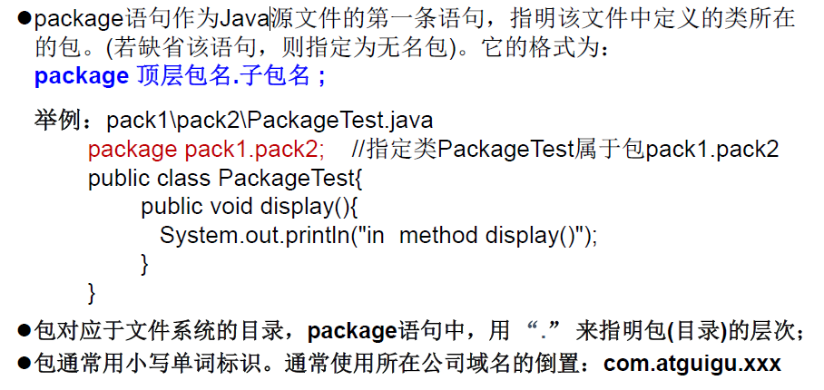


```java
/**
 * 一、package关键字的使用
 * 1.为了更好的实现项目中类的管理，提供包的概念
 * 2.使用package声明类或接口所属的包，声明在源文件的首行
 * 3.包属于标识符，遵循标识符命名规则、规范（包名全小写）、“见名知义”
 * 4.每“.”一次，就代表一层文件目录
 * 
 * 补充：	同一个包下，不能命名同名的接口、类
 * 		不同的包下可以命名，可以不能命名同名的接口、类
 *
 */
public class PackageImportTest {

}

```


### 7.6.6. import


```java
import com.atguigu.exer2.Account;
import static java.lang.Math.*;

/**
 *
 * 二、import关键字的使用
 *  import：导入
 *  1.在源文件中显式的使用import结构指定包下的类、接口
 *  2.声明在包的声明和类的声明之间
 *  3.如果需要导入多个结构，则并列写出即可
 *  4.可以使用“xxx.*”的方式，便是可以导入xxx包下的所有结构
 *  5.如果使用的类或接口是java.lang包下定义的，则可以省略import结构
 *  6.如果使用的类或接口，则可以省略import结构
 *  7.如果在源文件中，使用了不同包下的同名的类，则必须至少有一个需要以全类名的方式显示
 *			com.atguigu.exer2.Account account=new Account(100.0);
 *	8.使用“xxx.*”表示可以调用xxx包下的所有的结构；但是如果使用的xxx子包下的结构，人需要显示的导入
 *	9.import static表示导入指定类中的静态结构：属性和方法
 *			import static java.lang.Math.*  :导入Math类中的静态结构
 */
public class PackageImportTest {
	public static void main(String[] args) {
		com.atguigu.exer2.Account account=new Account(100.0);
		
	}

}

```

## 7.7. 面向对象特征二：继承性(inheritance)

### 7.7.1. 引入


### 7.7.2. 概念及作用


> 作用：

+ 继承的出现减少了代码冗余，提高了代码的复用性。
  + 继承的出现，更有利于功能的扩展。
  + 继承的出现让类与类之间产生了关系，提供了多态的前提。
+ 注意：不要仅为了获取其他类中某个功能而去继承

+ 子类继承了父类，就`继承了父类所有的的方法和属性（包括private，因为封装性隐藏，可以通过其他间接方式访问`）。
+ 在子类中，可以使用父类中定义的方法和属性，也可以创建新的数据和方法。
+ 在Java中，继承的关键字用的是“extends”，即子类不是父类的子集，而是对父类的“扩展”。


### 7.7.3. 代码及总结

```java
package com.atguigu.java;

import java.lang.reflect.Field;

/**
 * 面向对象的特征之二：继承性
 * 
 * 一、继承性的好处
 * ①减少代码的冗余，提高代码的复用性
 * ②便于功能的扩展
 * ③为多态性的使用，提供了前提
 * 
 * 二、继承性的格式  class A extends B{}
 * 		A：子类、subclass、派生类
 * 		B：父类、超类、基类、superclass
 * 2.1 体现：一旦子类A继承父类B，子类A就获取了父类B中声明所有属性、方法（构造器不能继承，可以通过super调用）
 * 		特别的：父类中声明为private的属性或方法，子类继承父类后，任然认为获取了父类中私有的结构，
 * 		只是因为封装性的影响，使得子类不能直接调用父类的结构而已。
 * 	提醒：类的结构：属性、方法、构造器
 * 2.2 子类继承父类以后，还可以声明子类自己特有的属性和方法，实现功能的拓展。
 * 		子类和父类的关系，不同于子集和集合的关系。
 *	extends：延展、拓展
 *
 * 三、java中关于继承的规定: 
 * 	1.一个类可以被多个子类继承。
 * 	2.java中类的单继承性：一个类只能有一个父类。
 * 	3.子父类是相对的概念。
 * 	4.子类直接继承的父类，称为：直接父类。间接继承的父类称为：间接父类
 * 	5.子类继承父类以后，就获取了直接父类以及间接父类中声明的属性和方法
 * 
 * 四、	1.如果我们没有显式的声明一个类的父类，则此类继承于java.lang.Object类
 *		2.所有的java类（）除Object都直接或间接的继承于java.lang.Object类
 *		3.意味着，所有的java类具有java.lang.Object类声明的功能
 */

public class Student extends Person{
	
	public void show() {
		//私有属性age，子类不能直接调用，但是可以证明子类继承了该属性，由于封装性存在，只能通过其他方式调用如getXxx()方法
		System.out.println(name + getAge());
		
	}
	public static void main(String[] args) throws Exception {
		
		Student student = new Student();
//		student.age;//私有的属性，仍然存在，但是不能直接调用
		System.out.println(student.name);
		student.setAge(10);
		System.out.println(student.getAge());
		
	}	
}
 class Person {
	String name;
	private	int age;
	
	public Person() {}
	public Person(String name,int age) {
		this.name = name;
		this.age = age;
	}
	
	public void eat() {
		System.out.println("F---eat............");
	}
	
	public void sleep() 	{
		System.out.println("F---sleep............");
	}
	public String getName() {
		return name;
	}
	public void setName(String name) {
		this.name = name;
	}
	public int getAge() {
		return age;
	}
	public void setAge(int age) {
		this.age = age;
	}	
}
```

### 7.7.4. 方法的重写(override/overwrite)


```java
package com.atguigu.java2;
/**
 * 方法的重写（override/overwrite）
 * 1.重写：子类继承父类以后，可以对父类同名同参数的方法，进行覆盖操作
 * 2.应用：重写以后，当创建子类对象以后，通过子类对象调用子父类中同名同参数的方法时，实际执行的是子类重写父类的方法。
 * 
 * 3.重写规定：
 * 	 方法的声明：	权限修饰符 返回值类型 方法名(形参列表){
 * 					方法体;
 * 				}
 * 		约定俗称：子类中的叫重写的方法，父类中的叫被重写方法
 * 
 * 	①子类重写的方法的方法名和形参列表与父类被重写的方法的方法名和参数列表相同
 * 	②子类重写的方法的权限修饰符不小于父类被重写的方法的权限修饰符
 * 		>特殊情况：子类不能重写父类中声明为private的方法（通过封装性理解，子类也可以定义相同的）
 * 	③返回值类型：
 * 		>父类被重写的方法的返回值是void，则子类重写的方法的返回值也必须是void
 * 		>父类被重写的方法的返回值是A类型，则子类重写的方法的返回值可以是A类或者A类的子类
 *		>父类被重写的方法的返回值是基本数据类型，	则子类重写的方法的返回值必须是相同的基本数据类型
 * 	④子类重写的方法抛出的异常类型不大于父类被重写的方法抛出的异常类型
 * **************************************************
 * 子类和父类中同名同参数的方法要么都声明为非static（考虑重写），要么都声明为static（不是重写，随类加载）
 * 
 * 
 * 面试题：区分方法的重载与重写？
 * 
 * 
 */
public class OverRideTest {
	public static void main(String[] args) {
		
	}

}


class Person{
	String name;
	int age;
	
	protected void eat() {
		System.out.println("eat------------");
	}
	
	public void walk(int length) {
		System.out.println("走路距离：" + length);
	}
	//特殊情况：子类不能重写父类中声明为private的方法（通过封装性理解，子类也可以定义相同的）
	private void show() {
		System.out.println("show--------");
	}
	
}

class Student extends Person{
	
	String  major;

	@Override
	public String toString() {
		return "Student [major=" + major + ", name=" + name + ", age=" + age + "]";
	}
	

	//子类重写的方法的权限修饰符不小于父类被重写的方法的权限修饰符
	/*
	 Multiple markers at this line
	- Cannot reduce the visibility of the inherited method from 
	 Person
	- overrides com.atguigu.java2.Person.eat
	 */
//	 void eat() {
//		System.out.println("eat------------");
//	}
	
	public void eat() {
		System.out.println("eat------------");
	}
    //>特殊情况：子类不能重写父类中声明为private的方法（通过封装性理解，子类也可以定义相同的）
	public void show() {
		System.out.println("show--------");
	}	
}
```


### 7.7.5. 关键字：super


```java
package com.atguigu.java3;

/**
 * super关键字的使用 
 * 1.super理解为：父类的 
 * 2.super可以调用父类的结构：属性、方法、构造器
 * 
 * 3.super的使用
 * 	3.1 我们可以再子类的方法或构造器中，通过使用“super.属性”或“super.方法”的方式，显式的调用
 * 	父类中声明的属性或方法。但是，通常情况下，我们习惯是省略“super”；
 * 	3.2 特殊情况：当子类与父类中定义了同名的属性时，我们要想在子类中调用父类中声明的属性，则必须显式的
 * 	使用“super.属性”的方式，表明调用父类中声明的属性；
 * 	3.3特殊情况：当子类重写了父类中的方法以后，我们想在子类的方法中调用父类中被重写的方法时，则必须显式
 * 	的使用“super.方法”的方式，表明调用的是父类中被重写的方法。
 *	
 *	4.super调用构造器：
 *		4.1我们可以再子类的构造器中显式的使用“super(参数列表)”的方式，调用父类中声明的指定构造器
 *		4.2“super(参数列表)”的使用，必须声明在子类构造器的首行
 *		4.3我们在类的构造器中，针对于“super(参数列表)”或“this(参数列表)”只能二选一，不能同时出现
 *		4.4在构造器的首行，没有显式的声明“super(参数列表)”或“this(参数列表)”，默认调用的空参构造器：super()
 *		4.5 在类的多个构造器中，至少有一个类的构造器中使用了“super(参数列表)”，调用父类中的构造器
 *		
 *
 *
 */
public class Student extends Person {
	String major;
	int id = 101;//学号 两个id都存在与堆内存中，默认以this调用

	public Student() {
		//缺省时（ super() ），必须确保父类存在空参构造器，否则会报错，
	}

	public Student(String major){
		this.major=major;
		System.out.println();
	}
	
	
	public Student(String name, int age, String major, int id) {
		super(name, age);
		this.major = major;
		this.id = id;
	}

	@Override 
	public void eat (){
		System.out.println("学生：多吃有营养的食物");
	}

	public void study(){
		System.out.println("学生：学习知识");
	}
	
	public void show() {
		System.out.println(super.name);
		System.out.println(this.id);
		System.out.println(super.id);
		this.eat();//等价于eat():缺省时，默认this，默认从本类中寻找，
		super.eat();
	}
	
	public static void main(String[] args) {
		Student student = new Student();
		
	}
}

class Person {
	 String name;
	 int age;
	 int id = 100;//身份证

	public Person() {
	}

	public Person(String name) {
		this.name = name;
	}

	public Person(String name, int age) {
		this.name = name;
		this.age = age;
	}

	public void eat() {
		System.out.println("eat.....");
	}
}
```

### 7.7.6. 子类对象实例化过程

> 子类构造器首行没有显式的调用super的构造器或者this构造器，默认是`super()`

1. 从结果上来看：（继承性）
	子类继承父类以后，就获取了父类中声明的属性或方法。
	创建子类的对象，在堆空间中，就会加载所有父类中声明的属性。

  2. 从过程上来看：
	当我们通过子类的构造器创建子类对象时，我们一定会直接或间接的调用其父类的构造器，进而调用父类的父类的构造器，...直到调用了java.lang.Object类中空参的构造器为止。正因为加载过所有的父类的结构，所以才可以看到内存中有父类中的结构，子类对象才可以考虑进行调用

  明确：虽然创建子类对象时，调用了父类的构造器，但是自始至终就创建过一个对象，即为new的子类对象。


> 1、this 、super必须出现在构造器的首行
>
> 2、无论通过哪个构造器创建子类对象，需要保证先初始化父类。
> 目的：当子类继承父类后，“继承“父类中所有的属性和方法，因此子类有必要知道父类如何为对象进行初始化。

## 7.8. 面向对象特征三：多态

### 7.8.1. 概念


> 对象的多态性，只适用于方法，不适用于属性（编译和运行都看左边）

### 7.8.2. 代码

```java
package com.atguigu.java4;

/*
 * 面向对象特征之三：多态性
 * 
 * 1.理解多态性：可以理解为一个事物的多种形态。
 * 2.何为多态性：
 *   对象的多态性：父类的引用指向子类的对象（或子类的对象赋给父类的引用）
 *   
 * 3. 多态的使用：虚拟方法调用
 *   有了对象的多态性以后，我们在编译期，只能调用父类中声明的方法，但在运行期，我们实际执行的是子类重写父类的方法。
 *   总结：编译，看左边；运行，看右边。
 *   
 * 4.多态性的使用前提：  ① 类的继承关系  ② 方法的重写
 * 
 * 5.对象的多态性，只适用于方法，不适用于属性（编译和运行都看左边）
 */
public class PersonTest {
	
	
	public static void main(String[] args) {
		
		Person p1 = new Person();
		p1.eat();
		
		Man man = new Man();
		man.eat();
		man.age = 25;
		man.earnMoney();
		
		//*************************************************
		System.out.println("*******************");
		//对象的多态性：父类的引用指向子类的对象
		Person p2 = new Man();
//		Person p3 = new Woman();
		//多态的使用：当调用子父类同名同参数的方法时，实际执行的是子类重写父类的方法 ---虚拟方法调用
		p2.eat();
		p2.walk();
		
//		p2.earnMoney();
		
		System.out.println(p2.id);//1001
		
	}
}
```

Person

```java
package com.atguigu.java4;

public class Person {
	String name;
	int age;
	
	int id = 1001;
	
	public void eat(){
		System.out.println("人：吃饭");
	}
	
	public void walk(){
		System.out.println("人：走路");
	}
	
}

```

Man

```java
package com.atguigu.java4;

public class Man extends Person{
	
	boolean isSmoking;
	
	int id = 1002;
	
	public void earnMoney(){
		System.out.println("男人负责挣钱养家");
	}
	
	public void eat(){
		System.out.println("男人多吃肉，长肌肉");
	}
	
	public void walk(){
		System.out.println("男人霸气的走路");
	}

}

```

Woman

```java
package com.atguigu.java4;

public class Woman extends Person{
	
	boolean isBeauty;
	
	public void goShopping(){
		System.out.println("女人喜欢购物");
	}
	
	public void eat(){
		System.out.println("女人少吃，为了减肥");
	}
	
	public void walk(){
		System.out.println("女人窈窕的走路");
	}
}

```

> 多态性只适用于方法，不适用于属性

```java
package com.atguigu.java4;
//多态性只适用于方法，不适用于属性
public class Z extends F {
	String name = "Z";
	int age  = 1;
	
	public static void main(String[] args) {
		F z1= new Z();
		System.out.println(z1.name);//F
		System.out.println(z1.getClass());//class com.atguigu.java4.Z
		
		Z z2 = new Z();
		System.out.println(z2.name);
	}

}


class F{
	String name = "F";
	int age  = 30;
}
```

### 7.8.3. 多态性应用举例


### 7.8.4. 虚拟方法调用(Virtual Method Invocation)


> 测试：验证java的动态绑定

```java
public class Test {
    public static void main(String[] args) {
        Father son =  new Son();
    }
}

class Father {

    Father() {     
        super();//2、调用父类Object的构造器
        this.toString();//3、调用成员方法，运行时动态绑定，去找运行时指向new Son()这个对象的成员方法，发现找到了，则执行。找不到，根据class类对象的文件元数据信息，则向上找超类的方法    
    }

    @Override
    public String toString() {
        return "Father";
    }
}

class Son extends Father {
    String name;

    Son() {
        super();//1、调用父类构造器
        name = "Son";
    }

    @Override
    public String toString() {
        return name.toUpperCase();//4、调用name.toUpperCase()的方法，但是name此时还是默认初始化，值为null，所以报空指针异常
    }
}
```

错误结果：

+ 输出FATHER
+ 输出SON
+ 不能编译

**答案：**name.toUpperCase();执行时name为null，此时运行报错NullPointerException

**解析：******成员方法在运行时进行动态绑定**，会现在本类找，找不到一层一层到父类去找，所以会**出现name为null**


> 总结：
>
> 1. 在java中，`成员方法默认动态绑定`【除了**`static`、`final`、`private`修饰的方法`不是动态绑定`**】；不像c++的动态绑定需要添加额外关键字来实现多态
> 2. 当JVM执行对象的成员方法时，会将方法和当前对象的实际内存进行绑定。找不到，就根据class类文件的元数据信息，去寻找找到父类的成员方法。
> 3. **动态绑定机制和属性没有关系**
> 4. 构造方法，默认回调用super()
>
> ---
>
> 1. 子类初始化的时候子类和父类初始化顺序
>
>    + 父类【静态成员】和【静态代码块】，按在代码中出现的顺序依次执行
>
>    + 子类【静态成员】和【静态代码块】，按在代码中出现的顺序依次执行
>
>    + 父类的【普通成员变量被普通成员方法赋值】和【普通代码块】，按在代码中出现的顺序依次执行
>
>    + 执行父类的构造方法
>
>    + 子类的【普通成员变量被普通成员方法赋值】和【普通代码块】，按在代码中出现的顺序依次执行
>
>    + 执行子类的构造方法


### 7.8.5. 小结

#### 7.8.5.1. 重写与重载小结


#### 7.8.5.2. 多态小结


### 7.8.6. 对象类型转换

#### 7.8.6.1. instanceof 操作符


#### 7.8.6.2. 对象类型转换（casting）


```java
package com.atguigu.java;

import java.util.*;


/**
 * 多态性：不能调用子类所特有的方法、属性，
 * 
 * 有了对象的多态性以后，内存中实际上是加载了子类特有的属性和方法的，但是由于变量声明为父类类型，
 * 导致编译时，只能调用父类中声明的属性和方法。子类特有的属性和方法不能调用。
 *
 *
 * instanceof关键字的使用：
 * a  instanceof A：判断对象啊是否是类A的实例，如果是返回true，否则返回false
 * 
 * 使用情景：为了避免在向下转型时，出现ClassCastException异常，我们
 * 在向下转型之前，先进行instanceof的判断，如果返回true，就进行，否则终止。
 * 
 * 向下转型的常见问题：
 * 
 * 前提：Woman extend Person、 Man extend Person
 * 问题一：编译通过，运行时不通过
 * 
 * 	//Person p1 = new Woman();
 *  //Man m1 = (Man)p1;
 *  
 *  //Person p4=new Person(); 
 *  //Man m4=(Man)p4;
 *  
 *  问题二：编译通过，运行时也通过
 *  //Object obj=new Woman(); 
 *  //Person p=(Person)obj;
 *  
 *  问题三：编译不通过
 *  //Man m5=new Woman();
 */
public class CastTest {
	

	public static void main(String[] args) {
		List<Object> list = new ArrayList<>();

		if(list instanceof ArrayList) {
			//向下转型：使用强制类型转换
			//使用强转时，可能出现ClassCastException异常
			ArrayList	list1 = (ArrayList)list;
		}
	}
}
```


### 7.8.7. 多态和继承变量方法综合练习

子类继承父类

+ 若子类重写了父类方法，就意味着子类里定义的方法彻底覆盖了父类里的同名方法，系统将不可能把父类里的方法转移到子类中。：编译看左边，运行看右边
+ 对于实例变量则不存在这样的现象，即使子类里定义了与父类完全相同的实例变量，这个实例变量依然不可能覆盖父类中定义的实例变量：编译运行都看左边


## 7.9. Object类的使用

### 7.9.1. 概述

+ Object类是所有Java类的根父类（继承树）

+ 如果在类的声明中未使用extends关键字指明其父类，则默认父类为java.lang.Object类


+ clone()

  建并返回此对象的一个副本。“副本”的准确含义可能依赖于对象的类。

```java
//Object类的clone()的使用
public class CloneTest {
	public static void main(String[] args) {
		Animal a1 = new Animal("花花");
		try {
			Animal a2 = (Animal) a1.clone();
			System.out.println("原始对象：" + a1);
			a2.setName("毛毛");
			System.out.println("clone之后的对象：" + a2);
		} catch (CloneNotSupportedException e) {
			e.printStackTrace();
		}
	}
}

class Animal implements Cloneable{
	private String name;

	public Animal() {
		super();
	}

	public Animal(String name) {
		super();
		this.name = name;
	}

	public String getName() {
		return name;
	}

	public void setName(String name) {
		this.name = name;
	}

	@Override
	public String toString() {
		return "Animal [name=" + name + "]";
	}
	
	@Override
	protected Object clone() throws CloneNotSupportedException {
		// TODO Auto-generated method stub
		return super.clone();
	}
	
}
```

+  finalize()

  当垃圾回收器确定不存在对该对象的更多引用时，由对象的垃圾回收器调用此方法。子类重写 finalize 方法，以配置系统资源或执行其他清除。

```java
public class FinalizeTest {
	public static void main(String[] args) {
		Person p = new Person("Peter", 12);
		System.out.println(p);
		p = null;//此时对象实体就是垃圾对象，等待被回收。但时间不确定。
		System.gc();//强制性释放空间
	}
}

class Person{
	private String name;
	private int age;

	public Person(String name, int age) {
		super();
		this.name = name;
		this.age = age;
	}
	public String getName() {
		return name;
	}
	public void setName(String name) {
		this.name = name;
	}
	public int getAge() {
		return age;
	}
	public void setAge(int age) {
		this.age = age;
	}
	//子类重写此方法，可在释放对象(gc)前进行某些操作
	@Override
	protected void finalize() throws Throwable {
		System.out.println("对象被释放--->" + this);
	}
	@Override
	public String toString() {
		return "Person [name=" + name + ", age=" + age + "]";
	}
	
}
```

### 7.9.2. ==操作符与equals方法


重写equals()方法的原则

+ **对称性**：如果x.equals(y)返回是“true”，那么y.equals(x)也应该返回是 “true”。
+ **自反性**：x.equals(x)必须返回是“true”。
+ **传递性**：如果x.equals(y)返回是“true”，而且y.equals(z)返回是“true”，那么z.equals(x)也应该返回是“true”。
+ 一致性：如果x.equals(y)返回是“true”，只要x和y内容一直不变，不管你重复x.equals(y)多少次，返回都是“true”。
+ 任何情况下，x.equals(null)，永远返回是“false”；
  x.equals(和x不同类型的对象)永远返回是“false”。

> 面试题：==和equals的区别

1. ==既可以比较基本类型也可以比较引用类型。对于基本类型就是比较值，对于引用类型就是比较内存地址
2. equals的话，它是属于java.lang.Object类里面的方法，如果该方法没有被重写过默认也是==；我们可以看到String等类的equals方法是被重写过的，而且String类在日 常开发中用的比较多，久而久之，形成了equals是比较值的错误观点。
3. 具体要看自定义类里有没有重写Object的equals方法来判断。
4. 通常情况下，重写equals方法，会比较类中的相应属性是否都相等。


```java
package com.atguigu.java;

import java.util.Date;

/*
 * 
 * 面试题： == 和 equals() 区别
 * 
 * 一、回顾 == 的使用：
 * == ：运算符
 * 1. 可以使用在基本数据类型变量和引用数据类型变量中
 * 2. 如果比较的是基本数据类型变量：比较两个变量保存的数据是否相等。（不一定类型要相同）
 *    如果比较的是引用数据类型变量：比较两个对象的地址值是否相同.即两个引用是否指向同一个对象实体
 * 补充： == 符号使用时，必须保证符号左右两边的变量类型一致。
 * 
 * 二、equals()方法的使用：
 * 1. 是一个方法，而非运算符
 * 2. 只能适用于引用数据类型
 * 3. Object类中equals()的定义：
 *    public boolean equals(Object obj) {
	        return (this == obj);
	  }
 *    说明：Object类中定义的equals()和==的作用是相同的：比较两个对象的地址值是否相同.即两个引用是否指向同一个对象实体
 * 
 * 4. 像String、Date、File、包装类等都重写了Object类中的equals()方法。重写以后，比较的不是
 *    两个引用的地址是否相同，而是比较两个对象的"实体内容"是否相同。
 *    
 * 5. 通常情况下，我们自定义的类如果使用equals()的话，也通常是比较两个对象的"实体内容"是否相同。那么，我们就需要对Object类中的equals()进行重写.
 *    重写的原则：比较两个对象的实体内容(即属性)是否相同.
 */
public class EqualsTest {
	public static void main(String[] args) {
		
		//基本数据类型
		int i = 10;
		int j = 10;
		double d = 10.0;
		System.out.println(i == j);//true
		System.out.println(i == d);//true
		
		boolean b = true;
//		System.out.println(i == b);
		
		char c = 10;
		System.out.println(i == c);//true
		
		char c1 = 'A';
		char c2 = 65;
		System.out.println(c1 == c2);//true
		
		//引用类型：
		Customer cust1 = new Customer("Tom",21);
		Customer cust2 = new Customer("Tom",21);
		System.out.println(cust1 == cust2);//false
		
		
		//都是new出来的，在堆内存中开辟的新空间
		String str1 = new String("atguigu");
		String str2 = new String("atguigu");
		System.out.println(str1 == str2);//false
        String s1 = "ggg";
		String s2 = "ggg";
		System.out.println(s1 == s2);//true
        
		
		System.out.println("****************************");
		System.out.println(cust1.equals(cust2));//false-重写equals之后-->true
		System.out.println(str1.equals(str2));//true  String重写了equals
		
		Date date1 = new Date(32432525324L);
		Date date2 = new Date(32432525324L);
        System.out.println(date1 == date2);//false
		System.out.println(date1.equals(date2));//true
		
		
	}
}

@Data
class Customer {
	private String name;
	private int age;
	//自动生成的equals()
	@Override
	public boolean equals(Object obj) {
		if (this == obj)
			return true;
		if (obj == null)
			return false;
     /*手动写的equals与自动生成的区别：
父类Person（）重写equals后，子类Man可以传入父类的equals中（多态），Man中的属性与Person一致，实际上类型不一致，但是比较时需要比较对象的类型相同
    */
		if (getClass() != obj.getClass())
			return false;
		Customer other = (Customer) obj;
		if (age != other.age)
			return false;
		if (name == null) {
			if (other.name != null)
				return false;
		} else if (!name.equals(other.name))
			return false;
		return true;
	}
	
	
//手动实现equals()的重写：
	//重写的原则：比较两个对象的实体内容(即：name和age)是否相同
//	@Override
//	public boolean equals(Object obj) {
//		
////		System.out.println("Customer equals()....");
//		if (this == obj) {
//            return true;
//        }
//		
//		if(obj instanceof Customer){
//			Customer cust = (Customer)obj;
//			//比较两个对象的每个属性是否都相同
////			if(this.age == cust.age && this.name.equals(cust.name)){
////				return true;
////			}else{
////				return false;
////			}
//			
//			//或
//			return this.age == cust.age && this.name.equals(cust.name);
//		}else{
//			return false;
//			
//		}
//		
//	}
	//手动实现
//	@Override
//	public String toString() {
//		return "Customer[name = " + name + ",age = " + age + "]"; 
//	}
	//自动实现
	@Override
	public String toString() {
		return "Customer [name=" + name + ", age=" + age + "]";
	}
}

```

### 7.9.3. toString() 方法


```java
/*
 * Object类中toString()的使用：
 * 
 * 1. 当我们输出一个对象的引用时，实际上就是调用当前对象的toString()
 * 
 * 2. Object类中toString()的定义：
 *   public String toString() {
        return getClass().getName() + "@" + Integer.toHexString(hashCode());
     }
 * 
 * 3. 像String、Date、File、包装类等都重写了Object类中的toString()方法。
 *    使得在调用对象的toString()时，返回"实体内容"信息
 *    
 * 4. 自定义类也可以重写toString()方法，当调用此方法时，返回对象的"实体内容"
 */
public class ToStringTest {
	public static void main(String[] args) {
		
		Customer cust1 = new Customer("Tom",21);
		System.out.println(cust1.toString());//com.atguigu.java1.Customer@15db9742-->Customer[name = Tom,age = 21]
		System.out.println(cust1);//com.atguigu.java1.Customer@15db9742-->Customer[name = Tom,age = 21]
		
		String str = new String("MM");
		System.out.println(str);//MM
		
		Date date = new Date(4534534534543L);
		System.out.println(date.toString());//Mon Sep 11 08:55:34 GMT+08:00 2113
		
	}
    
        @Test
    public void testNUllPrint(){
        String s = null;
        
        /*
        当我们输出一个对象的引用时，实际上就是调用当前对象的toString()，底层对对象为null时有保护
         public void print(String s) {
            if (s == null) {
                s = "null";
            }
            write(s);
        }
         */
        System.out.println(s);//null    
        System.out.println(s.toString());//空指针
    }
}
```

## 7.10. 包装类的使用


### 7.10.1. 代码

```java
/**
 * 包装类的使用：
 * 1.java提供了8中基本数据类型对应的包装类，使得基本数据类型的变量具有类的特征
 * 
 * 2.掌握的：基本数据类型、包装类、String三者之间的相互转换
 * 
 *
 */
public class WrapperTest {
	
	//基本数据类型 ---> 包装类：调用包装类的构造器
	@SuppressWarnings("deprecation")
	@Test
	public void test1() {
		int num1 = 123;
		Integer in1 = new Integer(num1);
		Integer in2 = new Integer("123");
		System.out.println(in1.toString());
		System.out.println(in2.toString());
		
	//转换异常	
//		Integer in3 = new Integer("123abc");
//		System.out.println(in3.toString());
		
		Float f1=new Float(12.3f); 
		Float f2=new Float("12.3"); 
		System.out.println(f1); 
		System.out.println(f2); 
		
		Boolean bl=new Boolean(true); 
		Boolean b2=new Boolean("true"); 
		Boolean b3=new Boolean("true123"); // 底层优化 return "true".equalsIgnoreCase(s);
		System. out. println(b3);//false
	}
	
	//包装类 ---> 基本数据类型:调用xxxValue()
	@Test
	public void test2() {
		Integer in1 =new Integer(12);
		int num1 = in1.intValue();
		System.out.println(num1);
		
		Float f1=new Float(12.3f); 
		float f2 = f1.floatValue();
		System.out.println(f2);
	}
	
	/*
	 JDK5.0新特性：自动装箱与自动拆箱
	 
	 */
	
	@Test
	public void test3() {
		// 基本数据类型 --> 包装类对象
		int num1 = 123;
		method(num1);
		
		//自动装箱:基本数据类型-->包装类 
		int num2 = 123;
		Integer in2 = num2;//自动装箱：底层调用Integer.valueOf(number)
		
		//自动拆箱：包装类 --> 基本数据类型
		int num3 = in2;//自动拆箱  in2.intValue()
		
	}
	
	public void method(Object obj) {
		System.out.println(obj);
	}
	
	
	//基本数据类型、包装类 -->String类型:调用String重载的valueOf(Xxx xxx)
	@SuppressWarnings("deprecation")
	@Test
	public void test4() {
		int num1 = 10;
		//方式一：连接运算
		String str1 =  num1 + "";
		
		//方式二：
		String str2 = String.valueOf(num1);
		String str3 = String.valueOf(new Double(12.4));
	}

	//String类型 -->基本数据类型、包装类:调用包装类的parseXxx(String s)
	@Test
	public void test5() {	
		String str1 ="123";
		//可能会报NumberFormatException
		int num1 = Integer.parseInt(str1);	
		
		String str2 = "true";
		boolean b1 = Boolean.parseBoolean(str2);
	}
	
}
```

### 7.10.2. 包装类用法举例

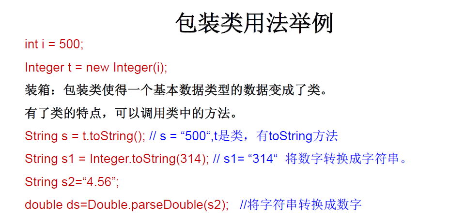


### 7.10.3. 面试题


> 自动装箱：Integer.valueOf（xxx x）
>
> Integer内部定义了IntegerCache结构，IntegerCache中定义了Integer[]，保存了从-128~127范围的整数。如果我们使用自动装箱的方式，给Integer赋值的范围在-128~127范围内时，可以直接使用数组中的元素，不用再去new了。
>
> 目的：提高效率

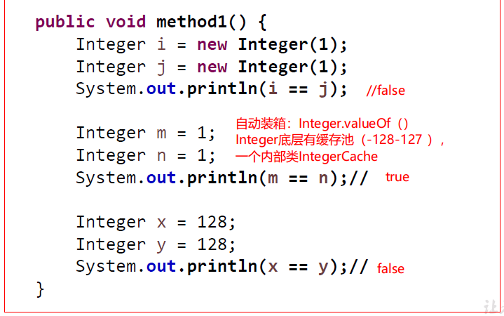


### 7.10.4. 单元测试步骤

```java
import org.junit.Test;

/**
 * java中的Junit单元测试
 * 
 * 步骤：
 * 1.选中当前工程-右键选择：build path -> add libraries -> JUnit 4 -> 下一步
 * 2.创建java类，进行但愿测试。
 * 	此时的java类要求：①此类是public  ②此类提供无参的构造器
 * 3.此类中是声明但愿测试方法
 * 		此时单元测试方法：方法的权限是public，没有返回值，没有形参
 * 4.此单元测试方法上，需要声明@Test注解，并在单元测试类中导入：import org.junit.Test;
 * 5.声明单元测试方法以后，就可以在方法体内测试相关代码
 * 6.写好代码以后，左键双击单元测试方法名，右键： run as -> Junit Test
 * 
 * 说明：
 * 1.如果执行结果没有任何异常：绿条
 * 2.如果执行结果出现异常：红条
 *
 */
public class JunitTest {
	
	@Test
	public void testEquals() {
		String s1 = "MM";
		String s2 = "MM";
		System.out.println(s1.equals(s2));	
	}
}
```

## 7.11. static

### 7.11.1. 概述


### 7.11.2. 代码总结

```java
package com.atguigu.java;

/**
 * static关键字使用：
 * 
 * 1.static：静态的
 * 2.static可以用来修饰：属性、方法、代码块、内部类（不能修饰构造器）
 * 
 * 3.使用static修饰属性：静态变量（或类变量）
 * 		3.1 属性,按是否使用static修饰，又分为：静态属性 vs 非静态属性（实例变量）
 * 		 实例变量：我们创建了类的多个对象，每个对象都独立的拥有一套类中的非静态属性。当修改其中一个对象的
 * 			非静态属性时，不会导致其他对象中的同样的属性值的修改
 * 		 静态变量：我们创建了类的多个对象，多个对象共享同一静态变量。当通过某一个对象修改静态变量时，会导致
 * 			其他对象调用此静态变量时，是修改过了的。
 * 		3.2 static修饰属性的其他说明：
 * 			① 静态变量随着类的加载而加载。可以通过“类.静态变量”的方式调用
 * 			② 静态变量的加载早于对象的创建。
 * 			③ 由于类只会加载一次，则静态变量在内存中也只会存在一份：存在方法区的静态域中。
 * 
 * 			④			类变量		实例变量
 * 				类		√			×（类不能调实例变量）
 * 				对象		√			√
 * 
 * 		3.3 静态属性举例：System.out;Math.PI;
 * 
 * 4.使用static修饰方法：静态方法
 * 		① 随着类的加载而加载，可以通过“类.静态方法()”的方式调用
 * 		②			静态方法		非静态方法
 * 			类		√			×（类不能调实例变量）
 * 			对象		√			√
 * 		③ 静态方法中只能调用静态的方法或属性（生命周期）
 * 		  非静态方法中，既可以调用非静态的方法或属性，也可以调用静态的方法或属性
 * 5.static注意点：
 * 		5.1 在静态方法内，不能使用this关键字、super关键字
 * 		5.2 关于静态属性和静态方法的使用，大家都从生命周期的角度去理解。
 * 6.开发中，如何确定一个属性是否要声明为static的？
 * 		> 属性是可以被多个对象所共享的，不会随着对象的不同而不同。
 * 		> 类中的常量也常常生命为static
 * 
 * 	开发中，如何确定一个方法属性是否要声明为static的？
 * 		> 操作静态属性的方法，通常设置为static
 * 		> 工具类中方法，习惯上声明为static的。比如Math、Arrays
 * 
 */
public class StaticTest {
	public static void main(String[] args) {
		
		System.out.println(Chinese.nation);
		
		Chinese c1 = new Chinese();
		c1.name = "张三";
		c1.age = 40;
		c1.nation = "CHN";
		
		Chinese c2 = new Chinese();
		c2.name = "李四";
		c2.age = 20;
		System.out.println(c2.nation);//CHN
		
		c2.nation = "china";
		System.out.println(c1.nation);//china	
	}

}

class Chinese{
	
	String name;
	int age;
	
	static	String nation;
	
	public void eat() {
		System.out.println("eat..........");
	}
	
	public static void show() {
		System.out.println("静态方法");
		//eat();//静态方法中只能调用静态的
		//name;
		System.out.println(nation);//省略的是类.属性,不是this.属性
	}
}

```

### 7.11.3. 类变量 vs 实例变量内存解析


### 7.11.4. 练习题：

```java
package com.atguigu.java;
/*
编写一个类实现银行账户的概念，包含的属性有“帐号”、“密码”、“存款余额”、“利率”、“最小余额”，定义封装这些属性的方法。账号要自动生成。
编写主类，使用银行账户类，输入、输出3个储户的上述信息。
考虑：哪些属性可以设计成static属性。
 
 */
public class Account {

	private int id;
	private String pwd = "000000";
	private double balance;
	
	private static int init = 1001;//使用静态的标记位，用于自动生成id
	private static double interestRate;//利率
	private static double minMoney=1.0;//最小余额
	
	public Account() {
		id = init++;//id自增
	}
	
	public Account(String pwd,double balance) {
		id = init++;//id自增
		this.pwd = pwd;
		this.balance =balance;	
	}
	
	
	public String getPwd() {
		return pwd;
	}
	public void setPwd(String pwd) {
		this.pwd = pwd;
	}
	public double getBalance() {
		return balance;
	}
	public void setBalance(int balance) {
		this.balance = balance;
	}
	public static double getInterestRate() {
		return interestRate;
	}
	public static void setInterestRate(double interestRate) {
		Account.interestRate = interestRate;
	}
	public static double getMinMoney() {
		return minMoney;
	}
	public static void setMinMoney(double minMoney) {
		Account.minMoney = minMoney;
	}
	public int getId() {
		return id;
	}
	
	
	public static void main(String[] args) {
		
		Account.setInterestRate(0.001);
		Account.setMinMoney(0);
		
		Account ac1 = new Account();
		Account ac2 = new Account();
		

		System.out.println(Account.getInterestRate());
		System.out.println(Account.getMinMoney());
		
		System.out.println(ac1.getId());//1001
		System.out.println(ac2.getId());//1002
	}
	

}

```


### 7.11.5. 单例模式


```java
package com.atguigu.java2;
/**
 * 单例设计模式：
 * 1.所谓类的单例设计模式，就是采取一定的方法保证在整个的软件系统中，对某个类只能存在一个对象实例
 * 
 * 2.如何实现：
 *  饿汉式 VS 懒汉式
 *  
 * 3.区分饿汉式和懒汉式
 * 	懒汉式：
 * 		好处：延迟对象创建。
 * 		坏处：目前线程不安全（解决：DCL）
 * 		
 * 	饿汉式：
 * 		坏处：对象加载时间过长。
 * 		好处：饿汉式是线程安全的。
 * 
 */
public class singletonTest1 {
	public static void main(String[] args) {
		//饿汉式
		Bank bankObj1 = Bank.getBankObj();
		Bank bankObj2 = Bank.getBankObj();
		System.out.println(bankObj1 == bankObj2);//true
		
		// ******************
		// 懒汉式
		Order instance1 = Order.getInstance();
		Order instance2 = Order.getInstance();
		System.out.println(instance1 == instance2);//true
	}

}

/** 饿汉式 */
class Bank{
	
	//1.私有化类的构造器，为了避免在类的外部创建实例
	private Bank() {}
	
	//2.内部创建类的对象
	//4.此对象也必须声明为静态的
	private static Bank instance= new Bank(); 
	
	//3.提供公共的静态的方法，返回类的对象
	public static Bank getBankObj() {
		return instance;
	}
}
/** 懒汉式 */
class Order{
	//1.私有化类的构造器
	private Order() {}
	
	//2.声明当前类对象，没有初始化
	//4.此对象也必须声明为静态的
	private static Order instance;
	
	//3.声明public、static的返回当前类对象的方法
	public static Order getInstance() {
		if( instance == null) {
			instance = new Order();
		}	
		return instance;
	}
}


```


#### 7.11.5.1. 应用场景


### 7.11.6. main方法扩展使用


+ main()方法也是一个普通的静态方法

```java
package com.atguigu.java2;
/*
 * main()方法的使用说明：
 * 1. main()方法作为程序的入口
 * 2. main()方法也是一个普通的静态方法
 * 3. main()方法可以作为我们与控制台交互的方式。（之前：使用Scanner）
 * 
 */
public class MainTest {
	
	
	public static void main(String[] args) {//入口
		
		Main.main(new String[100]);
		
		MainTest test = new MainTest();
		test.show();
		
	}	
	public void show(){
		
	}
}


class Main{

	public static void main(String[] args) {
	
		for(int i = 0;i < args.length;i++){
			args[i] = "args_" + i;
			System.out.println(args[i]);
		}
		
	}
	
}
```

 + main()方法可以作为我们与控制台交互的方式。（之前：使用Scanner）

> 控制台通过main函数的args传入参数
>
> 编译：`javac  MainDemo.java`
>
> 运行：`java MainDemo “arg0” “arg1” “arg3”`    使用空格分隔


或者配置eclipse配置runtimeConfig


```java
public class MainDemo {
	
	public static void main(String[] args) {
		
		for(int i = 0;i < args.length;i++){
			System.out.println("*****" + args[i]);
			
			int num = Integer.parseInt(args[i]);
			System.out.println("#####" + num);
			
		}
		
	}
	
}

```

## 7.12. 类的成员之四：代码块

### 7.12.1. 概念


### 7.12.2. 代码及总结

```java
package com.atguigu.java3;
/**
 * 类的成员之四：代码块，（初始化块）
 * 
 * 1.代码块作用：用来初始化类、对象
 * 2.代码块只能使用static或者、缺省
 * 3.分类：静态代码块  VS  非静态代码块
 * 
 * 4.静态代码块
 * 	> 内部可以有输出语句
 * 	> 随着类的加载而执行，而且只执行一次
 * 	> 作用：初始化类的信息
 * 	> 如果一个类中定义了多个静态代码块，则按照声明的先后顺序执行
 * 	> 静态代码块的执行优先于非静态代码块的执行
 * 	> 静态代码块内只能调用静态的属性、静态的方法，不能调用非静态的结构
 * 
 * 5.非静态代码块
 *	> 内部可以有输出语句
 *	> 随着对象的创建而执行
 *	> 每创建一个对象，就执行一次非静态代码块
 *	> 作用：可以在创建对象时，对对象的属性等进行初始化
 *	> 如果一个类中定义了多个非静态代码块，则按照声明的先后顺序执行
 * 	> 非静态代码块内可以调用静态的属性、静态的方法，或非静态的属性、非静态的方法
 *
 */
public class BlockTest {
	
	public static void main(String[] args) {
		String desc = Person.desc;
		System.out.println(desc);
		
		
		Person person = new Person();
		Person person1 = new Person();
	}

}


class Person{
	//属性
	String name;
	
	int age;

	static String desc = "我是一个人";
	
	//构造器
	public Person(){
		
	}
	public Person(String name,int age){
		this.name = name;
		this.age = age;
	}
	
	//非static的代码块
	{
		System.out.println("hello, block - 2");
	}
	{
		System.out.println("hello, block - 1");
		//调用非静态结构
		age = 1;
		eat();
		//调用静态结构
		desc = "我是一个爱学习的人1";
		info();
	}
	//static的代码块
	static{
		System.out.println("hello,static block-2");
	}
	static{
		System.out.println("hello,static block-1");
		//调用静态结构
		desc = "我是一个爱学习的人";
		info();
		//不可以调用非静态结构
//		eat();
//		name = "Tom";
	}
	
	//方法
	public void eat(){
		System.out.println("吃饭");
	}
	@Override
	public String toString() {
		return "Person [name=" + name + ", age=" + age + "]";
	}
	public static void info(){
		System.out.println("我是一个快乐的人！");
	}
	
}
```

### 7.12.3. 程序中成员变量赋值的执行顺序


```java
/*
 * 对属性可以赋值的位置：
 * ①默认初始化
 * ②显式初始化/⑤在代码块中赋值  (位置先后顺序)
 * ③构造器中初始化
 * ④有了对象以后，可以通过"对象.属性"或"对象.方法"的方式，进行赋值
 * 
 * 
 * 执行的先后顺序：① - ② / ⑤ - ③ - ④
 */
public class OrderTest {
	public static void main(String[] args) {
		Order order = new Order();
		System.out.println(order.orderId);//4
                
        //---------------------
        Order1 order1 = new Order1();
		System.out.println(order1.orderId);//3
        
	}
}

class Order{
	int orderId = 3;
	{
		orderId = 4;
	}	
}

class Order1{
    {
		orderId = 4;
	}	
	int orderId = 3;

}
```


### 7.12.4. 综合练习

```java
package com.atguigu.java3;
//总结：由父及子，静态先行
class Root{
	static{
		System.out.println("Root的静态初始化块");
	}
	{
		System.out.println("Root的普通初始化块");
	}
	public Root(){
		super();//一直到加载到Object类为止
		System.out.println("Root的无参数的构造器");
	}
}
class Mid extends Root{
	static{
		System.out.println("Mid的静态初始化块");
	}
	{
		System.out.println("Mid的普通初始化块");
	}
	public Mid(){
		//此处默认缺省： super();
		System.out.println("Mid的无参数的构造器");
	}
	public Mid(String msg){
		//通过this调用同一类中重载的构造器
		this();
		System.out.println("Mid的带参数构造器，其参数值："
			+ msg);
	}
}
class Leaf extends Mid{
	static{
		System.out.println("Leaf的静态初始化块");
	}
	{
		System.out.println("Leaf的普通初始化块");
	}	
	public Leaf(){
		//通过super调用父类中有一个字符串参数的构造器
		
		// this 和super必须出现在构造方法第一行
		// this和super不能同时出现在一个构造方法里，
		// 原则：只用在空间内开辟一次内存的原则
		super("尚硅谷");
		System.out.println("Leaf的构造器");
	}
}
public class LeafTest{
	public static void main(String[] args){
		new Leaf(); 
		System.out.println();
		new Leaf();
	}

```

运行结果：

```
Root的静态初始化块
Mid的静态初始化块
Leaf的静态初始化块
Root的普通初始化块
Root的无参数的构造器
Mid的普通初始化块
Mid的无参数的构造器
Mid的带参数构造器，其参数值：尚硅谷
Leaf的普通初始化块
Leaf的构造器

Root的普通初始化块
Root的无参数的构造器
Mid的普通初始化块
Mid的无参数的构造器
Mid的带参数构造器，其参数值：尚硅谷
Leaf的普通初始化块
Leaf的构造器

```


```java
package com.atguigu.java3;

class Father {
	static {
		System.out.println("11111111111");
	}
	{
		System.out.println("22222222222");
	}

	public Father() {
		System.out.println("33333333333");

	}

}

public class Son extends Father {
	static {
		System.out.println("44444444444");
	}
	{
		System.out.println("55555555555");
	}
	public Son() {
		System.out.println("66666666666");
	}

	//main方法也是一个静态方法，需要先加载类，静态结构就会先加载
	public static void main(String[] args) { // 由父及子 静态先行
		System.out.println("77777777777");
		System.out.println("************************");
		new Son();
		System.out.println("************************");
		new Son();
		System.out.println("************************");
		new Father();
	}

}
```

```
运行结果：
11111111111
44444444444
77777777777
************************
22222222222
33333333333
55555555555
66666666666
************************
22222222222
33333333333
55555555555
66666666666
************************
22222222222
33333333333

```

## 7.13. final


```java
package com.atguigu.java3;
/*
 * final:最终的
 * 
 * 1. final可以用来修饰的结构：类、方法、变量
 * 
 * 2. final 用来修饰一个类:此类不能被其他类所继承。
 *          比如：String类、System类、StringBuffer类
 * 
 * 3. final 用来修饰方法：表明此方法不可以被重写
 * 			比如：Object类中getClass();
 * 
 * 4. final 用来修饰变量：此时的"变量"就称为是一个常量
 * 	    4.1 final修饰属性：可以考虑赋值的位置有：显式初始化、代码块中初始化、构造器中初始化
 * 		4.2 final修饰局部变量：
 *           尤其是使用final修饰形参时，表明此形参是一个常量。当我们调用此方法时，给常量形参赋一个实参。一旦赋值
 *           以后，就只能在方法体内使用此形参，但不能进行重新赋值。
 *           
 *  static final 用来修饰属性：全局常量
 */
public class FinalTest {
	
	final int WIDTH = 0;
	final int LEFT;
	final int RIGHT;
//	final int DOWN;
	
	{
		LEFT = 1;
	}
	
	public FinalTest(){
		RIGHT = 2;
	}
	
	public FinalTest(int n){
		RIGHT = n;
	}
	
//	public void setDown(int down){
//		this.DOWN = down;
//	}
	
	
	public void doWidth(){
//		width = 20;
	}
	
	
	public void show(){
		final int NUM = 10;//常量
//		NUM += 20;
	}
	
	public void show(final int num){
//		num = 20;//编译不通过
		System.out.println(num);
	}
	
	
	public static void main(String[] args) {
		
		int num = 10;
		
		num = num + 5;
		
		FinalTest test = new FinalTest();
//		test.setDown(3);
		
		test.show(10);
	}
}


final class FinalA{
	
}

//class B extends FinalA{
//	
//}

//class C extends String{
//	
//}

class AA{
	public final void show(){
		
	}
}

class BB extends AA{
	
//	public void show(){
//		
//	}
}

```

## 7.14. 抽象类与抽象方法abstract


```java
package com.atguigu.java;

/**
 * abstract关键字的使用：
 * abstract可以用来修饰的结构：类、方法
 * 
 * abstract修饰类：抽象类
 * 		> 此类不能实例化 
 * 		> 抽象类中一定有构造器，便于子类实例化时调用（涉及：子类对象实例化的全过程）
 * 		> 开发中，都会提供抽象类的子类，让子类实例化，完成相关操作
 * 
 * abstract修饰方法:
 * 		> 抽象方法只有方法的声明，没有方法体
 * 		> 包含抽象方法的类，一定是一个抽象类。反之，抽象类中是可以没有抽象方法的。
 * 		> 若子类重写了父类中所有的抽象方法后，此子类可实例化，
 * 			若子类没有重写父类中所有的抽象方法后，此子类依然是抽象类，则此子类也是一个抽象类，需要使用abstract修饰。	
 *
 *	abstract使用上的注意点：
 *		1.abstract不能用来修饰：属性、构造器等结构
 *		2.abstract不能用来修饰private方法+final方法（PS：子类需要重写抽象方法）、
 *				final类（PS：final类不能被继承）、静态方法（PS：随类加载，不存在重写）
 */
public class AbstractTest {
	public static void main(String[] args) {
		//一旦Person类抽象了，就不可实例化
//		Person p1 = new Person();
	}

}

abstract class Person{
	String name;
	int age;
	
	 Person() {
		super();
	}
	 Person(String name, int age) {
		super();
		this.name = name;
		this.age = age;
	}
	public void eat() {
		System.out.println("eat.................");
	}
	
	public void walk() {
		System.out.println("walk.........");
	}
	//抽象方法
	public abstract void talk();

}

class Student extends Person{

	@Override
	public void talk() {
		System.out.println("重写抽象方法");	
	}	
}
```

### 7.14.1. 匿名子类

```java
**
 * 抽象类的匿名子类：
 * 
 */
public class PersonTest {
	public static void main(String[] args) {
		
		//创建了一匿名子类的对象：p
		Person p =	new Person() {

			@Override
			public void talk() {
				System.out.println("PersonTest.main(...).new Person() {...}.talk()");	
			}
		};
		p.talk();
		
		//创建匿名子类的匿名对象
		new Person() {

			@Override
			public void talk() {
					System.out.println("PersonTest.main(...).new Person() {...}.talk()");				
			}
			
		}.talk();
		
	}

}
abstract class Person{
	String name;
	int age;
	
	 Person() {
		super();
	}
	 Person(String name, int age) {
		super();
		this.name = name;
		this.age = age;
	}
	public void eat() {
		System.out.println("eat.................");
	}
	
	public void walk() {
		System.out.println("walk.........");
	}
	//抽象方法
	public abstract void talk();

}
```

### 7.14.2. 模板方法设计模式(TemplateMethod)


```java
package com.atguigu.java;
//抽象类的应用：模板方法的设计模式
public class TemplateMethodTest {

	public static void main(String[] args) {
		BankTemplateMethod btm = new DrawMoney();
		btm.process();

		BankTemplateMethod btm2 = new ManageMoney();
		btm2.process();
	}
}
abstract class BankTemplateMethod {
	// 具体方法
	public void takeNumber() {
		System.out.println("取号排队");
	}

	public abstract void transact(); // 办理具体的业务 //钩子方法、回调方法

	public void evaluate() {
		System.out.println("反馈评分");
	}

	// 模板方法，把基本操作组合到一起，子类一般不能重写
	public final void process() {
		this.takeNumber();

		this.transact();// 像个钩子，具体执行时，挂哪个子类，就执行哪个子类的实现代码

		this.evaluate();
	}
}

class DrawMoney extends BankTemplateMethod {
	public void transact() {
		System.out.println("我要取款！！！");
	}
}

class ManageMoney extends BankTemplateMethod {
	public void transact() {
		System.out.println("我要理财！我这里有2000万美元!!");
	}
}

```

## 7.15. 接口（interface）

### 7.15.1. 概念


```java
package com.atguigu.java3;

/*
 * 接口的使用
 * 1.接口使用interface来定义
 * 2.Java中，接口和类是并列的两个结构
 * 3.如何定义接口：定义接口中的成员
 * 		
 * 		3.1 JDK7及以前：只能定义全局常量和抽象方法
 * 			>全局常量：public static final的.但是书写时，可以省略不写
 * 			>抽象方法：public abstract的
 * 			
 * 		3.2 JDK8：除了定义全局常量和抽象方法之外，还可以定义静态方法、默认方法（略）
 * 
 * 4. 接口中不能定义构造器的！意味着接口不可以实例化
 * 
 * 5. Java开发中，接口通过让类去实现(implements)的方式来使用.
 *      如果实现类覆盖了接口中的所有抽象方法，则此实现类就可以实例化
 *      如果实现类没有覆盖接口中所有的抽象方法，则此实现类仍为一个抽象类
 *    
 * 6. 类 可以实现 多个接口   --->弥补了Java单继承性的局限性
 *   	格式：class AA extends BB implements CC,DD,EE
 *   
 * 7. 接口 与 接口之间可以继承，而且可以 多继承
 * 		格式: interface CC extends AA,BB{}
 * 
 * *******************************
 * 8. 接口的具体使用，体现多态性
 * 9. 接口，实际上可以看做是一种规范
 * 
 * 面试题：抽象类与接口有哪些异同？
 * 
 */
public class InterfaceTest {
	public static void main(String[] args) {
		//调用接口中的静态常量
		System.out.println(Flyable.MAX_SPEED);
		System.out.println(Flyable.MIN_SPEED);
//		Flyable.MIN_SPEED = 2;
		
		Plane plane = new Plane();
		plane.fly();
	}
}


interface Flyable{
	
	//全局常量
	public static final int MAX_SPEED = 7900;//第一宇宙速度
	int MIN_SPEED = 1;//省略了public static final
	
	//抽象方法
	public abstract void fly();
	//省略了public abstract
	void stop();
	
	
	//Interfaces cannot have constructors
	//接口中不能定义构造器
//	public Flyable(){
//		
//	}
}

interface Attackable{
	
	void attack();
	
}

class Plane implements Flyable{

	@Override
	public void fly() {
		System.out.println("通过引擎起飞");
	}

	@Override
	public void stop() {
		System.out.println("驾驶员减速停止");
	}
	
}

abstract class Kite implements Flyable{

	@Override
	public void fly() {
		
	}
	
}

class Bullet extends Object implements Flyable,Attackable,CC{

	@Override
	public void attack() {
		// TODO Auto-generated method stub
		
	}

	@Override
	public void fly() {
		// TODO Auto-generated method stub
		
	}

	@Override
	public void stop() {
		// TODO Auto-generated method stub
		
	}

	@Override
	public void method1() {
		// TODO Auto-generated method stub
		
	}

	@Override
	public void method2() {
		// TODO Auto-generated method stub
		
	}
	
}
//************************************

interface AA{
	void method1();
}
interface BB{
	
	void method2();
}

interface CC extends AA,BB{
	
}

```

### 7.15.2. 匿名实现类

```java
package com.atguigu.java1;
/*
 * 接口的使用
 * 1.接口使用上也满足多态性
 * 2.接口，实际上就是定义了一种规范
 * 3.开发中，体会面向接口编程！
 * 
 */
public class USBTest {
	public static void main(String[] args) {
		
		Computer com = new Computer();
		//1.创建了接口的非匿名实现类的非匿名对象
		Flash flash = new Flash();
		com.transferData(flash);
		
		//2. 创建了接口的非匿名实现类的匿名对象
		com.transferData(new Printer());
		
		//3. 创建了接口的匿名实现类的非匿名对象
		USB phone = new USB(){

			@Override
			public void start() {
				System.out.println("手机开始工作");
			}

			@Override
			public void stop() {
				System.out.println("手机结束工作");
			}
			
		};
		com.transferData(phone);
		
		
		//4. 创建了接口的匿名实现类的匿名对象
		
		com.transferData(new USB(){
			@Override
			public void start() {
				System.out.println("mp3开始工作");
			}

			@Override
			public void stop() {
				System.out.println("mp3结束工作");
			}
		});
	}
}

class Computer{
	
	public void transferData(USB usb){//USB usb = new Flash();
		usb.start();
		
		System.out.println("具体传输数据的细节");
		
		usb.stop();
	}
	
	
}

interface USB{
	//常量：定义了长、宽、最大最小的传输速度等
	
	void start();
	
	void stop();
	
}

class Flash implements USB{

	@Override
	public void start() {
		System.out.println("U盘开启工作");
	}

	@Override
	public void stop() {
		System.out.println("U盘结束工作");
	}
	
}

class Printer implements USB{
	@Override
	public void start() {
		System.out.println("打印机开启工作");
	}

	@Override
	public void stop() {
		System.out.println("打印机结束工作");
	}	
}
```


### 7.15.3. 代理模式(Proxy)

#### 7.15.3.1. 概念


#### 7.15.3.2. 静态代理


#### 7.15.3.3. 动态代理（JDK+ CGLIB）

**一、JDK动态代理**
使用要求是目标类实现了接口
**InvocationHandler类**

```java
public class MySellHandler implements InvocationHandler {
    private Object target;

    public MySellHandler(Object target) {
        this.target = target;
    }

    @Override
    public Object invoke(Object proxy, Method method, Object[] args) throws Throwable {
        Object res=method.invoke(target,args);
        System.out.println("增强功能");
        Float res1=(Float)res+15;
        res=res1;
        return res;
    }
}
```

**目标接口：**

```java
public interface UsbSeller {
    float sell(int amout);
}
```

**目标方法：**

```java
public class UsbSellerImpl implements UsbSeller {
    @Override
    public float sell(int amout) {
        System.out.println("目标方法执行");
        return 85;
    }
}
```

**使用方法：**

```java
public class MyProxyTest01 {
    public static void main(String[] args) {
        UsbSeller usb=new UsbSellerImpl();
        UsbSeller usb1=(UsbSeller) Proxy.newProxyInstance(usb.getClass().getClassLoader(),
                usb.getClass().getInterfaces(),
                new MySellHandler(usb));
        float price=usb1.sell(1);
    }
```

**二、CGLIB动态代理**
原理是继承，要求目标类及目标方法不能被final修饰
**目标方法：**

```java
public class Train {
    @Override
    public void move() {
        System.out.println("目标方法执行");      
    }
}
```

**代理类：**

```java
public class CglibProxy implements MethodInterceptor {
    private Enhancer enhancer=new Enhancer();
    public Object getProxy(Class class1) {
        enhancer.setSuperclass(class1);
        enhancer.setCallback(this);
        return enhancer.create();
    }
    @Override
    public Object intercept(Object obj, Method method, Object[] args,MethodProxy proxy) throws Throwable {
        System.out.println("增加功能能1")；
        proxy.invokeSuper(obj,args)；
         System.out.println("增加功能能2")
    }
}

```

**使用方法：**

```java
public class MyProxyTest01 {
    public static void main(String[] args) {
       CglibProxy proxy=newCglibProxy（）；
       Train train=(Train)proxy.getProxy(Train.class);
       train.move();
    }
}
```


### 7.15.4. 接口和抽象类区别


### 7.15.5. 面试题：排错


### 7.15.6. 接口新特性


```java
package com.atguigu.java8;
/**
 * JDK8:除了定义全局常量和抽象方法之外，还可以定义静态方法、默认方法
 */
public class NewInterFaceTest extends ClassA implements CompareA/*, CompareB*/{
	private void mian() {
		NewInterFaceTest newInterFaceTest = new NewInterFaceTest();

		//知识点1：接口中定义的静态方法，只能通过接口来调用
		//newInterFaceTest.method1();
		
		//知识点2：通过实现类的对象，可以调用接口中的默认方法
		//如果实现类重写了接口中的默认方法，调用时，仍然调用的是重写以后的方法
		newInterFaceTest.method2();
		
		
		//知识点3：如果子类（或实现类）基础的父类和实现的接口中声明了同名同参数的方法，
		//那么子类在没有重写此方法的情况下，默认调用的是父类中的同名同参数的方法。-->类优先原则	
		newInterFaceTest.method3();
		
		//implements CompareA, CompareB
		//知识点4：如果实现类实现了多个接口，而这多个接口中定义了同名同参数的默认方法，
		//那么在实现类没有重写此方法的情况下，报错。-->接口冲突。
		//如果必须使用此方法，这就需要我们必须在实现类中重写此方法
		//newInterFaceTest.method4();

	}
	
	//可以重写默认方法，
	@Override
	public void method2() {
		//知识点5： 重写方法中调用接口中的默认方法   接口.super.方法名(参数列表);
		CompareA.super.method2();
		System.out.println("重写接口的默认方法，调用时，仍然调用的是重写以后的方法");
	}
	
	
	//接口冲突
	@Override
	public void method4() {
		System.out.println("如果实现类实现了多个接口，而这多个接口中定义了同名同参数的默认方法,-->接口冲突");
		System.out.println("如果必须使用此方法，这就需要我们必须在实现类中重写此方法");
	}

}

 interface CompareA {
	 
	public static void method1(){
		 System.out.println("CompareA:北京");
	}
	 
	public default void method2(){
		System.out.println("CompareA:上海");
	}
	public default void method3(){
		System.out.println("CompareA:method3");
	}
	public default void method4(){
		System.out.println("CompareA:method4");
	}
}
 
 class ClassA{
	 public  void method3(){
		System.out.println("ClassA：method3:测试类优先原则");
	} 
 }
 
 interface CompareB{
	 public default void method4(){
			System.out.println("CompareBA:上海");
		}
 }
```

> JDK9中接口可以有私有方法


## 7.16. 类的成员之五：内部类


局部内部类


匿名内部类


> 内部类调用外部类方法，默认缺省`类名.this.方法`            `Person.this.eat();// 调用外部类的非静态方法`

```java
package com.atguigu.java2;
/*
 * 类的内部成员之五：内部类
 * 1. Java中允许将一个类A声明在另一个类B中，则类A就是内部类，类B称为外部类
 * 
 * 2.内部类的分类：成员内部类（静态、非静态）  vs 局部内部类(方法内、代码块内、构造器内)
 * 
 * 3.成员内部类：
 * 		一方面，作为外部类的成员：
 * 			>调用外部类的结构
 * 			>可以被static修饰
 * 			>可以被4种不同的权限修饰
 * 
 * 		另一方面，作为一个类：
 * 			> 类内可以定义属性、方法、构造器等
 * 			> 可以被final修饰，表示此类不能被继承。言外之意，不使用final，就可以被继承
 * 			> 可以被abstract修饰
 * 
 * 
 * 4.关注如下的3个问题
 *   4.1 如何实例化成员内部类的对象
 *   4.2 如何在成员内部类中区分调用外部类的结构
 *   4.3 开发中局部内部类的使用  见《InnerClassTest1.java》
 * 
 */
public class InnerClassTest {
	public static void main(String[] args) {
		
		//创建Dog实例(静态的成员内部类):
		Person.Dog dog = new Person.Dog();
		dog.show();
        
		//创建Bird实例(非静态的成员内部类):
//		Person.Bird bird = new Person.Bird();//错误的
		Person p = new Person();
		Person.Bird bird = p.new Bird();
		bird.sing();
		
		System.out.println();
		
		bird.display("黄鹂");
		
	}
}


class Person{
	
	String name = "小明";
	int age;
	
	public void eat(){
		System.out.println("人：吃饭");
	}
	
	
	//静态成员内部类
	static class Dog{
		String name;
		int age;
		
		public void show(){
			System.out.println("卡拉是条狗");
//			eat();
		}
		
	}
	//非静态成员内部类
	class Bird{
		String name = "杜鹃";
		
		public Bird(){
			
		}
		
		public void sing(){
			System.out.println("我是一只小小鸟");
            
            // 调用外部类的非静态方法，默认缺省Person.this.
			Person.this.eat();
			eat();
			System.out.println(age);
		}
		
        //内部类与外部类重名时调用
		public void display(String name){
			System.out.println(name);//方法的形参
			System.out.println(this.name);//内部类的属性
			System.out.println(Person.this.name);//外部类的属性
		}
	}
	
	
	public void method(){
		//局部内部类
		class AA{
			
		}
	}
	
	{
		//局部内部类
		class BB{
			
		}
	}
	
	public Person(){
		//局部内部类
		class CC{
			
		}
	}

}
```


```java
/**局部内部类 */
public class InnerClassTest1 {
	
	
	//开发中很少见
	public void method(){
		//局部内部类
		class AA{
			
		}
	}
	
	
	//返回一个实现了Comparable接口的类的对象
	public Comparable getComparable(){
		
		//创建一个实现了Comparable接口的类:局部内部类
		//方式一：
/*		class MyComparable implements Comparable{

			@Override
			public int compareTo(Object o) {
				return 0;
			}
			
		}
		
		return new MyComparable();
*/		
		//方式二：匿名内部类
		return new Comparable(){

			@Override
			public int compareTo(Object o) {
				return 0;
			}
			
		};
		
	}
	
}
```


```java
package com.atguigu.java;

public class InnerClassTest {
	/*
	 * 在 局部内部类/匿名内部类 的方法中（比如：show）如果调用局部内部类所声明的方法(比如：method)中的局部变量(比如：num)的话,
	 * 要求此局部变量声明为final的。
	 * 
	 * jdk 7及之前版本：要求此局部变量显式的声明为final的
	 * jdk 8及之后的版本：可以省略final的声明
	 * 
	 */
	public void method(){
		//局部变量
		int num = 10;
		
		class AA{
			
			
			public void show(){
//				num = 20;
				System.out.println(num);
				
			}	
		}	
	}	
}
```


# 8. 异常处理

## 8.1. 异常概述与异常体系结构


## 8.2. 常见异常

```java
package com.atguigu.java1;

import java.io.File;
import java.io.FileInputStream;
import java.util.Date;
import java.util.Scanner;

import org.junit.Test;

/*
 * 一、异常体系结构
 * 
 * java.lang.Throwable
 * 		|-----java.lang.Error:一般不编写针对性的代码进行处理。
 * 		|-----java.lang.Exception:可以进行异常的处理
 * 			|------编译时异常(checked)
 * 					|-----IOException
 * 						|-----FileNotFoundException
 * 					|-----ClassNotFoundException
 * 			|------运行时异常(unchecked,RuntimeException)
 * 					|-----NullPointerException
 * 					|-----ArrayIndexOutOfBoundsException
 * 					|-----ClassCastException
 * 					|-----NumberFormatException
 * 					|-----InputMismatchException
 * 					|-----ArithmeticException
 * 
 * 
 * 
 * 面试题：常见的异常都有哪些？举例说明
 */
public class ExceptionTest {
	
	//******************以下是编译时异常***************************
	@Test
	public void test7(){
//		File file = new File("hello.txt");
//		FileInputStream fis = new FileInputStream(file);
//		
//		int data = fis.read();
//		while(data != -1){
//			System.out.print((char)data);
//			data = fis.read();
//		}
//		
//		fis.close();
		
	}
	
	//******************以下是运行时异常***************************
	//ArithmeticException
	@Test
	public void test6(){
		int a = 10;
		int b = 0;
		System.out.println(a / b);
	}
	
	//InputMismatchException
	@Test
	public void test5(){
		Scanner scanner = new Scanner(System.in);
		int score = scanner.nextInt();
		System.out.println(score);
		
		scanner.close();
	}
	
	//NumberFormatException
	@Test
	public void test4(){
		
		String str = "123";
		str = "abc";
		int num = Integer.parseInt(str);
		
		
		
	}
	
	//ClassCastException
	@Test
	public void test3(){
		Object obj = new Date();
		String str = (String)obj;
	}
	
	//IndexOutOfBoundsException
	@Test
	public void test2(){
		//ArrayIndexOutOfBoundsException
//		int[] arr = new int[10];
//		System.out.println(arr[10]);
		//StringIndexOutOfBoundsException
		String str = "abc";
		System.out.println(str.charAt(3));
	}
	
	//NullPointerException
	@Test
	public void test1(){
		
//		int[] arr = null;
//		System.out.println(arr[3]);
		
		String str = "abc";
		str = null;
		System.out.println(str.charAt(0));
		
	}
}
```


## 8.3. 异常处理机制一：try-catch-finally


```java
package com.atguigu.java1;

import java.io.File;
import java.io.FileInputStream;
import java.io.FileNotFoundException;
import java.io.IOException;

import org.junit.Test;

/*
 * 一、异常的处理：抓抛模型
 * 
 * 过程一："抛"：程序在正常执行的过程中，一旦出现异常，就会在异常代码处生成一个对应异常类的对象。
 *           并将此对象抛出。
 *           一旦抛出对象以后，其后的代码就不再执行。
 * 		
 * 		关于异常对象的产生：① 系统自动生成的异常对象
 * 					 ② 手动的生成一个异常对象，并抛出（throw）
 * 
 * 过程二："抓"：可以理解为异常的处理方式：① try-catch-finally  ② throws
 * 
 * 
 * 二、try-catch-finally的使用
 * 
 * try{
 * 		//可能出现异常的代码
 * 
 * }catch(异常类型1 变量名1){
 * 		//处理异常的方式1
 * }catch(异常类型2 变量名2){
 * 		//处理异常的方式2
 * }catch(异常类型3 变量名3){
 * 		//处理异常的方式3
 * }
 * ....
 * finally{
 * 		//一定会执行的代码
 * }
 * 
 * 说明：
 * 1. finally是可选的。
 * 2. 使用try将可能出现异常代码包装起来，在执行过程中，一旦出现异常，就会生成一个对应异常类的对象，根据此对象
 *    的类型，去catch中进行匹配
 * 3. 一旦try中的异常对象匹配到某一个catch时，就进入catch中进行异常的处理。一旦处理完成，就跳出当前的
 *    try-catch结构（在没有写finally的情况）。继续执行其后的代码
 * 4. catch中的异常类型如果没有子父类关系，则谁声明在上，谁声明在下无所谓。
 *    catch中的异常类型如果满足子父类关系，则要求子类一定声明在父类的上面。否则，报错
 * 5. 常用的异常对象处理的方式： ① String  getMessage()    ② printStackTrace()
 * 6. 在try结构中声明的变量，再出了try结构以后，就不能再被调用
 * 7. try-catch-finally结构可以嵌套
 * 
 * 体会1：使用try-catch-finally处理编译时异常，是得程序在编译时就不再报错，但是运行时仍可能报错。
 *     相当于我们使用try-catch-finally将一个编译时可能出现的异常，延迟到运行时出现。
 *     
 * 体会2：开发中，由于运行时异常比较常见，所以我们通常就不针对运行时异常编写try-catch-finally了。
 *      针对于编译时异常，我们说一定要考虑异常的处理。
 */
public class ExceptionTest1 {
	
	
	@Test
	public void test2(){
		try{
			File file = new File("hello.txt");
			FileInputStream fis = new FileInputStream(file);
			
			int data = fis.read();
			while(data != -1){
				System.out.print((char)data);
				data = fis.read();
			}
			
			fis.close();
		}catch(FileNotFoundException e){
			e.printStackTrace();
		}catch(IOException e){
			e.printStackTrace();
		}
	}
	
	@Test
	public void test1(){
		
		String str = "123";
		str = "abc";
		int num = 0;
		try{
			num = Integer.parseInt(str);
			
			System.out.println("hello-----1");
		}catch(NumberFormatException e){
//			System.out.println("出现数值转换异常了，不要着急....");
			//String getMessage():
//			System.out.println(e.getMessage());
			//printStackTrace():
			e.printStackTrace();
		}catch(NullPointerException e){
			System.out.println("出现空指针异常了，不要着急....");
		}catch(Exception e){
			System.out.println("出现异常了，不要着急....");
			
		}
		System.out.println(num);
		
		System.out.println("hello-----2");
	}
	
}

```

> finally结构

```java
package com.atguigu.java1;

import java.io.File;
import java.io.FileInputStream;
import java.io.FileNotFoundException;
import java.io.IOException;

import org.junit.Test;

/*
 * try-catch-finally中finally的使用：
 * 
 * 
 * 1.finally是可选的
 * 
 * 2.finally中声明的是一定会被执行的代码。即使catch中又出现异常了，try中有return语句，catch中有
 * return语句等情况。
 * 
 * 3.像数据库连接、输入输出流、网络编程Socket等资源，JVM是不能自动的回收的，我们需要自己手动的进行资源的
 *   释放。此时的资源释放，就需要声明在finally中。
 */
public class FinallyTest {
	@Test
	public void test2(){
		FileInputStream fis = null;
		try {
			File file = new File("hello1.txt");
			fis = new FileInputStream(file);
			
			int data = fis.read();
			while(data != -1){
				System.out.print((char)data);
				data = fis.read();
			}
			
			
		} catch (FileNotFoundException e) {
			e.printStackTrace();
		} catch (IOException e) {
			e.printStackTrace();
		}finally{
			try {
				if(fis != null)
					fis.close();
			} catch (IOException e) {
				e.printStackTrace();
			}
		}
	}
	
	
	@Test
	public void testMethod(){
		int num = method();
		System.out.println(num);//3
	}
	
	public int method(){
		
		try{
			int[] arr = new int[10];
			System.out.println(arr[10]);
			return 1;
		}catch(ArrayIndexOutOfBoundsException e){
			e.printStackTrace();
			return 2;
		}finally{
			System.out.println("我一定会被执行");
			return 3;
		}
		
		
	}
	
	@Test
	public void test1(){
		try{
			int a = 10;
			int b = 0;
			System.out.println(a / b);
			
		}catch(ArithmeticException e){
			e.printStackTrace();
			
//			int[] arr = new int[10];
//			System.out.println(arr[10]);
			
		}catch(Exception e){
			e.printStackTrace();
		}
//		System.out.println("我好帅啊！！！~~");
		
		finally{
			System.out.println("我好帅啊~~");
		}
		
	}
	
}
```

## 8.4. 异常处理机制二：throws


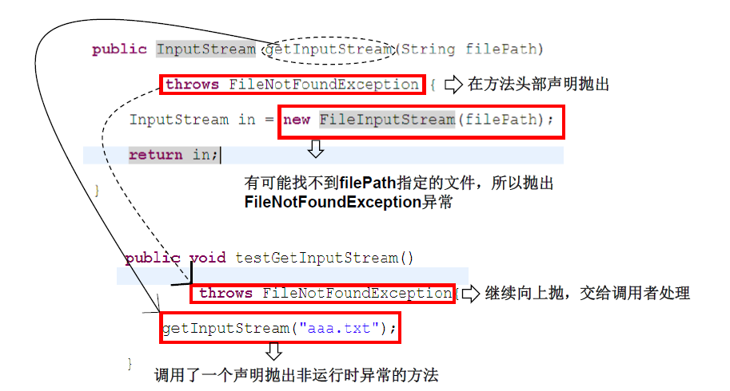


```java
package com.atguigu.java1;

import java.io.File;
import java.io.FileInputStream;
import java.io.FileNotFoundException;
import java.io.IOException;

/*
 * 异常处理的方式二：throws + 异常类型
 * 
 * 1. "throws + 异常类型"写在方法的声明处。指明此方法执行时，可能会抛出的异常类型。
 *     一旦当方法体执行时，出现异常，仍会在异常代码处生成一个异常类的对象，此对象满足throws后异常
 *     类型时，就会被抛出。异常代码后续的代码，就不再执行！
 *     
 * 2. 体会：try-catch-finally:真正的将异常给处理掉了。
 *        throws的方式只是将异常抛给了方法的调用者。  并没有真正将异常处理掉。  
 * 
 * 3. 开发中如何选择使用try-catch-finally 还是使用throws？
 *   3.1 如果父类中被重写的方法没有throws方式处理异常，则子类重写的方法也不能使用throws，意味着如果
 *       子类重写的方法中有异常，必须使用try-catch-finally方式处理。
 *   3.2 执行的方法a中，先后又调用了另外的几个方法，这几个方法是递进关系执行的。我们建议这几个方法使用throws
 *       的方式进行处理。而执行的方法a可以考虑使用try-catch-finally方式进行处理。
 * 
 */
public class ExceptionTest2 {
	
	
	public static void main(String[] args){
		try{
			method2();
			
		}catch(IOException e){
			e.printStackTrace();
		}
		
//		method3();
		
	}
	
	
	public static void method3(){
		try {
			method2();
		} catch (IOException e) {
			e.printStackTrace();
		}
	}
	
	
	public static void method2() throws IOException{
		method1();
	}
	
	
	public static void method1() throws FileNotFoundException,IOException{
		File file = new File("hello1.txt");
		FileInputStream fis = new FileInputStream(file);
		
		int data = fis.read();
		while(data != -1){
			System.out.print((char)data);
			data = fis.read();
		}
		
		fis.close();
		
		System.out.println("hahaha!");
	}
	
	
}
```

> 子类重写的方法抛出的异常类型不大于父类被重写的方法抛出的异常类型

```java
package com.atguigu.java1;

import java.io.FileNotFoundException;
import java.io.IOException;

/*
 * 方法重写的规则之一：
 * 子类重写的方法抛出的异常类型不大于父类被重写的方法抛出的异常类型
 */
public class OverrideTest {
	
	public static void main(String[] args) {
		OverrideTest test = new OverrideTest();
		test.display(new SubClass());
	}

	
	public void display(SuperClass s){
		try {
			s.method();
		} catch (IOException e) {
			e.printStackTrace();
		}
	}
}

class SuperClass{
	public void method() throws IOException{}
}

class SubClass extends SuperClass{
	public void method()throws FileNotFoundException{}
}

```


## 8.5. 手动抛出异常：throw


```java
package com.atguigu.java2;

public class StudentTest {
	
	public static void main(String[] args) {
		try {
			Student s = new Student();
			s.regist(-1001);
			System.out.println(s);
		} catch (Exception e) {
//			e.printStackTrace();
			System.out.println(e.getMessage());
		}
	}
}

class Student{
	
	private int id;
	
	public void regist(int id) throws Exception {
		if(id > 0){
			this.id = id;
		}else{
//			System.out.println("您输入的数据非法！");
			//手动抛出异常对象
//			throw new RuntimeException("您输入的数据非法！");
//			throw new Exception("您输入的数据非法！");
			throw new MyException("不能输入负数");
			//错误的
//			throw new String("不能输入负数");
		}
		
	}

	@Override
	public String toString() {		return "Student [id=" + id + "]";	}
	
}
```

## 8.6. 用户自定义异常类


```java
package com.atguigu.java2;
/*
 * 如何自定义异常类？
 * 1. 继承于现有的异常结构：RuntimeException 、Exception
 * 2. 提供全局常量：serialVersionUID
 * 3. 提供重载的构造器
 * 
 */
public class MyException extends Exception{
	
	static final long serialVersionUID = -7034897193246939L;
	
	public MyException(){
		
	}
	
	public MyException(String msg){
		super(msg);
	}
}

```


## 8.7. 异常五个关键字总结


# 9. eclipse

## 9.1. 快捷键

```java
/**
*	1.补全代码的声明：alt + /
*	2.快速修复: ctrl + 1
*
*	3.批量导包：ctrl + shift + o(自动导包)
*	4.使用单行注释：ctrl + /
*	5.使用多行注释： ctrl + shift + /
*	6.取消多行注释：ctrl + shift + \
*
*	7.复制指定行的代码：ctrl + alt + down 或 ctrl + alt + up
*	8.删除指定行的代码：ctrl + d
*	9.上下移动代码：alt + up  或 alt + down
*	10.切换到下一行代码空位：shift + enter
*	11.切换到上一行代码空位：ctrl + shift + enter
*
*	12.如何查看源码：ctrl + 选中指定的结构 或  ctrl + shift + t 
*	13.退回到前一个编辑的页面：alt + left
*	14.进入到下一个编辑的页面(针对于上面那条来说的)：alt + right
*	15.光标选中指定的类，查看继承树结构：ctrl + t
*
*	16.复制代码： ctrl + c
*	17.撤销： ctrl + z
*	18.反撤销： ctrl + y
*	19.剪切：ctrl + x
*	20.粘贴：ctrl + v
*	21.保存： ctrl + s
*	22.全选：ctrl + a
*
*	23.格式化代码： ctrl + shift + f
*	24.选中数行，整体往后移动：tab
*	25.选中数行，整体往前移动：shift + tab
*	26.在当前类中，显示类结构，并支持搜索指定的方法、属性等：ctrl + o
*	27.批量修改指定的变量名、方法名、类名等：alt + shift + r
*	28.选中的结构的大小写的切换：变成大写： ctrl + shift + x
*	29.选中的结构的大小写的切换：变成小写：ctrl + shift + y
*	30.调出生成 getter/setter/构造器等结构： alt + shift + s
*	31.显示当前选择资源(工程 or 文件)的属性：alt + enter
*	32.快速查找：参照选中的 Word 快速定位到下一个 ：ctrl + k
*
*	33.关闭当前窗口：ctrl + w
*	34.关闭所有的窗口：ctrl + shift + w
*	35.查看指定的结构使用过的地方：ctrl + alt + g
*	36.查找与替换：ctrl + f
*	37.最大化当前的 View：ctrl + m
*	38.直接定位到当前行的首位：home
*	39.直接定位到当前行的末位：end
*/
```

debug

| 操作                  | 作用                                                         |
| --------------------- | ------------------------------------------------------------ |
| step into跳入（f5）   | 进入当前行所调用的方法中                                     |
| step over跳过（f6）   | 执行完当前行的语句，进入下一行                               |
| step return跳回（f7） | 执行完当前行所在的方法，进入下一行                           |
| drop to frame         | 回到当前行所在方法的第一行                                   |
| resume                | 恢复执行完当前行所在断点的所有代码，进入下一个断点，如果没有就结束 |
| Terminate             | 终止停止JVM，后面的程序不会再执行                            |


​	

​	

