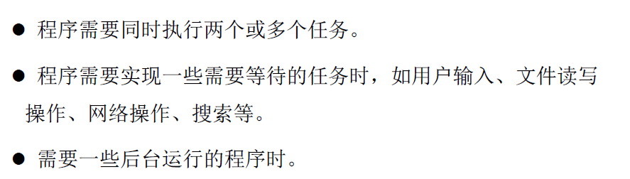
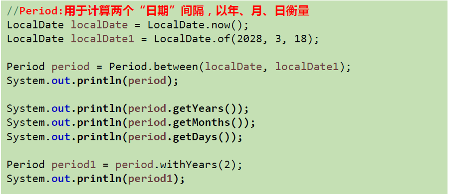
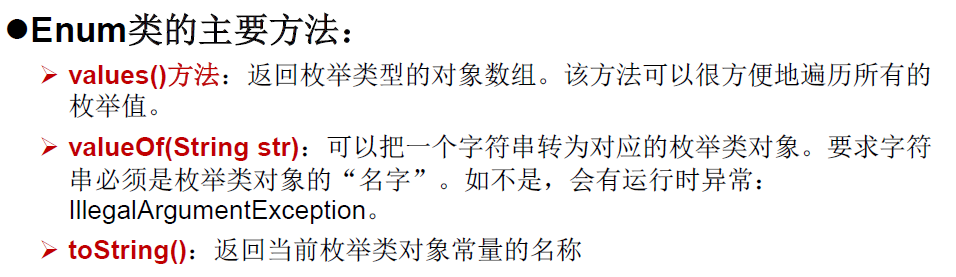
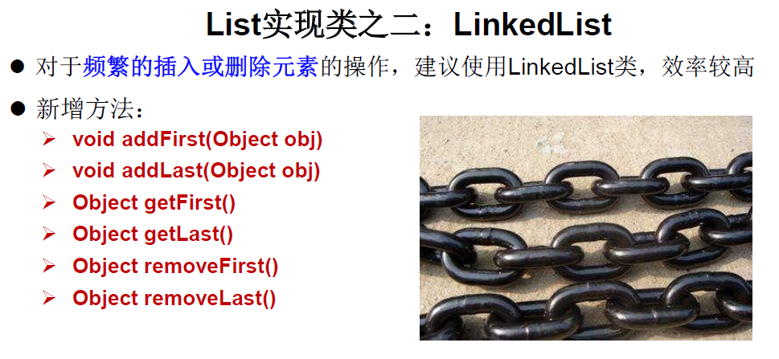
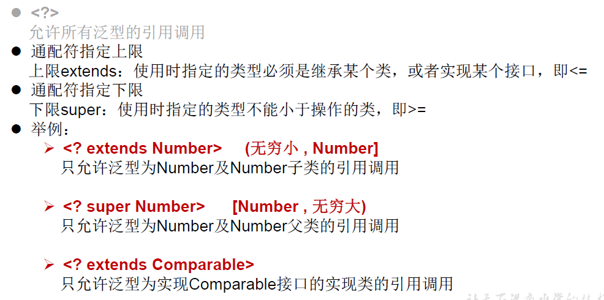
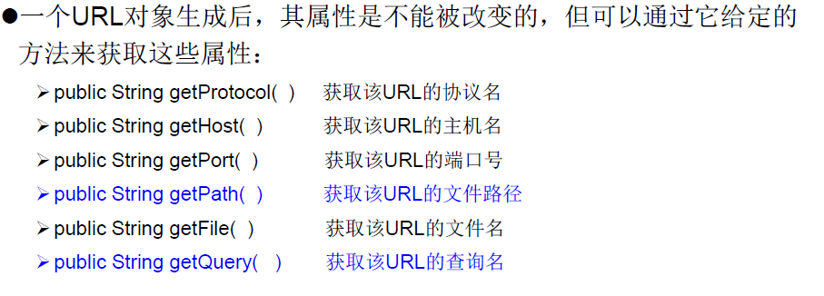
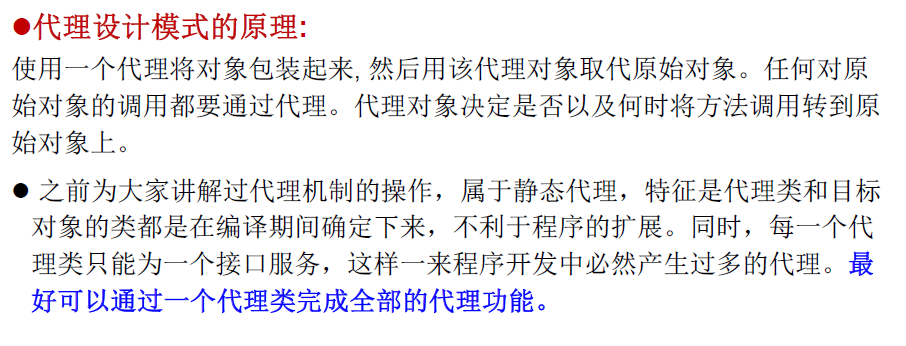
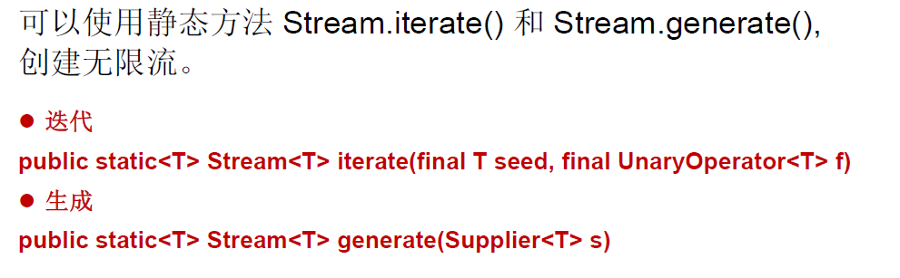
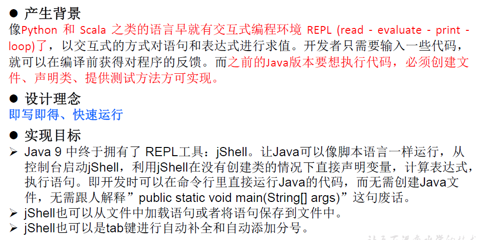
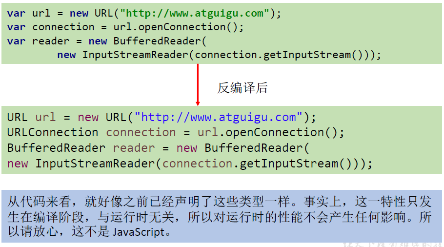

# 1. 多线程

## 1.1. 基本概念：程序、进程、线程


使用多线程的优点


何时需要多线程



## 1.2. 线程的创建和使用

### 1.2.1. 线程的创建和启动


#### 1.2.1.1. 方式一：继承Thread类的方式


```java
package com.atguigu.java;
/**
 * 多线程的创建，方式一：
 * 1.创建一个继承于Thread类的子类
 * 2.重写Thread类的run()
 * 3.创建Thread类的子类的对象
 * 4·通过此对象调用start()
 */
public class ThreadTest {
    public static void main(String[] args) {
        //3.创建Thread类的子类的对象
        MyThread myThread = new MyThread();
        //4·通过此对象调用start()：①启动当前当前线程 ②调用当前线程的run()方法
        myThread.start();
        //问题一：我们不能通过直接调用run()方法的方式启动线程
//        myThread.run();

        //问题二：再启动一个线程，遍历100以内的偶数，不可以还让已经start()的线程去执行，会报IllegalThreadStateException
        //if (threadStatus != 0)//如果线程的状态不是0（not yet started尚未启动）
        //            throw new IllegalThreadStateException();
        //myThread.start();
        new MyThread().start();

        //如下操作仍然是在main线程中执行的
        for (int i = 0; i < 100; i++) {
            System.out.println(Thread.currentThread().getName()+":"+"ThreadTest.main");

        }

        //创建Thread类的匿名子类的方式
        new Thread(){
            @Override
            public void run() {
                for (int i = 0; i < 100; i++) {
                    if (i % 2 == 1){
                        System.out.println(Thread.currentThread().getName()+":"+i);
                    }

                }
            }
        }.start();
    }
}

//1.创建一个继承于Thread类的子类
class MyThread extends Thread{
    //2.重写Thread类的run()
    @Override
    public void run() {
        //例子：遍历100以内的所有的偶数
        for (int i = 0; i < 100; i++) {
            if (i % 2 == 0){
                System.out.println(Thread.currentThread().getName()+":"+ i);
            }

        }
    }
}
```

#### 1.2.1.2. 方式二：实现Runnable接口


```java
package atguigu.java;

/**
 * 创建多线程的方式二：实现Runnable接口
 * 1. 创建一个实现了Runnable接口的类
 * 2. 实现类去实现Runnable中的抽象方法：run()
 * 3. 创建实现类的对象
 * 4. 将此对象作为参数传递到Thread类的构造器中，创建Thread类的对象
 * 5. 通过Thread类的对象调用start()
 *
 *
 * 比较创建线程的两种方式。
 * 开发中：优先选择：实现Runnable接口的方式
 * 原因：1. 实现的方式没有类的单继承性的局限性
 *      2. 实现的方式更适合来处理多个线程有共享数据的情况。
 *
 * 联系：public class Thread implements Runnable
 * 相同点：两种方式都需要重写run(),将线程要执行的逻辑声明在run()中。
 *
 */
//1. 创建一个实现了Runnable接口的类
class MThread implements Runnable{

    //2. 实现类去实现Runnable中的抽象方法：run()
    @Override
    public void run() {
        for (int i = 0; i < 100; i++) {
            if(i % 2 == 0){
                System.out.println(Thread.currentThread().getName() + ":" + i);
            }

        }
    }
}


public class ThreadTest1 {
    public static void main(String[] args) {
        //3. 创建实现类的对象
        MThread mThread = new MThread();
        //4. 将此对象作为参数传递到Thread类的构造器中，创建Thread类的对象
        Thread t1 = new Thread(mThread);
        t1.setName("线程1");
        //5. 通过Thread类的对象调用start():① 启动线程 ②调用当前线程的run()-->调用了Runnable类型的target的run()
        t1.start();

        //再启动一个线程，遍历100以内的偶数
        Thread t2 = new Thread(mThread);
        t2.setName("线程2");
        t2.start();
    }

}

```

> Thread中run源码

```java
/* What will be run. */
private Runnable target;   
...
@Override
    public void run() {
        if (target != null) {
            target.run();
        }
    }
```


### 1.2.2. Thread类

#### 1.2.2.1. 构造器


#### 1.2.2.2. 常用方法


线程调度


线程的优先级


线程分类


```java
package atguigu.java;

/**
 * 测试Thread中的常用方法：
 * 1. start():启动当前线程；调用当前线程的run()
 * 2. run(): 通常需要重写Thread类中的此方法，将创建的线程要执行的操作声明在此方法中
 * 3. currentThread():静态方法，返回执行当前代码的线程
 * 4. getName():获取当前线程的名字
 * 5. setName():设置当前线程的名字
 * 6. yield():释放当前cpu的执行权
 * 7. join():在线程a中调用线程b的join(),此时线程a就进入阻塞状态，直到线程b完全执行完以后，线程a才
 *           结束阻塞状态。
 * 8. stop():已过时。当执行此方法时，强制结束当前线程。
 * 9. sleep(long millitime):让当前线程“睡眠”指定的millitime毫秒。在指定的millitime毫秒时间内，当前
 *                          线程是阻塞状态。
 * 10. isAlive():判断当前线程是否存活
 *
 *
 * 线程的优先级：
 * 1.
 * MAX_PRIORITY：10
 * MIN _PRIORITY：1
 * NORM_PRIORITY：5  -->默认优先级
 * 2.如何获取和设置当前线程的优先级：
 *   getPriority():获取线程的优先级
 *   setPriority(int p):设置线程的优先级
 *
 *   说明：高优先级的线程要抢占低优先级线程cpu的执行权。但是只是从概率上讲，高优先级的线程高概率的情况下
 *   被执行。并不意味着只有当高优先级的线程执行完以后，低优先级的线程才执行。
 *
 *
 */
class HelloThread extends Thread{
    @Override
    public void run() {
        for (int i = 0; i < 100; i++) {
            if(i % 2 == 0){
//此处只能try-catch，因为子类重写的方法抛出的异常必须不大于父类的
//                try {
//                    sleep(10);
//                } catch (InterruptedException e) {
//                    e.printStackTrace();
//                }

                System.out.println(Thread.currentThread().getName() + ":" + Thread.currentThread().getPriority() + ":" + i);
            }

//            if(i % 20 == 0){
//                yield();//释放当前cpu的执行权
//            }

        }

    }
    //通过构造器命名
    public HelloThread(String name){
        super(name);
    }
}


public class ThreadMethodTest {
    public static void main(String[] args) {

        HelloThread h1 = new HelloThread("Thread：1");

//        h1.setName("线程一");
        //设置分线程的优先级
        h1.setPriority(Thread.MAX_PRIORITY);

        h1.start();

        //给主线程命名
        Thread.currentThread().setName("主线程");
        Thread.currentThread().setPriority(Thread.MIN_PRIORITY);

        for (int i = 0; i < 100; i++) {
            if(i % 2 == 0){
                System.out.println(Thread.currentThread().getName() + ":" + Thread.currentThread().getPriority() + ":" + i);
            }

//            if(i == 20){
//                try {
//                    h1.join();
//                } catch (InterruptedException e) {
//                    e.printStackTrace();
//                }
//            }

        }

//        System.out.println(h1.isAlive());

    }
}
```


举例：存在线程安全问题

> 继承Thread

```java
package atguigu.java;

/**
 *
 * 例子：创建三个窗口卖票，总票数为100张.使用继承Thread类的方式
 *
 * 存在线程的安全问题，待解决。
 *
 */
class Window extends Thread{


    private static int ticket = 100;
    @Override
    public void run() {

        while(true){

            if(ticket > 0){
                System.out.println(getName() + "：卖票，票号为：" + ticket);
                ticket--;
            }else{
                break;
            }

        }

    }
}


public class WindowTest {
    public static void main(String[] args) {
        Window t1 = new Window();
        Window t2 = new Window();
        Window t3 = new Window();


        t1.setName("窗口1");
        t2.setName("窗口2");
        t3.setName("窗口3");

        t1.start();
        t2.start();
        t3.start();

    }
}

```

> 实现Runnable接口

```java
package atguigu.java;

/**
 * 例子：创建三个窗口卖票，总票数为100张.使用实现Runnable接口的方式
 * 存在线程的安全问题，待解决。
 *
 */
class Window1 implements Runnable{

    private int ticket = 100;

    @Override
    public void run() {
        while(true){
            if(ticket > 0){
                System.out.println(Thread.currentThread().getName() + ":卖票，票号为：" + ticket);
                ticket--;
            }else{
                break;
            }
        }
    }
}


public class WindowTest1 {
    public static void main(String[] args) {
        Window1 w = new Window1();

        Thread t1 = new Thread(w);
        Thread t2 = new Thread(w);
        Thread t3 = new Thread(w);

        t1.setName("窗口1");
        t2.setName("窗口2");
        t3.setName("窗口3");

        t1.start();
        t2.start();
        t3.start();
    }

}

```


## 1.3. 线程的生命周期


说明：
1.生命周期关注两个概念：状态、相应的方法
2.关注：状态a-->状态b:哪些方法执行了（回调方法）
        某个方法主动调用：状态a-->状态b
3.阻塞：临时状态，不可以作为最终状态
  死亡：最终状态。

## 1.4. 线程的同步

### 1.4.1. 线程安全问题

2.	问题的原因：
`当多条语句在操作同一个线程共享数据`时，一个线程对多条语句只执行了一部分，还没有执行完，另一个线程参与进来执行。导致共享数据的错误。
3.	解决办法：
对多条操作共享数据的语句，只能让一个线程都执行完，在执行过程中，其他线程不可以参与执行。

### 1.4.2. Synchronized的使用方法


同步代码块

```java
package com.atguigu.java;

/**
 * 例子：创建三个窗口卖票，总票数为100张.使用实现Runnable接口的方式
 * 1.问题：卖票过程中，出现了重票、错票 -->出现了线程的安全问题
 * 2.问题出现的原因：当某个线程操作车票的过程中，尚未操作完成时，其他线程参与进来，也操作车票。
 * 3.如何解决：当一个线程a在操作ticket的时候，其他线程不能参与进来。直到线程a操作完ticket时，其他
 *            线程才可以开始操作ticket。这种情况即使线程a出现了阻塞，也不能被改变。
 * 4.在Java中，我们通过同步机制，来解决线程的安全问题。
 *  方式一：同步代码块
 *   synchronized(同步监视器){
 *      //需要被同步的代码
 *   }
 *  说明：1.操作共享数据的代码，即为需要被同步的代码。  -->不能包含代码多了，也不能包含代码少了。
 *       2.共享数据：多个线程共同操作的变量。比如：ticket就是共享数据。
 *       3.同步监视器(Monitor)，俗称：锁。任何一个类的对象，都可以充当锁。
 *          要求：多个线程必须要共用同一把锁。
 *       补充：在实现Runnable接口创建多线程的方式中，我们可以考虑使用this充当同步监视器。
 *            在继承Thread类创建多线程的方式中，慎用this充当同步监视器。可以考虑使用 当前类.class
 *  方式二：同步方法。
 *     如果操作共享数据的代码完整的声明在一个方法中，我们不妨将此方法声明同步的。
 *  5.同步的方式，解决了线程的安全问题。---好处
 *    操作同步代码时，只能有一个线程参与，其他线程等待。相当于是一个单线程的过程，效率低。 ---局限性
 */
public class Windows {
    public static void main(String[] args) {
        Window window = new Window();
        new Thread(window, "1号").start();
        new Thread(window, "2号").start();
        new Thread(window, "3号").start();

    }
}

class Window implements Runnable {
    int ticket = 100;

    @Override
    public void run() {
        while (true) {
            if (ticket > 0) {
                try {
                    Thread.sleep(100);
                } catch (InterruptedException e) {
                    e.printStackTrace();
                }
                System.out.println(Thread.currentThread().getName() + ":" + ticket--);
            } else {
                break;
            }
        }
    }
}
```

同步方法

```java
package com.atguigu.java;

/**
 * 使用同步方法处理继承Thread类的方式中的线程安全问题
 * 
 *  关于同步方法的总结：
 *  1. 同步方法仍然涉及到同步监视器，只是不需要我们显式的声明。
 *  2. 非静态的同步方法，同步监视器是：this
 *     静态的同步方法，同步监视器是：当前类.class
 */
class Window4 extends Thread {

    private static int ticket = 100;

    @Override
    public void run() {

        while (true) {

            show();
        }

    }

    //非静态方法的同步监视器：this
    //静态方法的同步监视器：类.class
    private static synchronized void show(){//同步监视器：Window4.class
        //private synchronized void show(){ //同步监视器：t1,t2,t3。此种解决方式是错误的
        if (ticket > 0) {

            try {
                Thread.sleep(100);
            } catch (InterruptedException e) {
                e.printStackTrace();
            }

            System.out.println(Thread.currentThread().getName() + "：卖票，票号为：" + ticket);
            ticket--;
        }
    }
}


public class WindowTest4 {
    public static void main(String[] args) {
        Window4 t1 = new Window4();
        Window4 t2 = new Window4();
        Window4 t3 = new Window4();


        t1.setName("窗口1");
        t2.setName("窗口2");
        t3.setName("窗口3");

        t1.start();
        t2.start();
        t3.start();

    }
}
```


**同步锁机制** 

+ 同步机制中的锁
  在《Thinking in Java》中，是这么说的：`对于并发工作，你需要某种方式来防止两个任务访问相同的资源（其实就是共享资源竞争）`。防止这种冲突的方法就是当资源被一个任务使用时，在其上加锁。第一个访问某项资源的任务必须锁定这项资源，使其他任务在其被解锁之前，就无法访问它了，而在其被解锁之时，另一个任务就可以锁定并使用它了。
+ synchronized的锁是什么？
  + **任意对象都可以作为同步锁。所有对象都自动含有单一的锁（监视器）**。
  + **`同步方法`的锁：`静态方法（类名.class）`、`非静态方法（this）`**
  + **`同步代码块`：自己指定，很多时候也是指定为this或类名.class**
+ 注意：
  + **必须确保使用同一个资源的多个线程共用`一把锁(ps:继承Thread 创建线程对象时注意使用同一把锁)`**，这个非常重要，否则就无法保证共享资源的安全
  
  + **一个线程类中的所有静态方法共用同一把锁（类名.class ps：类只会加载一次）**，**所有非静态方法共用同一把锁（this）**，同步代码块（指定需谨慎）
  
    


**同步的范围**

1、如何找问题，即代码是否存在线程安全？（非常重要）
	（1）明确哪些代码是多线程运行的代码
	（2）明确多个线程是否有共享数据
（	3）明确多线程运行代码中是否有多条语句操作共享数据

2、如何解决呢？（非常重要）
对多条操作共享数据的语句，只能让一个线程都执行完，在执行过程中，其也线程不可以参与执行。
即所有操作共享数据的这些语句都要放在同步范围中

3、切记：

​	范围太小：没锁住所有有安全问题的代码

​	范围太大：没发挥多线程的功能。

**释放锁的操作**

+ 当前线程的同步方法、同步代码块执行结束。
+ 当前线程在同步代码块、同步方法中遇到break，return终止了该代码块、该方法的继续执行。
+ 当前线程在同步代码块、同步方法中出现了未处理的Error或Exception，导致异常结束。
+ 当前线程在同步代码块、同步方法中执行了线程对象的wait（）方法，当前线程暂停，并释放锁。

**不会释放锁的操作**

+ 线程执行同步代码块或同步方法时，程序调用**Thread.sleep（）**
  **Thread.yield（）**方法暂停当前线程的执行
+ 线程执行同步代码块时，**其他线程调用了该线程的suspend（）方法将该线程挂起，该线程不会释放锁（同步监视器）**。
  - 应尽量避免使用suspend（）和resume（）来控制线程 


### 1.4.3. 线程安全的懒汉式

```java
package com.atguigu.java;

public class SingletonTest {
    public static void main(String[] args) {
        Single instance = Single.getInstance();
        Single instance1 = Single.getInstance();
    }
}

class Single {

    private static Single instance;
    private Single(){}

    public static Single getInstance(){

     //方式一：性能稍差
//            synchronized (Single.class){
//                if (instance ==null){
//                    instance = new Single();
//                }
//            }

       //方式二：
        if (instance == null){
            synchronized (Single.class){
                if (instance ==null){
                    instance = new Single();
                }
            }
        }
        return instance;
    }
}
```

### 1.4.4. 死锁

+ 死锁
  + 不同的线程分别占用对方需要的同步资源不放弃，都在等待对方放弃自己需要的同步资源，就形成了线程的死锁
  + 出现死锁后，不会出现异常，不会出现提示，只是所有的线程都处于阻塞状态，无法继续

+ 解决方法
  + 专门的算法、原则
  + 尽量减少同步资源的定义
  + 尽量避免 套同步

```java
package com.atguigu.java1;

/**
 * 1·死锁的理解：不同的线程分别占用对方需要的同步资源不放弃，
 * 都在等待对方放弃自己需要的同步资源，就形成了线程的死锁
 *2.说明：
 * 1）出现死锁后，不会出现异常，不会出现提示，只是所有的线程都处于阻塞状态，无法继续
 * 2）我们使用同步时，要避免出现死锁。
 *
 */
public class ThreadTest {
    public static void main(String[] args) {
        StringBuilder s1 = new StringBuilder();
        StringBuilder s2 = new StringBuilder();

        new Thread() {
            @Override
            public void run() {
                synchronized (s1) {
                    s1.append('a');
                    s2.append("1");
                    try {
                        Thread.sleep(100);
                    } catch (InterruptedException e) {
                        e.printStackTrace();
                    }

                    synchronized (s2) {
                        s1.append('b');
                        s2.append("2");
                    }
                }
                System.out.println(s1);
                System.out.println(s2);

            }
        }.start();
        new Thread(() -> {
            synchronized (s2) {
                s1.append('c');
                s2.append("3");
                try {
                    Thread.sleep(100);
                } catch (InterruptedException e) {
                    e.printStackTrace();
                }
                synchronized (s1) {
                    s1.append('d');
                    s2.append("4");
                }
            }
            System.out.println(s1);
            System.out.println(s2);
        }).start();

    }

}
```

### 1.4.5. Lock锁


```java
package com.atguigu.java1;

import java.util.concurrent.locks.ReentrantLock;

/**
 * 解决线程安全问题的方式三：Lock锁  --- JDK5.0新增
 *
 * 1. 面试题：synchronized 与 Lock的异同？
 *   相同：二者都可以解决线程安全问题
 *   不同：synchronized机制在执行完相应的同步代码以后，自动的释放同步监视器
 *        Lock需要手动的启动同步（lock()），同时结束同步也需要手动的实现（unlock()）
 *
 * 2.优先使用顺序：
 * Lock  同步代码块（已经进入了方法体，分配了相应资源）  同步方法（在方法体之外）
 *
 *
 *  面试题：如何解决线程安全问题？有几种方式
 * @author shkstart
 * @create 2019-02-15 下午 3:38
 */
class Window implements Runnable{

    private int ticket = 100;
    //1.实例化ReentrantLock
    private ReentrantLock lock = new ReentrantLock();

    @Override
    public void run() {
        while(true){
            try{

                //2.调用锁定方法lock()
                lock.lock();

                if(ticket > 0){

                    try {
                        Thread.sleep(100);
                    } catch (InterruptedException e) {
                        e.printStackTrace();
                    }

                    System.out.println(Thread.currentThread().getName() + "：售票，票号为：" + ticket);
                    ticket--;
                }else{
                    break;
                }
            }finally {
                //3.调用解锁方法：unlock()
                lock.unlock();
            }

        }
    }
}

public class LockTest {
    public static void main(String[] args) {
        Window w = new Window();

        Thread t1 = new Thread(w);
        Thread t2 = new Thread(w);
        Thread t3 = new Thread(w);

        t1.setName("窗口1");
        t2.setName("窗口2");
        t3.setName("窗口3");

        t1.start();
        t2.start();
        t3.start();
    }
}

```

### 1.4.6. synchronized与Lock的对比

1. Lock是显式锁（手动开启和关闭锁，别忘记关闭锁），synchronized是隐式锁，出了作用域自动释放

2. Lock只有代码块锁，synchronized有代码块锁和方法锁

3. 使用Lock锁，JVM将花费较少的时间来调度线程，性能更好。并且具有更好的扩展性（提供更多的子类）

   

优先使用顺序：Lock >同步代码块（已经进入了方法体，分配了相应资源）同步方法（在方法体之外）

## 1.5. 线程的通信

+ `wait()与notify()和notifyA()`
  + wait( )：**令当前线程挂起并放弃CPU、同步资源并等待，使别的线程可访问并修改共享资源**，而当前线程排队等候其他线程调用notify( )或notifyAll( )方法唤醒，唤醒后等待重新获得对监视器的所有权后才能继续执行。
  + notifyl（）：唤醒正在排队等待同步资源的线程中优先级最高者结束等待(`通过锁对象唤醒`)
  + notifyAll（）：唤醒正在排队等待资源的所有线程结束等待(`通过锁对象唤醒`)
+ 这`三个方法只有在synchronized方法或synchronized代码块中才能使用，否则会报java.lang.llegalMonitorStateException异常`。
+ 因为`这三个方法必须由锁对象调用(this或者显式声明的锁对象)`，`而任意对象都可以作为synchronized的同步锁`，因此这三个方法只能在Object类中声明。


> wait（）方法

+ 在当前线程中调用方法：`对象名.wait()`
+ 使当前线程进入等待（某对象）状态，直到另一线程对该对象发出notify（或notifyAll）为止。
+ 调用方法的必要条件：当前线程必须具有对该对象的监控权（加锁）
+ 调用此方法后，当前线程将`释放对象监控权，然后进入等待`
+ 在当前线程被notify后，要重新获得监控权，然后从断点处继续代码的执行。

> notify（）/notifyAll（）

+ 在当前线程中调用方法：`对象名.notify（）`

+ 功能：唤醒等待该对象监控权的一个/所有线程。

  调用方法的必要条件：当前线程必须具有对该对象的监控权（加锁）


```java
/**
 * 线程通信的例子：使用两个线程打印 1-100。线程1, 线程2 交替打印
 *
 * 涉及到的三个方法：
 * wait():一旦执行此方法，当前线程就进入阻塞状态，并释放同步监视器。
 * notify():一旦执行此方法，就会唤醒被wait的一个线程。如果有多个线程被wait，就唤醒优先级高的那个。
 * notifyAll():一旦执行此方法，就会唤醒所有被wait的线程。
 *
 * 说明：
 * 1.wait()，notify()，notifyAll()三个方法必须使用在同步代码块或同步方法中。
 * 2.wait()，notify()，notifyAll()三个方法的调用者必须是同步代码块或同步方法中的同步监视器(即锁对象)。
 *    否则，会出现IllegalMonitorStateException异常
 * 3.wait()，notify()，notifyAll()三个方法是定义在java.lang.Object类中。
 *
 * 面试题：sleep() 和 wait()的异同？
 * 1.相同点：一旦执行方法，都可以使得当前的线程进入阻塞状态。
 * 2.不同点：1）两个方法声明的位置不同：Thread类中声明sleep() , Object类中声明wait()
 *          2）调用的要求不同：sleep()可以在任何需要的场景下调用。 wait()/notify/notifyAll必须使用在同步代码块或同步方法中
 *          3）关于是否释放同步监视器：如果两个方法都使用在同步代码块或同步方法中，sleep()不会释放锁，wait()会释放锁。
 *
 */
public class Conn {
    public static void main(String[] args) {
        Printer printer = new Printer();
        new Thread(printer, "No.1").start();
        new Thread(printer, "No.2").start();
    }
}

class Printer implements Runnable {
    private int i = 0;
    private Object obj = new Object();

    @Override
    public void run() {
        //synchronized (this) {
        synchronized (obj) {
            while (i <= 100) {
               // this.notify();
                obj.notify();//唤醒一个需要获取当前obj锁的线程
                System.out.println(Thread.currentThread().getName() + ":" + i++);
                try {
                    //使得调用如下wait()方法的线程进入阻塞状态，会释放锁
                    //阻塞之后的代码需要下次唤醒之后从该处继续执行
//                    this.wait();
                    obj.wait();
                } catch (InterruptedException e) {
                    e.printStackTrace();
                }

            }
        }
    }
}
```

生产者消费者模型

```java
package com.atguigu.java2;

/**
 * 线程通信的应用：经典例题：生产者/消费者问题
 *
 * 生产者(Productor)将产品交给店员(Clerk)，而消费者(Customer)从店员处取走产品，
 * 店员一次只能持有固定数量的产品(比如:20），如果生产者试图生产更多的产品，店员
 * 会叫生产者停一下，如果店中有空位放产品了再通知生产者继续生产；如果店中没有产品
 * 了，店员会告诉消费者等一下，如果店中有产品了再通知消费者来取走产品。
 *
 * 分析：
 * 1. 是否是多线程问题？是，生产者线程，消费者线程
 * 2. 是否有共享数据？是，店员（或产品）
 * 3. 如何解决线程的安全问题？同步机制,有三种方法
 * 4. 是否涉及线程的通信？是
 *
 */
class Clerk{

    private int productCount = 0;
    //生产产品
    public synchronized void produceProduct() {

        if(productCount < 20){
            productCount++;
            System.out.println(Thread.currentThread().getName() + ":开始生产第" + productCount + "个产品");

            notify();

        }else{
            //等待
            try {
                wait();
            } catch (InterruptedException e) {
                e.printStackTrace();
            }
        }

    }
    //消费产品
    public synchronized void consumeProduct() {
        if(productCount > 0){
            System.out.println(Thread.currentThread().getName() + ":开始消费第" + productCount + "个产品");
            productCount--;

            notify();
        }else{
            //等待
            try {
                wait();
            } catch (InterruptedException e) {
                e.printStackTrace();
            }
        }

    }
}

class Producer extends Thread{//生产者

    private Clerk clerk;

    public Producer(Clerk clerk) {
        this.clerk = clerk;
    }

    @Override
    public void run() {
        System.out.println(getName() + ":开始生产产品.....");

        while(true){

            try {
                Thread.sleep(10);
            } catch (InterruptedException e) {
                e.printStackTrace();
            }

            clerk.produceProduct();
        }

    }
}

class Consumer extends Thread{//消费者
    private Clerk clerk;

    public Consumer(Clerk clerk) {
        this.clerk = clerk;
    }

    @Override
    public void run() {
        System.out.println(getName() + ":开始消费产品.....");

        while(true){

            try {
                Thread.sleep(20);
            } catch (InterruptedException e) {
                e.printStackTrace();
            }

            clerk.consumeProduct();
        }
    }
}

public class ProductTest {

    public static void main(String[] args) {
        Clerk clerk = new Clerk();

        Producer p1 = new Producer(clerk);
        p1.setName("生产者1");

        Consumer c1 = new Consumer(clerk);
        c1.setName("消费者1");
        Consumer c2 = new Consumer(clerk);
        c2.setName("消费者2");

        p1.start();
        c1.start();
        c2.start();

    }
}

```

## 1.6. JDK5.0新增线程创建方式

### 1.6.1. 创建多线程的方式三：实现Callable接口

+ 与使用Runnable相比，Callable功能更强大些
  	+ 相比run（）方法，可以有返回值
  	+ 方法可以抛出异常
  	+ 支持泛型的返回值
  	+ 需要借助FutureTask类，比如获取返回结果get()
+ Future接口
  + 可以对具体Runnable，Callable任务的执行结果进行取消、查询是否完成、获取结果等。
  + `FutrueTask是Futrue接口的唯一的实现类`
  + `FutureTask同时实现了Runnable，Future接口`。它既可以作为Runnable被线程执行，又可以作为Future得到Callable的返回值

```java
package com.atguigu.java2;

import java.util.concurrent.Callable;
import java.util.concurrent.ExecutionException;
import java.util.concurrent.FutureTask;

/**
 * 创建线程的方式三：实现Callable接口。 --- JDK 5.0新增
 *
 *
 * 如何理解实现Callable接口的方式创建多线程比实现Runnable接口创建多线程方式强大？
 * 1. call()可以有返回值的。
 * 2. call()可以抛出异常，被外面的操作捕获，获取异常的信息
 * 3. Callable是支持泛型的
 *
 */
//1.创建一个实现Callable的实现类
class NumThread implements Callable{
    //2.实现call方法，将此线程需要执行的操作声明在call()中
    @Override
    public Object call() throws Exception {
        int sum = 0;
        for (int i = 1; i <= 100; i++) {
            if(i % 2 == 0){
                System.out.println(i);
                sum += i;
            }
        }
        return sum;
    }
}


public class ThreadNew {
    public static void main(String[] args) {
        //3.创建Callable接口实现类的对象
        NumThread numThread = new NumThread();
        //4.将此Callable接口实现类的对象作为传递到FutureTask构造器中，创建FutureTask的对象
        FutureTask futureTask = new FutureTask(numThread);
        //5.将FutureTask的对象作为参数传递到Thread类的构造器中，创建Thread对象，并调用start()
        new Thread(futureTask).start();

        try {
            //6.获取Callable中call方法的返回值
            //get()返回值即为FutureTask构造器参数Callable实现类重写的call()的返回值。
            Object sum = futureTask.get();
            System.out.println("总和为：" + sum);
        } catch (InterruptedException e) {
            e.printStackTrace();
        } catch (ExecutionException e) {
            e.printStackTrace();
        }
    }

}
```

### 1.6.2. 创建多线程的方式四：使用线程池

+ 背景：经常创建和销毁、使用量特别大的资源，比如并发情况下的线程，对性能影响很大。
+ 思路：提前创建好多个线程，放入线程池中，使用时直接获取，使用完放回池中。可以避免频繁创建销毁、实现重复利用。类似生活中的公共交通工具。
+ 好处：
+ 提高响应速度（减少了创建新线程的时间）
+ 降低资源消耗（重复利用线程池中线程，不需要每次都创建）
+ 便于线程管理
  + corePoolSize：核心池的大小
  + maximumPoolSize：最大线程数
  + keepAliveTime：线程没有任务时最多保持多长时间后会终止
  + …

+  JDK 5.0起提供了线程池相关API：`ExecutorService` 和 `Executors`
+ ExecutorService：真正的线程池接口。常见子类**ThreadPoolExecutor**
  + `void execute(Runnable command)` ：执行任务/命令，没有返回值，**一般用来执行Runnable**
  + `<T> Future<T> submit(Callable<T> task)`：执行任务，有返回值，**一般用来执行Callable**
  + `void shutdown()` ：关闭连接池
+ Executors：工具类、线程池的工厂类，用于创建并返回不同类型的线程池
  + `Executors.newCachedThreadPool()`：创建一个可根据需要创建新线程的线程池
  + `Executors.newFixedThreadPool(n)`; 创建一个可重用固定线程数的线程池
  + `Executors.newSingleThreadExecutor()` ：创建一个只有一个线程的线程池
  + `Executors.newScheduledThreadPool(n)`：创建一个线程池，它可安排在给定延迟后运行命令或者定期地执行。

```java
package com.atguigu.java2;

import java.util.concurrent.ExecutorService;
import java.util.concurrent.Executors;
import java.util.concurrent.ThreadPoolExecutor;

/**
 * 创建线程的方式四：使用线程池
 *
 * 好处：
 * 1.提高响应速度（减少了创建新线程的时间）
 * 2.降低资源消耗（重复利用线程池中线程，不需要每次都创建）
 * 3.便于线程管理
 *      corePoolSize：核心池的大小
 *      maximumPoolSize：最大线程数
 *      keepAliveTime：线程没有任务时最多保持多长时间后会终止
 *
 *
 * 面试题：创建多线程有几种方式？四种！
 */

class NumberThread implements Runnable{

    @Override
    public void run() {
        for(int i = 0;i <= 100;i++){
            if(i % 2 == 0){
                System.out.println(Thread.currentThread().getName() + ": " + i);
            }
        }
    }
}

class NumberThread1 implements Runnable{

    @Override
    public void run() {
        for(int i = 0;i <= 100;i++){
            if(i % 2 != 0){
                System.out.println(Thread.currentThread().getName() + ": " + i);
            }
        }
    }
}

public class ThreadPool {

    public static void main(String[] args) {
        //1. 提供指定线程数量的线程池
        ExecutorService service = Executors.newFixedThreadPool(10);
        ThreadPoolExecutor service1 = (ThreadPoolExecutor) service;
        //设置线程池的属性
//        System.out.println(service.getClass());
//        service1.setCorePoolSize(15);
//        service1.setKeepAliveTime();


        //2.执行指定的线程的操作。需要提供实现Runnable接口或Callable接口实现类的对象
        service.execute(new NumberThread());//适合适用于Runnable
        service.execute(new NumberThread1());//适合适用于Runnable

//        service.submit(Callable callable);//适合使用于Callable
        //3.关闭连接池
        service.shutdown();
    }

}

```

# 2. 常用类

## 2.1. 字符串相关的类

### 2.1.1. String类及常用方法

### 2.1.2. String特性


```java
   /*
  String:字符串，使用一对""引起来表示。
  1.String声明为final的，不可被继承
  2.String实现了Serializable接口：表示字符串是支持序列化的。
          实现了Comparable接口：表示String可以比较大小
  3.String内部定义了final char[] value用于存储字符串数据
  4.String:代表不可变的字符序列。简称：不可变性。
      体现：1.当对字符串重新赋值时，需要重新指定内存区域赋值，不能使用原有的value进行赋值。
           2. 当对现有的字符串进行连接操作时，也需要重新指定内存区域赋值，不能使用原有的value进行赋值。
           3. 当调用String的replace()方法修改指定字符或字符串时，也需要重新指定内存区域赋值，不能使用原有的value进行赋值。
  5.通过字面量的方式（区别于new）给一个字符串赋值，此时的字符串值声明在字符串常量池中。
  6.字符串常量池中是不会存储相同内容(使用String类的equals（）比较，返回true)的字符串的。
   */
    @Test
    public void test1(){
        String s1 = "abc";//字面量的定义方式
        String s2 = "abc";
        s1 = "hello";

        System.out.println(s1 == s2);//比较s1和s2的地址值

        System.out.println(s1);//hello
        System.out.println(s2);//abc

        System.out.println("*****************");

        String s3 = "abc";
        s3 += "def";
        System.out.println(s3);//abcdef
        System.out.println(s2);

        System.out.println("*****************");

        String s4 = "abc";
        String s5 = s4.replace('a', 'm');
        System.out.println(s4);//abc
        System.out.println(s5);//mbc

    }
```

#### 2.1.2.1. 内存结构

`String s= new String（"hello"）；在内存中创建了几个对象？请说明.`

> 两个:一个是堆空间中new结构，另一个是char[]对应的常量池中的数据："abc"
>
> 
>
> 当JVM遇到上述代码时,会先检索常量池中是否存在“abc”，如果不存在“abc”这个字符串，则会先在常量池中创建这个一个字符串。然后再执行new操作，会在堆内存中创建一个存储“abc”的String对象，对象的引用赋值给str2。


+ 字符串常量（字面量 ）存储在字符串常量池， 目的是共享

+ 字符串非常量对象存储在堆中。

```java
    /*
     String的实例化方式：
     方式一：通过字面量定义的方式  常量池
     方式二：通过new + 构造器的方式 堆空间开辟

      面试题：String s = new String("abc");方式创建对象，在内存中创建了几个对象？
             两个:一个是堆空间中new结构，另一个是char[]对应的常量池中的数据："abc"

      */
    @Test
    public void test2(){
        //通过字面量定义的方式：此时的s1和s2的数据javaEE声明在方法区中的字符串常量池中。
        String s1 = "javaEE";
        String s2 = "javaEE";
        //通过new + 构造器的方式:此时的s3和s4保存的地址值，是数据在堆空间中开辟空间以后对应的地址值。
        String s3 = new String("javaEE");
        String s4 = new String("javaEE");

        System.out.println(s1 == s2);//true
        System.out.println(s1 == s3);//false
        System.out.println(s1 == s4);//false
        System.out.println(s3 == s4);//false

        System.out.println("***********************");
        Person p1 = new Person("Tom",12);
        Person p2 = new Person("Tom",12);

        System.out.println(p1.name.equals(p2.name));//true
        System.out.println(p1.name == p2.name);//true  通过字面量定义

        p1.name = "Jerry";
        System.out.println(p2.name);//Tom
    }

```


#### 2.1.2.2. String易错点：


```java
	/*
    结论：
    1.常量与常量的拼接结果在常量池。且常量池中不会存在相同内容的常量。
    2.只要其中有一个是变量，结果就在堆中。
    3.字符串（new/字面值/拼接）的调用intern()方法，返回值就在常量池中
     */
	@Test
    public void test3(){
        String s1 = "javaEE";
        String s2 = "hadoop";

        String s3 = "javaEEhadoop";
        String s4 = "javaEE" + "hadoop";
        String s5 = s1 + "hadoop";
        String s6 = "javaEE" + s2;
        String s7 = s1 + s2;

        System.out.println(s3 == s4);//true
        System.out.println(s3 == s5);//false
        System.out.println(s3 == s6);//false
        System.out.println(s3 == s7);//false
        System.out.println(s5 == s6);//false
        System.out.println(s5 == s7);//false
        System.out.println(s6 == s7);//false

        String s8 = s6.intern();//返回值得到的s8使用的常量值中已经存在的“javaEEhadoop”
        System.out.println(s3 == s8);//true
    }

    @Test
    public void test4(){
        String s1 = "javaEEhadoop";
        String s2 = "javaEE";
        String s3 = s2 + "hadoop";
        System.out.println(s1 == s3);//false

        final String s4 = "javaEE";//s4:final修饰的常量
        String s5 = s4 + "hadoop";
        System.out.println(s1 == s5);//true

    }
```


面试题：


> 

### 2.1.3. 常用方法


```
int length()：返回字符串的长度： return value.length
char charAt(int index)： 返回某索引处的字符return value[index]
boolean isEmpty()：判断是否是空字符串：return value.length == 0
String toLowerCase()：使用默认语言环境，将 String 中的所有字符转换为小写
String toUpperCase()：使用默认语言环境，将 String 中的所有字符转换为大写
String trim()：返回字符串的副本，忽略前导空白和尾部空白
boolean equals(Object obj)：比较字符串的内容是否相同
boolean equalsIgnoreCase(String anotherString)：与equals方法类似，忽略大小写
String concat(String str)：将指定字符串连接到此字符串的结尾。 等价于用“+”
int compareTo(String anotherString)：比较两个字符串的大小
String substring(int beginIndex)：返回一个新的字符串，它是此字符串的从beginIndex开始截取到最后的一个子字符串。
String substring(int beginIndex, int endIndex) ：返回一个新字符串，它是此字符串从beginIndex开始截取到endIndex(不包含)的一个子字符串。

boolean endsWith(String suffix)：测试此字符串是否以指定的后缀结束
boolean startsWith(String prefix)：测试此字符串是否以指定的前缀开始
boolean startsWith(String prefix, int toffset)：测试此字符串从指定索引开始的子字符串是否以指定前缀开始

boolean contains(CharSequence s)：当且仅当此字符串包含指定的 char 值序列时，返回 true
int indexOf(String str)：返回指定子字符串在此字符串中第一次出现处的索引
int indexOf(String str, int fromIndex)：返回指定子字符串在此字符串中第一次出现处的索引，从指定的索引开始
int lastIndexOf(String str)：返回指定子字符串在此字符串中最右边出现处的索引
int lastIndexOf(String str, int fromIndex)：返回指定子字符串在此字符串中最后一次出现处的索引，从指定的索引开始反向搜索
注：indexOf和lastIndexOf方法如果未找到都是返回-1

替换：
String replace(char oldChar, char newChar)：返回一个新的字符串，它是通过用 newChar 替换此字符串中出现的所有 oldChar 得到的。
String replace(CharSequence target, CharSequence replacement)：使用指定的字面值替换序列替换此字符串所有匹配字面值目标序列的子字符串。
String replaceAll(String regex, String replacement)：使用给定的 replacement 替换此字符串所有匹配给定的正则表达式的子字符串。
String replaceFirst(String regex, String replacement)：使用给定的 replacement 替换此字符串匹配给定的正则表达式的第一个子字符串。
匹配:
boolean matches(String regex)：告知此字符串是否匹配给定的正则表达式。
切片：
String[] split(String regex)：根据给定正则表达式的匹配拆分此字符串。
String[] split(String regex, int limit)：根据匹配给定的正则表达式来拆分此字符串，最多不超过limit个，如果超过了，剩下的全部都放到最后一个元素中。

```

```java
package com.atguigu.java;

import org.junit.Test;


public class StringMethodTest {

    /*
int length()：返回字符串的长度： return value.length
char charAt(int index)： 返回某索引处的字符return value[index]
boolean isEmpty()：判断是否是空字符串：return value.length == 0
String toLowerCase()：使用默认语言环境，将 String 中的所有字符转换为小写
String toUpperCase()：使用默认语言环境，将 String 中的所有字符转换为大写
String trim()：返回字符串的副本，忽略前导空白和尾部空白
boolean equals(Object obj)：比较字符串的内容是否相同
boolean equalsIgnoreCase(String anotherString)：与equals方法类似，忽略大小写
String concat(String str)：将指定字符串连接到此字符串的结尾。 等价于用“+”
int compareTo(String anotherString)：比较两个字符串的大小
String substring(int beginIndex)：返回一个新的字符串，它是此字符串的从beginIndex开始截取到最后的一个子字符串。
String substring(int beginIndex, int endIndex) ：返回一个新字符串，它是此字符串从beginIndex开始截取到endIndex(不包含)的一个子字符串。

     */
    @Test
    public void test1() {
        String s1 = "HelloWorld";
        System.out.println(s1.length());
        System.out.println(s1.charAt(0));
        System.out.println(s1.charAt(9));
//        System.out.println(s1.charAt(10));
//        s1 = "";
        System.out.println(s1.isEmpty());

        String s2 = s1.toLowerCase();
        System.out.println(s1);//s1不可变的，仍然为原来的字符串
        System.out.println(s2);//改成小写以后的字符串

        String s3 = "   he  llo   world   ";
        String s4 = s3.trim();
        System.out.println("-----" + s3 + "-----");
        System.out.println("-----" + s4 + "-----");
    }
    
       @Test
    public void test2() {
        String s1 = "HelloWorld";
        String s2 = "helloworld";
        System.out.println(s1.equals(s2));
        System.out.println(s1.equalsIgnoreCase(s2));

        String s3 = "abc";
        String s4 = s3.concat("def");
        System.out.println(s4);

        String s5 = "abc";
        String s6 = new String("abe");
        System.out.println(s5.compareTo(s6));//涉及到字符串排序

        String s7 = "北京尚硅谷教育";
        String s8 = s7.substring(2);
        System.out.println(s7);
        System.out.println(s8);

        String s9 = s7.substring(2, 5);
        System.out.println(s9);
    }
    
        /*
boolean endsWith(String suffix)：测试此字符串是否以指定的后缀结束
boolean startsWith(String prefix)：测试此字符串是否以指定的前缀开始
boolean startsWith(String prefix, int toffset)：测试此字符串从指定索引开始的子字符串是否以指定前缀开始

boolean contains(CharSequence s)：当且仅当此字符串包含指定的 char 值序列时，返回 true
int indexOf(String str)：返回指定子字符串在此字符串中第一次出现处的索引
int indexOf(String str, int fromIndex)：返回指定子字符串在此字符串中第一次出现处的索引，从指定的索引开始
int lastIndexOf(String str)：返回指定子字符串在此字符串中最右边出现处的索引
int lastIndexOf(String str, int fromIndex)：返回指定子字符串在此字符串中最后一次出现处的索引，从指定的索引开始反向搜索

注：indexOf和lastIndexOf方法如果未找到都是返回-1

     */
    @Test
    public void test3(){
        String str1 = "hellowworld";
        boolean b1 = str1.endsWith("rld");
        System.out.println(b1);

        boolean b2 = str1.startsWith("He");
        System.out.println(b2);

        boolean b3 = str1.startsWith("ll",2);
        System.out.println(b3);

        String str2 = "wor";
        System.out.println(str1.contains(str2));

        System.out.println(str1.indexOf("lol"));

        System.out.println(str1.indexOf("lo",5));

        String str3 = "hellorworld";

        System.out.println(str3.lastIndexOf("or"));
        System.out.println(str3.lastIndexOf("or",6));

        //什么情况下，indexOf(str)和lastIndexOf(str)返回值相同？
        //情况一：存在唯一的一个str。情况二：不存在str
    }
    
       /*
替换：
String replace(char oldChar, char newChar)：返回一个新的字符串，它是通过用 newChar 替换此字符串中出现的所有 oldChar 得到的。
String replace(CharSequence target, CharSequence replacement)：使用指定的字面值替换序列替换此字符串所有匹配字面值目标序列的子字符串。
String replaceAll(String regex, String replacement)：使用给定的 replacement 替换此字符串所有匹配给定的正则表达式的子字符串。
String replaceFirst(String regex, String replacement)：使用给定的 replacement 替换此字符串匹配给定的正则表达式的第一个子字符串。

匹配:
boolean matches(String regex)：告知此字符串是否匹配给定的正则表达式。

切片：
String[] split(String regex)：根据给定正则表达式的匹配拆分此字符串。
String[] split(String regex, int limit)：根据匹配给定的正则表达式来拆分此字符串，最多不超过limit个，如果超过了，剩下的全部都放到最后一个元素中。

     */
    @Test
    public void test4(){
        String str1 = "北京尚硅谷教育北京";
        String str2 = str1.replace('北', '东');

        System.out.println(str1);
        System.out.println(str2);


        String str3 = str1.replace("北京", "上海");
        System.out.println(str3);

        System.out.println("*************************");
        String str = "12hello34world5java7891mysql456";
        //把字符串中的数字替换成,，如果结果中开头和结尾有，的话去掉
        String string = str.replaceAll("\\d+", ",").replaceAll("^,|,$", "");
        System.out.println(string);

        System.out.println("*************************");
        str = "12345";
        //判断str字符串中是否全部有数字组成，即有1-n个数字组成
        boolean matches = str.matches("\\d+");
        System.out.println(matches);
        String tel = "0571-4534289";
        //判断这是否是一个杭州的固定电话
        boolean result = tel.matches("0571-\\d{7,8}");
        System.out.println(result);


        System.out.println("*************************");
        str = "hello|world|java";
        String[] strs = str.split("\\|");
        for (int i = 0; i < strs.length; i++) {
            System.out.println(strs[i]);
        }
        System.out.println();
        str2 = "hello.world.java";
        String[] strs2 = str2.split("\\.");
        for (int i = 0; i < strs2.length; i++) {
            System.out.println(strs2[i]);
        }

    }

}
```


### 2.1.4. String与基本数据类型转换


```java
package com.atguigu.java;

import org.junit.Test;

import java.io.UnsupportedEncodingException;
import java.util.Arrays;

/**
 * 涉及到String类与其他结构之间的转换
 *
 */
public class StringTest1 {
  /*
    复习：
    String 与基本数据类型、包装类之间的转换。

    String --> 基本数据类型、包装类：调用包装类的静态方法：parseXxx(str)
    基本数据类型、包装类 --> String:调用String重载的valueOf(xxx)

     */
    @Test
    public void test1(){
        String str1 = "123";
//        int num = (int)str1;//错误的
        int num = Integer.parseInt(str1);

        String str2 = String.valueOf(num);//"123"
        String str3 = num + "";

        System.out.println(str1 == str3);
    }

    /*
    String 与 char[]之间的转换

    String --> char[]:调用String的toCharArray()
    char[] --> String:调用String的构造器
     */
    @Test
    public void test2(){
        String str1 = "abc123";  //题目： a21cb3

        char[] charArray = str1.toCharArray();
        for (int i = 0; i < charArray.length; i++) {
            System.out.println(charArray[i]);
        }

        char[] arr = new char[]{'h','e','l','l','o'};
        String str2 = new String(arr);
        System.out.println(str2);
    }
    /*
    String 与 byte[]之间的转换
    编码：String --> byte[]:调用String的getBytes()
    解码：byte[] --> String:调用String的构造器

    编码：字符串 -->字节  (看得懂 --->看不懂的二进制数据)
    解码：编码的逆过程，字节 --> 字符串 （看不懂的二进制数据 ---> 看得懂）

    说明：解码时，要求解码使用的字符集必须与编码时使用的字符集一致，否则会出现乱码。
     */
    @Test
    public void test3() throws UnsupportedEncodingException {
        String str1 = "abc123中国";
        byte[] bytes = str1.getBytes();//使用默认的字符集，进行编码。
        System.out.println(Arrays.toString(bytes));

        byte[] gbks = str1.getBytes("gbk");//使用gbk字符集进行编码。
        System.out.println(Arrays.toString(gbks));

        System.out.println("******************");

        String str2 = new String(bytes);//使用默认的字符集，进行解码。
        System.out.println(str2);

        String str3 = new String(gbks);
        System.out.println(str3);//出现乱码。原因：编码集和解码集不一致！


        String str4 = new String(gbks, "gbk");
        System.out.println(str4);//没有出现乱码。原因：编码集和解码集一致！


    }

}

```

### 2.1.5. StringBuffer、StringBuilder


 


```java
package com.atguigu.java;

import org.junit.Test;

/**
 * 关于stringBuffer和StringBuilder的使用
 */
public class StringBufferTest {
    /*
    String、StringBuffer、StringBuilder三者的异同？
    String:不可变的字符序列；底层使用char[]存储
    StringBuffer:可变的字符序列；线程安全的，效率低；底层使用char[]存储
    StringBuilder:可变的字符序列；jdk5.0新增的，线程不安全的，效率高；底层使用char[]存储

    源码分析：
    String str = new String();//char[] value = new char[0];
    String str1 = new String("abc");//char[] value = new char[]{'a','b','c'};

    StringBuffer sb1 = new StringBuffer();//char[] value = new char[16];底层创建了一个长度是16的数组。
    System.out.println(sb1.length());//
    sb1.append('a');//value[0] = 'a';
    sb1.append('b');//value[1] = 'b';

    StringBuffer sb2 = new StringBuffer("abc");//char[] value = new char["abc".length() + 16];

    //问题1. System.out.println(sb2.length());//3
    //问题2. 扩容问题:如果要添加的数据底层数组盛不下了，那就需要扩容底层的数组。
             默认情况下，扩容为原来容量的2倍 + 2，同时将原有数组中的元素复制到新的数组中。

            指导意义：开发中建议大家使用：StringBuffer(int capacity) 或 StringBuilder(int capacity)


     */
    @Test
    public void test1(){
        StringBuffer sb1 = new StringBuffer("abc");
        sb1.setCharAt(0,'m');
        System.out.println(sb1);

        StringBuffer sb2 = new StringBuffer();
        System.out.println(sb2.length());//0
    }

    /*
StringBuffer的常用方法：
StringBuffer append(xxx)：提供了很多的append()方法，用于进行字符串拼接
StringBuffer delete(int start,int end)：删除指定位置的内容
StringBuffer replace(int start, int end, String str)：把[start,end)位置替换为str
StringBuffer insert(int offset, xxx)：在指定位置插入xxx
StringBuffer reverse() ：把当前字符序列逆转
public int indexOf(String str)
public String substring(int start,int end):返回一个从start开始到end索引结束的左闭右开区间的子字符串
public int length()
public char charAt(int n )
public void setCharAt(int n ,char ch)

    总结：
    增：append(xxx)
    删：delete(int start,int end)
    改：setCharAt(int n ,char ch) / replace(int start, int end, String str)
    查：charAt(int n )
    插：insert(int offset, xxx)
    长度：length();
    *遍历：for() + charAt() / toString()
 */
    @Test
    public void test2(){
        StringBuffer s1 = new StringBuffer("abc");
        s1.append(1);
        s1.append('1');
        System.out.println(s1);
//        s1.delete(2,4);
//        s1.replace(2,4,"hello");
//        s1.insert(2,false);
//        s1.reverse();
        String s2 = s1.substring(1, 3);
        System.out.println(s1);
        System.out.println(s1.length());
        System.out.println(s2);
    }

    /*
对比String、StringBuffer、StringBuilder三者的效率：
从高到低排列：StringBuilder > StringBuffer > String
 */
    @Test
    public void test3(){
        //初始设置
        long startTime = 0L;
        long endTime = 0L;
        String text = "";
        StringBuffer buffer = new StringBuffer("");
        StringBuilder builder = new StringBuilder("");
        //开始对比
        startTime = System.currentTimeMillis();
        for (int i = 0; i < 20000; i++) {
            buffer.append(String.valueOf(i));
        }
        endTime = System.currentTimeMillis();
        System.out.println("StringBuffer的执行时间：" + (endTime - startTime));

        startTime = System.currentTimeMillis();
        for (int i = 0; i < 20000; i++) {
            builder.append(String.valueOf(i));
        }
        endTime = System.currentTimeMillis();
        System.out.println("StringBuilder的执行时间：" + (endTime - startTime));

        startTime = System.currentTimeMillis();
        for (int i = 0; i < 20000; i++) {
            text = text + i;
        }
        endTime = System.currentTimeMillis();
        System.out.println("String的执行时间：" + (endTime - startTime));

    }

}
```

### 2.1.6. 算法题

```java
package com.atguigu.exer;

public class StringDemo {
    /*
    将一个字符串进行反转。将字符串中指定部分进行反转。比如"abedefg"反转为"abfedcg"
     */
    //方式一：
    public String reverse1(String str, int startIndex, int endIndex) {

        if (str == null || str.length() == 0) {
            return "";
        }
        char[] arr = str.toCharArray();
        for (int i = startIndex, j = endIndex; j > i; i++, j--) {
            char temp = arr[i];
            arr[i] = arr[j];
            arr[j] = temp;

        }
        return new String(arr);
    }

    //方式二：使用String的拼接
    public String reverse2(String str,int startIndex,int endIndex){
        if(str != null){
            //第1部分
            String reverseStr = str.substring(0,startIndex);
            //第2部分
            for(int i = endIndex;i >= startIndex;i--){
                reverseStr += str.charAt(i);
            }
            //第3部分
            reverseStr += str.substring(endIndex + 1);

            return reverseStr;

        }
        return null;
    }
    //方式三：使用StringBuffer/StringBuilder替换String
    public String reverse3(String str,int startIndex,int endIndex){
        if(str != null){
            StringBuilder builder = new StringBuilder(str.length());

            //第1部分
            builder.append(str.substring(0,startIndex));
            //第2部分
            for(int i = endIndex;i >= startIndex;i--){

                builder.append(str.charAt(i));
            }
            //第3部分
            builder.append(str.substring(endIndex + 1));

            return builder.toString();
        }
        return null;

    }
}
```

```java
package com.atguigu.exer;

import org.junit.Test;
/**
    获取一个字符串在另一个字符串中出现的次数。
      比如：获取“ab”在 “abkkcadkabkebfkaabkskab” 中出现的次数

*/
public class StringDemo2 {

    /**
     * 获取subStr在mainStr中出现的次数
     * @param mainStr
     * @param subStr
     * @return
     */
    public int getCount(String mainStr,String subStr){
        int mainLength = mainStr.length();
        int subLength = subStr.length();
        int count = 0;
        int index = 0;
        if(mainLength >= subLength){
            //方式一：
//            while((index = mainStr.indexOf(subStr)) != -1){
//                count++;
//                mainStr = mainStr.substring(index + subStr.length());
//            }
            //方式二：对方式一的改进
            while((index = mainStr.indexOf(subStr,index)) != -1){
                count++;
                index += subLength;
            }

            return count;
        }else{
            return 0;
        }
    }

    @Test
    public void testGetCount(){
        String mainStr = "abkkcadkabkebfkaabkskab";
        String subStr = "ab";
        int count = getCount(mainStr, subStr);
        System.out.println(count);
    }
}
```


```java
package com.atguigu.exer;

import org.junit.Test;

import java.util.Arrays;

/**
 * 获取两个字符串中最大相同子串。比如：
 * str1 = "abcwerthelloyuiodefabcdef";
 * str2 = "cvhellobnm"
 * 提示：将短的那个串进行长度依次递减的子串与较长的串比较。
 * 利用String.contains()
 	
 *	核心思想：长度为x的字符串是是否是相同子串
 * 
 */
public class StringDemo3 {

    /*
   
    步骤：
        1.两个比较的较短的作为子串
        2.遍历：取出所有1,2,3...length个字符的组合结果（倒序遍历速度快）
                整串判断是否存在
                然后，整串-1 =len，对长串进行循环截取截取【0,0+len）  【1，1+len） 【2,2+len）...判断
                然后，整串-3 =len，对长串进行循环截取截取【0,0+len）  【1，1+len） 【2,2+len）...判断
     */
     /** 记录出现     */
    private static List<String> res = new ArrayList<>();

    public static void get(String lengthStr, String shortStr) {

        for (int len = shortStr.length(); len > 0; len--) {//截取进行比较的子串长度

            for (int j = 0; j + len <= shortStr.length(); j++) {//循环截取子串
                String substring = shortStr.substring(j, j + len);
                System.out.println(substring);
                if (lengthStr.contains(substring)){
                    res.add(substring);
                }
            }
            if (res.size()>0){
                break;
            }
        }

    }
       
    // 如果存在多个长度相同的最大相同子串
    // 此时先返回String[]，后面可以用集合中的ArrayList替换，较方便
    public String[] getMaxSameString1(String str1, String str2) {
        if (str1 != null && str2 != null) {
            StringBuffer sBuffer = new StringBuffer();
            String maxString = (str1.length() > str2.length()) ? str1 : str2;
            String minString = (str1.length() > str2.length()) ? str2 : str1;

            int len = minString.length();
            for (int i = 0; i < len; i++) {
                for (int x = 0, y = len - i; y <= len; x++, y++) {
                    String subString = minString.substring(x, y);
                    if (maxString.contains(subString)) {
                        sBuffer.append(subString + ",");
                    }
                }
                // System.out.println(sBuffer);
                if (sBuffer.length() != 0) {
                    break;
                }
            }
            String[] split = sBuffer.toString().replaceAll(",$", "").split("\\,");
            return split;
        }

        return null;
    }

    
    
    @Test
    public void testGetMaxSameString() {
        String str1 = "abcwerthello1yuiodefabcdef";
        String str2 = "cvhello1bnmabcdef";
        String[] maxSameStrings = getMaxSameString1(str1, str2);
        System.out.println(Arrays.toString(maxSameStrings));

    }

}
```


## 2.2. 日期时间API

### 2.2.1. System静态方法


```java
//1.System类中的currentTimeMillis()
    @Test
    public void test1(){
        long time = System.currentTimeMillis();
        //返回当前时间与1970年1月1日0时0分0秒之间以毫秒为单位的时间差。
        //称为时间戳
        System.out.println(time);
    }
```


### 2.2.2. Date类


```java
   /*
    java.util.Date类
           |---java.sql.Date类

    1.两个构造器的使用
        >构造器一：Date()：创建一个对应当前时间的Date对象
        >构造器二：创建指定毫秒数的Date对象
    2.两个方法的使用
        >toString():显示当前的年、月、日、时、分、秒
        >getTime():获取当前Date对象对应的毫秒数。（时间戳）

    3. java.sql.Date对应着数据库中的日期类型的变量
        >如何实例化
        >如何将java.util.Date对象转换为java.sql.Date对象
     */
    @Test
    public void test2(){
        //构造器一：Date()：创建一个对应当前时间的Date对象
        Date date1 = new Date();
        System.out.println(date1.toString());//Sat Feb 16 16:35:31 GMT+08:00 2019

        System.out.println(date1.getTime());//1550306204104

        //构造器二：创建指定毫秒数的Date对象
        Date date2 = new Date(155030620410L);
        System.out.println(date2.toString());

        //创建java.sql.Date对象
        java.sql.Date date3 = new java.sql.Date(35235325345L);
        System.out.println(date3);//1971-02-13

        //如何将java.util.Date对象转换为java.sql.Date对象
        //情况一：
//        Date date4 = new java.sql.Date(2343243242323L);
//        java.sql.Date date5 = (java.sql.Date) date4;
        //情况二：
        Date date6 = new Date();
        java.sql.Date date7 = new java.sql.Date(date6.getTime());


    }
```


### 2.2.3. SimpleDateFormat类


```java
 /*
    SimpleDateFormat的使用：SimpleDateFormat对日期Date类的格式化和解析

    1.两个操作：
    1.1 格式化：日期 --->字符串
    1.2 解析：格式化的逆过程，字符串 ---> 日期

    2.SimpleDateFormat的实例化

     */
    @Test
    public void testSimpleDateFormat() throws ParseException {
        //实例化SimpleDateFormat:使用默认的构造器
        SimpleDateFormat sdf = new SimpleDateFormat();

        //格式化：日期 --->字符串
        Date date = new Date();
        System.out.println(date);

        String format = sdf.format(date);
        System.out.println(format);

        //解析：格式化的逆过程，字符串 ---> 日期
        String str = "19-12-18 上午11:43";//默认格式
        Date date1 = sdf.parse(str);
        System.out.println(date1);

        //*************按照指定的方式格式化和解析：调用带参的构造器*****************
//        SimpleDateFormat sdf1 = new SimpleDateFormat("yyyyy.MMMMM.dd GGG hh:mm aaa");//02021.四月.11 公元 08:08 下午
        SimpleDateFormat sdf1 = new SimpleDateFormat("yyyy-MM-dd hh:mm:ss");
        //格式化
        String format1 = sdf1.format(date);
        System.out.println(format1);//2019-02-18 11:48:27
        //解析:要求字符串必须是符合SimpleDateFormat识别的格式(通过构造器参数体现),
        //否则，抛异常
        Date date2 = sdf1.parse("2020-02-18 11:48:27");
        System.out.println(date2);
    }

    /*
    练习一：字符串"2020-09-08"转换为java.sql.Date

    练习二："三天打渔两天晒网"   1990-01-01  xxxx-xx-xx 打渔？晒网？

    举例：2020-09-08 ？ 总天数

    总天数 % 5 == 1,2,3 : 打渔
    总天数 % 5 == 4,0 : 晒网

    总天数的计算？
    方式一：( date2.getTime() - date1.getTime()) / (1000 * 60 * 60 * 24) + 1
    方式二：1990-01-01  --> 2019-12-31  +  2020-01-01 -->2020-09-08
     */
    @Test
    public void testExer() throws ParseException {
        String birth = "2020-09-08";

        SimpleDateFormat sdf1 = new SimpleDateFormat("yyyy-MM-dd");
        Date date = sdf1.parse(birth);
//        System.out.println(date);

        java.sql.Date birthDate = new java.sql.Date(date.getTime());
        System.out.println(birthDate);
    }
```


### 2.2.4. Calendar类


```java
   /*
    Calendar日历类(抽象类）的使用
     */
    @Test
    public void testCalendar(){
        //1.实例化
        //方式一：创建其子类（GregorianCalendar）的对象
        //方式二：调用其静态方法getInstance()
        Calendar calendar = Calendar.getInstance();
//        System.out.println(calendar.getClass());

        //2.常用方法
        //get()
        int days = calendar.get(Calendar.DAY_OF_MONTH);
        System.out.println(days);
        System.out.println(calendar.get(Calendar.DAY_OF_YEAR));

        //set()
        //calendar可变性
        calendar.set(Calendar.DAY_OF_MONTH,22);
        days = calendar.get(Calendar.DAY_OF_MONTH);
        System.out.println(days);

        //add()
        calendar.add(Calendar.DAY_OF_MONTH,-3);
        days = calendar.get(Calendar.DAY_OF_MONTH);
        System.out.println(days);

        //getTime():日历类---> Date
        Date date = calendar.getTime();
        System.out.println(date);

        //setTime():Date ---> 日历类
        Date date1 = new Date();
        calendar.setTime(date1);
        days = calendar.get(Calendar.DAY_OF_MONTH);
        System.out.println(days);

    }
```


### 2.2.5. JDK8.0新日期类


> JDK1.8以前使用需要引入`Joda-Time包`
>
> ```xml
> <!-- https://mvnrepository.com/artifact/joda-time/joda-time -->
> <dependency>
>     <groupId>joda-time</groupId>
>     <artifactId>joda-time</artifactId>
>     <version>2.10.10</version>
> </dependency>
> ```


#### 2.2.5.1. `LocalDate, LocalTime, LocalDateTime`


```java
package com.atguigu.java;

import org.junit.Test;

import java.time.*;
import java.time.format.DateTimeFormatter;
import java.time.format.FormatStyle;
import java.time.temporal.TemporalAccessor;
import java.util.Date;

/**
 * jdk 8中日期时间API的测试
 *
 */
public class JDK8DateTimeTest {

    @Test
    public void testDate(){
        //偏移量
        Date date1 = new Date(2020 - 1900,9 - 1,8);//存在偏移量  年：1900  月份0开始 
        System.out.println(date1);//Tue Sep 08 00:00:00 GMT+08:00 2020
    }

    /*
    LocalDate、LocalTime、LocalDateTime 的使用
    说明：
        1.LocalDateTime相较于LocalDate、LocalTime，使用频率要高
        2.类似于Calendar
     */
    @Test
    public void test1(){
         //now() ：获取当前日期、时间、日期+时间
        LocalDate localdate = LocalDate.now();
        System.out.println(localdate);//2021-04-11

        LocalTime localtime = LocalTime.now();
        System.out.println(localtime);//20:49:20.393

        LocalDateTime localDateTime = LocalDateTime.now();
        System.out.println(localDateTime);// 2021-04-11T20:49:20.393


        //of()：设置指定的年、月、日、时、分、秒。没有偏移量
        LocalDateTime localDateTime1=localDateTime.of(2020,4,3,13,23,43);
        System.out.println(localDateTime1);//2020-04-03T13:23:43

        LocalDateTime time = LocalDateTime.parse("2002--01--02 11:21",DateTimeFormatter.ofPattern("yyyy--MM--dd HH:mm"));
		System.out.println("字符串反解析后的时间为：" + time);
// 输出：		字符串反解析后的时间为：2002-01-02T11:21
        
        //getXxx
        System.out.println(localDateTime1.getDayOfMonth());//3
        System.out.println(localDateTime1.getDayOfWeek());//FRIDAY
        System.out.println(localDateTime1.getMonth());//APRIL
        System.out.println(localDateTime1.getMonthValue());//4
        System.out.println(localDateTime1.getMinute());//23

        //体现不可变性
        //withXxx()：设置相关属性
        LocalDateTime localDateTime2 = localDateTime1.withDayOfMonth(22);
        System.out.println(localDateTime1);//2020-04-03T13:23:43
        System.out.println(localDateTime2);//2020-04-22T13:23:43

        LocalDateTime localDateTime3 = localDateTime1.withDayOfYear(22);
        System.out.println(localDateTime1);//2020-04-03T13:23:43
        System.out.println(localDateTime3);//2020-01-22T13:23:43

        //plusXxx() ：加
        //minusXxx(): 减
        LocalDateTime localDateTime4 = localDateTime1.plusDays(3);
        System.out.println(localDateTime1);//2020-04-03T13:23:43
        System.out.println(localDateTime4);//2020-04-06T13:23:43

        LocalDateTime localDateTime5 = localDateTime1.minusDays(6);
        System.out.println(localDateTime1);
        System.out.println(localDateTime5);
        
        
        localDateTime4 = localDateTime4.withYear( 2008);// 直接修改年份到2008年
    	localDateTime4 = localDateTime4.withHour( 13 );   // 直接修改小时到13时
        
        //解析时间
    }

}
```

#### 2.2.5.2. `瞬时：Instant`


```java
    /*
    Instant的使用
    类似于 java.util.Date类

     */
    @Test
    public void test2(){
        //now():获取本初子午线对应的标准时间
        Instant instant = Instant.now();
        System.out.println(instant);//2019-02-18T07:29:41.719Z

        //根据时区添加时间的偏移量
        OffsetDateTime offsetDateTime = instant.atOffset(ZoneOffset.ofHours(8));
        System.out.println(offsetDateTime);//2019-02-18T15:32:50.611+08:00

        //toEpochMilli():获取自1970年1月1日0时0分0秒（UTC）开始的毫秒数  ---> Date类的getTime()
        long milli = instant.toEpochMilli();
        System.out.println(milli);

        //ofEpochMilli():通过给定的毫秒数，获取Instant实例  -->Date(long millis)
        Instant instant1 = Instant.ofEpochMilli(1550475314878L);
        System.out.println(instant1);
    }
```

**格式化与解析日期或时间**


```java
  /*
    DateTimeFormatter:格式化或解析日期、时间
    类似于SimpleDateFormat

     */

    @Test
    public void test3(){
//        方式一：预定义的标准格式。如：ISO_LOCAL_DATE_TIME;ISO_LOCAL_DATE;ISO_LOCAL_TIME
        DateTimeFormatter formatter = DateTimeFormatter.ISO_LOCAL_DATE_TIME;
        //格式化:日期-->字符串
        LocalDateTime localDateTime = LocalDateTime.now();
        String str1 = formatter.format(localDateTime);
        System.out.println(localDateTime);
        System.out.println(str1);//2019-02-18T15:42:18.797

        //解析：字符串 -->日期
        TemporalAccessor parse = formatter.parse("2019-02-18T15:42:18.797");
        System.out.println(parse);

//        方式二：
//        本地化相关的格式。如：ofLocalizedDateTime()
//        FormatStyle.LONG / FormatStyle.MEDIUM / FormatStyle.SHORT :适用于LocalDateTime
        DateTimeFormatter formatter1 = DateTimeFormatter.ofLocalizedDateTime(FormatStyle.LONG);
        //格式化
        String str2 = formatter1.format(localDateTime);
        System.out.println(str2);//2019年2月18日 下午03时47分16秒


//      本地化相关的格式。如：ofLocalizedDate()
//      FormatStyle.FULL / FormatStyle.LONG / FormatStyle.MEDIUM / FormatStyle.SHORT : 适用于LocalDate
        DateTimeFormatter formatter2 = DateTimeFormatter.ofLocalizedDate(FormatStyle.MEDIUM);
        //格式化
        String str3 = formatter2.format(LocalDate.now());
        System.out.println(str3);//2019-2-18


//       重点： 方式三：自定义的格式。如：ofPattern(“yyyy-MM-dd hh:mm:ss”)
        DateTimeFormatter formatter3 = DateTimeFormatter.ofPattern("yyyy-MM-dd hh:mm:ss");
        //格式化
        String str4 = formatter3.format(LocalDateTime.now());
        System.out.println(str4);//2019-02-18 03:52:09

        //解析
        TemporalAccessor accessor = formatter3.parse("2019-02-18 03:52:09");
        System.out.println(accessor);

    }
```


#### 2.2.5.3. 其他API





## 2.3. Java比较器


### 2.3.1. 方式一：自然排序：`java.lang.Comparable`


```java
package com.atguigu.java;

import org.junit.Test;

import java.util.Arrays;
import java.util.Comparator;

/**
 * 一、说明：Java中的对象，正常情况下，只能进行比较：==  或  != 。不能使用 > 或 < 的
 *          但是在开发场景中，我们需要对多个对象进行排序，言外之意，就需要比较对象的大小。
 *          如何实现？使用两个接口中的任何一个：Comparable 或 Comparator
 *
 * 二、Comparable接口与Comparator的使用的对比：
 *    Comparable接口的方式一旦一定，保证Comparable接口实现类的对象在任何位置都可以比较大小。
 *    Comparator接口属于临时性的比较。

 */
public class CompareTest {
    /*
    Comparable接口的使用举例：  自然排序
    1.像String、包装类等实现了Comparable接口，重写了compareTo(obj)方法，给出了比较两个对象大小的方式。
    2.像String、包装类重写compareTo()方法以后，进行了从小到大的排列
    3. 重写compareTo(obj)的规则：
        如果当前对象this大于形参对象obj，则返回正整数，
        如果当前对象this小于形参对象obj，则返回负整数，
        如果当前对象this等于形参对象obj，则返回零。
    4. 对于自定义类来说，如果需要排序，我们可以让自定义类实现Comparable接口，重写compareTo(obj)方法。
       在compareTo(obj)方法中指明如何排序
     */
    @Test
    public void test1(){
        String[] arr = new String[]{"AA","CC","KK","MM","GG","JJ","DD"};
        //
        Arrays.sort(arr);

        System.out.println(Arrays.toString(arr));

    }

    @Test
    public void test2(){
        Goods[] arr = new Goods[5];
        arr[0] = new Goods("lenovoMouse",34);
        arr[1] = new Goods("dellMouse",43);
        arr[2] = new Goods("xiaomiMouse",12);
        arr[3] = new Goods("huaweiMouse",65);
        arr[4] = new Goods("microsoftMouse",43);

        Arrays.sort(arr);

        System.out.println(Arrays.toString(arr));
    }

   

```

### 2.3.2. 方式二：定制排序：`java.util.Comparator`


```java
    /*
   Comparator接口的使用：定制排序
   1.背景：
   当元素的类型没有实现java.lang.Comparable接口而又不方便修改代码，
   或者实现了java.lang.Comparable接口的排序规则不适合当前的操作，
   那么可以考虑使用 Comparator 的对象来排序
   2.重写compare(Object o1,Object o2)方法，比较o1和o2的大小：
   如果方法返回正整数，则表示o1大于o2；
   如果返回0，表示相等；
   返回负整数，表示o1小于o2。

    */
    @Test
    public void test3(){
        String[] arr = new String[]{"AA","CC","KK","MM","GG","JJ","DD"};

        Comparator compare= new Comparator(){

            //按照字符串从大到小的顺序排列
            @Override
            public int compare(Object o1, Object o2) {
                if(o1 instanceof String && o2 instanceof  String){
                    String s1 = (String) o1;
                    String s2 = (String) o2;
                    return -s1.compareTo(s2);
                }
//                return 0;
                throw new RuntimeException("输入的数据类型不一致");
            }
        };

        Arrays.sort(arr,compare);
        System.out.println(Arrays.toString(arr));
    }
```


## 2.4. System类


```java
 @Test
    public void test1() {
        String javaVersion = System.getProperty("java.version");
        System.out.println("java的version:" + javaVersion);//java的version:1.8.0_241

        String javaHome = System.getProperty("java.home");
        System.out.println("java的home:" + javaHome);//java的home:D:\Java\jdk1.8.0_241\jre

        String osName = System.getProperty("os.name");
        System.out.println("os的name:" + osName);//os的name:Windows 10

        String osVersion = System.getProperty("os.version");
        System.out.println("os的version:" + osVersion);//os的version:10.0

        String userName = System.getProperty("user.name");
        System.out.println("user的name:" + userName);//user的name:gouwenyong0000

        String userHome = System.getProperty("user.home");
        System.out.println("user的home:" + userHome);//user的home:C:\Users\gouwenyong0000

        String userDir = System.getProperty("user.dir");
        System.out.println("user的dir:" + userDir);//user的dir:D:\code\day21alwayclass-1

    }
```

## 2.5. Math类


## 2.6. BigInteger与BigDecimal


```java
    @Test
    public void test2() {
        BigInteger bi = new BigInteger("1243324112234324324325235245346567657653");
        BigDecimal bd = new BigDecimal("12435.351");
        BigDecimal bd2 = new BigDecimal("11");
        System.out.println(bi);//1243324112234324324325235245346567657653
//         System.out.println(bd.divide(bd2));
        //BigDecimal.ROUND_HALF_UP表示四舍五入
        System.out.println(bd.divide(bd2, BigDecimal.ROUND_HALF_UP));//1130.486
       
        System.out.println(bd.divide(bd2, 25, BigDecimal.ROUND_HALF_UP));
 		//1130.4864545454545454545454545

    }
```

# 3. 枚举类

## 3.1. 概念


## 3.2. 自定义枚举类

1，`私有化类的构造器`，保证不能在类的外部创建其对象
2，在类的内部创建枚举类的实例。声明为：`public static final`
3，对象如果有实例变量，应该声明为`private final`，并在构造器中初始化

```java
package com.atguigu.java;

/**
 * 一、枚举类的使用
 * 1.枚举类的理解：类的对象只有有限个，确定的。我们称此类为枚举类
 * 2.当需要定义一组常量时，强烈建议使用枚举类
 * 3.如果枚举类中只有一个对象，则可以作为单例模式的实现方式。
 *
 * 二、如何定义枚举类
 * 方式一：jdk5.0之前，自定义枚举类
 * 方式二：jdk5.0，可以使用enum关键字定义枚举类
 *
 *
 */
public class SeasonTest {

    public static void main(String[] args) {
        Season spring = Season.SPRING;
        System.out.println(spring);

    }

}
//自定义枚举类
class Season{
    //1.声明Season对象的属性:private final修饰
    private final String seasonName;
    private final String seasonDesc;

    //2.私有化类的构造器,并给对象属性赋值
    private Season(String seasonName,String seasonDesc){
        this.seasonName = seasonName;
        this.seasonDesc = seasonDesc;
    }

    //3.提供当前枚举类的多个对象：public static final的
    public static final Season SPRING = new Season("春天","春暖花开");
    public static final Season SUMMER = new Season("夏天","夏日炎炎");
    public static final Season AUTUMN = new Season("秋天","秋高气爽");
    public static final Season WINTER = new Season("冬天","冰天雪地");

    //4.其他诉求1：获取枚举类对象的属性
    public String getSeasonName() {
        return seasonName;
    }

    public String getSeasonDesc() {
        return seasonDesc;
    }
    //4.其他诉求1：提供toString()
    @Override
    public String toString() {
        return "Season{" +
                "seasonName='" + seasonName + '\'' +
                ", seasonDesc='" + seasonDesc + '\'' +
                '}';
    }
}

```

## 3.3. 使用enum定义枚举类


```java
package com.atguigu.java;

/**
 *
 * 三、Enum类中的常用方法：
 *    values()方法：返回枚举类型的对象数组。该方法可以很方便地遍历所有的枚举值。
 *    valueOf(String str)：可以把一个字符串转为对应的枚举类对象。要求字符串必须是枚举类对象的“名字”。如不是，会有运行时异常：IllegalArgumentException。
 *    toString()：返回当前枚举类对象常量的名称
 *
 * 四、使用enum关键字定义的枚举类实现接口的情况
 *   情况一：实现接口，在enum类中实现抽象方法
 *   情况二：让枚举类的对象分别实现接口中的抽象方法
 

 * 说明：定义的枚举类默认继承于java.lang.Enum类
 *
 */
public class SeasonTest1 {
    public static void main(String[] args) {
        Season1 summer = Season1.SUMMER;
        //toString():返回枚举类对象的名称
        System.out.println(summer.toString());

//        System.out.println(Season1.class.getSuperclass());
        System.out.println("****************");
        //values():返回所有的枚举类对象构成的数组
        Season1[] values = Season1.values();
        for(int i = 0;i < values.length;i++){
            System.out.println(values[i]);
            values[i].show();
        }
        System.out.println("****************");
        Thread.State[] values1 = Thread.State.values();
        for (int i = 0; i < values1.length; i++) {
            System.out.println(values1[i]);
        }

        //valueOf(String objName):返回枚举类中对象名是objName的对象。
        Season1 winter = Season1.valueOf("WINTER");
        //如果没有objName的枚举类对象，则抛异常：IllegalArgumentException
//        Season1 winter = Season1.valueOf("WINTER1");
        System.out.println(winter);
        winter.show();
    }
}

interface Info{
    void show();
}

//使用enum关键字枚举类
enum Season1 implements Info{
    //1.提供当前枚举类的对象，多个对象之间用","隔开，末尾对象";"结束
    SPRING("春天","春暖花开"){
        @Override
        public void show() {
            System.out.println("春天在哪里？");
        }
    },
    SUMMER("夏天","夏日炎炎"){
        @Override
        public void show() {
            System.out.println("宁夏");
        }
    },
    AUTUMN("秋天","秋高气爽"){
        @Override
        public void show() {
            System.out.println("秋天不回来");
        }
    },
    WINTER("冬天","冰天雪地"){
        @Override
        public void show() {
            System.out.println("大约在冬季");
        }
    };

    //2.声明Season对象的属性:private final修饰
    private final String seasonName;
    private final String seasonDesc;

    //2.私有化类的构造器,并给对象属性赋值

    private Season1(String seasonName,String seasonDesc){
        this.seasonName = seasonName;
        this.seasonDesc = seasonDesc;
    }

    //4.其他诉求1：获取枚举类对象的属性
    public String getSeasonName() {
        return seasonName;
    }

    public String getSeasonDesc() {
        return seasonDesc;
    }
//    //4.其他诉求1：提供toString()
//
//    @Override
//    public String toString() {
//        return "Season1{" +
//                "seasonName='" + seasonName + '\'' +
//                ", seasonDesc='" + seasonDesc + '\'' +
//                '}';
//    }


//    @Override
//    public void show() {
//        System.out.println("这是一个季节");
//    }
}
```

## 3.4. Enum类的主要方法





# 4. 注解(Annotation)

## 4.1. 注解(Annotation)概述


## 4.2. 常见的Annotation示例


## 4.3. 自定义Annotation


## 4.4. JDK中的元注解


## 4.5. 利用反射获取注解信息


## 4.6. JDK 8中注解的新特性


## 4.7. 代码及总结

```java
package com.atguigu.java1;

import org.junit.Test;

import java.lang.annotation.Annotation;
import java.util.ArrayList;
import java.util.Date;

/**
 * 注解的使用
 *
 * 1. 理解Annotation:
 * ① jdk 5.0 新增的功能
 *
 * ② Annotation 其实就是代码里的特殊标记, 这些标记可以在编译, 类加载, 运行时被读取, 并执行相应的处理。通过使用 Annotation,
 * 程序员可以在不改变原有逻辑的情况下, 在源文件中嵌入一些补充信息。
 *
 * ③在JavaSE中，注解的使用目的比较简单，例如标记过时的功能，忽略警告等。在JavaEE/Android
 * 中注解占据了更重要的角色，例如用来配置应用程序的任何切面，代替JavaEE旧版中所遗留的繁冗
 * 代码和XML配置等。
 *
 * 2. Annocation的使用示例
 * 示例一：生成文档相关的注解
 * 示例二：在编译时进行格式检查(JDK内置的三个基本注解)
     @Override: 限定重写父类方法, 该注解只能用于方法
     @Deprecated: 用于表示所修饰的元素(类, 方法等)已过时。通常是因为所修饰的结构危险或存在更好的选择
     @SuppressWarnings: 抑制编译器警告

  * 示例三：跟踪代码依赖性，实现替代配置文件功能
  *
  * 3. 如何自定义注解：参照@SuppressWarnings定义
      * ① 注解声明为：@interface
      * ② 内部定义成员，通常使用value表示
      * ③ 可以指定成员的默认值，使用default定义
      * ④ 如果自定义注解没有成员，表明是一个标识作用。

     如果注解有成员，在使用注解时，需要指明成员的值。
     自定义注解必须配上注解的信息处理流程(使用反射)才有意义。
     自定义注解通过都会指明两个元注解：Retention、Target

     4. jdk 提供的4种元注解
       元注解：对现有的注解进行解释说明的注解
     Retention：指定所修饰的 Annotation 的生命周期：SOURCE\CLASS（默认行为）\RUNTIME
            只有声明为RUNTIME生命周期的注解，才能通过反射获取。
     Target:用于指定被修饰的 Annotation 能用于修饰哪些程序元素
     *******出现的频率较低*******
     Documented:表示所修饰的注解在被javadoc解析时，保留下来。
     Inherited:被它修饰的 Annotation 将具有继承性。

     5.通过反射获取注解信息 ---到反射内容时系统讲解

     6. jdk 8 中注解的新特性：可重复注解、类型注解

     6.1 可重复注解：① 在MyAnnotation上声明@Repeatable，成员值为MyAnnotations.class
                    ② MyAnnotation的Target和Retention等元注解与MyAnnotations相同。

     6.2 类型注解：
     ElementType.TYPE_PARAMETER 表示该注解能写在类型变量的声明语句中（如：泛型声明）。
     ElementType.TYPE_USE 表示该注解能写在使用类型的任何语句中。

      *
 */

@Inherited
@Repeatable(MyAnnotations.class)
@Retention(RetentionPolicy.RUNTIME)
@Target({TYPE, FIELD, METHOD, PARAMETER, CONSTRUCTOR, LOCAL_VARIABLE,TYPE_PARAMETER,TYPE_USE})
 @interface MyAnnotation {

    String value() default "hello";
}

@Inherited
@Retention(RetentionPolicy.RUNTIME)
@Target({TYPE, FIELD, METHOD, PARAMETER, CONSTRUCTOR, LOCAL_VARIABLE})
 @interface MyAnnotations {

    MyAnnotation[] value();
}


public class AnnotationTest {

    public static void main(String[] args) {
        Person p = new Student();
        p.walk();

        Date date = new Date(2020, 10, 11);
        System.out.println(date);

        @SuppressWarnings("unused")
        int num = 10;

//        System.out.println(num);

        @SuppressWarnings({ "unused", "rawtypes" })
        ArrayList list = new ArrayList();
    }

    @Test
    public void testGetAnnotation(){
        Class clazz = Student.class;
        Annotation[] annotations = clazz.getAnnotations();
        for(int i = 0;i < annotations.length;i++){
            System.out.println(annotations[i]);
        }
    }
}


//jdk 8之前的写法：
//@MyAnnotations({@MyAnnotation(value="hi"),@MyAnnotation(value="hi")})
@MyAnnotation(value="hi")
@MyAnnotation(value="abc")
class Person{
    private String name;
    private int age;

    public Person() {
    }
    @MyAnnotation
    public Person(String name, int age) {
        this.name = name;
        this.age = age;
    }
    @MyAnnotation
    public void walk(){
        System.out.println("人走路");
    }
    public void eat(){
        System.out.println("人吃饭");
    }
}

interface Info{
    void show();
}

class Student extends Person implements Info{

    @Override
    public void walk() {
        System.out.println("学生走路");
    }

    public void show() {

    }
}

class Generic<@MyAnnotation T>{

    public void show() throws @MyAnnotation RuntimeException{

        ArrayList<@MyAnnotation String> list = new ArrayList<>();

        int num = (@MyAnnotation int) 10L;
    }

}
```

# 5. 集合

## 5.1. Java集合框架概述


### 5.1.1. 集合的使用场景


### 5.1.2. 集合框架概述


#### 5.1.2.1. Collection接口继承树


#### 5.1.2.2. Map接口继承树


#### 5.1.2.3. 总结及代码

```java
package com.atguigu.java2;

import org.junit.Test;

import java.util.ArrayList;
import java.util.Collection;
import java.util.Date;

/**
 * 一、集合框架的概述
 *
 * 1.集合、数组都是对多个数据进行存储操作的结构，简称Java容器。
 *  说明：此时的存储，主要指的是内存层面的存储，不涉及到持久化的存储（.txt,.jpg,.avi，数据库中）
 *
 * 2.1 数组在存储多个数据方面的特点：
 *      > 一旦初始化以后，其长度就确定了。
 *      > 数组一旦定义好，其元素的类型也就确定了。我们也就只能操作指定类型的数据了。
 *       比如：String[] arr;int[] arr1;Object[] arr2;
 * 2.2 数组在存储多个数据方面的缺点：
 *      > 一旦初始化以后，其长度就不可修改。
 *      > 数组中提供的方法非常有限，对于添加、删除、插入数据等操作，非常不便，同时效率不高。
 *      > 获取数组中实际元素的个数的需求，数组没有现成的属性或方法可用
 *      > 数组存储数据的特点：有序、可重复。对于无序、不可重复的需求，不能满足。
 *
 * 二、集合框架
 *      |----Collection接口：单列集合，用来存储一个一个的对象
 *          |----List接口：存储有序的、可重复的数据。  -->“动态”数组
 *              |----ArrayList、LinkedList、Vector
 *
 *          |----Set接口：存储无序的、不可重复的数据   -->高中讲的“集合”
 *              |----HashSet、LinkedHashSet、TreeSet
 *
 *      |----Map接口：双列集合，用来存储一对(key - value)一对的数据   -->高中函数：y = f(x)
 *              |----HashMap、LinkedHashMap、TreeMap、Hashtable、Properties
 *
 *

```

## 5.2. Collection接口方法


```java
 /** 
 * 三、Collection接口中的方法的使用
  * 结论：
 * 向Collection接口的实现类的对象中添加数据obj时，要求obj所在类要重写equals().
 */
public class CollectionTest {

    @Test
    public void test1(){
        Collection coll = new ArrayList();

        //add(Object e):将元素e添加到集合coll中
        coll.add("AA");
        coll.add("BB");
        coll.add(123);//自动装箱
        coll.add(new Date());

        //size():获取添加的元素的个数
        System.out.println(coll.size());//4

        //addAll(Collection coll1):将coll1集合中的元素添加到当前的集合中
        Collection coll1 = new ArrayList();
        coll1.add(456);
        coll1.add("CC");
        coll.addAll(coll1);

        System.out.println(coll.size());//6
        System.out.println(coll);

        //clear():清空集合元素
        coll.clear();

        //isEmpty():判断当前集合是否为空
        System.out.println(coll.isEmpty());

    }
       @Test
    public void test1(){
        Collection coll = new ArrayList();
        coll.add(123);
        coll.add(456);
//        Person p = new Person("Jerry",20);
//        coll.add(p);
        coll.add(new Person("Jerry",20));
        coll.add(new String("Tom"));
        coll.add(false);
        //1.contains(Object obj):判断当前集合中是否包含obj
        //我们在判断时会调用obj对象所在类的equals()。
        boolean contains = coll.contains(123);
        System.out.println(contains);//true
        System.out.println(coll.contains(new String("Tom")));//true  调用equals()
//        System.out.println(coll.contains(p));//true  相同引用
        System.out.println(coll.contains(new Person("Jerry",20)));//false -->true

        //2.containsAll(Collection coll1):判断形参coll1中的所有元素是否都存在于当前集合中。
        Collection coll1 = Arrays.asList(123,4567);
        System.out.println(coll.containsAll(coll1));
    }

    @Test
    public void test2(){
        //3.remove(Object obj):从当前集合中移除obj元素。
        Collection coll = new ArrayList();
        coll.add(123);
        coll.add(456);
        coll.add(new Person("Jerry",20));
        coll.add(new String("Tom"));
        coll.add(false);

        coll.remove(1234);
        System.out.println(coll);

        coll.remove(new Person("Jerry",20));
        System.out.println(coll);

        //4. removeAll(Collection coll1):差集：从当前集合中移除coll1中所有的元素。
        Collection coll1 = Arrays.asList(123,456);
        coll.removeAll(coll1);
        System.out.println(coll);


    }

    @Test
    public void test3(){
        Collection coll = new ArrayList();
        coll.add(123);
        coll.add(456);
        coll.add(new Person("Jerry",20));
        coll.add(new String("Tom"));
        coll.add(false);

        //5.retainAll(Collection coll1):交集：获取当前集合和coll1集合的交集，并返回给当前集合
//        Collection coll1 = Arrays.asList(123,456,789);
//        coll.retainAll(coll1);
//        System.out.println(coll);

        //6.equals(Object obj):要想返回true，需要当前集合和形参集合的元素都相同。List需要考虑添加顺序
        Collection coll1 = new ArrayList();
        coll1.add(456);
        coll1.add(123);
        coll1.add(new Person("Jerry",20));
        coll1.add(new String("Tom"));
        coll1.add(false);

        System.out.println(coll.equals(coll1));


    }

    @Test
    public void test4(){
        Collection coll = new ArrayList();
        coll.add(123);
        coll.add(456);
        coll.add(new Person("Jerry",20));
        coll.add(new String("Tom"));
        coll.add(false);

        //7.hashCode():返回当前对象的哈希值
        System.out.println(coll.hashCode());

        //8.集合 --->数组：toArray()
        Object[] arr = coll.toArray();
        for(int i = 0;i < arr.length;i++){
            System.out.println(arr[i]);
        }

        //拓展：数组 --->集合:调用Arrays类的静态方法asList()
        List<String> list = Arrays.asList(new String[]{"AA", "BB", "CC"});
        System.out.println(list);
		//注意：
        List arr1 = Arrays.asList(new int[]{123, 456});
        System.out.println(arr1.size());//1

        List arr2 = Arrays.asList(new Integer[]{123, 456});
        System.out.println(arr2.size());//2

        //9.iterator():返回Iterator接口的实例，用于遍历集合元素。放在IteratorTest.java中测试

    }

}
```


## 5.3. Iterator迭代器接口


```java
import org.junit.Test;

import java.util.ArrayList;
import java.util.Collection;
import java.util.Iterator;

/**
 * 集合元素的遍历操作，使用迭代器Iterator接口
 * 1.内部的方法：hasNext() 和  next()
 * 2.集合对象每次调用iterator()方法都得到一个全新的迭代器对象，
 * 默认游标都在集合的第一个元素之前。
 * 3.内部定义了remove(),可以在遍历的时候，删除集合中的元素。此方法不同于集合直接调用remove()
 *
 */
public class IteratorTest {

    @Test
    public void test1(){
        Collection coll = new ArrayList();
        coll.add(123);
        coll.add(456);
        coll.add(new Person("Jerry",20));
        coll.add(new String("Tom"));
        coll.add(false);

        Iterator iterator = coll.iterator();
        //方式一：
//        System.out.println(iterator.next());
//        System.out.println(iterator.next());
//        System.out.println(iterator.next());
//        System.out.println(iterator.next());
//        System.out.println(iterator.next());
//        //报异常：NoSuchElementException
//        System.out.println(iterator.next());

        //方式二：不推荐
//        for(int i = 0;i < coll.size();i++){
//            System.out.println(iterator.next());
//        }

        //方式三：推荐
        ////hasNext():判断是否还有下一个元素
        while(iterator.hasNext()){
            //next():①指针下移 ②将下移以后集合位置上的元素返回
            System.out.println(iterator.next());
        }

    }
}
```


> 迭代器删除和foreach遍历时remove元素时出现  并发修改异常
>
> 参考[Java集合 ConcurrentModificationException 异常原因和解决方法](./Java集合 ConcurrentModificationException 异常原因和解决方法.md)

```java
    @Test
    public void test2(){

        Collection coll = new ArrayList();
        coll.add(123);
        coll.add(456);
        coll.add(new Person("Jerry",20));
        coll.add(new String("Tom"));
        coll.add(false);

        //错误方式一：
//        Iterator iterator = coll.iterator();
//        while((iterator.next()) != null){
//            System.out.println(iterator.next());
//        }

        //错误方式二：
        //集合对象每次调用iterator()方法都得到一个全新的迭代器对象，默认游标都在集合的第一个元素之前。
        while (coll.iterator().hasNext()){
            System.out.println(coll.iterator().next());
        }
    }


        //遍历集合
        iterator = coll.iterator();
        while (iterator.hasNext()){
            System.out.println(iterator.next());
        }
    }

// remove 
public class Test {
    public static void main(String[] args)  {
        ArrayList<Integer> list = new ArrayList<Integer>();
        list.add(2);
        Iterator<Integer> iterator = list.iterator();
        while(iterator.hasNext()){
            Integer integer = iterator.next();
            if(integer==2)
                iterator.remove();   //注意这个地方
            	//list.remove(integer);//报ConcurrentModificationException异常  expectedModCount != modCount;  
            // modCount 在List的add和remove方法中会修改值
            //关键点就在于：调用list.remove()方法导致modCount和expectedModCount的值不一致。
　　		 //注意，像使用for-each进行迭代实际上也会出现这种问题。 
           //迭代器在获取时就对expectedModCount赋值，list.remove()不会修改这个值，迭代器的remove会进行修改modCount和expectedModCount同步
        }
    }
}
```


```java
/**
 * jdk 5.0 新增了foreach循环，用于遍历集合、数组
 */
public class ForTest {

    @Test
    public void test1(){
        Collection coll = new ArrayList();
        coll.add(123);
        coll.add(456);
        coll.add(new Person("Jerry",20));
        coll.add(new String("Tom"));
        coll.add(false);

        //for(集合元素的类型 局部变量 : 集合对象)
        //内部仍然调用了迭代器。
        for(Object obj : coll){
            System.out.println(obj);
        }
    }

    @Test
    public void test2(){
        int[] arr = new int[]{1,2,3,4,5,6};
        //for(数组元素的类型 局部变量 : 数组对象)
        for(int i : arr){
            System.out.println(i);
        }
    }

    //练习题
    @Test
    public void test3(){

        String[] arr = new String[]{"MM","MM","MM"};

//        //方式一：普通for赋值
//        for(int i = 0;i < arr.length;i++){
//            arr[i] = "GG";
//        }

        //方式二：增强for循环
        for(String s : arr){
            s = "GG";
        }

        for(int i = 0;i < arr.length;i++){
            System.out.println(arr[i]);
        }


    }
}

```


## 5.4. Collection子接口一：List

### 5.4.1. 概述


### 5.4.2. 代码及源码分析

```java
package com.atguigu.java;

import org.junit.Test;

import java.util.ArrayList;
import java.util.Arrays;
import java.util.Iterator;
import java.util.List;

/**
 * 1. List接口框架
 *
 *    |----Collection接口：单列集合，用来存储一个一个的对象
 *          |----List接口：存储有序的、可重复的数据。  -->“动态”数组,替换原有的数组
 *              |----ArrayList：作为List接口的主要实现类；线程不安全的，效率高；底层使用Object[] elementData存储
 *              |----LinkedList：对于频繁的插入、删除操作，使用此类效率比ArrayList高；底层使用双向链表存储
 *              |----Vector：作为List接口的古老实现类；线程安全的，效率低；底层使用Object[] elementData存储
 *
 *
 *   2. ArrayList的源码分析：
 *   2.1 jdk 7情况下
 *      ArrayList list = new ArrayList();//底层创建了长度是10的Object[]数组elementData
 *      list.add(123);//elementData[0] = new Integer(123);
 *      ...
 *      list.add(11);//如果此次的添加导致底层elementData数组容量不够，则扩容。
 *      默认情况下，扩容为原来的容量的1.5倍，同时需要将原有数组中的数据复制到新的数组中。
 *
 *      结论：建议开发中使用带参的构造器：ArrayList list = new ArrayList(int capacity)
 *
 *   2.2 jdk 8中ArrayList的变化：
 *      ArrayList list = new ArrayList();//底层Object[] elementData初始化为{}.并没有创建长度为10的数组
 *
 *      list.add(123);//第一次调用add()时，底层才创建了长度10的数组，并将数据123添加到elementData[0]
 *      ...
 *      后续的添加和扩容操作与jdk 7 无异。
 *   2.3 小结：jdk7中的ArrayList的对象的创建类似于单例的饿汉式，而jdk8中的ArrayList的对象
 *            的创建类似于单例的懒汉式，延迟了数组的创建，节省内存。
 *
 *  3. LinkedList的源码分析：
 *      LinkedList list = new LinkedList(); 内部声明了Node类型的first和last属性，默认值为null
 *      list.add(123);//将123封装到Node中，创建了Node对象。
 *
 *      其中，Node定义为：体现了LinkedList的双向链表的说法
 *      private static class Node<E> {
             E item;
             Node<E> next;
             Node<E> prev;

             Node(Node<E> prev, E element, Node<E> next) {
             this.item = element;
             this.next = next;
             this.prev = prev;
             }
         }
 *
 *   4. Vector的源码分析：jdk7和jdk8中通过Vector()构造器创建对象时，底层都创建了长度为10的数组。
 *      在扩容方面，默认扩容为原来的数组长度的2倍。
 *
 *  面试题：ArrayList、LinkedList、Vector三者的异同？
 *  同：三个类都是实现了List接口，存储数据的特点相同：存储有序的、可重复的数据
 *  不同：见上
 *
 *
 *
 *   5. List接口中的常用方法
 *
 */
public class ListTest {

    /*
void add(int index, Object ele):在index位置插入ele元素
boolean addAll(int index, Collection eles):从index位置开始将eles中的所有元素添加进来
Object get(int index):获取指定index位置的元素
int indexOf(Object obj):返回obj在集合中首次出现的位置
int lastIndexOf(Object obj):返回obj在当前集合中末次出现的位置
Object remove(int index):移除指定index位置的元素，并返回此元素
Object set(int index, Object ele):设置指定index位置的元素为ele
List subList(int fromIndex, int toIndex):返回从fromIndex到toIndex位置的子集合

总结：常用方法
增：add(Object obj)
删：remove(int index) / remove(Object obj)
改：set(int index, Object ele)
查：get(int index)
插：add(int index, Object ele)
长度：size()
遍历：① Iterator迭代器方式
     ② 增强for循环
     ③ 普通的循环

     */
    
     @Test
    public void test1(){
        ArrayList list = new ArrayList();
        list.add(123);
        list.add(456);
        list.add("AA");
        list.add(new Person("Tom",12));
        list.add(456);

        System.out.println(list);

        //void add(int index, Object ele):在index位置插入ele元素,其余顺序后移
        list.add(1,"BB");
        System.out.println(list);

        //boolean addAll(int index, Collection eles):从index位置开始将eles中的所有元素添加进来
        List list1 = Arrays.asList(1, 2, 3);
        list.addAll(list1);
//        list.add(list1);//当成一个元素添加进去
        System.out.println(list.size());//9

        //Object get(int index):获取指定index位置的元素
        System.out.println(list.get(0));

    }

    @Test
    public void test2(){
        ArrayList list = new ArrayList();
        list.add(123);
        list.add(456);
        list.add("AA");
        list.add(new Person("Tom",12));
        list.add(456);
        //int indexOf(Object obj):返回obj在集合中首次出现的位置。如果不存在，返回-1.
        int index = list.indexOf(4567);
        System.out.println(index);

        //int lastIndexOf(Object obj):返回obj在当前集合中末次出现的位置。如果不存在，返回-1.
        System.out.println(list.lastIndexOf(456));

        //Object remove(int index):移除指定index位置的元素，并返回此元素
        Object obj = list.remove(0);
        System.out.println(obj);
        System.out.println(list);

        //Object set(int index, Object ele):设置指定index位置的元素为ele
        list.set(1,"CC");
        System.out.println(list);

        //List subList(int fromIndex, int toIndex):返回从fromIndex到toIndex位置的左闭右开区间的子集合
        List subList = list.subList(2, 4);
        System.out.println(subList);
        System.out.println(list);


    }

  @Test
    public void test3(){
        ArrayList list = new ArrayList();
        list.add(123);
        list.add(456);
        list.add("AA");

        //方式一：Iterator迭代器方式
        Iterator iterator = list.iterator();
        while(iterator.hasNext()){
            System.out.println(iterator.next());
        }

        System.out.println("***************");

        //方式二：增强for循环
        for(Object obj : list){
            System.out.println(obj);
        }

        System.out.println("***************");

        //方式三：普通for循环
        for(int i = 0;i < list.size();i++){
            System.out.println(list.get(i));
        }
    }
   
}
```


### 5.4.3. List实现类之一：ArrayList

+ ArrayList是List接口的典型实现类、主要实现类
+ 本质上，ArrayList是对象引用的一个"变长”数组

+ **ArrayList的JDK1.8之前与之后的实现区别？**
  + `JDK1.7`：ArrayList像饿汉式，`直接创建一个初始容量为10的数组`
  +  `JDK1.8`：ArrayList像懒汉式，`一开始创建一个长度为0的数组，当添加第一个元素时再创建一个始容量为10的数组`
  + *第一次扩容1.5倍，如果还不够，再次扩容到新的最小需求容量*
+ `Arrays.asList（...)法返回的List集合`，既不是ArrayList实例，也不是Vector实例。Arrays.asList（.）返回值是一个固定长度的List集合

### 5.4.4. List实现类之二：LinkedList




### 5.4.5. List实现类之三：Vector


## 5.5. Collection子接口二：Set

+ Set接口是Collection的子接口，set接口没有提供额外的方法
+ Set 集合`不允许包含相同的元素`，如果试把两个相同的元素加入同一个Set 集合中，则添加操作失败。
+ Set 判断两个对象是否相同不是使用 == 运算符，而是根据 equals() 方法
+ `无序性`：不等于随机性。存储的数据在底层数组中并非按照数组索引的顺序添加，而是根据数据的`哈希值决定`的。

```
/**
 * 1. Set接口的框架：
 *
 * |----Collection接口：单列集合，用来存储一个一个的对象
 *          |----Set接口：存储无序的、不可重复的数据   -->高中讲的“集合”
 *              |----HashSet：作为Set接口的主要实现类；线程不安全的；可以存储null值
 *                  |----LinkedHashSet：作为HashSet的子类；遍历其内部数据时，可以按照添加的顺序遍历
 *                                      对于频繁的遍历操作，LinkedHashSet效率高于HashSet.
 *              |----TreeSet：可以按照添加对象的指定属性，进行排序。
 *
 *
 *  1. Set接口中没有额外定义新的方法，使用的都是Collection中声明过的方法。
 *
 *  2. 要求：向Set(主要指：HashSet、LinkedHashSet)中添加的数据，其所在的类一定要重写hashCode()和equals()
 *     要求：重写的hashCode()和equals()尽可能保持一致性：相等的对象必须具有相等的散列码
 *      重写两个方法的小技巧：对象中用作 equals() 方法比较的 Field，都应该用来计算 hashCode 值。
 *
 *
 */
```


### 5.5.1. Set实现类之一：HashSet


### 5.5.2. 重写`hashCode（）/equals（）`方法的基本原则


### 5.5.3. 代码及总结

```java
package com.atguigu.java1;

import org.junit.Test;

import java.util.HashSet;
import java.util.Iterator;
import java.util.LinkedHashSet;
import java.util.Set;


public class SetTest {
    /*
    一、Set：存储无序的、不可重复的数据
    以HashSet为例说明：
    1. 无序性：不等于随机性。存储的数据在底层数组中并非按照数组索引的顺序添加，而是根据数据的哈希值决定的。

    2. 不可重复性：保证添加的元素按照equals()判断时，不能返回true.即：相同的元素只能添加一个。

    二、添加元素的过程：以HashSet为例：
        我们向HashSet中添加元素a,首先调用元素a所在类的hashCode()方法，计算元素a的哈希值，
        此哈希值接着通过某种算法计算出在HashSet底层数组中的存放位置（即为：索引位置），判断
        数组此位置上是否已经有元素：
            如果此位置上没有其他元素，则元素a添加成功。 --->情况1
            如果此位置上有其他元素b(或以链表形式存在的多个元素），则比较元素a与元素b的hash值：
                如果hash值不相同，则元素a添加成功。--->情况2
                如果hash值相同，进而需要调用元素a所在类的equals()方法：
                       equals()返回true,元素a添加失败
                       equals()返回false,则元素a添加成功。--->情况2

        对于添加成功的情况2和情况3而言：元素a 与已经存在指定索引位置上数据以链表的方式存储。
        jdk 7 :元素a放到数组中，指向原来的元素。
        jdk 8 :原来的元素在数组中，指向元素a
        总结：七上八下

        HashSet底层：数组+链表的结构。

     */

    @Test
    public void test1(){
        Set set = new HashSet();
        set.add(456);
        set.add(123);
        set.add(123);
        set.add("AA");
        set.add("CC");
        set.add(new User("Tom",12));
        set.add(new User("Tom",12));
        set.add(129);

        Iterator iterator = set.iterator();
        while(iterator.hasNext()){
            System.out.println(iterator.next());
        }
    }

}
```

#### 5.5.3.1. 面试题：


<a href= "https://blog.csdn.net/lkforce/article/details/107617258" >对象添加到HashSet(或HashMap)后修改Hash值(PS:重写后修改属性就会改变hash值)，无法remove的原因</a>

添加时底层回保存添加时各种属性计算的hashcode值，再次修改属性后，计算的值会不同，

hashset添加时会首先比较hashcode值


下面我们再转到HashMap中的put()方法来看看：

```java
    public V put(K key, V value) {
        if (key == null)
            return putForNullKey(value);
        int hash = hash(key.hashCode());
        int i = indexFor(hash, table.length);//将hash值映射到数组索引
        for (Entry<K,V> e = table[i]; e != null; e = e.next) {
            Object k;
            if (e.hash == hash && ((k = e.key) == key || key.equals(k))) {
                V oldValue = e.value;
                e.value = value;
                e.recordAccess(this);
                return oldValue;
            }
        }

        modCount++;
        addEntry(hash, key, value, i);//传入添加时计算的hash值，k-v，保存数组的索引i
        return null;
    }
```

```java
//内部entry   
 static class Node<K,V> implements Map.Entry<K,V> {
        final int hash;//hash值
        final K key;
        V value;
        Node<K,V> next;

        Node(int hash, K key, V value, Node<K,V> next) {
            this.hash = hash;
            this.key = key;
            this.value = value;
            this.next = next;
        }
    }
```


hash(key.hashCode())是获取key的散列码，indexFor(hash, table.length)是获取在底层存放数组中的索引位置，如果在该位置已经存放了元素，则会比较该位置上元素的散列码与关键字，如果这些都相同，则说明是同一个对象，那么不会重复添加，当然如果找到的位置上未存放有元素，或不是重复的元素，则调用addEntry()方法将元素保存起来。

那么我们仔细再来看下这段代码。在使用hash()方法获取散列码时，传递了key.hashCode()这样的参数，key是什么呢，key是在调用HashSet的add()方法时传递进来的要保存的对象。我们在判断是否重复元素时，会用到散列码，使用传递进来的对象的hashCode()方法计算出其散列码值，再使用hash()方法对该散列码重新运算得到一个新值，那么这个hashCode()方法是比较重要的。除了hashCode()这个方法外，还有一个方法：equals()，它主要是用来判断两个对象是否是相同的对象。为什么又会调用到这个方法呢？我们说，当两个对象散列码相同的时候，不一定是相同的两个对象，仅只能说明关键字使用散列函数运算后得到的存储位置一致，至于是否为相同对象，还得通过equals()方法判断。

```java
public class TestHashSet {
    public static void main(String[] args) {
        HashSet set = new HashSet();
        Person p1 = new Person(1001, "AA");
        Person p2 = new Person(1002, "BB");
        set.add(p1);
        set.add(p2);
        p1.name = "CC";
        set.remove(p1);
        //添加是使用AA+10001计算的hashcode，remove使用的cc+1001  hashcode计算哈市值
        System.out.println(set);//[Person{id=1002, name='BB'}, Person{id=1001, name='CC'}]

        set.add(new Person(1001, "CC"));
        System.out.println(set);//[Person{id=1002, name='BB'}, Person{id=1001, name='CC'}, Person{id=1001, name='CC'}]

        set.add(new Person(1001, "AA"));
        System.out.println(set);//[Person{id=1002, name='BB'}, Person{id=1001, name='CC'}, Person{id=1001, name='CC'}, Person{id=1001, name='AA'}]
    }
}

class Person {
    int id;
    String name;

    public Person(int id, String name) {
        this.id = id;
        this.name = name;
    }

    @Override
    public boolean equals(Object o) {
        if (this == o) {
            return true;
        }
        if (o == null || getClass() != o.getClass()) {
            return false;
        }

        Person person = (Person) o;

        if (id != person.id) return false;
        return name.equals(person.name);
    }

    @Override
    public int hashCode() {
        int result = id;
        result = 31 * result + name.hashCode();
        return result;
    }

    @Override
    public String toString() {
        return "Person{" +
                "id=" + id +
                ", name='" + name + '\'' +
                '}';
    }
}
```


### 5.5.4. Set实现类之二：LinkedHashSet


```java

    //LinkedHashSet的使用
    //LinkedHashSet作为HashSet的子类，在添加数据的同时，每个数据还维护了两个引用，记录此数据前一个
    //数据和后一个数据。
    //优点：对于频繁的遍历操作，LinkedHashSet效率高于HashSet
    @Test
    public void test2(){
        Set set = new LinkedHashSet();
        set.add(456);
        set.add(123);
        set.add(123);
        set.add("AA");
        set.add("CC");
        set.add(new User("Tom",12));
        set.add(new User("Tom",12));
        set.add(129);

        Iterator iterator = set.iterator();
        while(iterator.hasNext()){
            System.out.println(iterator.next());
        }
    }
```


### 5.5.5. Set实现类之三：TreeSet


```java
package com.atguigu.java1;

import org.junit.Test;

import java.util.Comparator;
import java.util.Iterator;
import java.util.TreeSet;

public class TreeSetTest {

    /*
    1.向TreeSet中添加的数据，要求是相同类的对象。
    2.两种排序方式：自然排序（实现Comparable接口） 和 定制排序（Comparator）


    3.自然排序中，比较两个对象是否相同的标准为：compareTo()返回0.不再是equals().
    4.定制排序中，比较两个对象是否相同的标准为：compare()返回0.不再是equals().
     */
    @Test
    public void test1(){
        TreeSet set = new TreeSet();

        //失败：不能添加不同类的对象
//        set.add(123);
//        set.add(456);
//        set.add("AA");
//        set.add(new User("Tom",12));

            //举例一：
//        set.add(34);
//        set.add(-34);
//        set.add(43);
//        set.add(11);
//        set.add(8);

        //举例二：
        set.add(new User("Tom",12));
        set.add(new User("Jerry",32));
        set.add(new User("Jim",2));
        set.add(new User("Mike",65));
        set.add(new User("Jack",33));
        set.add(new User("Jack",56));


        Iterator iterator = set.iterator();
        while(iterator.hasNext()){
            System.out.println(iterator.next());
        }

    }

    @Test
    public void test2(){
        Comparator com = new Comparator() {
            //按照年龄从小到大排列
            @Override
            public int compare(Object o1, Object o2) {
                if(o1 instanceof User && o2 instanceof User){
                    User u1 = (User)o1;
                    User u2 = (User)o2;
                    return Integer.compare(u1.getAge(),u2.getAge());
                }else{
                    throw new RuntimeException("输入的数据类型不匹配");
                }
            }
        };
		//通过构造器指定排序方式（定制排序）
        TreeSet set = new TreeSet(com);
        set.add(new User("Tom",12));
        set.add(new User("Jerry",32));
        set.add(new User("Jim",2));
        set.add(new User("Mike",65));
        set.add(new User("Mary",33));
        set.add(new User("Jack",33));
        set.add(new User("Jack",56));


        Iterator iterator = set.iterator();
        while(iterator.hasNext()){
            System.out.println(iterator.next());
        }
    }

}

```


## 5.6. Map接口

### 5.6.1. 概述


<a href= "https://blog.csdn.net/lkforce/article/details/107617258" >对象添加到HashSet(或HashMap)后修改Hash值(PS:重写后修改属性就会改变hash值)，无法remove的原因</a>

### 5.6.2. Map接口常用方法

添加、删除、修改操作：

```java
Object put(Object key,Object value)：将指定key-value添加到(或修改)当前map对象中,并返回被替换的key对应的value，没有发生替换返回null
void putAll(Map m):将m中的所有key-value对存放到当前map中
Object remove(Object key)：移除指定key的key-value对，并返回value
void clear()：清空当前map中的所有数据
```

元素查询的操作：

```java
Object get(Object key)：获取指定key对应的value
boolean containsKey(Object key)：是否包含指定的key
boolean containsValue(Object value)：是否包含指定的value
int size()：返回map中key-value对的个数
boolean isEmpty()：判断当前map是否为空
boolean equals(Object obj)：判断当前map和参数对象obj是否相等
```

元视图操作的方法：

```java
Set keySet()：返回所有key构成的Set集合
Collection values()：返回所有value构成的Collection集合
Set entrySet()：返回所有key-value对构成的Set集合
```


### 5.6.3. Map实现类之一：HashMap


#### 5.6.3.1. 数据结构及源码分析


##### 5.6.3.1.1. 1.8之前


##### 5.6.3.1.2. jdk1.8


#### 5.6.3.2. 代码及总结

```java
package com.atguigu.java;

import org.junit.Test;

import java.util.*;

/**
 * 一、Map的实现类的结构：
 *  |----Map:双列数据，存储key-value对的数据   ---类似于高中的函数：y = f(x)
 *         |----HashMap:作为Map的主要实现类；线程不安全的，效率高；存储null的key和value
 *              |----LinkedHashMap:保证在遍历map元素时，可以按照添加的顺序实现遍历。
 *                      原因：在原有的HashMap底层结构基础上，添加了一对指针，指向前一个和后一个元素。
 *                      对于频繁的遍历操作，此类执行效率高于HashMap。
 *         |----TreeMap:保证按照添加的key-value对进行排序，实现排序遍历。此时考虑key的自然排序或定制排序
 *                      底层使用红黑树
 *         |----Hashtable:作为古老的实现类；线程安全的，效率低；不能存储null的key和value
 *              |----Properties:常用来处理配置文件。key和value都是String类型
 *
 *
 *      HashMap的底层：数组+链表  （jdk7及之前）
 *                    数组+链表+红黑树 （jdk 8）
 *
 *
 *  面试题：
 *  1. HashMap的底层实现原理？
 *  2. HashMap 和 Hashtable的异同？
 *  3. CurrentHashMap 与 Hashtable的异同？（暂时不讲）
 *
 *  二、Map结构的理解：
 *    Map中的key:无序的、不可重复的，使用Set存储所有的key  ---> key所在的类要重写equals()和hashCode() （以HashMap为例）
 *    Map中的value:无序的、可重复的，使用Collection存储所有的value --->value所在的类要重写equals()
 *    一个键值对：key-value构成了一个Entry对象。
 *    Map中的entry:无序的、不可重复的，使用Set存储所有的entry
 *
 *  三、HashMap的底层实现原理？以jdk7为例说明：
 *      HashMap map = new HashMap():
 *      在实例化以后，底层创建了长度是16的一维数组Entry[] table。
 *      ...可能已经执行过多次put...
 *      map.put(key1,value1):
 *      首先，调用key1所在类的hashCode()计算key1哈希值，此哈希值经过某种算法计算以后，得到在Entry数组中的存放位置。
 *      如果此位置上的数据为空，此时的key1-value1添加成功。 ----情况1
 *      如果此位置上的数据不为空，(意味着此位置上存在一个或多个数据(以链表形式存在)),比较key1和已经存在的一个或多个数据
 *      的哈希值：
 *              如果key1的哈希值与已经存在的数据的哈希值都不相同，此时key1-value1添加成功。----情况2
 *              如果key1的哈希值和已经存在的某一个数据(key2-value2)的哈希值相同，继续比较：调用key1所在类的equals(key2)方法，比较：
 *                      如果equals()返回false:此时key1-value1添加成功。----情况3
 *                      如果equals()返回true:使用value1替换value2。
 *
 *       补充：关于情况2和情况3：此时key1-value1和原来的数据以链表的方式存储。
 *
 *      在不断的添加过程中，会涉及到扩容问题，当超出临界值(且要存放的位置非空)时，扩容。默认的扩容方式：扩容为原来容量的2倍，并将原有的数据复制过来。
 *
 *      jdk8 相较于jdk7在底层实现方面的不同：
 *      1. new HashMap():底层没有创建一个长度为16的数组
 *      2. jdk 8底层的数组是：Node[],而非Entry[]
 *      3. 首次调用put()方法时，底层创建长度为16的数组
 *      4. jdk7底层结构只有：数组+链表。jdk8中底层结构：数组+链表+红黑树。
 *         4.1 形成链表时，七上八下（jdk7:新的元素指向旧的元素。jdk8：旧的元素指向新的元素）
           4.2 当数组的某一个索引位置上的元素以链表形式存在的数据个数 > 8 且当前数组的长度 > 64时，此时此索引位置上的所数据改为使用红黑树存储。
 *
 *      DEFAULT_INITIAL_CAPACITY : HashMap的默认容量，16
 *      DEFAULT_LOAD_FACTOR：HashMap的默认加载因子：0.75
 *      threshold：扩容的临界值，=容量*填充因子：16 * 0.75 => 12
 *      TREEIFY_THRESHOLD：Bucket中链表长度大于该默认值，转化为红黑树:8
 *      MIN_TREEIFY_CAPACITY：桶中的Node被树化时最小的hash表容量:64
 *
 *  四、LinkedHashMap的底层实现原理（了解）
 *      源码中：
 *      static class Entry<K,V> extends HashMap.Node<K,V> {
             Entry<K,V> before, after;//能够记录添加的元素的先后顺序
             Entry(int hash, K key, V value, Node<K,V> next) {
                super(hash, key, value, next);
             }
         }
 *
 *
 *   五、Map中定义的方法：
 添加、删除、修改操作：
 Object put(Object key,Object value)：将指定key-value添加到(或修改)当前map对象中
 void putAll(Map m):将m中的所有key-value对存放到当前map中
 Object remove(Object key)：移除指定key的key-value对，并返回value
 void clear()：清空当前map中的所有数据
 元素查询的操作：
 Object get(Object key)：获取指定key对应的value
 boolean containsKey(Object key)：是否包含指定的key
 boolean containsValue(Object value)：是否包含指定的value
 int size()：返回map中key-value对的个数
 boolean isEmpty()：判断当前map是否为空
 boolean equals(Object obj)：判断当前map和参数对象obj是否相等
 元视图操作的方法：
 Set keySet()：返回所有key构成的Set集合
 Collection values()：返回所有value构成的Collection集合
 Set entrySet()：返回所有key-value对构成的Set集合

 *总结：常用方法：
 * 添加：put(Object key,Object value)
 * 删除：remove(Object key)
 * 修改：put(Object key,Object value)
 * 查询：get(Object key)
 * 长度：size()
 * 遍历：keySet() / values() / entrySet()
 *
 *
 * @author shkstart
 * @create 2019 上午 11:15
 */
public class MapTest {

    /*
 元视图操作的方法：
 Set keySet()：返回所有key构成的Set集合
 Collection values()：返回所有value构成的Collection集合
 Set entrySet()：返回所有key-value对构成的Set集合

     */
    @Test
    public void test5(){
        Map map = new HashMap();
        map.put("AA",123);
        map.put(45,1234);
        map.put("BB",56);

        //遍历所有的key集：keySet()
        Set set = map.keySet();
            Iterator iterator = set.iterator();
            while(iterator.hasNext()){
                System.out.println(iterator.next());
        }
        System.out.println();
        //遍历所有的value集：values()
        Collection values = map.values();
        for(Object obj : values){
            System.out.println(obj);
        }
        System.out.println();
        //遍历所有的key-value
        //方式一：entrySet()
        Set entrySet = map.entrySet();
        Iterator iterator1 = entrySet.iterator();
        while (iterator1.hasNext()){
            Object obj = iterator1.next();
            //entrySet集合中的元素都是entry
            Map.Entry entry = (Map.Entry) obj;
            System.out.println(entry.getKey() + "---->" + entry.getValue());

        }
        System.out.println();
        //方式二：
        Set keySet = map.keySet();
        Iterator iterator2 = keySet.iterator();
        while(iterator2.hasNext()){
            Object key = iterator2.next();
            Object value = map.get(key);
            System.out.println(key + "=====" + value);

        }

    }


    /*
 元素查询的操作：
 Object get(Object key)：获取指定key对应的value
 boolean containsKey(Object key)：是否包含指定的key
 boolean containsValue(Object value)：是否包含指定的value
 int size()：返回map中key-value对的个数
 boolean isEmpty()：判断当前map是否为空
 boolean equals(Object obj)：判断当前map和参数对象obj是否相等
     */
    @Test
    public void test4(){
        Map map = new HashMap();
        map.put("AA",123);
        map.put(45,123);
        map.put("BB",56);
        // Object get(Object key)
        System.out.println(map.get(45));
        //containsKey(Object key)
        boolean isExist = map.containsKey("BB");
        System.out.println(isExist);

        isExist = map.containsValue(123);
        System.out.println(isExist);

        map.clear();

        System.out.println(map.isEmpty());

    }

    /*
     添加、删除、修改操作：
 Object put(Object key,Object value)：将指定key-value添加到(或修改)当前map对象中
 void putAll(Map m):将m中的所有key-value对存放到当前map中
 Object remove(Object key)：移除指定key的key-value对，并返回value
 void clear()：清空当前map中的所有数据
     */
    @Test
    public void test3(){
        Map map = new HashMap();
        //添加
        map.put("AA",123);
        map.put(45,123);
        map.put("BB",56);
        //修改
        map.put("AA",87);

        System.out.println(map);

        Map map1 = new HashMap();
        map1.put("CC",123);
        map1.put("DD",123);

        map.putAll(map1);

        System.out.println(map);

        //remove(Object key)
        Object value = map.remove("CC");
        System.out.println(value);
        System.out.println(map);

        //clear()
        map.clear();//与map = null操作不同
        System.out.println(map.size());
        System.out.println(map);
    }

    @Test
    public void test2(){
        Map map = new HashMap();
        map = new LinkedHashMap();
        map.put(123,"AA");
        map.put(345,"BB");
        map.put(12,"CC");

        System.out.println(map);
    }


    @Test
    public void test1(){
        Map map = new HashMap();
//        map = new Hashtable();
        map.put(null,123);

    }
}

```


### 5.6.4. Map实现类之二：LinkedHashMap


### 5.6.5. Map实现类之三：TreeMap


```java
package com.atguigu.java;

import org.junit.Test;

import java.util.*;


public class TreeMapTest {

    //向TreeMap中添加key-value，要求key必须是由同一个类创建的对象
    //因为要按照key进行排序：自然排序 、定制排序
    //自然排序
    @Test
    public void test1(){
        TreeMap map = new TreeMap();
        User u1 = new User("Tom",23);
        User u2 = new User("Jerry",32);
        User u3 = new User("Jack",20);
        User u4 = new User("Rose",18);

        map.put(u1,98);
        map.put(u2,89);
        map.put(u3,76);
        map.put(u4,100);

        Set entrySet = map.entrySet();
        Iterator iterator1 = entrySet.iterator();
        while (iterator1.hasNext()){
            Object obj = iterator1.next();
            Map.Entry entry = (Map.Entry) obj;
            System.out.println(entry.getKey() + "---->" + entry.getValue());

        }
    }

    //定制排序
    @Test
    public void test2(){
        TreeMap map = new TreeMap(new Comparator() {
            @Override
            public int compare(Object o1, Object o2) {
                if(o1 instanceof User && o2 instanceof User){
                    User u1 = (User)o1;
                    User u2 = (User)o2;
                    return Integer.compare(u1.getAge(),u2.getAge());
                }
                throw new RuntimeException("输入的类型不匹配！");
            }
        });
        User u1 = new User("Tom",23);
        User u2 = new User("Jerry",32);
        User u3 = new User("Jack",20);
        User u4 = new User("Rose",18);

        map.put(u1,98);
        map.put(u2,89);
        map.put(u3,76);
        map.put(u4,100);

        Set entrySet = map.entrySet();
        Iterator iterator1 = entrySet.iterator();
        while (iterator1.hasNext()){
            Object obj = iterator1.next();
            Map.Entry entry = (Map.Entry) obj;
            System.out.println(entry.getKey() + "---->" + entry.getValue());

        }
    }
}
```


### 5.6.6. Map实现类之四：Hashtable


### 5.6.7. Map实现类之五：Properties


```java
package com.atguigu.java;

import java.io.FileInputStream;
import java.io.IOException;
import java.util.Properties;

public class PropertiesTest {

    //Properties:常用来处理配置文件。key和value都是String类型
    public static void main(String[] args)  {
        FileInputStream fis = null;
        try {
            Properties pros = new Properties();
            
            //默认从当前工程
            fis = new FileInputStream("jdbc.properties");
            pros.load(fis);//加载流对应的文件

            String name = pros.getProperty("name");
            String password = pros.getProperty("password");

            System.out.println("name = " + name + ", password = " + password);
        } catch (IOException e) {
            e.printStackTrace();
        } finally {
            if(fis != null){
                try {
                    fis.close();
                } catch (IOException e) {
                    e.printStackTrace();
                }

            }
        }

    }
}
```


## 5.7. Collections工具类

+ Collections是一个操作Set，List和Map等集合的工具类

+ Collections中提供了一系列静态的方法对集合元素进行排序、查询和修改等操作，还提供了对集合对象设置不可变、对集合对象实现同步控制等方法

  

**排序操作（均为static方法）：**

```java
void reverse(List)：反转 List 中元素的顺序
void shuffle(List)：对 List 集合元素进行随机排序
void sort(List)：根据元素的自然顺序对指定 List 集合元素按升序排序
void sort(List，Comparator)：根据指定的 Comparator 产生的顺序对 List 集合元素进行排序
void swap(List，int， int)：将指定 list 集合中的 i 处元素和 j 处元素进行交换
```

**查找和替换**

```java
Object max(Collection)：根据元素的自然顺序，返回给定集合中的最大元素
Object max(Collection，Comparator)：根据 Comparator 指定的顺序，返回给定集合中的最大元素
Object min(Collection)
Object min(Collection，Comparator)
int frequency(Collection，Object)：返回指定集合中指定元素的出现次数
void copy(List dest,List src)：将src中的内容复制到dest中
boolean replaceAll(List list，Object oldVal，Object newVal)：使用新值替换 List 对象的所有旧值

```


原理：

内部类对对get、set包到同步代码块中


# 6. 泛型（Generic）

集合容器类在设计阶段/声明阶段不能确定这个容器到底实际存的是什么类型的对象，所以在J**DK1.5之前只能把元素类型设计为Object，JDK1.5之后使用泛型来解决**。因为这个时候除了元素的类型不确定，其他的部分是确定的，例如关于这个元素如何保存，如何管理等是确定的，因此此时把元素的类型设计成一个参数，这个类型参数叫做泛型。`Collection<E>，List<E>，ArrayList<E> 这个<E>就是类型参数`，即泛型。

## 6.1. 泛型的概念

+ **所谓泛型，就是允许在定义类、接口时通过一个标识表示类中某个属性的类型或者是某个方法的返回值及参数类型。**这个类型参数将在使用时（例如，继承或实现这个接口，用这个类型声明变量、创建对象时）确定（即传入实际的类型参数，也称为类型实参）。
+ 从JDK1.5以后，Java引入了“参数化类型（Parameterized type）”的概念，允许我们在创建集合时再指定集合元素的类型，正如：List<String>，这表明该List只能保存字符串类型的对象。
+ JDK1.5改写了集合框架中的全部接口和类，为这些接口、类增加了泛型支持，从而可以在声明集合变量、创建集合对象时传入类型实参。


## 6.2. 在集合中使用泛型


```java
package com.atguigu.java;

import org.junit.Test;

import java.util.*;

/**
 *
 * 泛型的使用
 * 1.jdk 5.0新增的特性
 *
 * 2.在集合中使用泛型：
 *  总结：
 *  ① 集合接口或集合类在jdk5.0时都修改为带泛型的结构。
 *  ② 在实例化集合类时，可以指明具体的泛型类型
 *  ③ 指明完以后，在集合类或接口中凡是定义类或接口时，内部结构（比如：方法、构造器、属性等）使用到类的泛型的位置，都指定为实例化的泛型类型。
 *    比如：add(E e)  --->实例化以后：add(Integer e)
 *  ④ 注意点：泛型的类型必须是类，不能是基本数据类型。需要用到基本数据类型的位置，拿包装类替换
 *  ⑤ 如果实例化时，没有指明泛型的类型。默认类型为java.lang.Object类型。
 *
 * 3.如何自定义泛型结构：泛型类、泛型接口；泛型方法。见 GenericTest1.java
 *
 */
public class GenericTest {


    //在集合中使用泛型之前的情况：
    @Test
    public void test1(){
        ArrayList list = new ArrayList();
        //需求：存放学生的成绩
        list.add(78);
        list.add(76);
        list.add(89);
        list.add(88);
        //问题一：类型不安全
//        list.add("Tom");

        for(Object score : list){
            //问题二：强转时，可能出现ClassCastException
            int stuScore = (Integer) score;
            System.out.println(stuScore);
        }
    }

    //在集合中使用泛型的情况：以ArrayList为例
    @Test
    public void test2(){
       ArrayList<Integer> list =  new ArrayList<Integer>();

        list.add(78);
        list.add(87);
        list.add(99);
        list.add(65);
        //编译时，就会进行类型检查，保证数据的安全
//        list.add("Tom");

        //方式一：
//        for(Integer score : list){
//            //避免了强转操作
//            int stuScore = score;
//
//            System.out.println(stuScore);
//
//        }
        //方式二：
        Iterator<Integer> iterator = list.iterator();
        while(iterator.hasNext()){
            int stuScore = iterator.next();
            System.out.println(stuScore);
        }

    }

    //在集合中使用泛型的情况：以HashMap为例
    @Test
    public void test3(){
//        Map<String,Integer> map = new HashMap<String,Integer>();
        //jdk7新特性：类型推断
        Map<String,Integer> map = new HashMap<>();

        map.put("Tom",87);
        map.put("Jerry",87);
        map.put("Jack",67);

//        map.put(123,"ABC");
        //泛型的嵌套
        Set<Map.Entry<String,Integer>> entry = map.entrySet();
        Iterator<Map.Entry<String, Integer>> iterator = entry.iterator();

        while(iterator.hasNext()){
            Map.Entry<String, Integer> e = iterator.next();
            String key = e.getKey();
            Integer value = e.getValue();
            System.out.println(key + "----" + value);
        }

    }
}
```

## 6.3. 自定义泛型结构


### 6.3.1. 自定义 泛型类、泛型接口

1. 泛型类可能有多个参数，此时应将多个参数一起放在尖括号内。比如：<E1,E2,E3>

2. 泛型类的构造器如下：

   ```java
   public GenericClass(){}//正确
   
   public GenericClass<E>(){}//错误
   ```

   

3. 实例化后，操作原来泛型位置的结构必须与指定的泛型类型一致。

4. 泛型不同的引用不能相互赋值。

>  尽管在编译时`ArrayList<String>和ArrayList<Integer>`是两种类型，但是，在运行时只有一个ArrayList被加载到JVM中。

5.	**`泛型如果不指定，将被擦除，泛型对应的类型均按照Object处理，但不等价于Object。经验：泛型要使用一路都用。要不用，一路都不要用。`**
6.	如果泛型结构是一个接口或抽象类，则不可创建泛型类的对象。
7.	jdk1.7，泛型的简化操作：`ArrayList<Fruit> flist = new ArrayList<>();`
8.	**`泛型的指定中不能使用基本数据类型，可以使用包装类替换`。**

9. 在类/接口上声明的泛型，在本类或本接口中即代表某种类型，可以作为非静态属性的类型、非静态方法的参数类型、非静态方法的返回值类型。**`但在静态方法中不能使用类的泛型。(类泛型在创建对象时才能指定，静态在类加载时)`**

10. 异常类不能是泛型的

11. **`不能使用new E[]`**。但是可以：`E[] elements = (E[])new Object[capacity];`
    参考：`ArrayList源码中声明：Object[] elementData，而非泛型参数类型数组。`

12. 父类有泛型，子类可以选择保留泛型也可以选择指定泛型类型：

    + 子类不保留父类的泛型：按需实现
      + 没有类型 擦除
      + 具体类型
    + 子类保留父类的泛型：泛型子类
      + 全部保留
      + 部分保留

    结论：子类必须是“富二代”，子类除了指定或保留父类的泛型，还可以增加自己的泛型


### 6.3.2. 自定义 泛型方法

方法，也可以被泛型化，不管此时定义在其中的类是不是泛型类。在泛型方法中可以定义泛型参数，此时，**参数的类型就是传入数据的类型**。
泛型方法的格式：
**[访问权限] `<泛型> `返回类型 方法名([泛型标识 参数名称]) 抛出的异常**
泛型方法声明泛型时也可以指定上限(在12.5中讲

静态方法可以声明为泛型方法，但是不能使用类泛型

```java
    //声明泛型方法
    public <E> List<E> getAll(E[] list){
        return Arrays.asList(list);
    }
    //泛型方法，可以声明为静态的。原因：泛型参数是在调用方法时确定的。并非在实例化类时确定。
    public static <E> List<E> getStaticAll(E[] list){
        return Arrays.asList(list);
    }
    @Test
    public void testGenericMethod(){
        //泛型方法在调用时，指明泛型参数的类型
        List<String> all = getAll(new String[]{"aa", "bb"});
        System.out.println(all);
    }
```

## 6.4. 泛型在继承上的体现


```java
   /*
    1. 泛型在继承方面的体现

      虽然类A是类B的父类，但是G<A> 和G<B>二者不具备子父类关系，二者是并列关系。

       补充：类A是类B的父类，A<G> 是 B<G> 的父类

     */
    @Test
    public void test1(){

        Object obj = null;
        String str = null;
        obj = str;

        Object[] arr1 = null;
        String[] arr2 = null;
        arr1 = arr2;
        //编译不通过
//        Date date = new Date();
//        str = date;
        List<Object> list1 = null;
        List<String> list2 = new ArrayList<String>();
        //此时的list1和list2的类型不具有子父类关系
        //编译不通过
//        list1 = list2;
        /*
        反证法：
        假设list1 = list2;
           list1.add(123);导致混入非String的数据。出错。

         */

        show(list1);
        show1(list2);

    }
    public void show1(List<String> list){

    }

    public void show(List<Object> list){

    }

//补充：类A是类B的父类，A<G> 是 B<G> 的父类
    @Test
    public void test2(){

        AbstractList<String> list1 = null;
        List<String> list2 = null;
        ArrayList<String> list3 = null;

        list1 = list3;
        list2 = list3;

        List<String> list4 = new ArrayList<>();

    }
```


## 6.5. 通配符的使用


```java
 /*
    2. 通配符的使用
       通配符：?
       类A是类B的父类，G<A>和G<B>是没有关系的，二者共同的父类是：G<?>

     */

    @Test
    public void test3(){
        List<Object> list1 = null;
        List<String> list2 = null;

        List<?> list = null;

        list = list1;
        list = list2;
        //编译通过
//        print(list1);
//        print(list2);


        //
        List<String> list3 = new ArrayList<>();
        list3.add("AA");
        list3.add("BB");
        list3.add("CC");
        list = list3;
        //添加(写入)：对于List<?>就不能向其内部添加数据。
        //除了添加null之外。
//        list.add("DD");
//        list.add('?');

        list.add(null);

        //获取(读取)：允许读取数据，读取的数据类型为Object。
        Object o = list.get(0);
        System.out.println(o);


    }

    public void print(List<?> list){
        Iterator<?> iterator = list.iterator();
        while(iterator.hasNext()){
            Object obj = iterator.next();
            System.out.println(obj);
        }
    }

```


### 6.5.1. 有限制的通配符




```java
   
    /*
    3.有限制条件的通配符的使用。
        ? extends A:
                G<? extends A> 可以作为G<A>和G<B>的父类，其中B是A的子类

        ? super A:
                G<? super A> 可以作为G<A>和G<B>的父类，其中B是A的父类

     */
    @Test
    public void test4(){

        List<? extends Person> list1 = null;
        List<? super Person> list2 = null;

        List<Student> list3 = new ArrayList<Student>();
        List<Person> list4 = new ArrayList<Person>();
        List<Object> list5 = new ArrayList<Object>();

        list1 = list3;
        list1 = list4;
//        list1 = list5;

//        list2 = list3;
        list2 = list4;
        list2 = list5;

        //读取数据：
        list1 = list3;
        Person p = list1.get(0);
        //编译不通过
        //Student s = list1.get(0);

        list2 = list4;
        Object obj = list2.get(0);
        ////编译不通过
//        Person obj = list2.get(0);

        //写入数据：
        //编译不通过
//        list1.add(new Student());

        //编译通过
        list2.add(new Person());
        list2.add(new Student());

    }
```


配合注解 + 反射案例-- 实现自动类型推断


# 7. IO

## 7.1. File类的使用


### 7.1.1. 构造器


### 7.1.2. 路径分隔符sqparator

相对路径：相较于某个路径下，指明的路径。
绝对路径：包含盘符在内的文件或文件目录的路径

> 说明：
>
> + IDEA中：
>    + 如果大家开发`使用Unit中的单元测试方法`测试，`相对路径即为当前Module下`。
>   + 如果大家使用`main（）`测试，`相对路径即为当前的Project `下。
> + Eclipse中：
>   + 不管使用单元测试方法还是使用main0）测试，相对路径都是当前的Project下。


```java
  /*
    1.如何创建File类的实例
        File(String filePath)
        File(String parentPath,String childPath)
        File(File parentFile,String childPath)

    2.
    相对路径：相较于某个路径下，指明的路径。
    绝对路径：包含盘符在内的文件或文件目录的路径

    3.路径分隔符
     windows:\\
     unix:/
     */
    @Test
    public void test1(){
        //构造器1
        File file1 = new File("hello.txt");//相对于当前module
        File file2 =  new File("D:\\workspace_idea1\\JavaSenior\\day08\\he.txt");

        System.out.println(file1);
        System.out.println(file1.getAbsolutePath());//可以通过此方法打印出相对引用的绝对位置，判断FileNotFindException
        System.out.println(file2);

        //构造器2：
        File file3 = new File("D:\\workspace_idea1","JavaSenior");
        System.out.println(file3);

        //构造器3：
        File file4 = new File(file3,"hi.txt");
        System.out.println(file4);
    }
```

### 7.1.3. 常用方法


```java
import java.io.File;
import java.io.IOException;
import java.util.Date;

/**
 * File类的使用
 *
 * 1. File类的一个对象，代表一个文件或一个文件目录(俗称：文件夹)
 * 2. File类声明在java.io包下
 * 3. File类中涉及到关于文件或文件目录的创建、删除、重命名、修改时间、文件大小等方法，
 *    并未涉及到写入或读取文件内容的操作。如果需要读取或写入文件内容，必须使用IO流来完成。
 * 4. 后续File类的对象常会作为参数传递到流的构造器中，指明读取或写入的"终点".
 */
public class FileTest {

    /*
    获取功能
        public String getAbsolutePath()：获取绝对路径，（PS：可以打印相对路径的绝对路径，排除FileNotFindException）
        public String getPath() ：获取路径
        public String getName() ：获取名称
        public String getParent()：获取上层文件目录路径。若无，返回null
        public long length() ：获取文件长度（即：字节数）。不能获取目录的长度。
        public long lastModified() ：获取最后一次的修改时间，毫秒值

        如下的两个方法适用于文件目录：
        public String[] list() ：获取指定目录下的所有文件或者文件目录的名称数组
        public File[] listFiles() ：获取指定目录下的所有文件或者文件目录的File数组

     */
    @Test
    public void test2(){
        File file1 = new File("hello.txt");
        File file2 = new File("d:\\io\\hi.txt");

        System.out.println(file1.getAbsolutePath());
        System.out.println(file1.getPath());
        System.out.println(file1.getName());
        System.out.println(file1.getParent());
        System.out.println(file1.length());
        System.out.println(new Date(file1.lastModified()));

        System.out.println();

        System.out.println(file2.getAbsolutePath());
        System.out.println(file2.getPath());
        System.out.println(file2.getName());
        System.out.println(file2.getParent());
        System.out.println(file2.length());
        System.out.println(file2.lastModified());
    }
    @Test
    public void test3(){
        File file = new File("D:\\workspace_idea1\\JavaSenior");

        String[] list = file.list();
        for(String s : list){
            System.out.println(s);
        }

        System.out.println();

        File[] files = file.listFiles();
        for(File f : files){
            System.out.println(f);
        }

    }
    /*
    重命名
        public boolean renameTo(File dest):把文件重命名为指定的文件路径
        比如：file1.renameTo(file2)为例：
            要想保证返回true,需要file1在硬盘中是存在的，且file2不能在硬盘中存在。
     */
    @Test
    public void test4(){
        File file1 = new File("hello.txt");
        File file2 = new File("D:\\io\\hi.txt");

        boolean renameTo = file2.renameTo(file1);
        System.out.println(renameTo);

    }
    /*
    判断功能
        public boolean isDirectory()：判断是否是文件目录
        public boolean isFile() ：判断是否是文件
        public boolean exists() ：判断是否存在
        public boolean canRead() ：判断是否可读
        public boolean canWrite() ：判断是否可写
        public boolean isHidden() ：判断是否隐藏

     */
    @Test
    public void test5(){
        File file1 = new File("hello.txt");
        file1 = new File("hello1.txt");

        System.out.println(file1.isDirectory());
        System.out.println(file1.isFile());
        System.out.println(file1.exists());
        System.out.println(file1.canRead());
        System.out.println(file1.canWrite());
        System.out.println(file1.isHidden());

        System.out.println();

        File file2 = new File("d:\\io");
        file2 = new File("d:\\io1");
        System.out.println(file2.isDirectory());
        System.out.println(file2.isFile());
        System.out.println(file2.exists());
        System.out.println(file2.canRead());
        System.out.println(file2.canWrite());
        System.out.println(file2.isHidden());

    }
    /*

    创建硬盘中对应的文件或文件目录
        public boolean createNewFile() ：创建文件。若文件存在，则不创建，返回false (PS: 可以打印相对路径的绝对路径，排除FileNotFindException)
        public boolean mkdir() ：创建文件目录。如果此文件目录存在，就不创建了。如果此文件目录的上层目录不存在，也不创建。
        public boolean mkdirs() ：创建文件目录。如果此文件目录存在，就不创建了。如果上层文件目录不存在，一并创建

    删除磁盘中的文件或文件目录
        public boolean delete()：删除文件或者文件夹
            删除注意事项：Java中的删除不走回收站。

	public File getParentFile() :返回当前返回此抽象路径名的父级的抽象路径名；如果此路径名未命名父目录，则返回null （ps：创建文件时先确定上一级目录是否存在）
     */
    @Test
    public void test6() throws IOException {
        File file1 = new File("hi.txt");
        if(!file1.exists()){
            //文件的创建
            file1.createNewFile();
            System.out.println("创建成功");
        }else{//文件存在
            file1.delete();
            System.out.println("删除成功");
        }


    }
    @Test
    public void test7(){
        //文件目录的创建
        File file1 = new File("d:\\io\\io1\\io3");

        boolean mkdir = file1.mkdir();
        if(mkdir){
            System.out.println("创建成功1");
        }

        File file2 = new File("d:\\io\\io1\\io4");

        boolean mkdir1 = file2.mkdirs();
        if(mkdir1){
            System.out.println("创建成功2");
        }
        //要想删除成功，io4文件目录下不能有子目录或文件
        File file3 = new File("D:\\io\\io1\\io4");
        file3 = new File("D:\\io\\io1");
        System.out.println(file3.delete());
    }
}

```

### 7.1.4 获取类的加载路径

```java
   /**
     * 获取类的加载路径
     */
    public static void getCLassLoadPath() throws IOException {

        // 第一种：获取类加载的根路径 D:\git\daotie\daotie\target\classes
        Class<MyUrlDemo> aClass = MyUrlDemo.class;
        File f = new File(aClass.getClass().getResource("/").getPath());
        System.out.println(f);

        // 获取当前类的所在工程路径; 如果不加“/” 获取当前类的加载目录 D:\git\daotie\daotie\target\classes\my
        File f2 = new File(aClass.getClass().getResource("").getPath());
        System.out.println(f2);

        // 第二种：获取项目路径 D:\git\daotie\daotie
        File directory = new File("");// 参数为空
        String courseFile = directory.getCanonicalPath();
        System.out.println(courseFile);

        // 第三种： file:/D:/git/daotie/daotie/target/classes/
        URL xmlpath = aClass.getClass().getClassLoader().getResource("");

        System.out.println(xmlpath);

        // 第四种： D:\git\daotie\daotie
        System.out.println(System.getProperty("user.dir"));


        // 第五种： 获取所有的类路径 包括jar包的路径
        System.out.println(System.getProperty("java.class.path"));

    }
```


### 7.1.5. 课后题

```java
package com.atguigu.exer2;

import java.io.File;
/**
 * 3. 遍历指定目录所有文件名称，包括子文件目录中的文件。
	拓展1：并计算指定目录占用空间的大小
	拓展2：删除指定文件目录及其下的所有文件
 *
 */
public class ListFilesTest {

	public static void main(String[] args) {
		// 递归:文件目录
		/** 打印出指定目录所有文件名称，包括子文件目录中的文件 */

		// 1.创建目录对象
		File dir = new File("E:\\teach\\01_javaSE\\_尚硅谷Java编程语言\\3_软件");

		// 2.打印目录的子文件
		printSubFile(dir);
	}

	public static void printSubFile(File dir) {
		// 打印目录的子文件
		File[] subfiles = dir.listFiles();

		for (File f : subfiles) {
			if (f.isDirectory()) {// 文件目录
				printSubFile(f);
			} else {// 文件
				System.out.println(f.getAbsolutePath());
			}

		}
	}

	// 方式二：循环实现
	// 列出file目录的下级内容，仅列出一级的话
	// 使用File类的String[] list()比较简单
	public void listSubFiles(File file) {
		if (file.isDirectory()) {
			String[] all = file.list();
			for (String s : all) {
				System.out.println(s);
			}
		} else {
			System.out.println(file + "是文件！");
		}
	}

	// 列出file目录的下级，如果它的下级还是目录，接着列出下级的下级，依次类推
	// 建议使用File类的File[] listFiles()
	public void listAllSubFiles(File file) {
		if (file.isFile()) {
			System.out.println(file);
		} else {
			File[] all = file.listFiles();
			// 如果all[i]是文件，直接打印
			// 如果all[i]是目录，接着再获取它的下一级
			for (File f : all) {
				listAllSubFiles(f);// 递归调用：自己调用自己就叫递归
			}
		}
	}

	// 拓展1：求指定目录所在空间的大小
	// 求任意一个目录的总大小
	public long getDirectorySize(File file) {
		// file是文件，那么直接返回file.length()
		// file是目录，把它的下一级的所有大小加起来就是它的总大小
		long size = 0;
		if (file.isFile()) {
			size += file.length();
		} else {
			File[] all = file.listFiles();// 获取file的下一级
			// 累加all[i]的大小
			for (File f : all) {
				size += getDirectorySize(f);// f的大小;
			}
		}
		return size;
	}

	// 拓展2：删除指定的目录
	public void deleteDirectory(File file) {
		// 如果file是文件，直接delete
		// 如果file是目录，先把它的下一级干掉，然后删除自己
		if (file.isDirectory()) {
			File[] all = file.listFiles();
			// 循环删除的是file的下一级
			for (File f : all) {// f代表file的每一个下级
				deleteDirectory(f);
			}
		}
		// 删除自己
		file.delete();
	}

}
```

## 7.2. IO流原理及流的分类

+ I/O是Input/Output的缩写， I/O技术是非常实用的技术，用于**处理设备之间的数据传输**。如读/写文件，网络通讯等。
+ Java程序中，对于数据的输入/输出操作以**“流(stream)”** 的方式进行。
+ java.io包下提供了各种“流”类和接口，用以获取不同种类的数据，并通过**标准的方法**输入或输出数据。


### 7.2.1. 流的分类


### 7.2.2. 节点流、处理流


输入流


输出流


## 7.3. 节点流（或文件流）


### 7.3.1. FileReader/FileWriter

```java
package com.atguigu.java;

import org.junit.Test;

import java.io.File;
import java.io.FileReader;
import java.io.FileWriter;
import java.io.IOException;

/**
 *
 * 一、流的分类：
 * 1.操作数据单位：字节流、字符流
 * 2.数据的流向：输入流、输出流
 * 3.流的角色：节点流、处理流
 *
 * 二、流的体系结构
 * 抽象基类         节点流（或文件流）                               缓冲流（处理流的一种）
 * InputStream     FileInputStream   (read(byte[] buffer))        BufferedInputStream (read(byte[] buffer))
 * OutputStream    FileOutputStream  (write(byte[] buffer,0,len)  BufferedOutputStream (write(byte[] buffer,0,len) / flush()
 * Reader          FileReader (read(char[] cbuf))                 BufferedReader (read(char[] cbuf) / readLine())
 * Writer          FileWriter (write(char[] cbuf,0,len)           BufferedWriter (write(char[] cbuf,0,len) / flush()
 */

public class FileIOTest {
    /*
        在idea中相对路径main方法和单元测试(Junit)的区别
     */
    public static void main(String[] args) {
        File file = new File("hello.txt");//相较于当前工程,与module目录同级
        System.out.println(file.getAbsolutePath());//D:\code\hello.txt

        File file1 = new File("day09\\hello.txt");
        System.out.println(file1.getAbsolutePath());//D:\code\day09\hello.txt
    }

    @Test
    public void testPath(){
        File file = new File("hello.txt");//相较于当前Module
        System.out.println(file.getAbsolutePath());//D:\code\day27-io\hello.txt
    }
// -----------------------------------------------------------
    /*
    将day09下的hello.txt文件内容读入程序中，并输出到控制台

    说明点：
    1. read()的理解：返回读入的一个字符。如果达到文件末尾，返回-1
    2. 异常的处理：为了保证流资源一定可以执行关闭操作。需要使用try-catch-finally处理
    3. 读入的文件一定要存在，否则就会报FileNotFoundException。

     */
    @Test
    public void testFileReader(){
        FileReader fr = null;
        try {
            //1.实例化File类的对象，指明要操作的文件
            File file = new File("hello.txt");//相较于当前Module
            //2.提供具体的流
            fr = new FileReader(file);

            //3.数据的读入
            //read():返回读入的一个字符。如果达到文件末尾，返回-1
            //方式一：
//            int data = fr.read();
//            while (data != -1) {
//                System.out.print((char) data);
//                data = fr.read();
//            }

            //方式二：语法上针对于方式一的修改
            int data;
            while((data = fr.read()) != -1){
                System.out.print((char)data);
            }
        } catch (IOException e) {
            e.printStackTrace();
        } finally {
            //4.流的关闭操作
//            try {
//                if(fr != null)
//                    fr.close();
//            } catch (IOException e) {
//                e.printStackTrace();
//            }
            //或
            if(fr != null){
                try {
                    fr.close();
                } catch (IOException e) {
                    e.printStackTrace();
                }
            }
        }
    }

    //对read()操作升级：使用read的重载方法
    @Test
    public void testFileReader1()  {
        FileReader fr = null;
        try {
            //1.File类的实例化
            File file = new File("hello.txt");

            //2.FileReader流的实例化
            fr = new FileReader(file);

            //3.读入的操作
            //read(char[] cbuf):返回每次读入cbuf数组中的字符的个数。如果达到文件末尾，返回-1
            char[] cbuf = new char[5];
            int len;
            while((len = fr.read(cbuf)) != -1){
                //方式一：
                //错误的写法:如果本次读取未将数组填满，会读出上次填充的脏数据
//                for(int i = 0;i < cbuf.length;i++){
//                    System.out.print(cbuf[i]);
//                }

                //正确的写法
//                for(int i = 0;i < len;i++){
//                    System.out.print(cbuf[i]);
//                }
                //方式二：如果本次读取未将数组填满，会读出上次填充的脏数据
                //错误的写法,对应着方式一的错误的写法
//                String str = new String(cbuf);
//                System.out.print(str);
                //正确的写法
                String str = new String(cbuf,0,len);
                System.out.print(str);
            }
        } catch (IOException e) {
            e.printStackTrace();
        } finally {
            if(fr != null){
                //4.资源的关闭
                try {
                    fr.close();
                } catch (IOException e) {
                    e.printStackTrace();
                }

            }
        }

    }
    /*
    从内存中写出数据到硬盘的文件里。

    说明：
    1. 输出操作，对应的File可以不存在的。并不会报异常
    2.
         File对应的硬盘中的文件如果不存在，在输出的过程中，会自动创建此文件。
         File对应的硬盘中的文件如果存在：
                如果流使用的构造器是：FileWriter(file,false) / FileWriter(file):对原有文件的覆盖
                如果流使用的构造器是：FileWriter(file,true):不会对原有文件覆盖，而是在原有文件基础上追加内容

     */
    @Test
    public void testFileWriter() {
        FileWriter fw = null;
        try {
            //1.提供File类的对象，指明写出到的文件
            File file = new File("hello1.txt");

            //2.提供FileWriter的对象，用于数据的写出
            fw = new FileWriter(file,false);

            //3.写出的操作
            fw.write("I have a dream!\n");
            fw.write("you need to have a dream!");
        } catch (IOException e) {
            e.printStackTrace();
        } finally {
            //4.流资源的关闭
            if(fw != null){

                try {
                    fw.close();
                } catch (IOException e) {
                    e.printStackTrace();
                }
            }
        }


    }

    @Test
    public void testFileReaderFileWriter() {
        FileReader fr = null;
        FileWriter fw = null;
        try {
            //1.创建File类的对象，指明读入和写出的文件
            File srcFile = new File("hello.txt");
            File destFile = new File("hello2.txt");

            //不能使用字符流来处理图片等字节数据
//            File srcFile = new File("爱情与友情.jpg");
//            File destFile = new File("爱情与友情1.jpg");


            //2.创建输入流和输出流的对象
            fr = new FileReader(srcFile);
            fw = new FileWriter(destFile);


            //3.数据的读入和写出操作
            char[] cbuf = new char[5];
            int len;//记录每次读入到cbuf数组中的字符的个数
            while((len = fr.read(cbuf)) != -1){
                //每次写出len个字符
                fw.write(cbuf,0,len);

            }
        } catch (IOException e) {
            e.printStackTrace();
        } finally {
            //4.关闭流资源
            //方式一：
//            try {
//                if(fw != null)
//                    fw.close();
//            } catch (IOException e) {
//                e.printStackTrace();
//            }finally{
//                try {
//                    if(fr != null)
//                        fr.close();
//                } catch (IOException e) {
//                    e.printStackTrace();
//                }
//            }
            //方式二：
            try {
                if(fw != null)
                    fw.close();
            } catch (IOException e) {
                e.printStackTrace();
            }

            try {
                if(fr != null)
                    fr.close();
            } catch (IOException e) {
                e.printStackTrace();
            }

        }

    }

}
```

### 7.3.2. FileInputStream/FileOutputStream

```java
package com.atguigu.java;

import org.junit.Test;

import java.io.*;

/**
 * 测试FileInputStream和FileOutputStream的使用
 *
 * 结论：
 * 1. 对于文本文件(.txt,.java,.c,.cpp)，使用字符流处理
 * 2. 对于非文本文件(.jpg,.mp3,.mp4,.avi,.doc,.ppt,...)，使用字节流处理
 */
public class FileInputOutputStreamTest {

    //使用字节流FileInputStream处理文本文件，可能出现乱码。
    @Test
    public void testFileInputStream() {
        FileInputStream fis = null;
        try {
            //1. 造文件
            File file = new File("hello.txt");

            //2.造流
            fis = new FileInputStream(file);

            //3.读数据
            byte[] buffer = new byte[5];
            int len;//记录每次读取的字节的个数
            while((len = fis.read(buffer)) != -1){

                String str = new String(buffer,0,len);
                System.out.print(str);

            }
        } catch (IOException e) {
            e.printStackTrace();
        } finally {
            if(fis != null){
                //4.关闭资源
                try {
                    fis.close();
                } catch (IOException e) {
                    e.printStackTrace();
                }

            }
        }

    }

    /*
    实现对图片的复制操作
     */
    @Test
    public void testFileInputOutputStream()  {
        FileInputStream fis = null;
        FileOutputStream fos = null;
        try {
            //
            File srcFile = new File("爱情与友情.jpg");
            File destFile = new File("爱情与友情2.jpg");

            //
            fis = new FileInputStream(srcFile);
            fos = new FileOutputStream(destFile);

            //复制的过程
            byte[] buffer = new byte[5];
            int len;
            while((len = fis.read(buffer)) != -1){
                fos.write(buffer,0,len);
            }

        } catch (IOException e) {
            e.printStackTrace();
        } finally {
            if(fos != null){
                //
                try {
                    fos.close();
                } catch (IOException e) {
                    e.printStackTrace();
                }
            }
            if(fis != null){
                try {
                    fis.close();
                } catch (IOException e) {
                    e.printStackTrace();
                }

            }
        }

    }

    //指定路径下文件的复制
    public void copyFile(String srcPath,String destPath){
        FileInputStream fis = null;
        FileOutputStream fos = null;
        try {
            //
            File srcFile = new File(srcPath);
            File destFile = new File(destPath);

            //
            fis = new FileInputStream(srcFile);
            fos = new FileOutputStream(destFile);

            //复制的过程
            byte[] buffer = new byte[1024];
            int len;
            while((len = fis.read(buffer)) != -1){
                fos.write(buffer,0,len);
            }

        } catch (IOException e) {
            e.printStackTrace();
        } finally {
            if(fos != null){
                //
                try {
                    fos.close();
                } catch (IOException e) {
                    e.printStackTrace();
                }
            }
            if(fis != null){
                try {
                    fis.close();
                } catch (IOException e) {
                    e.printStackTrace();
                }

            }
        }


    }

    @Test
    public void testCopyFile(){

        long start = System.currentTimeMillis();

        String srcPath = "C:\\Users\\Administrator\\Desktop\\01-视频.avi";
        String destPath = "C:\\Users\\Administrator\\Desktop\\02-视频.avi";


//        String srcPath = "hello.txt";
//        String destPath = "hello3.txt";

        copyFile(srcPath,destPath);


        long end = System.currentTimeMillis();

        System.out.println("复制操作花费的时间为：" + (end - start));//618

    }

}
```


## 7.4. 处理流之一：缓冲流


```java
package com.atguigu.java;

import org.junit.Test;

import java.io.*;

/**
 * 处理流之一：缓冲流的使用
 *
 * 1.缓冲流：
 * BufferedInputStream
 * BufferedOutputStream
 * BufferedReader
 * BufferedWriter
 *
 * 2.作用：提供流的读取、写入的速度
 *   提高读写速度的原因：内部提供了一个缓冲区
 *
 * 3. 处理流，就是“套接”在已有的流的基础上。
 *
 */
public class BufferedTest {

    /*
    实现非文本文件的复制
     */
    @Test
    public void BufferedStreamTest() throws FileNotFoundException {
        BufferedInputStream bis = null;
        BufferedOutputStream bos = null;
        try {
            //1.造文件
            File srcFile = new File("爱情与友情.jpg");
            File destFile = new File("爱情与友情3.jpg");
            //2.造流
            //2.1 造节点流
            FileInputStream fis = new FileInputStream((srcFile));
            FileOutputStream fos = new FileOutputStream(destFile);
            //2.2 造缓冲流(ps：处理流之一)
            bis = new BufferedInputStream(fis);
            bos = new BufferedOutputStream(fos);

            //3.复制的细节：读取、写入
            byte[] buffer = new byte[10];
            int len;
            while((len = bis.read(buffer)) != -1){
                bos.write(buffer,0,len);

//                bos.flush();//刷新缓冲区

            }
        } catch (IOException e) {
            e.printStackTrace();
        } finally {
            //4.资源关闭
            //要求：先关闭外层的流，再关闭内层的流
            if(bos != null){
                try {
                    bos.close();
                } catch (IOException e) {
                    e.printStackTrace();
                }

            }
            if(bis != null){
                try {
                    bis.close();
                } catch (IOException e) {
                    e.printStackTrace();
                }
            }
//说明：关闭外层流的同时，内层流也会自动的进行关闭。关于内层流的关闭，我们可以省略.
//        fos.close();
//        fis.close();
        }


    }

    //实现文件复制的方法
    public void copyFileWithBuffered(String srcPath,String destPath){
        BufferedInputStream bis = null;
        BufferedOutputStream bos = null;

        try {
            //1.造文件
            File srcFile = new File(srcPath);
            File destFile = new File(destPath);
            //2.造流
            //2.1 造节点流
            FileInputStream fis = new FileInputStream((srcFile));
            FileOutputStream fos = new FileOutputStream(destFile);
            //2.2 造缓冲流
            bis = new BufferedInputStream(fis);
            bos = new BufferedOutputStream(fos);

            //3.复制的细节：读取、写入
            byte[] buffer = new byte[1024];
            int len;
            while((len = bis.read(buffer)) != -1){
                bos.write(buffer,0,len);
            }
        } catch (IOException e) {
            e.printStackTrace();
        } finally {
            //4.资源关闭
            //要求：先关闭外层的流，再关闭内层的流
            if(bos != null){
                try {
                    bos.close();
                } catch (IOException e) {
                    e.printStackTrace();
                }

            }
            if(bis != null){
                try {
                    bis.close();
                } catch (IOException e) {
                    e.printStackTrace();
                }

            }
            //说明：关闭外层流的同时，内层流也会自动的进行关闭。关于内层流的关闭，我们可以省略.
//        fos.close();
//        fis.close();
        }
    }

    @Test
    public void testCopyFileWithBuffered(){
        long start = System.currentTimeMillis();

        String srcPath = "C:\\Users\\Administrator\\Desktop\\01-视频.avi";
        String destPath = "C:\\Users\\Administrator\\Desktop\\03-视频.avi";


        copyFileWithBuffered(srcPath,destPath);


        long end = System.currentTimeMillis();

        System.out.println("复制操作花费的时间为：" + (end - start));//618（节点流耗时） - 176（缓冲流耗时）
    }


    /*
    使用BufferedReader和BufferedWriter实现文本文件的复制
     */
    @Test
    public void testBufferedReaderBufferedWriter(){
        BufferedReader br = null;
        BufferedWriter bw = null;
        try {
            //创建文件和相应的流
            br = new BufferedReader(new FileReader(new File("dbcp.txt")));
            bw = new BufferedWriter(new FileWriter(new File("dbcp1.txt")));

            //读写操作
            //方式一：使用char[]数组
//            char[] cbuf = new char[1024];
//            int len;
//            while((len = br.read(cbuf)) != -1){
//                bw.write(cbuf,0,len);
//    //            bw.flush();
//            }

            //方式二：使用String
            String data;
            while((data = br.readLine()) != null){
                //方法一：
//                bw.write(data + "\n");//data中不包含换行符
                //方法二：
                bw.write(data);//data中不包含换行符
                bw.newLine();//提供换行的操作

            }
        } catch (IOException e) {
            e.printStackTrace();
        } finally {
            //关闭资源
            if(bw != null){

                try {
                    bw.close();
                } catch (IOException e) {
                    e.printStackTrace();
                }
            }
            if(br != null){
                try {
                    br.close();
                } catch (IOException e) {
                    e.printStackTrace();
                }
            }
        }
    }
}
```


练习题：图片加密解密

```java
package com.atguigu.exer;

import org.junit.Test;

import java.io.FileInputStream;
import java.io.FileOutputStream;
import java.io.IOException;


public class PicTest {

    //图片的加密
    @Test
    public void test1() {

        FileInputStream fis = null;
        FileOutputStream fos = null;
        try {
            fis = new FileInputStream("爱情与友情.jpg");
            fos = new FileOutputStream("爱情与友情secret.jpg");

            byte[] buffer = new byte[20];
            int len;
            while ((len = fis.read(buffer)) != -1) {
                //字节数组进行修改
                //错误的,未修改数组的值
                //            for(byte b : buffer){
                //                b = (byte) (b ^ 5);
                //            }
                //正确的
                for (int i = 0; i < len; i++) {
                    buffer[i] = (byte) (buffer[i] ^ 5);
                }


                fos.write(buffer, 0, len);
            }
        } catch (IOException e) {
            e.printStackTrace();
        } finally {
            if (fos != null) {
                try {
                    fos.close();
                } catch (IOException e) {
                    e.printStackTrace();
                }

            }
            if (fis != null) {
                try {
                    fis.close();
                } catch (IOException e) {
                    e.printStackTrace();
                }

            }
        }


    }


    //图片的解密
    @Test
    public void test2() {

        FileInputStream fis = null;
        FileOutputStream fos = null;
        try {
            fis = new FileInputStream("爱情与友情secret.jpg");
            fos = new FileOutputStream("爱情与友情4.jpg");

            byte[] buffer = new byte[20];
            int len;
            while ((len = fis.read(buffer)) != -1) {
                //字节数组进行修改
                //错误的
                //            for(byte b : buffer){
                //                b = (byte) (b ^ 5);
                //            }
                //正确的  原理：m^n^m=n
                for (int i = 0; i < len; i++) {
                    buffer[i] = (byte) (buffer[i] ^ 5);
                }

                fos.write(buffer, 0, len);
            }
        } catch (IOException e) {
            e.printStackTrace();
        } finally {
            if (fos != null) {
                try {
                    fos.close();
                } catch (IOException e) {
                    e.printStackTrace();
                }

            }
            if (fis != null) {
                try {
                    fis.close();
                } catch (IOException e) {
                    e.printStackTrace();
                }

            }
        }


    }
}
```


## 7.5. 处理流之二：转换流


```java
package com.atguigu.java;

import org.junit.Test;

import java.io.*;

/**
 * 处理流之二：转换流的使用
 * 1.转换流：属于字符流
 *   InputStreamReader：将一个字节的输入流转换为字符的输入流
 *   OutputStreamWriter：将一个字符的输出流转换为字节的输出流
 *
 * 2.作用：提供字节流与字符流之间的转换
 *
 * 3. 解码：字节、字节数组  --->字符数组、字符串
 *    编码：字符数组、字符串 ---> 字节、字节数组
 *
 *
 * 4.字符集
 *ASCII：美国标准信息交换码。
    用一个字节的7位可以表示。
 ISO8859-1：拉丁码表。欧洲码表
    用一个字节的8位表示。
 GB2312：中国的中文编码表。最多两个字节编码所有字符
 GBK：中国的中文编码表升级，融合了更多的中文文字符号。最多两个字节编码
 Unicode：国际标准码，融合了目前人类使用的所有字符。为每个字符分配唯一的字符码。所有的文字都用两个字节来表示。
 UTF-8：变长的编码方式，可用1-4个字节来表示一个字符。
 */
public class InputStreamReaderTest {

    /*
    此时处理异常的话，仍然应该使用try-catch-finally
    InputStreamReader的使用，实现字节的输入流到字符的输入流的转换
     */
    @Test
    public void test1() throws IOException {

        FileInputStream fis = new FileInputStream("dbcp.txt");
//        InputStreamReader isr = new InputStreamReader(fis);//使用系统默认的字符集
        //参数2指明了字符集，具体使用哪个字符集，取决于文件dbcp.txt保存时使用的字符集
        InputStreamReader isr = new InputStreamReader(fis,"UTF-8");//使用系统默认的字符集

        char[] cbuf = new char[20];
        int len;
        while((len = isr.read(cbuf)) != -1){
            String str = new String(cbuf,0,len);
            System.out.print(str);
        }

        isr.close();

    }

    /*
    此时处理异常的话，仍然应该使用try-catch-finally

    综合使用InputStreamReader和OutputStreamWriter
     */
    @Test
    public void test2() throws Exception {
        //1.造文件、造流
        File file1 = new File("dbcp.txt");
        File file2 = new File("dbcp_gbk.txt");

        FileInputStream fis = new FileInputStream(file1);
        FileOutputStream fos = new FileOutputStream(file2);

        InputStreamReader isr = new InputStreamReader(fis,"utf-8");
        OutputStreamWriter osw = new OutputStreamWriter(fos,"gbk");

        //2.读写过程
        char[] cbuf = new char[20];
        int len;
        while((len = isr.read(cbuf)) != -1){
            osw.write(cbuf,0,len);
        }

        //3.关闭资源
        isr.close();
        osw.close();
    }
}

```

### 7.5.1. 字符编码


+ **编码表的由来**
  计算机只能识别二进制数据，早期由来是电信号。为了方便应用计算机，让它可以识别各个国家的文字。就将各个国家的文字用数字来表示，并一一对应，形成一张表。这就是编码表。

+ **常见的编码表**
  + **ASCIll**：美国标准信息交换码。
    + 用一个字节的7位可以表示。
  + **IS08859-1**：拉丁码表。欧洲码表
    + 用一个字节的8位表示。
  + **GB2312**：中国的中文编码表。最多两个字节编码所有字符
  + **GBK**：中国的中文编码表升级，融合了更多的中文文字符号。最多两个字节编码
  + **Unicode**：国际标准码，融合了目前人类使用的所有字符。为每个字符分配唯一的字符码。所有的文字都用两个字节来表示。
  + **UTF-8**：变长的编码方式，可用1-4个字节来表示一个字符。


+ Unicode不完美，这里就有三个问题，一个是，我们已经知道，英文字母只用一个字节表示就够了，第二个问题是如何才能区别Unicode和ASCI？计算机怎么知道两个字节表示一个符号，而不是分别表示两个符号呢？第三个，如果和GBK等双字节编码方式一样，用最高位是1或0表示两个字节和一个字节，就少了很多值无法用于表示字符，不够表示所有字符。Unicode在很长一段时间内无法推广，直到互联网的出现。
+ 面向传输的众多UTF（UCS Transfer Format）标准出现了，顾名思义，**UTF-8就是每次8个位传输数据，而UTF-16就是每次16个位**。这是为传输而设计的编码，并使编码无国界，这样就可以显示全世界上所有文化的字符了。
+ **Unicode只是定义了一个庞大的、全球通用的字符集，并为每个字符规定了唯一确定的编号，具体存储成什么样的字节流，取决于字符编码方案**。推荐的Unicode编码是UTF-8和UTF-16


在标准UTF-8编码中，超出基本多语言范围（BMP-Basic Multilingual Plane）的字符被编码为4字节格式，但是在修正的UTF-8编码中，他们由代理编码对（surrogatepairs）表示示，然后这些代理编码对在序列中分别重新编码。结果标准UTF-8编码中需要4个字节的字符，在修正后的UTF-8编码中将需要6个字节。

编码：字符串 --> 字节数组
解码：字节数组 --> 字符串
转换流的编码应用

+ 可以将字符按指定编码格式存储，
+ 可以对文本数据按指定编码格式来解读
+ 指定编码表的动作由构造器完成

## 7.6. 处理流之三：标准输入、输出流


```java
    /*
    1.标准的输入、输出流
    1.1
    System.in:标准的输入流，默认从键盘输入
    System.out:标准的输出流，默认从控制台输出
    1.2
    System类的setIn(InputStream is) / setOut(PrintStream ps)方式重新指定输入和输出的流。

    1.3练习：
    从键盘输入字符串，要求将读取到的整行字符串转成大写输出。然后继续进行输入操作，
    直至当输入“e”或者“exit”时，退出程序。

    方法一：使用Scanner实现，调用next()返回一个字符串
    方法二：使用System.in实现。System.in  --->  转换流 ---> BufferedReader的readLine()

     */
    public static void main(String[] args) {
        BufferedReader br = null;
        try {
            InputStreamReader isr = new InputStreamReader(System.in);
            br = new BufferedReader(isr);

            while (true) {
                System.out.println("请输入字符串：");
                String data = br.readLine();
                if ("e".equalsIgnoreCase(data) || "exit".equalsIgnoreCase(data)) {
                    System.out.println("程序结束");
                    break;
                }

                String upperCase = data.toUpperCase();
                System.out.println(upperCase);

            }
        } catch (IOException e) {
            e.printStackTrace();
        } finally {
            if (br != null) {
                try {
                    br.close();
                } catch (IOException e) {
                    e.printStackTrace();
                }

            }
        }
    }
```


```java
public class TestSystemIn {
    public static void main(String[] args) throws IOException {
        InputStream in = System.in;

        do {
            char read = (char) in.read();
            if (read != '\n' && read != -1){
                System.out.print(read + "-");
            }
            if (read == 'e')
                break;
        } while (true);

        System.out.println("程序结束");
    }
}

-------------------------------
456
4-5-6-666
6-6-6-e
e-程序结束

进程已结束，退出代码为 0

```

## 7.7. 处理流之四：打印流


```java
    /*
    2. 打印流：PrintStream 和PrintWriter

    2.1 提供了一系列重载的print() 和 println()
    2.2 练习：
     */

    @Test
    public void test2() {
        PrintStream ps = null;
        try {
            FileOutputStream fos = new FileOutputStream(new File("D:\\IO\\text.txt"));
            // 创建打印输出流,设置为自动刷新模式(写入换行符或字节 '\n' 时都会刷新输出缓冲区)
            ps = new PrintStream(fos, true);
            if (ps != null) {// 把System.out标准输出流(控制台输出)改成写出到文件
                System.setOut(ps);
            }


            for (int i = 0; i <= 255; i++) { // 输出ASCII字符
                System.out.print((char) i);
                if (i % 50 == 0) { // 每50个数据一行
                    System.out.println(); // 换行
                }
            }


        } catch (FileNotFoundException e) {
            e.printStackTrace();
        } finally {
            if (ps != null) {
                ps.close();
            }
        }

    }
```

## 7.8. 处理流之五：数据流


```java
    /*
    3. 数据流
    3.1 DataInputStream 和 DataOutputStream
    3.2 作用：用于读取或写出基本数据类型的变量或字符串

    练习：将内存中的字符串、基本数据类型的变量写出到文件中。

    注意：处理异常的话，仍然应该使用try-catch-finally.
     */
    @Test
    public void test3() throws IOException {
        //1.
        DataOutputStream dos = new DataOutputStream(new FileOutputStream("data.txt"));
        //2.
        dos.writeUTF("刘建辰");
        dos.flush();//刷新操作，将内存中的数据写入文件
        dos.writeInt(23);
        dos.flush();
        dos.writeBoolean(true);
        dos.flush();
        //3.
        dos.close();


    }
    /*
    将文件中存储的基本数据类型变量和字符串读取到内存中，保存在变量中。

    注意点：读取不同类型的数据的顺序要与当初写入文件时，保存的数据的顺序一致！

     */
    @Test
    public void test4() throws IOException {
        //1.
        DataInputStream dis = new DataInputStream(new FileInputStream("data.txt"));
        //2.
        String name = dis.readUTF();
        int age = dis.readInt();
        boolean isMale = dis.readBoolean();

        System.out.println("name = " + name);
        System.out.println("age = " + age);
        System.out.println("isMale = " + isMale);

        //3.
        dis.close();

    }
```

## 7.9. 处理流之六：对象流

+ `ObjectInputStream`和`OjbectOutputSteam`
  + 用于存储和读取**基本数据类型数据**或**对象**的处理流。它的强大之处就是可以把Java中的对象写入到数据源中，也能把对象从数据源中还原回来。

+ 序列化：用ObjectOutputStream类**保存**基本类型数据或对象的机制
+ 反序列化：用ObjectInputStream类**读取**基本类型数据或对象的机制
+ ObjectOutputStream和ObjectInputStream不能**序列化`static`和`transient`修饰的成员变量**

**对象的序列化**

+ **对象序列化机制**允许把内存中的Java对象转换成平台无关的二进制流，从而允许把这种二进制流持久地保存在磁盘上，或通过网络将这种二进制流传输到另一个网络节点。//当其它程序获取了这种二进制流，就可以恢复成原来的Java对象
+ 序列化的好处在于可将任何实现了**Serializable接口的对象转化为字节数据**，使其在保存和传输时可被还原
+ 序列化是 RMI（Remote Method Invoke – 远程方法调用）过程的参数和返回值都必须实现的机制，而 RMI 是 JavaEE 的基础。因此序列化机制是JavaEE 平台的基础
+ 如果需要让某个对象支持序列化机制，则必须让对象所属的类及其属性是可序列化的，为了让某个类是可序列化的，该类必须实现如下两个接口之一。否则，会抛出NotSerializableException异常
  + Serializable
  + Externalizable

+ 凡是实现Serializable接口的类都有一个表示序列化版本标识符的静态变量：
  + `private static final long serialVersionUID;`
  + serialVersionUID用来表明类的不同版本间的兼容性。简言之，其目的是以序列化对象进行版本控制，有关各版本反序列化时是否兼容。
  + 如果类没有显示定义这个静态常量，它的值是Java运行时环境根据类的内部细节自动生成的。`若类的实例变量做了修改，serialVersionUID 可能发生变化`。故建议，显式声明。
+ 简单来说，**`Java的序列化机制是通过在运行时判断类的serialVersionUID来验证版本一致性的`**。在进行反序列化时，JVM会把传来的字节流中的**serialVersionUID**与本地相应实体类的serialVersionUID进行比较，如果相同就认为是**一致的，可以进行反序列化，否则就会出现序列化版本不一致的异常。(InvalidCastException)**

**使用对象流序列化对象**

+ 若某个类实现了 Serializable 接口，该类的对象就是可序列化的：
+ `创建一个 ObjectOutputStream`
+ `调用 ObjectOutputStream 对象的 writeObject(对象) 方法输出可序列化对象`
+ `注意写出一次，操作flush()一次`
+ 反序列化
+ `创建一个 ObjectInputStream`
+ `调用 readObject() 方法读取流中的对象`
+ 强调：如果某个类的属性不是基本数据类型或 String  类型，而是另一个引用类型，那么这个引用类型必须是可序列化的，否则拥有该类型的Field 的类也不能序列化

```java
package com.atguigu.java;

import org.junit.Test;

import java.io.*;

/**
 * 对象流的使用
 * 1.ObjectInputStream 和 ObjectOutputStream
 * 2.作用：用于存储和读取基本数据类型数据或对象的处理流。它的强大之处就是可以把Java中的对象写入到数据源中，也能把对象从数据源中还原回来。
 *
 * 3.要想一个java对象是可序列化的，需要满足相应的要求。见Person.java
 *
 * 4.序列化机制：
 * 对象序列化机制允许把内存中的Java对象转换成平台无关的二进制流，从而允许把这种
 * 二进制流持久地保存在磁盘上，或通过网络将这种二进制流传输到另一个网络节点。
 * 当其它程序获取了这种二进制流，就可以恢复成原来的Java对象。

 *
 */
public class ObjectInputOutputStreamTest {

    /*
    序列化过程：将内存中的java对象保存到磁盘中或通过网络传输出去
    使用ObjectOutputStream实现
     */
    @Test
    public void testObjectOutputStream(){
        ObjectOutputStream oos = null;

        try {
            //1.
            oos = new ObjectOutputStream(new FileOutputStream("object.dat"));
            //2.
            oos.writeObject(new String("我爱北京天安门"));
            oos.flush();//刷新操作

            oos.writeObject(new Person("王铭",23));
            oos.flush();

            oos.writeObject(new Person("张学良",23,1001,new Account(5000)));
            oos.flush();

        } catch (IOException e) {
            e.printStackTrace();
        } finally {
            if(oos != null){
                //3.
                try {
                    oos.close();
                } catch (IOException e) {
                    e.printStackTrace();
                }

            }
        }
    }

    /*
    反序列化：将磁盘文件中的对象还原为内存中的一个java对象
    使用ObjectInputStream来实现
     */
    @Test
    public void testObjectInputStream(){
        ObjectInputStream ois = null;
        try {
            ois = new ObjectInputStream(new FileInputStream("object.dat"));

            Object obj = ois.readObject();
            String str = (String) obj;

            Person p = (Person) ois.readObject();
            Person p1 = (Person) ois.readObject();

            System.out.println(str);
            System.out.println(p);
            System.out.println(p1);

        } catch (IOException e) {
            e.printStackTrace();
        } catch (ClassNotFoundException e) {
            e.printStackTrace();
        } finally {
            if(ois != null){
                try {
                    ois.close();
                } catch (IOException e) {
                    e.printStackTrace();
                }

            }
        }
    }
}
```

对象是可序列化要求

```java
package com.atguigu.java;

import java.io.Serializable;

/**
 * Person需要满足如下的要求，方可序列化
 * 1.需要实现接口：Serializable （PS：标识接口）
 * 2.当前类提供一个全局常量：serialVersionUID
 * 3.除了当前Person类需要实现Serializable接口之外，还必须保证其内部所有属性
 *   也必须是可序列化的。（默认情况下，基本数据类型可序列化）
 *
 *
 * 补充：ObjectOutputStream和ObjectInputStream不能序列化static和transient修饰的成员变量
 *
 */
public class Person implements Serializable{

    public static final long serialVersionUID = 475463534532L;

    private String name;
    private int age;
    private int id;
    private Account acct;

    public Person(String name, int age, int id) {
        this.name = name;
        this.age = age;
        this.id = id;
    }

    public Person(String name, int age, int id, Account acct) {
        this.name = name;
        this.age = age;
        this.id = id;
        this.acct = acct;
    }

    @Override
    public String toString() {
        return "Person{" +
                "name='" + name + '\'' +
                ", age=" + age +
                ", id=" + id +
                ", acct=" + acct +
                '}';
    }

    public int getId() {
        return id;
    }

    public void setId(int id) {
        this.id = id;
    }

    public String getName() {
        return name;
    }

    public void setName(String name) {
        this.name = name;
    }

    public int getAge() {
        return age;
    }

    public void setAge(int age) {
        this.age = age;
    }

    public Person(String name, int age) {

        this.name = name;
        this.age = age;
    }

    public Person() {

    }
}

class Account implements Serializable{
    public static final long serialVersionUID = 4754534532L;
    private double balance;

    @Override
    public String toString() {
        return "Account{" +
                "balance=" + balance +
                '}';
    }

    public double getBalance() {
        return balance;
    }

    public void setBalance(double balance) {
        this.balance = balance;
    }

    public Account(double balance) {

        this.balance = balance;
    }
}
```


> 谈谈你对java.io.Serializable接口的理解，我们知道它用于序列化，是空方法接口，还有其它认识吗？
>
> 答案：
>
> + 实现了Serializable接口的对象，可将它们转换成一系列字节，并可在以后完全恢复回原来的样子。这一过程亦可通过网络进行。这意味着序列化机制能自动补偿操作系统间的差异。换句话说，可以先在Windows机器上创建一个对象，对其序列化，然后通过网络发给一台Unix机器，然后在那里准确无误地重新“装配”。不必关心数据在不同机器上如何表示，也不必关心字节的顺序或者其他任何细节。
> + 由于大部分作为参数的类如String、Integer等都实现了java.io.Serializable的接口，也可以利用多态的性质，作为参数使接口更灵活。


## 7.10. 随机存取文件流

+ RandomAccessFile 声明在java.io包下，但**直接继承于java.lang.Object类**。并且它实现了DataInput、DataOutput这两个接口，也就意味着**这个类既可以读也可以写。**
+ **RandomAccessFile** 类支持 “随机访问” 的方式，**程序可以直接跳到文件的任意地方来读、写文件**
  + 支持只访问文件的部分内容
  + 可以向已存在的文件后追加内容
+ RandomAccessFile 对象包含一个`记录指针`，用以标示当前读写处的位置。 RandomAccessFile 类对象可以自由移动记录指针：
  + `long getFilePointer()`：获取文件记录指针的当前位置
  + `void seek(long pos)`：将文件记录指针定位到 pos 位置


```java
package com.atguigu.java;

import org.junit.Test;

import java.io.File;
import java.io.IOException;
import java.io.RandomAccessFile;

/**
 * RandomAccessFile的使用
 * 1.RandomAccessFile直接继承于java.lang.Object类，实现了DataInput和DataOutput接口
 * 2.RandomAccessFile既可以作为一个输入流，又可以作为一个输出流
 *
 * 3.如果RandomAccessFile作为输出流时，写出到的文件如果不存在，则在执行过程中自动创建。
 *   如果写出到的文件存在，则会对原有文件内容进行覆盖。（默认情况下，从头覆盖）
 *
 * 4. 可以通过相关的操作，实现RandomAccessFile“插入”数据的效果
 */
public class RandomAccessFileTest {

    @Test
    public void test1() {

        RandomAccessFile raf1 = null;
        RandomAccessFile raf2 = null;
        try {
            //1.
            raf1 = new RandomAccessFile(new File("爱情与友情.jpg"),"r");
            raf2 = new RandomAccessFile(new File("爱情与友情1.jpg"),"rw");
            //2.
            byte[] buffer = new byte[1024];
            int len;
            while((len = raf1.read(buffer)) != -1){
                raf2.write(buffer,0,len);
            }
        } catch (IOException e) {
            e.printStackTrace();
        } finally {
            //3.
            if(raf1 != null){
                try {
                    raf1.close();
                } catch (IOException e) {
                    e.printStackTrace();
                }

            }
            if(raf2 != null){
                try {
                    raf2.close();
                } catch (IOException e) {
                    e.printStackTrace();
                }

            }
        }
    }

    @Test
    public void test2() throws IOException {

        RandomAccessFile raf1 = new RandomAccessFile("hello.txt","rw");

        raf1.seek(3);//将指针调到角标为3的位置
        raf1.write("xyz".getBytes());//

        raf1.close();

    }
    /*
    使用RandomAccessFile实现数据的插入效果
     */
    @Test
    public void test3() throws IOException {

        RandomAccessFile raf1 = new RandomAccessFile("hello.txt","rw");

        raf1.seek(3);//将指针调到角标为3的位置
        //保存指针3后面的所有数据到StringBuilder中
        StringBuilder builder = new StringBuilder((int) new File("hello.txt").length());
        byte[] buffer = new byte[20];
        int len;
        while((len = raf1.read(buffer)) != -1){
            builder.append(new String(buffer,0,len)) ;
        }
        //调回指针，写入“xyz”
        raf1.seek(3);
        raf1.write("xyz".getBytes());

        //将StringBuilder中的数据写入到文件中
        raf1.write(builder.toString().getBytes());

        raf1.close();

        //思考：将StringBuilder替换为ByteArrayOutputStream
    }
}
```


应用：我们可以用RandomAccessFile这个类，来实现一个**`多线程断点下载`**的功能，用过下载工具的朋友们都知道，下载前都会建立`两个临时文件`，一个是与被下载文件大小相同的空文件，另一个是记录文件指针的位置文件，每次暂停的时候，都会保存上一次的指针，然后断点下载的时候，会继续从上一次的地方下载，从而实现断点下载或上传的功能，有兴趣的朋友们可以自己实现下。


## 7.11. NIO.2中Path，Paths Files类的使用

### 7.11.1. NIO概述


### 7.11.2. Path，Paths和Files核心API


```java
package com.atguigu.java;

import org.junit.Test;

import java.io.File;
import java.nio.file.Path;
import java.nio.file.Paths;

/**
 * 1. jdk 7.0 时，引入了 Path、Paths、Files三个类。
 * 2.此三个类声明在：java.nio.file包下。
 * 3.Path可以看做是java.io.File类的升级版本。也可以表示文件或文件目录，与平台无关
 * <p>
 * 4.如何实例化Path:使用Paths.
 * static Path get(String first, String … more) : 用于将多个字符串串连成路径
 * static Path get(URI uri): 返回指定uri对应的Path路径
 *
 */
public class PathTest {

    //如何使用Paths实例化Path
    @Test
    public void test1() {
        Path path1 = Paths.get("d:\\nio\\hello.txt");//new File(String filepath)

        Path path2 = Paths.get("d:\\", "nio\\hello.txt");//new File(String parent,String filename);

        System.out.println(path1);
        System.out.println(path2);

        Path path3 = Paths.get("d:\\", "nio");
        System.out.println(path3);
    }

    //Path中的常用方法
    @Test
    public void test2() {
        Path path1 = Paths.get("d:\\", "nio\\nio1\\nio2\\hello.txt");
        Path path2 = Paths.get("hello.txt");

//		String toString() ： 返回调用 Path 对象的字符串表示形式
        System.out.println(path1);

//		boolean startsWith(String path) : 判断是否以 path 路径开始
        System.out.println(path1.startsWith("d:\\nio"));
//		boolean endsWith(String path) : 判断是否以 path 路径结束
        System.out.println(path1.endsWith("hello.txt"));
//		boolean isAbsolute() : 判断是否是绝对路径
        System.out.println(path1.isAbsolute() + "~");
        System.out.println(path2.isAbsolute() + "~");
//		Path getParent() ：返回Path对象包含整个路径，不包含 Path 对象指定的文件路径
        System.out.println(path1.getParent());
        System.out.println(path2.getParent());
//		Path getRoot() ：返回调用 Path 对象的根路径
        System.out.println(path1.getRoot());
        System.out.println(path2.getRoot());
//		Path getFileName() : 返回与调用 Path 对象关联的文件名
        System.out.println(path1.getFileName() + "~");
        System.out.println(path2.getFileName() + "~");
//		int getNameCount() : 返回Path 根目录后面元素的数量
//		Path getName(int idx) : 返回指定索引位置 idx 的路径名称
        for (int i = 0; i < path1.getNameCount(); i++) {
            System.out.println(path1.getName(i) + "*****");
        }

//		Path toAbsolutePath() : 作为绝对路径返回调用 Path 对象
        System.out.println(path1.toAbsolutePath());
        System.out.println(path2.toAbsolutePath());
//		Path resolve(Path p) :合并两个路径，返回合并后的路径对应的Path对象
        Path path3 = Paths.get("d:\\", "nio");
        Path path4 = Paths.get("nioo\\hi.txt");
        path3 = path3.resolve(path4);
        System.out.println(path3);

//		File toFile(): 将Path转化为File类的对象
        File file = path1.toFile();//Path--->File的转换

        Path newPath = file.toPath();//File--->Path的转换

    }
}
```

# 8. 网络

## 8.1. 网络编程概述

+ Java是Internet上的语言，它从语言级上提供了对网络应用程序的支持，程序员能够很容易开发常见的网络应用程序。
+ Java提供的网络类库，可以实现无痛的网络连接，联网的底层细节被隐藏在Java的本机安装系统里，由JVM进行控制。并且Java实现了一个跨平台的网络库，**程序员面对的是一个统一的网络编程环境**。

**网络基础**

+ 计算机网络：

  把分布在不同地理区域的计算机与专门的外部设备用通信线路互连成一个规模大、功能强的网络系统，从而使众多的计算机可以方便地互相传递信息、共享硬件、软件、数据信息等资源。

+ 网络编程的目的：

  直接或间接地通过网络协议与其它计算机实现数据交换，进行通讯。

+ 网络编程中有两个主要的问题：

  + 如何准确地定位网络上一台或多台主机；定位主机上的特定的应用
  + 找到主机后如何可靠高效地进行数据传输

## 8.2. 网络通信要素概述


网络通信协议


## 8.3. 通信要素1：IP和端口号


### 8.3.1. InetAddress类


```java
package com.atguigu.java1;

import java.net.InetAddress;
import java.net.UnknownHostException;

/**
 * 一、网络编程中有两个主要的问题：
 * 1.如何准确地定位网络上一台或多台主机；定位主机上的特定的应用
 * 2.找到主机后如何可靠高效地进行数据传输
 *
 * 二、网络编程中的两个要素：
 * 1.对应问题一：IP和端口号
 * 2.对应问题二：提供网络通信协议：TCP/IP参考模型（应用层、传输层、网络层、物理+数据链路层）
 *
 *
 * 三、通信要素一：IP和端口号
 *
 * 1. IP:唯一的标识 Internet 上的计算机（通信实体）
 * 2. 在Java中使用InetAddress类代表IP
 * 3. IP分类：IPv4 和 IPv6 ; 万维网 和 局域网
 * 4. 域名:   www.baidu.com   www.mi.com  www.sina.com  www.jd.com
 *            www.vip.com
 * 5. 本地回路地址：127.0.0.1 对应着：localhost
 *
 * 6. 如何实例化InetAddress:两个方法：getByName(String host) 、 getLocalHost()
 *        两个常用方法：getHostName() / getHostAddress()
 *
 * 7. 端口号：正在计算机上运行的进程。
 * 要求：不同的进程有不同的端口号
 * 范围：被规定为一个 16 位的整数 0~65535。
 *
 * 8. 端口号与IP地址的组合得出一个网络套接字：Socket
 */
public class InetAddressTest {

    public static void main(String[] args) {

        try {
            //File file = new File("hello.txt");
            InetAddress inet1 = InetAddress.getByName("192.168.10.14");

            System.out.println(inet1); // /192.168.10.14

            InetAddress inet2 = InetAddress.getByName("www.atguigu.com");//
            System.out.println(inet2);// www.atguigu.com/39.130.171.82

            InetAddress inet3 = InetAddress.getByName("127.0.0.1");
            System.out.println(inet3);// /127.0.0.1

            //获取本地ip
            InetAddress inet4 = InetAddress.getLocalHost();
            System.out.println(inet4);// GOUWENYONG/192.168.64.1

            //获取此IP地址的主机名
            System.out.println(inet2.getHostName());// www.atguigu.com
            //以文本形式返回IP地址字符串
            System.out.println(inet2.getHostAddress());// 39.130.171.82

        } catch (UnknownHostException e) {
            e.printStackTrace();
        }
    }
}
```


## 8.4. 通信要素2：网络协议

+ 网络通信协议
  计算机网络中实现通信必须有一些约定，即通信协议，`对速率、传输代码、代码结构、传输控制步骤、出错控制等制定标准。`
+ 问题：网络协议太复杂
  计算机网络通信涉及内容很多，比如指定源地址和目标地址，加密解密，压缩解压缩，差错控制，流量控制，路由控制，如何实现如此复杂的网络协议呢？
+ 通信协议分层的思想
  在制定协议时，把复杂成份分解成一些简单的成份，再将它们复合起来。最常用的复合方式是层次方式，即**`同层间可以通信、上一层可以调用下一层，而与再下一层不发生关系`**。各层互不影响，利于系统的开发和扩展。


### 8.4.1. TCP/IP协议簇

+ 传输层协议中有两个非常重要的协议：
  + 传输控制协议TCP（Transmission Control Protocol）
  + 用户数据报协议UDP（User Datagram Protocol）。
+ **TCPIP以其两个主要协议：传输控制协议（TCP）和网络互联协议（IP）而得名**，实际上是一组协议，包括多个具有不同功能且互为关联的协议。
+ IP（nternet Protocol）协议是网络层的主要协议，支持网间互连的数据通信。
+ TCP/IP协议模型从更实用的角度出发，形成了高效的四层体系结构，即**物理链路层、IP层、传输层和应用层**。


### 8.4.2. TCP 和UDP

+ TCP协议：
  + 使用TCP协议前，须先建立TCP连接，形成传输数据通道
  + 传输前，采用**“三次握手”**方式，点对点通信，是可靠的
  + TCP协议进行通信的两个应用进程：客户端、服务端。
  + 在连接中可**`进行大数据量的传输`**
  + 传输完毕，需**`释放已建立的连接，效率低`**
+ UDP协议：
  + 将数据、源、目的封装成数据包，**`不需要建立连接`**
  + 每个数据报的大小限制在64K内
  + 发送不管对方是否准备好，接收方收到也不确认，故是不可靠的
    可以广播发送
  + 发送数据结束时**`无需释放资源，开销小，速度快`**

### 8.4.3. 三次握手四次挥手


> 位码即tcp标志位，有6种标示：
>
> ① SYN(synchronous建立联机)；② ACK(acknowledgement 确认)③ PSH(push传送)④ FIN(finish结束)⑤ RST(reset重置)⑥ URG(urgent紧急)
>
> Sequence number(顺序号码) //Acknowledge number(确认号码)
>
> 第一次握手：主机A发送位码为SYN=1，随机产生seq number=1234567的数据包到服务器，主机B由SYN=1知道，A要求建立联机；
>
> 第二次握手，主机B收到请求后要确认联机信息，向A发送ack number=(主机A的seq+1)，SYN=1,ACK=1，随机产生seq number=7654321的包；
>
> 第三次握手：主机A收到后检查ack number是否正确，即第一次发送的seq number+1，以及位码ACK是否为1，若正确，主机A会再发送ack number=（主机B的seq+1）,ACK=1，主机B收到后确认seq值与ACK=1则连接建立成功。
>
> **sequence number**：表示的是我方（发送方）这边，这个packet的数据部分的第一位应该在整个data stream中所在的位置。（注意这里使用的是“应该”。因为对于没有数据的传输，如ACK，虽然它有一个seq，但是这次传输在整个data stream中是不占位置的。所以下一个实际有数据的传输，会依旧从上一次发送ACK的数据包的seq开始）


> 四次握手是指终止TCP连接协议时，需要在客户端和服务器之间发送四个包
>
> 第一次挥手：主动关闭方发送第一个包，其中FIN标志位为1，发送顺序号seq为X。
>
> 第二次挥手：被动关闭方收到FIN包后发送第二个包，其中发送顺序号seq为Z，接收顺序号ack为X+1。
>
> 第三次挥手：被动关闭方再发送第三个包，其中FIN标志位为1，发送顺序号seq为Y，接收顺序号ack为X。
>
> 第四次挥手：主动关闭方发送第四个包，其中发送顺序号为X，接收顺序号为Y。至此，完成四次挥手。
>
> 超时重传指的是，发送数据包在一定的时间周期内没有收到相应的ACK，等待一定的时间，超时之后就认为这个数据包丢失，就会重新发送。这个等待时间被称为RTO. 

详细说明：

[]: https://www.cnblogs.com/muyi23333/articles/13841268.html	"TCP三次握手中SYN，ACK，seq ack的含义"


### 8.4.4. Socket


## 8.5. TCP网络编程


例子1：客户端发送信息给服务端，服务端将数据显示在控制台上

```java
package com.atguigu.java1;

import org.junit.Test;

import java.io.ByteArrayOutputStream;
import java.io.IOException;
import java.io.InputStream;
import java.io.OutputStream;
import java.net.InetAddress;
import java.net.ServerSocket;
import java.net.Socket;

/**
 * 实现TCP的网络编程
 * 
 */
public class TCPTest1 {

    //客户端
    @Test
    public void client()  {
        Socket socket = null;
        OutputStream os = null;
        try {
            //1.创建Socket对象，指明服务器端的ip和端口号
            InetAddress inet = InetAddress.getByName("192.168.14.100");
            socket = new Socket(inet,8899);
            //2.获取一个输出流，用于输出数据
            os = socket.getOutputStream();
            //3.写出数据的操作
            os.write("你好，我是客户端mm".getBytes());
        } catch (IOException e) {
            e.printStackTrace();
        } finally {
            //4.资源的关闭
            if(os != null){
                try {
                    os.close();
                } catch (IOException e) {
                    e.printStackTrace();
                }

            }
            if(socket != null){
                try {
                    socket.close();
                } catch (IOException e) {
                    e.printStackTrace();
                }
            }
        }
    }
    //服务端
    @Test
    public void server()  {

        ServerSocket ss = null;
        Socket socket = null;
        InputStream is = null;
        ByteArrayOutputStream baos = null;
        try {
            //1.创建服务器端的ServerSocket，指明自己的端口号
            ss = new ServerSocket(8899);
            //2.调用accept()表示接收来自于客户端的socket
            socket = ss.accept();
            //3.获取输入流
            is = socket.getInputStream();

            //不建议这样写，可能会有乱码:使用byte[]接受中文字符时，可能会出现乱码
//        byte[] buffer = new byte[1024];
//        int len;
//        while((len = is.read(buffer)) != -1){
//            String str = new String(buffer,0,len);
//            System.out.print(str);
//        }
            //4.读取输入流中的数据
            //创建一个新的字节数组输出流。 缓冲区容量最初为32个字节，不过如果需要，其大小也会增加
            baos = new ByteArrayOutputStream();
            byte[] buffer = new byte[5];
            int len;
            while((len = is.read(buffer)) != -1){
                baos.write(buffer,0,len);
            }

            System.out.println(baos.toString());

            System.out.println("收到了来自于：" + socket.getInetAddress().getHostAddress() + "的数据");

        } catch (IOException e) {
            e.printStackTrace();
        } finally {
            if(baos != null){
                //5.关闭资源
                try {
                    baos.close();
                } catch (IOException e) {
                    e.printStackTrace();
                }
            }
            if(is != null){
                try {
                    is.close();
                } catch (IOException e) {
                    e.printStackTrace();
                }
            }
            if(socket != null){
                try {
                    socket.close();
                } catch (IOException e) {
                    e.printStackTrace();
                }
            }
            if(ss != null){
                try {
                    ss.close();
                } catch (IOException e) {
                    e.printStackTrace();
                }
            }
        }
    }
}
```

例题3：从客户端发送文件给服务端，服务端保存到本地。并返回“发送成功”给客户端。并关闭相应的连接。

```java
package com.atguigu.java1;

import org.junit.Test;

import java.io.*;
import java.net.InetAddress;
import java.net.ServerSocket;
import java.net.Socket;

public class TCPTest3 {

    /*
        这里涉及到的异常，应该使用try-catch-finally处理
     */
    @Test
    public void client() throws IOException {
        //1.
        Socket socket = new Socket(InetAddress.getByName("127.0.0.1"), 9090);
        //2.
        OutputStream os = socket.getOutputStream();
        //3.
        FileInputStream fis = new FileInputStream(new File("beauty.jpg"));
        //4.
        byte[] buffer = new byte[1024];
        int len;
        while ((len = fis.read(buffer)) != -1) {
            os.write(buffer, 0, len);
        }
        //关闭数据的输出
        socket.shutdownOutput();

        //5.接收来自于服务器端的数据，并显示到控制台上
        InputStream is = socket.getInputStream();
        ByteArrayOutputStream baos = new ByteArrayOutputStream();
        byte[] bufferr = new byte[20];
        int len1;
        while ((len1 = is.read(buffer)) != -1) {
            baos.write(buffer, 0, len1);
        }

        System.out.println(baos.toString());

        //6.
        fis.close();
        os.close();
        socket.close();
        baos.close();
    }

    /*
    这里涉及到的异常，应该使用try-catch-finally处理
     */
    @Test
    public void server() throws IOException {
        //1.
        ServerSocket ss = new ServerSocket(9090);
        //2.
        Socket socket = ss.accept();
        //3.
        InputStream is = socket.getInputStream();
        //4.
        FileOutputStream fos = new FileOutputStream(new File("beauty2.jpg"));
        //5.
        byte[] buffer = new byte[1024];
        int len;
        while ((len = is.read(buffer)) != -1) {
            fos.write(buffer, 0, len);
        }

        System.out.println("图片传输完成");

        //6.服务器端给予客户端反馈
        OutputStream os = socket.getOutputStream();
        os.write("你好，美女，照片我已收到，非常漂亮！".getBytes());

        //7.
        fos.close();
        is.close();
        socket.close();
        ss.close();
        os.close();

    }
}
```

## 8.6. UDP网络编程


```java
package com.atguigu.java1;

import org.junit.Test;

import java.io.IOException;
import java.net.DatagramPacket;
import java.net.DatagramSocket;
import java.net.InetAddress;

/**
 * UDPd协议的网络编程
 */
public class UDPTest {

    //发送端
    @Test
    public void sender() throws IOException {

        DatagramSocket socket = new DatagramSocket();
        
        String str = "我是UDP方式发送的导弹";
        byte[] data = str.getBytes();
        InetAddress inet = InetAddress.getLocalHost();
        DatagramPacket packet = new DatagramPacket(data,0,data.length,inet,9090);

        socket.send(packet);

        socket.close();

    }
    //接收端
    @Test
    public void receiver() throws IOException {

        DatagramSocket socket = new DatagramSocket(9090);

        byte[] buffer = new byte[100];
        DatagramPacket packet = new DatagramPacket(buffer,0,buffer.length);

        socket.receive(packet);

        System.out.println(new String(packet.getData(),0,packet.getLength()));

        socket.close();
    }
}

```


## 8.7. URL编程


URL类

构造器


常用方法



```java
package com.atguigu.java1;

import java.net.MalformedURLException;
import java.net.URL;

/**
 * URL网络编程
 * 1.URL:统一资源定位符，对应着互联网的某一资源地址
 * 2.格式：
 *  http://localhost:8080/examples/beauty.jpg?username=Tom
 *  协议   主机名    端口号  资源地址           参数列表
 */
public class URLTest {

    public static void main(String[] args) {
        try {
            URL url = new URL("http://localhost:8080/examples/beauty.jpg?username=Tom");

//            public String getProtocol(  )     获取该URL的协议名
            System.out.println(url.getProtocol());
//            public String getHost(  )           获取该URL的主机名
            System.out.println(url.getHost());
//            public String getPort(  )            获取该URL的端口号
            System.out.println(url.getPort());
//            public String getPath(  )           获取该URL的文件路径
            System.out.println(url.getPath());
//            public String getFile(  )             获取该URL的文件名
            System.out.println(url.getFile());
//            public String getQuery(   )        获取该URL的查询名
            System.out.println(url.getQuery());
            
        } catch (MalformedURLException e) {
            e.printStackTrace();
        }
    }
}
```


URLConnection类


```java
package com.atguigu.java1;

import java.io.FileOutputStream;
import java.io.IOException;
import java.io.InputStream;
import java.net.HttpURLConnection;
import java.net.URL;

public class URLTest1 {

    public static void main(String[] args) {

        HttpURLConnection urlConnection = null;
        InputStream is = null;
        FileOutputStream fos = null;
        try {
            //该使用tomcat作为服务器，存放该图片
            URL url = new URL("http://localhost:8080/examples/beauty.jpg");

            urlConnection = (HttpURLConnection) url.openConnection();

            urlConnection.connect();

            is = urlConnection.getInputStream();
            fos = new FileOutputStream("day10\\beauty3.jpg");

            byte[] buffer = new byte[1024];
            int len;
            while((len = is.read(buffer)) != -1){
                fos.write(buffer,0,len);
            }

            System.out.println("下载完成");
        } catch (IOException e) {
            e.printStackTrace();
        } finally {
            //关闭资源
            if(is != null){
                try {
                    is.close();
                } catch (IOException e) {
                    e.printStackTrace();
                }
            }
            if(fos != null){
                try {
                    fos.close();
                } catch (IOException e) {
                    e.printStackTrace();
                }
            }
            if(urlConnection != null){
                urlConnection.disconnect();
            }
        }
    }
}
```

## 8.8. 小结


# 9. 反射（Java Reflection）

## 9.1. Java反射机制概述


```java
package com.atguigu.java;

import org.junit.Test;

import java.lang.annotation.ElementType;
import java.lang.reflect.Constructor;
import java.lang.reflect.Field;
import java.lang.reflect.Method;

public class ReflectionTest {

    //反射之前，对于Person的操作
    @Test
    public void test1() {

        //1.创建Person类的对象
        Person p1 = new Person("Tom", 12);

        //2.通过对象，调用其内部的属性、方法
        p1.age = 10;
        System.out.println(p1.toString());

        p1.show();

        //在Person类外部，不可以通过Person类的对象调用其内部私有结构。
        //比如：name、showNation()以及私有的构造器
    }

    //反射之后，对于Person的操作
    @Test
    public void test2() throws Exception{
        Class clazz = Person.class;
        //1.通过反射，创建Person类的对象
        Constructor cons = clazz.getConstructor(String.class,int.class);
        Object obj = cons.newInstance("Tom", 12);
        Person p = (Person) obj;
        System.out.println(p.toString());
        //2.通过反射，调用对象指定的属性、方法
        //调用属性
        Field age = clazz.getDeclaredField("age");
        age.set(p,10);
        System.out.println(p.toString());

        //调用方法
        Method show = clazz.getDeclaredMethod("show");
        show.invoke(p);

        System.out.println("*******************************");

        //通过反射，可以调用Person类的私有结构的。比如：私有的构造器、方法、属性
        //调用私有的构造器
        Constructor cons1 = clazz.getDeclaredConstructor(String.class);
        cons1.setAccessible(true);
        Person p1 = (Person) cons1.newInstance("Jerry");
        System.out.println(p1);

        //调用私有的属性
        Field name = clazz.getDeclaredField("name");
        name.setAccessible(true);
        name.set(p1,"HanMeimei");
        System.out.println(p1);

        //调用私有的方法
        Method showNation = clazz.getDeclaredMethod("showNation", String.class);
        showNation.setAccessible(true);
        String nation = (String) showNation.invoke(p1,"中国");//相当于String nation = p1.showNation("中国")
        System.out.println(nation);
    }
    //疑问1：通过直接new的方式或反射的方式都可以调用公共的结构，开发中到底用那个？
    //建议：直接new的方式。
    //什么时候会使用：反射的方式。 反射的特征：动态性
    //疑问2：反射机制与面向对象中的封装性是不是矛盾的？如何看待两个技术？
    //不矛盾。


```

```java
package com.atguigu.java;


public class Person {

    private transient String name;
    public int age;

    private Person(String name) {
        this.name = name;
    }

    public Person(String name, int age) {

        this.name = name;
        this.age = age;
    }

    public Person() {
        System.out.println("Person()");
    }

    public void show() {
        System.out.println("你好，我是一个人");
    }

    private String showNation(String nation) {
        System.out.println("我的国籍是：" + nation);
        return nation;
    }

    public String getName() {
        return name;
    }

    public void setName(String name) {
        this.name = name;
    }

    public int getAge() {
        return age;
    }

    public void setAge(int age) {
        this.age = age;
    }

    @Override
    public String toString() {
        return "Person{" +
                "name='" + name + '\'' +
                ", age=" + age +
                '}';
    }
}

```


## 9.2. 理解Class类并获取Class实例


```java

    /*
    关于java.lang.Class类的理解
    1.类的加载过程：
    程序经过javac.exe命令以后，会生成一个或多个字节码文件(.class结尾)。
    接着我们使用java.exe命令对某个字节码文件进行解释运行。相当于将某个字节码文件
    加载到内存中。此过程就称为类的加载。加载到内存中的类，我们就称为运行时类，此
    运行时类，就作为Class的一个实例。

    2.换句话说，Class的实例就对应着一个运行时类。
    3.加载到内存中的运行时类，会缓存一定的时间。在此时间之内，我们可以通过不同的方式
    来获取此运行时类。
     */
    //获取Class的实例的方式（前三种方式需要掌握）
    @Test
    public void test3() throws ClassNotFoundException {
        //方式一：调用运行时类的属性：.class
        Class clazz1 = Person.class;
        System.out.println(clazz1);
        //方式二：通过运行时类的对象,调用getClass()
        Person p1 = new Person();
        Class clazz2 = p1.getClass();
        System.out.println(clazz2);

        //方式三：调用Class的静态方法：forName(String classPath)
        Class clazz3 = Class.forName("com.atguigu.java.Person");
//        clazz3 = Class.forName("java.lang.String");
        System.out.println(clazz3);

        System.out.println(clazz1 == clazz2);
        System.out.println(clazz1 == clazz3);

        //方式四：使用类的加载器：ClassLoader  (了解)
        ClassLoader classLoader = ReflectionTest.class.getClassLoader();
        Class clazz4 = classLoader.loadClass("com.atguigu.java.Person");
        System.out.println(clazz4);

        System.out.println(clazz1 == clazz4);

    }


    //万事万物皆对象？对象.xxx,File,URL,反射,前端、数据库操作


    //Class实例可以是哪些结构的说明：
    @Test
    public void test4(){
        Class c1 = Object.class;
        Class c2 = Comparable.class;
        Class c3 = String[].class;
        Class c4 = int[][].class;
        Class c5 = ElementType.class;
        Class c6 = Override.class;
        Class c7 = int.class;
        Class c8 = void.class;
        Class c9 = Class.class;

        int[] a = new int[10];
        int[] b = new int[100];
        Class c10 = a.getClass();
        Class c11 = b.getClass();
        // 只要数组的元素类型与维度一样，就是同一个Class
        System.out.println(c10 == c11);

    }
}
```


### 9.2.1. Class类


### 9.2.2. Class类的常用方法


### 9.2.3. 获取Class类的实例(四种方法)


### 9.2.4. 代码及总结

```java
    /*
    关于java.lang.Class类的理解
    1.类的加载过程：
    程序经过javac.exe命令以后，会生成一个或多个字节码文件(.class结尾)。
    接着我们使用java.exe命令对某个字节码文件进行解释运行。相当于将某个字节码文件
    加载到内存中。此过程就称为类的加载。加载到内存中的类，我们就称为运行时类，此运行时类，就作为Class的一个实例。

    2.换句话说，Class的实例就对应着一个运行时类。
    3.加载到内存中的运行时类，会缓存一定的时间。在此时间之内，我们可以通过不同的方式来获取此运行时类。
     */
    //获取Class的实例的方式（前三种方式需要掌握）
    @Test
    public void test3() throws ClassNotFoundException {
        //方式一：调用运行时类的属性：.class
        Class clazz1 = Person.class;
        System.out.println(clazz1);
        //方式二：通过运行时类的对象,调用getClass()
        Person p1 = new Person();
        Class clazz2 = p1.getClass();
        System.out.println(clazz2);

        //方式三：调用Class的静态方法：forName(String classPath)
        Class clazz3 = Class.forName("com.atguigu.java.Person");
//        clazz3 = Class.forName("java.lang.String");
        System.out.println(clazz3);

        System.out.println(clazz1 == clazz2);//true   表示是同一份Class
        System.out.println(clazz1 == clazz3);//true

        //方式四：使用类的加载器：ClassLoader  (了解)
        ClassLoader classLoader = ReflectionTest.class.getClassLoader();
        Class clazz4 = classLoader.loadClass("com.atguigu.java.Person");
        System.out.println(clazz4);

        System.out.println(clazz1 == clazz4);

    }


    //万事万物皆对象？对象.xxx,File,URL,反射,前端、数据库操作


    //Class实例可以是哪些结构的说明：
    @Test
    public void test4(){
        Class c1 = Object.class;
        Class c2 = Comparable.class;
        Class c3 = String[].class;
        Class c4 = int[][].class;
        Class c5 = ElementType.class;
        Class c6 = Override.class;
        Class c7 = int.class;
        Class c8 = void.class;
        Class c9 = Class.class;

        int[] a = new int[10];
        int[] b = new int[100];
        Class c10 = a.getClass();
        Class c11 = b.getClass();
        // 只要数组的元素类型与维度一样，就是同一个Class
        System.out.println(c10 == c11);

    }
```

## 9.3. 类lassLoader的理解

### 9.3.1. 类的加载过程


**什么时候会发生类初始化？**


### 9.3.2. ClassLoader


```java
package com.atguigu.java;

import org.junit.Test;

import java.io.InputStream;
import java.util.Properties;

/**
 * 了解类的加载器
 */
public class ClassLoaderTest {

    @Test
    public void test1(){
        //对于自定义类，使用系统类加载器进行加载
        ClassLoader classLoader = ClassLoaderTest.class.getClassLoader();
        System.out.println(classLoader);//sun.misc.Launcher$AppClassLoader@18b4aac2
        //调用系统类加载器的getParent()：获取扩展类加载器
        ClassLoader classLoader1 = classLoader.getParent();
        System.out.println(classLoader1);//sun.misc.Launcher$ExtClassLoader@28a418fc
        //调用扩展类加载器的getParent()：无法获取引导类加载器（BootstapClassloader）
        //引导类加载器主要负责加载java的核心类库，无法加载自定义类的。
        ClassLoader classLoader2 = classLoader1.getParent();
        System.out.println(classLoader2);//null(ps:无法获取bootstapClassLoad)

        ClassLoader classLoader3 = String.class.getClassLoader();//String是引导类加载器加载的
        System.out.println(classLoader3);//null

    }
    /*
    Properties：用来读取配置文件。
     */
    @Test
    public void test2() throws Exception {

        Properties pros =  new Properties();
        //此时的文件默认在当前的module下。
        //读取配置文件的方式一：
//        FileInputStream fis = new FileInputStream("jdbc.properties");
//        FileInputStream fis = new FileInputStream("src\\jdbc1.properties");
//        pros.load(fis);

        //读取配置文件的方式二：使用ClassLoader
        //配置文件默认识别为：当前module的src下
        ClassLoader classLoader = ClassLoaderTest.class.getClassLoader();
        InputStream is = classLoader.getResourceAsStream("jdbc1.properties");
        pros.load(is);


        String user = pros.getProperty("user");
        String password = pros.getProperty("password");
        System.out.println("user = " + user + ",password = " + password);
        
    }

}

```


## 9.4. 创建运行时类的对象


```java
package com.atguigu.java;

import org.junit.Test;

import java.util.Random;

/**
 * 通过发射创建对应的运行时类的对象
 */
public class NewInstanceTest {

    @Test
    public void test1() throws IllegalAccessException, InstantiationException {

        Class<Person> clazz = Person.class;
        /*
        newInstance():调用此方法，创建对应的运行时类的对象。内部调用了运行时类的空参的构造器。

        要想此方法正常的创建运行时类的对象，要求：
        1.运行时类必须提供空参的构造器
        2.空参的构造器的访问权限得够。通常，设置为public。

        在javabean中要求提供一个public的空参构造器。原因：
        1.便于通过反射，创建运行时类的对象
        2.便于子类继承此运行时类时，默认调用super()时，保证父类有此构造器

         */
        Person obj = clazz.newInstance();
        System.out.println(obj);

    }

    //体会反射的动态性
    @Test
    public void test2(){

        for(int i = 0;i < 100;i++){
            int num = new Random().nextInt(3);//0,1,2
            String classPath = "";
            switch(num){
                case 0:
                    classPath = "java.util.Date";
                    break;
                case 1:
                    classPath = "java.lang.Object";
                    break;
                case 2:
                    classPath = "com.atguigu.java.Person";
                    break;
            }

            try {
                Object obj = getInstance(classPath);
                System.out.println(obj);
            } catch (Exception e) {
                e.printStackTrace();
            }
        }

    }

    /*
    创建一个指定类的对象。
    classPath:指定类的全类名
     */
    public Object getInstance(String classPath) throws Exception {
       Class clazz =  Class.forName(classPath);
       return clazz.newInstance();
    }

}
```

## 9.5. 获取运行时类的完整结构


### 9.5.1. 代码及案例

获取当前运行时类的属性结构

```java
package com.atguigu.java2;

import com.atguigu.java1.Person;
import org.junit.Test;

import java.lang.reflect.Field;
import java.lang.reflect.Modifier;

/**
 * 获取当前运行时类的属性结构
 */
public class FieldTest {

    @Test
    public void test1(){

        Class clazz = Person.class;

        //获取属性结构
        //getFields():获取当前运行时类及其父类中声明为public访问权限的属性
        Field[] fields = clazz.getFields();
        for(Field f : fields){
            System.out.println(f);
        }
        //*******************************************

        //getDeclaredFields():获取当前运行时类中声明的所有属性。（不包含父类中声明的属性）
        Field[] declaredFields = clazz.getDeclaredFields();
        for(Field f : declaredFields){
            System.out.println(f);
        }
    }

    //权限修饰符  数据类型 变量名
    @Test
    public void test2(){
        Class clazz = Person.class;
        Field[] declaredFields = clazz.getDeclaredFields();
        for(Field f : declaredFields){
            //1.权限修饰符：映射到Modifier类中对应
            int modifier = f.getModifiers();
            System.out.print(Modifier.toString(modifier) + "\t");

            //2.数据类型
            Class type = f.getType();
            System.out.print(type.getName() + "\t");

            //3.变量名
            String fName = f.getName();
            System.out.print(fName);

            System.out.println();
        }
    }
}
```

获取运行时类的方法结构

```java
package com.atguigu.java2;

import com.atguigu.java1.Person;
import org.junit.Test;

import java.lang.annotation.Annotation;
import java.lang.reflect.Method;
import java.lang.reflect.Modifier;

/**
 * 获取运行时类的方法结构
 */
public class MethodTest {

    @Test
    public void test1() throws ClassNotFoundException {

        Class clazz = Class.forName("com.atguigu.java1.Person");

        //getMethods():获取当前运行时类及其所有父类中声明为public权限的方法
        Method[] methods = clazz.getMethods();
        for(Method m : methods){
            System.out.println(m);
        }

        System.out.println();

        //getDeclaredMethods():获取当前运行时类中声明的所有方法。（不包含父类中声明的方法）
        Method[] declaredMethods = clazz.getDeclaredMethods();
        for(Method m : declaredMethods){
            System.out.println(m);
        }
    }

    /*
    @XxxxAnnotation
    权限修饰符  返回值类型  方法名(参数类型1 形参名1,...) throws XxxException{}
     */
    @Test
    public void test2(){
        Class clazz = Person.class;
        Method[] declaredMethods = clazz.getDeclaredMethods();
        for(Method m : declaredMethods){
            //1.获取方法声明的注解，生命周期@Retention(RetentionPolicy.RUNTIME)
            Annotation[] annos = m.getAnnotations();
            for(Annotation a : annos){
                System.out.println(a);
            }

            //2.权限修饰符
            System.out.print(Modifier.toString(m.getModifiers()) + "\t");

            //3.返回值类型
            System.out.print(m.getReturnType().getName() + "\t");

            //4.方法名
            System.out.print(m.getName());
            System.out.print("(");
            //5.形参列表
            Class[] parameterTypes = m.getParameterTypes();
            if(!(parameterTypes == null && parameterTypes.length == 0)){
                for(int i = 0;i < parameterTypes.length;i++){

                    if(i == parameterTypes.length - 1){
                        System.out.print(parameterTypes[i].getName() + " args_" + i);
                        break;
                    }

                    System.out.print(parameterTypes[i].getName() + " args_" + i + ",");
                }
            }

            System.out.print(")");

            //6.抛出的异常
            Class[] exceptionTypes = m.getExceptionTypes();
            if(exceptionTypes.length > 0){
                System.out.print("throws ");
                for(int i = 0;i < exceptionTypes.length;i++){
                    if(i == exceptionTypes.length - 1){
                        System.out.print(exceptionTypes[i].getName());
                        break;
                    }

                    System.out.print(exceptionTypes[i].getName() + ",");
                }
            }


            System.out.println();
        }

    }
}
```

其余结构

```java
package com.atguigu.java2;

import com.atguigu.java1.Person;
import org.junit.Test;

import java.lang.annotation.Annotation;
import java.lang.reflect.Constructor;
import java.lang.reflect.ParameterizedType;
import java.lang.reflect.Type;

public class OtherTest {

    /*
    获取构造器结构
     */
    @Test
    public void test1(){

        Class clazz = Person.class;
        //getConstructors():获取当前运行时类中声明为public的构造器
        Constructor[] constructors = clazz.getConstructors();
        for(Constructor c : constructors){
            System.out.println(c);
        }

        System.out.println();
        //getDeclaredConstructors():获取当前运行时类中声明的所有的构造器
        Constructor[] declaredConstructors = clazz.getDeclaredConstructors();
        for(Constructor c : declaredConstructors){
            System.out.println(c);
        }
    }

    /*
    获取运行时类的父类
     */
    @Test
    public void test2(){
        Class clazz = Person.class;

        Class superclass = clazz.getSuperclass();
        System.out.println(superclass);
    }

    /*
    获取运行时类的带泛型的父类
     */
    @Test
    public void test3(){
        Class clazz = Person.class;

        Type genericSuperclass = clazz.getGenericSuperclass();
        System.out.println(genericSuperclass);//com.atguigu.java1.Creature<java.lang.String>
    }

    /*
    获取运行时类的带泛型的父类的泛型

    代码：逻辑性代码  vs 功能性代码
     */
    @Test
    public void test4(){
        Class clazz = Person.class;

        Type genericSuperclass = clazz.getGenericSuperclass();
        ParameterizedType paramType = (ParameterizedType) genericSuperclass;
        //获取泛型类型
        Type[] actualTypeArguments = paramType.getActualTypeArguments();
//        System.out.println(actualTypeArguments[0].getTypeName());
        System.out.println(((Class)actualTypeArguments[0]).getName());
    }

    /*
    获取运行时类实现的接口
     */
    @Test
    public void test5(){
        Class clazz = Person.class;

        Class[] interfaces = clazz.getInterfaces();
        for(Class c : interfaces){
            System.out.println(c);
        }

        System.out.println();
        //获取运行时类的父类实现的接口
        Class[] interfaces1 = clazz.getSuperclass().getInterfaces();
        for(Class c : interfaces1){
            System.out.println(c);
        }
    }
    /*
        获取运行时类所在的包
     */
    @Test
    public void test6(){
        Class clazz = Person.class;

        Package pack = clazz.getPackage();
        System.out.println(pack);
    }

    /*
        获取运行时类声明的注解
     */
    @Test
    public void test7(){
        Class clazz = Person.class;

        Annotation[] annotations = clazz.getAnnotations();
        for(Annotation annos : annotations){
            System.out.println(annos);
        }
    }

}
```


## 9.6. 调用运行时类的指定结构


### 9.6.1. 代码及案例

```java
package com.atguigu.java2;

import com.atguigu.java1.Person;
import org.junit.Test;

import java.lang.reflect.Constructor;
import java.lang.reflect.Field;
import java.lang.reflect.Method;

/**
 * 调用运行时类中指定的结构：属性、方法、构造器
 */
public class ReflectionTest {

    /*
        不需要掌握
     */
    @Test
    public void testField() throws Exception {
        Class clazz = Person.class;

        //创建运行时类的对象
        Person p = (Person) clazz.newInstance();

        //获取指定的属性：要求运行时类中属性声明为public
        //通常不采用此方法
        Field id = clazz.getField("id");

        /*
        设置当前属性的值

        set():参数1：指明设置哪个对象的属性   参数2：将此属性值设置为多少
         */

        id.set(p,1001);

        /*
        获取当前属性的值
        get():参数1：获取哪个对象的当前属性值
         */
        int pId = (int) id.get(p);
        System.out.println(pId);


    }
    /*
    如何操作运行时类中的指定的属性 -- 需要掌握
     */
    @Test
    public void testField1() throws Exception {
        Class clazz = Person.class;

        //创建运行时类的对象
        Person p = (Person) clazz.newInstance();

        //1. getDeclaredField(String fieldName):获取运行时类中指定变量名的属性
        Field name = clazz.getDeclaredField("name");

        //2.保证当前属性是可访问的
        name.setAccessible(true);
        //3.获取、设置指定对象的此属性值
        name.set(p,"Tom");

        System.out.println(name.get(p));
    }

    /*
    如何操作运行时类中的指定的方法 -- 需要掌握
     */
    @Test
    public void testMethod() throws Exception {

        Class clazz = Person.class;

        //创建运行时类的对象
        Person p = (Person) clazz.newInstance();

        /*
        1.获取指定的某个方法
        getDeclaredMethod():参数1 ：指明获取的方法的名称  参数2：指明获取的方法的形参列表
         */
        Method show = clazz.getDeclaredMethod("show", String.class);
        //2.保证当前方法是可访问的
        show.setAccessible(true);

        /*
        3. 调用方法的invoke():参数1：方法的调用者  参数2：给方法形参赋值的实参
        invoke()的返回值即为对应类中调用的方法的返回值。
         */
        Object returnValue = show.invoke(p,"CHN"); //String nation = p.show("CHN");
        System.out.println(returnValue);

        System.out.println("*************如何调用静态方法*****************");

        // private static void showDesc()

        Method showDesc = clazz.getDeclaredMethod("showDesc");
        showDesc.setAccessible(true);
        //如果调用的运行时类中的方法没有返回值，则此invoke()返回null
//        Object returnVal = showDesc.invoke(null);
        Object returnVal = showDesc.invoke(Person.class);
        System.out.println(returnVal);//null

    }

    /*
    如何调用运行时类中的指定的构造器
     */
    @Test
    public void testConstructor() throws Exception {
        Class clazz = Person.class;

        //private Person(String name)
        /*
        1.获取指定的构造器
        getDeclaredConstructor():参数：指明构造器的参数列表
         */

        Constructor constructor = clazz.getDeclaredConstructor(String.class);

        //2.保证此构造器是可访问的
        constructor.setAccessible(true);

        //3.调用此构造器创建运行时类的对象
        Person per = (Person) constructor.newInstance("Tom");
        System.out.println(per);

    }

}
```


## 9.7. 反射的应用：动态代理




### 9.7.1. Java动态代理相关API


动态代理步骤


```java
/**
JDK动态代理模板代码

*/

interface II {
    String hello(String msg);
}

public class Test {

    public static void main(String[] args) {
        II ii = (II) getBean();
        System.out.println("ii.hello(\"你好\") = " + ii.hello("你好"));
    }

    public static Object getBean() {
        return Proxy.newProxyInstance(Thread.currentThread().getContextClassLoader()
                , new Class[]{II.class},
                (proxy, method, args) -> {
                    for (int i = 0; i < args.length; i++) {
                        System.out.println("args[i] = " + args[i]);

                    }
                    System.out.println("args = " + args);
                    System.out.println("method = " + method);
//                    System.out.println("proxy = " + proxy);
                    
                    return LocalDateTime.now().toString();
                }
        );
    }
}

```


### 9.7.2. 动态代理与AOP（Aspect Orient Programming）


### 9.7.3. 静态代理代码

```java
package com.atguigu.java;

/**
 * 静态代理举例
 *
 * 特点：代理类和被代理类在编译期间，就确定下来了。
 *
 */
interface ClothFactory{

    void produceCloth();

}

//代理类
class ProxyClothFactory implements ClothFactory{

    private ClothFactory factory;//用被代理类对象进行实例化

    public ProxyClothFactory(ClothFactory factory){
        this.factory = factory;
    }

    @Override
    public void produceCloth() {
        System.out.println("代理工厂做一些准备工作");

        factory.produceCloth();

        System.out.println("代理工厂做一些后续的收尾工作");

    }
}

//被代理类
class NikeClothFactory implements ClothFactory{

    @Override
    public void produceCloth() {
        System.out.println("Nike工厂生产一批运动服");
    }
}

public class StaticProxyTest {
    public static void main(String[] args) {
        //创建被代理类的对象
        ClothFactory nike = new NikeClothFactory();
        //创建代理类的对象
        ClothFactory proxyClothFactory = new ProxyClothFactory(nike);

        proxyClothFactory.produceCloth();

    }
}
```


### 9.7.4. 动态代理代码

```java
package com.atguigu.java;

import java.lang.reflect.InvocationHandler;
import java.lang.reflect.Method;
import java.lang.reflect.Proxy;

/**
 *
 * 动态代理的举例
 */
interface Human{

    String getBelief();

    void eat(String food);

}
//被代理类
class SuperMan implements Human{


    @Override
    public String getBelief() {
        return "I believe I can fly!";
    }

    @Override
    public void eat(String food) {
        System.out.println("我喜欢吃" + food);
    }
}

class HumanUtil{

    public void method1(){
        System.out.println("====================通用方法一====================");

    }

    public void method2(){
        System.out.println("====================通用方法二====================");
    }

}

/*
要想实现动态代理，需要解决的问题？
问题一：如何根据加载到内存中的被代理类，动态的创建一个代理类及其对象。
问题二：当通过代理类的对象调用方法a时，如何动态的去调用被代理类中的同名方法a。

 */

class ProxyFactory{
    //调用此方法，返回一个代理类的对象。解决问题一
    public static Object getProxyInstance(Object obj){//obj:被代理类的对象
        MyInvocationHandler handler = new MyInvocationHandler();

        handler.bind(obj);

        return Proxy.newProxyInstance(obj.getClass().getClassLoader(),obj.getClass().getInterfaces(),handler);
    }

}

class MyInvocationHandler implements InvocationHandler{

    private Object obj;//需要使用被代理类的对象进行赋值
    //绑定被代理对象
    public void bind(Object obj){
        this.obj = obj;
    }

    //当我们通过代理类的对象，调用方法a时，就会自动的调用如下的方法：invoke()
    //将被代理类要执行的方法a的功能就声明在invoke()中
    @Override
    public Object invoke(Object proxy, Method method, Object[] args) throws Throwable {

        HumanUtil util = new HumanUtil();
        util.method1();

        //method:即为代理类对象调用的方法，此方法也就作为了被代理类对象要调用的方法
        //obj:被代理类的对象
        Object returnValue = method.invoke(obj,args);

        util.method2();

        //上述方法的返回值就作为当前类中的invoke()的返回值。
        return returnValue;

    }
}

public class ProxyTest {

    public static void main(String[] args) {
        SuperMan superMan = new SuperMan();
        //proxyInstance:代理类的对象 （ps：返回为Human的原因（参考静态代理）：代理类和被代理类实际上时实现同一个接口的两个类）
        Human proxyInstance = (Human) ProxyFactory.getProxyInstance(superMan);
        //当通过代理类对象调用方法时，会自动的调用被代理类中同名的方法
        String belief = proxyInstance.getBelief();
        System.out.println(belief);
        proxyInstance.eat("四川麻辣烫");

        System.out.println("*****************************");

        NikeClothFactory nikeClothFactory = new NikeClothFactory();

        ClothFactory proxyClothFactory = (ClothFactory) ProxyFactory.getProxyInstance(nikeClothFactory);

        proxyClothFactory.produceCloth();

    }
}
```


# 10. java8新特性


+ 速度更快
+ 代码更少（增加了新的语法：Lambda表达式）
+ 强大的Stream API
+ 便于并行
+ 最大化减少空指针异常：Optional 
+ Nashorn引擎，允许在JVM上运行JS应用（`jre/bin/jjs.exe执行js代码`）


并行流与串行流

+ 并行流就是把一个内容分成多个数据块，并用不同的线程分别处理每个数据块的流。相比较串行的流，`并行的流可以很大程度上提高程序的执行效率。`
+ Java 8 中将并行进行了优化，我们可以很容易的对数据进行并行操作。 Stream API 可以声明性地通过 parallel() 与 sequential() 在并行流与顺序流之间进行切换。

## 10.1. Lambda表达式

Lambda是一个`匿名函数`，我们可以把Lambda表达式理解为是`一段可以传递的代码`（将代码像数据一样进行传递）。使用它可以写出更简洁、更灵活的代码。作为一种更紧凑的代码风格，使Java的语言表达能力得到了提升。


### 10.1.1. 语法


### 10.1.2. 代码

```java
package com.atguigu.java1;

import org.junit.Test;

import java.util.ArrayList;
import java.util.Comparator;
import java.util.function.Consumer;

/**
 * Lambda表达式的使用
 *
 * 1.举例： (o1,o2) -> Integer.compare(o1,o2);
 * 2.格式：
 *      -> :lambda操作符 或 箭头操作符
 *      ->左边：lambda形参列表 （其实就是接口中的抽象方法的形参列表）
 *      ->右边：lambda体 （其实就是重写的抽象方法的方法体）
 *
 * 3. Lambda表达式的使用：（分为6种情况介绍）
 *
 *    总结：
 *    ->左边：lambda形参列表的参数类型可以省略(类型推断)；如果lambda形参列表只有一个参数，其一对()也可以省略
 *    ->右边：lambda体应该使用一对{}包裹；如果lambda体只有一条执行语句（可能是return语句），省略这一对{}和return关键字
 *
 * 4.Lambda表达式的本质：作为函数式接口的实例
 *
 * 5. 如果一个接口中，只声明了一个抽象方法，则此接口就称为函数式接口。我们可以在一个接口上使用 @FunctionalInterface 注解，
 *   这样做可以检查它是否是一个函数式接口。
 *
 * 6. 所以以前用匿名实现类表示的现在都可以用Lambda表达式来写。
 *
 */
public class LambdaTest1 {
    //语法格式一：无参，无返回值
    @Test
    public void test1(){
        //匿名类形式
        Runnable r1 = new Runnable() {
            @Override
            public void run() {
                System.out.println("我爱北京天安门");
            }
        };

        r1.run();

        System.out.println("***********************");
        //lamdba表达式形式
        Runnable r2 = () -> {
            System.out.println("我爱北京故宫");
        };


        r2.run();
    }
    //语法格式二：Lambda 需要一个参数，但是没有返回值。
    @Test
    public void test2(){

        Consumer<String> con = new Consumer<String>() {
            @Override
            public void accept(String s) {
                System.out.println(s);
            }
        };
        con.accept("谎言和誓言的区别是什么？");

        System.out.println("*******************");

        Consumer<String> con1 = (String s) -> {
            System.out.println(s);
        };
        con1.accept("一个是听得人当真了，一个是说的人当真了");

    }

    //语法格式三：数据类型可以省略，因为可由编译器推断得出，称为“类型推断”
    @Test
    public void test3(){

        Consumer<String> con1 = (String s) -> {
            System.out.println(s);
        };
        con1.accept("一个是听得人当真了，一个是说的人当真了");

        System.out.println("*******************");

        Consumer<String> con2 = (s) -> {
            System.out.println(s);
        };
        con2.accept("一个是听得人当真了，一个是说的人当真了");

    }

    @Test
    public void test4(){

        ArrayList<String> list = new ArrayList<>();//类型推断

        int[] arr = {1,2,3};//类型推断

    }

    //语法格式四：Lambda 若只需要一个参数时，参数的小括号可以省略
    @Test
    public void test5(){
        Consumer<String> con1 = (s) -> {
            System.out.println(s);
        };
        con1.accept("一个是听得人当真了，一个是说的人当真了");

        System.out.println("*******************");

        Consumer<String> con2 = s -> {
            System.out.println(s);
        };
        con2.accept("一个是听得人当真了，一个是说的人当真了");


    }

    //语法格式五：Lambda 需要两个或以上的参数，多条执行语句，并且可以有返回值
    @Test
    public void test6(){

        Comparator<Integer> com1 = new Comparator<Integer>() {
            @Override
            public int compare(Integer o1, Integer o2) {
                System.out.println(o1);
                System.out.println(o2);
                return o1.compareTo(o2);
            }
        };

        System.out.println(com1.compare(12,21));

        System.out.println("*****************************");
        Comparator<Integer> com2 = (o1,o2) -> {
            System.out.println(o1);
            System.out.println(o2);
            return o1.compareTo(o2);
        };

        System.out.println(com2.compare(12,6));


    }

    //语法格式六：当 Lambda 体只有一条语句时，return 与大括号若有，都可以省略
    @Test
    public void test7(){

        Comparator<Integer> com1 = (o1,o2) -> {
            return o1.compareTo(o2);
        };

        System.out.println(com1.compare(12,6));

        System.out.println("*****************************");

        Comparator<Integer> com2 = (o1,o2) -> o1.compareTo(o2);

        System.out.println(com2.compare(12,21));

    }

    @Test
    public void test8(){
        Consumer<String> con1 = s -> {
            System.out.println(s);
        };
        con1.accept("一个是听得人当真了，一个是说的人当真了");

        System.out.println("*****************************");

        Consumer<String> con2 = s -> System.out.println(s);

        con2.accept("一个是听得人当真了，一个是说的人当真了");

    }

}
```


## 10.2. 函数式（Functional）接口

什么是函数式（Functional）接口


如何理解函数式接口


### 10.2.1. Java内置四大核心函数式接口


```java
package com.atguigu.java1;

import org.junit.Test;

import java.util.ArrayList;
import java.util.Arrays;
import java.util.List;
import java.util.function.Consumer;
import java.util.function.Predicate;

/**
 * java内置的4大核心函数式接口
 *
 * 消费型接口 Consumer<T>     void accept(T t)
 * 供给型接口 Supplier<T>     T get()
 * 函数型接口 Function<T,R>   R apply(T t)
 * 断定型接口 Predicate<T>    boolean test(T t)
 *
 */
public class LambdaTest2 {

    @Test
    public void test1(){

        happyTime(500, new Consumer<Double>() {
            @Override
            public void accept(Double aDouble) {
                System.out.println("学习太累了，去天上人间买了瓶矿泉水，价格为：" + aDouble);
            }
        });

        System.out.println("********************");

        happyTime(400,money -> System.out.println("学习太累了，去天上人间喝了口水，价格为：" + money));
    }

    public void happyTime(double money, Consumer<Double> con){
        con.accept(money);
    }


    @Test
    public void test2(){
        List<String> list = Arrays.asList("北京","南京","天津","东京","西京","普京");

        List<String> filterStrs = filterString(list, new Predicate<String>() {
            @Override
            public boolean test(String s) {
                return s.contains("京");
            }
        });

        System.out.println(filterStrs);


        List<String> filterStrs1 = filterString(list,s -> s.contains("京"));
        System.out.println(filterStrs1);
    }

    //根据给定的规则，过滤集合中的字符串。此规则由Predicate的方法决定
    public List<String> filterString(List<String> list, Predicate<String> pre){

        ArrayList<String> filterList = new ArrayList<>();

        for(String s : list){
            if(pre.test(s)){
                filterList.add(s);
            }
        }

        return filterList;

    }

}

```


## 10.3. 方法引用与构造器引用


### 10.3.1. 方法引用


```java
package com.atguigu.java2;

import org.junit.Test;

import java.io.PrintStream;
import java.util.Comparator;
import java.util.function.BiPredicate;
import java.util.function.Consumer;
import java.util.function.Function;
import java.util.function.Supplier;

/**
 * 方法引用的使用
 *
 * 1.使用情境：当要传递给Lambda体的操作，已经有实现的方法了，可以使用方法引用！
 *
 * 2.方法引用，本质上就是Lambda表达式，而Lambda表达式作为函数式接口的实例。所以
 *   方法引用，也是函数式接口的实例。
 *
 * 3. 使用格式：  类(或对象) :: 方法名
 *
 * 4. 具体分为如下的三种情况：
 *    情况1     对象 :: 非静态方法
 *    情况2     类 :: 静态方法
 *
 *    情况3     类 :: 非静态方法
 *
 * 5. 方法引用使用的要求：要求接口中的抽象方法的形参列表和返回值类型与方法引用的方法的
 *    形参列表和返回值类型相同！（针对于情况1和情况2）
 *
 */
public class MethodRefTest {

    // 情况一：对象 :: 实例方法
    //Consumer中的void accept(T t)
    //PrintStream中的void println(T t)
    @Test
    public void test1() {
        Consumer<String> con1 = str -> System.out.println(str);
        con1.accept("北京");

        System.out.println("*******************");
        PrintStream ps = System.out;
        Consumer<String> con2 = ps::println;
        con2.accept("beijing");
    }

    //Supplier中的T get()
    //Employee中的String getName()
    @Test
    public void test2() {
        Employee emp = new Employee(1001,"Tom",23,5600);

        Supplier<String> sup1 = () -> emp.getName();
        System.out.println(sup1.get());

        System.out.println("*******************");
        Supplier<String> sup2 = emp::getName;
        System.out.println(sup2.get());

    }

    // 情况二：类 :: 静态方法
    //Comparator中的int compare(T t1,T t2)
    //Integer中的int compare(T t1,T t2)
    @Test
    public void test3() {
        Comparator<Integer> com1 = (t1,t2) -> Integer.compare(t1,t2);
        System.out.println(com1.compare(12,21));

        System.out.println("*******************");

        Comparator<Integer> com2 = Integer::compare;
        System.out.println(com2.compare(12,3));

    }

    //Function中的R apply(T t)
    //Math中的Long round(Double d)
    @Test
    public void test4() {
        Function<Double,Long> func = new Function<Double, Long>() {
            @Override
            public Long apply(Double d) {
                return Math.round(d);
            }
        };

        System.out.println("*******************");

        Function<Double,Long> func1 = d -> Math.round(d);
        System.out.println(func1.apply(12.3));

        System.out.println("*******************");

        Function<Double,Long> func2 = Math::round;
        System.out.println(func2.apply(12.6));
    }

    // 情况三：类 :: 实例方法  (有难度)
    // Comparator中的int comapre(T t1,T t2)
    // String中的int t1.compareTo(t2)
    //规律：第一个参数（对象）作为调用者
    @Test
    public void test5() {
        Comparator<String> com1 = (s1,s2) -> s1.compareTo(s2);
        System.out.println(com1.compare("abc","abd"));

        System.out.println("*******************");

        Comparator<String> com2 = String :: compareTo;
        System.out.println(com2.compare("abd","abm"));
    }

    //BiPredicate中的boolean test(T t1, T t2);
    //String中的boolean t1.equals(t2)
    @Test
    public void test6() {
        BiPredicate<String,String> pre1 = (s1,s2) -> s1.equals(s2);
        System.out.println(pre1.test("abc","abc"));

        System.out.println("*******************");
        BiPredicate<String,String> pre2 = String :: equals;
        System.out.println(pre2.test("abc","abd"));
    }

    // Function中的R apply(T t)
    // Employee中的String getName();
    @Test
    public void test7() {
        Employee employee = new Employee(1001, "Jerry", 23, 6000);


        Function<Employee,String> func1 = e -> e.getName();
        System.out.println(func1.apply(employee));

        System.out.println("*******************");


        Function<Employee,String> func2 = Employee::getName;
        System.out.println(func2.apply(employee));

    }
}

```


### 10.3.2. 构造器引用


### 10.3.3. 数组引用


```java
package com.atguigu.java2;

import org.junit.Test;

import java.util.Arrays;
import java.util.function.BiFunction;
import java.util.function.Function;
import java.util.function.Supplier;

/**
 * 一、构造器引用
 *      和方法引用类似，函数式接口的抽象方法的形参列表和构造器的形参列表一致。
 *      抽象方法的返回值类型即为构造器所属的类的类型
 *
 * 二、数组引用
 *     大家可以把数组看做是一个特殊的类，则写法与构造器引用一致。
 *
 */
public class ConstructorRefTest {
	//构造器引用
    //Supplier中的T get()
    //Employee的空参构造器：Employee()
    @Test
    public void test1(){

        Supplier<Employee> sup = new Supplier<Employee>() {
            @Override
            public Employee get() {
                return new Employee();
            }
        };
        System.out.println("*******************");

        Supplier<Employee>  sup1 = () -> new Employee();
        System.out.println(sup1.get());

        System.out.println("*******************");

        Supplier<Employee>  sup2 = Employee :: new;
        System.out.println(sup2.get());
    }

	//Function中的R apply(T t)
    @Test
    public void test2(){
        Function<Integer,Employee> func1 = id -> new Employee(id);
        Employee employee = func1.apply(1001);
        System.out.println(employee);

        System.out.println("*******************");

        //调用 new Employee(id)构造器
        Function<Integer,Employee> func2 = Employee :: new;
        Employee employee1 = func2.apply(1002);
        System.out.println(employee1);

    }

	//BiFunction中的R apply(T t,U u)
    @Test
    public void test3(){
        BiFunction<Integer,String,Employee> func1 = (id,name) -> new Employee(id,name);
        System.out.println(func1.apply(1001,"Tom"));

        System.out.println("*******************");

        BiFunction<Integer,String,Employee> func2 = Employee :: new;
        System.out.println(func2.apply(1002,"Tom"));

    }

	//数组引用
    //Function中的R apply(T t)
    @Test
    public void test4(){
        Function<Integer,String[]> func1 = length -> new String[length];
        String[] arr1 = func1.apply(5);
        System.out.println(Arrays.toString(arr1));

        System.out.println("*******************");

        Function<Integer,String[]> func2 = String[] :: new;
        String[] arr2 = func2.apply(10);
        System.out.println(Arrays.toString(arr2));

    }
}

```


## 10.4. Stream


### 10.4.1. Stream的操作三个步骤


### 10.4.2. 创建Stream

创建Stream方式一：通过集合


创建Stream方式二：通过数组


创建Stream方式三：通过Stream的of（）


创建Stream方式四：创建无限流



```java
package com.atguigu.java3;

import com.atguigu.java2.Employee;
import com.atguigu.java2.EmployeeData;
import org.junit.Test;

import java.util.Arrays;
import java.util.List;
import java.util.stream.IntStream;
import java.util.stream.Stream;

/**
 * 1. Stream关注的是对数据的运算，与CPU打交道
 *    集合关注的是数据的存储，与内存打交道
 *
 * 2.
 * ①Stream 自己不会存储元素。
 * ②Stream 不会改变源对象。相反，他们会返回一个持有结果的新Stream。
 * ③Stream 操作是延迟执行的。这意味着他们会等到需要结果的时候才执行
 *
 * 3.Stream 执行流程
 * ① Stream的实例化
 * ② 一系列的中间操作（过滤、映射、...)
 * ③ 终止操作
 *
 * 4.说明：
 * 4.1 一个中间操作链，对数据源的数据进行处理
 * 4.2 一旦执行终止操作，就执行中间操作链，并产生结果。之后，不会再被使用
 *
 *
 *  测试Stream的实例化
 *
 */
public class StreamAPITest {

    //创建 Stream方式一：通过集合
    @Test
    public void test1(){
        List<Employee> employees = EmployeeData.getEmployees();

//        default Stream<E> stream() : 返回一个顺序流
        Stream<Employee> stream = employees.stream();

//        default Stream<E> parallelStream() : 返回一个并行流
        Stream<Employee> parallelStream = employees.parallelStream();

    }

    //创建 Stream方式二：通过数组
    @Test
    public void test2(){
        int[] arr = new int[]{1,2,3,4,5,6};
        //调用Arrays类的static <T> Stream<T> stream(T[] array): 返回一个流
        IntStream stream = Arrays.stream(arr);

        Employee e1 = new Employee(1001,"Tom");
        Employee e2 = new Employee(1002,"Jerry");
        Employee[] arr1 = new Employee[]{e1,e2};
        Stream<Employee> stream1 = Arrays.stream(arr1);

    }
    //创建 Stream方式三：通过Stream的of()
    @Test
    public void test3(){

        Stream<Integer> stream = Stream.of(1, 2, 3, 4, 5, 6);

    }

    //创建 Stream方式四：创建无限流
    @Test
    public void test4(){

//      迭代
//      public static<T> Stream<T> iterate(final T seed, final UnaryOperator<T> f)
        //遍历前10个偶数
        Stream.iterate(0, t -> t + 2).limit(10).forEach(System.out::println);


//      生成
//      public static<T> Stream<T> generate(Supplier<T> s)
        Stream.generate(Math::random).limit(10).forEach(System.out::println);

    }

}

```

### 10.4.3. Stream的中间操作


```java
package com.atguigu.java3;

import com.atguigu.java2.Employee;
import com.atguigu.java2.EmployeeData;
import org.junit.Test;

import java.util.ArrayList;
import java.util.Arrays;
import java.util.List;
import java.util.stream.Stream;

/**
 * 测试Stream的中间操作
 */
public class StreamAPITest1 {

    //1-筛选与切片
    @Test
    public void test1(){
        List<Employee> list = EmployeeData.getEmployees();
//        filter(Predicate p)——接收 Lambda ， 从流中排除某些元素。（PS:返回true保留）
        Stream<Employee> stream = list.stream();
        //练习：查询员工表中薪资大于7000的员工信息
        stream.filter(e -> e.getSalary() > 7000).forEach(System.out::println);

        System.out.println();
//        limit(n)——截断流，使其元素不超过给定数量。
        list.stream().limit(3).forEach(System.out::println);
        System.out.println();

//        skip(n) —— 跳过元素，返回一个扔掉了前 n 个元素的流。若流中元素不足 n 个，则返回一个空流。与 limit(n) 互补
        list.stream().skip(3).forEach(System.out::println);

        System.out.println();
//        distinct()——筛选，通过流所生成元素的 hashCode() 和 equals() 去除重复元素

        list.add(new Employee(1010,"刘强东",40,8000));
        list.add(new Employee(1010,"刘强东",41,8000));
        list.add(new Employee(1010,"刘强东",40,8000));
        list.add(new Employee(1010,"刘强东",40,8000));
        list.add(new Employee(1010,"刘强东",40,8000));

//        System.out.println(list);

        list.stream().distinct().forEach(System.out::println);
    }

    //映射
    @Test
    public void test2(){
//        map(Function f)——接收一个函数作为参数，将元素转换成其他形式或提取信息，该函数会被应用到每个元素上，并将其映射成一个新的元素。
        List<String> list = Arrays.asList("aa", "bb", "cc", "dd");
        list.stream().map(str -> str.toUpperCase()).forEach(System.out::println);

//        练习1：获取员工姓名长度大于3的员工的姓名。
        List<Employee> employees = EmployeeData.getEmployees();
        Stream<String> namesStream = employees.stream().map(Employee::getName);
        namesStream.filter(name -> name.length() > 3).forEach(System.out::println);
        System.out.println();
        //练习2：
        Stream<Stream<Character>> streamStream = list.stream().map(StreamAPITest1::fromStringToStream);
        streamStream.forEach(s ->{
            s.forEach(System.out::println);
        });
        System.out.println();
//        flatMap(Function f)——接收一个函数作为参数，将流中的每个值都换成另一个流，然后把所有流连接成一个流。
        Stream<Character> characterStream = list.stream().flatMap(StreamAPITest1::fromStringToStream);
        characterStream.forEach(System.out::println);

    }

    //将字符串中的多个字符构成的集合转换为对应的Stream的实例
    public static Stream<Character> fromStringToStream(String str){//aa
        ArrayList<Character> list = new ArrayList<>();
        for(Character c : str.toCharArray()){
            list.add(c);
        }
       return list.stream();

    }


    @Test
    public void test3(){
        ArrayList list1 = new ArrayList();
        list1.add(1);
        list1.add(2);
        list1.add(3);

        ArrayList list2 = new ArrayList();
        list2.add(4);
        list2.add(5);
        list2.add(6);

//        list1.add(list2);
        list1.addAll(list2);
        System.out.println(list1);

    }

    //3-排序
    @Test
    public void test4(){
//        sorted()——自然排序
        List<Integer> list = Arrays.asList(12, 43, 65, 34, 87, 0, -98, 7);
        list.stream().sorted().forEach(System.out::println);
        //抛异常，原因:Employee没有实现Comparable接口
//        List<Employee> employees = EmployeeData.getEmployees();
//        employees.stream().sorted().forEach(System.out::println);


//        sorted(Comparator com)——定制排序

        List<Employee> employees = EmployeeData.getEmployees();
        employees.stream().sorted( (e1,e2) -> {

           int ageValue = Integer.compare(e1.getAge(),e2.getAge());
           if(ageValue != 0){
               return ageValue;
           }else{
               return -Double.compare(e1.getSalary(),e2.getSalary());
           }

        }).forEach(System.out::println);
    }

}

```


### 10.4.4. Stream的终止操作


```java
package com.atguigu.java3;

import com.atguigu.java2.Employee;
import com.atguigu.java2.EmployeeData;
import org.junit.Test;

import java.util.Arrays;
import java.util.List;
import java.util.Optional;
import java.util.Set;
import java.util.stream.Collectors;
import java.util.stream.Stream;

/**
 * 测试Stream的终止操作
 */
public class StreamAPITest2 {

    //1-匹配与查找
    @Test
    public void test1(){
        List<Employee> employees = EmployeeData.getEmployees();

//        allMatch(Predicate p)——检查是否匹配所有元素。
//          练习：是否所有的员工的年龄都大于18
        boolean allMatch = employees.stream().allMatch(e -> e.getAge() > 18);
        System.out.println(allMatch);

//        anyMatch(Predicate p)——检查是否至少匹配一个元素。
//         练习：是否存在员工的工资大于 10000
        boolean anyMatch = employees.stream().anyMatch(e -> e.getSalary() > 10000);
        System.out.println(anyMatch);

//        noneMatch(Predicate p)——检查是否没有匹配的元素。
//          练习：是否存在员工姓“雷”
        boolean noneMatch = employees.stream().noneMatch(e -> e.getName().startsWith("雷"));
        System.out.println(noneMatch);
//        findFirst——返回第一个元素
        Optional<Employee> employee = employees.stream().findFirst();
        System.out.println(employee);
//        findAny——返回当前流中的任意元素
        Optional<Employee> employee1 = employees.parallelStream().findAny();
        System.out.println(employee1);

    }

    @Test
    public void test2(){
        List<Employee> employees = EmployeeData.getEmployees();
        // count——返回流中元素的总个数
        long count = employees.stream().filter(e -> e.getSalary() > 5000).count();
        System.out.println(count);
//        max(Comparator c)——返回流中最大值
//        练习：返回最高的工资：
        Stream<Double> salaryStream = employees.stream().map(e -> e.getSalary());
        Optional<Double> maxSalary = salaryStream.max(Double::compare);
        System.out.println(maxSalary);
//        min(Comparator c)——返回流中最小值
//        练习：返回最低工资的员工
        Optional<Employee> employee = employees.stream().min((e1, e2) -> Double.compare(e1.getSalary(), e2.getSalary()));
        System.out.println(employee);
        System.out.println();
//        forEach(Consumer c)——内部迭代
        employees.stream().forEach(System.out::println);

        //使用集合的遍历操作
        employees.forEach(System.out::println);
    }

    //2-归约
    @Test
    public void test3(){
//        reduce(T identity, BinaryOperator)——可以将流中元素反复结合起来，得到一个值。返回 T
//        练习1：计算1-10的自然数的和
        List<Integer> list = Arrays.asList(1,2,3,4,5,6,7,8,9,10);
        Integer sum = list.stream().reduce(0, Integer::sum);
        System.out.println(sum);


//        reduce(BinaryOperator) ——可以将流中元素反复结合起来，得到一个值。返回 Optional<T>
//        练习2：计算公司所有员工工资的总和
        List<Employee> employees = EmployeeData.getEmployees();
        Stream<Double> salaryStream = employees.stream().map(Employee::getSalary);
//        Optional<Double> sumMoney = salaryStream.reduce(Double::sum);
        Optional<Double> sumMoney = salaryStream.reduce((d1,d2) -> d1 + d2);
        System.out.println(sumMoney.get());

    }

    //3-收集
    @Test
    public void test4(){
//        collect(Collector c)——将流转换为其他形式。接收一个 Collector接口的实现，用于给Stream中元素做汇总的方法
//        练习1：查找工资大于6000的员工，结果返回为一个List或Set

        List<Employee> employees = EmployeeData.getEmployees();
        List<Employee> employeeList = employees.stream().filter(e -> e.getSalary() > 6000).collect(Collectors.toList());

        employeeList.forEach(System.out::println);
        System.out.println();
        Set<Employee> employeeSet = employees.stream().filter(e -> e.getSalary() > 6000).collect(Collectors.toSet());

        employeeSet.forEach(System.out::println);

    }
}

```

## 10.5. Optional类


```java
package com.atguigu.java2;

import org.junit.Test;

import java.util.Arrays;
import java.util.function.BiFunction;
import java.util.function.Function;
import java.util.function.Supplier;

/**
 * 一、构造器引用
 *      和方法引用类似，函数式接口的抽象方法的形参列表和构造器的形参列表一致。
 *      抽象方法的返回值类型即为构造器所属的类的类型
 *
 * 二、数组引用
 *     大家可以把数组看做是一个特殊的类，则写法与构造器引用一致。
 *
 */
public class ConstructorRefTest {
	//构造器引用
    //Supplier中的T get()
    //Employee的空参构造器：Employee()
    @Test
    public void test1(){

        Supplier<Employee> sup = new Supplier<Employee>() {
            @Override
            public Employee get() {
                return new Employee();
            }
        };
        System.out.println("*******************");

        Supplier<Employee>  sup1 = () -> new Employee();
        System.out.println(sup1.get());

        System.out.println("*******************");

        Supplier<Employee>  sup2 = Employee :: new;
        System.out.println(sup2.get());
    }

	//Function中的R apply(T t)
    @Test
    public void test2(){
        Function<Integer,Employee> func1 = id -> new Employee(id);
        Employee employee = func1.apply(1001);
        System.out.println(employee);

        System.out.println("*******************");

        //调用 new Employee(id)构造器
        Function<Integer,Employee> func2 = Employee :: new;
        Employee employee1 = func2.apply(1002);
        System.out.println(employee1);

    }

	//BiFunction中的R apply(T t,U u)
    @Test
    public void test3(){
        BiFunction<Integer,String,Employee> func1 = (id,name) -> new Employee(id,name);
        System.out.println(func1.apply(1001,"Tom"));

        System.out.println("*******************");

        BiFunction<Integer,String,Employee> func2 = Employee :: new;
        System.out.println(func2.apply(1002,"Tom"));

    }

	//数组引用
    //Function中的R apply(T t)
    @Test
    public void test4(){
        Function<Integer,String[]> func1 = length -> new String[length];
        String[] arr1 = func1.apply(5);
        System.out.println(Arrays.toString(arr1));

        System.out.println("*******************");

        Function<Integer,String[]> func2 = String[] :: new;
        String[] arr2 = func2.apply(10);
        System.out.println(Arrays.toString(arr2));

    }
}
```

# 11. java 9/10/11

## 11.1. Java 9的新特性


	官方提供的新特性列表：
https://docs.oracle.com/javase/9/whatsnew/toc.htm#JSNEW-GUID-C23AFD78-C777-460B-8ACE-58BE5EA681F6
	或参考 Open JDK
http://openjdk.java.net/projects/jdk9/
	在线Oracle JDK 9 Documentation https://docs.oracle.com/javase/9/

### 11.1.1. 一、JDK和JRE目录结构的改变


### 11.1.2. 二、模块化系统：Jigsaw Modularity


### 11.1.3. 三、Java的REPL工具：jShell命令




### 11.1.4. 四、语法改进：接口的私有方法


### 11.1.5. 五、语法改进：钻石操作符使用升级


```java
//java9特性五：钻石操作符的升级
@Test
public void test2() {
    //钻石操作符与匿名内部类在java 8中不能共存。在java9可以。
    Comparator<Object> com = new Comparator<>() {
        @Override
        public int compare(Object o1, Object o2) {
            return 0;
        }
    };

    //jdk7中的新特性：类型推断
    ArrayList<String> list = new ArrayList<>();

}
```

### 11.1.6. 六、语法改进：trv语句


```java
    //java9 特性六：try操作的升级
    public static void main(String[] args) {
        //java 8之前的资源关闭的操作
//        InputStreamReader reader = null;
//        try {
//            reader = new InputStreamReader(System.in);
//            char[] cbuf = new char[20];
//            int len;
//            if((len = reader.read(cbuf) )!= -1){
//                String str = new String(cbuf,0,len);
//                System.out.println(str);
//            }
//        } catch (IOException e) {
//            e.printStackTrace();
//        } finally {
//            if(reader != null){
//                try {
//                    reader.close();
//                } catch (IOException e) {
//                    e.printStackTrace();
//                }
//
//            }
//        }

        //java 8中资源关闭操作: Java 8 中，可以实现资源的自动关闭
        //要求自动关闭的资源的实例化必须放在try的一对小括号中
//        try(InputStreamReader reader = new InputStreamReader(System.in)){
//            char[] cbuf = new char[20];
//            int len;
//            if((len = reader.read(cbuf) )!= -1){
//                String str = new String(cbuf,0,len);
//                System.out.println(str);
//            }
//        } catch (IOException e) {
//            e.printStackTrace();
//        }

        //java9中资源关闭操作：需要自动关闭的资源的实例化可以放在try的一对小括号外。
        //此时的资源属性是常量，声明为final的，不可修改
        InputStreamReader reader = new InputStreamReader(System.in);
        try (reader) {

            char[] cbuf = new char[20];
            int len;
            if((len = reader.read(cbuf) )!= -1){
                String str = new String(cbuf,0,len);
                System.out.println(str);
            }

//            reader = null;
        } catch (IOException e) {
            e.printStackTrace();
        }
    }
```


### 11.1.7. 七、String存储结构变更


### 11.1.8. 八、集合工厂方法：快速创建只读集合


```java
    //java8中的写法：
    @Test
    public void test1() {
        List<String> namesList = new ArrayList<>();
        namesList.add("Joe");
        namesList.add("Bob");
        namesList.add("Bill");
        //返回的namesList是一个只读的集合
        namesList = Collections.unmodifiableList(namesList);
        namesList.add("Tom");//添加时报异常

        System.out.println(namesList);

    }

    @Test
    public void test2() {
        List<String> list = Collections.unmodifiableList(Arrays.asList("a", "b", "c"));
        Set<String> set = Collections.unmodifiableSet(new HashSet<>(Arrays.asList("a", "b", "c")));
        // 如下操作不适用于jdk 8 及之前版本,适用于jdk 9
        Map<String, Integer> map = Collections.unmodifiableMap(new HashMap<>() {
            {
                put("a", 1);
                put("b", 2);
                put("c", 3);
            }
        });
        map.forEach((k, v) -> System.out.println(k + ":" + v));

    }

    @Test
    public void test3() {
        //此时得到的集合list也是一个只读集合。
        List<Integer> list = Arrays.asList(1, 2, 3, 4, 5);
        //报异常
        list.add(6);

    }

    //java9新特性八：集合工厂方法：创建只读集合
    @Test
    public void test4() {
        List<Integer> list1 = List.of(1, 2, 3, 4, 5);
        //不能添加
//        list1.add(6);
        System.out.println(list1);

        Set<Integer> set1 = Set.of(23, 3, 54, 65, 43, 76, 87, 34, 46);
        //不能添加
//        set1.add(4);
        System.out.println(set1);

        Map<String, Integer> map1 = Map.of("Tom", 23, "Jerry", 54, "HanMeimei", 12);
        //不能添加
        //map1.put("Lilei",34);

        System.out.println(map1);

        Map<String, Integer> map2 = Map.ofEntries(Map.entry("Tom", 34), Map.entry("Jerry", 21));
//        map2.put("Lilei",34);
        System.out.println(map2);


    }
```


### 11.1.9. 九、InputStream加强


### 11.1.10. 十、增强的Stream API


```java
    //java9新特性十：Stream API的加强
    @Test
    public void test1(){
        List<Integer> list = Arrays.asList(23, 43, 45, 55, 61, 54, 32, 2, 45, 89, 7);
        //takeWhile 返回从开头开始的按照指定规则尽量多的元素
//        list.stream().takeWhile(x -> x < 60).forEach(System.out::println);
        //dropWhile():与 takeWhile 相反，返回剩余的元素。
        list.stream().dropWhile(x -> x < 60).forEach(System.out::println);
    }

    @Test
    public void test2(){
        //of()参数中的多个元素，可以包含null值
        Stream<Integer> stream1 = Stream.of(1, 2, 3,null);
        stream1.forEach(System.out::println);
        //of()参数不能存储单个null值。否则，报异常
//        Stream<Object> stream2 = Stream.of(null);
//        stream2.forEach(System.out::println);
        Integer i = 10;
        i = null;
        //ofNullable()：形参变量是可以为null值的单个元素
        Stream<Integer> stream3 = Stream.ofNullable(i);
        long count = stream3.count();
        System.out.println(count);
    }

    @Test
    public void test3(){

        Stream.iterate(0,x -> x + 1).limit(10).forEach(System.out::println);


        //java9中新增的重载的方法
        Stream.iterate(0,x -> x < 100,x -> x + 1).forEach(System.out::println);
    }
```


### 11.1.11. 十一、Optional获取Stream的方法


### 11.1.12. 十二、Javascript引擎升级：Nashorn


## 11.2. Java 10的新特性


### 11.2.1. 一、局部变量类型推断





```java
package com.atguigu.java1;

import org.junit.Test;

import java.io.BufferedReader;
import java.io.IOException;
import java.io.InputStreamReader;
import java.net.URL;
import java.util.ArrayList;
import java.util.List;

public class Java10Test {

    /*
    java10新特性一：局部变量的类型推断

     */
    @Test
    public void test1() {
        //1.声明变量时，根据所附的值，推断变量的类型
        var num = 10;

        var list = new ArrayList<Integer>();
        list.add(123);

        //2.遍历操作
        for (var i : list) {
            System.out.println(i);
            System.out.println(i.getClass());
        }

        //3.普通的遍历操作
        for (var i = 0; i < 100; i++) {
            System.out.println(i);
        }

    }

    @Test
    public void test2() {
        //1.局部变量不赋值，就不能实现类型推断
//        var num ;

        //2.lambda表示式中，左边的函数式接口不能声明为var
//        Supplier<Double> sup = () -> Math.random();

//        var sup = () -> Math.random();

        //3.方法引用中，左边的函数式接口不能声明为var
//        Consumer<String> con = System.out::println;

//        var con = System.out::println;

        //4.数组的静态初始化中，注意如下的情况也不可以
        int[] arr = {1, 2, 3, 4};
//        var arr = {1,2,3,4};
    }

    @Test
    public void test3() {
//        情况1：没有初始化的局部变量声明
//        var s = null;


//        情况6：catch块
//        try{
//
//        }catch(var e){
//            e.printStackTrace();
//        }


    }
    //情况2：方法的返回类型
//    public var method1(){
//
////        return 0;
//    }
    // 情况3：方法的参数类型
//    public void method2(var num){
//
//    }

    //情况4：构造器的参数类型
//    public Java10Test(var i){
//
//    }

    //情况5：属性
//    var num;


    @Test
    public void test4() {
        try {
            var url = new URL("http://www.atguigu.com");
            var connection = url.openConnection();
            var reader = new BufferedReader(
                    new InputStreamReader(connection.getInputStream()));
        } catch (IOException e) {
            e.printStackTrace();
        }

    }

}
```

### 11.2.2. 二、集合新增创建不可变集合的方法


```java
    //java10的新特性二：集合中新增的copyOf()，用于创建一个只读的集合
    @Test
    public void test5(){
        //示例1：
        var list1 = List.of("Java", "Python", "C");
        var copy1 = List.copyOf(list1);
        System.out.println(list1 == copy1); // true

        //示例2：
        var list2 = new ArrayList<String>();
        list2.add("aaa");
        var copy2 = List.copyOf(list2);
        System.out.println(list2 == copy2); // false

        //示例1和2代码基本一致，为什么一个为true,一个为false?
        //结论：copyOf(Xxx coll):如果参数coll本身就是一个只读集合，则copyOf()返回值即为当前的coll
        //如果参数coll不是一个只读集合，则copyOf()返回一个新的集合，这个集合是只读的。

    }
```

## 11.3. Java 11的新特性


### 11.3.1. 一、新增了一系列字符串处理方法


```java
    //java 11新特性一：String中新增的方法
    @Test
    public void test1(){
//        isBlank():判断字符串是否为空白
        System.out.println("  \t  \t  \n  ".isBlank());
//        strip():去除首尾空白
        System.out.println("-----" + "  \t abc \t  \n  ".strip() + "-------");
        System.out.println("-----" + "  \t abc \t  \n  ".trim() + "-------");
//        stripTrailing():去除尾部空格
        System.out.println("-----" + "  \t abc \t  \n  ".stripTrailing() + "-------");
//        stripLeading():去除首部空格
        System.out.println("-----" + "  \t abc \t  \n  ".stripLeading() + "-------");
//        repeat(int count):复制字符串
        String str1 = "abc";
        String str2 = str1.repeat(5);
        System.out.println(str2);

//        lines().count():行数统计
        String str3 = "abc\ndef\ng";
        System.out.println(str3.lines().count());


    }
```


### 11.3.2. 二、Optional加强


```java
    //java11新特性二：Optional新增的方法
    @Test
    public void test2(){

        var op = Optional.empty();
        System.out.println(op.isPresent());//判断内部的value是否存在
        System.out.println(op.isEmpty());//判断内部的value是否为空

        op = Optional.of("abc");
        //orElseThrow():value非空，返回value；否则抛异常NoSuchElementException
        var obj = op.orElseThrow();
        System.out.println(obj);

        Optional<String> op1 = Optional.of("hello");
//        op = Optional.empty();
        //or:value非空，返回对应的Optional；value为空，返回形参封装的Optional
        Optional<Object> op2 = op.or(() -> op1);
        System.out.println(op2);//

    }
```

### 11.3.3. 三、局部变量类型推断升级


### 11.3.4. 四、全新的HTTP客户端AP


### 11.3.5. 五、更简化的编译运行程序


### 11.3.6. 六、废弃Nashorn引擎


### 11.3.7. 七、ZGC


### 11.3.8. 八、其它新特性

