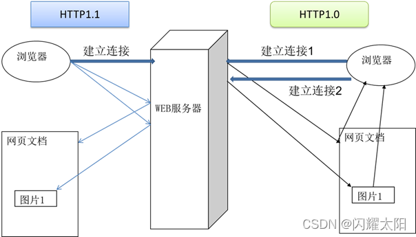
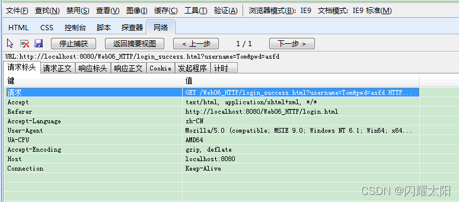
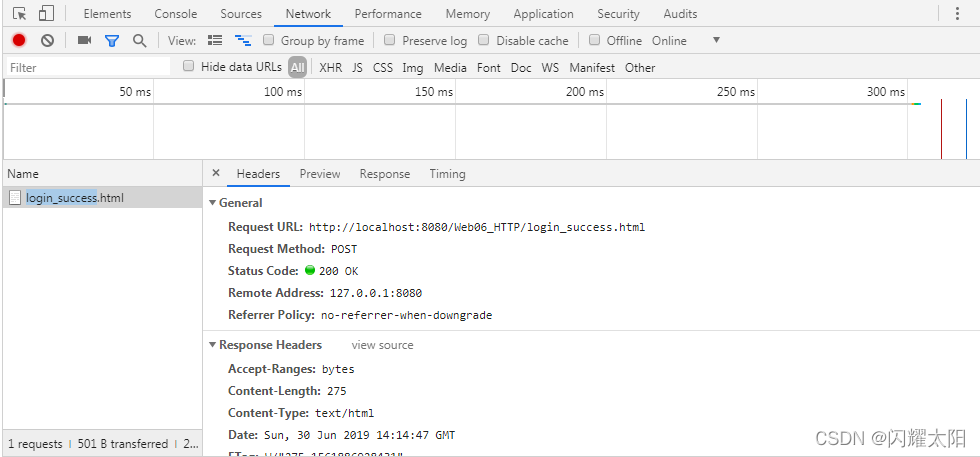
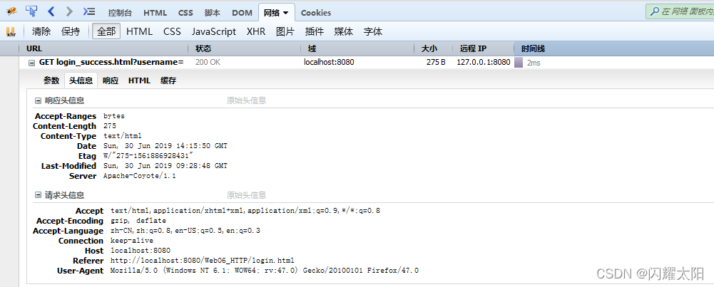
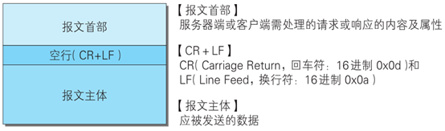
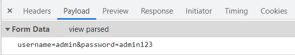

10.1 http 协议介绍
--------------

*   **HTTP 超文本传输协议** (HTTP-Hypertext transfer protocol)，是一个属于应用层的面向对象的协议，由于其简捷、快速的方式，适用于分布式超媒体信息系统。它于 1990 年提出，经过十几年的使用与发展，得到不断地完善和扩展。**它是一种详细规定了浏览器和万维网服务器之间互相通信的规则**，通过因特网传送万维网文档的数据传送协议。

*   客户端与服务端通信时传输的内容我们称之为**报文**。**HTTP 协议就是规定报文的格式。**

*   HTTP 就是一个通信规则，这个规则规定了客户端发送给服务器的报文格式，也规定了服务器发送给客户端的报文格式。实际我们要学习的就是这两种报文。客户端发送给服务器的称为” **请求报文** “，服务器发送给客户端的称为” **响应报文** “。

10.2 HTTP 协议的发展历程
-----------------

*   超文本传输协议的前身是世外桃源 (Xanadu) 项目，超文本的概念是泰德 · 纳尔森 (Ted Nelson) 在 1960 年代提出的。进入哈佛大学后，纳尔森一直致力于超文本协议和该项目的研究，但他从未公开发表过资料。1989 年，**蒂姆 · 伯纳斯 · 李** (Tim Berners Lee) 在 CERN(欧洲原子核研究委员会 = European Organization for Nuclear Research) 担任软件咨询师的时候，开发了一套程序，** 奠定了万维网 (WWW = World Wide Web)** 的基础。1990 年 12 月，超文本在 CERN 首次上线。1991 年夏天，继 Telnet 等协议之后，超文本转移协议成为互联网诸多协议的一分子。
*   当时，**Telnet 协议**解决了一台计算机和另外一台计算机之间一对一的控制型通信的要求。邮件协议解决了一个发件人向少量人员发送信息的通信要求。**文件传输协议**解决一台计算机从另外一台计算机批量获取文件的通信要求，但是它不具备一边获取文件一边显示文件或对文件进行某种处理的功能。**新闻传输协议**解决了一对多新闻广播的通信要求。而**超文本要解决的通信要求是**：在一台计算机上获取并显示存放在多台计算机里的文本、数据、图片和其他类型的文件；它包含两大部分：超文本转移协议和超文本标记语言 (HTML)。HTTP、HTML 以及浏览器的诞生给互联网的普及带来了飞跃。

10.3 HTTP 协议的会话方式
-----------------

*   浏览器与服务器之间的通信过程要经历四个步骤


*   浏览器与 WEB 服务器的连接过程是短暂的，每次连接只处理一个请求和响应。对每一个页面的访问，浏览器与 WEB 服务器都要建立一次单独的连接。
*   浏览器到 WEB 服务器之间的所有通讯都是完全独立分开的请求和响应对。

10.4 HTTP1.0 和 HTTP1.1 的区别
--------------------------

在 HTTP1.0 版本中，浏览器请求一个带有图片的网页，会由于下载图片而与服务器之间开启一个新的连接；  
但在 HTTP1.1 版本中，允许浏览器在拿到当前请求对应的全部资源后再断开连接，提高了效率。(长连接)



10.5 不同浏览器监听 HTTP 操作
--------------------

### 10.5.1 IE 浏览器中 F12



### 10.5.2 Chrome 中 F12



### 10.5.3 FireFox 中 F12



10.6 报文
-------

### 10.6.1 报文格式

  
报文：

*   请求报文：浏览器发给服务器
*   响应报文：服务器发回给浏览器

### 10.6.2 请求报文

报文格式 (4 部分)

*   请求首行（**请求行**）；
*   请求头信息（**请求头**）；
*   空行；
*   请求体；

### 10.6.3 GET 请求说明

1、由于请求参数在请求首行中已经携带了，所以没有请求体，也没有请求空行  
2、请求参数拼接在 url 地址中，地址栏可见 [url?name1=value1&name2=value2]，不安全  
3、由于参数在地址栏中携带，所以由大小限制 [地址栏数据大小一般限制为 4k]，只能携带纯文本  
4、get 请求参数只能上传文本数据  
5、没有请求体。所以封装和解析都快，效率高， 浏览器默认提交的请求都是 get 请求  
[比如：① 地址栏输入 url 地址回车，②点击超链接 a ， ③ form 表单默认方式…]

*   **请求首行**

```http
GET /05_web_tomcat/login_success.html?username=admin&password=123213 HTTP/1.1

请求方式 	访问的服务器中的资源路径？get请求参数	协议版本
```

*   **请求头**

```http
Host: localhost:8080   主机虚拟地址
Connection: keep-alive 长连接
Upgrade-Insecure-Requests: 1  请求协议的自动升级[http的请求，服务器却是https的，浏览器自动会将请求协议升级为https的]
User-Agent: Mozilla/5.0 (Windows NT 6.1; WOW64) AppleWebKit/537.36 (KHTML, like Gecko) Chrome/68.0.3440.75 Safari/537.36
- 用户系统信息
Accept:text/html,application/xhtml+xml,application/xml;q=0.9,image/webp,image/apng,*/*;q=0.8
- 浏览器支持的文件类型
Referer: http://localhost:8080/05_web_tomcat/login.html
- 当前页面的上一个页面的路径[当前页面通过哪个页面跳转过来的]：   可以通过此路径跳转回上一个页面， 广告计费，防止盗链
Accept-Encoding: gzip, deflate, br
- 浏览器支持的压缩格式
Accept-Language: zh-CN,zh;q=0.9,en-US;q=0.8,en;q=0.7
- 浏览器支持的语言
```

### 10.6.4 POST 请求说明

*   POST 请求要求将 form 标签的 method 的属性设置为 post  
      
    1、POST 请求有请求体，而 GET 请求没有请求体。  
    2、post 请求数据在请求体中携带，请求体数据大小没有限制，可以用来上传所有内容 [文件、文本]  
    3、只能使用 post 请求上传文件  
    4、post 请求报文多了和请求体相关的配置 [请求头]  
    5、地址栏参数不可见，相对安全  
    6、post 效率比 get 低

*   请求首行

```
POST /05_web_tomcat/login_success.html HTTP/1.1
```

*   请求头

```http
Host: localhost:8080
Connection: keep-alive
Content-Length: 31 		-请求体内容的长度
Cache-Control: max-age=0  -无缓存
Origin: http://localhost:8080
Upgrade-Insecure-Requests: 1  -协议的自动升级
Content-Type: application/x-www-form-urlencoded   -请求体内容类型[服务器根据类型解析请求体参数]
User-Agent: Mozilla/5.0 (Windows NT 6.1; WOW64) AppleWebKit/537.36 (KHTML, like Gecko) Chrome/68.0.3440.75 Safari/537.36
Accept:text/html,application/xhtml+xml,application/xml;q=0.9,image/webp,image/apng,*/*;q=0.8
Referer: http://localhost:8080/05_web_tomcat/login.html
Accept-Encoding: gzip, deflate, br
Accept-Language: zh-CN,zh;q=0.9,en-US;q=0.8,en;q=0.7
Cookie:JSESSIONID-
```

*   请求空行
*   请求体：浏览器提交给服务器的内容

```
username=admin&password=1232131
```



### 10.6.5 响应报文

##### 10.6.5.1 报文格式 (4 部分)

*   响应首行（**响应行**）；
*   响应头信息（**响应头**）；
*   空行；
*   **响应体；**

##### 10.6.5.2 具体情况

* **响应首行：**

  ```
  HTTP/1.1 200 OK
  
  说明：响应协议为HTTP1.1，响应状态码为200，表示请求成功；
  ```

* **响应头：**

  ```
  Server: Apache-Coyote/1.1   服务器的版本信息
  Accept-Ranges: bytes
  ETag: W/"157-1534126125811"
  Last-Modified: Mon, 13 Aug 2018 02:08:45 GMT
  Content-Type: text/html    响应体数据的类型[浏览器根据类型解析响应体数据]
  Content-Length: 157   响应体内容的字节数
  Date: Mon, 13 Aug 2018 02:47:57 GMT  响应的时间，这可能会有8小时的时区差
  ```

* **响应空行**

* **响应体**

  ```
  <!--需要浏览器解析使用的内容[如果响应的是html页面，最终响应体内容会被浏览器显示到页面中]-->
  
  <!DOCTYPE html>
  <html>
  	<head>
  		<meta charset="UTF-8">
  		<title>Insert title here</title>
  	</head>
  	<body>
  		恭喜你，登录成功了...
  	</body>
  </html>
  ```

##### 10.6.5.3 响应码

响应码对浏览器来说很重要，它告诉浏览器响应的结果。比较有代表性的响应码如下：

*   **200：** 请求成功，浏览器会把响应体内容（通常是 html）显示在浏览器中；

*   **404：** 请求的资源没有找到，说明客户端错误的请求了不存在的资源；

*   **500：** 请求资源找到了，但服务器内部出现了错误；

*   **302：** 重定向，当响应码为 302 时，表示服务器要求浏览器重新再发一个请求，服务器会发送一个响应头 Location，它指定了新请求的 URL 地址；

除此之外，其它一些响应码如下：

```
200 - 服务器成功返回网页 
404 - 请求的网页不存在 
503 - 服务不可用 
详细分解：

1xx（临时响应） 
表示临时响应并需要请求者继续执行操作的状态代码。

代码 说明 
100 （继续） 请求者应当继续提出请求。服务器返回此代码表示已收到请求的第一部分，正在等待其余部分。 
101 （切换协议） 请求者已要求服务器切换协议，服务器已确认并准备切换。

2xx （成功） 
表示成功处理了请求的状态代码。

代码 说明 
200 （成功） 服务器已成功处理了请求。通常，这表示服务器提供了请求的网页。 
201 （已创建） 请求成功并且服务器创建了新的资源。 
202 （已接受） 服务器已接受请求，但尚未处理。 
203 （非授权信息） 服务器已成功处理了请求，但返回的信息可能来自另一来源。 
204 （无内容） 服务器成功处理了请求，但没有返回任何内容。 
205 （重置内容） 服务器成功处理了请求，但没有返回任何内容。 
206 （部分内容） 服务器成功处理了部分 GET 请求。

3xx （重定向） 
表示要完成请求，需要进一步操作。 通常，这些状态代码用来重定向。

代码 说明 
300 （多种选择） 针对请求，服务器可执行多种操作。服务器可根据请求者 (user agent) 选择一项操作，或提供操作列表供请求者选择。 
301 （永久移动） 请求的网页已永久移动到新位置。服务器返回此响应（对 GET 或 HEAD 请求的响应）时，会自动将请求者转到新位置。 
302 （临时移动） 服务器目前从不同位置的网页响应请求，但请求者应继续使用原有位置来进行以后的请求。 
303 （查看其他位置） 请求者应当对不同的位置使用单独的 GET 请求来检索响应时，服务器返回此代码。 
304 （未修改） 自从上次请求后，请求的网页未修改过。服务器返回此响应时，不会返回网页内容。 
305 （使用代理） 请求者只能使用代理访问请求的网页。如果服务器返回此响应，还表示请求者应使用代理。 
307 （临时重定向） 服务器目前从不同位置的网页响应请求，但请求者应继续使用原有位置来进行以后的请求。

4xx（请求错误） 
这些状态代码表示请求可能出错，妨碍了服务器的处理。

代码 说明 
400 （错误请求） 服务器不理解请求的语法。 
401 （未授权） 请求要求身份验证。 对于需要登录的网页，服务器可能返回此响应。 
403 （禁止） 服务器拒绝请求。 
404 （未找到） 服务器找不到请求的网页。 
405 （方法禁用） 禁用请求中指定的方法。 
406 （不接受） 无法使用请求的内容特性响应请求的网页。 
407 （需要代理授权） 此状态代码与 401（未授权）类似，但指定请求者应当授权使用代理。 
408 （请求超时） 服务器等候请求时发生超时。 
409 （冲突） 服务器在完成请求时发生冲突。服务器必须在响应中包含有关冲突的信息。 
410 （已删除） 如果请求的资源已永久删除，服务器就会返回此响应。 
411 （需要有效长度） 服务器不接受不含有效内容长度标头字段的请求。 
412 （未满足前提条件） 服务器未满足请求者在请求中设置的其中一个前提条件。 
413 （请求实体过大） 服务器无法处理请求，因为请求实体过大，超出服务器的处理能力。 
414 （请求的 URI 过长） 请求的 URI（通常为网址）过长，服务器无法处理。 
415 （不支持的媒体类型） 请求的格式不受请求页面的支持。 
416 （请求范围不符合要求） 如果页面无法提供请求的范围，则服务器会返回此状态代码。 
417 （未满足期望值） 服务器未满足”期望”请求标头字段的要求。

5xx（服务器错误） 
这些状态代码表示服务器在尝试处理请求时发生内部错误。 这些错误可能是服务器本身的错误，而不是请求出错。

代码 说明 
500 （服务器内部错误） 服务器遇到错误，无法完成请求。 
501 （尚未实施） 服务器不具备完成请求的功能。例如，服务器无法识别请求方法时可能会返回此代码。 
502 （错误网关） 服务器作为网关或代理，从上游服务器收到无效响应。 
503 （服务不可用） 服务器目前无法使用（由于超载或停机维护）。通常，这只是暂时状态。 
504 （网关超时） 服务器作为网关或代理，但是没有及时从上游服务器收到请求。 
505 （HTTP 版本不受支持） 服务器不支持请求中所用的 HTTP 协议版本。

HttpWatch状态码Result is

200 - 服务器成功返回网页，客户端请求已成功。 
302 - 对象临时移动。服务器目前从不同位置的网页响应请求，但请求者应继续使用原有位置来进行以后的请求。 
304 - 属于重定向。自上次请求后，请求的网页未修改过。服务器返回此响应时，不会返回网页内容。 
401 - 未授权。请求要求身份验证。 对于需要登录的网页，服务器可能返回此响应。 
404 - 未找到。服务器找不到请求的网页。 
2xx - 成功。表示服务器成功地接受了客户端请求。 
3xx - 重定向。表示要完成请求，需要进一步操作。客户端浏览器必须采取更多操作来实现请求。例如，浏览器可能不得不请求服务器上的不同的页面，或通过代理服务器重复该请求。 
4xx - 请求错误。这些状态代码表示请求可能出错，妨碍了服务器的处理。 
5xx - 服务器错误。表示服务器在尝试处理请求时发生内部错误。 这些错误可能是服务器本身的错误，而不是请求出错。
```


----------------