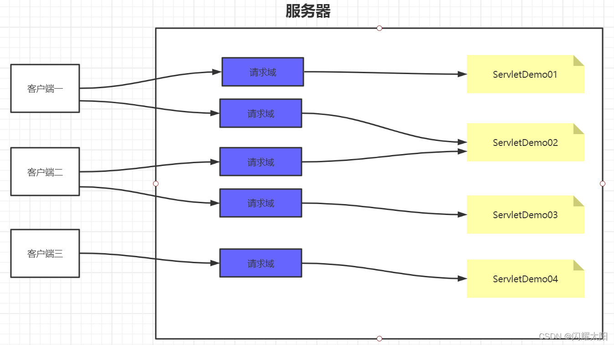
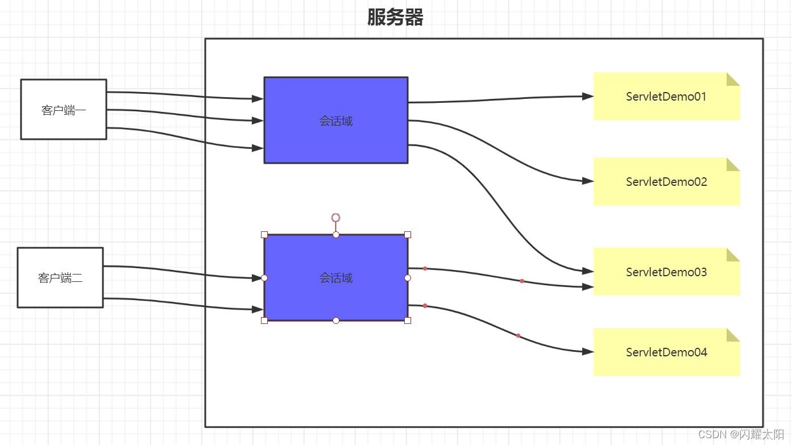
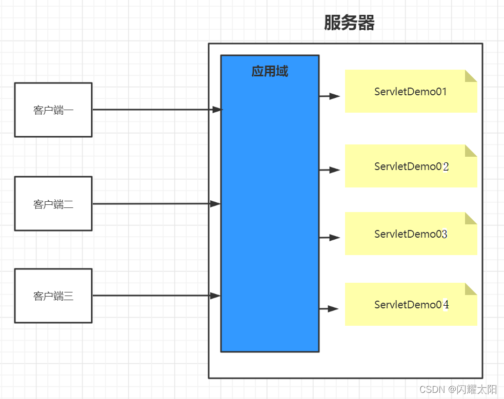
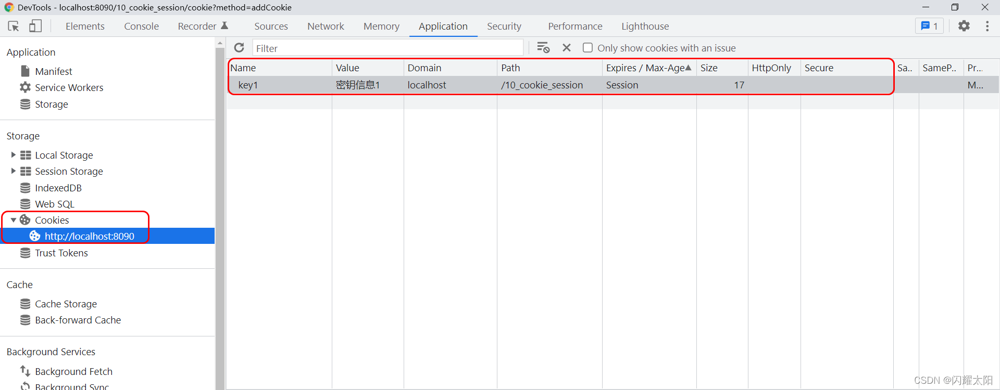

4.1 为什么需要会话控制
-------------

保持用户登录状态，就是当用户在登录之后，会在服务器中保存该用户的登录状态，当该用户后续访问该项目中的其它动态资源 (Servlet 或者 Thymeleaf) 的时候，能够判断当前是否是已经登录过的。而从用户登录到用户退出登录这个过程中所发生的所有请求，其实都是在一次会话范围之内

4.2 域对象的范围
----------

### 4.2.1 请求域的范围

  
每一次请求都有一个请求域对象，当请求结束的时候对应的请求域对象也就销毁了

### 4.2.2 会话域的范围

  
会话域 (打开一个浏览器窗口) 是从客户端连接上服务器开始，一直到客户端关闭，这一整个过程中发生的所有请求都在同一个会话域中；而不同的客户端是不能共用会话域的

### 4.2.3 应用域的范围

  
整个项目部署之后，只会有一个应用域对象，所有客户端都是共同访问同一个应用域对象，在该项目的所有动态资源中也是共用一个应用域对象. 所以在应用域中的数据, 所有的项目共享

4.3 Cookie 技术
-------------

### 4.3.1 Cookie 的概念

Cookie，有时也用其复数形式 Cookies。类型为 “小型文本文件”，是某些网站为了辨别用户身份，进行 Session 跟踪而储存在用户本地终端上的数据（通常经过加密），由用户客户端计算机暂时或永久保存的信息.  
Cookie 是一种客户端的会话技术, 它是服务器存放在浏览器的一小份数据, 浏览器以后每次访问该服务器的时候都会将这小份数据携带到服务器去。

### 4.3.2 Cookie 的特点

1.  在浏览器中存放数据
2.  将浏览器中存放的数据携带到服务器
3.  Cookie 是一段不超过 4KB 的小型文本数据，由一个名称（Name）、一个值（Value）和其它几个用于控制 Cookie 有效期、安全性、使用范围的可选属性组成。

### 4.3.3 Cookie 的应用场景

1. 记住用户名  
   当我们在用户名的输入框中输入完用户名后, 浏览器记录用户名, 下一次再访问登录页面时, 用户名自动填充到用户名的输入框.

2. 保存电影的播放进度

在网页上播放电影的时候, 如果中途退出浏览器了, 下载再打开浏览器播放同一部电影的时候, 会自动跳转到上次退出时候的进度, 因为在播放的  
时候会将播放进度保存到 cookie 中

### 4.3.4 Cookie 的时效性

如果我们不设置 Cookie 的时效性，默认情况下 Cookie 的有效期是一次会话范围内，我们可以通过 cookie 的 setMaxAge() 方法让 Cookie 持久化保存到浏览器上

*   会话级 Cookie
    *   服务器端并没有明确指定 Cookie 的存在时间
    *   在浏览器端，Cookie 数据存在于内存中
    *   只要浏览器还开着，Cookie 数据就一直都在
    *   浏览器关闭，内存中的 Cookie 数据就会被释放
*   持久化 Cookie
    *   服务器端明确设置了 Cookie 的存在时间
    *   在浏览器端，Cookie 数据会被保存到硬盘上
    *   Cookie 在硬盘上存在的时间根据服务器端限定的时间来管控，不受浏览器关闭的影响
    *   持久化 Cookie 到达了预设的时间会被释放

`cookie.setMaxAge(int expiry)`参数单位是秒，表示 cookie 的持久化时间，如果设置参数为 0，表示将浏览器中保存的该 cookie 删除

### 4.3.5 关于 Cookie 使用 AP 说明

```
public class CookieServlet extends BaseServlet {

    /**
     * 实现Cookie添加操作
     */
    protected void addCookie(HttpServletRequest request, HttpServletResponse response) throws ServletException, IOException {
        response.setContentType("text/html;charset=utf-8");
        //1.设定Cookie的数据
        Cookie cookie1 = new Cookie("key1", "密钥信息1");
        Cookie cookie2 = new Cookie("key2", "密钥信息2");

        //2.设定Cookie的有效期  单位是秒
        cookie2.setMaxAge(10);

        //3.设定Cookie有效路径  表示请求 /项目名称/aaa时才会携带该Cookie
        cookie2.setPath(request.getContextPath()+"/aaa");

        //4.设定Cookie 在哪个域名有效
        cookie2.setDomain("www.baidu.com");

        response.addCookie(cookie1);
        response.addCookie(cookie2);
        //给出响应
        response.getWriter().write("Cookie添加成功!!!");
    }


    protected void getCookie(HttpServletRequest request, HttpServletResponse response) throws ServletException, IOException {

        Cookie[] cookies = request.getCookies();
        if(cookies !=null && cookies.length>0){
            for (Cookie cookie : cookies){
                String name = cookie.getName();
                String value = cookie.getValue();
                System.out.println(name+":"+value);
            }
        }
        //response.sendRedirect(request.getContextPath()+"/index.html");
        request.getRequestDispatcher("index.html").forward(request,response);
    }
}
```

### 4.3.6 浏览器检查 Cookie

说明: 通过 F12 开发工具打开浏览器 可以检查 cookie 的相关信息  


4.4 Session 技术
--------------

### 4.4.1 Session 概述

session 是服务器端的技术。服务器为每一个浏览器开辟一块内存空间，即 session 对象。由于 session 对象是每一个浏览器特有的，所以用户的记录可以存放在 session 对象中

### 4.4.2 Session 的 API 介绍

*   request.getSession(); 获得 session(如果第一次调用的时候其实是创建 session, 第一次之后通过 sessionId 找到 session 进行使用)
*   Object getAttribute(String name) ; 获取值
*   void setAttribute(String name, Object value) ; 存储值
*   void removeAttribute(String name) ; 移除值

### 4.4.3 Session 的代码

```
package com.atguigu.servlet;

import javax.servlet.*;
import javax.servlet.http.*;
import java.io.IOException;

public class SessionServlet extends BaseServlet {

    //1.添加Session
    protected void addSession(HttpServletRequest request, HttpServletResponse response) throws ServletException, IOException {
        HttpSession session = request.getSession();
        session.setAttribute("name","Session数据");
        response.sendRedirect(request.getContextPath()+"/index.html");
    }

    //2.获取Session
    protected void getSession(HttpServletRequest request, HttpServletResponse response) throws ServletException, IOException {
        HttpSession session = request.getSession();
        System.out.println(session.getAttribute("name"));
    }

    //3.移除Session数据
    protected void removeSession(HttpServletRequest request, HttpServletResponse response) throws ServletException, IOException {
        HttpSession session = request.getSession();
        session.removeAttribute("name");
        response.sendRedirect(request.getContextPath()+"/index.html");
    }
}
```


--------