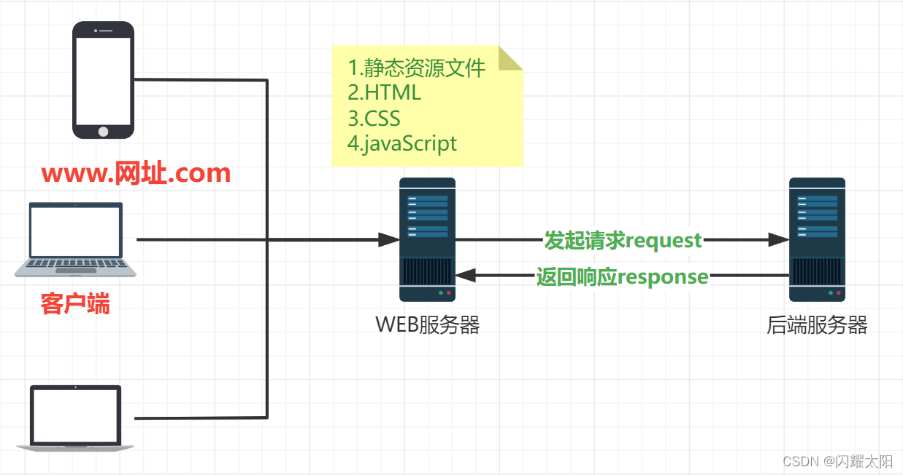
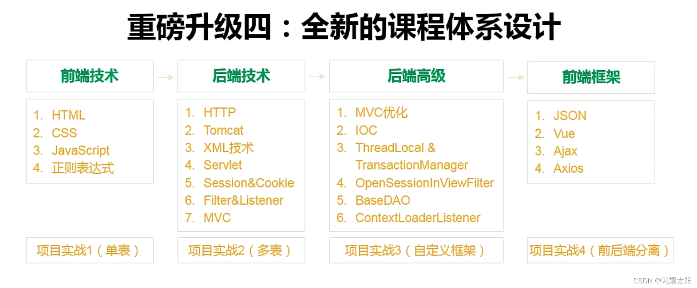
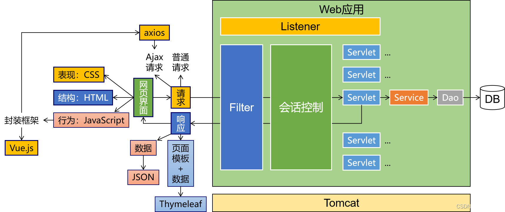
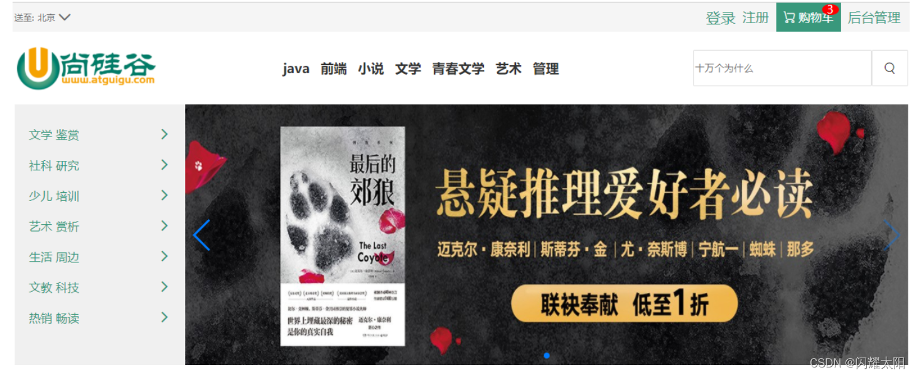

1.1 什么是 WEB
-----------

**WEB（World Wide Web）即全球广域网，也称为万维网，它是一种基于超文本和 HTTP 的、全球性的、动态交互的、跨平台的分布式图形信息系统** 是建立在 Internet 上的一种网络服务，为浏览者在 Internet 上查找和浏览信息提供了图形化的、易于访问的直观界面，其中的文档及超级链接将 Internet 上的信息节点组织成一个互为关联的网状结构。

解析 : WEB 称为万维网, 我们时时刻刻都生活在互联网的世界中.

1.2 WEB 阶段划分
------------

### 1.2.1 WEB 1.0

说明: WEB1.0 可以理解为第一代的互联网  
特点: 网络平台单向地向用户提供内容, 内容由网站来决定的用户被动的接收.  
例如: 搜狐、新浪、网易的门户网站 / 电视机 / 收音机等.

### 1.2.2 WEB 2.0

说明: WEB2.0 用户可以参与到互联网当中  
特点:  

1. 用户可以在网络平台上传自己的内容（包括文字、图片、视频等等）；  
2. 可以与其他用户进行交流。  
3. 互联网从 “平台向用户的单向传播”，变成了 “用户与用户的双向互动”。  
   例如: 微信 / 抖音 / 微博等

### 1.2.3 WEB 3.0

说明: Web3.0 给社会带来的影响只会比 Web2.0 更广阔和深刻, Web3.0 则是**智能机器**广泛参与到网络过程中来。  
特点: 智能和广泛  

1. 智能: 在机器学习的加持下, 利用原始数据掌握新的知识. 投入到更加高级的生产中来. ----- **人工智能时代**  
2. 广泛: 大部分我们能想到的设备和器具，都有潜力和有可能安装上计算机，通过长期收集数据，来为智能代理和优化提供决策依据 --> **万物互联时代**

例如: 智能家居 / 智慧城市等

1.3 JAVA-WEB
------------

### 1.3.1 什么是 JAVA-WEB

1.  Java Web，是用 Java 技术来解决相关 web 互联网领域的技术栈。
2.  web 包括：web 服务端和 web 客户端两部分。
3.  Java 在客户端的应用有 Java Applet，不过使用得很少，Java 在服务器端的应用非常的丰富，比如 Servlet，JSP、第三方框架等等。Java 技术对 Web 领域的发展注入了强大的动力。

### 1.3.2 什么是 WEB 服务端

Web 服务器一般指网站服务器，是指驻留于因特网上某种类型计算机的程序，可以处理浏览器等 Web 客户端的请求并返回相应响应，也可以放置网站文件，让全世界浏览；可以放置数据文件，让全世界下载。目前最主流的三个 Web 服务器是 Apache、 Nginx 、IIS。

简化理解: 就是我们口中常说的服务器. 用来返回特定的业务数据 / 页面 / 图片 / 音视频等文件的  

### 1.3.3 什么是 WEB 客户端

#### 1.3.3.1 C/S 架构设计

C/S 结构，即 Client/Server(客户机 / 服务器) 结构，是大家熟知的软件系统体系结构，通过将任务合理分配到 Client 端和 Server 端，降低了系统的通讯开销，可以充分利用两端硬件环境的优势。开发 C/S 架构可以采用多种语言，包括 Java,C++,C#，以及 Dephi 等

典型代表: 王者荣耀 / 英雄联盟 / 抖音等

#### 1.3.3.2 B/S 架构设计

即 Browser/Server(浏览器 / 服务器)结构，是随着 Internet 技术的兴起，对 C/S 结构的一种变化或者改进的结构。在这种结构下，用户界面完全通过 WWW 浏览器实现。前端在大部分企业就是做浏览器端展现相关的工作，会用到 html,css,js,ps,ai 等等，而 “后端” 的主要工作室程序开发、数据处理了，比如：php，asp，mysql，mssql。

典型代表: 京东 / 天猫 / 亚马逊等网站

### 1.3.4 WEB 调用流程图

1.4 WEB 阶段学习目标
--------------

### 1、课程设计知识点  

### 2、前后端调用流程  

### 3、大项目贯穿  

-----------