2.1 HTML 介绍
-----------

**HTML(Hyper Text Markup Language) 的全称为超文本标记语言**，是一种标记语言。它包括一系列标签．通过这些标签可以将网络上的文档格式统一，使分散的 Internet 资源连接为一个逻辑整体。HTML 文本是由 HTML 命令组成的描述性文本，HTML 命令可以说明文字，图形、动画、声音、表格、链接等.

2.2 超文本
-------

**超文本是一种组织信息的方式，它通过超级链接方法将文本中的文字、图表与其他信息媒体相关联。** 这些相互关联的信息媒体可能在同一文本中，也可能是其他文件，或是地理位置相距遥远的某台计算机上的文件。这种组织信息方式将分布在不同位置的信息资源用随机方式进行连接，为人们查找，检索信息提供方便。

2.3 标记语言
--------

说 HTML 是一种『标记语言』因为它是由一系列`『标签』`组成的，没有常量、变量、流程控制、异常处理、IO 等等这些功能。HTML 很简单，每个标签都有它固定的含义和确定的页面显示效果。所以学习 html 比较简单, 大家只需要记忆特定的标签语法即可

```html
<p> 我是一个最简单的超文本标记语言 </p>
```

2.4 HTML 入门案例
-------------

### 2.4.1 编辑第一个入门案例

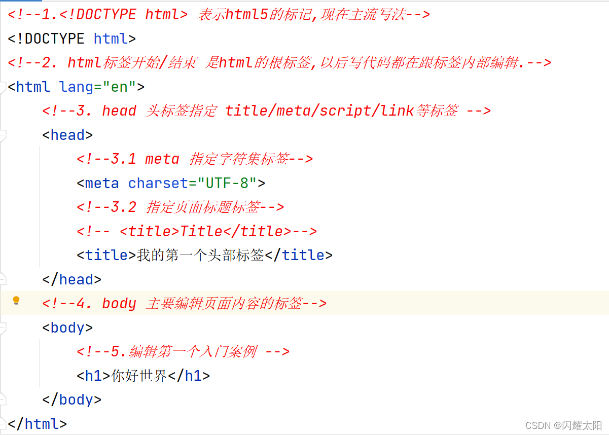

### 2.4.2 页面效果展现

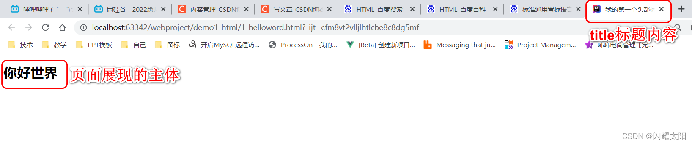

### 2.4.3 html 页面结构说明

1.  **文档声明:** HTML 文件中第一行的内容，用来告诉浏览器当前 HTML 文档的基本信息，其中最重要的就是当前 HTML 文档遵循的语法标准。这里我们只需要知道 HTML 有 4 和 5 这两个大的版本，HTML4 版本的文档类型声明是：

```html
<!DOCTYPE HTML PUBLIC "-//W3C//DTD HTML 4.01 Transitional//EN"
	  	 "http://www.w3.org/TR/html4/loose.dtd">
```

HTML5 版本的文档类型声明是：

```html
<!DOCTYPE html>
```

现在主流的技术选型都是使用 HTML5，之前的版本基本不用了。

2.  **根标签**: html 标签是整个文档的根标签，所有其他标签都必须放在 html 标签里面。
3.  **头部**: head 标签用于定义文档的头部，其他头部元素都放在 head 标签里。头部元素包括 title 标签、script 标签、style 标签、link 标签、meta 标签等等。
4.  **主体**: body 标签定义网页的主体内容，在浏览器窗口内显示的内容都定义到 body 标签内。

注释: HTML 注释的写法是：

```html
<!-- 注释内容 -->
```

注释的内容不会显示到浏览器窗口内，是开发人员用来对代码内容进行解释说明。

2.5 HTML 语法规则
-------------

*   根标签有且只能有一个
*   无论是双标签还是单标签都必须正确关闭
*   标签可以嵌套但不能交叉嵌套
*   注释不能嵌套
*   属性必须有值，值必须加引号，单引号或双引号均可
*   标签名不区分大小写但建议使用小写

2.6 HTML 基础标签
-------------

### 2.6.1 标题标签

```html
<!DOCTYPE html>
<html lang="en">
<head>
    <meta charset="UTF-8">
    <title>html基本标签用法</title>
</head>
<body>
    <!--1.标题标签 从h1-h6共6个 字体大小依次递减 -->
    <h1>我是一级标签</h1>
    <h2>我是二级标签</h2>
    <h3>我是三级标签</h3>
    <h4>我是四级标签</h4>
    <h5>我是五级标签</h5>
    <h6>我是六级标签</h6>

</body>
</html>
```

页面效果展现:  
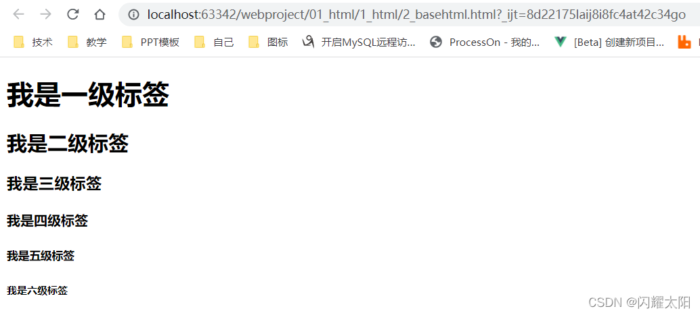

### 2.6.2 段落标签

```html
<!--2.段落标签 -->
    <p>天青色等烟雨,而我在等你</p>
    <p>炊烟袅袅升起 隔江千万里</p>
```

页面效果展现:  
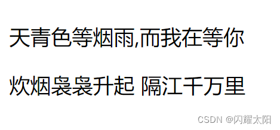

### 2.6.3 换行标签

说明: 在 html 中如果直接回车换行是不可以直接使用的, 需要使用  
标签

```html
<!--3.换行标签 -->
    生当做人杰, <br/>
    死亦为鬼雄.
```

页面效果: 出现换行效果  
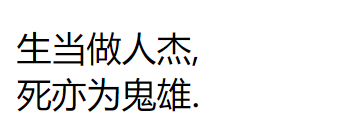

### 2.6.4 无序标签

```html
<!--4.无序列表标签 ul-li
        type: disc 黑色圆圈
              circle 空心圆圈
              square 黑心方块
    -->
    <ul type="disc">
      <li>语文</li>
      <li>数学</li>
      <li>英语</li>
    </ul>
```

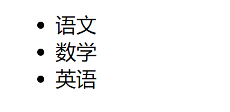

### 2.6.5 有序标签

```html
<!--5.有序列表标签 ol-li 默认使用阿拉伯数字
      type:表示类型   start:表示起始位置
    -->
    <ol type="A" start="3">
      <li><i>语文</i></li>
      <li><strong>数学</strong></li>
      <li>英语</li>
    </ol>
```

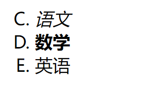

### 2.6.6 超链接标签 (重要)

1.  一对 a 标签 表示超链接标签,
2.  href 属性, 表示将要跳转到的页面地址

```html
<!DOCTYPE html>
<html lang="en">
<head>
    <meta charset="UTF-8">
    <title>a标签案例练习</title>
</head>
<body>
    <!--1. a标签的用法 -->
    <!--1.1相对路径跳转到2_base页面中
        ./代表当前目录
        ../代表上一级目录-->
    <a href="2_basehtml.html">相对跳转到2_basehtml页面</a><br>
    <a href="./2_basehtml.html">相对跳转到2_basehtml页面</a><br>

    <!--1.2 绝对路径跳转 需要使用浏览器直接打开目录 否则无效-->
    <a href="E:\atguigu_workspace\webproject\01_html\1_html\2_basehtml.html">绝对跳转</a><br>

    <!--2. 跳转到百度页面-->
    <a href="http://www.baidu.com">百度</a> <br>
    <a href="http://www.baidu.com">百度</a> <br>

    <!--3. 跳转页面打开位置设定
        target属性说明:
            1._self:    在当前页打开
            2._blank    在新页面打开
            3._parent   级联标签(页面嵌套关系) 父级页面
            4._top      级联标签(页面嵌套关系) 顶部页面
    -->
    <a href="http://www.jd.com" target="_blank">京东</a>
</body>
</html>
```

页面效果展现:  
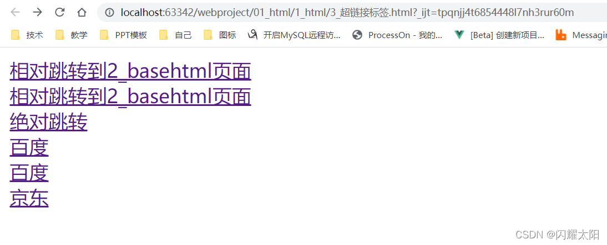

### 2.6.7 图片标签

1. 编辑 html 标签

```html
<!DOCTYPE html>
<html lang="en">
<head>
    <meta charset="UTF-8">
    <title>图片标签</title>
</head>
<body>
    <!--知识点: 图片标签用法
      src="图片的路径 绝对路径或者相对路径"
      width: 宽度
      height: 高度
      alt: 当图片不能正常显示时,展现该数据
    -->
     <br/>
    

</body>
</html>
```

2.  页面效果展现  
    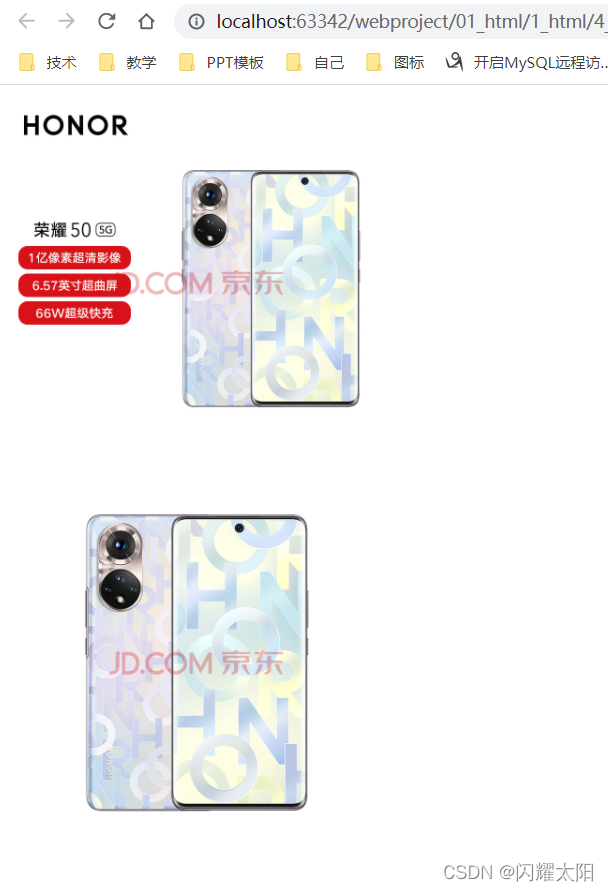

### 2.6.8 块级标签

块级标签并不是为了显示文章内容的，而是为了方便结合 CSS 对页面进行布局。也将块级标签叫做: 盒子模型  
块级标签 : 块级标签独占一 "行" 前后都会回车换行符. 如果设定大小, 则大小固定 div  
行级标签: 行级标签的大小由内容决定, 通常由内容撑大!!! 不会独占一行, 会自动的向左看齐 span  
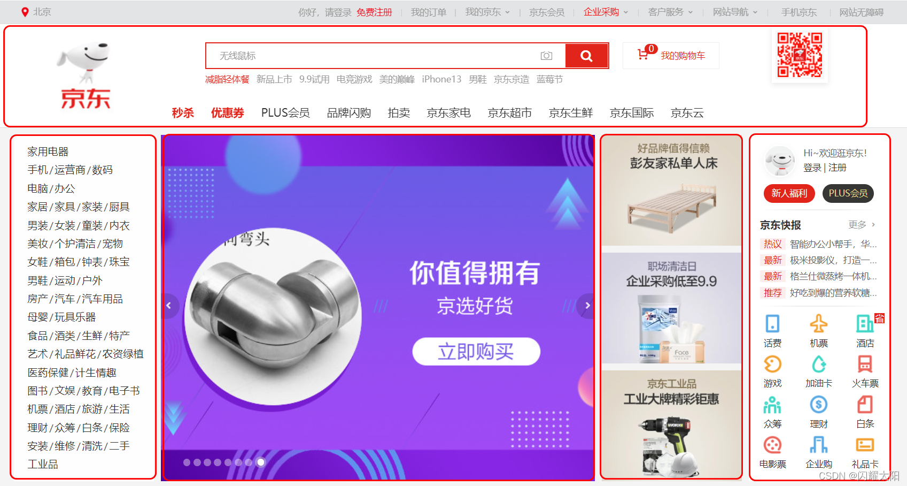

```html
<!DOCTYPE html>
<html lang="en">
<head>
    <meta charset="UTF-8">
    <title>块级标签用法</title>
</head>
<body>
  <!--div盒子模型 可以任意布局 -->
  <div style="border:  1px red solid; width: 200px; height:200px" >这里是div标签</div>

  <!--div盒子模型嵌套关系-->
  <div style="border: 1px green solid; width: 300px; height: 300px">
      <div style="background-color: red;  width: 150px;height: 150px;float: left">这是内层盒子1</div>
      <div style="background-color: blue; width: 150px;height: 150px;float: right">这是内层盒子2</div>
      <div style="background-color: black;  width: 150px;height: 150px;float: left">这是内层盒子3</div>
      <div style="background-color: greenyellow; width: 150px;height: 150px;float: right">这是内层盒子4</div>
  </div>
  
  <!-- span可以控制局部内容-->
  <span style="color: red; font-size: 80px">床前明月光,</span> <span style="color: blue;font-size: 60px">疑似地上霜.</span>
</body>
</html>
```

关于块级标签浮动说明 float  
说明: 如果改变 div 中独占一行的效果, 则必须添加浮动效果.  
浮动方向: left right  
页面效果展现:  
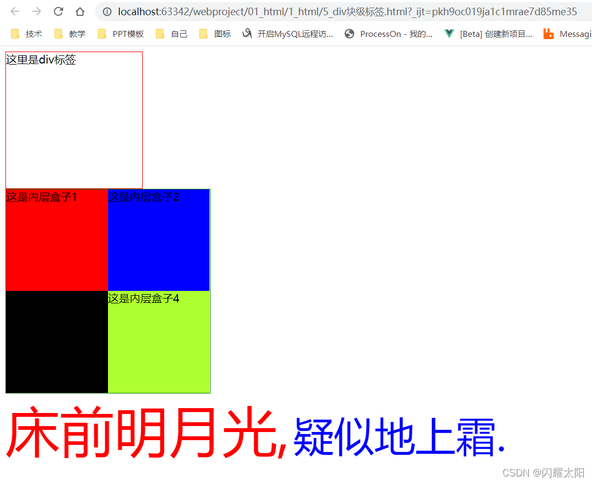

### 2.6.9 HTML 字符实体

说明: 字符实体一般在页面中偶尔用到. 用的时候查询资料即可 不需要额外记忆.  
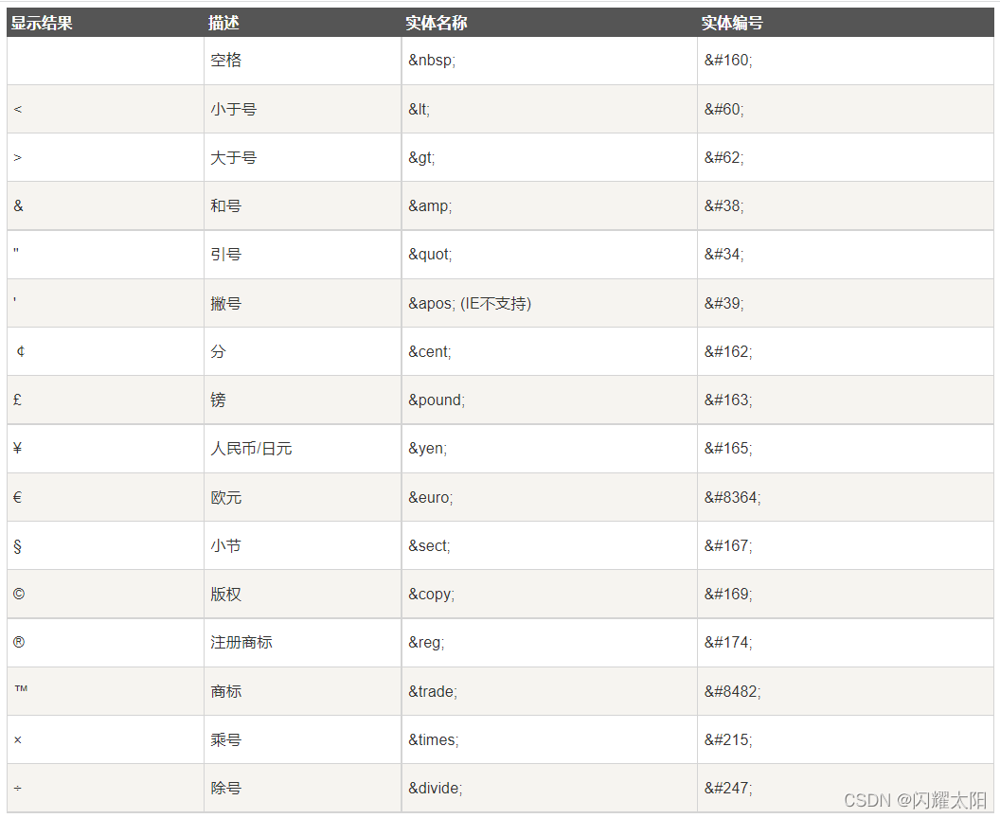

```html
<!DOCTYPE html>
<html lang="en">
<head>
    <meta charset="UTF-8">
    <title>实体标签</title>
</head>
<body>
    <h1> html中的实体标签</h1>
    <p>下列属性换行标签的是?</p>
    <ol type="A">
      <li> <h1>aaaa<h1> </li>
      <li> <br/> </li>
    </ol>

    <div>
      常用字符实体标签
      <p>大于  ></p>
      <p>大于  <</p>
      <p>引号  "</p>
      <p>人民币  ¥</p>
      <p>版权符号  ©</p>
    </div>
</body>
</html>
```

### 2.6.10 表格标签用法

```html
<!DOCTYPE html>
<html lang="en">
<head>
    <meta charset="UTF-8">
    <title>表格标签</title>
</head>
<body>
    <!--表格知识点讲解
        1.一个表格 一个table标签
        2.border 边框线
        3. width/height高度
        4. align="对齐方式"  lift:左对齐  center:居中  right:右对齐
        5. th标签 表头标签 加粗/居中
        6. 跨行: colspan="4"  向右跨4列
        7. 跨列: rowspan="2"  向下跨2行
    -->
    <table border="1px" width="80%" height="400px" align="center">
        <tr>
            <th>ID号</th>
            <th>姓名</th>
            <th>年龄</th>
            <th>性别</th>
        </tr>
        <tr align="center">
            <td>1</td>
            <td>张三</td>
            <td>18</td>
            <td>男</td>
        </tr>
        <tr align="center">
            <td>2</td>
            <td>李四</td>
            <td>20</td>
            <td>男</td>
        </tr>
        <tr>
            <!--跨四列-->
            <td colspan="4">跨列测试</td>
        </tr>
        <tr>
            <td rowspan="2">跨行测试</td>
            <td></td>
            <td></td>
            <td></td>
        </tr>
        <tr>
            <td></td>
            <td></td>
            <td></td>
        </tr>
    </table>
</body>
</html>
```

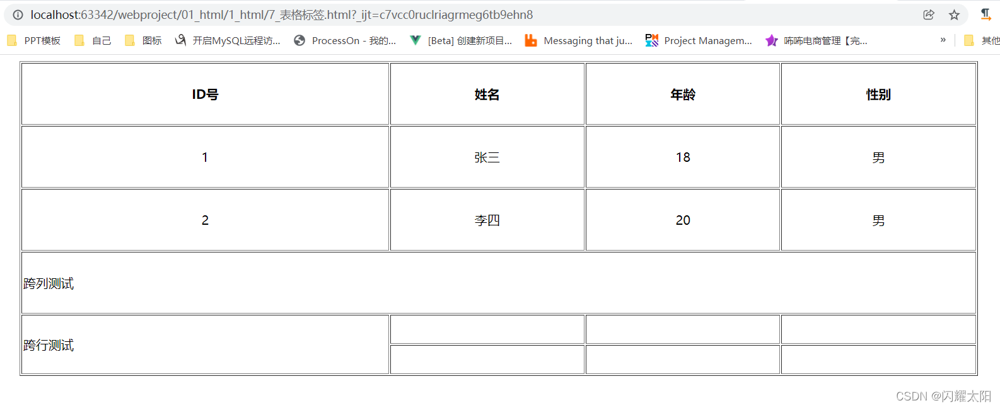

### 2.6.11 关于表格作业讲解

根据图片完成表格作业:  
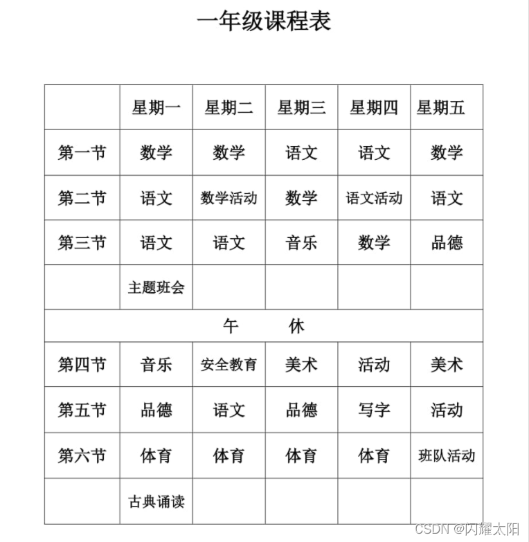

```
<!DOCTYPE html>
<html lang="en">
<head>
    <meta charset="UTF-8">
    <title>表格标签作业</title>
</head>
<body>
        <!--知识点:
            cellspacing="0"  边框和边框之间的宽度
            cellpadding="2"  边框和内容之间的宽度
        -->
        <H1 align="center">一年级课程表</H1>
        <table border="1px" width="80%" align="center" cellspacing="0" cellpadding="2">
            <tr>
                <th></th>
                <th>星期一</th>
                <th>星期二</th>
                <th>星期三</th>
                <th>星期四</th>
                <th>星期五</th>
            </tr>
            <tr>
                <th>第一节</th>
                <th>数学</th>
                <th>数学</th>
                <th>语文</th>
                <th>语文</th>
                <th>数学</th>
            </tr>
            <tr>
                <th>第二节</th>
                <th>语文</th>
                <th>数学活动</th>
                <th>数学</th>
                <th>语文活动</th>
                <th>语文</th>
            </tr>
            <tr>
                <th>第三节</th>
                <th>语文</th>
                <th>语文</th>
                <th>音乐</th>
                <th>数学</th>
                <th>品德</th>
            </tr>
            <tr>
                <th></th>
                <th>主题班会</th>
                <th></th>
                <th></th>
                <th></th>
                <th></th>
            </tr>
            <tr>
                <th colspan="6">午休</th>
            </tr>
            <tr>
                <th>第四节</th>
                <th>音乐</th>
                <th>安全教育</th>
                <th>美术</th>
                <th>活动</th>
                <th>美术</th>
            </tr>
            <tr>
                <th>第五节</th>
                <th>品德</th>
                <th>语文</th>
                <th>品德</th>
                <th>写字</th>
                <th>活动</th>
            </tr>
            <tr>
                <th>第六节</th>
                <th>体育</th>
                <th>体育</th>
                <th>体育</th>
                <th>体育</th>
                <th>班队活动</th>
            </tr>
            <tr>
                <th></th>
                <th>古典咏读</th>
                <th></th>
                <th></th>
                <th></th>
                <th></th>
            </tr>
        </table>
</body>
</html>
```

2.7 表单标签html
--------

### 2.7.1 表单标签说明

说明: 用户将数据通过表单的形式打包发送给服务器, 可以将表单理解为一个容器, 内部包含了用户的数据  
常见表单场景:  
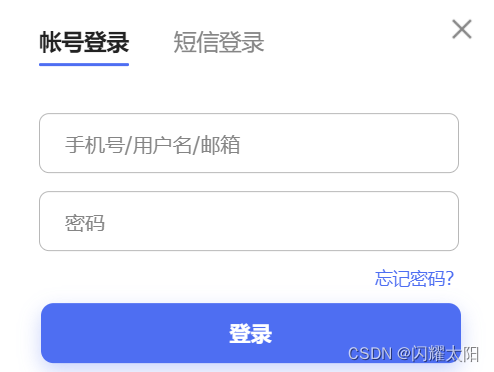

### 2.7.2 表单标签语法介绍

关键字:  

1. action: form 表单将数据提交到服务器的地址  
2. method: form 表单的提交方式 常用 GET/POST 提交方式  
3. submit: 只有 type=“submit” 的按钮时, 表单会主动提交 / 后期也可以通过 Ajax 进行异步提交

```html
<!--表单标签语法说明-->
    <form action="数据提交地址" method="请求方式">
      <button type="submit">提交</button>
    </form>
```

### 2.7.3 文本输入框html

1.  html 代码

```html
用户名: <input type="text" /><br/>
```

2.  页面效果展现  
    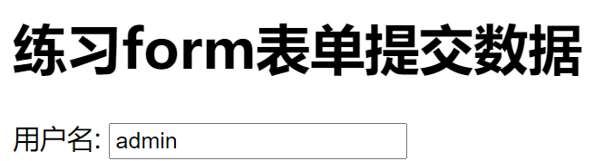

### 2.7.4 密码输入框

1.  页面 html

```html
密   码: <input type="password" /><br/>
```

2.  页面效果展现  
    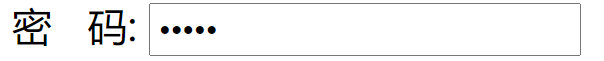

### 2.7.5 单选输入框

1.  html 代码

```html
<!--单选框时: 要求name属性相同
          checked="checked" 表示默认选中
          label: 当点击文字时,与input框关联  for绑定input框id
       -->
      性   别:
            <input type="radio" />
            <label for="man">男</label>
            <input type="radio" />
            <label for="woman">女</label><br/>
```

2.  页面效果展现

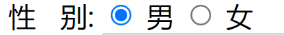

### 2.7.6 时间输入框

1.  html 代码

```html
<!--不同的浏览器显示效果不同, 后期通过特定的插件进行控制 -->
       生   日: <input type="date" /><br/>
```

2.  页面效果展现  
    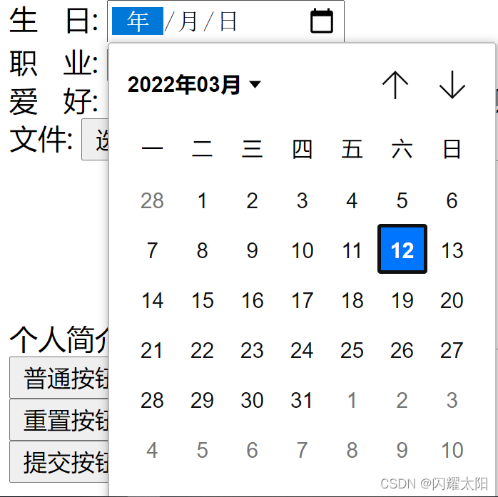

### 2.7.7 下拉列表

1.  html 代码

```html
<!--下拉列表: select关键字:  name表示需要提交的key  option表示选项  value代表选中的值 -->
       职   业:
            <select >
                <option value="" >---请选择---</option>
                <option value="java开发工程师" selected="selected">java开发工程师</option>
                <option value="web开发工程师">web开发工程师</option>
                <option value="大数据开发工程师">大数据开发工程师</option>
            </select><br/>
```

2.  页面效果展现  
    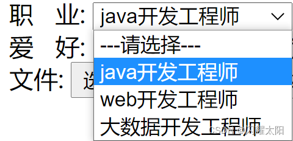

### 2.7.8 复选框

1.  html 代码

```html
<!--复选框:  value:选中数据的值-->
        爱   好:
            <input type="checkbox" > 打游戏
            <input type="checkbox" > 敲代码
            <input type="checkbox" > 看电视
            <input type="checkbox" > 刷抖音<br/>
```

2.  页面效果展现  
    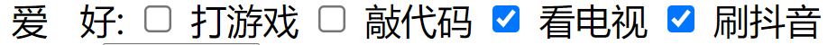

### 2.7.9 文件输入框

1.  编辑 html 代码

```html
<!--文件类型 file-->
        文件: <input type="file" /><br/>
```

2.  页面效果展现  
    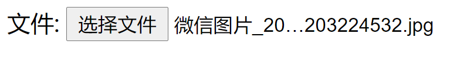

### 2.7.10 多行文本框

1.  html 代码

```html
<!--文本域-->
        个人简介: <textarea ></textarea> <br/>
```

2.  页面效果  
    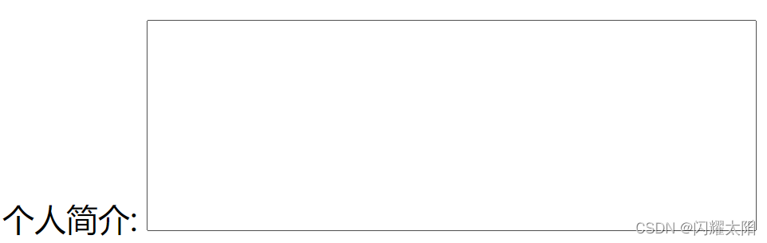

### 2.7.11 隐藏域

1.  html 代码

```html
<!--隐藏域-->
 隐藏域:  <input type="hidden" />
```

2.  页面效果展现  
    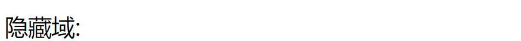

### 2.7.12 按钮标签

1.  html 代码

```html
<!--普通按钮 -->
        <input type="button" value="普通按钮1">
        <button type="button">普通按钮2</button><br/>

        <!--重置按钮 -->
        <input type="reset" value="重置按钮1">
        <button type="reset">重置按钮2</button><br/>
        <button type="submit">提交按钮</button>
```

2.  页面效果展现  
    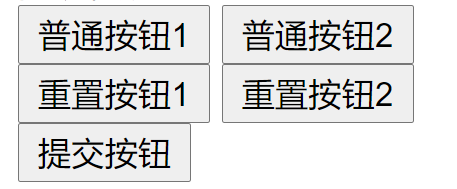

### 2.7.13 表单提交常见标签说明

```html
<!DOCTYPE html>
<html lang="en">
  <head>
    <meta charset="UTF-8" />
    <meta http-equiv="X-UA-Compatible" content="IE=edge" />
    <meta name="viewport" content="width=device-width, initial-scale=1.0" />
    <title>Document</title>
  </head>
  <body>
    <h1>练习form 表单提交数据</h1>

    <form action="#" method="get">
        用户名: <input type="text"  name="userName"/><br/>
        密   码: <input type="password"  name="pwd"/><br/>
        电话号: <input type="text"  name="phone"/><br/>
  
        <!--单选框时: 要求name属性相同
            checked="checked" 表示默认选中
            label: 当点击文字时,与input框关联  for绑定input框id
         -->
        性   别:
              <input type="radio"  name="gener" checked="checked" value="man"/>
              <label for="man">男</label>
              <input type="radio" name="gener" value="woman"/>
              <label for="woman">女</label><br/>
  
         <!--不同的浏览器显示效果不同, 后期通过特定的插件进行控制 -->
         生   日: <input type="date"  name="date"/><br/>
  
         <!--下拉列表: select关键字:  name表示需要提交的key  option表示选项  value代表选中的值 -->
         职   业:
              <select  name="zhiye">
                  <option value="" >---请选择---</option>
                  <option value="java开发工程师" selected="selected">java开发工程师</option>
                  <option value="web开发工程师">web开发工程师</option>
                  <option value="大数据开发工程师">大数据开发工程师</option>
              </select><br/>
  
          <!--复选框:  value:选中数据的值-->
          爱   好:
              <input type="checkbox" name="habbit" value="gamme"> 打游戏
              <input type="checkbox" name="habbit" value="code"> 敲代码
              <input type="checkbox" name="habbit" value="tv"> 看电视
              <input type="checkbox" name="habbit" value="douy"> 刷抖音<br/>
  
          <!--文件类型 file-->
          文件: <input type="file"  name="file"/><br/>
  
          <!--文本域-->
          个人简介: <textarea  name="text"></textarea> <br/>
  
          <!--隐藏域-->
          <input type="hidden" />
  
          <!--普通按钮 -->
          <input type="button" value="普通按钮1">
          <button type="button">普通按钮2</button><br/>
  
          <!--重置按钮 -->
          <input type="reset" value="重置按钮1">
          <button type="reset">重置按钮2</button><br/>
          <button type="submit">提交按钮</button>
      </form>
  </body>
</html>
```

页面效果展现:  
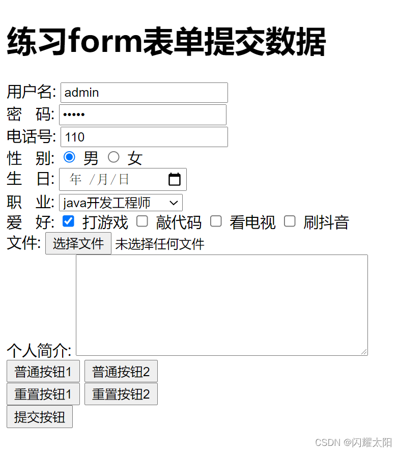


------------