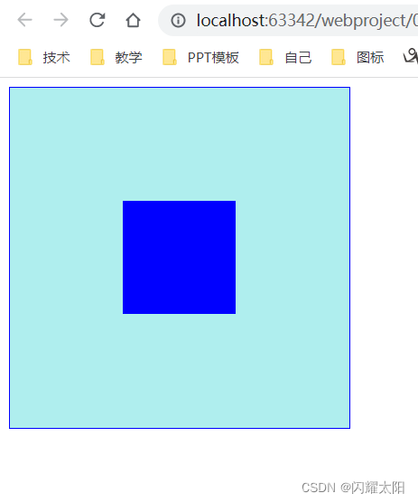

3.1 CSS 样式说明
------------

1.  CSS 指的是层叠样式表 * (Cascading Style Sheets)
2.  CSS 描述了如何在屏幕、纸张或其他媒体上显示 HTML 元素
3.  CSS 节省了大量工作。它可以同时控制多张网页的布局

3.2 CSS 样式对比效果
--------------

1.  没有 CSS 样式的页面  
    
2.  有 CSS 样式的页面  
    

3.3 CSS 引入方式
------------

### 3.3.1 行内样式

说明: 通过 style 属性定义样式, 只对当前行有效

```html
<p style="color: green; font-size: 20px">我是第一个P标签</p>
```

页面效果展现:  


### 3.3.2 内部样式

说明: 一般是在当前页面的 head 标签中添加 style 标签，在 style 标签中编写 css 样式代码; 内部样式仅对当前页面生效  
CSS 语法:

*   CSS 样式由选择器和声明组成，而声明又由属性和值组成。
*   属性和值之间用冒号隔开。
*   多条声明之间用分号隔开。
*   使用 /* … */ 声明注释

```html
<!DOCTYPE html>
<html lang="en">
<head>
    <meta charset="UTF-8">
    <title>CSS样式练习</title>
    <style type="text/css">

        /*为P标签定义颜色和大小*/
        p {
            color: aqua;
            font-size: 25px;
            /*字体样式*/
            font-family: 宋体;
        }
    </style>
</head>
<body>
    <p style="color: green; font-size: 20px">我是第一个P标签</p>
    <p>我是第二个P标签</p>
    <p>我是第三个P标签</p>
</body>
</html>
```

页面效果展现:  


### 3.3.3 外部样式

1.  创建 xxx.css 文件  
    
2.  定义 CSS 样式

```css
p {
    color: cadetblue;
    font-size: 35px;
    font-family: 华文行楷;
}
```

3.  外部样式引入  
    在需要使用这个 CSS 文件的 HTML 页面的 head 标签内加入：

```html
<!DOCTYPE html>
<html lang="en">
<head>
    <meta charset="UTF-8">
    <title>CSS样式练习</title>
    <!--引入外部样式表-->
    <link rel="stylesheet" type="text/css" href="color.css">
</head>
<body>
    <p style="color: green; font-size: 20px">我是第一个P标签</p>
    <p>我是第二个P标签</p>
    <p>我是第三个P标签</p>
</body>
</html>
```


3.4 CSS 选择器用法
-------------

### 3.4.1 ID 选择器

说明: 指定元素 ID, 定义元素样式, 要求每个页面中的 Id 必须唯一.

```html
<!--定义内部样式表-->
    <style type="text/css">

        /* 1.使用id选择器定义样式 */
        #div1 {
            border: aqua 2px solid;
            width: 200px;
            height: 200px;
            background-color: green;
        }

    </style>
```

标记页面元素:

```html
<div id="div1">我是第一个DIV</div>
```

### 3.4.2 类选择器

说明: 通过 class 关键字, 定义元素类型

```css
/*2. 定义类型选择器 使用关键字 . */
        .classdiv {
            border: blue 1px dashed;
            width: 200px;
            height: 200px;
            background-color: yellowgreen;
            float: left;
        }
```

标记页面元素:

```html
<div class="classdiv">我是第二个DIV</div>
```

### 3.4.3 元素选择器

1. 通过定义标签的样式, 展现效果

```css
/* 3.元素选择器 */
        span {
            border: red 2px solid;
            background-color: aliceblue;
            font-size: 40px;
            color: green;
        }
```

2.  页面效果展现  
    

3.5 盒子模型
--------

### 3.5.1 盒子模型示意图


### 3.5.2 margin 关键字

说明: 使用 margin 关键字 表示外边距的位置  
用法:  

1. margin: 100px 100px 100px 100px; 表示修饰上 / 右 / 下 / 左的数据  
2. margin: 100px 100px; 表示修改上下 100 像素 左右 100 像素  
3. margin: auto; 表示左右居中

```html
<!DOCTYPE html>
<html lang="en">
<head>
    <meta charset="UTF-8">
    <title>盒子模型</title>

    <!--定义内部样式-->
    <style type="text/css">
        #div1 {
            width: 300px;
            height: 300px;
            background-color: paleturquoise;
            border: red 1px solid;
        }

        #div2 {
            width: 100px;
            height: 100px;
            background-color: blue;
            /*方向 顺时针,上/右/下/左 */
            /* margin: 100px 100px 100px 100px;*/
            /*方向 如果只有2个 则表示上下100px  左右100px */
            /*margin: 100px 100px;*/
            /*代表左右居中*/
            /*margin: auto;*/
        }
    </style>
</head>
<body>
    <!--1. 定义第一个div-->
    <div id="div1">
        <div id="div2"></div>
    </div>
</body>
</html>
```

### 3.5.3 padding 关键字

说明: padding 表示内边距, 引入内边距会在谷歌浏览器中会导致像素增加. 所以计算时需要留意.

```html
<!DOCTYPE html>
<html lang="en">
<head>
    <meta charset="UTF-8">
    <title>盒子模型</title>

    <!--定义内部样式-->
    <style type="text/css">
        #div1 {
            width: 200px;
            height: 200px;
            background-color: paleturquoise;
            border: blue 1px solid;
            padding-top: 100px;
            padding-left: 100px;
        }

        #div2 {
            width: 100px;
            height: 100px;
            background-color: blue;
            /*方向 顺时针,上/右/下/左 */
            /* margin: 100px 100px 100px 100px;*/
            /*方向 如果只有2个 则表示上下100px  左右100px */
            /*margin: 100px 100px;*/
            /*代表左右居中*/
            /*margin: auto;*/
        }
    </style>
</head>
<body>
    <!--1. 定义第一个div-->
    <div id="div1">
        <div id="div2"></div>
    </div>
</body>
</html>
```

页面效果展现:  


3.6 CSS 课堂练习
------------

按照图中的布局进行演示: 颜色任意  


```html
<html lang="en">
<head>
    <meta charset="UTF-8">
    <title>CSS案例练习</title>
    <!-- 定义内部样式表 -->
    <style type="text/css">
        body {
          margin: 0;
          padding: 0;
        }
        #div1 {
          width: 100%;
          height: 100%;
          background-color: aliceblue;
        }

        #div_top {
          background-color: paleturquoise;
          height: 15%;
        }

        #div_left {
          background-color: yellowgreen;
          height: 85%;
          width: 15%;
          float: left;
        }

        #div_main {
          background-color: aqua;
          height: 75%;
        }

        #div_bottom {
          background-color: brown;
          height: 10%;
        }
    </style>
</head>
<body>
    <div id="div1">
       <div id="div_top">div_top</div>
       <div id="div_left">div_left</div>
       <div id="div_main">div_main</div>
       <div id="div_bottom">div_bottom</div>
    </div>
</body>
</html>
```

3.7 html 课堂作业
-------------

### 3.7.1 index.html 要求

1.  在首页 index.html 中创建两个超链接，我要登录和我要注册

2.  点击登录跳转至登录页面

3.  点击注册跳转至注册页面  
    

### 3.7.2 登录页面要求

1.  登录页面创建表格，需要填写用户名和密码信息
2.  点击登录跳转至登录成功页面
3.  在底部创建回首页的超链接点击回到 index.html  
    

### 3.7.3 注册页面要求

1.  注册页面信息有用户名、密码、确认密码、邮箱

2.  点击注册按钮跳转至注册成功页面

3.  底部创建回到首页的超链接，点击跳转至首页  
    

3.8 作业代码实现
----------

### 3.8.1 代码目录结构


### 3.8.2 编辑 index.html

```html
<!DOCTYPE html>
<html lang="en">
<head>
    <meta charset="UTF-8">
    <title>html作业</title>
</head>
<body>
  <a href="login.html">我要登录</a> <br>
  <a href="register.html">我要注册</a>
</body>
</html>
```

### 3.8.3 编辑 login.html

```html
<!DOCTYPE html>
<html lang="en">
<head>
    <meta charset="UTF-8">
    <title>登陆页面</title>
</head>
<body>
    <h1>登录页面</h1>
    <form action="login_success.html">
        <table border="1" cellspacing="0" cellpadding="10">
            <tr>
                <td colspan="2">
                    
                </td>
            </tr>
            <tr>
                <td align="center">用户名</td>
                <td align="center">
                    <input type="text" />
                </td>
            </tr>
            <tr>
                <td align="center">密码</td>
                <td align="center">
                    <input type="password" />
                </td>
            </tr>
            <tr>
                <td colspan="2" align="center">
                    <button type="submit">登录</button>
                </td>
            </tr>
        </table>
        <a href="index.html">首页</a>
    </form>
</body>
</html>
```

### 3.8.4 编辑 login_success.html 页面

```html
<!DOCTYPE html>
<html lang="en">
<head>
    <meta charset="UTF-8">
    <title>成功页面</title>
</head>
<body>
    <h1>登录成功</h1>
    <a href="index.html">首页</a>
</body>
</html>
```

### 3.8.5 编辑 register.html 页面

```html
<!DOCTYPE html>
<html lang="en">
<head>
    <meta charset="UTF-8">
    <title>注册页面</title>
</head>
<body>
<h1>注册页面</h1>
<form action="register_success.html">
    <table border="1" cellspacing="0" cellpadding="10">
        <tr>
            <td colspan="2">
                
            </td>
        </tr>
        <tr>
            <td align="center">用户名</td>
            <td align="center">
                <input type="text" />
            </td>
        </tr>
        <tr>
            <td align="center">密码</td>
            <td align="center">
                <input type="password" />
            </td>
        </tr>
        <tr>
            <td align="center">密码确认</td>
            <td align="center">
                <input type="password" />
            </td>
        </tr>
        <tr>
            <td align="center">邮箱</td>
            <td align="center">
                <input type="text" />
            </td>
        </tr>
        <tr>
            <td colspan="2" align="center">
                <button type="submit">注册</button>
            </td>
        </tr>
    </table>
    <a href="index.html">首页</a>
</form>
</body>
</html>
```

### 3.8.6 编辑 register_success.html 页面

```html
<!DOCTYPE html>
<html lang="en">
<head>
    <meta charset="UTF-8">
    <title>注册成功</title>
</head>
<body>
    <h1>注册成功</h1>
    <a href="index.html">首页</a>
</body>
</html>
```


-----------------