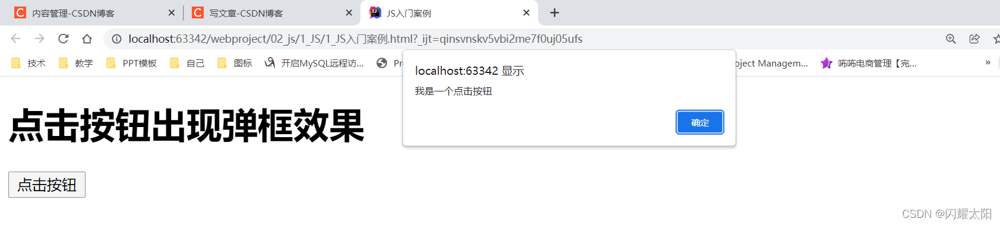
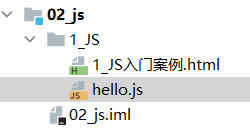
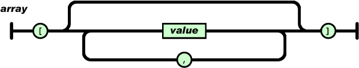
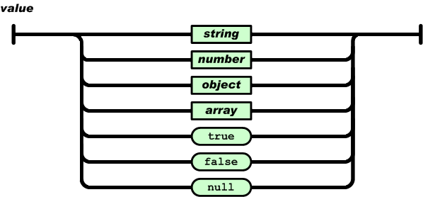
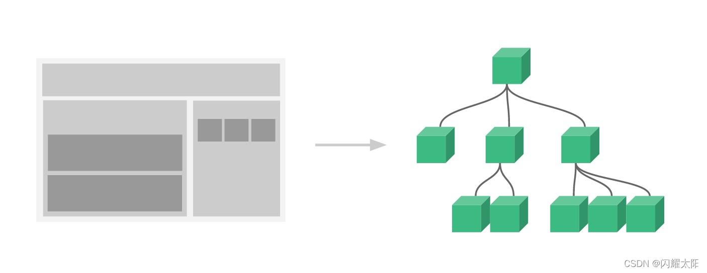
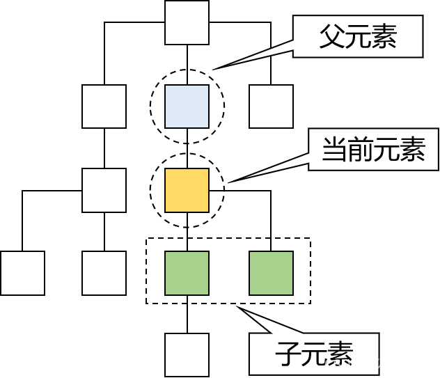
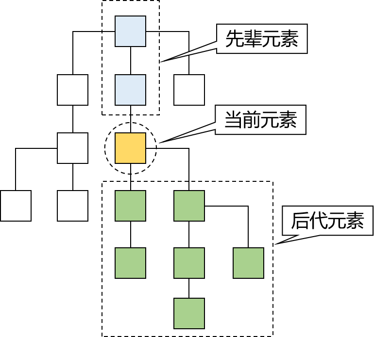
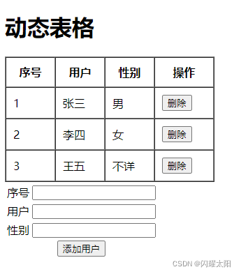

4.1 JavaScript 介绍
-----------------

JavaScript（简称 “JS”） 是一种具有函数优先的轻量级，解释型或即时编译型的编程语言。虽然它是作为开发 Web 页面的脚本语言而出名，但是它也被用到了很多非浏览器环境中，JavaScript 基于原型编程、多范式的动态脚本语言，并且支持面向对象、命令式、声明式、函数式编程范式。 [1]

简洁记忆: JavaScript（简称 “JS”） 是解释型轻量级的函数式编程语言。

4.2 JavaScript 语言组成
-------------------

1.  ECMAScript，描述了该语言的语法和基本对象
2.  文档对象模型（DOM），描述处理网页内容的方法和接口
3.  浏览器对象模型（BOM），描述与浏览器进行交互的方法和接口

4.3 JavaScript 语言特点
-------------------

1.  **脚本语言。JavaScript 是一种解释型的脚本语言**，C、C++ 等语言先编译后执行，而 JavaScript 是在程序的运行过程中逐行进行解释。

2.  **基于对象。JavaScript 是一种基于对象的脚本语言**，它不仅可以创建对象，也能使用现有的对象。

3.  **简单。JavaScript 语言中采用的是弱类型的变量类型**，对使用的数据类型未做出严格的要求，是基于 Java 基本语句和控制的脚本语言，其设计简单紧凑。

4.  **动态性。JavaScript 是一种采用事件驱动的脚本语言，它不需要经过 Web 服务器就可以对用户的输入做出响应。** 在访问一个网页时，鼠标在网页中进行鼠标点击或上下移、窗口移动等操作 JavaScript 都可直接对这些事件给出相应的响应。

5.  **跨平台性。JavaScript 脚本语言不依赖于操作系统，仅需要浏览器的支持**。因此一个 JavaScript 脚本在编写后可以带到任意机器上使用，前提是机器上的浏览器支 持 JavaScript 脚本语言，JavaScript 已被大多数的浏览器所支持。  
    不同于服务器端脚本语言，例如 PHP 与 ASP，JavaScript 主要被作为客户端脚本语言在用户的浏览器上运行，不需要服务器的支持。所以在早期程序员比较青睐于 JavaScript 以减少对服务器的负担，而与此同时也带来另一个问题，安全性。  
    而随着服务器的强壮，虽然程序员更喜欢运行于服务端的脚本以保证安全，但 JavaScript 仍然以其跨平台、容易上手等优势大行其道。同时，有些特殊功能（如 AJAX）必须依赖 JavaScript 在客户端进行支持。

4.4 JavaScript 入门案例
-------------------

### 注释格式

JS的注释符号和Java的注释符号相同，如下：

```javascript
// 单行注释内容
/* 多行注释内容 */
```

### 案例

```html
<!DOCTYPE html>
<html lang="en">
<head>
    <meta charset="UTF-8">
    <title>JS入门案例</title>
    <script type="text/javascript">

        /*  关于JS代码解释    */
         /*1.当页面加载完成之后,执行该函数*/
         window.onload = function (){

             /*
                2从文档对象中获取一个ID为btn的元素对象.
                document对象可以理解为就是当前的整个页面
             */
             var btn = document.getElementById("btn")

             /* 3.为btn的元素绑定单击事件. function为事件的定义 */
             btn.onclick = function (){

                 /*4. alert 为弹出框效果*/
                 alert("我是一个点击按钮")
             }
         }
    </script>
</head>
<body>
    <h1>点击按钮出现弹框效果</h1>
    <button onclick="onClick" id="btn">点击按钮</button>
</body>
</html>
```



4.5 JS 引入方式
-----------

### 4.5.1 内部引用

1.  使用 script 标签体引用 js, js 代码写到标签体的内部.
2.  script 标签体, 可以放到任意的位置.
3.  为了能够方便查询或操作 HTML 标签（元素）script 标签可以写在 body 标签后面

### 4.5.2 外部引用

1. 新建一个 JS 文件, 后缀名为 xxx.js  
     
2. 编辑 JS 文件

```js
window.onload = function (){
    var btn = document.getElementById("btn")
    btn.onclick = function (){
        alert("我是一个点击按钮")
    }
}
```

3.  引入 JS 文件

```html
<head>
    <meta charset="UTF-8">
    <title>JS入门案例</title>
    <script type="text/javascript">

       /* /!*  关于JS代码解释    *!/
         /!*1.当页面加载完成之后,执行该函数*!/
         window.onload = function (){

             /!*
                2从文档对象中获取一个ID为btn的元素对象.
                document对象可以理解为就是当前的整个页面
             *!/
             var btn = document.getElementById("btn")

             /!* 3.为btn的元素绑定单击事件. function为事件的定义 *!/
             btn.onclick = function (){

                 /!*4. alert 为弹出框效果*!/
                 alert("我是一个点击按钮")
             }
         }*/
    </script>
    <script type="text/javascript" src="hello.js">
        /*该标签内部的JS将失效*/
    </script>
</head>
```

4.6 JS 中变量类型
------------

### 4.6.1 关于变量的声明

* 关键字：var, 其实 ECMAScript6 之后建议使用 let

* 数据类型：JavaScript 变量是弱类型的，可以接收任意类型的数据

* 标识符：严格区分大小写

* 变量使用规则

  * 如果使用了一个没有声明的变量，那么会在运行时报错

    Uncaught ReferenceError: b is not defined

  * 如果声明一个变量没有初始化，那么这个变量的值就是 undefined

### 4.6.2 基本数据类型

1.  数值型 number：JavaScript 不区分整数、小数
2.  字符串 string：JavaScript 不区分字符、字符串；单引号、双引号意思一样。
3.  布尔型 boolean：true、false  
    在 JavaScript 中，其他类型和布尔类型的自动转换。  
    true：非零的数值，非空字符串，非空对象  
    false：零，空字符串，null，undefined

```js
	if(null){
            alert("数据有效")
    }else{
        alert("数据无效")
    }
```

**(1)数值类型(number)**

在JS中，所有的数值在底层都是浮点型，但是在处理和显示的过程中会自动的和整型进行转换。

```
例如：2.4+3.6=6
特殊值：Infinity(无穷大) / -Infinity(负无穷大) / NaN(非数字)
```

**(2)字符串类型(string)**

在JS中，字符串类型属于基本数据类型，字符串常量可以使用单引号或者使用双引号引起来。例如：

```javascript
var s1 = "Hello JS";
var s2 = 'Hello JS';//字符串可以是单引号,也可以是双引号
```

另外，JS中字符串类型有对应的包装对象（String），在需要时会自动的和包装对象进行转换。

```javascript
var s1 = "Hello JS";//s1是基本数据类型
console.log( typeof s1 ); //string
var s2 = new String("Hello JS");//s2是复杂数据类型
console.log( typeof s2 ); //object
//不管是基本数据类型s1, 还是对象类型s2, 都可以当作对象来用
console.log( s1.valueOf() ); //s1是基本数据类型, 会转成对象, 调用valueOf函数
console.log( s2.valueOf() );
```

**(3)布尔类型(boolean)**

布尔类型的值有两个，分别为true和false。

**(4)undefined类型**

undefined类型的值只有一个，就是undefined，表示变量未定义(但不是指对象没有声明)。

是指声明了变量，但没有为变量赋值，该变量的值就是undefined。

```javascript
/* 1.undefined类型 */
var x;
alert( x ); //undefined
alert( y ); //抛异常
```

**(5)null类型**

null类型的值也只有一个，就是null，表示空值。

可以作为函数的返回值，表示函数返回的是一个空的对象。

注意：null和undefined类型的变量是不能调用函数或属性的，会抛异常！

**2、复杂数据类型**

主要指对象(JS的内置对象、自定义的对象、函数、数组)

### 4.6.3 JS运算符

JS和Java中的运算符大致相同，例如：

```
算术运算符: +，-，*，/，%，++，--
赋值运算符: =，+=，-=，*=，/=，%=
比较运算符: ==，!=，>，>=，<，<=
位运算符: & ， |
逻辑运算符: && ，|| (短路效果)
前置逻辑运算符: ! (not)
三元运算符: 表达式 ? 表达式 : 表达式
。。。
```


4.7 JS 中函数定义
------------

### 4.7.1 内置函数

1.  alert(“xxxx”)
2.  confirm(“xxx”)
3.  console.log(“xxxxx”)

```html
<script type="text/javascript">
      /*1.内置函数定义*/
      alert("弹出框效果!!!")

      /*2.确认框效果 如果点击确定返回true,如果点击取消返回false*/
      let flag = confirm("是否确定?")
      alert(flag)

      /* 控制台输出函数 */
      console.log("可以在控制台输出内容,通过f12查看")

    </script>
```

### 4.7.2 自定义函数

函数定义语法:

```js
function 函数名(参数列表) {函数体}
```

*   无参无返回值函数定义

```html
<script type="text/javascript">
      /* 二 自定义函数 */

      /* 2.1 无参无返回值函数 function 函数名(参数列表) {函数体}*/
      function fun1(){
         alert("我是一个无参,无返回值函数")
      }
      //函数调用
      fun1()


    </script>
```

*   有参无返回值函数

```js
/* 2.2 有参我返回值函数 */
      function fun2(num1,num2,num3){
          console.log("计算结果:"+ (num1+num2+num3))
      }
      fun2(100,200,300)
```

*   有参有返回值定义  
    说明: 通过 return 关键字返回数据 不需要像 java 一样声明返回值类型

```js
/* 2.3 有参有返回值函数 */
      function fun3(num1,num2,num3){
         return num1 + num2 + num3
      }
      let result = fun3(100,100,100)
      alert(result)
```

### 4.7.3 匿名函数定义

```js
/* 3.匿名函数 */
      //3.1 匿名函数用法
      window.onload = function () {
        alert("这是一个典型的匿名函数")
      }

      //3.2 通过变量指定匿名函数  可以将函数看作是一个对象,之后赋值给fun4, 
      let fun4 = function () {
         alert("我是匿名函数的第二种写法")
      }
      fun4()
```

### 4.7.5、函数的 arguments 隐形参数（只在 function 函数内

就是在 function 函数中不需要定义，但却可以直接用来获取所有参数的变量。我们管它叫隐形参数。

+ 隐形参数特别像 java 基础的可变长参数一样。 
+ public void fun( Object ... args ); 
+ 可变长参数其他是一个数组。 

那么 js 中的隐形参数也跟 java 的可变长参数一样。操作类似数组。 

arguments相当于把传入的参数接受成一个数组，实际调用语法会将相应的形参解析成对应的索引 如 fun(a,b) a相当于arguments[0] b 相当于arguments[1]

```js
!DOCTYPE html>
<html lang="en">
  <head>
    <meta charset="UTF-8" />
    <title>Title</title>
    <script type="text/javascript">
      function fun(a) {
        alert(arguments.length); //可看参数个数, alert( arguments[0] );
        alert(arguments[1]);
        alert(arguments[2]);
        alert("a = " + a);
        for (var i = 0; i < arguments.length; i++) {
          alert(arguments[i]);
        }
        alert("无参函数 fun()");
      }
      // fun(1,"ad",true);
      // 需求：要求 编写 一个函数。用于计算所有参数相加的和并返回
      function sum(num1, num2) {
        var result = 0;
        for (var i = 0; i < arguments.length; i++) {
          if (typeof arguments[i] == "number") {
            result += arguments[i];
          }
        }
        return result;
      }
      alert(sum(1, 2, 3, 4, "abc", 5, 6, 7, 8, 9));
    </script>
  </head>
  <body></body>
</html>
```


4.8 JS 中对象写法
------------

### 4.8.1 new 关键字

```html
<!DOCTYPE html>
<html lang="en">
<head>
    <meta charset="UTF-8">
    <title>对象的写法</title>
  
  <script>
     let obj = new Object();
     //定义属性
     obj.id = 100
     obj.name = "张三"
     obj.age = 18

     //定义函数
     obj.hello = function (){
       console.log("中午该吃饭了!!!")
     }

     obj.say = function (){
       console.log("对世界说: hello")
     }
     console.log(obj)
     obj.say()
     obj.hello()
     
     
  </script>
</head>
<body>
    
</body>
</html>
```

### 4.8.2 {} 写法

```js
//使用{}方式创建对象
     let obj2 = {
       id: 100,
       name: "李四",
       age: 18,
       say: function (){
         console.log("对世界说hai")
       },
       hello: function (){
         console.log("是世界说hello")
       }
     }
     obj2.say();
     obj2.hello()
```

### 4.8.3 this 关键字

*   在函数外面：this 关键字指向 window 对象（代表当前浏览器窗口）

```js
//在外边使用this关键字表示windows窗口对象
       console.log(this.alert("AAAA"))
```

*   在函数里面：this 关键字指向当前对象

```js
	let user = {
            id: 100,
            name: "tomcat",
            getName: function (){
                return this.name
            }
        }

        alert(user.getName())
```

### 4.8.4 向对象中添加属性：

在对象中保存的值称为属性
        向对象中添加属性
        **语法：对象.属性名 = 属性值;`**

```js
    //向object中添加一个属性值
obj.name = "zy";
//向obj中添加gender属性
obj.gender = "男";
//向obj中添加age属性
obj.age = 18;
```
 对象的属性名不强制要求遵守标识符的规范，什么乱七八糟的名字都可以使用，但是我们使用时还是尽量按照标识符的规范去做。


如果使用特殊的属性名，不能使用对象.属性名的方式来操作

需要使用另一种方式 **语法：`对象["属性名"] = 属性值`**

使用[ ]这种形式去操作属性，更加的灵活
        在[ ]中可以直接传递一个变量，这样变量值是多少就会读取那个属性

```js
obj["123"] = 789;
obj["nihao"] = "nihao";

var n = "123";
console.log(obj[n]);//789  因为n的值为"123",而obj对象"123"的属性值为789
```
JS中的属性值可以是任意的数据类型，甚至它也可以是一个对象

### 4.8.5 读取对象中的属性

#### 一、in 判断对象是否含有属性

语法：对象.属性名

如果读取对象中没有的属性，不会报错而是返回undefined

in 运算符
            -通过该运算符可以检查一个对象是否含有指定的属性
                    如果有则返回true，没有则返回false
            -语法：
                "属性名" in 对象

```js
	//检查obj中是否含有test2属性
	console.log("test2" in obj);//false
	console.log("test" in obj);//true
```
#### 二、获取对象属性和方法

**`Object.keys()`** 返回对象的**可枚举属性和方法**的**名称数组**。

**`Object.getOwnPropertyNames() `**返回的**数组**的所有属性(**可枚举或不可枚举**)直接找到给定对象。

```js
     // 创建一个对象的构造方法
     function myObj(name, attr) {
         this.name = name;
         this.attr = attr;
 
         this.sayHi = function () {
             return 'hi everyone!!!';
         }
     }
 
     // 创建一个对象
     var myTester = new myObj("shinejaie", 1)
     // 获取直接在对象上定义(可枚举)的属性和方法
     var arr = Object.keys(myTester);
     console.log('arr', arr); // 输出 arr ["name", "attr", "sayHi"]
 
     // 返回的数组的所有属性(可枚举或不可枚举)直接找到给定对象。
     console.log("attr", Object.getOwnPropertyNames(myTester)); // 输出 attr ["name", "attr", "sayHi"]
 
     // 在 Object 原型上增加一个属性
     Object.prototype.newShine = "it's me";
 
     // 返回可枚举属性一直找到该对象的原型链
     for (var i in myTester) {
         console.log(i);
     }
     // 输出 name,attr,sayHi,newShine
 
     // 返回直接定义在该对象上的可枚举属性
     for (var i in myTester) {
         if (myTester.hasOwnProperty(i)) {
             console.log(i);
         }
     }
     // 输出 name,attr,sayHi
```


#### 三、keys()、`OgetOwnPropertyNames()、for...in...对比`

```js
    // 不可枚举的对象属性
    var nonenum = Object.create({}, {
        getFoo: {
            value: function () {
                return this.foo;
            },
            enumerable: false
        }
    });
    nonenum.foo = 1;
    nonenum.asj = 2;

    // 获取对象可枚举或不可枚举的属性
    console.log(Object.getOwnPropertyNames(nonenum).sort()); // 输出 ["asj", "foo", "getFoo"]

    // 获取对象可枚举的属性
    console.log(Object.keys(nonenum).sort()); // 输出 ["asj", "foo"]

    // 返回直接定义在该对象上的可枚举属性
    for (var i in nonenum) {
        if (nonenum.hasOwnProperty(i)) {
            console.log(i); // 输出 foo asj
        }
    }
```


####  **四、\**分别获取\**JavaScript对象属性名和方法名**

```js
    // 创建一个对象的构造方法
    function myObj(name, attr) {
        this.name = name;
        this.attr = attr;

        this.sayHi = function () {
            return 'hi everyone!!!';
        }
    }

    // 创建一个对象
    var myTester = new myObj("shinejaie", 1)

    // 获取对象方法
    for (var i in myTester) {
        if (myTester.hasOwnProperty(i) && typeof myTester[i] == "function") {
            console.log("对象方法: ", i, "=", myTester[i])
        }
    }
    // 输出 对象方法: sayHi = () { return 'hi everyone!!!'; }

    // 获取对象属性
    for (var i in myTester) {
        if (myTester.hasOwnProperty(i) && typeof myTester[i] != "function") {
            console.log("对象属性: ", i);
        }
    }
    // 输出 对象属性: name 对象属性: attr
```

### 4.8.6 修改对象的属性值

语法：对象.属性名 = 新值

```js
obj.age = 22;

obj[age] = 22;
```


### 4.8.7 删除对象的属性

语法：delete 对象.属性名

```js
delete obj.age;
```


4.9 数组用法
--------

### 4.9.1 使用 new 关键字创建数组

```js
/* 1.使用new关键字 创建数组  */
    let array = new Array()
    array[0] = 'a'
    array[1] = 'b'
    array[2] = 'c'
    array[3] = 'd'
    console.log(array)
```

### 4.9.2 使用 [] 方式创建数组

```js
/* 2.使用[]方式创建数组   */
    let array2 = [1,2,3,4]
    console.log(array2)
```

### 4.9.3 数组函数关键字

*   push 向数组追加数据

```js
/* 3.使用push入栈 */
    let temp = ['张三','李四']
    temp.push('王五')
    temp.push('炸弹')
    console.log(temp)
```

*   pop 出栈

```js
/* 4.使用pop出栈,出栈后数组数据减少1
    *  topElement表示出栈的数据
    */
    let topElement = temp.pop()
    console.log(topElement)
    console.log(temp)
```

*   reverse 数组数据反转

```js
/**
     * 5.使用reverse反转数据
     */
    temp.reverse(); //等价于 temp = temp.reverse()
    console.log(temp)
```

*   join 数组拼接为字符串

```js
/**
     * 6.使用join关键字 将数组拼接为字符串
     */
    let str = temp.join(",")
    console.log(str)
```

*   split 数组拼接为字符串

```js
/**
     * 7.将字符串转化为数组
     */
    let str2 = "100,33,44,55,66"
    let temp2 = str2.split(",")
    console.log(temp2)
```

*   splice 删除数组数据

```js
/**
     * 8.数组删除数据  array3.splice(起始位置,删除几个)
     */
    let array3 = ['a','b','c']
    array3.splice(2,1)
    console.log(array3)
```


#### **常用方法：**

- **toString()** - 将数组转换为以逗号分隔的字符串。
- **join()** - 将所有数组元素组合成一个字符串。
- **concat** - 将两个数组组合在一起，或者将更多项添加到数组中，然后返回一个新数组。
- **push()** - 将项目添加到数组的末尾，**改变**原始数组。
- **pop()** - 删除数组的最后一项并**返回**
- **shift()** - 删除数组的第一项并**返回**
- **unshift()** - 将一个项添加到数组的开头，**改变**原始数组。
- **splice()** - 通过添加，删除和插入元素**修改**一个数组。
- **slice()** - 复制数组的给定部分，并将复制的部分作为新数组返回。 **它不会改变原始数组。**
- **split()** - 将一个字符串分成子串并将它们作为数组返回。
- **indexOf()** - 查找数组中的项目并返回其**索引**，如果没找到则返回`-1`
- **lastIndexOf()** - 从右到左查找项目并返回找到的最后一个索引。
- **filter()** - 如果数组的项目符合某个条件，则创建一个新数组。
- **map()** - 通过操纵数组中的值来创建一个新数组。
- **reduce()** - 根据数组中的单个值进行计算。
- **forEach()** - 遍历数组，将函数作用于数组中的所有项
- **every()** - 检查数组中的所有项是否都符合指定的条件，如果符合则返回 `true`，否则返回 `false`。
- **some()** - 检查数组中的项（一个或多个）是否符合指定的条件，如果符合则返回 true，否则返回 false。
- **includes()** - 检查数组是否包含某个项目。

```javascript
一、concat()
concat() 方法用于连接两个或多个数组。该方法不会改变现有的数组，仅会返回被连接数组的一个副本。

var arr1 = [1,2,3];
var arr2 = [4,5];
var arr3 = arr1.concat(arr2);
console.log(arr1); //[1, 2, 3]
console.log(arr3); //[1, 2, 3, 4, 5]
二、join()
join() 方法用于把数组中的所有元素放入一个字符串。元素是通过指定的分隔符进行分隔的，默认使用','号分割，不改变原数组。

var arr = [2,3,4];
console.log(arr.join());  //2,3,4
console.log(arr);  //[2, 3, 4]
三、push()
push() 方法可向数组的末尾添加一个或多个元素，并返回新的长度。末尾添加，返回的是长度，会改变原数组。

var a = [2,3,4];
var b = a.push(5);
console.log(a);  //[2,3,4,5]
console.log(b);  //4
push方法可以一次添加多个元素push(data1,data2....)
四、pop()
pop() 方法用于删除并返回数组的最后一个元素。返回最后一个元素，会改变原数组。

var arr = [2,3,4];
console.log(arr.pop()); //4
console.log(arr);  //[2,3]
五、shift()
shift() 方法用于把数组的第一个元素从其中删除，并返回第一个元素的值。返回第一个元素，改变原数组。

var arr = [2,3,4];
console.log(arr.shift()); //2
console.log(arr);  //[3,4]
六、unshift()
unshift() 方法可向数组的开头添加一个或更多元素，并返回新的长度。返回新长度，改变原数组。

var arr = [2,3,4,5];
console.log(arr.unshift(3,6)); //6
console.log(arr); //[3, 6, 2, 3, 4, 5]
tip:该方法可以不传参数,不传参数就是不增加元素。
七、slice()
返回一个新的数组，包含从 start 到 end （不包括该元素）的 arrayObject 中的元素。返回选定的元素，该方法不会修改原数组。

var arr = [2,3,4,5];
console.log(arr.slice(1,3));  //[3,4]
console.log(arr);  //[2,3,4,5]
八、splice()
splice() 方法可删除从 index 处开始的零个或多个元素，并且用参数列表中声明的一个或多个值来替换那些被删除的元素。如果从 arrayObject 中删除了元素，则返回的是含有被删除的元素的数组。splice() 方法会直接对数组进行修改。

var a = [5,6,7,8];
console.log(a.splice(1,0,9)); //[]
console.log(a);  // [5, 9, 6, 7, 8]
var b = [5,6,7,8];
console.log(b.splice(1,2,3));  //[6, 7]
console.log(b); //[5, 3, 8]

十、sort 排序
按照 Unicode code 位置排序，默认升序

var fruit = ['cherries', 'apples', 'bananas'];
fruit.sort(); // ['apples', 'bananas', 'cherries']

var scores = [1, 10, 21, 2];
scores.sort(); // [1, 10, 2, 21]
十一、reverse()
reverse() 方法用于颠倒数组中元素的顺序。返回的是颠倒后的数组，会改变原数组。

var arr = [2,3,4];
console.log(arr.reverse()); //[4, 3, 2]
console.log(arr);  //[4, 3, 2]
十二、indexOf 和 lastIndexOf
都接受两个参数：查找的值、查找起始位置
不存在，返回 -1 ；存在，返回位置。indexOf 是从前往后查找， lastIndexOf 是从后往前查找。
indexOf

var a = [2, 9, 9];
a.indexOf(2); // 0
a.indexOf(7); // -1

if (a.indexOf(7) === -1) {
  // element doesn't exist in array
}
lastIndexOf

var numbers = [2, 5, 9, 2];
numbers.lastIndexOf(2);     // 3
numbers.lastIndexOf(7);     // -1
numbers.lastIndexOf(2, 3);  // 3
numbers.lastIndexOf(2, 2);  // 0
numbers.lastIndexOf(2, -2); // 0
numbers.lastIndexOf(2, -1); // 3
十三、every
对数组的每一项都运行给定的函数，每一项都返回 ture,则返回 true

function isBigEnough(element, index, array) {
  return element < 10;
}    
[2, 5, 8, 3, 4].every(isBigEnough);   // true
十四、some
对数组的每一项都运行给定的函数，任意一项都返回 ture,则返回 true

function compare(element, index, array) {
  return element > 10;
}    
[2, 5, 8, 1, 4].some(compare);  // false
[12, 5, 8, 1, 4].some(compare); // true
十五、filter
对数组的每一项都运行给定的函数，返回 结果为 ture 的项组成的数组

var words = ["spray", "limit", "elite", "exuberant", "destruction", "present", "happy"];

var longWords = words.filter(function(word){
  return word.length > 6;
});
// Filtered array longWords is ["exuberant", "destruction", "present"]
十六、map
对数组的每一项都运行给定的函数，返回每次函数调用的结果组成一个新数组

var numbers = [1, 5, 10, 15];
var doubles = numbers.map(function(x) {
   return x * 2;
});
// doubles is now [2, 10, 20, 30]
// numbers is still [1, 5, 10, 15]
十七、forEach 数组遍历
const items = ['item1', 'item2', 'item3'];
const copy = [];    
items.forEach(function(item){
  copy.push(item)
});
ES6新增新操作数组的方法
1、find()：
传入一个回调函数，找到数组中符合当前搜索规则的第一个元素，返回它，并且终止搜索。

const arr = [1, "2", 3, 3, "2"]
console.log(arr.find(n => typeof n === "number")) // 1
2、findIndex()：
传入一个回调函数，找到数组中符合当前搜索规则的第一个元素，返回它的下标，终止搜索。

const arr = [1, "2", 3, 3, "2"]
console.log(arr.findIndex(n => typeof n === "number")) // 0
3、fill()：
用新元素替换掉数组内的元素，可以指定替换下标范围。

arr.fill(value, start, end)
4、copyWithin()：
选择数组的某个下标，从该位置开始复制数组元素，默认从0开始复制。也可以指定要复制的元素范围。

arr.copyWithin(target, start, end)
const arr = [1, 2, 3, 4, 5]
console.log(arr.copyWithin(3))
 // [1,2,3,1,2] 从下标为3的元素开始，复制数组，所以4, 5被替换成1, 2
const arr1 = [1, 2, 3, 4, 5]
console.log(arr1.copyWithin(3, 1)) 
// [1,2,3,2,3] 从下标为3的元素开始，复制数组，指定复制的第一个元素下标为1，所以4, 5被替换成2, 3
const arr2 = [1, 2, 3, 4, 5]
console.log(arr2.copyWithin(3, 1, 2)) 
// [1,2,3,2,5] 从下标为3的元素开始，复制数组，指定复制的第一个元素下标为1，结束位置为2，所以4被替换成2
5、from
将类似数组的对象（array-like object）和可遍历（iterable）的对象转为真正的数组

const bar = ["a", "b", "c"];
Array.from(bar);
// ["a", "b", "c"]

Array.from('foo');
// ["f", "o", "o"]
6、of
用于将一组值，转换为数组。这个方法的主要目的，是弥补数组构造函数 Array() 的不足。因为参数个数的不同，会导致 Array() 的行为有差异。

Array() // []
Array(3) // [, , ,]
Array(3, 11, 8) // [3, 11, 8]
Array.of(7);       // [7]
Array.of(1, 2, 3); // [1, 2, 3]

Array(7);          // [ , , , , , , ]
Array(1, 2, 3);    // [1, 2, 3]
7、entries() 返回迭代器：返回键值对
//数组
const arr = ['a', 'b', 'c'];
for(let v of arr.entries()) {
  console.log(v)
}
// [0, 'a'] [1, 'b'] [2, 'c']

//Set
const arr = new Set(['a', 'b', 'c']);
for(let v of arr.entries()) {
  console.log(v)
}
// ['a', 'a'] ['b', 'b'] ['c', 'c']

//Map
const arr = new Map();
arr.set('a', 'a');
arr.set('b', 'b');
for(let v of arr.entries()) {
  console.log(v)
}
// ['a', 'a'] ['b', 'b']
8、values() 返回迭代器：返回键值对的value
//数组
const arr = ['a', 'b', 'c'];
for(let v of arr.values()) {
  console.log(v)
}
//'a' 'b' 'c'

//Set
const arr = new Set(['a', 'b', 'c']);
for(let v of arr.values()) {
  console.log(v)
}
// 'a' 'b' 'c'

//Map
const arr = new Map();
arr.set('a', 'a');
arr.set('b', 'b');
for(let v of arr.values()) {
  console.log(v)
}
// 'a' 'b'
9、keys() 返回迭代器：返回键值对的key
//数组
const arr = ['a', 'b', 'c'];
for(let v of arr.keys()) {
  console.log(v)
}
// 0 1 2

//Set
const arr = new Set(['a', 'b', 'c']);
for(let v of arr.keys()) {
  console.log(v)
}
// 'a' 'b' 'c'

//Map
const arr = new Map();
arr.set('a', 'a');
arr.set('b', 'b');
for(let v of arr.keys()) {
  console.log(v)
}
// 'a' 'b'
10、includes
判断数组中是否存在该元素，参数：查找的值、起始位置，可以替换 ES5 时代的 indexOf 判断方式。indexOf 判断元素是否为 NaN，会判断错误。

var a = [1, 2, 3];
a.includes(2); // true
a.includes(4); // false=
```


### 4.9.4 循环遍历写法

#### 4.9.4.1 普通 for 循环

```js
let array = [1,3,4,5]
        for(i=0; i<array.length; i++){
            alert(array[i])
        }
```

#### 4.9.4.2 遍历属性 / 下标–in 关键字

```js
let array = [1,2,3,4]
	for(index in array){
	    console.log(array[index])
	}

	let user = {id:100,name:"tomcat"}
	for(index in user){
	    console.log(index)  //id  100
	    console.log(user.index) //编译失败
	    //当属性为变量时 使用[]获取 .不可以获取
	    console.log(user[index])
	}
```

#### 4.9.4.3 增强 for-of

```js
let array = [1,2,3,4] 	
	for(num of array){
	    console.log(num)
	}
```

4.10 JSON
---------

### 4.10.1 JSON 介绍

**JSON(JavaScript Object Notation) 是一种轻量级的数据交换格式。** 易于人阅读和编写。同时也易于机器解析和生成。 它基于 JavaScript Programming Language, Standard ECMA-262 3rd Edition - December 1999 的一个子集。 JSON 采用完全独立于语言的文本格式，但是也使用了类似于 C 语言家族的习惯（包括 C, C++, C#, Java, JavaScript, Perl, Python 等）。 这些特性使 JSON 成为理想的数据交换语言。

主要作用: 主要作用实现服务器之间数据交互. 本质就是字符串  
JSON 格式:

*   JSON 对象格式
*   JOSN 数组格式

### 4.10.2 JSON 对象格式

对象（object） 是一个无序的 “‘名称 / 值’对” 集合。一个对象以 “{”（左括号）开始，“}”（右括号）结束。每个“名称” 后跟一个 “:”（冒号）；“‘名称 / 值’ 对” 之间使用“,”（逗号）分隔。


```json
{"id": 100, "name": "tomcat猫", "age": 18}
```

### 4.10.3 Array 数组格式

值（value） 可以是双引号括起来的字符串（string）、数值 (number)、true、false、 null、对象（object）或者数组（array）。这些结构可以嵌套。



```json
["a","b","c","d"]
```

### 4.10.4 嵌套结构

值（value） 可以是双引号括起来的字符串（string）、数值 (number)、true、false、 null、对象（object）或者数组（array）。这些结构可以嵌套。



```json
[{"id": 1,"name":"tomcat猫"},{"id": 2,"name":"狗"},{"id": 3,"name":"猪"}]
```

### 4.10.5 JS 中的 JSON 结构

说明: JSON 的数据结构和 JS 数据结构一脉相承. 所以语法相同.

```json
//本质:对象的写法 JSON就是一种特殊的JS
        //1.定义JS对象
        let jsObject = {
          id: 100,
          name: "js对象写法"
        }
        alert(jsObject.name)

        //2. JSON对象格式
        let jsonObject = {
          "id": 100,
          "name": "json对象写法"
        }
        alert(jsonObject.name)

        //3. Array写法
        let array = ["a","b","c"]
        alert(array[0])

        //4.嵌套格式的写法
        let object_array = {
          "id": 100,
          "name": "tomcat猫",
          "hobbys" : ["吃鱼","吃肉","吃猫粮"]
        }
        console.log(object_array)
```

### 4.10.6 JSON 串与 JSON 对象转化

```json
//5.JSON串与JSON对象之间转化
        let jsonObj = {
          "id": 1000,
          "name": "dog狗",
          "age": 6
        }
        //json对象转化为字符串
        let str = JSON.stringify(jsonObj)
        alert(typeof(str))
        //json串转化为JSON对象
        let obj = JSON.parse(str)
        console.log(obj)
```

4.11 DOM 操作
-----------

### 4.11.1 JavaScript 的 DOM 对象

DOM 是 Document Object Model 的缩写，意思是『文档对象模型』——将 HTML 文档抽象成模型，再封装成对象方便用程序操作。  
这是一种非常常用的编程思想：将现实世界的事物抽象成模型，这样就非常容易使用对象来量化的描述现实事物，从而把生活中的问题转化成一个程序问题，最终实现用应用软件协助解决现实问题。而在这其中『模型』就是那个连通现实世界和代码世界的桥梁。

### 4.11.2 DOM 树的概念

浏览器把 HTML 文档从服务器上下载下来之后就开始按照『从上到下』的顺序『读取 HTML 标签』。每一个标签都会被封装成一个『对象』

而第一个读取到的肯定是根标签 html，然后是它的子标签 head，再然后是 head 标签里的子标签…… 所以从 html 标签开始，整个文档中的所有标签都会根据它们之间的『父子关系』被放到一个 『树形结构』的对象中



### 4.11.3 各个组成部分的类型

整个文档中的一切都可以看做 Node。各个具体组成部分的具体类型可以看做 Node 类型的子类。

> 其实严格来说，JavaScript 并不支持真正意义上的『继承』，这里我们借用 Java 中的『继承』概念，从逻辑上来帮助我们理解各个类型之间的关系。

<table><thead><tr><th>组成部分</th><th>节点类型</th><th>具体类型</th></tr></thead><tbody><tr><td>整个文档</td><td>文档节点</td><td>Document</td></tr><tr><td>HTML 标签</td><td>元素节点</td><td>Element</td></tr><tr><td>HTML 标签内的文本</td><td>文本节点</td><td>Text</td></tr><tr><td>HTML 标签内的属性</td><td>属性节点</td><td>Attr</td></tr></tbody></table>

### 4.11.4 父子关系



### 4.11.5 先辈后代关系



### 4.11.6 DOM 操作

由于实际开发时基本上都是使用 JavaScript 的各种框架来操作，而框架中的操作方式和我们现在看到的原生操作完全不同，所以下面罗列的 API 仅供参考，不做要求。

##### 4.11.6.1 在整个文档范围内查询元素节点

<table><thead><tr><th>功能</th><th>API</th><th>返回值</th></tr></thead><tbody><tr><td>根据 id 值查询</td><td>document.getElementById(“id 值”)</td><td>一个具体的元素节</td></tr><tr><td>根据标签名查询</td><td>document.getElementsByTagName(“标签名”)</td><td>元素节点数组</td></tr><tr><td>根据 name 属性值查询</td><td>document.getElementsByName(“name 值”)</td><td>元素节点数组</td></tr><tr><td>根据类名查询</td><td>document.getElementsByClassName(“类名”)</td><td>元素节点数组</td></tr></tbody></table>

document.querySelector(“选择器的名字”);
根据选择器获取元素,返回来的是一个元素对象
getAttribute(“自定义属性的名字”)
获取标签自定义属性的方法（不是DOM元素）：


##### 4.11.6.2 在具体元素节点范围内查找子节点

<table><thead><tr><th>功能</th><th>API</th><th>返回值</th></tr></thead><tbody><tr><td>查找子标签</td><td>element.children</td><td>返回子标签数组</td></tr><tr><td>查找第一个子标签</td><td>element.firstElementChild</td><td>标签对象</td></tr><tr><td>查找最后一个子标签</td><td>element.lastElementChild</td><td>节点对象</td></tr></tbody></table>

##### 4.11.6.3 查找指定元素节点的父节点

<table><thead><tr><th>功能</th><th>API</th><th>返回值</th></tr></thead><tbody><tr><td>查找指定元素节点的父标签</td><td>element.parentElement</td><td>标签对象</td></tr></tbody></table>

##### 4.11.6.4 查找指定元素节点的兄弟节点

<table><thead><tr><th>功能</th><th>API</th><th>返回值</th></tr></thead><tbody><tr><td>查找前一个兄弟标签</td><td>node.previousElementSibling</td><td>标签对象</td></tr><tr><td>查找后一个兄弟标签</td><td>node.nextElementSibling</td><td>标签对象</td></tr></tbody></table>

##### 4.11.6.5 属性操作

<table><thead><tr><th>需求</th><th>操作方式</th></tr></thead><tbody><tr><td>读取属性值</td><td>元素对象. 属性名</td></tr><tr><td>修改属性值</td><td>元素对象. 属性名 = 新的属性值</td></tr></tbody></table>

##### 4.11.6.6 标签体的操作

<table><thead><tr><th>需求</th><th>操作方式</th></tr></thead><tbody><tr><td>获取或者设置标签体的文本内容</td><td>element.innerText</td></tr><tr><td>获取或者设置标签体的内容</td><td>element.innerHTML</td></tr></tbody></table>

##### 4.11.6.7 DOM 增删改操作

<table><thead><tr><th>API</th><th>功能</th></tr></thead><tbody><tr><td>document.createElement(“标签名”)</td><td>创建元素节点并返回，但不会自动添加到文档中</td></tr><tr><td>document.createTextNode(“文本值”)</td><td>创建文本节点并返回，但不会自动添加到文档中</td></tr><tr><td>element.append(ele)</td><td>将 ele 添加到 element 元素中</td></tr><tr><td>element.appendChild(ele)</td><td>将 ele 添加到 element 所有子节点后面</td></tr><tr><td>parentEle.insertBefore(newEle,targetEle)</td><td>将 newEle 插入到 targetEle 前面</td></tr><tr><td>parentEle.replaceChild(newEle, oldEle)</td><td>用新节点替换原有的旧子节点</td></tr><tr><td>element.remove()</td><td>删除某个标签</td></tr></tbody></table>

```html
<!DOCTYPE html>
<html lang="en">
<head>
    <meta charset="UTF-8">
    <title>DOM操作</title>
    <script type="text/javascript">
      window.onload = function () {
        //1.根据ID获取元素信息
        let inputId = document.getElementById("id");
        inputId.value = "123456"

        //2.根据name属性获取元素信息
        let inputNames = document.getElementsByName("id");
        //alert(inputNames.length)
        inputNames[0].value= "aabbcc"

        //3.通过input标签获取元素
        let inputTags =  document.getElementsByTagName("input")
        //alert("input标签的个数:"+inputTags.length)
        inputTags[0].value= "dddddd"

        //4.通过class类型获取数据
        let classTag = document.getElementsByClassName("classTag")
        //alert("通过类型获取元素的个数:"+classTag.length)
        classTag[0].value = "通过class类型获取数据"

        //5.查找指定元素的子元素
        let childrens = document.getElementById("div1").children;
        //alert("子节点个数:"+childrens.length)

        //6.获取第一个子元素
        let firstP = document.getElementById("div1").firstElementChild
        console.log(firstP)

        //7.获取最后一个子节点
        let lastP = document.getElementById("div1").lastElementChild
        console.log(lastP)

        //8.根据指定元素,查找父节点
        let div1 = document.getElementById("p1").parentElement
        console.log(div1)

        //9.查找指定兄弟的 前一个
        let element1 = document.getElementById("p2").previousElementSibling
        console.log(element1)

        //10.查找指定兄弟元素的后一个
        let element2 = document.getElementById("p2").nextElementSibling
        console.log(element2)

        //11.获取元素属性和属性值  获取id="p1"的ID值
        let idAttr = document.getElementById("p1").id
        console.log(idAttr)

        //12 将id="p1" 修改为p3
        document.getElementById("p1").id = "p3"

        //13 获取标签体的内容
        let text1 = document.getElementById("p2").innerText
        console.log(text1)

        //14 修改id=p2标签体的内容
        document.getElementById("p2").innerText = "这条路好难走,太难走"

        //15 获取id=div1 的标签体内容
        let div1Html = document.getElementById("div1").innerHTML
        console.log(div1Html)

        //16 修改id=div1的内容
        document.getElementById("div1").innerHTML = "<p>这条路太难走,什么时候是个头</p>"

          //二 DOM操作页面元素
          //2.1 创建一个ul元素
          let ul = document.createElement("ul")
          let div = document.getElementById("demo2")
          let li1 = document.createElement("li")
          //2.2 为页面属性赋值
          li1.id = "li1"
          li1.innerText = "产品设计"

          let li2 = document.createElement("li")
          li2.id = "li2"
          li2.innerText = "UI设计"

          let li3 = document.createElement("li")
          li3.id = "li3"
          li3.innerText = "WEB前端开发"

          let li4 = document.createElement("li")
          li4.id = "li4"
          li4.innerText = "JAVA后端开发"

          //2.3 将li标签添加到ul标签中
          ul.append(li1)
          ul.append(li2)
          ul.append(li3)
          ul.append(li4)
          //将ul标签添加到div中
          div.append(ul)

          //2.4 在ul标签之前,添加p标签  <p id="p1">DOM操作案例练习</p>
          let p1 = document.createElement("p")
          p1.id = "p1"
          p1.innerText = "DOM操作案例练习"
          div.insertBefore(p1,ul)

          //2.5 用新节点替换原有的旧子节点 用新的li标签 替换li4
          let li5 = document.createElement("li")
          li5.id = "li5"
          li5.innerText = "我是一个新标签,替换原来的标签"
          //找到当前元素的父级标签,之后进行替换
          ul.replaceChild(li5,li4)

          //2.6 删除某个标签 将li5标签删除
          li5.remove()
      }

    </script>
</head>
<body>
  用户编号: <input id="id" type="text" />

  <div id="div1">
      <p id="p1">天青色等烟雨,</p>
      <p id="p2">而我在等你.</p>
      <p>炊烟袅袅升起,</p>
      <p>隔江千万里.</p>
  </div>

  <hr>
  <!--2. 利用DOM 在div中生成ul-li标签 -->
  <!-- <div id="demo2">
      <ul>
          <li id="li1">产品设计</li>
          <li id="li2">UI设计</li>
          <li id="li3">WEB前端开发</li>
          <li id="li4">JAVA后端开发</li>
      </ul>
  </div>-->
  <div id="demo2"></div>


</body>
</html>
```

### 4.11.8 JavaScript 的事件驱动

##### 4.11.8.1 事件的概念

*   HTML 事件是发生在 HTML 元素上的 “事情”， 是浏览器或用户做的某些事情
*   事件通常与函数配合使用，这样就可以通过发生的事件来驱动函数执行。

##### 4.11.8.2 常见事件

<table><thead><tr><th>属性</th><th>此事件发生在何时…</th></tr></thead><tbody><tr><td>onclick</td><td>当用户点击某个对象时调用的事件句柄。</td></tr><tr><td>ondblclick</td><td>当用户双击某个对象时调用的事件句柄。</td></tr><tr><td>onchange</td><td>域的内容被改变。 离焦时触发</td></tr><tr><td>onblur</td><td>元素失去焦点。</td></tr><tr><td>onfocus</td><td>元素获得焦点。</td></tr><tr><td>onload</td><td>一张页面或一幅图像完成加载。</td></tr><tr><td>onsubmit</td><td>确认按钮被点击；表单被提交。</td></tr><tr><td>onkeydown</td><td>某个键盘按键被按下。</td></tr><tr><td>onkeyup</td><td>某个键盘按键被松开。</td></tr><tr><td>onmousedown</td><td>鼠标按钮被按下。</td></tr><tr><td>onmouseup</td><td>鼠标按键被松开。</td></tr><tr><td>onmouseout</td><td>鼠标从某元素移开。</td></tr><tr><td>omouseover</td><td>鼠标移到某元素之上。</td></tr><tr><td>onmousemove</td><td>鼠标在某元素上移动时 (位置改变时) 触发</td></tr></tbody></table>

##### 4.11.8.3 事件绑定的方式

 a. 普通函数方式 (设置标签的属性)

```html
<标签 属性="js代码，调用函数"></标签>
```

 b. 匿名函数方式

```html
<script>
    标签对象.事件属性 = function(){
        //执行一段代码
    }
</script>
```

##### 4.11.8.4 事件绑定案例练习

```html
<!DOCTYPE html>
<html lang="en">
<head>
    <meta charset="UTF-8">
    <title>事件操作</title>
    <script type="text/javascript">

        /*1.事件定义方式1 */
        function click1() {
            alert("点击事件")
        }

        function change(){
            console.log("内容修改触发!!!")
        }

        function onblur1(){
            alert("元素离焦时触发")
        }

        function onfocus1(){
            console.log("元素获取焦点时触发!!!")
        }

        function down(){  //优先级1
            console.log("键盘按下!!!")
        }

        function press(){ //优先级2
            console.log("键盘按下之后,谈起瞬间")
        }

        function up(){    //优先级3
            console.log("键盘弹起时触发!!!!")
        }

        function mousedown(){
            console.log("鼠标按下触发")
        }

        function mouseup(){
            console.log("鼠标弹起时触发")
        }

        function mouseout(){
            console.log("鼠标弹起时触发")
        }

        function mouseover(){
            console.log("鼠标移入时触发")
        }

        function mouseout(){
            console.log("鼠标移出时触发")
        }

        /*事件作用的元素对象*/
        function click3(){
            alert(event.target.name)
        }


        /*2.事件定义方式2*/
        window.onload = function () {
            document.getElementById("btn2").onclick = function (){
                alert("点击事件2")
            }
        }
    </script>
</head>
<body>
    <!--1.常用事件定义-->
    <button onclick="click1()">单击事件1</button>
    <button id="btn2">单击事件2</button> <br>

    <!--2.常见事件练习-->

    <!--2.1 内容改变时触发 失去焦点时触发,如果修改立即触发则需要添加监听事件!!! -->
    change事件: <input id="name" type="text"  /><br>

    <!--2.2 元素失去焦点时触发   注意:函数起名时 不要使用关键字!!!-->
    onblur事件: <input type="text" ><br>

    <!--2.3 元素获取焦点时触发 -->
    onfocus事件: <input type="text" onfocus="onfocus1()"><br>

    <!--2.4 键盘按下和抬起事件 -->
    键盘按下弹起事件: <input type="text" onkeydown="down()" onkeypress="press()" onkeyup="up()"><br>

    <!--2.5 鼠标事件
        οnmοusedοwn="mousedown()"  鼠标按下
        οnmοuseup="mouseup()"      鼠标弹起
        οnmοuseοver="mouseover()"  鼠标移入
        οnmοuseοut="mouseout()"    鼠标移出
        onmouseenter 与  onmouseover 类似  只是不支持冒泡(了解)
        onmouseleave 与  onmouseout  类似  只是不支持冒泡(了解)
     -->
    鼠标事件: <input type="text" onmouseover="mouseover()"><br>

    <!--2.6 获取事件作用的元素对象 -->
    <button onclick="click3()" >测试按钮</button>
</body>
</html>
```

4.12 关于 DOM 作业讲解
----------------

### 4.12.1 课堂作业

① 创建一个 table，初始化用户的一些信息 (编号、姓名、性别等)

② 创建一个表单，用户输入用户的信息

③ 表单中创建添加按钮，点击添加按钮，输入的用户信息追加到表格内

④ 每条用户信息后都有一个删除的超链接，点击删除，删除当前用户信息

图解:  


### 4.12.2 作业代码

```html
<!DOCTYPE html>
<html lang="en">
<head>
    <meta charset="UTF-8">
    <title>动态表格案例练习</title>
    <script>
        function deleteUser(){
            event.target.parentElement.parentElement.remove()
        }

        function addUser(){
            //1.获取数据
            let id = document.getElementById("id").value
            let name = document.getElementById("name").value
            let age = document.getElementById("age").value

            //2.准备tr标签
            let tr = document.createElement("tr")
            let idTd = document.createElement("td")
            idTd.innerText = id

            let nameTd = document.createElement("td")
            nameTd.innerText = name

            let ageTd = document.createElement("td")
            ageTd.innerText = age

            //<button οnclick="deleteUser()">删除</button>
            let btnTd = document.createElement("td")
            let btn = document.createElement("button")
            //如果需要设定函数,使用setAttribute
            btn.setAttribute("onclick","deleteUser()")
            btn.innerText ="删除"
            btnTd.appendChild(btn)

            //将td封装到tr 标签中
            tr.appendChild(idTd)
            tr.appendChild(nameTd)
            tr.appendChild(ageTd)
            tr.appendChild(btnTd)

            //将tr标签追加到table中
            let tab = document.getElementById("tab1")
            tab.appendChild(tr)

            //新增完成之后,将数据清空
            document.getElementById("id").value = ""
            document.getElementById("name").value = ""
            document.getElementById("age").value = ""
        }
    </script>
</head>
<body>
    <h1>动态表格</h1>
    <table id="tab1" border="1" cellpadding="10" cellspacing="0">
        <tr>
            <th>序号</th>
            <th>用户</th>
            <th>性别</th>
            <th>操作</th>
        </tr>
        <tr>
            <td>1</td>
            <td>张三</td>
            <td>男</td>
            <td><button onclick="deleteUser()">删除</button></td>
        </tr>
    </table>
    <table id="tab2">
        <tr>
            <td>序号</td>
            <td><input id="id" type="text"/></td>
        </tr>
        <tr>
            <td>姓名</td>
            <td><input id="name" type="text"/></td>
        </tr>
        <tr>
            <td>年龄</td>
            <td><input id="age" type="text"/></td>
        </tr>
        <tr>
            <td colspan="2" align="center"><button id="btn" onclick="addUser()">添加用户</button></td>
        </tr>
    </table>

</body>
</html>
```


------------