# 1.Vue入门

1.1 什么是 Vue
-----------

**Vue (读音 /vjuː/，类似于 view) 是一套用于构建用户界面的渐进式框架**。与其它大型框架不同的是，Vue 被设计为可以自底向上逐层应用。Vue 的核心库只关注视图层，不仅易于上手，还便于与第三方库或既有项目整合。另一方面，当与现代化的工具链以及各种支持类库结合使用时，Vue 也完全能够为复杂的单页应用提供驱动。

渐进式: 构建项目可以由简单到复杂

1.2 Vue 优点
----------

1). 体积小 压缩后的文件只有 33k  
2). 运行效率更高 采用虚拟机 DOM, 一种可以预先通过 javaScript 对数据进行计算. 把最终的 DOM 操作计算出来并且优化的技术. 由于这个 DOM 操作属于预处理操作, 并没有真实的操作 DOM , 所以叫做**虚拟 DOM**  
3). 双向数据绑定 让开发者不再去操作 DOM, 将更多的经历投入到业务中  
4). 生态丰富 市面上有大量的开源项目基于 vue 进行开发 成熟稳定.

1.3 Vue 案例
----------

### 1.3.1 入门案例

```
<!DOCTYPE html>
<html>
	<head>
		<meta charset="utf-8">
		<title>hello 入门案例</title>
	</head>
	<body>
		<div id="app">
			<h1>双向数据绑定测试</h1>
			<h3>{{ hello }}</h3>
		</div>
		
		
		<!-- 引入js -->
		<script src="../js/vue.js"></script>
		<script type="text/javascript">
			const app = new Vue({
				//element 元素
				el: "#app",
				data: {
					hello: "helloVue"
				}
			})
		</script>
	</body>
</html>
```

### 1.3.2 v-cloak 属性

介绍:  
这个指令保持在元素上直到关联实例结束编译。和 CSS 规则如 [v-cloak] { display: none } 一起用时，这个指令可以隐藏未编译的 Mustache 标签直到实例准备完毕。

```
<!DOCTYPE html>
<html>
	<head>
		<meta charset="utf-8">
		<title>v-clock属性</title>
		
		<style>
			/* 定义属性样式 */
			[v-cloak]{
				/*将元素进行隐藏  */
				display: none;
			}
		</style>
	</head>
	<body>
		这个指令保持在元素上直到关联实例结束编译。编译成功之后属性消失
		<div id="app" v-cloak>
			<h1>v-clock属性</h1>
			<h3>{{ hello }}</h3>
		</div>
		
		
		<!-- 引入js -->
		<script src="../js/vue.js"></script>
		<script type="text/javascript">
			const app = new Vue({
				//element 元素
				el: "#app",
				data: {
					hello: "helloVue"
				}
			})
		</script>
	</body>
</html>
```

### 1.3.3 数据绑定指令

#### 1.3.3.1 v-text 指令

作用: 直接展现解析数据

```
<!-- v-text指令 没有闪动效果 -->
	<h3 v-text="text"></h3>
	<!-- 引入js -->
		<script src="../js/vue.js"></script>
		<script type="text/javascript">
			const app = new Vue({
				//element 元素
				el: "#app",
				data: {
					hello: "helloVue",
					text: "数据绑定text"
				}
			})
		</script>
```

#### 1.3.3.2 v-html 指令

说明: 解析 html 的数据  
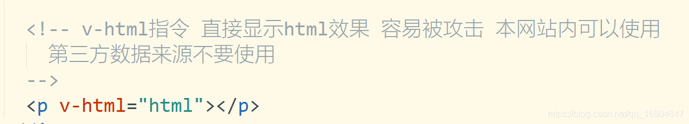  


#### 1.3.3.3 v-pre 指令

用法:  
跳过这个元素和它的子元素的编译过程。可以用来显示原始 Mustache 标签。跳过大量没有指令的节点会加快编译。

编辑 html:  
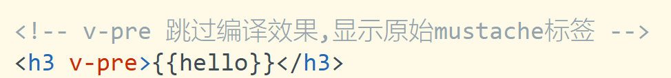

#### 1.3.3.4 v-once 指令

用法:  
只渲染元素和组件一次。随后的重新渲染，元素 / 组件及其所有的子节点将被视为静态内容并跳过。这可以用于优化更新性能。

html 用法:  
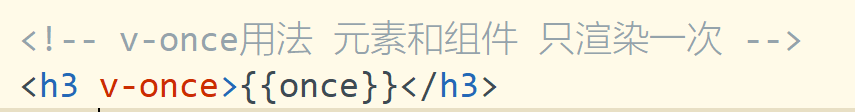  
控制台测试  
app.once 则页面渲染内容不变.

#### 1.3.3.5 v-model 指令

用法: 在表单控件或者组件上创建双向绑定, 当 js 数据修改时, 页面内容变化, 当页面内容修改时, 则数据变化.  
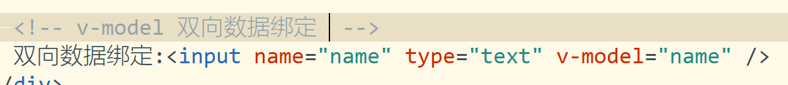

### 1.3.4 MVVM 思想

1). 字母解释  
1.M model 数据  
2.V view 视图  
3.VM (view-model) 数据和视图的控制

2). 当页面数据发生变化时, 则通过 dom 监听将数据传给 model  
当 model 的数据发生变化时, 则通过数据绑定 绑定到页面中

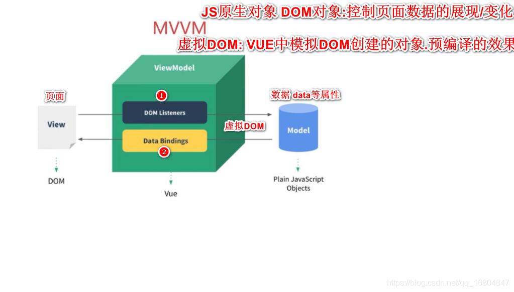

1.4 事件绑定
--------

### 1.4.1 v-on 指令

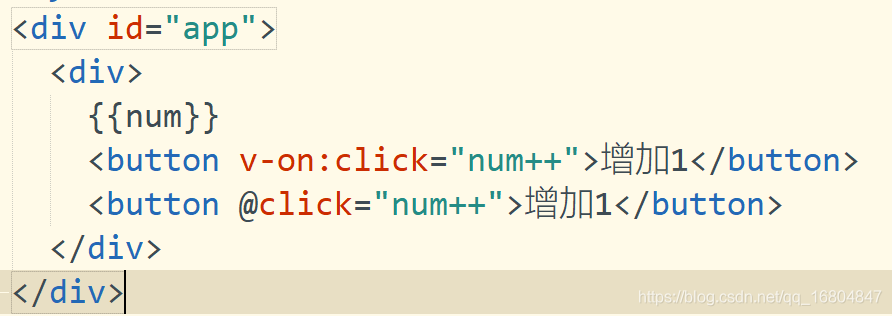

```
1). <button v-on:click="num++">增加1</button>   绑定点击事件
2).<button @click="num++">增加1</button>		   简化写法
3).<button @click="addNum">增加1</button>
```

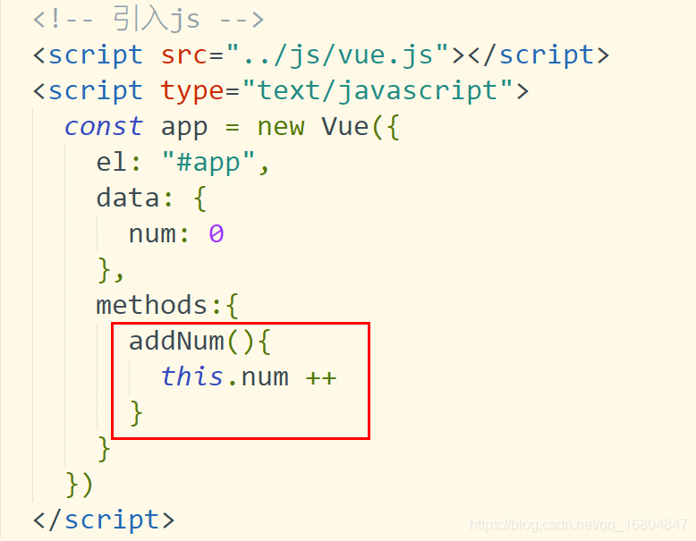  
4).  
<button @click=“addNum2($event)”> 传递 event 对象  
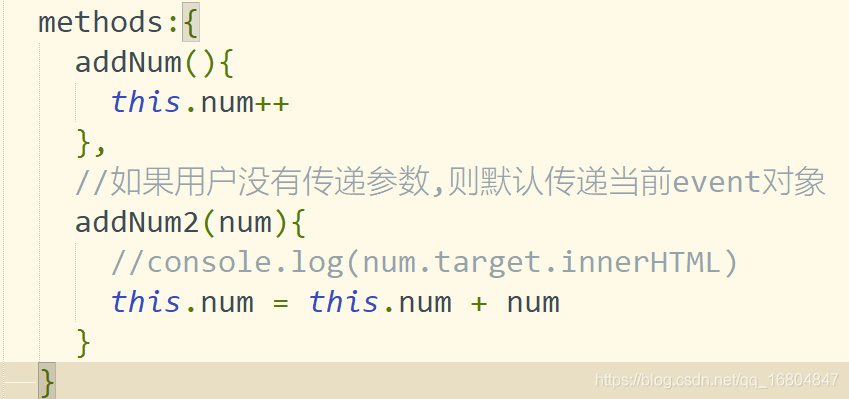

### 1.4.2 事件修饰符

1). 阻止冒泡 .stop  
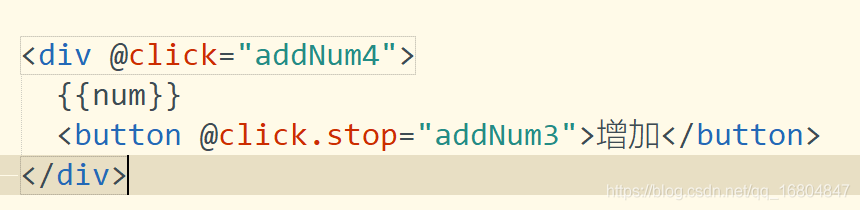  
2). 阻止默认行为 @click.prevent  
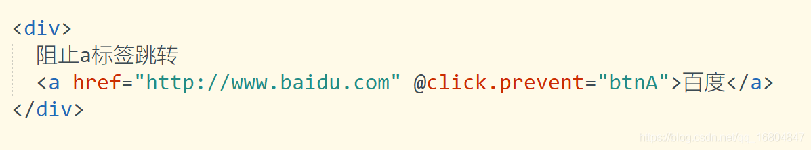

### 1.4.3 按键修饰符

```
<div>
	<input  @keyup.enter="handler" value="回车触发"/>
	<input  @keyup.space="handler" value="空格触发"/>
	<input  @keyup.delete="handler" value="删除键触发"/>
	<input  @keyup.left="handler" value="<-触发"/>
	<input  @keyup.right="handler" value="->键触发"/>
	<input type="text"  @click.middle ="handler"   value="鼠标滚轮触发" />
	<input type="text"  @click.left="handler"   value="鼠标左键触发" />
	<input type="text"  @click.right ="handler"   value="鼠标右键触发" />
</div>
```

### 1.4.4 综合案例练习

```
<!DOCTYPE html>
<html>
	<head>
		<meta charset="utf-8">
		<title>计算器案例</title>
	</head>
	<body>
		
		<div id="app">
			<h1>实现计算器功能</h1>
			<div>
				<div>数据A:<input type="text" /></div>
				<div>数据B:<input type="text" /></div>
				<button type="button" @click="count">计算</button>
				<div>结果:<span v-text="result"></span></div>
			</div>
		</div>
		<script type="text/javascript" src="../../js/vue.js"></script>
		<script type="text/javascript">
				const app = new Vue({
					el : "#app",
					data : {
						num1 : '',
						num2 : '',
						result : ''
					},
					methods:{
						count(){
							this.result = parseInt(this.num1) + parseInt(this.num2);
							//this.result = eval(this.num1) + eval(this.num2)
						}
					}
				})
		</script>
	</body>
</html>
```

1.5 属性绑定
--------

### 1.5.1 v-bind 属性绑定

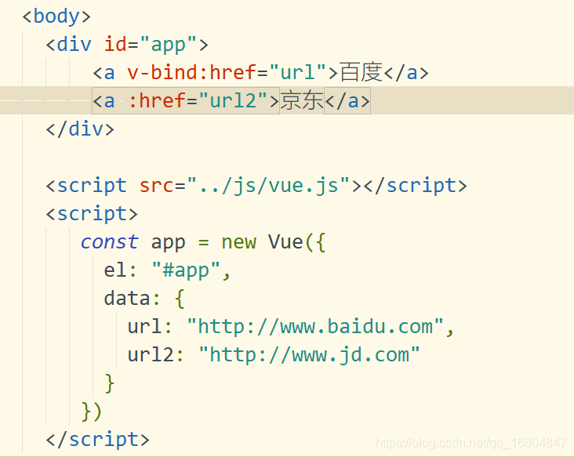

### 1.5.2 v-bind Class 样式绑定

```
<div>
		样式绑定
		<div v-bind:class="{red: isActive}">样式测试</div>
		<button @click="isActive = !isActive">切换</button>
	</div>
	
	<div>
		样式数组写法
		<div v-bind:class="[redClass,fontSize]">属性样式测试</div>
		<button @click="changeCss">切换</button>
	</div>
	
	<script>
			 const app = new Vue({
				 el: "#app",
				 data: {
					 url: "http://www.baidu.com",
					 url2: "http://www.jd.com",
					 isActive: true,
					 redClass: "red",
					 fontSize:	"fontSize"
				 },
				 methods: {
					 changeCss(){
						 this.redClass = ''
						 this.fontSize = ''
					 }
				 }
			 })
	</script>
```

### 1.5.3 v-bind Style 样式绑定

1). 样式绑定

```
style 样式绑定
		<div v-bind:style="{border: borderStyle,width: widthStyle,height: heightStyle}">123</div>

		 data: {
					 url: "http://www.baidu.com",
					 url2: "http://www.jd.com",
					 isActive: true,
					 redClass: "red",
					 fontSize:	"fontSize",
					 borderStyle: "1px solid blue",
					 widthStyle: "100px",
					 heightStyle: "100px"
				 },
```

2). 对象封装写法

```
<div v-bind:style="myStyle">456</div>
	data: {
		 myStyle : {
			 border: '2px solid green',
			 width: "20px",
			 height: "20px"
		 }
	 },
```

1.6 分支结构语法
----------

### 1.6.1 分支结构说明

1).v-if  
2).v-else  
3).v-else-if  
4).v-show

### 1.6.2 分支结构用法

```
<!DOCTYPE html>
<html>
	<head>
		<meta charset="utf-8">
		<title>分支结构语法</title>
	</head>
	<body>
		<div id="app" align="center">
			<h1>根据根据分数评级</h1>
			<!-- v-if当判断条件成立时 div展现  控制dom元素增加 开销较大 -->
			<div v-if="score>=90">优秀</div>
			<div v-else-if="score>=80">良好</div>
			<div v-else-if="score>=70">中等</div>
			<div v-else>不及格</div>
			
			<!-- 直接渲染到页面中采用display: none;隐藏属性 如果频繁展现的元素 使用v-show -->
			<div v-show="flag">测试show数据</div>
			<button @click="flag= !flag">展现</button>
		</div>
		
		<script src="../js/vue.js"></script>
		<script>
			const app = new Vue({
				el: "#app",
				data: {
					//定义分数
					score: 100,
					flag: false
				}
			})
		</script>
	</body>
</html>
```

1.7 循环结构
--------

### 1.7.1 v-for 循环

```
<div id="app">
			<!-- 插值表达式如果渲染不完全会展现{{}} -->
			<span v-for="item in hobby">{{item}}</span>
			<!-- 使用v-text优化属性 -->
			<span v-for="item in hobby" v-text="item"></span>
			<!-- 展现数组下标 -->
			<span v-for="(item,index) in hobby" v-text="index"></span>
			
			<!-- 循环遍历数组对象 :key用来区分遍历的节点信息 -->
			<div v-for="item in users" :key="item.id">
					<span v-text="item.id"></span>
					<span v-text="item.name"></span>
			</div>
			
			<!-- 遍历对象 获取对象的key-value-index索引 -->
			<div v-for="(value,key,index) in user">
				<span v-text="key"></span>
				<span v-text="value"></span>
				<span v-text="index"></span>
			</div>
		</div>
		
		<script src="../js/vue.js"></script>
		<script>
			const app = new Vue({
				el : "#app",
				data : {
					hobby: ['吃','喝','玩','乐'],
					users: [{
						id: 100,
						name: '王昭君'
					},{
						id: 101,
						name: '安琪拉'
					}],
					user: {
						id: 1,
						name: '张三',
						age: 18
					}
				}
			})
		</script>
```

1.8 Vue 常用特性
------------

### 1.8.1 表单操作

#### 1.8.1.1 表单常用属性

1.  input 文本输入框
2.  textarea 多行文本
3.  select 下拉多选框
4.  radio 单选框
5.  checkbok 多选框

#### 1.8.1.2 表单数据与 vue 进行数据绑定的写法

```
<!DOCTYPE html>
<html>
	<head>
		<meta charset="utf-8">
		<title>常用表单属性</title>
	</head>
	<body>
		<h1>本案例练习 表单提交数据时  数据如何与vue进行数据绑定</h1>
		<div id="app">
			<form id="userForm"action="http://www.baidu.com">
				<div>
					<span>
						姓名:
					</span>
					<span>
						<input type="text" />
					</span>
				</div>
				<div>
					<span>性别:</span>
					<span>
						<input type="radio" />
						<label for="man">男</label>
						<input type="radio" />
						<label for="women">女</label>
					</span>
				</div>
				<div>
					<span>爱好:</span>
					<input type="checkbox" />吃
					<input type="checkbox" />喝
					<input type="checkbox" />玩
				</div>
				<div>
					<span>职业</span>
					<!-- 如果需要设置为多选 则添加属性 -->
					<select >
						<option value="工人">工人</option>
						<option value="教师">教师</option>
						<option value="工程师">工程师</option>
					</select>
				</div>
				<div>
					<span>个人简介</span>
					<textarea ></textarea>
				</div>
				<div>
					<!-- 阻止默认提交事件 -->
					<input type="submit"  value="提交" v-on:click.prevent="submitForm"/>
				</div>
			</form>
		</div>
		
		
		<!-- 引入JS文件 -->
		<script src="../js/vue.js"></script>
		<script>
			const app = new Vue({
				el:	"#app",
				data: {
					name: '',
					gender: '男',
					//多个数据定义时 应该使用数组
					hobbies:	['吃','喝'],
					occupation: ['工人'],
					userInfo: ''
				},
				methods: {
					submitForm(){
						//数据提交
						console.log("姓名:"+this.name)
						console.log("性别:"+this.gender)
						console.log('爱好:'+this.hobbies)
						console.log('职业:'+this.occupation)
						console.log('用户详情:'+this.userInfo)
						console.log('封装好数据之后,可以使用ajax方式实现数据提交')
					}
				}
			})
		</script>
	</body>
</html>
```

### 1.8.2 表单域修饰符

#### 1.8.2.1 常用属性

1).number : 将数据转化为数值  
2).trim: 去掉开始和结尾的空格  
3).lazy: 将 input 事件 切换为 change 事件

#### 1.8.2.2 number 属性

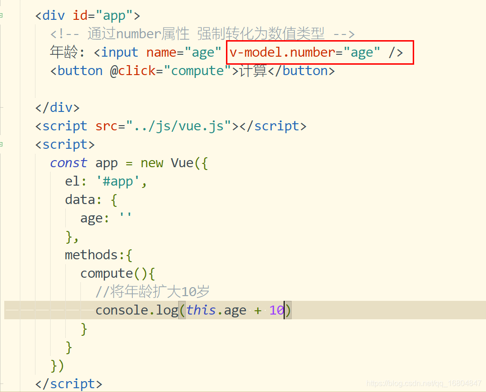

#### 1.8.2.2 trim 属性

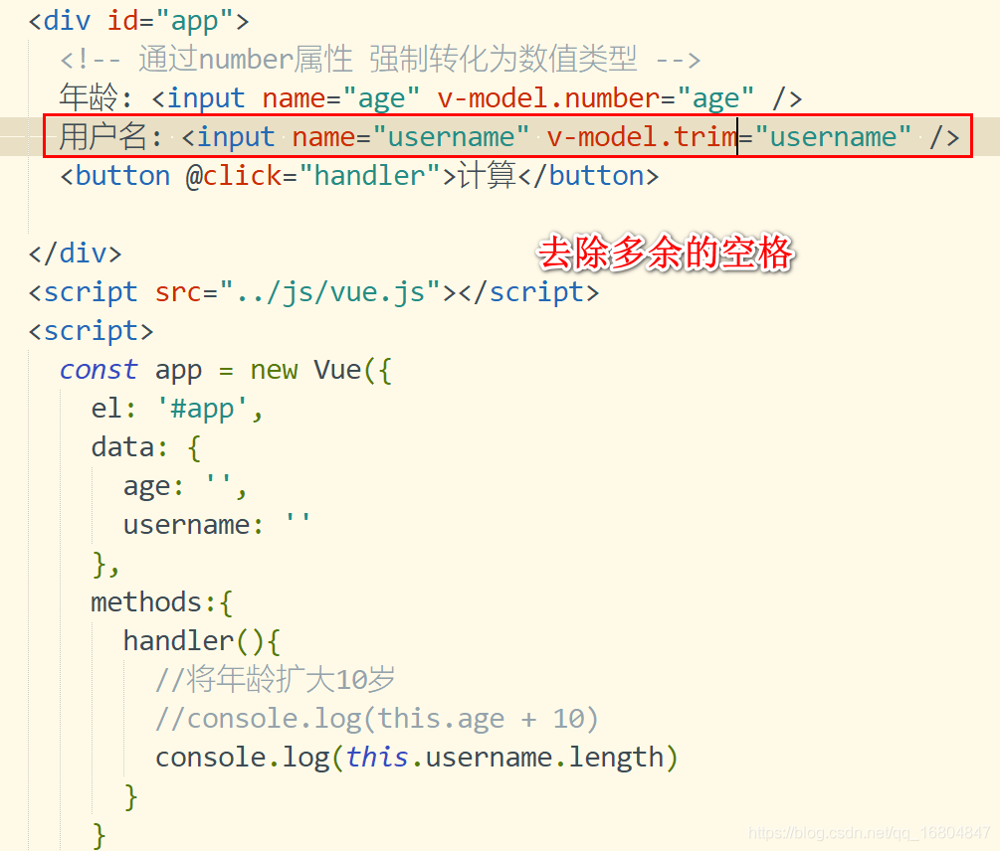

#### 1.8.2.3 lazy 属性

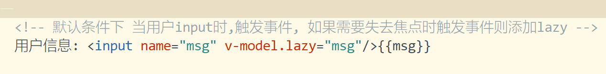

### 1.8.3 计算属性

#### 1.8.3.1 为什么需要计算属性

由于业务需要, 表达式的业务逻辑可能比较复杂 阅读起来不够简洁, 通过计算属性可以优化代码结构

#### 1.8.3.2 计算属性案

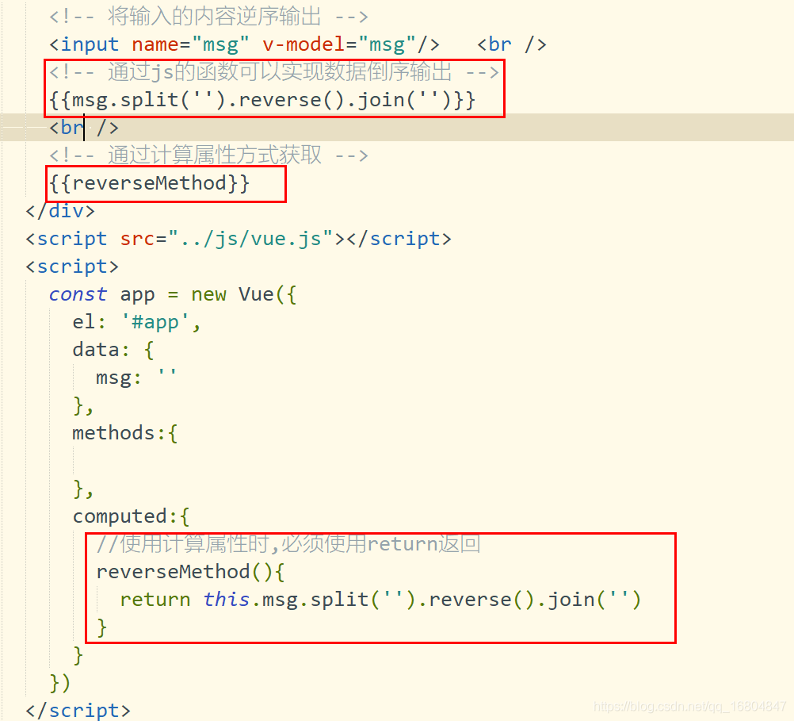

### 1.8.4 计算属性与方法的区别

1). 计算属性有缓存 方法没有缓存  
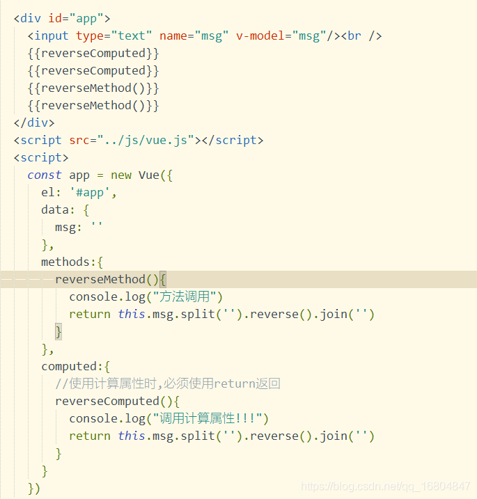

### 1.8.5 侦听器

#### 1.8.5.1 监听器作用

当属性数据发生变化 则通知监听器所绑定的方法 一般多用于执行异步操作

#### 1.8.5.2 配置监听器

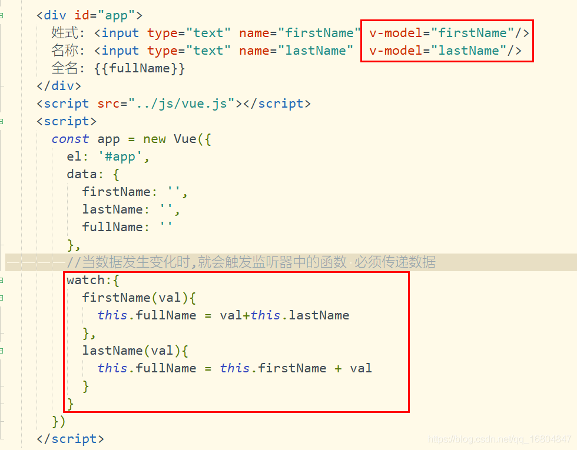

#### 1.8.5.3 监听器案例实现

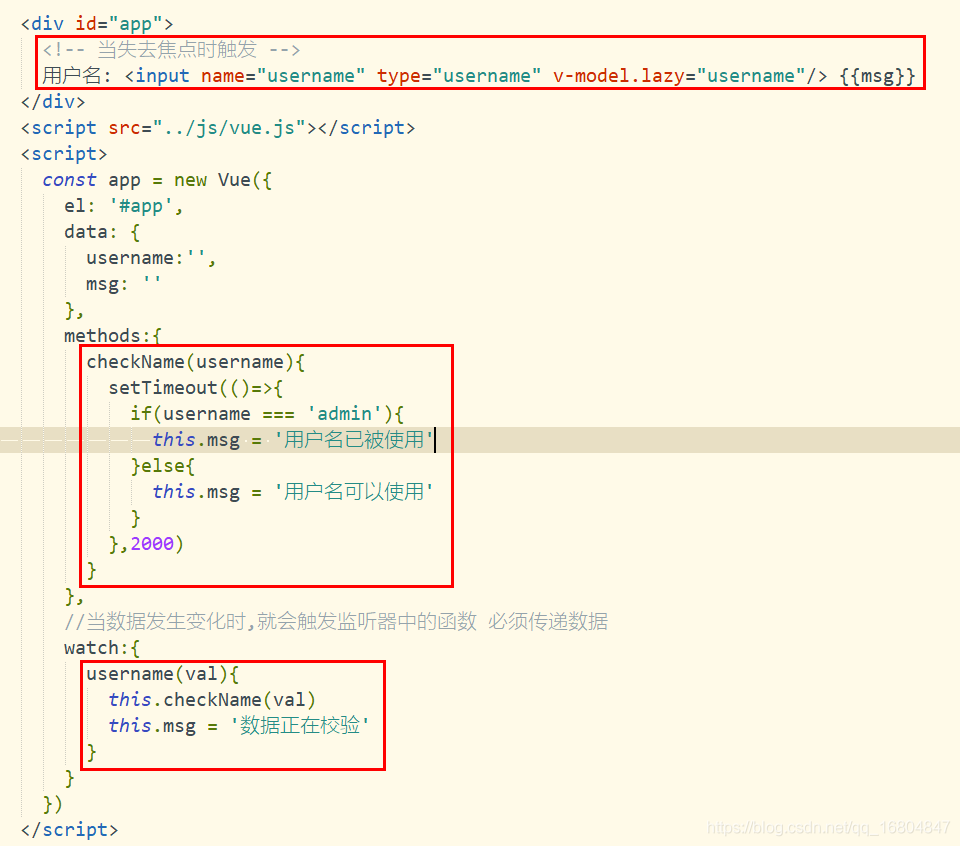

### 1.8.6 过滤器

#### 1.8.6.1 过滤器作用

格式化数据, 比如格式化日期, 特殊数据格式时使用

#### 1.8.6.2 过滤器用法

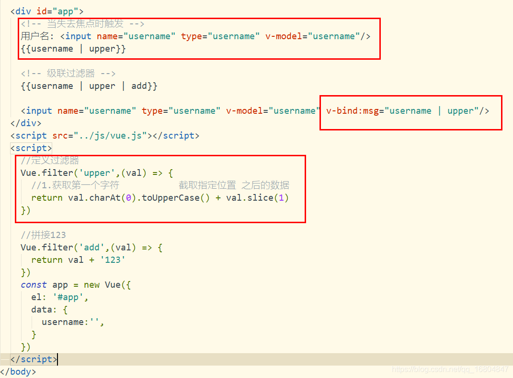

1.9 VUE 生命周期
------------

### 1.9.1 主要阶段

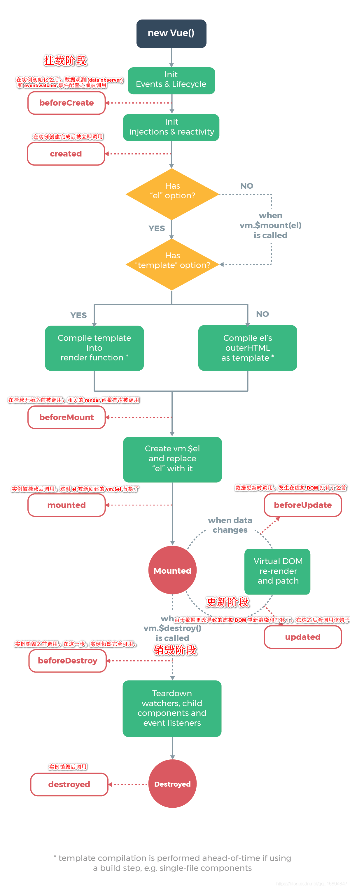

### 1.9.2 页面结构调用

只要熟练掌握 mounted 就可以了

```
<!DOCTYPE html>
<html>
	<head>
		<meta charset="utf-8">
		<title>测试vue生命周期函数</title>
	</head>
	<body>
		
		<div id="app">
			<h3 v-text="msg"></h3>
			<button @click="destroy">销毁</button>
		</div>
		
		<!--引入js函数类库  -->
		<script src="../js/vue.js"></script>
		<script>
			const app = new Vue({
				el : "#app",
				data : {
					msg: "vue生命周期"
				},
				
				//在实例初始化之后，数据观测 (data observer) 和 event/watcher 事件配置之前被调用。
				beforeCreate(){
					console.log("beforeCreate")
				},
				//在实例创建完成后被立即调用
				created(){
					console.log("created")
				},
				//在挂载开始之前被调用：相关的 render 函数首次被调用。
				beforeMount(){
					console.log("beforeMount")
				},
				//实例被挂载后调用，这时 el 被新创建的 vm.$el 替换了。
				mounted(){
					console.log("mounted")	
				},
				//数据更新时调用，发生在虚拟 DOM 打补丁之前
				beforeUpdate(){
					console.log("beforeUpdate")
				},
				//由于数据更改导致的虚拟 DOM 重新渲染和打补丁，在这之后会调用该钩子。
				updated(){
					console.log("updated")
				},
				//实例销毁之前调用。在这一步，实例仍然完全可用
				beforeDestroy(){
					console.log("beforeDestroy")	
				},
				//实例销毁后调用。
				destroyed(){
					console.log("destroyed")
				},
				methods:{
					destroy(){
						this.$destroy()
					}
				}
			})
		</script>
	</body>
</html>
```

1.10 VUE 数组操作
-------------

### 1.10.1 文档位置

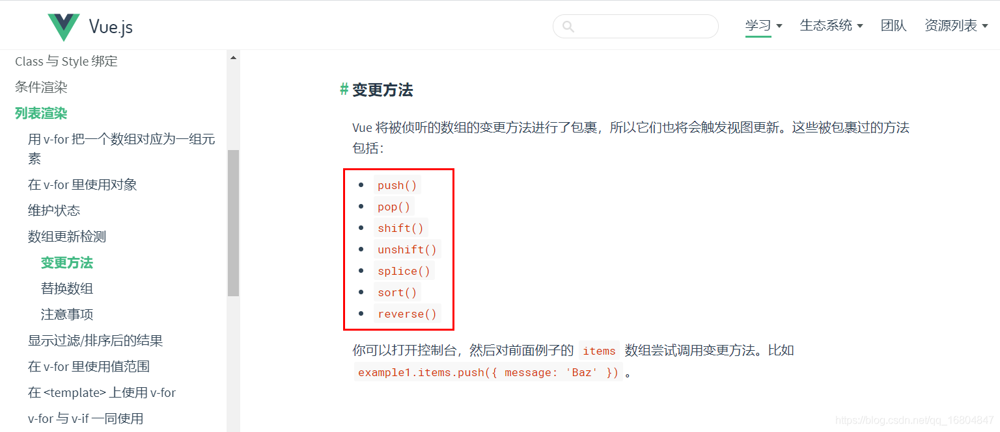

### 1.10.2 数组用法介绍

1.push() 在最后一个追加  
2.pop() 删除最后一个  
3.shift() 删除第一个元素  
4.unshift() 在开头追加一个元素  
5.splice() 在指定位置替换元素  
6.sort() 数组排序 默认是按照字符编码的顺序进行排序  
7.reverse() 数组反转

### 1.10.3 数组使用案例

```
<!DOCTYPE html>
<html>
	<head>
		<meta charset="utf-8">
		<title>数组用法</title>
	</head>
	<body>
		
		<div id="app">
			<span v-for="num in array"> {{num}}</span>
			<hr />
			<input type="text" />
			<button @click="add">添加</button>
			<button @click="del">删除</button>
			<button @click="shift">删除第一个</button>
			<button @click="upshift">从第一个元素添加</button>
			<button @click="splice">替换数据</button>
			<button @click="sort">排序</button>
			<button @click="reverse">反转</button>
		</div>
		
		<!--引入js函数类库  -->
		<script src="../js/vue.js"></script>
		<script>
			const app = new Vue({
				el : "#app",
				data : {
					array: [4,2,3,1,5],
					num: ''
				},
				methods:{
					add(){
						this.array.push(this.num)
					},
					del(){
						this.array.pop()
					},
					shift(){
						this.array.shift()
					},
					upshift(){
						this.array.unshift(this.num)
					},
					splice(){
						//参数说明: 1.操作数据起始位置  2. 操作数量  3.替换元素的值(如果不写表示删除)
						//将第二位进行替换
						//this.array.splice(1,1,this.num)
						//删除第二位数据
						this.array.splice(1,1)
					},
					sort(){
						//数组从小到大
						this.array.sort()	
					},
					//数组反转
					reverse(){
						this.array.reverse()
					}
				}
			})
		</script>
	</body>
</html>
```

# 2.VUE组件化

2.1 组件介绍
--------

组件系统是 Vue 的另一个重要概念，因为它是一种抽象，允许我们使用小型、独立和通常可复用的组件构建大型应用。仔细想想，几乎任意类型的应用界面都可以抽象为一个**组件树**.  
使用组件可以将一些重复的内容进行封装. 各个组件单独维护. 体现了分治的思想 (**分布式思想**)  
**补充知识: 为了保证组件化 相互之间互不干扰, 则应该在组件内部 单独定义 html/js/css.**  
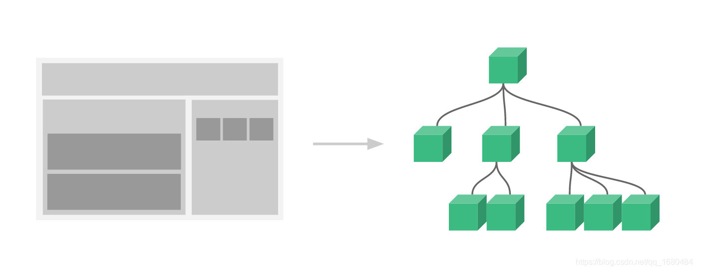

2.2 组件注册
--------

### 2.2.1 基本语法

注意事项:  

1. 组件中的 data 是一个函数 data(){return {}}  
2. 组件模版的内容必须是一个根元素.  
3. 组件如果采用驼峰规则命名, 则使用 - 线进行关联  
   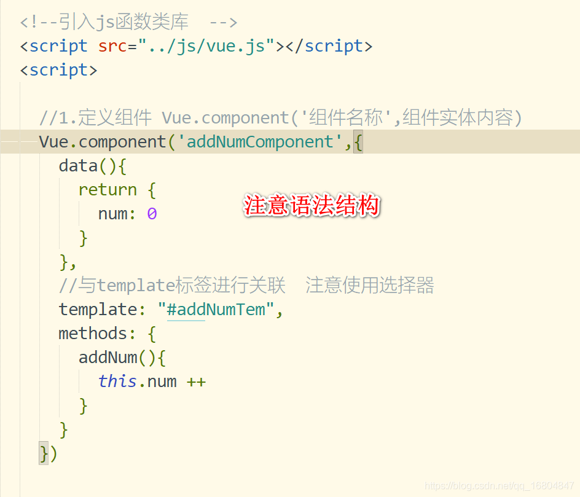

### 2.2.2 案例使用

```
<!DOCTYPE html>
<html>
	<head>
		<meta charset="utf-8">
		<title>组件注册</title>
	</head>
	<body>
		
		<div id="app">
			<!-- 驼峰规则使用-线隔开 -->
			<add-num-component></add-num-component>
			
			<!-- 组件可以复用 -->
			<add-num-component></add-num-component>
			<add-num-component></add-num-component>
		</div>
		
		<!-- 定义模版标签 必须使用跟标签定义不然编译无效 -->
		<template id="addNumTem">
			<div>
				数值: {{num}}
				<button @click="addNum">添加</button>
			</div>
		</template>
		
		<!--引入js函数类库  -->
		<script src="../js/vue.js"></script>
		<script>
			
			//1.定义组件 Vue.component('组件名称',组件实体内容)
			Vue.component('addNumComponent',{
				data(){
					return {
						num: 0
					}
				},
				//与template标签进行关联  注意使用选择器
				template: "#addNumTem",
				methods: { 
					addNum(){
						this.num ++ 
					}
				}
			})
			
			
			const app = new Vue({
				el : "#app",
				data : {
					
				}
			})
		</script>
	</body>
</html>
```

2.3 局部组件注册
----------

### 2.3.1 通过 components 定义局部组件

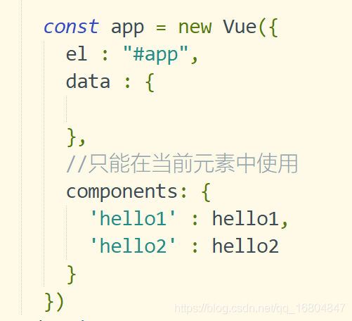

### 2.3.2 编辑组件 demo

```
<!DOCTYPE html>
<html>
	<head>
		<meta charset="utf-8">
		<title>组件注册</title>
	</head>
	<body>
		
		<div id="app">
				<hello1></hello1>
				<hello2></hello2>
				<hello3></hello3>
		</div>
		
		<!-- 定义模版代码1 -->
		<template id="hello1">
			<div>
				{{msg}}
			</div>
		</template>
		
		<template id="hello2">
			<div>
				{{msg}}
			</div>
		</template>
		
		<template id="hello3">
			<div>
				{{name}}
				
				<!-- 在全局组件中引用局部组件 使用不生效 -->
				<!-- <hello1></hello1> -->
			</div>
		</template>
		
		<!--引入js函数类库  -->
		<script src="../js/vue.js"></script>
		<script>
			
			//定义全局组件
			Vue.component('hello3',{
				data(){
					return {
						name: '定义全局组件'
					}
				},
				template: "#hello3"
			})
			
			
			/* 定义局部组件 */
			let hello1 = {
				data(){
					return {
						msg: '你好Hello1'
					}
				},
				template: "#hello1"
			}
			
			let hello2 = {
				data(){
					return {
						msg: '你好Hello2'
					}
				},
				template: "#hello2"
			}
			
			
			const app = new Vue({
				el : "#app",
				data : {
					
				},
				//只能在当前元素中使用
				components: {
					'hello1' : hello1,
					'hello2' : hello2
				}
			})
		</script>
	</body>
</html>
```

# 3.Vue前端交互

3.1 Promise 概述
--------------

Promise 是一种异步编程的一种解决方案. 从语法上将 Promise 是一个对象. 从它身上可以获取异步调用的信息  
作用:  

1. 有效避免回调地狱问题 典型的 Ajax 嵌套问题 (**闭包**方式)  
   2.Promise 对象提供了简洁的 API 用法简单

3.2 Promise 基本用法
----------------

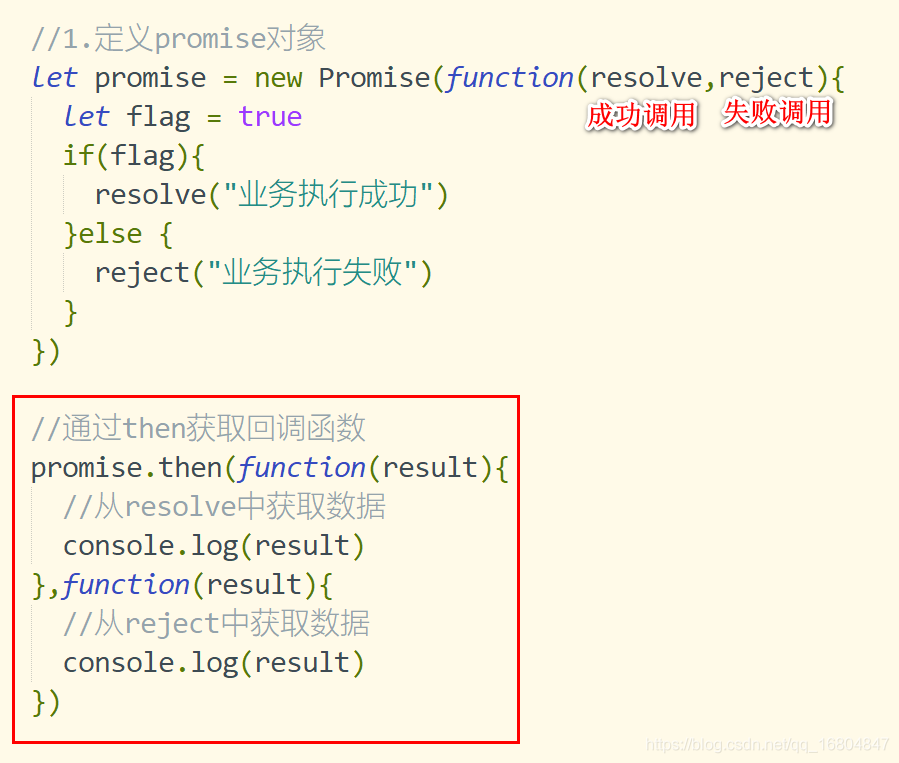

3.3 Promise API 介绍
------------------

1.then 异步调用正确时返回  
2.catch 获取异常信息  
3.finally 成功与否都会执行的操作

```
<!DOCTYPE html>
<html>
	<head>
		<meta charset="utf-8">
		<title>promise调用API</title>
	</head>
	<body>
		<div id="app">
		</div>
		<script>
			
			let promise = new Promise(function(resolve,reject){
				let flag = true
				if(flag){
					resolve("业务执行成功")
				}else {
					reject("业务执行失败")
				}
			})
			
			//通过then获取回调函数
			promise.then(function(result){
				//从resolve中获取数据
				console.log(result)
			})
			.catch(function(data){
				console.log(data)
			})
			.finally(function(){
				console.log("最终都会执行")
			})
			
			
			
		</script>
	</body>
</html>
```

3.4 Axios 方式
------------

### 3.4.1 Axios 介绍

Axios 是一个基于 promise 的 HTTP 库，可以用在浏览器和 node.js 中。  
特点:  

1. 从浏览器中创建 XMLHttpRequests  
2. 从 node.js 创建 http 请求  
3. 支持 Promise API  
4. 拦截请求和响应  
5. 转换请求数据和响应数据  
6. 取消请求  
7. 自动转换 JSON 数据  
8. 客户端支持防御 XSRF

### 3.4.2 Axios 入门案例

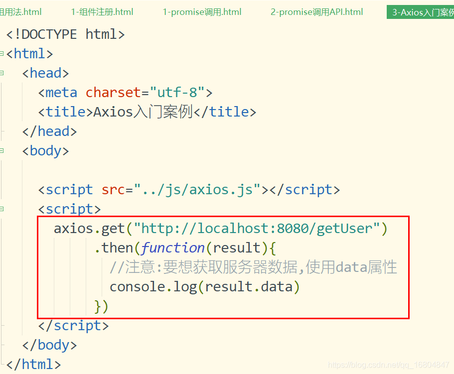  
关于 result 的说明:  
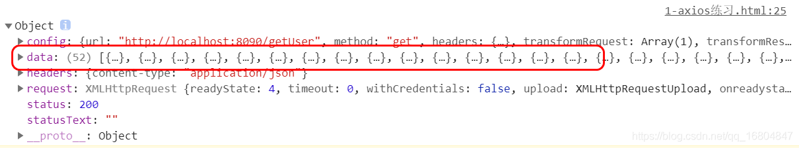

### 3.4.3 Axios GET/DELETE 调用

1).get 方式  
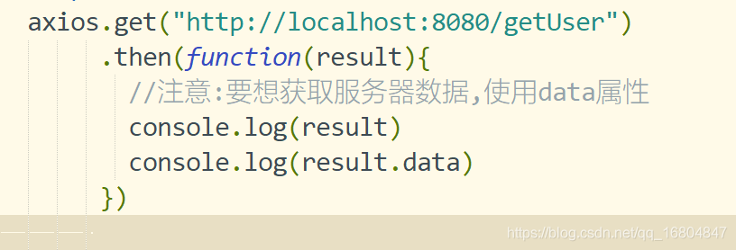  
2). 带参数的方式  
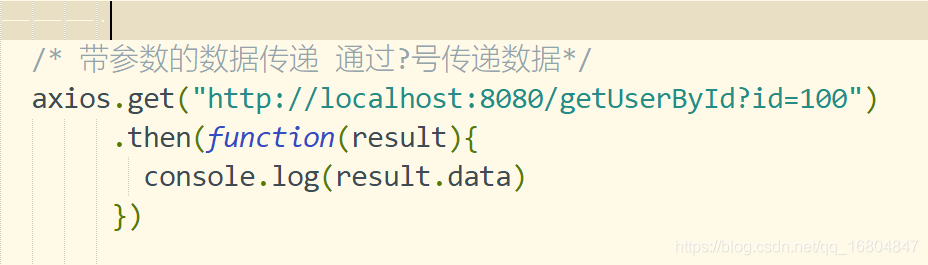  
3.restFul 风格方式  
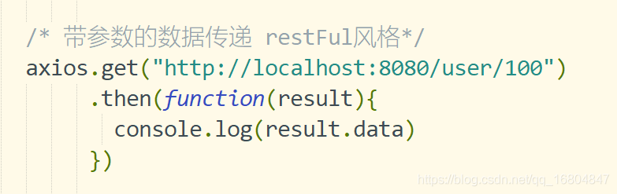  
4.params 参数方式  
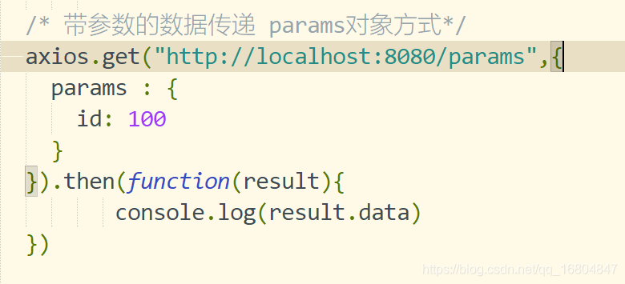

### 3.4.4 Axios post/put 调用

#### 3.4.4.1 对象方式提交数据

1). 编辑页面 JS  
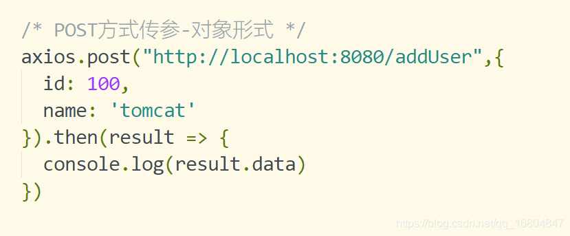  
2). 编辑后台 Controller  
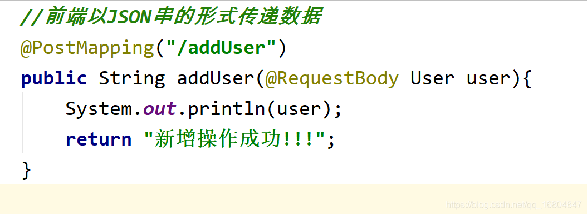

#### 3.4.4.2 restFul 方式提交数据

1). 编辑页面 JS  
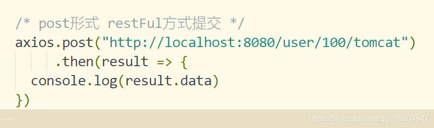  
2). 编辑后台 Controller  
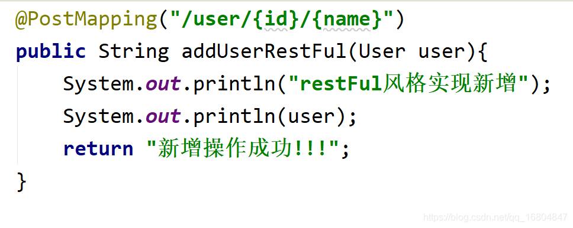

#### 3.4.4.3 form 表单数据

1). 编辑页面 JS  
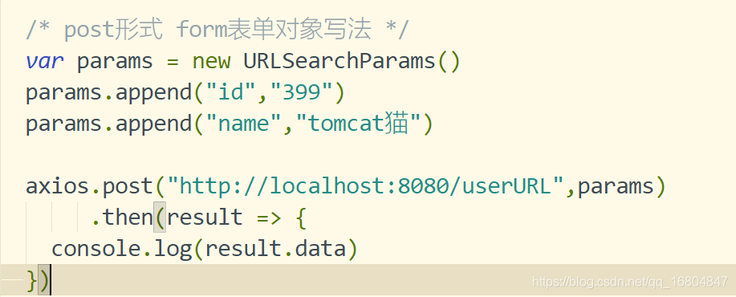  
2). 页面提交参数结构  
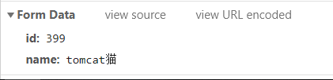  

3. 编辑 Controller  
   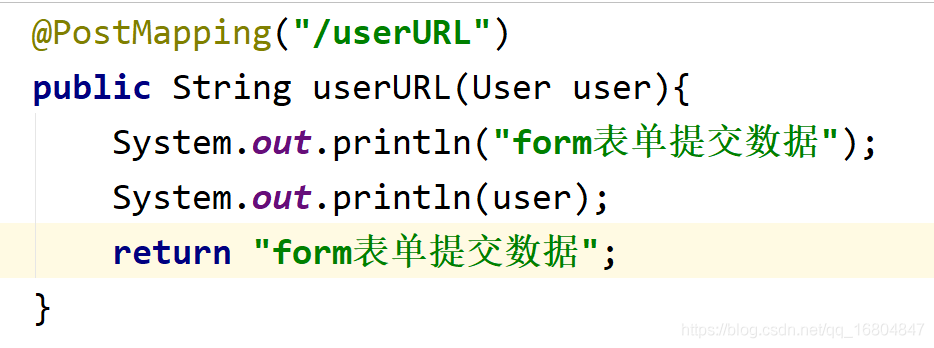

### 3.4.5 Axios 配置信息

```
//配置基本请求路径
	axios.defaults.baseURL = "http://localhost:8080/"
	//设定请求头信息
	axios.defaults.headers['mytoken'] = 'token-123456'
```

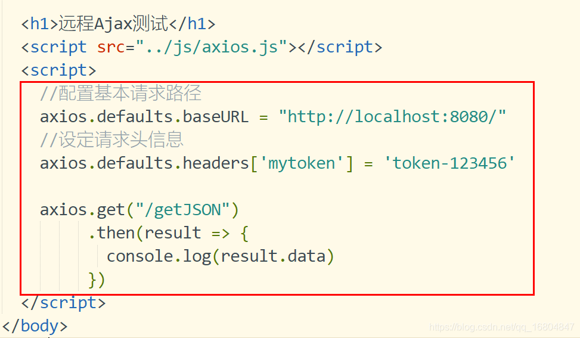

### 3.4.6 Axios 拦截器机制

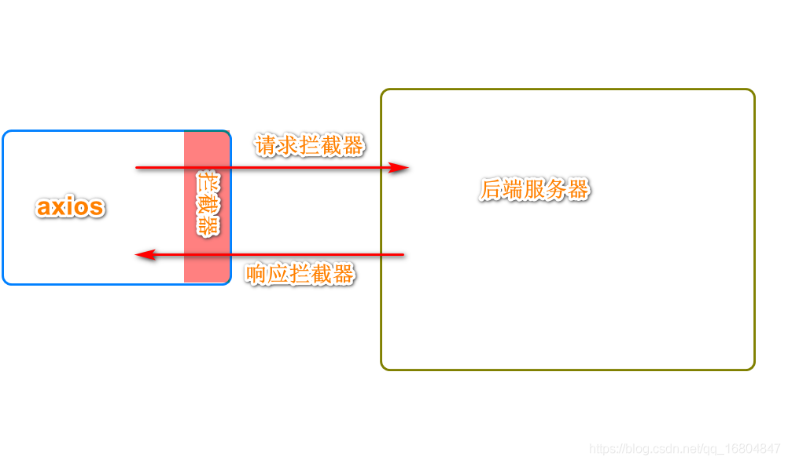

#### 3.4.6.1 请求拦截器

```
//1.定义请求拦截器
	axios.interceptors.request.use(function(config){
		//console.log(config)
		//在请求发出前进行信息设置
		config.headers.mytoken = 'qwerqwerqwer'
		return config
	},function(error){
		//报错信息返回
		console.log(error)
	})
```

#### 3.4.6.2 响应拦截器

```
//2.定义响应拦截器
	axios.interceptors.response.use(function(response){
		console.log(response)
		return response
	},function(error){
		console.log(error)
	})
	
	axios.get("http://localhost:8080/getJSON")
			 .then(function(result){
				 //console.log(result.data)
	})
```

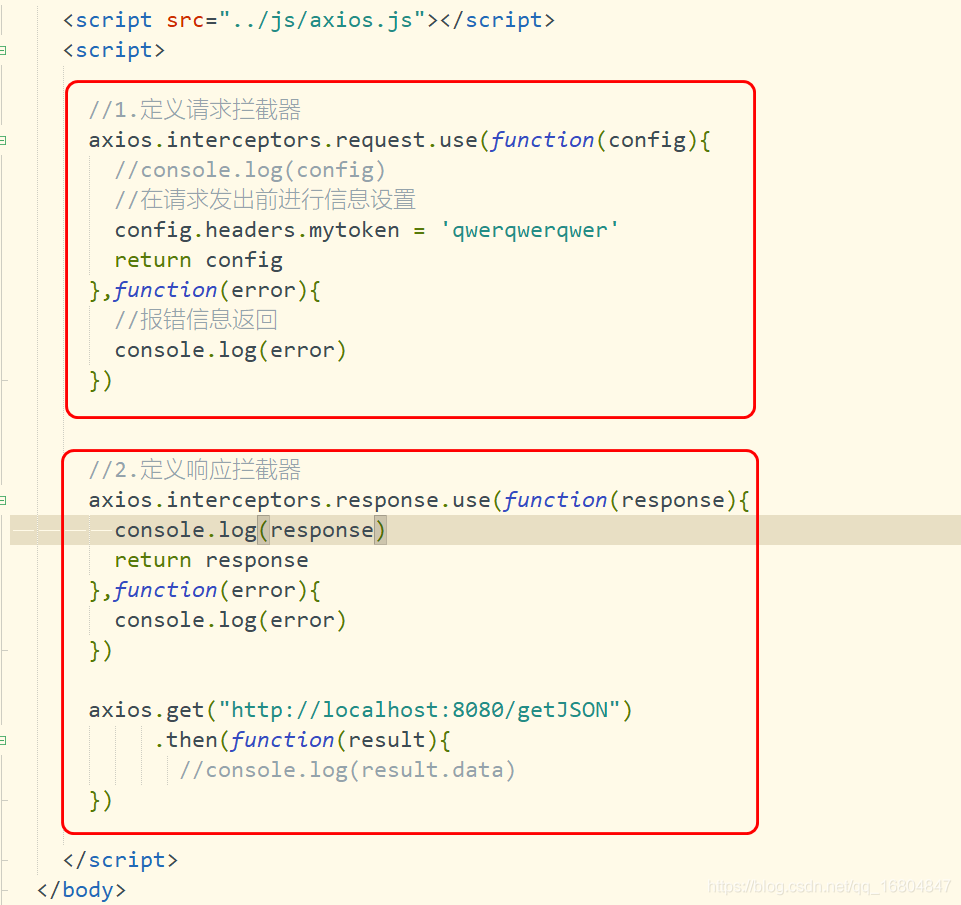

### 3.4.7 async-await 用法

#### 3.4.7.1 介绍

1.async/await 是 ES7 引入的新语法 可以更加方便的进行异步操作  
2.async 关键字用在函数上. 返回值是一个 promise 对象  
3.await 关键字用在 async 函数中

#### 3.4.7.2 入门案例用法

```
<!DOCTYPE html>
<html>
	<head>
		<meta charset="utf-8">
		<title>Axios配置</title>
	</head>
	<body>
		
		<h1>远程Ajax测试</h1>
		<script src="../js/axios.js"></script>
		<script>
			async function getJSON(){
				//返回一个promise对象
				const result = await axios.get('http://localhost:8080/getJSON')
				//通过data获取数据
				return result.data
			}
			
			//调用函数
			getJSON().then(function(result){
				console.log(result)
			})
		</script>
	</body>
</html>
```

### 3.4.8 ajax 教学案例

#### 3.4.8.1 编辑页面 html

```
<!DOCTYPE html>
<html>
	<head>
		<meta charset="utf-8">
		<title>用户列表展现案例</title>
	</head>
	<body>
		<div id="app">
			<h1 align="center">用户列表展现案例</h1>
			<table align="center" border="1px" width="800px">
				<tr align="center">
					<td>ID编号</td>
					<td>姓名</td>
					<td>年龄</td>
					<td>性别</td>
					<td>操作</td>
				</tr>
				<tr align="center" v-for="user in userList" :key="user.id">
					<td>{{user.id}}</td>
					<td>{{user.name}}</td>
					<td>{{user.age}}</td>
					<td>{{user.sex}}</td>
					<td>
						<button @click="updateUser(user)">修改</button>
						<button @click="deleteUser(user)">删除</button>
					</td>
				</tr>
			</table>
			<hr />
			<div>
				<h3 align="center">用户修改操作</h3><br>
				<p>
						用户ID号: <input type="text"  disabled/>
						用户名称: <input type="text" />
				</p>
				<p>
					用户年龄: <input type="text" />
					用户性别: <input type="text" />
				</p>
				<p>
					<button @click="updateUserBtn">修改</button>
				</p>
			</div>
		</div> 
		
		
		<script src="../js/axios.js"></script>
		<script src="../js/vue.js"></script>
		<script>
			//1.定义默认的axios请求路径
			axios.defaults.baseURL = "http://localhost:8090/"
			
			const app = new Vue({
				el: "#app",
				data: {
					//准备用户数据
					userList: [],
					user: {
						id: '',
						name: '',
						age: '',
						sex: ''
					}
				},
				methods: {
					//1.发起get请求
					async getUserList(){
						const {data: result} = await axios.get('/getUserList')
						this.userList = result
					},
					updateUser(user){
						//1.获取页面修改的数据
						this.user = user
					},
					async updateUserBtn(){
						await axios.put('updateUser',this.user)
						//重新加载页面数据
						this.getUserList()
					},
					async deleteUser(user){
						let id = user.id
						await axios.delete('user/'+id)
						//删除之后,重新加载数据
						this.getUserList()
					}
				},
				mounted(){
					this.getUserList()
				}
			})
		</script>
	</body>
</html>
```

#### 3.4.8.2 编辑页面 Controller

```
package com.jt.controller;

import com.jt.pojo.User;
import com.jt.service.UserService;
import org.springframework.beans.factory.annotation.Autowired;
import org.springframework.web.bind.annotation.*;

import java.util.List;

/**
 * @author 刘昱江
 * 时间 2021/5/9
 */
@RestController
@CrossOrigin
public class UserController {

    @Autowired
    private UserService userService;

    @GetMapping("/getUserList")
    public List<User> findAll(){

        return userService.findAll();
    }

    @PutMapping("/updateUser")
    public void updateUser(@RequestBody User user){

        userService.updateUser(user);
    }

    @DeleteMapping("/user/{id}")
    public void deleteUser(@PathVariable Integer id){
        userService.deleteUser(id);
    }
}
```

# 4 VUE路由

4.1 VUE Router 介绍
-----------------

Vue Router 是 Vue.js 官方的路由管理器。它和 Vue.js 的核心深度集成，让构建单页面应用变得易如反掌。包含的功能有：  
嵌套的路由 / 视图表  
模块化的、基于组件的路由配置  
路由参数、查询、通配符  
基于 Vue.js 过渡系统的视图过渡效果  
细粒度的导航控制  
带有自动激活的 CSS class 的链接  
HTML5 历史模式或 hash 模式，在 IE9 中自动降级  
自定义的滚动条行为

4.2 Router 路由入门案例
-----------------

### 4.2.1 Router 使用步骤

1.  引入相关的库文件
2.  添加路由链接
3.  添加路由填充位
4.  定义路由组件
5.  配置路由规则并且创建路由实例
6.  把路由挂载到 Vue 根实例中

### 4.2.2 Router 入门案例

```
<!DOCTYPE html>
<html>
	<head>
		<meta charset="utf-8">
		<title>路由实例</title>
	</head>
	<body>
		<div id="app">
			
			<!-- 2.添加路由连接
				Vue中默认添加路由规则  
					1.router-link会默认渲染为a标签
					2.to属性默认渲染为 href标签
			 -->
			<router-link to="/user">用户</router-link>
			<router-link to="/dog">狗</router-link>
			
			
			<!-- 3.定义路由填充位
				将来通过路由匹配到的组件,将通过路由填充位进行展现
			 -->
			<router-view></router-view>
			
		</div>
		<!--引入js函数类库  -->
		<script src="../js/vue.js"></script>
		<!-- 引入路由规则 -->
		<script src="../js/vue-router.js"></script>
		<script>
			
			//4.定义user组件
			const user = {
				template: '<h1>我是User组件</h1>'
			}
			
			//定义dog组件
			const dog = {
				template: `<h1>我是Dog组件</h1>`
			}
			
			//5.创建路由规则
			//属性routes[] 定义路由规则
			//path: 定义路径
			//component: 定义组件名称
			const router = new VueRouter({
				//routes 定义路由规则
				routes: [
					{path:"/user",component: user},
					{path:"/dog",component: dog}
				]
			})
			
			
			//6.将路由挂载到Vue实例中
			const app = new Vue({
				el: "#app",
				//挂载路由实例对象   如果名称一致 可以简化
				//router: router
				router
			})
			
		</script>
	</body>
</html>
```

4.3 Router 重定向
--------------

说明: 当用户访问 A 地址时, 强制跳转访问 B 则需要使用路由重定向技术  
关键子: redirect  
用法如下:  
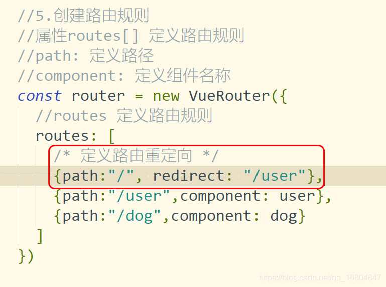

4.3 Router 嵌套
-------------

核心代码:  
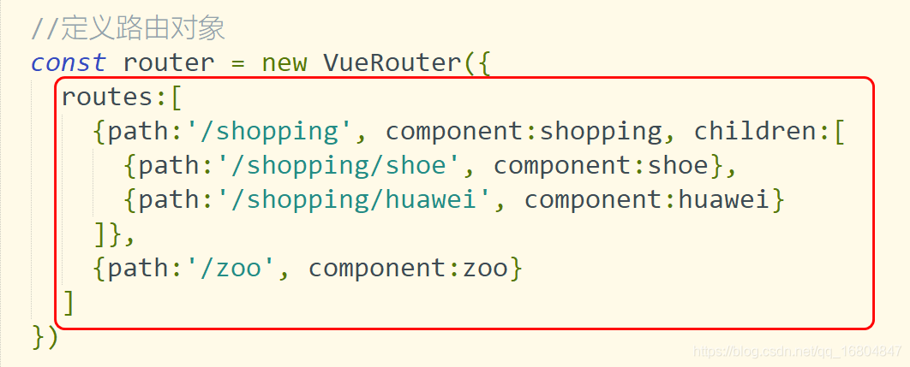

```
<!DOCTYPE html>
<html>
	<head>
		<meta charset="utf-8">
		<title>路由实例</title>
	</head>
	<body>
		<div id="app">
			<router-link to="/shopping">商场</router-link>
			<router-link to="/zoo">动物园</router-link>
			<router-view></router-view>
		</div>
		
		<template id="shopping">
			<div>
				<h3>商场组件</h3>
				<!-- 定义子路由 -->
				<router-link to="/shopping/shoe">鞋店</router-link>
				<router-link to="/shopping/huawei">华为手机店</router-link>
				<router-view></router-view>
			</div>
		</template>
		<template id="zoo">
			<div>
				<h3>动物园组件</h3>
			</div>
		</template>
		<template id="shoe">
			<div>
				<h3>鞋的组件</h3>
			</div>
		</template>
		<template id="huawei">
			<div>
				<h3>欢迎光临华为手机店</h3>
			</div>
		</template>
		
		<!--引入js函数类库  -->
		<script src="../js/vue.js"></script>
		<!-- 引入路由规则 -->
		<script src="../js/vue-router.js"></script>
		<script>
			//1.定义商场组件
			const shopping = {
				template: "#shopping"
			}
			
			const zoo = {
				template: "#zoo"
			}
			
			const shoe = {
				template: "#shoe"
			}
			
			const huawei = {
				template: "#huawei"
			}
			
			//定义路由对象
			const router = new VueRouter({
				routes:[
					{path:'/shopping', component:shopping, children:[
						{path:'/shopping/shoe', component:shoe},
						{path:'/shopping/huawei', component:huawei}
					]},
					{path:'/zoo', component:zoo}
				]
			})
			
			
			const app = new Vue({
				el: '#app',
				router
				
			})
			
		</script>
	</body>
</html>
```

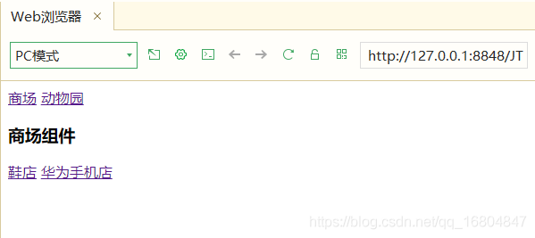