## 9.1 Tomcat 简介

Tomcat 是 Apache 软件基金会（Apache Software Foundation）的 Jakarta 项目中的一个核心项目，由 Apache、Sun 和其他一些公司及个人共同开发而成。由于有了 Sun 的参与和支持，最新的 Servlet 和 JSP 规范总是能在 Tomcat 中得到体现，因为 Tomcat 技术先进、性能稳定，而且免费，因而深受 Java 爱好者的喜爱并得到了部分软件开发商的认可，成为目前比较流行的 Web 应用服务器。

9.2 Tomcat 下载
-------------

*   Tomcat 官方网站：[http://tomcat.apache.org/](http://tomcat.apache.org/)
*   安装版：需要安装，一般不考虑使用。
*   解压版: 直接解压缩使用，我们使用的版本。
*   **因为 tomcat 服务器软件需要使用 java 环境，所以需要正确配置 JAVA_HOME**。

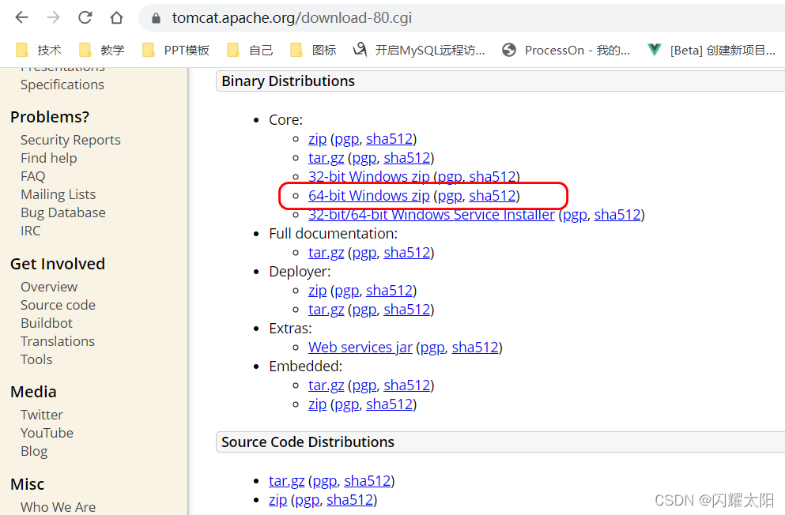

9.3 Tomcat 的版本
--------------

*   版本：企业用的比较广泛的是 7.0 和 8.0 的。授课我们使用 8.0。  
    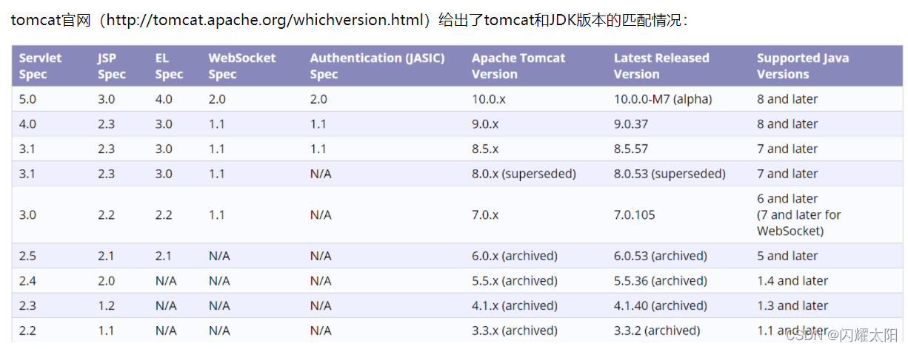

### 9.3.1 安装

解压 apache-tomcat-8.5.27-windows-x64.zip 到**非中文无空格**目录中  
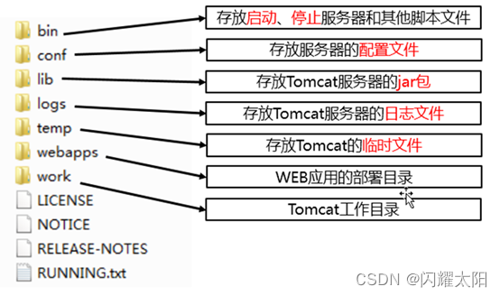  
D:\developer_tools\apache-tomcat-8.5.27，这个目录下直接包含 Tomcat 的 bin 目录，conf 目录等，我们称之为 **Tomcat 的安装目录或根目录**。

*   bin：该目录下存放的是二进制可执行文件，如果是安装版，那么这个目录下会有两个 exe 文件：tomcat6.exe、tomcat6w.exe，前者是在控制台下启动 Tomcat，后者是弹出 GUI 窗口启动 Tomcat；如果是解压版，那么会有 startup.bat 和 shutdown.bat 文件，startup.bat 用来启动 Tomcat，但需要先配置 JAVA_HOME 环境变量才能启动，shutdawn.bat 用来停止 Tomcat；
*   conf：这是一个非常非常重要的目录，这个目录下有四个最为重要的文件：
    *   **server.xml：配置整个服务器信息。例如修改端口号。默认 HTTP 请求的端口号是：8080**
    *   tomcat-users.xml：存储 tomcat 用户的文件，这里保存的是 tomcat 的用户名及密码，以及用户的角色信息。可以按着该文件中的注释信息添加 tomcat 用户，然后就可以在 Tomcat 主页中进入 Tomcat Manager 页面了；
    *   web.xml：部署描述符文件，这个文件中注册了很多 MIME 类型，即文档类型。这些 MIME 类型是客户端与服务器之间说明文档类型的，如用户请求一个 html 网页，那么服务器还会告诉客户端浏览器响应的文档是 text/html 类型的，这就是一个 MIME 类型。客户端浏览器通过这个 MIME 类型就知道如何处理它了。当然是在浏览器中显示这个 html 文件了。但如果服务器响应的是一个 exe 文件，那么浏览器就不可能显示它，而是应该弹出下载窗口才对。MIME 就是用来说明文档的内容是什么类型的！
    *   context.xml：对所有应用的统一配置，通常我们不会去配置它。
*   lib：Tomcat 的类库，里面是一大堆 jar 文件。如果需要添加 Tomcat 依赖的 jar 文件，可以把它放到这个目录中，当然也可以把应用依赖的 jar 文件放到这个目录中，这个目录中的 jar 所有项目都可以共享之，但这样你的应用放到其他 Tomcat 下时就不能再共享这个目录下的 jar 包了，所以建议只把 Tomcat 需要的 jar 包放到这个目录下；
*   logs：这个目录中都是日志文件，记录了 Tomcat 启动和关闭的信息，如果启动 Tomcat 时有错误，那么异常也会记录在日志文件中。
*   temp：存放 Tomcat 的临时文件，这个目录下的东西可以在停止 Tomcat 后删除！
*   **webapps：存放 web 项目的目录，其中每个文件夹都是一个项目**；如果这个目录下已经存在了目录，那么都是 tomcat 自带的项目。其中 ROOT 是一个特殊的项目，在地址栏中访问：http://127.0.0.1:8080，没有给出项目目录时，对应的就是 ROOT 项目。[http://localhost:8080/examples，进入示例项目。其中 examples](http://localhost:8080/examples%EF%BC%8C%E8%BF%9B%E5%85%A5%E7%A4%BA%E4%BE%8B%E9%A1%B9%E7%9B%AE%E3%80%82%E5%85%B6%E4%B8%ADexamples) 就是项目名，即文件夹的名字。
*   work：运行时生成的文件，最终运行的文件都在这里。通过 webapps 中的项目生成的！可以把这个目录下的内容删除，再次运行时会生再次生成 work 目录。当客户端用户访问一个 JSP 文件时，Tomcat 会通过 JSP 生成 Java 文件，然后再编译 Java 文件生成 class 文件，生成的 java 和 class 文件都会存放到这个目录下。
*   LICENSE：许可证。
*   NOTICE：说明文件。

### 9.3.2 配置

启动 Tomcat 前，需要配置如下的环境变量

① 配置 JAVA_HOME 环境变量  
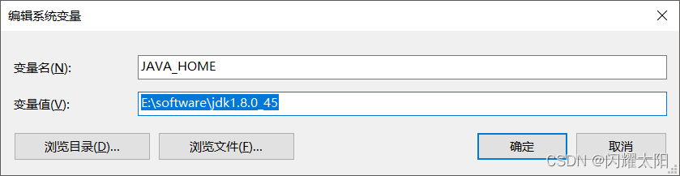

② 在 Path 环境变量中加入 JAVA_HOME\bin 目录

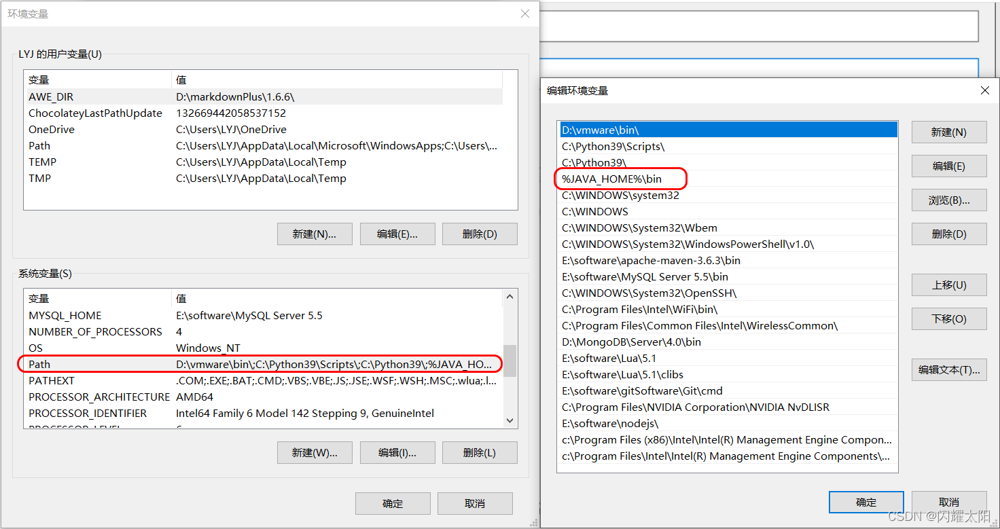

### 9.3.3 启动

在命令行中运行 **catalina run** 或者 Tomcat 解压目录下**双击 startup.bat** 启动 Tomcat 服务器，在浏览器地址栏访问如下地址进行测试

**http://localhost:8080**

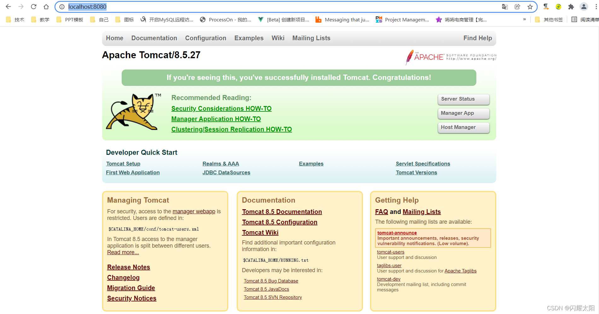  
如果启动失败，查看如下的情况：

情况一：如果双击 startup.bat 后窗口一闪而过，请查看 JAVA_HOME 是否配置正确。

> startup.bat 会调用 catalina.bat，而 catalina.bat 会调用 setclasspath.bat，setclasspath.bat 会使用 JAVA_HOME 环境变量，所以我们必须在启动 Tomcat 之前把 JAVA_HOME 配置正确。

情况二：如果启动失败，提示端口号被占用，则将默认的 8080 端口修改为其他未使用的值，例如 8989 等。

【方法】 打开：解压目录 \ conf\server.xml，找到第一个 Connector 标签，修改 port 属性

> web 服务器在启动时，实际上是监听了本机上的一个端口，当有客户端向该端口发送请求时，web 服务器就会处理请求。但是如果不是向其所监听的端口发送请求，web 服务器不会做任何响应。例如：Tomcat 启动监听了 8989 端口，而访问的地址是 [http://localhost:8080](http://localhost:8080/)，将不能正常访问。

### 9.3.4 静态项目导入方式

将静态的 web 项目导入到 tomcat 目录之下如图所示:  
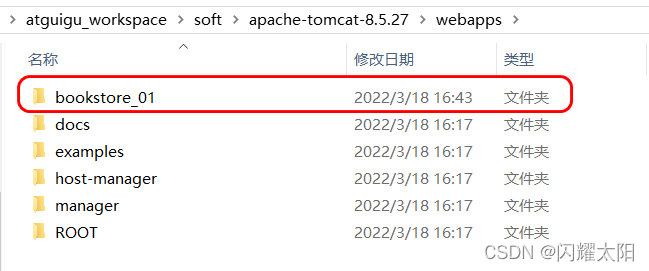  

2. 效果展现  
   

9.4 在 IDEA 中创建 Tomcat
---------------------

在 IDEA 中配置好 Tomcat 后，可以直接通过 IDEA 控制 Tomcat 的启动和停止，而不用再去操作 startup.bat 和 shutdown.bat。

① 点击 File–>Settings 或者直接点击图标

  
下一步:  
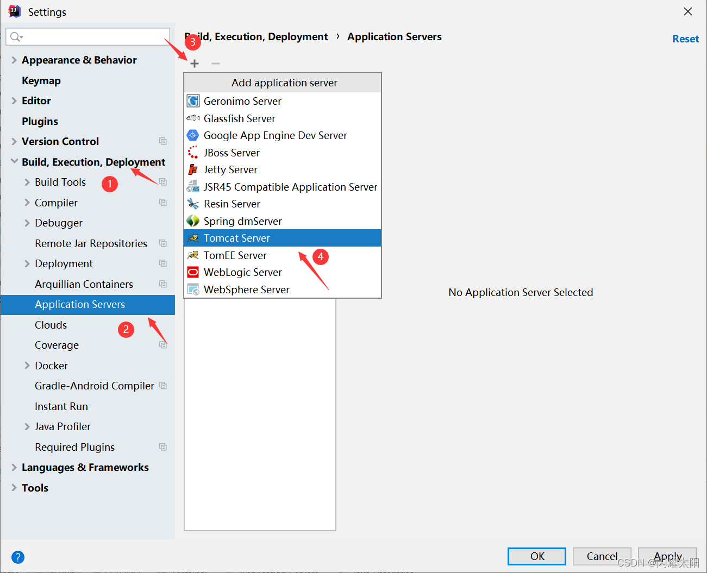

下一步：

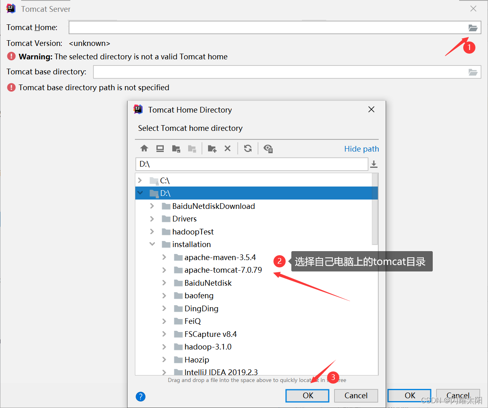

9.5 动态 Web 工程部署与测试 (低版本)
------------------------

创建动态 Web 工程  
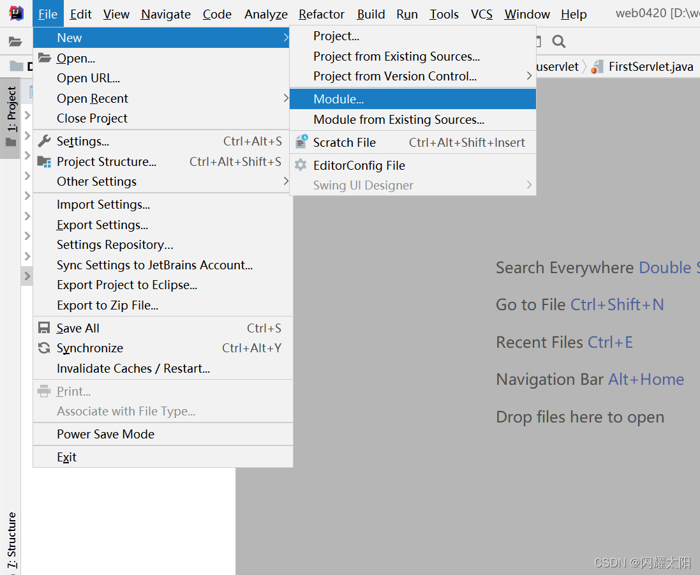

接着：

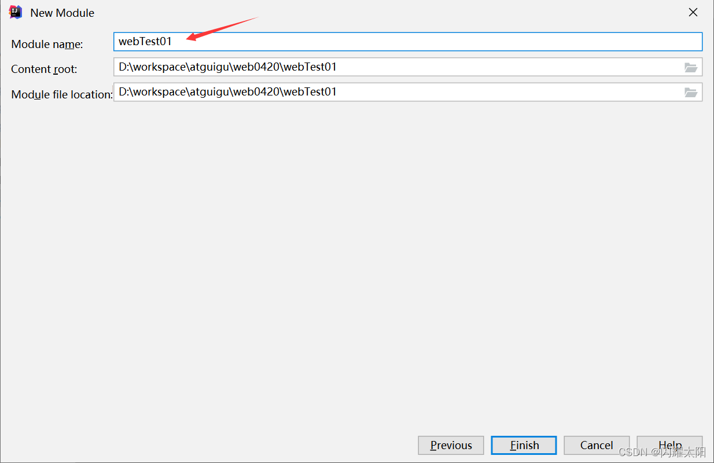

9.10 关于 IDEA 配置 tomcat 的说明 (高版本)
--------------------------------

### 9.10.1 普通 java 项目变为 web 项目

说明: 1. 在常规的 java 项目的基础之上右键 Add Framework Support  
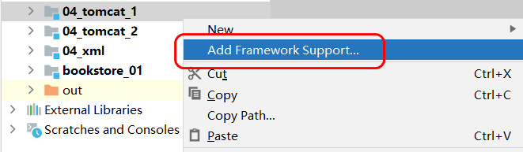  

2. 勾选 Web 应用  
   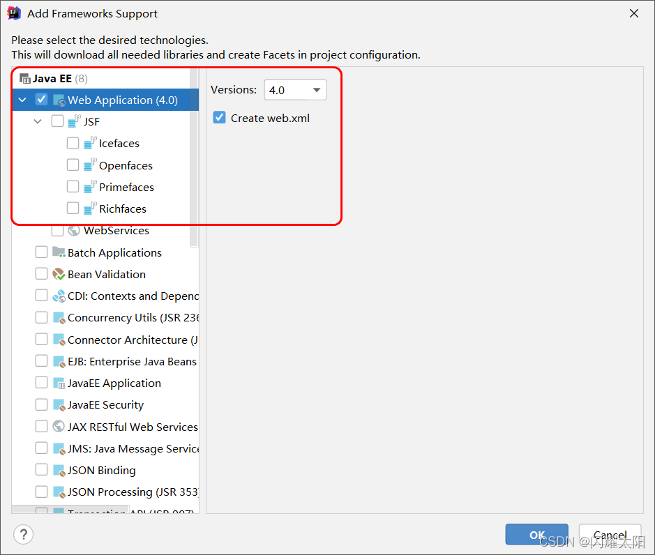

### 9.10.2 配置 war 包信息

1.  web 项目默认的打包路径  
    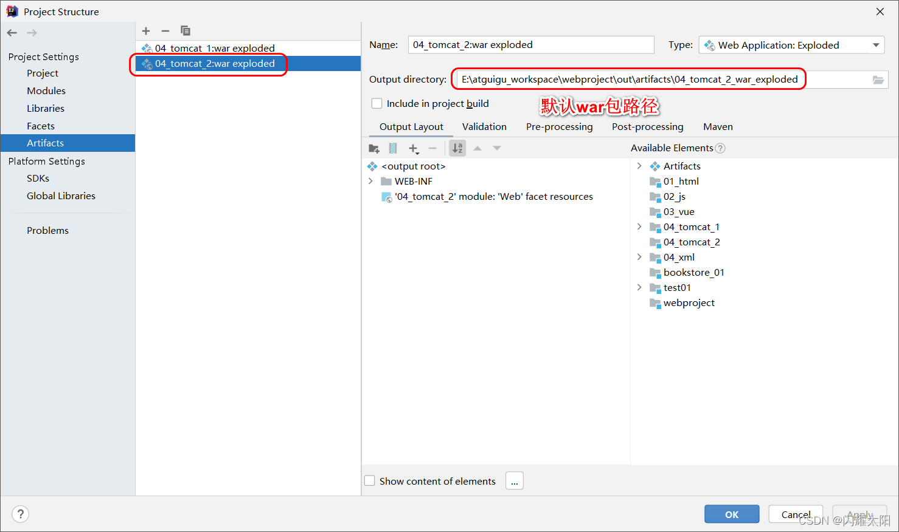
2.  tomcat 部署配置  
    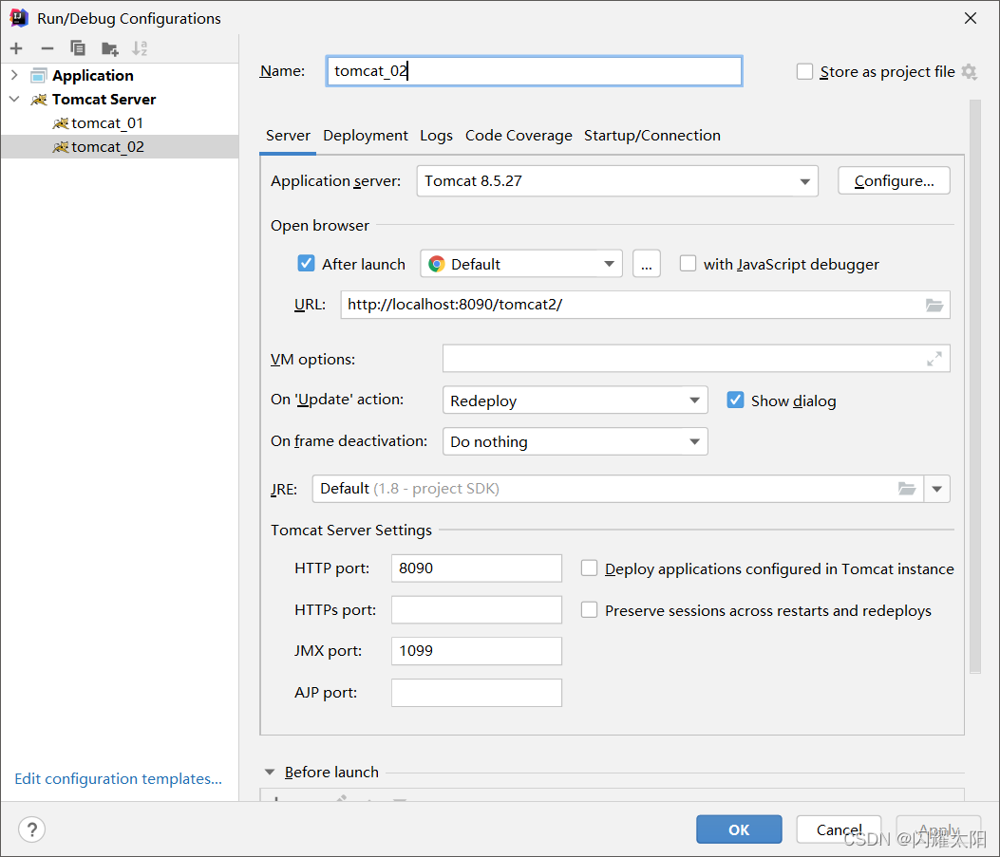
3.  项目 war 包文件配置  
    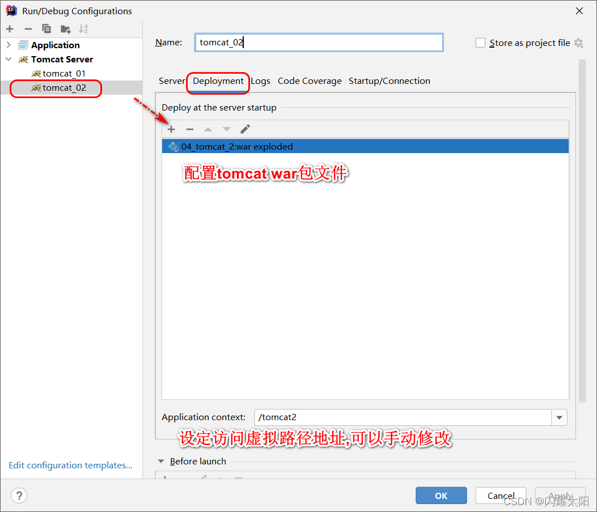

--------------