> 本文由 [简悦 SimpRead](http://ksria.com/simpread/) 转码， 原文地址 [blog.csdn.net](https://blog.csdn.net/weixin_45851575/article/details/120710667)

# nexus 私服简介及搭建

一 私服是什么？
========

一个特殊的远程仓库，它是架设在局域网内的仓库服务，供局域网内的开发人员使用。 当 Maven 需要下载构建的使用， 它先从私服请求，如果私服上没有的话，则从外部的远程仓库下载，然后缓存在私服上 ，再为 Maven 的下载请求提供服务。  
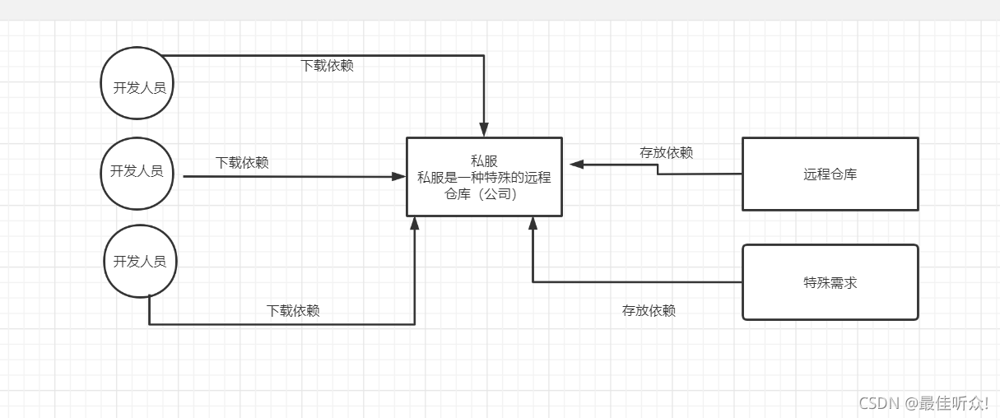  
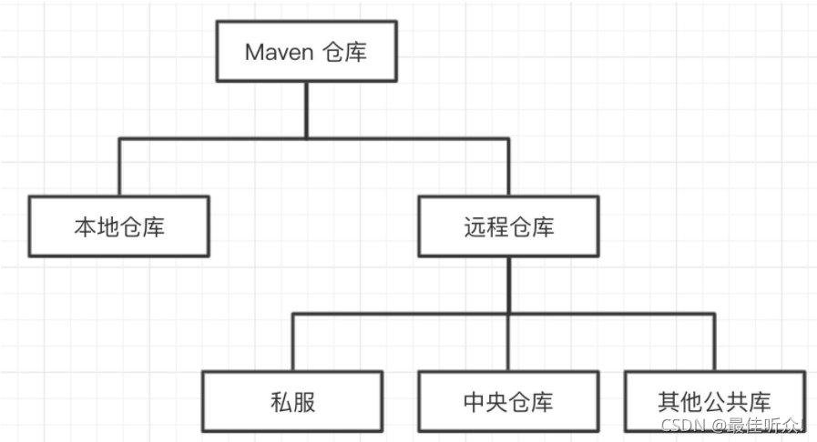

1.1 私服的作用
---------

内网访问，节省外网带宽。  
一次外网下载，内网所有用户就可以只下载私服缓存，加速 Maven 项目构建。  
允许上传和下载私有库，并且不被外部访问，更加安全。  
减少外部网络因素，提供项目构建的稳定性。  
方便内部项目服务的依赖引用，而不需要其他项目的完整源代码。  
有利于公共构件的维护  
提高工作效率  
等等

1.2 Nexus 下载
------------

我们选择使用最流行的开源 Maven 仓库管理软件 - Nexus，来快速搭建 Maven 私服  
Nexus 的官网  
https://www.sonatype.com/products/repository-oss-download 下载  
百度网盘下载  
链接：https://pan.baidu.com/s/1VoS6FYX-PeHaokv6popfXg  
提取码：0haa

1.3 使用 Nexus 搭建私服
-----------------

在 bin 目录下使用命令框窗口去输入 nexus /run 命令启动  
启动成功  
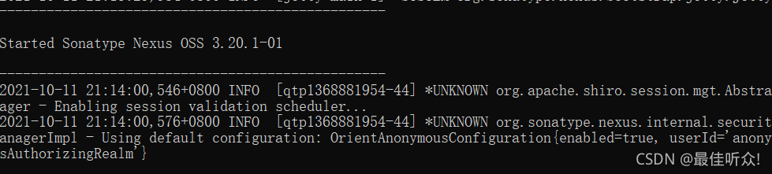  
浏览器上输入地址：http://localhost:8081/ 访问  
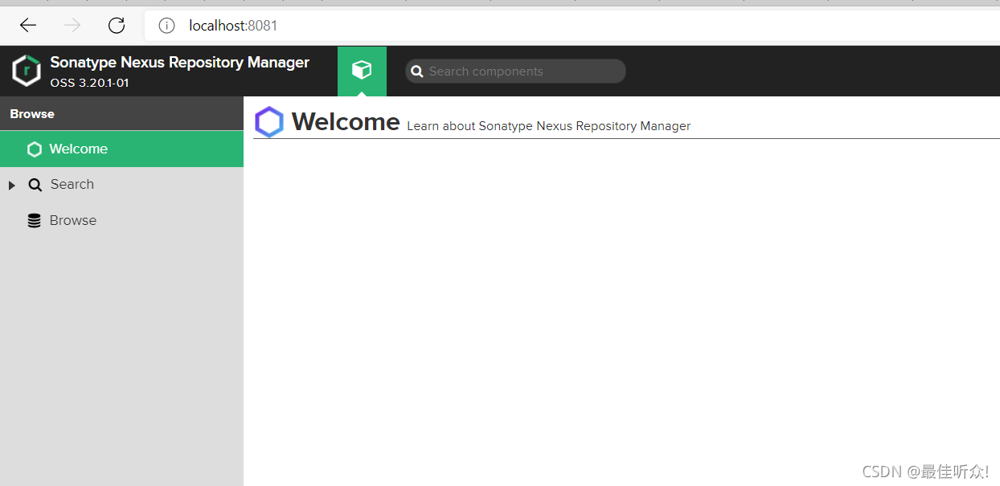

### 1.3.1 可以修改默认端口

`Nexus\nexus-3.20.1-01\etc\nexus-default.properties`  
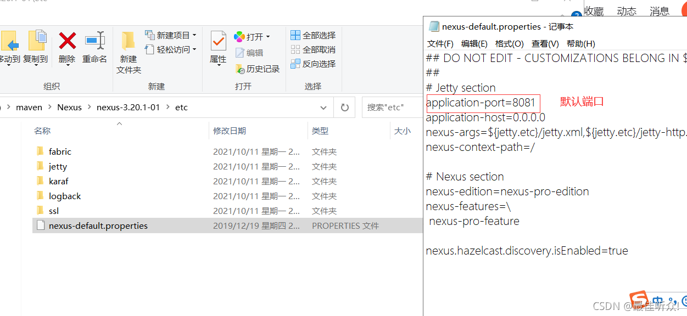

1.4 登陆私服时密码不对的问题解决方案
--------------------

1 **旧版本**  
账号 admin  
密码 admin123  
2 **新版本**  
默认的 UserName：admin  
第一次登陆的时的密码是随机生成的在 admin.password 文件里面 复制密码登陆  
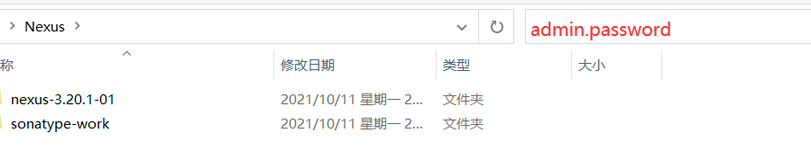  
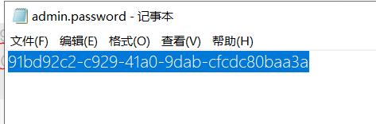

二私服的使用
======

2.1 一些私服的专业词
------------

hosted，本地仓库（也叫宿主仓库），通常我们会部署自己的构件到这一类型的仓库或者是第三方的包（如：oracel 的）。  
proxy，代理仓库，它们被用来代理远程的公共仓库，如 maven 中央仓库。  
group，仓库组，用来合并多个 hosted/proxy 仓库，通常我们配置 maven 依赖仓库组  
maven-central：maven 中央库，默认从 https://repo1.maven.org/maven2 / 拉取 jar  
maven-releases：私库发行版 jar  
maven-snapshots：私库快照（调试版本）jar  
maven-public：仓库分组，把上面三个仓库组合在一起对外提供服务，在本地 maven 基础配置 settings.xml 中使用。  
Hosted 有三种方式：Releases、Snapshot、Mixed  
Releases: 一般是已经发布的 Jar 包  
Snapshot: 未发布的版本  
Mixed：混合的

2.2 创建 Proxy Repository 代理仓库。
-----------------------------

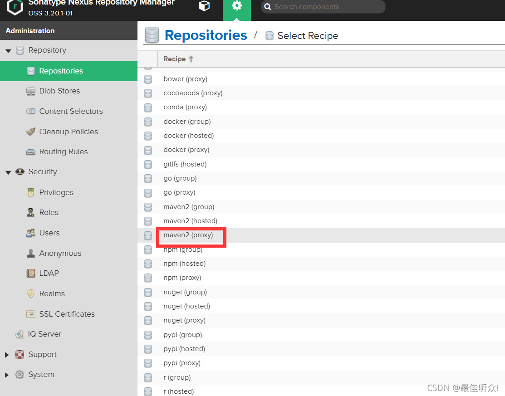  
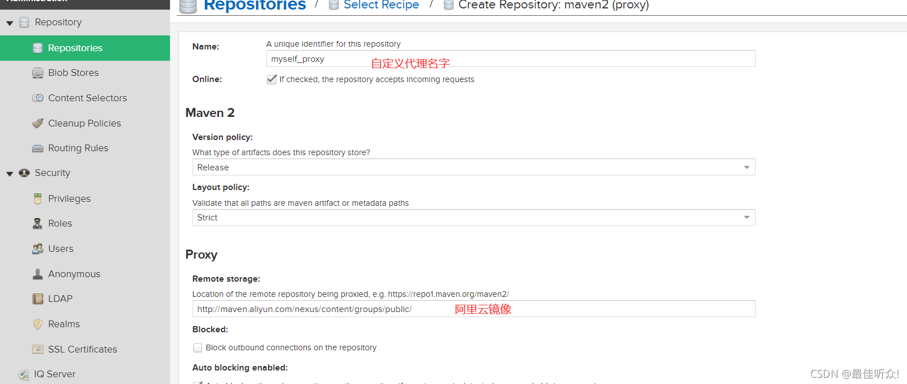

2.3 新建自定义的仓库
------------

点击 Create repository, 然后选择类型为 maven2(hosted)  
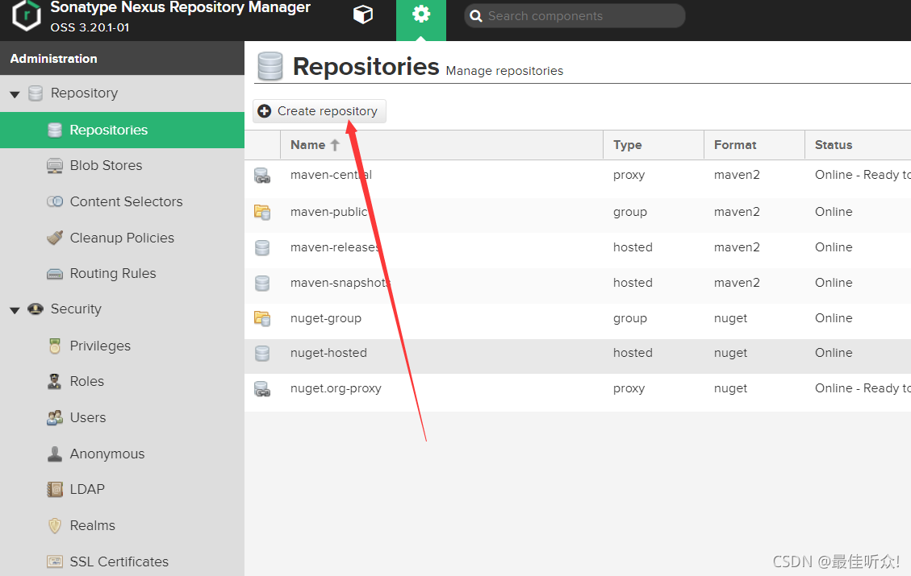  
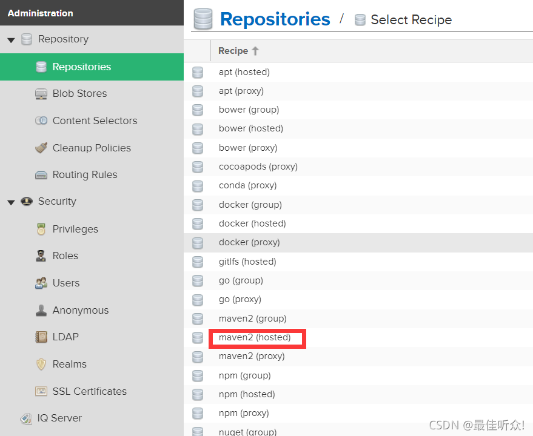  
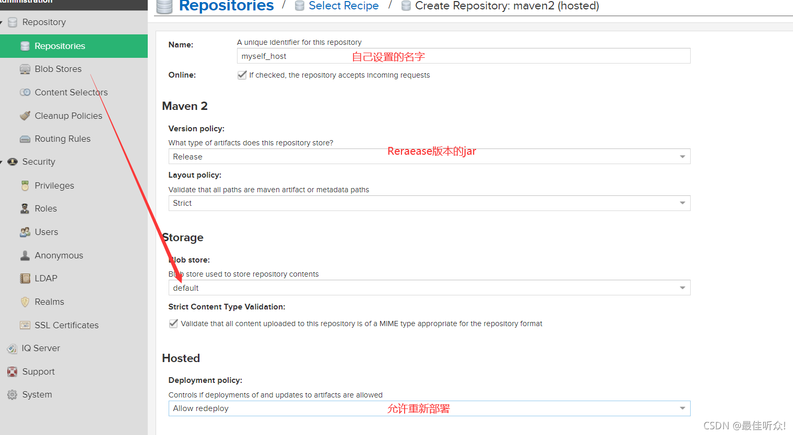

2.4 自定义组资源库
-----------

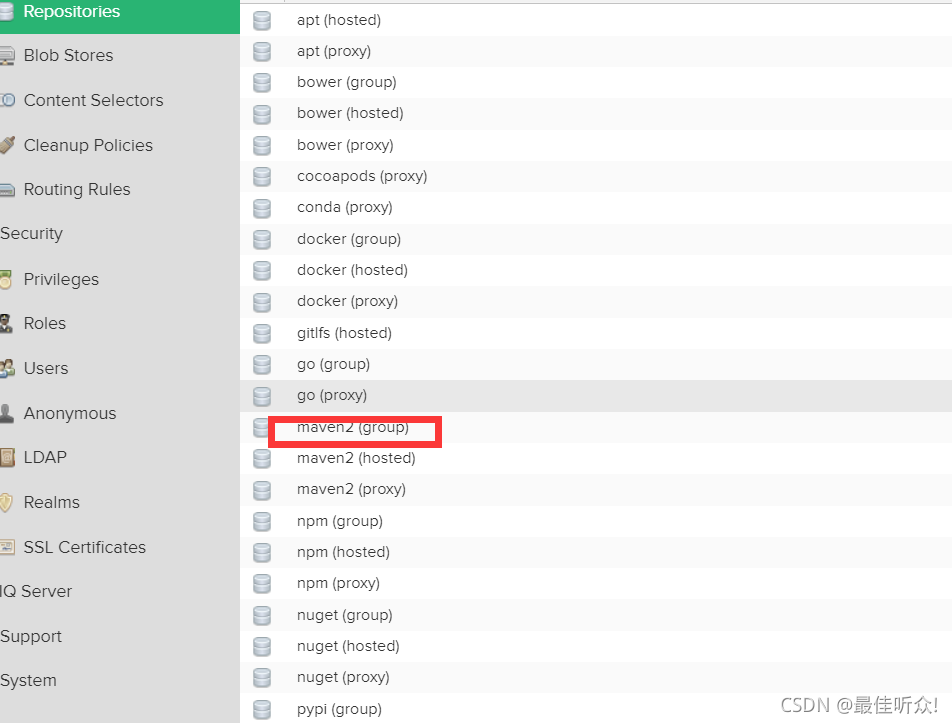

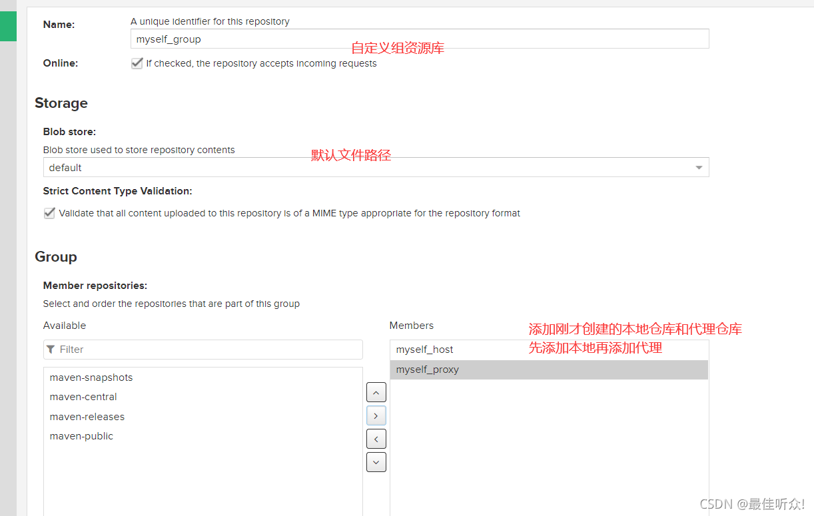

三 在 Maven 项目使用 Nexus 私服
=======================

3.1 创建角色
--------

一个角色下有多个用户 ，有了角色才能分配给用户权限  
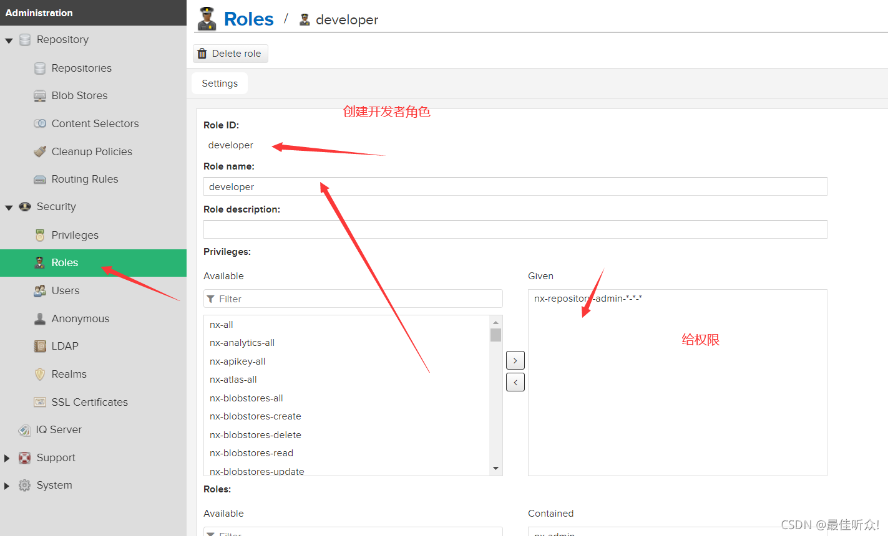  
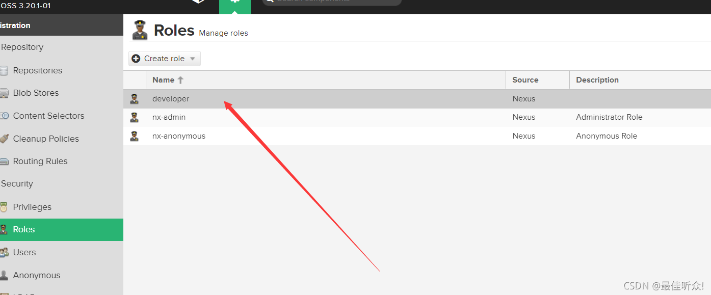

3.2 创建用户
--------

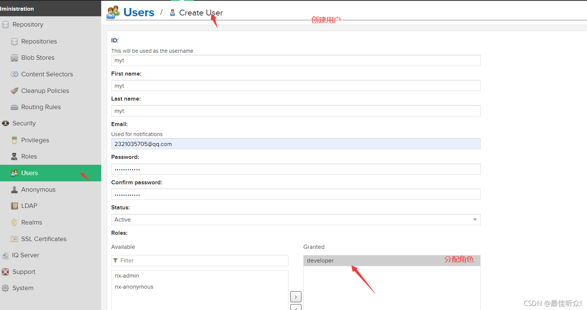  
创建成功  
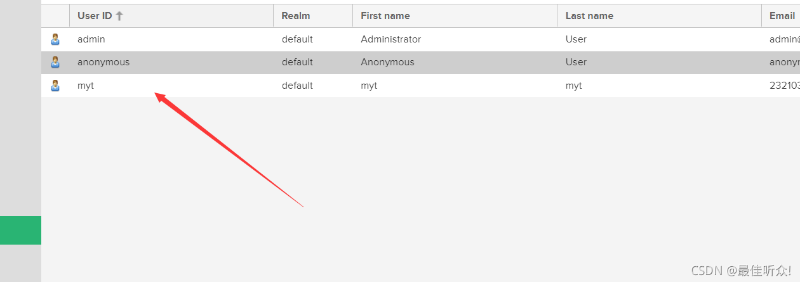

3.3 maven setting.xml 文件配置
--------------------------

：定义 jar 包下载的 Maven 仓库、定义部署服务器。  
但是某些配置例如 username 和 password 就保存在构建服务器中的 settings.xml 中。

id:server 的 id, 用于匹配 distributionManagement 库 id，比较重要。  
username, password: 用于登陆此服务器的用户名和密码  
privateKey, passphrase：设置 private key，以及 passphrase  
filePermissions, directoryPermissions：当库文件或者目录创建后，需要使用权限进行访问。参照 unix 文件许可，如 664 和 775  
：表示镜像库，指定库的镜像，用于增加其他库。mirror 相当于一个拦截器，它会拦截 maven 对 remote repository 的相关请求，把请求里的 remote repository 地址，重定向到 mirror 里配置的地址。  
id,name: 唯一的标志，用于区别镜像  
url: 镜像的 url  
mirrorOf：此镜像指向的服务 id

在 maven 中配置私服，编辑 setting.xml  
  Maven 的中央仓库地址默认是：https://repo.maven.apache.org/maven2/, 可以通过修改 settings.xml 文件来修改默认的中央仓库地址：

```xml
<?xml version="1.0" encoding="UTF-8"?>

<settings xmlns="http://maven.apache.org/SETTINGS/1.0.0"
          xmlns:xsi="http://www.w3.org/2001/XMLSchema-instance"
          xsi:schemaLocation="http://maven.apache.org/SETTINGS/1.0.0 http://maven.apache.org/xsd/settings-1.0.0.xsd">
          <!--本地仓库-->
  	<localRepository>D:/maven/repository</localRepository>
	<interactiveMode>true</interactiveMode>
    <offline>false</offline>
	<!--配置权限,使用默认用户-->
	<servers>
		<server>
		    <!--这是server的id（注意不是用户登陆的id），该id与repository元素的id相匹配。 -->
         <id>maven-releases</id>
         <username>admin</username>
         <password>2321035705Ma</password>
     </server>

     <server>
         <id>maven-snapshots</id>
         <username>admin</username>
         <password>2321035705Ma</password>
     </server>

     <server>
         <id>myself_group</id>
         <username>admin</username>
         <password>2321035705Ma</password>
     </server>
	</servers>
	
	<mirrors>
		<!--阿里云镜像-->
		<mirror>  
	      <id>alimaven</id>  
	      <name>aliyun maven</name>  
	      <url>http://maven.aliyun.com/nexus/content/groups/public/</url>  
	      <mirrorOf>central</mirrorOf>          
	    </mirror>
    </mirrors>

	
	<profiles>
		<profile>
		   <id>nexus</id>
			    <activation>
			     <activeByDefault>true</activeByDefault>
				 <jdk>1.8</jdk>
			    </activation>
			    <repositories>
					<!-- 私有库地址-->
				    <repository>
						<id>nexus-group</id>
						<url>http://localhost:8081/repository/nexus-group/</url>
						<!-- <releases><enabled>true</enabled></releases>告诉Maven可以从这个仓库下载releases版本的构件-->
						<releases>
							<enabled>true</enabled>
						</releases>
						<snapshots>
							<enabled>true</enabled>
						</snapshots>
					</repository>
					
					
					
				</repositories>      
				<pluginRepositories>
					<!--插件库地址-->
					<!-- 如果是配置了repositories，那么你会发现在mvn在下载依赖的时候，一部分从阿里云下载，一部分还是从默认的仓库（https://repo.maven.apache.org ）下载-->
					<pluginRepository>
						<id>nexus-group</id>
						<url>http://localhost:8081/repository/nexus-group/</url>
					
						<releases>
							<enabled>true</enabled>
						</releases>
						<snapshots>
							<enabled>true</enabled>
					   </snapshots>
					</pluginRepository>
				</pluginRepositories>
			</profile>

			<profile>
		     <id>jdk-1.8</id>
			 <activation>
			     <activeByDefault>true</activeByDefault>
				 <jdk>1.8</jdk>
			 </activation>
			 <properties>
			     <maven.compiler.source>1.8</maven.compiler.source>
				 <maven.compiler.target>1.8</maven.compiler.target>
				 <maven.compiler.compilerVersion>1.8</maven.compiler.compilerVersion>
			 </properties>
		</profile>
	</profiles>
	
	<!--激活profile-->
	<activeProfiles>
	<!--将所有repositories以及pluginRepositories元素放到这个profile中，然后，使用<activeProfiles>元素自动激活该profile。这样，你就不用再为每个POM重复配置仓库-->
		<activeProfile>nexus</activeProfile>
		<activeProfile>jdk-1.8</activeProfile>  
	</activeProfiles>
</settings>
```

3.4 部署的仓库是用 POM 中 distributionManagement 元素来定义的。
------------------------------------------------

准备发布的 jar 运行：`mvn deploy` 即可

```xml
<distributionManagement>
    <repository>
        <id>maven-releases</id>
        <name>Nexus Release Repository</name>
        <url>http://localhost:8081/repository/maven-releases/</url>
    </repository>
    <snapshotRepository>
        <id>maven-snapshots</id>
        <name>Nexus Snapshot Repository</name>
        <url>http://localhost:8081/repository/maven-snapshots/</url>
    </snapshotRepository>
</distributionManagement>
```

3.5 用来下载依赖是用 POM 中的 repositories
--------------------------------

```xml
<repositories>
  <repository>
    <id>nexus</id>
    <url>http://121.4.207.231:8081/repository/maven-public/</url>
    <releases>
      <enabled>true</enabled>
    </releases>
    <snapshots>
    <enabled>true</enabled>
    </snapshots>
  </repository>
</repositories>
```