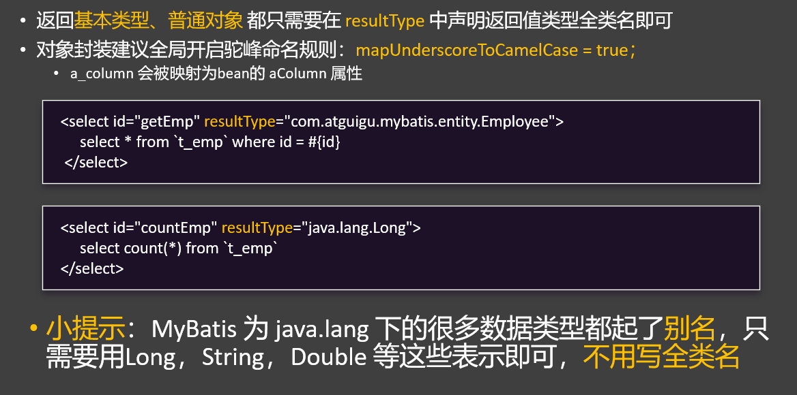
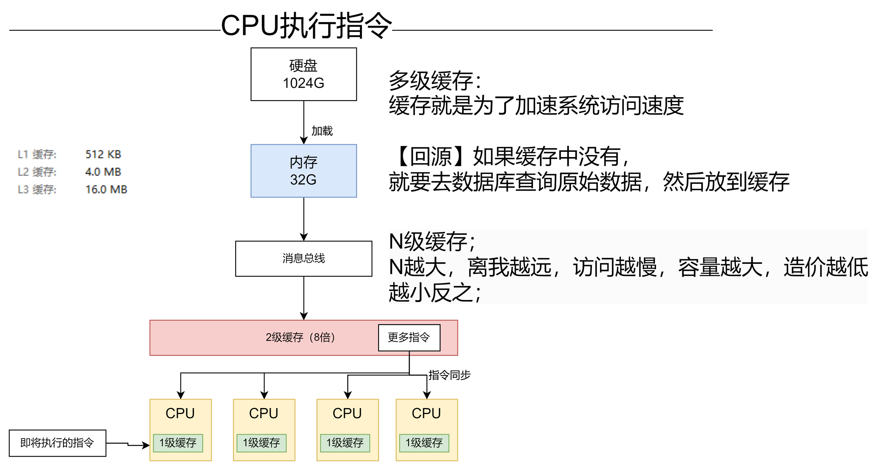

# MyBatis 持久层框架

```tex
134.MyBatis - HelloWorld.mp4
135.MyBatis - 简介.mp4
136.MyBatis - HelloWorld - 细节.mp4
137.MyBatis - CRUD - 完成 - 开sql日志.mp4
138.MyBatis - CRUD - 细节 - useGeneratedKeys 获取自增id.mp4
139.MyBatis - CRUD - 查询所有 & 开启驼峰命名.mp4
140.MyBatis - 参数处理 - #{}和${}.mp4
141.MyBatis - 参数处理 - 单个参数 #{} 直接取值.mp4
142.MyBatis - 参数处理 - 多个参数 @Param 注解标注每个参数的名字.mp4
143.MyBatis - 返回值 - 普通、对象、List、Map.mp4
144.MyBatis - 返回值 - ResultMap - 自定义结果集.mp4
145.MyBatis - 关联查询 - 关联关系复习与环境搭建.mp4
146.MyBatis - 关联查询 - ResultMap - association 指定一对一关联封装规则.mp4
147.MyBatis - 关联查询 - ResultMap - collection 指定一对多关联封装规则.mp4
148.MyBatis - 分步查询 - 原生分步写法.mp4
149.MyBatis - 自动分步查询 - collection - select 属性指定需要启动的下一次查询.mp4
150.MyBatis - 自动分步查询 - association - select 指定启动下一次查询.mp4
151.MyBatis - 超级分步的大坑.mp4
152.MyBatis - 分步查询 - 开启延迟加载.mp4
153.MyBatis - 自定义结果集小结 - 1-1、1-N、N-N.mp4
154.MyBatis - 动态SQL - if 标签.mp4
155.MyBatis - 动态SQL - where标签.mp4
156.MyBatis - 动态SQL - set标签.mp4
157.MyBatis - 动态SQL - trim标签实现where.mp4
158.MyBatis - 动态SQL - trim标签实现set.mp4
159.MyBatis - 动态SQL - choose、when、otherwise分支选择.mp4
160.动态sql-foreach批量操作.mp4
161.MyBatis - 动态SQL - 批量sql数据库默认支持回滚.mp4
162.MyBatis - 动态SQL - sql - 抽取可复用的片段.mp4
163.MyBatis - XML中的转义字符.mp4
164.MyBatis - 缓存机制 - 体验一级缓存.mp4
165.MyBatis - 缓存机制 - 体验二级缓存.mp4
166.MyBatis - 插件机制 - 知道有四大对象.mp4
167.MyBatis - 分页插件 - 基础用法.mp4
168.MyBatis - 分页插件 - 分页前后配合.mp4
169.MyBatis - 逆向生成.mp4
170.MyBatis - 最后的作业.mp4
```


## 1、MyBatis入门

### 介绍

•https://mybatis.org/


### Hello World


```
 步骤：
 1、导入mybatis依赖
 2、配置数据源信息
 3、编写一个JavaBean对应数据库一个表模型
 4、以前: Dao接口 --> Dao实现 --> 标注 @Repository注解
    现在: Mapper接口 --> Mapper.xml实现;  --> 标注 @Mapper注解
      安装mybatisx插件，自动为 mapper类生成 mapper文件
      在mapper文件中配置方法的实现sql
 5、告诉MyBatis去哪里找Mapper文件；mybatis.mapper-locations=classpath:mapper/**.xml
 6、编写单元测试
```


1、创建项目

`pom.xml`

```xml
<dependency>
    <groupId>org.mybatis.spring.boot</groupId>
    <artifactId>mybatis-spring-boot-starter</artifactId>
    <version>3.0.3</version>
</dependency>
<dependency>
    <groupId>com.mysql</groupId>
    <artifactId>mysql-connector-j</artifactId>
    <scope>runtime</scope>
</dependency>
```

`application.properties`

```properties
spring.datasource.url=jdbc:mysql://localhost:3306/mybatis-example
spring.datasource.username=root
spring.datasource.password=123456
spring.datasource.driver-class-name=com.mysql.cj.jdbc.Driver
```

2、准备数据库环境（helloworld.sql）

```sql
CREATE TABLE `t_emp` (
  `id` int NOT NULL AUTO_INCREMENT,
  `emp_name` char(100) DEFAULT NULL,
  `age` int DEFAULT NULL,
  `emp_salary` double(10,5) DEFAULT NULL,
  PRIMARY KEY (`id`)
) ENGINE=InnoDB AUTO_INCREMENT=4 DEFAULT CHARSET=utf8mb4 COLLATE=utf8mb4_0900_ai_ci;
```

3、编写dao接口（查询员工）

```java
@Data
public class Emp {
	// javaBean与数据库名称不对应解决措施：
    //		方式一：开启驼峰命名自动映射封装
    //		方式二：数据库字段使用as取别名
    private Integer id;
    private String empName; // emp_name；  驼峰命名规则
    private Integer age;
    private Double empSalary; // emp_salary
}
```


```java
@Mapper  //告诉Spring，这是MyBatis操作数据库用的接口; Mapper接口
public interface EmpMapper {
    //按照id查询
    Emp getEmpById(Integer id);

}
```


4、编写dao实现（dao.xml）

`src/main/resources/mapper/EmpMapper.xml`

```xml
<?xml version="1.0" encoding="UTF-8" ?>
<!DOCTYPE mapper PUBLIC "-//mybatis.org//DTD Mapper 3.0//EN" "http://mybatis.org/dtd/mybatis-3-mapper.dtd" >
<mapper namespace="com.atguigu.mybatis.mapper.EmpMapper">
    <!-- namespace: 编写mapper接口的全类名，代表，这个xml文件和这个mapper接口进行绑定   -->

    <!--    Emp getEmpById(Integer id);
    select 标签代表一次查询
       id：绑定方法名
       resultType：返回值类型
	数据库的值取别名 和javaBean对应上或者开启驼峰映射
    -->
    <select id="getEmpById" resultType="com.atguigu.mybatis.bean.Emp">
        select id,emp_name empName,age,emp_salary empSalary
           from t_emp where id = ${id}
    </select>
</mapper>
```


5、配置xml扫描位置

```properties
# 告诉MyBatis， xml文件(Mapper文件) 都在哪里
mybatis.mapper-locations=classpath:mapper/**.xml
# 开启驼峰映射
#mybatis.configuration.map-underscore-to-camel-case=true
```


6、单元测试 

```java
@SpringBootTest
class Mybatis01HelloworldApplicationTests {

    @Autowired  //容器中是MyBatis为每个Mapper接口创建的代理对象
    EmpMapper empMapper;

    @Test
    void testValue(){
        //前端传来的参数最好做一个校验（SQL防注入校验）   or
        //SQL防注入工具类
        Emp tEmp = empMapper.getEmpById02(1, "t_emp");
        System.out.println("tEmp = " + tEmp);
    }
}
```


7、开启SQL日志

```properties
#com.atguigu.mybatis.mapper 下面的包日志为debug级别
logging.level.com.atguigu.mybatis.mapper=debug
```


### HelloWorld - 细节


### CRUD


```java
@Mapper  //告诉Spring，这是MyBatis操作数据库用的接口; Mapper接口
public interface EmpMapper {

    Emp getEmpById02(Integer id,String tableName);

    //按照id查询
    Emp getEmpById(Integer id);


    //查询所有员工
    List<Emp> getAll();


    //添加员工
    void addEmp(Emp emp);


    //更新员工
    void updateEmp(Emp emp);

    //删除员工
    void deleteEmpById(Integer id);

}

```


```xml
<?xml version="1.0" encoding="UTF-8" ?>
<!DOCTYPE mapper PUBLIC "-//mybatis.org//DTD Mapper 3.0//EN" "http://mybatis.org/dtd/mybatis-3-mapper.dtd" >
<!-- namespace: 编写mapper接口的全类名，代表，这个xml文件和这个mapper接口进行绑定   -->
<mapper namespace="com.atguigu.mybatis.mapper.EmpMapper">

<!--    Emp getEmpById(Integer id);
select 标签代表一次查询
   id：绑定方法名
   resultType：返回值类型
-->
    <select id="getEmpById" resultType="com.atguigu.mybatis.bean.Emp">
        select id,emp_name empName,age,emp_salary empSalary
           from t_emp where id = ${id}
    </select>


<!--   返回的是集合，不用管集合， resultType 还写对象类型（集合中的元素类型）-->
    <select id="getAll" resultType="com.atguigu.mybatis.bean.Emp">
        select * from t_emp
    </select>


    <!--
        useGeneratedKeys： 使用自动生成的id
        keyProperty： 指定自动生成id对应的属性； 把自动生成的id封装到Emp对象的id属性中
        自增id回填
      -->
    <insert id="addEmp" useGeneratedKeys="true" keyProperty="id">

        insert into t_emp(emp_name, age, emp_salary) values (#{empName},#{age},#{empSalary})
    </insert>


    <update id="updateEmp">
        update t_emp set emp_name = #{empName},age = #{age},emp_salary = #{empSalary}
    where id = #{id}
    </update>


    <delete id="deleteEmpById">
        delete from t_emp where id = #{id}
    </delete>


<!--
#{}：参数位置动态取值，安全，无SQL注入问题
${}：JDBC层面 表名等位置 不支持预编译，只能用 ${}
  -->
    <select id="getEmpById02" resultType="com.atguigu.mybatis.bean.Emp">
        select id,emp_name empName,age,emp_salary empSalary
        from ${tableName} where id = #{id}
    </select>


</mapper>
```


### 自增id回填 -`useGeneratedKeys`


```xml
    <!--
        useGeneratedKeys： 使用自动生成的id
        keyProperty： 指定自动生成id对应的属性； 把自动生成的id封装到Emp对象的id属性中
        自增id回填
      -->
    <insert id="addEmp" useGeneratedKeys="true" keyProperty="id">

        insert into t_emp(emp_name, age, emp_salary) values (#{empName},#{age},#{empSalary})
    </insert>
```


## 2、MyBatis 参数传递

### `#{} 与 ${}`


> 预编译方式`#{}`底层预编译方式【PreparedStatement】：`表名等位置 不支持预编译，只能用 ${}`

底层原理

```java
    @Autowired
    DataSource dataSource;

    @Test
    void contextLoads() throws SQLException {

        // #{}取值： 预编译方式 
        // Preparing: select id,emp_name empName,age,emp_salary empSalary from t_emp where id = ?
        // Parameters: 1(Integer)
        // Total: 1
        Emp empById = empMapper.getEmpById(1);

        // ${}取值：拼接方式
        // select id,emp_name empName,age,emp_salary empSalary from t_emp where id = 1

        System.out.println("empById = " + empById);


        Connection connection = dataSource.getConnection();
//
        String sql = "select * from user where username = ? and password = ? ";
        //#{}底层预编译方式： 限制点：不能在表名位置使用
        PreparedStatement preparedStatement = connection.prepareStatement(sql);
        preparedStatement.setString(1, "admin");
        preparedStatement.setString(2, "123456");

//        //${}底层拼接方式： SQL注入问题
        String sql2 = "select * from user where username = 'admin' and password = ' ' or 1=1 or 1='' ";
        Statement statement = connection.createStatement();
        statement.execute("select * from t_emp where id = " + 2);

    }
```


案例：

```xml
<!--
#{}：参数位置动态取值，安全，无SQL注入问题
${}：JDBC层面 表名等位置 不支持预编译，只能用 ${}
-->
<select id="getEmpById02" resultType="com.atguigu.mybatis.bean.Emp">
    select id,emp_name empName,age,emp_salary empSalary
    from ${tableName} where id = #{id}
</select>
```


### 参数取值


#### 单个参数

```java
//单个参数：
//  1、#{参数名} 就可以取值。
//  2、Map和JavaBean，#{key/属性名} 都可以取值。
@Mapper  //告诉Spring，这是MyBatis操作数据库用的接口; Mapper接口
public interface EmpParamMapper {

    Emp getEmploy(Long id);

    //    // 获取数组中第二个元素指定的用户
    Emp getEmploy02(List<Long> ids);
//

    // 对象属性取值，直接获取
    void addEmploy(Emp e);


    // map中的属性也是直接取值
    void addEmploy2(Map<String, Object> m);
    
}
```


```xml
<?xml version="1.0" encoding="UTF-8" ?>
<!DOCTYPE mapper PUBLIC "-//mybatis.org//DTD Mapper 3.0//EN" "http://mybatis.org/dtd/mybatis-3-mapper.dtd" >
<mapper namespace="com.atguigu.mybatis.mapper.EmpParamMapper">
    <!--    对象取值-->
    <insert id="addEmploy">
        insert into t_emp(emp_name,age) values (#{empName},#{age})
    </insert>
<!--    map取值-->
    <insert id="addEmploy2">
        insert into t_emp(emp_name,age) values (#{name},#{age})
    </insert>

<!--   包装类型-->
    <select id="getEmploy" resultType="com.atguigu.mybatis.bean.Emp">
        select * from t_emp where id = #{id}
    </select>

<!--   集合/数组取值  取ids中第二个值 -->
    <select id="getEmploy02" resultType="com.atguigu.mybatis.bean.Emp">
        select * from t_emp where id = #{ids[1]}
    </select>
</mapper>
```


####  多个参数

```java
//单个参数：
//  1、#{参数名} 就可以取值。
//  2、Map和JavaBean，#{key/属性名} 都可以取值。
//多个参数：
//  用@Param指定参数名， #{参数名} 就可以取值。
@Mapper  //告诉Spring，这是MyBatis操作数据库用的接口; Mapper接口
public interface EmpParamMapper {

    //以后多个参数，用@Param指定参数名， #{参数名} 就可以取值。
    Emp getEmployByIdAndName(@Param("id") Long id, @Param("empName") String name);


    // select * from emp where id = #{id} and emp_name = #{从map中取到的name} and age = #{ids的第三个参数值} and salary = #{e中的salary}
    Emp getEmployHaha(@Param("id") Long id,
                      @Param("m") Map<String,Object> m,
                      @Param("ids") List<Long> ids,
                      @Param("e") Emp e);
}
```


```xml
<!--
    新版 MyBatis支持多个参数情况下，直接用 #{参数名}
    老版 MyBatis不支持以上操作，需要用 @Param 注解指定参数名
-->
    <select id="getEmployByIdAndName" resultType="com.atguigu.mybatis.bean.Emp">
        select * from t_emp where id = #{id} and emp_name = #{empName}
    </select>


    <select id="getEmployHaha" resultType="com.atguigu.mybatis.bean.Emp">
        select * from t_emp where id = #{id}
                              and emp_name = #{m.name}
                              and age = #{ids[2]}
                              and emp_salary = #{e.empSalary}
    </select>
```


## 3、MyBatis 结果封装

```java
 * 和数据库对不上的字段封装为null，
 * 如何解决？
 * 0、JavaBean 和 数据库一样 【不推荐】
 * 1、使用 列别名；
 * 2、使用 驼峰命名自动映射；
 * 3、使用 ResultMap（自定义结果集）
```


### 返回普通数据




```java
@Mapper
public interface EmpReturnValueMapper {
    Long countEmp();
    BigDecimal getEmpSalaryById(Integer id);
}
```


```xml
<?xml version="1.0" encoding="UTF-8" ?>
<!DOCTYPE mapper PUBLIC "-//mybatis.org//DTD Mapper 3.0//EN" "http://mybatis.org/dtd/mybatis-3-mapper.dtd" >
<mapper namespace="com.atguigu.mybatis.mapper.EmpReturnValueMapper">

    <!--   有别名，但不用 -->
    <select id="countEmp" resultType="long">
        select count(*)
        from t_emp
    </select>
    <select id="getEmpSalaryById" resultType="java.math.BigDecimal">
        select emp_salary
        from t_emp
        where id = #{id}
    </select>

</mapper>
```


### 返回List、Map


```java
package com.atguigu.mybatis.mapper;

import com.atguigu.mybatis.bean.Emp;
import org.apache.ibatis.annotations.MapKey;
import org.apache.ibatis.annotations.Mapper;

import java.math.BigDecimal;
import java.util.List;
import java.util.Map;


/**
 * 返回值结果：
 *   返回对象，普通：resultType="全类名"；
 *   返回集合：     resultType="集合中元素全类名"；
 * 最佳实践：
 *   1、开启驼峰命名
 *   2、1搞不定的，用自定义映射（ResultMap）
 */
@Mapper
public interface EmpReturnValueMapper {

    List<Emp> getAll();

    @MapKey("id")     
    Map<Integer, Emp> getAllMap();// 实际保存的不是 Emp，是 HashMap

}

```

```xml
<?xml version="1.0" encoding="UTF-8" ?>
<!DOCTYPE mapper PUBLIC "-//mybatis.org//DTD Mapper 3.0//EN" "http://mybatis.org/dtd/mybatis-3-mapper.dtd" >
<mapper namespace="com.atguigu.mybatis.mapper.EmpReturnValueMapper">

    <!--   返回集合，写集合中元素类型 -->
    <select id="getAll" resultType="com.atguigu.mybatis.bean.Emp">
        select * from t_emp
    </select>

    <!-- 返回map集合，  resultType 写map中value元素类型 -->
    <select id="getAllMap" resultType="com.atguigu.mybatis.bean.Emp">
        select * from t_emp
    </select>

</mapper>
```


### 自定义结果集`ResultMap`（1-1,1-N）


#### 基本入门

```java
/**
 * 返回值结果：
 *   返回对象，普通：resultType="全类名"；
 *   返回集合：     resultType="集合中元素全类名"；
 * 最佳实践：
 *   1、开启驼峰命名
 *   2、1搞不定的，用自定义映射（ResultMap）
 */
@Mapper
public interface EmpReturnValueMapper {

    Emp getEmpById(Integer id);
}
```

```xml
<?xml version="1.0" encoding="UTF-8" ?>
<!DOCTYPE mapper PUBLIC "-//mybatis.org//DTD Mapper 3.0//EN" "http://mybatis.org/dtd/mybatis-3-mapper.dtd" >
<mapper namespace="com.atguigu.mybatis.mapper.EmpReturnValueMapper">

    <!--
        默认封装规则（resultType）：JavaBean 中的属性名 去数据库表中 找对应列名的值。一一映射封装。
        自定义结果集（resultMap）：我们来告诉MyBatis 如何把结果封装到Bean中;
             明确指定每一列如何封装到指定的Bean中
      -->
    <resultMap id="EmpRM" type="com.atguigu.mybatis.bean.Emp">
        <!--id：声明主键映射规则-->
        <id column="id" property="id"></id>
        <!--result：声明普通列映射规则-->
        <result column="emp_name" property="empName"></result>
        <result column="age" property="age"></result>
        <result column="emp_salary" property="empSalary"></result>
    </resultMap>

    <!-- resultMap：指定自定义映射规则   -->
    <select id="getEmpById" resultMap="EmpRM">
        select * from t_emp where id = #{id}
    </select>

</mapper>
```


#### 自定义结果集 `association`- 一对一关系封装


案例：

数据库的值：


实体类

```java
@Data
public class Order {

    private Long id;
    private String address;
    private BigDecimal amount;
    private Long customerId;


    //订单对应的客户
    private Customer customer;
}

@Data
public class Customer {
    private Long id;
    private String customerName;
    private String phone;
}

```

Mapper

```java
@Mapper
public interface OrderMapper {
    //按照id查询订单以及下单的客户信息
    Order getOrderByIdWithCustomer(Long id);
}

```

xml

```xml
<?xml version="1.0" encoding="UTF-8" ?>
<!DOCTYPE mapper PUBLIC "-//mybatis.org//DTD Mapper 3.0//EN" "http://mybatis.org/dtd/mybatis-3-mapper.dtd" >
<mapper namespace="com.atguigu.mybatis.mapper.OrderMapper">


    <!--   自定义结果集 -->
    <resultMap id="OrderRM" type="com.atguigu.mybatis.bean.Order">
        <id column="id" property="id"></id>
        <result column="address" property="address"></result>
        <result column="amount" property="amount"></result>
        <result column="customer_id" property="customerId"></result>
        <!--      一对一关联封装  -->
        <association property="customer"
                     javaType="com.atguigu.mybatis.bean.Customer">
            <id column="c_id" property="id"></id>
            <result column="customer_name" property="customerName"></result>
            <result column="phone" property="phone"></result>
        </association>
    </resultMap>


    <select id="getOrderByIdWithCustomer"
            resultMap="OrderRM">
        select o.*,
               c.id c_id,
               c.customer_name,
               c.phone
        from t_order o
                 left join t_customer c on o.customer_id = c.id
        where o.id = #{id}
    </select>
</mapper>
```

#### 自定义结果集`collection` - 一对多关系封装


案例：


实体类：

```java
@Data
public class Customer {
    private Long id;
    private String customerName;
    private String phone;


    //保存所有订单
    private List<Order> orders;
}

@Data
public class Order {

    private Long id;
    private String address;
    private BigDecimal amount;
    private Long customerId;


    //订单对应的客户
    private Customer customer;
}

```

mapper

```java
@Mapper
public interface CustomerMapper {
    Customer getCustomerByIdWithOrders(Long id);
}
```

xml

```xml
<?xml version="1.0" encoding="UTF-8" ?>
<!DOCTYPE mapper PUBLIC "-//mybatis.org//DTD Mapper 3.0//EN" "http://mybatis.org/dtd/mybatis-3-mapper.dtd" >
<mapper namespace="com.atguigu.mybatis.mapper.CustomerMapper">

    <resultMap id="CutomerRM" type="com.atguigu.mybatis.bean.Customer">
        <id column="c_id" property="id"></id>
        <result column="customer_name" property="customerName"></result>
        <result column="phone" property="phone"></result>
        <!--
            collection：说明 一对N 的封装规则
            ofType: 集合中元素的类型，告诉Mybatis 怎么封装
        -->
        <collection property="orders" ofType="com.atguigu.mybatis.bean.Order">
            <id column="id" property="id"></id>
            <result column="address" property="address"></result>
            <result column="amount" property="amount"></result>
			<!--  可以使用外层的c_id -->
            <result column="c_id" property="customerId"></result>
        </collection>
    </resultMap>


    <select id="getCustomerByIdWithOrders" resultMap="CutomerRM">
        select c.id c_id,
               c.customer_name,
               c.phone,
               o.*
        from t_customer c
                 left join t_order o on c.id = o.customer_id
        where c.id = #{id}
    </select>
</mapper>
```


#### 扩展 - 数据关联关系


### 分步查询


案例：

实体类

```java
// toString：本来就是打印所有属性，代表所有都用到了
@Data
public class Order {

    private Long id;
    private String address;
    private BigDecimal amount;
    private Long customerId;

    //订单对应的客户
    private Customer customer;
}

@Data
public class Customer {
    private Long id
    private String customerName;
    private String phone;

    //保存所有订单
    private List<Order> orders;
}
```


mapper

```java
package com.atguigu.mybatis.mapper;


import com.atguigu.mybatis.bean.Customer;
import com.atguigu.mybatis.bean.Order;
import org.apache.ibatis.annotations.Mapper;

import java.util.List;

@Mapper
public interface OrderCustomerStepMapper {

    //需求：按照id查询客户 以及 他下的所有订单
    //1. 查询客户
    Customer getCustomerById(Long id);

    //2. 查询订单
    List<Order> getOrdersByCustomerId(Long cId);


    /**  @param id 客户id   collection  */
    //3、分步查询：自动做两步 = 查询客户 + 查询客户下的订单
    Customer getCustomerByIdAndOrdersStep(Long id);


    /**    @param id 订单id    association */
    //4、分步查询：自动做两步 = 按照id查询订单 + 查询下单的客户
    Order getOrderByIdAndCustomerStep(Long id);


    // 【超级分步】案例3：按照id查询订单 以及 下单的客户 以及 此客户的所有订单
    Order getOrderByIdAndCustomerAndOtherOrdersStep(Long id);

}
```

xml

```xml
<?xml version="1.0" encoding="UTF-8" ?>
<!DOCTYPE mapper PUBLIC "-//mybatis.org//DTD Mapper 3.0//EN" "http://mybatis.org/dtd/mybatis-3-mapper.dtd" >
<mapper namespace="com.atguigu.mybatis.mapper.OrderCustomerStepMapper">


    <!--   按照id查询客户 -->
    <select id="getCustomerById" resultMap="CustomerOrdersStepRM">
        select *
        from t_customer
        where id = #{id}
    </select>

    <!--   按照客户id查询他的所有订单  resultType="com.atguigu.mybatis.bean.Order" -->
    <select id="getOrdersByCustomerId" resultType="com.atguigu.mybatis.bean.Order">
        select *
        from t_order
        where customer_id = #{cId}
    </select>


    <!--   分步查询的自定义结果集： -->
    <resultMap id="CustomerOrdersStepRM" type="com.atguigu.mybatis.bean.Customer">
        <id column="id" property="id"></id>
        <result column="customer_name" property="customerName"></result>
        <result column="phone" property="phone"></result>
        <collection property="orders"
                    select="com.atguigu.mybatis.mapper.OrderCustomerStepMapper.getOrdersByCustomerId"
                    column="id">
        </collection>
        <!--    告诉MyBatis，封装 orders 属性的时候，是一个集合，
                但是这个集合需要调用另一个 方法 进行查询；select：来指定我们要调用的另一个方法
                column：来指定我们要调用方法时，把哪一列的值作为传递的参数，交给这个方法
                   1）、column="id"： 单传参：id传递给方法
                   2）、column="{cid=id,name=customer_name}"：多传参（属性名=列名）；
                        cid=id：cid是属性名，它是id列的值
                        name=customer_name：name是属性名，它是customer_name列的值
        -->

    </resultMap>

    <select id="getCustomerByIdAndOrdersStep" resultMap="CustomerOrdersStepRM">
        select *
        from t_customer
        where id = #{id}
    </select>


    <!--   分步查询：自定义结果集；封装订单的分步查询  -->
    <resultMap id="OrderCustomerStepRM" type="com.atguigu.mybatis.bean.Order">
        <id column="id" property="id"></id>
        <result column="address" property="address"></result>
        <result column="amount" property="amount"></result>
        <result column="customer_id" property="customerId"></result>
        <!--       customer属性关联一个对象，启动下一次查询，查询这个客户 -->
        <association property="customer"
                     select="com.atguigu.mybatis.mapper.OrderCustomerStepMapper.getCustomerById"
                     column="customer_id">
        </association>
    </resultMap>

    <select id="getOrderByIdAndCustomerStep" resultMap="OrderCustomerStepRM">
        select *
        from t_order
        where id = #{id}
    </select>


    <!--   查询订单 + 下单的客户 + 客户的其他所有订单 -->
    <select id="getOrderByIdAndCustomerAndOtherOrdersStep"
            resultMap="OrderCustomerStepRM">
        select * from t_order where id = #{id}
    </select>

</mapper>
```


总结：

> 注意：resultMap涉及到子查询，注意栈溢出
>
> resultType：默认封装，不管关联关系，不再触发继续往下查
>
> resultMap：自定义封装，启动继续往下查，关联封装 危险行为！！！！！


#### 延迟加载


```properties
# 开启懒加载（延迟加载）
mybatis.configuration.lazy-loading-enabled=true
mybatis.configuration.aggressive-lazy-loading=false
```


## 4、MyBatis 动态SQL

### 简介


### if、where 标签


```xml
    <!-- where 版
     if标签：判断；
         test：判断条件； java代码怎么写，它怎么写
     where标签：解决 where 后面 语法错误问题（多and、or, 无任何条件多where）
     -->
    <select id="queryEmpByNameAndSalary" resultType="com.atguigu.mybatis.bean.Emp">
        select * from t_emp
        <where>
            <if test="name != null">
                emp_name= #{name}
            </if>
            <if test="salary != null">
                and emp_salary = #{salary};
            </if>
        </where>
    </select>
```


### set 标签


```xml
    <!--  set：和where一样，解决语法错误问题。      -->
    <update id="updateEmp">
        update t_emp
            <set>
                <if test="empName != null">
                    emp_name = #{empName},
                </if>
                <if test="empSalary != null">
                    emp_salary = #{empSalary},
                </if>
                <if test="age!=null">
                    age = #{age}
                </if>
            </set>
        where id = #{id}
    </update>
```


### trim标签 --where set高级版


```xml
<!-- trim版本实现where
    prefix：前缀 ; 如果标签体中有东西，就给它们拼一个前缀
    suffix：后缀
    prefixOverrides：前缀覆盖； 标签体中最终生成的字符串，如果以指定前缀开始，就覆盖成空串
    suffixOverrides：后缀覆盖

-->
    <select id="queryEmpByNameAndSalary" resultType="com.atguigu.mybatis.bean.Emp">
        select * from t_emp
        <trim prefix="where" prefixOverrides="and || or">
            <if test="name != null">
                emp_name= #{name}
            </if>
            <if test="salary != null">
                and emp_salary = #{salary}
            </if>
        </trim>

    </select>
```


```xml
<!--   trim： 版本实现 set
suffix="where id = #{id}"
-->
    <update id="updateEmp">
        update t_emp
            <trim prefix="set" suffixOverrides="," >
                <if test="empName != null">
                    emp_name = #{empName},
                </if>
                <if test="empSalary != null">
                    emp_salary &lt; #{empSalary},
                </if>
                <if test="age!=null">
                    age = #{age}
                </if>
            </trim>
        where id = #{id}
    </update>
```


### choose/when/otherwise标签


```xml
    <select id="queryEmpByNameAndSalaryWhen" resultType="com.atguigu.mybatis.bean.Emp">
        select * from t_emp
        <where>
            <choose>
                <when test="name != null">
                    emp_name= #{name}
                </when>
                <when test="salary > 3000">
                    emp_salary = #{salary}
                </when>
                <otherwise>
                    id = 1
                </otherwise>
            </choose>
        </where>
    </select>
```


### foreach 遍历


```xml
<!--  for(Integer id :ids)
foreach: 遍历List,Set,Map,数组
        collection：指定要遍历的集合名
        item：将当前遍历出的元素赋值给指定的变量
        separator：指定在每次遍历时，元素之间拼接的分隔符
        open：遍历开始前缀； 不开始遍历就不会有这个
        close：遍历结束后缀
-->
<!--查询指定id集合中的员工
select * from t_emp where id IN ( 1,2,3 ) 
-->
    <select id="getEmpsByIdIn" resultType="com.atguigu.mybatis.bean.Emp">
        select * from t_emp
        <if test="ids != null">
            <foreach collection="ids" item="id" separator="," open="where id IN (" close=")">
                #{id}
            </foreach>
        </if>
    </select>


	<!-- 批量插入一批员工
 insert into t_emp(emp_name,age,emp_salary) values (?,?,?) , (?,?,?)  -->
    <insert id="addEmps">
        insert into t_emp(emp_name,age,emp_salary)
        values
        <foreach collection="emps" item="emp" separator=",">
            (#{emp.empName},#{emp.age},#{emp.empSalary})
        </foreach>
    </insert>
```


案例：批量执行多个SQL，update在语法层面不支持多条sql合并为一条执行

> Navicat可以通过`；`分隔执行多条语句
>
> 一口气发一堆SQL效率最高。
>
> 批量sql数据库默认支持回滚，但是分布式项目情况下，分布式事务很多不支持多SQL批量操作的回滚；


配置使能

```properties
# allowMultiQueries 允许一次发送多个sql，并用分号隔开
spring.datasource.url=jdbc:mysql://localhost:3306/mybatis-example?allowMultiQueries=true
spring.datasource.username=root
spring.datasource.password=root
spring.datasource.driver-class-name=com.mysql.cj.jdbc.Driver
```

xml配置

```xml
<!--批量修改-->    
<update id="updateBatchEmp">
    <foreach collection="emps" item="e" separator=";">
        update t_emp
        <set>
            <if test="e.empName != null">
                emp_name = #{e.empName},
            </if>
            <if test="e.empSalary != null">
                emp_salary = #{e.empSalary},
            </if>
            <if test="e.age!=null">
                age = #{e.age}
            </if>
        </set>
        where id=#{e.id}
    </foreach>
```


### sql 片段抽取


```xml
<!--
 sql：抽取可复用的sql片段
 include：引用sql片段，refid属性：sql片段的id
 -->
<sql id="column_names">
    id,emp_name empName,age,emp_salary empSalary
</sql>

<select id="getEmpsByIdIn" resultType="com.atguigu.mybatis.bean.Emp">
    select
        <include refid="column_names"></include>
        from t_emp
</select>
```


### XML中的转义字符


如果您的文本中包含大量特殊字符，并且您不希望每次都替换为实体，您可以将这部分文本放在CDATA区段中。CDATA区段内的所有字符都将被解析器视为普通字符，除了CDATA结束序列 `]]>`。CDATA区段的开始标记是 `<![CDATA[`，结束标记是 `]]>`。例如：

```xml
<description><![CDATA[这是一个包含特殊字符如 & 或 > 的文本]]></description>
```

请注意，尽管CDATA区段在某些情况下非常有用，但并不是所有的XML处理器都完全支持CDATA区段，尤其是在HTML中。因此，在可能的情况下，最好还是使用实体引用。

## 5、MyBatis 扩展 

### 缓存机制


一级缓存演示：

```java
/**
 * 一级缓存：默认事务期间，会开启事务级别缓存；
 * 1、同一个事务期间，前面查询的数据，后面如果再要执行相同查询，会从一级缓存中获取数据，不会给数据库发送SQL
 *
 * 二级缓存：因为一级缓存只能事务内生效，事务结束本轮的数据清理；二级缓存为了解决跨事务的共享
 * MyBatis：缓存流程：查询二级缓存-->一级缓存--> 数据库
 其他逻辑【CPU缓存逻辑】：：优先一级缓存，最后数据库
 
 *
 * 多级缓存机制？
 */
@Transactional //默认 可重复读
public void find(){

    Emp empById = empMapper.getEmpById(1);//第一次查询数据库
    System.out.println("员工："+empById);;

    System.out.println("================");

    empMapper.deleteEmpById(7);
    //有时候缓存会失效（缓存不命中）。
    //失效几种情况
    // 1、查询的东西不一样。
    // 2、两次查询之间，进行了一次增删改（由于增删改会引起数据库变化，Mybatis认为，数据有可能变了，它就要再发一次查询）
    Emp emp = empMapper.getEmpById(1);//第二次查询缓存
    System.out.println("员工："+emp);
}
```


开启二级缓存：

Mybatis缓存基于java序列化，所以实体类必须实现`implements Serializable`接口


> 拓展：电脑缓存系统
>
> 


### 插件机制


### PageHelper 分页


#### 基础用法

官网：https://pagehelper.github.io/docs/howtouse/

pom

```xml
        <dependency>
            <groupId>com.github.pagehelper</groupId>
            <artifactId>pagehelper</artifactId>
            <version>6.1.0</version>
        </dependency>
```

配置插件对象

```java
@MapperScan("com.atguigu.mybatis.mapper") //批量只扫描mapper
@Configuration
public class MyBatisConfig {

    @Bean
    PageInterceptor pageInterceptor(){
        //1、创建 分页插件 对象
        PageInterceptor interceptor = new PageInterceptor();
        //2、设置 参数
        //.......
        Properties properties = new Properties();
        properties.setProperty("reasonable", "true");//该参数设置为 true 时，pageNum<=0 时会查询第一页， pageNum>pages（超过总数时），会查询最后一页。默认false 时，直接根据参数进行查询。

        interceptor.setProperties(properties);
        return interceptor;
    }

}
```

使用`PageHelper.startPage(3,5);`开启下一个查询的分页

```java
@Test
void test01(){

    /**
     * 原理：拦截器；
     * 原业务底层：select * from emp;
     * 拦截做两件事：
     * 1）、统计这个表的总数量
     * 2）、给原业务底层SQL 动态拼接上 limit 0,5;
     *
     * 底层原理：
     * ThreadLocal： 同一个线程共享数据
     *    1、第一个查询从 ThreadLocal 中获取到共享数据，执行分页
     *    2、第一个执行完会把 ThreadLocal 分页数据删除
     *    3、以后的查询，从 ThreadLocal 中拿不到分页数据，就不会分页
     *
     */
    PageHelper.startPage(3,5);
    // 紧跟着 startPage 之后 的方法就会执行的 SQL 分页查询
    List<Emp> all = empService.getAll();
    for (Emp emp : all) {
        System.out.println(emp);
    }

    System.out.println("===============");
    List<Emp> all1 = empService.getAll();
    System.out.println(all1.size());
}
```


#### 与前端配合

与前端配合 返回总页数、当前页数等额外信息,使用`new PageInfo<>(all);`包装一下结果

```java
 @Test
    void test02(){

        //后端收到前端传来的页码

        //响应前端需要的数据：
        //1、总页码、总记录数
        //2、当前页码
        //3、本页数据
        PageHelper.startPage(3,5);
        // 紧跟着 startPage 之后 的方法就会执行的 SQL 分页查询
        List<Emp> all = empService.getAll();
        System.out.println("============");

        //以后给前端返回它
        PageInfo<Emp> info = new PageInfo<>(all);

        //当前第几页
        System.out.println("当前页码："+info.getPageNum());
        //总页码
        System.out.println("总页码："+info.getPages());
        //总记录
        System.out.println("总记录数："+info.getTotal());
        //有没有下一页
        System.out.println("有没有下一页："+info.isHasNextPage());
        //有没有上一页
        System.out.println("有没有上一页："+info.isHasPreviousPage());
        //本页数据
        System.out.println("本页数据："+info.getList());

    }
```


controller

```java
    @GetMapping("/emp/page")
    public PageInfo getPage(@RequestParam(value = "pageNum",defaultValue = "1") Integer pageNum){
        PageHelper.startPage(pageNum, 5);//开始分页
        List<Emp> all = empService.getAll();
        return new PageInfo<>(all);//包装处理结果
    }
```


### mybatisx 逆向生成


