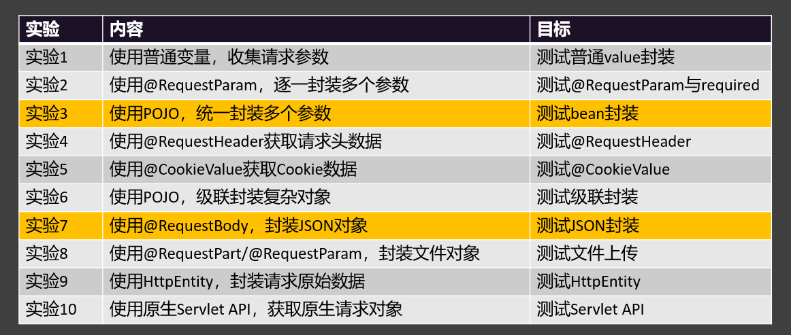

# SpringMVC 一站式Web框架

```tex
084、SpringMVC - web开发实际就是请求响应.mp4
085、SpringMVC - helloworld.mp4
086、SpringMVC - 小问题.mp4
087、@RequestMapping - 路径映射 - 通配符.mp4
088.@RequestMapping - 请求限定.mp4
089.请求限定小结.mp4
090.HTTP - 复习.mp4
091.请求处理 - 实验1：使用普通变量，收集请求参数.mp4
092.请求处理 - 实验2：@RequestParam - 明确指定获取哪个参数值.mp4
093.请求处理 - 实验3：使用POJO匹配封装所有参数.mp4
094.请求处理 - 实验4：@RequestHeader - 获取请求头.mp4
095.请求处理 - 实验5：@CookieValue - 获取cookie的值.mp4
096.请求处理 - 实验6：pojo级联封装复杂属性.mp4
097.请求处理 - 实验7：@RequestBody 接受json字符串并进行自动转换为对象.mp4
098.请求处理 - 实验8：文件上传.mp4
099.请求处理 - 实验9：HttpEntity - 获取整个请求（包括体和头）.mp4
100.请求处理 -实验10：传入原生API.mp4
101.请求处理 - 总结.mp4
102.响应处理 - 实验1：返回json.mp4
103.响应处理 - 实验2：文件下载.mp4
104.响应处理 - thymeleaf - 页面跳转.mp4
105.响应处理 - thymeleaf - 测试页面取值.mp4
106.响应处理 - 总结.mp4
107.RESTful - API 接口设计的架构风格.mp4
108.RESTful - CRUD案例 - Dao层完成.mp4
109.RESTful - CRUD案例 - Service层完成.mp4
110.RESTful - CRUD案例 - Controller 层完成.mp4
111.RESTful - CRUD案例 - 统一返回R对象.mp4
112.RESTful - CRUD案例 - 查询所有.mp4
113.RESTful - CRUD案例 - 跨域.mp4
114.@PathVariable - 其他写法.mp4
115.复制一个练习项目.mp4
116.拦截器 - HandlerInterceptor - 拦截目标方法的执行.mp4
117.拦截器 - 多拦截器执行顺序.mp4
118.拦截器 - 执行顺序.mp4
119.拦截器 - 拦截器和过滤器的区别.mp4
120.异常处理 - @ExceptionHandler - 指定异常处理方法.mp4
121.异常处理 - @ControllerAdvice - 全局异常处理.mp4
122.异常处理 - 异常处理的最终方式.mp4
123.数据校验 - JSR303校验注解、@Valid、BindingResult.mp4
124.数据校验 - 全局异常处理.mp4
125.数据校验 - 自定义校验器.mp4
126.数据校验 - 错误消息提示.mp4
127.各种O的分层模型.mp4
128.最佳实践 - 项目中的vo用法.mp4
129.最佳实践 - 接口文档.mp4
130.SpringMVC - 结束.mp4
131.【源码】- DispatcherServlet 九大组件.mp4
132.【源码】- SpringMVC - DispatcherServlet 请求处理流程.mp4
133.【源码】- SpringMVC - 源码流程.mp4
```


## 1、请求处理

### SpringMVC 简介

• 官网：https://docs.spring.io/spring-framework/reference/web/webmvc.html#mvc

• SpringMVC 是 Spring 的 web 模块，用来开发Web应用

• SprinMVC 应用最终作为 B/S、C/S 模式下的 Server 端

• Web应用的核心就是 ==处理HTTP请求响应==

#### 两种开发模式


### Hello World

```java
@Controller//告诉Spring这是一个控制器（处理请求的组件）
public class HelloController {

        @ResponseBody  //把返回值放到响应体中； 每次请求进来执行目标方法
        @RequestMapping("/hello")
        public String handle() {
            System.out.println("handle()方法执行了!");
            return "Hello,Spring MVC! 你好!~~~"; //默认认为返回值是跳到一个页面
        }
}
```


### 请求路径映射 @RequestMapping

doc：https://docs.spring.io/spring-framework/docs/6.1.11/javadoc-api/org/springframework/web/util/pattern/PathPattern.html


#### 路径通配符

```
PathPattern使用以下规则匹配 URL 路径：
规则：
    ?匹配一个字符
    *匹配路径段中的零个或多个字符
    **匹配零个或多个路径段，直到路径结束
    {spring}匹配路径段并将其捕获为名为“spring”的变量
    {spring:[a-z]+}将正则表达式[a-z]+与路径段匹配，并将其捕获为名为“spring”的路径变量
    {*spring}匹配零个或多个路径段，直到路径结束，并将其捕获为名为“spring”的变量
    注意：与 相比 AntPathMatcher，**仅在模式末尾支持。例如/pages/{**}是有效的，但 /pages/{**}/details不是。这同样适用于捕获变体{*spring}。目的是在比较模式的特异性时消除歧义。


示例
/pages/t?st.html— 匹配/pages/test.html以及 /pages/tXst.html但不匹配/pages/toast.html
/resources/*.png— 匹配目录.png中的所有文件 resources
/resources/**— 匹配路径下的所有文件/resources/，包括/resources/image.png 和/resources/css/spring.css
/resources/{*path}— 匹配 以及 下的所有文件，/resources/并/resources在名为“path”的变量中捕获它们的相对路径；/resources/image.png 将与“path”→“/image.png”匹配，并将/resources/css/spring.css 与“path”→“/css/spring.css”匹配
/resources/{filename:\\w+}.dat将匹配/resources/spring.dat 并将值分配"spring"给filename变量
```


> ```
> 精确路径必须全局唯一
> 路径位置通配符： 多个都能匹配上，那就精确优先
>      *: 匹配任意多个字符（0~N）； 不能匹配多个路径
>      **： 匹配任意多层路径
>      ?: 匹配任意单个字符（1）
>   精确程度： 完全匹配 > ? > * > **
> ```

示例：

```java
@RestController //前后分离开发就用这个  等价于@ResponseBody+@Controller
public class HelloController {

    @ResponseBody  //把返回值放到响应体中； 每次请求进来执行目标方法
    @RequestMapping("/hello")
    public String handle() {
        System.out.println("handle()方法执行了!");
        return "Hello,Spring MVC! 你好!~~~"; //默认认为返回值是跳到一个页面
    }

    @ResponseBody
    @RequestMapping("/he?ll")
    public String handle01() {
        System.out.println("handle01方法执行了!");
        return "handle01";
    }

    @RequestMapping("/he*ll")
    public String handle02() {
        System.out.println("handle02方法执行了!");
        return "handle02";
    }

    @ResponseBody //
    @RequestMapping("/he/**")
    public String handle03() {
        System.out.println("handle03方法执行了!");
        return "handle03";
    }
}
```


#### 请求限定 按条件访问

```java
/**
 * 测试请求限定
 */
@RestController
public class RequestMappingLimitController {


    /**
     * 请求方式：
     *      GET, HEAD, POST, PUT, PATCH, DELETE, OPTIONS, TRACE
     * 工具： Postman
     * @return
     */
    @RequestMapping(value = "/test01",method = {RequestMethod.DELETE,RequestMethod.GET})
    public String test01(){
        return "hello world";
    }

    /**
     * 请求参数：params = {"username","age"}
     * 1）、username：  表示请求必须包含username参数
     * 2）、age=18：   表示请求参数中必须包含age=18的参数
     * 3）、gender!=1：  表示请求参数中不能包含gender=1的参数
     * 4）、!username   表示请求必须不能包含username参数
     * @return
     */
    @RequestMapping(value = "/test02",params = {"age=18","username","gender!=1"})
    public String test02(){
        return "test02";
    }


    /**
     * 请求头：headers = {"haha"}
     * 1）、haha：  表示请求中必须包含名为haha的请求头
     * 2）、hehe!=1：  表示请求头中 的 hehe 不能是1；（hehe=0，不带hehe）
     * @return
     */
    @RequestMapping(value = "/test03",headers = "haha")
    public String test03(){
        return "test03";
    }


    /**
     * 请求内容类型：consumes = {"application/json"}; 消费什么数据；
     * Media Type：媒体类型org.springframework.http.MediaType
     * 1）、application/json：  表示浏览器必须携带 json 格式的数据。
     * @return
     */
    @RequestMapping(value = "/test04",consumes = "application/json")
    public String test04(){
        return "test04";
    }

    /**
     * 响应内容类型：produces = {"text/plain;charset=utf-8"}; 生产什么数据；浏览器不渲染H1标题
     * @return
     */
    @RequestMapping(value = "/test05",produces = "text/html;charset=utf-8")//浏览器渲染为H1
    public String test05(){
        return "<h1>你好，张三</h1>";
    }
}
```


### HTTP&JSON

#### HTTP请求与响应


#### JSON 数据格式


JSON对象取值


### 参数处理 及实验




#### 实验1：使用普通变量，收集请求参数

##### 后台接收

```java
/**
 * 请求参数：username=zhangsan&password=12345&cellphone=12345456&agreement=on
 * 要求：变量名和参数名保持一致
 * 1、没有携带：包装类型自动封装为null，基本类型封装为默认值
 * 2、携带：自动封装
 */
@RequestMapping("/handle01")
public String handle01(String username,
                       String password,
                       String cellphone,
                       boolean agreement){
    System.out.println(username);
    System.out.println(password);
    System.out.println(cellphone);
    System.out.println(agreement);
    return "ok";
}
```

##### 页面表单

```html
 <form action="/handle01" method="post">
        <div>
            <label for="username">用户名:</label>
            <input type="text" id="username" name="username" placeholder="请输入用户名">
        </div>
        <div>
            <label for="password">密码:</label>
            <input type="password" id="password" name="password" placeholder="请输入密码">
        </div>
        <div>
            <label for="cellphone">手机号:</label>
            <input type="text" id="cellphone" name="cellphone" placeholder="请输入手机号">
        </div>
        <div>
            <input type="checkbox" id="agreement" name="agreement">
            <label for="agreement">同意</label>
            <a href="#terms" target="_blank">用户协议</a>
        </div>
        <div>
            <button type="submit">注册</button>
        </div>
</form>
```

#### 实验2：@RequestParam - 明确指定获取哪个参数值

##### 后台接收

```java
/**
 * username=zhangsan&password=123456&cellphone=1234&agreement=on
 * @RequestParam: 取出某个参数的值，默认一定要携带。
 *      required = false：非必须携带；
 *      defaultValue = "123456"：默认值，参数可以不带。
 *
 * 无论请求参数带到了 请求体中还是 url? 后面，他们都是请求参数。都可以直接用@RequestParam或者同一个变量名获取到
 */
@RequestMapping("/handle02")
public String handle02(@RequestParam("username",required = false) String name,
                       @RequestParam(value = "password",defaultValue = "123456") String pwd,
                       @RequestParam("cellphone") String phone,
                       @RequestParam(value = "agreement",required = false) boolean ok){
    System.out.println(name);
    System.out.println(pwd);
    System.out.println(phone);
    System.out.println(ok);

    return "ok";
}
```

##### 页面form

```html
 <div>
        <h2>实验2：使用@RequestParam，逐一封装多个参数</h2>
        <form action="/handle02" method="post">
            <div>
                <label for="username">用户名:</label>
                <input type="text" id="username" name="username" placeholder="用户名" required>
            </div>
            <div>
                <label for="password">密码:</label>
                <input type="password" id="password" name="password" placeholder="密码" required>
            </div>
            <div>
                <label for="cellphone">手机号:</label>
                <input type="text" id="cellphone" name="cellphone" placeholder="手机号" required>
            </div>
            <div>
                <input type="checkbox" id="agreement" name="agreement">
                <label for="agreement">同意</label>
                <a href="#terms" target="_blank">用户协议</a>
            </div>
            <div>
                <button type="submit">注册</button>
            </div>
        </form>
</div>
```


#### 实验3：使用POJO匹配封装所有参数

##### 后台接收

```java
/**
 * 如果目标方法参数是一个 pojo；SpringMVC 会自动把请求参数 和 pojo 属性进行匹配；
 * 效果：
 *      1、pojo的所有属性值都是来自于请求参数
 *      2、如果请求参数没带，封装为null；
 */
//请求体：username=zhangsan&password=111111&cellphone=222222&agreement=on
@RequestMapping("/handle03")
public String handle03(Person person){
    System.out.println(person);
    return "ok";
}
```

```java
@Data //JavaBean 定死的数据模型； 定不死的写Map
public class Person {
    // username=zhangsan&password=123456&cellphone=1234&agreement=on
    //默认值zhangsan
    private String username = "zhangsan"; // 通过request.getParameter("username")封装
    private String password; // request.getParameter("password")
    private String cellphone;
    private boolean agreement;
}
```


##### 页面form

```html
<div>
    <h2>实验3：使用POJO，统一封装多个参数</h2>
    <form action="/handle03" method="post">
        <div>
            <label for="username">用户名:</label>
            <input type="text" id="username" name="username" placeholder="用户名" required>
        </div>
        <div>
            <label for="password">密码:</label>
            <input type="password" id="password" name="password" placeholder="密码" required>
        </div>
        <div>
            <label for="cellphone">手机号:</label>
            <input type="text" id="cellphone" name="cellphone" placeholder="手机号" required>
        </div>
        <div>
            <input type="checkbox" id="agreement" name="agreement">
            <label for="agreement">同意</label>
            <a href="#terms" target="_blank">用户协议</a>
        </div>
        <div>
            <button type="submit">注册</button>
        </div>
    </form>
</div>
```


#### 实验4：@RequestHeader - 获取请求头

```java
    /**
     * @RequestHeader：获取请求头信息 
     * 参考：org.springframework.http.HttpHeaders
     */
    @RequestMapping("/handle04")
    public String handle04(@RequestHeader(value = "host",defaultValue = "127.0.0.1") String host,
                           @RequestHeader("user-agent") String ua){
        System.out.println(host);
        System.out.println(ua);
        return "ok~"+host;
    }

```

#### 实验5：@CookieValue - 获取cookie的值

```java
    /**
     * @CookieValue：获取cookie值
     * @param haha
     */
    @RequestMapping("/handle05")
    public String handle05(@CookieValue("haha") String haha){
        return "ok：cookie是：" + haha;
    }
```

#### 实验6：pojo级联封装复杂属性

##### 后台接收

```java
/**
 * 使用pojo级联封装复杂属性
 * @param person
 */
@RequestMapping("/handle06")
public String handle06(Person person){
    System.out.println(person);
    return "ok";
}

```

```java
/**
 * username=张三&password=111111&cellphone=122223334&agreement=on
 * &address.province=陕西&address.city=西安市&address.area=雁塔 --级联
 * &sex=男
 *  &hobby=足球&hobby=篮球 --复选框 数组
 * &grade=二年级
 */
@Data //JavaBean 定死的数据模型； 定不死的写Map
public class Person {
    private String username = "zhangsan"; // request.getParameter("username")
    private String password; // request.getParameter("password")
    private String cellphone;
    private boolean agreement;
    private Address address;
    private String sex;
    private String[] hobby; // request.getParameterValues("hobby")
    private String grade;
}

@Data
class Address {
    private String province;
    private String city;
    private String area;
}
```

##### 页面form

```html
 <div class="layui-colla-title">实验6：使用POJO，级联封装复杂对象</div>
    <form action="/handle06" method="post">
        <div>
            <label for="username">用户名:</label>
            <input type="text" id="username" name="username" placeholder="用户名" required>
        </div>
        <div>
            <label for="password">密码:</label>
            <input type="password" id="password" name="password" placeholder="密码" required>
        </div>
        <div>
            <label for="cellphone">手机号:</label>
            <input type="text" id="cellphone" name="cellphone" placeholder="手机号" required>
        </div>
        <div>
            <label for="address-province">省:</label>
            <input type="text" id="address-province" name="address.province" placeholder="省" required>
        </div>
        <div>
            <label for="address-city">市:</label>
            <input type="text" id="address-city" name="address.city" placeholder="市" required>
        </div>
        <div>
            <label for="address-area">区:</label>
            <input type="text" id="address-area" name="address.area" placeholder="区" required>
        </div>
        <div>
            <label>性别:</label>
            <input type="radio" id="male" name="sex" value="男">
            <label for="male">男</label>
            <input type="radio" id="female" name="sex" value="女">
            <label for="female">女</label>
        </div>
        <div>
            <label>爱好:</label>
            <input type="checkbox" id="hobby-football" name="hobby" value="足球">
            <label for="hobby-football">足球</label>
            <input type="checkbox" id="hobby-basketball" name="hobby" value="篮球">
            <label for="hobby-basketball">篮球</label>
            <input type="checkbox" id="hobby-tabletennis" name="hobby" value="乒乓球">
            <label for="hobby-tabletennis">乒乓球</label>
        </div>
        <div>
            <label for="grade">年级:</label>
            <select id="grade" name="grade">
                <option value="一年级">一年级</option>
                <option value="二年级">二年级</option>
                <option value="三年级">三年级</option>
                <option value="四年级">四年级</option>
            </select>
        </div>
        <div>
            <input type="checkbox" id="agreement" name="agreement">
            <label for="agreement">同意</label>
            <a href="#terms" target="_blank">用户协议</a>
        </div>
        <div>
            <button type="submit">注册</button>
        </div>
    </form>
```

#### 实验7：@RequestBody 接受json字符串并进行自动转换为对象

前面6个实验都是通过K-V传递参数，通过从请求参数中获取

本次实验通过在body中RAW-JSON传递参数，通过AJAX或者POSTMAN发送


##### 后台接收

```java
/**
 * @RequestBody: 获取请求体json数据，自动转为person对象
 * 测试接受json数据
 * 1、发出：请求体中是json字符串，不是k=v
 * 2、接受：@RequestBody Person person
 *
 * @RequestBody Person person
 *      1、拿到请求体中的json字符串
 *      2、把json字符串转为person对象
 */
@RequestMapping("/handle07")
public String handle07(@RequestBody Person person){
//public String handle07(@RequestBody String json){ //可以通过字符串手动转为对象，但是不推荐。
    System.out.println(person);
    //自己把字符串转为对象。
    return "ok";
}
```


##### POSTMAN请求，及集中类型解释


#### 实验8：文件上传

##### 后台接受

```java
/**
 * 文件上传；
 * 1、@RequestParam 取出文件项，封装为MultipartFile，就可以拿到文件内容
 */
@RequestMapping("/handle08")
public String handle08(Person person, //接受普通参数
                       @RequestParam("headerImg") MultipartFile headerImgFile,
                       @RequestPart("lifeImg") MultipartFile[] lifeImgFiles) throws IOException {

    //1、获取原始文件名
    String originalFilename = headerImgFile.getOriginalFilename();
    //2、文件大小
    long size = headerImgFile.getSize();
    //3、获取文件流
    InputStream inputStream = headerImgFile.getInputStream();
    System.out.println(originalFilename + " ==> " + size);
    //4、文件保存
    headerImgFile.transferTo(new File("D:\\img\\" + originalFilename));
    System.out.println("===============以上处理了头像=================");
    if (lifeImgFiles.length > 0) {
        for (MultipartFile imgFile : lifeImgFiles) {
            imgFile.transferTo(new File("D:\\img\\" + imgFile.getOriginalFilename()));
        }
        System.out.println("=======生活照保存结束==========");
    }
    System.out.println(person);
    return "ok!!!";
}
```

##### 配置文件大小

```properties
# 设置单个文件大小
spring.servlet.multipart.max-file-size=1GB
# 设置单次请求大小  一次请求上传多个文件
spring.servlet.multipart.max-request-size=10GB
```

##### HTML请求：form-data格式

>     文件上传要求
>     
>     1. 表单：method=post
>     2. enctype="multipart/form-data"
>     3.注意：SpringMVC对上传文件有大小限制（默认单文件最大：1MB；整个请求最大：10MB）
>     4.multiple 表示可以上传多个文件

```html
<div class="layui-colla-title">实验8：使用@RequestPart/@RequestParam，封装文件，测试文件上传</div>
    <form action="/handle08" method="post" enctype="multipart/form-data">
        <div>
            <label for="username">用户名:</label>
            <input type="text" id="username" name="username" placeholder="用户名">
        </div>
        <div>
            <label for="password">密码:</label>
            <input type="password" id="password" name="password" placeholder="密码">
        </div>
        <div>
            <label for="cellphone">手机号:</label>
            <input type="text" id="cellphone" name="cellphone" placeholder="手机号">
        </div>
        <div>
            <label for="headerImg">头像:</label>
            <input type="file" id="headerImg" name="headerImg">
        </div>
        <div>
            <label for="lifeImg">生活照:</label>
            <input type="file" id="lifeImg" name="lifeImg" multiple>
        </div>
        <div>
            <input type="checkbox" id="agreement" name="agreement">
            <label for="agreement">同意</label>
            <a href="#terms" target="_blank">用户协议</a>
        </div>
        <button type="submit">注册</button>
    </form>
```

##### 报文分析


#### 实验9：HttpEntity - 获取整个请求（包括体和头）

##### 入门

```java
/**
 * HttpEntity：封装请求头、请求体； 把整个请求拿过来
 *    泛型：<String>：请求体类型； 可以自动转化
 * @return
 */
@RequestMapping("/handle09")
public String handle09(HttpEntity<Person> entity){

    //1、拿到所有请求头
    HttpHeaders headers = entity.getHeaders();
    System.out.println("请求头："+headers);
    //2、拿到请求体
    Person body = entity.getBody();
    System.out.println("请求体："+body);
    return "Ok~~~";
}
```


##### HttpEntity 概述

`HttpEntity` 是Spring框架中用于表示HTTP请求或响应实体的类，它包含了HTTP头部信息和实体体（body）。`HttpEntity` 经常与 `RestTemplate` 一起使用，用于在客户端执行HTTP请求。同时，它也可以在Spring MVC中作为控制器方法的返回值，用于构造HTTP响应。

##### 在RestTemplate中的使用

**1、发送HTTP请求**

当使用 `RestTemplate` 发送HTTP请求时，可以通过创建 `HttpHeaders` 实例并设置必要的头部信息，然后将其与请求体一起封装到 `HttpEntity` 对象中。例如：

```Java
HttpHeaders headers = new HttpHeaders();
headers.setContentType(MediaType.TEXT_PLAIN);
HttpEntity<String> entity = new HttpEntity<>("Hello World", headers);
URI location = template.postForLocation("https://example.com", entity);
```

在这个例子中，我们创建了一个包含文本类型头部信息的 `HttpEntity` 对象，并将其作为请求体发送给指定的URL。

**2、接收HTTP响应**

同样，`RestTemplate` 也可以用于接收HTTP响应，并返回一个 `HttpEntity` 对象，其中包含响应体和响应头部信息。例如：

```Java
HttpEntity<String> entity = template.getForEntity("https://example.com", String.class);
String body = entity.getBody();
MediaType contentType = entity.getHeaders().getContentType();
```

在这个例子中，我们发送了一个GET请求到指定的URL，并接收了一个 `HttpEntity` 对象作为响应。然后，我们从响应体中提取了实际的数据，并从响应头部中获取了内容类型信息。

##### 在Spring MVC中的使用

在Spring MVC中，`HttpEntity` 可以作为控制器方法的返回值，用于构造HTTP响应。例如：

```java
@GetMapping("/handle")
public HttpEntity<String> handle() {
    HttpHeaders responseHeaders = new HttpHeaders();
    responseHeaders.set("MyResponseHeader", "MyValue");
    return new HttpEntity<>("Hello World", responseHeaders);
}
```

在这个例子中，我们创建了一个包含自定义响应头部的 `HttpHeaders` 对象，并将其与一个响应体一起封装到 `HttpEntity` 对象中。然后，我们将这个 `HttpEntity` 对象作为控制器方法的返回值，Spring MVC框架将自动将其序列化为HTTP响应发送给客户端。

##### 结论

`HttpEntity` 是Spring框架中处理HTTP请求和响应的强大工具。它既可以用于在客户端发送包含头部信息的HTTP请求，也可以用于接收包含头部信息的HTTP响应。此外，在Spring MVC中，它还可以作为控制器方法的返回值，用于构造自定义的HTTP响应。


#### 实验10：传入原生API

```java
/**
 * 接受原生 API
 */
@RequestMapping("/handle10")
public void handle10(HttpServletRequest request,
                       HttpServletResponse response,
                     HttpMethod method) throws IOException {
    System.out.println("请求方式："+method);
    String username = request.getParameter("username");
    System.out.println(username);
    response.getWriter().write("ok!!!"+username);
}
```

### 小结


## 2、响应处理


### 响应数据类型


### JSON 返回

```java
@RestController
public class ResponseTestController {
/**
     * 会自动的把返回的对象转为json格式
     */
//    @ResponseBody //把返回的内容。写到响应体中  
    @RequestMapping("/resp01")
    public Person resp01() {
        Person person = new Person();
        person.setUsername("张三");
        person.setPassword("1111");
        person.setCellphone("22222");
        person.setAgreement(false);
        person.setSex("男");
        person.setHobby(new String[]{"足球", "篮球"});
        person.setGrade("三年级");

        return person;
    }
}
```

### ResponseEntity


### 文件下载


```java
    /**
     * 文件下载
     * HttpEntity：拿到整个请求数据
     * ResponseEntity：拿到整个响应数据（响应头、响应体、状态码）
     *
     * @return
     */
    @RequestMapping("/download")
    public ResponseEntity<InputStreamResource> download() throws IOException {

        //以上代码永远别改
        FileInputStream inputStream = new FileInputStream("C:\\Users\\53409\\Pictures\\Saved Pictures\\必应壁纸（1200张）\\AutumnNeuschwanstein_EN-AU10604288553_1920x1080.jpg");
        //一口气读会溢出
//        byte[] bytes = inputStream.readAllBytes();
        //1、文件名中文会乱码：解决：
        String encode = URLEncoder.encode("哈哈美女.jpg", "UTF-8");
        //以下代码永远别改
        //2、文件太大会oom（内存溢出）,解决：
        InputStreamResource resource = new InputStreamResource(inputStream);
        return ResponseEntity.ok()
                //内容类型：流
                .contentType(MediaType.APPLICATION_OCTET_STREAM)
                //内容大小
                .contentLength(inputStream.available())
                //  Content-Disposition ：内容处理方式
                .header("Content-Disposition", "attachment;filename="+encode)
                .body(resource);
    }
```

### 模板引擎（了解）


#### Thymeleaf - 核心语法


```
<html lang="en" xmlns:th="http://www.thymeleaf.org">
```

#### 入门-java ：

```java
/**
 * SpringBoot整合的SpringMVC默认不支持JSP
 * 1、引入 thymeleaf 作为模型引擎，渲染页面
 *         <dependency>
 *             <groupId>org.springframework.boot</groupId>
 *             <artifactId>spring-boot-starter-thymeleaf</artifactId>
 *         </dependency>
 * 2、默认规则
 *         页面：src/main/resources/templates
 *      静态资源：src/main/resources/static
 */
@Controller // 开发服务端渲染逻辑
public class PageTestController {

    //处理 / 请求，跳转到登录页
    @RequestMapping("/")
    public String index(){

        // thymeleaf 默认：去 classpath:/templates/ 找页面, 后缀为 .html
        // 页面地址 = classpath:/templates/ + 返回名字 + .html
        return "login";  //返回值就是  页面名称（视图名）
    }

    @RequestMapping("/login.mvc")//处理登录认证后跳转到page/success
    public String login(String username,
                        String password,
                        //模型就是页面要展示的所有数据
                        Model model){
        System.out.println("用户登录："+username+","+password);

        // 去数据库查到登录的用户信息
        // 去数据库查到访客列表
        List<User> list = Arrays.asList(
                new User(1L, "张三1", 18),
                new User(5L, "张三5", 17),
                new User(6L, "张三6", 28),
                new User(7L, "张三7", 11),
                new User(8L, "张三8", 38)
        );


        model.addAttribute("users",list);
        model.addAttribute("name",username);
        model.addAttribute("age",18);

        return "page/success";
    }
}
```


#### 入门-页面Thymeleaf引擎解析

```html
<!DOCTYPE html>
<!--idea 语法提示需要引入-->
<html lang="en" xmlns:th="http://www.thymeleaf.org">
<head>
    <meta charset="UTF-8">
    <title>成功</title>
</head>
<body>
<h1>恭喜，登录成功：</h1>
<!-- th:xx； 修改标签的任意属性 -->
<h2>用户名：<span th:text="${name}" th:id="${name}">张三</span> </h2>
<h2 >年龄：[[${age}]]  </h2>

<!-- 列表：今天的访客 -->
<table border="1px">
    <tr>
        <th>序号</th>
        <th>用户名</th>
        <th>年龄</th>
        <th>成年人吗</th>
    </tr>

    <tr th:each="user : ${users}">
        <td>[[${user.id}]]</td>
        <td th:text="${user.getName()}">张三</td>
        <td th:text="${user.age}">18</td>
<!--        <td th:if="${user.age >= 18}">是</td>-->
<!--        <td th:if="${user.age < 18}">否</td>-->
        <td th:text="${user.age >= 18? '是':'否'}">否</td>
    </tr>
</table>
</body>
</html>
```


## 3、RESTful

### RESTful 介绍


### RESTful API 规划

> 接口:对接的入口
> API(接口):Web应用暴露出来的让别人访问的请求路径
>
> 调用别人的功能?几种方式?
> 1、API:给第三方发请求,获取响应数据 
> 2、SDK:导入jar包。


多级设计


### `@PathVariable` - 路径变量


### CRUD 案例实现


#### Dao层

##### SQL

```sql
SET NAMES utf8mb4;
SET FOREIGN_KEY_CHECKS = 0;

-- ----------------------------
-- Table structure for employee
-- ----------------------------
DROP TABLE IF EXISTS `employee`;
CREATE TABLE `employee`  (
  `id` bigint NOT NULL AUTO_INCREMENT COMMENT '主键',
  `name` varchar(255) CHARACTER SET utf8mb4 COLLATE utf8mb4_0900_ai_ci NULL DEFAULT NULL COMMENT '员工名字',
  `age` int NULL DEFAULT NULL COMMENT '年龄',
  `email` varchar(255) CHARACTER SET utf8mb4 COLLATE utf8mb4_0900_ai_ci NULL DEFAULT NULL COMMENT '邮箱',
  `gender` varchar(255) CHARACTER SET utf8mb4 COLLATE utf8mb4_0900_ai_ci NULL DEFAULT NULL COMMENT '性别',
  `address` varchar(255) CHARACTER SET utf8mb4 COLLATE utf8mb4_0900_ai_ci NULL DEFAULT NULL COMMENT '住址',
  `salary` decimal(10, 2) NULL DEFAULT NULL COMMENT '薪资',
  PRIMARY KEY (`id`) USING BTREE
) ENGINE = InnoDB AUTO_INCREMENT = 5 CHARACTER SET = utf8mb4 COLLATE = utf8mb4_0900_ai_ci ROW_FORMAT = Dynamic;

-- ----------------------------
-- Records of employee
-- ----------------------------
INSERT INTO `employee` VALUES (1, '张三', 11, 'aa@qq.com', '男', '西安', 9999.00);
INSERT INTO `employee` VALUES (4, 'leifengyang', 10, 'aaa', '男', 'sss', 100.00);

SET FOREIGN_KEY_CHECKS = 1;

```

##### 数据库配置

```properties
spring.datasource.url=jdbc:mysql://localhost:3306/restful_crud
spring.datasource.username=root
spring.datasource.password=123456
spring.datasource.driver-class-name=com.mysql.cj.jdbc.Driver
```


##### 实体类Bean

```java
package com.atguigu.practice.bean;


import lombok.Data;

import java.math.BigDecimal;

@Data
public class Employee {

    private Long id;
    private String name;
    private Integer age;
    private String email;
    private String gender;
    private String address;
    private BigDecimal salary;

}

```


##### DAO接口

```java
package com.atguigu.practice.dao;

import com.atguigu.practice.bean.Employee;

import java.util.List;

public interface EmployeeDao {


    /**
     * 根据id查询用户信息
     * @param id
     * @return
     */
    Employee getEmpById(Long id);

    /**
     * 新增员工
     * @param employee
     */
    void addEmp(Employee employee);

    /**
     * 修改员工
     * 注意：传入Employee全部的值，不改的传入原来值，如果不传代表改为null
     * @param employee
     */
    void updateEmp(Employee employee);

    /**
     * 按照id删除员工
     * @param id
     */
    void deleteById(Long id);

    /**
     * 查询所有
     * @return
     */
    List<Employee> getList();

}
```

##### 基于JdbcTemplate实现

```java
package com.atguigu.practice.dao.impl;

import com.atguigu.practice.bean.Employee;
import com.atguigu.practice.dao.EmployeeDao;
import org.springframework.beans.factory.annotation.Autowired;
import org.springframework.jdbc.core.BeanPropertyRowMapper;
import org.springframework.jdbc.core.JdbcTemplate;
import org.springframework.stereotype.Component;

import java.util.List;


@Component
public class EmployeeDaoImpl implements EmployeeDao {


    @Autowired
    private JdbcTemplate jdbcTemplate;


    @Override
    public Employee getEmpById(Long id) {
        String sql = "select * from employee where id=?";
        Employee employee = jdbcTemplate.queryForObject(sql, new BeanPropertyRowMapper<>(Employee.class), id);
        return employee;
    }

    @Override
    public void addEmp(Employee employee) {
        String sql = "insert into employee(name,age,email,gender,address,salary) values (?,?,?,?,?,?)";
        int update = jdbcTemplate.update(sql,
                employee.getName(),
                employee.getAge(),
                employee.getEmail(),
                employee.getGender(),
                employee.getAddress(),
                employee.getSalary());
        System.out.println("新增成功，影响行数：" + update);
    }

    @Override
    public void updateEmp(Employee employee) {
        String sql = "update employee set name=?,age=?,email=?,gender=?,address=?,salary=? where id=?";
        int update = jdbcTemplate.update(sql,
                employee.getName(),
                employee.getAge(),
                employee.getEmail(),
                employee.getGender(),
                employee.getAddress(),
                employee.getSalary(),
                employee.getId());
        System.out.println("更新成功，影响行数：" + update);
    }

    @Override
    public void deleteById(Long id) {
        String sql = "delete from employee where id=?";
        int update = jdbcTemplate.update(sql, id);
    }

    @Override
    public List<Employee> getList() {

        String sql = "select * from employee";
        List<Employee> list = jdbcTemplate.query(sql, new BeanPropertyRowMapper<>(Employee.class));
        return list;
    }
}
```


#### Service层

##### 接口

```java
package com.atguigu.practice.service;

import com.atguigu.practice.bean.Employee;

import java.util.List;

public interface EmployeeService {

    /**
     * 根据id查询用户
     * @param id
     * @return
     */
    Employee getEmp(Long id);

    /**
     * 更新用户
     * @param employee
     */
    void updateEmp(Employee employee);

    /**
     * 新增用户
     * @param employee
     */
    void saveEmp(Employee employee);


    /**
     * 根据id删除用户
     * @param id
     */
    void deleteEmp(Long id);

    /**
     * 查询所有用户
     * @return
     */
    List<Employee> getList();

}

```


##### impl

```java
package com.atguigu.practice.service.impl;

import com.atguigu.practice.bean.Employee;
import com.atguigu.practice.dao.EmployeeDao;
import com.atguigu.practice.service.EmployeeService;
import org.springframework.beans.factory.annotation.Autowired;
import org.springframework.stereotype.Service;
import org.springframework.util.StringUtils;

import java.util.List;


@Service // 要求：controller只能调service
public class EmployeeServiceImpl implements EmployeeService {

    @Autowired
    EmployeeDao employeeDao; //包装一下

    @Override
    public Employee getEmp(Long id) {
        Employee empById = employeeDao.getEmpById(id);
        return empById;
    }

    @Override
    public void updateEmp(Employee employee) {

        //防null处理。考虑到service是被controller调用的；
        //controller层传过来的employee 的某些属性可能为null，所以先处理一下
        //怎么处理？
        Long id = employee.getId();
        if(id == null){ //页面没有带id
            return;
        }
        //1、去数据库查询employee原来的值
        Employee empById = employeeDao.getEmpById(id);

        //=======以下用页面值覆盖默认值=============
        //2、把页面带来的覆盖原来的值，页面没带的自然保持原装
        if(StringUtils.hasText(employee.getName())){ //判断name有值（不是null、不是空串、不是空白字符// ）
            //把数据库的值改为页面传来的值
            empById.setName(employee.getName());
        }

        if(StringUtils.hasText(employee.getEmail())){
            empById.setEmail(employee.getEmail());
        }

        if (StringUtils.hasText(employee.getAddress())){
            empById.setAddress(employee.getAddress());
        }

        if (StringUtils.hasText(employee.getGender())){
            empById.setGender(employee.getGender());
        }

        if(employee.getAge() != null){
            empById.setAge(employee.getAge());
        }

        if(employee.getSalary() != null){
            empById.setSalary(employee.getSalary());
        }

        //以上判断，把页面提交的值，赋值给数据库的记录
        employeeDao.updateEmp(empById);
    }

    @Override
    public void saveEmp(Employee employee) {
        employeeDao.addEmp(employee);
    }

    @Override
    public void deleteEmp(Long id) {
        employeeDao.deleteById(id);
    }

    @Override
    public List<Employee> getList() {
        return employeeDao.getList();
    }
}
```


#### Controller 层

```java
package com.atguigu.practice.controller;

import com.atguigu.practice.common.R;
import com.atguigu.practice.bean.Employee;
import com.atguigu.practice.service.EmployeeService;
import org.springframework.beans.factory.annotation.Autowired;
import org.springframework.web.bind.annotation.*;

import java.util.List;


/**
 * CORS policy：同源策略（限制ajax请求，图片，css，js）； 跨域问题
 * 跨源资源共享（CORS）（Cross-Origin Resource Sharing）
 *    浏览器为了安全，默认会遵循同源策略（请求要去的服务器和当前项目所在的服务器必须是同一个源[同一个服务器]），如果不是，请求就会被拦截  【协议域名端口一致】
 *    复杂的跨域请求会发送2次：
 *    1、options 请求：预检请求。浏览器会先发送options请求，询问服务器是否允许当前域名进行跨域访问
 *    2、真正的请求：POST、DELETE、PUT等
 *
 *
 * 浏览器页面所在的：http://localhost   /employee/base
 * 页面上要发去的请求：http://localhost:8080   /api/v1/employees
 *  /以前的东西，必须完全一样，一个字母不一样都不行。浏览器才能把请求（ajax）发出去。
 *
 *  跨域问题：
 *    1、前端自己解决：
 *    2、后端解决：允许前端跨域即可
 *          原理：服务器给浏览器的响应头中添加字段：Access-Control-Allow-Origin = *
 *
 *
 */
@CrossOrigin  //允许跨域
@RequestMapping("/api/v1")
@RestController
public class EmployeeRestController {

    @Autowired
    EmployeeService employeeService;

    /**
     * code：业务的状态码，200是成功，剩下都是失败; 前后端将来会一起商定不同的业务状态码前端要显示不同效果。
     * msg：服务端返回给前端的提示消息
     * data： 服务器返回给前端的数据
     *   {
     *       "code": 300,
     *       "msg": "余额不足",
     *       "data": null
     *   }
     *
     *   前端统一处理:
     *      1、前端发送请求，接受服务器数据
     *      2、判断状态码，成功就显示数据，失败就显示提示消息（或者执行其他操作）。
     */

    /**
     * 按照id查询员工
     * @param id
     * @return
     *
     * /employee/1/2/3
     */
    @GetMapping("/employee/{id}")
    //@RequestMapping("/employee/{id}",method = RequestMethod.GET)
    public R get(@PathVariable("id") Long id){
        Employee emp = employeeService.getEmp(id);
        return R.ok(emp);
    }


    /**
     * 新增员工；
     * 要求：前端发送请求把员工的json放在请求体中
     * @param employee
     * @return
     */
    @PostMapping("/employee")
    // @RequestMapping(value = "/employee",method = RequestMethod.POST)
    public R add(@RequestBody Employee employee){
        employeeService.saveEmp(employee);
        return R.ok();
    }

    /**
     * 修改员工
     * 要求：前端发送请求把员工的json放在请求体中； 必须携带id
     * @param employee
     * @return
     */
    @PutMapping("/employee")
    // @RequestMapping(value = "/employee",method = RequestMethod.PUT)
    public R update(@RequestBody Employee employee){
        employeeService.updateEmp(employee);
        return R.ok();
    }

    /**
     *   @XxxMapping("/employee")：Rest 映射注解
     * @param id
     * @return
     */
    @DeleteMapping("/employee/{id}")
    @RequestMapping(value = "/employee/{id}",method = RequestMethod.DELETE)
    public R delete(@PathVariable("id") Long id){
        employeeService.deleteEmp(id);
        return R.ok();
    }

    //语义化
    @GetMapping("/employees")
    public R all(){
       List<Employee> employees = employeeService.getList();
       return R.ok(employees);
    }

}
```

统一返回对象R

```java
package com.atguigu.practice.common;


import lombok.Data;

@Data
public class R<T> {
    private Integer code;
    private String msg;
    private T data;

    public static<T> R<T> ok(T data){
        R<T> tr = new R<>();
        tr.setCode(200);
        tr.setMsg("ok");
        tr.setData(data);
        return tr;
    }

    public static R ok(){
        R tr = new R<>();
        tr.setCode(200);
        tr.setMsg("ok");
        return tr;
    }

    public static R error(){
        R tr = new R<>();
        tr.setCode(500); //默认失败码
        tr.setMsg("error");
        return tr;
    }

    public static R error(Integer code,String msg){
        R tr = new R<>();
        tr.setCode(code); //默认失败码
        tr.setMsg(msg);
        return tr;
    }

    public static R error(Integer code,String msg,Object data){
        R tr = new R<>();
        tr.setCode(code); //默认失败码
        tr.setMsg(msg);
        tr.setData(data);
        return tr;
    }
}
```


## 4、最佳实践


### 拦截器

#### 概念


#### 拦截器和Filter执行顺序


##### 测试场景1

**测试场景：**假设有三个拦截器：拦截器 1、==拦截器 2==、拦截器 3。==拦截器 2 的 preHandle 返回 false==，流程如下：

处理流程：

1. **拦截器 1：**
   + 执行 `preHandle`，返回 true，请求继续流转到下一个拦截器。

2. **拦截器 2：**
   + 执行 `preHandle`，返回 false。
     + **此时拦截链被终止**，不会再调用拦截器 3 的 `preHandle`。
     + **目标方法不会被调用**。后续postHandle均不会执行
     + 视图不会渲染。

3. **回溯过程：**

   + 对于已经执行过的拦截器（如拦截器 1 和拦截器 2），会在 `afterCompletion` 方法中**完成一些清理工作**。

   + 拦截器 3 的 postHandle 和 afterCompletion 均不会被执行，因为其 preHandle 从未被调用。

##### 测试场景2

**测试场景：**

+ 拦截器 1 → 拦截器 2 → 拦截器 3 → 目标方法 → postHandle 回溯 → afterCompletion 回溯

+ **在 postHandle 回溯阶段，拦截器 2 的 postHandle 抛出了异常**。

  

**具体流程分析：**

1. **请求进入拦截器链：**

   + 拦截器 1 的 preHandle 执行，返回 true，请求流转到下一个拦截器。

   + 拦截器 2 的 preHandle 执行，返回 true，请求流转到拦截器 3。

   + 拦截器 3 的 preHandle 执行，返回 true，请求进入目标方法。

2. **目标方法执行：**
   + 目标方法（Controller 的业务逻辑）成功执行，返回结果（如视图或数据）。

3. **postHandle 回溯阶段：**
   + 按拦截器链的**反向顺序**依次执行 postHandle 方法：
   + 拦截器 3 的 postHandle 成功执行。
   + 拦截器 2 的 postHandle 执行时发生异常，抛出了未捕获的异常。

4. 异常处理流程：
   + SpringMVC 捕获到 postHandle 中的异常，终止后续的 postHandle 调用（如拦截器 1 的 postHandle 不再执行）。
   + 异常触发后，开始执行已经调用过的拦截器的 afterCompletion 方法。

5. afterCompletion 回溯阶段：

+ 按拦截器链的反向顺序，调用 afterCompletion 方法：
  + 拦截器 3 的 afterCompletion 执行。
  + 拦截器 2 的 afterCompletion 执行（可能会处理资源清理或日志记录）。
  + 拦截器 1 的 afterCompletion 执行。

6. 异常响应：
   + SpringMVC 将异常信息封装并返回给用户，通常通过全局异常处理器（如 @ControllerAdvice 或 @ExceptionHandler）来处理。


#### 拦截器和过滤器对比


#### 自定义拦截器MyHandlerInterceptor

```java
package com.atguigu.practice.interceptor;

import jakarta.servlet.http.HttpServletRequest;
import jakarta.servlet.http.HttpServletResponse;
import org.springframework.stereotype.Component;
import org.springframework.web.servlet.HandlerInterceptor;
import org.springframework.web.servlet.ModelAndView;


@Component //拦截器还需要配置（告诉SpringMVC，这个拦截器主要拦截什么请求）
public class MyHandlerInterceptor1 implements HandlerInterceptor {

    @Override
    public boolean preHandle(HttpServletRequest request,
                             HttpServletResponse response, Object handler) throws Exception {
        System.out.println("MyHandlerInterceptor1...preHandle...");
        //放行； chain.doFilter(request,response);
        //String username = request.getParameter("username");
//        response.getWriter().write("No Permission!");
        //return false;//拦截请求，不放行
        return true;//放行
    }


    /**
     * postHandle是controller方法执行之后
     * 如果preHandle返回false，该方法不会执行
     * @throws Exception
     */
    @Override
    public void postHandle(HttpServletRequest request, HttpServletResponse response, Object handler, ModelAndView modelAndView) throws Exception {
        System.out.println("MyHandlerInterceptor1...postHandle...");

    }


    /**
     * preHandle返回true，afterCompletion 方法才会执行
     */
    @Override
    public void afterCompletion(HttpServletRequest request, HttpServletResponse response, Object handler, Exception ex) throws Exception {
        System.out.println("MyHandlerInterceptor1...afterCompletion...");
    }
}

```


#### 注册配置MySpringMVCConfig

```java
package com.atguigu.practice.config;


import com.atguigu.practice.interceptor.MyHandlerInterceptor0;
import com.atguigu.practice.interceptor.MyHandlerInterceptor1;
import com.atguigu.practice.interceptor.MyHandlerInterceptor2;
import org.springframework.beans.factory.annotation.Autowired;
import org.springframework.context.annotation.Configuration;
import org.springframework.web.servlet.config.annotation.InterceptorRegistry;
import org.springframework.web.servlet.config.annotation.WebMvcConfigurer;


/**
 * 1、容器中需要有这样一个组件：【WebMvcConfigurer】
 *     1)、@Bean 放一个 WebMvcConfigurer
 *     2)、配置类实现 WebMvcConfigurer
 */
@Configuration //专门对SpringMVC 底层做一些配置
public class MySpringMVCConfig  implements WebMvcConfigurer{

    @Autowired
    MyHandlerInterceptor0 myHandlerInterceptor0;

    @Autowired
    MyHandlerInterceptor1 myHandlerInterceptor1;

    @Autowired
    MyHandlerInterceptor2 myHandlerInterceptor2;
    //添加拦截器
    @Override
    public void addInterceptors(InterceptorRegistry registry) {
        registry.addInterceptor(myHandlerInterceptor0)
                .addPathPatterns("/**"); //拦截所有请求
        registry.addInterceptor(myHandlerInterceptor1)
                .addPathPatterns("/**"); //拦截所有请求

        registry.addInterceptor(myHandlerInterceptor2)
                .addPathPatterns("/**");
    }


    //    @Bean
//    WebMvcConfigurer webMvcConfigurer(){
//        return new WebMvcConfigurer() {
//            @Override
//            public void addInterceptors(InterceptorRegistry registry) {
//
//            }
//        };
//    }
}

```


> **拓展：**
>
> `WebMvcConfigurer` 是 Spring MVC 中的一个接口，它允许你自定义 Spring MVC 的配置。通过实现这个接口，你可以添加额外的视图解析器、拦截器、资源处理器、消息转换器等等，或者覆盖 Spring MVC 的默认配置。
>
> 从 Spring 5.0 开始，`WebMvcConfigurer` 有了两个主要的实现方式：
>
> 1. **直接实现 `WebMvcConfigurer` 接口**：这种方式需要你实现接口中的方法，但你可以只实现你关心的配置方法，而不必实现所有的方法。Spring 会通过 Java 配置类（用 `@Configuration` 注解的类）中的 `@EnableWebMvc` 注解来查找 `WebMvcConfigurer` 的实现。但请注意，`@EnableWebMvc` 会完全覆盖 Spring Boot 的自动配置，因此通常不建议在 Spring Boot 项目中使用它，除非你确实需要完全自定义 Spring MVC 的配置。
> 2. **实现 `WebMvcConfigurerAdapter` 类（在 Spring 5.3 中已废弃）**：在早期的 Spring 版本中，有一个 `WebMvcConfigurerAdapter` 抽象类，它提供了 `WebMvcConfigurer` 接口中所有方法的空实现。这样，你就可以通过继承这个类来只覆盖你关心的配置方法。但在 Spring 5.3 中，`WebMvcConfigurerAdapter` 已经被废弃，因为你可以直接实现 `WebMvcConfigurer` 接口，并且只覆盖你需要的方法。
>
> 然而，在 Spring Boot 项目中，更常见的是通过实现 `WebMvcConfigurer` 接口（或者继承 `WebMvcConfigurerSupport` 类，尽管这不是必需的，因为直接实现接口通常更灵活）来定制 Spring MVC 的配置，同时保留 Spring Boot 的自动配置。
>
> 下面是一个简单的 `WebMvcConfigurer` 实现示例，它添加了一个自定义的拦截器：
>
> ```Java
> import org.springframework.beans.factory.annotation.Autowired;
> import org.springframework.context.annotation.Configuration;
> import org.springframework.web.servlet.config.annotation.InterceptorRegistry;
> import org.springframework.web.servlet.config.annotation.WebMvcConfigurer;
> 
> // 自定义拦截器配置
> @Configuration
> public class MyWebMvcConfigurer implements WebMvcConfigurer {
> 
>     @Autowired
>     private MyCustomInterceptor myCustomInterceptor;
> 
>     @Override
>     public void addInterceptors(InterceptorRegistry registry) {
>         registry.addInterceptor(myCustomInterceptor)
>                 .addPathPatterns("/somePath/**") // 拦截特定路径
>                 .excludePathPatterns("/excludePath/**"); // 排除特定路径
>     }
> 
>     // 你可以在这里添加其他配置方法，如配置视图解析器、资源处理器等
> }
> ```
>
> 在这个例子中，`MyCustomInterceptor` 是一个自定义的拦截器，我们通过 `addInterceptors` 方法将它添加到 Spring MVC 的拦截器链中，并指定了它应该拦截和排除的路径。
>
> 请注意，如果你只是需要添加少量的配置，并且不想覆盖 Spring Boot 的自动配置，那么通常不需要实现 `WebMvcConfigurer` 接口。Spring Boot 的自动配置已经为大多数常见用例提供了合理的默认值。但是，如果你需要更细粒度的控制或者需要覆盖某些默认配置，那么实现 `WebMvcConfigurer` 接口是一个很好的选择。


#### 拓展： Filter 相关知识

##### Filter执行顺序


在 Spring MVC 中注册 Filter 可以通过多种方式实现，以下是一些常见的方法：

##### 1. 使用 Java 配置类FilterRegistrationBean

在 Spring Boot 项目中，你可以通过创建一个配置类并使用 `@Bean` 注解来注册 Filter。例如：

```Java
import javax.servlet.Filter;
import org.springframework.boot.web.servlet.FilterRegistrationBean;
import org.springframework.context.annotation.Bean;
import org.springframework.context.annotation.Configuration;

@Configuration
public class FilterConfig {

    @Bean
    public FilterRegistrationBean<MyCustomFilter> loggingFilter() {
        FilterRegistrationBean<MyCustomFilter> registrationBean = new FilterRegistrationBean<>();
        
        registrationBean.setFilter(new MyCustomFilter());
        registrationBean.addUrlPatterns("/*"); // 指定拦截的路径模式
        
        return registrationBean;
    }
}
```

在这个例子中，`MyCustomFilter` 是你自定义的 Filter 类，你需要将它替换为你实际的 Filter 实现。

##### 2. 使用 web.xml 配置

如果你使用的是传统的 Spring MVC 项目（非 Spring Boot），你可以在 `web.xml` 文件中配置 Filter。例如：

```xml
<filter>
    <filter-name>myCustomFilter</filter-name>
    <filter-class>com.example.MyCustomFilter</filter-class>
</filter>
<filter-mapping>
    <filter-name>myCustomFilter</filter-name>
    <url-pattern>/*</url-pattern>
</filter-mapping>
```

同样地，你需要将 `com.example.MyCustomFilter` 替换为你实际的 Filter 类的全限定名。

##### 3. 使用 Spring Boot 的自动配置

在 Spring Boot 中，如果你创建了一个 Filter 类，并且该类上使用了 `@Component` 注解，Spring Boot 会自动检测并注册这个 Filter。但是，这种方式可能不会给你足够的控制来指定 Filter 的拦截路径或顺序，因此通常推荐使用第一种方法。


### 异常处理


#### `@ExceptionHandler` - 指定异常处理方法

```java
/**
 * 测试声明式异常处理
 */
@RestController
public class HelloController {
    /**
     * 1、如果Controller本类出现异常，会自动在本类中找有没有@ExceptionHandler标注的方法，
     *    如果有，执行这个方法，它的返回值，就是客户端收到的结果
     *  如果发生异常，多个都能处理，就精确优先
          异常处理优先级：
     *      本类 》 全局
     *      精确 》 模糊
     * @return
     */
    @ResponseBody
    @ExceptionHandler(ArithmeticException.class)
    public R handleArithmeticException(ArithmeticException ex){
        System.out.println("【本类】 - ArithmeticException 异常处理");
        return R.error(100,"执行异常：" + ex.getMessage());
    }


    @ExceptionHandler(FileNotFoundException.class)
    public R handleException(FileNotFoundException ex){
        System.out.println("【本类】 - FileNotFoundException 异常处理");
        return R.error(300,"文件未找到异常：" + ex.getMessage());
    }


    @ExceptionHandler(Throwable.class)
    public R handleException02(Throwable ex){
        System.out.println("【本类】 - Throwable 异常处理");
        return R.error(500,"其他异常：" + ex.getMessage());
    }
    
        //编程式的异常处理；
    //如果大量业务都需要加异常处理代码的话，会很麻烦
//        try {
//            //执行业务
//
//        }catch (Exception e){
//            return R.error(100,"执行异常");
//        }
    @GetMapping("/hello")//模拟异常接口
    public R hello(@RequestParam(value = "i",defaultValue = "0") Integer i) throws FileNotFoundException {
        int j = 10 / i;

//        FileInputStream inputStream = new FileInputStream("D:\\123.txt");
        String s = null;
        s.length();
        return R.ok(j);
    }

}
```


#### @ControllerAdvice - 全局异常处理

```java
package com.atguigu.practice.advice;


// 全局异常处理器
//@ResponseBody
//@ControllerAdvice //告诉SpringMVC，这个组件是专门负责进行全局异常处理的
@RestControllerAdvice
public class GlobalExceptionHandler {


    /**
     * 如果出现了异常：本类和全局都不能处理，
     * SpringBoot底层对SpringMVC有兜底处理机制；自适应处理（浏览器响应页面、移动端会响应json）
     * 最佳实践：我们编写全局异常处理器，处理所有异常
     */
    @ExceptionHandler(ArithmeticException.class)
    public R error(ArithmeticException e) {
        System.out.println("【全局】 - ArithmeticException 处理");
        return R.error(500, e.getMessage());
    }
    // 最终的兜底
    @ExceptionHandler(Throwable.class)
    public R error(Throwable e) {
        System.out.println("【全局】 - Exception处理" + e.getClass());
        return R.error(500, e.getMessage());
    }

}

```

#### 异常处理的最终方式

前端关心异常状态，后端正确业务流程。
推荐：==后端只编写正确的业务逻辑==，如果出现业务问题，==后端通过抛异常的方式提前中断业务逻辑==。前端感知异常；

> 异常处理的最终方式：
>
> * 1、必须有业务异常类：BizException
> * 2、必须有异常枚举类：BizExceptionEnume  列举项目中每个模块将会出现的所有异常情况
> * 3、编写业务代码的时候，只需要编写正确逻辑，如果出现预期的问题，需要以抛异常的方式中断逻辑并通知上层。
> * 4、全局异常处理器：GlobalExceptionHandler；  处理所有异常，返回给前端约定的json数据与错误码


业务抛出业务异常

```java
if(id == null){ //页面没有带id
    //中断的业务的时候，必须让上层及以上的链路知道中断原因。推荐抛出业务异常
    throw new BizException(BizExceptionEnume.ORDER_CLOSED);//异常枚举类
}
```


**自定义业务异常**

```java
package com.atguigu.practice.exception;


import lombok.Data;

/**
 *
 * 异常处理的最终方式：
 * 1、必须有业务异常类：BizException
 * 2、必须有异常枚举类：BizExceptionEnume  列举项目中每个模块将会出现的所有异常情况
 * 3、编写业务代码的时候，只需要编写正确逻辑，如果出现预期的问题，需要以抛异常的方式中断逻辑并通知上层。
 * 4、全局异常处理器：GlobalExceptionHandler；  处理所有异常，返回给前端约定的json数据与错误码
 */

@Data
public class BizException extends RuntimeException {

    private Integer code; //业务异常码
    private String msg; //业务异常信息
    
/** 业务异常
 * 大型系统出现以下异常：异常处理文档，固化
 * 1、订单  1xxxx
 *      10001 订单已关闭
 *      10002 订单不存在
 *      10003 订单超时
 *      .....
 * 2、商品  2xxxx
 *       20001 商品已下架
 *       20002 商品已售完
 *       20003 商品库存不足
 *       ......
 * 3、用户
 *      30001 用户已注册
 *      30002 用户已登录
 *      30003 用户已注销
 *      30004 用户已过期
 *
 * 4、支付
 *      40001 支付失败
 *      40002 余额不足
 *      40003 支付渠道异常
 *      40004 支付超时
 *
 * 5、物流
 *      50001 物流状态错误
 *      50002 新疆得加钱
 *      50003 物流异常
 *      50004 物流超时
 */
    public BizException(Integer code, String message) {
        super(message);
        this.code = code;
        this.msg = message;
    }

    public BizException(BizExceptionEnume exceptionEnume) {
        super(exceptionEnume.getMsg());
        this.code = exceptionEnume.getCode();
        this.msg = exceptionEnume.getMsg();
    }
}

```


**枚举类列举异常**

```java
public enum BizExceptionEnume {

    // ORDER_xxx：订单模块相关异常
    // PRODUCT_xxx：商品模块相关异常

    // 动态扩充.....
    ORDER_CLOSED(10001, "订单已关闭"),
    ORDER_NOT_EXIST(10002, "订单不存在"),
    ORDER_TIMEOUT(10003, "订单超时"),
    PRODUCT_STOCK_NOT_ENOUGH(20003, "库存不足"),
    PRODUCT_HAS_SOLD(20002, "商品已售完"),
    PRODUCT_HAS_CLOSED(20001, "商品已下架");


    @Getter
    private Integer code;
    @Getter
    private String msg;

    private BizExceptionEnume(Integer code, String msg) {
        this.code = code;
        this.msg = msg;
    }
}

```

**全局异常处理类**

```java
package com.atguigu.practice.advice;


// 全局异常处理器
//@ResponseBody
//@ControllerAdvice //告诉SpringMVC，这个组件是专门负责进行全局异常处理的
@RestControllerAdvice
public class GlobalExceptionHandler {


    /**
     * 如果出现了异常：本类和全局都不能处理，
     * SpringBoot底层对SpringMVC有兜底处理机制；自适应处理（浏览器响应页面、移动端会响应json）
     * 最佳实践：我们编写全局异常处理器，处理所有异常
     */
    @ExceptionHandler(BizException.class)
    public R handleBizException(BizException e) {
        Integer code = e.getCode();
        String msg = e.getMsg();
        return R.error(code, msg);
    }

    // 最终的兜底
    @ExceptionHandler(Throwable.class)
    public R error(Throwable e) {
        System.out.println("【全局】 - Exception处理" + e.getClass());
        return R.error(500, e.getMessage());
    }

}

```


### 数据校验


#### 数据校验 - JSR 303 校验注解


#### 注解校验使用步骤：

```java
  数据校验：
  1、导入校验包
  2、JavaBean 编写校验注解
  3、使用 @Valid 告诉 SpringMVC 进行校验
      
效果1： 如果校验不通过，目标方法不执行
  4【以后不用】、在 @Valid 参数后面，紧跟一个 BindingResult 参数，封装校验结果

效果2： 全局异常处理机制
  5【推荐】：编写一个全局异常处理器，处理 MethodArgumentNotValidException（校验出错的异常），统一返回校验失败的提示消息
  6：自定义校验 = 自定义校验注解 + 自定义校验器
```

#####   1、导入校验包

```xml
<dependency>
    <groupId>org.springframework.boot</groupId>
    <artifactId>spring-boot-starter-validation</artifactId>
</dependency>
```

##### 2、JavaBean 编写校验注解

```java
package com.atguigu.practice.vo.req;


import com.atguigu.practice.annotation.Gender;
import com.fasterxml.jackson.annotation.JsonFormat;
import jakarta.validation.constraints.*;
import lombok.Data;

import java.math.BigDecimal;
import java.util.Date;

@Data
public class EmployeeAddVo {

    @NotBlank(message = "姓名不能为空")
    private String name;

    @NotNull(message = "年龄不能为空")
    @Max(value = 150, message = "年龄不能超过150岁")
    @Min(value = 0, message = "年龄不能小于0岁")
    private Integer age;

    @Email(message = "邮箱格式不正确")
    private String email;
    
    //可以使用正则表达式完成比较复杂的校验逻辑
	@Pattern(regexp = "^男|女$", message = "性别只能是男或女")
    private String gender;
    private String address;
    private BigDecimal salary;
    private Date birth;
}

```

##### 3、使用 @Valid 告诉 SpringMVC 进行校验

```java
@PostMapping("/employee")
public R add(@RequestBody @Valid EmployeeAddVo vo){

    //把vo转为do；
    Employee employee = new Employee();
    //属性对拷
    BeanUtils.copyProperties(vo,employee);
    employeeService.saveEmp(employee);
    return R.ok();
}
```


##### 4、【以后不用】、在 @Valid 参数后面，紧跟一个 BindingResult 参数，封装校验结果

```java
@PostMapping("/employee")
public R add(@RequestBody @Valid EmployeeAddVo vo,BindingResult  result){

   if (!result.hasErrors()) {  //校验通过
	 return R.ok();
   }
   // 说明校验错误； 拿到所有属性错误的信息   自定义校验错误数据
   Map<String, String> errorsMap = new HashMap<>();
   for (FieldError fieldError : result.getFieldErrors()) {
       //1、获取到属性名
       String field = fieldError.getField();
       //2、获取到错误信息
       String message = fieldError.getDefaultMessage();
       errorsMap.put(field, message);
   }
   return R.error(500, "校验失败", errorsMap);

}

```


#####   5【推荐】：编写一个全局异常处理器，处理 MethodArgumentNotValidException（校验出错的异常），统一返回校验失败的提示消息

```java
package com.atguigu.practice.advice;


// 全局异常处理器
//@ResponseBody
//@ControllerAdvice //告诉SpringMVC，这个组件是专门负责进行全局异常处理的
@RestControllerAdvice
public class GlobalExceptionHandler {

    @ExceptionHandler(value = MethodArgumentNotValidException.class)
    public R methodArgumentNotValidException(MethodArgumentNotValidException ex) {
        //1、result 中封装了所有错误信息
        BindingResult result = ex.getBindingResult();

        List<FieldError> errors = result.getFieldErrors();
        Map<String, String> map = new HashMap<>();
        for (FieldError error : errors) {
            String field = error.getField();
            String message = error.getDefaultMessage();
            map.put(field, message);
        }

        return R.error(500, "参数错误", map);
    }

}
```


#####   6：自定义校验 = 自定义校验注解 + 自定义校验器

自定义校验注解

```java
// 校验注解 绑定 校验器
@Documented
@Constraint(validatedBy = {GenderValidator.class})  //校验器去真正完成校验功能。
@Target({ FIELD })
@Retention(RUNTIME)
public @interface Gender {

    String message() default "{jakarta.validation.constraints.NotNull.message}";//引用in18字符串
    Class<?>[] groups() default { };
    Class<? extends Payload>[] payload() default { };

}

```

自定义校验器

```java
public class GenderValidator implements ConstraintValidator<Gender, String> {

    /**
     * @param value 前端提交来的准备让我们进行校验的属性值
     * @param context 校验上下文
     */
    @Override
    public boolean isValid(String value, ConstraintValidatorContext context) {

        return "男".equals(value) || "女".equals(value);
    }
}

```

使用自定义注解

```java
@Data
public class EmployeeAddVo {

    @Gender(message = "性别只能是男或女") 
    private String gender;
 
}
```


##### 引用in18 字符串，提示消息国际化

springboot开启国际化：`application.properties` 

```properties
#这行代码是Spring框架中用于配置国际化（i18n）支持的一个属性设置。Spring框架支持通过资源文件（通常是.properties文件）来提供多语言的内容，这样应用可以根据用户的语言环境显示相应的文本。
#在这行代码中：
#spring.messages.basename 是Spring配置属性的一部分，用于指定消息资源文件的基础名称。
#messages 是这个基础名称的默认值，意味着Spring会查找名为messages的资源文件，以及基于这个基础名称和语言/地区代码扩展的文件（例如messages_en.properties、messages_en_US.properties等）。

spring.messages.basename=messages
```

配置消息资源文件

`zh_CN :   语言 zh中文   地区CN 中国`


使用：配置提示消息占位符


http协议通过accept-language选择语言


#### 各种O的分层模型

```tex
 设计模式：单一职责；
 JavaBean也要分层，各种xxO：
 Pojo：普通java类
 Dao：Database Access Object ： 专门用来访问数据库的对象
 DTO：Data Transfer Object： 专门用来传输数据的对象；
 TO：transfer Object： 专门用来传输数据的对象；
 BO：Business Object： 业务对象（Service），专门用来封装业务逻辑的对象；
 VO：View/Value Object： 值对象，视图对象（专门用来封装前端数据的对象）例如数据脱敏

```


##### 各种O值相互拷贝和set方法脱敏

DO数据库的值有电话信息，返回到VO需要模糊处理

```java
@AllArgsConstructor
@NoArgsConstructor
@Data
public class MyDo {
    private String name;
    private int age;
    String phone;
}

@ToString
public class MyVO {
    private String name;
    private int age;
    private  String phone;

    //对电话号码进行脱敏处理
    public void setPhone(String phone) {
        this.phone = phone.substring(0,3) + "****" + phone.substring(7);
    }

}
```

```java

public static void main(String[] args) {
    MyDo jack = new MyDo("jack", 20, "13800138000");
    MyVO myVO = new MyVO();

    //属性拷贝
    BeanUtils.copyProperties(jack, myVO);
    
    System.out.println("jack = " + jack);
    System.out.println("myVO = " + myVO);
}
```


### 接口文档


快速指南：https://doc.xiaominfo.com/docs/quick-start


依赖

```xml
		<dependency>
			<groupId>com.github.xiaoymin</groupId>
			<artifactId>knife4j-openapi3-jakarta-spring-boot-starter</artifactId>
			<version>4.4.0</version>
		</dependency>
```


配置

```yaml
# springdoc-openapi项目配置
springdoc:
  swagger-ui:
    path: /swagger-ui.html
    tags-sorter: alpha
    operations-sorter: alpha
  api-docs:
    path: /v3/api-docs
  group-configs:
    - group: 'default'
      paths-to-match: '/**'
      packages-to-scan: com.atguigu.practice.controller # 修改包路径
# knife4j的增强配置，不需要增强可以不配
knife4j:
  enable: true
  setting:
    language: zh_cn
```


使用注解描述

```java
@Tag(name="员工管理") //描述controller类的作用
@RequestMapping("/api/v1")
@RestController
public class EmployeeRestController {


    @Parameters({
            @Parameter(name = "id", description = "员工id", in = ParameterIn.PATH,required = true),
    })
    @Operation(summary="按照id查询员工信息")
    @GetMapping("/employee/{id}")
    public R get(@PathVariable("id") Long id){
        System.out.println("查询用户。目标方法执行.....");
        Employee emp = employeeService.getEmp(id);

         EmployRespVo respVo = new EmployRespVo();
         BeanUtils.copyProperties(emp,respVo);
        //进行脱敏以后返回给前端
        return R.ok(respVo);
    }

}

```

```java
//表示VO对象
@Schema(description = "员工修改提交的数据")
@Data
public class EmployeeUpdateVo {


    @Schema(description = "员工id")
    @NotNull(message = "id不能为空")
    private Long id;

    @Schema(description = "员工姓名")
    private String name;

  ...
}

```


### 数据转换 `@JsonFormat`

•`@JsonFormat`：日期处理


```java
    //只要是日期：标注统一注解：@JsonFormat(pattern = "yyyy-MM-dd HH:mm:ss", timezone = "GMT+8")
    //默认的日期格式： 2024-09-05T08:47:58.000+00:00
    //反序列化：前端提交日期字符串 ===> 日期对象
    //序列化：  日期对象 ===> 日期字符串
    @JsonFormat(pattern = "yyyy-MM-dd HH:mm:ss", timezone = "GMT+8")
    private Date birth;
```


> 数据库查询出来的对象通过BeanUtils.copyProperties()拷贝到VO上，进行返回底层进行反序列化
>
> 请求进入Controller时，序列化成Date对象

## 5、底层原理

### DispatcherServlet

•了解 DispatcherServlet 请求处理流程

•关注点：

​	•HandlerMapping

​	•HandlerAdapter

​	•参数处理器

​	•返回值处理器

### 九大组件


**Spring MVC 组件详解**

这些组件是 Spring MVC 框架的核心组成部分，共同协作处理 Web 请求并生成响应。下面我逐一为您解释：

- ==**`MultipartResolver`**：==
  - 主要用于处理包含文件上传的 multipart/form-data 请求。
  - 它能解析请求，提取出上传的文件，并将其转换为 Spring 的 MultipartFile 对象，方便后续处理。
- **`LocaleResolver`**：
  - 用于确定用户请求的区域设置（Locale），包括语言和国家信息。
  - 根据 Locale，Spring MVC 可以选择合适的资源文件、日期格式、数字格式等，实现国际化。
- **`ThemeResolver`**：
  - 用于确定当前请求使用的主题。
  - 主题可以影响页面的外观和样式，比如颜色、字体等。
- ==**`List<HandlerMapping>`**：==
  - 一个 HandlerMapping 的列表，用于将 incoming 请求映射到具体的处理器（通常是 Controller）。
  - 每个 HandlerMapping 有不同的匹配规则，比如基于 URL、注解等。
- ==**`List<HandlerAdapter>`**：==
  - 一个 HandlerAdapter 的列表，用于执行处理器。
  - 不同的处理器方法可能会有不同的参数类型和返回值，HandlerAdapter 负责适配这些差异。
- ==**`List<HandlerExceptionResolver>`**：==
  - 一个 HandlerExceptionResolver 的列表，用于处理请求处理过程中发生的异常。
  - 每个 HandlerExceptionResolver 可以处理特定的异常类型，并生成相应的错误响应。
- **`RequestToViewNameTranslator`**：
  - 用于将请求信息转换为视图名称。
  - 通常用于简单的控制器，不需要显式指定视图名称的情况。
- **`FlashMapManager`**：
  - 用于管理 flash 属性。
  - flash 属性只能在重定向后的一次请求中访问，常用于在重定向后传递信息。
- **`List<ViewResolver>`**：
  - 一个 ViewResolver 的列表，用于将逻辑视图名称解析为具体的 View 对象。
  - View 对象负责渲染页面。


### 运行流程 - 简要版


#### 详细版


