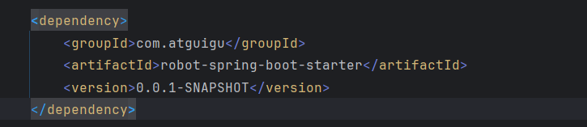

# SpringBoot

最简单的方式，快速整合所有技术栈

## 1、快速入门

### SpringBoot特性


#### SpringBoot特性 - 快速部署


### 场景启动器


```xml
<!--
     SpringBoot场景启动器：
        官方写的：spring-boot-starter-*
        第三方的：*-spring-boot-starter
            把当前场景用的jar包都引入进来；
            每个场景启动器都有一个基础依赖：spring-boot-starter
                spring-boot-starter-web
                spring-boot-starter-aop
                spring-boot-starter-data-jdbc
                spring-boot-starter-test
                spring-boot-starter-tomcat
                spring-boot-starter-json
     依赖管理：父项目不管理的所有依赖，导入的时候都需要写版本
        修改版本：
          1）、写上：就近优先原则
          2）、自己声明属性：mysql.version

  -->
<dependency>
    <groupId>org.springframework.boot</groupId>
    <artifactId>spring-boot-starter-web</artifactId>
</dependency>
```


### 依赖管理


### 自动配置机制

#### 初步理解


自定义替换数据源

```java
@Configuration
public class DataSourceConfig {


    @Value("${spring.datasource.username}")
    String username;
    @Value("${spring.datasource.password}")
    String password;
    @Value("${spring.datasource.url}")
    String url;
    @Value("${spring.datasource.driver-class-name}")
    String driverClassName;


    //SpringBoot默认约定：用户配了的用用户的，没配的用默认的
    @Bean
    DataSource dataSource(){
        DruidDataSource dataSource = new DruidDataSource();

        dataSource.setUsername(username);
        dataSource.setPassword(password);
        dataSource.setUrl(url);
        dataSource.setDriverClassName(driverClassName);

        return dataSource;
    }
}

```


或者


#### 完整流程


#### **DataSourceAutoConfiguration 组件分析**


## 2、基础功能

### 属性绑定


配置

```properties
dog.name=旺财
dog.age=18
dog.gender=男
```


属性映射到实体类

```java
@ConfigurationProperties(prefix = "dog")
@Data
public class DogProperties {

    private String name;
    private Integer age;
    private String gender;
}
```

注入到容器的方式

+ 框架常用下面  在自动配置类上导入配置`@EnableConfigurationProperties(DogProperties.class)`

+ 或者使用`@Bean、@Component`注入


`@ConfigurationProperties` 是 Spring Boot 提供的一种强大的机制，用于将配置文件中的属性绑定到 Java Bean 的属性上。它不仅简化了配置管理，而且提高了代码的可读性和可维护性。下面我们将深入探讨 `@ConfigurationProperties` 的使用方法及其背后的原理。

#### 1. 基本概念

`@ConfigurationProperties` 注解的主要目的是为了能够轻松地从外部配置文件（如 `application.properties` 或 `application.yml`）中读取配置信息，并将其映射到应用程序中的 Java 类。这使得开发者可以更方便地管理和修改应用程序的行为，而无需更改代码

#### 2. 使用场景

根据不同的需求，`@ConfigurationProperties` 可以应用于三种主要场景：

- **场景一**：直接在需要作为 Spring 容器管理 Bean 的类上使用 `@ConfigurationProperties` 和 `@Component`（或其他类似的组件注解），以便让此类成为容器的一部分，并自动完成属性值的注入。
- **场景二**：在一个配置类的方法上使用 `@Bean` 和 `@ConfigurationProperties` 来定义一个特定前缀下的属性集合作为返回的对象实例，并将其注册为 Spring 容器中的 Bean。
- **场景三**：对于不希望被 Spring 容器直接管理的普通类，可以通过 `@EnableConfigurationProperties` 将这些类注册为 Bean，从而实现配置属性的绑定

#### 3. 实际应用

#### 创建配置类

首先，我们需要创建一个 POJO 类来保存从配置文件加载的属性值。例如，假设我们要配置邮件发送模块的相关参数，我们可以这样做：

```java
@Data
@ConfigurationProperties(prefix = "mail")
public class MailConfig {
    private String hostName;
    private int port;
    private String from;
}
```

这里我们使用了 Lombok 库提供的 `@Data` 注解来自动生成 getter/setter 方法，简化了代码编写过程。同时设置了 `prefix="mail"` 属性，意味着所有以 `mail.` 开头的配置项都将与该类中的字段进行匹配

#### 配置文件设置

接下来，在 `application.properties` 或者 `application.yml` 文件中添加相应的配置项：

```properties
# application.properties
mail.hostname=smtp.example.com
mail.port=587
mail.from=noreply@example.com
```

或者在 YAML 格式的配置文件中：

```yaml
# application.yml
mail:
  hostname: smtp.example.com
  port: 587
  from: noreply@example.com
```

#### 激活 ConfigurationProperties

为了让 Spring 知道我们的 `@ConfigurationProperties` 类存在，必须将其加入到 Spring 应用上下文中。有几种方式可以做到这一点：

- 如果你已经在配置类上使用了 `@Component` 或其他组件注解，则不需要额外操作，因为这类会被自动扫描并加入上下文。
- 在主应用程序类或某个配置类上添加 `@EnableConfigurationProperties({MailConfig.class})`，这样即使没有 `@Component` 注解也可以使配置生效。
- 从 Spring Boot 2.2 开始，如果`@ConfigurationProperties`类位于默认包扫描路径内，则无需显式声明`@Component`或`@EnableConfigurationProperties`即可工作

此外，还可以利用 `@ConfigurationPropertiesScan` 注解指定自定义位置来查找配置属性类

#### 4. 高级特性

除了基本的功能之外，`@ConfigurationProperties` 还支持一些高级特性，比如嵌套属性、列表和映射的支持，以及宽松的绑定规则等。这意味着即使配置文件中的键名格式不同（如使用下划线、连字符或是全部大写），只要逻辑上对应正确，Spring 也能正确解析并赋值给目标对象的属性

例如，如果你有一个包含多个收件人的列表属性，可以在配置文件中如下定义：

```yaml
mail.defaultRecipients:
  - admin@example.com
  - support@example.com
```

而在对应的 Java 类中则定义为 `List<String>` 类型的字段：

```java
private List<String> defaultRecipients;
```

#### 5. 注意事项

当使用 `@ConfigurationProperties` 时，请确保你的类具有公共的 setter 方法，或者是使用像 Lombok 这样的工具生成它们。此外，考虑到类型安全的问题，建议结合使用 `@Validated` 和 JSR-303 Bean Validation 注解来进行数据验证

综上所述，`@ConfigurationProperties` 是一种非常灵活且强大的工具，它可以帮助开发者更加高效地处理应用程序配置，同时也促进了更好的实践，如分离关注点和提高代码质量。


### YAML 文件


#### 基本语法


#### 数据表示


```yaml
 如果yaml和properties 同时出现相同配置，则properties的优先级更高

person:
  name: 张三
  age: 20
  birth-day: 2019/03/04 12:00:00
  like: true
  child: # 对象
    name: 李四
    age: 18
    birth-day: 2019/03/04 12:00:00
    text: ["haa", "bbb", "ccc"] # 数组
  dogs: #对象集合  List<Dog>
    - name: 旺财
      age: 1
    - name: 旺财2
      age: 2
    - {name: 旺财3, age: 3} # 表示一个对象与上面含义一样
  cats: # Map String - Cat
    bluecat: # map的key 下面属性值
      name: 蓝猫
      age: 1
    redcat:
      name: 红猫
      age: 2
    blackcat: {name: 黑猫, age: 3}
```

```java
@Component
@ConfigurationProperties(prefix = "person")
@Data
public class Person {
    private String name;
    private Integer age;
    private Date birthDay;
    private Boolean like;
    private Child child;
    private List<Dog> dogs;
    private Map<String, Cat> cats;
}

@Data
class Dog {
    private String name;
    private Integer age;
}

@Data
class Child {
    private String name;
    private Integer age;
    private Date birthDay;
    private List<String> text;
}

@Data
class Cat {
    private String name;
    private Integer age;
}
```

### SpringApplication

#### 自定义 banner

•类路径添加banner.txt或设置spring.banner.location就可以定制 banner

•Spring Boot自定义启动Banner在线生成工具 https://www.bootschool.net/ascii


添加配置application.properties

```properties
spring.banner.location=classpath:banner.txt
```


#### 自定义 SpringApplication启动


常规启动Springboot

```java
@SpringBootApplication
public class Springboot01DemoApplication {

    //1、以前： war 包； webapps
    public static void main(String[] args) {
        //应用启动
        SpringApplication.run(Springboot01DemoApplication.class, args);
    }
}
```

自己`new SpringApplication`

```java
@SpringBootApplication
public class Springboot01DemoApplication {

    public static void main(String[] args) {
   
        //1、创建SpringApplication对象
        SpringApplication application = new SpringApplication(Springboot01DemoApplication.class);

        //3、关闭banner
        application.setBannerMode(Banner.Mode.OFF);
      //4、设置监听器
        application.setListeners();
       //5、设置环境
       application.setEnvironment();

        //2、启动
       application.run(args);

    }
}
```


```java
@SpringBootApplication
public class Springboot01DemoApplication {

    public static void main(String[] args) {
   
		SpringApplicationBuilder builder = new SpringApplicationBuilder();

        //链式调用
        builder
                .sources(Springboot01DemoApplication.class)
                .bannerMode(Banner.Mode.CONSOLE)
                .environment(null)
//                .listeners(null)
                .run(args);
    }
}
```

### 日志系统 

#### 简介


#### 日志系统 - 日志格式


#### 日志系统 - 日志级别


案例：

调整默认级别

```properties
# 调整 root=info (根级别)；
# 如果哪个包、哪个类不说日志级别，就用默认root的级别
logging.level.root=debug

# 指定mybatis下mapper使用debug级别
logging.level.com.atguigu.mybatis.mapper=debug
```


使用日志

```java
@Slf4j
@SpringBootTest
public class LogTest {
    //1、获取一个日志记录器
//    Logger log = LoggerFactory.getLogger(LogTest.class);

    @Test
    void test01(){

//        System.out.println("djkaljdalkjdklaj");
        //2、记录日志
        //级别：由低到高：ALL -- TRACE -- DEBUG -- INFO -- WARN -- ERROR -- OFF
        //越打印，越粗糙； 日志有一个默认级别（INFO）；只会打印这个级别之上的所有信息；

        log.trace("追踪日志......");
        if("1".equals(log)){
            log.debug("调试日志.......{}","填充占位符");
            //业务流程
            try {
                //关键点
                log.info("信息日志........");

                //容易出问题点
//                aa.bb(){
//                    log.warn("警告日志........");
//                };

            }catch (Exception e){
                log.error("错误日志......"+e.getMessage());
            }

        }

        //格式： 时间  级别  进程id --- 项目名 --- 线程名 --- 当前类名: 日志内容s
    }
}
```


#### 日志系统 - 日志分组


```properties
#  默认设置
logging.level.root=debug

# 设置日志组
logging.group.biz=com.atguigu.service,com.atguigu.dao

# 整组批量设置日志级别
logging.level.biz=debug
```

#### 日志系统 - 文件输出


```properties
# 当前项目所在的根文件夹下生成一个 指定名字的 日志文件
# 两个都配置以文件名为准
logging.file.name=boot.log
logging.file.path=D:\\log\\
```

#### 日志系统 - 文件归档与滚动切割


#### 日志系统 - 自定义配置


`logback.xml`

```xml
<?xml version="1.0" encoding="UTF-8"?>
<configuration debug="false">

    <!--定义日志文件的存储地址 勿在 LogBack 的配置中使用相对路径-->
    <property name="LOG_HOME" value="/home" />

    <!--控制台日志， 控制台输出 -->
    <appender name="STDOUT" class="ch.qos.logback.core.ConsoleAppender">
        <encoder class="ch.qos.logback.classic.encoder.PatternLayoutEncoder">
            <!--格式化输出：%d表示日期，%thread表示线程名，%-5level：级别从左显示5个字符宽度,%msg：日志消息，%n是换行符-->
            <pattern>%d{yyyy-MM-dd HH:mm:ss.SSS} [%thread] %-5level %logger{50} - %msg%n</pattern>
        </encoder>
    </appender>

    <!--文件日志， 按照每天生成日志文件 -->
    <appender name="FILE" class="ch.qos.logback.core.rolling.RollingFileAppender">
        <rollingPolicy class="ch.qos.logback.core.rolling.TimeBasedRollingPolicy">
            <!--日志文件输出的文件名-->
            <FileNamePattern>${LOG_HOME}/TestWeb.log.%d{yyyy-MM-dd}.log</FileNamePattern>
            <!--日志文件保留天数-->
            <MaxHistory>30</MaxHistory>
        </rollingPolicy>
        <encoder class="ch.qos.logback.classic.encoder.PatternLayoutEncoder">
            <!--格式化输出：%d表示日期，%thread表示线程名，%-5level：级别从左显示5个字符宽度%msg：日志消息，%n是换行符-->
            <pattern>%d{yyyy-MM-dd HH:mm:ss.SSS} [%thread] %-5level %logger{50} - %msg%n</pattern>
        </encoder>
        <!--日志文件最大的大小-->
        <triggeringPolicy class="ch.qos.logback.core.rolling.SizeBasedTriggeringPolicy">
            <MaxFileSize>10MB</MaxFileSize>
        </triggeringPolicy>
    </appender>

    <!-- show parameters for hibernate sql 专为 Hibernate 定制 -->
    <logger name="org.hibernate.type.descriptor.sql.BasicBinder" level="TRACE" />
    <logger name="org.hibernate.type.descriptor.sql.BasicExtractor" level="DEBUG" />
    <logger name="org.hibernate.SQL" level="DEBUG" />
    <logger name="org.hibernate.engine.QueryParameters" level="DEBUG" />
    <logger name="org.hibernate.engine.query.HQLQueryPlan" level="DEBUG" />

    <!--myibatis log configure-->
    <logger name="com.apache.ibatis" level="TRACE"/>
    <logger name="java.sql.Connection" level="DEBUG"/>
    <logger name="java.sql.Statement" level="DEBUG"/>
    <logger name="java.sql.PreparedStatement" level="DEBUG"/>

     <!-- 自定义日志级别 -->
    <logger name="com.example" level="debug">
            <appender-ref ref="STDOUT" />
    </logger>
    
    <!-- 日志默认输出级别 -->
    <root level="DEBUG">
        <appender-ref ref="STDOUT" />
        <appender-ref ref="FILE"/>
    </root>
</configuration>
```

#### 日志系统 - 切换日志组合


PomXML

```xml
<!--       排除默认日志 -->
<dependency>
    <groupId>org.springframework.boot</groupId>
    <artifactId>spring-boot-starter</artifactId>
    <exclusions>
        <exclusion>
            <groupId>org.springframework.boot</groupId>
            <artifactId>spring-boot-starter-logging</artifactId>
        </exclusion>
    </exclusions>
</dependency>

<dependency>
    <groupId>org.springframework.boot</groupId>
    <artifactId>spring-boot-starter-log4j2</artifactId>
</dependency>

```

#### 日志系统 – 最佳实践


> 我们用日志； 再也不要 sout
> 1、配置（日志输出到文件、打印日志级别）
>  2、记录日志（合适的时候选择合适的级别进行日志记录。`log.error/info/debug`）

## 3、进阶使用

### Profiles环境隔离（掌握）

#### Profiles环境隔离 - 基础用法


> 环境隔离：
> 1、定义环境： dev、test、prod；
> 2、定义这个环境下生效哪些组件或者哪些配置？
>      1）、生效哪些组件： 给组件 @Profile("dev") 基于环境标识进行判断，如果当前处于什么环境就配置什么组件、或者开启什么配置
>      2）、生效哪些配置： `application-{环境标识}.properties`
> 3、激活这个环境：这些组件和配置就会生效
>      1）、application.properties:  配置项：`spring.profiles.active=dev`
>      2）、命令行：`java -jar xxx.jar --spring.profiles.active=dev`
>
> **注意：激活的配置优先级高于默认配置**
> **生效的配置 = 默认配置 + 激活的配置(profiles.active) +  包含的配置(profiles.include)**


```properties
# include 指定通用配置
spring.profiles.include=haha,common

#激活配置
spring.profiles.active=hahaha
```


#### Profiles环境隔离 - 分组


```properties
# profile 分组
spring.profiles.group.hahaha[0]=dev
spring.profiles.group.hahaha[1]=haha
spring.profiles.group.hahaha[2]=common

#激活分组
spring.profiles.active=hahaha
```

#### Profiles环境隔离 - 配置文件


### 外部化配置（掌握）


配置文件如下：本次案例最终生效的config下配置


### 单元测试进阶（熟悉）


```java
@Slf4j
@SpringBootTest
public class UnitTest {

    @Autowired
    HelloService helloService;

    @DisplayName("第一个测试")
    @Test
    void test01() {
        log.info("测试通过");
    }

    @Test
    void test02() {
        //1、业务规定，返回hello字符串才算成功，否则就是失败
        String result = helloService.sayHello();
        //2、断言：判断字符串是否等于hello
//        Assertions.assertEquals("hello",result,"helloservice并没有返回hello");

        Assertions.assertThrows(ArithmeticException.class, () -> {
            helloService.hello();
        });
    }
}
```


### 可观测性（了解）


## 4、核心原理

### 生命周期监听（了解）


案例1：

1、实现监听器接口

```java
/**
 * 监听到SpringBoot启动的全生命周期
 */
@Slf4j
public class MyListener implements SpringApplicationRunListener {

    @Override
    public void starting(ConfigurableBootstrapContext bootstrapContext) {
        // 此时日志框架还没有绑定，还不能输出日志
        System.out.println("MyListener...starting...");
    }

    @Override
    public void started(ConfigurableApplicationContext context, Duration timeTaken) {
        log.info("MyListener...started...");
    }

    @Override
    public void ready(ConfigurableApplicationContext context, Duration timeTaken) {
        log.info("MyListener...ready...");
    }

    @Override
    public void failed(ConfigurableApplicationContext context, Throwable exception) {
        log.info("MyListener...failed...");
    }

    @Override
    public void environmentPrepared(ConfigurableBootstrapContext bootstrapContext, ConfigurableEnvironment environment) {
        log.info("MyListener...environmentPrepared...");
    }

    @Override
    public void contextLoaded(ConfigurableApplicationContext context) {
        log.info("MyListener...contextLoaded...");
    }

    @Override
    public void contextPrepared(ConfigurableApplicationContext context) {
        log.info("MyListener...contextPrepared...");
    }
}
```


2、在`src/main/resources/META-INF/spring.factories`配置生效

```properties
org.springframework.boot.SpringApplicationRunListener=com.atguigu.boot.listener.MyListener
```


案例2：项目启动后的一次性任务

```java
@Configuration
public class Springboot01DemoApplication {

    @Bean
    CommandLineRunner commandLineRunner(){
        return new CommandLineRunner() {
            @Override
            public void run(String... args) throws Exception {
                log.info("CommandLineRunner...run...");
                //项目启动后的一次性任务

            }
        };
    }
}
```


### 生命周期事件（了解）


### 事件驱动开发（了解）


案例1：


1、定义事件：

```java
package com.atguigu.boot.event;


import lombok.Data;

@Data //定义一个事件
public class UserLoginSuccessEvent {

    private String username;

    public UserLoginSuccessEvent(String username) {
        this.username = username;
    }
}

```

2、发布事件

```java
@Slf4j
@RestController
public class UserController {


    @Autowired
    CouponService couponService;

    @Autowired
    UserPointsService userPointsService;

    @Autowired
    ApplicationEventPublisher publisher;


    @GetMapping("/login")
    public String login(String username, String password){
        //执行登录
        log.info("用户[{}]登录系统", username);
    
        ////事件/消息驱动；
        UserLoginSuccessEvent event = new UserLoginSuccessEvent(username);
        //发送事件
        publisher.publishEvent(event);

        //做事；同步调用  同步阻塞式；
        //1、加积分
//        userPointsService.givePoints(username);
        //2、发优惠劵
//        couponService.giveCoupon(username);

        return "登录成功";
    }
}
```


3、处理事件

订阅UserLoginSuccessEvent事件者1：

```java
// 本地消息（事件）模式;
// 分布式消息（事件）模式; 需要借助中间件 消息队列
@Slf4j
@Service // 优惠券服务
public class CouponService {

    @Async
    @EventListener(UserLoginSuccessEvent.class)
    public void listen(UserLoginSuccessEvent event){
        log.info("优惠券服务 = 监听到：UserLoginSuccessEvent 事件");
        String username = event.getUsername();
        //调用业务
        giveCoupon(username);
    }

    public void giveCoupon(String username) {
        log.info("发放给用户【{}】一张优惠券",username);
    }
}

```

订阅UserLoginSuccessEvent事件者2：

```java
@Slf4j
@Service //用户积分服务
public class UserPointsService {

    @Async //异步
    @EventListener(UserLoginSuccessEvent.class)
    public void listen(UserLoginSuccessEvent event){
        log.info("用户积分服务 == 监听到 UserLoginSuccessEvent 事件");
        givePoints(event.getUsername());
    }

    public void givePoints(String username) {
        log.info("用户【{}】获得积分", username);
    }
}

```


> `@Async`开启异步事件
>
> 前提主配置开启`@EnableAsync`
>
> ```java
> @EnableAsync //开启基于注解的自动异步
> //自动配置
> @SpringBootApplication
> public class Springboot01DemoApplication {
>     ...
> }
> ```

### 自动配置原理（熟悉）


### SpringBoot完整项目启动流程


## 5、自定义starter

### 场景设计


### 基础抽取


robot-spring-boot-starter模块

1、业务

```java
@RestController
public class RobotController {

    @Autowired
    RobotService robotService;

    @GetMapping("/robot/hello")
    public String sayHello(){
        String msg = robotService.sayHello();
        return msg;
    }
}
```

```java
@Service
public class RobotServiceImpl implements RobotService {


    @Autowired
    RobotProperties robotProperties;

    @Override
    public String sayHello() {
        return "我是机器人【"+robotProperties.getName()+"】，使用底层大模型：【"+robotProperties.getModel()+"】；我们开始聊天吧";
    }
}
```

2、配置类

```java
@Component
@ConfigurationProperties(prefix = "robot")
@Data
public class RobotProperties {

    private String name;
    private String model;
}
```


3、自动配置类，导入需要的组件和配置

```java
@EnableConfigurationProperties(RobotProperties.class)
@Configuration //把这个场景要用的所有组件导入到容器中
public class RobotAutoConfiguration {

    @Bean
    public RobotController robotController() {
        return new RobotController();
    }

    @Bean
    public RobotService  robotService() {
        return new RobotServiceImpl();
    }

}
```


使用：在需要springboot-02-demo使用

1、pom中引入依赖



2、由于springboot机制只能扫描当前目录及子目录的包，所以自动配置需要导入RobotAutoConfiguration自动配置

```java
@Import(RobotAutoConfiguration.class)
```


### @EnableXx机制


### 完全自动配置


自动发现配置：

`src/main/resources/META-INF/spring/org.springframework.boot.autoconfigure.AutoConfiguration.imports`

```tex
com.atguigu.robot.starter.RobotAutoConfiguration
```


### 总结

```java
 * spring-boot-start-web
 *
 * 为什么导入  robot-spring-boot-starter ，访问 controller 是 404？
 * 原因：主程序只会扫描到自己所在的包及其子包下的所有组件
 *
 * 自定义starter：
 * 1、第一层抽取：编写一个自动配置类，别人导入我的starter，
 *              无需关心需要给容器中导入哪些组件，只需要导入自动配置类，
 *              自动配置类帮你给容器中导入所有这个场景要用的组件
 *               @Import(RobotAutoConfiguration.class)
 * 2、第二层抽取：只需要标注功能开关注解。@EnableRobot
 * 3、第三层抽取：只需要导入starter，所有功能就绪
```


