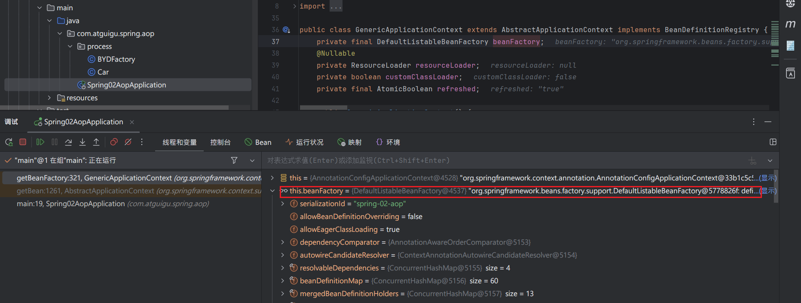

# Spring企业级一站式框架

```tex
003.Spring - 介绍.mp4
004.Spring - 容器和组件.mp4
005.Spring - Ioc和DI.mp4
006.容器 - 注册 - 实验1：@Bean - 把组件放到容器.mp4
007.容器 - 注册 - 补充 - Maven配置问题.mp4
008、容器 - 注册 - 补充 - maven 聚合配置.mp4
009、容器 - 注册 - 实验2：从容器中获取组件 - 按照名字、类型.mp4
010、容器 - 注册 - 实验2：组件创建时机和单例特性.mp4
011、容器 - 注册 - 实验3：@Configuration - 配置类.mp4
012、容器 - 注册 - 实验4-7：@Controller、@Service、@Repository、@Component - mvc分层注解.mp4
013、容器 - 注册 - 实验8：@ComponentScan - 批量扫描.mp4
014、容器 - 注册 - 实验9：@Import - 导入第三方组件.mp4
015、容器 - 注册 - 补充 - 分层注解底层都是 @Component.mp4
016、容器 - 注册 - 实验10：@Scope - 调整组件作用域.mp4
017、容器 - 注册 - 实验11：@Lazy - 单例情况下的懒加载.mp4
018、容器 - 注册 - 实验12：FactoryBean - 利用工厂制造复杂Bean.mp4
019、容器 - 注册 - 实验13：@Conditional - 条件注册 .mp4
020、容器 - 注册 - 实验13：@Conditional 派生注解.mp4
021、容器 - 注册 - 实验13：@ConditionalOnMissingBean 的判定bug.mp4
022、容器 - 注入 - 实验1：@Autowired .mp4
023、容器 - 注入 - 实验2-3：@Qualifier 和 @Primary.mp4
024、容器 - 注入 - 实验4：@Resource 也是自动注入.mp4
025、容器 - 注入 - 实验6：构造器注入.mp4
026、容器 - 注入 - 实验5：setter方法注入.mp4
027、容器 - 注入 - 实验7：xxxAware 感知接口.mp4
028、容器 - 注入 - 实验8：@Value 给属性赋值.mp4
029、容器 - 注入 - 实验9：@PropertySource.mp4
030、容器 - 注入 - 实验9：细节，类路径找资源的写法.mp4
031、容器 - 注入 - ResourceUtils - 获取资源.mp4
032、容器 - 注入 - @Profile - 多环境.mp4
033、源码 - 原生方式使用容器 - ClassPathXmlApplicationContext.mp4
034、容器 - 生命周期 - 实验1 - @Bean 指定生命周期初始化和销毁方法.mp4
035、容器 -生命周期 - 实验2-3 - InitializingBean、DisposableBean.mp4
036、容器 - 生命周期 - 实验4-5：@PreDestroy、@PostConstruct.mp4
037、容器 - 生命周期 - 实验6：BeanPostProcessor.mp4
038、容器 - 生命周期 - BeanPostProcessor能做什么.mp4
039、容器篇 - 结束.mp4
040、单元测试新用法.mp4
041、AOP - 日志 - 硬编码与静态代理.mp4
042、AOP - 日志 - 动态代理.mp4
043、AOP - 日志 - 动态代理 - 加日志.mp4
044、AOP - 日志 - 动态代理必须有接口.mp4
045、AOP - 日志 - 日志工具类.mp4
046、AOP - 专业术语.mp4
047、AOP - 切面 - 编写切面和通知方法实现 AOP.mp4
048、AOP - 细节 - 切入点 表达式通配符.mp4
049、AOP - 细节 - 切入点表达式的其他写法.mp4
050、AOP - 细节 - 组件在容器中其实是代理对象.mp4
051、AOP - 细节 - 通知方法执行流程.mp4
052、AOP - 细节 - JoinPoint 连接点信息.mp4
053、AOP - 细节 - @Pointcut 抽取切入点表达式.mp4
054、AOP - 细节 - 多切面执行顺序.mp4
055、作业 - 处理.mp4
056、【源码】 - BeanFactory 里面的核心集合.mp4
057、【源码】- Spring 容器 底层就是三个Map，三级缓存机制.mp4
058、AOP - 环绕通知 - 拦截器目标方法执行，执行前后进行修改.mp4
059、AOP - 环绕通知 - 建议一定抛出异常，方便多切面情况下异常感知链路是通的.mp4
060、AOP - 总结：应用场景.mp4
061、事务 - 环境搭建 - 创建数据库、创建项目.mp4
062、事务 - 环境搭建 - 整合数据源和JdbcTemplate.mp4
063、事务 - 实验1：按照id查询图书（JdbcTemplate）.mp4
064、事务 - 实验2：添加图书.mp4
065、事务 - 实验3：按照id修改图书库存.mp4
066、事务 - 实验4：按照id删除图书.mp4
067、事务 - 实验5：按照username扣减账户余额.mp4
068、事务 - 实验6：结账操作.mp4
069、事务 - @Transactional - 声明式事务搞定.mp4
070、事务 - 细节 - 事务管理器的原理.mp4
071、事务 - 细节 - timeout - 超时控制.mp4
072、事务 - 细节 - readOnly - 只读优化.mp4
073、事务 -细节 - rollbackFor - 指定哪些异常需要回滚.mp4
074、事务 - 细节 - noRollbackFor - 指定哪些异常不需要回滚.mp4
075、事务 - 细节 - 隔离级别 - READ_UNCOMMITTED 读未提交.mp4
076、事务 - 细节 - 隔离级别 - READ_COMMITTED - 读已提交.mp4
077、事务 - 细节 - 隔离级别 - REPEATABLE_READ - 可重复读.mp4
078、事务 - 细节 - 传播行为 - propagation.mp4
079、事务 - 细节 - 传播行为 - 分析一个复杂案例.mp4
080、事务 - 细节 - 传播行为 - 属性传播.mp4
081、Spring - 总结.mp4
082、【源码】- 双检查锁机制.mp4
083、【源码】- IoC容器启动12大步.mp4
```


## 1.Spring-介绍

### 框架是什么


### Spring 体系

•官网：spring.io


### Spring Framework


### Spring 模块划分


## 2.Spring-容器

### **组件和容器**

组件：具有一定功能的对象

容器：管理组件（创建、获取、保存、销毁）

**一个常见的容器**


### IoC、DI

+ `IoC`：Inversion of Control（控制反转）
  + `控制`：资源的控制权（资源的创建、获取、销毁等）

  + `反转`：和传统的方式不一样了

+ `DI` ：Dependency Injection（依赖注入）
  + `依赖`：组件的依赖关系，如 NewsController 依赖 NewsServices

  + `注入`：通过setter方法、构造器、等方式自动的注入（赋值）


### 注册组件


#### 实验1：@Bean - 把组件放到容器

`@Bean`注解是Spring框架提供的一个核心注解，用于在配置类中声明一个方法，该方法将返回一个对象，该对象要作为Spring应用上下文中的一个bean（即受Spring容器管理的对象）。以下是对该段代码的详细解释：

##### 概述

- `@Bean`注解用于指示一个方法会产生一个bean，这个bean将由Spring容器管理。
- 注解的属性名称和语义故意设计成与Spring XML配置中的`<bean/>`元素相似。

##### Bean名称

- 默认情况下，bean的名称是`@Bean`方法的名称。
- 也可以使用`name`属性（或其别名`value`）来显式指定bean的名称。`name`属性接受一个字符串数组，允许为单个bean指定多个名称（即一个主名称和一个或多个别名）。

##### 其他注解的配合使用

- `@Bean`注解本身不提供`profile`、`scope`、`lazy`、`depends-on`或`primary`等属性。
- 这些属性应通过`@Scope`、`@Lazy`、`@DependsOn`和`@Primary`等注解来声明。
- 还可以声明限定符注解和`@Order`值，这些在注入点解析时会被考虑。

##### `@Bean`方法在`@Configuration`类中的使用

- 通常，`@Bean`方法是在`@Configuration`类中声明的。

- 在这种情况下，bean方法可以通过直接调用同一类中的其他`@Bean`方法来引用它们。这确保了bean之间的引用是强类型且可导航的。

- 所谓的“inter-bean references”（内部bean引用）会尊重作用域和AOP语义，就像`getBean()`查找一样。

  - 默认情况下，Spring 会对 `@Configuration` 类进行 CGLIB 子类化，以拦截 `@Bean` 方法的调用。这样做的目的是为了保证单例作用域下的 Bean 实例共享。如果你不希望这种行为，可以通过设置 `proxyBeanMethods = false` 来禁用此功能，这在配置类主要作为简单的工厂 Bean 时特别有用。

- 为了实现这一点，`@Configuration`类及其工厂方法不能标记为final或private。

  

##### `@Bean` Lite模式

- `@Bean`方法也可以在未用`@Configuration`注解的类中声明。这被称为“lite”模式。
- 在lite模式下，bean方法将被容器视为普通的工厂方法（类似于XML中的`factory-method`声明），并正确应用作用域和生命周期回调。
- 与`@Configuration`类中的bean方法不同，lite模式下的“inter-bean references”不受支持。

##### **`@Configuration` 模式 vs. Lite 模式**

主要的区别在于 Spring 如何处理包含 `@Bean` 方法的类：

- **完整 `@Configuration` 模式 (Full Mode):**
  - 当 `@Bean` 方法在用 `@Configuration` 注解的类中声明时，Spring 会在运行时使用 CGLIB 对这个配置类进行**增强**（子类化）。
  - 这种增强的目的是**拦截**对配置类内部其他 `@Bean` 方法的调用。例如，如果在同一个 `@Configuration` 类中，`beanA()` 方法调用了 `beanB()` 方法（这被称为“bean 间引用”或 "inter-bean reference"），Spring 会拦截这个调用。
  - 通过拦截，Spring 能够确保返回的是由 Spring 容器管理的正确的 Bean 实例，并遵循其作用域（如单例、原型等）和AOP代理。例如，多次调用一个单例的 `@Bean` 方法将始终返回同一个由 Spring 管理的 Bean 实例。
- **`@Bean` Lite 模式 (Lite Mode):**
  - 如果 `@Bean` 方法声明在一个**没有**用 `@Configuration` 注解的类中（例如，一个用 `@Component` 注解的类，或者一个普通的 Java 对象 POJO，这个 POJO 本身也是一个 Bean），Spring 会以 Lite 模式处理这些 `@Bean` 方法。
  - 在这种情况下，包含 `@Bean` 方法的类**不会**被 CGLIB 增强。
  - 因此，在这类 Lite 模式的类中，一个 `@Bean` 方法直接调用另一个 `@Bean` 方法，会被视为**普通的 Java 方法调用**。
  - 这意味着，如果 `beanA()` 方法直接调用 `beanB()` 方法，`beanB()` 将像普通 Java 方法一样执行。如果 `beanB()` 方法的实现是创建一个新对象（例如 `return new MyService();`），那么每次从 `beanA()` 调用它时，都会创建一个新的 `MyService` 实例，而不是返回 Spring 容器管理的那个单例 Bean 实例（如果 `beanB()` 声明为单例的话）。

**Lite 模式的主要特点和影响：**

1. **没有 CGLIB 子类化：** 包含 `@Bean` 方法的类仍然是一个普通的 Java 类，Spring 不会为其创建运行时的子类来进行方法拦截。
1. **Bean 间引用是标准的 Java 方法调用：** 这是最核心的区别。在 Lite 模式的类中，如果一个 `@Bean` 方法 `methodA` 调用了同一个类中的另一个 `@Bean` 方法 `methodB`，那么 `methodB` 会像普通方法一样执行。这意味着它可能不会返回 Spring 管理的那个 Bean 实例，而是执行方法体并可能创建一个新的实例。
1. **Bean 的作用域和生命周期仍然受 Spring 管理：** 尽管 Bean 间调用的行为不同，但在 Lite 模式下声明的 Bean 仍然会遵循其声明的作用域（例如 `@Scope("prototype")`）和 Spring Bean 的生命周期回调（例如 `@PostConstruct`, `@PreDestroy`）。一旦这些 Bean 被注册到应用上下文中，Spring 容器就会像管理其他 Bean 一样管理它们。
1. 何时使用 Lite 模式？
   - 当 `@Bean` 方法定义在用 `@Component`、`@Service`、`@Repository` 等注解的类中时。
   - 当 `@Bean` 方法存在于普通的 Java 类中，并且这些类本身也被注册为 Bean 时（例如通过组件扫描或编程式注册）。
   - 当在 `@Configuration` 类上显式设置 `proxyBeanMethods = false` 属性时。这实际上是将一个 `@Configuration` 类的行为模式切换到类似于 Lite 模式，在 Bean 间调用方面放弃了 CGLIB 代理。这样做通常是为了在不需要或不依赖 Bean 间调用返回 Spring 管理实例的场景下获得轻微的性能提升。

**什么时候考虑使用 Lite 模式 (或者 `@Configuration(proxyBeanMethods = false)`)：**

- **简单的配置场景：** 如果你的配置类没有依赖于 Spring 拦截的 Bean 间调用（也就是说，你不在配置类内部通过直接调用其他 `@Bean` 方法来注入依赖），那么 Lite 模式或 `proxyBeanMethods = false` 可以因为避免了 CGLIB 代理而带来轻微的性能优势。
- **避免 CGLIB 的限制：** CGLIB 子类化会带来一些限制，例如配置类及其 `@Bean` 方法不能是 `final` 或 `private` 的。Lite 模式可以避免这些限制。
- **与现有代码集成：** 有时你可能想在现有的 `@Component` 中通过 `@Bean` 方法暴露一些 Bean，Lite 模式使得这成为可能，而无需将该组件重构为 `@Configuration` 类。

**总结：**

`@Bean` Lite 模式提供了一种在非 `@Configuration` 类（或设置了 `proxyBeanMethods = false` 的 `@Configuration` 类）中声明 Bean 的灵活方式。关键的区别在于 **Bean 间方法调用的行为**：它们会变成普通的 Java 方法调用，从而绕过了在完整 `@Configuration` 模式下 Spring 通过 CGLIB 增强所提供的拦截机制（该机制确保了在此类调用中返回容器管理的单例 Bean）。

理解这种差异对于正确设计 Spring 应用程序的配置至关重要，尤其是在处理配置类内部的 Bean 依赖关系时，可以避免因错误的调用方式导致非预期的行为（例如意外创建了多个实例而不是共享同一个单例）。简单来说，如果你需要在配置类内部通过方法调用来保证获取的是 Spring 管理的 Bean 实例，那么应该使用完整的 `@Configuration` 模式（即不设置 `proxyBeanMethods = false`）。如果不需要这种保证，或者希望获得轻微的性能提升并避免 CGLIB 的限制，Lite 模式或 `@Configuration(proxyBeanMethods = false)` 是一个可行的选择。


##### 启动和配置

- 可以通过`AnnotationConfigApplicationContext`等类来引导容器。

##### 返回`BeanFactoryPostProcessor`的`@Bean`方法

- 对于返回`BeanFactoryPostProcessor`类型的`@Bean`方法，需要特别注意。
- 因为`BeanFactoryPostProcessor`对象必须在容器生命周期的非常早期实例化，它们可能会干扰`@Autowired`、`@Value`和`@PostConstruct`等注解的处理。
- 为了避免这些生命周期问题，应将返回`BeanFactoryPostProcessor`的`@Bean`方法标记为static。
- 通过将方法标记为static，可以在不导致声明它的`@Configuration`类实例化的情况下调用它，从而避免上述生命周期冲突。


##### 总结

`@Bean`注解是Spring框架中一个非常重要的特性，它允许开发者以声明性的方式在Java配置类中定义bean。通过理解`@Bean`注解的工作原理，开发者可以更灵活地控制Spring应用上下文中的bean的创建和管理。


```java
@SpringBootApplication
public class Spring01IocApplication {

    public static void main(String[] args) {
        //1、跑起一个Spring的应用；  ApplicationContext：Spring应用上下文对象； IoC容器
        ConfigurableApplicationContext ioc = SpringApplication.run(Spring01IocApplication.class, args);
        System.out.println("ioc = " + ioc);

        System.out.println("=============================");
        //2、获取到容器中所有组件的名字；容器中装了哪些组件； Spring启动会有很多默认组件
        String[] names = ioc.getBeanDefinitionNames();
        for (String name : names) {
            System.out.println("name = " + name);
        }
    }
    
   //3、给容器中注册一个自己的组件； 容器中的每个组件都有自己的名字，方法名就是组件的名字  也可以使用`name`属性（或其别名`value`）来显式指定bean的名称
    @Bean("zhangsan")
    public Person zhangsan() {
        Person person = new Person();
        person.setName("张三1");
        person.setAge(20);
        person.setGender("男");
        return person;
    }
}
```


#### 实验2：从容器中获取组件 - 按照名字、类型

```java
    public static void test01BeanAnnotation(String[] args) {
        //1、跑起一个Spring的应用；  ApplicationContext：Spring应用上下文对象； IoC容器
        ConfigurableApplicationContext ioc = SpringApplication.run(Spring01IocApplication.class, args);
        System.out.println("ioc = " + ioc);

        System.out.println("=============================");

        //4、获取容器中的组件对象；精确获取某个组件
        // 组件的四大特性：(名字、类型)、对象、作用域
        // 组件名字全局唯一；组件名重复了，一定只会给容器中放一个最先声明的哪个。

        //小结：
        //从容器中获取组件，
        //  1）、组件不存在，抛异常：NoSuchBeanDefinitionException
        //  2）、组件不唯一，
        //      按照类型只要一个：抛异常：NoUniqueBeanDefinitionException
        //      按照名字只要一个：精确获取到指定对象
        //      按照类型获取多个：返回所有组件的集合（Map）
        //  3）、组件唯一存在，正确返回。


        //4.1、按照组件的名字获取对象
        Person zhangsan = (Person) ioc.getBean("zhangsan");
        System.out.println("对象 = " + zhangsan);

        //4.2、按照组件类型获取对象
//        Person bean = ioc.getBean(Person.class);
//        System.out.println("bean = " + bean);
        
        //4.3、按照组件类型获取这种类型的所有对象
        Map<String, Person> type = ioc.getBeansOfType(Person.class);
        System.out.println("type = " + type);

        //4.4、按照类型+名字
        Person bean = ioc.getBean("zhangsan", Person.class);
        System.out.println("bean = " + bean);


        //5、组件是单实例的....  在Spring中，默认情况下，单例作用域（Singleton）的Bean在容器中是唯一的，每次请求都会返回同一个实例。

    }
```

#### 实验2：组件创建时机和单例特性


#### 实验3：@Configuration - 配置类

表示一个类声明了一个或多个@Bean方法，并且可以由 Spring 容器处理以在运行时生成 bean 定义和这些 bean 的服务请求

```java
@Configuration //告诉Spring容器，这是一个配置类
public class PersonConfig {

    //3、给容器中注册一个自己的组件； 容器中的每个组件都有自己的名字，方法名就是组件的名字
    @Bean("zhangsan")
    public Person zhangsan() {
        Person person = new Person();
        person.setName("张三1");
        person.setAge(20);
        person.setGender("男");
        return person;
    }
    @Bean("lisi")
    public Person lisi() {
        Person person = new Person();
        person.setName("李四");
        person.setAge(20);
        person.setGender("男");
        return person;
    }

}
```

##### 详细说明

`@Configuration` 是 Spring 框架中的一个核心注解，主要用于定义配置类。这些配置类可以包含一个或多个方法，每个方法通过 `@Bean` 注解来定义并注册一个或多个 Spring 容器管理的 Bean。使用 `@Configuration` 和 `@Bean` 注解的方式提供了一种替代传统的 XML 配置文件的方法来配置 Spring 应用程序上下文。下面是关于 `@Configuration` 注解的详细说明：

###### 主要用途

- **声明配置类**：`@Configuration` 注解用于标记一个类作为 Spring 的配置类。这种类通常包含一个或多个 `@Bean` 注解的方法，用来定义如何创建和配置应用中需要的 Bean。

###### 工作原理

- 当 Spring 上下文启动时，它会扫描被 `@Configuration` 注解标注的类，并处理这些类中所有带有 `@Bean` 注解的方法。每个这样的方法都会被调用一次（默认情况下），其返回值将作为一个 Spring Bean 被注册到应用上下文中。

###### 特性

1. **Bean 方法调用**
   - 在配置类内部，如果你直接调用其他 `@Bean` 方法，Spring 将确保总是返回同一个实例（对于单例作用域的 Bean）。这是因为 Spring 使用了 CGLIB 来增强配置类，使得每次调用 `@Bean` 方法时都能返回正确的 Bean 实例。
1. **代理机制**
   - 默认情况下，Spring 会对 `@Configuration` 类进行 CGLIB 子类化，以拦截 `@Bean` 方法的调用。这样做的目的是为了保证单例作用域下的 Bean 实例共享。如果你不希望这种行为，可以通过设置 `proxyBeanMethods = false` 来禁用此功能，这在配置类主要作为简单的工厂 Bean 时特别有用。
1. **组件扫描**
   - `@Configuration` 注解本身也包含了 `@Component` 注解，这意味着被 `@Configuration` 标记的类也会被组件扫描机制识别为 Spring 组件的一部分。
1. **环境抽象**
   - 可以与 `@Profile` 结合使用，根据不同的环境条件（如开发、测试、生产等）激活不同的配置类或特定的 Bean 定义。

###### 关键属性

- proxyBeanMethods
  - 类型：`boolean`
  - 默认值：`true`
  - 描述：指定是否应该对 `@Bean` 方法的调用进行代理处理。如果设置为 `false`，则不会代理 `@Bean` 方法，从而提高某些场景下的性能。适用于不需要跨方法调用共享 Bean 实例的情况。


#### 实验4-7：@Controller、@Service、@Repository、@Component - mvc分层注解

默认**，分层注解能起作用的前提是：这些组件必须在主程序所在的包及其子包结构下**

```java
 Spring 为我们提供了快速的 MVC分层注解
      1、@Controller 控制器
      2、@Service 服务层
      3、@Repository 持久层
      4、@Component 组件
```


#### 实验8：@ComponentScan - 批量扫描

这段Java代码描述的是Spring框架中的`@ComponentScan`注解的功能和用法。`@ComponentScan`注解用于配置组件扫描指令，通常与`@Configuration`注解的类一起使用，以指定Spring容器在初始化时应扫描哪些包以查找带有`@Component`、`@Repository`、`@Service`、`@Controller`等注解的类，并将它们注册为Spring应用上下文中的bean。

以下是对代码段的详细解释：

1. **配置组件扫描指令**：`@ComponentScan`为`@Configuration`类提供组件扫描的配置指令，这与Spring XML配置中的`<context:component-scan>`元素提供的功能相似。
2. **定义扫描的包**：可以通过`basePackageClasses`或`basePackages`（或其别名`value`）属性来指定要扫描的特定包。如果没有定义特定的包，则扫描将从声明此注解的类所在的包开始，并递归进行。**可以扫描不在在主程序所在的包及其子包结构下**
3. **注解配置**：注意到`<context:component-scan>`元素有一个`annotation-config`属性，但`@ComponentScan`注解没有。这是因为在大多数情况下，当使用`@ComponentScan`时，默认会进行注解配置处理（例如处理`@Autowired`等注解）。此外，当使用`AnnotationConfigApplicationContext`时，注解配置处理器总是被注册的，这意味着在`@ComponentScan`级别尝试禁用它们将被忽略。
4. **可重复和元注解**：`@ComponentScan`注解可以用作可重复注解，这意味着可以在同一个类上多次使用它。此外，它还可以用作元注解来创建具有属性覆盖的自定义组合注解。
5. **局部声明的优先级**：局部声明的`@ComponentScan`注解总是优先于并有效地“隐藏”作为元注解存在的`@ComponentScan`，这允许显式的局部配置覆盖通过元注解（包括使用`@ComponentScan`元注解的组合注解）提供的配置。

简而言之，`@ComponentScan`注解是Spring框架中用于配置组件扫描的关键注解，它允许开发者指定哪些包应该被Spring容器扫描以查找和注册bean。通过理解`@ComponentScan`的工作原理，开发者可以更灵活地控制Spring应用上下文中的bean发现和注册过程。

```java
@Configuration
@ComponentScan(basePackages = "com.atguigu.spring") //组件批量扫描； 只扫利用Spring相关注解注册到容器中的组件
public class AppConfig {
}
```

#### 实验9：@Import - 导入第三方组件

```
第三方组件想要导入容器中：没办法快速标注分层注解
1、@Bean：自己new，注册给容器
2、@Import：快速导入组件
3、实验 beanFactory，工厂类创建

指示要导入的一个或多个组件类- 通常是@Configuration类。
```

```java
@Import({CoreConstants.class})
@Configuration
public class AppConfig {
}
```

#### 补充 - 分层注解底层都是 @Component

```java
@Target(ElementType.TYPE)
@Retention(RetentionPolicy.RUNTIME)
@Documented
@Component
public @interface Configuration {
    
    
@Target(ElementType.TYPE)
@Retention(RetentionPolicy.RUNTIME)
@Documented
@Component
public @interface Controller {    
```

#### 实验10：@Scope - 调整组件作用域

```java
@Scope 调整组件的作用域：
1、@Scope("prototype")：非单实例:
     容器启动的时候不会创建非单实例组件的对象。
     什么时候获取，什么时候创建 
     每获取一次，创建一个执行一次构造器创建对象
2、@Scope("singleton")：单实例： 默认值
     容器启动的时候会创建单实例组件的对象。
     容器启动完成之前就会创建好
   @Lazy：懒加载
     容器启动完成之前不会创建懒加载组件的对象
     什么时候获取，什么时候创建
     单例模式，可以继续调整为懒加载
3、@Scope("request")：同一个请求单实例
4、@Scope("session")：同一次会话单实例
```

```java
    public static void main(String[] args) {
        ConfigurableApplicationContext ioc = SpringApplication.run(Spring01IocApplication.class, args);

        System.out.println("========");

        UserController bean = ioc.getBean(UserController.class);
        System.out.println("bean = " + bean);

        UserService bean1 = ioc.getBean(UserService.class);
        System.out.println("bean1 = " + bean1);

        CoreConstants bean2 = ioc.getBean(CoreConstants.class);
        System.out.println("bean2 = " + bean2);

    }
```

#### 实验11：@Lazy - 单例情况下的懒加载

`@Lazy` 注解在Spring框架中用于延迟bean的初始化。当你将`@Lazy`注解应用于Spring容器中的一个bean时，该bean的创建将被延迟，直到第一次需要它时才进行初始化。这在处理复杂依赖关系或初始化开销较大的bean时非常有用，因为它可以减少应用程序的启动时间，并允许更精细地控制bean的创建和依赖注入时机。

##### 使用场景

1. **减少启动时间**：如果你的应用程序中有很多bean，并且其中一些bean的初始化过程非常耗时，那么使用`@Lazy`可以显著减少应用程序的启动时间。
2. **解决循环依赖**：在Spring中，如果两个或多个bean相互依赖，这可能会导致循环依赖问题。使用`@Lazy`可以在一定程度上解决这种循环依赖，因为它允许容器在注入依赖时暂时使用代理或占位符。
3. **按需加载**：在某些情况下，你可能希望某些bean只有在真正需要时才被加载和初始化。`@Lazy`注解可以帮助你实现这一点。

##### 使用方法

**在字段上使用**

你可以将`@Lazy`注解应用于Spring管理的bean的字段上，以延迟该字段的初始化。例如：

```java
import org.springframework.beans.factory.annotation.Autowired;
import org.springframework.context.annotation.Lazy;
import org.springframework.stereotype.Component;

@Component
public class MyService {

    @Autowired
    @Lazy
    private AnotherService anotherService;

    // ...
}
```

在上面的例子中，`AnotherService` bean的初始化将被延迟，直到`MyService`中的某个方法尝试访问`anotherService`字段时。

**在方法上使用**

你也可以在配置类或组件类的方法上使用`@Lazy`注解，以延迟由该方法返回的bean的初始化。例如：

```java
import org.springframework.context.annotation.Bean;
import org.springframework.context.annotation.Configuration;
import org.springframework.context.annotation.Lazy;

@Configuration
public class AppConfig {

    @Bean
    @Lazy
    public AnotherService anotherService() {
        return new AnotherService();
    }

    // ...
}
```

在这个例子中，`anotherService` bean的初始化将被延迟，直到它第一次被请求时。

##### 注意事项

- 使用`@Lazy`注解时，需要注意它可能引入的额外复杂性和潜在的性能影响。虽然它可以减少启动时间，但在某些情况下，它可能会导致更复杂的依赖关系和更难以预测的行为。
- `@Lazy`注解可以与`@Autowired`、`@Inject`等依赖注入注解一起使用，以实现延迟初始化的效果。
- 在Spring Boot应用中，默认情况下，所有使用`@Autowired`注入的bean都是非延迟初始化的。如果你需要延迟初始化，必须显式地使用`@Lazy`注解。


#### 实验12：FactoryBean - 利用工厂制造复杂Bean

`FactoryBean` 是 Spring 框架中的一个接口，它提供了一种创建对象的高级方式。通常，当你通过 Spring 容器获取一个 bean 时，容器会直接实例化并返回一个指定的类实例。但是，如果你定义了一个 `FactoryBean`，那么当你请求这个 bean 时，Spring 容器会首先调用 `FactoryBean` 的 `getObject()` 方法来获取实际的对象实例。

`FactoryBean` 接口主要包含了三个方法：

1. `T getObject() throws Exception;`：这个方法用于返回由 `FactoryBean` 创建的对象实例。这个实例通常是某种类型的具体实现，该类型在 `FactoryBean` 的实现中指定。
2. `Class<?> getObjectType();`：这个方法用于返回 `getObject()` 方法返回的对象类型。这允许 Spring 容器在运行时检查 bean 的类型，而不必实际创建 bean 实例。
3. `boolean isSingleton();`：这个方法用于指示 `FactoryBean` 创建的对象是否是单例的。如果返回 `true`，则表示每次通过 Spring 容器获取该 bean 时，都会返回同一个实例。如果返回 `false`，则每次请求都可能会创建一个新的实例。

使用 `FactoryBean` 的好处之一是它可以隐藏对象的创建过程，并提供了一种在 Spring 配置中插入自定义逻辑的方式。例如，你可以使用 `FactoryBean` 来创建代理对象、延迟初始化对象、或者根据某些条件动态地选择创建哪个对象。

下面是一个简单的 `BYDFactory` 实现示例：

```java
// 场景：如果制造某些对象比较复杂的时候，利用工厂方法进行创建。
@Component
public class BYDFactory implements FactoryBean<Car> {

    /**
     * 调用此方法给容器中制造对象
     */
    @Override
    public Car getObject() throws Exception {
        System.out.println("BYDFactory 正在制造Car对象...");
        Car car = new Car();
        return car;
    }


    /**
     * 说明造的东西的类型
     */
    @Override
    public Class<?> getObjectType() {
        return Car.class;
    }


    /**
     * 是单例？
     *    true：是单例的；
     *    false：不是单例的；
     */
    @Override
    public boolean isSingleton() {
        return true;
    }
}
```


```java
    // FactoryBean在容器中放的组件的类型，是接口中泛型指定的类型，组件的名字是 工厂自己的名字
    public static void test05(String[] args) {
        ConfigurableApplicationContext ioc = SpringApplication.run(Spring01IocApplication.class, args);
        System.out.println("=================ioc容器创建完成===================");


        Car bean1 = ioc.getBean(Car.class);
        Car bean2 = ioc.getBean(Car.class);
        System.out.println(bean1 == bean2);

        Map<String, Car> beansOfType = ioc.getBeansOfType(Car.class);
        System.out.println("beansOfType = " + beansOfType);
    }

//结果
BYDFactory 正在制造Car对象...
true

```


#### 实验13：@Conditional - 条件注册 

表示只有满足所有指定条件时组件才有资格注册。

在Java中，`Conditional`是一个注解（Annotation），它通常与Spring框架一起使用，用于根据特定的条件来决定一个配置类、方法或bean是否应该被注册到Spring应用上下文中。`Conditional`注解提供了一种灵活的方式来根据运行时环境或其他条件来条件化地配置bean。

> **`Conditional`注解本身是一个标记注解（marker annotation），它通常与实现了`Condition`接口的类一起使用**。
>
> `Condition`接口定义了一个方法`matches(ConditionContext, AnnotatedTypeMetadata)`，该方法用于评估当前的条件是否满足。如果`matches`方法返回`true`，则配置类、方法或bean将被注册；如果返回`false`，则它们将被忽略。

以下是一个使用`@Conditional`注解的简单示例：

```java
// 定义一个实现Condition接口的类
public class OnWindowsCondition implements Condition {
    @Override
    public boolean matches(ConditionContext context, AnnotatedTypeMetadata metadata) {
        // 检查当前操作系统是否是Windows
        return context.getEnvironment().getProperty("os.name").toLowerCase().contains("win");
    }
}

// 使用@Conditional注解来条件化地配置一个bean
@Configuration
public class AppConfig {

    @Bean
    @Conditional(OnWindowsCondition.class)
    public MyBean myBean() {
        // 如果当前操作系统是Windows，则注册这个bean
        return new MyBean();
    }
}
```

在这个例子中，`OnWindowsCondition`类实现了`Condition`接口，并覆盖了`matches`方法来检查当前操作系统是否是Windows。然后，在`AppConfig`配置类中，`myBean`方法被标记为`@Conditional(OnWindowsCondition.class)`，这意味着如果当前操作系统是Windows，则`myBean`方法将被调用，并且返回的`MyBean`实例将被注册到Spring应用上下文中。如果当前操作系统不是Windows，则`myBean`方法将被忽略，并且`MyBean`实例不会被注册。

`@Conditional`注解非常强大，因为它允许开发者根据几乎任何条件来条件化地配置bean。这些条件可以基于环境属性、系统属性、自定义逻辑等。通过使用`@Conditional`，开发者可以创建更加灵活和可配置的Spring应用程序。


> 功能：通过判断环境变量OS的值是mac还是windows注入不同的Bean
>
> 扩展：可以通过链接数据库或者其他，满足一定的条件才注册bean

实现Condition接口的判断条件 matches结果表示是否注册

```java
public class MacCondition implements Condition {
    @Override
    public boolean matches(ConditionContext context, AnnotatedTypeMetadata metadata) {
        Environment environment = context.getEnvironment();

        String property = environment.getProperty("OS");

        return property.contains("mac");
    }
}
```

```java
public class WindowsCondition implements Condition {
    @Override
    public boolean matches(ConditionContext context, AnnotatedTypeMetadata metadata) {
        //判断环境变量中的OS 包含windows，就是windows系统
        Environment environment = context.getEnvironment();
        String property = environment.getProperty("OS");
        return property.contains("Windows");
    }
}
```


```java
@Configuration //告诉Spring容器，这是一个配置类
public class PersonConfig {

    //场景：判断当前电脑的操作系统是windows还是mac
    //  windows 系统，容器中有 bill
    //  mac 系统，容器中有 joseph
    @Conditional(MacCondition.class)
    @Bean("joseph")
    public Person joseph(){
        Person person = new Person();
        person.setName("乔布斯");
        person.setAge(20);
        person.setGender("男");
        return person;
    }

    @Conditional(WindowsCondition.class)
    @Bean("bill")
    public Person bill(){
        Person person = new Person();
        person.setName("比尔盖茨");
        person.setAge(20);
        person.setGender("男");
        return person;
    }
}
```

测试：

```java
 /**
     * 条件注册
     * @param args
     */
    public static void main(String[] args) {
        ConfigurableApplicationContext ioc = SpringApplication.run(Spring01IocApplication.class, args);

        Map<String, Person> beans = ioc.getBeansOfType(Person.class);
        System.out.println("beans = " + beans);


        //拿到环境变量
        ConfigurableEnvironment environment = ioc.getEnvironment();

        String property = environment.getProperty("OS");
        System.out.println("property = " + property);

        Map<String, Dog> beansOfType = ioc.getBeansOfType(Dog.class);
        System.out.println("dogs = " + beansOfType);

        Map<String, UserService> ofType = ioc.getBeansOfType(UserService.class);
        System.out.println("ofType = " + ofType);

    }
```


#### 实验13：@Conditional 派生注解


```java
@Configuration
public class DogConfig {

//    @ConditionalOnMissingBean(value = {UserService.class})
//    @ConditionalOnMissingBean(name="joseph",value = {Person.class})
//    @ConditionalOnBean(name = "bill")
//    @ConditionalOnResource(resources="classpath:haha.abc")

    // Spring在底层会有多组件名字判定bug。
//    @ConditionalOnMissingBean(name="joseph")
    @Bean
    public Dog dog01(){
        Dog dog = new Dog();
        dog.setName("大狗");

        return dog;
    }
}
```


### 注入组件

#### 注入组件的各种方式


#### 实验1：@Autowired

自动装配是Spring IoC（控制反转）容器的一个核心特性，它允许Spring自动地将一个bean的依赖关系注入到该bean中，而无需手动编写大量的样板代码。

**注意事项**

- 使用`@Autowired`注解时，最好将其放在setter方法或构造函数参数上，而不是直接放在字段上。这样做可以使代码更加清晰，并有助于遵循Spring的最佳实践。
- 如果你的应用程序中有多个相同类型的bean，并且你希望自动装配其中一个特定的bean，那么你应该使用`@Qualifier`注解来明确指定要注入的bean的名称。
- 自动装配虽然方便，但也可能导致运行时错误，特别是当依赖关系没有正确配置时。因此，在使用自动装配时，请确保你的Spring配置是正确的，并且你已经理解了自动装配的工作原理。


```java
//1、Spring容器管理
@Service
public class UserService {}
```


```java
@Controller
public class UserController {

    /**
     * 自动装配流程（先按照类型，再按照名称）
     * 1、按照类型，找到这个组件；
     *      1.0、只有且找到一个，直接注入，名字无所谓
     *      1.1、如果找到多个，再按照名称去找; 变量名就是名字（新版）。
     *           1.1.1、如果找到： 直接注入。
     *           1.1.2、如果找不到，报错
     */
    @Autowired //自动装配； 原理：Spring 调用 容器.getBean
    UserService abc;
    
   @Autowired //验证情景：容器中存在多个Person，注入名称bill的对象
    Person bill;

    @Autowired  //把容器中Person这个类型的所有组件都拿来
    List<Person> personList;
    
    @Autowired
    Map<String,Person> personMap;
    
    @Autowired //注入ioc容器自己
    ApplicationContext applicationContext;
}
```


> 这段Java代码展示了在Spring框架中`@Autowired`注解的多种用法，主要用于依赖注入。下面是对每个`@Autowired`注解使用情况的详细解释：
>
> 1. **UserService abc;**
>
>    这行代码表示Spring容器会尝试找到一个`UserService`类型的bean，并将其注入到`abc`字段中。由于这里只指定了类型没有指定名称，Spring会按照以下规则进行注入：
>
>    - 如果容器中只有一个`UserService`类型的bean，Spring会直接将其注入到`abc`中。
>    - 如果容器中有多个`UserService`类型的bean，Spring会尝试按照变量名`abc`（尽管在这里变量名本身并不直接用于匹配，但如果有多个bean且需要按名称匹配时，通常是通过`@Qualifier`注解来明确指定）来找到对应的bean进行注入。但在没有`@Qualifier`或其他名称匹配机制的情况下，这会导致注入失败并抛出异常。
>
>    然而，需要注意的是，这里的解释有一点需要澄清：在Spring的默认行为中，当使用`@Autowired`注解在字段上时，并不会直接通过变量名进行匹配。变量名匹配通常是通过`@Qualifier`注解来实现的，或者在某些特定情况下（如构造函数注入时），如果Spring需要区分多个相同类型的构造函数参数，它可能会考虑参数的名称（但这需要编译器生成相应的元数据，且通常只在使用Java编译器的`-parameters`选项时可用）。因此，更准确的表述应该是：如果找到多个`UserService`类型的bean且没有通过`@Qualifier`等机制指定具体的bean名称，则注入会失败。
>
> 2. **Person bill;**
>
>    验证情景：容器中存在多个Person，注入名称bill的对象，Spring会尝试找到多个`Person`类型的bean，并找到名称为bill将其注入到`bill`字段中。
>
> 3. **List personList;**
>
>    这行代码表示Spring会注入所有`Person`类型的bean到一个`List`集合中。这是Spring自动装配集合类型的一个特性。如果容器中有多个`Person`类型的bean，它们都会被添加到`personList`中。这些bean会按照它们在Spring容器中的注册顺序（或者根据`@Order`注解和`Ordered`接口指定的顺序）进行排序。
>
> 4. **Map<String,Person> personMap;**
>
>    类似于`personList`，Spring会注入所有`Person`类型的bean到一个`Map`集合中。在这个`Map`中，键（Key）是bean的名称（String类型），值（Value）是对应的`Person`类型的bean实例。这样，你就可以通过bean的名称来访问对应的bean实例了。
>
> 5. **ApplicationContext applicationContext;**
>
>    这行代码表示Spring会将自身的`ApplicationContext`容器注入到`applicationContext`字段中。`ApplicationContext`是Spring容器的高级接口，提供了很多用于访问容器本身和容器中bean的方法。通过注入`ApplicationContext`，你可以在代码中动态地访问和操作容器中的bean。
>
> 总的来说，这段代码展示了`@Autowired`注解在Spring框架中用于依赖注入的强大功能。通过`@Autowired`，你可以轻松地将Spring容器中的bean注入到你的类字段中，从而实现了松散的耦合和更高的代码可维护性。

#### 实验2-3：@Qualifier 和 @Primary

在Spring框架中，`@Qualifier`和`@Primary`注解用于解决当Spring容器中存在多个相同类型的bean时的歧义性问题，尤其是在自动装配（autowiring）时。以下是对这两个注解的详细解释和使用场景。

##### @Qualifier

`@Qualifier`注解用于在自动装配时，指定要注入的具体bean的名称。当Spring容器中存在多个相同类型的bean时，`@Qualifier`可以帮助我们明确指定要注入哪一个bean。

###### 使用示例：

假设我们有两个实现了相同接口的bean：

```java
@Component
public class MyServiceA implements MyService {
    // 实现细节
}

@Component
public class MyServiceB implements MyService {
    // 实现细节
}
```

在需要注入`MyService`类型的bean时，我们可以使用`@Qualifier`来指定注入哪一个：

```java
@Autowired
@Qualifier("myServiceA")
private MyService myService;
```

这样，Spring就会注入名为`myServiceA`的bean。

##### @Primary

`@Primary`注解用于在多个候选bean中指定一个“主要的”bean。当Spring进行自动装配时，如果发现有多个候选bean，并且其中有一个被标记为`@Primary`，则优先注入这个被标记的bean。

###### 使用示例：

```java
@Primary
@Component
public class MyPrimaryService implements MyService {
    // 实现细节
}

@Component
public class MyOtherService implements MyService {
    // 实现细节
}
```

在这种情况下，如果没有使用`@Qualifier`明确指定，Spring将自动注入`MyPrimaryService`，因为它被标记为`@Primary`。

##### 结合使用

虽然`@Primary`和`@Qualifier`都可以解决bean的歧义性问题，但它们可以结合使用以提供更灵活的注入控制。例如，我们可以有一个主要的bean，但在某些特殊情况下需要注入另一个bean：

```java
@Autowired
private MyService myService; // 将注入被@Primary标记的bean

@Autowired
@Qualifier("myOtherService")
private MyService otherService; // 将注入名为myOtherService的bean
```

##### 总结

- `@Qualifier`用于在自动装配时指定具体的bean名称。
- `@Primary`用于在多个候选bean中指定一个主要的bean，以便在自动装配时优先注入。
- 这两个注解可以结合使用，以提供更灵活和强大的bean注入控制。


##### 课堂演示

```java
@Data
@ToString
@Service
public class UserService {


    /**
     * Consider marking one of the beans as @Primary,
     * updating the consumer to accept multiple beans,
     * or using @Qualifier to identify the bean that should be consumed
     */
//    @Qualifier("bill") //场景1：精确指定：如果容器中这样的组件存在多个，则使用@Qualifier精确指定组件名
    @Qualifier("bill") //场景2：精确指定：如果容器中这样的组件存在多个，且有默认Primary组件。我们可以使用 @Qualifier 切换别的组件。
    @Autowired
    Person atom; // @Primary 一旦存在，改属性名就不能实现组件切换了。 【如果找到多个，再按照名称去找; 变量名就是名字（新版）】 使用@Qualifier去指定
    
    @Primary //主组件：默认组件
    @Bean("zhangsan")
    public Person haha() {
        Person person = new Person();
        person.setName("张三2");
        person.setAge(20);
        person.setGender("男");
        return person;
    }

}
```

#### 实验4：@Resource 也是自动注入


```java
    //面试题：@Resource 和 @Autowired 区别？
    //1、@Autowired 和 @Resource 都是做bean的注入用的，都可以放在属性上
    //2、@Resource 具有更强的通用性  javaEE规范
    @Resource
    UserDao userDao;

//    @Resource
   @Autowired(required = false)//推荐Autowired
    Dog dog;
```

在Java中，`@Autowired`注解是Spring框架提供的一个用于依赖注入的注解。它通常被用在类的字段、setter方法、构造函数或配置方法上，以便Spring容器能够自动地将匹配的bean注入到这些位置。

当你看到`@Autowired(required = false)`这样的代码时，它的含义是：

- `@Autowired`：这是一个标记，告诉Spring容器这个字段、方法或构造函数参数需要被自动装配。
- `required = false`：这是一个属性，它指定了自动装配是否是必需的。当设置为`false`时，它表示这个依赖不是强制性的。也就是说，如果Spring容器中没有找到匹配的bean来注入，它不会抛出异常，而是简单地忽略这个依赖。

默认情况下，`@Autowired`注解的`required`属性是`true`，这意味着如果Spring容器不能找到一个匹配的bean来注入，它将抛出一个异常。通过将`required`属性设置为`false`，你可以使依赖注入变得可选，从而允许你的应用程序在没有这个依赖的情况下也能运行。

这在某些情况下是非常有用的，比如：

- 你可能正在开发一个可以配置为使用外部服务的应用程序，但你也希望在没有配置外部服务的情况下，应用程序仍然能够启动和运行（尽管功能可能受限）。
- 你可能正在编写一个库或框架，它提供了一些可选的组件或服务，而这些组件或服务只有在用户明确提供了相应的实现时才需要被注入。

使用`@Autowired(required = false)`可以使你的代码更加灵活和健壮，因为它允许你的应用程序在没有某些依赖的情况下也能运行，而不是因为缺少这些依赖而崩溃。然而，你也需要小心使用它，因为如果一个可选的依赖没有被注入，你需要确保你的代码能够适当地处理这种情况，比如通过提供默认值或执行回退逻辑。


#### 实验6：构造器注入

Spring框架中的一个核心特性：**构造器注入**（Constructor Injection）。这是Spring实现依赖注入（Dependency Injection, DI）的一种方式。

> 在Spring中，**当你使用构造器注入时，Spring容器会在创建bean实例时自动查找并注入构造器所需的所有参数**。这些参数通常是其他bean的引用，或者是一些基本数据类型、String等可以通过容器配置直接提供的值。

以下是一个简单的Java代码示例，用于说明这个过程：

```java
import org.springframework.beans.factory.annotation.Autowired;
import org.springframework.stereotype.Component;

// 定义一个服务组件
@Component
public class MyService {
    // ... 服务相关的代码
}

// 定义一个控制器组件，它依赖于MyService
@Component
public class MyController {

    // 通过构造器注入MyService
    private final MyService myService;

    // 构造器被@Autowired注解，表示Spring应该自动注入所需的参数
    @Autowired
    public MyController(MyService myService) {
        this.myService = myService;
    }

    // ... 控制器相关的代码
}
```

在这个例子中：

1. `MyService` 是一个被`@Component`注解标记的服务类，这意味着它是一个Spring管理的bean。
2. `MyController` 是一个被`@Component`注解标记的控制器类，它依赖于`MyService`。
3. `MyController` 只有一个有参构造器，该构造器接受一个`MyService`类型的参数。这个构造器被`@Autowired`注解标记，表示Spring应该自动注入这个参数。

当Spring容器启动时，它会扫描所有被`@Component`（或其他相关注解，如`@Service`, `@Repository`, `@Controller`等）标记的类，并尝试创建它们的实例。对于`MyController`，Spring会看到它的构造器被`@Autowired`注解标记，并且知道需要注入一个`MyService`类型的bean。由于`MyService`也是一个Spring管理的bean，Spring会找到这个bean的实例，并将其注入到`MyController`的构造器中。

这个过程是自动的，你不需要手动创建`MyService`的实例或将其传递给`MyController`的构造器。这就是Spring框架提供的依赖注入机制的一个例子，它有助于减少代码之间的耦合，并使你的应用程序更加模块化和可测试。


课堂演示：

```java
@ToString
@Repository
public class UserDao {

    Dog haha;

    /**
     * 推荐：构造器注入
  	 * 	Spring 自动去容器中找到 构造器需要的所有参数的组件值。
     */
    public UserDao(Dog dog){
        System.out.println("UserDao...有参构造器："+dog);
        this.haha = dog;
    }
}
```

#### 实验5：setter方法注入


```java
@ToString
@Repository
public class UserDao {

    Dog haha;

    //set 方法注入  如果容器中存在多个Dog实例，使用@Qualifier("dog02")指定使用名称dog02的实例
    @Autowired
    public void setDog(@Qualifier("dog02") Dog dog) {
        System.out.println("setDog..."+dog);
        this.haha = dog;
    }
}

```

这段代码是Spring框架中的一个部分，具体展示了如何使用`@Autowired`注解来自动装配（依赖注入）一个名为`dog02`的`Dog`类型的bean。下面是对代码各部分的详细解释：

1. **@Autowired 注解**：这是Spring框架提供的一个注解，用于自动注入依赖。在这个例子中，它用于`setDog`方法，**表明该方法会在Spring容器启动时自动被调用，并将一个匹配的bean注入到该方法中**。

2. **public void setDog(@Qualifier("dog02") Dog dog)**：这是`setDog`方法的定义。该方法接收一个`Dog`类型的参数，并使用`@Qualifier("dog02")`注解来指定要注入的bean的名称。这意味着Spring容器会查找名为`dog02`的`Dog`类型的bean，并将其注入到这个方法中。

3. **this.haha = dog**：这行代码将注入的`Dog`对象赋值给当前类的`haha`成员变量。这里假设当前类有一个`haha`成员变量，其类型为`Dog`（或其父类/接口）。

   

**总结**：这段代码的主要作用是展示如何在Spring框架中使用`@Autowired`注解来自动装配（依赖注入）一个名为`dog02`的`Dog`类型的bean。这是Spring框架的核心功能之一，可以大大简化Java应用的开发过程，特别是在处理复杂的依赖关系时。


#### 实验7：xxxAware 感知接口

在Java中，"Aware"这个词通常不是一个独立的代码元素，比如一个方法或类，而是一个命名约定或后缀，用于表示某个类具有对特定上下文或资源的感知（awareness）。这种命名模式常见于Spring框架和其他一些Java框架中，用于实现依赖注入和上下文感知。

当一个类被命名为`*Aware`（例如`ApplicationContextAware`、`BeanFactoryAware`、`EnvironmentAware`等），它通常意味着这个类能够接收或感知到某个特定的上下文信息或资源。这通常是通过实现一个特定的接口来完成的，该接口定义了一个`set*`方法，用于将所需的上下文或资源注入到类中。

例如，`ApplicationContextAware`接口定义了一个`setApplicationContext(ApplicationContext applicationContext)`方法。当一个类实现了这个接口，Spring容器在创建这个类的bean时，会自动调用这个`setApplicationContext`方法，将当前的`ApplicationContext`（应用程序上下文）传递给该类。这样，该类就能够访问Spring容器中的其他bean和应用程序的配置信息。

下面是一个简单的例子，展示了如何实现一个`EnvironmentAware`的类：

```Java
import org.springframework.beans.factory.annotation.Autowired;
import org.springframework.core.env.Environment;
import org.springframework.stereotype.Component;

@Component
public class MyEnvironmentAwareComponent implements EnvironmentAware {

    private Environment environment;

    @Override
    public void setEnvironment(Environment environment) {
        this.environment = environment;
    }

    // 其他方法可以使用this.environment来获取配置信息
    public String getProperty(String key) {
        return environment.getProperty(key);
    }
}
```

在这个例子中，`MyEnvironmentAwareComponent`类实现了`EnvironmentAware`接口，并重写了`setEnvironment`方法。当Spring容器创建这个类的bean时，它会自动调用`setEnvironment`方法，将当前的`Environment`对象注入到类中。之后，`MyEnvironmentAwareComponent`类的其他方法就可以使用这个`environment`成员变量来访问应用程序的配置信息了。

总的来说，"Aware"命名约定是Spring框架和其他Java框架中用于实现依赖注入和上下文感知的一种模式。通过实现特定的`*Aware`接口，类可以接收并感知到它们所需的上下文信息或资源。

课堂测试代码：

```java
@Getter
@ToString
@Service
public class HahaService implements EnvironmentAware, BeanNameAware {

    private Environment environment;
    private String myName;

    @Override
    public void setEnvironment(Environment environment) {
        this.environment = environment;
    }

    @Override
    public void setBeanName(String name) {
        this.myName = name;
    }

    public String getOsType(){
       return environment.getProperty("OS");
    }

}
```


#### 实验8：@Value 给属性赋值 + SPEL表达式

##### 课堂演示

配置文件application.properties

```properties
dog.age=1000
```

演示代码：

```java
@ToString
@Data
@Component
public class Dog {

//    @Autowired // 自动注入组件的。基本类型，自己搞。


    /**
     * 1、@Value("字面值"): 直接赋值
     * 2、@Value("${key}")：动态从配置文件中取出某一项的值。
     * 3、@Value("#{SpEL}")：Spring Expression Language；Spring 表达式语言
     *      更多写法：https://docs.spring.io/spring-framework/reference/core/expressions.html
     *
     */
    // 直接赋值
    @Value("旺财")
    private String name1;
    
	//入dog.age属性的值，如果它未在属性文件中定义，则使用4作为默认值
    @Value("${dog.age:4}")
    private Integer age;
    
    
    // 计算表达式
    @Value("#{10*20}")
    private String color;

    // 动态生成一个UUID
    @Value("#{T(java.util.UUID).randomUUID().toString()}")
    private String id;

    // 字符串截取
    @Value("#{'Hello World!'.substring(0, 5)}")
    private String msg;

    // 字符串转换
    @Value("#{new String('haha').toUpperCase()}")
    private String flag;

    //SpEL创建数组
    @Value("#{new int[] {1, 2, 3}}")
    private int[] hahaha;

    public Dog() {

        String string = UUID.randomUUID().toString();

        System.out.println("Dog构造器...");
    }
}
```

##### 使用总结

在Java类中使用`@Value`注解来注入属性值，通常涉及到Spring框架，并且这些属性值通常定义在属性文件（如`application.properties`或`application.yml`）中。以下是一个简单的步骤指南，展示如何在Java类中使用`@Value`注解来注入属性值。

**步骤 1: 定义属性文件**

首先，你需要在属性文件中定义你想要注入的属性。例如，你可以在`src/main/resources/application.properties`文件中添加如下内容：

```properties
dog.age=1000
```

**步骤 2: 创建Java类并使用@Value注解**

接下来，在你的Java类中，使用`@Value`注解来注入这个属性值。确保你的类是一个Spring管理的bean，这通常意味着它需要用`@Component`、`@Service`、`@Repository`或`@Controller`等注解来标记。

```Java
import org.springframework.beans.factory.annotation.Value;
import org.springframework.stereotype.Component;

@Component
public class Dog {

    @Value("${dog.age}")
    private int age;

    // Getter and Setter
    public int getAge() {
        return age;
    }

    public void setAge(int age) {
        this.age = age;
    }

    @Override
    public String toString() {
        return "Dog{age=" + age + "}";
    }
}
```

在这个例子中，`@Value("${dog.age}")`注解用于注入在`application.properties`文件中定义的`dog.age`属性的值。

**步骤 3: 在Spring Boot应用程序中启用属性注入**

确保你的Spring Boot应用程序已经启用了属性注入功能。这通常是通过在主应用程序类或配置类上添加`@SpringBootApplication`或`@EnableConfigurationProperties`注解来实现的。

```Java
import org.springframework.boot.SpringApplication;
import org.springframework.boot.autoconfigure.SpringBootApplication;

@SpringBootApplication
public class MySpringBootApplication {

    public static void main(String[] args) {
        SpringApplication.run(MySpringBootApplication.class, args);
    }
}
```

**步骤 4: 使用注入的属性**

最后，你可以在你的应用程序中使用注入的属性。例如，你可以通过自动装配（Autowiring）`Dog`类的实例，并访问其`age`属性。

```java
import org.springframework.beans.factory.annotation.Autowired;
import org.springframework.boot.CommandLineRunner;
import org.springframework.stereotype.Component;

@Component
public class DogRunner implements CommandLineRunner {

    @Autowired
    private Dog dog;

    @Override
    public void run(String... args) throws Exception {
        System.out.println(dog);
    }
}
```

在这个例子中，`DogRunner`类实现了`CommandLineRunner`接口，并在其`run`方法中打印出`Dog`对象的`toString()`表示，这将输出`Dog{age=1000}`。

请确保你的Spring Boot应用程序已经正确配置了属性文件的位置，并且Spring Boot能够找到并加载这些属性文件。通常，Spring Boot会在`src/main/resources`目录下自动查找名为`application.properties`或`application.yml`的属性文件。

##### SpEL

SpEL（Spring Expression Language）是Spring框架中的一个功能强大的表达式语言，它允许在运行时查询和操作对象图。然而，你提供的背景知识中并没有直接涉及到SpEL表达式的内容。

SpEL表达式可以用于各种Spring相关的配置和操作，比如XML配置、注解配置或者Java代码中。以下是一些基本的SpEL表达式示例：

1. **字面量表达式**：

   ```Java
   @Value("#{3.14}")
   private double pi;
   ```

2. **属性访问和操作方法调用**：

   ```Java
   @Value("#{systemProperties['os.name']}")
   private String osName;
   ```

3. **关系运算符**：

   ```Java
   @Value("#{2 > 1}")
   private boolean isTrue;
   ```

4. **逻辑运算符**：

   ```Java
   @Value("#{true and false}")
   private boolean result;
   ```

5. **正则表达式**：

   ```Java
   @Value("#{name.matches('[a-zA-Z]+')}")
   private boolean isAlphabetic;
   ```

6. **集合选择**：

   ```Java
   @Value("#{myList.?[#this.startsWith('J')]}")
   private List<String> javaNames;
   ```

在你的问题中，虽然你提供的内容与SpEL没有直接关系，但如果你想在某个Spring管理的bean中使用SpEL表达式，可以像上面这样使用`@Value`注解。例如，如果你想注入系统属性，可以使用：

```Java
import org.springframework.beans.factory.annotation.Value;
import org.springframework.stereotype.Component;

@Component
public class MyBean {

    @Value("#{systemProperties['os.name']}")
    private String osName;

    // Getter and Setter
    public String getOsName() {
        return osName;
    }

    public void setOsName(String osName) {
        this.osName = osName;
    }
}
```

请注意，上述代码示例假设你已经有一个Spring应用程序上下文，并且MyBean类已经由Spring管理。如果你有其他具体的SpEL使用场景或问题，请提供更多细节，以便我能给出更具体的解答。


#### 实验9：@PropertySource

`@PropertySource` 是 Spring 框架中一个非常实用的注解，它允许你将外部属性文件中的属性加载到 Spring 的 `Environment` 中。这样，你就可以在应用程序中轻松地访问这些配置属性了。

以下是 `@PropertySource` 的使用示例和调用方式的详细说明：

**核心功能：**

- 将指定属性文件中的键值对加载到 Spring 环境中。
- 通常与 `@Configuration` 注解一起使用。
- 可以通过 `@Value` 注解或 `Environment` 对象来访问加载的属性。

**基本使用示例：**

假设你有一个名为 `app.properties` 的属性文件，位于 `src/main/resources` 目录下：

```Properties
# app.properties
app.name=My Spring Application
app.version=1.0.0
db.url=jdbc:mysql://localhost:3306/mydb
db.username=root
db.password=secret
```

你可以创建一个配置类来加载这个属性文件：

```Java
import org.springframework.beans.factory.annotation.Autowired;
import org.springframework.beans.factory.annotation.Value;
import org.springframework.context.annotation.Bean;
import org.springframework.context.annotation.Configuration;
import org.springframework.context.annotation.PropertySource;
import org.springframework.core.env.Environment;

@Configuration
@PropertySource("classpath:app.properties") // 指定属性文件的位置
public class AppConfig {

    @Autowired
    private Environment env; // 使用方式一：注入 Environment 对象

    // 使用方式二：使用 @Value 注解注入单个属性
    @Value("${app.name}")
    private String appName;

    @Value("${app.version}")
    private String appVersion;

    @Value("${db.url}")
    private String dbUrl;

    // 示例 Bean，演示如何使用加载的属性
    @Bean
    public MyService myService() {
        MyService service = new MyService();
        // 通过 Environment 对象获取属性
        service.setDatabaseUrl(env.getProperty("db.url"));
        service.setUsername(env.getProperty("db.username"));
        System.out.println("Database URL from env: " + env.getProperty("db.url"));

        // 直接使用 @Value 注入的属性
        System.out.println("App Name from @Value: " + appName);
        System.out.println("App Version from @Value: " + appVersion);
        System.out.println("DB URL from @Value: " + dbUrl); // 注意：dbUrl 也能通过 @Value 获取

        return service;
    }

    // 一个简单的服务类，用于演示
    public static class MyService {
        private String databaseUrl;
        private String username;

        public void setDatabaseUrl(String databaseUrl) {
            this.databaseUrl = databaseUrl;
        }

        public void setUsername(String username) {
            this.username = username;
        }

        public void displayConfig() {
            System.out.println("Configured Database URL: " + databaseUrl);
            System.out.println("Configured Username: " + username);
        }
    }
}
```

**调用（访问）加载的属性：**

主要有两种方式来访问 `@PropertySource` 加载的属性：

1. **通过 `Environment` 对象：**

   - `Environment` 接口提供了访问属性的方法，如 `getProperty(String key)`。
   - 你可以将 `Environment` 对象自动注入到任何 Spring管理的 Bean 中。
   - **优点：** 灵活，可以动态获取属性，检查属性是否存在等。

   

   ```Java
   import org.springframework.beans.factory.annotation.Autowired;
   import org.springframework.core.env.Environment;
   import org.springframework.stereotype.Component;
   
   @Component
   public class PropertyReader {
   
       @Autowired
       private Environment environment;
   
       public String getAppName() {
           return environment.getProperty("app.name");
       }
   
       public String getDbUsername() {
           return environment.getProperty("db.username");
       }
   
       // 可以提供默认值
       public String getNonExistentProperty() {
           return environment.getProperty("non.existent.property", "defaultValue");
       }
   }
   ```

1. **通过 `@Value` 注解：**

   - `@Value` 注解可以直接将属性值注入到 Bean 的字段、方法参数或构造函数参数中。
   - 使用占位符 `${property.key}` 来引用属性。
   - 可以为属性提供默认值，格式为 `${property.key:defaultValue}`。
   - **优点：** 代码简洁，直接明了。

```java
import org.springframework.beans.factory.annotation.Value;
import org.springframework.stereotype.Component;
@Component
public class AppDetails {

    @Value("${app.name}")
    private String applicationName;

    @Value("${app.version}")
    private String applicationVersion;

    @Value("${db.password}")
    private String dbPassword;

    // 属性不存在时使用默认值
    @Value("${app.description:This is a default description.}")
    private String appDescription;

    public void displayAppInfo() {
        System.out.println("Application Name: " + applicationName);
        System.out.println("Application Version: " + applicationVersion);
        System.out.println("Database Password: " + dbPassword);
        System.out.println("Application Description: " + appDescription);
    }
}
```

**重要属性和特性：**

- `value` (或默认属性)：

   指定一个或多个属性文件的位置。

  - 可以使用 `classpath:` 前缀从类路径加载。
  - 可以使用 `file:` 前缀从文件系统加载。
  - 例如: `@PropertySource("classpath:config/app.properties")` 或 `@PropertySource("file:/etc/app/config.properties")`

- `ignoreResourceNotFound`： (布尔类型, 默认为 `false`)

  - 如果设置为 `true`，当指定的属性文件未找到时，Spring 不会抛出 `FileNotFoundException` 异常，而是会静默忽略。
  - 例如: `@PropertySource(value = "classpath:optional.properties", ignoreResourceNotFound = true)`

- `encoding`： 指定属性文件的字符编码。

  - 例如: `@PropertySource(value = "classpath:app.properties", encoding = "UTF-8")`

- **`name`：** 为此属性源指定一个名称。如果省略，将根据资源描述自动生成一个名称。

- **`factory`：** (从 Spring 4.3 开始) 允许指定一个自定义的 `PropertySourceFactory`，用于解析非标准格式的属性文件（例如 YAML 文件，但这通常需要额外的依赖和实现）。

**加载多个属性文件：**

你有两种方式来加载多个属性文件：

1. **使用 `@PropertySources` 注解 (Java 8 之前的版本)：**

   ```Java
   import org.springframework.context.annotation.Configuration;
   import org.springframework.context.annotation.PropertySource;
   import org.springframework.context.annotation.PropertySources;
   
   @Configuration
   @PropertySources({
       @PropertySource("classpath:app.properties"),
       @PropertySource("classpath:db.properties")
   })
   public class MultiplePropertiesConfig {
       // ...
   }
   ```

1. 重复使用 @PropertySource 注解 (Java 8 及更高版本)：

   `@PropertySource` 注解在 Java 8 中变成了可重复注解。

   ```Java
   import org.springframework.context.annotation.Configuration;
   import org.springframework.context.annotation.PropertySource;
   
   @Configuration
   @PropertySource("classpath:app.properties")
   @PropertySource("classpath:db.properties")
   public class MultiplePropertiesConfigJava8 {
       // ...
   }
   ```

**属性覆盖：**

如果多个属性文件定义了相同的属性键，则最后一个加载的属性文件中的值将覆盖前面加载的值。加载顺序取决于 `@PropertySource` 注解声明的顺序。

**使用占位符：**

你可以在属性文件中使用占位符来引用其他属性，甚至是系统属性：

```Properties
# app.properties
app.base.url=http://localhost:8080
app.full.url=${app.base.url}/api
my.java.home=${java.home}
```

Spring 会在解析属性值时自动替换这些占位符。

**总结：**

`@PropertySource` 提供了一种灵活且强大的方式来管理应用程序的外部配置。通过结合 `@Value` 或 `Environment`，你可以轻松地在 Spring 组件中使用这些配置值，从而使你的应用程序更加可配置和易于维护。在选择调用方式时，`@Value` 更适合静态和已知的属性注入，而 `Environment` 更适合动态获取或需要检查属性存在的场景。

##### 课堂演示

```java
//说明属性来源： 把指定的文件导入容器中，供我们取值使用

// 1、classpath:cat.properties；从自己的项目类路径下找
// 2、classpath*:Log4j-charsets.properties；从所有包的类路径下找
@PropertySource("classpath:conf/cat.properties")
@Data
@Component
public class Cat {

    @Value("${cat.name:Tom}") // : 后面是取不到的时候的默认值；
    private String name;
    @Value("${cat.age:20}")
    private int age;

}
```


#### 实验9：细节，类路径找资源的写法

```java
 1、classpath:config/cat.properties；从自己的项目类路径下config找
 2、classpath*:Log4j-charsets.properties；从所有包的类路径下找   加载别的包的配置文件
```

在Java中，特别是在使用Spring框架或类似的依赖管理和配置加载框架时，类路径（classpath）是一个关键概念。它指的是Java应用程序在查找类文件和其他资源文件（如属性文件）时所使用的路径集合。当你看到像`classpath:cat.properties`或`classpath*:Log4j-charsets.properties`这样的表达式时，它们通常用于指定资源文件的加载方式。

1. `classpath:cat.properties`

- **含义**：这个表达式告诉框架从当前项目的类路径中查找名为`cat.properties`的属性文件。
- **作用范围**：它只会在当前项目的类路径中搜索，不会跨项目或依赖库去查找。
- **使用场景**：当你有一个特定的属性文件，并且你确定它位于当前项目的资源目录中时，你可以使用这种方式来加载它。

2. `classpath*:Log4j-charsets.properties`

- **含义**：这个表达式使用了`classpath*`前缀，它指示框架从所有可用的类路径资源中查找名为`Log4j-charsets.properties`的属性文件。这包括当前项目以及所有依赖库中的类路径。
- **作用范围**：与`classpath:`不同，`classpath*:`会搜索所有类路径资源，这意味着它不仅会查找当前项目的资源，还会查找所有已添加到项目类路径中的依赖库中的资源。
- **使用场景**：当你想要加载一个可能位于依赖库中的属性文件时，你可以使用这种方式。例如，如果你正在使用Log4j，并且你想要加载一个关于字符集的配置文件，但这个文件可能位于Log4j的jar包中，那么你可以使用`classpath*:Log4j-charsets.properties`来确保能够找到并加载它。

**注意事项**

- 在实际使用中，`classpath:`和`classpath*:`前缀通常与Spring框架的`@PropertySource`注解、`Resource`接口、`ResourceLoader`接口等一起使用，用于加载属性文件。
- 使用`classpath*:`时应该小心，因为它会搜索所有类路径资源，这可能会导致性能问题，特别是当类路径中包含大量jar包时。此外，如果多个jar包中包含同名的属性文件，使用`classpath*:`可能会导致不确定的行为，因为框架可能会加载它找到的第一个文件。
- 在某些情况下，`classpath*:`可能不是必需的，特别是当你确定属性文件位于当前项目的资源目录中时。在这种情况下，使用`classpath:`就足够了。

#### ResourceUtils - 获取资源

在Java中，`ResourceUtils.getFile(String path)` 方法是Spring框架提供的一个实用工具，用于获取文件系统中的`File`对象，该对象对应于给定的资源路径。不过，需要注意的是，`ResourceUtils`类及其方法并不直接属于Java标准库，而是Spring框架中的一部分，通常位于`org.springframework.util`包内。

在你给出的代码段中：

```java
File file = ResourceUtils.getFile("classpath:abc.jpg");
System.out.println("file = " + file);
```

- `ResourceUtils.getFile("classpath:abc.jpg")`：此调用尝试从类路径（classpath）中定位名为`abc.jpg`的资源，并将其转换为一个`File`对象。类路径是Java应用程序用于查找类文件和资源的路径集合。
- `"classpath:abc.jpg"`：这是一个特殊的前缀，用于指示资源位于类路径上。在Spring框架中，`classpath:`前缀用于明确指定资源搜索的起点是类路径。

然而，这里存在一个潜在的误解或陷阱：

- 当使用`ResourceUtils.getFile()`方法并指定`classpath:`前缀时，它实际上并不总是能够返回一个`File`对象，因为类路径中的资源不一定总是对应于文件系统上的实际文件。例如，当资源被打包在JAR文件中时，情况就是如此。
- 在某些情况下（如资源确实存在于文件系统中，而非JAR内），上述代码能够正常工作，并返回一个指向该资源的`File`对象。但在资源被封装在JAR等归档文件中的典型Web应用程序或Spring Boot应用程序中，这段代码可能会抛出异常，因为无法将JAR内部的资源映射到一个`File`对象上。
- 正确的做法是使用Spring的`Resource`抽象来加载资源，例如通过`ResourceLoader`或`@Value`注解注入的`Resource`对象，这样可以更灵活、更可靠地处理各种位置（包括类路径、文件系统、URL等）的资源。

如果你的目标是从类路径中读取资源，并且资源可能位于JAR文件内，建议使用`ResourceLoader`或`ClassPathResource`（后者是`ResourceLoader`的一个具体实现，专门用于加载类路径资源）：

```Java
Resource resource = new ClassPathResource("abc.jpg");
// 然后，你可以使用InputStream来读取资源内容，而不是尝试将其转换为File对象
InputStream inputStream = resource.getInputStream();
// ... 使用inputStream读取数据 ...
```

如果你确实需要`File`对象（例如，你正在使用某个库，该库需要`File`作为输入），并且你确定资源位于文件系统中而非JAR内，那么你可能需要重新考虑你的资源存储策略，或者寻找一个不需要`File`对象的替代方案。在Spring Boot等现代Java应用程序框架中，通常推荐将资源作为类路径资源来处理，而不是依赖文件系统上的实际文件。

##### ResourceUtils 多种案例

`ResourceUtils` 是 Spring 提供的一个工具类，用于简化资源文件的加载和读取操作。以下是一些使用 `ResourceUtils` 的具体案例，涵盖了从类路径、文件系统、URL 加载资源以及读取文件内容的多种场景。

###### 案例 1: 从类路径加载资源

从类路径中加载一个图片文件 `abc.jpg`。

```java
import org.springframework.util.ResourceUtils;

import java.io.File;
import java.io.FileNotFoundException;

public class ResourceLoaderExample {
    public static void main(String[] args) {
        try {
            File file = ResourceUtils.getFile("classpath:abc.jpg");
            System.out.println("File loaded from classpath: " + file.getAbsolutePath());
        } catch (FileNotFoundException e) {
            e.printStackTrace();
        }
    }
}
```

###### 案例 2: 从文件系统加载资源

从文件系统中加载一个位于特定路径的文本文件 `example.txt`。

```java
import org.springframework.util.ResourceUtils;

import java.io.File;
import java.io.FileNotFoundException;

public class FileLoaderExample {
    public static void main(String[] args) {
        try {
            File file = ResourceUtils.getFile("file:///path/to/example.txt");
            System.out.println("File loaded from filesystem: " + file.getAbsolutePath());
        } catch (FileNotFoundException e) {
            e.printStackTrace();
        }
    }
}
```

###### 案例 3: 从 URL 加载资源

从 URL 加载一个远程图片文件 `http://example.com/image.jpg`。

```java
import org.springframework.util.ResourceUtils;
import java.net.URL;
import java.io.File;
import java.io.IOException;

public class UrlLoaderExample {
    public static void main(String[] args) {
        try {
            URL url = new URL("http://example.com/image.jpg");
            File file = ResourceUtils.getFile(url);
            System.out.println("File loaded from URL: " + file.getAbsolutePath());
        } catch (IOException e) {
            e.printStackTrace();
        }
    }
}
```

###### 案例 4: 读取资源文件内容

读取类路径下的 `config.properties` 文件内容。

```java
import org.springframework.util.ResourceUtils;

import java.io.File;
import java.io.FileInputStream;
import java.io.IOException;
import java.nio.charset.StandardCharsets;
import java.nio.file.Files;
import java.nio.file.Paths;

public class ConfigFileReaderExample {
    public static void main(String[] args) {
        try {
            File file = ResourceUtils.getFile("classpath:config.properties");
            String content = new String(Files.readAllBytes(Paths.get(file.toURI())), StandardCharsets.UTF_8);
            System.out.println("Config file content: \n" + content);
        } catch (IOException e) {
            e.printStackTrace();
        }
    }
}
```

###### 案例 5: 创建并写入文件

创建一个新文件 `example.txt` 并写入内容。

```java
import org.springframework.util.ResourceUtils;

import java.io.File;
import java.io.FileWriter;
import java.io.IOException;

public class FileCreatorExample {
    public static void main(String[] args) {
        try {
            File file = ResourceUtils.getFile("classpath:example.txt");
            if (!file.exists()) {
                file.createNewFile();
            }
            try (FileWriter writer = new FileWriter(file)) {
                writer.write("Hello, this is an example file created by ResourceUtils.");
                System.out.println("File created and content written: " + file.getAbsolutePath());
            }
        } catch (IOException e) {
            e.printStackTrace();
        }
    }
}
```

通过以上案例，可以看到 `ResourceUtils` 在不同场景下的应用，从类路径、文件系统到 URL，都能方便地加载和处理资源文件。

#### @Profile - 多环境

`@Profile` 是 Spring 框架中的一个注解，它属于 Spring 的条件化配置（Conditional Configuration）特性。这个注解主要用于指定某个配置类（用 `@Configuration` 注解的类）或者某个 bean 只在特定的环境配置文件（profiles）被激活时才生效。环境配置文件是 Spring 用来区分不同运行环境的机制，比如开发环境、测试环境和生产环境。

##### 基本用法

`@Profile` 注解可以应用于配置类上，也可以应用于 `@Bean` 方法上。

- **应用于配置类**：当 `@Profile` 注解应用于一个配置类上时，该配置类中定义的所有 `@Bean` 都只会在指定的 profile 被激活时创建。
- **应用于 `@Bean` 方法**：当 `@Profile` 注解应用于一个 `@Bean` 方法上时，只有该特定的 bean 会在指定的 profile 被激活时创建。

##### 示例

假设我们有两个不同的数据库配置，一个用于开发环境，另一个用于生产环境。我们可以这样定义它们：

```java
@Configuration
@Profile("dev")
public class DevDatabaseConfig {

    @Bean
    public DataSource dataSource() {
        // 配置并返回开发环境的 DataSource
    }
}

@Configuration
@Profile("prod")
public class ProdDatabaseConfig {

    @Bean
    public DataSource dataSource() {
        // 配置并返回生产环境的 DataSource
    }
}
```

在这个例子中，`DevDatabaseConfig` 配置类只在 "dev" profile 被激活时生效，而 `ProdDatabaseConfig` 配置类只在 "prod" profile 被激活时生效。

##### 激活 Profiles

你可以通过几种方式来激活一个或多个 profiles：

- **在 `application.properties` 或 `application.yml` 配置文件中**：你可以设置 `spring.profiles.active` 属性来指定激活的 profiles。
- **作为命令行参数**：你可以在启动应用程序时通过 `--spring.profiles.active=dev,prod` 这样的命令行参数来指定激活的 profiles。
- **通过编程方式**：在应用程序的代码中，你可以通过 `Environment` 或 `ConfigurableApplicationContext` 接口来激活或修改激活的 profiles。

##### 注意事项

- 如果没有指定 `@Profile` 注解，或者指定的 profile 没有被激活，那么相应的配置类或 bean 将不会被创建。
- 你可以在一个 `@Profile` 注解中指定多个 profile 名称，用逗号分隔，这样当任何一个指定的 profile 被激活时，配置类或 bean 都会生效。例如：`@Profile({"dev", "test"})`。
- `@Profile` 注解是 Spring 框架提供的功能，因此它依赖于 Spring 的 IOC 容器来工作。如果你没有使用 Spring 框架，那么 `@Profile` 注解将不会有任何效果。

##### 课堂练习：

```java
//@Profile("dev") //整体激活
@Configuration
public class DataSourceConfig {

    //1、定义环境标识：自定义【dev、test、prod】； 默认【default】
    //2、激活环境标识：
    //      明确告诉Spring当前处于什么环境。
    //      你要不说是啥环境，就是 default 环境

    //利用条件注解，只在某种环境下激活一个组件。
    @Profile({"dev","default"})  //  @Profile("环境标识")。当这个环境被激活的时候，才会加入如下组件。
    @Bean
    public MyDataSource dev(){
        MyDataSource myDataSource = new MyDataSource();
        myDataSource.setUrl("jdbc:mysql://localhost:3306/dev");
        myDataSource.setUsername("dev_user");
        myDataSource.setPassword("dev_pwd");

        return myDataSource;
    }


    @Profile("test")
    @Bean
    public MyDataSource test(){
        MyDataSource myDataSource = new MyDataSource();
        myDataSource.setUrl("jdbc:mysql://localhost:3306/test");
        myDataSource.setUsername("test_user");
        myDataSource.setPassword("test_pwd");

        return myDataSource;
    }


    @Profile("prod")
    @Bean
    public MyDataSource prod(){
        MyDataSource myDataSource = new MyDataSource();
        myDataSource.setUrl("jdbc:mysql://localhost:3306/prod");
        myDataSource.setUsername("prod_user");
        myDataSource.setPassword("prod_pwd");

        return myDataSource;
    }
}
```

### 原生方式使用容器 - ClassPathXmlApplicationContext


```java
/**
     * 原生方式创建、使用Spring容器
     * @param args
     */
    public static void main(String[] args) {

        //1、自己创建：类路径下找配置
        ClassPathXmlApplicationContext ioc =
                new ClassPathXmlApplicationContext("classpath:ioc.xml");

        //文件系统：其他盘中找
//        new FileSystemXmlApplicationContext();

        //2、底层组件
        for (String definitionName : ioc.getBeanDefinitionNames()) {
            System.out.println("definitionName = " + definitionName);
        }
        
        //3、获取组件
        Map<String, Person> type = ioc.getBeansOfType(Person.class);
        System.out.println("type = " + type);
    }
```


```xml
<?xml version="1.0" encoding="UTF-8"?>
<beans xmlns="http://www.springframework.org/schema/beans"
       xmlns:xsi="http://www.w3.org/2001/XMLSchema-instance"
       xmlns:context="http://www.springframework.org/schema/context"
       xsi:schemaLocation="http://www.springframework.org/schema/beans http://www.springframework.org/schema/beans/spring-beans.xsd http://www.springframework.org/schema/context https://www.springframework.org/schema/context/spring-context.xsd">

    <bean id="zhangsan" class="com.atguigu.spring.ioc.bean.Person"></bean>
    <bean id="lisi" class="com.atguigu.spring.ioc.bean.Person">
        <property name="name" value="李四"></property>
        <property name="age" value="#{10*10}"></property>
    </bean>

    <!--   配置批量扫描 -->
    <context:component-scan base-package="com.atguigu.spring"/>

<!--    导入外部属性文件 -->
    <context:property-placeholder location="dog.properties"/>

<!--    @PropertySource() -->
</beans>
```

### 组件生命周期


#### 实验1 - @Bean 指定生命周期初始化和销毁方法

该Bean在初始化时会调用`initUser`方法进行自定义的初始化操作，而在销毁时会调用`destoryUser`方法进行资源释放或其他清理工作。

一个Bean在Spring框架中的生命周期。Spring框架中的Bean是一个可以被Spring容器管理的对象，它在Spring容器中被创建、初始化、使用和销毁。


创建bean对象

```java
@Configuration
public class UserConfig {
    @Bean(initMethod = "initUser",destroyMethod = "destoryUser")//initUser和destoryUser方法实现在User.class中
    public User user(){
        return new User();
    }
}
```

```java
@Data
public class User {
    private String username;
    private String password;

    private Car car;

    @Autowired // set注入
    public void setCar(Car car) {
        System.out.println("【User】 ==> setter 自动注入：属性值："+car);
        this.car = car;
    }

    public User(){
        System.out.println("【User】 ==> User 构造器...");
    }


    public void initUser(){
        System.out.println("【User】 ==> @Bean 初始化：initUser");
    }

    public void destoryUser(){
        System.out.println("【User】 ==> @Bean 销毁：destoryUser");
    }
}
```

详细解释如下：

- `@Bean`注解：这是Spring框架的一个注解，用于指示一个方法将会返回一个对象，该对象应被注册为Spring应用上下文中的bean。换句话说，这个方法定义了一个由Spring容器管理的bean。
- `initMethod = "initUser"`：这个属性指定了当bean被初始化（即创建并加入到Spring容器后）时，应自动调用的方法名。在这个例子中，`initUser`方法将在User对象被Spring容器初始化后被调用，用于执行一些自定义的初始化逻辑。
- `destroyMethod = "destoryUser"`：这个属性指定了当bean被销毁（即从Spring容器中移除）时，应自动调用的方法名。在这个例子中，`destoryUser`方法将在User对象被销毁前被调用，通常用于释放资源或执行其他必要的清理工作。注意，这里的方法名可能是个拼写错误，通常应该是`destroyUser`。
- `public User user()`：这是一个公共方法，返回类型是User。这个方法的目的是创建一个新的User对象实例。
- `return new User();`：这行代码实际创建了User类的一个新实例，并将其作为这个方法的返回值。这个新创建的User对象将被Spring容器管理。


#### 实验2-3 - InitializingBean、DisposableBean

在Spring框架中，`InitializingBean`和`DisposableBean`是两个重要的接口，它们定义了bean初始化后和销毁前的行为。当你实现这两个接口时，你需要在你的类中实现它们的方法，以便在bean的生命周期中的特定时刻执行自定义的代码。


##### InitializingBean

`InitializingBean`接口定义了一个方法`afterPropertiesSet()`，这个方法会在Spring容器实例化bean并设置完所有必要的属性后调用。你可以在这个方法中执行任何需要在bean完全初始化后进行的操作，比如资源的加载、依赖的注入验证等。

##### DisposableBean

`DisposableBean`接口定义了一个方法`destroy()`，这个方法会在Spring容器销毁bean之前调用。你可以在这个方法中执行任何必要的清理工作，比如释放资源、关闭连接等。

##### 实现示例

在你提供的背景知识中，`User`类实现了这两个接口。这意味着`User`类需要实现`afterPropertiesSet()`和`destroy()`方法。下面是一个可能的实现示例：

```java
import org.springframework.beans.factory.DisposableBean;
import org.springframework.beans.factory.InitializingBean;

public class User implements InitializingBean, DisposableBean {

    @Override
    public void afterPropertiesSet() throws Exception {
        // 在bean属性设置后执行的操作
        System.out.println("User bean has been initialized and its properties have been set.");
        // 可以在这里进行资源的加载、依赖的注入验证等操作
    }

    @Override
    public void destroy() throws Exception {
        // 在bean销毁前执行的操作
        System.out.println("User bean is being destroyed.");
        // 可以在这里进行资源的释放、连接的关闭等操作
    }
}
```

##### 注意事项

- 当你的bean实现了`InitializingBean`或`DisposableBean`接口时，Spring容器会自动调用相应的方法，你无需手动调用它们。
- 除了实现接口，你还可以通过在bean配置文件中使用`<bean>`元素的`init-method`和`destroy-method`属性来指定初始化方法和销毁方法。
- 在使用Spring框架时，了解bean的生命周期是非常重要的，因为它可以帮助你更好地管理资源，确保应用程序的稳定性和性能。


```java
@Data
public class User implements InitializingBean, DisposableBean {
    private String username;
    private String password;

    private Car car;

    @Autowired
    public void setCar(Car car) {
        System.out.println("【User】 ==> setter 自动注入：属性值："+car);
        this.car = car;
    }

    public User(){
        System.out.println("【User】 ==> User 构造器...");
    }

    public void initUser(){
        System.out.println("【User】 ==> @Bean 初始化：initUser");
    }

    public void destoryUser(){
        System.out.println("【User】 ==> @Bean 销毁：destoryUser");
    }


    /**
     * 属性设置之后进行调用： set赋值完成了
     * @throws Exception
     */
    @Override
    public void afterPropertiesSet() throws Exception {
        System.out.println("【User】 ==> 【InitializingBean】 ==== afterPropertiesSet....");
    }

    @Override
    public void destroy() throws Exception {
        System.out.println("【User】 ==> 【DisposableBean】 ==== destroy....");
    }
}

```


#### 实验4-5：@PreDestroy、@PostConstruct

在Java EE和Spring框架中，`@PostConstruct`和`@PreDestroy`是两个重要的注解，它们分别用于标记在依赖注入完成后需要执行的方法和在对象销毁前需要执行的方法。虽然你提供的背景知识中只提到了`InitializingBean`和`DisposableBean`接口，但`@PostConstruct`和`@PreDestroy`注解是更为现代和灵活的方式来实现相同的功能。


生命周期:


##### @PostConstruct

`@PostConstruct`注解用于标记在依赖注入完成后需要执行的方法。当Spring容器实例化bean并完成依赖注入后，会自动调用用`@PostConstruct`注解标记的方法。这个方法可以用来执行一些初始化操作，比如资源的加载、状态的初始化等。

##### @PreDestroy

`@PreDestroy`注解用于标记在对象销毁前需要执行的方法。当Spring容器销毁bean之前，会自动调用用`@PreDestroy`注解标记的方法。这个方法可以用来执行一些清理工作，比如释放资源、关闭连接等。

##### 使用示例

下面是一个使用`@PostConstruct`和`@PreDestroy`注解的示例：

```java
import javax.annotation.PostConstruct;
import javax.annotation.PreDestroy;

public class User {

    @PostConstruct
    public void init() {
        // 在依赖注入完成后执行的操作
        System.out.println("User bean has been initialized and its dependencies have been injected.");
        // 可以在这里进行资源的加载、状态的初始化等操作
    }

    @PreDestroy
    public void cleanup() {
        // 在对象销毁前执行的操作
        System.out.println("User bean is being destroyed.");
        // 可以在这里进行资源的释放、连接的关闭等操作
    }
}
```

在Spring框架中，你通常不需要显式地实现`InitializingBean`和`DisposableBean`接口，而是使用`@PostConstruct`和`@PreDestroy`注解来标记初始化和销毁方法。这样做的好处是代码更加简洁，减少了接口实现的样板代码。

##### 注意事项

- 在使用`@PostConstruct`和`@PreDestroy`注解时，请确保你的类是由Spring容器管理的bean。
- 如果你正在使用Spring 3.3或更高版本，并且希望使用JSR-250注解（包括`@PostConstruct`和`@PreDestroy`），你需要在Spring配置中启用对这些注解的支持。这通常通过在配置类上添加`@Configuration`注解并在启动类上添加`@EnableConfigurationProperties`注解（对于Spring Boot应用）来实现。
- 请注意，`@PostConstruct`和`@PreDestroy`注解并不是Spring特有的，它们是JSR-250规范的一部分，因此也可以在非Spring环境中使用。然而，在Spring环境中，它们与Spring的生命周期管理紧密集成。


#### 实验6：BeanPostProcessor 拦截所有Bean的后置处理器

`BeanPostProcessor` 是 Spring 框架中的一个高级接口，它允许你在 Spring 容器完成 bean 的实例化、配置以及其他初始化方法前后对 bean 进行自定义的处理。这个接口定义了两个方法，`postProcessBeforeInitialization(Object bean, String beanName)` 和 `postProcessAfterInitialization(Object bean, String beanName)`，分别允许在 bean 初始化之前和之后插入自定义的逻辑。


##### BeanPostProcessor 接口的作用

1. **自定义初始化逻辑**：在 Spring 容器管理的 bean 初始化之前或之后，你可以添加自己的逻辑。这可以用于执行检查、修改配置属性、代理创建等。
2. **拦截 bean 的创建**：通过实现这个接口，你可以拦截 Spring 容器中所有 bean 的创建过程，这为你提供了一种全局的方式来处理 bean。
3. **AOP（面向切面编程）的基础**：Spring 的 AOP 功能在很大程度上依赖于 `BeanPostProcessor` 接口，用于在目标方法执行前后添加切面逻辑。

##### 接口方法

- **postProcessBeforeInitialization(Object bean, String beanName)**: 在 bean 的初始化方法（比如设置了 `init-method` 的方法，或者实现了 `InitializingBean` 接口的 `afterPropertiesSet` 方法）被调用之前执行。这里可以对 bean 进行必要的修改或检查。
- **postProcessAfterInitialization(Object bean, String beanName)**: 在 bean 的初始化方法被调用之后执行。此时 bean 已经准备好了，可以被容器使用。这也是添加代理或包装对象的好地方。

##### 使用示例

假设你想在 Spring 容器管理的所有 bean 初始化之后打印它们的名称和类型，你可以创建一个 `BeanPostProcessor` 的实现：

```java
import org.springframework.beans.BeansException;
import org.springframework.beans.factory.config.BeanPostProcessor;
import org.springframework.stereotype.Component;

@Component
public class MyBeanPostProcessor implements BeanPostProcessor {

    @Override
    public Object postProcessBeforeInitialization(Object bean, String beanName) throws BeansException {
        // 在这里可以对 bean 进行预处理
        System.out.println("Before initialization of bean: " + beanName);
        return bean;
    }

    @Override
    public Object postProcessAfterInitialization(Object bean, String beanName) throws BeansException {
        // 在这里可以对 bean 进行后处理
        System.out.println("After initialization of bean: " + beanName + " of type: " + bean.getClass().getName());
        return bean;
    }
}
```

确保这个类被 Spring 容器管理（比如通过 `@Component` 注解），这样 Spring 就会自动检测并应用这个 `BeanPostProcessor`。

##### 注意事项

- `BeanPostProcessor` 可以对 Spring 容器中的任何 bean 进行处理，包括其他 `BeanPostProcessor` 实现。
- 使用 `BeanPostProcessor` 需要谨慎，因为它会影响 Spring 容器管理的所有 bean，可能会导致性能问题或意外的副作用。
- `BeanPostProcessor` 通常用于框架级别的功能，如 AOP、代理创建等，除非确实需要，否则不建议在应用代码中频繁使用。


##### 课堂代码

```java
@Component //拦截所有Bean的后置处理器
public class MyTestBeanPostProcessor implements BeanPostProcessor {


    @Override
    public Object postProcessAfterInitialization(Object bean, String beanName) throws BeansException {
        System.out.println("【postProcessAfterInitialization】："+beanName);
        return bean;
    }

    @Override
    public Object postProcessBeforeInitialization(Object bean, String beanName) throws BeansException {
        System.out.println("【postProcessBeforeInitialization】："+beanName);

        //对自定义类型进行 处理
        if(bean instanceof User hello){
            hello.setUsername("张三测试");
        }
        return bean;
    }
}
```


##### BeanPostProcessor能做什么

> @Autowired是如何实现的？
> 1、专门有一个处理@Autowired注解的AutowiredAnnotationBeanPostProcessor,实现BeanPostProcessor接口
> 2、每个Bean创建以后，会调用 BeanPostProcessor的 postProcessBeforeInitialization 方法
> 3、postProcessBeforeInitialization 里面就会利用反射，得到当前Bean的所有属性，利用反射，得到Bean属性上标注的所有注解，看有没有@Autowired 注解
> 4、如果有，去容器中找到这个属性对应的组件（按类型，按名字）找到。

##### 自定义UUID处理器


### 容器篇 - 小结

+ 熟悉组件的各种注册方式
+ 熟悉组件注入机制
+ 理解组件生命周期
+ 理解容器
+ 理解几个重难点
  + SpEL
  + @PropertySource
  + @Conditional、@Profile
  + IoC容器基本原理；容器三级缓存Map

### 单元测试新用法

```java
@SpringBootTest // 测试SpringBoot功能；测试容器功能
class Spring01IocApplicationTests {

    @Autowired
    User user;

    @Autowired
    DeliveryDao deliveryDao;


    @Test
    void test02(){
        String string = UUID.randomUUID().toString();
        System.out.println("string = " + string);
    }

    @Test
    void test01(){
//        System.out.println("user = " + user);
        deliveryDao.saveDelivery();
    }


}

```


## 3.Spring-AOP

### AOP 场景


#### 日志实现场景：

##### 1、硬编码


##### 2、静态代理

接口：

```java
public interface MathCalculator {

    //定义 四则运算
    int add(int i,int j);

    //减法
    int sub(int i,int j);

    //乘法
    int mul(int i,int j) ;

    //除法
    int div(int i,int j);

}
```

实现类：

```java
/**
 * 日志：
 * 1、硬编码： 不推荐； 耦合：（通用逻辑 + 专用逻辑）希望不要耦合； 耦合太多就是维护地狱
 * 2、静态代理：
 *      定义：定义一个代理对象，包装这个组件。以后业务的执行，从代理开始，不直接调用组件；
 *      特点：定义期间就指定好了互相代理关系
 */

@Component
public class MathCalculatorImpl implements MathCalculator {
    @Override
    public int add(int i, int j) {
        int result = i + j;
        System.out.println("结果："+result);
        return result;
    }

    @Override
    public int sub(int i, int j) {...}

    @Override
    public int mul(int i, int j) {..}

    @Override
    public int div(int i, int j) {..}
}

```

静态代理类：

```java
/**
 * 静态代理：   编码时期间就决定好了代理的关系
 *    定义：代理对象，是目标对象的接口的子类型，代理对象本身并不是目标对象，而是将目标对象作为自己的属性。
 *    优点：同一种类型的所有对象都能代理
 *    缺点：范围太小了，只能负责部分接口代理功能
 * 动态代理：   运行期间才决定好了代理关系（拦截器：拦截所有）
 *    定义：目标对象在执行期间会被动态拦截，插入指定逻辑
 *    优点：可以代理世间万物
 *    缺点：不好写
 *
 */
@Data
public class CalculatorStaticProxy implements MathCalculator {

    private MathCalculator target; //目标对象

    public CalculatorStaticProxy(MathCalculator mc){
        this.target = mc;
    }


    @Override
    public int add(int i, int j) {
        System.out.println("【日志】add 开始：参数："+i+","+j);
        int result = target.add(i, j);
        System.out.println("【日志】add 返回：结果："+result);
        return result;
    }

   @Override
    public int sub(int i, int j) {...}

    @Override
    public int mul(int i, int j) {..}

    @Override
    public int div(int i, int j) {..}
}
```


测试

`````java
class CalculatorStaticProxyTest {

    @Test
    void add() {

        MathCalculator target = new MathCalculatorImpl();
        CalculatorStaticProxy proxy = new CalculatorStaticProxy(target);
        int result = proxy.add(10, 20);
        assertEquals(30, result);

    }
}

````
【日志】add 开始：参数：10,20
结果：30
【日志】add 返回：结果：30
`````

##### 3、动态代理--必须有接口

```java
@Test
    void test02() {
        //1、原生对象
        MathCalculator target = new MathCalculatorImpl();
        MathCalculator chenglong = new MathCalculatorImpl();
        MathCalculator lilianjie = new MathCalculatorImpl();
        MathCalculator wangyuan = new MathCalculatorImpl();
//        target.add(1, 2);

        //2、一行代码搞定所有； 动态代理是Java原生支持；


        InvocationHandler h = new InvocationHandler() {//类似于拦截器

            /**
             * proxy： 代理对象： 明星经纪人
             * method： 代理对象准备调用目标对象的这个方法；
             * args：方法调用传递的参数
             * @return
             * @throws Throwable
             */
            @Override
            public Object invoke(Object proxy, Method method, Object[] args) throws Throwable {
                //目标方法执行
                System.out.println("瞅瞅参数："+ Arrays.asList(args));
                args[1] = 0;//目标对象方法执行前修改入参
                System.out.println("改后参数："+ Arrays.asList(args));

                //真正执行target之前可以拦截
                Object result = method.invoke(target, args);


                return result;
            }
        };

        /**
         * ClassLoader loader,  类加载器(目标对象)
         * Class<?>[] interfaces, 目标对象实现的接口
         * InvocationHandler h：
         */
        //3、创建动态代理 强转到实现的接口
        MathCalculator proxyInstance = (MathCalculator) Proxy.newProxyInstance(
                target.getClass().getClassLoader(),
                target.getClass().getInterfaces(),
                h
        );

        int add = proxyInstance.add(1, 2);
        System.out.println("最终结果..."+add);

    }
```

##### 动态代理加日志

```java
/**
 * 动态代理： JDK动态代理；
 * 强制要求，目标对象必有接口。代理的也只是接口规定的方法。
 */
public class DynamicProxy {

    //获取目标对象的代理对象
    public static Object getProxyInstance(Object target) {
        return Proxy.newProxyInstance(target.getClass().getClassLoader(),
                target.getClass().getInterfaces(),
                (proxy, method, args) -> {
                    String name = method.getName();
                    //记录开始
                    LogUtils.logStart(name, args);
                    Object result = null;
                    try{
                        result = method.invoke(target, args);
                        //记录返回值
                        LogUtils.logReturn(name, result);
                    }catch (Exception e){
                        //记录异常
                        LogUtils.logException(name, e);
                    }finally {
                        //记录结束
                        LogUtils.logEnd(name);
                    }
                    return result;
                }
        );
    }
}
```

```java
public class LogUtils {

    public static void logStart(String name,Object... args){
        System.out.println("【日志】：【"+name+"】开始；参数："+ Arrays.toString(args));
    }
    public static void logEnd(String name){
        System.out.println("【日志】：【"+name+"】结束；");
    }

    public static void logException(String name,Throwable e){
        System.out.println("【日志】：【"+name+"】异常；异常信息："+e.getCause());
    }

    public static void logReturn(String name,Object result){
        System.out.println("【日志】：【"+name+"】返回；返回值："+result);
    }

}
```

测试

```java
@Test
    void test03(){
        MathCalculator proxyInstance = (MathCalculator) DynamicProxy.getProxyInstance(new MathCalculatorImpl());

        proxyInstance.add(1, 2);

        System.out.println("===================================");
        UserService instance = (UserService) DynamicProxy.getProxyInstance(new UserServiceImpl());
        instance.saveUser();

        System.out.println("===================================");
        proxyInstance.div(10,0);

    }
```


### 专业术语


这张图展示了面向切面编程（Aspect-Oriented Programming, AOP）的概念，特别是如何在Java中使用AOP框架（如Spring AOP）来实现代码的解耦和模块化。以下是对图中各个概念的详细说明：

1. **目标对象（Target）**：
   - 目标对象是需要增强的对象，即需要添加额外行为的对象。在这个例子中，`Calculator`类是目标对象，它包含了`add`、`sub`、`mul`和`div`四个方法。

2. **代理对象（Proxy）**：
   - 代理对象是AOP框架创建的对象，它包装了目标对象，并在目标对象的方法调用前后添加额外的行为。在这个例子中，代理对象是通过`Calculator`类创建的。

3. **切面类（Aspect）**：
   - 切面类是包含横切关注点（cross-cutting concerns）的类，这些关注点是分散在多个模块中的公共行为。在这个例子中，`[Log]切面类`包含了日志记录的行为。

4. **连接点（JoinPoint）**：
   - 连接点是程序执行过程中的某个点，如方法调用、异常抛出等。在这个例子中，连接点包括方法开始、方法返回、方法异常和方法结束。

5. **切入点（PointCut）**：
   - 切入点是通过切入点表达式（PointCut Expression）定义的连接点集合。在这个例子中，切入点表达式用于选择感兴趣的连接点，如方法开始、方法返回等。

6. **通知方法（Advice）**：
   - 通知方法是在连接点处执行的代码块，用于实现横切关注点。在这个例子中，通知方法包括：
     - `logStart`：前置通知，在方法开始前执行。
     - `logReturn`：返回通知，在方法返回后执行。
     - `logError`：异常通知，在方法抛出异常时执行。
     - `logEnd`：后置通知，在方法结束后执行。

7. **织入（Weave）**：
   - 织入是将切面类中的通知方法插入到目标对象的方法调用中的过程。在这个例子中，织入过程将日志记录的行为插入到`Calculator`类的方法调用中。

通过AOP，可以将横切关注点（如日志记录、事务管理等）从业务逻辑中分离出来，提高代码的可维护性和可重用性。


### AOP 实现

**步骤：**
1、导入 AOP 依赖
2、编写切面 Aspect
3、编写通知方法
4、指定切入点表达式
5、测试 AOP 动态织入


```xml
    <dependency>
        <groupId>org.springframework.boot</groupId>
        <artifactId>spring-boot-starter-aop</artifactId>
    </dependency>
```
```java
package com.atguigu.spring.aop.aspect;


import org.aspectj.lang.JoinPoint;
import org.aspectj.lang.annotation.*;
import org.aspectj.lang.reflect.MethodSignature;
import org.springframework.core.annotation.Order;
import org.springframework.stereotype.Component;

import java.util.Arrays;

/**
 * 1、告诉Spring，以下通知何时何地运行？
 *      何时？
 *         @Before：方法执行之前运行。
 *         @AfterReturning：方法执行正常返回结果运行。
 *         @AfterThrowing：方法抛出异常运行。
 *         @After：方法执行之后运行
 *		   @Around：环绕通知；可以控制目标方法是否执行，修改目标方法参数、执行结果等。
 *      何地？
 *         切入点表达式：
 *           execution(方法的全签名)：
 *             全写法：[public] int [com.atguigu.spring.aop.calculator.MathCalculator].add(int,int) [throws ArithmeticException]
 *             省略写法：int add(int i,int j)
 *             通配符：
 *               *：表示任意字符
 *               ..：
 *                   1）、参数位置：表示多个参数，任意类型
 *                   2）、类型位置[包]：代表多个层级
 *             例如：最省略: * *(..)
 *
 * 2、通知方法的执行顺序：
 *      1、正常链路：  前置通知->目标方法->返回通知->后置通知
 *      2、异常链路：  前置通知->目标方法->异常通知->后置通知
 * 3、JoinPoint： 包装了当前目标方法的所有信息
 */
@Component//spring管理
@Aspect //告诉Spring这个组件是个切面。
public class LogAspect{

    //匹配MathCalculator类中所有方法的执行，无论这些方法的返回类型是什么，也无论它们接受什么类型和数量的参数
    @Before("execution(* com.atguigu.spring.aop.calculator.MathCalculator.*(..))")
    public void logStart(JoinPoint joinPoint){
        //1、拿到方法全签名
        MethodSignature signature = (MethodSignature) joinPoint.getSignature();

        //方法名
        String name = signature.getName();
        //目标方法传来的参数值
        Object[] args = joinPoint.getArgs();

        System.out.println("【切面 - 日志】【"+name+"】开始：参数列表：【"+ Arrays.toString(args) +"】");
    }

    @After("execution(* com.atguigu.spring.aop.calculator.MathCalculator.*(..))")
    public void logEnd(JoinPoint joinPoint){
        MethodSignature signature = (MethodSignature) joinPoint.getSignature();
        String name = signature.getName();
        System.out.println("【切面 - 日志】【"+name+"】后置...");
    }


    @AfterReturning("execution(* com.atguigu.spring.aop.calculator.MathCalculator.*(..))")
    public void logReturn(JoinPoint joinPoint,Object result){
        MethodSignature signature = (MethodSignature) joinPoint.getSignature();

        String name = signature.getName();

        System.out.println("【切面 - 日志】【"+name+"】返回：值："+result);
    }


    @AfterThrowing("execution(* com.atguigu.spring.aop.calculator.MathCalculator.*(..))")
    public void logException(JoinPoint joinPoint,Throwable e){
        MethodSignature signature = (MethodSignature) joinPoint.getSignature();
        String name = signature.getName();

        System.out.println("【切面 - 日志】【"+name+"】异常：错误信息：【"+e.getMessage()+"】");
    }
}
```


### AOP 细节

•切入点表达式更多写法

​	•https://docs.spring.io/spring-framework/reference/core/aop/ataspectj/pointcuts.html

•通知方法&连接点

​	•前置通知、返回通知、异常通知、后置通知

​	•环绕通知 

•多切面顺序

​	•@Order、多切面原理

•扩展了解：@EnableAspectJAutoProxy

​	•暴露代理对象

​	•AopContext

####  切入点表达式

官网地址：https://docs.spring.io/spring-framework/reference/core/aop/ataspectj/pointcuts.html

##### **通配符类型**

1. **`*`（星号）**：
   - 表示任意数量的字符（除了点`.`），但不跨越包边界。
   - 例如：`com.example..*Service` 匹配`com.example`包下的所有以`Service`结尾的类。
2. **`..`（双点）**：
   - 有两种用途：
     - 在包路径中表示任意深度的子包。
       - 例如：`com..service.*` 匹配`com`包下任何子包中的`service`包里的所有类。
     - 在参数列表中表示任意数量和类型的参数。
       - 例如：`execution(* *(..))` 匹配所有方法，无论它们接受什么参数。
3. **`+`（加号）**：
   - 用于指定一个类及其所有子类。
   - 例如：`com.example.service.AccountService+` 匹配`AccountService`类以及它的所有子类。

使用示例

- **匹配特定包下的所有方法**：

  ```java
  @Pointcut("execution(* com.example.service..*(..))")
  private void anyServiceOperation() {}
  ```

- **匹配特定返回类型的方法**：

  ```java
  @Pointcut("execution(public * com.example.service.AccountService+.get*(..))")
  private void anyPublicGetInAccountService() {}
  ```

- **匹配带有特定注解的方法**：

  ```java
  @Pointcut("@annotation(org.springframework.transaction.annotation.Transactional)")
  private void transactionalMethods() {}
  ```

- **匹配特定参数类型的方法**：

  ```java
  @Pointcut("execution(* com.example.service.OrderService.placeOrder(java.util.List<..>, ..))")
  private void placeOrderWithListParam() {}
  ```

注意事项

- 当使用`..`来表示任意数量的参数时，请注意它也会匹配没有参数的方法。
- `+`符号只能与类型名称一起使用，并且仅当项目配置为支持 AspectJ 编译时织入时才有效；对于Spring AOP，这通常意味着它只会在运行时通过代理机制工作，如果目标对象是给定类型的实例的话。


##### **切入点表达式格式 **  `？表示可以省略`

```
execution(modifiers-pattern?
			ret-type-pattern
			declaring-type-pattern?name-pattern(param-pattern)
			throws-pattern?)
```


```java
    //参数带什么就切
    @Before("args(int,int)")
    public void haha(){
        System.out.println("【切面 - 日志】哈哈哈...");
    }

    //参数上有没有标注注解
   @Before("@args(com.atguigu.spring.aop.annotation.MyAn) && within(com.atguigu.spring.aop.service.UserService)")
    public void hehehe(){
        System.out.println("【切面 - 日志】呵呵呵...");
    }

    //方法上
   @Before("@annotation(com.atguigu.spring.aop.annotation.MyAn)")
    public void test(){
        System.out.println("【切面 - 日志】MyAn测试...");
    }
```


#### 组件在容器中其实是代理对象


```java
增强器链： 切面中的所有通知方法其实就是增强器。他们被组织成一个链路放到集合中。目标方法真正执行前后， 会去增强器链中执行哪些需要提前执行的方法。

AOP 的底层原理
	1、Spring会为每个被切面切入的组件创建代理对象(Spring CGLIB 创建的代理对象，无视接口)。
	2、代理对象中保存了切面类里面所有通知方法构成的增强器链。
	3、目标方法执行时，会先去执行增强器链中拿到需要提前执行的通知方法去执行
```


#### 通知方法执行流程


#### JoinPoint 连接点信息

在Java中，特别是在使用Spring AOP（面向切面编程）框架时，`JoinPoint` 是一个非常重要的概念。它代表了程序执行过程中的一个特定点，比如方法的执行或异常的处理。`JoinPoint` 对象封装了关于当前被拦截方法（或称为连接点）的详细信息，使得在切面（Aspect）中能够访问到这些信息。

具体来说，`JoinPoint` 提供了以下功能：

1. **获取方法签名**：通过 `getSignature()` 方法，你可以获取到当前被拦截方法的签名信息（`MethodSignature` 对象），进而可以获取到方法名、参数类型等信息。
2. **获取方法参数**：通过 `getArgs()` 方法，你可以获取到当前被拦截方法的参数值数组。
3. **获取目标对象**：通过 `getTarget()` 方法，你可以获取到当前被拦截方法所属的对象实例。
4. **获取代理对象**：通过 `getThis()` 方法，你可以获取到当前正在执行的代理对象（如果有的话）。
5. **获取其他信息**：`JoinPoint` 还提供了其他方法来获取关于当前拦截点的信息，比如获取到方法的返回类型（通过 `getSignature().getReturnType()`）等。


```java
    @Before("pointCut()")
    public void logStart(JoinPoint joinPoint){
        //1、拿到方法全签名
        MethodSignature signature = (MethodSignature) joinPoint.getSignature();

        //方法名
        String name = signature.getName();
        //目标方法传来的参数值
        Object[] args = joinPoint.getArgs();

        System.out.println("【切面 - 日志】【"+name+"】开始：参数列表：【"+ Arrays.toString(args) +"】");
    }

    @AfterReturning(value = "pointCut()",
                    returning = "result") //returning="result" 获取目标方法返回值封装到result参数中
    public void logReturn(JoinPoint joinPoint,Object result){
        MethodSignature signature = (MethodSignature) joinPoint.getSignature();

        String name = signature.getName();

        System.out.println("【切面 - 日志】【"+name+"】返回：值："+result);
    }


    @AfterThrowing(
            value = "pointCut()",
            throwing = "e" //throwing="e" 获取目标方法抛出的异常
    )
    public void logException(JoinPoint joinPoint,Throwable e){
        MethodSignature signature = (MethodSignature) joinPoint.getSignature();
        String name = signature.getName();

        System.out.println("【切面 - 日志】【"+name+"】异常：错误信息：【"+e.getMessage()+"】");
    }

```


#### @Pointcut 抽取切入点表达式

```java
package com.atguigu.spring.aop.aspect;


import org.aspectj.lang.JoinPoint;
import org.aspectj.lang.annotation.*;
import org.aspectj.lang.reflect.MethodSignature;
import org.springframework.core.annotation.Order;
import org.springframework.stereotype.Component;

import java.util.Arrays;

/**
 * 1、告诉Spring，以下通知何时何地运行？
 *      何时？
 *         @Before：方法执行之前运行。
 *         @AfterReturning：方法执行正常返回结果运行。
 *         @AfterThrowing：方法抛出异常运行。
 *         @After：方法执行之后运行
 *      何地？
 *         切入点表达式：
 *           execution(方法的全签名)：
 *             全写法：[public] int [com.atguigu.spring.aop.calculator.MathCalculator].add(int,int) [throws ArithmeticException]
 *             省略写法：int add(int i,int j)
 *             通配符：
 *               *：表示任意字符
 *               ..：
 *                   1）、参数位置：表示多个参数，任意类型
 *                   2）、类型位置：代表多个层级
 *             最省略: * *(..)
 *
 * 2、通知方法的执行顺序：
 *      1、正常链路：  前置通知->目标方法->返回通知->后置通知
 *      2、异常链路：  前置通知->目标方法->异常通知->后置通知
 *
 * 3、JoinPoint： 包装了当前目标方法的所有信息
 */

@Order(10000) //数字越小，优先级越高，数字越大，优先级越低; 数字越小，越先执行，就必须套到最外层
@Component
@Aspect //告诉Spring这个组件是个切面。
public class LogAspect {


    @Pointcut("execution(int com.atguigu.spring.aop.calculator.MathCalculator.*(..))")
    public void pointCut(){};


    @Before("pointCut()")
    public void logStart(JoinPoint joinPoint){
        //1、拿到方法全签名
        MethodSignature signature = (MethodSignature) joinPoint.getSignature();

        //方法名
        String name = signature.getName();
        //目标方法传来的参数值
        Object[] args = joinPoint.getArgs();

        System.out.println("【切面 - 日志】【"+name+"】开始：参数列表：【"+ Arrays.toString(args) +"】");
    }

    @After("pointCut()")
    public void logEnd(JoinPoint joinPoint){
        MethodSignature signature = (MethodSignature) joinPoint.getSignature();
        String name = signature.getName();
        System.out.println("【切面 - 日志】【"+name+"】后置...");
    }


    @AfterReturning(value = "pointCut()",
                    returning = "result") //returning="result" 获取目标方法返回值
    public void logReturn(JoinPoint joinPoint,Object result){
        MethodSignature signature = (MethodSignature) joinPoint.getSignature();

        String name = signature.getName();

        System.out.println("【切面 - 日志】【"+name+"】返回：值："+result);
    }


    @AfterThrowing(
            value = "pointCut()",
            throwing = "e" //throwing="e" 获取目标方法抛出的异常
    )
    public void logException(JoinPoint joinPoint,Throwable e){
        MethodSignature signature = (MethodSignature) joinPoint.getSignature();
        String name = signature.getName();

        System.out.println("【切面 - 日志】【"+name+"】异常：错误信息：【"+e.getMessage()+"】");
    }
}
```


#### 多切面执行顺序


```java

@Order(10000) //数字越小，优先级越高，数字越大，优先级越低; 数字越小，越先执行，就必须套到最外层
@Component
@Aspect //告诉Spring这个组件是个切面。
public class LogAspect {...}
```

####  @Around环绕通知 - 拦截器目标方法执行，执行前后进行修改

一个环绕等于四合一 

环绕通知 - 建议一定抛出异常，方便多切面情况下异常感知链路是通的

```java
@Aspect
@Component
public class AroundAspect {
    @Pointcut("execution(int com.atguigu.spring.aop.calculator.MathCalculator.*(..))")
    public void pointCut(){};

    /**
     * 环绕通知固定写法如下：
     * Object: 返回值
     * ProceedingJoinPoint: 可以继续推进的切点
     */
    @Around("pointCut()")
    public Object aroundAdvice(ProceedingJoinPoint pjp) throws Throwable {
        Object[] args = pjp.getArgs(); // 获取目标方法的参数

        // 前置
        System.out.println("环绕 - 前置通知：参数"+ Arrays.toString(args));
        Object proceed = null;
        try {
            //接受传入参数的 proceed ，实现修改目标方法执行用的参数
            proceed = pjp.proceed(args);// 继续执行目标方法; 反射 method.invoke()
            System.out.println("环绕 - 返回通知：返回值："+proceed);
        }catch (Throwable e){
            System.out.println("环绕 - 异常通知："+e.getMessage());
            throw e;  //让别人继续感知
        }finally {
            System.out.println("环绕 - 后置通知");
        }
        //修改返回值
        return proceed;
    }
}
```


### AOP 小结


```java
 AOP 的使用场景：
 1、日志记录【√】：
 在不修改业务代码的情况下，为方法调用添加日志记录功能。这有助于跟踪方法调用的时间、参数、返回值以及异常信息等。

 2、事务管理【√】：
 在服务层或数据访问层的方法上应用事务管理，确保数据的一致性和完整性。通过AOP，可以自动地为需要事务支持的方法添加事务开始、提交或回滚的逻辑。

 3、权限检查【√】：
 在用户访问某些资源或执行某些操作之前，进行权限检查。通过AOP，可以在不修改业务逻辑代码的情况下，为方法调用添加权限验证的逻辑。

 4、性能监控：专业框架
 对方法的执行时间进行监控，以评估系统的性能瓶颈。AOP 可以帮助在不修改业务代码的情况下，为方法调用添加性能监控的逻辑。

 5、异常处理【√】：
 集中处理业务逻辑中可能抛出的异常，并进行统一的日志记录或错误处理。通过AOP，可以为方法调用添加异常捕获和处理的逻辑。

 6、缓存管理【√】：
 在方法调用前后添加缓存逻辑，以提高系统的响应速度和吞吐量。AOP 可以帮助实现缓存的自动加载、更新和失效等逻辑。


 7、安全审计：
 记录用户操作的历史记录，以便进行安全审计。通过AOP，可以在不修改业务逻辑代码的情况下，为方法调用添加安全审计的逻辑。

 8、自动化测试：
 在测试阶段，通过AOP为方法调用添加模拟（mock）或桩（stub）对象，以便进行单元测试或集成测试。
```


工具类：

`org.springframework.core.annotation.AnnotationUtils`

`org.springframework.util.ClassUtils`

`org.springframework.util.TypeUtils`

`org.springframework.util.ReflectionUtils`


## 【源码】 - BeanFactory 里面的核心集合

BeanFactory  




## 【源码】- Spring 容器 底层就是三个Map，三级缓存机制

`org.springframework.beans.factory.support.DefaultSingletonBeanRegistry#getSingleton(java.lang.String, boolean)`


上述源码中三个map流程说明、函数的核心逻辑和作用如下：

1. **快速检查**：
   - 首先尝试从`singletonObjects`这个Map结构中，通过`beanName`快速查找对应的单例对象。这个Map存储了已经完全初始化好的单例对象。
2. **处理创建中的单例**：
   - 如果在`singletonObjects`中找不到，并且这个bean正在被创建中（通过`isSingletonCurrentlyInCreation`方法检查），则尝试从`earlySingletonObjects`这个Map中获取，这个Map存储了提前暴露但尚未完全初始化的单例对象。
3. **允许早期引用**：
   - 如果允许早期引用（`allowEarlyReference`为`true`），并且在`earlySingletonObjects`中也找不到该对象，函数会进入一个同步块以确保线程安全，并再次尝试从`singletonObjects`和`earlySingletonObjects`中获取对象。
   - 如果仍然获取不到，那么会尝试从`singletonFactories`这个Map中获取一个`ObjectFactory`，这个工厂能够生产对应的单例对象。一旦获取到`ObjectFactory`，就通过它生产单例对象，并将其存放到`earlySingletonObjects`中，同时从`singletonFactories`中移除对应的工厂，以避免重复创建。
4. **返回结果**：
   - 函数最终返回找到的单例对象，或者如果没有找到则返回`null`。


```java
/** Cache of singleton objects: bean name --> bean instance */
/** 成品区 一级缓存：用于存放完全初始化好的 bean  **/
private final Map<String, Object> singletonObjects = new ConcurrentHashMap<String, Object>(256);
 
/** Cache of early singleton objects: bean name --> bean instance */
/** 半成品区 二级缓存：存放原始的 bean 对象（尚未填充属性），用于解决循环依赖 */
private final Map<String, Object> earlySingletonObjects = new HashMap<String, Object>(16);

/** Cache of singleton factories: bean name --> ObjectFactory */
/** 三级级缓存：存放 bean 工厂对象，用于解决循环依赖 */
private final Map<String, ObjectFactory<?>> singletonFactories = new HashMap<String, ObjectFactory<?>>(16);
```


## 4.Spring - 声明式事务

```java
  【声明式】 vs 【编程式】
  声明式：通过注解等方式，告诉框架，我要做什么，框架会帮我做什么。
     优点：代码量小。
     缺点：封装太多。排错不容易
  编程式：通过代码的方式，告诉框架，我要做什么，需要自己写代码实现。
     优点：排错容易
     缺点：代码量多
```

###  环境搭建 - 整合数据源

```java
 操作数据库：

 1、导入包： spring-boot-starter-data-jdbc、mysql-connector-java
 2、配置数据库连接信息：在application.properties 中  spring.datasource.
 3、可以直接使用  DataSource、  JdbcTemplate
```


##### 添加依赖

```xml
 <dependencies>
        <dependency>
            <groupId>org.springframework.boot</groupId>
            <artifactId>spring-boot-starter</artifactId>
        </dependency>

        <dependency>
            <groupId>org.springframework.boot</groupId>
            <artifactId>spring-boot-starter-test</artifactId>
            <scope>test</scope>
        </dependency>
        <dependency>
            <groupId>org.springframework.boot</groupId>
            <artifactId>spring-boot-starter-data-jdbc</artifactId>
        </dependency>
        <dependency>
            <groupId>com.mysql</groupId>
            <artifactId>mysql-connector-j</artifactId>
            <scope>runtime</scope>
        </dependency>
        <dependency>
            <groupId>org.projectlombok</groupId>
            <artifactId>lombok</artifactId>
            <scope>annotationProcessor</scope>
        </dependency>
    </dependencies>
```


##### 配置数据库连接

```properties
spring.datasource.url=jdbc:mysql://localhost:3306/spring_tx
spring.datasource.username=root
spring.datasource.password=root
spring.datasource.driver-class-name=com.mysql.cj.jdbc.Driver
```

##### 测试

```java
@SpringBootTest
class Spring03TxApplicationTests {
    @Autowired
    DataSource dataSource;//自动配置数据源
    
    @Autowired
    JdbcTemplate jdbcTemplate;

    @Test
    void contextLoads() throws SQLException {

        Connection connection = dataSource.getConnection();

        jdbcTemplate.execute("insert into tb_user(name) values('张三')");//
        jdbcTemplate.update("update tb_user set name = '李四' where id = 1"); //增删改
        jdbcTemplate.queryForObject("select * from tb_user", String.class);//查询
        
    }

}
```


### JdbcTemplate

```java
@Component
public class BookDao {

    @Autowired
    JdbcTemplate jdbcTemplate;

    /**
     * 按照id查询图书
     * @param id
     * @return
     */
    @Transactional
    public Book getBookById(Integer id) {

        //1、查询图书SQL
        String sql = "select * from book where id  = ?";
        //2、执行查询
        Book book = jdbcTemplate.queryForObject(sql, new BeanPropertyRowMapper<>(Book.class), id);
        return book;
    }

    /**
     * 添加图书
     * @param book
     */
    public void addBook(Book book){
        String sql = "insert into book(bookName,price,stock) values (?,?,?)";
        jdbcTemplate.update(sql,book.getBookName(),book.getPrice(),book.getStock());
    }


    /**
     * 按照图书id修改图书库存
     * @param bookId 图书id
     * @param num  要减几个
     */
    @Transactional(propagation = Propagation.REQUIRES_NEW)
    public void updateBookStock(Integer bookId,Integer num){
        String sql = "update book set stock=stock-? where id=?";
        jdbcTemplate.update(sql,num,bookId);
//        int i = 10/0;
    }


    /**
     * 按照id删除图书
     * @param id
     */
    public void deleteBook(Integer id){
        String sql = "delete from book where id=?";
        jdbcTemplate.update(sql,id);
    }


}
```

测试

```java
@SpringBootTest
class Spring03TxApplicationTests {

    @Autowired
    DataSource dataSource;


    @Autowired
    JdbcTemplate jdbcTemplate; // 就是QueryRunner
    
    @Autowired
    BookDao bookDao;


    @Test
    void testDelete() {
        bookDao.deleteBook(4);
    }


    @Test
    void testUpdate() {
        bookDao.updateBookStock(4,2);
    }


    @Test
    void testAdd() {
        Book book = new Book();
        book.setBookName("西游记");
        book.setPrice(new BigDecimal("19.9"));
        book.setStock(100);
        bookDao.addBook(book);
    }
    
    @Test
    void testQuery(){
        Book bookById = bookDao.getBookById(1);
        System.out.println("bookById = " + bookById);
    }

}
```


```java
@Component
public class AccountDao {


    @Autowired
    JdbcTemplate jdbcTemplate;

    /**
     * 按照username扣减账户余额
     * @param username 用户名
     * @param delta 扣减的金额
     */
    @Transactional(propagation = Propagation.REQUIRED,timeout = 5)
    public void updateBalanceByUsername(String username, BigDecimal delta) throws InterruptedException {
        String sql = "update account set balance = balance - ? where username = ?";
        // 执行SQL
//        Thread.sleep(4000);
        jdbcTemplate.update(sql, delta, username);
    }
}
```

```java
@SpringBootTest
public class AccountDaoTest {

    @Autowired
    AccountDao accountDao;

    @Test
    void testUpdate() throws InterruptedException {
        accountDao.updateBalanceByUsername("zhangsan", new BigDecimal(9.9));
    }
}

```


### 声明式事务


#### @Transactional - 异常回滚规则


#### 案例

开启配置基于注解的事务

```java
/**
 * 操作数据库：
 * 1、导入包： spring-boot-starter-data-jdbc、mysql-connector-java
 * 2、配置数据库连接信息：在application.properties 中  spring.datasource.*
 * 3、可以直接使用  DataSource、  JdbcTemplate
 */
@EnableTransactionManagement // 开启基于注解的自动化事务管理
@SpringBootApplication
public class Spring03TxApplication {

    public static void main(String[] args) {
        SpringApplication.run(Spring03TxApplication.class, args);
    }

}

```

添加 @Transactional控制事务

```java
    @Transactional(timeout = 3)
    @Override
    public void checkout(String username, Integer bookId, Integer buyNum) throws InterruptedException, IOException {
        //1、查询图书信息
        Book book = bookDao.getBookById(bookId);
        BigDecimal price = book.getPrice();
        //2、计算扣减额度
        BigDecimal total = new BigDecimal(buyNum).multiply(price);
        //3、扣减余额  //REQUIRED
        accountDao.updateBalanceByUsername(username,total);


        //4、扣减库存 //REQUIRES_NEW
        bookDao.updateBookStock(bookId,buyNum);

        //模拟超时
//        Thread.sleep(3000);
        //5、抛出异常
//        int i = 10/0;

//        FileInputStream stream = new FileInputStream("D:\\123.txt");
//        System.out.println("stream.available() = " + stream.available());

    }
```

#### 事务@Transactional 可选值细节：

> ```java
> 事务@Transactional 可选值细节：
> 1、transactionManager：事务管理器; 控制事务的获取、提交、回滚。
>   底层默认使用哪个事务管理器？默认使用 JdbcTransactionManager；
>   原理：
>   1、事务管理器：TransactionManager； 控制提交和回滚
>   2、事务拦截器：TransactionInterceptor： 控制何时提交和回滚
> 		   completeTransactionAfterThrowing(txInfo, ex);  在这个时候回滚
> 		   commitTransactionAfterReturning(txInfo);  在这个时候提交
> 
> 2、propagation：传播行为； 事务的传播行为。
> 
> 3、isolation：隔离级别
> 
> 4、timeout（同 timeoutString）：超时时间； 事务超时，秒为单位；
>    一旦超过约定时间，事务就会回滚。
>    超时时间是指：从方法开始，到最后一次数据库操作结束的时间。细节：如果后续有代码阻塞但是不操作数据库，不算入超时时间
> 5、readOnly：只读优化
> 6、rollbackFor（同rollbackForClassName）：指明哪些异常需要回滚。不是所有异常都一定引起事务回滚。
>   异常：
> 	运行时异常（unchecked exception【非受检异常】）例如：ArithmeticException:/by zero
> 	编译时异常（checked exception【受检异常】） 例如：FileNotFoundException
>   【回滚的默认机制】
> 	   运行时异常：回滚
> 	   编译时异常：不回滚
> 
>  【rollbackFor可以额外指定哪些异常需要回滚】；
>  【最终回滚 = 运行时异常 + 指定回滚异常】
> 
> 7、noRollbackFor（同 noRollbackForClassName）：指明哪些异常不需要回滚。
>  【不回滚 = 编译时异常 + 指定不回滚异常】
> ```


### 隔离级别Isolation


> 数据库事务处理中，为了保证数据的一致性和完整性，事务的隔离级别起到了至关重要的作用。然而，不同的隔离级别会导致不同类型的数据读取问题，包括不可重复读、幻读和脏读。下面是对这三种问题的详细解释：
>
> 1、**脏读（Dirty Read）**
>
> **定义**：一个事务读取了另一个事务尚`未提交`的数据。由于这些数据可能会被回滚，因此读取到的数据可能是无效的或“脏”的。
>
> **示例**：
>
> - 事务A修改了某个数据项的值，但尚未提交事务。
> - 事务B读取了该数据项的值，此时读取到的是事务A尚未提交的数据。
> - 如果事务A最终回滚了事务，那么事务B读取到的数据将是无效的。
>
> **影响**：脏读可能导致数据的不一致性和混乱，因为读取到的数据可能并不反映数据库的当前状态。
>
> 
>
> 2、**不可重复读（Non-repeatable Read）**
>
> **定义**：在同一个事务中，对同一数据的多次读取结果不一致。这通常发生在其他事务`修改`（update delete）了该数据并提交之后，导致当前事务在后续读取时获得了不同的数据值。
>
> **示例**：
>
> - 事务A读取了某个数据项的值，然后事务B修改了该数据项并提交。
> - 当事务A再次读取该数据项时，发现值已经改变，导致不可重复读。
>
> **影响**：不可重复读破坏了事务的隔离性，使得事务在执行过程中无法确保数据的一致性。
>
> 
>
> 3、**幻读（Phantom Read）**
>
> **定义**：在同一个事务中，对同一数据的多次范围查询结果不一致。这通常发生在其他事务在两次查询之间`插入`了新的数据行，导致第二次查询返回了额外的数据行。
>
> **示例**：
>
> - 事务A执行了一个范围查询，获取了某些数据行。
> - 在事务A再次执行相同的范围查询之前，事务B插入了新的数据行，这些数据行符合事务A的查询条件。
> - 当事务A再次执行范围查询时，发现了新插入的数据行，导致幻读。
>
> **影响**：幻读同样破坏了事务的隔离性，使得事务无法预期数据集合的变化。

```java
// REPEATABLE_READ： 可重复读。 快照读。 MySQL默认
// READ_COMMITTED： 读已提交。 当前读。 Oracle默认
@Transactional(isolation = Isolation.REPEATABLE_READ)
```

### 传播行为propagation

#### 概念


#### 应用举例

> ```java
> 场景：用户结账，炸了以后，金额扣减回滚，库存不回滚。
> 注意：【一定关注异常的传播链】
> 实现：
>    checkout(){
>        //自己的操作；
>        扣减金额： //REQUIRED
>        扣减库存： //REQUIRES_NEW
>         int i = 10/0;
>    }
> ```

```java
@Transactional(timeout = 3)
@Override
public void checkout(String username, Integer bookId, Integer buyNum) throws InterruptedException, IOException {
    //1、查询图书信息
    Book book = bookDao.getBookById(bookId);
    BigDecimal price = book.getPrice();
    //2、计算扣减额度
    BigDecimal total = new BigDecimal(buyNum).multiply(price);
    //3、扣减余额  //REQUIRED  加入到checkout的事务中     @Transactional(propagation = Propagation.REQUIRED,timeout = 5)
    accountDao.updateBalanceByUsername(username,total);


    //4、扣减库存 //REQUIRES_NEW 不加入到checkout的事务中，挂起当前事务开启一个新事务 @Transactional(propagation = Propagation.REQUIRES_NEW)
    bookDao.updateBookStock(bookId,buyNum);

    //5、抛出异常
   int i = 10/0;

}
```


#### 分析复杂案例：异常传播链对传播机制的影响

> 异常传播链对传播机制的影响
>
> ​	1、代码执行到此处结束，后面代码不执行，例如L函数发生异常，在此处结束
> ​	2、异常一层一层往外抛，例如L函数发生异常，D也异常，A也异常
>
>  点位2、3分析

```java
A {
    B(){  //REQUIRED 和大事务共用一个事务
        F();//REQUIRES_NEW 开启一个新事务
        G();//REQUIRED
        H();//REQUIRES_NEW
    }
    C(){  //REQUIRES_NEW
       I();//REQUIRES_NEW
       J();//REQUIRED
    }
    D(){   //REQUIRES_NEW
        K();//REQUIRES_NEW
        L();//REQUIRES_NEW //异常点位2： 10/0； K,F,H,C(i,j) = ok, E整个代码走不到，剩下炸 
    }
    E(){   //REQUIRED
        M();//REQUIRED
        //异常点位3：10/0；  F,H,C(i,j),D(K,L)= ok
        N();//REQUIRES_NEW
    }
   int i = 10/0;  //异常点位1：C（I，J）,D(K，L) ，F，H,N= ok
}
```

#### 参数设置项也会传播

 传播行为：参数设置项也会传播：如果小事务和大事务公用一个事务，小事务要按照大事务的设置，小事务自己的设置失效

举个例子：

```java
@Service
public class MyService {

    @Transactional(propagation = Propagation.REQUIRED, isolation = Isolation.READ_COMMITTED)
    public void largeTransactionMethod() {
        // 大事务逻辑
        smallTransactionMethod(); // 调用小事务方法
    }

    @Transactional(propagation = Propagation.REQUIRED, isolation = Isolation.SERIALIZABLE) // 这个隔离级别设置将被忽略
    public void smallTransactionMethod() {
        // 小事务逻辑
    }
}
```

在这个例子中，`smallTransactionMethod` 方法被 `largeTransactionMethod` 方法调用。由于两者都使用了 `PROPAGATION_REQUIRED` 传播行为，它们将共享同一个事务。因此，`smallTransactionMethod` 方法中指定的 `SERIALIZABLE` 隔离级别将被 `largeTransactionMethod` 方法中指定的 `READ_COMMITTED` 隔离级别所覆盖。换句话说，`smallTransactionMethod` 将按照 `largeTransactionMethod` 的事务设置来执行。


## 【源码】- 双检查锁机制


## 【源码】- IoC容器启动12大步

Spring 容器的启动是一个复杂但有序的过程，它涉及多个步骤来确保应用程序的组件被正确加载、配置和初始化。以下是 Spring 容器启动的主要步骤，基于提供的背景知识整理而成：

### 1. 初始化 Spring 容器

- **创建 ApplicationContext 对象**：这是 Spring 容器的核心接口，代表了 Spring 上下文环境。常见的实现类有 `ClassPathXmlApplicationContext`、`AnnotationConfigApplicationContext` 和 `FileSystemXmlApplicationContext` 等。
- **注册内置的 BeanPostProcessor 的 BeanDefinition**：BeanPostProcessor 是在 Bean 初始化前后对 Bean 进行额外处理的接口，Spring 容器在启动时会自动注册一些内置的 BeanPostProcessor。

### 2. 加载和解析配置文件

- **读取配置文件**：Spring 容器根据提供的配置信息（如 XML 文件、Java 配置类或属性文件）来加载 Bean 定义。
- **解析 Bean 定义**：配置文件被解析成内部的 BeanDefinition 对象，这些对象包含了 Bean 的元数据信息，如类名、作用域、依赖关系等。

### 3. 注册 BeanDefinition

- **扫描并注册 BeanDefinition**：Spring 容器会扫描指定的包，查找带有特定注解（如 `@Component`、`@Service`、`@Repository`、`@Controller`）的类，并将它们注册为 BeanDefinition。
- **处理 @Configuration 注解的配置类**：对于使用 Java 配置的 Spring 应用，Spring 会处理带有 `@Configuration` 注解的类，并识别带有 `@Bean` 注解的方法，这些方法返回的对象也会被注册为 Bean。

### 4. ==容器刷新（refresh）==

`org.springframework.context.support.AbstractApplicationContext#refresh`

- **prepareRefresh()**：刷新前的预处理，如初始化属性源、验证属性合法性等。
- **obtainFreshBeanFactory()**：获取在容器初始化时创建的 BeanFactory。
- **prepareBeanFactory(beanFactory)**：向 BeanFactory 中添加一些必要的组件，如 BeanPostProcessor、MessageSource 等。
- **postProcessBeanFactory(beanFactory)**：允许子类在 BeanFactory 创建并预处理完成后做进一步的设置。
- **invokeBeanFactoryPostProcessors(beanFactory)**：执行 BeanFactoryPostProcessor 的方法，对 BeanDefinition 进行修改或替换。
- ==**registerBeanPostProcessors(beanFactory)**：向容器中注册 BeanPostProcessor，用于干预 Spring 初始化 Bean 的流程。==
- **initMessageSource()**：初始化 MessageSource 组件，用于国际化功能。
- **initApplicationEventMulticaster()**：初始化事件派发器，用于处理应用事件。
- **onRefresh()**：留给子类重写，允许在容器刷新时自定义逻辑。
- **registerListeners()**：注册监听器，并将之前步骤产生的事件派发给这些监听器。
- ==**finishBeanFactoryInitialization(beanFactory)**：初始化所有剩下的单例 Bean。==
- **finishRefresh()**：发布容器刷新完成事件，并初始化与生命周期相关的组件。


### 5. 实例化和初始化 Bean

- **实例化 Bean**：根据 BeanDefinition 中的信息创建 Bean 实例。
- **设置对象属性**：通过反射机制为 Bean 设置属性值，包括依赖注入。
- **调用 Aware 接口**：如果 Bean 实现了特定的 Aware 接口（如 `BeanNameAware`、`BeanFactoryAware`、`ApplicationContextAware` 等），Spring 容器会调用相应的方法，让 Bean 获取到一些容器提供的资源。
- **执行 BeanPostProcessor**：在 Bean 初始化前后，Spring 容器会调用注册的 BeanPostProcessor 对 Bean 进行处理。
- **执行初始化方法**：如果 Bean 实现了 `InitializingBean` 接口或配置了 `init-method`，Spring 容器会调用相应的初始化方法。

6. 发布容器事件

- 在容器启动过程中，会触发各种事件（如容器启动事件、Bean 初始化事件等），Spring 容器会发布这些事件，并允许注册监听器对这些事件进行处理。

### 7. 处理延迟加载的 Bean

- 对于标记为懒加载（`@Lazy`）的 Bean，它们不会在容器启动时被创建，而是在首次请求时动态创建。

### 8. 注册关闭钩子

- Spring 容器会注册一个关闭钩子，以便在应用关闭时优雅地释放资源，如销毁单例 Bean、发布关闭事件等。

### 9. 完成启动

- 当所有 Bean 都被成功创建、配置和初始化后，Spring 容器启动完成，应用程序可以开始运行并处理用户请求。

通过以上步骤，Spring 容器能够确保应用程序的组件被正确加载、配置和初始化，从而为应用程序的运行提供必要的支持和保障。


