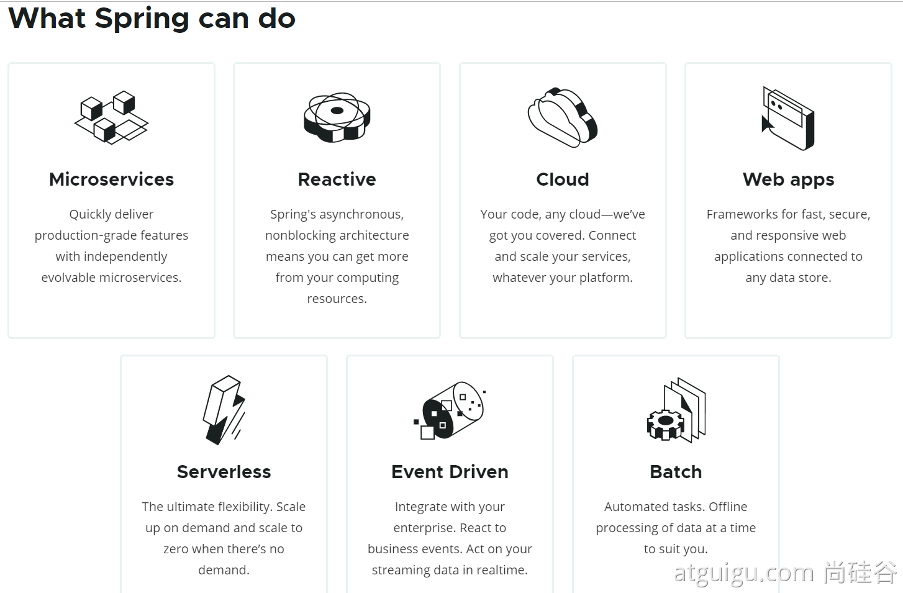
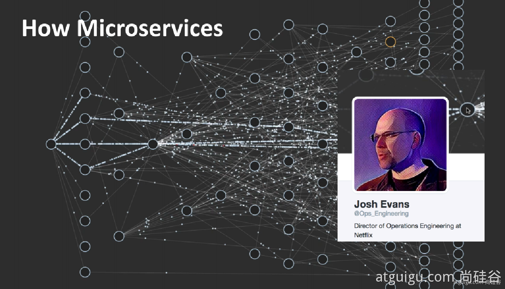
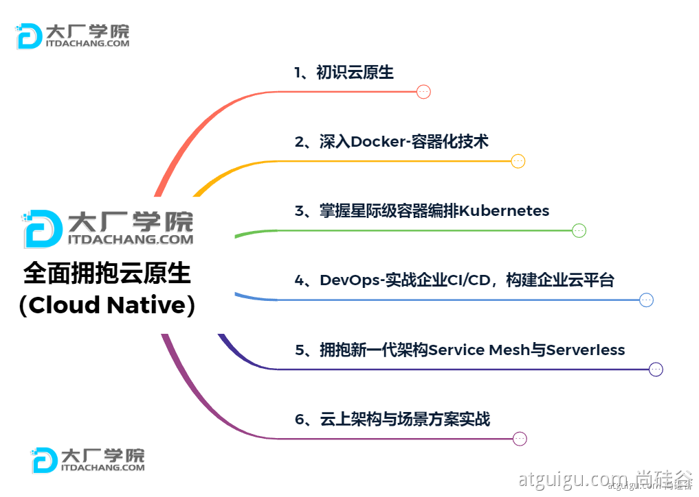
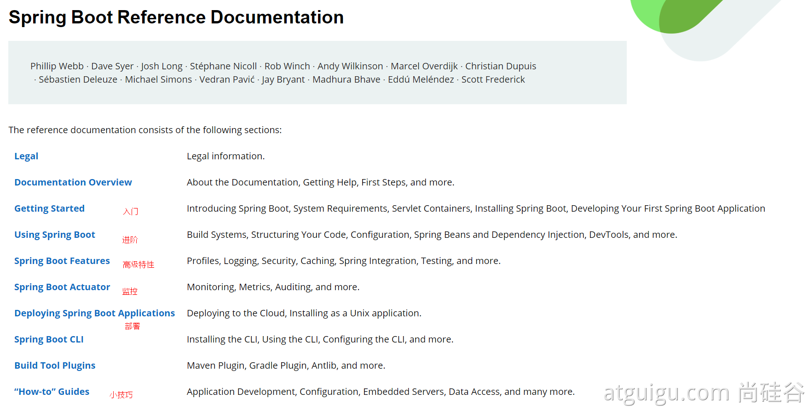

# 1、Spring能做什么

## 1.1、Spring的能力

## 1.2、Spring的生态

https://spring.io/projects/spring-boot

覆盖了：

web开发

数据访问

安全控制

分布式

消息服务

移动开发

批处理

......

## 1.3、Spring5重大升级

### 1.3.1、响应式编程

### 1.3.2、内部源码设计

基于Java8的一些新特性，如：接口默认实现。重新设计源码架构。

# 2、为什么用SpringBoot

Spring Boot makes it easy to create stand-alone, production-grade Spring based Applications that you can "just run".

能快速创建出生产级别的Spring应用

## 2.1、SpringBoot优点

- Create stand-alone Spring applications

- - 创建独立Spring应用

- Embed Tomcat, Jetty or Undertow directly (no need to deploy WAR files)

- - 内嵌web服务器

- Provide opinionated 'starter' dependencies to simplify your build configuration

- - 自动starter依赖，简化构建配置

- Automatically configure Spring and 3rd party libraries whenever possible

- - 自动配置Spring以及第三方功能

- Provide production-ready features such as metrics, health checks, and externalized configuration

- - 提供生产级别的监控、健康检查及外部化配置

- Absolutely no code generation and no requirement for XML configuration

- - 无代码生成、无需编写XML

> SpringBoot是整合Spring技术栈的一站式框架
>
> SpringBoot是简化Spring技术栈的快速开发脚手架

## 2.2、SpringBoot缺点

- 人称版本帝，迭代快，需要时刻关注变化
- 封装太深，内部原理复杂，不容易精通

# 3、时代背景

## 3.1、微服务

[James Lewis and Martin Fowler (2014)](https://martinfowler.com/articles/microservices.html)  提出微服务完整概念。https://martinfowler.com/microservices/

> In short, the **microservice architectural style** is an approach to developing a single application as a **suite of small services**, each **running in its own process** and communicating with **lightweight** mechanisms, often an **HTTP** resource API. These services are **built around business capabilities** and **independently deployable** by fully **automated deployment** machinery. There is a **bare minimum of centralized management** of these services, which may be **written in different programming languages** and use different data storage technologies.-- [James Lewis and Martin Fowler (2014)](https://martinfowler.com/articles/microservices.html)

- 微服务是一种架构风格
- 一个应用拆分为一组小型服务

- 每个服务运行在自己的进程内，也就是可独立部署和升级
- 服务之间使用轻量级HTTP交互

- 服务围绕业务功能拆分
- 可以由全自动部署机制独立部署

- 去中心化，服务自治。服务可以使用不同的语言、不同的存储技术

## 3.2、分布式

### 分布式的困难

- 远程调用
- 服务发现

- 负载均衡
- 服务容错

- 配置管理
- 服务监控

- 链路追踪
- 日志管理

- 任务调度
- ......

### 分布式的解决

- SpringBoot + SpringCloud

## 3.3、云原生

原生应用如何上云。 Cloud Native

### 上云的困难

- 服务自愈
- 弹性伸缩

- 服务隔离
- 自动化部署

- 灰度发布
- 流量治理

- ......

### 上云的解决

# 4、如何学习SpringBoot

## 4.1、官网文档架构

查看版本新特性；

https://github.com/spring-projects/spring-boot/wiki#release-notes

