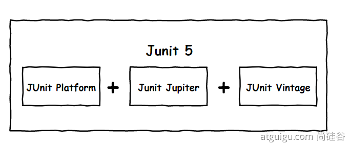
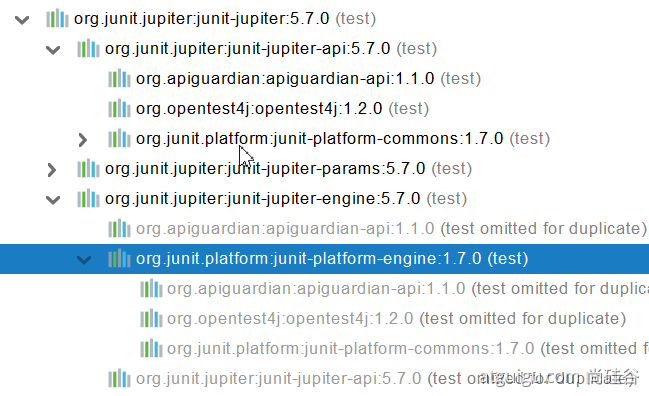

# 1、JUnit5 的变化

**Spring Boot 2.2.0 版本开始引入 JUnit 5 作为单元测试默认库**

作为最新版本的JUnit框架，JUnit5与之前版本的Junit框架有很大的不同。由三个不同子项目的几个不同模块组成。

**JUnit 5 = JUnit Platform + JUnit Jupiter + JUnit Vintage**

**JUnit Platform**: Junit Platform是在JVM上启动测试框架的基础，不仅支持Junit自制的测试引擎，其他测试引擎也都可以接入。

**JUnit Jupiter**: JUnit Jupiter提供了JUnit5的新的编程模型，是JUnit5新特性的核心。内部 包含了一个**测试引擎**，用于在Junit Platform上运行。

**JUnit Vintage**: 由于JUint已经发展多年，为了照顾老的项目，JUnit Vintage提供了兼容JUnit4.x,Junit3.x的测试引擎。



注意：

**SpringBoot 2.4 以上版本移除了默认对** **Vintage 的依赖。如果需要兼容junit4需要自行引入（不能使用junit4的功能 @Test****）**

**JUnit 5’s Vintage Engine Removed from** `**spring-boot-starter-test,如果需要继续兼容junit4需要自行引入vintage**`

```xml

<!--兼容和junit4版本  -->
<dependency>
    <groupId>org.junit.vintage</groupId>
    <artifactId>junit-vintage-engine</artifactId>
    <scope>test</scope>
    <exclusions>
        <exclusion>
            <groupId>org.hamcrest</groupId>
            <artifactId>hamcrest-core</artifactId>
        </exclusion>
    </exclusions>
</dependency>
```





```xml
<dependency>
  <groupId>org.springframework.boot</groupId>
  <artifactId>spring-boot-starter-test</artifactId>
  <scope>test</scope>
</dependency>
```

现在版本：

```java
@SpringBootTest
class Boot05WebAdminApplicationTests {


    @Test
    void contextLoads() {

    }
}
```


以前：

@SpringBootTest + @RunWith(SpringTest.class)


SpringBoot整合Junit以后。

- 编写测试方法：@Test标注（注意需要使用 org.junit.**jupiter**.api.junit5版本的注解）
- Junit类具有Spring的功能，@Autowired、比如 **@Transactional 标注测试方法，测试完成后自动回滚**


# 2、JUnit5常用注解

JUnit5的注解与JUnit4的注解有所变化

https://junit.org/junit5/docs/current/user-guide/#writing-tests-annotations

- **@Test :**表示方法是测试方法。但是与JUnit4的@Test不同，他的职责非常单一不能声明任何属性，拓展的测试将会由Jupiter提供额外测试
- **@ParameterizedTest :**表示方法是参数化测试，下方会有详细介绍
- **@RepeatedTest :**表示方法可重复执行，下方会有详细介绍
- **@DisplayName :**为测试类或者测试方法设置展示名称
- **@BeforeEach :**表示在每个单元测试之前执行
- **@AfterEach :**表示在每个单元测试之后执行
- **@BeforeAll :**表示在所有单元测试之前执行
- **@AfterAll :**表示在所有单元测试之后执行
- **@Tag :**表示单元测试类别，类似于JUnit4中的@Categories
- **@Disabled :**表示测试类或测试方法不执行，类似于JUnit4中的@Ignore
- **@Timeout :**表示测试方法运行如果超过了指定时间将会返回错误
- **@ExtendWith :**为测试类或测试方法提供扩展类引用

```java
import org.junit.jupiter.api.Test; //注意这里使用的是jupiter的Test注解！！

import java.util.concurrent.TimeUnit;

/*
	@BootstrapWith(SpringBootTestContextBootstrapper.class)
	@ExtendWith({SpringExtension.class})
	public @interface SpringBootTest {
*/
@SpringBootTest//需要使用spring的容器功能 添加
@DisplayName("junit5功能测试类")
public class Junit5Test {

    @BeforeAll
    static void testBeforeAll() {//必须是static
        System.out.println("所有测试就要开始了...");
    }

    @BeforeEach
    void testBeforeEach() {
        System.out.println("测试就要开始了...");
    }


//    @Disabled //是否禁用
    @RepeatedTest(2)//重复2次
    @Timeout(value = 3,unit = TimeUnit.SECONDS)//执行超过3秒超时
    @Test
    @DisplayName("测试方法2")
    void test2()  {

        System.out.println(2);
    }

    @AfterEach
    void testAfterEach() {
        System.out.println("测试结束了...");
    }


    @AfterAll
    static void testAfterAll() {//必须是static
        System.out.println("所有测试以及结束了...");

    }
}


所有测试就要开始了...
测试就要开始了...
2
测试结束了...
测试就要开始了...
2
测试结束了...
测试就要开始了...
2
测试结束了...
所有测试以及结束了...

进程已结束,退出代码0
```


# 3、断言（assertions）

断言（assertions）是测试方法中的核心部分，用来对测试需要满足的条件进行验证。**这些断言方法都是 org.junit.jupiter.api.Assertions 的静态方法**。JUnit 5 内置的断言可以分成如下几个类别：

**检查业务逻辑返回的数据是否合理。**

**所有的测试运行结束以后，会有一个详细的测试报告；**

## 1、简单断言

用来对单个值进行简单的验证。如：

| 方法            | 说明                                 |
| --------------- | ------------------------------------ |
| assertEquals    | 判断两个对象或两个原始类型是否相等   |
| assertNotEquals | 判断两个对象或两个原始类型是否不相等 |
| assertSame      | 判断两个对象引用是否指向同一个对象   |
| assertNotSame   | 判断两个对象引用是否指向不同的对象   |
| assertTrue      | 判断给定的布尔值是否为 true          |
| assertFalse     | 判断给定的布尔值是否为 false         |
| assertNull      | 判断给定的对象引用是否为 null        |
| assertNotNull   | 判断给定的对象引用是否不为 null      |

```java
@Test
@DisplayName("simple assertion")
public void simple() {
     assertEquals(3, 1 + 2, "simple math");
     assertNotEquals(3, 1 + 1);

     assertNotSame(new Object(), new Object());//前面断言失败，后面的代码都不会执行
     Object obj = new Object();
     assertSame(obj, obj);

     assertFalse(1 > 2);
     assertTrue(1 < 2);

     assertNull(null);
     assertNotNull(new Object());
}
```


## 2、数组断言

通过 assertArrayEquals 方法来判断两个对象或原始类型的数组是否相等，判断每个索引位置是否相等

```java
@Test
@DisplayName("array assertion")
public void array() {
 	assertArrayEquals(new int[]{1, 2}, new int[] {1, 2});
}
```


## 3、组合断言

assertAll 方法接受多个 org.junit.jupiter.api.Executable 函数式接口的实例作为要验证的断言，可以通过 lambda 表达式很容易的提供这些断言


```java
@Test
@DisplayName("assert all")
public void all() {
     assertAll("Math",
        () -> assertEquals(2, 1 + 1),
        () -> assertTrue(1 > 0)
     );
}
```


## 4、异常断言

在JUnit4时期，想要测试方法的异常情况时，需要用**@Rule**注解的ExpectedException变量还是比较麻烦的。而JUnit5提供了一种新的断言方式**Assertions.assertThrows()** ,配合函数式编程就可以进行使用。

```java
@Test
@DisplayName("异常测试")
public void exceptionTest() {
       assertThrows(ArithmeticException.class, () -> {
            int i = 5 / 1;
        },"未抛出运算异常" );//扔出断言异常
}
```


## 5、超时断言

Junit5还提供了**Assertions.assertTimeout()** 为测试方法设置了超时时间

```java
@Test
@DisplayName("超时测试")
public void timeoutTest() {
    //如果测试方法时间超过1s将会异常
    Assertions.assertTimeout(Duration.ofMillis(1000), () -> Thread.sleep(500));
}
```


## 6、快速失败

通过 fail 方法直接使得测试失败

```java
@Test
@DisplayName("fail")
public void shouldFail() {
 fail("This should fail");
}
```


# 4、前置条件（assumptions）

JUnit 5 中的前置条件（**assumptions【假设】**）类似于断言，不同之处在于**不满足的断言会使得测试方法失败**，而不满足的**前置条件只会使得测试方法的执行终止**。前置条件可以看成是测试方法执行的前提，当该前提不满足时，就没有继续执行的必要。

```java
@DisplayName("前置条件")
public class AssumptionsTest {
 private final String environment = "DEV";
 
 @Test
 @DisplayName("simple")
 public void simpleAssume() {
    assumeTrue(Objects.equals(this.environment, "DEV"));
    assumeFalse(() -> Objects.equals(this.environment, "PROD"));
 }
 
 @Test
 @DisplayName("assume then do")
 public void assumeThenDo() {
    assumingThat(
       Objects.equals(this.environment, "DEV"),
       () -> System.out.println("In DEV")
    );
 }
}
```

assumeTrue 和 assumFalse 确保给定的条件为 true 或 false，不满足条件会使得测试执行终止。

assumingThat 的参数是表示条件的布尔值和对应的 Executable 接口的实现对象。只有条件满足时，Executable 对象才会被执行；当条件不满足时，测试执行并不会终止。


# 5、嵌套测试

JUnit 5 可以通过 Java 中的内部类和@Nested 注解实现嵌套测试，从而可以更好的把相关的测试方法组织在一起。在内部类中可以使用@BeforeEach 和@AfterEach 注解，而且嵌套的层次没有限制。


```java
@DisplayName("A stack")
class TestingAStackDemo {

    Stack<Object> stack;

    @Test
    @DisplayName("is instantiated with new Stack()")
    void isInstantiatedWithNew() {
        new Stack<>();
         //嵌套测试情况下，外层的Test不能驱动内层的Before(After)Each/All之类的方法提前/之后运行
        assertNull(stack);
    }

    @Nested
    @DisplayName("when new")
    class WhenNew {

        @BeforeEach
        void createNewStack() {
            stack = new Stack<>();
        }

        @Test
        @DisplayName("is empty")
        void isEmpty() {
            assertTrue(stack.isEmpty());
        }

        @Test
        @DisplayName("throws EmptyStackException when popped")
        void throwsExceptionWhenPopped() {
            assertThrows(EmptyStackException.class, stack::pop);
        }

        @Test
        @DisplayName("throws EmptyStackException when peeked")
        void throwsExceptionWhenPeeked() {
            assertThrows(EmptyStackException.class, stack::peek);
        }

        @Nested
        @DisplayName("after pushing an element")
        class AfterPushing {

            String anElement = "an element";

            @BeforeEach
            void pushAnElement() {
                stack.push(anElement);
            }

           /**
             * 内层的Test可以驱动外层的Before(After)Each/All之类的方法提前/之后运行
             */
            @Test
            @DisplayName("it is no longer empty")
            void isNotEmpty() {
                assertFalse(stack.isEmpty());
            }

            @Test
            @DisplayName("returns the element when popped and is empty")
            void returnElementWhenPopped() {
                assertEquals(anElement, stack.pop());
                assertTrue(stack.isEmpty());
            }

            @Test
            @DisplayName("returns the element when peeked but remains not empty")
            void returnElementWhenPeeked() {
                assertEquals(anElement, stack.peek());
                assertFalse(stack.isEmpty());
            }
        }
    }
}
```


# 6、参数化测试

参数化测试是JUnit5很重要的一个新特性，它使得用不同的参数多次运行测试成为了可能，也为我们的单元测试带来许多便利。


利用**@ValueSource**等注解，指定入参，我们将可以使用不同的参数进行多次单元测试，而不需要每新增一个参数就新增一个单元测试，省去了很多冗余代码。


**@ValueSource**: 为参数化测试指定入参来源，支持八大基础类以及String类型,Class类型

**@NullSource**: 表示为参数化测试提供一个null的入参

**@EnumSource**: 表示为参数化测试提供一个枚举入参

**@CsvFileSource**：表示读取指定CSV文件内容作为参数化测试入参

**@MethodSource**：表示读取指定方法的返回值作为参数化测试入参(注意方法返回需要是一个流)


当然如果参数化测试仅仅只能做到指定普通的入参还达不到让我觉得惊艳的地步。让我真正感到他的强大之处的地方在于他可以支持外部的各类入参。如:CSV,YML,JSON 文件甚至方法的返回值也可以作为入参。只需要去实现**ArgumentsProvider**接口，任何外部文件都可以作为它的入参。

```java
@ParameterizedTest
@ValueSource(strings = {"one", "two", "three"})
@DisplayName("参数化测试1")
public void parameterizedTest1(String string) {
    System.out.println(string);
    Assertions.assertTrue(StringUtils.isNotBlank(string));
}


@ParameterizedTest
@MethodSource("method_")    //指定方法名，参数来源于method_方法
@DisplayName("方法来源参数")
public void testWithExplicitLocalMethodSource(String name) {
    System.out.println(name);
    Assertions.assertNotNull(name);
}

static Stream<String> method_() {
    return Stream.of("apple", "banana");
}
```


# 7、迁移指南

在进行迁移的时候需要注意如下的变化：

- 注解在 org.junit.jupiter.api 包中，断言在 org.junit.jupiter.api.Assertions 类中，前置条件在 org.junit.jupiter.api.Assumptions 类中。
- 把@Before 和@After 替换成@BeforeEach 和@AfterEach。
- 把@BeforeClass 和@AfterClass 替换成@BeforeAll 和@AfterAll。
- 把@Ignore 替换成@Disabled。
- 把@Category 替换成@Tag。
- 把@RunWith、@Rule 和@ClassRule 替换成@ExtendWith。