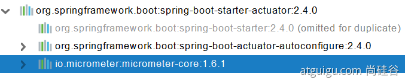
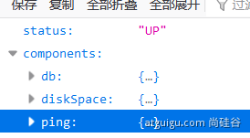
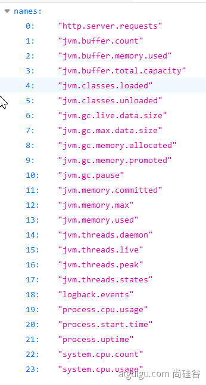
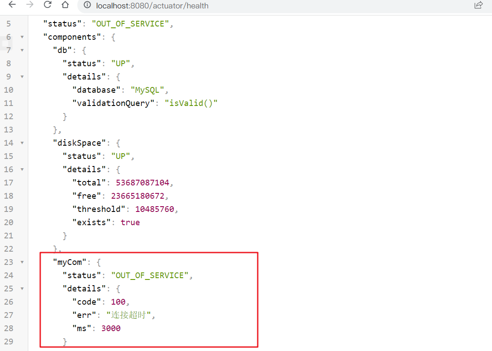

# 1、SpringBoot Actuator

## 1、简介

未来每一个微服务在云上部署以后，我们都需要对其进行监控、追踪、审计、控制等。SpringBoot就抽取了Actuator场景，使得我们每个微服务快速引用即可获得生产级别的应用监控、审计等功能。

```xml
        <dependency>
            <groupId>org.springframework.boot</groupId>
            <artifactId>spring-boot-starter-actuator</artifactId>
        </dependency>
```



## 2、1.x与2.x的不同


## 3、如何使用

- 引入场景
- 访问 http://localhost:8080/actuator   获取所有端点路径
- 暴露所有监控信息为HTTP

```yaml
management:
  endpoints:
    enabled-by-default: true #暴露所有端点信息
    web:
      exposure:
        include: '*'  #以web方式暴露所有端点
```

- 测试

```json
{
  "_links": {
    "self": {
      "href": "http://localhost:8080/actuator",
      "templated": false
    },
    "beans": {
      "href": "http://localhost:8080/actuator/beans",
      "templated": false
    },
    "caches-cache": {
      "href": "http://localhost:8080/actuator/caches/{cache}",
      "templated": true
    },
    "caches": {
      "href": "http://localhost:8080/actuator/caches",
      "templated": false
    },
    "health": {
      "href": "http://localhost:8080/actuator/health",
      "templated": false
    },
    "health-path": {
      "href": "http://localhost:8080/actuator/health/{*path}",
      "templated": true
    },
    "info": {
      "href": "http://localhost:8080/actuator/info",
      "templated": false
    },
    "conditions": {
      "href": "http://localhost:8080/actuator/conditions",
      "templated": false
    },
    "shutdown": {
      "href": "http://localhost:8080/actuator/shutdown",
      "templated": false
    },
    "configprops": {
      "href": "http://localhost:8080/actuator/configprops",
      "templated": false
    },
    "configprops-prefix": {
      "href": "http://localhost:8080/actuator/configprops/{prefix}",
      "templated": true
    },
    "env": {
      "href": "http://localhost:8080/actuator/env",
      "templated": false
    },
    "env-toMatch": {
      "href": "http://localhost:8080/actuator/env/{toMatch}",
      "templated": true
    },
    "loggers": {
      "href": "http://localhost:8080/actuator/loggers",
      "templated": false
    },
    "loggers-name": {
      "href": "http://localhost:8080/actuator/loggers/{name}",
      "templated": true
    },
    "heapdump": {
      "href": "http://localhost:8080/actuator/heapdump",
      "templated": false
    },
    "threaddump": {
      "href": "http://localhost:8080/actuator/threaddump",
      "templated": false
    },
    "metrics-requiredMetricName": {
      "href": "http://localhost:8080/actuator/metrics/{requiredMetricName}",
      "templated": true
    },
    "metrics": {
      "href": "http://localhost:8080/actuator/metrics",
      "templated": false
    },
    "scheduledtasks": {
      "href": "http://localhost:8080/actuator/scheduledtasks",
      "templated": false
    },
    "mappings": {
      "href": "http://localhost:8080/actuator/mappings",
      "templated": false
    }
  }
}
```

常用：系统指标

http://localhost:8080/actuator/metrics

http://localhost:8080/actuator/metrics/jvm.gc.pause


语法格式：

[http://localhost:8080/actuator/](http://localhost:8080/actuator/metrics)endpointName/detailPath
。。。。。。


## 4、可视化 

https://github.com/codecentric/spring-boot-admin

#### 服务器端

通过一个web项目对其他项目进行大屏展示

pom

```xml
<?xml version="1.0" encoding="UTF-8"?>
<project xmlns="http://maven.apache.org/POM/4.0.0" xmlns:xsi="http://www.w3.org/2001/XMLSchema-instance"
         xsi:schemaLocation="http://maven.apache.org/POM/4.0.0 https://maven.apache.org/xsd/maven-4.0.0.xsd">
    <modelVersion>4.0.0</modelVersion>
    <parent>
        <groupId>org.springframework.boot</groupId>
        <artifactId>spring-boot-starter-parent</artifactId>
        <version>2.4.0</version>
        <relativePath/> <!-- lookup parent from repository -->
    </parent>
    <groupId>com.atguigu</groupId>
    <artifactId>boot-05-adminserver</artifactId>
    <version>0.0.1-SNAPSHOT</version>
    <name>boot-05-adminserver</name>
    <description>Demo project for Spring Boot</description>

    <properties>
        <java.version>1.8</java.version>
    </properties>

    <dependencies>
        <dependency>
            <groupId>org.springframework.boot</groupId>
            <artifactId>spring-boot-starter-web</artifactId>
        </dependency>

        <dependency>
            <groupId>org.springframework.boot</groupId>
            <artifactId>spring-boot-starter-test</artifactId>
            <scope>test</scope>
        </dependency>

        <dependency>
            <groupId>de.codecentric</groupId>
            <artifactId>spring-boot-admin-starter-server</artifactId>
            <version>2.3.1</version>
        </dependency>
    </dependencies>

    <build>
        <plugins>
            <plugin>
                <groupId>org.springframework.boot</groupId>
                <artifactId>spring-boot-maven-plugin</artifactId>
            </plugin>
        </plugins>
    </build>

</project>
```


主配置类

```java
@EnableAdminServer//开启监控服务
@SpringBootApplication
public class Boot05AdminserverApplication {

    public static void main(String[] args) {
        SpringApplication.run(Boot05AdminserverApplication.class, args);
    }
}
```


#### 客户端：

pom

```xml
<dependency>
    <groupId>de.codecentric</groupId>
    <artifactId>spring-boot-admin-starter-client</artifactId>
    <version>2.5.1</version>
</dependency>
```


配置文件  展示服务器地址

```yaml
spring:
  boot:
    admin:
      client:
        url: http://localhost:8888
        instance:
          prefer-ip: true  #使用ip注册进来
  application:
    name: boot-05-web-admin
```


# 2、Actuator Endpoint

## 1、最常使用的端点


| ID                 | 描述                                                         |
| ------------------ | ------------------------------------------------------------ |
| `auditevents`      | 暴露当前应用程序的审核事件信息。需要一个`AuditEventRepository组件`。 |
| `beans`            | 显示应用程序中所有Spring Bean的完整列表。                    |
| `caches`           | 暴露可用的缓存。                                             |
| `conditions`       | 显示自动配置的所有条件信息，包括匹配或不匹配的原因。         |
| `configprops`      | 显示所有`@ConfigurationProperties`。                         |
| `env`              | 暴露Spring的属性`ConfigurableEnvironment`                    |
| `flyway`           | 显示已应用的所有Flyway数据库迁移。 需要一个或多个`Flyway`组件。 |
| `health`           | 显示应用程序运行状况信息。                                   |
| `httptrace`        | 显示HTTP跟踪信息（默认情况下，最近100个HTTP请求-响应）。需要一个`HttpTraceRepository`组件。 |
| `info`             | 显示应用程序信息。                                           |
| `integrationgraph` | 显示Spring `integrationgraph` 。需要依赖`spring-integration-core`。 |
| `loggers`          | 显示和修改应用程序中日志的配置。                             |
| `liquibase`        | 显示已应用的所有Liquibase数据库迁移。需要一个或多个`Liquibase`组件。 |
| `metrics`          | 显示当前应用程序的“指标”信息。                               |
| `mappings`         | 显示所有`@RequestMapping`路径列表。                          |
| `scheduledtasks`   | 显示应用程序中的计划任务。                                   |
| `sessions`         | 允许从Spring Session支持的会话存储中检索和删除用户会话。需要使用Spring Session的基于Servlet的Web应用程序。 |
| `shutdown`         | 使应用程序正常关闭。默认禁用。                               |
| `startup`          | 显示由`ApplicationStartup`收集的启动步骤数据。需要使用`SpringApplication`进行配置`BufferingApplicationStartup`。 |
| `threaddump`       | 执行线程转储。                                               |


如果您的应用程序是Web应用程序（Spring MVC，Spring WebFlux或Jersey），则可以使用以下附加端点：

| ID           | 描述                                                         |
| ------------ | ------------------------------------------------------------ |
| `heapdump`   | 返回`hprof`堆转储文件。                                      |
| `jolokia`    | 通过HTTP暴露JMX bean（需要引入Jolokia，不适用于WebFlux）。需要引入依赖`jolokia-core`。 |
| `logfile`    | 返回日志文件的内容（如果已设置`logging.file.name`或`logging.file.path`属性）。支持使用HTTP`Range`标头来检索部分日志文件的内容。 |
| `prometheus` | 以Prometheus服务器可以抓取的格式公开指标。需要依赖`micrometer-registry-prometheus`。 |


最常用的Endpoint

- **Health：监控状况**
- **Metrics：运行时指标**
- **Loggers：日志记录**


## 2、Health Endpoint

健康检查端点，我们一般用于在云平台，平台会定时的检查应用的健康状况，我们就需要Health Endpoint可以为平台返回当前应用的一系列组件健康状况的集合。

重要的几点：

- health endpoint返回的结果，应该是一系列健康检查后的一个汇总报告
- 很多的健康检查默认已经自动配置好了，比如：数据库、redis等
- 可以很容易的添加自定义的健康检查机制



## 3、Metrics Endpoint

提供详细的、层级的、空间指标信息，这些信息可以被pull（主动推送）或者push（被动获取）方式得到；

- 通过Metrics对接多种监控系统
- 简化核心Metrics开发
- 添加自定义Metrics或者扩展已有Metrics





## 4、管理Endpoints

### 1、开启与禁用Endpoints

- 默认所有的Endpoint除过shutdown都是开启的。
- 需要开启或者禁用某个Endpoint。配置模式为  `management.endpoint.<endpointName>.enabled= true` 

```yaml
management:
  endpoint:
    beans:
      enabled: true
```

- 或者禁用所有的Endpoint然后手动开启指定的Endpoint

```yaml
management:
  endpoints:
    enabled-by-default: false
  endpoint:
    beans:
      enabled: true
    health:
      enabled: true
```


### 2、暴露Endpoints

支持的暴露方式

- HTTP：默认只暴露**health**和**info** Endpoint
- **JMX**：默认暴露所有Endpoint
- 除过health和info，剩下的Endpoint都应该进行保护访问。如果引入SpringSecurity，则会默认配置安全访问规则

| ID                 | JMX  | Web  |
| ------------------ | ---- | ---- |
| `auditevents`      | Yes  | No   |
| `beans`            | Yes  | No   |
| `caches`           | Yes  | No   |
| `conditions`       | Yes  | No   |
| `configprops`      | Yes  | No   |
| `env`              | Yes  | No   |
| `flyway`           | Yes  | No   |
| `health`           | Yes  | Yes  |
| `heapdump`         | N/A  | No   |
| `httptrace`        | Yes  | No   |
| `info`             | Yes  | Yes  |
| `integrationgraph` | Yes  | No   |
| `jolokia`          | N/A  | No   |
| `logfile`          | N/A  | No   |
| `loggers`          | Yes  | No   |
| `liquibase`        | Yes  | No   |
| `metrics`          | Yes  | No   |
| `mappings`         | Yes  | No   |
| `prometheus`       | N/A  | No   |
| `scheduledtasks`   | Yes  | No   |
| `sessions`         | Yes  | No   |
| `shutdown`         | Yes  | No   |
| `startup`          | Yes  | No   |
| `threaddump`       | Yes  | No   |


# 3、定制 Endpoint

## 1、定制 Health 信息

```java
import org.springframework.boot.actuate.health.Health;
import org.springframework.boot.actuate.health.HealthIndicator;
import org.springframework.stereotype.Component;

@Component
public class MyHealthIndicator implements HealthIndicator {

    @Override
    public Health health() {
        int errorCode = check(); // perform some specific health check
        if (errorCode != 0) {
            return Health.down().withDetail("Error Code", errorCode).build();
        }
        return Health.up().build();
    }

}

构建Health
Health build = Health.down()
                .withDetail("msg", "error service")
                .withDetail("code", "500")
                .withException(new RuntimeException())
                .build();

```

```yaml
management:
    health:
      enabled: true
      show-details: always #总是显示详细信息。可显示每个模块的状态信息
```


```java
@Component
public class MyComHealthIndicator extends AbstractHealthIndicator {

    /**
     * 真实的检查方法
     * @param builder
     * @throws Exception
     */
    @Override
    protected void doHealthCheck(Health.Builder builder) throws Exception {
        //mongodb。  获取连接进行测试
        Map<String,Object> map = new HashMap<>();
        // 检查完成
        if(1 == 2){
//            builder.up(); //健康
            builder.status(Status.UP);
            map.put("count",1);
            map.put("ms",100);
        }else {
//            builder.down();
            builder.status(Status.OUT_OF_SERVICE);
            map.put("err","连接超时");
            map.put("ms",3000);
        }


        builder.withDetail("code",100)
                .withDetails(map);

    }
}
```

> 需要开启`management.endpoint.health.show-details=always`



## 2、定制info信息

常用两种方式

#### 1、编写配置文件

```yaml
info:
  appName: boot-admin
  version: 2.0.1
  mavenProjectName: @project.artifactId@  #使用@@可以获取maven的pom文件值
  mavenProjectVersion: @project.version@
```

#### 2、编写InfoContributor

```java
import java.util.Collections;

import org.springframework.boot.actuate.info.Info;
import org.springframework.boot.actuate.info.InfoContributor;
import org.springframework.stereotype.Component;

@Component
public class ExampleInfoContributor implements InfoContributor {
    @Override
    public void contribute(Info.Builder builder) {
        builder.withDetail("example",
                Collections.singletonMap("key", "value"));
    }
}
```


http://localhost:8080/actuator/info 会输出以上方式返回的所有info信息

## 3、定制Metrics信息

#### 1、SpringBoot支持自动适配的Metrics

- JVM metrics, report utilization of:

- - Various memory and buffer pools
  - Statistics related to garbage collection
  - Threads utilization
  - Number of classes loaded/unloaded

- CPU metrics
- File descriptor metrics
- Kafka consumer and producer metrics
- Log4j2 metrics: record the number of events logged to Log4j2 at each level
- Logback metrics: record the number of events logged to Logback at each level
- Uptime metrics: report a gauge for uptime and a fixed gauge representing the application’s absolute start time
- Tomcat metrics (`server.tomcat.mbeanregistry.enabled` must be set to `true` for all Tomcat metrics to be registered)
- [Spring Integration](https://docs.spring.io/spring-integration/docs/5.4.1/reference/html/system-management.html#micrometer-integration) metrics


#### 2、增加定制Metrics

```java
@Service
class MyService{
    Counter counter;
    public MyService(MeterRegistry meterRegistry){//通过构造器注入MeterRegistry
         counter = meterRegistry.counter("myservice.method.running.counter");//指标名
    }

    public void hello() {
        counter.increment();
    }
}


```


```java
//也可以使用下面的方式
@Bean
MeterBinder queueSize(Queue queue) {
    return (registry) -> Gauge.builder("queueSize", queue::size).register(registry);
}
```


## 4、定制Endpoint

```java
@Component
@Endpoint(id = "container")
public class DockerEndpoint {


    @ReadOperation
    public Map getDockerInfo(){
        return Collections.singletonMap("info","docker started...");
    }

    @WriteOperation
    private void restartDocker(){
        System.out.println("docker restarted....");
    }
}
```

场景：开发**ReadinessEndpoint**来管理程序是否就绪，或者**Liveness****Endpoint**来管理程序是否存活；

当然，这个也可以直接使用 https://docs.spring.io/spring-boot/docs/current/reference/html/production-ready-features.html#production-ready-kubernetes-probes


更多内容参照：大厂学院