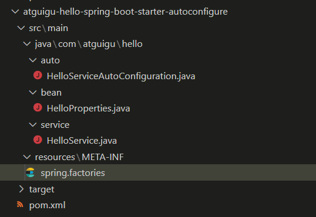
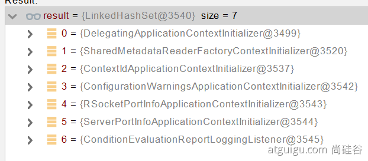
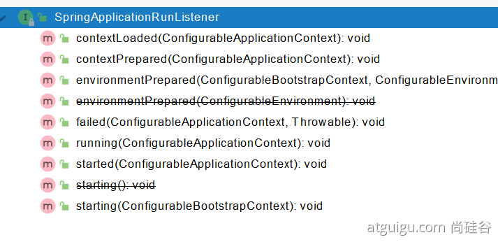
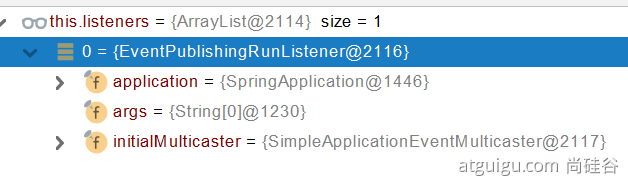

# 1、Profile功能

为了方便多环境适配，springboot简化了profile功能。

## 1、application-profile功能

- 默认配置文件  application.yaml；任何时候都会加载
- 指定环境配置文件  `application-{env}.yaml`
- 激活指定环境

- - 配置文件激活`spring.profiles.active=env`
  - 命令行激活：`java -jar xxx.jar` **`--spring.profiles.active=prod`** **`--person.name=haha`**  覆盖配置文件中active、person.name的值  

- - - **修改配置文件的任意值，命令行优先**

- 默认配置与环境配置同时生效
- 同名配置项，profile配置优先

## 2、@Profile条件装配功能

```java
@Configuration(proxyBeanMethods = false)
@Profile("production")//如果是production环境，则进行配置
public class ProductionConfiguration {

    // ...

}
```

## 3、profile分组

```properties
# 组名production，加载proddb、prodmq这两个环境配置
spring.profiles.group.production[0]=proddb
spring.profiles.group.production[1]=prodmq

使用：--spring.profiles.active=production  激活
```


# 2、外部化配置

https://docs.spring.io/spring-boot/docs/current/reference/html/spring-boot-features.html#boot-features-external-config

## 

1. Default properties (specified by setting `SpringApplication.setDefaultProperties`).
2. `@PropertySource` annotations on your `@Configuration` classes. Please note that such property sources are not added to the `Environment` until the application context is being refreshed. This is too late to configure certain properties such as `logging.*` and `spring.main.*` which are read before refresh begins.
3. **Config data (such as** `**application.properties**` **files)**
4. A `RandomValuePropertySource` that has properties only in `random.*`.
5. OS environment variables.
6. Java System properties (`System.getProperties()`).
7. JNDI attributes from `java:comp/env`.
8. `ServletContext` init parameters.
9. `ServletConfig` init parameters.
10. Properties from `SPRING_APPLICATION_JSON` (inline JSON embedded in an environment variable or system property).
11. Command line arguments.
12. `properties` attribute on your tests. Available on `@SpringBootTest` and the [test annotations for testing a particular slice of your application](https://docs.spring.io/spring-boot/docs/current/reference/html/spring-boot-features.html#boot-features-testing-spring-boot-applications-testing-autoconfigured-tests).
13. `@TestPropertySource` annotations on your tests.
14. [Devtools global settings properties](https://docs.spring.io/spring-boot/docs/current/reference/html/using-spring-boot.html#using-boot-devtools-globalsettings) in the `$HOME/.config/spring-boot` directory when devtools is active.


## 1、外部配置源

常用：**Java属性文件**、**YAML文件**、**环境变量**、**命令行参数**；

```java
    @Value("${person.name:李四}")//如果配置文件中person.name为空，则使用默认值李四
    private String name;
    
    @Value("${MAVEN_HOME}")//获取环境变量  MAVEN_HOME
    private String msg;

    @Value("${os.name}") // 获取系统属性
    private String osName;
```


## 2、配置文件查找位置

(1) classpath 根路径

(2) classpath 根路径下config目录

(3) jar包同级目录

(4) jar包当前目录的config目录

(5) /config子目录的直接子目录

下面的后加载，覆盖前面的配置信息

## 3、配置文件加载顺序：

1. 　当前jar包内部的application.properties和application.yml
2. 　当前jar包内部的application-{profile}.properties 和 application-{profile}.yml
3. 　引用的外部jar包目录的application.properties和application.yml
4. 　引用的外部jar包的application-{profile}.properties 和 application-{profile}.yml

## 4、指定环境优先，外部优先，后面的可以覆盖前面的同名配置项


# 3、自定义starter

## 1、starter启动原理

- starter-pom引入 autoconfigurer 包


- autoconfigure包中配置使用 **META-INF/spring.factories** 中 **EnableAutoConfiguration 的值，使得项目启动加载指定的自动配置类**
- **编写自动配置类 xxxAutoConfiguration -> xxxxProperties**

- - **@Configuration**
  - **@Conditional**
  - **@EnableConfigurationProperties**
  - **@Bean**
  - ......

**引入starter** **--- xxxAutoConfiguration --- 容器中放入组件 ---- 绑定xxxProperties ----** **配置项**

## 2、自定义starter


### 一、**atguigu-hello-spring-boot-starter-autoconfigure（自动配置包）**

创建maven工程



1、自动配置类实现

```java
package com.atguigu.hello.service;

import com.atguigu.hello.bean.HelloProperties;
import org.springframework.beans.factory.annotation.Autowired;


/**
 * 默认不要放在容器中
 */
public class HelloService {

    @Autowired
    HelloProperties helloProperties;

    public String sayHello(String userName){
        return helloProperties.getPrefix() + "："+userName+"》"+helloProperties.getSuffix();
    }
}
```

2、配置类

绑定到atguigu.hello开头的配置

```java
package com.atguigu.hello.bean;


import org.springframework.boot.context.properties.ConfigurationProperties;

@ConfigurationProperties("atguigu.hello")
public class HelloProperties {

    private String prefix;
    private String suffix;

    public String getPrefix() {
        return prefix;
    }

    public void setPrefix(String prefix) {
        this.prefix = prefix;
    }

    public String getSuffix() {
        return suffix;
    }

    public void setSuffix(String suffix) {
        this.suffix = suffix;
    }
}

```

3、自动注册到容器中

```java
package com.atguigu.hello.auto;


import com.atguigu.hello.bean.HelloProperties;
import com.atguigu.hello.service.HelloService;
import org.springframework.boot.autoconfigure.condition.ConditionalOnMissingBean;
import org.springframework.boot.context.properties.EnableConfigurationProperties;
import org.springframework.context.annotation.Bean;
import org.springframework.context.annotation.Configuration;

@Configuration
@EnableConfigurationProperties(HelloProperties.class)  //默认HelloProperties放在容器中
public class HelloServiceAutoConfiguration{

    @ConditionalOnMissingBean(HelloService.class)//条件引入
    @Bean
    public HelloService helloService(){
        HelloService helloService = new HelloService();
        return helloService;
    }
}
```

4、spring.factories

springboot通过扫描改META-INF目录下配置知道HelloServiceAutoConfiguration需要需要配置

```properties
# Auto Configure
org.springframework.boot.autoconfigure.EnableAutoConfiguration=\
com.atguigu.hello.auto.HelloServiceAutoConfiguration
```


### 二、**atguigu-hello-spring-boot-starter（启动器）**

仅仅导入自动配置包

```xml
<?xml version="1.0" encoding="UTF-8"?>
<project xmlns="http://maven.apache.org/POM/4.0.0"
         xmlns:xsi="http://www.w3.org/2001/XMLSchema-instance"
         xsi:schemaLocation="http://maven.apache.org/POM/4.0.0 http://maven.apache.org/xsd/maven-4.0.0.xsd">
    <modelVersion>4.0.0</modelVersion>

    <groupId>com.atguigu</groupId>
    <artifactId>atguigu-hello-spring-boot-starter</artifactId>
    <version>1.0-SNAPSHOT</version>

    <dependencies>
        <dependency>
            <groupId>com.atguigu</groupId>
            <artifactId>atguigu-hello-spring-boot-starter-autoconfigure</artifactId>
            <version>0.0.1-SNAPSHOT</version>
        </dependency>
    </dependencies>

</project>
```

### 三、测试

创建web工程，引入atguigu-hello-spring-boot-starter

```xml
<?xml version="1.0" encoding="UTF-8"?>
<project xmlns="http://maven.apache.org/POM/4.0.0" xmlns:xsi="http://www.w3.org/2001/XMLSchema-instance"
         xsi:schemaLocation="http://maven.apache.org/POM/4.0.0 https://maven.apache.org/xsd/maven-4.0.0.xsd">
    <modelVersion>4.0.0</modelVersion>
    <parent>
        <groupId>org.springframework.boot</groupId>
        <artifactId>spring-boot-starter-parent</artifactId>
        <version>2.4.0</version>
        <relativePath/> <!-- lookup parent from repository -->
    </parent>
    <groupId>com.atguigu</groupId>
    <artifactId>boot-09-hello-test</artifactId>
    <version>0.0.1-SNAPSHOT</version>
    <name>boot-09-hello-test</name>
    <description>Demo project for Spring Boot</description>

    <properties>
        <java.version>1.8</java.version>
    </properties>

    <dependencies>
        <dependency>
            <groupId>org.springframework.boot</groupId>
            <artifactId>spring-boot-starter-web</artifactId>
        </dependency>

        <dependency>
            <groupId>org.springframework.boot</groupId>
            <artifactId>spring-boot-starter-test</artifactId>
            <scope>test</scope>
        </dependency>

        <dependency>
            <groupId>com.atguigu</groupId>
            <artifactId>atguigu-hello-spring-boot-starter</artifactId>
            <version>1.0-SNAPSHOT</version>
        </dependency>
    </dependencies>

    <build>
        <plugins>
            <plugin>
                <groupId>org.springframework.boot</groupId>
                <artifactId>spring-boot-maven-plugin</artifactId>
            </plugin>
        </plugins>
    </build>

</project>
```

注入自动配置的类，测试

```java
@RestController
public class HelloController {

    @Autowired
    HelloService helloService;

    @GetMapping("/hello")
    public String sayHello(){

        String s = helloService.sayHello("张三");
        return s;
    }
}
```

自己注册bean，因为  @ConditionalOnMissingBean(HelloService.class)//条件引入  不在自动配置

```java
@Configuration
public class MyConfig {

    @Bean
    public HelloService helloService(){
        HelloService helloService = new HelloService();

        return helloService;
    }
}
```


# 4、SpringBoot原理

Spring原理【[Spring注解](https://www.bilibili.com/video/BV1gW411W7wy?p=1)】、**SpringMVC**原理、**自动配置原理**、SpringBoot原理

## 1、SpringBoot启动过程

- 创建 **SpringApplication**

- - 保存一些信息。
  - 判定当前应用的类型。ClassUtils。Servlet
  - **bootstrappers****：初始启动引导器（**List<Bootstrapper>**）：去spring.factories文件中找** org.springframework.boot.**Bootstrapper**
  - 找 **ApplicationContextInitializer**；去**spring.factories****找** <span style="color: red;background-color: yellow;">ApplicationContextInitializer</span> 

- - - List<ApplicationContextInitializer<?>> **initializers**

- - **找** **ApplicationListener  ；应用监听器。**去**spring.factories****找** <span style="color: red;background-color: yellow;">ApplicationListener</span>  

- - - List<ApplicationListener<?>> **listeners**

- 运行 **SpringApplication**

- - **StopWatch**
  - **记录应用的启动时间**
  - **创建引导上下文（Context环境）****createBootstrapContext()**

- - - 获取到所有之前的 **bootstrappers 挨个执行** intitialize() 来完成对引导启动器上下文环境设置

- - 让当前应用进入**headless**模式。**java.awt.headless**
  - **获取所有** **RunListener****（运行监听器）【为了方便所有Listener进行事件感知】**

- - - getSpringFactoriesInstances 去**spring.factories****找 <span style="color: red;background-color: yellow;">SpringApplicationRunListener</span>  . 

- - 遍历 **SpringApplicationRunListener 调用 starting 方法；**

- - - **相当于通知所有感兴趣系统正在启动过程的人，项目正在 starting。**【事件触发回调】

- - 保存命令行参数；ApplicationArguments
  - 准备环境 prepareEnvironment（）;

- - - 返回或者创建基础环境信息对象。**StandardServletEnvironment**
    - **配置环境信息对象。**

- - - - **读取所有的配置源的配置属性值。**

- - - 绑定环境信息
    - 监听器调用 listener.environmentPrepared()；通知所有的监听器当前环境准备完成

- - 创建IOC容器（createApplicationContext（））

- - - 根据项目类型（Servlet）创建容器，
    - 当前会创建 **AnnotationConfigServletWebServerApplicationContext**

- - **准备ApplicationContext IOC容器的基本信息**  **prepareContext()**

- - - 保存环境信息
    - IOC容器的后置处理流程。
    - 应用初始化器；applyInitializers；

- - - - 遍历所有的 **ApplicationContextInitializer 。调用** **initialize.。来对ioc容器进行初始化扩展功能**
      - 遍历所有的 listener 调用 **contextPrepared。EventPublishRunListenr；通知所有的监听器****contextPrepared**

- - - **所有的监听器 调用** **contextLoaded。通知所有的监听器** **contextLoaded；**

- - **刷新IOC容器。**refreshContext

- - - 创建容器中的所有组件（Spring注解）

- - 容器刷新完成后工作？afterRefresh
  - 所有监听 器 调用 listeners.**started**(context); **通知所有的监听器** **started**
  - **调用所有runners；**callRunners()

- - - **获取容器中的**   <span style="color: red;background-color: yellow;">ApplicationRunner</span> 
    - **获取容器中的**   <span style="color: red;background-color: yellow;">CommandLineRunner</span> 
    - **合并所有runner并且按照@Order进行排序**
    - **遍历所有的runner。调用 run** **方法**

- - **如果以上有异常，**

- - - **调用Listener 的 failed**

- - **调用所有监听器的 running 方法**  listeners.running(context); **通知所有的监听器** **running** 
  - **running如果有问题。继续通知 failed 。****调用所有 Listener 的** **failed；****通知所有的监听器** **failed**


```java
public interface Bootstrapper {

	/**
	 * Initialize the given {@link BootstrapRegistry} with any required registrations.
	 * @param registry the registry to initialize
	 */
	void intitialize(BootstrapRegistry registry);

}
```








```java
@FunctionalInterface
public interface ApplicationRunner {

	/**
	 * Callback used to run the bean.
	 * @param args incoming application arguments
	 * @throws Exception on error
	 */
	void run(ApplicationArguments args) throws Exception;

}
@FunctionalInterface
public interface CommandLineRunner {

	/**
	 * Callback used to run the bean.
	 * @param args incoming main method arguments
	 * @throws Exception on error
	 */
	void run(String... args) throws Exception;

}
```

```java
	//org.springframework.context.ConfigurableApplicationContext
public ConfigurableApplicationContext run(String... args) {
		long startTime = System.nanoTime();//记录开始时间
		DefaultBootstrapContext bootstrapContext = createBootstrapContext();//创建引导上下文（Context环境）
		ConfigurableApplicationContext context = null;
		configureHeadlessProperty();
		SpringApplicationRunListeners listeners = getRunListeners(args);
		listeners.starting(bootstrapContext, this.mainApplicationClass);//监听器   项目开始事件
		try {
			ApplicationArguments applicationArguments = new DefaultApplicationArguments(args);//保存命令行参数
			ConfigurableEnvironment environment = prepareEnvironment(listeners, bootstrapContext, applicationArguments);//准备环境 
			configureIgnoreBeanInfo(environment);
			Banner printedBanner = printBanner(environment);//打印banner
			context = createApplicationContext();//创建ioc容器
			context.setApplicationStartup(this.applicationStartup);
			prepareContext(bootstrapContext, context, environment, listeners, applicationArguments, printedBanner);
			refreshContext(context);
			afterRefresh(context, applicationArguments);
			Duration timeTakenToStartup = Duration.ofNanos(System.nanoTime() - startTime);
			if (this.logStartupInfo) {
				new StartupInfoLogger(this.mainApplicationClass).logStarted(getApplicationLog(), timeTakenToStartup);
			}
			listeners.started(context, timeTakenToStartup);
			callRunners(context, applicationArguments);
		}
		catch (Throwable ex) {
			handleRunFailure(context, ex, listeners);
			throw new IllegalStateException(ex);
		}
		try {
			Duration timeTakenToReady = Duration.ofNanos(System.nanoTime() - startTime);
			listeners.ready(context, timeTakenToReady);
		}
		catch (Throwable ex) {
			handleRunFailure(context, ex, null);
			throw new IllegalStateException(ex);
		}
		return context;
	}
```


## 2、Application Events and Listeners

https://docs.spring.io/spring-boot/docs/current/reference/html/spring-boot-features.html#boot-features-application-events-and-listeners

**ApplicationContextInitializer**


```java
package com.atguigu.boot.listener;

import org.springframework.context.ApplicationContextInitializer;
import org.springframework.context.ConfigurableApplicationContext;

public class MyApplicationContextInitializer implements ApplicationContextInitializer {
    @Override
    public void initialize(ConfigurableApplicationContext applicationContext) {
        System.out.println("MyApplicationContextInitializer ....initialize.... ");
    }
}
```


**ApplicationListener**

```java
package com.atguigu.boot.listener;

import org.springframework.context.ApplicationEvent;
import org.springframework.context.ApplicationListener;

public class MyApplicationListener implements ApplicationListener {
    @Override
    public void onApplicationEvent(ApplicationEvent event) {
        System.out.println("MyApplicationListener.....onApplicationEvent...");
    }
}
```


**SpringApplicationRunListener**

```java
package com.atguigu.boot.listener;

import org.springframework.boot.ConfigurableBootstrapContext;
import org.springframework.boot.SpringApplication;
import org.springframework.boot.SpringApplicationRunListener;
import org.springframework.context.ConfigurableApplicationContext;
import org.springframework.core.env.ConfigurableEnvironment;

public class MySpringApplicationRunListener implements SpringApplicationRunListener {

    private SpringApplication application;
    public MySpringApplicationRunListener(SpringApplication application, String[] args){
        this.application = application;
    }

    @Override
    public void starting(ConfigurableBootstrapContext bootstrapContext) {
        System.out.println("MySpringApplicationRunListener....starting....");

    }


    @Override
    public void environmentPrepared(ConfigurableBootstrapContext bootstrapContext, ConfigurableEnvironment environment) {
        System.out.println("MySpringApplicationRunListener....environmentPrepared....");
    }


    @Override
    public void contextPrepared(ConfigurableApplicationContext context) {
        System.out.println("MySpringApplicationRunListener....contextPrepared....");

    }

    @Override
    public void contextLoaded(ConfigurableApplicationContext context) {
        System.out.println("MySpringApplicationRunListener....contextLoaded....");
    }

    @Override
    public void started(ConfigurableApplicationContext context) {
        System.out.println("MySpringApplicationRunListener....started....");
    }

    @Override
    public void running(ConfigurableApplicationContext context) {
        System.out.println("MySpringApplicationRunListener....running....");
    }

    @Override
    public void failed(ConfigurableApplicationContext context, Throwable exception) {
        System.out.println("MySpringApplicationRunListener....failed....");
    }
}
```


配置注册监听器：

`src\main\resources\META-INF\spring.factories`

```properties
org.springframework.context.ApplicationContextInitializer=\
  com.atguigu.boot.listener.MyApplicationContextInitializer

org.springframework.context.ApplicationListener=\
  com.atguigu.boot.listener.MyApplicationListener

org.springframework.boot.SpringApplicationRunListener=\
  com.atguigu.boot.listener.MySpringApplicationRunListener
```


## 3、ApplicationRunner 与 CommandLineRunner

```java
package com.atguigu.boot.listener;

import org.springframework.boot.CommandLineRunner;
import org.springframework.core.annotation.Order;
import org.springframework.stereotype.Component;

/**
 * 应用启动做一个一次性事情
 */
@Order(2)
@Component//放到容器中即注册成功
public class MyCommandLineRunner implements CommandLineRunner {
    @Override
    public void run(String... args) throws Exception {
        System.out.println("MyCommandLineRunner....run....");
    }
}

```

```java
package com.atguigu.boot.listener;

import org.springframework.boot.ApplicationArguments;
import org.springframework.boot.ApplicationRunner;
import org.springframework.core.annotation.Order;
import org.springframework.stereotype.Component;


@Order(1)
@Component//放到容器中即注册成功
public class MyApplicationRunner implements ApplicationRunner {
    @Override
    public void run(ApplicationArguments args) throws Exception {
        System.out.println("MyApplicationRunner...run...");
    }
}

```

