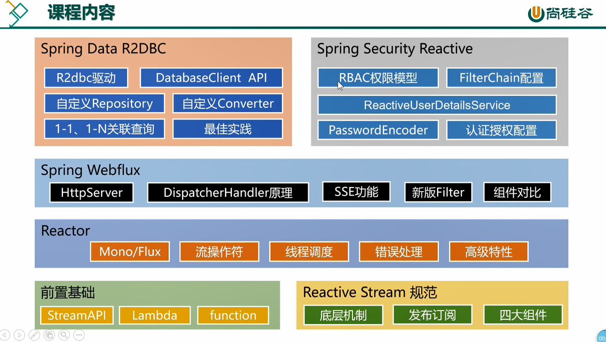
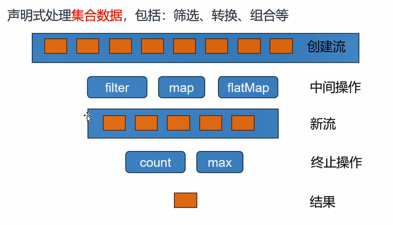
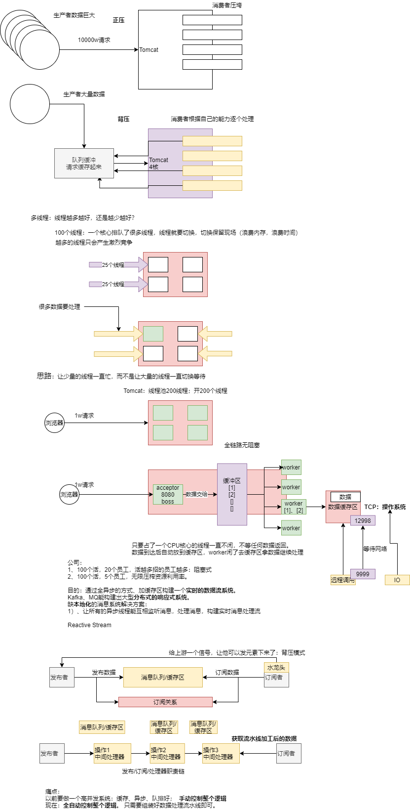
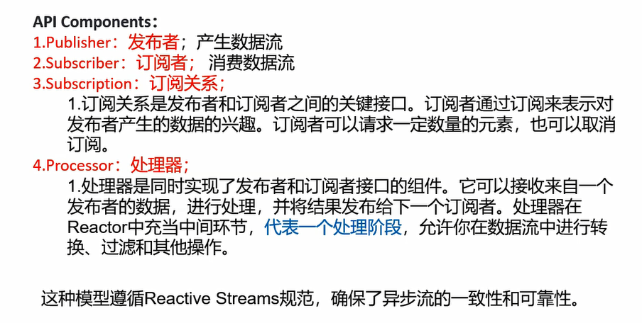
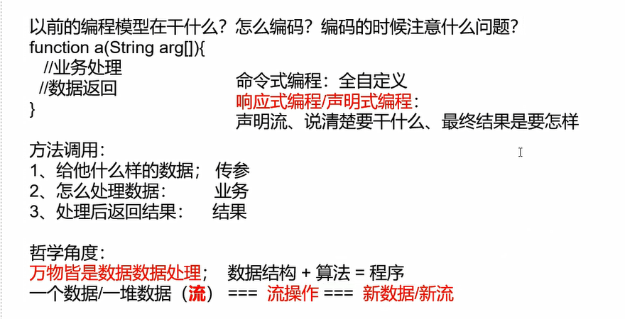
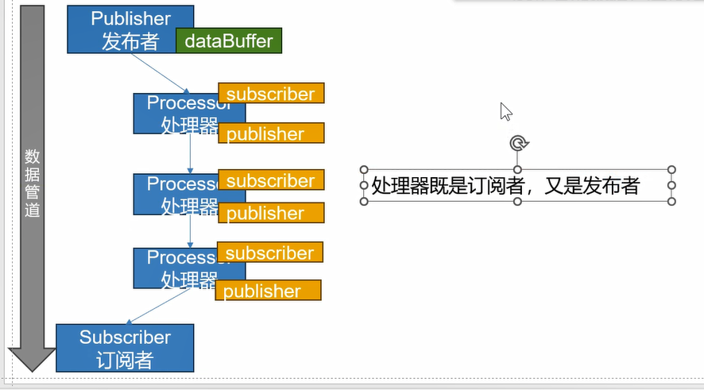
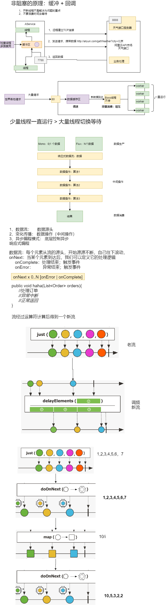
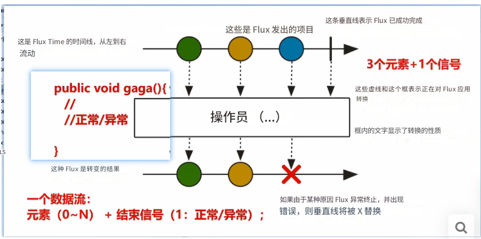
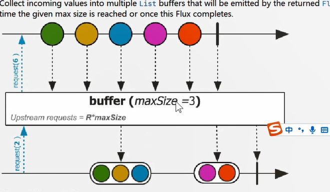
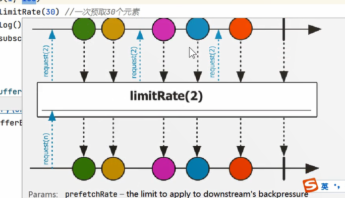

# Reactor核心



## 一、前置知识


### 1、Lambda

Java8语法糖：

**Lambda表达式与函数式接口**

函数式接口

```java
//函数式接口；只要是函数式接口就可以用Lambda表达式简化
//函数式接口： 接口中有且只有一个未实现的方法，这个接口就叫函数式接口
interface MyInterface {
    int sum(int i, int j);
}

interface MyHaha {
    int haha();

    default int heihei() {
        return 2;
    }; //默认实现
}

interface My666 {
    void aaa(int i,int j,int k);
}


@FunctionalInterface //检查注解，帮我们快速检查我们写的接口是否函数式接口
interface MyHehe {
    int hehe(int i);
}
```


lamda表达式从外部类-->匿名类--> lamda表达式演化

```java
//1、自己写实现类
class MyInterfaceImpl implements MyInterface {
    @Override
    public int sum(int i, int j) {
        return i + j;
    }
}

public class Lambda{
    /**
     * lambda简化函数式接口实例创建
     *
     * @param args
     */
    public static void main(String[] args) {

        //1、自己创建实现类对象
        MyInterface myInterface = new MyInterfaceImpl();
        System.out.println(myInterface.sum(1, 2));

        //2、创建匿名实现类
        MyInterface myInterface1 = new MyInterface() {
            @Override
            public int sum(int i, int j) {
                return i * i + j * j;
            }
        };
//        System.out.println(myInterface1.sum(2, 3));
        //冗余写法

        //3、lambda表达式:语法糖  参数列表  + 箭头 + 方法体
        MyInterface myInterface2 = (x, y) -> {
            return x * x + y * y;
        };
        System.out.println(myInterface2.sum(2, 3));


        //参数位置最少情况
        MyHaha myHaha = () -> {
            return 1;
        };

        MyHehe myHehe = y -> {
            return y * y;
        };


        MyHehe hehe2 = y -> y - 1;

        //完整写法如上：
        //简化写法：
        //1)、参数类型可以不写，只写(参数名)，参数变量名随意定义;
        //    参数表最少可以只有一个 ()，或者只有一个参数名；
        //2、方法体如果只有一句话，{} 可以省略


        MyHehe hehe3 = y -> y + 1;
        System.out.println(hehe3.hehe(7));
        //以上Lambda表达式简化了实例的创建。


        //总结：
        // 1、Lambda表达式： (参数表) -> {方法体}
        // 2、分辨出你的接口是否函数式接口。 函数式接口就可以lambda简化
    }
    
}
```

**Lambda表达式使用**

```java
public static void main(String[] args) {
    var names = new ArrayList<String>();

    names.add("Alice");
    names.add("Bob");
    names.add("Charlie");
    names.add("David");

    //比较器
//        Collections.sort(names, new Comparator<String>() {
//            @Override
//            public int compare(String o1, String o2) {
//                return o2.compareTo(o1);
//            }
//        });


    //直接写函数式接口就方便   (o1,o2)->o1.compareTo(o2)
//        Collections.sort(names,(o1,o2)->o1.compareTo(o2));
    System.out.println(names);


    // 类::方法； 引用类中的实例方法； 忽略lambda的完整写法
    Collections.sort(names,String::compareTo);
    System.out.println(names);


    //最佳实战：
    //1、以后调用某个方法传入参数，这个参数实例是一个接口对象，且只定义了一个方法，就直接用lambda简化写法

}
```


### 2、Function

函数式接口的出入参定义：
1、有入参，无出参【消费者】： `BiConsumer.accept`

```java
//  void accept(T t, U u);

BiConsumer<String,String> function = (a,b)->{ //能接受两个入参
    System.out.println("哈哈："+a+"；呵呵："+b);
};
function.accept("1","2");
```

2、有入参，有出参【多功能函数】： `function.apply`

```java
//R apply(T t);
Function<String,Integer> function = (String x) -> Integer.parseInt(x);
System.out.println(function.apply("2"));
```

3、无入参，无出参【普通函数】：

```java
//  public abstract void run();
Runnable runnable = () -> System.out.println("aaa");
new Thread(runnable).start();
```

4、无入参 ，有出参【提供者】： `supplier.get()`

```java
// T get();
Supplier<String> supplier = ()-> UUID.randomUUID().toString();
String s = supplier.get();
System.out.println(s);

```

5、断言`Predicate.test()`

```java
// boolean test(T t); 
Predicate<Integer> even = (t) -> t % 2 == 0;

//        even.test()//正向判断
//        even.negate().test(2) //反向判断  Predicate接口的default方法
System.out.println(even.negate().test(2));
```


`java.util.function`包下的所有function定义：
● Consumer： 消费者
● Supplier： 提供者
● Predicate： 断言

get/test/apply/accept调用的函数方法；


典型用法：

```java
public class FunctionDemo {

    public static void main(String[] args) {
        //1、定义数据提供者函数
        Supplier<String> supplier = () -> "47";
        //2、断言：验证是否一个数字
        Predicate<String> isNumber = str -> str.matches("-?\\d+(\\.\\d+)?");
        //3、转换器：把字符串变成数字  类::实例方法（静态方法）
        Function<String, Integer> change = Integer::parseInt;

        //4、消费者：打印数字
        Consumer<Integer> consumer = integer -> {
            if (integer % 2 == 0) {
                System.out.println("偶数：" + integer);
            } else {
                System.out.println("奇数：" + integer);
            }
        };


        //串在一起，实现判断42这个字符串是奇数还是偶数
        mymethod(supplier, isNumber, change, consumer);


//        System.out.println(supplier.get());
//        System.out.println(isNumber.test("777a"));

        mymethod(() -> "777a",
                str -> str.matches("-?\\d+(\\.\\d+)?"),
                Integer::parseInt,
                System.out::println);
    }

    private static void mymethod(Supplier<String> supplier,
                                 Predicate<String> isNumber,
                                 Function<String, Integer> change,
                                 Consumer<Integer> consumer) {
        if (isNumber.test(supplier.get())) {
            //说明是一个数字
            consumer.accept(change.apply(supplier.get()));
        } else {
            //说明不是一个数字
            System.out.println("非法的数字");
        }
    }
}
```


| 接口名称                 | 类型                       | 描述                                                    |
| ------------------------ | -------------------------- | ------------------------------------------------------- |
| `Consumer<T>`            | 消费者                     | 接受一个输入参数并且无返回结果                          |
| BiConsumer<T, U>         | 双消费者                   | 接受两个输入参数并且无返回结果                          |
| DoubleConsumer           | 消费者                     | 接受一个double类型的输入参数并且无返回结果              |
| IntConsumer              | 消费者                     | 接受一个int类型的输入参数并且无返回结果                 |
| LongConsumer             | 消费者                     | 接受一个long类型的输入参数并且无返回结果                |
| ObjDoubleConsumer<T>     | 对象-双精度浮点数消费者    | 接受一个对象和一个double类型的输入参数并且无返回结果    |
| ObjIntConsumer<T>        | 对象-整数消费者            | 接受一个对象和一个int类型的输入参数并且无返回结果       |
| ObjLongConsumer<T>       | 对象-长整数消费者          | 接受一个对象和一个long类型的输入参数并且无返回结果      |
| `Function<T, R>`         | 函数                       | 接受一个输入参数并产生一个结果                          |
| BiFunction<T, U, R>      | 双函数                     | 接受两个输入参数并产生一个结果                          |
| ToDoubleBiFunction<T, U> | 转换为双精度浮点数的双函数 | 接受两个输入参数并产生一个double类型的结果              |
| ToDoubleFunction<T>      | 转换为双精度浮点数的函数   | 接受一个输入参数并产生一个double类型的结果              |
| ToIntBiFunction<T, U>    | 转换为整数的双函数         | 接受两个输入参数并产生一个int类型的结果                 |
| ToIntFunction<T>         | 转换为整数的函数           | 接受一个输入参数并产生一个int类型的结果                 |
| ToLongBiFunction<T, U>   | 转换为长整数的双函数       | 接受两个输入参数并产生一个long类型的结果                |
| ToLongFunction<T>        | 转换为长整数的函数         | 接受一个输入参数并产生一个long类型的结果                |
| UnaryOperator<T>         | 单元操作符                 | 接受一个输入参数并产生同类型的结果                      |
| BinaryOperator<T>        | 二元操作符                 | 接受两个相同类型的输入参数并产生同类型的结果            |
| DoubleUnaryOperator      | 双精度浮点数单元操作符     | 接受一个double类型的输入参数并产生一个double类型的结果  |
| DoubleBinaryOperator     | 双精度浮点数二元操作符     | 接受两个double类型的输入参数并产生一个double类型的结果  |
| IntUnaryOperator         | 整数单元操作符             | 接受一个int类型的输入参数并产生一个int类型的结果        |
| IntBinaryOperator        | 整数二元操作符             | 接受两个int类型的输入参数并产生一个int类型的结果        |
| LongUnaryOperator        | 长整数单元操作符           | 接受一个long类型的输入参数并产生一个long类型的结果      |
| LongBinaryOperator       | 长整数二元操作符           | 接受两个long类型的输入参数并产生一个long类型的结果      |
| `Predicate<T>`           | 断言                       | 接受一个输入参数并产生一个boolean类型的结果             |
| BiPredicate<T, U>        | 双断言                     | 接受两个输入参数并产生一个boolean类型的结果             |
| BooleanSupplier          | 布尔值供应商               | 不接受任何输入参数并产生一个boolean类型的结果           |
| DoublePredicate          | 双精度浮点数断言           | 接受一个double类型的输入参数并产生一个boolean类型的结果 |
| IntPredicate             | 整数断言                   | 接受一个int类型的输入参数并产生一个boolean类型的结果    |
| LongPredicate            | 长整数断言                 | 接受一个long类型的输入参数并产生一个boolean类型的结果   |
| `Supplier<T>`            | 供应商                     | 不接受任何输入参数并产生一个结果                        |
| BooleanSupplier          | 布尔值供应商               | 不接受任何输入参数并产生一个boolean类型的结果           |
| DoubleSupplier           | 双精度浮点数供应商         | 不接受任何输入参数并产生一个double类型的结果            |
| IntSupplier              | 整数供应商                 | 不接受任何输入参数并产生一个int类型的结果               |
| LongSupplier             | 长整数供应商               | 不接受任何输入参数并产生一个long类型的结果              |


### 3、StreamAPI

最佳实战：以后凡是你写for循环处理数据的统一全部用StreamAPI进行替换；




> - **Stream Pipeline (流管道、流水线):** 这是Java Stream处理数据的整个流程，数据和操作的组合。
> - **Intermediate Operations (中间操作):** 对Stream进行转换，将一个流转换成另一个流，可以有零个或多个。
> - **Terminal Operation (终止操作):** 启动对源数据的计算并产生最终结果，每个Stream Pipeline只能有一个终止操作。


**流管道组成 (Composition of Stream Pipeline):**

- **一个数据源:** 可以是数组、集合、生成器函数、I/O管道等。
- **零或多个中间操作 :** 将一个流变形形成另一个流。
- **一个终止操作:** 产生最终结果。

**<span style="color:#4C9900;">流的惰性</span> (Laziness of Streams):**

- **只有在启动最终操作时才会对源数据进行计算。**
- **只在需要时才会消耗源元素。**


#### **创建流 (Creating Streams)** 

- **of**: 用于从指定元素创建流。例如：`Stream.of("a", "b", "c")`
- **builder**: 用于逐步构建流。例如：`Stream.builder().add("a").add("b").build()`
- **empty**: 创建一个空的流。例如：`Stream.empty()`
- **ofNullable**: 从一个可能为null的元素创建流。如果元素为null，则创建空流；否则创建包含该元素的流。这在Java 9中引入。例如：`Stream.ofNullable(someObject)`
- **generate**: 使用一个`Supplier`来无限生成流元素。例如：`Stream.generate(() -> Math.random())`
- **concat**: 连接两个流。例如：`Stream.concat(stream1, stream2)`
- **集合.stream (Collection.stream):** 几乎所有的`java.util.Collection`接口的实现类（如`List`, `Set`等）都提供了`stream()`方法来创建流。例如：`myList.stream()`

```java
System.out.println("主线程：" + Thread.currentThread());

//流是并发还是不并发？和for有啥区别？ 流也是用for循环挨个处理； 默认不并发，也可以并发；
//并发以后，你要自行解决多线程安全问题  stream中添加到List中，有状态数据将产生并发安全问题。千万不要这么写？
//        List aaa = new ();

List<Object> objectList = Collections.synchronizedList(new ArrayList<>());

//流的所有操作都是无状态；数据状态仅在此函数内有效，不溢出至函数外
long count = Stream.of(1, 2, 3, 4, 5)
        .parallel() //intermediate operation. 并发流
        .filter(i -> {
//                    objectList.add(i); 
            System.out.println("filter线程：" + Thread.currentThread());
            System.out.println("正在filter：" + i);
            return i > 2;
        }) // intermediate operation.
        .count(); // terminal operation.


System.out.println(count);
```


#### 🟢 **中间操作：Intermediate Operations**

浅拷贝

> **过滤/转换操作 (Filtering/Mapping/Flattening Operations):**
>
> - **<span style="color:#0000FF;">filter</span>**: 过滤流中的元素，只保留满足给定谓词的元素。
> - <span style="color:#0000FF;">**map**</span>: 对流中的每个元素应用一个函数，将其转换为另一种类型或形式的元素，生成一个新的流。<span style="text-decoration:underline;">映射： 一一映射，a 变成 b</span>
>   - **mapToInt**: 将流中的元素映射为`IntStream`（原始int类型流）。
>   - **mapToLong**: 将流中的元素映射为`LongStream`（原始long类型流）。
>   - **mapToDouble**: 将流中的元素映射为`DoubleStream`（原始double类型流）。
> - <span style="color:#0000FF;">**flatMap**</span>: 将流中的每个元素映射到一个新的流，然后将所有这些新的流连接（扁平化）成一个单一的流。常用于处理嵌套集合。<span style="text-decoration:underline;">打散、散列、展开、扩维：一对多映射</span>
>   - **flatMapToInt**: 将流中的元素映射为`IntStream`，然后扁平化。
>   - **flatMapToLong**: 将流中的元素映射为`LongStream`，然后扁平化。
>   - **flatMapToDouble**: 将流中的元素映射为`DoubleStream`，然后扁平化。
> - mapMulti: (Java 16+) 这是一个更通用的映射操作，允许一个输入元素映射为零个、一个或多个输出元素。它比 `flatMap` 更灵活，尤其是在需要有条件地生成多个元素或根本不生成元素时。
>   - **mapMultiToInt**: 将元素映射到`int`类型并提供给下游。
>   - **mapMultiToLong**: 将元素映射到`long`类型并提供给下游。
>   - **mapMultiToDouble**: 将元素映射到`double`类型并提供给下游。
>
> 
>
> **并行/顺序/资源管理操作 (Parallel/Sequential/Resource Management Operations):**
>
> - **<span style="color:#0000FF;">parallel</span>**: 将当前流转换为并行流。
> - **unordered**: 标记流为无序的。在某些情况下，这可以提高并行流操作的性能，因为它允许操作不保留元素的原始顺序。
> - **onClose**: 注册一个在流关闭时执行的`Runnable`。这在处理需要关闭的资源（如文件IO流）时很有用。
> - **<span style="color:#0000FF;">sequential</span>**: 将当前流转换为顺序流。
>
> 
>
> **中间状态操作 (Stateful Intermediate Operations):**
>
> - **<span style="color:#0000FF;">distinct</span>**: 返回一个由流中不重复元素组成的流。
> - **<span style="color:#0000FF;">sorted</span>**: 返回一个按自然顺序或指定比较器排序的流。
> - **<span style="color:#0000FF;">peek</span>**: 对流中的每个元素执行一个操作，但不改变流本身。主要用于调试。
>   - 如果你只是想在流管道的中间阶段**观察**元素，进行调试或日志记录，并且不希望终止流，那么使用 `peek`。
>   - 如果你需要对流中的每个元素执行一个**最终动作**（通常伴随副作用），并且不需要从流中返回任何结果，那么使用 `forEach`。
> - **<span style="color:#0000FF;">limit</span>**: 截断流，使其元素不超过给定数量。
> - **<span style="color:#0000FF;">skip</span>**: 跳过流中的前N个元素，返回剩余元素的流。
> - **<span style="color:#0000FF;">takeWhile</span>**: (Java 9+) 是一个 **短路操作**（short-circuiting operation），它用于**从流的开头开始**，**依次获取满足条件的元素**，一旦遇到第一个不满足条件的元素，**就停止处理，后面的元素不再处理**。
> - **dropWhile**: (Java 9+) 从流的开始处丢弃满足给定谓词的元素，直到遇到第一个不满足条件的元素，然后返回剩余的元素。

```java
//1、挑出 年龄大于 18岁的人  拿到集合流其实就是拿到集合的深拷贝的值，流的所有操作都是流的元素引用
//filter、map、flatMap； 流里面的每一个元素都完整走一个流水线，才能轮到下一个元素；
//第一个元素流经所有管道处理后，下一个元素才能继续执行完整管道流程
//声明式：基于事件机制的回调
Stream<String> sorted = list.stream()
        .limit(3)
        .filter(person -> { //程序员不自己调用，发生这个事情的时候系统调用
//                    System.out.println("filter："+person.hashCode());
            return person.age > 18;
        }) //挑出大于18； person流
        .peek(person -> System.out.println("filter peek:" + person))
        .map(person -> {
//                    System.out.println("Person："+person.hashCode());
            return person.getName();
        })//拿到所有人的姓名
        .peek(s -> System.out.println("map peek:" + s))
        .flatMap(ele -> {
            String[] s = ele.split(" ");
            return Arrays.stream(s);
        })
        .distinct()
        .sorted(String::compareTo);
```

```java
// filter 和 takeWhile区别
List<Integer> collect = List.of(1, 2, 3, 4, 5, 6)
        .stream()
        .filter(i -> i > 2) //无条件遍历流中的每一个元素
        .collect(Collectors.toList());
System.out.println(collect);//[3, 4, 5, 6]

//
List<Integer> collect1 = List.of(1, 2, 3, 4, 5, 6)
        .stream()
        .takeWhile(i -> i < 2) //当满足条件，拿到这个元素，不满足直接结束流操作
        .collect(Collectors.toList());
System.out.println(collect1);//[1]
```


#### **🔴 终止操作：Terminal Operation**

| 方法名                     | 描述                                                         |
| -------------------------- | ------------------------------------------------------------ |
| `forEach(Consumer)`        | 遍历每个元素（无序，适用于并行流时不确定顺序）               |
| `forEachOrdered(Consumer)` | 按照流中顺序遍历每个元素（即使在并行流中也保证顺序）         |
| `toArray()`                | 将流转换为数组                                               |
| `reduce(BinaryOperator)`   | 规约操作，合并元素，如求和、求积等                           |
| `collect(Collector)`       | 收集结果，如转为 List、Set、Map 等                           |
| `toList()`                 | Java 16+ 新增，将流收集为不可变 List（底层是 `Collectors.toList()`） |
| `min(Comparator)`          | 获取最小值                                                   |
| `max(Comparator)`          | 获取最大值                                                   |
| `count()`                  | 返回元素数量                                                 |
| `anyMatch(Predicate)`      | 是否至少有一个元素匹配条件                                   |
| `allMatch(Predicate)`      | 是否所有元素都匹配条件                                       |
| `noneMatch(Predicate)`     | 是否没有元素匹配条件                                         |
| `findFirst()`              | 获取第一个元素（适用于有序流）                               |
| `findAny()`                | 获取任意一个元素（常用于并行流）                             |
| `iterator()`               | 返回一个迭代器，用于手动遍历流中的元素                       |

---

✅ 示例代码

```java
import java.util.*;
import java.util.stream.*;

public class StreamDemo {
    public static void main(String[] args) {
        List<Integer> numbers = Arrays.asList(1, 2, 3, 4, 5, 6);

        // forEach
        numbers.stream().forEach(System.out::println);

        // forEachOrdered
        numbers.parallelStream().forEachOrdered(System.out::println); // 保证输出顺序

        // toArray
        Object[] arr = numbers.stream().toArray();

        // reduce
        int sum = numbers.stream().reduce(0, Integer::sum);

        // collect
        List<Integer> filtered = numbers.stream()
                                        .filter(n -> n % 2 == 0)
                                        .collect(Collectors.toList());

        // toList (Java 16+)
        List<Integer> list = numbers.stream().filter(n -> n > 3).toList();

        // min
        Optional<Integer> min = numbers.stream().min(Integer::compareTo);

        // max
        Optional<Integer> max = numbers.stream().max(Integer::compareTo);

        // count
        long count = numbers.stream().filter(n -> n % 2 == 0).count();

        // anyMatch
        boolean hasEven = numbers.stream().anyMatch(n -> n % 2 == 0);

        // allMatch
        boolean allPositive = numbers.stream().allMatch(n -> n > 0);

        // noneMatch
        boolean noNegative = numbers.stream().noneMatch(n -> n < 0);

        // findFirst
        Optional<Integer> first = numbers.stream().filter(n -> n > 3).findFirst();

        // findAny
        Optional<Integer> any = numbers.parallelStream().filter(n -> n > 3).findAny();

        // iterator
        Iterator<Integer> it = numbers.stream().iterator();
        while (it.hasNext()) {
            System.out.println(it.next());
        }
    }
}
```


### 4、Reactive-Stream

Reactive Streams 是 JVM 面向流的库的<span style="color:#0000FF;">标准和规范</span>

**核心特点：**

1. **处理可能无限数量的元素**
   - Reactive Streams 能够处理无限的数据流，这意味着它可以处理那些没有明确结束点的数据序列，如实时数据流、日志文件等。
2. **有序**
   - 数据在流中保持顺序传递，确保了数据的一致性和可预测性，这对于需要按特定顺序处理数据的应用非常重要。
3. **在组件之间异步传递元素**
   - 元素在不同的组件（如生产者和消费者）之间以异步方式传递，这提高了系统的响应性和并发能力，使得系统能够更高效地处理高并发场景。
4. **强制性<span style="color:#0000FF;">非阻塞</span>,<span style="color:#0000FF;">背压模式</span>**
   - 强制使用非阻塞的背压机制来控制数据流的速度，防止生产者过快地生成数据导致消费者无法及时处理而引发内存溢出等问题。背压机制允许消费者根据自己的处理能力来控制数据流的速度，从而实现更加稳定和高效的系统运行。

------

推荐阅读：

- jdk9 reactive 响应式规范：https://www.reactive-streams.org/
- 响应式宣言：https://www.reactivemanifesto.org/zh-CN

- ReactiveStream: https://github.com/reactive-streams/reactive-streams-jvm/blob/v1.0.4/README.md




#### 为什么有 Reactive-Stream 规范

目的: 通过全异步的方式、加缓存区构建一个实时的数据流系统，

Kafka、MQ 能构建出大型分布式的响应式系统。

缺本地化的消息系统解决方案:

*   让所有的异步线程能互相监听消息，处理消息，构建实时消息处理流


#### 消息传递是响应式核心

之前 a 调用 b，必须 b 做完了事情，a 才能接着做事情。现在响应式就是 a 先将 b 要做的事情放到缓冲区中，b 监听这个缓冲区，从缓冲区中拿数据，去做事情，这样 a 就不用等待了。

引入一个缓存区，引入消息队列，就能实现全系统、全异步、不阻塞、不等待、实时响应


#### **Reactive-Stream规范核心接口**

##### API Components

查看 jdk9 的 java.util.concurrent.Flow 类







使用少量资源处理大量并发的一种解决方案。

#### Reactive-Stream四大核心组件+案例



```java
public class FlowDemoNew {

    //定义流中间操作处理器：具有发布者和订阅者两者的功能： 演示：只写订阅者的接口  发布者特性继承SubmissionPublisher
    static class MyProcessor extends SubmissionPublisher<String> implements Flow.Processor<String, String> {

        private Flow.Subscription subscription; //保存绑定关系

        @Override
        public void onSubscribe(Flow.Subscription subscription) {
            System.out.println("processor订阅绑定完成");
            this.subscription = subscription;
            subscription.request(1); //找上游要一个数据
        }

        @Override //数据到达，触发这个回调
        public void onNext(String item) {
            System.out.println("processor拿到数据：" + item);
            //再加工
            item += "：哈哈";
            submit(item);//把我加工后的数据发出去
            subscription.request(1); //再要新数据
        }

        @Override
        public void onError(Throwable throwable) {

        }

        @Override
        public void onComplete() {

        }
    }

    /**
     * 1、Publisher：发布者
     * 2、Subscriber：订阅者
     * 3、Subscription： 订阅关系
     * 4、Processor： 处理器 实现 Publisher和Subscriber 接口，
     * @param args
     */

    //发布订阅模型：观察者模式，
    public static void main(String[] args) throws InterruptedException {

        //1、定义一个发布者； 发布数据；
        SubmissionPublisher<String> publisher = new SubmissionPublisher<>();


        //2、定一个中间操作：  给每个元素加个 哈哈 前缀
        MyProcessor myProcessor1 = new MyProcessor();
        MyProcessor myProcessor2 = new MyProcessor();
        MyProcessor myProcessor3 = new MyProcessor();


        //3、定义一个订阅者； 订阅者感兴趣发布者的数据；
        Flow.Subscriber<String> subscriber = new Flow.Subscriber<String>() {

            private Flow.Subscription subscription;

            @Override //在订阅时  onXxxx：在xxx事件发生时，执行这个回调
            public void onSubscribe(Flow.Subscription subscription) {
                System.out.println(Thread.currentThread() + "订阅开始了：" + subscription);
                this.subscription = subscription;
                //从上游请求一个数据
                subscription.request(1);
            }

            @Override //在下一个元素到达时； 执行这个回调；   接受到新数据
            public void onNext(String item) {
                System.out.println(Thread.currentThread() + "订阅者，接受到数据：" + item);

                if (item.equals("p-7")) {
                    subscription.cancel(); //取消订阅
                } else {
                    subscription.request(1);
                }
            }

            @Override //在错误发生时，
            public void onError(Throwable throwable) {
                System.out.println(Thread.currentThread() + "订阅者，接受到错误信号：" + throwable);
            }

            @Override //在完成时
            public void onComplete() {
                System.out.println(Thread.currentThread() + "订阅者，接受到完成信号：");
            }
        };

        //4、链表关系绑定出责任链:绑定发布者和订阅者 。 订阅者订阅了处理器，处理器订阅了发布者
        publisher.subscribe(myProcessor1); //此时处理器相当于订阅者
        myProcessor1.subscribe(myProcessor2); //此时处理器相当于发布者
        myProcessor2.subscribe(myProcessor3);
        myProcessor3.subscribe(subscriber);
        //绑定操作；就是发布者，记住了所有订阅者都有谁，有数据后，给所有订阅者把数据推送过去。
        
//        publisher.subscribe(subscriber);

        for (int i = 0; i < 10; i++) {
            //发布10条数据
            publisher.submit("p-" + i);

        }

        //ReactiveStream
        //jvm底层对于整个发布订阅关系做好了 异步+缓存区处理 = 响应式系统；

        // 异常关闭发布者通道；
       // publisher.closeExceptionally(new RuntimeException("error in main method"));

        //发布者通道关闭
        publisher.close();

        Thread.sleep(20000);

    }
}


```

> 在 [FlowDemoNew.java](file://C:\Users\gouwe\Desktop\reactor-programming\reactor-programming\src\main\java\com\atguigu\reactorprogramming\flow\FlowDemoNew.java) 中，`publisher.close()` 和 `publisher.closeExceptionally(...)` 用于终止发布者的数据流，但它们的行为有所不同：
>
> `publisher.close()`
>
> - **功能**：正常关闭发布者。
> - **行为**：
>   - 发布者不再接受新的数据提交（如调用 [submit()](file://C:\Users\gouwe\Desktop\reactor-programming\reactor-programming\src\main\java\com\atguigu\reactorprogramming\flow\MultiSubscriberExample.java#L29-L34) 会丢弃数据）。
>   - 向所有订阅者发送 [onComplete()](file://C:\Users\gouwe\Desktop\reactor-programming\reactor-programming\src\main\java\com\atguigu\reactorprogramming\flow\FlowDemoNew.java#L34-L37) 信号，表示数据流已正常结束。
> - **适用场景**：当所有数据已经成功发布完毕，且没有异常发生时使用。
>
> `publisher.closeExceptionally(new RuntimeException("error in main method"))`
>
> - **功能**：以异常方式关闭发布者。
> - **行为**：
>   - 发布者不再接受新的数据提交。
>   - 向所有订阅者发送 [onError(Throwable)](file://C:\Users\gouwe\Desktop\reactor-programming\reactor-programming\src\main\java\com\atguigu\reactorprogramming\flow\FlowDemoNew.java#L29-L32) 信号，携带指定的异常信息。
>   - 触发订阅者的错误处理逻辑（例如日志记录、资源清理等）。
> - **适用场景**：当发布过程中发生错误，需要通知订阅者数据流异常终止时使用。
>
> ### 总结
> - [close()](file://C:\Users\gouwe\Desktop\reactor-programming\reactor-programming\src\main\java\com\atguigu\reactorprogramming\flow\MultiSubscriberExample.java#L37-L41) 表示正常结束数据流；
> - `closeExceptionally(...)` 表示异常结束数据流，并向订阅者传递错误信息。


#### ai写发布订阅原生

```java
// 多订阅者支持的 Publisher
class MyPublisher<T> implements Flow.Publisher<T> {
    // 存储所有订阅者的列表，使用 CopyOnWriteArrayList 以支持并发修改
    private final List<MySubscription<T>> subscriptions = new CopyOnWriteArrayList<>();

    @Override
    public void subscribe(Flow.Subscriber<? super T> subscriber) {
        // 创建一个新的订阅关系，并添加到订阅者列表中
        MySubscription<T> subscription = new MySubscription<>(subscriber);
        subscriptions.add(subscription);
        // 通知订阅者它已成功订阅
        subscriber.onSubscribe(subscription);
    }

    // 向所有订阅者广播数据
    public void submit(T item) {
        // 广播数据：每个订阅者都收到一份副本
        for (MySubscription<T> subscription : subscriptions) {
            subscription.enqueue(item);
        }
    }

    // 关闭所有订阅关系
    public void close() {
        for (MySubscription<T> subscription : subscriptions) {
            subscription.complete();
        }
    }
}

/**
 * 自定义订阅类，用于处理发布者和订阅者之间的交互
 * 实现了Flow.Subscription接口，以支持订阅相关的操作
 *
 * @param <T> 订阅的数据类型，允许订阅者指定感兴趣的数据类型
 */
class MySubscription<T> implements Flow.Subscription {
    // 订阅者的引用
    private final Flow.Subscriber<? super T> subscriber;
    // 存储待处理数据的队列
    private final LinkedBlockingQueue<T> queue = new LinkedBlockingQueue<>();
    // 记录当前的需求量，即还能接收多少数据
    private final AtomicLong demand = new AtomicLong(0);
    // 记录是否已完成
    private final AtomicBoolean completed = new AtomicBoolean(false);

    // 使用单线程执行器处理数据分发，确保线程安全
    private final ExecutorService executor = Executors.newSingleThreadExecutor();

    public MySubscription(Flow.Subscriber<? super T> subscriber) {
        this.subscriber = subscriber;
    }

    @Override
    public void request(long n) {
        // 检查需求量是否合法
        if (n <= 0) {
            subscriber.onError(new IllegalArgumentException("n must be > 0"));
            return;
        }
        // 增加需求量，并尝试投递数据
        demand.addAndGet(n);
        deliver();
    }

    @Override
    public void cancel() {
        // 取消订阅，关闭执行器
        executor.shutdownNow();
        System.out.println("Subscription cancelled.");
    }

    // 将数据加入队列
    public void enqueue(T item) {
        queue.offer(item);
        deliver();
    }

    // 尝试投递数据给订阅者
    public void deliver() {
        executor.submit(() -> {
            while (demand.get() > 0 && !queue.isEmpty()) {
                T item = queue.poll();
                if (item != null) {
                    subscriber.onNext(item);
                    demand.decrementAndGet();
                }
            }
        });
    }

    // 完成订阅
    public void complete() {
        executor.submit(() -> {
            if (completed.compareAndSet(false, true)) {
                subscriber.onComplete();
                executor.shutdown();
            }
        });
    }
}

// 简单 Subscriber（可实例化多个）
class MySubscriber<T> implements Flow.Subscriber<T> {
    // 订阅者的名称，用于区分不同的订阅者
    private final String name;
    // 当前订阅关系的引用
    private Flow.Subscription subscription;

    public MySubscriber(String name) {
        this.name = name;
    }

    @Override
    public void onSubscribe(Flow.Subscription subscription) {
        this.subscription = subscription;
        System.out.println(name + " subscribed.");
        // 请求第一个数据
        subscription.request(1);
    }

    @Override
    public void onNext(T item) {
        // 接收到数据时调用
        System.out.println(name + " received: " + item);
        try {
            Thread.sleep(300); // 模拟处理时间
        } catch (InterruptedException e) {
            e.printStackTrace();
        }
        // 继续请求下一个数据
        subscription.request(1);
    }

    @Override
    public void onError(Throwable throwable) {
        // 发生错误时调用
        System.err.println(name + " error: " + throwable.getMessage());
    }

    @Override
    public void onComplete() {
        // 订阅完成时调用
        System.out.println(name + " completed.");
    }
}

// 主函数
public class MultiSubscriberExample {
    public static void main(String[] args) throws InterruptedException {
        // 创建发布者实例
        MyPublisher<String> publisher = new MyPublisher<>();

        // 注册多个订阅者
        publisher.subscribe(new MySubscriber<>("Subscriber-A"));
        publisher.subscribe(new MySubscriber<>("Subscriber-B"));
        publisher.subscribe(new MySubscriber<>("Subscriber-C"));

        // 发布数据
        String[] data = {"Java", "Kotlin", "Scala"};
        for (String item : data) {
            System.out.println("Publishing: " + item);
            publisher.submit(item);
            Thread.sleep(200);
        }

        // 结束发布
        Thread.sleep(1000);
        publisher.close();

        Thread.sleep(1000);
        System.out.println("Main thread exits.");
    }
}
```


> ## ✅ 代码结构简要说明
>
> ### 1. `MyPublisher<T>`：发布者
>
> - 使用 `CopyOnWriteArrayList` 管理多个订阅者。
> - 每次调用 `subscribe()` 时创建一个 `MySubscription` 并通知订阅者已连接。
> - 提供 `submit(T item)` 方法向所有订阅者广播数据。
> - 提供 `close()` 方法通知所有订阅者完成并终止流。
>
> ### 2. `MySubscription<T>`：订阅关系管理类
>
> - 维护每个订阅者的队列、需求量（backpressure 控制）、线程安全执行器。
> - 支持异步投递机制，使用单线程池来确保线程安全。
> - 实现 `request(long n)` 和 `cancel()` 方法以符合 Reactive Streams 规范。
> - `enqueue()` 将数据入队；`deliver()` 根据当前需求量分发数据。
> - `complete()` 方法用于结束订阅。
>
> ### 3. `MySubscriber<T>`：订阅者
>
> - 接收消息后打印内容，并请求下一个数据项。
> - 使用 `Thread.sleep()` 模拟处理延迟。
> - 处理错误和完成事件。
>
> ### 4. `MultiSubscriberExample`：主程序
>
> - 创建发布者并注册三个订阅者。
> - 发布几个字符串消息。
> - 最终关闭发布者。
>
> ## 码分析与优化建议
>
> ### ✅ 优点：
>
> - **线程安全设计**：使用了 `CopyOnWriteArrayList` 和 `AtomicLong` 来保证并发环境下的安全性。
> - **异步投递机制**：每个订阅者使用自己的线程池进行数据处理，避免阻塞主线程。
> - **背压控制（Backpressure）**：通过 `request(n)` 控制订阅者的数据消费速率。
>
> ### ⚠️ 可改进点：
>
> #### 1. **每个订阅者都使用一个线程池**
>
> java
>
> 深色版本
>
> 
>
> ```
> private final ExecutorService executor = Executors.newSingleThreadExecutor();
> ```
>
> - 这会导致每个订阅者都有一个线程，如果订阅者数量较多，会浪费资源。
> - **建议**：使用共享的线程池或 `ForkJoinPool.commonPool()`。
>
> #### 2. **重复投递问题**
>
> 在 `submit()` 中对每个订阅者都 `enqueue()` 数据，可能导致大量内存占用，尤其是大数据量场景。
>
> - **建议**：根据订阅者的需求量动态决定是否发送，或者使用共享队列+过滤机制。
>
> #### 3. **没有实现真正的背压反馈机制**
>
> 虽然有 `demand` 字段，但在发布端并没有根据订阅者的实际消费能力调整生产速度。
>
> - **建议**：可引入 `SubmissionPublisher` 或使用成熟的响应式库如 **Project Reactor** 或 **RxJava**。


## 二、Reactor

[projectreactor 官网](https://projectreactor.io)


### 1、快速上手

#### 1.1、介绍


官网：https://projectreactor.io/

Reactor 是一个用于JVM的完全非阻塞的响应式编程框架，具备高效的需求管理（即对 “背压（backpressure）”的控制）能力。

它与 Java 8 函数式 API 直接集成，比如 CompletableFuture， Stream， 以及 Duration。

它提供了异步序列 API `Flux（用于[N]个元素）`和 `Mono（用于 [0|1]个元素）`，并完全遵循和实现了“响应式扩展规范”（Reactive Extensions Specification）。

Reactor 的 reactor-ipc 组件还支持非阻塞的进程间通信（inter-process communication, IPC）。 Reactor IPC 为 HTTP（包括 Websockets）、TCP 和 UDP 提供了支持背压的网络引擎，从而适合 应用于微服务架构。并且完整支持响应式编解码（reactive encoding and decoding）。



#### 1.2、依赖

```xml
<dependencyManagement> 
    <dependencies>
        <dependency>
            <groupId>io.projectreactor</groupId>
            <artifactId>reactor-bom</artifactId>
            <version>2023.0.0</version>
            <type>pom</type>
            <scope>import</scope>
        </dependency>
    </dependencies>
</dependencyManagement>

    
<dependencies>
    <dependency>
        <groupId>io.projectreactor</groupId>
        <artifactId>reactor-core</artifactId> 
    </dependency>
    <dependency>
        <groupId>io.projectreactor</groupId>
        <artifactId>reactor-test</artifactId> 
        <scope>test</scope>
    </dependency>
</dependencies>
```

### 2、响应式编程

响应式编程是一种关注于`数据流（data streams）`和`变化传递（propagation of change）`的`异步编程`方式。 这意味着它可以用既有的编程语言表达静态（如数组）或动态（如事件源）的数据流。

了解历史：
● 在响应式编程方面，微软跨出了第一步，它在 .NET 生态中创建了响应式扩展库（Reactive Extensions library, Rx）。接着 RxJava 在JVM上实现了响应式编程。后来，在 JVM 平台出现了一套标准的响应式 编程规范，它定义了一系列标准接口和交互规范。并整合到 Java 9 中（使用 Flow 类）。
● 响应式编程通常作为面向对象编程中的“观察者模式”（Observer design pattern）的一种扩展。 响应式流（reactive streams）与“迭代子模式”（Iterator design pattern）也有相通之处， 因为其中也有 Iterable-Iterator 这样的对应关系。主要的区别在于，Iterator 是基于 “拉取”（pull）方式的，而响应式流是基于“推送”（push）方式的。
● 使用 iterator 是一种“命令式”（imperative）编程范式，即使访问元素的方法是 Iterable 的唯一职责。关键在于，什么时候执行 next() 获取元素取决于开发者。在响应式流中，相对应的 角色是 Publisher-Subscriber，但是 当有新的值到来的时候 ，却反过来由发布者（Publisher） 通知订阅者（Subscriber），这种“推送”模式是响应式的关键。此外，对推送来的数据的操作 是通过一种声明式（declaratively）而不是命令式（imperatively）的方式表达的：开发者通过 描述“控制流程”来定义对数据流的处理逻辑。
● 除了数据推送，对错误处理（error handling）和完成（completion）信号的定义也很完善。 一个 Publisher 可以推送新的值到它的 Subscriber（调用 onNext 方法）， 同样也可以推送错误（调用 onError 方法）和完成（调用 onComplete 方法）信号。 错误和完成信号都可以终止响应式流。可以用下边的表达式描述：

```java
onNext x 0..N [onError | onComplete]
```

#### 2.1、阻塞是对资源的浪费

现代应用需要应对大量的并发用户，而且即使现代硬件的处理能力飞速发展，软件性能仍然是关键因素。
广义来说我们有两种思路来提升程序性能：

1. `并行化（`parallelize） ：使用更多的线程和硬件资源。[异步]
2. 基于现有的资源来 提高执行效率 。
   通常，Java开发者使用阻塞式（blocking）编写代码。这没有问题，在出现性能瓶颈后， 我们可以增加处理线程，线程中同样是阻塞的代码。但是这种使用资源的方式会迅速面临 资源竞争和并发问题。
   更糟糕的是，阻塞会浪费资源。具体来说，比如当一个程序面临延迟（通常是I/O方面， 比如数据库读写请求或网络调用），所在线程需要进入 idle 状态等待数据，从而浪费资源。
   所以，并行化方式并非银弹。这是挖掘硬件潜力的方式，但是却带来了复杂性，而且容易造成浪费。

#### 2.2、异步可以解决问题吗？

第二种思路——提高执行效率——可以解决资源浪费问题。通过编写 `异步非阻塞` 的代码， （任务发起异步调用后）执行过程会切换到另一个 使用同样底层资源 的活跃任务，然后等 异步调用返回结果再去处理。

但是在 JVM 上如何编写异步代码呢？Java 提供了两种异步编程方式：
● 回调（Callbacks） ：异步方法没有返回值，而是采用一个 callback 作为参数（lambda 或匿名类），当结果出来后回调这个 callback。常见的例子比如 Swings 的 EventListener。
● Futures ：异步方法 立即 返回一个 Future，该异步方法要返回结果的是 T 类型，通过 Future封装。这个结果并不是 立刻 可以拿到，而是等实际处理结束才可用。比如， ExecutorService 执行 Callable 任务时会返回 Future 对象。

这些技术够用吗？并非对于每个用例都是如此，两种方式都有局限性。
回调很难组合起来，因为很快就会导致代码难以理解和维护（即所谓的“回调地狱（callback hell）”）。
考虑这样一种情景：
● 在用户界面上显示用户的5个收藏，或者如果没有任何收藏提供5个建议。
● 这需要3个 服务（一个提供收藏的ID列表，第二个服务获取收藏内容，第三个提供建议内容）：
回调地狱（Callback Hell）的例子：

```java
userService.getFavorites(userId, new Callback<List<String>>() { 
  public void onSuccess(List<String> list) { 
    if (list.isEmpty()) { 
      suggestionService.getSuggestions(new Callback<List<Favorite>>() {
        public void onSuccess(List<Favorite> list) { 
          UiUtils.submitOnUiThread(() -> { 
            list.stream()
                .limit(5)
                .forEach(uiList::show); 
            });
        }

        public void onError(Throwable error) { 
          UiUtils.errorPopup(error);
        }
      });
    } else {
      list.stream() 
          .limit(5)
          .forEach(favId -> favoriteService.getDetails(favId, 
            new Callback<Favorite>() {
              public void onSuccess(Favorite details) {
                UiUtils.submitOnUiThread(() -> uiList.show(details));
              }

              public void onError(Throwable error) {
                UiUtils.errorPopup(error);
              }
            }
          ));
    }
  }

  public void onError(Throwable error) {
    UiUtils.errorPopup(error);
  }
});
```

Reactor改造后为：

```java
userService.getFavorites(userId) 
           .flatMap(favoriteService::getDetails) 
           .switchIfEmpty(suggestionService.getSuggestions()) 
           .take(5) 
           .publishOn(UiUtils.uiThreadScheduler()) 
           .subscribe(uiList::show, UiUtils::errorPopup); 
```

如果你想确保“收藏的ID”的数据在800ms内获得（如果超时，从缓存中获取）呢？在基于回调的代码中， 会比较复杂。但 Reactor 中就很简单，在处理链中增加一个 timeout 的操作符即可。

```java
userService.getFavorites(userId)
           .timeout(Duration.ofMillis(800)) 
           .onErrorResume(cacheService.cachedFavoritesFor(userId)) 
           .flatMap(favoriteService::getDetails) 
           .switchIfEmpty(suggestionService.getSuggestions())
           .take(5)
           .publishOn(UiUtils.uiThreadScheduler())
           .subscribe(uiList::show, UiUtils::errorPopup);
```

额外扩展：
Futures 比回调要好一点，但即使在 Java 8 引入了 CompletableFuture，它对于多个处理的组合仍不够好用。 编排多个 Futures 是可行的，但却不易。此外，Future 还有一个问题：当对 Future 对象最终调用 get() 方法时，仍然会导致阻塞，并且缺乏对多个值以及更进一步对错误的处理。
考虑另外一个例子，我们首先得到 ID 的列表，然后通过它进一步获取到“对应的 name 和 statistics” 为元素的列表，整个过程用异步方式来实现。
CompletableFuture 处理组合的例子

```java
CompletableFuture<List<String>> ids = ifhIds(); 

CompletableFuture<List<String>> result = ids.thenComposeAsync(l -> { 
        Stream<CompletableFuture<String>> zip =
                        l.stream().map(i -> { 
                                                 CompletableFuture<String> nameTask = ifhName(i); 
                                                 CompletableFuture<Integer> statTask = ifhStat(i); 

                                                 return nameTask.thenCombineAsync(statTask, (name, stat) -> "Name " + name + " has stats " + stat); 
                                         });
        List<CompletableFuture<String>> combinationList = zip.collect(Collectors.toList()); 
        CompletableFuture<String>[] combinationArray = combinationList.toArray(new CompletableFuture[combinationList.size()]);

        CompletableFuture<Void> allDone = CompletableFuture.allOf(combinationArray); 
        return allDone.thenApply(v -> combinationList.stream()
                                                                                                 .map(CompletableFuture::join) 
                                                                                                 .collect(Collectors.toList()));
});

List<String> results = result.join(); 
assertThat(results).contains(
                                "Name NameJoe has stats 103",
                                "Name NameBart has stats 104",
                                "Name NameHenry has stats 105",
                                "Name NameNicole has stats 106",
                                "Name NameABSLAJNFOAJNFOANFANSF has stats 121");
```

#### 2.3、从命令式编程到响应式编程

类似 Reactor 这样的响应式库的目标就是要弥补上述“经典”的 JVM 异步方式所带来的不足， 此外还会关注一下几个方面：
● 可编排性（Composability） 以及 可读性（Readability）
● 使用丰富的 操作符 来处理形如 流 的数据
● 在 订阅（subscribe） 之前什么都不会发生
● 背压（backpressure） 具体来说即 消费者能够反向告知生产者生产内容的速度的能力
● 高层次 （同时也是有高价值的）的抽象，从而达到 并发无关 的效果

**可编排性与可读性**
可编排性，指的是编排多个异步任务的能力。比如我们将前一个任务的结果传递给后一个任务作为输入， 或者将多个任务以分解再汇总（fork-join）的形式执行，或者将异步的任务作为离散的组件在系统中 进行重用。
这种编排任务的能力与代码的可读性和可维护性是紧密相关的。随着异步处理任务数量和复杂度 的提高，编写和阅读代码都变得越来越困难。就像我们刚才看到的，回调模式是简单的，但是缺点 是在复杂的处理逻辑中，回调中会层层嵌入回调，导致 回调地狱（Callback Hell） 。你能猜到 （或有过这种痛苦经历），这样的代码是难以阅读和分析的。
Reactor 提供了丰富的编排操作，从而代码直观反映了处理流程，并且所有的操作保持在同一层次 （尽量避免了嵌套）。

**就像装配流水线**
你可以想象数据在响应式应用中的处理，就像流过一条装配流水线。Reactor 既是传送带， 又是一个个的装配工或机器人。原材料从源头（最初的 Publisher）流出，最终被加工为成品， 等待被推送到消费者（或者说 Subscriber）。
原材料会经过不同的中间处理过程，或者作为半成品与其他半成品进行组装。如果某处有齿轮卡住， 或者某件产品的包装过程花费了太久时间，相应的工位就可以向上游发出信号来限制或停止发出原材料。

**操作符（Operators）**
在 Reactor 中，操作符（operator）就像装配线中的工位（操作员或装配机器人）。每一个操作符 对 Publisher 进行相应的处理，然后将 Publisher 包装为一个新的 Publisher。就像一个链条， 数据源自第一个 Publisher，然后顺链条而下，在每个环节进行相应的处理。最终，一个订阅者 (Subscriber）终结这个过程。请记住，在订阅者（Subscriber）订阅（subscribe）到一个 发布者（Publisher）之前，什么都不会发生。
理解了操作符会创建新的 Publisher 实例这一点，能够帮助你避免一个常见的问题， 这种问题会让你觉得处理链上的某个操作符没有起作用。
虽然响应式流规范（Reactive Streams specification）没有规定任何操作符， 类似 Reactor 这样的响应式库所带来的最大附加价值之一就是提供丰富的操作符。包括基础的转换操作， 到过滤操作，甚至复杂的编排和错误处理操作。

**subscribe() 之前什么都不会发生**

在 Reactor 中，当你创建了一条 Publisher 处理链，数据还不会开始生成。事实上，你是创建了 一种抽象的对于异步处理流程的描述（从而方便重用和组装）。
当真正“订阅（subscrib）”的时候，你需要将 Publisher 关联到一个 Subscriber 上，然后 才会触发整个链的流动。这时候，Subscriber 会向上游发送一个 request 信号，一直到达源头 的 Publisher。

**背压**

向上游传递信号这一点也被用于实现 背压 ，就像在装配线上，某个工位的处理速度如果慢于流水线 速度，会对上游发送反馈信号一样。
在响应式流规范中实际定义的机制同刚才的类比非常接近：订阅者可以无限接受数据并让它的源头 “满负荷”推送所有的数据，也可以通过使用 request 机制来告知源头它一次最多能够处理 n 个元素。
中间环节的操作也可以影响 request。想象一个能够将每10个元素分批打包的缓存（buffer）操作。 如果订阅者请求一个元素，那么对于源头来说可以生成10个元素。此外预取策略也可以使用了， 比如在订阅前预先生成元素。
这样能够将“推送”模式转换为“推送+拉取”混合的模式，如果下游准备好了，可以从上游拉取 n 个元素；但是如果上游元素还没有准备好，下游还是要等待上游的推送。

**热（Hot） vs 冷（Cold）**

在 Rx 家族的响应式库中，响应式流分为“热”和“冷”两种类型，区别主要在于响应式流如何 对订阅者进行响应：
● 一个“冷”的序列，指对于每一个 Subscriber，都会收到从头开始所有的数据。如果源头 生成了一个 HTTP 请求，对于每一个订阅都会创建一个新的 HTTP 请求。
● 一个“热”的序列，指对于一个 Subscriber，只能获取从它开始 订阅 之后 发出的数据。不过注意，有些“热”的响应式流可以缓存部分或全部历史数据。 通常意义上来说，一个“热”的响应式流，甚至在即使没有订阅者接收数据的情况下，也可以 发出数据（这一点同 “Subscribe() 之前什么都不会发生”的规则有冲突）。

## 三、核心特性

### 1、Mono和Flux

Mono: 0|1 数据流
Flux: N数据流

响应式流：元素（内容） + 信号（完成/异常）；

一层一层往下传递，后一步操作只会感知前一步操作

圆圈：表示元素    竖线：表示信号




#### Mono和Flux简单数据

```java
 public void test() throws IOException {
//        Mono: 0|1个元素的流
//        Flux: N个元素的流；  N>1
        //发布者发布数据流：源头


        // mono 0|1个元素的流
        Mono<Integer> justMono = Mono.just(1);
        justMono.subscribe(System.out::println);


        //1、多元素的流 Flux 多元素
        Flux<Integer> justFlux = Flux.just(1, 2, 3, 4, 5); // 多个整数元素

        //流不消费就没用； 消费：订阅
        justFlux.subscribe(e -> System.out.println("e1 = " + e));
        //一个数据流可以有很多消费者
        justFlux.subscribe(e -> System.out.println("e2 = " + e));
        //对于每个消费者来说流都是一样的；  广播模式；

        System.out.println("==========");
        Flux<Long> flux = Flux.interval(Duration.ofSeconds(1));//每秒产生一个从0开始的递增数字

        flux.subscribe(System.out::println);


        System.in.read();
    }
```

#### 事件感知API-doOnXxx

```java
    /**
     * 响应式编程核心：看懂文档弹珠图；
     * 信号： 正常/异常（取消）
     * SignalType：
     *      SUBSCRIBE： 被订阅
     *      REQUEST：  请求了N个元素
     *      CANCEL： 流被取消
     *      ON_SUBSCRIBE：在订阅时候
     *      ON_NEXT： 在元素到达
     *      ON_ERROR： 在流错误
     *      ON_COMPLETE：在流正常完成时
     *      AFTER_TERMINATE：中断以后
     *      CURRENT_CONTEXT：当前上下文
     *      ON_CONTEXT：感知上下文
     * <p>
     * doOnXxx API触发时机
     *      1、doOnNext：每个数据（流的数据）到达的时候触发
     *      2、doOnEach：每个元素（流的数据和信号）到达的时候触发
     *      3、doOnRequest： 消费者请求流元素的时候
     *      4、doOnError：流发生错误
     *      5、doOnSubscribe: 流被订阅的时候
     *      6、doOnTerminate： 发送取消/异常信号中断了流
     *      7、doOnCancle： 流被取消
     *      8、doOnDiscard：流中元素被忽略的时候
     *
     * @param args
     */
    public void doOnXxxx(String[] args) {

        // 关键：doOnNext：表示流中某个元素到达以后触发我一个回调
        // doOnXxx要感知某个流的事件，写在这个流的后面，新流的前面
        Flux.just(1, 2, 3, 4, 5, 6, 7, 0, 5, 6)
                .doOnNext(integer -> System.out.println("元素到达：" + integer)) //元素到达得到时候触发
                .doOnEach(integerSignal -> { //each封装的详细
                    System.out.println("doOnEach.." + integerSignal);
                })//1,2,3,4,5,6,7,0
                .map(integer -> 10 / integer) //10,5,3,
                .doOnError(throwable -> {
                    System.out.println("数据库已经保存了异常：" + throwable.getMessage());
                })
                .map(integer -> 100 / integer)
                .doOnNext(integer -> System.out.println("元素到哈：" + integer))

                .subscribe(System.out::println);
    }


    //Mono<Integer>： 只有一个Integer
    //Flux<Integer>： 有很多Integer
    public void fluxDoOn(String[] args) throws IOException, InterruptedException {

        // 事件感知API：当流发生什么事的时候，触发一个回调,系统调用提前定义好的钩子函数（Hook【钩子函数】）；doOnXxx；
        Flux<Integer> flux = Flux.range(1, 7)
                .delayElements(Duration.ofSeconds(1)) //  整流 延迟1秒
                .doOnComplete(() -> {
                    System.out.println("流正常结束...");
                })
                .doOnCancel(() -> {
                    System.out.println("流已被取消...");
                })
                .doOnError(throwable -> {
                    System.out.println("流出错..." + throwable);
                })
                .doOnNext(integer -> {
                    System.out.println("doOnNext..." + integer);
                }); //有一个信号：此时代表完成信号


        flux.subscribe(new BaseSubscriber<Integer>() {
            @Override
            protected void hookOnSubscribe(Subscription subscription) {
                System.out.println("订阅者和发布者绑定好了：" + subscription);
                request(1); //背压
            }

            @Override
            protected void hookOnNext(Integer value) {
                System.out.println("元素到达：" + value);
                if (value < 5) {
                    request(1);
                    if (value == 3) {
                        int i = 10 / 0;
                    }
                } else {
                    cancel();//取消订阅
                }
                ; //继续要元素
            }

            @Override
            protected void hookOnComplete() {
                System.out.println("数据流结束");
            }

            @Override
            protected void hookOnError(Throwable throwable) {
                System.out.println("数据流异常");
            }

            @Override
            protected void hookOnCancel() {
                System.out.println("数据流被取消");
            }

            @Override
            protected void hookFinally(SignalType type) {
                System.out.println("结束信号：" + type);
                // 正常、异常
//                try {
//                    //业务
//                }catch (Exception e){
//
//                }finally {
//                    //结束
//                }
            }
        });

        Thread.sleep(2000);

//        Flux<Integer> range = Flux.range(1, 7);

        System.in.read();
    }
```

#### 响应式流日志

```java
    public static void main(String[] args) {
//        Flux.concat(Flux.just(1,2,3),Flux.just(7,8,9))
//                .subscribe(System.out::println);


        Flux.range(1, 7)
//                .log() //日志   onNext(1~7)
                .filter(i -> i > 3) //挑出>3的元素
//                .log() //onNext(4~7)
                .map(i -> "haha-" + i)
                .log()  // onNext(haha-4 ~ 7)
                .subscribe(System.out::println);


        //今天： Flux、Mono、弹珠图、事件感知API、每个操作都是操作的上个流的东西
    }

```


### 2、subscribe()

自定义流的信号感知回调

```java
flux.subscribe(
        v-> System.out.println("v = " + v), //流元素消费
        throwable -> System.out.println("throwable = " + throwable), //感知异常结束
        ()-> System.out.println("流结束了...") //感知正常结束
);
```

自定义消费者

```java
flux.subscribe(new BaseSubscriber<String>() {

            // 生命周期钩子1： 订阅关系绑定的时候触发
            @Override
            protected void hookOnSubscribe(Subscription subscription) {
                // 流被订阅的时候触发
                System.out.println("绑定了..."+subscription);

                //找发布者要数据  背压模式
                request(1); //要1个数据
//                requestUnbounded(); //要无限数据
            }

            @Override
            protected void hookOnNext(String value) {
                System.out.println("数据到达，正在处理："+value);
                request(1); //要1个数据 处理完继续要数据
            }


            //  hookOnComplete、hookOnError 二选一执行
            @Override
            protected void hookOnComplete() {
                System.out.println("流正常结束...");
            }

            @Override
            protected void hookOnError(Throwable throwable) {
                System.out.println("流异常..."+throwable);
            }

            @Override
            protected void hookOnCancel() {
                System.out.println("流被取消...");
            }

            @Override
            protected void hookFinally(SignalType type) {
                System.out.println("最终回调...一定会被执行");
            }
        });
```

### 3、流的取消

在 **Reactor**（即 Project Reactor，Spring WebFlux 背后的响应式库）中，**流的取消**（cancel）是响应式编程模型中非常重要的一部分，它遵循 [Reactive Streams 规范](https://www.reactive-streams.org/)，主要是为了实现背压和资源管理。

---

#### 🧠 一句话理解取消

> **取消表示订阅者不再需要数据了，向上游发送 cancel 信号，终止数据流并释放资源。**

---

#### 💡 常见取消方式

##### 1. **显式取消：通过 `Disposable` 调用 `dispose()`**

```java
Flux<Integer> flux = Flux.range(1, 100);
Disposable disposable = flux.subscribe(
    System.out::println,
    Throwable::printStackTrace,
    () -> System.out.println("Done!")
);

// 在某个时刻手动取消订阅
disposable.dispose();
```

* `dispose()` 就是向上游发出 cancel 信号。

---

##### 2. **在操作符中自动取消：如 `take(n)`、`timeout()`、`takeWhile()`**

```java
Flux.range(1, 100)
    .take(5) // 只取前5个元素，之后自动 cancel 上游
    .subscribe(System.out::println);
```

这会在第 5 个元素后自动取消订阅。

---

##### 3. **Backpressure 中的取消：使用自定义 `Subscriber`**

你可以直接实现 `Subscriber` 接口，在 `onSubscribe(Subscription s)` 中持有 `Subscription`，并在需要的时候调用 `s.cancel()`。

```java
Flux<Integer> flux = Flux.range(1, 100);

flux.subscribe(new Subscriber<Integer>() {
    private Subscription subscription;

    @Override
    public void onSubscribe(Subscription s) {
        this.subscription = s;
        s.request(1); // 请求一个数据
    }

    @Override
    public void onNext(Integer integer) {
        System.out.println("Received: " + integer);
        if (integer == 5) {
            subscription.cancel(); // 主动取消
            System.out.println("Cancelled");
        } else {
            subscription.request(1); // 再请求一个
        }
    }

    @Override
    public void onError(Throwable t) {}

    @Override
    public void onComplete() {}
});
```

---

##### 4. **使用 `.doFinally(signalType -> ...)` 监听取消**

你可以监听取消行为：

```java
Flux.range(1, 10)
    .doFinally(signal -> System.out.println("终止信号: " + signal))
    .take(3)
    .subscribe(System.out::println);
```

输出：

```
1
2
3
终止信号: cancel
```

---

#### ✅ 取消的时机与用途

* 用户不再需要数据，主动取消
* 达到一定条件（如 `take(n)`）后自动取消
* 网络、超时等异常情况中释放资源
* 清理上游资源、关闭 socket、释放连接等

---

#### 🔁 与 Complete 区别

| 特性             | `cancel`                   | `onComplete`   |
| ---------------- | -------------------------- | -------------- |
| 主动发起方       | 订阅者                     | 发布者         |
| 是否表示完成     | 否（中断流）               | 是（自然结束） |
| 是否触发 finally | 是                         | 是             |
| 场景             | 不再需要数据、超时等中断流 | 正常数据流结束 |

---


#### 课堂案例：

消费者调用 `cancle()` 取消流的订阅；
Disposable

```java
        Flux<String> flux = Flux.range(1, 10)
                .map(i -> {
                    System.out.println("map..."+i);
                    if(i==9) {
                        i = 10/(9-i); //数学运算异常;  doOnXxx
                    }
                    return "哈哈：" + i;
                }); //流错误的时候，把错误吃掉，转为正常信号


//        flux.subscribe(); //流被订阅; 默认订阅；
//        flux.subscribe(v-> System.out.println("v = " + v));//指定订阅规则： 正常消费者：只消费正常元素


//        flux.subscribe(
//                v-> System.out.println("v = " + v), //流元素消费
//                throwable -> System.out.println("throwable = " + throwable), //感知异常结束
//                ()-> System.out.println("流结束了...") //感知正常结束
//        );


        // 流的生命周期钩子可以传播给订阅者。
        //  a() {
        //      data = b();
        //  }
        flux.subscribe(new BaseSubscriber<String>() {

            // 生命周期钩子1： 订阅关系绑定的时候触发
            @Override
            protected void hookOnSubscribe(Subscription subscription) {
                // 流被订阅的时候触发
                System.out.println("绑定了..."+subscription);

                //找发布者要数据
                request(1); //要1个数据
//                requestUnbounded(); //要无限数据
            }

            @Override
            protected void hookOnNext(String value) {
                System.out.println("数据到达，正在处理："+value);
                if(value.equals("哈哈：5")){
                    cancel(); //取消流
                }
                request(1); //要1个数据
            }


            //  hookOnComplete、hookOnError 二选一执行
            @Override
            protected void hookOnComplete() {
                System.out.println("流正常结束...");
            }

            @Override
            protected void hookOnError(Throwable throwable) {
                System.out.println("流异常..."+throwable);
            }

            @Override
            protected void hookOnCancel() {
                System.out.println("流被取消...");
            }

            @Override
            protected void hookFinally(SignalType type) {
                System.out.println("最终回调...一定会被执行");
            }
        });
```


### 4、BaseSubscriber 

自定义消费者，推荐直接编写 BaseSubscriber 的逻辑；

### 5、背压（Backpressure ）和请求重塑（Reshape Requests）

#### 背压

在Java响应式编程中，背压（Backpressure）模式是处理数据流中生产者与消费者速率不匹配问题的核心机制，尤其在异步、高并发场景下至关重要。以下是背压模式的关键点及实现方式的详细说明：

------

##### **背压的核心作用**

- **速率协调**：当生产者生成数据的速度超过消费者处理能力时，背压机制允许消费者向生产者反馈其处理能力，从而动态调整数据流速。
- **资源保护**：避免因数据堆积导致内存溢出或系统崩溃，确保系统稳定性。

##### **Reactor中的背压**

- **`Flux`和`Mono`**：Reactor的核心类型，支持背压信号的传递。
- 操作符支持
  - **`onBackpressureBuffer`**：将多余数据存入缓冲区，缓冲区满时可抛出异常或丢弃数据。
  - **`onBackpressureDrop`**：直接丢弃无法处理的数据。
  - **`onBackpressureLatest`**：仅保留最新数据，丢弃旧数据。
  - **`limitRate`**：限制生产者发送数据的速率


#####  **背压模式的关键组件**

- **`Subscription`**：消费者通过`request(n)`方法请求数据量，生产者根据请求量发送数据。

- **`Subscriber`**：消费者实现`onSubscribe`、`onNext`、`onError`、`onComplete`方法，并通过`Subscription`控制数据流。

- 示例：

  ```java
  Flowable.range(1, 100)
          .subscribe(new Subscriber<Integer>() {
              private Subscription subscription;
              
              @Override
              public void onSubscribe(Subscription s) {
                  this.subscription = s;
                  s.request(10); // 初始请求10次数据
              }
              
              @Override
              public void onNext(Integer item) {
                  System.out.println("Received: " + item);
                  subscription.request(1); // 处理完一个数据后请求下一个
              }
              
              @Override
              public void onError(Throwable t) {
                  t.printStackTrace();
              }
              
              @Override
              public void onComplete() {
                  System.out.println("Done");
              }
          });
  ```

背压模式是Java响应式编程中处理数据流速率不匹配的关键机制，通过`Flux`/`Flowable`和操作符（如`onBackpressureBuffer`、`onBackpressureDrop`）实现。合理使用背压可以确保系统在高并发场景下的稳定性和资源利用率。开发者需根据业务需求选择合适的背压策略，并注意缓冲区大小和性能权衡。


#### 5.1、buffer：缓冲



```java
 public static void main(String[] args) throws InterruptedException, IOException {

    Flux<List<Integer>> flux = Flux.range(1, 10)  //原始流10个
            .buffer(3)
            .log();//缓冲区：缓冲3个元素: 消费一次最多可以拿到三个元素；
    //buff： 凑满数批量发给消费者
    // 没有buff之前：一次发一个，一个一个发；

    // 10元素，buffer(3)；消费者请求4次，数据消费完成
    flux.subscribe(new BaseSubscriber<List<Integer>>() {

        @Override
        protected void hookOnSubscribe(Subscription subscription) {
            System.out.println("订阅者绑定成功：" + subscription);
            request(2);//请求2次数据 总共能得到： n*buffSize
        }

        @Override
        protected void hookOnNext(List<Integer> value) {
            System.out.println("元素到达：" + value);
        }
    });

    Thread.sleep(10000);
}

```

```sh
元素到达：[1, 2, 3]
元素到达：[4, 5, 6]
```


#### 5.2、limit：限流



```java
Flux.range(1, 1000)
    .log()//限流触发，看上游是怎么限流获取数据的
    .limitRate(100) //一次预取100个元素； 第一次 request(100)，以后request(75)
    .subscribe();
```

> 1. 第一次抓取 100 个数据。
> 2. 当处理到第 75 个数据时，开始抓取下一批 100 个数据。
> 3. 后续批次依此类推，确保始终有足够的数据可供处理。
>
> ------
>
> **应用场景**
>
> - **响应式编程（Reactive Programming）**：如 Reactor 或 RxJava 中，用于优化数据流的消费效率。
> - **高性能系统**：平衡内存使用和数据吞吐量，避免因数据积压或频繁请求导致的性能问题。

### 6、以编程方式创建序列-Sink

Sink.next
Sink.complete

1、同步环境-generate
2、多线程-create

```java
Flux<String> flux = Flux.generate(
        () -> 0,//提供初始状态值 0
        (state, sink) -> {
            sink.next("3 x " + state + " = " + 3 * state);//使用 state 来选择要发出的内容（乘法表中的一行 3）
            if (state == 10) sink.complete(); // 使用它来选择何时停止
            return state + 1;//返回一个在下一次调用中使用的新状态（除非序列在此调用中终止）
        });
flux.subscribe(System.out::println);
```


### 7、 自定义流中元素处理规则`handle()`

`handle` 和 `map` 都是操作流中元素的常用操作符，但它们**用途和能力不同**，

| 操作符   | 作用                       | 特点                                 |
| -------- | -------------------------- | ------------------------------------ |
| `map`    | 映射转换每个元素           | 一进一出，**纯函数式转换**           |
| `handle` | 类似 `map + filter` 的组合 | **可以转换也可以丢弃元素**，功能更强 |

自定义流中元素处理规则

```java
Flux.range(1,10)
    // handle 比map强大
        .handle((value,sink)->{
            System.out.println("拿到的值："+value);
            sink.next("张三："+value); //可以向下发送数据的通道
        })
        .log() //日志
        .subscribe();
```

✅ `map` 示例：元素映射转换

```java

Flux<Integer> flux = Flux.range(1, 5)
    .map(i -> i * 2);

flux.subscribe(System.out::println);
// 输出：2, 4, 6, 8, 10
```

> - 每个元素都转换成一个新的值。
> - **不能跳过元素**，也不能发出多个值。

✅ `handle` 示例：灵活处理和过滤

```java
Flux<Integer> flux = Flux.range(1, 5)
    .handle((value, sink) -> {
        if (value % 2 == 0) {
            sink.next(value * 10); // 只处理偶数
        }
        // 奇数直接跳过
    });

flux.subscribe(System.out::println);
// 输出：20, 40
```

> - `handle` 允许你：
>   - **丢弃某些元素**
>   - **转换元素**
>   - **发出多个值（与 `sink.next()` 多次调用结合）**
>   - 做一些状态操作（和 `map` 相比更加命令式）


### 8、自定义线程调度

响应式：响应式编程： 全异步、消息、事件回调
默认还是用当前线程，生成整个流、发布流、流操作

```java
public void thread1(){
    Scheduler s = Schedulers.newParallel("parallel-scheduler", 4) ;

    final Flux<String> flux = Flux
            .range(1, 2)
            .map(i -> 10 + i)
            .log()
            .publishOn(s)
            .map(i -> "value " + i)
            ;

    //只要不指定线程池，默认发布者用的线程就是订阅者的线程；
    new Thread(() -> flux.subscribe(System.out::println)).start();
}
```


#### **1. 什么是 Schedulers？**

- **Schedulers** 是 Reactor 中用于管理线程和任务调度的核心组件。
- 它决定了 `Publisher`（如 `Flux` 或 `Mono`）的操作在哪个线程上执行。
- 通过调度器，可以轻松实现异步、并发或特定的线程模型。

#### **2. 内置 Schedulers**

Reactor 提供了多种内置的调度器，适用于不同的场景：

1. `Schedulers.immediate()`
   - 在当前线程上执行任务。
   - 适用于同步操作或需要避免线程切换的场景。
2. `Schedulers.single()`
   - 使用一个共享的、可重用的单线程执行任务。
   - 适用于需要顺序执行的异步任务（如单线程的日志记录）。
3. `Schedulers.boundedElastic()`
   - 创建一个有界的工作线程池，适用于阻塞 I/O 或需要长时间运行的任务。
   - 当线程池满时，会创建新的线程（但有上限），避免资源耗尽。
   - 适用于与阻塞 API 交互的场景。
4. `Schedulers.parallel()`
   - 使用固定大小的线程池（默认等于 CPU 核心数），适用于 CPU 密集型任务。
   - 适用于并行计算或需要充分利用多核 CPU 的场景。
5. `Schedulers.fromExecutorService(ExecutorService)`
   - 使用自定义的 `ExecutorService` 创建调度器。
   - 适用于需要完全控制线程池配置的场景。

#### **3. 如何使用 Schedulers？**

- 通过`subscribeOn()`和`publishOn()`操作符指定调度器：

  - **`subscribeOn()`**：决定 `Publisher` 的订阅在哪个调度器上执行（影响数据源的线程）。
  - **`publishOn()`**：决定后续操作在哪个调度器上执行（影响后续操作的线程）。

- 示例代码：

  ```java
  Flux.range(1, 10)
      .subscribeOn(Schedulers.boundedElastic()) // 订阅在弹性线程池上执行
      .map(i -> {
          System.out.println("Processing " + i + " on " + Thread.currentThread().getName());
          return i * 2;
      })
      .publishOn(Schedulers.parallel()) // 后续操作在并行线程池上执行
      .subscribe(result -> {
          System.out.println("Result " + result + " on " + Thread.currentThread().getName());
      });
  ```

#### **4. 最佳实践**

- **避免阻塞操作**：在响应式编程中，阻塞操作会阻塞整个线程，应使用 `boundedElastic()` 调度器处理阻塞 I/O。
- **合理选择调度器**：根据任务类型（CPU 密集型、I/O 密集型）选择合适的调度器。
- **线程池管理**：避免创建过多的线程池，尽量复用内置调度器。

#### **5. 注意事项**

- **线程安全**：确保共享资源的访问是线程安全的。
- **资源泄漏**：及时取消订阅或关闭调度器，避免资源泄漏。
- **调试**：使用 `Hooks.onOperatorDebug()` 等工具调试线程问题。

------

#### **总结**

- Schedulers 是 Reactor 中管理线程和任务调度的核心工具。
- 通过合理选择调度器，可以优化性能、避免阻塞，并实现高效的异步编程。
- 在实际开发中，应根据任务类型和场景选择合适的调度器，并注意线程安全和资源管理。


### 9、错误处理

命令式编程：常见的错误处理方式

https://projectreactor.io/docs/core/release/reference/coreFeatures/error-handling.html

#### 9.1、Catch and return a static default value. 捕获异常返回一个静态默认值

```java
try {
  return doSomethingDangerous(10);
}
catch (Throwable error) {
  return "RECOVERED";
}

```

`onErrorReturn`: 实现上面效果，错误的时候返回一个值
● 1、<span style="color:#0000FF;">吃掉异常，消费者无异常感知</span>
● 2、返回一个兜底默认值
● 3、<span style="color:#0000FF;">流正常完成</span>；

```java
Flux.just(1, 2, 0, 4)
        .map(i -> "100 / " + i + " = " + (100 / i))
        .onErrorReturn(NullPointerException.class,"哈哈-6666")//catch住异常，返回兜底值 流正常完成
        .subscribe(v-> System.out.println("v = " + v),
                err -> System.out.println("err = " + err),
                ()-> System.out.println("流结束")); // error handling example
```

```
运行结果：
v = 100 / 1 = 100
v = 100 / 2 = 50
v = 哈哈-6666
流结束
```


#### 9.2、Catch and execute an alternative path with a fallback method.吃掉异常，执行一个兜底方法；

```java
try {
  return doSomethingDangerous(10);
}
catch (Throwable error) {
  return doOtherthing(10);
}
```

`onErrorResume`
<span style="color:#0000FF;">● 1、吃掉异常，消费者无异常感知</span>
<span style="color:#0000FF;">● 2、调用一个兜底方法</span>
<span style="color:#0000FF;">● 3、流正常完成</span>

```java
Flux.just(1, 2, 0, 4)
        .map(i -> "100 / " + i + " = " + (100 / i))
        .onErrorResume(err -> Mono.just("哈哈-777"))
        .subscribe(v -> System.out.println("v = " + v),
                err -> System.out.println("err = " + err),
                () -> System.out.println("流结束"));
```

#### 9.3、Catch and dynamically compute a fallback value. 捕获并动态计算一个返回值

根据错误返回一个新值

```java
try {
  Value v = erroringMethod();
  return MyWrapper.fromValue(v);
}
catch (Throwable error) {
  return MyWrapper.fromError(error);
}

.onErrorResume(err -> Flux.error(new BusinessException(err.getMessage()+"：
```

- 1、吃掉异常，消费者有感知
- 2、调用一个自定义方法
- 3、流异常完成

```java
Flux.just(1, 2, 0, 4)
    .map(i -> "100 / " + i + " = " + (100 / i))
    .onErrorResume(err -> {
        if (err instanceof NullPointerException) {
            return Mono.just("哈哈-777");
        }
        return Mono.just("其它");
    })
    .subscribe(
        v -> System.out.println("v = " + v),
        err -> System.out.println("err = " + err),
        () -> System.out.println("流结束")
    );
/*
v = 100 / 1 = 100
v = 100 / 2 = 50
v = 哈哈-777
流结束
*/
```

#### 9.4、Catch, wrap to a BusinessException, and re-throw.捕获并包装成一个业务异常，并重新抛出

```java
try {
  return callExternalService(k);
}
catch (Throwable error) {
  throw new BusinessException("oops, SLA exceeded", error);
}
```

包装重新抛出异常: 推荐用 .onErrorMap
● 1、吃掉异常，消费者有感知
● 2、抛新异常
● 3、流异常完成

```java
Flux.just(1, 2, 0, 4)
    .map(i -> "100 / " + i + " = " + (100 / i))
    .onErrorResume(err -> Flux.error(new BusinessException(err.getMessage())))
    .subscribe(
        v -> System.out.println("v = " + v),
        err -> System.out.println("err = " + err),
        () -> System.out.println("流结束")
    );
/*
v = 100 / 1 = 100
v = 100 / 2 = 50
err = com.zzhua.test02.BusinessException
*/
```

```java
Flux.just(1, 2, 0, 4)
    .map(i -> "100 / " + i + " = " + (100 / i))
    .onErrorMap(err -> {
        return new BusinessException("除数不能为0" + err.getMessage());
    })
    .subscribe(
        v -> System.out.println("v = " + v),
        err -> System.out.println("err = " + err),
        () -> System.out.println("流结束")
    );
/*
v = 100 / 1 = 100
v = 100 / 2 = 50
err = com.zzhua.test02.BusinessException
*/
```


#### 9.5、Catch, log an error-specific message, and re-throw.捕获异常，记录特殊的错误日志，重新抛出

```java
try {
  return callExternalService(k);
}
catch (RuntimeException error) {
  //make a record of the error
  log("uh oh, falling back, service failed for key " + k);
  throw error;
}
```

● 异常被捕获、做自己的事情
● 不影响异常继续顺着流水线传播
● <span style="color:#0000FF;">不吃掉异常，只在异常发生的时候做一件事，消费者有感知</span>

```java
Flux.just(1, 2, 0, 4)
    .map(i -> "100 / " + i + " = " + (100 / i))
    .doOnError(err -> {
        System.out.println("err已被记录 = " + err);
    })
    .subscribe(
        v -> System.out.println("v = " + v),
        err -> System.out.println("err = " + err),
        () -> System.out.println("流结束")
    );

/*
v = 100 / 1 = 100
v = 100 / 2 = 50
err已被记录 = java.lang.ArithmeticException: / by zero
err = java.lang.ArithmeticException: / by zero
*/

```


#### 9.6、Use the finally block to clean up resources or a Java 7 “try-with-resource” construct.使用finally块清理资源或Java 7的“try with resource”构造。

```java
Flux.just(1, 2, 0, 4)
    .map(i -> "100 / " + i + " = " + (100 / i))
    .doOnError(err -> {
        System.out.println("err已被记录 = " + err);
    })
    .doFinally(signalType -> {
        System.out.println("流信号：" + signalType);
    })
    .subscribe(
        v -> System.out.println("v = " + v),
        err -> System.out.println("err = " + err),
        () -> System.out.println("流结束")
    );
/*
v = 100 / 1 = 100
v = 100 / 2 = 50
err已被记录 = java.lang.ArithmeticException: / by zero
err = java.lang.ArithmeticException: / by zero
流信号：onError
*/

```

#### 9.7、忽略当前异常，仅通知记录，继续推进

.onErrorContinue

```java
Flux.just(1,2,3,0,5)
        .map(i->10/i)
        .onErrorContinue((err,val)->{
            System.out.println("err = " + err);
            System.out.println("val = " + val);
            System.out.println("发现"+val+"有问题了，继续执行其他的，我会记录这个问题");
        }) //发生
        .subscribe(v-> System.out.println("v = " + v),
                err-> System.out.println("err = " + err));
```


##### 8.其它

```java
Flux.just(1, 2, 3, 0, 5)
    .map(i -> 10 / i)
    .onErrorStop() // 错误后，停止流，源头中断，所有订阅者全部结束，错误结束
    .subscribe(
        v -> System.out.println("v = " + v),
        err -> System.out.println("err = " + err),
        () -> System.out.println("流结束")
    );
/*
v = 10
v = 5
v = 3
err = java.lang.ArithmeticException: / by zero
*/
```

```java
Flux.just(1, 2, 3, 0, 5)
    .map(i -> 10 / i)
    .onErrorComplete() //发生错误后，停止流
    .subscribe(
        v -> System.out.println("v = " + v),
        err -> System.out.println("err = " + err),
        () -> System.out.println("流结束")
    );
/*
v = 10
v = 5
v = 3
流结束
*/
```


### 10、常用操作

filter、flatMap、concatMap、flatMapMany、transform、defaultIfEmpty、switchIfEmpty、concat、concatWith、merge、mergeWith、mergeSequential、zip、zipWith…


##### filter

```java
/**
 * filter、
 * onSubscribe：流被订阅
 * request(unbounded)：请求无限数据
 * onNext(2): 每个数据到达
 * onNext(4): 每个数据达到
 * onComplete：流结束
 */
@Test
void filter() {
    //  当前 filter 操作符在不满足条件时会自动调用 request(1) 向上游请求下一个元素。
    Flux.just(1, 2, 3, 4)  //流发布者
            .log("filter ---> ") // 1,2,3,4
            .filter(s -> s % 2 == 0) //过滤偶数, 消费上面的流，request(1); request(1);
            .log("subscribe ---> ") // 2,4
            .subscribe(); //最终消费者;
    // filter --->  -- | onSubscribe([Synchronous Fuseable] FluxArray.ArrayConditionalSubscription)
    // subscribe --->  -- | onSubscribe([Fuseable] FluxFilterFuseable.FilterFuseableSubscriber)
    // subscribe --->  -- | request(unbounded)
    // filter --->  -- | request(unbounded)
    // filter --->  -- | onNext(1)
    // filter --->  -- | request(1) // 在不满足条件时会自动调用 request(1) 向上游请求下一个元素
    // filter --->  -- | onNext(2)
    // subscribe --->  -- | onNext(2)
    // filter --->  -- | onNext(3)
    // filter --->  -- | request(1)  // 在不满足条件时会自动调用 request(1) 向上游请求下一个元素
    // filter --->  -- | onNext(4)
    // subscribe --->  -- | onNext(4)
    // filter --->  -- | onComplete()
    // subscribe --->  -- | onComplete()
}
```

##### filterMap

```java
/**
 * flatMap、
 */
@Test
//扁平化
void flatrMap() {
    Flux.just("zhang san", "li si").flatMap(v -> {
        String[] s = v.split(" ");
        return Flux.fromArray(s); //把数据包装成多元素流
    }).log().subscribe();//两个人的名字，按照空格拆分，打印出所有的姓与名
}
```

##### concatMap、concat、concatWith

```java
/***
 * concatMap： 一个元素可以 变很多单个； 对于元素类型无限制
 * concat： Flux.concat; 静态调用
 * concatWith： 连接的流和老流中的元素类型要一样
 *
 */
@Test
void concatMap() {

    Flux.just(1, 2).concatWith(Flux.just(4, 5, 6)).log().subscribe();

    //连接
//        Flux.concat(Flux.just(1,2),Flux.just("h","j"),Flux.just("haha","hehe"))
//                .log()
//                .subscribe();

    //Mono、FLux：发布者
//        Flux.just(1,2)
//                .concatMap(s->  Flux.just(s+"->a",1))
//                .log()
//                .subscribe();

}

```


##### transform、transformDeferred

```java
AtomicInteger atomic = new AtomicInteger(0);

Flux<String> flux = Flux.just("a", "b", "c")
    .transform(values -> {
        if (atomic.incrementAndGet() == 1) {
            //如果是：第一次调用，老流中的所有元素转成大写
            return values.map(String::toUpperCase);
        } else {
            //如果不是第一次调用，原封不动返回
            return values;
        }
    });

//transform 无defer，不会共享外部变量的值。 无状态转换; 原理，无论多少个订阅者，transform只执行一次
//transform 有defer，会共享外部变量的值。   有状态转换; 原理，无论多少个订阅者，每个订阅者transform都只执行一次
flux.subscribe(v -> System.out.println("订阅者1：v = " + v));
flux.subscribe(v -> System.out.println("订阅者2：v = " + v));

/*
订阅者1：v = A
订阅者1：v = B
订阅者1：v = C
订阅者2：v = A
订阅者2：v = B
订阅者2：v = C
*/
改成transformDeferred
 /*
订阅者1：v = A
订阅者1：v = B
订阅者1：v = C
订阅者2：v = a
订阅者2：v = b
订阅者2：v = c
*/   
```

##### defaultIfEmpty

```java
/**
  * defaultIfEmpty:  静态兜底数据
  * switchIfEmpty:  空转换； 调用动态兜底方法；  返回新流数据
  */
void empty() {
    //Mono.just(null);//流里面有一个null值元素
    //Mono.empty();//流里面没有元素，只有完成信号/结束信号
    
    haha()
        .defaultIfEmpty(hehe())//如果发布者元素为null，指定默认值，否则用发布者的值；
        .subscribe(v -> System.out.println("v = " + v));

    haha()
        .switchIfEmpty(hehe())//如果发布者元素为null，指定默认值，否则用发布者的值；
        .subscribe(v -> System.out.println("v = " + v));

}

Mono<String> hehe() {
    return Mono.just("兜底数据...");
}

Mono<String> haha() {
    return Mono.empty();
}
```

##### merge、concat、mergeWith、mergeSequential

```java
/**
     * concat： 连接； A流 所有元素和 B流所有元素拼接
     * merge：合并； A流 所有元素和 B流所有元素 按照时间序列合并
     * mergeWith：
     * mergeSequential： 按照哪个流先发元素排队
     */
@Test
void merge() throws IOException {

    Flux.mergeSequential();

    Flux.merge(
        Flux.just(1, 2, 3).delayElements(Duration.ofSeconds(1)),
        Flux.just("a", "b").delayElements(Duration.ofMillis(1500)),
        Flux.just("haha", "hehe", "heihei", "xixi").delayElements(Duration.ofMillis(500)))
        .log()
        .subscribe();

    Flux.just(1, 2, 3).mergeWith(Flux.just(4, 5, 6));

    System.in.read();
}
```

##### zip

```java
/**
  * zip: 无法结对的元素会被忽略；
  * 最多支持8流压缩；
  */
void zip (){
    //Tuple：元组；
    // Flux< Tuple2:<Integer,String> >

    Flux.just(1,2,3)
        .zipWith(Flux.just("a","b","c","d"))
        .map(tuple -> {
            Integer t1 = tuple.getT1(); // 元组中的第一个元素
            String t2 = tuple.getT2();  // 元组中的第二个元素
            return t1 + "==>" + t2;
        })
        .log()
        .subscribe(v-> System.out.println("v = " + v));


}
```

#### 11、超时与重试


```java
Flux.just(1)
    .delayElements(Duration.ofSeconds(3))
    .log()
    .timeout(Duration.ofSeconds(2))
    .retry(3)  // 把流从头到尾重新请求1次
    .map(i -> "haha-" + i)
    .subscribe(e-> System.out.println("e = " + e))
    ;

LockSupport.park();

/*
[ INFO] (main) onSubscribe(MonoDelayUntil.DelayUntilCoordinator)
[ INFO] (main) request(unbounded)
[ INFO] (parallel-1) cancel()
[ INFO] (parallel-1) onSubscribe(MonoDelayUntil.DelayUntilCoordinator)
[ INFO] (parallel-1) request(unbounded)
[ INFO] (parallel-3) cancel()
[ INFO] (parallel-3) onSubscribe(MonoDelayUntil.DelayUntilCoordinator)
[ INFO] (parallel-3) request(unbounded)
[ INFO] (parallel-5) cancel()
[ INFO] (parallel-5) onSubscribe(MonoDelayUntil.DelayUntilCoordinator)
[ INFO] (parallel-5) request(unbounded)
[ INFO] (parallel-7) cancel()
[ERROR] (parallel-7) Operator called default onErrorDropped - reactor.core.Exceptions$ErrorCallbackNotImplemented: java.util.concurrent.TimeoutException: Did not observe any item or terminal signal within 2000ms in 'log' (and no fallback has been configured)
reactor.core.Exceptions$ErrorCallbackNotImplemented: java.util.concurrent.TimeoutException: Did not observe any item or terminal signal within 2000ms in 'log' (and no fallback has been configured)
Caused by: java.util.concurrent.TimeoutException: Did not observe any item or terminal signal within 2000ms in 'log' (and no fallback has been configured)
	at reactor.core.publisher.FluxTimeout$TimeoutMainSubscriber.handleTimeout(FluxTimeout.java:296)
...
*/

```

```java
Flux.just(1)
    .delayElements(Duration.ofSeconds(3))
    .log()
    .timeout(Duration.ofSeconds(2))
    .retry(3)  // 把流从头到尾重新请求1次
    .onErrorReturn(2) // 上面重试失败后, 会抛出异常, 这里在抛出异常的情况下返回2
    .map(i -> "haha-" + i)
    .subscribe(e-> System.out.println("e = " + e))
    ;

LockSupport.park();

/*
[ INFO] (main) onSubscribe(MonoDelayUntil.DelayUntilCoordinator)
[ INFO] (main) request(unbounded)
[ INFO] (parallel-1) cancel()
[ INFO] (parallel-1) onSubscribe(MonoDelayUntil.DelayUntilCoordinator)
[ INFO] (parallel-1) request(unbounded)
[ INFO] (parallel-3) cancel()
[ INFO] (parallel-3) onSubscribe(MonoDelayUntil.DelayUntilCoordinator)
[ INFO] (parallel-3) request(unbounded)
[ INFO] (parallel-5) cancel()
[ INFO] (parallel-5) onSubscribe(MonoDelayUntil.DelayUntilCoordinator)
[ INFO] (parallel-5) request(unbounded)
[ INFO] (parallel-7) cancel()
e = haha-2
*/
```


#### 12、Sinks工具类

```java
Sinks.many(); // 发送Flux数据
Sinks.one();  // 发送Mono数据

// Sinks： 接受器，数据管道，所有数据顺着这个管道往下走的

Sinks.many().unicast();   // 单播    这个管道只能绑定单个订阅者（消费者）
Sinks.many().multicast(); // 多播    这个管道能绑定多个订阅者
Sinks.many().replay();    // 重放    这个管道能重放元素。是否给后来的订阅者把之前的元素依然发给它；
```

##### 单播/多播/重放/背压

```java
// Sinks.Many<Object> many = Sinks.many()
//         .multicast() //多播
//         .onBackpressureBuffer(); //背压队列

//默认订阅者，从订阅的那一刻开始接元素

//发布者数据重放； 底层利用队列进行缓存之前数据
Sinks.Many<Object> many = Sinks.many().replay().limit(3);

new Thread(() -> {
    for (int i = 0; i < 10; i++) {
        many.tryEmitNext("a-" + i);
        try {
            Thread.sleep(1000);
        } catch (InterruptedException e) {
            throw new RuntimeException(e);
        }
    }
}).start();


//订阅
many.asFlux().subscribe(v -> System.out.println("v1 = " + v));

new Thread(() -> {
    try {
        Thread.sleep(5000);
    } catch (InterruptedException e) {
        throw new RuntimeException(e);
    }
    many.asFlux().subscribe(v -> System.out.println("v2 = " + v));
}).start();

```

##### 缓存

```java
Flux<Integer> cache = Flux.range(1, 10)
    .delayElements(Duration.ofSeconds(1)) // 不调缓存默认就是缓存所有
    .cache(2);                            // 缓存两个元素； 默认全部缓存

// 立即订阅
cache.subscribe();

new Thread(()->{
    // 5s后再去订阅
    try {
        Thread.sleep(5000);
    } catch (InterruptedException e) {
        throw new RuntimeException(e);
    }
    cache.subscribe(v-> System.out.println("v = " + v));
}).start();

LockSupport.park();

/*
v = 3
v = 4
v = 5
v = 6
v = 7
v = 8
v = 9
v = 10
*/
```

#### 13、阻塞式api

##### block

```java
Integer integer = Flux.just(1, 2, 4)
    .map(i -> i + 10)
    .blockLast();
System.out.println(integer);

List<Integer> integers = Flux.just(1, 2, 4)
    .map(i -> i + 10)
    .collectList()
    .block(); // 也是一种订阅者； BlockingMonoSubscriber
System.out.println("integers = " + integers);

/*
14
integers = [11, 12, 14]
*/
```

并发流

```java
// 百万数据，8个线程，每个线程处理100，进行分批处理一直处理结束
Flux.range(1,1000000)
    .buffer(100)
    .parallel(8)
    .runOn(Schedulers.newParallel("yy"))
    .log()
    .flatMap(list->Flux.fromIterable(list))
    .collectSortedList(Integer::compareTo)
    .subscribe(v-> System.out.println("v = " + v));

LockSupport.park();
```

#### 14、Context api

```java
//Context-API： https://projectreactor.io/docs/core/release/reference/#context
//ThreadLocal在响应式编程中无法使用。
//响应式中，数据流期间共享数据，Context API: Context：读写 ContextView：只读；
static void threadlocal() {

    //支持Context的中间操作
    Flux.just(1, 2, 3)
        .transformDeferredContextual((flux, context) -> {
            System.out.println("flux = " + flux);
            System.out.println("context = " + context);
            return flux.map(i -> i + "==>" + context.get("prefix"));
        })
        //上游能拿到下游的最近一次数据
        .contextWrite(Context.of("prefix", "哈哈"))
        //ThreadLocal共享了数据，上游的所有人能看到; Context由下游传播给上游
        .subscribe(v -> System.out.println("v = " + v));


    // 以前 命令式编程

    // controller -- service -- dao
    // 响应式编程 dao(10：数据源) --> service(10) --> controller(10); 从下游反向传播


}
```


今日内容：
● 常用操作
● 错误处理
● 超时与重试
● Sinks工具类
○ 单播
○ 多播
○ 重放
○ 背压
○ 缓存
● 阻塞式API
○ block
● Context-API：响应式中的ThreadLocal
○ ThreadLocal机制失效

```java
        Flux.just(1,2,3)
                .transformDeferredContextual((flux,context)->{
                    System.out.println("flux = " + flux);
                    System.out.println("context = " + context);
                    return flux.map(i->i+"==>"+context.get("prefix"));
                })
                //上游能拿到下游的最近一次数据
                .contextWrite(Context.of("prefix","哈哈"))
                //ThreadLocal共享了数据，上游的所有人能看到; Context由下游传播给上游
                .subscribe(v-> System.out.println("v = " + v));

```

● ParallelFlux：
○ 并发流

```java
        Flux.range(1,1000000)
                .buffer(100)
                .parallel(8)
                .runOn(Schedulers.newParallel("yy"))
.log()
.subscribe();
```

WebFlux
==========================================================================

*   **Reactor 核心**：**HttpHandler** 原生 API；

*   **DispatcherHandler** 原理；

*   *   DispatcherHandler 组件分析
    *   DispatcherHandler 请求处理流程
    *   返回结果处理
    *   异常处理
    *   视图解析
*   *   *   重定向
        *   Rendering
*   **注解式 - Controller**

*   *   兼容老版本方式
    *   **新版本变化**
*   *   *   **SSE**
        *   **文件上传**
*   **错误响应**

*   *   @ExceptionHandler
*   *   *   ErrorResponse： 自定义 错误响应
        *   ProblemDetail：自定义 PD 返回
*   **WebFlux 配置**

*   *   @EnableWebFlux
    *   WebFluxConfigurer

WebFlux：底层完全基于 netty+reactor+springweb 完成一个`全异步`、`非阻塞`的 web **响应式框架**

**底层：异步 + 消息队列 (内存) + 事件回调机制 = 整套系统**

**优点：能使用少量资源处理大量请求；**

### 0、组件对比

<table><thead><tr><th><strong>API 功能</strong></th><th><strong>Servlet - 阻塞式 Web</strong></th><th><strong>WebFlux - 响应式 Web</strong></th></tr></thead><tbody><tr><td>前端控制器</td><td>DispatcherServlet</td><td>DispatcherHandler</td></tr><tr><td>处理器</td><td>Controller</td><td>WebHandler/Controller</td></tr><tr><td>请求、响应</td><td><strong>ServletRequest</strong>、<strong>ServletResponse</strong></td><td><strong>ServerWebExchange：</strong> ServerHttpRequest、ServerHttpResponse</td></tr><tr><td>过滤器</td><td>Filter（HttpFilter）</td><td>WebFilter</td></tr><tr><td>异常处理器</td><td>HandlerExceptionResolver</td><td>DispatchExceptionHandler</td></tr><tr><td>Web 配置</td><td>@EnableWebMvc</td><td>@EnableWebFlux</td></tr><tr><td>自定义配置</td><td>WebMvcConfigurer</td><td>WebFluxConfigurer</td></tr><tr><td>返回结果</td><td>任意</td><td><strong>Mono、Flux</strong>、任意</td></tr><tr><td>发送 REST 请求</td><td>RestTemplate</td><td>WebClient</td></tr></tbody></table>

**Mono： 返回 [0 |1] 数据流**

**Flux：返回 [N] 数据流**

### 1、WebFlux

底层基于 Netty 实现的 Web 容器与请求 / 响应处理机制

参照：https://docs.spring.io/spring-framework/reference/6.0/web/webflux.html

#### 1、引入

```xml
<parent>
    <groupId>org.springframework.boot</groupId>
    <artifactId>spring-boot-starter-parent</artifactId>
    <version>3.1.6</version>
</parent>


<dependencies>
    <dependency>
        <groupId>org.springframework.boot</groupId>
        <artifactId>spring-boot-starter-webflux</artifactId>
    </dependency>
</dependencies>
```

**Context 响应式上下文数据传递； 由下游传播给上游；**

**以前： 浏览器 --> Controller --> Service --> Dao： 阻塞式编程**

**`现在： Dao（数据源查询对象【数据发布者】） --> Service --> Controller --> 浏览器： 响应式`**

**大数据流程： 从一个数据源拿到大量数据进行分析计算；**

> **ProductVistorDao.loadData()**
>
>  **.distinct()**
>
>  **.map()**
>
>  **.filter()**
>
>  **.handle()**
>
> **.subscribe();**
>
> **;// 加载最新的商品浏览数据**


#### 2、Reactor Core 原生api

##### 1、HttpHandler、HttpServer 

```java
public static void main(String[] args) throws IOException {
    //快速自己编写一个能处理请求的服务器

    //1、创建一个能处理Http请求的处理器。 参数：请求、响应； 返回值：Mono<Void>：代表处理完成的信号
    HttpHandler handler = (ServerHttpRequest request,
                           ServerHttpResponse response)->{
        URI uri = request.getURI();
        System.out.println(Thread.currentThread()+"请求进来："+uri);
        //编写请求处理的业务,给浏览器写一个内容 URL + "Hello~!"
        //            response.getHeaders();    // 获取响应头
        //            response.getCookies();    // 获取Cookie
        //            response.getStatusCode(); // 获取响应状态码；
        //            response.bufferFactory(); // buffer工厂
        //            response.writeWith()      // 把xxx写出去
        //            response.setComplete();   // 响应结束, 该方法返回Mono<Void>

        //创建 响应数据的 DataBuffer
        DataBufferFactory factory = response.bufferFactory();

        //数据Buffer
        DataBuffer buffer = factory.wrap(new String(uri + " => Hello!").getBytes());

		// 数据的发布者：Mono<DataBuffer>、Flux<DataBuffer>
        // 需要一个 DataBuffer 的发布者
        return response.writeWith(Mono.just(buffer));
    };

    //2、启动一个服务器，监听8080端口，接受数据，拿到数据交给 HttpHandler 进行请求处理
    ReactorHttpHandlerAdapter adapter = new ReactorHttpHandlerAdapter(handler);


    //3、启动Netty服务器
    HttpServer.create()
        .host("localhost")
        .port(8080)
        .handle(adapter) //用指定的处理器处理请求
        .bindNow(); //现在就绑定

    System.out.println("服务器启动完成....监听8080，接受请求");
    System.in.read();
    System.out.println("服务器停止....");

}
```

#### 3、DispatcherHandler

SpringMVC： DispatcherServlet；

SpringWebFlux： DispatcherHandler

##### 1、请求处理流程

*   HandlerMapping：**请求映射处理器**； 保存每个请求由哪个方法进行处理
*   HandlerAdapter：**处理器适配器**；反射执行目标方法
*   HandlerResultHandler：**处理器结果**处理器；

SpringMVC： DispatcherServlet 有一个 doDispatch() 方法，来处理所有请求；

WebFlux： `DispatcherHandler` 有一个 `handle()` 方法，**来处理所有请求**；

```java
public Mono<Void> handle(ServerWebExchange exchange) { 
    if (this.handlerMappings == null) {
        return createNotFoundError();
    }
    if (CorsUtils.isPreFlightRequest(exchange.getRequest())) {
        return handlePreFlight(exchange);
    }
    return Flux.fromIterable(this.handlerMappings) //拿到所有的 handlerMappings
        // 找每一个mapping看谁能处理请求
        .concatMap(mapping -> mapping.getHandler(exchange)) 
        .next() // 直接触发获取元素； 拿到流的第一个元素； 找到第一个能处理这个请求的handlerAdapter
        .switchIfEmpty(createNotFoundError()) // 如果没拿到这个元素，则响应404错误；
        // 异常处理，一旦前面发生异常，调用处理异常
        .onErrorResume(ex -> handleDispatchError(exchange, ex)) 
        // 调用方法处理请求，得到响应结果
        .flatMap(handler -> handleRequestWith(exchange, handler)); 
}
```

*   1、请求和响应都封装在 ServerWebExchange 对象中，由 handle 方法进行处理
*   2、如果没有任何的请求映射器； 直接返回一个： 创建一个未找到的错误； 404； 返回 Mono.error；终结流
*   3、跨域工具，是否跨域请求，跨域请求检查是否复杂跨域，需要预检请求；
*   4、Flux 流式操作，先找到 HandlerMapping，再获取 handlerAdapter，再用 Adapter 处理请求，期间的错误由 onErrorResume 触发回调进行处理；

源码中的核心两个：

*   **handleRequestWith**： 编写了 handlerAdapter 怎么处理请求
*   **handleResult**： String、User、ServerSendEvent、Mono、Flux …

concatMap： 先挨个元素变，然后把变的结果按照之前元素的顺序拼接成一个完整流

```java
private <R> Mono<R> createNotFoundError() {
    Exception ex = new ResponseStatusException(HttpStatus.NOT_FOUND);
    return Mono.error(ex);
}
Mono.defer(() -> {
    Exception ex = new ResponseStatusException(HttpStatus.NOT_FOUND);
    return Mono.error(ex);
}); //有订阅者，且流被激活后就动态调用这个方法； 延迟加载；
```

#### 4、注解开发

##### 1、目标方法传参

https://docs.spring.io/spring-framework/reference/6.0/web/webflux/controller/ann-methods/arguments.html

<table><thead><tr><th>Controller method argument</th><th>Description</th></tr></thead><tbody><tr><td>ServerWebExchange</td><td>封装了请求和响应对象的对象; 自定义获取数据、自定义响应</td></tr><tr><td>ServerHttpRequest, ServerHttpResponse</td><td>请求、响应</td></tr><tr><td>WebSession</td><td>访问 Session 对象</td></tr><tr><td>java.security.Principal</td><td></td></tr><tr><td>org.springframework.http.HttpMethod</td><td>请求方式</td></tr><tr><td>java.util.Locale</td><td>国际化</td></tr><tr><td>java.util.TimeZone + java.time.ZoneId</td><td>时区</td></tr><tr><td>@PathVariable</td><td>路径变量</td></tr><tr><td>@MatrixVariable</td><td>矩阵变量</td></tr><tr><td>@RequestParam</td><td>请求参数</td></tr><tr><td>@RequestHeader</td><td>请求头；</td></tr><tr><td>@CookieValue</td><td>获取 Cookie</td></tr><tr><td>@RequestBody</td><td>获取请求体，Post、文件上传</td></tr><tr><td>HttpEntity<b></b></td><td>封装后的请求对象</td></tr><tr><td>@RequestPart</td><td>获取文件上传的数据 multipart/form-data.</td></tr><tr><td>java.util.Map, org.springframework.ui.Model, and org.springframework.ui.ModelMap.</td><td>Map、Model、ModelMap</td></tr><tr><td>@ModelAttribute</td><td></td></tr><tr><td>Errors, BindingResult</td><td>数据校验，封装错误</td></tr><tr><td>SessionStatus + class-level @SessionAttributes</td><td></td></tr><tr><td>UriComponentsBuilder</td><td>For preparing a URL relative to the current request’s host, port, scheme, and context path. See <a href="https://docs.spring.io/spring-framework/reference/6.0/web/webflux/uri-building.html" rel="nofollow">URI Links</a>.</td></tr><tr><td>@SessionAttribute</td><td></td></tr><tr><td>@RequestAttribute</td><td>转发请求的请求域数据</td></tr><tr><td>Any other argument</td><td>所有对象都能作为参数：1、基本类型 ，等于标注 @RequestParam 2、对象类型，等于标注 @ModelAttribute</td></tr></tbody></table>

##### 2、返回值写法

sse 和 websocket 区别：

*   SSE：单工；请求过去以后，等待服务端源源不断的数据
*   websocket：双工： 连接建立后，可以任何交互；

<table><thead><tr><th>Controller method return value</th><th>Description</th></tr></thead><tbody><tr><td>@ResponseBody</td><td>把响应数据写出去，如果是对象，可以自动转为 json</td></tr><tr><td>HttpEntity<b>, ResponseEntity<b></b></b></td><td>ResponseEntity：支持快捷自定义响应内容</td></tr><tr><td>HttpHeaders</td><td>没有响应内容，只有响应头</td></tr><tr><td>ErrorResponse</td><td>快速构建错误响应</td></tr><tr><td>ProblemDetail</td><td>SpringBoot3；</td></tr><tr><td>String</td><td>就是和以前的使用规则一样；forward: 转发到一个地址 redirect: 重定向到一个地址配合模板引擎</td></tr><tr><td>View</td><td>直接返回视图对象</td></tr><tr><td>java.util.Map, org.springframework.ui.Model</td><td>以前一样</td></tr><tr><td>@ModelAttribute</td><td>以前一样</td></tr><tr><td>Rendering</td><td>新版的页面跳转 API； 不能标注 @ResponseBody 注解</td></tr><tr><td>void</td><td>仅代表响应完成信号</td></tr><tr><td>Flux, Observable, or other reactive type</td><td>使用 text/event-stream 完成 SSE 效果</td></tr><tr><td>Other return values</td><td>未在上述列表的其他返回值，都会当成给页面的数据；</td></tr></tbody></table>

##### 案例


#### 5、文件上传

https://docs.spring.io/spring-framework/reference/6.0/web/webflux/controller/ann-methods/multipart-forms.html

```java
class MyForm {

	private String name;

	private MultipartFile file;

	// ...

}

@Controller
public class FileUploadController {

	@PostMapping("/form")
	public String handleFormUpload(MyForm form, BindingResult errors) {
		// ...
	}

}
```

现在

```java
@PostMapping("/")
public String handle(@RequestPart("meta-data") Part metadata, 
		@RequestPart("file-data") FilePart file) { 
	// ...
}
```

#### 6、错误处理

```java
@ExceptionHandler(ArithmeticException.class)
public String error(ArithmeticException exception){
    System.out.println("发生了数学运算异常"+exception);

    //返回这些进行错误处理；
    //        ProblemDetail：  建造者：声明式编程、链式调用
    //        ErrorResponse ： 

    return "炸了，哈哈...";
}
```

#### 7、RequestContext


#### 8、自定义 Flux 配置

##### WebFluxConfigurer

容器中注入这个类型的组件，重写底层逻辑

```java
@Configuration
public class MyWebConfiguration {

    //配置底层
    @Bean
    public WebFluxConfigurer webFluxConfigurer(){

        return new WebFluxConfigurer() {
            @Override
            public void addCorsMappings(CorsRegistry registry) {
                registry.addMapping("/**")
                        .allowedHeaders("*")
                        .allowedMethods("*")
                        .allowedOrigins("localhost");
            }
        };
    }
}
```


> ```java
> //@EnableWebFlux // 注解： 开启WebFlux自定义； 禁用WebFLux的默认效果，完全自定义
>     // WebFluxAutoConfiguration 的自动配置会生效
> 
> //@EnableWebFlux //所有WebFluxAutoConfiguration 配置默认效果全部失效
> @SpringBootApplication
> public class WebFluxMainApplication {
> 
>     public static void main(String[] args) {
>         SpringApplication.run(WebFluxMainApplication.class,args);
>     }
> }
> ```


#### 9、Filter

```java
@Component
public class MyWebFilter implements WebFilter {
    @Override
    public Mono<Void> filter(ServerWebExchange exchange, WebFilterChain chain) {
        ServerHttpRequest request = exchange.getRequest();
        ServerHttpResponse response = exchange.getResponse();

        System.out.println("请求处理放行到目标方法之前...");
        Mono<Void> filter = chain.filter(exchange); //放行 异步执行


        //流一旦经过某个操作就会变成新流 voidMono订阅 filter
        Mono<Void> voidMono = filter.doOnError(err -> {
                    System.out.println("目标方法异常以后...");
                }) // 目标方法发生异常后做事
                .doFinally(signalType -> {
                    System.out.println("目标方法执行以后...");
                });// 目标方法执行之后

        //上面执行不花时间。
        return voidMono; //看清楚返回的是谁！！！
    }
}
```


# R2DBC

## 一、R2DBC概念


Web、网络、IO（存储）、中间件（Redis、MySQL）
应用开发：
● 网络
● **存储**：MySQL、Redis
● **Web**：Webflux
● 前端； 后端：Controller – Service – Dao（r2dbc；mysql）

数据库：
● 导入驱动； 以前：JDBC（jdbc、各大驱动mysql-connector）； 现在：r2dbc（r2dbc-spi、各大驱动 r2dbc-mysql）

+ 驱动：

  + 获取连接

  + 发送SQL、执行

  + 封装数据库返回结果

今日任务：
● r2dbc原生API：https://r2dbc.io
● boot整合spring data r2dbc：spring-boot-starter-data-r2dbc
● 三大组件：R2dbcRepository、R2dbcEntityTemplate 、DatabaseClient
● RBAC权限模型导入，基础CRUD练习；SQL文件在附录
● 1-1，1-N 关系处理；
● 扩展：导入接口文档进行测试： 访问 项目/doc.html

```java
<dependency>
    <groupId>org.springdoc</groupId>
    <artifactId>springdoc-openapi-starter-webflux-ui</artifactId>
    <version>2.0.2</version>
</dependency>
<dependency>
    <groupId>com.github.xiaoymin</groupId>
    <artifactId>knife4j-openapi3-ui</artifactId>
    <version>4.0.0</version>
</dependency>

```

#### **入门用法：**

1、导入驱动: 导入连接池（r2dbc-pool）、导入驱动（r2dbc-mysql ）
2、使用驱动提供的API操作

```xml
        <dependency>
            <groupId>io.asyncer</groupId>
            <artifactId>r2dbc-mysql</artifactId>
            <version>1.0.5</version>
        </dependency>
```


```java

//思想：
// 1、有了r2dbc，我们的应用在数据库层面天然支持高并发、高吞吐量。
// 2、并不能提升开发效率

@Test
void connection() throws IOException {

    // r2dbc基于全异步、响应式、消息驱动
    // jdbc:mysql://localhost:3306/test
    // r2dbc:mysql://localhost:3306/test

    //0、MySQL配置
    MySqlConnectionConfiguration configuration = MySqlConnectionConfiguration.builder()
            .host("localhost")
            .port(3306)
            .username("root")
            .password("123456")
            .database("test")
            .build();

    //1、获取连接工厂
    MySqlConnectionFactory connectionFactory = MySqlConnectionFactory.from(configuration);


    //2、获取到连接，发送sql

    // JDBC： Statement： 封装sql的
    //3、数据发布者
    Mono.from(connectionFactory.create())
            .flatMapMany(connection ->
                    connection
                            .createStatement("select * from t_author where id=?id and name=?name")
                            .bind("id", 1L) //具名参数
                            .bind("name", "张三")
                            .execute()
            ).flatMap(result -> {
                return result.map(readable -> {
                    Long id = readable.get("id", Long.class);
                    String name = readable.get("name", String.class);
                    return new TAuthor(id, name, null);
                });
            })
            .subscribe(tAuthor -> System.out.println("tAuthor = " + tAuthor))
    ;

    //背压； 不用返回所有东西，基于请求量返回；

    System.in.read();


}
```

## 二、Spring Data R2DBC

提升生产力方式的 响应式数据库操作

### 1、整合

#### 1.1、导入依赖

```xml
<!--        响应式Web  -->
<dependency>
    <groupId>org.springframework.boot</groupId>
    <artifactId>spring-boot-starter-webflux</artifactId>
</dependency>

<!-- https://mvnrepository.com/artifact/io.asyncer/r2dbc-mysql -->
<dependency>
    <groupId>io.asyncer</groupId>
    <artifactId>r2dbc-mysql</artifactId>
    <version>1.0.5</version>
</dependency>
<!--        响应式 Spring Data R2dbc-->
<dependency>
    <groupId>org.springframework.boot</groupId>
    <artifactId>spring-boot-starter-data-r2dbc</artifactId>
</dependency>
```

#### 1.2、编写配置

```yaml
spring:
  r2dbc:
    password: 123456
    username: root
    url: r2dbc:mysql://localhost:3306/test
    name: test
# 开启日志打印    
logging:
  level:
    org.springframework.r2dbc: debug
```

#### 1.3 自动配置分析

```java
 /* SpringBoot 对r2dbc的自动配置
 * 1、R2dbcAutoConfiguration:   主要配置连接工厂、连接池
 *
 * 2、R2dbcDataAutoConfiguration： 主要给用户提供了 R2dbcEntityTemplate 可以进行CRUD操作
 *      R2dbcEntityTemplate: 操作数据库的响应式客户端；提供CruD api ; RedisTemplate XxxTemplate
 *      数据类型映射关系、转换器、自定义R2dbcCustomConversions 转换器组件
 *      数据类型转换：int，Integer；  varchar，String；  datetime，Instant
 *
 *
 *
 * 3、R2dbcRepositoriesAutoConfiguration： 开启Spring Data声明式接口方式的CRUD；
 *      mybatis-plus： 提供了 BaseMapper，IService；自带了CRUD功能；
 *      Spring Data：  提供了基础的CRUD接口，不用写任何实现的情况下，可以直接具有CRUD功能；
 *
 *
 * 4、R2dbcTransactionManagerAutoConfiguration： 事务管理

*/
```


### 2、声明式接口：R2dbcRepository

#### 2.1、Repository接口

```java
@Repository
public interface AuthorRepositories extends R2dbcRepository<TAuthor,Long> {

    //默认继承了一堆CRUD方法； 像mybatis-plus

    //QBC： Query By Criteria
    //QBE： Query By Example

    //成为一个起名工程师  where id In () and name like ? 通过方法名底层生成sql
    //仅限单表复杂条件查询 
    Flux<TAuthor> findAllByIdInAndNameLike(Collection<Long> id, String name);

    //多表复杂查询
    @Query("select * from t_author") //自定义query注解，指定sql语句
    Flux<TAuthor> findHaha();


    // 1-1：关联
    // 1-N：关联
    //场景：
    // 1、一个图书有唯一作者； 1-1
    // 2、一个作者可以有很多图书： 1-N


}
```

#### 2.2、自定义Converter

```java
/**
 * @author lfy
 * @Description
 * @create 2023-12-23 22:04
 *
 * 告诉Spring Data 怎么封装Book对象
 */
@ReadingConverter //读取数据库数据的时候,把row转成 TBook
public class BookConverter implements Converter<Row, TBookAuthor> {

    //1）、@Query 指定了 sql如何发送
    //2）、自定义 BookConverter 指定了 数据库返回的一 Row 数据，怎么封装成 TBook
    //3）、配置 R2dbcCustomConversions 组件，让 BookConverter 加入其中生效
    @Override
    public TBookAuthor convert(Row source) {
        if(source == null) return null;
        //自定义结果集的封装
        TBookAuthor tBook = new TBookAuthor();

        tBook.setId(source.get("id", Long.class));
        tBook.setTitle(source.get("title", String.class));

        Long author_id = source.get("author_id", Long.class);
        tBook.setAuthorId(author_id);
        tBook.setPublishTime(source.get("publish_time", Instant.class));

//自定义转换器  Converter<Row, TBook> ： 把数据库的row转成 TBook； 所有TBook的结果封装都用这个
//工作时机： Spring Data 发现方法签名只要是返回 TBook。 利用自定义转换器进行工作

//对以前的CRUD产生影响; 错误：Column name 'name' does not exist
//解决办法：
//  1）、新VO+新的Repository+自定义类型转化器
//  2）、自定义类型转化器 多写判断。兼容更多表类型
        //让 converter兼容更多的表结构处理
        if (source.getMetadata().contains("name")) {
            TAuthor tAuthor = new TAuthor();
            tAuthor.setId(author_id);
            tAuthor.setName(source.get("name", String.class));

            tBook.setAuthor(tAuthor);
        }

        return tBook;
    }
}

```

#### 2.3、配置生效

```java
@EnableR2dbcRepositories //开启 R2dbc 仓库功能；jpa
@Configuration
public class R2DbcConfiguration {


    @Bean //替换容器中原来的
    @ConditionalOnMissingBean
    public R2dbcCustomConversions conversions(){

        //把我们的转换器加入进去； 效果新增了我们的 Converter
        return R2dbcCustomConversions.of(MySqlDialect.INSTANCE,new BookConverter());
    }
}
```


### 3、编程式组件

● R2dbcEntityTemplate
● DatabaseClient


## 三、RBAC-SQL练习

### 1、1-1

自定义 Converter<Row，Bean> 方式

```java

@Bean
    R2dbcCustomConversions r2dbcCustomConversions(){
        List<Converter<?, ?>> converters = new ArrayList<>();
        converters.add(new BookConverter());
        return R2dbcCustomConversions.of(MySqlDialect.INSTANCE, converters);
    }

//1-1： 结合自定义 Converter
bookRepostory.hahaBook(1L)
        .subscribe(tBook -> System.out.println("tBook = " + tBook));

```

编程式封装方式: 使用DatabaseClient

```java
//1-1：第二种方式
databaseClient.sql("select b.*,t.name as name from t_book b " +
                "LEFT JOIN t_author t on b.author_id = t.id " +
                "WHERE b.id = ?")
        .bind(0, 1L)
        .fetch()
        .all()
        .map(row-> {
            String id = row.get("id").toString();
            String title = row.get("title").toString();
            String author_id = row.get("author_id").toString();
            String name = row.get("name").toString();
            TBook tBook = new TBook();

            tBook.setId(Long.parseLong(id));
            tBook.setTitle(title);

            TAuthor tAuthor = new TAuthor();
            tAuthor.setName(name);
            tAuthor.setId(Long.parseLong(author_id));

            tBook.setAuthor(tAuthor);

            return tBook;
        })
        .subscribe(tBook -> System.out.println("tBook = " + tBook));
```

### 2、1-N

使用底层API DatabaseClient；

> `bufferUntilChanged`： **如果下一个判定值比起上一个发生了变化就开一个新buffer保存，如果没有变化就保存到原buffer中**

```java
@Test
void oneToN() throws IOException {

//        databaseClient.sql("select a.id aid,a.name,b.* from t_author a  " +
//                "left join t_book b on a.id = b.author_id " +
//                "order by a.id")
//                .fetch()
//                .all(row -> {
//
//                })


    // 1~6
    // 1：false 2：false 3:false 4: true 8:true 5:false 6:false 7:false 8:true 9:false 10:false
    // [1,2,3]
    // [4,8]
    // [5,6,7]
    // [8]
    // [9,10]
    // bufferUntilChanged：
    // 如果下一个判定值比起上一个发生了变化就开一个新buffer保存，如果没有变化就保存到原buffer中

//        Flux.just(1,2,3,4,8,5,6,7,8,9,10)
//                .bufferUntilChanged(integer -> integer%4==0 )
//                .subscribe(list-> System.out.println("list = " + list));
    ; //自带分组


    Flux<TAuthor> flux = databaseClient.sql("select a.id aid,a.name,b.* from t_author a  " +
                    "left join t_book b on a.id = b.author_id " +
                    "order by a.id")
            .fetch()
            .all()
            // 前提是按照变化排好序 可以替换成group操作
            .bufferUntilChanged(rowMap -> Long.parseLong(rowMap.get("aid").toString()))
            .map(list -> {
                TAuthor tAuthor = new TAuthor();
                Map<String, Object> map = list.get(0);
                tAuthor.setId(Long.parseLong(map.get("aid").toString()));
                tAuthor.setName(map.get("name").toString());


                //查到的所有图书
                List<TBook> tBooks = list.stream()
                        .map(ele -> {
                            TBook tBook = new TBook();

                            tBook.setId(Long.parseLong(ele.get("id").toString()));
                            tBook.setAuthorId(Long.parseLong(ele.get("author_id").toString()));
                            tBook.setTitle(ele.get("title").toString());
                            return tBook;
                        })
                        .collect(Collectors.toList());

                tAuthor.setBooks(tBooks);
                return tAuthor;
            });//Long 数字缓存 -127 - 127；// 对象比较需要自己写好equals方法


    flux.subscribe(tAuthor -> System.out.println("tAuthor = " + tAuthor));

    System.in.read();


}
```

## 四、最佳实践

最佳实践： 提升生产效率的做法

+  1、Spring Data R2DBC，基础的CRUD用 R2dbcRepository 提供好了
+  2、自定义复杂的SQL（单表）： @Query；
+  3、多表查询复杂结果集： DatabaseClient 自定义SQL及结果封装；
   +  @Query + 自定义 Converter 实现结果封装


经验：

1-1、1-N 关联关系的封装都需要自定义结果集的方式

+  Spring Data R2DBC：
   +  自定义Converter指定结果封装
   +  DatabaseClient：贴近底层的操作进行封装; 见下面代码
+  MyBatis： 自定义 ResultMap 标签去来封装

```java
        databaseClient.sql("select b.*,t.name as name from t_book b " +
                        "LEFT JOIN t_author t on b.author_id = t.id " +
                        "WHERE b.id = ?")
                .bind(0, 1L)
                .fetch()
                .all()
                .map(row-> {
                    String id = row.get("id").toString();
                    String title = row.get("title").toString();
                    String author_id = row.get("author_id").toString();
                    String name = row.get("name").toString();
                    TBook tBook = new TBook();

                    tBook.setId(Long.parseLong(id));
                    tBook.setTitle(title);

                    TAuthor tAuthor = new TAuthor();
                    tAuthor.setName(name);
                    tAuthor.setId(Long.parseLong(author_id));

                    tBook.setAuthor(tAuthor);

                    return tBook;
                })
                .subscribe(tBook -> System.out.println("tBook = " + tBook));
```

## 五、附录

RBAC SQL文件

```sql
-- 用户表
DROP TABLE IF EXISTS `t_user`;
CREATE TABLE `t_user`
(
    `id`          bigint(20) NOT NULL AUTO_INCREMENT,
    `username`    varchar(255) CHARACTER SET utf8mb4 COLLATE utf8mb4_0900_ai_ci NOT NULL COMMENT '用户名',
    `password`    varchar(255) CHARACTER SET utf8mb4 COLLATE utf8mb4_0900_ai_ci NOT NULL COMMENT '密码',
    `email`       varchar(255) CHARACTER SET utf8mb4 COLLATE utf8mb4_0900_ai_ci NOT NULL COMMENT '邮箱',
    `phone`       char(11) CHARACTER SET utf8mb4 COLLATE utf8mb4_0900_ai_ci     NOT NULL COMMENT '电话',
    `create_time` datetime(0) NOT NULL COMMENT '创建时间',
    `update_time` datetime(0) NOT NULL COMMENT '更新时间',
    PRIMARY KEY (`id`) USING BTREE
) ENGINE = InnoDB  CHARACTER SET = utf8mb4 COLLATE = utf8mb4_0900_ai_ci ROW_FORMAT = Dynamic;

-- 角色表
DROP TABLE IF EXISTS `t_roles`;
CREATE TABLE `t_roles`
(
    `id`          bigint(20) NOT NULL AUTO_INCREMENT,
    `name`        varchar(255) CHARACTER SET utf8mb4 COLLATE utf8mb4_0900_ai_ci NOT NULL COMMENT '角色名',
    `value`       varchar(255) CHARACTER SET utf8mb4 COLLATE utf8mb4_0900_ai_ci NOT NULL COMMENT '角色的英文名',
    `create_time` datetime(0) NOT NULL,
    `update_time` datetime(0) NOT NULL,
    PRIMARY KEY (`id`) USING BTREE
) ENGINE = InnoDB  CHARACTER SET = utf8mb4 COLLATE = utf8mb4_0900_ai_ci ROW_FORMAT = Dynamic;

-- 权限表（资源表）
DROP TABLE IF EXISTS `t_perm`;
CREATE TABLE `t_perm`
(
    `id`          bigint(20) NOT NULL AUTO_INCREMENT,
    `value`       varchar(255) CHARACTER SET utf8mb4 COLLATE utf8mb4_0900_ai_ci NOT NULL COMMENT '权限字段',
    `uri`         varchar(255) CHARACTER SET utf8mb4 COLLATE utf8mb4_0900_ai_ci NOT NULL COMMENT '资源路径',
    `description` varchar(255) CHARACTER SET utf8mb4 COLLATE utf8mb4_0900_ai_ci NOT NULL COMMENT '资源描述',
    `create_time` datetime(0) NOT NULL,
    `update_time` datetime(0) NOT NULL,
    PRIMARY KEY (`id`) USING BTREE
) ENGINE = InnoDB  CHARACTER SET = utf8mb4 COLLATE = utf8mb4_0900_ai_ci ROW_FORMAT = Dynamic;

-- 用户角色关系表
DROP TABLE IF EXISTS `t_user_role`;
CREATE TABLE `t_user_role`
(
    `id`          bigint(20) NOT NULL AUTO_INCREMENT,
    `user_id`     bigint(20) NOT NULL,
    `role_id`     bigint(20) NOT NULL,
    `create_time` datetime(0) NOT NULL,
    `update_time` datetime(0) NOT NULL,
    PRIMARY KEY (`id`) USING BTREE
) ENGINE = InnoDB  CHARACTER SET = utf8mb4 COLLATE = utf8mb4_0900_ai_ci ROW_FORMAT = Dynamic;


-- 角色权限关系表
DROP TABLE IF EXISTS `t_role_perm`;
CREATE TABLE `t_role_perm`
(
    `id`          bigint(20) NOT NULL AUTO_INCREMENT,
    `role_id`     bigint(20) NOT NULL,
    `perm_id`     bigint(20) NOT NULL,
    `create_time` datetime(0) NOT NULL,
    `update_time` datetime(0) NOT NULL,
    PRIMARY KEY (`id`) USING BTREE
) ENGINE = InnoDB CHARACTER SET = utf8mb4 COLLATE = utf8mb4_0900_ai_ci ROW_FORMAT = Dynamic;

-- 图书&作者表
CREATE TABLE `t_book`
(
    `id`           bigint(20) NOT NULL AUTO_INCREMENT,
    `title`        varchar(255) NOT NULL,
    `author_id`    bigint(20) NOT NULL,
    `publish_time` datetime(0) NOT NULL,
    PRIMARY KEY (`id`) USING BTREE
) ENGINE = InnoDB CHARACTER SET = utf8mb4 COLLATE = utf8mb4_0900_ai_ci ROW_FORMAT = Dynamic;

CREATE TABLE `t_author`
(
    `id`   bigint(20) NOT NULL AUTO_INCREMENT,
    `name` varchar(255) NOT NULL,
    PRIMARY KEY (`id`) USING BTREE
) ENGINE = InnoDB CHARACTER SET = utf8mb4 COLLATE = utf8mb4_0900_ai_ci ROW_FORMAT = Dynamic;
```

# Spring Security Reactive

## 一、整合


目标：
SpringBoot + Webflux + Spring Data R2DBC + Spring Security

今日任务：
● RBAC权限模型
● WebFlux配置：@EnableWebFluxSecurity、@EnableReactiveMethodSecurity
● SecurityFilterChain 组件
● AuthenticationManager 组件
● UserDetailsService 组件
● 基于注解的方法级别授权

```xml
    <dependencies>
        <!-- https://mvnrepository.com/artifact/io.asyncer/r2dbc-mysql -->
        <dependency>
            <groupId>io.asyncer</groupId>
            <artifactId>r2dbc-mysql</artifactId>
            <version>1.0.5</version>
        </dependency>
        <!--        响应式 Spring Data R2dbc-->
        <dependency>
            <groupId>org.springframework.boot</groupId>
            <artifactId>spring-boot-starter-data-r2dbc</artifactId>
        </dependency>

        <!--        响应式Web  -->
        <dependency>
            <groupId>org.springframework.boot</groupId>
            <artifactId>spring-boot-starter-webflux</artifactId>
        </dependency>


        <dependency>
            <groupId>org.springframework.boot</groupId>
            <artifactId>spring-boot-starter-test</artifactId>
            <scope>test</scope>
        </dependency>

        <dependency>
            <groupId>org.springframework.boot</groupId>
            <artifactId>spring-boot-starter-security</artifactId>
        </dependency>

        <dependency>
            <groupId>org.projectlombok</groupId>
            <artifactId>lombok</artifactId>
        </dependency>
    </dependencies>
```

```yaml
spring:
  r2dbc:
    password: 123456
    username: root
    url: r2dbc:mysql://localhost:3306/test
    name: test

  main:
    allow-circular-references: true
#  security:
#    user:
#      name: admin
#      password: 123456


logging:
  level:
    org.springframework.r2dbc: debug
```

自动配置分析：

```java
/**
 * Spring Security 默认行为： 所有请求都需要登录才能访问
 * 1、SecurityAutoConfiguration：  以前
 *          导入 SecurityFilterChain 组件： 默认所有请求都需要登录才可以访问、默认登录页
 *
 * 2、SecurityFilterAutoConfiguration：
 * 3、ReactiveSecurityAutoConfiguration：
 *          导入 ServerHttpSecurityConfiguration 配置：注解导入 ServerHttpSecurityConfiguration
 * 4、MethodSecurityAspectJAutoProxyRegistrar：
 */
```


## 二、开发

### 1、应用安全

+ 防止攻击：
  + DDos、CSRF、XSS、SQL注入…
+ 控制权限
  + 登录的用户能干什么。
  + 用户登录系统以后要控制住用户的所有行为，防止越权；
+ 传输加密
  + https
  + X509
+ 认证：
  + OAuth2.0
  + JWT


### 2、RBAC权限模型

Role Based Access Controll： 基于角色的访问控制

一个网站有很多**用户**： zhangsan
每个用户可以有很**多角色**：
一个角色可以关联很**多权限**：
一个人到底能干什么？

> 权限控制：
> ● 找到这个人，看他有哪些角色，每个角色能拥有哪些**权限**。 这个人就拥有一堆的 **角色** 或者 **权限**
> ● 这个人执行方法的时候，我们给方法规定好权限，由权限框架负责判断，这个人是否有指定的权限

所有权限框架：
● 让用户登录进来： **认证**（authenticate）：用账号密码、各种其他方式，先让用户进来
● 查询用户拥有的所有角色和权限： **授权**（authorize）： 每个方法执行的时候，匹配角色或者权限来判定用户是否可以执行这个方法

导入Spring Security：默认效果

## 三、认证

登录行为

### 1、静态资源放行

### 2、其他请求需要登录

```java
package com.atguigu.security.config;

import com.atguigu.security.component.AppReactiveUserDetailsService;
import org.springframework.beans.factory.annotation.Autowired;
import org.springframework.boot.autoconfigure.security.reactive.PathRequest;
import org.springframework.context.annotation.Bean;
import org.springframework.context.annotation.Configuration;
import org.springframework.context.annotation.Primary;
import org.springframework.security.authentication.UserDetailsRepositoryReactiveAuthenticationManager;
import org.springframework.security.config.annotation.method.configuration.EnableReactiveMethodSecurity;
import org.springframework.security.config.web.server.ServerHttpSecurity;
import org.springframework.security.core.userdetails.ReactiveUserDetailsService;
import org.springframework.security.crypto.bcrypt.BCryptPasswordEncoder;
import org.springframework.security.crypto.factory.PasswordEncoderFactories;
import org.springframework.security.crypto.password.PasswordEncoder;
import org.springframework.security.web.SecurityFilterChain;
import org.springframework.security.web.server.SecurityWebFilterChain;


@Configuration
@EnableReactiveMethodSecurity //开启响应式 的 基于方法级别的权限控制
public class AppSecurityConfiguration {


    @Autowired
    ReactiveUserDetailsService appReactiveUserDetailsService;

    @Bean
    SecurityWebFilterChain springSecurityFilterChain(ServerHttpSecurity http) {
        //1、定义哪些请求需要认证，哪些不需要
        http.authorizeExchange(authorize -> {
            //1.1、允许所有人都访问静态资源；
            authorize.matchers(PathRequest.toStaticResources()
                    .atCommonLocations()).permitAll();


            //1.2、剩下的所有请求都需要认证（登录）
            authorize.anyExchange().authenticated();
        });

        //2、开启默认的表单登录
        http.formLogin(formLoginSpec -> {
//            formLoginSpec.loginPage("/haha");
        });

        //3、安全控制:
        http.csrf(csrfSpec -> {
            csrfSpec.disable();
        });

        // 目前认证： 用户名 是 user  密码是默认生成。
        // 期望认证： 去数据库查用户名和密码

        //4、配置 认证规则： 如何去数据库中查询到用户;
        // Sprinbg Security 底层使用 ReactiveAuthenticationManager 去查询用户信息
        // ReactiveAuthenticationManager 有一个实现是
        //   UserDetailsRepositoryReactiveAuthenticationManager： 用户信息去数据库中查
        //   UDRespAM 需要  ReactiveUserDetailsService：
        // 我们只需要自己写一个 ReactiveUserDetailsService： 响应式的用户详情查询服务
        http.authenticationManager(
                new UserDetailsRepositoryReactiveAuthenticationManager(
                        appReactiveUserDetailsService)
        );


//        http.addFilterAt()

        //构建出安全配置
        return http.build();
    }


    @Primary
    @Bean
    PasswordEncoder passwordEncoder(){

        PasswordEncoder encoder = PasswordEncoderFactories.createDelegatingPasswordEncoder();
        return encoder;
    }
}
```


这个界面点击登录，最终Spring Security 框架会使用 ReactiveUserDetailsService 组件，按照 表单提交的用户名 去数据库查询这个用户详情（基本信息[账号、密码]，角色，权限）；
把数据库中返回的 用户详情 中的密码 和 表单提交的密码进行比对。比对成功则登录成功；

```java
package com.atguigu.security.component;

import org.springframework.beans.factory.annotation.Autowired;
import org.springframework.r2dbc.core.DatabaseClient;
import org.springframework.security.core.authority.SimpleGrantedAuthority;
import org.springframework.security.core.userdetails.ReactiveUserDetailsService;
import org.springframework.security.core.userdetails.User;
import org.springframework.security.core.userdetails.UserDetails;
import org.springframework.security.crypto.factory.PasswordEncoderFactories;
import org.springframework.security.crypto.password.PasswordEncoder;
import org.springframework.stereotype.Component;
import reactor.core.publisher.Mono;

@Component  // 来定义如何去数据库中按照用户名查用户
public class AppReactiveUserDetailsService implements ReactiveUserDetailsService {


    @Autowired
    DatabaseClient databaseClient;

    // 自定义如何按照用户名去数据库查询用户信息

    @Autowired
    PasswordEncoder passwordEncoder;
    @Override
    public Mono<UserDetails> findByUsername(String username) {


//        PasswordEncoder encoder = PasswordEncoderFactories.createDelegatingPasswordEncoder();
        //从数据库查询用户、角色、权限所有数据的逻辑
        Mono<UserDetails> userDetailsMono = databaseClient.sql("select u.*,r.id rid,r.name,r.value,pm.id pid,pm.value pvalue,pm.description " +
                        "from t_user u " +
                        "left join t_user_role ur on ur.user_id=u.id " +
                        "left join t_roles r on r.id = ur.role_id " +
                        "left join t_role_perm rp on rp.role_id=r.id " +
                        "left join t_perm pm on rp.perm_id=pm.id " +
                        "where u.username = ? limit 1")
                .bind(0, username)
                .fetch()
                .one()// all()
                .map(map -> {
                    UserDetails details = User.builder()
                            .username(username)
                            .password(map.get("password").toString())
                            //自动调用密码加密器把前端传来的明文 encode
//                            .passwordEncoder(str-> passwordEncoder.encode(str)) //为啥？？？
                            //权限
//                            .authorities(new SimpleGrantedAuthority("ROLE_delete")) //默认不成功
                            .roles("admin", "sale","haha","delete") //ROLE成功
                            .build();

                    //角色和权限都被封装成 SimpleGrantedAuthority
                    // 角色有 ROLE_ 前缀， 权限没有
                    // hasRole：hasAuthority
                    return details;
                });

        return userDetailsMono;
    }
}
```

## 四、授权

@EnableReactiveMethodSecurity

```java
package com.atguigu.security.controller;

import org.springframework.security.access.prepost.PreAuthorize;
import org.springframework.web.bind.annotation.GetMapping;
import org.springframework.web.bind.annotation.RestController;
import reactor.core.publisher.Mono;


@RestController
public class HelloController {


    @PreAuthorize("hasRole('admin')")
    @GetMapping("/hello")
    public Mono<String> hello(){

        return Mono.just("hello world!");
    }


    // 角色 haha： ROLE_haha：角色
    // 没有ROLE 前缀是权限

    //复杂的SpEL表达式
    @PreAuthorize("hasRole('delete')")
    @GetMapping("/world")
    public Mono<String> world(){
        return Mono.just("world!!!");
    }
}

```

官方实例：
https://github.com/spring-projects/spring-security-samples/tree/main

配置是： SecurityWebFilterChain

```java
package com.atguigu.security.config;

import com.atguigu.security.component.AppReactiveUserDetailsService;
import org.springframework.beans.factory.annotation.Autowired;
import org.springframework.boot.autoconfigure.security.reactive.PathRequest;
import org.springframework.context.annotation.Bean;
import org.springframework.context.annotation.Configuration;
import org.springframework.context.annotation.Primary;
import org.springframework.security.authentication.UserDetailsRepositoryReactiveAuthenticationManager;
import org.springframework.security.config.annotation.method.configuration.EnableReactiveMethodSecurity;
import org.springframework.security.config.web.server.ServerHttpSecurity;
import org.springframework.security.core.userdetails.ReactiveUserDetailsService;
import org.springframework.security.crypto.bcrypt.BCryptPasswordEncoder;
import org.springframework.security.crypto.factory.PasswordEncoderFactories;
import org.springframework.security.crypto.password.PasswordEncoder;
import org.springframework.security.web.SecurityFilterChain;
import org.springframework.security.web.server.SecurityWebFilterChain;


@Configuration
@EnableReactiveMethodSecurity //开启响应式 的 基于方法级别的权限控制
public class AppSecurityConfiguration {


    @Autowired
    ReactiveUserDetailsService appReactiveUserDetailsService;

    @Bean
    SecurityWebFilterChain springSecurityFilterChain(ServerHttpSecurity http) {
        //1、定义哪些请求需要认证，哪些不需要
        http.authorizeExchange(authorize -> {
            //1.1、允许所有人都访问静态资源；
            authorize.matchers(PathRequest.toStaticResources()
                    .atCommonLocations()).permitAll();


            //1.2、剩下的所有请求都需要认证（登录）
            authorize.anyExchange().authenticated();
        });

        //2、开启默认的表单登录
        http.formLogin(formLoginSpec -> {
//            formLoginSpec.loginPage("/haha");
        });

        //3、安全控制:
        http.csrf(csrfSpec -> {
            csrfSpec.disable();
        });

        // 目前认证： 用户名 是 user  密码是默认生成。
        // 期望认证： 去数据库查用户名和密码

        //4、配置 认证规则： 如何去数据库中查询到用户;
        // Sprinbg Security 底层使用 ReactiveAuthenticationManager 去查询用户信息
        // ReactiveAuthenticationManager 有一个实现是
        //   UserDetailsRepositoryReactiveAuthenticationManager： 用户信息去数据库中查
        //   UDRespAM 需要  ReactiveUserDetailsService：
        // 我们只需要自己写一个 ReactiveUserDetailsService： 响应式的用户详情查询服务
        http.authenticationManager(
                new UserDetailsRepositoryReactiveAuthenticationManager(
                        appReactiveUserDetailsService)
        );


        //构建出安全配置
        return http.build();
    }


    @Primary
    @Bean
    PasswordEncoder passwordEncoder(){

        PasswordEncoder encoder = PasswordEncoderFactories.createDelegatingPasswordEncoder();
        return encoder;
    }
}
```