> 本文由 [简悦 SimpRead](http://ksria.com/simpread/) 转码， 原文地址 [blog.csdn.net](https://blog.csdn.net/qq_63946922/article/details/131008691)

**SpringBoot3 - 场景整合**
==== ==== ==== ==== ==== ==

**环境准备**
--------

### 0. 云服务器

*   [阿里云](https://promotion.aliyun.com/ntms/act/ambassador/sharetouser.html?userCode=50sid5bu&utm_source=50sid5bu)、[腾讯云](https://curl.qcloud.com/iyFTRSJb)、[华为云](https://activity.huaweicloud.com/discount_area_v5/index.html?fromacct=d1a6f32e-d6d0-4702-9213-eafe022a0708&utm_source=bGVpZmVuZ3lhbmc==&utm_medium=cps&utm_campaign=201905) 服务器开通； **按量付费，省钱省心**
    
*   安装以下组件
    
*   *   docker
    *   redis
    *   kafka
    *   prometheus
    *   grafana

> 推荐 SSH 客户端：：https://github.com/kingToolbox/WindTerm/releases/download/2.5.0/WindTerm_2.5.0_Windows_Portable_x86_64.zip 下载 windterm

### 1. Docker 安装

还不会 docker 的同学，参考【云原生实战（10~25 集）】快速入门

https://www.bilibili.com/video/BV13Q4y1C7hS?p = 10

```sh
sudo yum install -y yum-utils

sudo yum-config-manager \
    --add-repo \
    https://download.docker.com/linux/centos/docker-ce.repo

sudo yum install docker-ce docker-ce-cli containerd.io docker-buildx-plugin docker-compose-plugin

# 启用 Docker 服务在系统启动时自动启动，并立即启动 Docker 服务
sudo systemctl enable docker --now

#测试工作
docker ps
#  批量安装所有软件
docker compose
```

**创建** `/prod` **文件夹，准备以下文件**

> 替换 Docker CE 仓库为阿里云源：
>
> ```
> sudo sed -i 's+https://download.docker.com+https://mirrors.aliyun.com/docker-ce+' /etc/yum.repos.d/docker-ce.repo
> ```
>
> 然后清理缓存并重试安装：
>
> ```
> sudo yum clean all
> sudo yum makecache
> sudo yum install -y docker-buildx-plugin
> ```

### 2. prometheus.yml

```yml
global:
  scrape_interval: 15s
  evaluation_interval: 15s

scrape_configs:
  - job_name: 'prometheus'
    static_configs:
      - targets: ['localhost:9090']

  - job_name: 'redis'
    static_configs:
      - targets: ['redis:6379']

  - job_name: 'kafka'
    static_configs:
      - targets: ['kafka:9092']
```

### 3. docker-compose.yml

```yml
version: '3.9'

services:
  redis:
    image: redis:latest
    container_name: redis
    restart: always
    ports:
      - "6379:6379"
    networks:
      - backend

  zookeeper:
    image: bitnami/zookeeper:latest
    container_name: zookeeper
    restart: always
    environment:
      ZOOKEEPER_CLIENT_PORT: 2181
      ZOOKEEPER_TICK_TIME: 2000
    networks:
      - backend

  kafka:
    image: bitnami/kafka:3.4.0
    container_name: kafka
    restart: always
    depends_on:
      - zookeeper
    ports:
      - "9092:9092"
    environment:
      ALLOW_PLAINTEXT_LISTENER: yes
      KAFKA_CFG_ZOOKEEPER_CONNECT: zookeeper:2181
      KAFKA_OFFSETS_TOPIC_REPLICATION_FACTOR: 1
    networks:
      - backend
  
  kafka-ui:
    image: provectuslabs/kafka-ui:latest
    container_name:  kafka-ui
    restart: always
    depends_on:
      - kafka
    ports:
      - "8080:8080"
    environment:
      KAFKA_CLUSTERS_0_NAME: dev
      KAFKA_CLUSTERS_0_BOOTSTRAPSERVERS: kafka:9092
    networks:
      - backend

  prometheus:
    image: prom/prometheus:latest
    container_name: prometheus
    restart: always
    volumes:
      - ./prometheus.yml:/etc/prometheus/prometheus.yml
    ports:
      - "9090:9090"
    networks:
      - backend

  grafana:
    image: grafana/grafana:latest
    container_name: grafana
    restart: always
    depends_on:
      - prometheus
    ports:
      - "3000:3000"
    networks:
      - backend

networks:
  backend:
    name: backend
```

### 4. 启动环境

```sh
docker compose -f docker-compose.yml up -d
```

### 5. 验证


+ Redis：你的 ip: 6379 

  + 填写表单，下载官方可视化工具：  
  + https://redis.com/redis-enterprise/redis-insight/#insight-form  

+ Kafka：你的 ip: 9092  

  + idea 安装大数据插件  

+ Prometheus：你的 ip: 9090  

  + 直接浏览器访问  

+ Grafana：你的 ip: 3000  

  + 直接浏览器访问


**1、NoSQL**
-----------

### Redis 整合

Redis 不会的同学：参照 阳哥 -《Redis7》 https://www.bilibili.com/video/BV13R4y1v7sP?p = 1

HashMap： key：value

#### 1. 场景整合

依赖导入

```xml
<dependency>
    <groupId>org.springframework.boot</groupId>
    <artifactId>spring-boot-starter-data-redis</artifactId>
</dependency>
```

配置

```properties
spring.data.redis.host=192.168.200.100
spring.data.redis.password=Lfy123!@!
```

测试：

```java
@RestController
public class RedisTestController {

    @Autowired
    StringRedisTemplate stringRedisTemplate;

    //为了后来系统的兼容性，应该所有对象都是以 json 的方式进行保存
    @Autowired //如果给 redis 中保存数据会使用默认的序列化机制，导致 redis 中保存的对象不可视
    RedisTemplate<Object, Object>  redisTemplate;

    @GetMapping("/count")
    public String count(){

        Long hello = stringRedisTemplate.opsForValue().increment("hello");

        //常见数据类型  k: v value 可以有很多类型
        //string： 普通字符串 ： redisTemplate.opsForValue()
        //list:    列表：       redisTemplate.opsForList()
        //set:     集合:       redisTemplate.opsForSet()
        //zset:    有序集合:    redisTemplate.opsForZSet()
        //hash：   map 结构：    redisTemplate.opsForHash()

        return "访问了【"+hello+"】次";
    }


    @GetMapping("/person/save")
    public String savePerson(){
        Person person = new Person(1L,"张三",18,new Date());

        //1、序列化： 对象转为字符串方式
        redisTemplate.opsForValue().set("person",person);

        return "ok";
    }

    @GetMapping("/person/get")
    public Person getPerson(){
        Person person = (Person) redisTemplate.opsForValue().get("person");

        return person;
    }
}
```

> Redis 是一个开源的内存数据结构存储系统，它可以用作数据库、缓存和消息中间件。Redis 5 中常用的数据结构包括以下几种：
>
> 1. **字符串（String）**：这是最基本的数据类型，可以存储字符串、整数或浮点数。字符串类型的值可以被修改和获取，支持诸如追加内容、增量式地修改数值等功能。
>
> 2. **列表（List）**：列表是按照插入顺序排序的字符串元素集合。你可以从列表的两端进行添加或移除元素。Redis 列表非常适合用于实现队列、栈等数据结构。
>
> 3. **集合（Set）**：集合是一个不包含重复元素的无序列表。支持集合间的基本操作如交集、并集、差集等，这使得 Redis 集合非常适合用于各种成员关系管理。
>
> 4. **有序集合（Sorted Set）**：与集合类似，但是每个元素关联着一个分数(score)，通过这个分数来为集合中的成员排序。这种数据结构非常适合需要排序的场景，比如排行榜等应用。
>
> 5. **哈希（Hash）**：哈希是字段和值之间的映射，适合存储对象。例如，存储用户信息时，可以用用户 ID 作为键，用户的其他信息如姓名、年龄等作为字段存储在哈希中。
>
> 这些数据结构提供了丰富的操作命令，使得 Redis 能够满足多种不同的应用场景需求。随着版本的更新，Redis 还引入了更多高级功能和数据结构，但以上列出的是最基础且最常用的类型。

```java
@SpringBootTest
class Boot309RedisApplicationTests {


    @Autowired  //key.value 都是字符串
    StringRedisTemplate redisTemplate;
    /**
     * string： 普通字符串 ： redisTemplate.opsForValue()
     */
    @Test
    void contextLoads() {

        redisTemplate.opsForValue().set("haha", UUID.randomUUID().toString());

        String haha = redisTemplate.opsForValue().get("haha");
        System.out.println(haha);
    }

    /**
     * list:    列表：       redisTemplate.opsForList()
     */
    @Test
    void testList(){
        String listName = "listtest";
        redisTemplate.opsForList().leftPush(listName,"1");
        redisTemplate.opsForList().leftPush(listName,"2");
        redisTemplate.opsForList().leftPush(listName,"3");

        String pop = redisTemplate.opsForList().leftPop(listName);
        Assertions.assertEquals("3",pop);

    }

    /**
     * set:     集合:       redisTemplate.opsForSet()
     */
    @Test
    void testSet(){

        String setName = "settest";
        //1、给集合中添加元素
        redisTemplate.opsForSet().add(setName,"1","2","3","3");

        Boolean aBoolean = redisTemplate.opsForSet().isMember(setName, "2");
        Assertions.assertTrue(aBoolean);

        Boolean aBoolean1 = redisTemplate.opsForSet().isMember(setName, "5");
        Assertions.assertFalse(aBoolean1);
    }


    /**
     * zset:    有序集合:    redisTemplate.opsForZSet()
     */
    @Test
    void testzset(){
        String setName = "zsettest";
        redisTemplate.opsForZSet().add(setName,"雷丰阳",90.00);
        redisTemplate.opsForZSet().add(setName,"张三",99.00);
        redisTemplate.opsForZSet().add(setName,"李四",9.00);
        redisTemplate.opsForZSet().add(setName,"王五",97.10);

        ZSetOperations.TypedTuple<String> popMax = redisTemplate.opsForZSet().popMax(setName);
        String value = popMax.getValue();
        Double score = popMax.getScore();
        System.out.println(value + "==>" + score);
    }

    /**
     * hash：   map 结构：    redisTemplate.opsForHash()
     */
    @Test
    void testhash(){
        String mapName = "amap";
        redisTemplate.opsForHash().put(mapName,"name","张三");
        redisTemplate.opsForHash().put(mapName,"age","18");


        System.out.println(redisTemplate.opsForHash().get(mapName, "name"));


    }
}
```


#### 2. 自动配置原理

1.  `META-INF/spring/org.springframework.boot.autoconfigure.AutoConfiguration.imports` 中导入了 `RedisAutoConfiguration`、`RedisReactiveAutoConfiguration` 和 `RedisRepositoriesAutoConfiguration`。所有属性绑定在 `RedisProperties` 中
2.  `RedisReactiveAutoConfiguration` 属于响应式编程，不用管。`RedisRepositoriesAutoConfiguration` 属于 JPA 操作，也不用管
3.  `RedisAutoConfiguration` 配置了以下组件
    1.  `LettuceConnectionConfiguration`： 给容器中注入了连接工厂 LettuceConnectionFactory，和操作 redis 的客户端 DefaultClientResources。
    2.  `RedisTemplate<Object, Object>`： 可给 redis 中存储任意对象，会使用 jdk 默认序列化方式。
    3.  `StringRedisTemplate`： 给 redis 中存储字符串，如果要存对象，需要开发人员自己进行序列化。key-value 都是字符串进行操作 ··


#### 3. 定制化

##### 1. 序列化机制

```java
@Configuration
public class AppRedisConfiguration {


    /**
     * 允许 Object 类型的 key-value，都可以被转为 json 进行存储。
     * @param redisConnectionFactory 自动配置好了连接工厂
     * @return
     */
    @Bean
    public RedisTemplate<Object, Object> redisTemplate(RedisConnectionFactory redisConnectionFactory) {
        RedisTemplate<Object, Object> template = new RedisTemplate<>();
        template.setConnectionFactory(redisConnectionFactory);
        //把对象转为 json 字符串的序列化工具
        template.setDefaultSerializer(new GenericJackson2JsonRedisSerializer());
        return template;
    }
}
```

> 原理：RedisAutoConfiguration 中自动配置如下，如果有手动创建的 bena，springboot 就不回自动创建
>
> ```java
> 	@Bean
> 	@ConditionalOnMissingBean(name = "redisTemplate")
> 	@ConditionalOnSingleCandidate(RedisConnectionFactory.class)
> 	public RedisTemplate<Object, Object> redisTemplate(RedisConnectionFactory redisConnectionFactory) {
> 		RedisTemplate<Object, Object> template = new RedisTemplate<>();
> 		template.setConnectionFactory(redisConnectionFactory);
> 		return template;
> 	}
> ```
>
> **`@ConditionalOnMissingBean(name = "redisTemplate")`**: 这是一个强大的 Spring 条件注解。它表示只有在 Spring 应用程序上下文中 **不存在名为 "redisTemplate" 的 Bean 时**，才会创建这个 `redisTemplate` Bean。
>
> - **为什么这很重要？** 它提升了灵活性并支持定制化。如果开发者想提供自己高度定制的 `RedisTemplate` Bean，他们只需定义一个名为 "redisTemplate" 的 Bean 即可。Spring 将会使用他们自定义的 Bean，而不是这个默认的。这有效避免了冲突，并允许覆盖默认配置。
>
> **`@ConditionalOnSingleCandidate(RedisConnectionFactory.class)`**: 这个注解确保只有当 Spring 应用程序上下文中 **只存在一个 `RedisConnectionFactory` 类型的 Bean 时**，才会创建这个 `redisTemplate` Bean。
>
> - **为什么这很重要？** `RedisTemplate` 需要一个 `RedisConnectionFactory` 来建立与 Redis 的连接。如果存在多个 `RedisConnectionFactory` Bean，Spring 将不知道该注入哪一个，可能导致歧义或错误。如果一个 `RedisConnectionFactory` 都没有，这个 `RedisTemplate` 也无法工作。此条件确保了必要的依赖项存在且明确。


##### 2. redis 客户端

RedisTemplate、StringRedisTemplate： 操作 redis 的工具类

*   要从 redis 的连接工厂获取链接才能操作 redis
    
*   **Redis 客户端**
    
*   *   Lettuce： 默认
    *   Jedis：可以使用以下切换

```xml
<dependency>
            <groupId>org.springframework.boot</groupId>
            <artifactId>spring-boot-starter-data-redis</artifactId>
            <exclusions>
                <exclusion>
                    <groupId>io.lettuce</groupId>
                    <artifactId>lettuce-core</artifactId>
                </exclusion>
            </exclusions>
        </dependency>

<!--        切换 jedis 作为操作redis的底层客户端-->
        <dependency>
            <groupId>redis.clients</groupId>
            <artifactId>jedis</artifactId>
        </dependency>
```

##### 3. 配置参考

```properties
spring.data.redis.host=8.130.74.183
spring.data.redis.port=6379
#spring.data.redis.client-type=lettuce

#设置lettuce的底层参数
#spring.data.redis.lettuce.pool.enabled=true
#spring.data.redis.lettuce.pool.max-active=8

spring.data.redis.client-type=jedis
spring.data.redis.jedis.pool.enabled=true
spring.data.redis.jedis.pool.max-active=8
```

**2、接口文档**
----------

### OpenAPI 3 与 Swagger

Swagger 可以快速生成 **实时接口** 文档，方便前后开发人员进行协调沟通。遵循 **OpenAPI** 规范。

文档：https://springdoc.org/v2/

#### 1. OpenAPI 3 架构


#### 2. 整合

导入场景

```xml
<dependency>
    <groupId>org.springdoc</groupId>
    <artifactId>springdoc-openapi-starter-webmvc-ui</artifactId>
    <version>2.1.0</version>
</dependency>
```

配置

```properties
# /api-docs endpoint custom path 默认 /v3/api-docs
springdoc.api-docs.path=/api-docs

# swagger 相关配置在  springdoc.swagger-ui
# swagger-ui custom path
springdoc.swagger-ui.path=/swagger-ui.html

springdoc.show-actuator=true
```

#### 3. 使用

##### 1. 常用注解

<table> <thead> <tr> <th> 注解 </th> <th> 标注位置 </th> <th> 作用 </th> </tr> </thead> <tbody> <tr> <td>@Tag </td> <td> controller 类 </td> <td> 标识 controller 作用 </td> </tr> <tr> <td>@Parameter </td> <td> 参数 </td> <td> 标识参数作用 </td> </tr> <tr> <td>@Parameters </td> <td> 参数 </td> <td> 参数多重说明 </td> </tr> <tr> <td>@Schema </td> <td> model 层的 JavaBean </td> <td> 描述模型作用及每个属性 </td> </tr> <tr> <td>@Operation </td> <td> 方法 </td> <td> 描述方法作用 </td> </tr> <tr> <td>@ApiResponse </td> <td> 方法 </td> <td> 描述响应状态码等 </td> </tr> </tbody> </table>


```java
RestController
@RequestMapping("/api/users")
@Tag(name = "用户管理", description = "用户相关的增删改查操作")
public class UserController {

    @GetMapping
    @Operation(summary = "获取所有用户列表",
            description = "返回系统中所有用户的列表",
            responses = {
                    @ApiResponse(
                            responseCode = "200",
                            description = "成功获取用户列表",
                            content = @Content(
                                    mediaType = "application/json",
                                    schema = @Schema(implementation = User.class)
                            )
                    )
            })
    public List<User> getAllUsers() {
        // 模拟数据
        return List.of(new User(1L, "Alice", 25), new User(2L, "Bob", 30));
    }

    @GetMapping("/{id}")
    @Operation(summary = "根据ID获取用户信息", description = "传入用户ID查询详细信息")
    public User getUserById(
            @Parameter(description = "用户ID", required = true, example = "1")
            @PathVariable Long id) {
        return new User(id, "John Doe", 30);
    }
}
```

```java
@Schema(description = "用户实体类")
@Data
public class User {

    private Long id;

    @Schema(description = "用户名", example = "Alice")
    private String name;

    @Schema(description = "年龄", example = "25")
    private int age;
}
```


##### 2. Docket 配置

如果有多个 Docket，配置如下

```java
	@Bean
  public GroupedOpenApi publicApi() {
      return GroupedOpenApi.builder()
              .group("springshop-public")
              .pathsToMatch("/public/**")
              .build();
  }
  @Bean
  public GroupedOpenApi adminApi() {
      return GroupedOpenApi.builder()
              .group("springshop-admin")
              .pathsToMatch("/admin/**")
              .addMethodFilter(method -> method.isAnnotationPresent(Admin.class))
              .build();
  }
```

如果只有一个 Docket，可以配置如下

```properties
springdoc.packagesToScan=package1, package2
springdoc.pathsToMatch=/v1, /api/balance/**
```

##### 3. OpenAPI 配置

```java
@Bean
  public OpenAPI springShopOpenAPI() {
      return new OpenAPI()
              .info(new Info().title("SpringShop API")
              .description("Spring shop sample application")
              .version("v0.0.1")
              .license(new License().name("Apache 2.0").url("http://springdoc.org")))
              .externalDocs(new ExternalDocumentation()
              .description("SpringShop Wiki Documentation")
              .url("https://springshop.wiki.github.org/docs"));
  }
```

#### 4. Springfox 迁移

##### 3.1 注解变化

<table> <thead> <tr> <th> 原注解 </th> <th> 现注解 </th> <th> 作用 </th> </tr> </thead> <tbody> <tr> <td>@Api </td> <td>@Tag </td> <td> 描述 Controller </td> </tr> <tr> <td>@ApiIgnore </td> <td>@Parameter(hidden = true) @Operation(hidden = true) @Hidden </td> <td> 描述忽略操作 </td> </tr> <tr> <td>@ApiImplicitParam </td> <td>@Parameter </td> <td> 描述参数 </td> </tr> <tr> <td>@ApiImplicitParams </td> <td>@Parameters </td> <td> 描述参数 </td> </tr> <tr> <td>@ApiModel </td> <td>@Schema </td> <td> 描述对象 </td> </tr> <tr> <td>@ApiModelProperty(hidden = true)</td> <td>@Schema(accessMode = READ_ONLY)</td> <td> 描述对象属性 </td> </tr> <tr> <td>@ApiModelProperty </td> <td>@Schema </td> <td> 描述对象属性 </td> </tr> <tr> <td>@ApiOperation(value = “foo”, notes = “bar”)</td> <td>@Operation(summary = “foo”, description = “bar”)</td> <td> 描述方法 </td> </tr> <tr> <td>@ApiParam </td> <td>@Parameter </td> <td> 描述参数 </td> </tr> <tr> <td>@ApiResponse(code = 404, message = “foo”)</td> <td>@ApiResponse(responseCode = “404”, description = “foo”)</td> <td> 描述响应 </td> </tr> </tbody> </table>

##### 3.2 Docket 配置

###### 1. 以前写法

```java
@Bean
  public Docket publicApi() {
      return new Docket(DocumentationType.SWAGGER_2)
              .select()
              .apis(RequestHandlerSelectors.basePackage("org.github.springshop.web.public"))
              .paths(PathSelectors.regex("/public.*"))
              .build()
              .groupName("springshop-public")
              .apiInfo(apiInfo());
  }

  @Bean
  public Docket adminApi() {
      return new Docket(DocumentationType.SWAGGER_2)
              .select()
              .apis(RequestHandlerSelectors.basePackage("org.github.springshop.web.admin"))
              .paths(PathSelectors.regex("/admin.*"))
              .apis(RequestHandlerSelectors.withMethodAnnotation(Admin.class))
              .build()
              .groupName("springshop-admin")
              .apiInfo(apiInfo());
  }
```

###### 2. 新写法

```java
@Bean
  public GroupedOpenApi publicApi() {
      return GroupedOpenApi.builder()
              .group("springshop-public")
              .pathsToMatch("/public/**")
              .build();
  }
  @Bean
  public GroupedOpenApi adminApi() {
      return GroupedOpenApi.builder()
              .group("springshop-admin")
              .pathsToMatch("/admin/**")
              .addOpenApiMethodFilter(method -> method.isAnnotationPresent(Admin.class))
              .build();
  }
```

###### 3. 添加 OpenAPI 组件

```java
@Bean
  public OpenAPI springShopOpenAPI() {
      return new OpenAPI()
              .info(new Info().title("SpringShop API")
              .description("Spring shop sample application")
              .version("v0.0.1")
              .license(new License().name("Apache 2.0").url("http://springdoc.org")))
              .externalDocs(new ExternalDocumentation()
              .description("SpringShop Wiki Documentation")
              .url("https://springshop.wiki.github.org/docs"));
  }
```

**3、远程调用**
----------

**RPC（Remote Procedure Call）：远程过程调用**


**本地过程调用**： a()； b()； a() { b()；}： 不同方法都在 **同一个 JVM 运行**


**远程过程调用**：

*   服务提供者：
*   服务消费者：
*   通过连接对方服务器进行请求、响应交互，来实现调用效果


> API/SDK 的区别是什么？
>
> *   api：接口（Application Programming Interface）
>     + 远程提供功能；
> *   sdk：工具包（Software Development Kit）
>     + 导入 jar 包，直接调用功能即可


**开发过程中**，我们经常需要调用别人写的功能

*   如果是 **内部** 微服务，，可以通过 **依赖 cloud**、**注册中心**、**openfeign** 等进行调用
*   如果是 **外部** 暴露的，可以发送 **http 请求、或遵循外部协议** 进行调用

SpringBoot 整合提供了很多方式进行远程调用

+ **轻量级客户端方式**
  + **RestTemplate**： 普通开发 
  + **WebClient**： 响应式编程开发 
  + **Http Interface**： 声明式编程 
+ **Spring Cloud 分布式 ** 解决方案方式
  + Spring Cloud OpenFeign

* **第三方框架 **

  * Dubbo

  * gRPC


### 1. WebClient

非阻塞、响应式 HTTP 客户端

#### 1.1 创建与配置

发请求：

*   请求方式： GET\POST\DELETE\xxxx
*   请求路径： /xxx
*   请求参数：aa = bb&cc = dd&xxx
*   请求头： aa = bb, cc = ddd
*   请求体：


创建 `WebClient` 非常简单:

*   WebClient.create()
*   WebClient.create(String baseUrl)

还可以使用 WebClient.builder() 配置更多参数项:

*   uriBuilderFactory: 自定义 UriBuilderFactory ，定义 baseurl.
*   defaultUriVariables: 默认 uri 变量.
*   defaultHeader: 每个请求默认头.
*   defaultCookie: 每个请求默认 cookie.
*   defaultRequest: Consumer 自定义每个请求.
*   filter: 过滤 client 发送的每个请求
*   exchangeStrategies: HTTP 消息 reader/writer 自定义.
*   clientConnector: HTTP client 库设置.

```java
//获取响应完整信息
WebClient client = WebClient.create("https://example.org");
```

#### 1.2 获取响应

retrieve() 方法用来声明如何提取响应数据。比如

```java
//获取响应完整信息
WebClient client = WebClient.create("https://example.org");

Mono<ResponseEntity<Person>> result = client.get()
        .uri("/persons/{id}", id).accept(MediaType.APPLICATION_JSON)
        .retrieve()
        .toEntity(Person.class);

//只获取 body
WebClient client = WebClient.create("https://example.org");

Mono<Person> result = client.get()
        .uri("/persons/{id}", id).accept(MediaType.APPLICATION_JSON)
        .retrieve()
        .bodyToMono(Person.class);

//stream 数据
Flux<Quote> result = client.get()
        .uri("/quotes").accept(MediaType.TEXT_EVENT_STREAM)
        .retrieve()
        .bodyToFlux(Quote.class);

//定义错误处理
Mono<Person> result = client.get()
        .uri("/persons/{id}", id).accept(MediaType.APPLICATION_JSON)
        .retrieve()
        .onStatus(HttpStatus::is4xxClientError, response -> ...)
        .onStatus(HttpStatus::is5xxServerError, response -> ...)
        .bodyToMono(Person.class);
```

#### 1.3 定义请求体

```java
//1、响应式-单个数据
Mono<Person> personMono = ... ;

Mono<Void> result = client.post()
        .uri("/persons/{id}", id)
        .contentType(MediaType.APPLICATION_JSON)
        .body(personMono, Person.class)
        .retrieve()
        .bodyToMono(Void.class);

//2、响应式-多个数据
Flux<Person> personFlux = ... ;

Mono<Void> result = client.post()
        .uri("/persons/{id}", id)
        .contentType(MediaType.APPLICATION_STREAM_JSON)
        .body(personFlux, Person.class)
        .retrieve()
        .bodyToMono(Void.class);

//3、普通对象
Person person = ... ;

Mono<Void> result = client.post()
        .uri("/persons/{id}", id)
        .contentType(MediaType.APPLICATION_JSON)
        .bodyValue(person)
        .retrieve()
        .bodyToMono(Void.class);
```

### 2. HTTP Interface

Spring 允许我们通过定义接口的方式，给任意位置发送 http 请求，实现远程调用，可以用来简化 HTTP 远程访问。需要 webflux 场景才可

#### 2.1 导入依赖

```xml
<dependency>
    <groupId>org.springframework.boot</groupId>
    <artifactId>spring-boot-starter-webflux</artifactId>
</dependency>
```

#### 2.2 定义接口

```java
public interface BingService {

    @GetExchange(url = "/search")
    String search(@RequestParam("q") String keyword);   
}
```

> - **`@GetExchange(url = "/search")`**：
>
>   - 这是 Spring WebFlux 中的一个注解，属于新的函数式编程模型的一部分（Spring WebClient 支持）。
>   - 它表示该方法将发起一个 HTTP GET 请求，路径为 `/search`。
>   - 类似于传统的 `@GetMapping`，但更适用于响应式客户端场景。
>
> - **`@RequestParam("q")`**：
>
>   - 表示将参数 `keyword` 作为查询参数 `q` 发送。
>   - 即：最终的 URL 会变成类似：`/search?q=someKeyword`
>
>   ```java
>   @GetExchange(url = "/search")
>   String search(
>       @RequestParam("q") String keyword,
>       @RequestHeader("User-Agent") String userAgent,
>       @RequestParam(value = "count", required = false) Integer count
>   );
>   ```


#### 2.3 创建代理 & 测试

```java
@SpringBootTest
class Boot05TaskApplicationTests {

    @Test
    void contextLoads() throws InterruptedException {
        //1、创建客户端
        WebClient client = WebClient.builder()
                .baseUrl("https://cn.bing.com")
                .codecs(clientCodecConfigurer -> {
                    clientCodecConfigurer
                            .defaultCodecs()
                            .maxInMemorySize(256*1024*1024);
                            //响应数据量太大有可能会超出 BufferSize，所以这里设置的大一点
                })
                .build();
        //2、创建工厂
        HttpServiceProxyFactory factory = HttpServiceProxyFactory
                .builder(WebClientAdapter.forClient(client)).build();
        //3、获取代理对象
        BingService bingService = factory.createClient(BingService.class);


        //4、测试调用
        Mono<String> search = bingService.search("尚硅谷");
        System.out.println("==========");
        search.subscribe(str -> System.out.println(str));

        Thread.sleep(100000);

    }

}
```


#### 再次抽取完整：

短信接口

```java
public interface ExpressApi {
    @GetExchange(url = "https://express3.market.alicloudapi.com/express3",accept = "application/json")
    Mono<String> getExpress(@RequestParam("number") String number);
}

```

天气接口

```java
public interface WeatherInterface {
    @GetExchange(url = "https://ali-weather.showapi.com/area-to-weather-date",accept = "application/json")
    Mono<String> getWeather(@RequestParam("area") String city);
}
```

容器中放入接口实例

```java
@Configuration //最好起名为 AliyunApiConfiguration
public class WeatherConfiguration {

    @Bean//创建一个阿里云的代理工厂
    HttpServiceProxyFactory httpServiceProxyFactory(@Value("${aliyun.appcode}") String appCode){
        //1、创建客户端
        WebClient client = WebClient.builder()
                .defaultHeader("Authorization","APPCODE "+appCode)
                .codecs(clientCodecConfigurer -> {
                    clientCodecConfigurer
                            .defaultCodecs()
                            .maxInMemorySize(256*1024*1024);
                    //响应数据量太大有可能会超出 BufferSize，所以这里设置的大一点
                })
                .build();
        //2、创建工厂
        HttpServiceProxyFactory factory = HttpServiceProxyFactory
                .builder(WebClientAdapter.forClient(client)).build();
        return factory;
    }

    @Bean//注入代理工厂，使用工厂创建接口的代理实例。这些 Bean 可以在其他地方通过 @Autowired 注入并调用
    WeatherInterface weatherInterface(HttpServiceProxyFactory httpServiceProxyFactory){
        //3、获取代理对象
        WeatherInterface weatherInterface = httpServiceProxyFactory.createClient(WeatherInterface.class);
        return weatherInterface;
    }

    @Bean
    ExpressApi expressApi(HttpServiceProxyFactory httpServiceProxyFactory){
        ExpressApi client = httpServiceProxyFactory.createClient(ExpressApi.class);
        return client;
    }
}
```


4、消息服务
------

https://kafka.apache.org/documentation/

### 消息队列 - 场景

#### 1. 异步


#### 2. 解耦


#### 3. 削峰


#### 4. 缓冲


### 消息队列 - Kafka

#### 1. 消息模式


#### 2. Kafka 工作原理


##### 一、核心角色与架构

###### ✅ **Producer（生产者）**

- 向 Kafka 集群 **发送消息**。
- 可以指定消息发送到某个 Topic 的特定 Partition。
- 会自动从 Kafka 获取 Topic 的分区及其 Leader 信息。

###### ✅ **Broker（节点）**

- Kafka 集群中的服务器称为 Broker。
- 每个 Broker 可以持有多个 Partition。
- Broker 之间通过 Zookeeper 协调，组成 Kafka Cluster。

###### ✅ **Topic（主题）**

- Kafka 中消息按 Topic 分类，生产者向某个 Topic 发送消息，消费者订阅 Topic 消息。

###### ✅ **Partition（分区）**

- 每个 Topic 被划分为多个分区，实现 **并行处理** 和 **数据分布**。
- 每个 Partition 是一个有序的消息队列。

###### ✅ **Replica（副本）**

- 每个分区有一个 Leader 和若干 Follower。
- Leader 负责处理客户端请求，Follower 作为备份，参与选举。

###### ✅ **Consumer（消费者）**

- 主动 **从 Kafka 拉取消息（pull）**。
- 消费消息时按分区顺序读取。

###### ✅ **Consumer Group（消费组）**

- 同一个消费组内的消费者共享一个消费任务，每个分区只由组内一个消费者消费。
- 不同消费组之间可以各自完整消费同一 Topic 数据。

###### ✅ **Zookeeper**

- Kafka 使用 Zookeeper 管理：
  - Broker 注册
  - 分区元数据
  - Leader 选举
  - 消费者 offset 维护（Kafka 2.0+ 支持自己维护 offset）

------

##### 二、Kafka 消息流动过程

```mermaid
sequenceDiagram
Producer->>Kafka Broker: push 消息
Kafka Broker->>Partition Leader: 存储消息
Partition Leader-->>Follower Replica: 同步数据（异步）
Consumer->>Kafka Broker: pull 消息
Kafka Broker-->>Consumer: 返回消息
```



###### 步骤说明：

1. **Producer 推送消息**：
   - Producer 根据分区规则选择 Partition。
   - 获取该 Partition 的 Leader Broker 并发送消息。
2. **Broker 接收并存储消息**：
   - Leader Partition 负责写入。
   - Follower Partition 从 Leader 异步拉取数据，形成副本。
3. **Consumer 拉取消息**：
   - Consumer 从自己订阅的 Partition 中拉取数据。
   - Kafka 记录每个 Consumer Group 的 Offset，支持从指定位置读取。
4. **故障转移**：
   - 如果 Leader Broker 挂了，Zookeeper 触发副本重选，Follower 提升为新 Leader。

------

##### 三、消费模型

###### 🟢 同一个 Consumer Group

- 队列竞争模式。
- 每个分区只能被组内一个消费者消费。

###### 🟢 不同 Consumer Group

- 发布/订阅模式。
- 每个组都可以完整消费所有分区数据。

------

##### 四、Kafka 的特性总结

| 特性     | 描述                                    |
| -------- | --------------------------------------- |
| 高吞吐量 | 支持百万级消息/秒的写入和读取           |
| 可扩展性 | 可通过增加 Partition 和 Broker 横向扩展 |
| 持久性   | 消息写入磁盘，日志压缩与保留机制        |
| 容错性   | 副本机制保障节点故障自动切换            |
| 实时处理 | 与流处理系统（如 Flink、Spark）集成     |

------

##### 五、典型应用场景

- 日志收集与分析（如 ELK）
- 流量峰值削峰
- 实时推荐与监控告警
- 微服务之间的异步通信
- 数据总线（Data Bus）


#### 3. SpringBoot 整合

参照：https://docs.spring.io/spring-kafka/docs/current/reference/html/#preface

```xml
<dependency>
    <groupId>org.springframework.kafka</groupId>
    <artifactId>spring-kafka</artifactId>
</dependency>
```

配置

```properties
spring.kafka.bootstrap-servers=8.130.32.70:9092
```

修改 `C:\Windows\System32\drivers\etc\hosts` 文件，配置 `8.130.32.70 kafka`

#### 4. 消息发送

```java
@SpringBootTest
class Boot07KafkaApplicationTests {

    @Autowired
    KafkaTemplate kafkaTemplate;
    
    @Test
    void contextLoads() throws ExecutionException, InterruptedException {
        StopWatch watch = new StopWatch();
        watch.start();
        CompletableFuture[] futures = new CompletableFuture[10000];
        for (int i = 0; i < 10000; i++) {
            CompletableFuture send = kafkaTemplate.send("order", "order.create."+i, "订单创建了："+i);
            futures[i]=send;
        }
        CompletableFuture.allOf(futures).join();
        watch.stop();
        System.out.println("总耗时："+watch.getTotalTimeMillis());
    }

}
```

```java
import org.springframework.kafka.core.KafkaTemplate;
import org.springframework.stereotype.Component;

@Component
public class MyBean {

    private final KafkaTemplate<String, String> kafkaTemplate;

    public MyBean(KafkaTemplate<String, String> kafkaTemplate) {
        this.kafkaTemplate = kafkaTemplate;
    }

    public void someMethod() {
        //调用 kafkaTemplate.send() 向名为 "someTopic" 的 Kafka 主题发送一条消息，Key 为默认（可选），Value 是 "Hello"
        this.kafkaTemplate.send("someTopic", "Hello");
    }

}
```

#### 5. 消息监听

```java
@Component
public class OrderMsgListener {
	//默认的监听是从消息队列最后一个消息开始拿。新消息才能拿到
    @KafkaListener(topics = "order",groupId = "order-service")
    public void listen(ConsumerRecord record){
        System.out.println("收到消息："+record); //可以监听到发给 kafka 的新消息，以前的拿不到
       //1、获取消息的各种详细信息
//      String topic = record.topic();
        Object key = record.key();
        Object value = record.value();
        System.out.println("收到消息：key【"+key+"】 value【"+value+"】");
    }

     //拿到以前的完整消息;
    @KafkaListener(groupId = "order-service-2",topicPartitions = {
            @TopicPartition(topic = "order",partitionOffsets = {
                    @PartitionOffset(partition = "0",initialOffset = "0")
            })
    })
    public void listenAll(ConsumerRecord record){
        System.out.println("收到partion-0消息："+record);
    }
   
}
```

#### 6. 参数配置

消费者

```properties
# 序列化
spring.kafka.consumer.value-deserializer=org.springframework.kafka.support.serializer.JsonDeserializer
spring.kafka.consumer.properties[spring.json.value.default.type]=com.example.Invoice
spring.kafka.consumer.properties[spring.json.trusted.packages]=com.example.main,com.example.another
```

生产者

```properties
spring.kafka.producer.value-serializer=org.springframework.kafka.support.serializer.JsonSerializer
spring.kafka.producer.properties[spring.json.add.type.headers]=false
```

#### 7. 自动配置原理

kafka 自动配置在 `KafkaAutoConfiguration`

1.  容器中放了 `KafkaTemplate` 可以进行消息收发
2.  容器中放了 `KafkaAdmin` 可以进行 Kafka 的管理，比如创建 topic 等
3.  kafka 的配置在 `KafkaProperties` 中
4.  `@EnableKafka` 可以开启基于注解的模式

5、Web 安全-Spring Security
--------

●Apache Shiro  
●Spring Security  
● 自研：Filter


### 1. 安全架构

#### 1. 认证：Authentication

who are you?

登录系统，用户系统

#### 2. 授权：Authorization

what are you allowed to do？

权限管理，用户授权

#### 3. 攻击防护

*   XSS（Cross-site scripting）
*   CSRF（Cross-site request forgery）
*   CORS（Cross-Origin Resource Sharing）
*   SQL 注入
*   …

#### 扩展. 权限模型

**1. RBAC(Role Based Access Controll)**

> *   用户（t_user）
>     *   id, username, password，xxx
>     *   1, zhangsan
>     *   2, lisi
> *   用户_角色（t_user_role）【N 对 N 关系需要中间表】
>     *   zhangsan, admin
>     *   zhangsan, common_user
>     *   **lisi,** **hr**
>     *   **lisi, common_user**
> *   角色（t_role）
>     *   id, role_name
>     *   admin
>     *   hr
>     *   common_user
> *   角色_权限 (t_role_perm)
>     *   admin, 文件 r
>     *   admin, 文件 w
>     *   admin, 文件执行
>     *   admin, 订单 query，create, xxx
>     *   **hr, 文件 r**
> *   权限（t_permission）
>     *   id, perm_id
>     *   文件 r, w, x
>     *   订单 query, create, xxx


**2.ACL(Access Controll List)**

> 直接用户和权限挂钩  
>
> ● 用户（t_user）
> ○ zhangsan
> ○ lisi
>
> ● 用户_权限(t_user_perm)
> ○ zhangsan, 文件 r
> ○ zhangsan, 文件 x
> ○ zhangsan, 订单 query
>
> ● 权限（t_permission）
> ○ id, perm_id
> ○ 文件 r, w, x
> ○ 订单 query, create, xxx

```java
@Secured("文件 r")
public void readFile(){
    //读文件
}
```

### 2. Spring Security 原理

#### 1. 过滤器链架构

Spring Security 利用 FilterChainProxy 封装一系列拦截器链，实现各种安全拦截功能

Servlet 三大组件：Servlet、Filter、Listener


#### 2. FilterChainProxy


Spring Security 中的 `FilterChainProxy` 如何组织和管理多个过滤器链（Filter Chain）来处理不同的 URL 模式。下面是对这张图的详细解释：

> FilterChainProxy

- `FilterChainProxy` 是 Spring Security 的核心组件之一，它负责管理和调度一系列过滤器链。
- 它根据请求的 URL 匹配相应的过滤器链，并将请求传递给该链中的过滤器进行处理。

> 过滤器链（Filter Chain）

- 每个过滤器链由一个或多个过滤器（Filter）组成，这些过滤器按照定义的顺序依次对请求进行处理。
- 图中展示了三个过滤器链，分别对应不同的 URL 模式：`/foo/**`、`/bar/**` 和 `/**`。

> URL 模式与过滤器链的映射关系

- **`/foo/**`**: 该过滤器链包含三个过滤器，用于处理所有以 `/foo/` 开头的 URL 请求。
- **`/bar/**`**: 该过滤器链包含两个过滤器，用于处理所有以 `/bar/` 开头的 URL 请求。
- **`/**`**: 该过滤器链包含两个过滤器，用于处理所有其他未被前两个过滤器链匹配到的 URL 请求。

> 过滤器（Filter）

- 每个过滤器在过滤器链中都有其特定的作用，例如认证、授权、日志记录等。
- 过滤器之间通过双向箭头连接，表示请求和响应都会经过这些过滤器。当请求到达时，会从上到下依次通过每个过滤器；当响应返回时，则从下到上依次通过每个过滤器。

> 处理流程

1. 当一个 HTTP 请求到达时，`FilterChainProxy` 首先根据请求的 URL 确定应该使用哪个过滤器链。
2. 确定过滤器链后，请求会被传递给该链中的第一个过滤器进行处理。
3. 第一个过滤器处理完请求后，将其传递给下一个过滤器，依此类推，直到所有过滤器都处理完毕。
4. 如果任何一个过滤器决定阻止请求继续向下传递（例如，认证失败），则请求处理流程结束，不会继续传递给后续的过滤器。
5. 当所有过滤器都处理完毕后，请求最终到达目标资源（如控制器方法）。
6. 目标资源处理完请求后生成响应，响应会按相反的顺序依次通过每个过滤器，最后返回给客户端。

> 总结

通过这种方式，`FilterChainProxy` 能够灵活地为不同的 URL 模式配置不同的安全策略，从而实现细粒度的安全控制。每个过滤器链可以包含多个过滤器，这些过滤器协同工作，共同完成对请求的安全检查和处理。

#### 3. SecurityFilterChain


#### 4、自动配置原理分析

```java
/**
 * Security 场景的自动配置类：
 * SecurityAutoConfiguration、SpringBootWebSecurityConfiguration、SecurityFilterAutoConfiguration、
 * 1、security 的所有配置在 SecurityProperties： 以 spring.security 开头
 * 2、默认 SecurityFilterChain 组件：
 *   - 所有请求都需要认证（登录）
 *   - 开启表单登录: spring security 提供一个默认登录页，未经登录的所有请求都需要登录
 *   - httpbasic 方式登录
 * 3、@EnableWebSecurity 生效
 *   - WebSecurityConfiguration 生效：web 安全配置
 *   - HttpSecurityConfiguration 生效：http 安全规则
 *   - @EnableGlobalAuthentication 生效：全局认证生效
 *     - AuthenticationConfiguration：认证配置
 */
```


### 3. 使用

#### 1. HttpSecurity

```java
@Configuration
@Order(SecurityProperties.BASIC_AUTH_ORDER - 10)
public class ApplicationConfigurerAdapter extends WebSecurityConfigurerAdapter {
  @Override
  protected void configure(HttpSecurity http) throws Exception {
    http.antMatcher("/match1/**")
      .authorizeRequests()
        .antMatchers("/match1/user").hasRole("USER")
        .antMatchers("/match1/spam").hasRole("SPAM")
        .anyRequest().isAuthenticated();
  }
}
```

#### 2. MethodSecurity

```java
@SpringBootApplication
@EnableGlobalMethodSecurity(securedEnabled = true)
public class SampleSecureApplication {
}

@Service
public class MyService {

  @Secured("ROLE_USER")
  public String secure() {
    return "Hello Security";
  }

}
```

核心

*   **WebSecurityConfigurerAdapter**
*   @**EnableGlobalMethodSecurity**： 开启全局方法安全配置
    *   `@Secured`
    *   `@PreAuthorize`
    *   `@PostAuthorize`
    
*   **UserDetailService： 去数据库查询用户详细信息的 service（用户基本信息、用户角色、用户权限）**

### 4. 实战

#### 1. 引入依赖

```xml
<dependency>
    <groupId>org.springframework.boot</groupId>
    <artifactId>spring-boot-starter-data-redis</artifactId>
</dependency>
<dependency>
    <groupId>org.springframework.boot</groupId>
    <artifactId>spring-boot-starter-thymeleaf</artifactId>
</dependency>
<dependency>
    <groupId>org.springframework.boot</groupId>
    <artifactId>spring-boot-starter-security</artifactId>
</dependency>
<dependency>
    <groupId>org.springframework.boot</groupId>
    <artifactId>spring-boot-starter-web</artifactId>
</dependency>
<dependency>
    <groupId>org.mybatis.spring.boot</groupId>
    <artifactId>mybatis-spring-boot-starter</artifactId>
    <version>3.0.0</version>
</dependency>

<dependency>
    <groupId>org.springframework.boot</groupId>
    <artifactId>spring-boot-devtools</artifactId>
    <scope>runtime</scope>
    <optional>true</optional>
</dependency>
<dependency>
    <groupId>com.mysql</groupId>
    <artifactId>mysql-connector-j</artifactId>
    <scope>runtime</scope>
</dependency>
<dependency>
    <groupId>org.projectlombok</groupId>
    <artifactId>lombok</artifactId>
    <optional>true</optional>
</dependency>
<dependency>
    <groupId>org.springframework.boot</groupId>
    <artifactId>spring-boot-starter-test</artifactId>
    <scope>test</scope>
</dependency>
<dependency>
    <groupId>org.thymeleaf.extras</groupId>
    <artifactId>thymeleaf-extras-springsecurity6</artifactId>
    <!-- Temporary explicit version to fix Thymeleaf bug -->
    <version>3.1.1.RELEASE</version>
</dependency>
<dependency>
    <groupId>org.springframework.security</groupId>
    <artifactId>spring-security-test</artifactId>
    <scope>test</scope>
</dependency>
```

#### 2. 页面

首页

```html
<p>Click <a th:href="@{/hello}">here</a> to see a greeting.</p>
```

Hello 页

```html
<h1>Hello</h1>
```

登录页

```html
<!DOCTYPE html>
<html xmlns="http://www.w3.org/1999/xhtml" xmlns:th="https://www.thymeleaf.org">
  <head>
    <title>Spring Security Example</title>
  </head>
  <body>
    <div th:if="${param.error}">Invalid username and password.</div>
    <div th:if="${param.logout}">You have been logged out.</div>
    <form th:action="@{/login}" method="post">
      <div>
        <label> User Name : <input type="text"  /> </label>
      </div>
      <div>
        <label> Password: <input type="password"  /> </label>
      </div>
      <div><input type="submit" value="Sign In" /></div>
    </form>
  </body>
</html>
```

#### 3. 配置类

视图控制

```java
package com.example.securingweb;

import org.springframework.context.annotation.Configuration;
import org.springframework.web.servlet.config.annotation.ViewControllerRegistry;
import org.springframework.web.servlet.config.annotation.WebMvcConfigurer;

@Configuration
public class MvcConfig implements WebMvcConfigurer {

    public void addViewControllers(ViewControllerRegistry registry) {
        registry.addViewController("/home").setViewName("index");
        registry.addViewController("/").setViewName("index");
        registry.addViewController("/hello").setViewName("hello");
        registry.addViewController("/login").setViewName("login");
    }
}
```

Security 配置

```java
package com.atguigu.security.config;

import org.springframework.context.annotation.Bean;
import org.springframework.context.annotation.Configuration;
import org.springframework.security.config.annotation.web.builders.HttpSecurity;
import org.springframework.security.config.annotation.web.configuration.EnableWebSecurity;
import org.springframework.security.core.userdetails.User;
import org.springframework.security.core.userdetails.UserDetails;
import org.springframework.security.core.userdetails.UserDetailsService;
import org.springframework.security.provisioning.InMemoryUserDetailsManager;
import org.springframework.security.web.SecurityFilterChain;

@Configuration
@EnableWebSecurity
public class WebSecurityConfig {

    @Bean
    public SecurityFilterChain securityFilterChain(HttpSecurity http) throws Exception {

        http
                .authorizeHttpRequests((requests) -> requests
                        .requestMatchers("/", "/home").permitAll()
                        .anyRequest().authenticated()
                )
                .formLogin((form) -> form
                        .loginPage("/login")
                        .permitAll()
                )
                .logout((logout) -> logout.permitAll());

        return http.build();
    }

    @Bean
    public UserDetailsService userDetailsService() {
        UserDetails user =
                User.withDefaultPasswordEncoder()
                        .username("admin")
                        .password("admin")
                        .roles("USER")
                        .build();

        return new InMemoryUserDetailsManager(user);
    }
}
```

#### 4. 改造 Hello 页

```html
<!DOCTYPE html>
<html
  xmlns="http://www.w3.org/1999/xhtml"
  xmlns:th="https://www.thymeleaf.org"
  xmlns:sec="https://www.thymeleaf.org/thymeleaf-extras-springsecurity6"
>
  <head>
    <title>Hello World!</title>
  </head>
  <body>
    <h1 th:inline="text">
      Hello <span th:remove="tag" sec:authentication="name">thymeleaf</span>!
    </h1>
    <form th:action="@{/logout}" method="post">
      <input type="submit" value="Sign Out" />
    </form>
  </body>
</html>
```

## 6、可观测性

> 可观测性 Observability  

对线上应用进行观测、监控、预警…  

+ 健康状况【组件状态、存活状态】Health  
+ 运行指标【cpu、内存、垃圾回收、吞吐量、响应成功率…】Metrics  
+ 链路追踪  
+ …

### 1. SpringBoot Actuator

#### 1. 实战

##### 1. 场景引入

```xml
<dependency>
    <groupId>org.springframework.boot</groupId>
    <artifactId>spring-boot-starter-actuator</artifactId>
</dependency>
```

##### 2. 暴露指标

```yaml
management:
  endpoints:
    enabled-by-default: true #暴露所有端点信息
    web:
      exposure:
        include: '*'  #以web方式暴露
```

##### 3. 访问数据

*   ● 访问 http://localhost: 8080/actuator；**展示出所有可以用的监控端点**
    ● http://localhost: 8080/actuator/beans
    ● http://localhost: 8080/actuator/configprops
    ● http://localhost: 8080/actuator/metrics
    ● http://localhost: 8080/actuator/metrics/jvm.gc.pause
    ● http://localhost: 8080/actuator/endpointName/detailPath

#### 2. Endpoint

##### 1. 常用端点

常用：`threaddump`、`heapdump`、`metrics`

| ID               | 描述                                                         |
| ---------------- | ------------------------------------------------------------ |
| auditevents      | 暴露当前应用程序的审核事件信息。需要一个 AuditEventRepository 组件。 |
| `beans`          | **显示应用程序中所有 Spring Bean 的完整列表**。              |
| caches           | 暴露可用的缓存。                                             |
| `conditions`     | **显示自动配置的所有条件信息，包括匹配或不匹配的原因**。     |
| `configprops`    | 显示所有 [@ConfigurationProperties](https://github.com/ConfigurationProperties)。 |
| `env`            | **暴露 Spring 的属性 ConfigurableEnvironment**               |
| flyway           | 显示已应用的所有 Flyway 数据库迁移。 需要一个或多个 `Flyway` 组件。 |
| health           | 显示应用程序运行状况信息。                                   |
| httptrace        | 显示 HTTP 跟踪信息（默认情况下，最近 100 个 HTTP 请求-响应）。 需要一个 `HttpTraceRepository` 组件。 |
| info             | 显示应用程序信息。                                           |
| integrationgraph | 显示 Spring integrationgraph 。 需要依赖 `spring-integration-core`。 |
| loggers          | 显示和修改应用程序中日志的配置。                             |
| liquibase        | 显示已应用的所有 Liquibase 数据库迁移。 需要一个或多个 `Liquibase` 组件。 |
| metrics          | 显示当前应用程序的“指标”信息。                               |
| mappings         | 显示所有 [@RequestMapping](https://github.com/RequestMapping) 路径列表。 |
| scheduledtasks   | 显示应用程序中的计划任务。                                   |
| sessions         | 允许从 Spring Session 支持的会话存储中检索和删除用户会话。 需要使用 Spring Session 的基于 Servlet 的 Web 应用程序。 |
| shutdown         | 使应用程序正常关闭。默认禁用。                               |
| startup          | 显示由 ApplicationStartup 收集的启动步骤数据。 需要使用 `SpringApplication` 进行配置 `BufferingApplicationStartup`。 |
| `threaddump`     | **执行线程转储。**                                           |
| `heapdump`       | **返回 hprof 堆转储文件**。                                  |
| jolokia          | 通过 HTTP 暴露 JMX bean（需要引入 Jolokia，不适用于 WebFlux）。 需要引入依赖 `jolokia-core`。 |
| logfile          | 返回日志文件的内容（如果已设置 logging.file.name 或 logging.file.path 属性）。 支持使用 HTTPRange 标头来检索部分日志文件的内容。 |
| prometheus       | 以 Prometheus 服务器可以抓取的格式公开指标。 需要依赖 `micrometer-registry-prometheus`。 |


##### 2. 定制端点

*   健康监控：返回存活、死亡
*   指标监控：次数、率

###### 1. 健康监控-HealthEndpoint

```java
import org.springframework.boot.actuate.health.Health;
import org.springframework.boot.actuate.health.HealthIndicator;
import org.springframework.stereotype.Component;

@Component
public class MyHealthIndicator implements HealthIndicator {

    @Override
    public Health health() {
        int errorCode = check(); // perform some specific health check
        if (errorCode != 0) {
            return Health.down().withDetail("Error Code", errorCode).build();
        }
        return Health.up().build();
    }

}

//构建 Health
Health build = Health.down()
                .withDetail("msg", "error service")
                .withDetail("code", "500")
                .withException(new RuntimeException())
                .build();
```

```properties
management:
    health:
      enabled: true
      show-details: always #总是显示详细信息。可显示每个模块的状态信息
```

```java
/**
 * 1. 通过实现 HealthIndicator 接口来定制组件的健康状态对象(Health) 返回
 * 2. 通过继承 AbstractHealthIndicator 实现 doHealthCheck 返回
 */
@Component
public class MyHahaHealthIndicator extends AbstractHealthIndicator {
    @Autowired
    MyHahaComponent myHahaComponent;
    /**
     * 健康检查
     * @param builder
     * @throws Exception
     */
    @Override
    protected void doHealthCheck(Health.Builder builder) throws Exception {
        //自定义检查方法
        int check = myHahaComponent.check();
        if(check == 1) {
            //存活
            builder.up()
                    .withDetail("code","1000")
                    .withDetail("msg","活的很健康")
                    .withDetail("data","我的名字是 Haha")
                    .build();
        } else {
            //下线
            builder.down()
                    .withDetail("code","1001")
                    .withDetail("msg","死掉了")
                    .withDetail("data","我的名字是 Haha")
                    .build();
        }
    }
}


@Component
public class MyHahaComponent {
    public int check() {
        //业务代码判断这个组件是否为存活状态
        return 1;
    }
}
```

###### 2. 指标监控-MetricsEndpoint

```java
@Component
public class MyHahaComponent {
    Counter counter = null;

    /**
     * 注入 meterRegistry 来保存和统计所有指标
     * @param meterRegistry
     */
    public MyHahaComponent(MeterRegistry meterRegistry){
        //得到一个名叫 myhaha.hello 的计数器
        counter = meterRegistry.counter("myhaha.hello");
    }
    public  int check(){
        //业务代码判断这个组件是否该是存活状态
        return 1;
    }

    public void hello(){
        System.out.println("hello");
        counter.increment();
    }
}
```

### 2. 监控案例落地

基于 Prometheus + Grafana


```
 整合Prometheus+Grafana 完成线上应用指标监控系统
 1、改造SpringBoot应用，产生Prometheus需要的格式数据
   - 导入 micrometer-registry-prometheus
 2、部署java应用。在同一个机器内，访问 http://172.25.170.71:9999/actuator/prometheus 就能得到指标数据
    在外部访问：http://8.130.32.70:9999/actuator/prometheus
 3、修改prometheus配置文件，让他拉取某个应用的指标数据
 4、去grafana添加一个prometheus数据源，配置好prometheus地址
```


#### 1. 安装 Prometheus + Grafana

```sh
#安装 prometheus: 时序数据库
docker run -p 9090:9090 -d \
-v pc:/etc/prometheus \
prom/prometheus

#安装 grafana；默认账号密码 admin: admin
docker run -d --name=grafana -p 3000:3000 grafana/grafana
```

#### 2. 导入依赖

```xml
<dependency>
    <groupId>org.springframework.boot</groupId>
    <artifactId>spring-boot-starter-actuator</artifactId>
</dependency>
<dependency>
    <groupId>io.micrometer</groupId>
    <artifactId>micrometer-registry-prometheus</artifactId>
    <version>1.10.6</version>
</dependency>
```

```properties
management:
  endpoints:
    web:
      exposure: #暴露所有监控的端点
        include: '*'
```

访问： http://localhost: 8001/actuator/prometheus 验证，返回 prometheus 格式的所有指标

#### 部署 Java 应用

```shell
#安装上传工具
yum install lrzsz

#安装 openjdk
# 下载 openjdk
wget https://download.oracle.com/java/17/latest/jdk-17_linux-x64_bin.tar.gz

mkdir -p /opt/java
tar -xzf jdk-17_linux-x64_bin.tar.gz -C /opt/java/

# 配置环境变量
sudo vim /etc/profile
#加入以下内容
export JAVA_HOME=/opt/java/jdk-17.0.7
export PATH=$PATH:$JAVA_HOME/bin

# 环境变量生效
source /etc/profile


# 后台启动 java 应用
nohup java -jar boot3-14-actuator-0.0.1-SNAPSHOT.jar > output.log 2>&1 &
```

确认可以访问到： http://8.130.32.70:9999/actuator/prometheus

#### 3. 配置 Prometheus 拉取数据

修改 docker 中启动的配置文件，修改映射卷

```yaml
## 修改 prometheus.yml 配置文件
scrape_configs:
  - job_name: 'spring-boot-actuator-exporter'
    metrics_path: '/actuator/prometheus' #指定抓取的路径
    static_configs:
      - targets: ['192.168.200.1:8001']
        labels:
          nodename: 'app-demo'
```

#### 4. 配置 Grafana 监控面板

*   添加数据源（Prometheus）
*   添加面板。可去 dashboard 市场找一个自己喜欢的面板，也可以自己开发面板; [Dashboards | Grafana Labs](https://grafana.com/grafana/dashboards/?plcmt=footer)

#### 5. 效果


7、AOT
-----

### 1.AOT 与 JIT

<span style="color:#0000FF;">AOT</span>：Ahead-of-Time（**提前编译**）：**程序执行前**，全部被编译成 **机器码**

<span style="color:#0000FF;">JIT</span>：Just in Time（**即时编译**）: 程序边编译，边运行；


**编译**：源代码（.c、.cpp、.go、.java。。。） = 编译 = 机器码

**语言**：

+ 编译型语言：编译器
+ 解释型语言：解释器

#### 1. Complier 与 Interpreter

Java：**半编译半解释**

https://anycodes.cn/editor


<table> <thead> <tr> <th> 对比项 </th> <th> <strong> 编译器 </strong> </th> <th> <strong> 解释器 </strong> </th> </tr> </thead> <tbody> <tr> <td> <strong> 机器执行速度 </strong> </td> <td> <strong> 快 </strong>，因为源代码只需被转换一次 </td> <td> <strong> 慢 </strong>，因为每行代码都需要被解释执行 </td> </tr> <tr> <td> <strong> 开发效率 </strong> </td> <td> <strong> 慢 </strong>，因为需要耗费大量时间编译 </td> <td> <strong> 快 </strong>，无需花费时间生成目标代码，更快的开发和测试 </td> </tr> <tr> <td> <strong> 调试 </strong> </td> <td> <strong> 难以调试 </strong> 编译器生成的目标代码 </td> <td> <strong> 容易调试 </strong> 源代码，因为解释器一行一行地执行 </td> </tr> <tr> <td> <strong> 可移植性（跨平台）</strong> </td> <td> 不同平台需要重新编译目标平台代码 </td> <td> 同一份源码可以跨平台执行，因为每个平台会开发对应的解释器 </td> </tr> <tr> <td> <strong> 学习难度 </strong> </td> <td> 相对较高，需要了解源代码、编译器以及目标机器的知识 </td> <td> 相对较低，无需了解机器的细节 </td> </tr> <tr> <td> <strong> 错误检查 </strong> </td> <td> 编译器可以在编译代码时检查错误 </td> <td> 解释器只能在执行代码时检查错误 </td> </tr> <tr> <td> <strong> 运行时增强 </strong> </td> <td> 无 </td> <td> 可以 <strong> 动态增强 </strong> </td> </tr> </tbody> </table>

#### 2. AOT 与 JIT 对比

|      | JIT                                                          | AOT                                                          |
| ---- | ------------------------------------------------------------ | ------------------------------------------------------------ |
| 优点 | 1.具备 **实时调整** 能力 <br />2.生成 **最优机器指令**<br /> 3.根据代码运行情况优化内存占用 | 1.速度快，优化了运行时编译时间和内存消耗 <br />2.程序初期就能达最高性能 <br />3.加快程序启动速度 |
| 缺点 | 1.运行期边编 **译速度慢** <br />2.初始编译不能达到 **最高性能** | 1.程序第一次编译占用时间长 <br />2.牺牲 **高级语言** 一些特性  |


在 OpenJDK 的官方 Wiki 上，介绍了 HotSpot 虚拟机一个相对比较全面的、 **即时编译器（JIT）**  中采用的 [优化技术列表](https://xie.infoq.cn/link?target=https%3A%2F%2Fwiki.openjdk.java.net%2Fdisplay%2FHotSpot%2FPerformanceTacticIndex)。


可使用：`-XX:+PrintCompilation` 打印 JIT 编译信息

#### 3. JVM 架构

.java === .class == = 机器码

> **JVM**: 既有 **解释器**，又有 **编译器（JIT：即时编译）**；


#### 4. Java 的执行过程

建议阅读：

*   美团技术：https://tech.meituan.com/2020/10/22/java-jit-practice-in-meituan.html
*   openjdk 官网：https://wiki.openjdk.org/display/HotSpot/Compiler

##### 1. 流程概要

IR：中间表示层


解释执行：

编译执行：

##### 2. 详细流程

热点代码：调用次数非常多的代码


#### 5. JVM 编译器

JVM 中集成了两种编译器，Client Compiler 和 Server Compiler；

*   Client Compiler 注重启动速度和局部的优化
*   Server Compiler 更加关注全局优化，性能更好，但由于会进行更多的全局分析，所以启动速度会慢。

Client Compiler：

*   HotSpot VM 带有一个 Client Compiler **C1 编译器**
*   这种编译器 **启动速度快**，但是性能比较 Server Compiler 来说会差一些。
*   编译后的机器码执行效率没有 C2 的高

Server Compiler：

*   Hotspot 虚拟机中使用的 Server Compiler 有两种：**C2** 和 **Graal**。
*   在 Hotspot VM 中，默认的 Server Compiler 是 **C2 编译器。**

#### 6. 分层编译

Java 7 开始引入了分层编译 (**Tiered Compiler**) 的概念，它结合了 **C1** 和 **C2** 的优势，追求启动速度和峰值性能的一个平衡。分层编译将 JVM 的执行状态分为了五个层次。**五个层级** 分别是：

*   解释执行。
*   执行不带 profiling 的 C1 代码。
*   执行仅带方法调用次数以及循环回边执行次数 profiling 的 C1 代码。
*   执行带所有 profiling 的 C1 代码。
*   执行 C2 代码。

**profiling 就是收集能够反映程序执行状态的数据**。其中最基本的统计数据就是方法的调用次数，以及循环回边的执行次数。


*   图中第 ① 条路径，代表编译的一般情况，**热点方法** 从解释执行到被 3 层的 C1 编译，最后被 4 层的 C2 编译。
*   如果 **方法比较小**（比如 Java 服务中常见的 **getter/setter** 方法），3 层的 profiling 没有收集到有价值的数据，JVM 就会断定该方法对于 C1 代码和 C2 代码的执行效率相同，就会执行图中第 ② 条路径。在这种情况下，JVM 会在 3 层编译之后，放弃进入 C2 编译，**直接选择用 1 层的 C1 编译运行**。
*   在 **C1 忙碌** 的情况下，执行图中第 ③ 条路径，在解释执行过程中对程序进行 **profiling** ，根据信息直接由第 4 层的 **C2 编译**。
*   前文提到 C1 中的执行效率是 **1 层 > 2 层 > 3 层**，**第 3 层** 一般要比 **第 2 层** 慢 35% 以上，所以在 **C2 忙碌** 的情况下，执行图中第 ④ 条路径。这时方法会被 2 层的 C1 编译，然后再被 3 层的 C1 编译，以减少方法在 **3 层** 的执行时间。
*   如果 **编译器** 做了一些比较 **激进的优化**，比如分支预测，在实际运行时 **发现预测出错**，这时就会进行 **反优化**，重新进入 **解释执行**，图中第 ⑤ 条执行路径代表的就是 **反优化**。

总的来说，C1 的编译速度更快，C2 的编译质量更高，分层编译的不同编译路径，也就是 JVM 根据当前服务的运行情况来寻找当前服务的最佳平衡点的一个过程。从 JDK 8 开始，JVM 默认开启分层编译。


**云原生**：Cloud Native； Java 小改版；

最好的效果：

存在的问题：

*   java 应用如果用 jar，解释执行，热点代码才编译成机器码；初始启动速度慢，初始处理请求数量少。
*   大型云平台，要求每一种应用都必须秒级启动。每个应用都要求效率高。

希望的效果：

*   java 应用也能提前被编译成 **机器码**，随时 **急速启动**，一启动就急速运行，最高性能
    
*   编译成机器码的好处：
    
*   * 另外的服务器还需要安装 Java 环境
    
    * 编译成 **机器码** 的，可以在这个平台 Windows X64 **直接运行**。
    
      

**原生** 镜像：**native**-image（机器码、本地镜像）

*   把应用打包成能适配本机平台 的可执行文件（机器码、本地镜像）

### 2. GraalVM

https://www.graalvm.org/

**GraalVM** 是一个高性能的 **JDK**，旨在 **加速** 用 Java 和其他 JVM 语言编写的 **应用程序** 的 **执行**，同时还提供 JavaScript、Python 和许多其他流行语言的运行时。

**GraalVM** 提供了 **两种** 运行 **Java 应用程序** 的方式：

*   1.  在 HotSpot JVM 上使用 **Graal 即时（JIT）编译器**
*   2.  作为 **预先编译（AOT）** 的本机 **可执行文件** 运行（**本地镜像**）。

GraalVM 的多语言能力使得在单个应用程序中混合多种编程语言成为可能，同时消除了外部语言调用的成本。

#### 1. 架构


#### 2. 安装

跨平台提供原生镜像原理：


##### 1. VisualStudio

https://visualstudio.microsoft.com/zh-hans/free-developer-offers/


别选中文，本地打包乱码问题


记住你安装的地址；

##### 2. GraalVM

###### 1. 安装

下载 **<span style="color:#0000FF;">GraalVM</span>** + **<span style="color:#0000FF;">native-image</span>**


安装 native-image


###### 2. 配置

修改 `JAVA_HOME` 与 Path，指向新 bin 路径


验证 JDK 环境为 GraalVM 提供的即可：


###### 3. 依赖

安装 native-image 依赖：

**网络环境好：参考：** https://www.graalvm.org/latest/reference-manual/native-image/#install-native-image

```
gu install native-image
```

**网络不好**，使用我们下载的离线 jar; `native-image-xxx.jar` 文件

```sh
gu install --file native-image-installable-svm-java17-windows-amd64-22.3.2.jar
```


###### 4. 验证

```
native-image
```

#### 3. 测试

##### 1. 创建项目

* 1.  创建<span style="color:#0000FF;">普通 java 项目</span>。编写 HelloWorld 类；

  *   使用 `mvn clean package` 进行打包
  *   确认 jar 包是否可以执行 `java -jar xxx.jar`
  *   可能需要给 `MANIFEST.MF` 添加 `Main-Class: 你的主类`

  

##### 2. 编译镜像

* 编译为原生镜像（native-image）：使用 `native-tools` 终端

  

```sh
#从入口开始，编译整个 jar
# native-image -cp  你的jar包/路径  你的主类  -o 输出的文件名
native-image -cp boot3-15-aot-common-1.0-SNAPSHOT.jar com.atguigu.MainApplication -o Haha

#编译某个类【必须有 main 入口方法，否则无法编译】
native-image -cp .\classes org.example.App
```

##### 3. Linux 平台测试

*   1.  安装 gcc 等环境

```sh
# 安装包上传 rz 工具
yum install lrzsz
# 安装
sudo yum install gcc glibc-devel zlib-devel
```

*   2.  下载安装配置 Linux 下的 GraalVM、native-image
        *   下载：https://www.graalvm.org/downloads/
        *   安装：GraalVM、native-image
        *   配置：JAVA 环境变量为 GraalVM

```sh
tar -zxvf graalvm-ce-java17-linux-amd64-22.3.2.tar.gz -C /opt/java/

sudo vim /etc/profile
#修改以下内容
export JAVA_HOME=/opt/java/graalvm-ce-java17-22.3.2
export PATH=$PATH:$JAVA_HOME/bin

source /etc/profile
```

*   3.  安装 native-image

```sh
gu install --file native-image-installable-svm-java17-linux-amd64-22.3.2.jar
```

*   4.  使用 native-image 编译 jar 为原生程序

```sh
native-image -cp xxx.jar org.example.App
```

### 3. SpringBoot 整合

```java
/**
 * 打包成本地镜像：
 *
 * 1、打成jar包:  注意修改 jar包内的 MANIFEST.MF 文件，指定Main-Class的全类名
 *        - java -jar xxx.jar 就可以执行。
 *        - 切换机器，安装java环境。默认解释执行，启动速度慢，运行速度慢
 * 2、打成本地镜像（可执行文件）：
 *        - native-image -cp  你的jar包/路径  你的主类  -o 输出的文件名
 *        - native-image -cp boot3-15-aot-common-1.0-SNAPSHOT.jar com.atguigu.MainApplication -o Demo
 *
 * 并不是所有的Java代码都能支持本地打包；
 * SpringBoot保证Spring应用的所有程序都能在AOT的时候提前告知graalvm怎么处理？
 *
 *   - 动态能力损失：反射的代码：（动态获取构造器，反射创建对象，反射调用一些方法）；
 *     解决方案：额外处理（SpringBoot 提供了一些注解）：提前告知 graalvm 反射会用到哪些方法、构造器
 *   - 配置文件损失：
 *     解决方案：额外处理（配置中心）：提前告知 graalvm 配置文件怎么处理
 *   - 【好消息：新版GraalVM可以自动进行预处理，不用我们手动进行补偿性的额外处理。】
 *   二进制里面不能包含的，不能动态的都得提前处理；
 *
 *   不是所有框架都适配了 AOT特性；Spring全系列栈适配OK
 *
 *  application.properties
 *  a(){
 *      //ssjsj  bcde();
 *      //提前处理
 *  }
 */
```


#### 1. 依赖导入

```xml
<build>
        <plugins>
            <plugin>
                <groupId>org.graalvm.buildtools</groupId>
                <artifactId>native-maven-plugin</artifactId>
            </plugin>
            <plugin>
                <groupId>org.springframework.boot</groupId>
                <artifactId>spring-boot-maven-plugin</artifactId>
            </plugin>
        </plugins>
    </build>
```

#### 2. 生成 native-image

1、运行 aot 提前处理命令：`mvn springboot:process-aot`

2、运行 native 打包：`mvn -Pnative native:build`

```sh
# 推荐加上 -Pnative
mvn -Pnative native:build -f pom.xml
```


#### 3. 常见问题

可能提示如下各种错误，无法构建原生镜像，需要配置环境变量；

*   出现 `cl.exe` 找不到错误
*   出现乱码
*   提示 `no include path set`
*   提示 fatal error LNK1104: cannot open file ‘LIBCMT.lib’
*   提示 LINK : fatal error LNK1104: cannot open file ‘kernel32.lib’
*   提示各种其他找不到

**需要修改三个环境变量**：`Path`、`INCLUDE`、`lib`,重启idea生效环境变量配置

*   1、 Path：添加如下值
    
*   *   `C:\Program Files\Microsoft Visual Studio\2022\Community\VC\Tools\MSVC\14.33.31629\bin\Hostx64\x64`
*   2、新建 `INCLUDE` 环境变量：值为

```
C:\Program Files\Microsoft Visual Studio\2022\Community\VC\Tools\MSVC\14.33.31629\include;C:\Program Files (x86)\Windows Kits\10\Include\10.0.19041.0\shared;C:\Program Files (x86)\Windows Kits\10\Include\10.0.19041.0\ucrt;C:\Program Files (x86)\Windows Kits\10\Include\10.0.19041.0\um;C:\Program Files (x86)\Windows Kits\10\Include\10.0.19041.0\winrt
```


*   3、新建 `lib` 环境变量：值为

```sh
C:\Program Files\Microsoft Visual Studio\2022\Community\VC\Tools\MSVC\14.33.31629\lib\x64;C:\Program Files (x86)\Windows Kits\10\Lib\10.0.19041.0\um\x64;C:\Program Files (x86)\Windows Kits\10\Lib\10.0.19041.0\ucrt\x64
```

