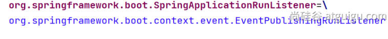
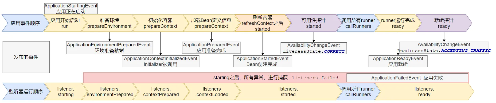

> 本文由 [简悦 SimpRead](http://ksria.com/simpread/) 转码， 原文地址 [blog.csdn.net](https://blog.csdn.net/qq_63946922/article/details/131008691)

# springboot3 核心特性

[TOC]


# 1、SpringBoot3 - 快速入门


## 1、简介

项目源码：
https://gitee.com/leifengyang/spring-boot-3

### 前置知识

●Java17

●Spring、SpringMVC、MyBatis

●Maven、IDEA

### 环境要求

<table> <thead> <tr> <th> 环境 &amp; 工具 </th> <th> 版本（or later）</th> </tr> </thead> <tbody> <tr> <td> SpringBoot </td> <td> 3.0.5+</td> </tr> <tr> <td> IDEA </td> <td> 2021.2.1+</td> </tr> <tr> <td> Java </td> <td> 17+</td> </tr> <tr> <td> Maven </td> <td> 3.5+</td> </tr> <tr> <td> Tomcat </td> <td> 10.0+</td> </tr> <tr> <td> Servlet </td> <td> 5.0+</td> </tr> <tr> <td> GraalVM Community </td> <td> 22.3+</td> </tr> <tr> <td> Native Build Tools </td> <td> 0.9.19+</td> </tr> </tbody> </table>

### SpringBoot 是什么

SpringBoot 帮我们简单、快速地创建一个独立的、生产级别的 **Spring 应用（说明：SpringBoot 底层是 Spring）**

大多数 SpringBoot 应用只需要编写少量配置即可快速整合 Spring 平台以及第三方技术

**特性：**

*   `快速创建` 独立 Spring 应用
    *   SSM：导包、写配置、启动运行


*   直接 `嵌入` Tomcat、Jetty or Undertow（无需部署 war 包）【Servlet 容器】

    *   linux java tomcat mysql： war 放到 tomcat 的 webapps 下
    *   jar： java 环境； `java -jar`


*   **重点**：提供可选的 `starter`，简化应用 **整合**
    
    *   **场景启动器**（starter）：web、json、邮件、oss（对象存储）、异步、定时任务、缓存…
    *   导包一堆，控制好版本。
    *   为每一种场景准备了一个依赖； **web-starter。mybatis-starter**
* **重点：** `按需自动配置` Spring 以及 第三方库


  *   如果这些场景我要使用（生效）。这个场景的所有配置都会自动配置好。

  *   **约定大于配置**：每个场景都有很多默认配置。
  *   自定义：配置文件中修改几项就可以
* 提供 `生产级特性`：如 监控指标、健康检查、外部化配置等


  *   监控指标、健康检查（k8s）、外部化配置

* 无代码生成、`无 xml`


总结：简化开发，简化配置，简化整合，简化部署，简化监控，简化运维。

## 2、快速体验

> 场景：浏览器发送 **/hello** 请求，返回 "**Hello, Spring Boot 3!**"

### 1. 开发流程

##### 1. 创建项目

maven 项目

```xml
<!--    所有springboot项目都必须继承自 spring-boot-starter-parent -->
    <parent>
        <groupId>org.springframework.boot</groupId>
        <artifactId>spring-boot-starter-parent</artifactId>
        <version>3.0.5</version>
    </parent>
```

##### 2. 导入场景

场景启动器

```xml
<dependencies>
<!--        web开发的场景启动器 -->
        <dependency>
            <groupId>org.springframework.boot</groupId>
            <artifactId>spring-boot-starter-web</artifactId>
        </dependency>
    </dependencies>
```

##### 3. 主程序

```java
@SpringBootApplication //这是一个 SpringBoot 应用
public class MainApplication {
    public static void main(String[] args) {
        SpringApplication.run(MainApplication.class,args);
    }
}
```

##### 4. 业务

然后在boot包内写controller包下写HelloController。
**springboot的包扫描逻辑是只扫描主程序当前包及其子包**

```java
@RestController
public class HelloController {

    @GetMapping("/hello")
    public String hello(){

        return "Hello,Spring Boot 3!";
    }
}
```

##### 5. 测试

默认启动访问： `localhost:8080`

##### 6. 打包

```xml
<!--    SpringBoot应用打包插件-->
    <build>
        <plugins>
            <plugin>
                <groupId>org.springframework.boot</groupId>
                <artifactId>spring-boot-maven-plugin</artifactId>
            </plugin>
        </plugins>
    </build>
```

`mvn clean package` 把项目打成可执行的 jar 包

`java -jar boot3-01-demo-1.0-SNAPSHOT.jar` 启动项目


##### 7、外部化配置

创建配置 application.properties，放到与 jar

包同级的

```properties
server.port=8888
```


不用重新编码 jar 包就修改了启动端口

### 2. 特性小结

#### 1. 简化整合

导入相关的场景，拥有相关的功能。场景启动器

默认支持的所有场景：https://docs.spring.io/spring-boot/docs/current/reference/html/using.html#using.build-systems.starters

*   官方提供的场景：命名为：`spring-boot-starter-*`
*   第三方提供场景：命名为：`*-spring-boot-starter`

场景一导入，万物皆就绪

#### 2. 简化开发

无需编写任何配置，直接开发业务

#### 3. 简化配置

`application.properties`：

*   集中式管理配置。只需要修改这个文件就行 。
*   配置基本都有默认值
*   能写的所有配置都在： https://docs.spring.io/spring-boot/docs/current/reference/html/application-properties.html#appendix.application-properties

#### 4. 简化部署

打包为可执行的 jar 包。

linux 服务器上有 java 环境。

#### 5. 简化运维

修改配置（外部放一个 application.properties 文件）、监控、健康检查。

### 3. Spring Initializr 创建向导

一键创建好整个项目结构


## 3、应用分析

#### 1. 依赖管理机制

思考：

1、为什么导入 `starter-web` 所有相关依赖都导入进来？

*   开发什么场景，导入什么 **场景启动器。**
*   **maven 依赖传递原则。A-B-C： A 就拥有 B 和 C**
*   导入 场景启动器。 场景启动器 自动把这个场景的所有核心依赖全部导入进来

2、为什么版本号都不用写？

*   每个 boot 项目都有一个父项目 `spring-boot-starter-parent`
*   parent 的父项目是 `spring-boot-dependencies` 中 `<properties>` 标签申明版本号 `dependencyManagement` 标签进行版本管理
*   父项目 **版本仲裁中心**，把所有常见的 jar 的依赖版本都声明好了。
*   比如：`mysql-connector-j`

3、自定义版本号

* 利用 maven 的就近原则

  * 直接在当前项目 `properties` 标签中声明父项目用的版本属性的 key
  
    ```xml
    <properties>
        <mysql.version>8.0.31</mysql.version> <!--  申明版本-->
    </properties>
    ```
  
    
  
  * 直接在 **导入依赖的时候声明版本**
  
    ```xml
    <dependency>
        <groupId>com.mysql</groupId>
        <artifactId>mysql-connector-j</artifactId><!--  申明版本-->
        <version>8.0.32</version> 
    </dependency>
    ```
  
    
  
  > maven 仲裁机制
  >
  > 1. **最短路径优先**：Maven 会根据依赖树中的路径长度来选择依赖版本。路径是指从项目的根节点（即当前项目）到特定依赖的路径。如果一个依赖可以通过多条路径访问，则会选择路径最短的那个版本。
  > 2. **声明顺序优先**：如果两个或多个依赖的路径长度相同，则在 `pom.xml` 文件中先声明的依赖会被优先考虑。
  > 3. **依赖管理优先**：在 `<dependencyManagement>` 部分定义的依赖可以覆盖子模块中的依赖版本声明。这意味着你可以在父 POM 中指定某些依赖的确切版本，从而强制所有子模块使用相同的版本。
  > 4. **继承和覆盖**：子 POM 可以从父 POM 继承依赖配置，并且可以选择覆盖这些配置。例如，如果父 POM 中指定了某个依赖的版本，而子 POM 中也声明了这个依赖但版本不同，则子 POM 中的版本将覆盖父 POM 中的版本。
  > 5. **排除传递依赖**：如果需要的话，可以通过在依赖声明中使用 `<exclusions>` 元素来排除某些传递依赖，这样就不会引入你不想要的依赖版本。

4、第三方的 jar 包

*   boot 父项目没有管理的需要自行声明好

```xml
<!-- https://mvnrepository.com/artifact/com.alibaba/druid -->
<dependency>
    <groupId>com.alibaba</groupId>
    <artifactId>druid</artifactId>
    <version>1.2.16</version>
</dependency>
```


#### 2. 自动配置机制

##### 1. 初步理解

*   **自动配置** 的 Tomcat、SpringMVC 等
    *   **导入场景**，容器中就会自动配置好这个场景的核心组件。
    *   以前：DispatcherServlet、ViewResolver、CharacterEncodingFilter…
    *   现在：自动配置好的这些组件
    *   验证：**容器中有了什么组件，就具有什么功能**


```java
public static void main(String[] args) {

        //java10： 局部变量类型的自动推断
        var ioc = SpringApplication.run(MainApplication.class, args);

        //1、获取容器中所有组件的名字
        String[] names = ioc.getBeanDefinitionNames();
        //2、挨个遍历：
        // dispatcherServlet、beanNameViewResolver、characterEncodingFilter、multipartResolver
        // SpringBoot 把以前配置的核心组件现在都给我们自动配置好了。
        for (String name : names) {
            System.out.println(name);
        }

    }
```

*   **默认的包扫描规则**
    *   `@SpringBootApplication` 标注的类就是主程序类
    *   **SpringBoot 只会扫描主程序所在的包及其下面的子包，自动的 component-scan 功能**
    *   **自定义扫描路径**
        1. `@SpringBootApplication(scanBasePackages = “com.atguigu”)`
        2. `@ComponentScan("com.atguigu")` 直接指定扫描的路径
*   **配置默认值**
  *   **配置文件** 的所有配置项是和某个 **类的对象** 值进行一一绑定的。
  *   绑定了配置文件中每一项值的类： **属性类**。
  *   比如：
     *   `ServerProperties` 绑定了所有 Tomcat 服务器有关的配置
      *   `MultipartProperties` 绑定了所有文件上传相关的配置
      *   … 参照 [官方文档](https://docs.spring.io/spring-boot/docs/current/reference/html/application-properties.html#appendix.application-properties.server)：或者参照 绑定的 **属性类**。
*   按需加载自动配置
    *   导入场景 `spring-boot-starter-web`
    *   场景启动器除了会导入相关功能依赖，导入一个 `spring-boot-starter`，是所有 `starter` 的 `starter`，基础核心 starter
    *   `spring-boot-starter` 导入了一个包 `spring-boot-autoconfigure`。包里面都是各种场景的 `AutoConfiguration` **自动配置类**
    *   虽然 **全场景的自动配置** 都在 `spring-boot-autoconfigure` 这个包，但是 **不是全都开启** 的。
        *   导入哪个场景就开启哪个自动配置

总结： 导入场景启动器、触发 `spring-boot-autoconfigure` 这个包的自动配置生效、容器中就会具有相关场景的功能

##### 2. 完整流程

思考：

**1、SpringBoot 怎么实现导一个 `starter`、写一些简单配置，应用就能跑起来，我们无需关心整合**

2、为什么 Tomcat 的端口号可以配置在 `application.properties` 中，并且 `Tomcat` 能启动成功？

3、导入场景后哪些 **自动配置能生效**？


_**自动配置流程细节梳理：**_

**一、** 导入 `starter-web`：导入了 web 开发场景

*   1、场景启动器导入了相关场景的所有依赖：`starter-json`、`starter-tomcat`、`springmvc`
*   2、**每个场景启动器都引入**了一个 `spring-boot-starter`，核心场景启动器。
*   3、**核心场景启动器** 引入了 `spring-boot-autoconfigure` 包。
*   4、`spring-boot-autoconfigure` 里面 **囊括了所有场景的所有配置**。
*   5、只要这个包下的所有类都能生效，那么相当于 SpringBoot 官方写好的整合功能就生效了。
*   6、SpringBoot 默认却扫描不到 `spring-boot-autoconfigure` 下写好的所有 **配置类**。（这些 **配置类** 给我们做了整合操作），**默认只扫描主程序所在的包**。

**二、** **主程序**：`@SpringBootApplication`

*   1、`@SpringBootApplication` 由三个注解组成 `@SpringBootConfiguration`、`@EnableAutoConfiguratio`、`@ComponentScan`

*   2、SpringBoot 默认只能扫描自己主程序所在的包及其下面的子包，扫描不到 `spring-boot-autoconfigure` 包中官方写好的 **配置类**

*   3、`@EnableAutoConfiguration`：SpringBoot **开启自动配置的核心**。
    *   1.  是由 `@Import(AutoConfigurationImportSelector.class)` 提供功能：批量给容器中导入组件。
    *   2.  SpringBoot 启动会默认加载 142 个配置类。
    *   3.  这 **142 个配置类** 来自于 `spring-boot-autoconfigure` 下 `META-INF/spring/org.springframework.boot.autoconfigure.AutoConfiguration.imports` 文件指定的
    *   项目启动的时候利用 `@Import` 批量导入组件机制把 `autoconfigure` 包下的 142 `xxxxAutoConfiguration` 类导入进来（**自动配置类**）
    *   虽然导入了 `142` 个自动配置类
*   4、按需生效：
    *   并不是这 `142` 个自动配置类都能生效
    *   每一个自动配置类，都有条件注解 `@ConditionalOnxxx`，只有条件成立，才能生效

**三、** `xxxxAutoConfiguration` **自动配置类**

*   **1、给容器中使用 @Bean 放一堆组件。**
*   2、每个 **自动配置类** 都基本都有这个注解 `@EnableConfigurationProperties(ServerProperties.class)`，用来把配置文件中配的指定前缀的属性值封装到 `xxxProperties` **属性类** 中
*   3、以 Tomcat 为例：把服务器的所有配置都是以 `server` 开头的。配置都封装到了属性类中。
*   4、给 **容器** 中放的所有 **组件** 的一些 **核心参数**，都来自于 `**xxxProperties**` **。** `**xxxProperties**` **都是和配置文件绑定。**
*   **只需要改配置文件的值，核心组件的底层参数都能修改**

**四、** 写业务，全程无需关心各种整合（底层这些整合写好了，而且也生效了）


**核心流程总结：**

1、导入 `starter`，就会导入 `autoconfigure` 包。

2、`autoconfigure` 包里面 有一个文件 `META-INF/spring/org.springframework.boot.autoconfigure.AutoConfiguration.imports`, 里面指定的所有启动要加载的自动配置类

3、@EnableAutoConfiguration 会自动的把上面文件里面写的所有 **自动配置类都导入进来。xxxAutoConfiguration 是有条件注解进行按需加载**

4、`xxxAutoConfiguration` 给容器中导入一堆组件，组件都是从 `xxxProperties` 中提取属性值

5、`xxxProperties` 又是和 **配置文件** 进行了绑定

 

效果： 导入 `starter`、修改配置文件，就能修改底层行为。

##### 3. 如何学好 SpringBoot

框架的框架、底层基于 Spring。能调整每一个场景的底层行为。100% 项目一定会用到 **底层自定义**

摄影：

*   傻瓜：自动配置好。
*   **单反**：焦距、光圈、快门、感光度…
*   傻瓜 + **单反**：


1. 理解 **自动配置原理**

   + **导入 starter** **–> 生效 xxxxAutoConfiguration -->** **组件** **–> xxxProperties -->** **配置文件**
2. 理解 **其他框架底层**
   + 拦截器
3. 可以随时 **定制化任何组件**

   + **配置文件**
   + **自定义组件**


普通开发：`导入starter`，Controller、Service、Mapper、偶尔修改配置文件

**高级开发**：自定义组件、自定义配置、自定义 starter

核心：

*   这个场景自动配置导入了哪些组件，我们能不能 Autowired 进来使用
*   能不能通过修改配置改变组件的一些默认参数
*   需不需要自己完全定义这个组件
*   场景定制化

**最佳实战**：

*   **选场景**，导入到项目
    *   官方：starter
    *   第三方：去仓库搜

*   **写配置，改配置文件关键项**
    *   数据库参数（连接地址、账号密码…）

*   分析这个场景给我们导入了**哪些能用的组件**
    *   **自动装配**这些组件进行后续使用
    *   不满意 boot 提供的自动配好的默认组件
        *   **定制化**
            *   改配置
            *   自定义组件


整合 redis：

*   [选场景](https://docs.spring.io/spring-boot/docs/current/reference/html/using.html#using.build-systems.starters)：`spring-boot-starter-data-redis`
    *   场景 AutoConfiguration 就是这个场景的自动配置类
*   写配置：
    
    *   分析到这个场景的自动配置类开启了哪些属性绑定关系
    *   `@EnableConfigurationProperties(RedisProperties.class)`
    *   修改 redis 相关的配置
*   分析组件：
    
    *   分析到 `RedisAutoConfiguration` 给容器中放了 `StringRedisTemplate`
    *   给业务代码中自动装配 `StringRedisTemplate`
*   定制化
    
    *   修改配置文件
    *   自定义组件，自己给容器中放一个 `StringRedisTemplate`

## 4、核心技能

### 1. 常用注解

SpringBoot 摒弃 XML 配置方式，改为 **全注解驱动**

#### 1. 组件注册

**@Configuration**、**@SpringBootConfiguration**

**@Bean**、**@Scope**

**@Controller、 @Service、@Repository、@Component**

**@Import**

@ComponentScan

步骤：

**1、@Configuration 编写一个配置类**

**2、在配置类中，自定义方法给容器中注册组件。配合 @Bean**

**3、或使用 @Import 导入第三方的组件**

```java
@Configuration//这是一个配置类，替代以前的配置文件。配置类本身也是容器中的组件
@Import(FastsqlException.class) //给容器中放指定类型的组件，组件的名字默认是全类名
public class AppConfig {
    

    @Scope("prototype")//1、组件默认是单实例的 ，从容器中获取多次都是同一个
//替代以前的 Bean 标签。 组件在容器中的名字默认是方法名，可以直接修改注解的值
    @Bean("userHaha") 
    public User user01(){
        var user = new User();
        user.setId(1L);
        user.setName("张三");
        return user;
    }
    
    //    @Bean 使用@Import 导入
//    public FastsqlException fastsqlException(){
//
//        return new FastsqlException();
//    }

}
```


#### 2. 条件注解

如果注解指定的 **条件成立**，则触发指定行为

_**@ConditionalOnXxx**_

**@ConditionalOnClass：如果类路径中存在这个类，则触发指定行为**

**@ConditionalOnMissingClass：如果类路径中不存在这个类，则触发指定行为**

**@ConditionalOnBean：如果容器中存在这个 Bean（组件），则触发指定行为**

**@ConditionalOnMissingBean：如果容器中不存在这个 Bean（组件），则触发指定行为**

**@ConditionalOnBean（value = 组件类型，name = 组件名字）：判断容器中是否有这个类型的组件，并且名字是指定的值**


@ConditionalOnRepositoryType (org.springframework.boot.autoconfigure.data)  
@ConditionalOnDefaultWebSecurity (org.springframework.boot.autoconfigure.security)  
@ConditionalOnSingleCandidate (org.springframework.boot.autoconfigure.condition)  
@ConditionalOnWebApplication (org.springframework.boot.autoconfigure.condition)  
@ConditionalOnWarDeployment (org.springframework.boot.autoconfigure.condition)  
@ConditionalOnJndi (org.springframework.boot.autoconfigure.condition)  
@ConditionalOnResource (org.springframework.boot.autoconfigure.condition)  
@ConditionalOnExpression (org.springframework.boot.autoconfigure.condition)  
**@ConditionalOnClass** (org.springframework.boot.autoconfigure.condition)  
@ConditionalOnEnabledResourceChain (org.springframework.boot.autoconfigure.web)  
**@ConditionalOnMissingClass** (org.springframework.boot.autoconfigure.condition)  
@ConditionalOnNotWebApplication (org.springframework.boot.autoconfigure.condition)  
@ConditionalOnProperty (org.springframework.boot.autoconfigure.condition)  
@ConditionalOnCloudPlatform (org.springframework.boot.autoconfigure.condition)  
**@ConditionalOnBean** (org.springframework.boot.autoconfigure.condition)  
**@ConditionalOnMissingBean** (org.springframework.boot.autoconfigure.condition)  
@ConditionalOnMissingFilterBean (org.springframework.boot.autoconfigure.web.servlet)  
@Profile (org.springframework.context.annotation)  
@ConditionalOnInitializedRestarter (org.springframework.boot.devtools.restart)  
@ConditionalOnGraphQlSchema (org.springframework.boot.autoconfigure.graphql)  
@ConditionalOnJava (org.springframework.boot.autoconfigure.condition)


> 场景：
>
> *   如果存在 `FastsqlException` 这个类，给容器中放一个 `Cat` 组件，名 cat01，
> *   否则，就给容器中放一个 `Dog` 组件，名 dog01
> *   如果系统中有 `dog01` 这个组件，就给容器中放一个 User 组件，名 zhangsan
> *   否则，就放一个 User，名叫 lisi

```java
@ConditionalOnMissingClass(value="com.alibaba.druid.FastsqlException") //放在类级别，如果注解判断生效，则整个配置类才生效
@SpringBootConfiguration
public class AppConfig2 {

    @ConditionalOnClass(name="com.alibaba.druid.FastsqlException") //放在方法级别，单独对这个方法进行注解判断。
    @Bean
    public Cat cat01(){
        return new Cat();
    }

	@ConditionalOnMissingClass(value="com.alibaba.druid.FastsqlException")
    @Bean
    public Dog dog01(){
        return new Dog();
    }

    @ConditionalOnBean(value = Dog.class)
    @Bean
    public User zhangsan(){
        return new User();
    }


    @ConditionalOnMissingBean(value = Dog.class)
    @Bean
    public User lisi(){
        return new User();
    }
}
```


#### 3. 属性绑定

+ **@ConfigurationProperties： 声明组件的属性和配置文件哪些前缀开始项进行绑定**

+ **@EnableConfigurationProperties：快速注册注解：**
  + 场景：SpringBoot 默认只扫描自己主程序所在的包。如果导入第三方包，即使组件上标注了 @Component、@ConfigurationProperties 注解，也没用。因为组件都扫描不进来，此时使用这个注解就可以快速进行属性绑定并把组件注册进容器


将容器中任意 **组件（Bean）的属性值** 和 **配置文件** 的配置项的值 **进行绑定**

*   **1、给容器中注册组件（@Component、@Bean）**
*   **2、使用** **@ConfigurationProperties 声明组件和配置文件的哪些配置项进行绑定 **


更多注解参照：[Spring 注解驱动开发](https://www.bilibili.com/video/BV1gW411W7wy/)【1-26 集】


配置配置文件中文乱码：


demo：

application.properties 配置文件：

```properties
pig.id=1
pig.name=佩奇
pig.age=5
```

实体类：

```java
//@Component
// @ConfigurationProperties(prefix = "pig")

@Data
public class Pig {
    private Long id;
    private String name;
    private Integer age;
}
```

配置类：

```java
@Bean
@ConfigurationProperties(prefix = "pig")
public Pig pig(){
    return new Pig(); //我们自己 new 新 pig
}
```


```java
@ConfigurationProperties(prefix = "sheep")
public class Sheep {
   private Long id;
    private String name;
    private Integer age;
    
}

/**
 * 1、开启 Sheep 组件的属性绑定
 * 2、默认会把这个组件自己放到容器中
 */
@EnableConfigurationProperties(Sheep.class) //导入第三方写好的组件进行属性绑定
//SpringBoot 默认只扫描自己主程序所在的包。如果导入第三方包，即使组件上标注了 @Component、@ConfigurationProperties 注解，也没用。因为组件都扫描不进来

@Configuration
public class AppConfig {
}
```


### 2. YAML 配置文件

**痛点**：SpringBoot 集中化管理配置，`application.properties`

**问题**：配置多以后难阅读和修改，**层级结构辨识度不高**

YAML 是 “YAML Ain’t a Markup Language”（YAML 不是一种标记语言）。在开发的这种语言时，YAML 的意思其实是：“Yet Another Markup Language”（是另一种标记语言）。

*   设计目标，就是 **方便人类读写**
*   **层次分明**，更适合做配置文件
*   使用 `.yaml` 或 `.yml` 作为文件后缀

#### 1. 基本语法

*   **大小写敏感**
*   使用 **缩进表示层级关系，k: v，使用空格分割 k, v**
*   缩进时不允许使用 Tab 键，只允许 **使用空格**。换行
*   缩进的空格数目不重要，只要 **相同层级** 的元素 **左侧对齐** 即可
*   **# 表示注释**，从这个字符一直到行尾，都会被解析器忽略。

支持的写法：

*   **对象**：**键值对** 的集合，如：映射（map）/ 哈希（hash） / 字典（dictionary）
*   **数组**：一组按次序排列的值，如：序列（sequence） / 列表（list）
*   **纯量**：单个的、不可再分的值，如：字符串、数字、bool、日期

#### 2. 示例

```java
@Component
@ConfigurationProperties(prefix = "person") //和配置文件person前缀的所有配置进行绑定
@Data //自动生成JavaBean属性的getter/setter
//@NoArgsConstructor //自动生成无参构造器
//@AllArgsConstructor //自动生成全参构造器
public class Person {
    private String name;
    private Integer age;
    private Date birthDay;//日期
    private Boolean like;
    private Child child; //嵌套对象
    private List<Dog> dogs; //数组（里面是对象）
    private Map<String,Cat> cats; //表示Map
}

@Data
public class Dog {
    private String name;
    private Integer age;
}

@Data
public class Child {
    private String name;
    private Integer age;
    private Date birthDay;
    private List<String> text; //数组
}

@Data
public class Cat {
    private String name;
    private Integer age;
}
```

```java
Person
(
name=张三, age=18, birthDay=Sun Oct 10 12:12:12 HKT 2010, like=true, 
child=Child(name=李四, age=20, birthDay=Wed Oct 10 00:00:00 HKT 2018, text=[abc, def]), 
dogs=[Dog(name=小黑, age=3), Dog(name=小白, age=2)], 
cats={c1=Cat(name=小蓝, age=3), c2=Cat(name=小绿, age=2)}
 )

```

##### properties 表示法

```properties
person.name=张三
person.age=18
person.birthDay=2010/10/12 12:12:12
person.like=true

# 对象
person.child.name=李四
person.child.age=12
person.child.birthDay=2018/10/12

#  对象中的数组
person.child.text[0]=abc
person.child.text[1]=def
# 数组的另一种表示：使用逗号分隔的字符串
# person.child.text=abc,def  

# 数组（里面是对象）
person.dogs[0].name=小黑
person.dogs[0].age=3
person.dogs[1].name=小白
person.dogs[1].age=2

# 表示Map
person.cats.c1.name=小蓝
person.cats.c1.age=3
person.cats.c2.name=小灰
person.cats.c2.age=2
```

##### yaml 表示法

```yaml
person:
  name: 张三
  age: 18
  birthDay: 2010/10/10 12:12:12
  like: true
  child:
    name: 李四
    age: 20
    birthDay: 2018/10/10
    text: ["abc","def"]
  dogs:
    - name: 小黑
      age: 3
    - name: 小白
      age: 2
  cats:
    c1:
      name: 小蓝
      age: 3
    c2: {name: 小绿,age: 2} #对象也可用{}表示
```

#### 3. 细节

*   birthDay 推荐写为 birth-day
*   **文本**：
    *   **单引号**不会转义【\n 则为普通字符串显示】
    *   **双引号** 会转义【\n 会显示为**换行符**】

*   **大文本**
    *   `|` 开头，大文本写在下层，**保留文本格式，换行符正确显示**
    *   `>` 开头，大文本写在下层，折叠换行符

*   **多文档合并**
    *   使用 `---` 可以把多个 yaml 文档合并在一个文档中，每个文档区依然认为内容独立


```properties
person:
  name: '张三 \n 123'
  child:
    name: "李四 \n 456"
    text:
      - abc
      - def
      - |
        dogs:
          - name: 小黑
            age: 3
          - name: 小白
            age: 2
      - >
        活动结束看大
        号节课第三
        带回家看
      - |
        dhhdh
        fjkdsl
        gflkd
```


```
==== 用 单引号 不会转义【\n 则为普通字符串显示】
张三 \n 123
==== 用 双引号 会转义【\n 则为普通字符串显示】
李四 
 456
==== 用|表示大文本，会保留格式
dogs:
  - name: 小黑
    age: 3
  - name: 小白
    age: 2

==== 用>表示大文本，会压缩换行变成 空格
活动结束看大 号节课第三 带回家看

==== 用|表示大文本，会压缩换行变成 空格
dhhdh
fjkdsl
gflkd

```


#### 4. 小技巧：lombok

简化 JavaBean 开发。自动生成构造器、getter/setter、自动生成 Builder 模式等

```xml
<dependency>
    <groupId>org.projectlombok</groupId>
    <artifactId>lombok</artifactId>
    <scope>compile</scope>
</dependency>
```

使用 `@Data` 等注解

### 3. 日志配置

规范：项目开发不要编写 `System.out.println()`，应该用 **日志** 记录信息


**感兴趣日志框架关系与起源可参考**：https://www.bilibili.com/video/BV1gW411W76m 视频 21~27 集

#### 1. 简介

1.  Spring 使用 `commons-logging` 作为内部日志，但底层日志实现是开放的。可对接其他日志框架。
    + spring5 及以后 commons-logging 被 spring 直接自己写了。
2.  支持 `jul`，`log4j2`, `logback`。SpringBoot 提供了默认的控制台输出配置，也可以配置输出为文件。
3.  `logback` 是默认使用的。
4.  虽然 **日志框架很多**，但是我们不用担心，使用 SpringBoot 的 **默认配置就能工作的很好**。


**SpringBoot 怎么把日志默认配置好的**

1、每个 `starter` 场景，都会导入一个核心场景 `spring-boot-starter`

2、核心场景引入了日志的所用功能 `spring-boot-starter-logging`

3、默认使用了 `logback + slf4j` 组合作为默认底层日志

4、`日志是系统一启动就要用`，`xxxAutoConfiguration` 是系统启动好了以后放好的组件，后来用的。

5、日志是利用 **监听器机制** 配置好的。`ApplicationListener`。

6、日志所有的配置都可以通过修改配置文件实现。以 `logging` 开始的所有配置。

#### 2. 日志格式

```shell
2023-03-31T13:56:17.511+08:00  INFO 4944 --- [           main] o.apache.catalina.core.StandardService   : Starting service [Tomcat]
2023-03-31T13:56:17.511+08:00  INFO 4944 --- [           main] o.apache.catalina.core.StandardEngine    : Starting Servlet engine: [Apache Tomcat/10.1.7]
```

默认输出格式：

*   时间和日期：毫秒级精度
*   日志级别：`ERROR,` `WARN`, `INFO`, `DEBUG`, or `TRACE`.
*   进程 ID
*   —： 消息分割符
*   线程名： 使用 [] 包含
*   Logger 名： 通常是产生日志的 **类名**
*   消息： 日志记录的内容

注意： logback 没有 FATAL 级别，对应的是 ERROR

默认值：参照：`spring-boot` 包 `additional-spring-configuration-metadata.json` 文件

默认输出格式值：`%clr(%d{${LOG_DATEFORMAT_PATTERN:-yyyy-MM-dd'T'HH:mm:ss.SSSXXX}}){faint} %clr(${LOG_LEVEL_PATTERN:-%5p}) %clr(${PID:- }){magenta} %clr(---){faint} %clr([%15.15t]){faint} %clr(%-40.40logger{39}){cyan} %clr(:){faint} %m%n${LOG_EXCEPTION_CONVERSION_WORD:-%wEx}`

可修改为：`'%d{yyyy-MM-dd HH:mm:ss.SSS} %-5level [%thread] %logger{15} ===> %msg%n'`

#### 3. 记录日志

```java
Logger logger = LoggerFactory.getLogger(getClass());
或者使用Lombok的@Slf4j注解
    
logger.trace("trace 日志.....");
log.debug("debug 日志.....");
//SpringBoot底层默认的日志级别 info
log.info("info 日志..... 参数a:{} b:{}",a,b);
log.warn("warn 日志...");
log.error("error 日志...");
```

#### 4. 日志级别

*   由低到高：`ALL,TRACE, DEBUG, INFO, WARN, ERROR,FATAL,OFF`；
    *   **只会打印指定级别及以上级别的日志**
    *   <span style="color:#0000CC;">ALL：打印所有日志</span>
    *   <span style="color:#4C9900;">TRACE：追踪框架详细流程日志，一般不使用</span>
    *   <span style="color:#4C9900;">DEBUG：开发调试细节日志</span>
    *   <span style="color:#4C9900;">INFO：关键、感兴趣信息日志</span>
    *   <span style="color:#999900;">WARN：警告但不是错误的信息日志，比如：版本过时</span>
    *   <span style="color:#CC0000;">ERROR：业务错误日志，比如出现各种异常</span>
    *   <span style="color:#CC0000;">FATAL：致命错误日志，比如 jvm 系统崩溃</span>
    *   OFF：关闭所有日志记录
*   不指定级别的所有类，都使用 root 指定的级别作为默认级别
*   SpringBoot 日志 **默认级别是** **<span style="color:#FF0000;">INFO</span>**


1.  在 application.properties/yaml 中配置 logging.level.= 指定日志级别
2.  level 可取值范围：`TRACE, DEBUG, INFO, WARN, ERROR, FATAL, or OFF`，定义在 `LogLevel` 类中
3.  root 的 logger-name 叫 root，可以配置 logging.level.root = warn，代表所有未指定日志级别都使用 root 的 warn 级别

```properties
#默认所有日志没有精确指定级别就使用root的默认级别
logging.level.root=info

#精确调整某个包下的日志级别
logging.level.com.atguigu.logging.controller=debug
logging.level.com.atguigu.logging.service=debug
logging.level.com.aaa=debug
logging.level.com.bbb=debug
```


#### 5. 日志分组

比较有用的技巧是：

将相关的 logger 分组在一起，统一配置。SpringBoot 也支持。比如：Tomcat 相关的日志统一设置

```properties
# 设置tomcat组
logging.group.tomcat=org.apache.catalina,org.apache.coyote,org.apache.tomcat
# 将tomcat组 设置为trace级别
logging.level.tomcat=trace
```

SpringBoot 预定义两个组，可以方便的设置web和sql的日志级别

| Name | Loggers                                                      |
| ---- | ------------------------------------------------------------ |
| web  | org.springframework.core.codec, org.springframework.http, org.springframework.web, org.springframework.boot.actuate.endpoint.web, org.springframework.boot.web.servlet.ServletContextInitializerBeans |
| sql  | org.springframework.jdbc.core, org.hibernate.SQL, org.jooq.tools.LoggerListener |

#### 6. 文件输出

SpringBoot 默认只把日志写在控制台，如果想额外记录到文件，可以在 application.properties 中添加 logging.file.name or logging.file.path 配置项。

| logging.file.name | logging.file.path | 示例     | 效果                             |
| ----------------- | ----------------- | -------- | -------------------------------- |
| 未指定            | 未指定            |          | 仅控制台输出                     |
| **指定**          | 未指定            | my.log   | 写入指定文件。可以加路径         |
| 未指定            | **指定**          | /var/log | 写入指定目录，文件名为spring.log |
| **指定**          | **指定**          |          | 以logging.file.name为准          |


```properties
#指定日志文件的路径, 日志文件默认名叫 spring.log
#logging.file.path=D:\\
#指定日志文件的名： filename 和 path的配置同时存在只看filename
# 1、只写名字： 就生成到当前项目同位置的 my.log
# 2、写名字+路径：生成到指定位置的指定文件
logging.file.name=my.log
```

#### 7. 文件归档与滚动切割

归档：每天的日志单独存到一个文档中。

切割：每个文件 10MB，超过大小切割成另外一个文件。

1.  每天的日志应该独立分割出来存档。如果使用 `logback`（SpringBoot 默认整合），可以通过 `application.properties/yaml` 文件指定日志滚动规则。
2.  如果是其他日志系统，需要自行配置（添加 `log4j2.xml` 或 `log4j2-spring.xml`）
3.  支持的滚动规则设置如下

| 配置项                                                 | 描述                                                         |
| ------------------------------------------------------ | ------------------------------------------------------------ |
| `logging.logback.rollingpolicy.file-name-pattern`      | 日志存档的文件名格式（默认值：`${LOG_FILE}.%d{yyyy-MM-dd}.%i.gz）` |
| `logging.logback.rollingpolicy.clean-history-on-start` | 应用启动时是否清除以前存档（默认值：false）                  |
| `logging.logback.rollingpolicy.max-file-size`          | 存档前，每个日志文件的最大大小（默认值：10MB）               |
| `logging.logback.rollingpolicy.total-size-cap`         | 日志文件被删除之前，可以容纳的最大大小（默认值：0B）。设置1GB则磁盘存储超过 1GB 日志后就会删除旧日志文件 |
| `logging.logback.rollingpolicy.max-history`            | 日志文件保存的最大天数(默认值：7).                           |


#### 8. 自定义配置

通常我们配置 application.properties 就够了。当然也可以自定义。比如：

| 日志系统                | 自定义                                                       |
| ----------------------- | ------------------------------------------------------------ |
| Logback                 | logback-spring.xml, logback-spring.groovy, logback.xml, or logback.groovy |
| Log4j2                  | log4j2-spring.xml or log4j2.xml                              |
| JDK (Java Util Logging) | logging.properties                                           |


如果可能，我们建议您在日志配置中使用 `-spring` 变量（例如，`logback-spring.xml` 而不是 `logback.xml`）。如果您使用标准配置文件，spring 无法完全控制日志初始化。

最佳实战：自己要写配置，配置文件名加上 `xx-spring.xml`

#### 9. 切换日志组合

```xml
<dependency>
    <groupId>org.springframework.boot</groupId>
    <artifactId>spring-boot-starter-web</artifactId>
</dependency>
<dependency>
    <groupId>org.springframework.boot</groupId>
    <artifactId>spring-boot-starter</artifactId>
    <exclusions>
        <exclusion>
            <groupId>org.springframework.boot</groupId>
            <artifactId>spring-boot-starter-logging</artifactId>
        </exclusion>
    </exclusions>
</dependency>
<dependency>
    <groupId>org.springframework.boot</groupId>
    <artifactId>spring-boot-starter-log4j2</artifactId>
</dependency>
```

log4j2 支持 yaml 和 json 格式的配置文件

| 格式 | 依赖                                                         | 文件名                   |
| ---- | ------------------------------------------------------------ | ------------------------ |
| YAML | com.fasterxml.jackson.core:jackson-databind + com.fasterxml.jackson.dataformat:jackson-dataformat-yaml | log4j2.yaml + log4j2.yml |
| JSON | com.fasterxml.jackson.core:jackson-databind                  | log4j2.json + log4j2.jsn |

#### 10. 最佳实战

1.  导入任何第三方框架，先排除它的日志包，因为 Boot 底层控制好了日志
2.  修改 `application.properties` 配置文件，就可以调整日志的所有行为。如果不够，可以编写日志框架自己的配置文件放在类路径下就行，比如 `logback-spring.xml`，`log4j2-spring.xml`
3.  如需对接 **专业日志系统**，也只需要把 logback 记录的 **日志** 灌倒 **kafka** 之类的中间件，这和 SpringBoot 没关系，都是日志框架自己的配置，**修改配置文件即可**
4.  **业务中使用 slf4j-api 记录日志。不要再 sout 了**


# 2、SpringBoot3-Web 开发


SpringBoot 的 Web 开发能力，由 **SpringMVC** 提供。

### 0. WebMvcAutoConfiguration 原理

#### 1. 生效条件

```java
@AutoConfiguration(after = { DispatcherServletAutoConfiguration.class, TaskExecutionAutoConfiguration.class,
		ValidationAutoConfiguration.class }) //在这些自动配置之后
@ConditionalOnWebApplication(type = Type.SERVLET) //如果是web应用就生效，类型SERVLET、REACTIVE 响应式web
@ConditionalOnClass({ Servlet.class, DispatcherServlet.class, WebMvcConfigurer.class })
@ConditionalOnMissingBean(WebMvcConfigurationSupport.class) //容器中没有这个Bean，才生效。默认就是没有
@AutoConfigureOrder(Ordered.HIGHEST_PRECEDENCE + 10)//优先级
@ImportRuntimeHints(WebResourcesRuntimeHints.class)
public class WebMvcAutoConfiguration { 
}
```

**只有一个有参构造器，而容器中的组件的构造器和方法的值如果容器中有会自动从容器里取。**

```java
public WebMvcAutoConfigurationAdapter(WebProperties webProperties, WebMvcProperties mvcProperties,
        ListableBeanFactory beanFactory, ObjectProvider<HttpMessageConverters> messageConvertersProvider,
        ObjectProvider<ResourceHandlerRegistrationCustomizer> resourceHandlerRegistrationCustomizerProvider,
        ObjectProvider<DispatcherServletPath> dispatcherServletPath,
        ObjectProvider<ServletRegistrationBean<?>> servletRegistrations) {
    this.resourceProperties = webProperties.getResources();
    this.mvcProperties = mvcProperties;
    this.beanFactory = beanFactory;
    this.messageConvertersProvider = messageConvertersProvider;
    this.resourceHandlerRegistrationCustomizer = resourceHandlerRegistrationCustomizerProvider.getIfAvailable();
    this.dispatcherServletPath = dispatcherServletPath;
    this.servletRegistrations = servletRegistrations;
    this.mvcProperties.checkConfiguration();
}
```


#### 2. 效果

1.  放了两个 Filter：
    + `HiddenHttpMethodFilter`；页面表单提交 Rest 请求（GET、POST、PUT、DELETE）
    + `FormContentFilter`： 表单内容 Filter，GET（数据放 URL 后面）、POST（数据放请求体）请求可以携带数据，PUT、DELETE 的请求体数据会被忽略
2.  给容器中放了 `WebMvcConfigurer` 组件；给 SpringMVC 添加各种定制功能
    + 所有的功能最终会和配置文件进行绑定
      + WebMvcProperties： `spring.mvc` 配置文件
      + WebProperties： `spring.web` 配置文件

```java
@Configuration(proxyBeanMethods = false)
@Import(EnableWebMvcConfiguration.class) //额外导入了其他配置  参考第5小结
@EnableConfigurationProperties({ WebMvcProperties.class, WebProperties.class })
@Order(0)
public static class WebMvcAutoConfigurationAdapter implements WebMvcConfigurer, ServletContextAware{

}
```

#### 3. WebMvcConfigurer 接口

提供了**配置 SpringMVC 底层的所有组件入口**


1. 参数解析器：SpringMVC的组件里面的参数自动获取需要从ioc获取
1. 跨域：用于前后端分离
1. 格式化器：如从配置文件的日期字节流读成规定格式的如Date类型的数据
1. 拦截器：SpringMVC的拦截器
1. 资源处理器：处理静态资源规则
1. 视图控制器：springmvc学过，不写Controller方法，直接在配置文件里写的一些网页，如index
1. 消息转化器：做消息转化用的，一般不用管


#### 4. 静态资源规则源码

```java
// org.springframework.boot.autoconfigure.web.servlet.WebMvcAutoConfiguration.WebMvcAutoConfigurationAdapter#addResourceHandlers

@Override
public void addResourceHandlers(ResourceHandlerRegistry registry) {
    if (!this.resourceProperties.isAddMappings()) {
        logger.debug("Default resource handling disabled");
        return;
    }
    //1、规则一  /webjars/**
    addResourceHandler(registry, this.mvcProperties.getWebjarsPathPattern(),
            "classpath:/META-INF/resources/webjars/");
    	//规则二    /**  
    addResourceHandler(registry, this.mvcProperties.getStaticPathPattern(), (registration) -> {
    
        registration.addResourceLocations(this.resourceProperties.getStaticLocations());
        if (this.servletContext != null) {
            ServletContextResource resource = new ServletContextResource(this.servletContext, SERVLET_LOCATION);
            registration.addResourceLocations(resource);
        }
    });
}
```

1. 规则一：访问： `/webjars/**` 路径就去 `classpath:/META-INF/resources/webjars/` 下找资源.

   + WebJars是一种将客户端的Web库（如JavaScript和CSS库）打包进JAR文件的技术，这样可以利用Maven或Gradle等构建工具来管理这些依赖。通过使用WebJars，你可以更方便地在Java web应用程序中管理和更新前端库，而无需手动下载和配置这些资源

   + > 访问路径：`http://localhost:9000/webjars/ant-design__icons-vue/6.0.1/AccountBookFilled.js`可以获取jar包内的JS文件
     >
     > 

     

2. 规则二：访问： `/**` 路径就去 `静态资源默认的四个位置找资源`,说明：`classpath等于src/main/resources`

   + `classpath:/META-INF/resources/`
   + `classpath:/resources/`
   + `classpath:/static/`
   + `classpath:/public/`

3. 规则三：**静态资源默认都有缓存规则的设置**

   + 所有缓存的设置，直接通过 **配置文件**： `spring.web`
   + cachePeriod： 缓存周期； 多久不用找服务器要新的。 默认没有，以 s 为单位
   + cacheControl： **HTTP 缓存** 控制；[https://developer.mozilla.org/zh-CN/docs/Web/HTTP/Caching](https://developer.mozilla.org/zh-CN/docs/Web/HTTP/Caching#%E6%A6%82%E8%A7%88)
   + **useLastModified**：是否使用最后一次修改。配合 HTTP Cache 规则 ，请求图片前先请求最后一次修改时间作对比有就上一次浏览器缓存的，时间不同就从服务器获取。

>  如果浏览器访问了一个静态资源 index.js，如果服务这个资源没有发生变化，下次访问的时候就可以直接让浏览器用自己缓存中的东西，而不用给服务器发请求。

```java
registration.setCachePeriod(getSeconds(this.resourceProperties.getCache().getPeriod()));
registration.setCacheControl(this.resourceProperties.getCache().getCachecontrol().toHttpCacheControl());
registration.setUseLastModified(this.resourceProperties.getCache().isUseLastModified());
```

#### 5. EnableWebMvcConfiguration 源码 和欢迎页

```java
//SpringBoot 给容器中放 WebMvcConfigurationSupport 组件。
//我们如果自己放了 WebMvcConfigurationSupport 组件，Boot的WebMvcAutoConfiguration都会失效。但是
@Configuration(proxyBeanMethods = false)
@EnableConfigurationProperties(WebProperties.class)
public static class EnableWebMvcConfiguration extends DelegatingWebMvcConfiguration implements ResourceLoaderAware 
{

    	@Bean
		public WelcomePageHandlerMapping welcomePageHandlerMapping(ApplicationContext applicationContext,
				FormattingConversionService mvcConversionService, ResourceUrlProvider mvcResourceUrlProvider) {
			return createWelcomePageHandlerMapping(applicationContext, mvcConversionService, mvcResourceUrlProvider,
					WelcomePageHandlerMapping::new);
		}
    
}
```

1.  `HandlerMapping`： 根据请求路径 `/a` 找那个 handler 能处理请求
    + `WelcomePageHandlerMapping`：
      + 访问 `/**` 路径下的所有请求，都在以前四个静态资源路径下找，欢迎页也一样
      + 找 `index.html`：只要静态资源的位置有一个 `index.html` 页面，项目启动默认访问

#### 6. 为什们容器中放一个 `WebMvcConfigurer` 就能配置底层行为

1.  `WebMvcAutoConfiguration` 是一个自动配置类，它里面有一个 `EnableWebMvcConfiguration`
2.  `EnableWebMvcConfiguration` 继承与 `DelegatingWebMvcConfiguration`，这两个都生效
3.  `DelegatingWebMvcConfiguration` 利用 DI 把容器中 **所有 `WebMvcConfigurer` 注入进来**
4.  别人调用 `DelegatingWebMvcConfiguration` 的方法配置底层规则，而它调用所有 `WebMvcConfigurer` 的配置底层方法。

```java
	@Configuration(proxyBeanMethods = false)
	@Import(EnableWebMvcConfiguration.class)
	@EnableConfigurationProperties({ WebMvcProperties.class, WebProperties.class })
	@Order(0)
	public static class WebMvcAutoConfigurationAdapter implements WebMvcConfigurer, ServletContextAware {
```


```java
public static class EnableWebMvcConfiguration extends DelegatingWebMvcConfiguration 
```


```java
@Configuration(proxyBeanMethods = false)
public class DelegatingWebMvcConfiguration extends WebMvcConfigurationSupport {
//WebMvcConfigurerComposite 是 Spring Framework 中用于组合多个 WebMvcConfigurer 实例的一个实现类。它允许你将多个配置类整合在一起，从而使得不同的配置类可以专注于不同的方面或模块的配置，而不必将所有的配置都集中在一个类中。这种做法提高了代码的模块化和可维护性。
	private final WebMvcConfigurerComposite configurers = new WebMvcConfigurerComposite();

    // 构造器注入容器所有的WebMvcConfigurer 类
	@Autowired(required = false)
	public void setConfigurers(List<WebMvcConfigurer> configurers) {
		if (!CollectionUtils.isEmpty(configurers)) {
			this.configurers.addWebMvcConfigurers(configurers);
		}
	}
    @Override
	protected void configurePathMatch(PathMatchConfigurer configurer) {
		this.configurers.configurePathMatch(configurer);
	}
    
}
```

在 `WebMvcConfigurerComposite` 中，这些方法的实现通常遵循一个模式：遍历所有存储的 WebMvcConfigurer 实例，并对每个实例调用对应的方法。例如，对于 addFormatters(FormatterRegistry registry) 方法，其实现可能是这样的：

```Java
@Override
public void addFormatters(FormatterRegistry registry) {
    for (WebMvcConfigurer delegate : this.delegates) {
        if (delegate == null) {
            continue;
        }
        delegate.addFormatters(registry);
    }
}
```


#### 7. WebMvcConfigurationSupport

提供了很多的默认设置。

判断系统中是否有相应的类：如果有，就加入相应的 `HttpMessageConverter`

```java
jackson2Present = ClassUtils.isPresent("com.fasterxml.jackson.databind.ObjectMapper", classLoader) &&
				ClassUtils.isPresent("com.fasterxml.jackson.core.JsonGenerator", classLoader);
jackson2XmlPresent = ClassUtils.isPresent("com.fasterxml.jackson.dataformat.xml.XmlMapper", classLoader);
jackson2SmilePresent = ClassUtils.isPresent("com.fasterxml.jackson.dataformat.smile.SmileFactory", classLoader);
```

### 1. Web 场景

#### 1. 自动配置

1、整合 web 场景

```xml
<dependency>
    <groupId>org.springframework.boot</groupId>
    <artifactId>spring-boot-starter-web</artifactId>
</dependency>
```

2、引入了 `autoconfigure` 功能

3、`@EnableAutoConfiguration` 注解使用 `@Import(AutoConfigurationImportSelector.class)` 批量导入组件

4、加载 `META-INF/spring/org.springframework.boot.autoconfigure.AutoConfiguration.imports` 文件中配置的所有组件

5、所有自动配置类如下

```
org.springframework.boot.autoconfigure.web.client.RestTemplateAutoConfiguration
org.springframework.boot.autoconfigure.web.embedded.EmbeddedWebServerFactoryCustomizerAutoConfiguration
====以下是响应式web场景和现在的没关系======
org.springframework.boot.autoconfigure.web.reactive.HttpHandlerAutoConfiguration
org.springframework.boot.autoconfigure.web.reactive.ReactiveMultipartAutoConfiguration
org.springframework.boot.autoconfigure.web.reactive.ReactiveWebServerFactoryAutoConfiguration
org.springframework.boot.autoconfigure.web.reactive.WebFluxAutoConfiguration
org.springframework.boot.autoconfigure.web.reactive.WebSessionIdResolverAutoConfiguration
org.springframework.boot.autoconfigure.web.reactive.error.ErrorWebFluxAutoConfiguration
org.springframework.boot.autoconfigure.web.reactive.function.client.ClientHttpConnectorAutoConfiguration
org.springframework.boot.autoconfigure.web.reactive.function.client.WebClientAutoConfiguration
================以上没关系=================
org.springframework.boot.autoconfigure.web.servlet.DispatcherServletAutoConfiguration
org.springframework.boot.autoconfigure.web.servlet.ServletWebServerFactoryAutoConfiguration
org.springframework.boot.autoconfigure.web.servlet.error.ErrorMvcAutoConfiguration
org.springframework.boot.autoconfigure.web.servlet.HttpEncodingAutoConfiguration
org.springframework.boot.autoconfigure.web.servlet.MultipartAutoConfiguration
org.springframework.boot.autoconfigure.web.servlet.WebMvcAutoConfiguration
```

6、绑定了配置文件的一堆配置项

*   1、SpringMVC 的所有配置 `spring.mvc`
*   2、Web 场景通用配置 `spring.web`
*   3、文件上传配置 `spring.servlet.multipart`
*   4、服务器的配置 `server`: 比如：编码方式

#### 2. 默认效果

默认配置：

1.  包含了 `ContentNegotiatingViewResolver[内容协商视图解析器]` 和 `BeanNameViewResolver` 组件，**方便视图解析**
2.  **默认的静态资源处理机制**： 静态资源放在 `static` 文件夹下即可直接访问
3.  **自动注册** 了 **`Converter`**, `GenericConverter`, **`Formatter`** 组件，适配常见 **数据类型转换** 和 **格式化需求**
4.  **支持** **`HttpMessageConverters`**，可以 **方便返回** json 等 **数据类型**
5.  **注册** `MessageCodesResolver`，方便 **国际化** 及错误消息处理
6.  **支持 静态** `index.html`
7.  **自动使用** `ConfigurableWebBindingInitializer`，实现消息处理、数据绑定、类型转化、数据校验等功能

> **重要：**
>
> *   如果想保持 **boot mvc 的默认配置**，并且**自定义更多的 mvc 配置**，如：`interceptors`,
>     `formatters`, `view` `controllers` 等。可以使用`@Configuration`注解添加一个
>     `WebMvcConfigurer` 类型的配置类，并不要标注 `@EnableWebMvc`
> *   如果想**保持 boot mvc 的默认配置**，但要**自定义核心组件实例**，比如：
>     `RequestMappingHandlerMapping`, `RequestMappingHandlerAdapter`, 或
>     `ExceptionHandlerExceptionResolver`，给容器中放一个 `WebMvcRegistrations` 组件即可
> *   如果想**全面接管 Spring MVC**，`@Configuration` 标注一个配置类，并加上
>     `@EnableWebMvc`注解，实现 `WebMvcConfigurer` 接口

### 2. 静态资源

#### 1. 默认规则

##### 1. 静态资源映射

静态资源映射规则在 `WebMvcAutoConfiguration` 中进行了定义：

1.  `/webjars/**` 的所有路径 资源都在 `classpath:/META-INF/resources/webjars/`
2.  `/**` 的所有路径 资源都在 `classpath:/META-INF/resources/`、`classpath:/resources/`、`classpath:/static/`、`classpath:/public/`
3.  所有静态资源都定义了缓存规则。【浏览器访问过一次，就会缓存一段时间】，但此功能参数无默认值
    + period： 缓存间隔。 默认 0S；
    + cacheControl：缓存控制。 默认无；
    + useLastModified：是否使用 lastModified 头。 默认 false；

##### 2. 静态资源缓存

如前面所述

1.  所有静态资源都定义了缓存规则。【浏览器访问过一次，就会缓存一段时间】，但此功能参数无默认值
    + period： 缓存间隔。 默认 0S；
    + cacheControl：缓存控制。 默认无；
    + useLastModified：是否使用 lastModified 头。 默认 false；

##### 3. 欢迎页

欢迎页规则在 WebMvcAutoConfiguration 中进行了定义：

1.  在 **静态资源** 目录下找 index.html
2.  没有就在 templates 下找 index 模板页

##### 4. Favicon

1.  在静态资源目录下找 favicon.ico

##### 5. 缓存实验

```properties
server.port=9000

#1、spring.web：
# 1.配置国际化的区域信息
# 2.静态资源策略(开启、处理链、缓存)

#开启静态资源映射规则
spring.web.resources.add-mappings=true

#设置缓存
#spring.web.resources.cache.period=3600
##缓存详细合并项控制，覆盖period配置：
## 浏览器第一次请求服务器，服务器告诉浏览器此资源缓存7200秒，7200秒以内的所有此资源访问不用发给服务器请求，7200秒以后发请求给服务器
spring.web.resources.cache.cachecontrol.max-age=7200
#使用资源 last-modified 时间，来对比服务器和浏览器的资源是否相同没有变化。相同返回  http状态码304
spring.web.resources.cache.use-last-modified=true
```

#### 2. 自定义静态资源规则

自定义静态资源路径、自定义缓存规则

##### 1. 配置方式

1. `spring.mvc`： 静态资源访问前缀路径

2. `spring.web`：

   + 静态资源目录

   + 静态资源缓存策略

```properties
#开启静态资源映射规则 默认true
spring.web.resources.add-mappings=true

#设置缓存
spring.web.resources.cache.period=3600
##缓存详细合并项控制，覆盖period配置：
## 浏览器第一次请求服务器，服务器告诉浏览器此资源缓存7200秒，7200秒以内的所有此资源访问不用发给服务器请求，7200秒以后发请求给服务器
spring.web.resources.cache.cachecontrol.max-age=7200
## 共享缓存
spring.web.resources.cache.cachecontrol.cache-public=true
#使用资源 last-modified 时间，来对比服务器和浏览器的资源是否相同没有变化。相同返回 304
spring.web.resources.cache.use-last-modified=true

#自定义静态资源文件夹位置
spring.web.resources.static-locations=classpath:/a/,classpath:/b/,classpath:/static/

#2、 spring.mvc
## 2.1. 自定义webjars路径前缀
spring.mvc.webjars-path-pattern=/wj/**
## 2.2. 静态资源访问路径前缀  static后面的才是静态资源的磁盘路径
spring.mvc.static-path-pattern=/static/**
```

开启静态资源映射规则对应源码

```shell
# 开启静态资源映射规则
spring.web.resources.add-mappings=true
```


 

> 测试
>
> + http://localhost:9000/static/2.jpg 可以访问
> + http://localhost:9000/static/3.jpg 不可以访问
>
> 


##### 2. 代码方式

*   容器中只要有一个 WebMvcConfigurer 组件。配置的底层行为都会生效
*   `@EnableWebMvc // 禁用 boot 的默认配置`

```java
@Configuration //这是一个配置类
public class MyConfig implements WebMvcConfigurer {


    @Override
    public void addResourceHandlers(ResourceHandlerRegistry registry) {
        //保留以前规则
         // 保留以前的springmvc自定义的配置，不写也成立 boot的会自动调用
        // WebMvcConfigurer.super.addResourceHandlers(registry);
        
        //自己写新的规则。
        registry.addResourceHandler("/static/**")
                .addResourceLocations("classpath:/a/","classpath:/b/")
                .setCacheControl(CacheControl.maxAge(1180, TimeUnit.SECONDS));
    }
}
```

```java
//另外一种写法
@Configuration //这是一个配置类,给容器中放一个 WebMvcConfigurer 组件，就能自定义底层
public class MyConfig  /*implements WebMvcConfigurer*/ {


    @Bean
    public WebMvcConfigurer webMvcConfigurer(){
        return new WebMvcConfigurer() {
            @Override
            public void addResourceHandlers(ResourceHandlerRegistry registry) {
                registry.addResourceHandler("/static/**")
                        .addResourceLocations("classpath:/a/", "classpath:/b/")
                        .setCacheControl(CacheControl.maxAge(1180, TimeUnit.SECONDS));
            }
        };
    }

}
```

### 3. 路径匹配

**Spring5.3** 之后加入了更多的请求路径匹配的实现策略；

以前只支持 AntPathMatcher 策略, 现在提供了 **PathPatternParser** 策略。并且可以让我们指定到底使用那种策略。

#### 1. Ant 风格路径用法

Ant 风格的路径模式语法具有以下规则：

- `*`：表示**任意数量**的字符。
- `?`：表示任意**一个字符**。
- `**`：表示**任意数量的目录**。
- `{}`：表示一个命名的模式**占位符**。
- `[]`：表示**字符集合**，例如`[a-z]`表示小写字母。

例如：

- `*.html` 匹配任意名称，扩展名为`.html`的文件。

- `/folder1/*/*.java` 匹配在`folder1`目录下的任意两级目录下的`.java`文件。

- `/folder2/**/*.jsp` 匹配在`folder2`目录下任意目录深度的`.jsp`文件。

- `/{type}/{id}.html` 匹配任意文件名为`{id}.html`，在任意命名的`{type}`目录下的文件。

  

注意：Ant 风格的路径模式语法中的特殊字符需要转义，如：

- 要匹配文件路径中的星号，则需要转义为 `\\*`
- 要匹配文件路径中的问号，则需要转义为 `\\?`

#### 2. 模式切换

`AntPathMatcher` 与 `PathPatternParser`
● `PathPatternParser` 在 jmh 基准测试下，有 6~8 倍吞吐量提升，降低 30%~40%空间分配率
● `PathPatternParser` 兼容 `AntPathMatcher`语法，并支持更多类型的路径模式
● `PathPatternParser` `"**"` **多段匹配** 的支持**仅允许在模式末尾使用**

```java
/**
 * 默认使用新版 PathPatternParser 进行路径匹配
 * 不能匹配 ** 在中间的情况，剩下的和 antPathMatcher语法兼容
 */
@GetMapping("/a*/b?/{p1:[a-f]+}")
public String hello(HttpServletRequest request, 
                    @PathVariable("p1") String path) {

    log.info("路径变量p1： {}", path);
    //获取请求路径
    String uri = request.getRequestURI();
    return uri;
}
```

总结：

- 使用默认的路径匹配规则，是由 `PathPatternParser `提供的
- 如果路径中间需要有 `**`，替换成ant风格路径

```properties
# 改变路径匹配策略：
# ant_path_matcher 老版策略；
# path_pattern_parser 新版策略；
spring.mvc.pathmatch.matching-strategy=ant_path_matcher
```

### 4. 内容协商

一套系统适配多端数据返回


#### 1. 多端内容适配

##### 1. 默认规则

**SpringBoot 多端内容适配**。

1. **基于<span style="color:#FF0000;">请求头</span>内容协商：（默认开启）**
   + 客户端向服务端发送请求，携带HTTP标准的**Accept请求头**。
     + **Accept**: `application/json`、`text/xml`、`text/yaml`
     + 服务端根据客户端**请求头期望的数据类型**进行**动态返回**
1. **基于<span style="color:#FF0000;">请求参数</span>内容协商：（需要开启）**
   + 发送请求 `GET /projects/spring-boot?format=json`
   + 匹配到 `@GetMapping("/projects/spring-boot")`
   + 根据**参数协商**，优先返回 json 类型数据**【需要开启参数匹配设置】**
   + 发送请求 `GET /projects/spring-boot?format=xml`,优先返回 xml 类型数据

##### 2. 效果演示

请求同一个接口，可以返回 json 和 xml 不同格式数据

1、 引入支持写出 xml 内容依赖

```xml
<dependency>
    <groupId>com.fasterxml.jackson.dataformat</groupId>
    <artifactId>jackson-dataformat-xml</artifactId>
</dependency>
```

2、标注注解

```java
@JacksonXmlRootElement  // 可以写出为xml文档
@Data
public class Person {
    private Long id;
    private String userName;
    private String email;
    private Integer age;
}
```

3、开启基于请求参数的内容协商

```properties
# 开启基于请求参数的内容协商功能。 默认参数名：format。 默认此功能不开启
spring.mvc.contentnegotiation.favor-parameter=true
# 指定内容协商时使用的参数名。默认是 format
spring.mvc.contentnegotiation.parameter-name=type
```

4、效果


##### 3. 配置协商规则与支持类型

1、修改 **内容协商方式**

```
#使用参数进行内容协商
spring.mvc.contentnegotiation.favor-parameter=true  
#自定义参数名，默认为format
spring.mvc.contentnegotiation.parameter-name=myparam
```

2、大多数 MediaType 都是开箱即用的。也可以 **自定义内容类型，如：**

```
spring.mvc.contentnegotiation.media-types.yaml=text/yaml
```

#### 2. 自定义内容返回

##### 1. 增加 yaml 返回支持

导入依赖

```xml
<dependency>
    <groupId>com.fasterxml.jackson.dataformat</groupId>
    <artifactId>jackson-dataformat-yaml</artifactId>
</dependency>
```

把对象写出成 YAML测试

```java
public static void main(String[] args) throws JsonProcessingException {
        Person person = new Person();
        person.setId(1L);
        person.setUserName("张三");
        person.setEmail("aaa@qq.com");
        person.setAge(18);

        YAMLFactory factory = new YAMLFactory().disable(YAMLGenerator.Feature.WRITE_DOC_START_MARKER);
        ObjectMapper mapper = new ObjectMapper(factory);

        String s = mapper.writeValueAsString(person);
        System.out.println(s);
    }
```

编写配置

```properties
#新增一种媒体类型
spring.mvc.contentnegotiation.media-types.yaml=text/yaml
```

增加 `HttpMessageConverter` 组件，专门负责把对象写出为 yaml 格式

```java
@Bean
public WebMvcConfigurer webMvcConfigurer(){
    return new WebMvcConfigurer() {
        @Override //配置一个能把对象转为yaml的messageConverter
        public void configureMessageConverters(List<HttpMessageConverter<?>> converters) {
            converters.add(new MyYamlHttpMessageConverter());
        }
    };
}
```

##### 2. 思考：如何增加其他

*   配置媒体类型支持:
    *   `spring.mvc.contentnegotiation.media-types.yaml=text/yaml`
    
*   编写对应的 `HttpMessageConverter`，要告诉 Boot 这个支持的媒体类型
    *   按照 3 的示例

*   把 MessageConverter 组件加入到底层
    *   容器中放一个 `WebMvcConfigurer` 组件，并配置底层的 `MessageConverter`


##### 3. HttpMessageConverter 的示例写法

```java
public class MyYamlHttpMessageConverter extends AbstractHttpMessageConverter<Object> {

    private ObjectMapper objectMapper = null; //把对象转成yaml

    public MyYamlHttpMessageConverter(){
        //告诉SpringBoot这个MessageConverter支持哪种媒体类型  //媒体类型
        super(new MediaType("text", "yaml", Charset.forName("UTF-8")));
        YAMLFactory factory = new YAMLFactory()
                .disable(YAMLGenerator.Feature.WRITE_DOC_START_MARKER);
        this.objectMapper = new ObjectMapper(factory);
    }

    @Override
    protected boolean supports(Class<?> clazz) {
        //只要是对象类型，不是基本类型
        return true;
    }

    @Override  //@RequestBody
    protected Object readInternal(Class<?> clazz, HttpInputMessage inputMessage) throws IOException, HttpMessageNotReadableException {
        return null;
    }

    @Override //@ResponseBody 把对象怎么写出去
    protected void writeInternal(Object methodReturnValue, HttpOutputMessage outputMessage) throws IOException, HttpMessageNotWritableException {

        //try-with写法，自动关流
        try(OutputStream os = outputMessage.getBody()){
            this.objectMapper.writeValue(os,methodReturnValue);
        }

    }
}
```

#### 3. 内容协商原理 -`HttpMessageConverter`

*   `HttpMessageConverter` 怎么工作？何时工作？
*   定制 `HttpMessageConverter` 来实现多端内容协商
*   编写 `WebMvcConfigurer` 提供的 `configureMessageConverters` 底层，修改底层的 `MessageConverter`

##### 1. `@ResponseBody` 由 `HttpMessageConverter` 处理

标注了 `@ResponseBody` 的返回值 将会由支持它的 `HttpMessageConverter` 写给浏览器

1.  如果 controller 方法的返回值标注了 `@ResponseBody` 注解
    1.  请求进来先来到 `DispatcherServlet` 的 `doDispatch()` 进行处理
    1.  找到一个 `HandlerAdapter` 适配器。利用适配器执行目标方法
    1.  `RequestMappingHandlerAdapter` 来执行，调用 `invokeHandlerMethod（）` 来执行目标方法
    1.  目标方法执行之前，准备好两个东西
        1.  `HandlerMethodArgumentResolver`：参数解析器，确定目标方法每个参数值
        1.  `HandlerMethodReturnValueHandler`：返回值处理器，确定目标方法的返回值改怎么处理
    1.  `RequestMappingHandlerAdapter` 里面的 `invokeAndHandle()` 真正执行目标方法
    1.  目标方法执行完成，会返回 **返回值对象**
    1.  **找到一个合适的返回值处理器** `HandlerMethodReturnValueHandler`
    1.  最终找到 `RequestResponseBodyMethodProcessor` 能处理 标注了 `@ResponseBody` 注解的方法
    1.  `RequestResponseBodyMethodProcessor` 调用 `writeWithMessageConverters` , 利用 `MessageConverter` 把返回值写出去


上面解释：`@ResponseBody` 由 `HttpMessageConverter` 处理

1. `HttpMessageConverter` 会 **先进行内容协商**

   1. 遍历所有的 `MessageConverter` 看谁支持这种 **内容类型的数据**

   1. 默认 `MessageConverter` 有以下

      

   1. 最终因为要 `json` 所以 `MappingJackson2HttpMessageConverter` 支持写出 json

    1. jackson 用 `ObjectMapper` 把对象写出去

​	

##### 2. `WebMvcAutoConfiguration` 提供几种默认 `HttpMessageConverters`

*   `EnableWebMvcConfiguration` 通过 `addDefaultHttpMessageConverters` 添加了默认的 `MessageConverter`；如下：
    
*   *   `ByteArrayHttpMessageConverter`： 支持字节数据读写
    *   `StringHttpMessageConverter`： 支持字符串读写
    *   `ResourceHttpMessageConverter`：支持资源读写
    *   `ResourceRegionHttpMessageConverter`: 支持分区资源写出
    *   `AllEncompassingFormHttpMessageConverter`：支持表单 xml/json 读写
    *   `MappingJackson2HttpMessageConverter`： 支持请求响应体 Json 读写

默认 8 个：

> 系统提供默认的 `MessageConverter` 功能有限，仅用于 json 或者普通返回数据。额外增加新的内容协商功能，必须增加新的 `HttpMessageConverter`

### 5. 模板引擎

*   由于 **SpringBoot** 使用了 **嵌入式 Servlet 容器**。所以 **JSP** 默认是 **不能使用** 的。
*   如果需要 **服务端页面渲染**，优先考虑使用 模板引擎。


**模板引擎页面**默认放在 `src/main/resources/templates`

**SpringBoot** 包含以下模板引擎的自动配置

*   FreeMarker
*   Groovy
*   **Thymeleaf**
*   Mustache

**Thymeleaf 官网**：https://www.thymeleaf.org/

```html
<!DOCTYPE html>
<html xmlns:th="http://www.thymeleaf.org">
<head>
	<title>Good Thymes Virtual Grocery</title>
	<meta http-equiv="Content-Type" content="text/html; charset=UTF-8" />
	<link rel="stylesheet" type="text/css" media="all" th:href="@{/css/gtvg.css}" />
</head>
<body>
	<p th:text="#{home.welcome}">Welcome to our grocery store!</p>
</body
</html>
```

#### 1. Thymeleaf 整合

##### pom

```xml
<dependency>
    <groupId>org.springframework.boot</groupId>
    <artifactId>spring-boot-starter-thymeleaf</artifactId>
</dependency>
```

##### Controller

```java
Controller //适配 服务端渲染   前后不分离模式开始
public class WelcomeController {

    @Autowired
    AService aService;

    /**
     * 利用模板引擎跳转到指定页面
     * @return
     */
    @GetMapping("/well")
    public String hello(@RequestParam("name") String name,
                        Model model, HttpServletRequest request){

        //把需要给页面共享的数据放到model中
        String text = "<span style='color:red'>"+name+"</span>";
        model.addAttribute("msg",text);
        model.addAttribute("name",name);

        aService.a();

        //路径是动态的
        model.addAttribute("imgUrl","/4.jpg");
        //数据库查出的样式
        model.addAttribute("style","width: 400px");

        model.addAttribute("show",false);
        
        //模板的逻辑视图名
        //物理视图 =  前缀 + 逻辑视图名 + 后缀
        //真实地址 = classpath:/templates/welcome.html
        return "welcome";
    }
}
```

##### 定义模板

模板：`src/main/resources/templates/welcome.html`

`xmlns:th="http://www.thymeleaf.org"`

```html
<!DOCTYPE html>
<!--引入名称空间 有提示-->
<html lang="en" xmlns:th="http://www.thymeleaf.org">
<head>
    <meta charset="UTF-8">
    <title>Title</title>
</head>
<body>
<h1>你好：<span th:text="${msg}"></span></h1>

<hr/>
th:text： 替换标签体的内容； 会转义
th:utext: 替换标签体的内容; 不会转义html标签，真正显示为html该有的样式
<h1 th:text="${msg}">哈哈</h1>
<h1 th:utext="${msg}">呵呵</h1>
<hr/>
转大写
<h1 th:text="${#strings.toUpperCase(name)}"></h1>
<h1 th:text="${'前缀：'+name+'后缀'}"></h1>
拼串
<h1 th:text="|前缀哈哈 ${name} 后缀呵呵|"></h1>

<hr/>
th:任意html属性； 动态替换任意属性的值

<br/>
th:attr：任意属性指定

<br/>
th：其他指令


<br/>
2.jpg  @{} 专门用来取各种路径


</body>
</html>
```


##### 常用配置

```properties
# 配置thymeleaf场景
#spring.thymeleaf
spring.thymeleaf.prefix=classpath:/templates/
spring.thymeleaf.suffix=.html
#开发期间关闭，上线以后开启
spring.thymeleaf.cache=false
#spring.thymeleaf.check-template=false
```


##### 自动配置原理

1. 开启了`org.springframework.boot.autoconfigure.thymeleaf.ThymeleafAutoConfiguration` 自动配置
1. 属性绑定在`ThymeleafProperties`中，对应配置文件 `spring.thymeleaf `内容
1. 所有的模板页面默认在 `classpath:/templates`文件夹下
1. 默认效果
   - 所有的模板页面在 `classpath:/templates/`下面找
   - 找后缀名为`.html`的页面


#### 2. 基础语法

##### 1. 核心用法

**th:xxx：动态渲染指定的 html 标签属性值、或者th指令（遍历、判断等）**

- `th:text`：标签体内文本值渲染
  - `th:utext`：不会转义，显示为html原本的样子，如果文本带有html标签，可以直接渲染。
- `th:属性`：标签指定属性渲染
- `th:attr`：标签任意属性渲染
- `th:if` `th:each` `...`：其他th指令

例如：

```html
<p th:text="${content}">原内容</p>
<a th:href="${url}">登录</a>

```


**表达式：用来动态取值**

- **`${}`：变量取值；使用model共享给页面的值都直接用${}**
- **`@{}`：url路径；防止根目录变化** 【根目录可以在配置文件通过`server.servlet.context-path`改变】，`@{} 专门用来取各种路径`
- `#{}`：国际化消息
- `~{}`：片段引用
- `*{}`：变量选择：需要配合th:object绑定对象


**系统工具 & 内置对象：** [**详细文档**](https://www.thymeleaf.org/doc/tutorials/3.1/usingthymeleaf.html#appendix-a-expression-basic-objects)

*   `param`：请求参数对象
*   `session`：session 对象
*   `application`：application 对象
*   `#execInfo`：模板执行信息
*   `#messages`：国际化消息
*   `#uris`：uri/url 工具
*   `#conversions`：类型转换工具
*   `#dates`：日期工具，是 `java.util.Date` 对象的工具类
*   `#calendars`：类似 #dates，只不过是 `java.util.Calendar` 对象的工具类
*   `#temporals`： JDK8+ `**java.time**` API 工具类
*   `#numbers`：数字操作工具
*   `#strings`：字符串操作
*   `#objects`：对象操作
*   `#bools`：bool 操作
*   `#arrays`：array 工具
*   `#lists`：list 工具
*   `#sets`：set 工具
*   `#maps`：map 工具
*   `#aggregates`：集合聚合工具（sum、avg）
*   `#ids`：id 生成工具

##### 2. 语法示例

**表达式：**

- 变量取值：`${...}`
- url 取值：`@{...}`
- 国际化消息：`#{...}`
- 变量选择：`*{...}`
- 片段引用: `~{...}`

**常见：**

- 文本： `'one text'`，`'another one!'`,…
- 数字： `0`,`34`,`3.0`,`12.3`,…
- 布尔：`true`、`false`
- null: `null`
- 变量名： `one,sometext,main`…


**文本操作：**

*   拼串： `+`   
*   文本替换：`| The name is ${name} |`

```html
<h1 th:text="${'前缀：'+name+'后缀'}"></h1>
<h1 th:text="|前缀哈哈 ${name} 后缀呵呵|"></h1>
```


**布尔操作：**

*   二进制运算： `and`,`or`
*   取反：`!`, `not`

**比较运算：**

*   比较：`>`，`<`，`<=`，`>=`（`gt`，`lt`，`ge`, `le`）
*   等值运算：`==`, `!=`（`eq`，`ne`）

**条件运算：**

*   if-then： `(if)?(then)`
*   if-then-else: `(if)?(then):(else)`
*   default: `(value)?:(defaultValue)`

**特殊语法：**

*   无操作：`_`


**所有以上都可以嵌套组合**

```
'User is of type ' + (${user.isAdmin()} ? 'Administrator' : (${user.type} ?: 'Unknown'))
```

#### 3. 属性设置

1. `th:href="@{/product/list}"`
1. `th:attr="class=${active}"`
1. `th:attr="src=@{/images/gtvglogo.png},title=${logo},alt=#{logo}"`
1. `th:checked="${user.active}"`

```html
<p th:text="${content}">原内容</p>
<a th:href="${url}">登录</a>

```

#### 4. 遍历

语法： `th:each="元素名,迭代状态 : ${集合}"`

```html
<tr th:each="prod : ${prods}">
  <td th:text="${prod.name}">Onions</td>
  <td th:text="${prod.price}">2.41</td>
  <td th:text="${prod.inStock}? #{true} : #{false}">yes</td>
</tr>

<tr th:each="prod,iterStat : ${prods}" th:class="${iterStat.odd}? 'odd'">
  <td th:text="${prod.name}">Onions</td>
  <td th:text="${prod.price}">2.41</td>
  <td th:text="${prod.inStock}? #{true} : #{false}">yes</td>
</tr>
```

`iterStat` 有以下属性：

- `index`：当前遍历元素的索引，从0开始
- `count`：当前遍历元素的索引，从1开始
- `size`：需要遍历元素的总数量
- `current`：当前正在遍历的元素对象
- `even/odd`：是否偶数/奇数行
- `first`：是否第一个元素
- `last`：是否最后一个元素


#### 5. 判断

##### `th: if`

只有当这个属性的值计算结果为 true（或者可以强制转换为 true 的表达式）时，该标签及其内容才会被渲染到最终的输出中

```xml
<a
  href="comments.html"
  th:href="@{/product/comments(prodId=${prod.id})}"
  th:if="${not #lists.isEmpty(prod.comments)}"
  >view</a
```

##### `th: switch`

```xml
<div th:switch="${user.role}">
  <p th:case="'admin'">User is an administrator</p>
  <p th:case="#{roles.manager}">User is a manager</p>
  <p th:case="*">User is some other thing</p>
</div>
```

#### 6. 属性优先级

*   片段
*   遍历
*   判断

```xml
<ul>
  <li th:each="item : ${items}" th:text="${item.description}">Item description here...</li>
</ul>
```

| Order | Feature          | Attributes                             |
| ----- | ---------------- | -------------------------------------- |
| 1     | 片段包含         | `th:insert th:replace`                 |
| 2     | 遍历             | `th:each`                              |
| 3     | 判断             | `th:if th:unless th:switch th:case`    |
| 4     | 定义本地变量     | `th:object th:with`                    |
| 5     | 通用方式属性修改 | `th:attr th:attrprepend th:attrappend` |
| 6     | 指定属性修改     | `th:value th:href th:src ...`          |
| 7     | 文本值           | `th:text th:utext`                     |
| 8     | 片段指定         | `th:fragment`                          |
| 9     | 片段移除         | `th:remove`                            |


#### 7. 行内写法

```
[[...]] or [(...)]
```

```xml
<p>Hello, [[${session.user.name}]]!</p>
```


#### 8. 变量选择

```xml
<div th:object="${session.user}">
  <p>Name: <span th:text="*{firstName}">Sebastian</span>.</p>
  <p>Surname: <span th:text="*{lastName}">Pepper</span>.</p>
  <p>Nationality: <span th:text="*{nationality}">Saturn</span>.</p>
</div>
```

等同于

```xml
<div>
  <p>Name: <span th:text="${session.user.firstName}">Sebastian</span>.</p>
  <p>Surname: <span th:text="${session.user.lastName}">Pepper</span>.</p>
  <p>Nationality: <span th:text="${session.user.nationality}">Saturn</span>.</p>
</div
```

#### 9. 模板布局

*   定义模板： `th:fragment`
*   引用模板：`~{templatename::selector}`
*   插入模板：`th:insert`、`th:replace`


像页面导航等这种通用的部分，可以直接放到一个common.html页面，然后我们给它定义模板片段，然后在别的页面引用。

如在common.html 定义一个header

```html
<header th:fragment="myheader" .....></header>
```

在别的页面就能引用或者插入它

```html
<div th:replace="~{common :: myheader}"></div>
```


#### 10. devtools

```xml
<dependency>
        <groupId>org.springframework.boot</groupId>
        <artifactId>spring-boot-devtools</artifactId>
</dependency>
```

修改页面后；`ctrl+F9` 刷新效果；

java 代码的修改，如果 `devtools` 热启动了，可能会引起一些 bug，难以排查

### 6. 国际化

国际化的自动配置参照 `MessageSourceAutoConfiguration`


**实现步骤：**

1. Spring Boot 在类路径根下查找`messages`资源绑定文件。文件名为：`messages.properties`
1. 多语言可以定义多个消息文件，命名为`messages_区域代码.properties`，如：
   - `messages.properties`：默认
   - `messages_zh_CN.properties`：中文环境
   - `messages_en_US.properties`：英语环境
1. 在**程序中**可以自动注入`MessageSource`组件，获取国际化的配置项值
1. 在**页面中**可以直接使用表达式 `#{}`获取国际化的配置项值，不用通过Model对象传递

```java
//代码形式获取国际化配置项

@Autowired  //国际化取消息用的组件
MessageSource messageSource;
@GetMapping("/haha")
public String haha(HttpServletRequest request){

    Locale locale = request.getLocale();
    //利用代码的方式获取国际化配置文件中指定的配置项的值
    String login = messageSource.getMessage("login", null, locale);
    return login;
}
```

### 7. 错误处理

#### 1. 默认机制

**错误处理的自动配置** 都在 `ErrorMvcAutoConfiguration` 中，两大核心机制：

1. SpringBoot 会**⾃适应**处理错误，**响应⻚⾯**或JSON数据 
1. **SpringMVC的错误处理机制**依然保留，**MVC处理不了**，**才会交给boot进⾏处理**


*   发生错误以后，转发给 `/error` 路径，SpringBoot 在底层写好一个 `BasicErrorController` 的组件，专门处理这个请求

```java
@RequestMapping(produces = MediaType.TEXT_HTML_VALUE) //返回HTML
	public ModelAndView errorHtml(HttpServletRequest request, HttpServletResponse response) {
		HttpStatus status = getStatus(request);
		Map<String, Object> model = Collections
			.unmodifiableMap(getErrorAttributes(request, getErrorAttributeOptions(request, MediaType.TEXT_HTML)));
		response.setStatus(status.value());
		ModelAndView modelAndView = resolveErrorView(request, response, status, model);
		return (modelAndView != null) ? modelAndView : new ModelAndView("error", model);
	}

	@RequestMapping  //返回 ResponseEntity, JSON
	public ResponseEntity<Map<String, Object>> error(HttpServletRequest request) {
		HttpStatus status = getStatus(request);
		if (status == HttpStatus.NO_CONTENT) {
			return new ResponseEntity<>(status);
		}
		Map<String, Object> body = getErrorAttributes(request, getErrorAttributeOptions(request, MediaType.ALL));
		return new ResponseEntity<>(body, status);
	}
```

*   错误页面是这么解析到的

```java
//1、解析错误的自定义视图地址
ModelAndView modelAndView = resolveErrorView(request, response, status, model);
//2、如果解析不到错误页面的地址，默认的错误页就是 error
return (modelAndView != null) ? modelAndView : new ModelAndView("error", model);
```

容器中专门有一个错误视图解析器

```java
@Bean
@ConditionalOnBean(DispatcherServlet.class)
@ConditionalOnMissingBean(ErrorViewResolver.class)
DefaultErrorViewResolver conventionErrorViewResolver() {
    return new DefaultErrorViewResolver(this.applicationContext, this.resources);
}
```

SpringBoot 解析自定义错误页的默认规则

```java
@Override
	public ModelAndView resolveErrorView(HttpServletRequest request, HttpStatus status, Map<String, Object> model) {
		ModelAndView modelAndView = resolve(String.valueOf(status.value()), model);
		if (modelAndView == null && SERIES_VIEWS.containsKey(status.series())) {
			modelAndView = resolve(SERIES_VIEWS.get(status.series()), model);
		}
		return modelAndView;
	}

	private ModelAndView resolve(String viewName, Map<String, Object> model) {
		String errorViewName = "error/" + viewName;
		TemplateAvailabilityProvider provider = this.templateAvailabilityProviders.getProvider(errorViewName,
				this.applicationContext);
		if (provider != null) {
			return new ModelAndView(errorViewName, model);
		}
		return resolveResource(errorViewName, model);
	}

	private ModelAndView resolveResource(String viewName, Map<String, Object> model) {
		for (String location : this.resources.getStaticLocations()) {
			try {
				Resource resource = this.applicationContext.getResource(location);
				resource = resource.createRelative(viewName + ".html");
				if (resource.exists()) {
					return new ModelAndView(new HtmlResourceView(resource), model);
				}
			}
			catch (Exception ex) {
			}
		}
		return null;
	}
```

容器中有一个默认的名为 error 的 view； 提供了默认白页功能

```java
@Bean(name = "error")
@ConditionalOnMissingBean(name = "error")
public View defaultErrorView() {
    return this.defaultErrorView;
}
```

规则：

1. **解析一个错误页**
   - 如果发生了500、404、503、403 这些错误
     - ① 如果**有模板引擎**，默认在 `classpath:/templates/error/`**`精确码.html`**
     - ② 如果**没有模板引擎**，在**静态资源文件夹**下找 **`精确码.html`**
   - 如果匹配不到`精确码.html`这些精确的错误页，就去找`5xx.html`，`4xx.html`**模糊匹配**
     - ① 如果**有模板引擎**，默认在 `classpath:/templates/error/5xx.html`（或者`4xx.html`）
     - ② 如果**没有模板引擎**，在**静态资源文件夹**下找 `5xx.html` （或者`4xx.html`）
1. 如果**模板引擎路径**`templates`下有 `error.html`页面，就直接渲染
1. **即便是以上全没有，容器中有一个默认的名为 error 的 view，并且底层配置了渲染的内容，提供了默认白页功能**


#### 2. 自定义错误响应

##### 1. 自定义 json 响应

使用 `@ControllerAdvice + @ExceptionHandler` 进行统一异常处理

##### 2. 自定义页面响应

根据 boot 的错误页面规则，自定义页面模板

#### 3. 最佳实战

- **前后分离**
  - 后台发生的所有错误，`@ControllerAdvice + @ExceptionHandler `进行统一异常处理。
- **服务端页面渲染**
  - **不可预知的一些，HTTP码表示的服务器或客户端错误**
    - 给`classpath:/templates/error/`下面，放常用精确的错误码页面。`500.html`，`404.html`
    - 给`classpath:/templates/error/`下面，放通用模糊匹配的错误码页面。 `5xx.html`，`4xx.html`
  - **发生业务错误**
    - **核心业务**，每一种错误，都应该代码控制，**跳转到自己定制的错误页（thy catch代码块，出现异常跳转定制页面）**。
    - **通用业务**，`classpath:/templates/error.html`页面，**显示错误信息**。

**页面，JSON，可用的Model数据如下，如果使用Thymeleaf，可以直接从作用域取这些对象展示。**


### 8. 嵌入式容器

**Servlet 容器**：管理、运行 **Servlet 组件**（Servlet、Filter、Listener）的环境，一般指 **服务器**

#### 1. 自动配置原理

*   SpringBoot 默认嵌入 Tomcat 作为 Servlet 容器。
*   **自动配置类** 是 `ServletWebServerFactoryAutoConfiguration`，`EmbeddedWebServerFactoryCustomizerAutoConfiguration`
*   自动配置类开始分析功能。`xxxxAutoConfiguration`

```java
@AutoConfiguration
@AutoConfigureOrder(Ordered.HIGHEST_PRECEDENCE)
@ConditionalOnClass(ServletRequest.class)
@ConditionalOnWebApplication(type = Type.SERVLET)
@EnableConfigurationProperties(ServerProperties.class)
@Import({ ServletWebServerFactoryAutoConfiguration.BeanPostProcessorsRegistrar.class,
		ServletWebServerFactoryConfiguration.EmbeddedTomcat.class,
		ServletWebServerFactoryConfiguration.EmbeddedJetty.class,
		ServletWebServerFactoryConfiguration.EmbeddedUndertow.class })
public class ServletWebServerFactoryAutoConfiguration {
    
}
```

1.  `ServletWebServerFactoryAutoConfiguration` 自动配置了嵌入式容器场景
2.  绑定了 `ServerProperties` 配置类，所有和服务器有关的配置 `server`
3.  `ServletWebServerFactoryAutoConfiguration` 导入了 嵌入式的三大服务器 `Tomcat`、`Jetty`、`Undertow`
    + 导入 `Tomcat`、`Jetty`、`Undertow` 都有条件注解。系统中有这个类才行（也就是导了包）
    + 默认 `Tomcat` 配置生效。给容器中放 TomcatServletWebServerFactory
    + 都给容器中 `ServletWebServerFactory` 放了一个 **web 服务器工厂（造 web 服务器的）**
    + **web 服务器工厂 都有一个功能，** `getWebServer` 获取 web 服务器
    + TomcatServletWebServerFactory 创建了 tomcat。
4.  ServletWebServerFactory 什么时候会创建 webServer 出来。
5.  `ServletWebServerApplicationContext` **ioc 容器**，启动的时候会调用创建 web 服务器
6.  Spring **容器刷新（启动）** 的时候，会预留一个时机，刷新子容器。`onRefresh()`
8.  refresh() 容器刷新 十二大步的刷新子容器会调用 `onRefresh()`；
    

```java
@Override
protected void onRefresh() {
    super.onRefresh();
    try {
        createWebServer();
    }
    catch (Throwable ex) {
        throw new ApplicationContextException("Unable to start web server", ex);
    }
}
```

> Web 场景的 Spring 容器启动，在 onRefresh 的时候，会调用创建 web 服务器的方法。
>
> Web 服务器的创建是通过 WebServerFactory 搞定的。容器中又会根据导了什么包条件注解，启动相关的 服务器配置，默认 `EmbeddedTomcat` 会给容器中放一个 `TomcatServletWebServerFactory`，导致项目启动，自动创建出 Tomcat。


#### 2. 自定义


切换服务器；

```xml
<properties>
    <servlet-api.version>3.1.0</servlet-api.version>
</properties>
<dependency>
    <groupId>org.springframework.boot</groupId>
    <artifactId>spring-boot-starter-web</artifactId>
    <exclusions>
        <!-- Exclude the Tomcat dependency -->
        <exclusion>
            <groupId>org.springframework.boot</groupId>
            <artifactId>spring-boot-starter-tomcat</artifactId>
        </exclusion>
    </exclusions>
</dependency>
<!-- Use Jetty instead -->
<dependency>
    <groupId>org.springframework.boot</groupId>
    <artifactId>spring-boot-starter-jetty</artifactId>
</dependency>
```

#### 3. 最佳实践

**用法：**

*   修改 `server` 下的相关配置就可以修改 **服务器参数**
*   通过给容器中放一个 `ServletWebServerFactory`，来禁用掉 SpringBoot 默认放的服务器工厂，实现自定义嵌入 **任意服务器**。

### 9. 全面接管 SpringMVC

> *   SpringBoot 默认配置好了 SpringMVC 的所有常用特性。
> *   如果我们需要全面接管 SpringMVC 的所有配置并 **禁用默认配置**，仅需要编写一个 `WebMvcConfigurer` 配置类，并标注 `@EnableWebMvc` 即可
> *   全手动模式
>     + `@EnableWebMvc` : 禁用默认配置
>     + `WebMvcConfigurer` 组件：定义 MVC 的底层行为


##### 1. WebMvcAutoConfiguration 到底自动配置了哪些规则

>  SpringMVC 自动配置场景给我们配置了如下所有 **默认行为**

1. `WebMvcAutoConfigurationweb`场景的自动配置类

   + 1.1. 支持`RESTful`的filter：`HiddenHttpMethodFilter`

   + 1.2. 支持`非POST请求`，请求体携带数据：`FormContentFilter`

   + 1.3. 导入 **`EnableWebMvcConfiguration`(被1.4的类使用`@Import`导入)** ：

     + 1.3.1. `RequestMappingHandlerAdapter`
     + 1.3.2. `WelcomePageHandlerMapping`： **欢迎页功能**支持（模板引擎目录、静态资源目录放index.html），项目访问/ 就默认展示这个页面.
     + 1.3.3. `RequestMappingHandlerMapping`：找每个请求由谁处理的映射关系
     + 1.3.4. `ExceptionHandlerExceptionResolver`：默认的异常解析器
     + 1.3.5. `LocaleResolver`：国际化解析器
     + 1.3.6. `ThemeResolver`：主题解析器
     + 1.3.7. `FlashMapManager`：临时数据共享
     + 1.3.8. `FormattingConversionService`： 数据格式化 、类型转化——> 可以在配置文件 `spring.mvc.format.xxxx`进行配置
     + 1.3.9. `Validator`： 数据校验`JSR303`提供的数据校验功能
     + 1.3.10. `WebBindingInitializer`：请求参数的封装与绑定，需要用到上面的格式化器和数据校验器进行参数封装和绑定
     + 1.3.11. `ContentNegotiationManager`：内容协商管理器

   + 1.4. **`WebMvcAutoConfigurationAdapter`** 配置生效，它是一个`WebMvcConfigurer`（**实现了接口**），定义mvc底层组件

     + 1.4.1. 定义好 **WebMvcConfigurer** **底层组件默认功能；所有功能详见列表**

     + 1.4.2. **视图解析器**：`InternalResourceViewResolver`，**可以完成内部跳转的功能**

     + 1.4.3. **视图解析器**：`BeanNameViewResolver`,**视图名（controller方法的返回值字符串）** 就是组件名，我们自己定义一个视图实现MVC的`View`接口，然后加上`@Controller`注解，然后重写渲染`render`方法，就通过`BeanName`的方式做了一个视图，或者说页面，以前我们还需要利用模板引擎，通过`Thymeleaf`，获取Controller返回的字符串，拼接前后缀。**我们通过上述新方法，可以不需要模板引擎干预自定义逻辑视图，自定义异常白页就是这么做的**

     + 1.4.4. **内容协商解析器**：`ContentNegotiatingViewResolver`

     + 1.4.5. **请求上下文过滤器**：`RequestContextFilter`: **任意位置直接获取当前请求（响应也可以获取）**

       + > 此前我们如果是`Controller`中，可以直接从形参写`HttpServletRequest request`，通过形参获取当前请求，但是业务层想要去使用，就不能这么获取，需要自己写形参传过去，**每个业务层的每个方法都这么操作很冗余**，我们可以在任意位置通过`RequestContextHolder.getRequestAttributes()`获取请求上下文过滤器内部封装请求和响应的`ServletRequestAttributes`类（**需要强转成这个类，要不然默认获取父类`RequestAttributes`类），然后直接通过这个容器的`get方法`获取request和respone**

     + 1.4.6. **静态资源链规则**

     + 1.4.7. `ProblemDetailsExceptionHandler`：**错误详情，新特性**

       + 1.4.7.1. **SpringMVC内部场景异常被它捕获：其实就是之前异常处理讲解MVC默认能否处理异常的第三环，不能处理再交给Springboot**

   + 1.5. 定义了MVC默认的底层行为: `WebMvcConfigurer`


##### 2. `@EnableWebMvc` 禁用默认行为

1.  `@EnableWebMvc` 给容器中导入 `DelegatingWebMvcConfiguration` 组件， 
    + 他是 `WebMvcConfigurationSupport`
2.  `WebMvcAutoConfiguration` 有一个核心的条件注解, `@ConditionalOnMissingBean(WebMvcConfigurationSupport.class)`，容器中没有 `WebMvcConfigurationSupport`，`WebMvcAutoConfiguration` 才生效.
3.  @EnableWebMvc 导入 `WebMvcConfigurationSupport` 导致 `WebMvcAutoConfiguration` 失效。导致禁用了默认行为

> *   @EnableWebMVC 禁用了 Mvc 的自动配置
> *   WebMvcConfigurer 定义 SpringMVC 底层组件的功能类


##### 2. WebMvcConfigurer 功能

定义扩展 SpringMVC 底层功能

| 提供方法                           | 核心参数                                 | 功能                                                         | 默认                                                         |
| ---------------------------------- | ---------------------------------------- | ------------------------------------------------------------ | ------------------------------------------------------------ |
| addFormatters                      | FormatterRegistry                        | **格式化器**：支持属性上`@NumberFormat`和`@DatetimeFormat`的数据类型转换 | GenericConversionService                                     |
| getValidator                       | 无                                       | **数据校验**：校验 Controller 上使用`@Valid`标注的参数合法性。需要导入`starter-validator` | 无                                                           |
| `addInterceptors`                  | InterceptorRegistry                      | **拦截器**：拦截收到的所有请求                               | 无                                                           |
| `configureContentNegotiation`      | ContentNegotiationConfigurer             | **内容协商**：支持多种数据格式返回。需要配合支持这种类型的`HttpMessageConverter` | 支持 json                                                    |
| `configureMessageConverters`       | List`<HttpMessageConverter<?>>`          | **消息转换器**：标注`@ResponseBody`的返回值会利用`MessageConverter`直接写出去 | 8 个，支持`byte`，`string`, `multipart`, `resource`，`json`  |
| addViewControllers                 | ViewControllerRegistry                   | **视图映射**：直接将请求路径与物理视图映射。用于无 java 业务逻辑的直接视图页渲染 | 无`<mvc:view-controller>`                                    |
| configureViewResolvers             | ViewResolverRegistry                     | **视图解析器**：逻辑视图转为物理视图                         | ViewResolverComposite                                        |
| addResourceHandlers                | ResourceHandlerRegistry                  | **静态资源处理**：静态资源路径映射、缓存控制                 | ResourceHandlerRegistry                                      |
| configureDefaultServletHandling    | DefaultServletHandlerConfigurer          | **默认 Servlet**：可以覆盖 Tomcat 的`DefaultServlet`。让`DispatcherServlet`拦截 `/` | 无                                                           |
| configurePathMatch                 | PathMatchConfigurer                      | **路径匹配**：自定义 URL 路径匹配。可以自动为所有路径加上指定前缀，比如`/api `,这就是我们第一节学的，老版路径匹配使用了`ant`匹配规则 | 无                                                           |
| `configureAsyncSupport`            | AsyncSupportConfigurer                   | **异步支持**                                                 | `TaskExecutionAutoConfiguration`                             |
| addCorsMappings                    | CorsRegistry                             | **跨域**                                                     | 无                                                           |
| addArgumentResolvers               | List `<HandlerMethodArgumentResolver>`   | **参数解析器**                                               | mvc 默认提供                                                 |
| addReturnValueHandlers             | List `<HandlerMethodReturnValueHandler>` | **返回值解析器**                                             | mvc 默认提供                                                 |
| configureHandlerExceptionResolvers | List `<HandlerExceptionResolver>`        | **异常处理器**                                               | 默认 3 个 ExceptionHandlerExceptionResolver，ResponseStatusExceptionResolver，DefaultHandlerExceptionResolver |
| getMessageCodesResolver            | 无                                       | **消息码解析器**：国际化使用                                 | 无                                                           |

### 10. 最佳实践

SpringBoot 已经默认配置好了 **Web 开发** 场景常用功能。我们直接使用即可。

#### 三种方式

| 方式                                             | 用法                                                         |                             | 效果                                                      |
| ------------------------------------------------ | ------------------------------------------------------------ | --------------------------- | --------------------------------------------------------- |
| **全自动**                                       | 直接编写控制器逻辑                                           |                             | 全部使用**自动配置默认效果**                              |
| **<span style="color:#FF0000;">手自一体</span>** | `@Configuration` + 配置 **`WebMvcConfigurer`** + 配置**` WebMvcRegistrations`** | **`不要标注@EnableWebMvc`** | **保留自动配置效果手动** **设置部分功能** 定义MVC底层组件 |
| **全手动**                                       | `@Configuration` + 配置 **`WebMvcConfigurer`**               | **`标注 @EnableWebMvc`**    | **禁用自动配置效果** **全手动设置**                       |


总结：

**给容器中写一个配置类** `@Configuration` **实现** **`WebMvcConfigurer`接口**，**但是不要标注** **`@EnableWebMvc`注解**，**实现手自一体的效果。**


#### 两种模式

1、`前后分离模式`： `@RestController` 响应 JSON 数据

2、`前后不分离模式`：@Controller + Thymeleaf 模板引擎

### 11. Web 新特性

#### 1. Problemdetails

RFC 7807: https://www.rfc-editor.org/rfc/rfc7807

**错误信息** 返回新格式

原理

```java
@Configuration(proxyBeanMethods = false)
//配置过一个属性 spring.mvc.problemdetails.enabled=true  默认不开启
@ConditionalOnProperty(prefix = "spring.mvc.problemdetails", name = "enabled", havingValue = "true")
static class ProblemDetailsErrorHandlingConfiguration {

    @Bean
    @ConditionalOnMissingBean(ResponseEntityExceptionHandler.class)
    ProblemDetailsExceptionHandler problemDetailsExceptionHandler() {
        return new ProblemDetailsExceptionHandler();
    }
}
```

1.  `ProblemDetailsExceptionHandler` 是一个 `@ControllerAdvice` 集中处理系统异常
2.  处理以下异常。如果系统出现以下异常，会被 SpringBoot 支持以 `RFC 7807` 规范方式返回错误数据

```java
@ExceptionHandler({
			HttpRequestMethodNotSupportedException.class, //请求方式不支持
			HttpMediaTypeNotSupportedException.class,
			HttpMediaTypeNotAcceptableException.class,
			MissingPathVariableException.class,
			MissingServletRequestParameterException.class,
			MissingServletRequestPartException.class,
			ServletRequestBindingException.class,
			MethodArgumentNotValidException.class,
			NoHandlerFoundException.class,
			AsyncRequestTimeoutException.class,
			ErrorResponseException.class,
			ConversionNotSupportedException.class,
			TypeMismatchException.class,
			HttpMessageNotReadableException.class,
			HttpMessageNotWritableException.class,
			BindException.class
		})
```

效果：

没开启ProblemDetailsExceptionHandler，默认响应错误的 json。状态码 405

```json
{
    "timestamp": "2023-04-18T11:13:05.515+00:00",
    "status": 405,
    "error": "Method Not Allowed",
    "trace": "org.springframework.web.HttpRequestMethodNotSupportedException: Request method 'POST' is not supported\r\n\tat org.springframework.web.servlet.mvc.method.RequestMappingInfoHandlerMapping.handleNoMatch(RequestMappingInfoHandlerMapping.java:265)\r\n\tat tat org.apache.tomcat.util.threads.ThreadPoolExecutor$Worker.run(ThreadPoolExecutor.java:659)\r\n\tat org.apache.tomcat.util.threads.TaskThread$WrappingRunnable.run(TaskThread.java:61)\r\n\tat java.base/java.lang.Thread.run(Thread.java:833)\r\n",
    "message": "Method 'POST' is not supported.",
    "path": "/list"
}
```

开启 ProblemDetails 返回, 使用新的 MediaType

`Content-Type: application/problem+json`+ 额外扩展返回


```json
{
    "type": "about:blank",
    "title": "Method Not Allowed",
    "status": 405,
    "detail": "Method 'POST' is not supported.",
    "instance": "/list"
}
```

#### 2. 函数式 Web

`SpringMVC 5.2` 以后 允许我们使用 **函数式** 的方式，**定义 Web 的请求处理流程**。

函数式接口

Web 请求处理的方式：

1.  `@Controller + @RequestMapping`：**耦合式** （**路由**、**业务** 耦合）
2.  **函数式 Web**：分离式（路由、业务分离）

##### 1. 场景

场景：User RESTful - CRUD

*   GET /user/1 获取 1 号用户
*   GET /users 获取所有用户
*   POST /user **请求体** 携带 JSON，新增一个用户
*   PUT /user/1 **请求体** 携带 JSON，修改 1 号用户
*   DELETE /user/1 **删除** 1 号用户

##### 2. 核心类

  1、RouterFunction： 定义路由信息。发什么请求，谁来处理
  2、RequestPredicate：定义请求规则：请求谓语。请求方式（GET、POST）、请求参数
  3、ServerRequest：  封装请求完整数据
  4、ServerResponse： 封装响应完整数据

##### 3. 示例

```java
import org.springframework.context.annotation.Bean;
import org.springframework.context.annotation.Configuration;
import org.springframework.http.MediaType;
import org.springframework.web.servlet.function.RequestPredicate;
import org.springframework.web.servlet.function.RouterFunction;
import org.springframework.web.servlet.function.ServerResponse;

import static org.springframework.web.servlet.function.RequestPredicates.accept;
import static org.springframework.web.servlet.function.RouterFunctions.route;

@Configuration(proxyBeanMethods = false)
public class MyRoutingConfiguration {

    private static final RequestPredicate ACCEPT_JSON = accept(MediaType.APPLICATION_JSON);

    @Bean // userHandler会被自动注入进来
    public RouterFunction<ServerResponse> routerFunction(MyUserHandler userHandler) {
        return route()
                .GET("/{user}", ACCEPT_JSON, userHandler::getUser)
                .GET("/{user}/customers", ACCEPT_JSON, userHandler::getUserCustomers)
                .DELETE("/{user}", ACCEPT_JSON, userHandler::deleteUser)
                .build();
    }

}
```

```java
vimport org.springframework.stereotype.Component;
import org.springframework.web.servlet.function.ServerRequest;
import org.springframework.web.servlet.function.ServerResponse;

@Component
public class MyUserHandler {

    public ServerResponse getUser(ServerRequest request) {
        ...
        return ServerResponse.ok().build();
    }

    public ServerResponse getUserCustomers(ServerRequest request) {
        ...
        return ServerResponse.ok().build();
    }

    public ServerResponse deleteUser(ServerRequest request) {
        ...
        return ServerResponse.ok().build();
    }

}
```

# 3、SpringBoot3 - 数据访问

### 整合 SSM 场景

SpringBoot 整合 Spring、SpringMVC、MyBatis 进行数据访问场景开发

#### 1. 创建 SSM 整合项目

```xml
<!-- https://mvnrepository.com/artifact/org.mybatis.spring.boot/mybatis-spring-boot-starter -->
<!--        mybatis场景-->
<dependency>
    <groupId>org.mybatis.spring.boot</groupId>
    <artifactId>mybatis-spring-boot-starter</artifactId>
    <version>3.0.0</version>
</dependency>

<dependency>
    <groupId>com.mysql</groupId>
    <artifactId>mysql-connector-j</artifactId>
    <scope>runtime</scope>
</dependency>
```

#### 2. 配置数据源

```properties
spring.datasource.url=jdbc:mysql://192.168.200.100:3306/demo
spring.datasource.driver-class-name=com.mysql.cj.jdbc.Driver
spring.datasource.username=root
spring.datasource.password=123456
spring.datasource.type=com.zaxxer.hikari.HikariDataSource
```

> 安装 MyBatisX 插件，帮我们生成 Mapper 接口的 xml 文件即可

#### 3. 配置 MyBatis

```properties
#指定mapper映射文件位置
mybatis.mapper-locations=classpath:/mapper/*.xml
#参数项调整 驼峰命名转换建议也开启
mybatis.configuration.map-underscore-to-camel-case=true
```

#### 4. CRUD 编写

1. 编写 Bean
1. 编写 Mapper
1. 使用 `mybatisx` 插件，快速生成 MapperXML
1. 测试 CRUD


- 编写Bean

```java
@Data
public class TUser {
    private Integer id;
    private String loginName;
    private String nickName;
    private String passwd;
}
```

- 编写Mapper

```java
public interface UserMapper {
    public TUser getUserById(@Param("id") Long id);
}
```

- 使用`mybatisx`插件，快速生成MapperXML

```xml
<?xml version="1.0" encoding="UTF-8" ?>
<!DOCTYPE mapper PUBLIC "-//mybatis.org//DTD Mapper 3.0//EN" "http://mybatis.org/dtd/mybatis-3-mapper.dtd" >
<mapper namespace="com.fanxy.boot3.ssm.mapper.UserMapper">
    <select id="getUserById" resultType="com.fanxy.boot3.ssm.bean.TUser">
        SELECT * FROM t_user WHERE id = #{id}
    </select>
</mapper>
```

- 测试CRUD

```java
/**
 * 1、@MapperScan【批量扫描注解】； 告诉MyBatis，扫描哪个包下面的所有接口
 * 2、使用mybatis.mapper-locations，告诉MyBatis，每个接口的xml文件都在哪里
 * 3、MyBatis自动关联绑定。
 */
@MapperScan(basePackages = "com.fanxy.boot3.ssm.mapper")
@SpringBootApplication
public class Boot305SsmApplication {

    public static void main(String[] args) {
        SpringApplication.run(Boot305SsmApplication.class, args);
    }
}

@RestController
public class UserController {

    @Autowired
    private UserMapper userMapper;

    @GetMapping("/user/{id}")
    private TUser getUser(@PathVariable("id") Long id) {
        TUser user = userMapper.getUserById(id);
        return user;
    }
}
```


#### 5. 自动配置原理

**SSM 整合总结：**

> 1.  **导入** `mybatis-spring-boot-starter`
> 1.  配置 **数据源** 信息
> 1.  配置 mybatis 的 `mapper接口扫描` 与 `xml映射文件扫描`
> 1.  编写 bean，mapper，生成 xml，编写 sql 进行 crud。**事务等操作依然和 Spring 中用法一样**
> 1.  效果：
>     + 所有 sql 写在 xml 中
>     + 所有 `mybatis配置` 写在 `application.properties` 下面


*   `jdbc场景的自动配置`：
    *   `mybatis-spring-boot-starter` 导入 `spring-boot-starter-jdbc`，jdbc 是操作数据库的场景
    *   `Jdbc` 场景的几个自动配置
        *   org.springframework.boot.autoconfigure.jdbc.**DataSourceAutoConfiguration**
            *   **数据源的自动配置**
            *   所有和数据源有关的配置都绑定在 `DataSourceProperties`
            *   默认使用 `HikariDataSource`

        *   org.springframework.boot.autoconfigure.jdbc.**JdbcTemplateAutoConfiguration**
            *   给容器中放了 `JdbcTemplate` 操作数据库

        *   org.springframework.boot.autoconfigure.jdbc.**JndiDataSourceAutoConfiguration**
        *   org.springframework.boot.autoconfigure.jdbc.**XADataSourceAutoConfiguration**
            *   **基于 XA 二阶提交协议的分布式事务数据源**

        *   org.springframework.boot.autoconfigure.jdbc.**DataSourceTransactionManagerAutoConfiguration**
            *   **事务管理器，支持事务**

    *   **具有的底层能力：数据源、** `JdbcTemplate`、**事务**


* `MyBatisAutoConfiguration`：配置了 MyBatis 的整合流程

  *   `mybatis-spring-boot-starter` 导入 `mybatis-spring-boot-autoconfigure（mybatis的自动配置包）`，
  *   默认加载两个自动配置类
      *   org.mybatis.spring.boot.autoconfigure.MybatisLanguageDriverAutoConfiguration
      *   org.mybatis.spring.boot.autoconfigure.**MybatisAutoConfiguration**
          *   **必须在数据源配置好之后才配置**
          *   给容器中 `SqlSessionFactory` 组件。创建和数据库的一次会话
          *   给容器中 `SqlSessionTemplate` 组件。操作数据库
      *   **MyBatis 的所有配置绑定在**`MybatisProperties`

  

  *   每个 **Mapper 接口**的**代理对象**是怎么创建放到容器中。详见 **@MapperScan** 原理：
      *   利用 `@Import(MapperScannerRegistrar.class)` 批量给容器中注册组件。解析指定的包路径里面的每一个类，为每一个 Mapper 接口类，创建 Bean 定义信息，注册到容器中。


>  **如何分析哪个场景导入以后，开启了哪些自动配置类?**
>
> 找：`classpath:/META-INF/spring/org.springframework.boot.autoconfigure.AutoConfiguration.imports` 文件中配置的所有值，就是要开启的自动配置类，但是每个类可能有条件注解，基于条件注解判断哪个自动配置类生效了。
>
> mybatis自动配置导入的包`mybatis-spring-boot-autoconfigure\3.0.0\mybatis-spring-boot-autoconfigure-3.0.0.jar!\META-INF\spring\org.springframework.boot.autoconfigure.AutoConfiguration.imports`
>
> ```properties
> org.mybatis.spring.boot.autoconfigure.MybatisLanguageDriverAutoConfiguration
> org.mybatis.spring.boot.autoconfigure.MybatisAutoConfiguration
> ```


#### 6. 快速定位生效的配置

```properties
#开启调试模式，详细打印开启了哪些自动配置 那些被排除 不满的条件等
debug=true
# 日志中  Positive（表示生效的自动配置）  Negative（表示不生效的自动配置）
```

#### 7. 扩展：整合其他数据源

##### 1. Druid 数据源

暂不支持 `SpringBoot3`

*   导入 `druid-starter`
*   写配置
*   分析自动配置了哪些东西，怎么用

Druid 官网：https://github.com/alibaba/druid

```properties
#数据源基本配置
spring.datasource.url=jdbc:mysql://192.168.200.100:3306/demo
spring.datasource.driver-class-name=com.mysql.cj.jdbc.Driver
spring.datasource.username=root
spring.datasource.password=123456
spring.datasource.type=com.alibaba.druid.pool.DruidDataSource

# 配置StatFilter监控
spring.datasource.druid.filter.stat.enabled=true
spring.datasource.druid.filter.stat.db-type=mysql
spring.datasource.druid.filter.stat.log-slow-sql=true
spring.datasource.druid.filter.stat.slow-sql-millis=2000
# 配置WallFilter防火墙
spring.datasource.druid.filter.wall.enabled=true
spring.datasource.druid.filter.wall.db-type=mysql
spring.datasource.druid.filter.wall.config.delete-allow=false
spring.datasource.druid.filter.wall.config.drop-table-allow=false
# 配置监控页，内置监控页面的首页是 /druid/index.html
spring.datasource.druid.stat-view-servlet.enabled=true
spring.datasource.druid.stat-view-servlet.login-username=admin
spring.datasource.druid.stat-view-servlet.login-password=admin
spring.datasource.druid.stat-view-servlet.allow=*

# 其他 Filter 配置不再演示
# 目前为以下 Filter 提供了配置支持，请参考文档或者根据IDE提示（spring.datasource.druid.filter.*）进行配置。
# StatFilter
# WallFilter
# ConfigFilter
# EncodingConvertFilter
# Slf4jLogFilter
# Log4jFilter
# Log4j2Filter
# CommonsLogFilter
```

#### 附录：示例数据库

```sql
CREATE TABLE `t_user`
(
    `id`         BIGINT(20)   NOT NULL AUTO_INCREMENT COMMENT '编号',
    `login_name` VARCHAR(200) NULL DEFAULT NULL COMMENT '用户名称' COLLATE 'utf8_general_ci',
    `nick_name`  VARCHAR(200) NULL DEFAULT NULL COMMENT '用户昵称' COLLATE 'utf8_general_ci',
    `passwd`     VARCHAR(200) NULL DEFAULT NULL COMMENT '用户密码' COLLATE 'utf8_general_ci',
    PRIMARY KEY (`id`)
);
insert into t_user(login_name, nick_name, passwd) VALUES ('zhangsan','张三','123456');
```

# 4、SpringBoot3 - 基础特性


### 1.SpringApplicatio

#### 1.1. 自定义 banner

1 类路径添加 `banner.txt` 或设置 `spring.banner.location` 就可以定制 banner

2 推荐网站：[Spring Boot banner 在线生成工具，制作下载英文 banner.txt，修改替换 banner.txt 文字实现自定义，个性化启动 banner-bootschool.net](https://www.bootschool.net/ascii)

3.设置

```properties
spring.banner.location=classpath:banner.txt
# 关闭
spring.main.banner-mode=off
```


#### 1.2. 自定义 SpringApplication

```java
@SpringBootApplication
public class Demo1Application {

    public static void main(String[] args) {
        ConfigurableApplicationContext ioc = SpringApplication.run(Demo1Application.class, args);
    }
}

//对于源码：
```


**拆开来写可以自定义SpringApplication的行为**

```java
import org.springframework.boot.Banner;
import org.springframework.boot.SpringApplication;
import org.springframework.boot.autoconfigure.SpringBootApplication;

@SpringBootApplication
public class MyApplication {

    public static void main(String[] args) {
         //===============1、自定义 SpringApplication 的底层设置
        SpringApplication application = new SpringApplication(Boot306FeaturesApplication.class);

        //程序化调整【SpringApplication的参数】
//        application.setDefaultProperties();
        //这个配置不优先
        application.setBannerMode(Banner.Mode.OFF);


        //【配置文件优先级高于程序化调整的优先级】

        //2、SpringApplication 运行起来
        application.run(args);
    }
   
}
```

#### 1.3.  FluentBuilder API

```java
public static void main(String[] args) {
        //1、SpringApplication: Boot应用的核心API入口
//        SpringApplication.run(Boot306FeaturesApplication.class, args);

        //================2、Builder方式构建 SpringApplication； 通过FluentAPI进行设置
        ConfigurableApplicationContext context = new SpringApplicationBuilder()
                .main(Boot306FeaturesApplication.class) //各种参数均可设置
                .sources(Boot306FeaturesApplication.class)
                .bannerMode(Banner.Mode.CONSOLE)
                .properties("server.port=8888","aaa=bbb") //springboot所有配置项都可以在这里定义
//                .environment(null)
//                .listeners(null)
                .run(args);
        try {
            Cat cat = context.getBean(Cat.class);
            log.info("组件cat：{}",cat);
        }catch (Exception e){

        }
    }
```


### 2. Profiles

环境隔离能力；快速切换开发、测试、生产环境

> 步骤：
>
> 1.  **标识环境**：指定哪些组件、配置在哪个环境生效
> 1.  **切换环境**：这个环境对应的所有组件和配置就应该生效

#### 2.1. 使用

##### 2.1.1 指定环境

*   Spring Profiles 提供一种 **隔离配置** 的方式，使其仅在 **特定环境** 生效；
*   任何 `@Component`, `@Configuration` 或 `@ConfigurationProperties` 可以使用 `@Profile` 标记，来指定何时被加载。【**容器中的组件** 都可以被 `@Profile` 标记】

```java
@Profile("test")  //只有指定环境被激活整个类的所有配置才能生效
@Configuration
public class MyConfig {
    @Bean
    public Cat cat(){
        return new Cat();
    }
}
```


##### 2.1.2 环境激活

1. 配置激活指定环境； 

   + 配置文件

     ```properties
     spring.profiles.active=production,hsqldb
     ```

   + 也可以使用命令行程序参数激活。`java -jar xxxxxxx --spring.profiles.active=dev,test`

2. 还可以配置 **默认环境**； 不标注 `@Profile` 的组件永远都存在。
   + 以前默认环境叫 `default`
   + 在配置文件可以通过`spring.profiles.default=test`对默认环境的名字进行更改（**不推荐这么做**）

3. 推荐使用激活方式激活指定环境

##### 2.1.3 环境包含

注意：

1 `spring.profiles.active` 和`spring.profiles.default` 只能用到 **无 profile 的文件**中(**即主配置文件**)，如果在如`application-dev.yaml`，`application-test.properties`中编写就是**无效的**

2 也可以额外添加生效文件，而不是激活替换。比如：

```properties
spring.profiles.include[0]=common
spring.profiles.include[1]=local

# 包含指定环境，不管你激活哪个环境，这个都要有。 总是要生效的环境
spring.profiles.include=dev,test
```

##### 2.1.4 最佳实战：

*   **生效的环境** =( **激活的环境 or 默认环境**) + **包含的环境**
*   项目里面这么用
    *   基础的配置 `mybatis`、`log`、`xxx`：写到**包含环境中**
    *   需要动态切换变化的 `db`、`redis`：写到**激活的环境中**
    

#### 2.2. Profile 分组

创建 prod 组，指定包含 db 和 mq 配置

```properties
spring.profiles.group.prod[0]=db
spring.profiles.group.prod[1]=mq
```

使用`-–spring.profiles.active = prod` ，就会激活 prod，db，mq 配置文件

#### 2.3. Profile 配置文件

*   `application-{profile}.properties` 可以作为 **指定环境的配置文件**。
*   激活这个环境，**配置** 就会生效。最终生效的所有 **配置** 是
    *   `application.properties`：主配置文件，任意时候都生效
    *   `application-{profile}.properties`：指定环境配置文件，激活指定环境生效
    *   **如果发生配置冲突 ：profile优先级 > application**，即**主配置和激活的配置都生效，优先以激活的配置为准**
    *   **项目的所有生效配置项 = 激活环境配置文件的所有项 + 主配置文件和激活文件不冲突的所有项**
        如果发生了配置冲突，以激活的环境配置文件为准。


### 3. 外部化配置

**场景**：线上应用如何 **快速修改配置**，并应 **用最新配置**？

*   SpringBoot 使用 **配置优先级** + **外部配置** 简化配置更新、简化运维。
*   只需要给 `jar` 应用所在的文件夹放一个 `application.properties` 最新配置文件，重启项目就能自动应用最新配置

#### 3.1. 配置优先级

Spring Boot 允许将 **配置外部化**，以便可以在不同的环境中使用相同的应用程序代码。

我们可以使用各种 **外部配置源**，包括 Java Properties 文件、YAML 文件、环境变量和命令行参数。

@Value 可以获取值，也可以用 @ConfigurationProperties 将所有属性绑定到 java object 中

**以下是 SpringBoot 属性源加载顺序** **<span style="color:#0000CC;">后面的会覆盖前面的值</span>**。<span style="color:#CC0066;">由低到高，高优先级配置覆盖低优先级</span>

1.  **<span style="color:#0000CC;">默认属性</span>**（通过 `SpringApplication.setDefaultProperties()` 指定的）
2.  `@PropertySource` 指定加载的配置（需要写在 `@Configuration` 类上才可生效）
3.  <span style="color:#0000CC;">**配置文件（application.properties/yml等）**</span>
4.  `RandomValuePropertySource`支持的`random.*`配置（如：`@Value(“${random.int}`”)）
5.  OS 环境变量
6.  Java 系统属性（`System.getProperties()`）
7.  JNDI 属性（来自`java:comp/env`）
8.  `ServletContext` 初始化参数
9.  `ServletConfig` 初始化参数
10.  `SPRING_APPLICATION_JSON`属性（内置在环境变量或系统属性中的 JSON）
11.  **<span style="color:#0000CC;">命令行参数</span>**
12.  测试属性。(`@SpringBootTest`进行测试时指定的属性)
13.  测试类`@TestPropertySource`注解
14.  Devtools 设置的全局属性。(`$HOME/.config/spring-boot`)

> 结论：配置可以写到很多位置，常见的优先级顺序：
>
> + `命令行` > `配置文件` > `springapplication配置`


**<span style="color:#0000CC;">配置文件优先级</span>** 如下：(**后面覆盖前面**)

1. **jar 包内**的`application.properties/yml`
1. **jar 包内**的`application-{profile}.properties/yml`
1. **jar 包外**的`application.properties/yml`
1. **jar 包外**的`application-{profile}.properties/yml`
   **建议：用一种格式的配置文件。** 如果`.properties`和`.yml`同时存在,则`.properties`优先

> 结论：`包外 > 包内`； 同级情况：`profile配置 > application配置`


**所有参数均可由命令行传入，使用`--参数项=参数值`，将会被添加到环境变量中，并优先于`配置文件`。
比如`java -jar app.jar --name="Spring"`,可以使用`@Value("${name}")`获取**


演示场景：

*   包内： application.properties `server.port=8000`
*   包内： application-dev.properties `server.port=9000`
*   包外： application.properties `server.port=8001`
*   包外： application-dev.properties `server.port=9001`

启动端口？：命令行 > `9001` > `8001` > `9000` > `8000`

#### 3.2. 外部配置

SpringBoot 应用启动时会自动寻找`application.properties`和`application.yaml`位置，进行加载。顺序如下：**（后面覆盖前面）**

1. **类路径: 内部**
   1.1. 类根路径
   1.2. 类下`/config`包
1. **当前路径（项目所在的位置 -> jar包的目录位置）**
   2.1 当前路径
   2.2 当前下`/config`子目录
   2.3 `/config`目录的**直接子目录**


最终效果：优先级由高到低，前面覆盖后面

*   命令行 > 包外 config 直接子目录 > 包外 config 目录 > 包外根目录 > 包内目录
*   同级比较：
    + profile 配置 > 默认配置
    + properties 配置 > yaml 配置


规律：最外层的最优先。

*   命令行 > 所有
*   包外 > 包内
*   config 目录 > 根目录
*   profile > application

配置不同就都生效（互补），配置相同高优先级覆盖低优先级


#### 3.3. 导入配置

使用 spring.config.import 可以导入额外配置

```properties
spring.config.import=my.properties
my.property=value
```

**无论以上写法的先后顺序，`my.properties`的值总是优先于直接在文件中编写的`my.property`。即外部的配置总是大于内部的，深层的大于浅层的，profile大于主配置的**

#### 3.4. 属性占位符

配置文件中可以使用 `${name: default}` 形式取出之前配置过的值。

```properties
app.name=MyApp
app.description=${app.name} is a Spring Boot application written by ${username:Unknown}
```

### 4. 单元测试 - JUnit5

#### 4.1. 整合

SpringBoot 提供一系列测试工具集及注解方便我们进行测试。

spring-boot-test 提供核心测试能力，spring-boot-test-autoconfigure 提供测试的一些自动配置。

我们只需要导入 spring-boot-starter-test 即可整合测试

```xml
<dependency>
    <groupId>org.springframework.boot</groupId>
    <artifactId>spring-boot-starter-test</artifactId>
    <scope>test</scope>
</dependency>
```

spring-boot-starter-test 默认提供了以下库供我们测试使用

*   [JUnit 5](https://junit.org/junit5/)
*   [Spring Test](https://docs.spring.io/spring-framework/docs/6.0.4/reference/html/testing.html#integration-testing)
*   [AssertJ](https://assertj.github.io/doc/)
*   [Hamcrest](https://github.com/hamcrest/JavaHamcrest)
*   [Mockito](https://site.mockito.org/)
*   [JSONassert](https://github.com/skyscreamer/JSONassert)
*   [JsonPath](https://github.com/jayway/JsonPath)

#### 4.2. 测试

##### 4.2.0 组件测试

直接 `@Autowired` 容器中的组件进行测试

##### 4.2.1 注解

JUnit5 的注解与 JUnit4 的注解有所变化

https://junit.org/junit5/docs/current/user-guide/#writing-tests-annotations

*   **@Test** :表示方法是测试方法。但是与JUnit4的@Test不同，他的职责非常单一不能声明任何属性，拓展的测试将会由Jupiter提供额外测试
*   **@ParameterizedTest** :表示方法是参数化测试，下方会有详细介绍
*   **@RepeatedTest** :表示方法可重复执行，下方会有详细介绍
*   **@DisplayName** :为测试类或者测试方法设置展示名称
*   **@BeforeEach** :表示在每个单元测试之前执行
*   **@AfterEach** :表示在每个单元测试之后执行
*   **@BeforeAll** :表示在所有单元测试之前执行
*   **@AfterAll** :表示在所有单元测试之后执行
*   **@Tag** :表示单元测试类别，类似于JUnit4中的@Categories
*   **@Disabled** :表示测试类或测试方法不执行，类似于JUnit4中的@Ignore
*   **@Timeout** :表示测试方法运行如果超过了指定时间将会返回错误
*   **@ExtendWith** :为测试类或测试方法提供扩展类引用

```java
import static org.junit.jupiter.api.Assertions.fail;
import static org.junit.jupiter.api.Assumptions.assumeTrue;

import org.junit.jupiter.api.AfterAll;
import org.junit.jupiter.api.AfterEach;
import org.junit.jupiter.api.BeforeAll;
import org.junit.jupiter.api.BeforeEach;
import org.junit.jupiter.api.Disabled;
import org.junit.jupiter.api.Test;

class StandardTests {

    @BeforeAll
    static void initAll() {
    }

    @BeforeEach
    void init() {
    }

    @DisplayName("😱")
    @Test
    void succeedingTest() {
    }

    @Test
    void failingTest() {
        fail("a failing test");
    }

    @Test
    @Disabled("for demonstration purposes")
    void skippedTest() {
        // not executed
    }

    @Test
    void abortedTest() {
        assumeTrue("abc".contains("Z"));
        fail("test should have been aborted");
    }

    @AfterEach
    void tearDown() {
    }

    @AfterAll
    static void tearDownAll() {
    }

}

```

##### 4.2.2 断言

<table> <thead> <tr> <th> 方法 </th> <th> 说明 </th> </tr> </thead> <tbody> <tr> <td> assertEquals </td> <td> 判断两个对象或两个原始类型是否相等 </td> </tr> <tr> <td> assertNotEquals </td> <td> 判断两个对象或两个原始类型是否不相等 </td> </tr> <tr> <td> assertSame </td> <td> 判断两个对象引用是否指向同一个对象 </td> </tr> <tr> <td> assertNotSame </td> <td> 判断两个对象引用是否指向不同的对象 </td> </tr> <tr> <td> assertTrue </td> <td> 判断给定的布尔值是否为 true </td> </tr> <tr> <td> assertFalse </td> <td> 判断给定的布尔值是否为 false </td> </tr> <tr> <td> assertNull </td> <td> 判断给定的对象引用是否为 null </td> </tr> <tr> <td> assertNotNull </td> <td> 判断给定的对象引用是否不为 null </td> </tr> <tr> <td> assertArrayEquals </td> <td> 数组断言 </td> </tr> <tr> <td> assertAll </td> <td> 组合断言 </td> </tr> <tr> <td> assertThrows </td> <td> 异常断言 </td> </tr> <tr> <td> assertTimeout </td> <td> 超时断言 </td> </tr> <tr> <td> fail </td> <td> 快速失败 </td> </tr> </tbody> </table>

##### 4.2.3 嵌套测试

JUnit 5 可以通过 Java 中的内部类和 `@Nested` 注解实现嵌套测试，从而可以更好的把相关的测试方法组织在一起。在内部类中可以使用 `@BeforeEach` 和 `@AfterEach` 注解，而且嵌套的层次没有限制。

```java
@DisplayName("A stack")
class TestingAStackDemo {

    Stack<Object> stack;

    @Test
    @DisplayName("is instantiated with new Stack()")
    void isInstantiatedWithNew() {
        new Stack<>();
    }

    @Nested
    @DisplayName("when new")
    class WhenNew {

        @BeforeEach
        void createNewStack() {
            stack = new Stack<>();
        }

        @Test
        @DisplayName("is empty")
        void isEmpty() {
            assertTrue(stack.isEmpty());
        }

        @Test
        @DisplayName("throws EmptyStackException when popped")
        void throwsExceptionWhenPopped() {
            assertThrows(EmptyStackException.class, stack::pop);
        }

        @Test
        @DisplayName("throws EmptyStackException when peeked")
        void throwsExceptionWhenPeeked() {
            assertThrows(EmptyStackException.class, stack::peek);
        }

        @Nested
        @DisplayName("after pushing an element")
        class AfterPushing {

            String anElement = "an element";

            @BeforeEach
            void pushAnElement() {
                stack.push(anElement);
            }

            @Test
            @DisplayName("it is no longer empty")
            void isNotEmpty() {
                assertFalse(stack.isEmpty());
            }

            @Test
            @DisplayName("returns the element when popped and is empty")
            void returnElementWhenPopped() {
                assertEquals(anElement, stack.pop());
                assertTrue(stack.isEmpty());
            }

            @Test
            @DisplayName("returns the element when peeked but remains not empty")
            void returnElementWhenPeeked() {
                assertEquals(anElement, stack.peek());
                assertFalse(stack.isEmpty());
            }
        }
    }
}
```

##### 4.2.4 参数化测试

参数化测试是 JUnit5 很重要的一个新特性，它使得用不同的参数多次运行测试成为了可能，也为我们的单元测试带来许多便利。

利用 **@ValueSource** 等注解，指定入参，我们将可以使用不同的参数进行多次单元测试，而不需要每新增一个参数就新增一个单元测试，省去了很多冗余代码。

**@ValueSource**: 为参数化测试指定入参来源，支持八大基础类以及 String 类型, Class 类型

**@NullSource**: 表示为参数化测试提供一个 null 的入参

**@EnumSource**: 表示为参数化测试提供一个枚举入参

**@CsvFileSource**：表示读取指定 CSV 文件内容作为参数化测试入参

**@MethodSource**：表示读取指定方法的返回值作为参数化测试入参 (注意方法返回需要是一个流)

```java
@ParameterizedTest
@ValueSource(strings = {"one", "two", "three"})
@DisplayName("参数化测试1")
public void parameterizedTest1(String string) {
    System.out.println(string);
    Assertions.assertTrue(StringUtils.isNotBlank(string));
}


@ParameterizedTest
@MethodSource("method")    //指定方法名
@DisplayName("方法来源参数")
public void testWithExplicitLocalMethodSource(String name) {
    System.out.println(name);
    Assertions.assertNotNull(name);
}
// 需要返回stream
static Stream<String> method() {
    return Stream.of("apple", "banana");
}
```

# 5、SpringBoot3 - 核心原理


### 1. 事件和监听器

#### 1. 生命周期监听

场景：监听应用的生命周期

##### 1. 监听器 - SpringApplicationRunListener

1. 自定义`SpringApplicationRunListener`来**监听事件**；
   1.1. 编写`SpringApplicationRunListener` **这个接口的实现类**
   1.2. 在 `META-INF/spring.factories` 中配置 `org.springframework.boot.SpringApplicationRunListener=自己的Listener`，还可以指定一个**有参构造器**，接受两个参数`(SpringApplication application, String[] args)`
   1.3. springboot 在`spring-boot.jar`中配置了默认的 Listener，如下




```java
/**
 * Listener先要从 META-INF/spring.factories 读到
 *
 * 1、引导： 利用 BootstrapContext 引导整个项目启动
 *      starting：              应用开始，SpringApplication的run方法一调用，只要有了 BootstrapContext 就执行
 *      environmentPrepared：   环境准备好（把启动参数等绑定到环境变量中），但是ioc还没有创建；【调一次】
 * 2、启动：
 *      contextPrepared：       ioc容器创建并准备好，但是sources（主配置类）没加载。并关闭引导上下文；组件都没创建  【调一次】
 *      contextLoaded：         ioc容器加载。主配置类加载进去了。但是ioc容器还没刷新（我们的bean没创建）。
 *      =======截止以前，ioc容器里面还没造bean呢=======
 *      started：               ioc容器刷新了（所有bean造好了），但是 runner 没调用。
 *      ready:                  ioc容器刷新了（所有bean造好了），所有 runner 调用完了。
 * 3、运行
 *     以前步骤都正确执行，代表容器running。
 */
```


##### 2. 生命周期全流程


##### 源码部分：


> **补充一下：Springboot老版本其实自动配置类的对应导入的kv键值对其实不在现在的 `META-INF/spring/xxxxxx.Imports` 下，而是 `META-INF/spring.factories`里面**
> 
> 
> 
> 

```java
public class MyAppListener implements SpringApplicationRunListener {
    @Override
    public void starting(ConfigurableBootstrapContext bootstrapContext) {
        System.out.println("===========starting=============正在启动=======================");
    }

    @Override
    public void environmentPrepared(ConfigurableBootstrapContext bootstrapContext, ConfigurableEnvironment environment) {
        System.out.println("===========environmentPrepared=============环境准备完成=======================");
    }

    @Override
    public void contextPrepared(ConfigurableApplicationContext context) {
        System.out.println("===========contextPrepared=============ioc容器准备完成=======================");
    }

    @Override
    public void contextLoaded(ConfigurableApplicationContext context) {
        System.out.println("===========contextLoaded=============ioc容器加载完成=======================");
    }

    @Override
    public void started(ConfigurableApplicationContext context, Duration timeTaken) {
        System.out.println("===========started=============应用启动完成=======================");
    }

    @Override
    public void ready(ConfigurableApplicationContext context, Duration timeTaken) {
        System.out.println("===========ready=============应用准备就绪=======================");
    }

    @Override
    public void failed(ConfigurableApplicationContext context, Throwable exception) {
        System.out.println("===========failed=============应用启动失败=======================");
    }
}
```

**源码的`run`方法，先进行引导步骤**

**源码可见当`contextPrepared`进行的时候，正是引导结束的时候，标志着`ioc容器创建成功`但是sources（主配置类）没加载。并关闭引导上下文；组件都没创建**

**contextLoaded->主配置类加载但是没有刷新【说明Bean没创建，但是会加载Bean的定义信息，需要刷新才能把组件创建出来】(前几节讲过，可以从主程序的run（）方法一路点，找到刷新容器的方法，必须经历spring容器刷新的12大步，才能把各种组件装到spring容器里面）**


**------------------------------截至以前，ioc容器里面还没造bean----------------------**

**started： ioc容器刷新了（所有bean造好了），但是 runner 没调用。**

**可以在主程序的`run方法`里面看到`started`方法调用完了之后，就会调用`callRunners`方法，如果没有出现异常，就会依次调用`listener`的`ready`方法**


**而在主程序`run方法`中其实可以发现，在`starting`之后，`runner`调用之前，出现的异常都被它捕获到，在此期间出现异常会调用`handleRunFailue`方法处理运行失败**


**而调用`handleRunFailue`方法的情况下，第一步就是如果存在`listenners`，就调用它的`failed方法`，至此，全部的方法执行位置和大致流程就看完了**


#### 2. 事件触发时机

##### 1. 各种回调监听器

- `BootstrapRegistryInitializer`： **感知特定阶段**：感知引导初始化

  + `META-INF/spring.factories`
  + 创建引导上下文`bootstrapContext`的时候触发。
  + application.`addBootstrapRegistryInitializer`();
  + 场景：`进行密钥校对授权。`

- ApplicationContextInitializer： **感知特定阶段：** 感知ioc容器初始化

  + `META-INF/spring.factories`
  + application.addInitializers();

- **ApplicationListener： 感知全阶段：基于事件机制，感知事件。 一旦到了哪个阶段可以做别的事**

  + `@Bean`或`@EventListener`： `事件驱动`

  + `SpringApplication.addListeners(…)`或 `SpringApplicationBuilder.listeners(…)`

    

  + `META-INF/spring.factories`

- **SpringApplicationRunListener： 感知全阶段生命周期 + 各种阶段都能自定义操作； 功能更完善。**

  - `META-INF/spring.factories`

- **ApplicationRunner: 感知特定阶段：感知应用就绪Ready。卡死应用，就不会就绪**

  - `@Bean`

- **CommandLineRunner： 感知特定阶段：感知应用就绪Ready。卡死应用，就不会就绪**

  - `@Bean`

**Runner怎么使用（根据源码：需要放入ioc容器）**


最佳实战：

*   如果项目启动前做事： `BootstrapRegistryInitializer` 和 `ApplicationContextInitializer`
*   如果想要在项目启动完成后做事：`ApplicationRunner` **和** `CommandLineRunner`
*   **如果要干涉生命周期做事：** `SpringApplicationRunListener`
*   **如果想要用事件机制：** `ApplicationListener`

##### 2. 完整触发流程

1. `ApplicationStartingEvent`：应用启动但未做任何事情, 除过注册listeners and initializers.
1. `ApplicationEnvironmentPreparedEvent`： Environment 准备好，但context 未创建.
1. `ApplicationContextInitializedEvent`: ApplicationContext 准备好，ApplicationContextInitializers 调用，但是任何bean未加载
1. `ApplicationPreparedEvent`： 容器刷新之前，bean定义信息加载
1. `ApplicationStartedEvent`： 容器刷新完成， runner未调用
   =以下就开始插入了**探针机制**====
1. `AvailabilityChangeEvent`： `LivenessState.CORRECT`应用存活； **存活探针**
1. `ApplicationReadyEvent`: 任何runner被调用
1. `AvailabilityChangeEvent`：`ReadinessState.ACCEPTING_TRAFFIC` **就绪探针**，可以接请求
1. `ApplicationFailedEvent` ：启动出错


应用事件发送顺序如下：




感知应用是否 **存活** 了：可能植物状态，虽然活着但是不能处理请求。

应用是否 **就绪** 了：能响应请求，说明确实活的比较好。

##### 3. SpringBoot 事件驱动开发

**应用启动过程生命周期事件感知（9 大事件）**、**应用运行中事件感知（无数种）**。

*   **事件发布**：`ApplicationEventPublisherAware` 或 `注入：ApplicationEventMulticaster`
*   **事件监听**：`组件 + @EventListener`


事件发布者

```java
@Service
public class EventPublisher implements ApplicationEventPublisherAware {

    /**
     * 底层发送事件用的组件，SpringBoot会通过ApplicationEventPublisherAware接口自动注入给我们
     * 事件是广播出去的。所有监听这个事件的监听器都可以收到
     */
    ApplicationEventPublisher applicationEventPublisher;

    /**
     * 所有事件都可以发
     * @param event
     */
    public void sendEvent(ApplicationEvent event) {
        //调用底层API发送事件
        applicationEventPublisher.publishEvent(event);
    }

    /**
     * 会被自动调用，把真正发事件的底层组组件给我们注入进来
     * @param applicationEventPublisher event publisher to be used by this object
     */
    @Override
    public void setApplicationEventPublisher(ApplicationEventPublisher applicationEventPublisher) {
        this.applicationEventPublisher = applicationEventPublisher;
    }
}
```

事件订阅者

```java
@Service
public class CouponService {

    @Order(1)
    @EventListener
    public void onEvent(LoginSuccessEvent loginSuccessEvent){
        System.out.println("===== CouponService ====感知到事件"+loginSuccessEvent);
        UserEntity source = (UserEntity) loginSuccessEvent.getSource();
        sendCoupon(source.getUsername());
    }

    public void sendCoupon(String username){
        System.out.println(username + " 随机得到了一张优惠券");
    }
}
```

**实现接口的写法——> 更推荐的使用自定义方法和注解的方法**

```java
@Service
public class StealService implements ApplicationListener<LoginSuccessEvent> {

    public void steal(UserEntity userEntity){
        System.out.println("-------盗号成功---------");
        System.out.println(userEntity.getUserName() + ":" + userEntity.getPassword());
    }

    @Override
    public void onApplicationEvent(LoginSuccessEvent event) {
        System.out.println("StealService=====  收到事件  =======");
        UserEntity userEntity = (UserEntity) event.getSource();
        steal(userEntity);
    }
}
```


### 2. 自动配置原理

#### 1. 入门理解

应用关注的 **三大核心**：**场景**、**配置**、**组件**

##### 1. 自动配置流程


1. 导入`starter`
1. 依赖导入`autoconfigure`
1. 寻找类路径下 `META-INF/spring/org.springframework.boot.autoconfigure.AutoConfiguration.imports`文件
1. 启动，加载所有 `自动配置类` `xxxAutoConfiguration`
   a. 给容器中配置**功能**`组件`
   b. `组件参数`绑定到 `属性类`中。`xxxProperties`
   c. `属性类`和`配置文件`前缀项绑定
   d. `@Contional派生的条件注解`进行判断**是否组件生效**
1. 效果：
   a. 修改配置文件，修改底层参数
   b. 所有场景自动配置好直接使用
   c. 可以注入SpringBoot配置好的组件随时使用


##### 2. SPI 机制

*   **Java 中的 SPI（Service Provider Interface）是一种软件设计模式，用于** **在应用程序中动态地发现和加载组件** **。** **SPI 的思想** 是，定义一个接口或抽象类，然后通过在 classpath 中定义实现该接口的类来实现对组件的动态发现和加载。
*   SPI 的主要目的是解决在应用程序中使用可插拔组件的问题。例如，一个应用程序可能需要使用不同的日志框架或数据库连接池，但是这些组件的选择可能取决于运行时的条件。通过使用 SPI，应用程序可以在运行时发现并加载适当的组件，而无需在代码中硬编码这些组件的实现类。
*   在 Java 中，**SPI** 的实现方式是通过在 `META-INF/services` 目录下创建一个以服务接口全限定名为名字的文件，文件中包含实现该服务接口的类的全限定名。当应用程序启动时，Java 的 SPI 机制会自动扫描 classpath 中的这些文件，并根据文件中指定的类名来加载实现类。
*   通过使用 SPI，应用程序可以实现更灵活、可扩展的架构，同时也可以避免硬编码依赖关系和增加代码的可维护性。

以上回答来自 `ChatGPT-3.5`

在 SpringBoot 中，`META-INF/spring/org.springframework.boot.autoconfigure.AutoConfiguration.imports`

作业：写一段 java 的 spi 机制代码

##### 3. 功能开关

- 自动配置：全部都配置好，什么都不用管。 自动批量导入
  - 项目一启动，spi文件中指定的所有都加载。
- `@EnableXxxx`：手动控制哪些功能的开启； 手动导入。
  - 开启xxx功能
  - 都是利用 **@Import 把此功能要用的组件导入进去**

#### 2. 进阶理解

##### 1. @SpringBootApplication

###### @SpringBootConfiguration

就是： @Configuration ，容器中的组件，配置类。spring ioc 启动就会加载创建这个类对象

###### @EnableAutoConfiguration：开启自动配置

开启自动配置

###### @AutoConfigurationPackage：<span style="color:#000099;">扫描主程序包</span>：加载自己的组件

*   利用 `@Import(AutoConfigurationPackages.Registrar.class)` 想要给容器中导入组件。
*   把主程序所在的 **包** 的所有组件导入进来。
*   **为什么 SpringBoot 默认只扫描主程序所在的包及其子包**

###### @Import(AutoConfigurationImportSelector.class)：<span style="color:#000099;">加载所有自动配置类</span>：加载 starter 导入的组件

```java
List<String> configurations = ImportCandidates.load(AutoConfiguration.class, getBeanClassLoader())
			.getCandidates();
```

>  扫描 SPI 文件：`META-INF/spring/org.springframework.boot.autoconfigure.AutoConfiguration.imports`

###### @ComponentScan

组件扫描：排除一些组件（哪些不要）

排除前面已经扫描进来的 `配置类`、和 `自动配置类`。

```java
@ComponentScan(excludeFilters = { @Filter(type = FilterType.CUSTOM, classes = TypeExcludeFilter.class),
      @Filter(type = FilterType.CUSTOM, classes = AutoConfigurationExcludeFilter.class) })
```

##### 2. 完整启动加载流程

生命周期启动加载流程


### 3. 自定义 starter

场景：**抽取聊天机器人场景，它可以打招呼**。

效果：任何项目导入此 `starter` 都具有打招呼功能，并且 **问候语** 中的 **人名** 需要可以在 **配置文件** 中修改

*   1.  创建 `自定义starter` 项目，引入 `spring-boot-starter` 基础依赖
*   2.  编写模块功能，引入模块所有需要的依赖。
*   3.  编写 `xxxAutoConfiguration` 自动配置类，帮其他项目导入这个模块需要的所有组件
*   4.  编写配置文件 `META-INF/spring/org.springframework.boot.autoconfigure.AutoConfiguration.imports` 指定启动需要加载的自动配置
*   5.  其他项目引入即可使用

#### 1. 业务代码

自定义配置有提示。导入以下依赖重启项目，再写配置文件就有提示

```java
@ConfigurationProperties(prefix = "robot")  //此属性类和配置文件指定前缀绑定
@Component
@Data
public class RobotProperties {

    private String name;
    private String age;
    private String email;
}
```

```xml
<!--        导入配置处理器，配置文件自定义的properties配置都会有提示-->
        <dependency>
            <groupId>org.springframework.boot</groupId>
            <artifactId>spring-boot-configuration-processor</artifactId>
            <optional>true</optional>
        </dependency>
```

#### 2. 基本抽取

*   创建 starter 项目，把公共代码需要的所有依赖导入
    
*   把公共代码复制进来
    
*   自己写一个 `RobotAutoConfiguration`，给容器中导入这个场景需要的所有组件
    
*   *   为什么这些组件默认不会扫描进去？
    *   * **starter 所在的包和 引入它的项目的主程序所在的包不是父子层级**
*   别人引用这个 `starter`，直接导入这个 `RobotAutoConfiguration`, 就能把这个场景的组件导入进来
    
*   功能生效。
    
*   测试编写配置文件

```java
//给容器中导入Robot功能要用的所有组件
@Import({RobotProperties.class, RobotService.class})
@Configuration
public class RobotAutoConfiguration {

    @Bean //把组件导入到容器中
    public RobotController robotController(){
        return new RobotController();
    }
}
```


#### 3. 使用 @EnableXxx 机制

```java
@Retention(RetentionPolicy.RUNTIME)
@Target({ElementType.TYPE})
@Documented
@Import(RobotAutoConfiguration.class)
public @interface EnableRobot {


}
```

别人引入 `starter` 需要使用 `@EnableRobot` 开启功能

#### 4. 完全自动配置

* 依赖 SpringBoot 的 SPI 机制

* `META-INF/spring/org.springframework.boot.autoconfigure.AutoConfiguration.imports` 文件中编写好我们自动配置类的全类名即可

  * ```
    com.atguigu.boot3.starter.robot.RobotAutoConfiguration
    ```

* 项目启动，自动加载我们的自动配置类


# 附录：SpringBoot3改变 & 新特性


1. **自动配置包位置变化【参照视频：07、11】**
   - `META-INF/spring/org.springframework.boot.autoconfigure.AutoConfiguration.imports`

2. **jakarta api迁移**，servlet包名修改
   - `druid 有问题`，未适配

3. **新特性 - 函数式Web、ProblemDetails【参照视频：50、51】**
   - 这里提到了两个新特性：
     - **函数式Web**：这是Spring WebFlux的一部分，允许使用函数式编程的方式来定义Web端点。
     - **ProblemDetails**：这是一个用于描述API错误响应的标准格式，有助于提供更详细的错误信息给客户端。

4. **GraalVM 与 AOT【参照视频：86~93】**
   - 这里讨论的是GraalVM和AOT（Ahead-Of-Time Compilation）编译技术。GraalVM是一个高性能的虚拟机，支持多种语言，并且可以通过AOT编译来提升启动时间和运行性能。这部分内容可能涉及到如何在Spring Boot应用中使用这些技术。

5. **响应式编程全套【第三季：预计7~8月份发布】**
   - 这里提到的是关于响应式编程的一系列内容，可能是一个教程或课程的第三季，预计在7月到8月之间发布。响应式编程是一种编程范式，适用于处理异步和事件驱动的应用场景。

1. **剩下变化都是版本升级，意义不大**

