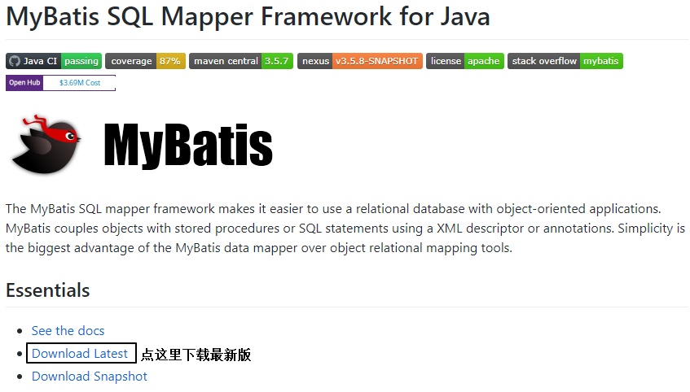
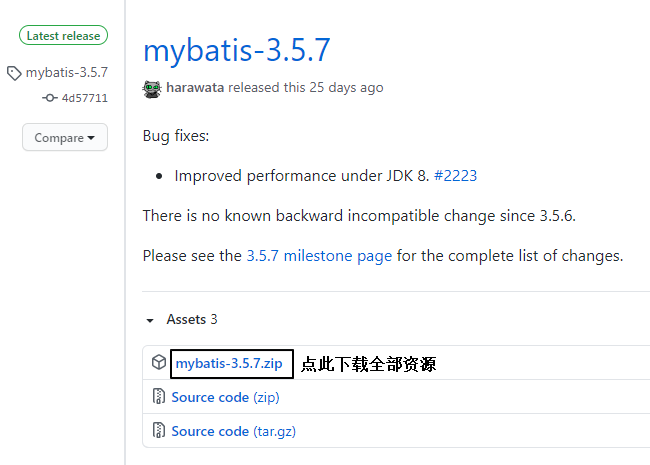

## 1、总体技术体系

### ①单一架构

一个项目，一个工程，导出为一个war包，在一个Tomcat上运行。也叫all in one。

### ②分布式架构

一个项目（对应 IDEA 中的一个 project），拆分成很多个模块，每个模块是一个 IDEA 中的一个 module。每一个工程都是运行在自己的 Tomcat 上。模块之间可以互相调用。每一个模块内部可以看成是一个单一架构的应用。

## 2、框架的概念

框架=jar包+配置文件

## 3、Mybatis历史

> MyBatis最初是Apache的一个开源项目**iBatis**, 2010年6月这个项目由Apache Software Foundation迁移到了Google Code。随着开发团队转投Google Code旗下， iBatis3.x正式更名为MyBatis。代码于2013年11月迁移到Github。

iBatis一词来源于“internet”和“abatis”的组合，是一个基于Java的持久层框架。 iBatis提供的持久层框架包括SQL Maps和Data Access Objects（DAO）。

Mybatis的最大特点：轻量级。相对于Hibernate省略了大量不常用的功能，整体轻巧又高效。

## 4、Mybatis下载地址

https://github.com/mybatis/mybatis-3

社区会持续更新开源项目，版本会不断变化，我们不必每个小版本都追，关注重大更新的大版本升级即可。

## 5、Mybatis特性

- MyBatis支持定制化SQL、存储过程以及高级映射
- MyBatis避免了几乎所有的JDBC代码和手动设置参数以及结果集解析操作
- MyBatis可以使用简单的XML或注解实现配置和原始映射；将接口和Java的POJO（Plain Ordinary Java Object，普通的Java对象）映射成数据库中的记录
- Mybatis是一个半自动的ORM（Object Relation Mapping）框架

## 6、和其它持久化层技术对比

- JDBC
  - SQL 夹杂在Java代码中耦合度高，导致硬编码内伤
  - 维护不易且实际开发需求中 SQL 有变化，频繁修改的情况多见
  - 代码冗长，开发效率低
- Hibernate 和 JPA
  - 操作简便，开发效率高
  - 程序中的长难复杂 SQL 需要绕过框架
  - 内部自动生成的 SQL，不容易做特殊优化
  - 基于全映射的全自动框架，大量字段的 POJO 进行部分映射时比较困难。
  - 反射操作太多，导致数据库性能下降
- MyBatis
  - 轻量级，性能出色
  - SQL 和 Java 编码分开，功能边界清晰。Java代码专注业务、SQL语句专注数据
  - 开发效率稍逊于 HIbernate，但是完全能够接收

开发效率：Hibernate>Mybatis>JDBC

运行效率：JDBC>Mybatis>Hibernate