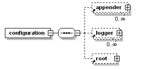

> 本文由 [简悦 SimpRead](http://ksria.com/simpread/) 转码， 原文地址 [www.cnblogs.com](https://www.cnblogs.com/gavincoder/p/10091757.html)

## 一、参考文档

1、官方文档

[http://logback.qos.ch/documentation.html](http://logback.qos.ch/documentation.html)

2、博客文档

[http://www.cnblogs.com/warking/p/5710303.html](http://www.cnblogs.com/warking/p/5710303.html)

二、logback.xml 常用配置详解
--------------------

**常用节点结构图：**



### **1、根节点 `<configuration>`，*

**包含下面三个属性：**

+ scan: 当此属性设置为 true 时，配置文件如果发生改变，将会被重新加载，默认值为 true。  
+ scanPeriod: 设置监测配置文件是否有修改的时间间隔，如果没有给出时间单位，默认单位是毫秒。当 scan 为 true 时，此属性生效。默认的时间间隔为 1 分钟。  
+ debug: 当此属性设置为 true 时，将打印出 logback 内部日志信息，实时查看 logback 运行状态。默认值为 false。

示例：

```xml
<configuration scan="true" scanPeriod="60 seconds" debug="false"> 
　　  <!--其他配置省略--> 
</configuration>
```

### **2、子节点 `<appender>`：**

**负责写日志的组件，它有两个必要属性 name 和 class。**

+ name 指定 appender 名称，
+ class 指定 appender 的全限定名。

下文只简述常见的 appder，其他 appender 使用请参考官方文档。

#### **2.1、ConsoleAppender 把日志输出到控制台，**

**有以下子节点：**  

`<encoder>`：对日志进行格式化。  
`<target>`：字符串 System.out(默认) 或者 System.err  
示例：把 >=DEBUG 级别的日志都输出到控制台

```xml
<configuration> 
　　　<appender name="STDOUT" class="ch.qos.logback.core.ConsoleAppender"> 
　　　　　 <encoder> 
　　　　　　　　　<pattern>%-4relative [%thread] %-5level %logger{35} - %msg %n</pattern> 
　　　　　 </encoder> 
　　　</appender> 

　　　<root level="DEBUG"> 
　　　　　　<appender-ref ref="STDOUT" /> 
　　　</root> 
</configuration>
```


#### **2.2、FileAppender：把日志添加到文件，**

**有以下子节点：**  

+ `<file>`：被写入的文件名，可以是相对目录，也可以是绝对目录，如果上级目录不存在会自动创建，没有默认值。  
+ `<append>`：如果是 true，日志被追加到文件结尾，如果是 false，清空现存文件，默认是 true。  
+ `<encoder>`：对记录事件进行格式化。（具体参数稍后讲解 ）  
+ `<prudent>`：如果是 true，日志会被安全的写入文件，即使其他的 FileAppender 也在向此文件做写入操作，效率低，默认是 false。  
  **示例：**把 >=DEBUG 级别的日志都输出到 testFile.log

```xml
<configuration> 
  <appender name="FILE" class="ch.qos.logback.core.FileAppender"> 
    <file>testFile.log</file> 
    <append>true</append> 
    <encoder> 
      <pattern>%-4relative [%thread] %-5level %logger{35} - %msg%n</pattern> 
    </encoder> 
  </appender> 

  <root level="DEBUG"> 
  <appender-ref ref="FILE" /> 
  </root> 
</configuration>
```

#### 2.3、RollingFileAppender：滚动记录文件，

**先将日志记录到指定文件，当符合某个条件时，将日志记录到其他文件。有以下子节点：**  

+ `<file>`：被写入的文件名，可以是相对目录，也可以是绝对目录，如果上级目录不存在会自动创建，没有默认值。  
+  `<append>`：如果是 true，日志被追加到文件结尾，如果是 false，清空现存文件，默认是 true。  
+  `<rollingPolicy>`: 当发生滚动时，决定 RollingFileAppender 的行为，涉及文件移动和重命名。属性 class 定义具体的滚动策略类

**<1> class="ch.qos.logback.core.rolling.TimeBasedRollingPolicy"： 最常用的滚动策略，它根据时间来制定滚动策略，既负责滚动也负责出发滚动。有以下子节点：**
　　　　 `<fileNamePattern>`：必要节点，包含文件名及“%d”转换符，“%d”可以包含一个java.text.SimpleDateFormat指定的时间格式，如：%d{yyyy-MM}。
如果直接使用 %d，默认格式是 yyyy-MM-dd。RollingFileAppender的file字节点可有可无，通过设置file，可以为活动文件和归档文件指定不同位置，当前日志总是记录到file指定的文件（活动文件），活动文件的名字不会改变；
如果没设置file，活动文件的名字会根据fileNamePattern 的值，每隔一段时间改变一次。“/”或者“\”会被当做目录分隔符。
　　　　`<maxHistory>:`
可选节点，控制保留的归档文件的最大数量，超出数量就删除旧文件。假设设置每个月滚动，且<maxHistory>是6，则只保存最近6个月的文件，删除之前的旧文件。注意，删除旧文件是，那些为了归档而创建的目录也会被删除。

**<2> class="ch.qos.logback.core.rolling.SizeBasedTriggeringPolicy"： 查看当前活动文件的大小，如果超过指定大小会告知RollingFileAppender 触发当前活动文件滚动。只有一个节点:**
　　　　　`<maxFileSize>`:这是活动文件的大小，默认值是10MB。
　　　　　<prudent>：当为true时，不支持FixedWindowRollingPolicy。支持TimeBasedRollingPolicy，但是有两个限制，1不支持也不允许文件压缩，2不能设置file属性，必须留空。
　　　　　`<triggeringPolicy >`: 告知 RollingFileAppender 合适激活滚动。

**<3> class="ch.qos.logback.core.rolling.FixedWindowRollingPolicy" 根据固定窗口算法重命名文件的滚动策略。有以下子节点：**
　　　　　`<minIndex>`:窗口索引最小值
　　　　　`<maxIndex>`:窗口索引最大值，当用户指定的窗口过大时，会自动将窗口设置为12。
　　　　　`<fileNamePattern>`:必须包含“%i”例如，假设最小值和最大值分别为1和2，命名模式为 mylog%i.log,会产生归档文件mylog1.log和mylog2.log。还可以指定文件压缩选项，例如，mylog%i.log.gz 或者 没有log%i.log.zip

 **示例：**每天生成一个日志文件，保存30天的日志文件。

```xml
<configuration> 
      <appender name="FILE" class="ch.qos.logback.core.rolling.RollingFileAppender"> 
        <rollingPolicy class="ch.qos.logback.core.rolling.TimeBasedRollingPolicy"> 
          <fileNamePattern>logFile.%d{yyyy-MM-dd}.log</fileNamePattern> 
          <maxHistory>30</maxHistory> 
        </rollingPolicy> 
        <encoder> 
          <pattern>%-4relative [%thread] %-5level %logger{35} - %msg%n</pattern> 
        </encoder> 
      </appender> 

      <root level="DEBUG"> 
        <appender-ref ref="FILE" /> 
      </root> 
 </configuration>
```


### 3、子节点 `<logger>`：用来设置某一个包或具体的某一个类的日志打印级别、以及指定 < appender>。

`<logger>` 仅有一个 name 属性，一个可选的 level 和一个可选的 addtivity 属性。

可以包含零个或多个 `<appender-ref>` 元素，标识这个 appender 将会添加到这个 logger。  
　　　　name: 用来指定受此 loger 约束的某一个包或者具体的某一个类。  
　　　　level: 用来设置打印级别，大小写无关：TRACE, DEBUG, INFO, WARN, ERROR, ALL 和 OFF，还有一个特殊值 INHERITED 或者同义词 NULL，代表强制执行上级的级别。 如果未设置此属性，那么当前 loger 将会继承上级的级别。  
　　　　addtivity: 是否向上级 logger 传递打印信息。默认是 true。可以包含零个或多个 <appender-ref> 元素，标识这个 appender 将会添加到这个 logger。


### 4、子节点 `<root>`: 

它也是 < logger > 元素，但是它是根 loger, 是所有 < loger > 的上级。只有一个 level 属性，因为 name 已经被命名为 "root", 且已经是最上级了。

　　　　level: 用来设置打印级别，大小写无关：TRACE, DEBUG, INFO, WARN, ERROR, ALL 和 OFF，不能设置为 INHERITED 或者同义词 NULL。 默认是 DEBUG。

同 `<loggert>` 一样，可以包含零个或多个 < appender-ref > 元素，标识这个 appender 将会添加到这个 logger。

**示例：**常用 logger 配置

```xml
<!-- show parameters for hibernate sql 专为 Hibernate 定制 -->
<logger name="org.hibernate.type.descriptor.sql.BasicBinder" level="TRACE" />
<logger name="org.hibernate.type.descriptor.sql.BasicExtractor" level="DEBUG" />
<logger name="org.hibernate.SQL" level="DEBUG" />
<logger name="org.hibernate.engine.QueryParameters" level="DEBUG" />
<logger name="org.hibernate.engine.query.HQLQueryPlan" level="DEBUG" />

<!--myibatis log configure-->
<logger name="com.apache.ibatis" level="TRACE"/>
<logger name="java.sql.Connection" level="DEBUG"/>
<logger name="java.sql.Statement" level="DEBUG"/>
<logger name="java.sql.PreparedStatement" level="DEBUG"/>
```


### **5、子节点 `<contextName>`：用来设置上下文名称，每个 logger 都关联到 logger 上下文，默认上下文名称为 default。但可以使用 < contextName > 设置成其他名字，用于区分不同应用程序的记录。一旦设置，不能修改。**

 **示例：**

```xml
<configuration scan="true" scanPeriod="60 seconds" debug="false"> 
     <contextName>myAppName</contextName> 
　　  <!--其他配置省略-->
</configuration>    
```

### 6、子节点 <property> ：用来定义变量值，它有两个属性 name 和 value，通过 < property > 定义的值会被插入到 logger 上下文中，可以使 “${}” 来使用变量。　　　　

　　　　name: 变量的名称  
　　　　value: 的值时变量定义的值

 **示例：**

```xml
<configuration scan="true" scanPeriod="60 seconds" debug="false"> 
　　　<property name="APP_Name" value="myAppName" /> 
　　　<contextName>${APP_Name}</contextName> 
　　　<!--其他配置省略--> 
</configuration>
```

### 7、子节点 <timestamp>：获取时间戳字符串，他有两个属性 key 和 datePattern。　　　　

　　　　key: 标识此 <timestamp> 的名字；  
　　　　datePattern: 设置将当前时间（解析配置文件的时间）转换为字符串的模式，遵循 java.txt.SimpleDateFormat 的格式。

**示例：**

```xml
   <configuration scan="true" scanPeriod="60 seconds" debug="false"> 
　　　　　　<timestamp key="bySecond" datePattern="yyyyMMdd'T'HHmmss"/> 
　　　　　　<contextName>${bySecond}</contextName> 
　　　　　　<!-- 其他配置省略--> 
    </configuration>
```

三、logback.xml 配置示例
------------------

```xml
<?xml version="1.0" encoding="UTF-8"?>
<configuration debug="false">

    <!--定义日志文件的存储地址 勿在 LogBack 的配置中使用相对路径-->
    <property name="LOG_HOME" value="/home" />

    <!--控制台日志， 控制台输出 -->
    <appender name="STDOUT" class="ch.qos.logback.core.ConsoleAppender">
        <encoder class="ch.qos.logback.classic.encoder.PatternLayoutEncoder">
            <!--格式化输出：%d表示日期，%thread表示线程名，%-5level：级别从左显示5个字符宽度,%msg：日志消息，%n是换行符-->
            <pattern>%d{yyyy-MM-dd HH:mm:ss.SSS} [%thread] %-5level %logger{50} - %msg%n</pattern>
        </encoder>
    </appender>

    <!--文件日志， 按照每天生成日志文件 -->
    <appender name="FILE" class="ch.qos.logback.core.rolling.RollingFileAppender">
        <rollingPolicy class="ch.qos.logback.core.rolling.TimeBasedRollingPolicy">
            <!--日志文件输出的文件名-->
            <FileNamePattern>${LOG_HOME}/TestWeb.log.%d{yyyy-MM-dd}.log</FileNamePattern>
            <!--日志文件保留天数-->
            <MaxHistory>30</MaxHistory>
        </rollingPolicy>
        <encoder class="ch.qos.logback.classic.encoder.PatternLayoutEncoder">
            <!--格式化输出：%d表示日期，%thread表示线程名，%-5level：级别从左显示5个字符宽度%msg：日志消息，%n是换行符-->
            <pattern>%d{yyyy-MM-dd HH:mm:ss.SSS} [%thread] %-5level %logger{50} - %msg%n</pattern>
        </encoder>
        <!--日志文件最大的大小-->
        <triggeringPolicy class="ch.qos.logback.core.rolling.SizeBasedTriggeringPolicy">
            <MaxFileSize>10MB</MaxFileSize>
        </triggeringPolicy>
    </appender>

    <!-- show parameters for hibernate sql 专为 Hibernate 定制 -->
    <logger name="org.hibernate.type.descriptor.sql.BasicBinder" level="TRACE" />
    <logger name="org.hibernate.type.descriptor.sql.BasicExtractor" level="DEBUG" />
    <logger name="org.hibernate.SQL" level="DEBUG" />
    <logger name="org.hibernate.engine.QueryParameters" level="DEBUG" />
    <logger name="org.hibernate.engine.query.HQLQueryPlan" level="DEBUG" />

    <!--myibatis log configure-->
    <logger name="com.apache.ibatis" level="TRACE"/>
    <logger name="java.sql.Connection" level="DEBUG"/>
    <logger name="java.sql.Statement" level="DEBUG"/>
    <logger name="java.sql.PreparedStatement" level="DEBUG"/>

    <!-- 日志输出级别 -->
    <root level="DEBUG">
        <appender-ref ref="STDOUT" />
        <appender-ref ref="FILE"/>
    </root>
</configuration>
```


四、总结
----

### 1、输出源选择

logback 的配置，需要配置输出源 appender，打日志的 logger（子节点）和 root（根节点），实际上，它输出日志是从子节点开始，子节点如果有输出源直接输入，如果无，判断配置的 addtivity，是否向上级传递，即是否向 root 传递，传递则采用 root 的输出源，否则不输出日志。

### 2、日志级别 Level

日志记录器（Logger）的行为是分等级的： 分为 OFF、FATAL、ERROR、WARN、INFO、DEBUG、ALL 或者您定义的级别。  
Log4j 建议只使用四个级别，**优先级从高到低分别是 ERROR、WARN、INFO、DEBUG，优先级高的将被打印出来。（logback 通用）**  
通过定义级别，可以作为应用程序中相应级别的日志信息的开关。  
**比如在这里定义了 INFO 级别，则应用程序中所有 DEBUG 级别的日志信息将不被打印出来。（设置 INFO 级别，即：>=INFO 生效）**  
**项目上生产环境的时候一定得把 debug 的日志级别重新调为 warn 或者更高，避免产生大量日志。**