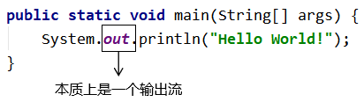
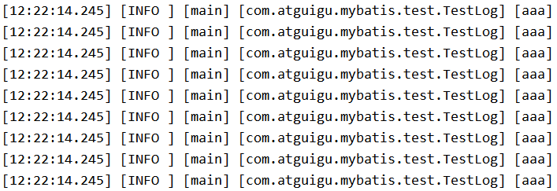
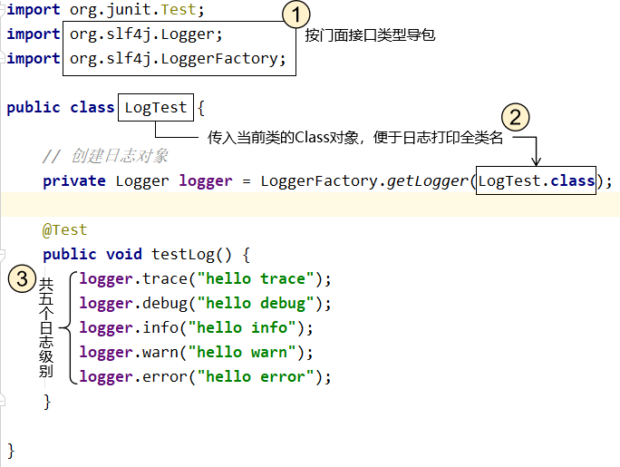
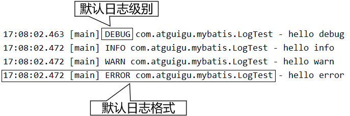
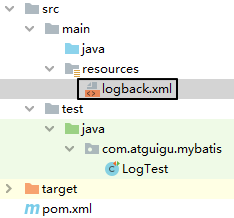
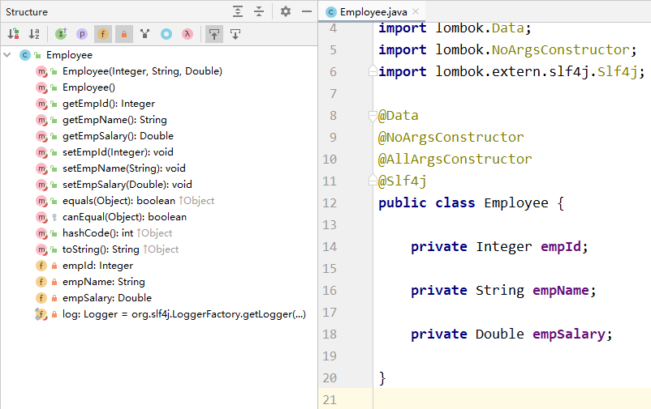
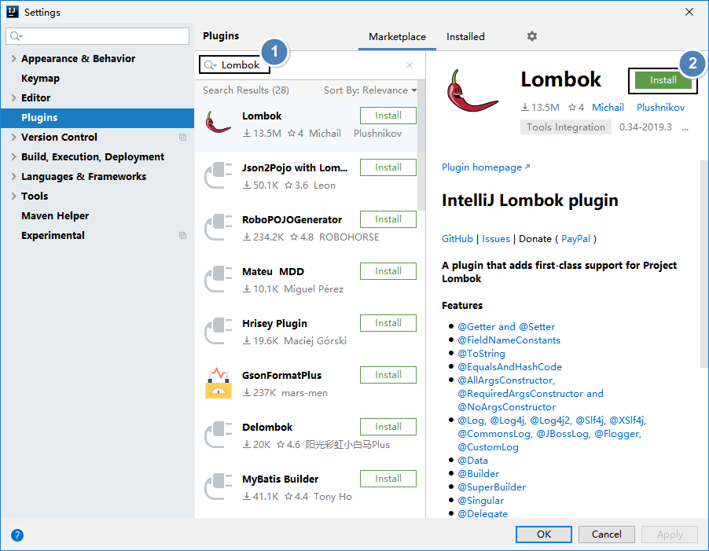
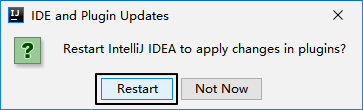

# 第一节 用日志打印代替sout

## 1、sout有什么问题

### ①问题1：I/O影响性能

System.out对象是一个输出流对象，所以控制台输出信息本质上是I/O操作。而I/O操作是项目运行过程中两大性能瓶颈之一。



### ②问题2：无法统一管理

项目上线时，希望把所有（或一部分）sout打印关闭，但是只能手动一个一个查找，耗费开发人员的极大精力，因为sout的无度使用会使它分散在项目的各个角落。

### ③问题3：显得你很low

想看某个变量的值，只会使用sout在控制台打印出来，不会debug，这只能被人鄙视。

## 2、使用日志框架的好处

### ①设定级别，统一管理

日志框架会按照事件的严重程度来划分级别，例如：

- 错误（Error）：表示程序运行出错，比如抛异常等情况。
- 警告（Warning）：表示程序运行过程中有潜在风险，但此时并没有报错。
- 信息（Info）：表示程序运行过程中完成了一个关键动作，需要以程序运行信息的形式告知开发者。
- 调试（Debug）：表示程序运行过程中更加细致的信息，协助程序员调试程序。

Tips：各种不同的具体日志系统会使用不同的日志级别名称，也可能有更多个级别设定。但是思想是一致的。

通过在配置文件中指定某一个日志级别来控制系统要打印的内容。日志框架会打印**当前指定级别**的日志和比当前指定级别**更严重**的级别的日志。

例如在开发阶段，我们指定debug级别，项目上线修改成info级别，那么所有debug级别的日志就都不打印了，不需要到项目代码中一个一个修改，非常方便。

### ②灵活指定输出位置

使用日志框架不一定是打印到控制台，也可以保存到文件中或者保存到数据库。这就看具体的项目维护需求。


### ③自定义日志格式

打印日志数据可以使用日志框架的默认格式，也可以根据需要定制。




### ④基于日志分析问题

将来我们开发的应用系统中，不仅包含Java代码，还有很多中间件服务器。任何子系统出现故障我们都是通过日志来定位问题、分析故障原因。甚至更复杂的系统还会专门开发日志子系统，在主系统出现问题时抓取日志数据供维护人员参考。

而日志数据必须要有确定格式才便于格式化和抓取，这肯定不是随意写sout就能实现的。

# 第二节 Java日志体系的演变

## 1、门面

门面：类似于标准层、接口层

| 名称                                    | 说明                 |
| --------------------------------------- | -------------------- |
| JCL（Jakarta Commons Logging）          | 陈旧                 |
| SLF4J（Simple Logging Facade for Java） | 适合（**同一作者**） |
| jboss-logging                           | 特殊专业领域使用     |


## 2、实现

| 名称                     | 说明                                               |
| ------------------------ | -------------------------------------------------- |
| log4j                    | 最初版（**同一作者**）                             |
| JUL（java.util.logging） | JDK自带                                            |
| log4j2                   | Apache收购log4j后全面重构，内部实现和log4j完全不同 |
| logback                  | 优雅、强大（**同一作者**）                         |


## 3、最佳拍档

- 门面：SLF4J
- 实现：logback

# 第三节 最佳拍档用法

## 1、导入依赖

```XML
        <!-- 日志 -->
        <dependency>
            <groupId>ch.qos.logback</groupId>
            <artifactId>logback-classic</artifactId>
            <version>1.2.3</version>
        </dependency>
```


## 2、代码测试

### ①代码图解




### ②测试结果




## 3、引入配置文件

Logback要求配置文件名称必须是logback.xml，存放路径在main/resources目录下。




下面是配置文件示例：

```XML
<?xml version="1.0" encoding="UTF-8"?>
<configuration debug="true">
    <!-- 指定日志输出的位置，ConsoleAppender表示输出到控制台 -->
    <appender name="STDOUT"
              class="ch.qos.logback.core.ConsoleAppender">
        <encoder>
            <!-- 日志输出的格式 -->
            <!-- 按照顺序分别是：时间、日志级别、线程名称、打印日志的类、日志主体内容、换行 -->
            <pattern>[%d{HH:mm:ss.SSS}] [%-5level] [%thread] [%logger] [%msg]%n</pattern>
            <charset>UTF-8</charset>
        </encoder>
    </appender>

    <!-- 设置全局日志级别。日志级别按顺序分别是：TRACE、DEBUG、INFO、WARN、ERROR -->
    <!-- 指定任何一个日志级别都只打印当前级别和后面级别的日志。 -->
    <root level="INFO">
        <!-- 指定打印日志的appender，这里通过“STDOUT”引用了前面配置的appender -->
        <appender-ref ref="STDOUT" />
    </root>

    <!-- 根据特殊需求指定局部日志级别，可也是包名或全类名。 -->
    <logger name="com.atguigu.mybatis" level="DEBUG" />

</configuration>
```

# 第四节 Lombok插件的使用

## 第一点 Lombok简介


### 1、传统实体类

```Java
public class Employee {
    
    private Integer empId;
    
    private String empName;
    
    private Double empSalary;
    
    public Employee() {
    
    }
    
    public Integer getEmpId() {
        return empId;
    }
    
    public void setEmpId(Integer empId) {
        this.empId = empId;
    }
    
    public String getEmpName() {
        return empName;
    }
    
    public void setEmpName(String empName) {
        this.empName = empName;
    }
    
    public Double getEmpSalary() {
        return empSalary;
    }
    
    public void setEmpSalary(Double empSalary) {
        this.empSalary = empSalary;
    }
    
    @Override
    public String toString() {
        return "Employee{" +
                "empId=" + empId +
                ", empName='" + empName + '\'' +
                ", empSalary=" + empSalary +
                '}';
    }
    
    public Employee(Integer empId, String empName, Double empSalary) {
        this.empId = empId;
        this.empName = empName;
        this.empSalary = empSalary;
    }
}
```


### 2、使用Lombok

既然getXxx()、setXxx()方法、toString()方法、构造器都是按照固定格式生成的，那能否由程序自动生成呢？



使用Lombok注解就可以省略生成getXxx()、setXxx()方法、toString()方法、构造器等固定格式代码的繁琐操作，提高开发效率。包括Logger日志对象。


### 3、Lombok原理

Lombok是将自动生成的代码织入字节码文件中，从而实现：源代码没有，但是字节码文件有——毕竟我们最终运行的是字节码文件，只要字节码文件中有即可。而这个过程因为要参与源文件编译，所以需要安装IDEA插件。

## 第二点 在IDEA安装Lombok插件






## 第三点 使用Lombok注解


### 1、加入依赖

```xml
     <dependency>
            <groupId>org.projectlombok</groupId>
            <artifactId>lombok</artifactId>
            <version>1.18.12</version>
            <scope>provided</scope>
        </dependency>
```


### 2、注解功能

| 注解                | 作用                                                         |
| ------------------- | ------------------------------------------------------------ |
| @Data               | 生成getXxx()方法、setXxx()方法、toString()、equals()、canEqual()、hashCode()方法 |
| @AllArgsConstructor | 生成全参构造器                                               |
| @NoArgsConstructor  | 生成无参构造器                                               |
| @Slf4j              | 生成日志对象                                                 |
| @Getter             | 生成getXxx()方法                                             |
| @Setter             | 生成setXxx()方法                                             |
| @ToString           | 生成toString()方法                                           |