# 第一节 HelloWorld

1、物理建模
--------------------

```sql
CREATE DATABASE `mybatis-example`;

USE `mybatis-example`;

CREATE TABLE `t_emp`(
    emp_id INT AUTO_INCREMENT,
    emp_name CHAR(100),
    emp_salary DOUBLE(10,5),
    PRIMARY KEY(emp_id)
);

INSERT INTO `t_emp`(emp_name,emp_salary) VALUES("tom",200.33);
INSERT INTO `t_emp`(emp_name,emp_salary) VALUES("jerry",666.66);
INSERT INTO `t_emp`(emp_name,emp_salary) VALUES("andy",777.77);
```

2、逻辑建模
--------------------

### ①创建 Maven module

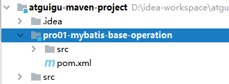

### ②加入Lombok依赖

```XML
        <dependency>
            <groupId>org.projectlombok</groupId>
            <artifactId>lombok</artifactId>
            <version>1.18.10</version>
        </dependency>
```

### ③创建 Java 实体类

> 实体类是和现实世界中某一个具体或抽象的概念对应，是软件开发过程中，为了管理现实世界中的数据而设计的模型。
> 实体类的多个不同的叫法：
> domain：领域模型
> entity：实体
> POJO：Plain Old Java Object
> Java bean：一个Java类

```Java
/**
 * 和数据库表 t_emp 对应的实体类
 * emp_id INT AUTO_INCREMENT
 * emp_name CHAR(100)
 * emp_salary DOUBLE(10,5)
 *
 * Java 的实体类中，属性的类型不要使用基本数据类型，要使用包装类型。因为包装类型可以赋值为null，表示空，而基本数据类型不可以。
 */
@Data
@NoArgsConstructor
@AllArgsConstructor
public class Employee {
    private Integer empId;
    private String empName;
    private Double empSalary;

}
```


## 3、搭建框架开发环境

### ①导入依赖

```XML
<!-- Mybatis核心 -->
<dependency>
  <groupId>org.mybatis</groupId>
  <artifactId>mybatis</artifactId>
  <version>3.5.7</version>
</dependency>

<!-- junit测试 -->
<dependency>
  <groupId>junit</groupId>
  <artifactId>junit</artifactId>
  <version>4.12</version>
  <scope>test</scope>
</dependency>

<!-- MySQL驱动 -->
<dependency>
  <groupId>mysql</groupId>
  <artifactId>mysql-connector-java</artifactId>
  <version>5.1.3</version>
</dependency>
```

### ②准备配置文件

#### [1]Mybatis 全局配置文件

习惯上命名为 mybatis-config.xml，这个文件名仅仅只是建议，并非强制要求。将来整合 Spring 之后，这个配置文件可以省略，所以大家操作时可以直接复制、粘贴。

```XML
<?xml version="1.0" encoding="UTF-8" ?>
<!DOCTYPE configuration
  PUBLIC "-//mybatis.org//DTD Config 3.0//EN"
  "http://mybatis.org/dtd/mybatis-3-config.dtd">

<configuration>

  <!-- environments表示配置Mybatis的开发环境，可以配置多个环境，在众多具体环境中，使用default属性指定实际运行时使用的环境。default属性的取值是environment标签的id属性的值。 -->
  <environments default="development">
  
    <!-- environment表示配置Mybatis的一个具体的环境 -->
    <environment id="development">

      <!-- Mybatis的内置的事务管理器 -->
      <transactionManager type="JDBC"/>

      <!-- 配置数据源 -->
      <dataSource type="POOLED">

        <!-- 建立数据库连接的具体信息 -->
        <property name="driver" value="com.mysql.jdbc.Driver"/>
        <property name="url" value="jdbc:mysql://localhost:3306/mybatis-example"/>
        <property name="username" value="root"/>
        <property name="password" value="atguigu"/>
      </dataSource>

    </environment>
  </environments>

  <mappers>
    <!-- Mapper注册：指定Mybatis映射文件的具体位置 -->
    <!-- mapper标签：配置一个具体的Mapper映射文件 -->
    <!-- resource属性：指定Mapper映射文件的实际存储位置，这里需要使用一个以类路径根目录为基准的相对路径 -->
    <!--    对Maven工程的目录结构来说，resources目录下的内容会直接放入类路径，所以这里我们可以以resources目录为基准 -->
    <mapper resource="mappers/EmployeeMapper.xml"/>
  </mappers>

</configuration>
```

注意：配置文件存放的位置是`src/main/resources`目录下。

#### [2]Mybatis 映射配置文件

相关概念：ORM（Object Relationship Mapping）对象关系映射。

- 对象：Java的实体类对象
- 关系：关系型数据库
- 映射：二者之间的对应关系

下表列举的是最简单的单表映射（一个表和一个类）：

| Java概念 | 数据库概念 |
| -------- | ---------- |
| 类       | 表         |
| 属性     | 字段/列    |
| 对象     | 记录/行    |


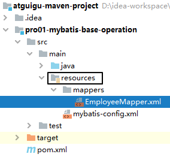

```XML
<?xml version="1.0" encoding="UTF-8" ?>
<!DOCTYPE mapper
        PUBLIC "-//mybatis.org//DTD Mapper 3.0//EN"
        "http://mybatis.org/dtd/mybatis-3-mapper.dtd">

<!-- mapper是根标签，namespace属性：在Mybatis全局范围内找到一个具体的Mapper配置 -->
<!-- 引入接口后，为了方便通过接口全类名来找到Mapper配置文件，所以通常将namespace属性设置为接口全类名 -->
<mapper namespace="com.atguigu.mybatis.dao.EmployeeMapper">

    <!-- 编写具体的SQL语句，使用id属性唯一的标记一条SQL语句 -->
    <!-- resultType属性：指定封装查询结果的Java实体类的全类名 -->
    <select id="selectEmployee" resultType="com.atguigu.mybatis.entity.Employee">
        <!-- Mybatis负责把SQL语句中的#{}部分替换成“?”占位符，在#{}内部还是要声明一个见名知意的名称 -->
        select emp_id empId,emp_name empName,emp_salary empSalary from t_emp where emp_id=#{empId}
    </select>
</mapper>
```

注意：EmployeeMapper.xml所在的目录要和mybatis-config.xml中使用mapper标签配置的一致。


## 4、junit测试代码

```Java
@Test
public void testSelectEmployee() throws IOException {

  // 1.创建SqlSessionFactory对象
  // ①声明Mybatis全局配置文件的路径
  String mybatisConfigFilePath = "mybatis-config.xml";

  // ②以输入流的形式加载Mybatis配置文件
  InputStream inputStream = Resources.getResourceAsStream(mybatisConfigFilePath);

  // ③基于读取Mybatis配置文件的输入流创建SqlSessionFactory对象
  SqlSessionFactory sessionFactory = new SqlSessionFactoryBuilder().build(inputStream);

  // 2.使用SqlSessionFactory对象开启一个会话
  SqlSession session = sessionFactory.openSession();

  // 3.根据Mapper配置文件的名称空间+SQL语句的id找到具体的SQL语句
  // 格式是：名称空间.SQL语句的id    后续mapperDao中通过全限定类名+方法名确定SQL 见第二节第三小节
  String statement = "com.atguigu.mybatis.dao.EmployeeMapper.selectEmployee";

  // 要传入SQL语句的参数
  Integer empId = 1;

  // 执行SQL语句
  Object result = session.selectOne(statement, empId);

  System.out.println("o = " + result);

  // 4.关闭SqlSession
  session.close();

}
```

说明：

- SqlSession：代表Java程序和数据库之间的会话。（HttpSession是Java程序和浏览器之间的会话）
- SqlSessionFactory：是“生产”SqlSession的“工厂”。
- 工厂模式：如果创建某一个对象，使用的过程基本固定，那么我们就可以把创建这个对象的相关代码封装到一个“工厂类”中，以后都使用这个工厂类来“生产”我们需要的对象。


## 5、SqlSession和HttpSession区别

- HttpSession：工作在Web服务器上，属于表述层。
    - 代表浏览器和Web服务器之间的会话。
- SqlSession：不依赖Web服务器，属于持久化层。
    - 代表Java程序和数据库之间的会话。


## 7、MySQL 8 兼容

### ①MySQL驱动版本

```XML
        <!-- MySQL驱动 -->
        <dependency>
            <groupId>mysql</groupId>
            <artifactId>mysql-connector-java</artifactId>
            <version>8.0.17</version>
        </dependency>
```


### ②连接信息

```properties
jdbc.driverClassName=com.mysql.cj.jdbc.Driver
jdbc.url=jdbc:mysql://localhost:3306/mybatis-example?characterEncoding=utf8&useSSL=false&serverTimezone=UTC&rewriteBatchedStatements=true
jdbc.username=root
jdbc.password=123456
```


## 6、修正一个误区

### ①误区

刚开始接触框架，我们会认为Java程序会转入XML配置文件中执行，但其实框架会在初始化时将XML文件读取进来，封装到对象中，再然后就都是Java代码的执行了，XML中的配置是没法执行的。

### ②图解

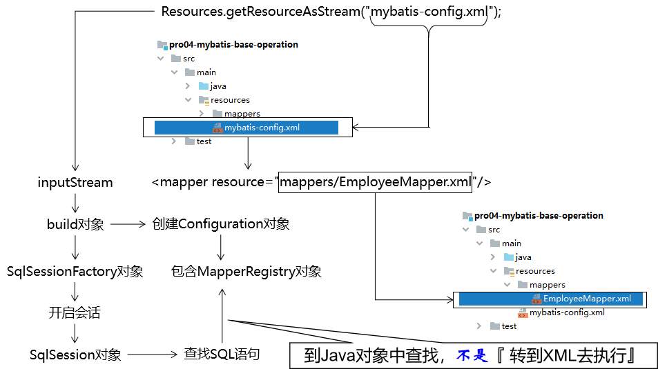


### ③源码

#### [1]封装Configuration对象

所在类：`org.apache.ibatis.session.defaults.DefaultSqlSessionFactory`

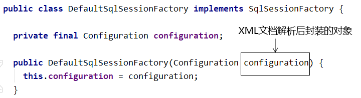

#### [2]准备去获取已映射的指令

所在类：`org.apache.ibatis.session.defaults.DefaultSqlSession`

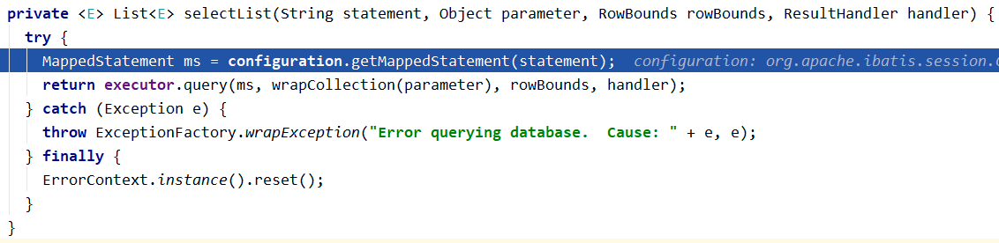

#### [3]正式获取已映射的指令

所在类：`org.apache.ibatis.session.Configuration`

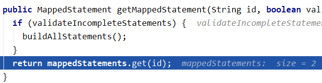


#### [4]mappedStatements对象结构

mappedStatements对象的类型：Configuration类中的一个静态内部类：StrictMap


# 第二节 HelloWorld强化

## 1、加入日志

在Mybatis工作过程中，通过打印日志的方式，将要执行的SQL语句打印出来。


### ①加入依赖

```XML
<!-- 日志 -->
<dependency>
    <groupId>ch.qos.logback</groupId>
    <artifactId>logback-classic</artifactId>
    <version>1.2.3</version>
</dependency>
```


### ②加入配置文件logback.xml

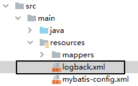

```XML
<?xml version="1.0" encoding="UTF-8"?>
<configuration debug="true">
    <!-- 指定日志输出的位置，ConsoleAppender表示输出到控制台 -->
    <appender name="STDOUT"
              class="ch.qos.logback.core.ConsoleAppender">
        <encoder>
            <!-- 日志输出的格式 -->
            <!-- 按照顺序分别是：时间、日志级别、线程名称、打印日志的类、日志主体内容、换行 -->
            <pattern>[%d{HH:mm:ss.SSS}] [%-5level] [%thread] [%logger] [%msg]%n</pattern>
            <charset>UTF-8</charset>
        </encoder>
    </appender>

    <!-- 设置全局日志级别。日志级别按顺序分别是：TRACE、DEBUG、INFO、WARN、ERROR -->
    <!-- 指定任何一个日志级别都只打印当前级别和后面级别的日志。 -->
    <root level="INFO">
        <!-- 指定打印日志的appender，这里通过“STDOUT”引用了前面配置的appender -->
        <appender-ref ref="STDOUT" />
    </root>

    <!-- 根据特殊需求指定局部日志级别 -->
    <logger name="com.atguigu.mybatis" level="DEBUG" />

</configuration>
```


### ③修改测试代码

这里我们仅仅修改查询结果的打印方式，为此需要做两件事：

- 在类上加@Slf4j注解
- 使用logger对象打印数据

```Java
if (result != null) {
    log.info(result.toString());
}
```


### ④打印效果

> [21:47:16.886] [DEBUG] [main] [com.atguigu.mybatis.dao.EmployeeMapper.selectEmployee] [==>  Preparing: select emp_id empId,emp_name empName,emp_salary empSalary from t_emp where emp_id=?]
> [21:47:16.917] [DEBUG] [main] [com.atguigu.mybatis.dao.EmployeeMapper.selectEmployee] [==> Parameters: 1(Integer)]
> [21:47:16.953] [DEBUG] [main] [com.atguigu.mybatis.dao.EmployeeMapper.selectEmployee] [<==      Total: 1]
> [21:47:16.953] [INFO ] [main] [com.atguigu.mybatis.test.Demo01HelloWorld] [Employee(empId=1, empName=UUU, empSalary=200.33)]


## 2、关联外部属性文件

在实际开发时，同一套代码往往会对应多个不同的具体服务器环境。使用的数据库连接参数也不同。为了更好的维护这些信息，我们建议把数据库连接信息提取到Mybatis全局配置文件外边。

### ①创建属性文件

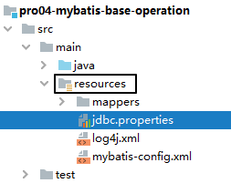

```properties
wechat.dev.driver=com.mysql.jdbc.Driver
wechat.dev.url=jdbc:mysql://192.168.198.100:3306/mybatis-example
wechat.dev.username=root
wechat.dev.password=atguigu
    
wechat.test.driver=com.mysql.jdbc.Driver
wechat.test.url=jdbc:mysql://192.168.198.150:3306/mybatis-example
wechat.test.username=root
wechat.test.password=atguigu
    
wechat.product.driver=com.mysql.jdbc.Driver
wechat.product.url=jdbc:mysql://192.168.198.200:3306/mybatis-example
wechat.product.username=root
wechat.product.password=atguigu
```


### ②引入属性文件

在Mybatis全局配置文件中指定外部jdbc.properties文件的位置

```XML
<properties resource="jdbc.properties"/>
```


### ③引用属性文件中的值

在需要具体属性值的时候使用${key}格式引用属性文件中的键

```XML
<dataSource type="POOLED">
    
    <!-- 建立数据库连接的具体信息（引用了外部属性文件中的数据） -->
    <property name="driver" value="${wechat.dev.driver}"/>
    <property name="url" value="${wechat.dev.url}"/>
    <property name="username" value="${wechat.dev.username}"/>
    <property name="password" value="${wechat.dev.password}"/>
    
</dataSource>
```


## 3、用上Mapper接口

Mybatis 中的 Mapper 接口相当于以前的 Dao。但是区别在于，Mapper 仅仅只是建接口即可，我们不需要提供实现类。该用法的思路如下图所示：


### ①在junit测试类中抽取代码

这一步和Mapper接口没关系，只是对代码本身的优化：

```Java
	private SqlSession session;

    // junit会在每一个@Test方法前执行@Before方法
    @Before
    public void init() throws IOException {
        session = new SqlSessionFactoryBuilder()
                .build(
                        Resources.getResourceAsStream("mybatis-config.xml"))
                .openSession();
    }


    @Test
    public void testSelectEmployee() throws IOException {

        // 3.根据Mapper配置文件的名称空间+SQL语句的id找到具体的SQL语句
        // 格式是：名称空间.SQL语句的id
        String statement = "com.atguigu.mybatis.dao.EmployeeMapper.selectEmployee";

        // 要传入SQL语句的参数
        Integer empId = 1;

        // 执行SQL语句
        Object result = session.selectOne(statement, empId);
        System.out.println("o = " + result);
        
    }

    // junit会在每一个@Test方法后执行@After方法
    @After
    public void clear() {
        session.commit();
        session.close();
    }
```


### ②声明Mapper接口

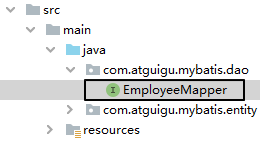

```Java
public interface EmployeeMapper {

    Employee selectEmployee(Integer empId);
    
}
```

- 方法名和SQL的id一致
- 方法返回值和resultType一致
- 方法的参数和SQL的参数一致
- 接口的全类名和映射配置文件的名称空间一致


### ③junit测试方法

```Java
    @Test
    public void testUsrMapperInterface() {

        // 1.根据EmployeeMapper接口的Class对象获取Mapper接口类型的对象
        EmployeeMapper employeeMapper = session.getMapper(EmployeeMapper.class);

        // 2.调用EmployeeMapper接口的方法完成对数据库的操作
        Employee emp = employeeMapper.selectEmployee(1);

        // 3.打印查询结果
        if (emp != null)
            log.info(emp.toString());
    }
```


## 4、增删改操作

### ①insert

#### [1]接口方法

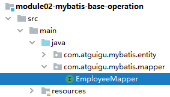

```Java
    // 功能：将实体类对象封装的数据保存到数据库
    // 入参：要保存的实体类的数据
    // 返回值：受影响的行数
    int insertEmployee(Employee employee);
```


#### [2]SQL语句

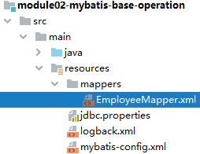

```XML
<!-- int insertEmployee(Employee employee); -->
<insert id="insertEmployee">
    <!-- 当前场景：#{} 中必须是实体类对象的属性名。 -->
    <!-- 因为 Mybatis 需要根据 #{} 中提供的属性名到实体类中获取属性值 -->
    <!-- Mybatis 内部换算：empName 首字母大写，然后前面加上 get -->
    <!-- 换算得到 getXxx() 方法的方法名：getEmpName，然后通过反射调用 getXxx() 方法 -->
    insert into t_emp(emp_name,emp_salary)
    values(#{empName},#{empSalary})
</insert>
```

`#{属性名}`：表示让Mybatis根据`#{}`中的属性名到实体类中获取数据。
**属性名 → getXxx → getXxx() → 通过反射调用这个方法，获取数据**。


#### [3]junit测试

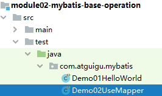

```Java
@Test
public void test02Insert() {

    // 1、获取 Mapper 对象
    EmployeeMapper employeeMapper = session.getMapper(EmployeeMapper.class);

    // 2、创建实体类对象
    Employee employee = new Employee(null, "jack", 5000.00);

    // 3、调用 Mapper 对象的保存数据的方法
    int rows = employeeMapper.insertEmployee(employee);

    // 4、打印受影响的行数
    log.debug("rows = " + rows);

}
```


#### [4]事务

增删改操作需要提交事务才能生效：

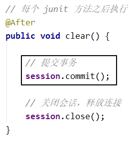


### ②delete

#### [1]接口方法

```Java
    // 功能：根据主键值删除数据库记录
    // 入参：作为删除依据的主键值
    // 返回值：受影响的行数
    int deleteEmployeeById(Integer empId);
```


#### [2]SQL语句

```XML
    <!-- int deleteEmployeeById(Integer empId); -->
    <delete id="deleteEmployeeById">
        delete from t_emp where emp_id = #{empId}
    </delete>
```

#### [3]junit测试

```java
@Test
public void test02Delete() {

    // 1、获取 Mapper 对象
    EmployeeMapper employeeMapper = session.getMapper(EmployeeMapper.class);
    
    // 2、调用 Mapper 对象的根据id删除数据的方法
    int rows = employeeMapper.deleteEmployeeById(15);

    // 3、打印受影响的行数
    log.debug("rows = " + rows);

}
```

### ③update

#### [1]接口方法

```Java
    // 功能：根据实体类对象中封装的数据执行更新操作
    // 入参：封装更新数据的实体类对象
    // 返回值：受影响的行数
    int updateEmployeeById(Employee employee);
```


#### [2]SQL语句

```XML
    <!-- int updateEmployeeById(Employee employee); -->
    <update id="updateEmployeeById">
        update t_emp set emp_name=#{empName},emp_salary=#{empSalary}
        where emp_id=#{empId}
    </update>
```

#### [3]junit测试

```java
@Test
public void test02Update() {

    // 1、获取 Mapper 对象
    EmployeeMapper employeeMapper = session.getMapper(EmployeeMapper.class);

    // 2、创建实体类对象
    Employee employee = new Employee(17, "jack-update", 5000.00);

    // 3、调用 Mapper 对象的更新数据的方法
    int rows = employeeMapper.updateEmployeeById(employee);

    // 4、打印受影响的行数
    log.debug("rows = " + rows);

}
```

# 第三节 给SQL语句传参

## 1、#{}形式

Mybatis会将SQL语句中的#{}转换为问号占位符。

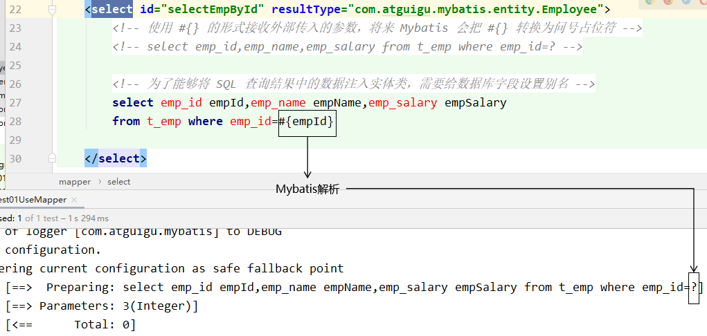


## 2、${}形式

${}形式传参，底层Mybatis做的是字符串拼接操作。

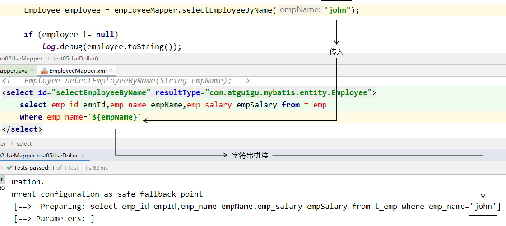


通常不会采用${}的方式传值。
一个特定的适用场景是：通过Java程序动态生成数据库表，表名部分需要Java程序通过参数传入；而JDBC对于表名部分是不能使用问号占位符的，此时只能使用${}。

结论：实际开发中，能用#{}实现的，肯定不用${}。


# 第四节 数据输入

## 1、Mybatis总体机制概括


## 2、概念说明

这里数据输入具体是指上层方法（例如Service方法）调用Mapper接口时，数据传入的形式。

- 简单类型：只包含一个值的数据类型
    - 基本数据类型：int、byte、short、double、……
    - 基本数据类型的包装类型：Integer、Character、Double、……
    - 字符串类型：String
- 复杂类型：包含多个值的数据类型
    - 实体类类型：Employee、Department、……
    - 集合类型：List、Set、Map、……
    - 数组类型：int[]、String[]、……
    - 复合类型：`List<Employee>`、实体类中包含集合……


## 3、单个简单类型参数

### ①Mapper接口中抽象方法的声明

```Java
Employee selectEmployee(Integer empId);
```


### ②SQL语句

```XML
<select id="selectEmployee" resultType="com.atguigu.mybatis.entity.Employee">

  select emp_id empId,emp_name empName,emp_salary empSalary from t_emp where emp_id=#{empId}

</select>
```


单个简单类型参数，在#{}中可以随意命名，但是没有必要。通常还是使用和接口方法参数同名。


## 4、实体类类型参数

### ①Mapper接口中抽象方法的声明

```Java
int insertEmployee(Employee employee);
```


### ②SQL语句

```XML
<insert id="insertEmployee">

  insert into t_emp(emp_name,emp_salary) values(#{empName},#{empSalary})

</insert>
```


### ③对应关系


### ④结论

**Mybatis会根据#{}中传入的数据，加工成getXxx()方法，通过反射在实体类对象中调用这个方法，从而获取到对应的数据。填充到#{}解析后的问号占位符这个位置。**


## 5、零散的简单类型数据

零散的多个简单类型参数，如果没有特殊处理，那么Mybatis无法识别自定义名称：

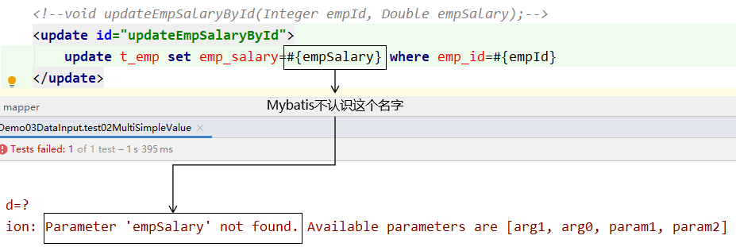


### ①Mapper接口中抽象方法的声明@Param

```Java
int updateEmployee(@Param("empId") Integer empId,@Param("empSalary") Double empSalary);
```


### ②SQL语句

```XML
<update id="updateEmployee">

  update t_emp set emp_salary=#{empSalary} where emp_id=#{empId}

</update>
```


### ③对应关系


## 6、Map类型参数

### ①Mapper接口中抽象方法的声明

```Java
int updateEmployeeByMap(Map<String, Object> paramMap);
```


### ②SQL语句

```XML
<update id="updateEmployeeByMap">

  update t_emp set emp_salary=#{empSalaryKey} where emp_id=#{empIdKey}

</update>
```


### ③junit测试

```Java
@Test

public void testUpdateEmpNameByMap() {

  EmployeeMapper mapper = session.getMapper(EmployeeMapper.class);

  Map<String, Object> paramMap = new HashMap<>();

  paramMap.put("empSalaryKey", 999.99);

  paramMap.put("empIdKey", 5);

  int result = mapper.updateEmployeeByMap(paramMap);

  log.info("result = " + result);

}
```


### ④对应关系

**#{}中写Map中的key**


### ⑤使用场景

有很多零散的参数需要传递，但是没有对应的实体类类型可以使用。使用@Param注解一个一个传入又太麻烦了。所以都封装到Map中。

# 第五节 数据输出

数据输出总体上有两种形式：

- **增删改操作返回的受影响行数：直接使用 int 或 long 类型接收即可**
- **查询操作的查询结果**


## 1、返回单个简单类型数据

### ①Mapper接口中的抽象方法

```Java
int selectEmpCount();
```

### ②SQL语句

```XML
<select id="selectEmpCount" resultType="int">

  select count(*) from t_emp

</select>
```

> Mybatis 内部给常用的数据类型设定了很多别名。 以 int 类型为例，可以写的名称有：int、integer、Integer、java.lang.Integer、Int、INT、INTEGER 等等。

### ③junit测试

```Java
@Test

public void testEmpCount() {

  EmployeeMapper employeeMapper = session.getMapper(EmployeeMapper.class);

  int count = employeeMapper.selectEmpCount();

  log.info("count = " + count);

}
```

## 2、返回实体类对象

### ①Mapper接口的抽象方法

```Java
Employee selectEmployee(Integer empId);
```

### ②SQL语句

```XML
<!-- 编写具体的SQL语句，使用id属性唯一的标记一条SQL语句 -->
<!-- resultType属性：指定封装查询结果的Java实体类的全类名 -->
<select id="selectEmployee" resultType="com.atguigu.mybatis.entity.Employee">

  <!-- Mybatis负责把SQL语句中的#{}部分替换成“?”占位符 -->
  <!-- 给每一个字段设置一个别名，让别名和Java实体类中属性名一致 -->
  select emp_id empId,emp_name empName,emp_salary empSalary from t_emp where emp_id=#{maomi}

</select>
```

通过给数据库表字段加别名，让查询结果的每一列都和Java实体类中属性对应起来。


### ③增加全局配置自动识别对应关系

在 Mybatis 全局配置文件中，做了下面的配置，select语句中可以不给字段设置别名

```XML
<!-- 在全局范围内对Mybatis进行配置 -->
<settings>

  <!-- 具体配置 -->
  <!-- 从org.apache.ibatis.session.Configuration类中可以查看能使用的配置项 -->
  <!-- 将mapUnderscoreToCamelCase属性配置为true，表示开启自动映射驼峰式命名规则 -->
  <!-- 规则要求数据库表字段命名方式：单词_单词 -->
  <!-- 规则要求Java实体类属性名命名方式：首字母小写的驼峰式命名 -->
  <setting name="mapUnderscoreToCamelCase" value="true"/>

</settings>
```


## 3、返回Map类型

适用于SQL查询返回的各个字段综合起来并不和任何一个现有的实体类对应，没法封装到实体类对象中。能够封装成实体类类型的，就不使用Map类型。

### ①Mapper接口的抽象方法

```Java
Map<String,Object> selectEmpNameAndMaxSalary();
```


### ②SQL语句

```XML
<!-- Map<String,Object> selectEmpNameAndMaxSalary(); -->
<!-- 返回工资最高的员工的姓名和他的工资 -->
<select id="selectEmpNameAndMaxSalary" resultType="map">

  SELECT
    emp_name 员工姓名,
    emp_salary 员工工资,
    (SELECT AVG(emp_salary) FROM t_emp) 部门平均工资
  FROM t_emp WHERE emp_salary=(
    SELECT MAX(emp_salary) FROM t_emp
  )

</select>
```


### ③junit测试

```Java
@Test
public void testQueryEmpNameAndSalary() {

  EmployeeMapper employeeMapper = session.getMapper(EmployeeMapper.class);

  Map<String, Object> resultMap = employeeMapper.selectEmpNameAndMaxSalary();

  Set<Map.Entry<String, Object>> entrySet = resultMap.entrySet();

  for (Map.Entry<String, Object> entry : entrySet) {
    String key = entry.getKey();
    Object value = entry.getValue();
    log.info(key + "=" + value);
  }

}

//结果
[00:33:41.505] [INFO ] [main] [TestUsrMapperInterface] [部门平均工资=1448.886]   key与别名对应
[00:33:41.505] [INFO ] [main] [TestUsrMapperInterface] [员工姓名=jack-update]
[00:33:41.505] [INFO ] [main] [TestUsrMapperInterface] [员工工资=5000.0]
```

④ `@MapKey`

`@MapKey`：供返回值为 Map 的方法使用的注解。它使用对象的某个属性作为 key，将对象 List 转化为 Map。属性：`value`，指定作为 Map 的 key 值的对象属性名。


测试

```java
@MapKey("empId") // 指定每一行记录以列名作为Map的key
Map<Integer, Object> selectAllOutMap();
```

```xml
<select id="selectAllOutMap" resultType="com.atguigu.mybatis.entity.Employee">
        select emp_id empId, emp_name empName, emp_salary empSalary
        from t_emp
 </select>
```

单元测试

```java
    @Test
    public void selectAllOutMap() {

        EmployeeMapper employeeMapper = session.getMapper(EmployeeMapper.class);

        Map<Integer, Object> resultMap = employeeMapper.selectAllOutMap();

        Set<Map.Entry<Integer, Object>> entrySet = resultMap.entrySet();
        for (Map.Entry<Integer, Object> entry : entrySet) {
            Integer key = entry.getKey();
            Object value = entry.getValue();
            log.info(key + "=" + value);
        }
    }

[01:07:50.260] [INFO ] [main] [TestUsrMapperInterface] [16=Employee(empId=16, empName=testname, empSalary=300.0)]
[01:07:50.261] [INFO ] [main] [TestUsrMapperInterface] [1=Employee(empId=1, empName=tom, empSalary=500.0)]
[01:07:50.261] [INFO ] [main] [TestUsrMapperInterface] [17=Employee(empId=17, empName=jack-update, empSalary=5000.0)]
[01:07:50.261] [INFO ] [main] [TestUsrMapperInterface] [2=Employee(empId=2, empName=jerry, empSalary=666.66)]
[01:07:50.261] [INFO ] [main] [TestUsrMapperInterface] [3=Employee(empId=3, empName=andy, empSalary=777.77)]
[01:07:50.261] [INFO ] [main] [TestUsrMapperInterface] [19=Employee(empId=19, empName=john, empSalary=666.66)]
```


mapper接口的方法定义为List<Map<String,Object>>类型时，会出现@MapKey is required的提示，意思是要在该方法的签名前加上@MapKey注解，指定Map的key

## 4、返回List类型

查询结果返回多个实体类对象，希望把多个实体类对象放在List集合中返回。此时不需要任何特殊处理，在resultType属性中还是设置实体类类型即可。

### ①Mapper接口中抽象方法

```Java
List<Employee> selectAll();
```

### ②SQL语句

```XML
<!-- List<Employee> selectAll(); -->
<select id="selectAll" resultType="com.atguigu.mybatis.entity.Employee">

  select emp_id empId,emp_name empName,emp_salary empSalary
  from t_emp

</select>
```

### ③junit测试

```Java
@Test
public void testSelectAll() {

  EmployeeMapper employeeMapper = session.getMapper(EmployeeMapper.class);

  List<Employee> employeeList = employeeMapper.selectAll();

  for (Employee employee : employeeList) {
    log.info("employee = " + employee);
  }

}
```


## 5、返回自增主键

### ①使用场景

例如：保存订单信息。需要保存Order对象和`List<OrderItem>`。其中，OrderItem对应的数据库表，包含一个外键，指向Order对应表的主键。  

在保存List<OrderItem>的时候，需要使用下面的SQL：

```SQL
insert into t_order_item(item_name,item_price,item_count,order_id) values(...)
```


这里需要用到的order_id，是在保存Order对象时，数据库表以自增方式产生的，需要特殊办法拿到这个自增的主键值。至于，为什么不能通过查询最大主键的方式解决这个问题，参考下图：


### ②在Mapper配置文件中设置

#### [1]Mapper接口中的抽象方法

```Java
int insertEmployee(Employee employee);
```

#### [2]SQL语句

```XML
<!-- int insertEmployee(Employee employee); -->
<!-- useGeneratedKeys属性字面意思就是“使用生成的主键” -->
<!-- keyProperty属性可以指定主键在实体类对象中对应的属性名，Mybatis会将拿到的主键值存入这个属性 -->
<insert id="insertEmployee" useGeneratedKeys="true" keyProperty="empId">

  insert into t_emp(emp_name,emp_salary)
  values(#{empName},#{empSalary})

</insert>
```

>  拓展：keyColumn用于指定数据库table中的主键

#### [3]junit测试

```Java
@Test

public void testSaveEmp() {

  EmployeeMapper employeeMapper = session.getMapper(EmployeeMapper.class);

  Employee employee = new Employee();
  employee.setEmpName("john");
  employee.setEmpSalary(666.66);
  employeeMapper.insertEmployee(employee);

  log.info("employee.getEmpId() = " + employee.getEmpId());

}
```

### ④注意

**Mybatis是将自增主键的值设置到实体类对象中，而不是以Mapper接口方法返回值的形式返回。**

### ⑤不支持自增主键的数据库

而对于不支持自增型主键的数据库（例如 Oracle），则可以使用 selectKey 子元素：selectKey 元素将会首先运行，id 会被设置，然后插入语句会被调用

```XML
<insert id="insertEmployee" parameterType="com.atguigu.mybatis.beans.Employee"  databaseId="oracle">
  <selectKey order="BEFORE" keyProperty="id" resultType="integer">
    select employee_seq.nextval from dual 
  </selectKey>  

  insert into orcl_employee(id,last_name,email,gender) values(#{id},#{lastName},#{email},#{gender})

</insert>
```

或者是

```XML
<insert id="insertEmployee" parameterType="com.atguigu.mybatis.beans.Employee"  databaseId="oracle">
  <selectKey order="AFTER" keyProperty="id" resultType="integer">
    select employee_seq.currval from dual 
  </selectKey>  
    
  insert into orcl_employee(id,last_name,email,gender) values(employee_seq.nextval,#{lastName},#{email},#{gender})

</insert>
```

## 6、数据库表字段和实体类属性对应关系

### ①别名

将字段的别名设置成和实体类属性一致。

```XML
<!-- 编写具体的SQL语句，使用id属性唯一的标记一条SQL语句 -->
<!-- resultType属性：指定封装查询结果的Java实体类的全类名 -->
<select id="selectEmployee" resultType="com.atguigu.mybatis.entity.Employee">

  <!-- Mybatis负责把SQL语句中的#{}部分替换成“?”占位符 -->
  <!-- 给每一个字段设置一个别名，让别名和Java实体类中属性名一致 -->
  select emp_id empId,emp_name empName,emp_salary empSalary from t_emp where emp_id=#{maomi}

</select>
```

> 关于实体类属性的约定：
> getXxx()方法、setXxx()方法把方法名中的get或set去掉，首字母小写。

### ②全局配置自动识别驼峰式命名规则

在Mybatis全局配置文件加入如下配置：

```XML
<!-- 使用settings对Mybatis全局进行设置 -->
<settings>
  <!-- 将xxx_xxx这样的列名自动映射到xxXxx这样驼峰式命名的属性名 -->
  <setting name="mapUnderscoreToCamelCase" value="true"/>
</settings>
```

SQL语句中可以不使用别名

```XML
<!-- Employee selectEmployee(Integer empId); -->
<select id="selectEmployee" resultType="com.atguigu.mybatis.entity.Employee">
  select emp_id,emp_name,emp_salary from t_emp where emp_id=#{empId}
</select>
```

### ③使用resultMap

使用resultMap标签定义对应关系，再在后面的SQL语句中引用这个对应关系

```XML
<!-- 专门声明一个resultMap设定column到property之间的对应关系 -->
<resultMap id="selectEmployeeByRMResultMap" type="com.atguigu.mybatis.entity.Employee">

  <!-- 使用id标签设置主键列和主键属性之间的对应关系 -->
  <!-- column属性用于指定字段名；property属性用于指定Java实体类属性名 -->
  <id column="emp_id" property="empId"/>

  <!-- 使用result标签设置普通字段和Java实体类属性之间的关系 -->
  <result column="emp_name" property="empName"/>
  <result column="emp_salary" property="empSalary"/>

</resultMap>

<!-- Employee selectEmployeeByRM(Integer empId); -->
<select id="selectEmployeeByRM" resultMap="selectEmployeeByRMResultMap">
  select emp_id,emp_name,emp_salary from t_emp where emp_id=#{empId}
</select>
```


# 第六节  官方文档


https://mybatis.org/mybatis-3/zh/getting-started.html