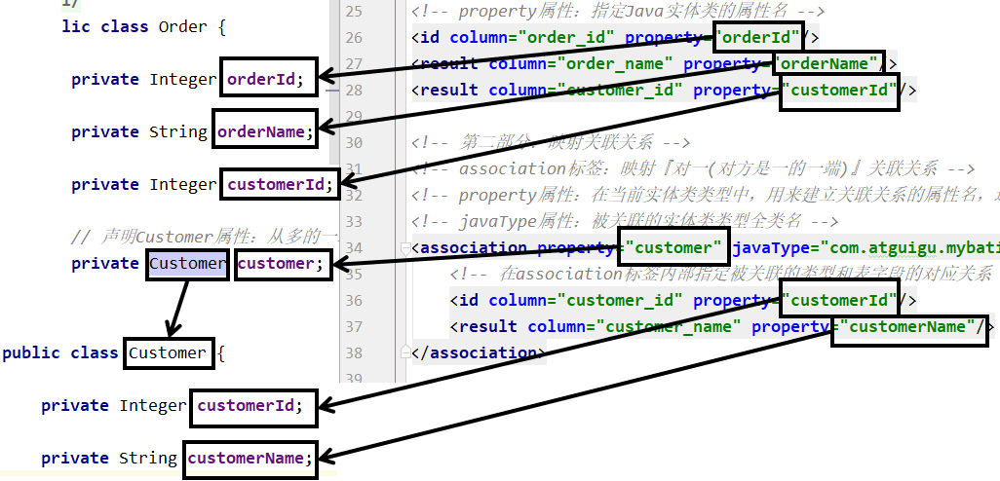
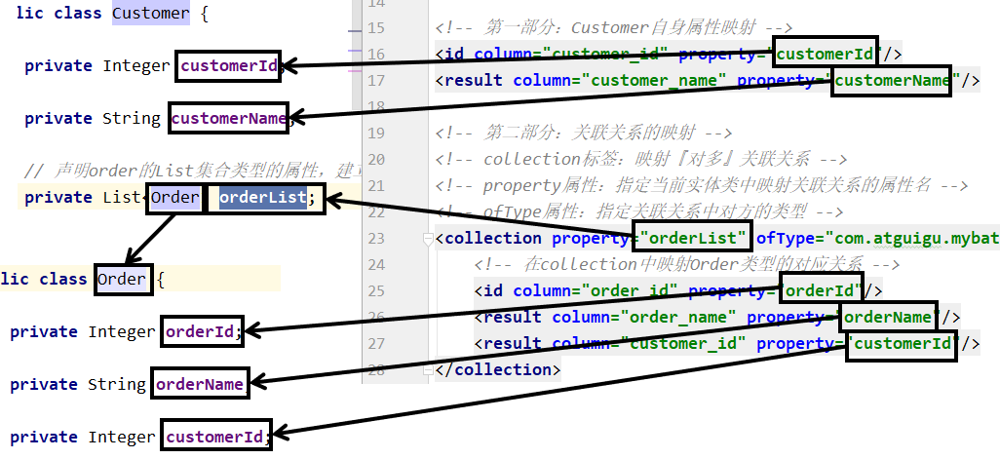
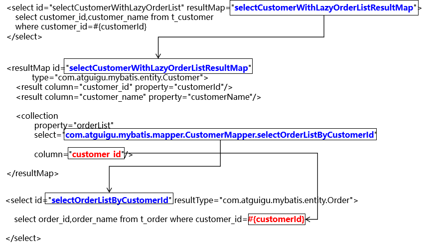
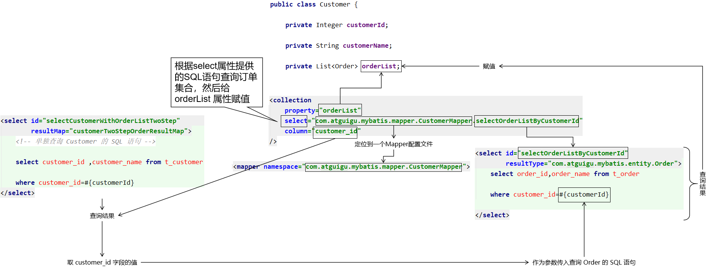
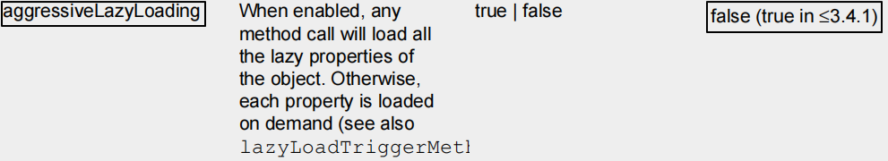

# 第一节 概念

## 1、关联关系概念说明

### ①数量关系

主要体现在数据库表中

| 关系          | 例子                       |
| ------------- | -------------------------- |
| 1、**一对一** | 夫妻关系，人和身份证号     |
| 2、**一对多** | 用户和用户的订单，锁和钥匙 |
| 3、**多对多** | 老师和学生，部门和员工     |

### ②关联关系的方向

主要体现在Java实体类中

- 双向：双方都可以访问到对方
    - Customer：包含Order的集合属性
    - Order：包含单个Customer的属性
- 单向：双方中只有一方能够访问到对方
    - Customer：不包含Order的集合属性，访问不到Order
    - Order：包含单个Customer的属性

## 2、创建模型

### ①创建实体类

```Java
public class Customer {

  private Integer customerId;

  private String customerName;

  private List<Order> orderList;// 体现的是对多的关系
```


```Java
public class Order {

  private Integer orderId;

  private String orderName;

  private Customer customer;// 体现的是对一的关系
```


### ②创建数据库表插入测试数据

```SQL
CREATE TABLE `t_customer` (`customer_id` INT NOT NULL AUTO_INCREMENT, `customer_name` CHAR(100), PRIMARY KEY (`customer_id`) );

CREATE TABLE `t_order` ( `order_id` INT NOT NULL AUTO_INCREMENT, `order_name` CHAR(100), `customer_id` INT, PRIMARY KEY (`order_id`) ); 

INSERT INTO `t_customer` (`customer_name`) VALUES ('c01');

INSERT INTO `t_order` (`order_name`, `customer_id`) VALUES ('o1', '1');
INSERT INTO `t_order` (`order_name`, `customer_id`) VALUES ('o2', '1');
INSERT INTO `t_order` (`order_name`, `customer_id`) VALUES ('o3', '1'); 
```


> 实际开发时，一般在开发过程中，不给数据库表设置外键约束。
> 原因是避免调试不方便。
> 一般是功能开发完成，再加外键约束检查是否有bug。

# 第二节 对一

## 1、创建OrderMapper接口

```Java
public interface OrderMapper {

  Order selectOrderWithCustomer(Integer orderId);

}
```


## 2、创建OrderMapper.xml配置文件

```XML
<!-- 创建resultMap实现“对一”关联关系映射 -->
<!-- id属性：通常设置为这个resultMap所服务的那条SQL语句的id加上“ResultMap” -->
<!-- type属性：要设置为这个resultMap所服务的那条SQL语句最终要返回的类型 -->
<resultMap id="selectOrderWithCustomerResultMap" type="com.atguigu.mybatis.entity.Order">

  <!-- 先设置Order自身属性和字段的对应关系 -->
  <id column="order_id" property="orderId"/>
  <result column="order_name" property="orderName"/>

  <!-- 使用association标签配置“对一”关联关系 -->
  <!-- property属性：在Order类中对一的一端进行引用时使用的属性名 -->
  <!-- javaType属性：一的一端类的全类名 -->
  <association property="customer" javaType="com.atguigu.mybatis.entity.Customer">
    <!-- 配置Customer类的属性和字段名之间的对应关系 -->
    <id column="customer_id" property="customerId"/>
    <result column="customer_name" property="customerName"/>
  </association>

</resultMap>

<!-- Order selectOrderWithCustomer(Integer orderId); -->
<select id="selectOrderWithCustomer" resultMap="selectOrderWithCustomerResultMap">

  SELECT order_id,order_name,c.customer_id,customer_name
  FROM t_order o
  LEFT JOIN t_customer c
  ON o.customer_id=c.customer_id
  WHERE o.order_id=#{orderId}

</select>
```

对应关系可以参考下图：




## 3、在Mybatis全局配置文件中注册Mapper配置文件

```XML
<!-- 注册Mapper配置文件：告诉Mybatis我们的Mapper配置文件的位置 -->
<mappers>

  <!-- 在mapper标签的resource属性中指定Mapper配置文件以“类路径根目录”为基准的相对路径 -->
  <mapper resource="com/atguigu/mybatis/mapper/OrderMapper.xml"/>

</mappers>
```


## 4、junit测试程序

```Java
@Test
public void testRelationshipToOne() {

  OrderMapper orderMapper = session.getMapper(OrderMapper.class);

  // 查询Order对象，检查是否同时查询了关联的Customer对象
  Order order = orderMapper.selectOrderWithCustomer(2);

  log.info("order = " + order);

}
```


## 5、关键词

在“对一”关联关系中，我们的配置比较多，但是关键词就只有：**association**和**javaType**

# 第三节 对多

## 1、创建Mapper接口

```Java
public interface CustomerMapper {
  Customer selectCustomerWithOrderList(Integer customerId);
}
```


## 2、创建CustomerMapper.xml配置文件

注意：不要忘记在Mybatis全局配置文件中注册


## 3、配置关联关系和SQL语句

```XML
 <!-- 配置resultMap实现从Customer到OrderList的“对多”关联关系 -->
    <resultMap id="selectCustomerWithOrderListResultMap" type="com.atguigu.mybatis.entity.Customer">

        <!-- 映射Customer本身的属性 -->
        <id column="customer_id" property="customerId"/>
        <result column="customer_name" property="customerName"/>

        <!-- collection标签：映射“对多”的关联关系 -->
        <!-- property属性：在Customer类中，关联“多”的一端的属性名 -->
        <!-- ofType属性：集合属性中元素的类型 -->
        <collection property="orderList" ofType="com.atguigu.mybatis.entity.Order">
            <!-- 映射Order的属性 -->
            <id column="order_id" property="orderId"/>
            <result column="order_name" property="orderName"/>
        </collection>

    </resultMap>

    <!-- Customer selectCustomerWithOrderList(Integer customerId); -->
    <select id="selectCustomerWithOrderList" resultMap="selectCustomerWithOrderListResultMap">

        SELECT c.customer_id, c.customer_name, o.order_id, o.order_name
        FROM t_customer c
                 LEFT JOIN t_order o
                           ON c.customer_id = o.customer_id
        WHERE c.customer_id = #{customerId}

    </select>
```

对应关系可以参考下图：



## 4、junit测试

```Java
@Test
public void testRelationshipToMulti() {

  CustomerMapper customerMapper = session.getMapper(CustomerMapper.class);

  // 查询Customer对象同时将关联的Order集合查询出来
  Customer customer = customerMapper.selectCustomerWithOrderList(1);
  log.info("customer.getCustomerId() = " + customer.getCustomerId());
  log.info("customer.getCustomerName() = " + customer.getCustomerName());

  List<Order> orderList = customer.getOrderList();
  for (Order order : orderList) {
    log.info("order = " + order);
  }
}
```

## 5、关键词

在“对多”关联关系中，同样有很多配置，但是提炼出来最关键的就是：“**collection**”和“**ofType**”

# 第四节 分步查询

## 1、概念和需求

为了实现延迟加载，对Customer和Order的查询必须分开，分成两步来做，才能够实现。为此，我们需要单独查询Order，也就是需要在Mapper配置文件中，单独编写查询Order集合数据的SQL语句。

## 2、具体操作

### ①编写查询Customer的SQL语句

```XML
<!-- 专门指定一条SQL语句，用来查询Customer，而且是仅仅查询Customer本身，不携带Order -->
<select id="selectCustomerWithOrderList" resultMap="selectCustomerWithOrderListResultMap">
  select customer_id,customer_name from t_customer
  where customer_id=#{customerId}
</select>
```

### ②编写查询Order的SQL语句

```XML
<select id="selectOrderList" resultType="com.atguigu.mybatis.entity.Order">
  select order_id,order_name from t_order where customer_id=#{customer_id}
</select>
```

### ③引用SQL语句

```XML
<!-- orderList集合属性的映射关系，使用分步查询 -->
<!-- 在collection标签中使用select属性指定要引用的SQL语句 -->
<!-- select属性值的格式是：Mapper配置文件的名称空间.SQL语句id -->
<!-- column属性：指定Customer和Order之间建立关联关系时所依赖的字段 -->
<collection
  property="orderList"
  select="com.atguigu.mybatis.mapper.CustomerMapper.selectOrderList"
  column="customer_id"/>
```

如果Mapper接口中的抽象方法没有改变，那么junit测试也不变。执行结果如下：

> DEBUG 11-30 11:10:05,796 ==>  Preparing: select customer_id,customer_name from t_customer where customer_id=?   (BaseJdbcLogger.java:145) DEBUG 11-30 11:10:05,866 ==> Parameters: 1(Integer)  (BaseJdbcLogger.java:145) DEBUG 11-30 11:10:05,889 ====>  Preparing: select order_id,order_name from t_order where customer_id=?   (BaseJdbcLogger.java:145) DEBUG 11-30 11:10:05,890 ====> Parameters: 1(Integer)  (BaseJdbcLogger.java:145) DEBUG 11-30 11:10:05,895 <====      Total: 3  (BaseJdbcLogger.java:145) DEBUG 11-30 11:10:05,896 <==      Total: 1  (BaseJdbcLogger.java:145) customer = c01

order = Order{orderId=1, orderName='o1'}

order = Order{orderId=2, orderName='o2'}

order = Order{orderId=3, orderName='o3'}


### ④各个要素之间的对应关系







# 第五节 延迟加载

## 1、概念

查询到Customer的时候，不一定会使用Order的List集合数据。如果Order的集合数据始终没有使用，那么这部分数据占用的内存就浪费了。对此，我们希望不一定会被用到的数据，能够在需要使用的时候再去查询。  

例如：对Customer进行1000次查询中，其中只有15次会用到Order的集合数据，那么就在需要使用时才去查询能够大幅度节约内存空间。  

延迟加载的概念：对于实体类关联的属性到需要使用时才查询。也叫懒加载。

## 2、配置



### ①较低版本

在Mybatis全局配置文件中配置settings

```XML
<!-- 使用settings对Mybatis全局进行设置 -->
<settings>

  <!-- 开启延迟加载功能：需要配置两个配置项 -->
  <!-- 1、将lazyLoadingEnabled设置为true，开启懒加载功能 -->
  <setting name="lazyLoadingEnabled" value="true"/>

  <!-- 2、将aggressiveLazyLoading设置为false，关闭“积极的懒加载” -->
  <setting name="aggressiveLazyLoading" value="false"/>

</settings>
```

> 官方文档中对aggressiveLazyLoading属性的解释：

When enabled, an object with lazy loaded properties will be loaded entirely upon a call to any of the lazy properties.Otherwise, each property is loaded on demand.

### ②较高版本

```XML
<!-- Mybatis全局配置 -->
<settings>
  <!-- 开启延迟加载功能 -->
  <setting name="lazyLoadingEnabled" value="true"/>
</settings>
```

## 3、修改junit测试

```Java
@Test
public void testSelectCustomerWithOrderList() throws InterruptedException {

  CustomerMapper mapper = session.getMapper(CustomerMapper.class);
  Customer customer = mapper.selectCustomerWithOrderList(1);

  // 这里必须只打印“customerId或customerName”这样已经加载的属性才能看到延迟加载的效果
  // 这里如果打印Customer对象整体则看不到效果
  log.info("customer = " + customer.getCustomerName());

  // 先指定具体的时间单位，然后再让线程睡一会儿
  TimeUnit.SECONDS.sleep(5);
  List<Order> orderList = customer.getOrderList();

  for (Order order : orderList) {
    log.info("order = " + order);
  }

}
```

效果：刚开始先查询Customer本身，需要**用到OrderList的时候****才发送SQL语句**去查询

> [==>  Preparing: select customer_id ,customer_name from t_customer where customer_id=?]
> [==> Parameters: 1(Integer)]
> [<==      Total: 1]
> [customerId = 1]
> [customerName = c01]
> [==>  Preparing: select order_id,order_name from t_order where customer_id=?]
> [==> Parameters: 1(Integer)]
> [<==      Total: 3]
> [Order(orderId=1, orderName=o1, customer=null)]
> [Order(orderId=2, orderName=o2, customer=null)]
> [Order(orderId=3, orderName=o3, customer=null)]


## 4、关键词总结

我们是在“对多”关系中举例说明延迟加载的，在“对一”中配置方式基本一样。

| 关联关系             | 配置项关键词                                                 | 所在配置文件和具体位置                |
| -------------------- | ------------------------------------------------------------ | ------------------------------------- |
| 对一                 | association标签/javaType属性                                 | Mapper配置文件中的resultMap标签内     |
| 对多                 | collection标签/ofType属性                                    | Mapper配置文件中的resultMap标签内     |
| 对一分步             | association标签/select属性/column属性                        | Mapper配置文件中的resultMap标签内     |
| 对多分步             | collection标签/select属性/column属性                         | Mapper配置文件中的resultMap标签内     |
| 延迟加载 3.4.1版本前 | lazyLoadingEnabled设置为true   aggressiveLazyLoading设置为false | Mybatis全局配置文件中的settings标签内 |
| 延迟加载 3.4.1版本后 | lazyLoadingEnabled设置为true                                 | Mybatis全局配置文件中的settings标签内 |

# 第六节 多对多关联关系需要中间表

## 1、如果不使用中间表

在某一个表中，使用一个字段保存多个“外键”值，这将导致无法使用SQL语句进行关联查询。

## 2、使用中间表


这样就可以使用SQL进行关联查询了。只是有可能需要三张表进行关联。

## 3、中间表设置主键

### ①方案一：另外设置一个专门的主键字段


### ②方案二：使用联合主键


使用联合主键时，只要多个字段的组合不重复即可，单个字段内部是可以重复的。