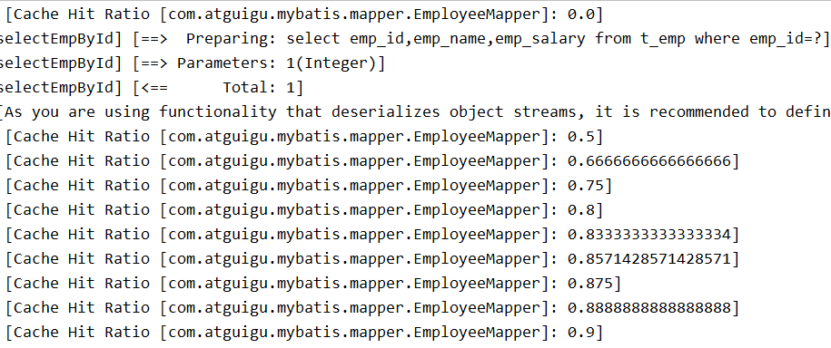
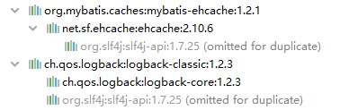
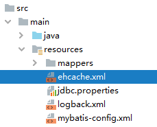
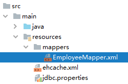
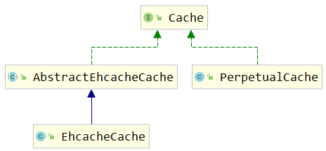
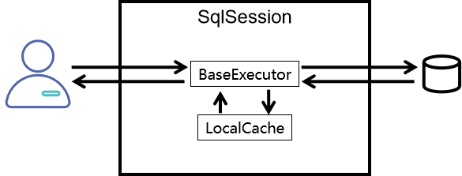
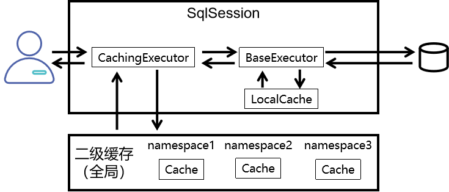
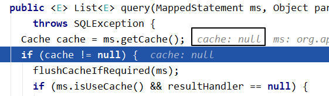
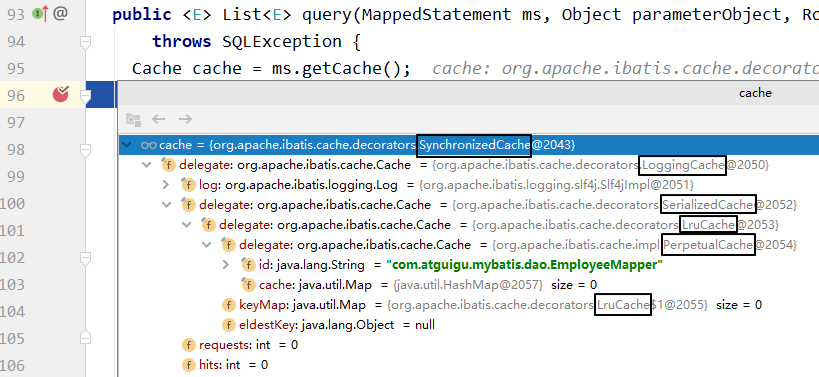
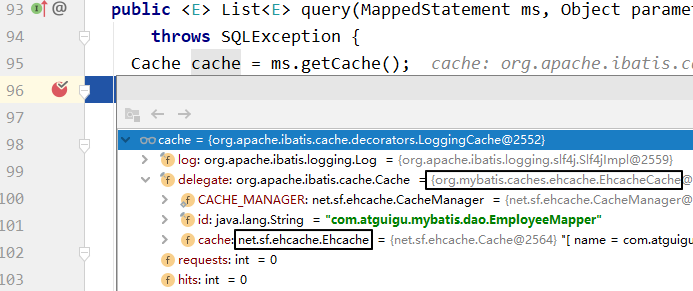

# 第一节 简介

理解缓存的工作机制和缓存的用途。

## 1、缓存机制介绍


## 2、一级缓存和二级缓存

### ①使用顺序


查询的顺序是：

- 先查询二级缓存，因为二级缓存中可能会有其他程序已经查出来的数据，可以拿来直接使用。
- 如果二级缓存没有命中，再查询一级缓存
- 如果一级缓存也没有命中，则查询数据库
- SqlSession关闭之前，一级缓存中的数据会写入二级缓存


### ②效用范围

- 一级缓存：SqlSession级别
- 二级缓存：SqlSessionFactory级别


它们之间范围的大小参考下面图：


# 第二节 一级缓存

## 1、代码验证一级缓存

```Java
@Test
public void testFirstLevelCache() {
    
    EmployeeMapper mapper = session.getMapper(EmployeeMapper.class);
    
    // 1.第一次查询
    Employee employee1 = mapper.selectEmployeeById(2);
    
    log.debug("employee1 = " + employee1);
    
    // 2.第二次查询
    Employee employee2 = mapper.selectEmployeeById(2);
    
    log.debug("employee2 = " + employee2);
    
    // 3.经过验证发现，两次查询返回的其实是同一个对象
    log.debug("(employee2 == employee1) = " + (employee2 == employee1));
    log.debug("employee1.equals(employee2) = " + employee1.equals(employee2));
    log.debug("employee1.hashCode() = " + employee1.hashCode());
    log.debug("employee2.hashCode() = " + employee2.hashCode());
    
}
```


## 2、一级缓存失效的情况

- 不是同一个SqlSession
- 同一个SqlSession但是查询条件发生了变化
- 同一个SqlSession两次查询期间执行了任何一次增删改操作
- 同一个SqlSession两次查询期间手动清空了缓存
- 同一个SqlSession两次查询期间提交了事务

# 第三节 二级缓存

这里我们使用的是Mybatis自带的二级缓存，也可以称之为是内置的。


## 1、代码测试二级缓存

### ①开启二级缓存功能

在想要使用二级缓存的Mapper配置文件中加入cache标签

```XML
<mapper namespace="com.atguigu.mybatis.EmployeeMapper">
    
    <!-- 加入cache标签启用二级缓存功能 -->
    <cache/>
```


### ②让实体类支持序列化

```Java
public class Employee implements Serializable {
```


### ③junit测试

这个功能的测试操作需要将SqlSessionFactory对象设置为成员变量

```Java
@Test
public void testSecondLevelCacheExists() {
    SqlSession session = factory.openSession();
    
    EmployeeMapper mapper = session.getMapper(EmployeeMapper.class);
    
    Employee employee = mapper.selectEmployeeById(2);
    
    log.debug("employee = " + employee);
    
    // 在执行第二次查询前，关闭当前SqlSession
    session.close();
    
    // 开启一个新的SqlSession
    session = factory.openSession();
    
    mapper = session.getMapper(EmployeeMapper.class);
    
    employee = mapper.selectEmployeeById(2);
    
    log.debug("employee = " + employee);
    
    session.close();
    
}
```


### ④缓存命中率

日志中打印的Cache Hit Ratio叫做缓存命中率



缓存命中率=命中缓存的次数/查询的总次数


## 2、查询结果存入二级缓存的时机

结论：SqlSession关闭的时候，一级缓存中的内容会被存入二级缓存

```Java
// 1.开启两个SqlSession
SqlSession session01 = factory.openSession();
SqlSession session02 = factory.openSession();
    
// 2.获取两个EmployeeMapper
EmployeeMapper employeeMapper01 = session01.getMapper(EmployeeMapper.class);
EmployeeMapper employeeMapper02 = session02.getMapper(EmployeeMapper.class);
    
// 3.使用两个EmployeeMapper做两次查询，返回两个Employee对象
Employee employee01 = employeeMapper01.selectEmployeeById(2);
Employee employee02 = employeeMapper02.selectEmployeeById(2);
    
// 4.比较两个Employee对象
log.debug("employee02.equals(employee01) = " + employee02.equals(employee01));
```


修改代码：

```Java
// 1.开启两个SqlSession
SqlSession session01 = factory.openSession();
SqlSession session02 = factory.openSession();
    
// 2.获取两个EmployeeMapper
EmployeeMapper employeeMapper01 = session01.getMapper(EmployeeMapper.class);
EmployeeMapper employeeMapper02 = session02.getMapper(EmployeeMapper.class);
    
// 3.使用两个EmployeeMapper做两次查询，返回两个Employee对象
Employee employee01 = employeeMapper01.selectEmployeeById(2);
    
// ※第一次查询完成后，把所在的SqlSession关闭，使一级缓存中的数据存入二级缓存
session01.close();
Employee employee02 = employeeMapper02.selectEmployeeById(2);
    
// 4.比较两个Employee对象
log.debug("employee02.equals(employee01) = " + employee02.equals(employee01));
    
// 5.另外一个SqlSession用完正常关闭
session02.close();
```

# 第四节 整合EHCache

## 1、EHCache简介

官网地址：[https://www.ehcache.org/](https://www.ehcache.org/)


> Ehcache is an open source, standards-based cache that boosts performance, offloads your database, and simplifies scalability. It's the most widely-used Java-based cache because it's robust, proven, full-featured, and integrates with other popular libraries and frameworks. Ehcache scales from in-process caching, all the way to mixed in-process/out-of-process deployments with terabyte-sized caches.


## 2、整合操作

### ①Mybatis环境

在Mybatis环境下整合EHCache，前提当然是要先准备好Mybatis的环境。


### ②添加依赖

#### [1]依赖信息

```XML
<!-- Mybatis EHCache整合包 -->
<dependency>
    <groupId>org.mybatis.caches</groupId>
    <artifactId>mybatis-ehcache</artifactId>
    <version>1.2.1</version>
</dependency>
```


#### [2]依赖传递情况




#### [3]各主要jar包作用

| jar包名称       | 作用                            |
| --------------- | ------------------------------- |
| mybatis-ehcache | Mybatis和EHCache的整合包        |
| ehcache         | EHCache核心包                   |
| slf4j-api       | SLF4J日志门面包                 |
| logback-classic | 支持SLF4J门面接口的一个具体实现 |


### ③整合EHCache

#### [1]创建EHCache配置文件

ehcache.xml




> 引入第三方框架或工具时，配置文件的文件名可以自定义吗？

*   可以自定义：文件名是由我告诉其他环境
*   不能自定义：文件名是框架内置的、约定好的，就不能自定义，以避免框架无法加载这个文件


#### [2]文件内容

```XML
<?xml version="1.0" encoding="utf-8" ?>
<ehcache xmlns:xsi="http://www.w3.org/2001/XMLSchema-instance"
         xsi:noNamespaceSchemaLocation="../config/ehcache.xsd">
    <!-- 磁盘保存路径 -->
    <diskStore path="D:\atguigu\ehcache"/>
    
    <defaultCache
            maxElementsInMemory="1000"
            maxElementsOnDisk="10000000"
            eternal="false"
            overflowToDisk="true"
            timeToIdleSeconds="120"
            timeToLiveSeconds="120"
            diskExpiryThreadIntervalSeconds="120"
            memoryStoreEvictionPolicy="LRU">
    </defaultCache>
</ehcache>
```


#### [3]指定缓存管理器的具体类型

还是到查询操作所在的Mapper配置文件中，找到之前设置的cache标签：




```XML
<cache type="org.mybatis.caches.ehcache.EhcacheCache"/>

```


### ④加入logback日志

略


### ⑤junit测试

正常按照二级缓存的方式测试即可。因为整合EHCache后，其实就是使用EHCache代替了Mybatis自带的二级缓存。


## 3、EHCache配置文件说明

当借助CacheManager.add("缓存名称")创建Cache时，EhCache便会采用<defalutCache/>指定的的管理策略。

defaultCache标签各属性说明：

| 属性名                          | 是否必须 | 作用                                                         |
| ------------------------------- | -------- | ------------------------------------------------------------ |
| maxElementsInMemory             | 是       | 在内存中缓存的element的最大数目                              |
| maxElementsOnDisk               | 是       | 在磁盘上缓存的element的最大数目，若是0表示无穷大             |
| eternal                         | 是       | 设定缓存的elements是否永远不过期。   如果为true，则缓存的数据始终有效，   如果为false那么还要根据timeToIdleSeconds、timeToLiveSeconds判断 |
| overflowToDisk                  | 是       | 设定当内存缓存溢出的时候是否将过期的element缓存到磁盘上      |
| timeToIdleSeconds               | 否       | 当缓存在EhCache中的数据前后两次访问的时间超过timeToIdleSeconds的属性取值时，   这些数据便会删除，默认值是0,也就是可闲置时间无穷大 |
| timeToLiveSeconds               | 否       | 缓存element的有效生命期，默认是0.,也就是element存活时间无穷大 |
| diskSpoolBufferSizeMB           | 否       | DiskStore(磁盘缓存)的缓存区大小。默认是30MB。每个Cache都应该有自己的一个缓冲区 |
| diskPersistent                  | 否       | 在VM重启的时候是否启用磁盘保存EhCache中的数据，默认是false。 |
| diskExpiryThreadIntervalSeconds | 否       | 磁盘缓存的清理线程运行间隔，默认是120秒。每个120s，   相应的线程会进行一次EhCache中数据的清理工作 |
| memoryStoreEvictionPolicy       | 否       | 当内存缓存达到最大，有新的element加入的时候， 移除缓存中element的策略。   默认是LRU（最近最少使用），可选的有LFU（最不常使用）和FIFO（先进先出） |


LFU：Least Frequently Used，最不经常使用。在执行缓存回收时，删除访问数量最低的数据。Bug是访问量先高后低的数据无法删除。


LRU：Least Recently Used，

- 最近最少使用。在执行缓存回收时，删除近期访问数量最低的数据。典型案例：HashMap
- 最近最久使用。在执行缓存回收时，删除近期闲置时间最长的数据。典型案例：Redis


FIFO：First In First Out，先进先出。使用队列维护缓存数据，先存入的数据会被先删除。

# 第五节 缓存的基本原理

## 1、Cache接口

### ①Cache接口的重要地位

org.apache.ibatis.cache.Cache接口：所有缓存都必须实现的顶级接口




### ②Cache接口中的方法


| 方法名         | 作用             |
| -------------- | ---------------- |
| putObject()    | 将对象存入缓存   |
| getObject()    | 从缓存中取出对象 |
| removeObject() | 从缓存中删除对象 |


### ③缓存的本质

根据Cache接口中方法的声明我们能够看到，缓存的本质是一个Map。


## 2、PerpetualCache

org.apache.ibatis.cache.impl.PerpetualCache是Mybatis的默认缓存，也是Cache接口的默认实现。Mybatis一级缓存和自带的二级缓存都是通过PerpetualCache来操作缓存数据的。但是这就奇怪了，同样是PerpetualCache这个类，怎么能区分出来两种不同级别的缓存呢？

其实很简单，调用者不同。

- 一级缓存：由BaseExecutor调用PerpetualCache
- 二级缓存：由CachingExecutor调用PerpetualCache，而CachingExecutor可以看做是对BaseExecutor的装饰


## 3、一级缓存机制




org.apache.ibatis.executor.BaseExecutor类中的关键方法：

### ①query()方法

```Java
public <E> List<E> query(MappedStatement ms, Object parameter, RowBounds rowBounds, ResultHandler resultHandler, CacheKey key, BoundSql boundSql) throws SQLException {
    ErrorContext.instance().resource(ms.getResource()).activity("executing a query").object(ms.getId());
    if (closed) {
        throw new ExecutorException("Executor was closed.");
    }
    if (queryStack == 0 && ms.isFlushCacheRequired()) {
        clearLocalCache();
    }
    List<E> list;
    try {
        queryStack++;
        
        // 尝试从本地缓存中获取数据
        list = resultHandler == null ? (List<E>) localCache.getObject(key) : null;
        
        if (list != null) {
            handleLocallyCachedOutputParameters(ms, key, parameter, boundSql);
        } else {
            
            // 如果本地缓存中没有查询到数据，则查询数据库
            list = queryFromDatabase(ms, parameter, rowBounds, resultHandler, key, boundSql);
        }
    } finally {
        queryStack--;
    }
    if (queryStack == 0) {
        for (org.apache.ibatis.executor.BaseExecutor.DeferredLoad deferredLoad : deferredLoads) {
            deferredLoad.load();
        }
        // issue #601
        deferredLoads.clear();
        if (configuration.getLocalCacheScope() == LocalCacheScope.STATEMENT) {
            // issue #482
            clearLocalCache();
        }
    }
    return list;
}
```


### ②queryFromDatabase()方法

```Java
private <E> List<E> queryFromDatabase(MappedStatement ms, Object parameter, RowBounds rowBounds, ResultHandler resultHandler, CacheKey key, BoundSql boundSql) throws SQLException {
    List<E> list;
    localCache.putObject(key, EXECUTION_PLACEHOLDER);
    try {
        
        // 从数据库中查询数据
        list = doQuery(ms, parameter, rowBounds, resultHandler, boundSql);
    } finally {
        localCache.removeObject(key);
    }
    
    // 将数据存入本地缓存
    localCache.putObject(key, list);
    if (ms.getStatementType() == StatementType.CALLABLE) {
        localOutputParameterCache.putObject(key, parameter);
    }
    return list;
}
```


## 4、二级缓存机制



下面我们来看看CachingExecutor类中的query()方法在不同情况下使用的具体缓存对象：


### ①未开启二级缓存




### ②使用自带二级缓存




### ③使用EHCache

