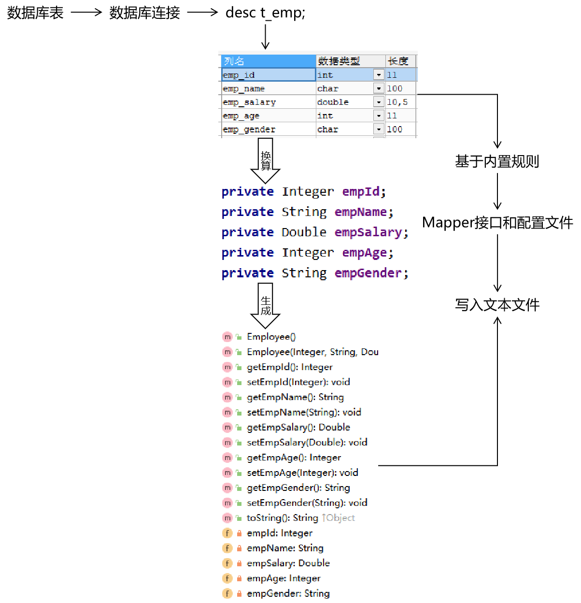
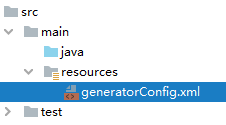
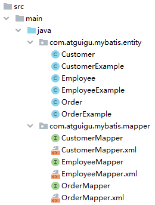
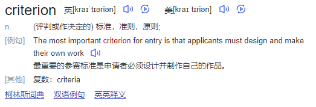

# 第一节 概念与机制

## 1、概念

- 正向工程：先创建Java实体类，由框架负责根据实体类生成数据库表。Hibernate是支持正向工程的。
- 逆向工程：先创建数据库表，由框架负责根据数据库表，反向生成如下资源：
    - Java实体类
    - Mapper接口
    - Mapper配置文件


## 2、基本原理



# 第二节 操作

## 1、配置POM

```XML
<!-- 依赖MyBatis核心包 -->
<dependencies>
  <dependency>
    <groupId>org.mybatis</groupId>
    <artifactId>mybatis</artifactId>
    <version>3.5.7</version>
  </dependency>
</dependencies>
  
<!-- 控制Maven在构建过程中相关配置 -->
<build>
    
  <!-- 构建过程中用到的插件 -->
  <plugins>
    
    <!-- 具体插件，逆向工程的操作是以构建过程中插件形式出现的 -->
    <plugin>
      <groupId>org.mybatis.generator</groupId>
      <artifactId>mybatis-generator-maven-plugin</artifactId>
      <version>1.3.0</version>
  
      <!-- 插件的依赖 -->
      <dependencies>
        
        <!-- 逆向工程的核心依赖 -->
        <dependency>
          <groupId>org.mybatis.generator</groupId>
          <artifactId>mybatis-generator-core</artifactId>
          <version>1.3.2</version>
        </dependency>
          
        <!-- 数据库连接池 -->
        <dependency>
          <groupId>com.mchange</groupId>
          <artifactId>c3p0</artifactId>
          <version>0.9.2</version>
        </dependency>
          
        <!-- MySQL驱动 -->
        <dependency>
          <groupId>mysql</groupId>
          <artifactId>mysql-connector-java</artifactId>
          <version>5.1.8</version>
        </dependency>
      </dependencies>
    </plugin>
  </plugins>
</build>

```


## 2、MBG配置文件

文件名必须是：generatorConfig.xml




```XML
<?xml version="1.0" encoding="UTF-8"?>
<!DOCTYPE generatorConfiguration
        PUBLIC "-//mybatis.org//DTD MyBatis Generator Configuration 1.0//EN"
        "http://mybatis.org/dtd/mybatis-generator-config_1_0.dtd">
<generatorConfiguration>
    <!--
            targetRuntime: 执行生成的逆向工程的版本
                    MyBatis3Simple: 生成基本的CRUD（清新简洁版）
                    MyBatis3: 生成带条件的CRUD（奢华尊享版）
     -->
    <context id="DB2Tables" targetRuntime="MyBatis3">
        <!-- 数据库的连接信息 -->
        <jdbcConnection driverClass="com.mysql.jdbc.Driver"
                        connectionURL="jdbc:mysql://192.168.200.100:3306/mybatis-example"
                        userId="root"
                        password="atguigu">
        </jdbcConnection>
        <!-- javaBean的生成策略-->
        <javaModelGenerator targetPackage="com.atguigu.mybatis.entity" targetProject=".\src\main\java">
            <property name="enableSubPackages" value="true" />
            <property name="trimStrings" value="true" />
        </javaModelGenerator>
        <!-- SQL映射文件的生成策略 -->
        <sqlMapGenerator targetPackage="com.atguigu.mybatis.mapper"  targetProject=".\src\main\java">
            <property name="enableSubPackages" value="true" />
        </sqlMapGenerator>
        <!-- Mapper接口的生成策略 -->
        <javaClientGenerator type="XMLMAPPER" targetPackage="com.atguigu.mybatis.mapper"  targetProject=".\src\main\java">
            <property name="enableSubPackages" value="true" />
        </javaClientGenerator>
        <!-- 逆向分析的表 -->
        <!-- tableName设置为*号，可以对应所有表，此时不写domainObjectName -->
        <!-- domainObjectName属性指定生成出来的实体类的类名 -->
        <table tableName="t_emp" domainObjectName="Employee"/>
        <table tableName="t_customer" domainObjectName="Customer"/>
        <table tableName="t_order" domainObjectName="Order"/>
    </context>
</generatorConfiguration>
```


## 3、执行MBG插件的generate目标


## 4、效果



# 第三节 QBC查询

## 1、概念

QBC：Query By Criteria



QBC查询最大的特点就是将SQL语句中的WHERE子句进行了组件化的封装，让我们可以通过调用Criteria对象的方法自由的拼装查询条件。


## 2、例子

```Java
        // 1.创建EmployeeExample对象
        EmployeeExample example = new EmployeeExample();

        // 2.通过example对象创建Criteria对象
        EmployeeExample.Criteria criteria01 = example.createCriteria();
        EmployeeExample.Criteria criteria02 = example.or();

        // 3.在Criteria对象中封装查询条件
        criteria01
            .andEmpAgeBetween(9, 99)
            .andEmpNameLike("%o%")
            .andEmpGenderEqualTo("male")
            .andEmpSalaryGreaterThan(500.55);

        criteria02
                .andEmpAgeBetween(9, 99)
                .andEmpNameLike("%o%")
                .andEmpGenderEqualTo("male")
                .andEmpSalaryGreaterThan(500.55);

        SqlSession session = factory.openSession();

        EmployeeMapper mapper = session.getMapper(EmployeeMapper.class);

        // 4.基于Criteria对象进行查询
        List<Employee> employeeList = mapper.selectByExample(example);

        for (Employee employee : employeeList) {
            System.out.println("employee = " + employee);
        }

        session.close();

        // 最终SQL的效果：
        // WHERE ( emp_age between ? and ? and emp_name like ? and emp_gender = ? and emp_salary > ? ) or( emp_age between ? and ? and emp_name like ? and emp_gender = ? and emp_salary > ? )

```