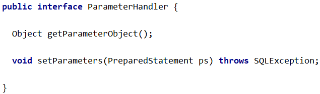

# 第一节 实体类类型别名

## 1、目标

让Mapper配置文件中使用的实体类类型名称更简洁。


## 2、操作

### ①Mybatis全局配置文件

```XML
<!-- 配置类型的别名 -->
<typeAliases>
    <!-- 声明了实体类所在的包之后，在Mapper配置文件中，只需要指定这个包下的简单类名即可 -->
    <package name="com.atguigu.mybatis.entity"/>
</typeAliases>
```


### ②Mapper配置文件

```XML
<!-- Employee selectEmployeeById(Integer empId); -->
<select id="selectEmployeeById" resultType="Employee">
    select emp_id,emp_name,emp_salary,emp_gender,emp_age from t_emp
    where emp_id=#{empId}
</select>
```


## 3、Mybatis内置的类型别名


# 第二节 类型处理器

## 1、Mybatis内置类型处理器

无论是 MyBatis 在预处理语句（PreparedStatement）中设置一个参数时，还是从结果集中取出一个值时，都会用类型处理器将获取的值以合适的方式转换成 Java 类型。

Mybatis提供的内置类型处理器：


## 2、日期时间处理

日期和时间的处理，JDK1.8 以前一直是个头疼的问题。我们通常使用 JSR310 规范领导者 Stephen Colebourne 创建的 Joda-Time 来操作。JDK1.8 已经实现全部的 JSR310 规范了。

Mybatis 在日期时间处理的问题上，提供了基于 JSR310（Date and Time API）编写的各种日期时间类型处理器。

MyBatis3.4 以前的版本需要我们手动注册这些处理器，以后的版本都是自动注册的。

如需注册，需要下载 mybatistypehandlers-jsr310，并通过如下方式注册


## 3、自定义类型处理器

当某个具体类型 Mybatis 靠内置的类型处理器无法识别时，可以使用 Mybatis 提供的自定义类型处理器机制。

- 第一步：实现 org.apache.ibatis.type.TypeHandler 接口或者继承 org.apache.ibatis.type.BaseTypeHandler 类。
- 第二步：指定其映射某个 JDBC 类型（可选操作）。
- 第三步：在 Mybatis 全局配置文件中注册。


### ①创建自定义类型转换器类

```java
@MappedTypes(value = Address.class)
@MappedJdbcTypes(JdbcType.CHAR)
public class AddressTypeHandler extends BaseTypeHandler<Address> {
    @Override
    public void setNonNullParameter(PreparedStatement preparedStatement, int i, Address address, JdbcType jdbcType) throws SQLException {

    }

    @Override
    public Address getNullableResult(ResultSet resultSet, String columnName) throws SQLException {

        // 1.从结果集中获取原始的地址数据
        String addressOriginalValue = resultSet.getString(columnName);

        // 2.判断原始数据是否有效
        if (addressOriginalValue == null || "".equals(addressOriginalValue))
            return null;

        // 3.如果原始数据有效则执行拆分
        String[] split = addressOriginalValue.split(",");
        String province = split[0];
        String city = split[1];
        String street = split[2];

        // 4.创建Address对象
        Address address = new Address();
        address.setCity(city);
        address.setProvince(province);
        address.setStreet(street);

        return address;
    }

    @Override
    public Address getNullableResult(ResultSet resultSet, int i) throws SQLException {
        return null;
    }

    @Override
    public Address getNullableResult(CallableStatement callableStatement, int i) throws SQLException {
        return null;
    }
}
```


### ②注册自定义类型转换器

在Mybatis全局配置文件中配置：

```XML
<!-- 注册自定义类型转换器 -->
<typeHandlers>
    <typeHandler 
                 jdbcType="CHAR" 
                 javaType="com.atguigu.mybatis.entity.Address" 
                 handler="com.atguigu.mybatis.type.handler.AddressTypeHandler"/>
</typeHandlers>
```

# 第三节 Mapper映射

## 1、需求

Mapper 配置文件很多时，在全局配置文件中一个一个注册太麻烦，希望有一个办法能够一劳永逸。


## 2、配置方式

Mybatis 允许在指定 Mapper 映射文件时，只指定其所在的包：

```XML
<mappers>
    <package name="com.atguigu.mybatis.dao"/>
</mappers>
```


此时这个包下的所有 Mapper 配置文件将被自动加载、注册，比较方便。


## 3、资源创建要求

### ①基本要求

- Mapper 接口和 Mapper 配置文件名称一致
    - Mapper 接口：EmployeeMapper.java
    - Mapper 配置文件：EmployeeMapper.xml
- Mapper 配置文件放在 Mapper 接口所在的包内

如果工程是 Maven 工程，那么 Mapper 配置文件还是要放在 resources 目录下：


说白了就是：Mapper 配置文件所在目录的结构和 Mapper 接口所在包的目录结构一致。


### ②需要注意的一个情况

#### [1] IDEA 中看到的目录结构


#### [2]但实际上真实目录结构


#### [3]接口所在包的目录


#### [4]产生这个问题的原因

在 resources 目录下创建目录时没有把包名的点换成斜杠：


#### [5]修改IDEA显示方式

这样，多层目录就不会合并显示了。


# 第四节 插件机制

## 1、概述

插件是 MyBatis 提供的一个非常强大的机制，我们可以通过插件来修改 MyBatis 的一些核心行为。插件通过动态代理机制，可以介入四大对象的任何一个方法的执行。著名的 Mybatis 插件包括 PageHelper（分页插件）、通用 Mapper（SQL生成插件）等。


## 2、Mybatis四大对象

### ①Executor


### ②ParameterHandler




### ③ResultSetHandler


### ④StatementHandler


## 3、Mybatis 插件机制

如果想编写自己的 Mybatis 插件可以通过实现 org.apache.ibatis.plugin.Interceptor 接口来完成，表示对 Mybatis 常规操作进行拦截，加入自定义逻辑。


但是由于插件涉及到 Mybatis 底层工作机制，在没有足够把握时不要轻易尝试。

# 第五节 Mybatis底层的JDBC封装

org.apache.ibatis.executor.statement.PreparedStatementHandler 类：


查找上面目标时，Debug查看源码的切入点是：
org.apache.ibatis.session.defaults.DefaultSqlSession类的update()方法


# 第六节 总结


- Mybatis环境所需依赖 ★
- 配置
    - Mybatis全局配置
    - Mapper配置 ★
- Mapper接口 ★
- API
    - SqlSessionFactory
    - SqlSession
- MBG ★
- 缓存
    - 一级缓存
    - 二级缓存
        - 自带
        - EHCache ☆
- 原理
    - 把配置文件信息封装到Java对象中
    - 缓存底层机制
    - 四大接口
    - Mybatis底层是JDBC


总结的思维导图：

[http://naotu.baidu.com/file/3fd32e13c7d4eb4dfadde0544ed905f9?token=27c10bbbf7dfc22e](http://naotu.baidu.com/file/3fd32e13c7d4eb4dfadde0544ed905f9?token=27c10bbbf7dfc22e)