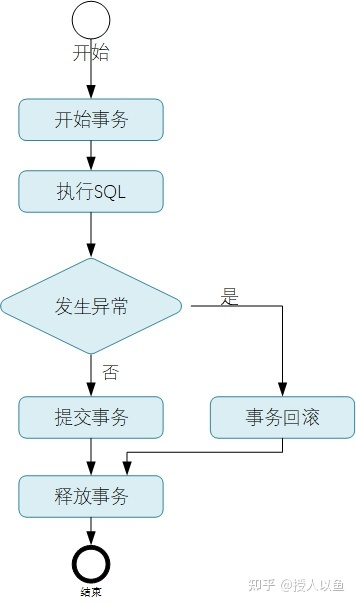
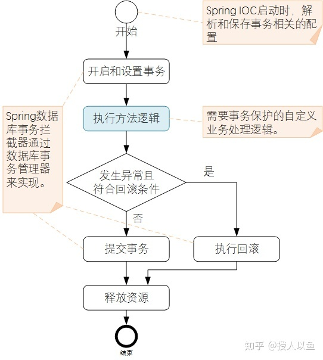
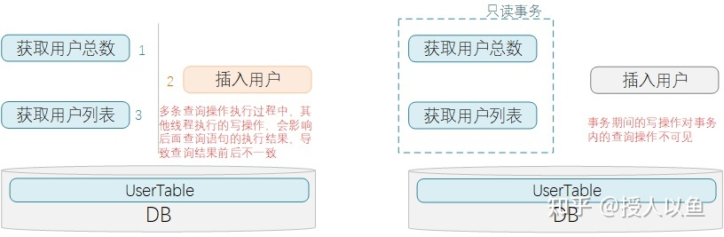
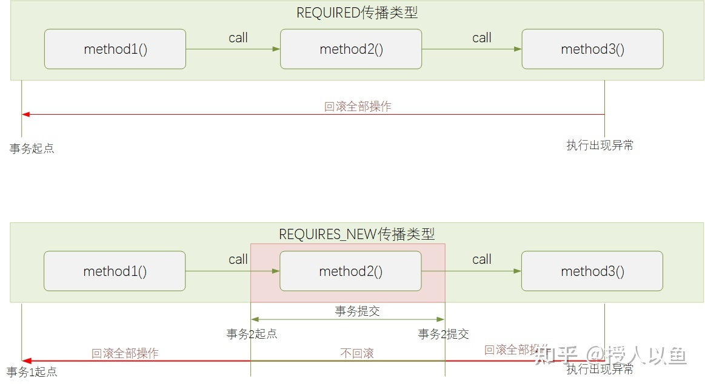
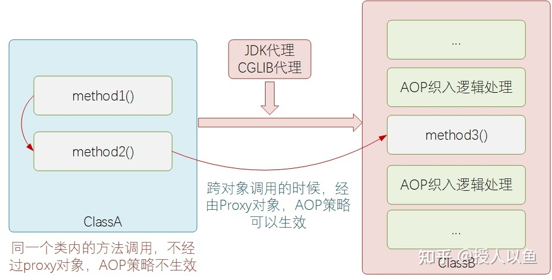

# Spring事务控制策略以及@Transactional注解失效问题避坑

在大部分涉及到数据库操作的项目里面，**事务控制、事务处理都是一个无法回避的问题**。比如，需要对SQL执行过程进行事务的控制与处理的时候，其整体的处理流程会是如下的示意：





首先是要开启事务、然后执行具体SQL，如果执行异常则回滚事务，否则提交事务，最后关闭事务，完成整个处理过程。按照这个流程的逻辑，写一下对应的实现代码：

```java
public void testJdbcTransactional(DataSource dataSource) {
    Connection conn = null;
    int result = 0;
    try {
        // 获取链接
        conn = dataSource.getConnection();
        // 禁用自动事务提交，改为手动控制
        conn.setAutoCommit(false);
        // 设置事务隔离级别
        conn.setTransactionIsolation(
            TransactionIoslationLevel.READ_COMMITTED.getLevel()
        );

        // 执行SQL
        PreparedStatement ps = 
            conn.prepareStatement("insert into user (id, name) values (?, ?)");
        ps.setString(1, "123456");
        ps.setString(2, "Tom");
        result = ps.executeUpdate();

        // 执行成功，手动提交事务
        conn.commit();
    } catch (Exception e) {
        // 出现异常，手动回滚事务
        if (conn != null) {
            try {
                conn.rollback();
            } catch (Exception e) {
                // write log...
            }
        }
    } finally {
        // 执行结束，最终不管成功还是失败，都要释放资源，断开连接
        try {
            if (conn != null && !conn.isClosed()) {
                conn.close();
            }
        } catch (Exception e) {
             // write log...
        }
    }
}
```

不难发现，上面大段的代码逻辑并不复杂，对于业务而言其实仅仅只是执行了一个insert操作而已。但是杂糅的事务控制代码，显然**干扰了业务自身的代码处理逻辑的阅读与理解**。

常规项目的代码中，涉及到DB处理的场景很多，如果每个地方都有这么一段事务控制的逻辑，那么整体代码的可维护性将会比较差，想想都令人窒息。

好在，JAVA中很多项目现在都是基于Spring框架进行构建的。得益于 `Spring`框架的封装，业务代码中进行事务控制操作起来也很简单，直接加个 `@Transactional`注解即可，大大简化了对业务代码的**侵入性**。那么对 `@Transactional`事务注解了解的够全面吗？知道有哪些场景可能会导致 `@Transactional`注解并不会如你预期的方式生效吗？知道应该怎么使用 `@Transactional`才能保证对性能的影响最小化吗？

下面我们一起探讨下这些问题。

**相关视频教程：[Spring源码解析](https://link.zhihu.com/?target=https%3A//www.bilibili.com/video/BV1Sr4y1x74Z%3Fshare_source%3Dcopy_web%26vd_source%3Dc7b95ce52b037753d590baa9a456e779)**

## **Spring声明式事务处理机制**

为了简化业务开发场景对事务的处理复杂度，让开发人员可以更关注于业务自身的处理逻辑，**Spring**提供了声明式事务的能力支持。

**Spring**数据库事务约定处理逻辑流程如下图所示，对比前面示例中基于`JDBC`的事务处理，Spring的事务的处理操作交给了**Spring框架**处理，开发人员仅需要实现自己的业务逻辑即可，大大简化了事务方面的处理投入。





基于Spring事务机制，实现上述DB操作事务控制的代码，我们的代码会变得非常的简洁：

```java
@Transactional
public void insertUser() {
    userDao.insertUser();
}
```

与JDBC事务实现代码相比，基于Spring的方式只需要添加一个 `@Transactional`注解即可，代码中只需要实现业务逻辑即可，实现了事务控制机制对业务代码的**低侵入性**。

Spring支持的基于 `Spring AOP`实现的**声明式事务**功能，所谓声明式事务，即使用@Transactional注解进行声明标注，告诉Spring框架在什么地方启用数据库事务控制能力。`@Transactional`注解，*可以添加在类或者方法上*。如果其添加在类上时，表明此类中所有的*public非静态方法*都将启用事务控制能力。

既然@Transactional注解承载了Spring框架对于事务处理的相关能力，那么接下来我们就一起看下该注解的一些可选配置以及具体使用场景。

## **@Transactional主要可选配置**

### **只读事务配置**

通过`readonly`参数指定当前事务是否为一个只读事务。设置为true标识此事务是个只读事务，默认情况为false。

```java
@Transactional(readOnly = true)
public DomResponse<CiCdItemDetail> queryCicdItemDetail(String appCode) {
    return null;
}
```

这里涉及一个概念，叫做**只读事务**，其含义描述如下：

> 在多条查询语句一起执行的场景里面会涉及到的概念。表示在事务设置的那一刻开始，到整个事务执行结束的过程中，其他事务所提交的写操作数据，对该事务都不可见。

举个例子：

> 现在有一个复合查询操作，包含2条SQL查询操作：先获取用户表count数，再获取用户表中所有数据。
> (1) 先执行完获取用户表count数，得到结果10
> (2) 在还没开始执行后一条语句的时候，另一个进程操作了DB并往用户表中插入一条新数据
> (3) 复合操作的第二条SQL语句，获取用户列表的操作被执行，返回了11条记录

很明显，复合操作中的两条SQL语句获取的数据结果无法匹配上。原因就是非原子性操作导致，即2条查询操作执行的间隔内，有另一个写操作修改了目标读取的数据，导致了此问题的出现。





为了避免此情况的发生，可以给复合查询操作添加上只读事务，这样事务控制范围内，事务外的写操作就不可见，这样就保证了事务内多条查询语句执行结果的一致性。

那为什么要设置为只读事务、而不是常规的事务呢？主要是从执行效率角度的考虑。因为这个里的操作都是一些只读操作，所以设置为只读事务，数据库会为只读事务提供一些优化手段，比如不启动回滚段、不记录回滚log之类的。

### **回滚条件设定**

`@Transactional`有提供4个不同属性，可以支持传入不同的参数，设定需要回滚的条件：


| 参数                   | 含义说明                                                     |
| ---------------------- | ------------------------------------------------------------ |
| rollbackFor            | 用于指定需要回滚的特定异常类型，可以指定一个或者多个。当指定rollbackFor或者rollbackForClassName之后，方法执行逻辑中只有抛出指定的异常类型，才会触发事务回滚 |
| rollbackForClassName   | 与rollbackFor相同，设置字符串格式的类名                      |
| noRollbackFor          | 用于指定不需要进行回滚的异常类型，当方法中抛出指定类型的异常时，不进行事务回滚。而其余的类型的异常将会触发事务回滚。 |
| noRollbackForClassName | 与noRollbackFor相同，设置字符串格式的类名                    |


其中，rollbackFor支持指定单个或者多个异常类型，只要抛出指定类型的异常，事务都将被回滚掉：

```java
// 指定单个异常
@Transactional(rollbackFor = DemoException.class)
public void insertUser() {
    // do something here
}

// 指定多个异常
@Transactional(rollbackFor = {DemoException.class, DemoException2.class})
public void insertUser2() {
    // do something here
}
```

`rollbackFor`和`rollbackForClassName`作用相同，只是提供了2个不同的指定方法，允许执行Class类型或者ClassName字符串。

```java
// 指定异常名称
@Transactional(rollbackForClassName = {"DemoException"})
public void insertUser() {
    // do something here
}
```

同理，`noRollbackFor`和`noRollbackForClassName`的使用与上面示意的相似，只是其含义功能点是相反的。

### **事务传播行为**

`propagation`用于指定此事务对应的传播类型。所谓的事务传播类型，即当前已经在一个事务的上下文中时，又需要开始一个事务，这个时候来处理这个将要开启的新事务的处理策略。

主要有7种类型的事务传播类型：


| 传播类型      | 含义描述                                                     |
| ------------- | ------------------------------------------------------------ |
| REQUIRED      | 如果当前存在事务，则加入该事务；如果当前没有事务，则创建一个新的事务 |
| SUPPORTS      | 如果当前存在事务，则加入该事务；如果当前没有事务，则以非事务的方式继续运行 |
| MANDATORY     | 如果当前存在事务，则加入该事务；如果当前没有事务，则抛出异常 |
| REQUIRES_NEW  | 创建一个新的事务，如果当前存在事务，则把当前事务挂起         |
| NOT_SUPPORTED | 以非事务方式运行，如果当前存在事务，则把当前事务挂起         |
| NEVER         | 以非事务方式运行，如果当前存在事务，则抛出异常               |
| NESTED        | 如果当前存在事务，则创建一个事务作为当前事务的嵌套事务来运行；如果当前没有事务，则该取值等价于REQUIRED |


事务的传播行为，将会影响到事务控制的结果，比如最终是在同一事务中，一旦遇到异常，所有操作都会被回滚掉，而如果是在多个事务中，则某一个事务的回滚，不影响已提交的其余事务的回滚。





实际编码的时候，可以通过@Transactional注解中的 `propagation`参数来指定具体的传播类型，取值由 `org.springframework.transaction.annotation.Propagation`枚举类提供。如果不指定，则默认取值为 `Propagation.REQUIRED`，也即**如果当前存在事务，则加入该事务，如果当前没有事务，则创建一个新的事务**。

```java
/**
 * The transaction propagation type.
 * <p>Defaults to {@link Propagation#REQUIRED}.
 * @see org.springframework.transaction.interceptor.TransactionAttribute#getPropagationBehavior()
 */
Propagation propagation() default Propagation.REQUIRED;
```

### **事务超时设定**

可以使用`timeout`属性来设置事务的超时秒数，默认值为-1，表示永不超时。

## **@Transactional失效场景避坑**

### **同一个类中方法间调用**

Spring的事务实现原理是AOP，而AOP的原理是动态代理。




在类内部方法之间相互调用的时候，本质上是类对象自身的调用，而不是使用代理对象去调用，也就不会触发AOP，这样其实Spring也就无法将事务控制的代码逻辑织入到调用代码流程中，所以这里的事务控制就无法生效。

```java
public void insertUser() {
    writeDataIntoDb();
}

@Transactional
public void writeDataIntoDb() {
  // ...
}
```

所以遇到同一个类中多个方法之间相互调用，且调用的方法需要做事务控制的时候需要特别注意下这个问题。解决方式，可以建2个不同的类，然后将方法放到两个类中，这样跨类调用，Spring事务机制就可以生效。

### **添加在非public方法上**

如果将@Transactional注解添加在protected、private修饰的方法上，虽然代码不会有任何的报错，但是实际上注解是不会生效的。

```java
@Transactional
private void writeDataIntoDb() {
  // ...
}
```

### **方法内部Try Catch吞掉相关异常**

这个其实很容易理解，业务代码中将所有的异常给catch并吞掉了，等同于业务代码认为被捕获的异常不需要去触发回滚。对框架而言，因为异常被捕获了，业务逻辑执行都在正常往下运行，所以也不会触发异常回滚机制。

```java
// catch了可能的异常，导致DB操作失败的时候事务不会触发回滚
@Transactional
public void insertUser() {
    try {
        UserEntity user = new UserEntity();
        user.setWorkId("123456");
        user.setUserName("王小二");
        userRepository.save(user);
    } catch (Exception e) {
        log.error("failed to create user");

        // 直接吞掉了异常，这样不会触发事务回滚机制
    }
}
```

在业务处理逻辑中，如果确实需要知晓并捕获相关处理的异常进行一些额外的业务逻辑处理，如果要保证事务回滚机制生效，最后需要往外抛出 `RuntimeException`异常，或者是继承RuntimeException实现的*业务自定义异常*。如下：

```java
// catch了可能的异常，对外抛出RuntimeException或者其子类,可触发事务回滚
@Transactional
public void insertUser() {
    try {
        UserEntity user = new UserEntity();
        user.setWorkId("123456");
        user.setUserName("王小二");
        userRepository.save(user);
    } catch (Exception e) {
        log.error("failed to create user");

        // @Transactional没有指定rollbackFor，所以抛出RuntimeException或者其子类，可触发事务回滚机制
        throw new RuntimeException(e);
    }
}
```

当然，如果@Transactional注解指定了 `rollbackFor`为某个具体的异常类型，则最终需要保证异常时对外抛出相匹配的异常类型，才可以触发事务处理逻辑。如下：

```java
// catch了指定异常，对外抛出对应类型的异常,可触发事务回滚
@Transactional(rollbackFor = DemoException.class)
public void insertUser() {
    try {
        UserEntity user = new UserEntity();
        user.setWorkId("123456");
        user.setUserName("王小二");
        userRepository.save(user);
    } catch (Exception e) {
        log.error("failed to create user");
        // @Transactional有指定rollbackFor，抛出异常要与rollbackFor指定异常类型一致
        throw new DemoException();
    }
}
```

### **对应数据库引擎类型不支持事务**

以**MySQL**数据库而言，常见的数据库引擎有 `InnoDB`和 `Myisam`等类型，但是**MYISAM引擎类型是不支持事务**的。所以如果建表时设置的引擎类型设置为 `MYISAM`的话，即使代码里面添加了@Transactional最终事务也不会生效的。

## **@Transactional使用策略**

因为事务处理对性能会有一定的影响，所以事务也不是说任何地方都可以随便添加的。对于一些性能敏感场景，需要注意几点：

1. **仅在必要的场合添加事务控制**

> （1）不含有DB操作相关，无需添加事务控制
> （2）单条查询语句，没必要添加事务控制
> （3）仅有查询操作的多条SQL执行场景，可以添加只读事务控制
> （4）单条 `insert/update/delete`语句，其实也不需要添加 `@Transactional`事务处理，因为单条语句执行其实数据库有**隐性事务控制机制**，如果执行失败，是属于 `SQL`报错，数据不会更新成功，自然也无需回滚。

1. 尽可能**缩小事务控制的代码段处理范围**

> 主要从性能层面考虑，事务机制，类似于并发场景的加锁处理，*范围越大对性能影响越明显*

1. 事务控制范围内的业务逻辑尽可能简单、**避免非事务相关耗时处理逻辑**

> 也是从性能层面考虑，尽量将耗时的逻辑放到事务控制之外执行，*事务内仅保留与DB操作切实相关的逻辑*

## **总结**

好啦，关于Spring中事务控制的相关用法，以及@Transactional使用过程中可能的一些失效场景，就探讨到这里了。那么你对事务这块有哪些自己的理解呢？或者是否有遇到相关的问题呢？欢迎一起交流下咯。

> 原文：[聊聊Spring事务控制策略以及@Transactional失效问题避坑 - 架构悟道 - 博客园](https://link.zhihu.com/?target=https%3A//www.cnblogs.com/softwarearch/p/16561833.html)