## 课程内容介绍

1、Spring框架概述
2、IOC容器
（1）IOC底层原理
（2）IOC接口（BeanFactory）
（3）IOC操作Bean管理（基于xml）
（4）IOC操作Bean管理（基于注解）
3、Aop
4、JdbcTemplate
5、事务管理
6、Spring5新特性

## 一、Spring框架概述

> 1、spring框架是一个轻量级的开源的java EE开发框架。
>
> 2、spring框架解决企业应用开发的复杂性。
>
> 3、spring有两个核心：[IOC](https://so.csdn.net/so/search?q=IOC&spm=1001.2101.3001.7020)与AOP
>
> (1) IOC：控制反转，把创建对象过程交给Spring管理。
>
> (2) AOP：面向切面编程，不修改源代码情况下，进行功能增强。

### 1、Spring特点

（1）方便解耦，简化开发

（2）aop支持

（3）方便程序测试

（4）方便集成各种框架

（5）降低Java api使用难度

（6）方便进行事务处理

### 2、Spring版本选择

https://spring.io/projects/spring-framework#learn

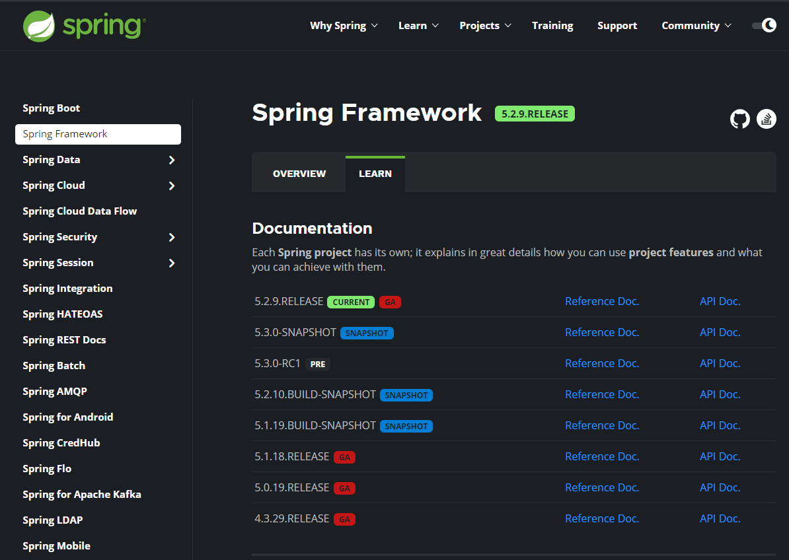

### 3、入门案例

1. 下载spring

   https://repo.spring.io/ui/native/release/org/springframework/spring/

   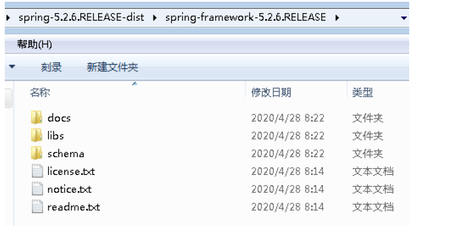

2. idea 新建普通Java工程

3. 导入spring 的jar包。（bean,core，context，expresstion、commons-logging）

   

4. 写代码

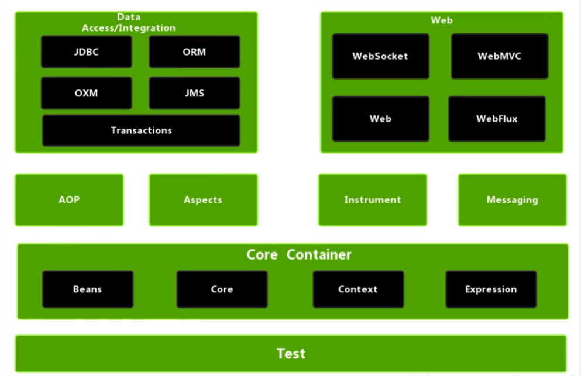

pom依赖

```xml
    <dependencies>
        <!-- https://mvnrepository.com/artifact/org.springframework/spring-beans -->
        <dependency>
            <groupId>org.springframework</groupId>
            <artifactId>spring-beans</artifactId>
            <version>5.2.6.RELEASE</version>
        </dependency>
        <dependency>
            <groupId>org.springframework</groupId>
            <artifactId>spring-context</artifactId>
            <version>5.2.6.RELEASE</version>
        </dependency>
        <dependency>
            <groupId>org.springframework</groupId>
            <artifactId>spring-core</artifactId>
            <version>5.2.6.RELEASE</version>
        </dependency>
        <dependency>
            <groupId>org.springframework</groupId>
            <artifactId>spring-expression</artifactId>
            <version>5.2.6.RELEASE</version>
        </dependency>
        <dependency>
            <groupId>commons-logging</groupId>
            <artifactId>commons-logging</artifactId>
            <version>1.1.1</version>
        </dependency>
        <dependency>
            <groupId>junit</groupId>
            <artifactId>junit</artifactId>
            <version>4.13.1</version>
            <scope>compile</scope>
        </dependency>
    </dependencies>
```


**创建普通类，类里面创建普通方法。**

```java
public class User{
    public void add(){
         system.out.println("add....");
     }
}
```

**创建Spring配置文件，在配置文件中创建对象，新建`base.xml`配置文件**

```xml
<?xml version="1.0" encoding="UTF-8"?>
<beans xmlns="http://www.springframework.org/schema/beans"
       xmlns:xsi="http://www.w3.org/2001/XMLSchema-instance"
       xsi:schemaLocation="http://www.springframework.org/schema/beans http://www.springframework.org/schema/beans/spring-beans.xsd">

    <!--配置User对象创建-->
    <bean id="user" class="com.spring5.User"></bean>
</beans>
```

**测试**

```java
public class TestSpring5{
    @Test
    public void testAdd(){
        //1、加载spring配置文件
        ApplicationContext context = new ClassPathXmlApplicationContext("base.xml");
        //2、获取配置的创建对象
        User user = context.getBean("user",User.class);
        //3、测试
        System.out.println(user);
        user.add();
    }
}
```

## 二、IOC容器

什么是IOC
（1）控制反转，把对象创建和对象之间的调用过程，交给Spring进行管理
（2）使用IOC目的：为了耦合度降低
（3）做入门案例就是IOC实现

### 1、IOC底层原理

>  xml解析、工厂模式、反射

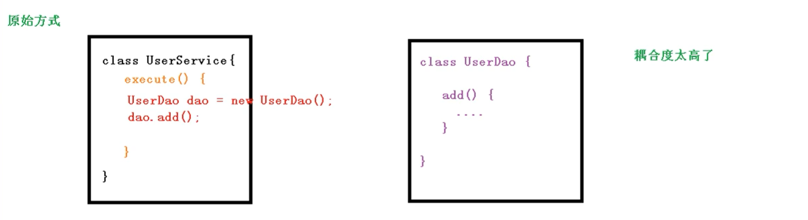

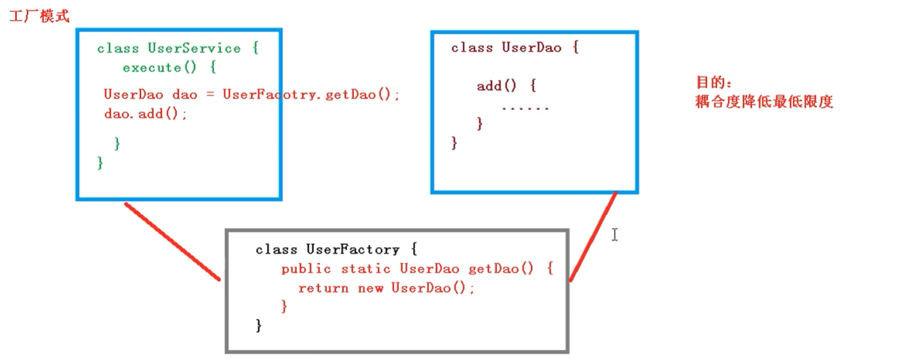

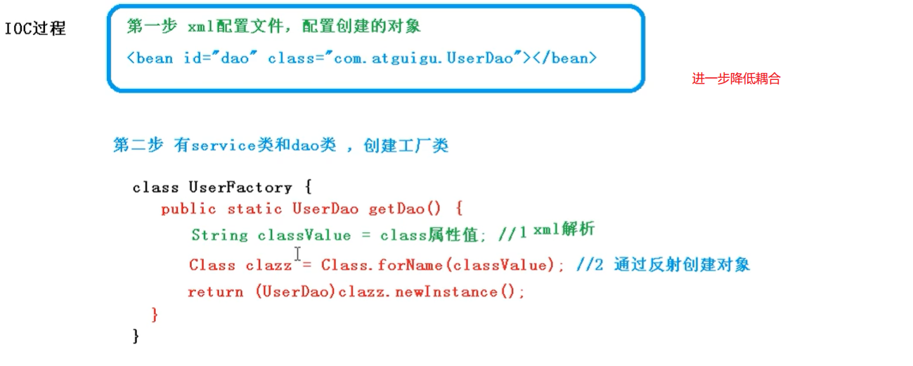

### 2、IOC接口（`BeanFactory`）

- IOC思想基于IOC容器完成，IOC容器底层就是对象工厂。

- Spring提供了IOC容器实现的两种方式：两个接口，
  - `BeanFactory`：IOC容器基本实现，是spring内部使用接口，不提供开发人员使用。
  
    > 加载配置文件时不会创建对象，使用对象时才会创建对象（懒汉式加载对象）。
  
  - `ApplicationContext`：BeanFatory接口的子接口，提供更多更强大的功能，一般供开发人员进行使用。
  
    > 加载配置文件时候就会把在配置文件对象进行创建（饿汉式加载对象）。
    >
    > 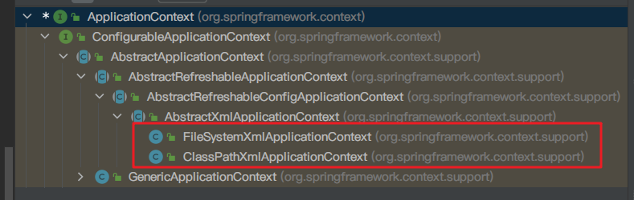
    >
    > - FileSystemXmlApplicationContext(“盘符路径（绝对路径）”)
    > - ClassPathXmlApplicationContext(“src目录下类路径”)
  
    

### 4、IOC操作 Bean 管理

> **1. 什么是Bean管理**
>
> - Bean 管理指的是两个操作
>   - Spring 创建对象
>   - Spring 注入属性
>
>
> **2. Bean 管理操作的两种方式**
>
> - 基于xml配置文件方式实现
> - 基于注解方式实现

### 5、IOC操作 Bean 管理（基于xml）

1. 基于xml方式创建对象

   (1) 在Spring配置文件中，使用Bean标签，标签里面添加对应属性，就可以实现对应对象创建
   
   ```xml
   <!--配置User对象创建-->
   <bean id="user" class="com.spring5.User"></bean>
   ```
   
   (2) 在Bean标签有很多属性，常用的属性：id、class、name
   
   ​	*id属性：唯一标识
   ​	*class属性：类全路径（包类路径）
   ​	*name 和id类似，可以包含特殊符号，已过期
   
   (3) 创建对象的时候，**默认也是执行无参数构造方法**


2. 基于xml方式注入属性

(1) DI：依赖注入，就是注入属性

**第一种注入方式：使用set方法进行注入**

（1）创建类，定义属性和对应的set方法

```java
/**演示使用set方法进行注入属性*/
public class Book {
    private String bname;
    private String bauthor;

    public void setBname(String bname) {
        this.bname = bname;
    }
    public void setBauthor(String bauthor) {
        this.bauthor = bauthor;
    }
   
    public static void main(String[] args) {
        Book book = new Book();
        book.setBname("WeiSanJin");
    }
}
```

（2）在Spring配置文件配置对象创建，配置属性注入

```xml
    <!--set方法注入属性-->
    <bean id="book" class="com.spring5.Book">
    <!--使用property完成属性注入
        name：类里面属性名称
        value：向属性注入的值
    -->
        <property name="bname" value="WeiSanJin"></property>
        <property name="bauthor" value="WeiSanJin"></property>
    </bean>
```

**第二种注入方式：使用有参数构造进行注入**

(1) 创建类，定义属性，创建属性对应有参数构造方法

```java
public class Orders {
    private String oname;
    private String address;

    public Orders(String oname, String address) {
        this.oname = oname;
        this.address = address;
    }
}
```

(2) 在spring 配置文件中进行配置

```xml
    <bean id="orders" class="com.spring5.Orders">
        <constructor-arg name="oname" value="WeiSanJin"></constructor-arg>
        <constructor-arg name="address" value="WeiSanJin"></constructor-arg>
        <!-- 可以通过参数位置注入
         <constructor-arg index="0" value="10"></constructor-arg>
        <constructor-arg index="1" value="10"></constructor-arg>
		-->
    </bean>
```

(3) 测试

```java
    @Test
    public void TestOrder(){
        //1.加载Spring配置文件
        ApplicationContext context = new ClassPathXmlApplicationContext("base1.xml");

        //2.获取配置创建的对象
        Orders orders = context.getBean("orders",Orders.class);

        System.out.println(orders.toString());
    }
```

**第三种：P名称空间注入（了解）**

(1) 使用P名称空间注入，可以简化基于xml配置方式 【还是基于set注入】

第一步 添加P名称空间在配置文件中

```xml
<?xml version="1.0" encoding="UTF-8"?>
<beans 	xmlns="http://www.springframework.org/schema/beans"
		xmlns:xsi="http://www.w3.org/2001/XMLSchema-instance"
		xmlns:p="http://www.springframework.org/schema/p"
		xsi:schemaLocation="http://www.springframework.org/schema/beans http://www.springframework.org/schema/beans/spring-beans.xsd">

</beans>
```

第二步 进行属性注入，在bean标签里面进行操作

```xml
<bean id="book" class="com.spring5.Book" p:bname="WeiSanJin" p:bauthor="WeiSanJin"></bean>
```


### 6、IOC操作Bean管理（xml注入其他类型属性）

1. 字面量

   (1) null值

   ```xml
       <bean id="book" class="com.spring5.Book">
           <property name="bname" value="WeiSanJin"></property>
           <property name="bauthor" value="WeiSanJin"></property>
           <property name="address">
               <null></null>
           </property>
       </bean>
   ```

   (2) 属性值包含特殊符号

   ```xml
   <!--方法一：转义字符-->
   <property name="address" value="&lt;北京&gt;"></property>
   
   <!--方法二：CDATA-->
   <property name="address">
       <value>
       <![CDATA[<北京>]]>
       </value>
   </property>
   ```

2. 注入外部bean（使用引用，注入其他类的对象）

   (1) 创建两个类service类和dao类

   (2) 在service调用dao类的方法

   (3) 在spring配置文件中进行配置

   ```java
   public interface UserDao {
       public void updata();
   }
   
   public class UserDaoImpl implements UserDao{
   
       @Override
       public void updata() {
           System.out.println("dao updata.......");
       }
   }
   
   public class UserService {
       // 创建UserDao类型属性，生成set方法
       private UserDao userDao;
       
       public void setUserDao(UserDao userDao) {
           this.userDao = userDao;
       }
   
       public void add(){
           System.out.println("service add......");
           //原理注入方式
           //UserDao userDao = new UserDaoImpl();
           //userDao.updata();
       }
   }
   ```

   ```xml
   <!--1 service和dao对象创建--> 
   <bean id="userService" class="com.atguigu.spring5.service.UserService"> 
       <!--注入userDao对象 
   		name属性：类里面属性名称 
   		ref属性：创建userDao对象bean标签id值 
   	--> 
       <property name="userDao" ref="userDaoImpl"> </property> 
   </bean> 
   
   <bean id="userDaoImpl" class="com.atguigu.spring5.dao.UserDaoImpl"></bean>
   ```

   

3. 注入属性- 内部 bean

   （1）一对多关系：部门和员工
   	一个部门有多个员工，一个员工属于一个部门
   	部门是一，员工是多
   （2）在实体类之间表示一对多关系，员工表示所属部门，使用对象类型属性进行表示

   ```java
   //部门类
   public class Dept {
       private String dname;
   
       public void setDname(String dname) {
           this.dname = dname;
       }
   
       @Override
       public String toString() {
           return "Dept{" +
                   "dname='" + dname + '\'' +
                   '}';
       }
   }
   ```

   ```java
   //员工类
   public class Emp {
       private String ename;
       private String genfer;
    
       private Dept dept;//员工属于某一个部门，使用对象形式表示
   
       public void setEname(String ename) {
           this.ename = ename;
       }
   
       public void setGenfer(String genfer) {
           this.genfer = genfer;
       }
   
       public void setDept(Dept dept) {
           this.dept = dept;
       }
   
       @Override
       public String toString() {
           return "Emp{" +
                   "ename='" + ename + '\'' +
                   ", genfer='" + genfer + '\'' +
                   ", dept=" + dept +
                   '}';
       }
   }
   ```

   （3）在spring配置文件中进行配置

   ```xml
       <!--内部bean-->
       <bean id="emp" class="com.atguigu.spring5.bean.Emp"> <!--设置两个普通属性-->
           <property name="ename" value="lucy"></property>
           <property name="gender" value="女"></property> <!--设置对象类型属性-->
           <property name="dept">
               <bean id="dept" class="com.atguigu.spring5.bean.Dept">
                   <property name="dname" value="安保部"></property>
               </bean>
           </property>
       </bean>
   ```

4. 注入属性 - 级联赋值

   （1）第一种写法  外部bean注入后引用

   ```xml
       <!--级联赋值-->
       <bean id="emp" class="com.atguigu.spring5.bean.Emp"> 
           <!--设置两个普通属性-->
           <property name="ename" value="lucy"></property>
           <property name="gender" value="女"></property> 
           <!--级联赋值-->
           <property name="dept" ref="dept"></property>
       </bean>
       <bean id="dept" class="com.atguigu.spring5.bean.Dept">
           <property name="dname" value="财务部"></property>
       </bean>
   ```

   （2）第二种写法

   **需要生成get方法获取dept对象**

   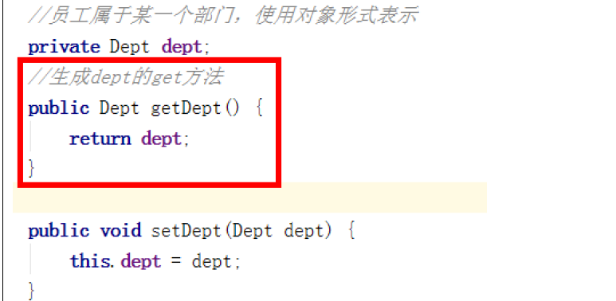

```xml
    <!--级联赋值-->
    <bean id="emp" class="com.atguigu.spring5.bean.Emp"> 
        <!--设置两个普通属性-->
        <property name="ename" value="lucy"></property>
        <property name="gender" value="女"></property> 
        <!--级联赋值-->
        <property name="dept" ref="dept"></property>
        <property name="dept.dname" value="技术部"></property>
    </bean>

    <bean id="dept" class="com.atguigu.spring5.bean.Dept"></bean>
```


### 7、IOC操作Bean管理（xml注入[集合](https://so.csdn.net/so/search?q=集合&spm=1001.2101.3001.7020)属性）

1. 注入数组类型属性

2. 注入List集合类型属性

3. 注入Map集合类型属性

   （1）创建类，定义数组、list、map、set类型属性，生成对应set方法

   ```java
   public class Stu {
       // 1. 数组类型属性
       private String[] courses;
   
       // 2. list集合类型属性
       private List<String> list;
   
       // 3. map集合类型属性
       private Map<String,String> maps;
   
       // 4. set集合类型属性
       private Set<String> sets;
   
       public void setCourses(String[] courses) {
           this.courses = courses;
       }
   
       public void setList(List<String> list) {
           this.list = list;
       }
   
       public void setMaps(Map<String, String> maps) {
           this.maps = maps;
       }
   
       public void setSets(Set<String> sets) {
           this.sets = sets;
       }
       @Override
       public String toString() {
           return "Stu{" +
                   "courses=" + Arrays.toString(courses) +
                   ", list=" + list +
                   ", maps=" + maps +
                   ", sets=" + sets +
                   '}';
       }
   }
   ```

   （2）在spring配置文件进行配置

   ```xml
       <!--1. 集合类型属性注入-->
       <bean id="stu" class="com.spring5.collectionytpe.Stu">
           <!--1、数组类型属性注入 -->
           <property name="courses">
               <array>
                   <value>Java课程</value>
                   <value>数据库课程</value>
               </array>
           </property>
           
           <!--2、list类型属性注入 -->
           <property name="list">
               <list>
                   <value>张三</value>
                   <value>小三</value>
               </list>
           </property>
           
           <!--3、map类型属性注入 -->
           <property name="maps">
               <map>
                	<!--ref-key  ref-value -->   
                   <entry key="Java" value="java"></entry>
                   <entry key="PHP" value="php"></entry>
               </map>
           </property>
           
           <!--4、set类型属性注入 -->
           <property name="sets">
               <set>
                   <value>Mysql</value>
                   <value>Redis</value>
               </set>
           </property>
       </bean>
   ```

   （3）测试

   ```java
       @Test
       public void TestStu(){
           //1.加载Spring配置文件
           ApplicationContext context = new ClassPathXmlApplicationContext("base5.xml");
   
           //2.获取配置创建的对象
           Stu stu = context.getBean("stu", Stu.class);
   
           System.out.println(stu.toString());
       }
   ```

4. 在集合里设置对象类型值

   ```java
   // 1.创建课程类
   public class Course {
       private String cname;
       
       public void setCname(String cname) {this.cname = cname;}
   }
   // 2.创建学生类
   public class Stu {
       // 学生所学多门课程
       private List<Course> courseList;
       public void setCourseList(List<Course> courseList) {
           this.courseList = courseList;
       }
   }
   ```

    xml配置

   ```xml
       <!-- 创建多个course对象-->
       <bean id="course1" class="com.spring5.collectionytpe.Course">
           <property name="cname" value="String"></property>
       </bean>
       <bean id="course2" class="com.spring5.collectionytpe.Course">
           <property name="cname" value="String"></property>
       </bean>   
   
   	<!-- 注入list集合类型，值是对象-->
       <bean id="stu" class="com.spring5.collectionytpe.Stu">
           <property name="courseList">
               <list>
                   <ref bean="course1"></ref>
                   <ref bean="course2"></ref>
               </list>
           </property>
       </bean>
   ```

   

5. 把集合诸如部分提取出来

   (1) 在spring配置文件中引入名称空间util

   ```xml
   <?xml version="1.0" encoding="UTF-8"?>
   <beans xmlns="http://www.springframework.org/schema/beans"
          xmlns:xsi="http://www.w3.org/2001/XMLSchema-instance"
          xmlns:util="http://www.springframework.org/schema/util"
          xsi:schemaLocation="http://www.springframework.org/schema/beans http://www.springframework.org/schema/beans/spring-beans.xsd
                              http://www.springframework.org/schema/util http://www.springframework.org/schema/util/spring-util.xsd">
   
   ```

   (2) 使用util标签完成list集合提取

   ```xml
      <!--1 提前list集合类型属性注入-->
       <util:list id="bookList">
           <value>三国演义</value>
           <value>水浒传</value>
           <value>西游记</value>
           <value>红楼梦</value>
       </util:list>
   
       <!--2 提前list集合类型属性使用-->
       <bean id="book" class="com.spring5.collectionytpe.Book">
           <property name="list" ref="bookList"></property>
       </bean>
   ```

### 8、IOC操作Bean管理（`FactotyBean`）

1. Spring 有两种类型bean，一种普通bean，另外一种工厂bean(FactoryBean),**两者的区别**

   （1）**普通bean**在配置文件中，定义**bean类型就是返回类型**

   （2）工厂bean[**FactotyBean**]在配置文件中**定义bean类型可以和返回类型不一样**

   

   第一步创建类，让这个类作为工厂Bean，`实现接口FactoryBean`

   第二步实现接口里的方法，在实现方法中定义返回的bean类型
   
   ```java
   //实现接口类
   public class MyBean implements FactoryBean<Course>{
       @override
       public Course getObject() throws Exceptions{
               Course  course = new Course();
               course.setCourse("java");
               return course;
       }
       @override
       public Class<?> getObjectType(){
               return NULL;
       }
       @override
       public Boolean isSingleton(){
               return false;
       }
   }
   ```
   
   配置FactoryBean
   
   ```xml
   <bean id = "mybean" class="com.zhh.entity.MyBean"></bean>
   ```
   
   测试
   
   ```java
   //测试类
   @test
   public void test2(){
       ApplicationContext application  = new classPathXpthXmlApplicationContext("bean4.xml");
   	Course course =  context.getBean("MyBean",Course.class);
       System.out.println(course);
       
       Bimpl bimpl = context.getBean("&mybean", Bimpl.class);
       System.out.println(bimpl.getClass());
   }
   ```
   
   

### 9、IOC操作Bean管理（bean作用域`scope`）

（1）在spring里，设置创建Bean实例是单实例还是多实例。

（2）在spring里，**默认设置创建Bean实例是单实例。**

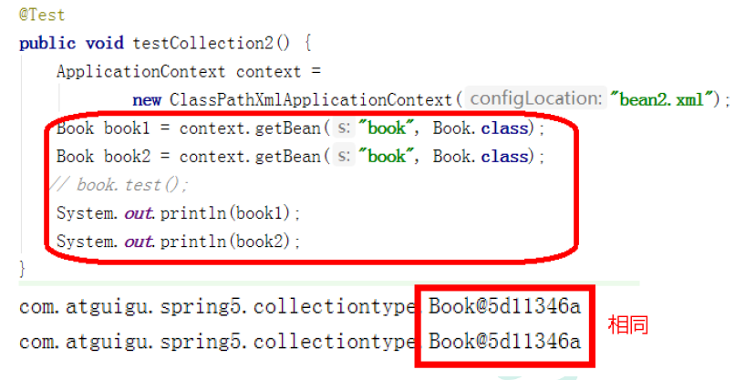

（3）如何设置单实例还是多实例。

 spring配置文件bean标签里scope属性用于设置单实例还是多实例。

 **scope属性值：**

+ 第一个，**默认值**，`singleton`，表示单实例对象；
+ 第二个值：`prototype`，表示多实例对象。

+ `request`,表示一次请求，每次创建对象放到request域对象中。

+ `session`,表示一次会话，每次创建对象放到session域对象中。

```xml
<!-- 配置 -->
<bean id="book" class="com.zhh.entity.Book" scope="prototype">
    <property name="list" ref = "booklist"></property>
</bean>
```

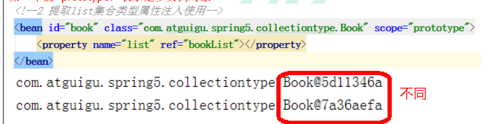

（4）singleton 与 prototype区别

第一，singleton表示单实例，prototype表示多实例。

第二，设置Scope是singleton时，加载spring配置文件时侯就会创建单实例对象；

 设置Scope是prototype时，不是加载spring配置文件时侯创建对象，而是在调用getBean方法时创建多实例对象。

 

### 10、IOC操作Bean管理（生命周期）

1. 生命周期

   （1）从对象创建到对象销毁的过程

2. **bean生命周期**

   （1）通过构造器创建bean实例（无参数构造）

   （2）为bean的属性设置值和对其他bean引用（调用set方法）
   （3）调用bean的初始化的方法（需要进行配置）

   （4）bean可以使用了（对象获取到了）

   （5）当容器关闭的时候，调用bean的销毁的方法（需要进行配置销毁的方法）

   

3、演示bean生命周期

   ```java
   public class Orders {
       private String oname;
   	//无参数构造
       public Orders() {
           System.out.println("第一步 执行无参构造创建bean实例");
       }
   
       public void setOname(String oname) {
           this.oname = oname;
           System.out.println("第二步 调用set方法设置属性");
       }
   //创建执行的初始化的方法
       public void initMethod(){
           System.out.println("第三步 执行初始化的方法");
       }
   //创建执行的销毁的方法
       public void destroyMethod(){
           System.out.println("第五步 执行销毁的方法");
       }
   
       @Override
       public String toString() {
           return "Orders{" +
                   "oname='" + oname + '\'' +
                   '}';
       }
   }
   ```

   ```xml
       <bean id="orders" class="com.spring5.bean.Orders" init-method="initMethod" destroy-method="destroyMethod">
           <property name="oname" value="手机"></property>
       </bean>
   ```

   ```java
       @Test
       public void testBean3() {
   //        ApplicationContext context = new ClassPathXmlApplicationContext("bean4.xml");
           ClassPathXmlApplicationContext context = new ClassPathXmlApplicationContext("bean4.xml");
           Orders orders = context.getBean("orders", Orders.class);
           System.out.println("第四步 获取创建bean实例对象");
           System.out.println(orders); 
           
           //手动让bean实例销毁 
           context.close();
       }
   ```

```
第一步 执行无参数构造创建bean实例
第一步 执行无参数构造创建bean实例
第二步 调用set方法设置属性值
第三步 执行初始化的方法
第四步 获取创建bean实例对象
com.spring5.bean.Orders@80169cf
第五步 执行销毁的方法
```


4. bean的后置处理器，**bean生命周期有七步**

（1）通过构造器创建bean实例（**无参数构造**）

（2）为bean的属性设置值和对其他bean引用（**调用set方法**）

（3）把bean实例传递bean后置处理器的方法`postProcessBeforeInitialization`

（4）调用bean的`初始化`的方法（需要进行配置）

（5）把bean实例传递bean后置处理器的方法`postProcessAfterInitialization`

（6）bean可以使用了（对象获取到了）

（7）当容器关闭的时候，调用bean的销毁的方法（需要进行配置**销毁的方法**）


5、演示添加后置处理器效果

（1）创建类，实现接口BeanPostProcessor，创建后置处理器

```java
public class MyBeanPost implements BeanPostProcessor {
    @Override
    public Object postProcessBeforeInitialization(Object bean, String beanName) throws BeansException {
        System.out.println("在初始化之前执行的方法");
        return bean;
    }

    @Override
    public Object postProcessAfterInitialization(Object bean, String beanName) throws BeansException {
        System.out.println("在初始化之后执行的方法");
        return bean;
    }
}
```

```xml
<!--配置后置处理器   所有bean都会添加后置处理器--> 
<bean id="myBeanPost" class="com.atguigu.spring5.bean.MyBeanPost"></bean>
```

测试

```java
第一步 执行无参数构造创建bean实例
第二步 调用set方法设置属性值
在初始化之前执行的方法
第三步 执行初始化的方法
在初始化之后执行的方法
第四步 获取创建bean实例对象
com.spring5.bean.Orders@553a3d88
第五步 执行销毁的方法
```


源码：

```java
org.springframework.beans.factory.support.AbstractAutowireCapableBeanFactory#initializeBean(Object, RootBeanDefinition)
    
    	protected Object initializeBean(final String beanName, final Object bean, @Nullable RootBeanDefinition mbd) {
		if (System.getSecurityManager() != null) {
			AccessController.doPrivileged((PrivilegedAction<Object>) () -> {
				invokeAwareMethods(beanName, bean);//调用无参构造 +  属性注入
				return null;
			}, getAccessControlContext());
		}
		else {
			invokeAwareMethods(beanName, bean);
		}

		Object wrappedBean = bean;
		if (mbd == null || !mbd.isSynthetic()) {
			wrappedBean = applyBeanPostProcessorsBeforeInitialization(wrappedBean, beanName);//后置处理器 before
		}

		try {
			invokeInitMethods(beanName, wrappedBean, mbd);//初始化方法
		}
		catch (Throwable ex) {
			throw new BeanCreationException(
					(mbd != null ? mbd.getResourceDescription() : null),
					beanName, "Invocation of init method failed", ex);
		}
		if (mbd == null || !mbd.isSynthetic()) {
			wrappedBean = applyBeanPostProcessorsAfterInitialization(wrappedBean, beanName);//后置处理器 after
		}

		return wrappedBean;
	}
    
```


### 10-1拓展：基于注解声明周期

#### 1.@Bean指定初始化和销毁方法

> BigAminal类，自定义了init和destory方法

```java
public class BigAnimal {
    public BigAnimal() {
        System.out.println("BigAnimal->Construtor");
    }

    public void init(){
        System.out.println("BigAnimal ->init");
    }

    public void destory(){
        System.out.println("BigAnimal->destory");
    }
}
```

> 配置类LifeCyle,使用@Bean注解的initMthod和destroyMethod指定初始化和销毁方法

```java
@Configuration
public class LifeCycleConfig {
    @Bean(initMethod = "init",destroyMethod = "destory")
    public BigAnimal animal(){
        return  new BigAnimal();
    }
  }
```

> 测试类LifeCycleConfigTest

```java
public class LifeCycleConfigTest {
    private AnnotationConfigApplicationContext annotationConfigApplicationContext =new AnnotationConfigApplicationContext(LifeCycleConfig.class);

    @Test
    public void animal() {
        BigAnimal bigAnimal = annotationConfigApplicationContext.getBean(BigAnimal.class);
        annotationConfigApplicationContext.close();
    }
}
```

> 运行结果


#### 2.实现 InitializingBean和DisposableBean接口

> **通过让Bean实现InitializingBean（定义初始化逻辑），DisposableBean（定义销毁逻辑）**
>
> Man实现了InitalizingBean和DisposableBean接口，重写afterPropertiesSet和destroy方法

```java
public class Man implements InitializingBean,DisposableBean {
    public Man() {
        System.out.println("construtor：你一个男人出生了。。。。");
    }

    public void afterPropertiesSet() throws Exception {
        System.out.println("afterPropertiesSet：他的爸爸给了他￥100000元");
    }

    public void destroy() throws Exception {
        System.out.println("destroy：他把他的￥100000元,给了他儿子");
    }
}
```

> LifeCylceConfig配置类中注册Bean

```java
@Bean
public Man man(){
    return new Man();
}
```

> 测试方法1中加入

```java
@Test
public void man() {
    Man man = annotationConfigApplicationContext.getBean(Man.class);
    annotationConfigApplicationContext.close();
}
```

> 运行结果

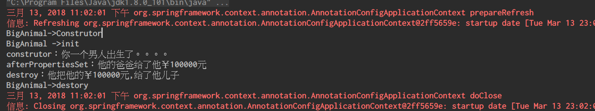

#### 3.使用JSR250的@PostConstruct和@PreDestroy注解

- @PostConstruct 在bean创建完成并赋值完成后，进行的初始化操作
- @PreDestroy 在容器销毁bean之前，通知进行销毁操作

> WoMan类

```java
public class Woman {
    public Woman() {
        System.out.println("Woman.Construtor ->一个女人出生了。。。。。。");
    }
    /**
     *
     * @throws Exception
     */
    @PostConstruct
    public void postConstruct() throws Exception {
        System.out.println("Woman.postConstruct->她的爸爸给了她￥100000元");
    }
    /**
     *
     * @throws Exception
     */
    @PreDestroy
    public void preDestroy() throws Exception {
        System.out.println("Woman->preDestroy她把她的￥100000元,给了她儿子");
    }
}
```

> 配置类

```java
@Bean
public Woman woman(){
    return new Woman();
}
```

> 在测试1的测试类中添加测试方法3

```java
@Test
public void woman() {
    Woman woman = annotationConfigApplicationContext.getBean(Woman.class);
    annotationConfigApplicationContext.close();
}
```

> 运行结果

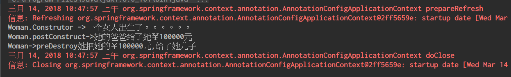

#### 4.BeanPostProcessor：Bean的后置处理器

> 在bean初始化前后进行一些处理工作；

- postProcessBeforeInitialization:在初始化之前工作
- postProcessAfterInitialization:在初始化之后工作

> 自定义BeanPostProcessor，MyBeanPostProcessor

```java
@Component
public class MyBeanPostProcessor implements BeanPostProcessor{
    /**
     * 初始化前置处理
     * @param bean Bean实例本身
     * @param beanName 容器中注册的BeanId
     * @return
     * @throws BeansException
     */
    public Object postProcessBeforeInitialization(Object bean, String beanName) throws BeansException {
        if("woman".equals(beanName)){
            System.out.println("前置处理");
        }
            return bean;
    }
    /**
     * 初始化后置处理
     * @param bean Bean实例本身
     * @param beanName 容器中注册的BeanId
     * @return
     * @throws BeansException
     */
    public Object postProcessAfterInitialization(Object bean, String beanName) throws BeansException {
        if("woman".equals(beanName)){
            System.out.println("后置置处理");
        }
        return bean;
    }
}
```

> 在原LifeClyceConfig上加上@ComponentScan(“com.daxiong.condition”)，来扫描

```java
@Configuration
@ComponentScan("com.daxiong.condition")
```

> 运行测试方法3

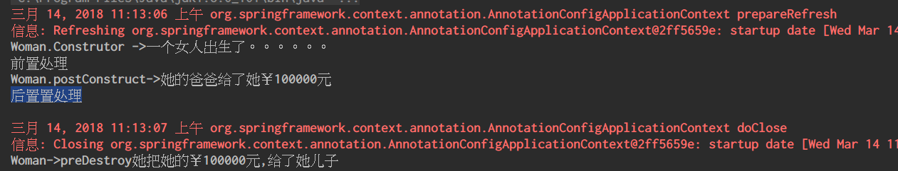

#### 5.总结

1. bean的[生命周期](https://so.csdn.net/so/search?q=生命周期&spm=1001.2101.3001.7020)：bean创建—初始化—-销毁的过程

2. 容器管理bean的生命周期：我们可以我们可以自定义初始化和销毁方法；容器在bean进行到当前生命周期的时候来调用我们自定义的初始化和销毁方法

3. 具体步骤：

   1. 构造（对象创建）：
      - 单实例：在容器启动的时候创建对象
      - 多实例：在每次获取的时候创建对象
   2. BeanPostProcessor.postProcessBeforeInitialization
   3. 初始化：对象创建完成，并赋值好，调用初始化方法。。。
   4. BeanPostProcessor.postProcessAfterInitialization
   5. 销毁：
      - 单实例：容器关闭的时候
      - 多实例：容器不会管理这个bean；容器不会调用销毁方法

   > 遍历得到容器中所有的BeanPostProcessor；挨个执行beforeInitialization，
   >
   > 一但返回null，跳出for循环，不会执行后面的BeanPostProcessor.postProcessorsBeforeInitialization

4. BeanPostProcessor原理

   > 伪代码

   ```java
   //给bean进行属性赋值
   populateBean(beanName, mbd, instanceWrapper);
   
   initializeBean();
   
   {
       //前置处理
   applyBeanPostProcessorsBeforeInitialization(wrappedBean, beanName);
   //执行自定义初始化
   invokeInitMethods(beanName, wrappedBean, mbd);
   //后置处理
   applyBeanPostProcessorsAfterInitialization(wrappedBean, beanName);
   }
   ```

   


### 11、IOC操作Bean管理（xml自动装配）

- 什么是自动装配

  （1）根据指定装配规则（属性名称或者属性类型），Spring自动将匹配的属性值进行注入

  

- **演示自动装配过程**

（1）根据属性名称自动注入  注入值**bean的id值**和**类属性【类的成员变量】名称一样**

```xml
<!--实现自动装配
      bean标签属性autowire，配置自动装配
      autowire属性常用两个值：
          byName根据属性名称注入 ，注入值bean的id值和类属性名称一样
          byType根据属性类型注入
-->
<bean id="emp" class="com.atguigu.spring5.autowire.Emp"  autowire="byName"> 
    <!--<property name="dept" ref="dept"></property>  set方法注入-->
</bean>

<bean id="dept" class="com.atguigu.spring5.autowire.Dept"></bean>
```

  

（2）根据属性类型自动注入  如果同类型的bean存在多个，会报错

```xml
<!--实现自动装配 
        bean标签属性autowire，配置自动装配 
        autowire属性常用两个值： 
            byName根据属性名称注入 ，注入值bean的id值和类属性名称一样 
            byType根据属性类型注入
 -->
<bean id="emp" class="com.atguigu.spring5.autowire.Emp"      autowire="byType"> 
    <!--<property name="dept" ref="dept"></property> set方法注入--> 
</bean>
<bean id="dept" class="com.atguigu.spring5.autowire.Dept"></bean>
```


### 11、IOC操作Bean管理（外部属性文件）

1. 直接配置数据库信息

   （1）配置druid连接池

   （2）引入druid连接池依赖jar包

   ```xml
           <dependency>
               <groupId>com.alibaba</groupId>
               <artifactId>druid</artifactId>
               <version>1.1.9</version>
           </dependency>
   ```
   
   （3）配置连接池
   
   <u>**jdbc.properties**</u>
   
   ```properties
   prop.driverClass=com.mysql.jdbc.Driver
   prop.url=jdbc:mysql://localhost:3306/userDb
   prop.userName=root
   prop.password=root
   ```
   
   （4）在Spring配置文件使用标签引入外部属性文件
   
   引入context名称空间 
   
   ```xml
   <?xml version="1.0" encoding="UTF-8"?>
   <beans xmlns="http://www.springframework.org/schema/beans"
          xmlns:xsi="http://www.w3.org/2001/XMLSchema-instance"
          xmlns:context="http://www.springframework.org/schema/context"
          xsi:schemaLocation="http://www.springframework.org/schema/beans http://www.springframework.org/schema/beans/spring-beans.xsd
                              http://www.springframework.org/schema/util http://www.springframework.org/schema/util/spring-util.xsd
                              http://www.springframework.org/schema/context http://www.springframework.org/schema/context/spring-context.xsd">
       
       <!--    引入外部属性文件-->
       <context:property-placeholder location="classpath:jdbc.properties"></context:property-placeholder>
   
   <!--    配置连接池-->
       <bean id="dataSource" class="com.alibaba.druid.pool.DruidDataSource">
           <property name="driverClassName" value="${prop.driverClass}"></property>
           <property name="url" value="${prop.url}"></property>
           <property name="username" value="${prop.userName}"></property>
           <property name="password" value="${prop.password}"></property>
       </bean>
   </beans>
   ```
   
   

### 11、IOC操作Bean管理（基于注解方式）

1、什么是注解

（1）注解是代码特殊标记，格式：`@注解名称(属性名称=属性值, 属性名称=属性值..)`
（2）使用注解，注解作用在类上面，方法上面，属性上面
（3）使用注解目的：简化xml配置


2、Spring针对Bean管理中创建对象提供注解

- `@Component` 普通用法
- `@Service` 用于service业务逻辑层
- `@Controller` 用于web层
- `@Repository` 用于DAO持久层

*上面四个注解功能是一样的，都可以用来创建bean实例


3、基于注解方式实现对象创建

第一步 引入依赖

```xml
        <dependency>
            <groupId>org.springframework</groupId>
            <artifactId>spring-aop</artifactId>
            <version>5.2.6.RELEASE</version>
        </dependency>
```

第二步 开启组件扫描

```xml
<!-- 开启组件扫描 
	1 如果扫描多个包，多个包使用逗号隔开 
	2 扫描包上层目录 
--> 
<context:component-scan base-package="com.atguigu"></context:component-scan>

<!--开启组件扫描,多个包，使用逗号隔开，或者写共同的上层目录-->
<context:component-scan base-package="com.spring5.service,com.spring5.controller" ></context:component-scan>
```

第三步 创建类，在类上面添加创建对象注解

```java
/**
在注解里面value属性值可以省略不写， 
默认值是类名称，首字母小写 
	UserService -- userService

等价于<bean id="userService" class="com.spring5.service.UserService"/> 
*/
@Component(value = "userService") 
public class UserService { 
    public void add() { 
        System.out.println("service add......."); 
    } 
}
```

第四步 测试

```java
    @Test
    public void testAnn(){
        ApplicationContext context = new ClassPathXmlApplicationContext("bean.xml");
        UserService userService = context.getBean("userService", UserService.class);
        userService.add();
    }
```


4、开启组件扫描细节配置

```xml
<!--示例1 
	use-default-filters="false" 表示现在不使用默认filter，自己配置filter 
	context:include-filter ，设置扫描哪些内容 
-->
    <context:component-scan base-package="com.atguigu" use-default-filters="false">
        <!--包含@Controller注解配置的bean-->
        <context:include-filter type="annotation" expression="org.springframework.stereotype.Controller"/>
    </context:component-scan> 

<!-- 示例2 
	下面配置扫描包所有内容 context:exclude-filter： 设置哪些内容不进行扫描 
-->
    <context:component-scan base-package="com.atguigu" >
         <!--不包含@Controller注解配置的bean-->
        <context:exclude-filter type="annotation" expression="org.springframework.stereotype.Controller"/>
    </context:component-scan>
```


5、基于注解方式实现属性注入

（1）`@AutoWired`：**根据属性类型进行自动装配**

 第一步 把service 和dao对象创建，在service和dao类添加创建对象注解

 第二步 在service 注入dao对象，在service 类添加dao类型属性，在属性上面使用注解

```java
@Service
public class StuService {
    // 定义dao类型属性(不需要添加set方法)
    // 添加注入属性组注解
    @Autowired
    private StuDao stuDao;

    public void add(){
        System.out.println("service add.....");
        stuDao.add();
    }
    
    @Test
    public void testService(){
        //1.加载Spring配置文件
        ApplicationContext context = new ClassPathXmlApplicationContext("base.xml");

        //2.获取配置创建的对象
        StuService stuService = context.getBean("stuService", StuService.class);

        stuService.add();
    }
}

```


（2）`@Qualifier`：**根据属性名称进行注入**

这个<u>@Qualifier</u>注解的使用，和上面<u>@Autowired</u>一起使用

```java
//定义dao类型属性 
//不需要添加set方法
//添加注入属性注解 
@Autowired //根据类型进行注入 
@Qualifier(value = "userDaoImpl1") //根据名称进行注入 
private UserDao userDao;
```


（3）`@Resource`：可以根据类型注入，可以根据名称注入

```java
//@Resource //根据类型进行注入 
@Resource(name = "userDaoImpl1") //根据名称进行注入 
private UserDao userDao;
```


（4）`@Value`：注入普通类型属性

```java
 @Value(value = "abc") 
private String name;
```


6、 完全注解开发

（1）创建配置类，替代xml配置文件

```java
@Configuration
@ComponentScan(basePackages = {"com.spring5"})
public class SpringConfig {
    
}
```

（2）编写测试类

```java
    @Test
    public void testService(){
        //1.加载Spring配置文件
        ApplicationContext context = new AnnotationConfigApplicationContext(SpringConfig.class);
        //2.获取配置创建的对象
        StuService stuService = context.getBean("stuService", StuService.class);

        stuService.add();
    }
```

> 
>
>  `@Configuration( proxyBeanMethods = true)`代理开启不开启的区别
>
> ```java
> @Configuration( proxyBeanMethods = true)
> @ComponentScan(basePackages = {"com.spring5"})
> public class MyConfig {
> 
>     @Bean
>     public User u1() {
>         User user = new User("张三",110, dept());
> 
>         return user;
>     }    @Bean
>     public User u2() {
>         User user = new User("李四", 22, dept());
>         return user;
>     }
> 
>     @Bean
>     public Dept dept() {
>         Dept dept = new Dept();
>         dept.setDeptName("" + System.currentTimeMillis() );
>         return dept;
>     }
> 
> 
>     @Test
>     public void testAnn() throws InterruptedException {
>         ApplicationContext context = new AnnotationConfigApplicationContext(MyConfig.class);
>         User u1 = context.getBean("u1", User.class);
>         User u2 = context.getBean("u2", User.class);
>         System.out.println("u1 = " + u1);
>         System.out.println("u2 = " + u2);
>     }
> }
> 
> //proxyBeanMethods = true  对方法开启代理，先判断容器中是否存在，存在直接返回
> u1 = User{name='张三', age=110, dept=Dept{deptName='1651080538668'}}
> u2 = User{name='李四', age=22,  dept=Dept{deptName='1651080538668'}}
> 
> //proxyBeanMethods = false  不对方法开启代理，dept()每次调用都产生新的dept对象
> u1 = User{name='张三', age=110, dept=Dept{deptName='1651080569157'}}
> u2 = User{name='李四', age=22,  dept=Dept{deptName='1651080569158'}}
> ```


## 三、AOP

### 1、AOP（概念）

>  AOP：面向切面编程（方面），利用AOP可以对业务逻辑的各个部分进行隔离，从而降低耦合度，提高程序可重用性和开发效率；将日志记录，事务处理，异常处理、性能统计，安全控制等代码从业务逻辑代码中划分出来，改变这些行为的时候不影响业务逻辑代码。
>
> 通俗描述：在不修改源代码的情况下，在主干功能里面添加新的功能。
>
> 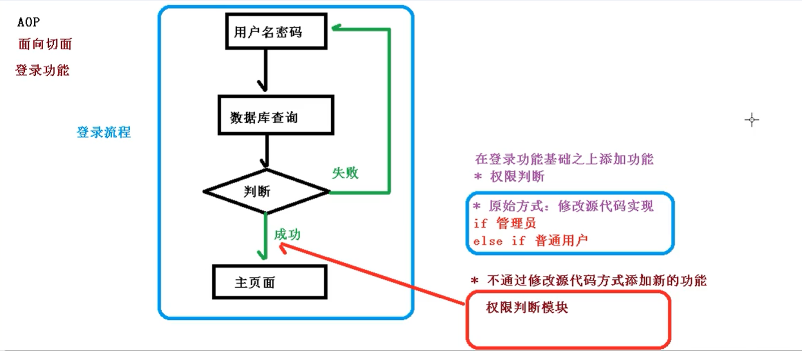

### 2、AOP（底层原理）

（1）AOP底层使用动态代理

- 第一种 有接口情况，使用JDK动态代理（创建接口实现类代理对象，增强类的方法）

  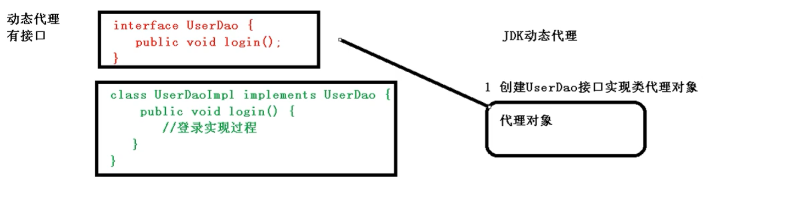

- 第二种 没有接口情况，使用CGLIB动态代理 [使用继承，类不能使final]

  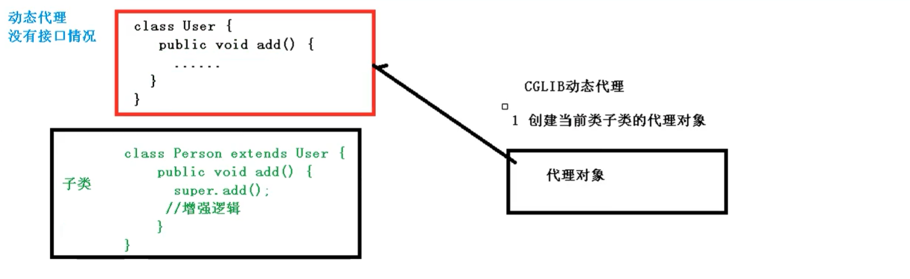

### 3、AOP（JDK动态代理）

（1）JDK动态代理，使用Proxy类，`java.lang.reflect.Proxy`代理类。

 `newProxyInstance(Classloader loader, class<?>[ ]… interfaaces，InvocationHandler h)`

 方法有三个参数：
	第一参数，类加载器
	第二参数，增强方法所在的类，这个类实现的接口，支持多个接口
	第三参数，实现这个接口InvocationHandler，创建代理对象，写增强的部分

（2）编写JDK动态代理代码

```java
//（1）创建接口，定义方法
public interface UserDao {
    public int add(int a,int b);
    public String updata(String id);
}


//（2）接口实现类
public class UserDaoImpl implements UserDao{

    @Override
    public int add(int a, int b) {
        System.out.println("add方法执行了...");
        return a+b;
    }

    @Override
    public String updata(String id) {
        System.out.println("updata方法执行了...");
        return id;
    }
}

//(3)使用proxy类创建接口代理对象
public class JDKProxy {
    public static void main(String[] args) {
        // 创建接口实现类代理对象
        Class[] interfaces = {UserDao.class};
        UserDao userDao = new UserDaoImpl();
        UserDao dao = (UserDao)Proxy.newProxyInstance(JDKProxy.class.getClassLoader(),interfaces,new UserDaoProxy(userDao));//还可以基于匿名内部类
        int result = dao.add(1,2);
        System.out.println("result："+result);
    }
}

//调用处理程序
class UserDaoProxy implements InvocationHandler{
    // 把创建的谁的代理对象，把谁传递过来
    // 有参构造
    private Object obj;
    public UserDaoProxy(Object obj){
        this.obj = obj;
    }

    // 增强的逻辑
    @Override
    public Object invoke(Object proxy, Method method, Object[] args) throws Throwable {
        // 方法之前
        System.out.println("方法之前执行："+method.getName()+"：传递的参数"+ Arrays.toString(args));

        // 被增强的方法执行
        Object res = method.invoke(obj,args);

        // 方法之后
        System.out.println("方法之后执行："+obj);

        return res;
    }
}
```

### 4、AOP（术语）

（1）连接点：类里面可以被增强的方法。

（2）切入点：实际被增强的方法。

（3）通知（增强）：实际增加的逻辑部分。（ 通知有多种类型）

+ 五种通知

   - 前置通知

   - 后置通知

   - 环绕通知

   - 异常通知

   - 最终通知（finally）


（4）切面：把通知应用到切入点的过程。

### 5、AOP操作（准备）

（1）Spring 框架中一般都是基于AspectJ实现AOP操作

> AspectJ，本身是单独的框架，不属于Spring组成部分，独立于AOP框架，一般把AspectJ和Spring框架一起使用，进行AOP操作。

（2）基于AspectJ实现AOP操作

- 基于xml配置文件实现
- 基于注解方式实现

（3）项目里引入相关依赖

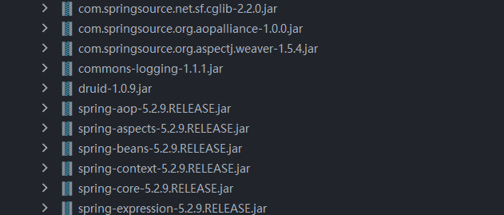

```xml
        <!-- https://mvnrepository.com/artifact/net.sourceforge.cglib/com.springsource.net.sf.cglib -->
        <dependency>
            <groupId>net.sourceforge.cglib</groupId>
            <artifactId>com.springsource.net.sf.cglib</artifactId>
            <version>2.2.0</version>
        </dependency>
        <!-- https://mvnrepository.com/artifact/org.aopalliance/com.springsource.org.aopalliance -->
        <dependency>
            <groupId>org.aopalliance</groupId>
            <artifactId>com.springsource.org.aopalliance</artifactId>
            <version>1.0.0</version>
        </dependency>
        <!-- https://mvnrepository.com/artifact/org.aspectj/com.springsource.org.aspectj.weaver -->
        <dependency>
            <groupId>org.aspectj</groupId>
            <artifactId>com.springsource.org.aspectj.weaver</artifactId>
            <version>1.5.4</version>
        </dependency>

```


（4）切入点表达式

- 切入点表达式作用：知道对哪个类的哪个方法进行增强

- 语法结构

- `execution([权限修饰符] [返回类型] [类全路径] [方法名称] ([参数列表]))`

  - 举例1：对com.zhh.dao.BookDao类里的add进行增强

    `execution(* com.zhh.dao.BookDao.add(..))`

  - 举例2：对com.zhh.dao.BookDao类里的所有方法进行增强

    `execution(* com.zhh.dao.BookDao.*(..))`

  - 举例3：对com.zhh.dao包里的所有类，类里的所有方法进行增强

    `execution(* com.zhh.dao.*.*(..))`

### 6、AOP操作（Aspectj注解）

**（1）创建类、在类里面定义方法**

```java
// 待增强类
public class User {
    public void add(){
        System.out.println("add.......");
    }
}
```

**（2）创建增强类（编写增强逻辑）**

在增强类里面，创建方法，让不同方法代表不同通知类型

```java
// 增强的类
public class UserProxy {
    
    public void before(){// 前置通知
        System.out.println("before.....");
    }
}

```

**（3）进行通知的配置**

（3.1）在spring xml配置文件中，开启注解扫描

```xml
<?xml version="1.0" encoding="UTF-8"?>
<beans xmlns="http://www.springframework.org/schema/beans"
       xmlns:xsi="http://www.w3.org/2001/XMLSchema-instance"
       xmlns:context="http://www.springframework.org/schema/context"
       xmlns:aop="http://www.springframework.org/schema/aop"
       xsi:schemaLocation="http://www.springframework.org/schema/beans 
       http://www.springframework.org/schema/beans/spring-beans.xsd 
       http://www.springframework.org/schema/context 
       http://www.springframework.org/schema/context/spring-context.xsd 
       http://www.springframework.org/schema/aop 
       http://www.springframework.org/schema/aop/spring-aop.xsd"> 
<!-- 开启注解扫描 -->
<context:component-scan base-package="com.atguigu.spring5.aopanno"></context:component-scan>
    
    <!-- 开启Aspect生成代理对象-->
<aop:aspectj-autoproxy></aop:aspectj-autoproxy>
</beans>
```

（3.2）使用注解创建User和UserProxy对象，放在扫描路径下

```java
// 待增强类
@Component
public class User {...}

// 增强的类
@Component
@Aspect
public class UserProxy {...}
```

（3.3）在增强类上面添加注解 `@Aspect`

（3.4）在spring配置文件中开启生成代理对象

```xml
<!-- 开启Aspect生成代理对象-->
<aop:aspectj-autoproxy></aop:aspectj-autoproxy>
```


**（4）配置不同类型通知**

（4.1）在增强类的里面，在作为通知方法上面添加通知类型注解，使用切入点表达式配置

```java
// 增强的类
@Component
@Aspect//生成代理对象
public class UserProxy {
    // @Before注解表示作为前置通知
    @Before(value = "execution(* cn.spring5.Aop.Doem1.User.add(..))")
    public void before(){
        System.out.println("前置通知.....");
    }
    
    //返回通知，有异常不执行
    //后置通知（返回通知）
    @AfterReturning(value="execution(* cn.spring5.Aop.Doem1.User.add(..))")
    public void afterReturning(){
        System.out.println("返回通知...");
    }
    //最终通知 方法之后执行
    @After(value="execution(* cn.spring5.Aop.Doem1.User.add(..))")
    public void after(){
        System.out.println("后置通知...");
    }
    //异常通知
    @AfterThrowing(value="execution(* cn.spring5.Aop.Doem1.User.add(..))")
    public void AfterTrowing(){
        System.out.println("异常通知...");
    }
    //环绕通知,之前，之后都执行
    @Around(value="execution(* cn.spring5.Aop.Doem1.User.add(..))")
    public void around(ProceedingJoinPoint proceedingJontPoint) throws  Throwable{
        System.out.println("环绕通知之前...");

        // 被增强的方法执行
        proceedingJontPoint.proceed();

        System.out.println("环绕通知之后...");
    }
}
```

**（5）相同接入点抽取**

```java
//抽取出来的方法
@Pointcut(value="execution(* com.spring5.aopanno.User.add(..) )")
public void pointdemo(){
}
//使用公共方法
@Before(value="pointdemo()")
public void before(){
    System.out.println("before........");
}
```

**（6）有多个增强类对同一个方法进行增强，设置增强类的优先级,**

在增强类上面添加注解`@Order(数字类型值)`，数字类型值越小优先级越高

```java
@Component
@Aspect
@Order(1)
public class PersonProxy{
}
```

**（7）完全使用注解开发**

创建配置类，不需要创建xml配置文件

```java
@Configuration
//开启注释扫描
@ComponentScan(basePackages = {"cn.spring5.Aop"})
//开启Aspect生成代理对象
@EnableAspectJAutoProxy(proxyTargetClass = true)
public class ConfigAop {
}
```

**(8) 测试**

```java
    @Test
    public void configClass(){//通过配置类 加载配置
        ApplicationContext context = new AnnotationConfigApplicationContext(MyConfig.class);
        User user = context.getBean("user", User.class);
        user.add();
    }

    @Test
    public void  configXml(){//通过xml配置 加载配置
        ApplicationContext context = new ClassPathXmlApplicationContext("bean.xml");
        User user = context.getBean("user", User.class);
        user.add();
    }

环绕通知之前...
前置通知.....
add.......
环绕通知之后...
后置通知...
返回通知...
```


### 7、AOP操作（Aspectj配置文件）

（1）创建两个类，增强类和被增强类，创建方法

```java
//被增强类
public class Book{
    public void buy(){
        System.out.println("buy.......");
    }
}
//增强类
public class BookProxy{
    public void before(){
        System.out.println("before.......");
    }
}
```

（2）创建对象

```xml
<!--创建对象-->
<bean id="book" class="cn.spring5.Aop.aopXml.Book"></bean>
<bean id="bookProxy" class="cn.spring5.Aop.aopXml.BookProxy"></bean>

```

（3）在spring配置文件中配置切入点

```xml
<!--AOP增强-->
<aop:config>
    <!--切入点-->
    <aop:pointcut id="point" expression="execution(* cn.spring5.Aop.aopXml.Book.buy(..))"/>
    <!--配置切面-->
    <aop:aspect ref="bookProxy">
        <!--增强作用在具体的方法上-->
        <aop:before method="before" pointcut-ref="point"></aop:before>
    </aop:aspect>
</aop:config>
```

（4）测试

```java
    @Test
    public void TestAop2(){
        ApplicationContext context = new ClassPathXmlApplicationContext("bean11.xml");
        Book book = context.getBean("book", Book.class);
        book.buy();
    }
```

## 四、JdbcTemplate

### 1、什么是JdbcTemplate

> Spring框架对JDBC进行封装，使用jdbcTemplate方便对数据库操作

（1）准备工作（引入相关jar包）

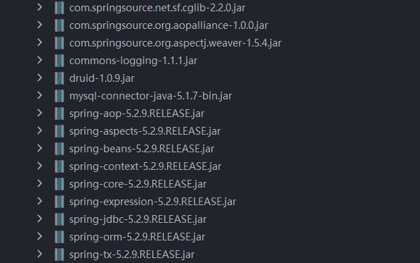

```xml
        <dependency>
            <groupId>com.alibaba</groupId>
            <artifactId>druid</artifactId>
            <version>1.1.9</version>
        </dependency>
        <dependency>
            <groupId>mysql</groupId>
            <artifactId>mysql-connector-java</artifactId>
            <version>8.0.27</version>
        </dependency>
        <dependency>
            <groupId>org.springframework</groupId>
            <artifactId>spring-jdbc</artifactId>
            <version>5.2.6.RELEASE</version>
        </dependency>
        <dependency>
            <groupId>org.springframework</groupId>
            <artifactId>spring-orm</artifactId>
            <version>5.2.6.RELEASE</version>
        </dependency>
        <dependency>
            <groupId>org.springframework</groupId>
            <artifactId>spring-tx</artifactId>
            <version>5.2.6.RELEASE</version>
        </dependency>
```


（2）spring配置文件中配置数据库连接池

```xml
    <!-- 数据库连接池 -->
    <bean id="dataSource" class="com.alibaba.druid.pool.DruidDataSource"
          destroy-method="close">
        <property name="url" value="jdbc:mysql://127.0.0.1:3306/spring5" />
        <property name="username" value="root" />
        <property name="password" value="root" />
        <property name="driverClassName" value="com.mysql.jdbc.Driver" />
    </bean>
```

（3）配置JdbcTemplate对象，注入DataSource

```xml
    <!--JdbcTemplate对象-->
    <bean id="jdbcTemplate" class="org.springframework.jdbc.core.JdbcTemplate">
        <!--注入-->
        <property name="dataSource" ref="dataSource"></property>
    </bean>
```

（4）创建service类，创建dao类。在dao里注入jdbcTemplate

- 配置文件

```xml
<!--组件扫描-->
<context:component-scan base-package="cn.spring5.Aop"></context:component-scan>
```

- service

```java
@Service
public class BookService {
    //注入Dao
    @Autowired
    private BookDao bookDao;
}
```

- dao

```java
@Repository
public class BookDaoImpl {
    // 注入JdbcTemplate
    @Autowired
    private JdbcTemplate jdbcTemplate;
}
```

### 2、jdbcTemplate 操作数据库（添加）

（1）对应数据库的实体类

```java
public class User {
    private String UserID;
    private String UserName;
    private String Password;

    public String getUserID() {
        return UserID;
    }

    public void setUserID(String userID) {
        UserID = userID;
    }

    public String getUserName() {
        return UserName;
    }

    public void setUserName(String userName) {
        UserName = userName;
    }

    public String getPassword() {
        return Password;
    }

    public void setPassword(String password) {
        Password = password;
    }
}

```

（2）编写service和dao

```java
@Service
public class BookService {
    //注入Dao
    @Autowired
    private BookDao bookDao;

    public void addBook(Book book){
        bookDao.add(book);
    }
}

public interface BookDao {

    //添加方法
    void add(Book book);

}

```

- 在dao进行数据库添加操作

- 调用JdbcTemplate对象里的update方法实现添加操作

  > update(String sql, Object args)
  >
  > 有两个参数，一个是sql语句，第二个参数是可变参数，设置sql的值

```java
@Repository
public class BookDaoImpl implements BookDao{
    // 注入JdbcTemplate
    @Autowired
    private JdbcTemplate jdbcTemplate;

    // 添加方法
    @Override
    public void add(Book book) {
        //创建sql语句
        String sql = "insert into book values(?,?,?)";
        //创建sql语句参数
        Object[] args = {book.getUserID(),book.getUserName(),book.getPassword()};
        int update = jdbcTemplate.update(sql,args);
        System.out.println(update);

    }
}
```

（4）测试

```java
    @Test
    public void TestJDBC(){
        ApplicationContext context = new ClassPathXmlApplicationContext("bean1.xml");
        BookService bookService = context.getBean("bookService", BookService.class);
        Book book = new Book("1001","Spring5","100.00");
        bookService.addBook(book);
    }
```

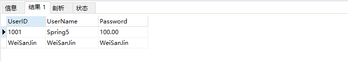

### 3、jdbcTemplate 操作数据库（修改和删除）

- BookDao

  ```java
  public interface BookDao {
  
      //修改方法
      void updataBook(Book book);
  
      //删除方法
      void delete(String id);
  }
  ```
  
- BookDaoImpl

  ```java
  @Repository
  public class BookDaoImpl implements BookDao{
      // 注入JdbcTemplate
      @Autowired
      private JdbcTemplate jdbcTemplate;
  
      // 修改方法
      @Override
      public void updataBook(Book book) {
          String sql = "update book set UserName=?,Password=? where UserID=?";
          Object[] args = {book.getUserName(),book.getPassword(),book.getUserID(),};
          int update = jdbcTemplate.update(sql,args);
          System.out.println(update);
      }
  
      // 删除方法
      @Override
      public void delete(String id) {
          String sql = "delete from book where UserID=?";
          int update = jdbcTemplate.update(sql,id);
          System.out.println(update);
      }
  }
  ```
  
- BookService

  ```java
  @Service
  public class BookService {
      //注入Dao
      @Autowired
      private BookDao bookDao;
  
      public void updateBook(Book book){
          bookDao.updataBook(book);
      }
  
      public void deleteBook(String id){
          bookDao.delete(id);
      }
  }
  ```
  
- 测试类

  ```java
      @Test
      public void TestJDBC(){
          ApplicationContext context = new ClassPathXmlApplicationContext("bean1.xml");
          BookService bookService = context.getBean("bookService", BookService.class);
  //        Book book = new Book("1001","Spring5","100.00");
  //        bookService.addBook(book);
  
          Book book = new Book("1","Spring5","100.00");
          bookService.updateBook(book);
  
          bookService.deleteBook("1");
      }
  ```

### 4、jdbcTemplate 操作数据库（查询返回某个值）

（1）查询表里有多少条记录，返回某个值

（2）使用iJdbcTemplate实现查询返回某个值的代码

> queryForObject(String sql,Class requiredType )
> 两个参数，第一个参数，sql语句，第二个参数，返回类型Class

```java
    // 查询表记录数
    @Override
    public int selectCount() {
        String sql = "select count(*) from book";
        int Count = jdbcTemplate.queryForObject(sql,Integer.class);
        return Count;
    }
```

### 5、jdbcTemplate 操作数据库（查询返回对象 + 列名获取）

（1）场景:查询图书详情

（2）JdbcTemplate实现查询返回对象

> queryForObject(String sql, RowMapper rowMapper, Object… args)
>
> 第一个参数，sql语句，
>
> 第二个参数，`RowMapper接口`，返回不同类型数据，使用这个接口里面实现完成数据封装
>
> 第三个参数，sql语句值

```java
    // 查询返回对象
    @Override
    public Book findBookInfo(String id) {
        String sql = "select * from book where UserId=?";
        Book book = jdbcTemplate.queryForObject(sql,new BeanPropertyRowMapper<Book>(Book.class),id);
        return book;
    }

	//获取列名称
    @Test
    public void configXml() {
        ApplicationContext context = new ClassPathXmlApplicationContext("bean.xml");

        JdbcTemplate jdbcTemplate = context.getBean("jdbcTemplate", JdbcTemplate.class);
        String sql = "select * from jobs where job_id=?";
        
        jdbcTemplate.query(sql, new RowCallbackHandler() {
            @Override
            public void processRow(ResultSet resultSet) throws SQLException {

                ResultSetMetaData metaData = resultSet.getMetaData();

                int columnCount = metaData.getColumnCount();
                for (int i = 0; i < columnCount; i++) {
                    String columnName = metaData.getColumnName(i + 1);
                    System.out.println(columnName);
                }
            }
        }, "AC_ACCOUNT");
        
    }
```

（3）测试类

```java
    @Test
    public void TestJDBC(){
        ApplicationContext context = new ClassPathXmlApplicationContext("bean1.xml");
        BookService bookService = context.getBean("bookService", BookService.class);
        Book book = bookService.findBookInfo("1001");
        System.out.println(book);
    
```

### 6、jdbcTemplate 操作数据库（查询返回集合）

(1) 场景:查询图书列表分页

(2) JdbcTemplate实现查询返回集合

> `query(String sql, RowMapper rowMapper, Object… args )`
>
> 第一个参数：sql语句
>
> 第二个参数：RowMapper，是接口，返回不同类型数据，使用这个接口里面实现完成数据封装
>
> 第三个参数：sql语句值

```java
    // 查询返回集合
    @Override
    public List<Book> findAllBook() {
        String sql = "select * from book";
        List<Book> bookList = jdbcTemplate.query(sql, new BeanPropertyRowMapper<Book>(Book.class));
        return bookList;
    }
```

(3) 测试类

```java
    @Test
    public void TestJDBC(){
        ApplicationContext context = new ClassPathXmlApplicationContext("bean1.xml");
        BookService bookService = context.getBean("bookService", BookService.class);
        List<Book> all = bookService.findAll();
        System.out.println(all.toString());
    }
```

### 7、JdbcTemplate操作数据库(批量操作)

（1）批量操作:操作表里的多项记录

（2）JdbcTemplate实现批量操作

> batchUpdate(String sql,List<Object[]> batchArgs)
>
> 第一个参数：sql语句，
>
> 第二个参数：List集合，添加多条记录数据

```java
    // 批量添加
    @Override
    public void batchAddBook(List<Object[]> batchArgs) {
        String sql = "insert into book values(?,?,?)";
        int[] ints = jdbcTemplate.batchUpdate(sql, batchArgs);
        System.out.println(Arrays.toString(ints));
    }
```

（3）测试类

```java
    @Test
    public void TestJDBC(){
        ApplicationContext context = new ClassPathXmlApplicationContext("bean1.xml");
        BookService bookService = context.getBean("bookService", BookService.class);
        //批量添加
        List<Object[]> batchArgs = new ArrayList<>();
        Object[] o1 = {"3","java","a"};
        Object[] o2 = {"4","c++","b"};
        Object[] o3 = {"5","mysql","c"};
        batchArgs.add(o1);
        batchArgs.add(o2);
        batchArgs.add(o3);
        bookService.batchAdd(batchArgs);
    }
```

### 8、JdbcTemplate操作数据库(批量删除、修改)

```java
    // 批量修改
    @Override
    public void batchUpdateBook(List<Object[]> batchArgs) {
        String sql = "update book set UserName=?,Password=? where UserID=?";
        int[] ints = jdbcTemplate.batchUpdate(sql, batchArgs);
        System.out.println(Arrays.toString(ints));
    }
	// 批量删除
    @Override
    public void batchDeleteeBook(List<Object[]> batchArgs) {
        String sql = "delete from book where UserID=?";
        int[] ints = jdbcTemplate.batchUpdate(sql, batchArgs);
        System.out.println(Arrays.toString(ints));
    }

```

测试类

```java
    @Test
    public void TestJDBC(){
        ApplicationContext context = new ClassPathXmlApplicationContext("bean1.xml");
        BookService bookService = context.getBean("bookService", BookService.class);
        // 批量修改
        List<Object[]> batchArgs = new ArrayList<>();
        Object[] o1 = {"WeiSanJin","java1","3"};
        Object[] o2 = {"WeiSanJin","c++1","4"};
        Object[] o3 = {"WeiSanJin","mysql1","5"};
        batchArgs.add(o1);
        batchArgs.add(o2);
        batchArgs.add(o3);
        bookService.batchUpdate(batchArgs);
        
        // 批量修改
        List<Object[]> batchArgs = new ArrayList<>();
        Object[] o1 = {"3"};
        Object[] o2 = {"4"};
        batchArgs.add(o1);
        batchArgs.add(o2);
        bookService.batchDelete(batchArgs);
    }
```

## 五、事务概念

### 1、什么是事务

> - 事务是数据库操作最基本单元，逻辑上一组操作，要么都成功，如果有一个失败所有操作都失败
> - 典型场景:银行转账
>
> *lucy 转账100元 给mary
> *lucy少100，mary多100

### 2、事物的四个特性(ACID)

(1) 原子性；不可分割

(2) 一致性：操作之前和操作之后总量不变

(3) 隔离性：多事务操作之间不会相互影响

(4) 持久性：事务提交之后，表中数据发生变化保存起来

### 3、事务操作（搭建事务操作环境）

（1）创建数据表，添加记录

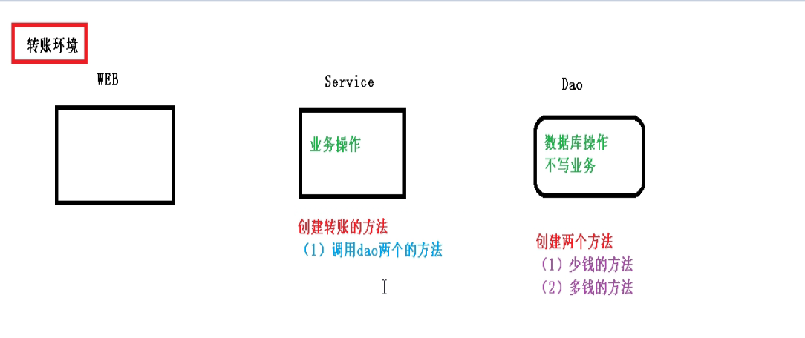

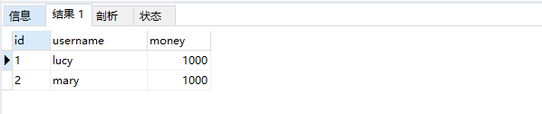

（2）创建service，搭建dao，完成对象创建和注入关系

 service注入dao，在到注入JdbcTemplate，在JdbcTemplate注入DataSource

```java
@Service
public class UserService {
    // 注入dao
    @Autowired
    private UserDao userDao;
}

@Repository
public class UserDaoImpl implements UserDao{

    @Autowired
    private JdbcTemplate jdbcTemplate;
}
```

（3）在dao创建两个方法：多钱和少钱的方法，在service创建方法（转账方法）

```java
@Repository
public class UserDaoImpl implements UserDao{

    @Autowired
    private JdbcTemplate jdbcTemplate;

    @Override
    public void addMoney() {
        String sql = "update account set money=money+? wherer username=?";
        jdbcTemplate.update(sql, 100, "mary");
    }

    @Override
    public void reduceMoney() {
        String sql = "update account set money=money-? wherer username=?";
        jdbcTemplate.update(sql, 100, "lucy");
    }
}

@Service
public class UserService {
    // 注入dao
    @Autowired
    private UserDao userDao;

    // 转账方法
    public void accountMoney(){
        userDao.reduceMoney();
        userDao.addMoney();
    }
}
```

（4）测试类

```java
@Test
public void testAccount(){
    ApplicationContext context = new ClassPathXmlApplicationContext("bean1.xml");
    UserService userService = context.getBean("userService", UserService.class);
    userService.accountMoney();
}
```

（5）上面代码，如果正常秩序没有问题的，但是如果代码执行过程中出现异常，有问题

```java
public void accountMoney(){
    userDao.reduceMoney();

    // 模拟异常
    int i = 10/0;

    userDao.addMoney();
}
```

（6）解决

- 第一步 开启事务
- 第二步 进行业务操作
- 第三步 没有发生异常，事务提交
- 第四步 出现异常，事件回滚

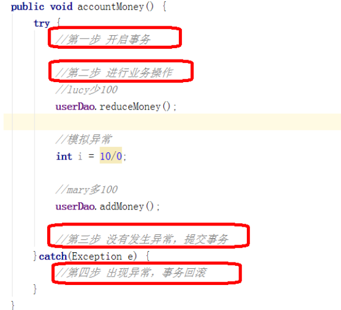

### 4、事务操作（Spring事务管理介绍）

（1）事务添加到JavaEE三层结构里面Service层（业务逻辑层）

（2）在Spring进行事务管理操作

- 编程式事务管理
- 声明式事务管理（使用）

（3）声明式事务管理

- 基于注解方式（使用）
- 基于xml配置文件方式

（4）在Spring进行声明式事务管理，底层使用AOP原理

（5）Spring事务管理API

- 提供一个`PlatformTransactionManager接口`，代表事务管理器，这个接口针对不同的框架提供不同的实现类

  - jdbcTemplates 、mybatis 使用DataSourceTransactionManager实现类
  - Hibernate使用HibernateTransactionManager
  
  
  
  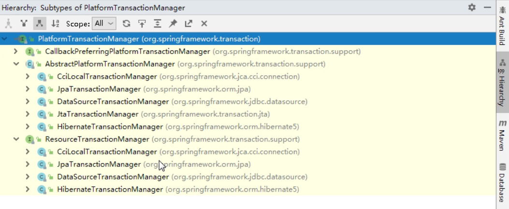

### 5、事务操作（注解声明式事务管理）

（1）在Spring配置文件配置事务管理器

```xml
    <!--创建事务管理器-->
    <bean id="transactionManager" class="org.springframework.jdbc.datasource.DataSourceTransactionManager">
        <!--注入数据源-->
        <property name="dataSource" ref="dataSource"></property>
    </bean>
```

（2）在Spring配置文件，开启事务注解

- 在Spring配置文件引入名称空间tx

  ```xml
  <?xml version="1.0" encoding="UTF-8"?>
  <beans xmlns="http://www.springframework.org/schema/beans"
         xmlns:xsi="http://www.w3.org/2001/XMLSchema-instance"
         xmlns:context="http://www.springframework.org/schema/context"
         xmlns:aop="http://www.springframework.org/schema/aop"
         xmlns:tx="http://www.springframework.org/schema/tx"
         xsi:schemaLocation="http://www.springframework.org/schema/beans http://www.springframework.org/schema/beans/spring-beans.xsd
                             http://www.springframework.org/schema/context http://www.springframework.org/schema/context/spring-context.xsd
                             http://www.springframework.org/schema/aop http://www.springframework.org/schema/aop/spring-aop.xsd
                             http://www.springframework.org/schema/tx http://www.springframework.org/schema/tx/spring-tx.xsd
  ">
  
  ```

- 开启事务注解

  ```xml
      <!--开启事务注解  使用transactionManager组件-->
      <tx:annotation-driven transaction-manager="transactionManager"></tx:annotation-driven>
  ```

（3）在Service类上面（获取service类里面方法上面）添加事务注解

- @Transactional 这个注解添加到类上面，也可以添加方法上面

- 如果把这个注解添加到类上面，这个类里面所有的方法都添加事务

- 如果把这个注解添加到方法上面，为这个方法添加事务

  ```java
  @Service
  @Transactional
  public class UserService {
  }
  ```

### 6、事务操作（声明式事务管理参数配置）

（1）在service类上面添加注解@Transactional，在这个注解里面可以配置事务相关参数

- **propagation**：事务传播行为

  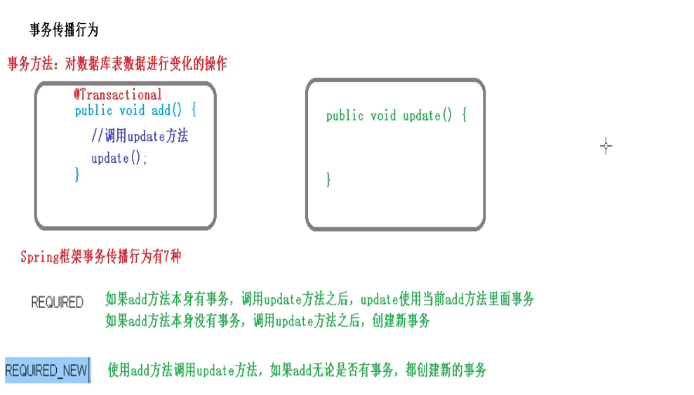

  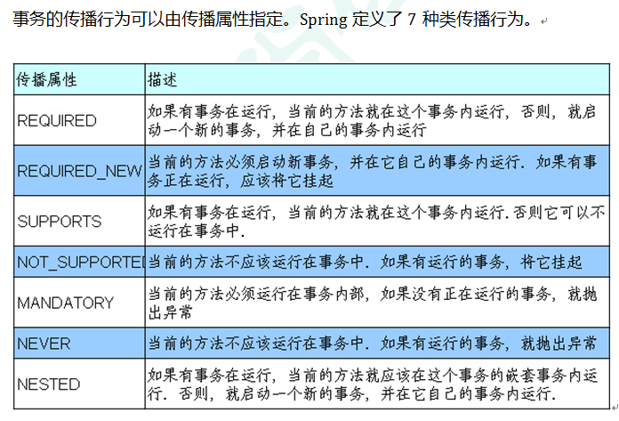

  - 多事务方法直接进行调用，这个过程中事务是如何进行管理的

- **ioslation**：事务隔离级别

  - 事务有特性成为隔离性，多事务操作之间不会产生影响。不考虑隔离性产生很多问题
  - 有三个读问题：脏读、不可重复读、虚（幻）读

  （1）脏读：一个未提交事务读取到另一个未提交事务的数据

  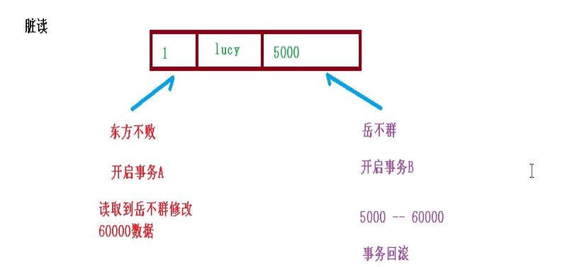

  （2）不可以重复读：一个未提交事务读取到另一提交事务修改数据

  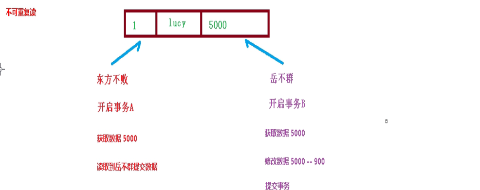

  （3）虚幻读：一个未提交事务读取到另一个提交事务添加数据

  🚑解决：通过设置事务隔离级别，解决读问题

  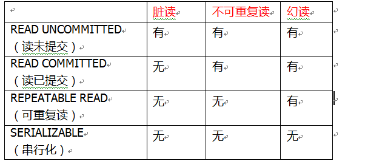

  ```java
  // 添加事务注解
  @Transactional(propagation = Propagation.REQUIRED,
                 isolation = Isolation.REPEATABLE_READ)
  ```

- **timeout**：超时时间

  - 事务需要在一定时间内进行提交，如果不提交进行回滚
  - 默认值：-1，设置时间以秒单位进行计算

  ```java
  @Transactional(timeout = -1,
                 propagation = Propagation.REQUIRED,
                 isolation = Isolation.REPEATABLE_READ
                )
  ```

- **readOnly**：是否只读

  - 读：查询操作，写：添加修改删除操作
  - readOnly默认值false，表示可以查询，可以添加修改删除操作
  - 设置readOnly值为true后，只能查询

  ```java
  @Transactional(readOnly = true,
                 timeout = -1,
                 propagation = Propagation.REQUIRED,
                 isolation = Isolation.REPEATABLE_READ)
  ```

- **rollbackFor**：回滚

  - 设置出现哪些异常进行事务回滚

- **noRollbackFor**：不回滚

  - 设置出现哪些异常不进行事务回滚

### 7、事务操作（XML声明式事务管理）

（1）在Spring配置文件中进行配置

- 第一步 配置事务管理器

  ```xml
      <!--1. 创建事务管理器-->
      <bean id="transactionManager" class="org.springframework.jdbc.datasource.DataSourceTransactionManager">
          <!--注入数据源-->
          <property name="dataSource" ref="dataSource"></property>
      </bean>
  ```
  
- 第二步 配置通知

  ```xml
      <!--2. 配置通知-->
      <tx:advice id="txadvice">
          <!--配置事务参数-->
          <tx:attributes>
              <!--指定那种规则的方法上面添加事务-->
              <tx:method name="accountMoney" propagation="REQUIRED"/>
              <!--<tx:method name="account*"/>-->
          </tx:attributes>
      </tx:advice>
  ```

- 第三步 配置切入点和切面

  ```xml
      <!--3. 配置切入点和切面-->
      <aop:config>
          <!--配置切入点-->
          <aop:pointcut id="pt" expression="execution(* cn.spring5.Aop.Service.UserService.*(..))"/>
          <!--配置切面-->
          <aop:advisor advice-ref="txadvice" pointcut-ref="pt"></aop:advisor>
      </aop:config>
  ```

### 8、事务操作（完全注解声明式事务管理）

（1）创建配置类，使用配置类替代xml配置文件

```java
@Configuration // 配置类
@ComponentScan(basePackages = "cn.spring5.Aop") // 组件扫描
@EnableTransactionManagement // 开启事务管理
public class TxConfig {
    // 创建数据库连接池
    @Bean
    public DruidDataSource getDruidDataSource(){
        DruidDataSource dataSource = new DruidDataSource();
        dataSource.setDriverClassName("com.mysql.jdbc.Driver");
        dataSource.setUrl("jdbc:mysql://127.0.0.1:3306/spring5");
        dataSource.setUsername("root");
        dataSource.setPassword("root");
        return dataSource;
    }

    //创建JdbcTemplate对象
    @Bean
    public JdbcTemplate getJdbcTemplate(DataSource dataSource){//从IOC容器中注入
        JdbcTemplate jdbcTemplate = new JdbcTemplate();
        // 注入DataSource
        jdbcTemplate.setDataSource(dataSource);
        return jdbcTemplate;
    }

    // 创建事务管理器
    @Bean
    public DataSourceTransactionManager getDataSourceTransactionManager(DataSource dataSource){
        DataSourceTransactionManager transactionManager = new DataSourceTransactionManager();
        transactionManager.setDataSource(dataSource);
        return transactionManager;
    }
}
```

（2）测试类

```java
    @Test
    public void testAccountConfig(){
        ApplicationContext context = new AnnotationConfigApplicationContext(TxConfig.class);
        UserService userService = context.getBean("userService", UserService.class);
        userService.accountMoney();
    }
```

## 六、Spring5框架新功能


（1）整个Spring5框架的代码基于JDK8，运行时兼容JDK9，许多不建议使用的类和方法在代码库中删除

（2）Spring5.0框架自带了通用的日志封装


### Spring5框架整合Log4j2

- Spring5已经移除Log4jConfigListener，官方建议使用Log4j2

  

  - 第一步 引入jar包

    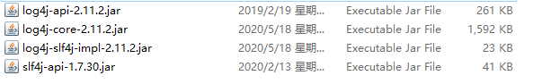

  - 第二步 创建`Log4j2.xml`配置文件

    ```xml
    <?xml version="1.0" encoding="UTF-8"?>
    <!--日志级别以及优先级排序: OFF > FATAL > ERROR > WARN > INFO > DEBUG > TRACE > ALL -->
    <!--Configuration后面的status用于设置log4j2自身内部的信息输出，可以不设置，当设置成trace时，可以看到log4j2内部各种详细输出-->
    <configuration status="INFO">
        <!--先定义所有的appender-->
        <appenders>
            <!--输出日志信息到控制台-->
            <console name="Console" target="SYSTEM_OUT">
                <!--控制日志输出的格式-->
                <PatternLayout pattern="%d{yyyy-MM-dd HH:mm:ss.SSS} [%t] %-5level %logger{36} - %msg%n"/>
            </console>
        </appenders>
        <!--然后定义logger，只有定义了logger并引入的appender，appender才会生效-->
        <!--root：用于指定项目的根日志，如果没有单独指定Logger，则会使用root作为默认的日志输出-->
        <loggers>
            <root level="info">
                <appender-ref ref="Console"/>
            </root>
        </loggers>
    </configuration>
    ```

### Spring5框架核心容器支持@Nullable注释

（1）@Nullable注解可以使用在方法上面，属性上面，参数上面，表示方法返回可以为空，属性值可以为空，参数值可以为空


```java
// 注解用在方法上面，方法返回值可以为空
@Nullable
String getId();

// 注解使用在方法参数里面，方法参数可以为空
public <T. void registerBean(@Nullable String beanName){
    
}

// 注解使用在属性上面，属性值可以为空
@Nullable
private String bookName;
```

### Spring5核心容器支持函数式风格GenericApplicationContext

```java
    @Test
    public void testGenericApplicationContext(){
        // 创建GenericApplicationContext对象
        GenericApplicationContext context = new GenericApplicationContext();
        // 调用context的方法对象注册
        context.refresh();
        context.registerBean(User.class,()->new User());
        // 获取在spring注册的对象
        User user = (User)context.getBean("cn.spring5.Aop.Test.User");
        System.out.println(user);
    }
```

### Spring5支持整合JUnit5

第一步 引入Spring相关针对测试依赖

```xml
        <dependency>
            <groupId>org.springframework</groupId>
            <artifactId>spring-test</artifactId>
            <version>5.2.6.RELEASE</version>
	</dependency>
```

- **整合JUnit4**

  - 第一步 引入Spring相关针对测试依赖

  - 第二步 创建测试类，使用注解方法完成

  ```java
  // 单元测试框架
  @RunWith(SpringJUnit4ClassRunner.class)
  // 加载配置文件
  @ContextConfiguration("classpath:bean2.xml")
  public class JTest4 {
      @Autowired
      private UserService userService;
  
      @Test
      public void test(){
          userService.accountMoney();
      }
  }
  ```
  
- **整合JUnit5**

  - 第一步 引入JUnit5的jar包

  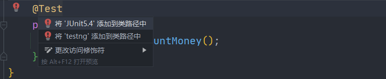

  - 第二步 创建测试类，使用注解完成

  ```java
  @ExtendWith(SpringExtension.class)
  @ContextConfiguration("classpath:bean2.xml")
  public class JTest4 {
      @Autowired
      private UserService userService;
  
      @Test
      public void test1(){
          userService.accountMoney();
      }
  }
  ```
  
- 使用复合注解替代上面两个注解完成整合

  ```java
  @SpringJUnitConfig(locations = "classpath:bean2.xml")
  ```

## Webflux

### 1、Webflux-基本概念

#### 1、SpringWebflux介绍

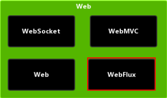

- 是Spring5添加的新的模块，用于web开发的，功能和SpringMVC类似的，Webflux使用当前一种比较流行程响应式编程出现的框架
- 使用传统web框架，比如SpringMAC,这些机遇Servlet容器，Webflux是一种异步非阻塞的框架，**异步非阻塞的框架在Servlet3.1以后才支持**，核心是基于Reactor的相关API实现的


- <u>**什么是异步非阻塞**</u>

  ** 针对对象不一样

  - 异步和同步：**异步和同步针对<u>调用者</u>**，调用者发送请求，如果等着对方回应之后才去做其他事情就是同步，如果发送请求之后不等着对方回应就去做其他事情就是异步
  - **阻塞和非阻塞针对<u>被调用者</u>**，被调用者收到请求之后，做完请求任务之后才给出反馈就是阻塞，收到请求之后马上给出反馈然后再去做事情就是非阻塞


- Webflux特点
  - 第一 非阻塞式：在有限资源下，提供系统吞吐量和伸缩性，以Reactor为基础实现响应式编程
  - 第二函数式编程：Spring5框架基于java8，Webflux使用Java8函数式编程方式实现路由请求

  

- 比较SpringMVC
  - 两个框架都可以使用注解方式，都运用在Tomcat等容器中
  - SpringMAC采用命令式编程，Webflux采用异步响应式编程
  - Webflux适用于远程调用场景。

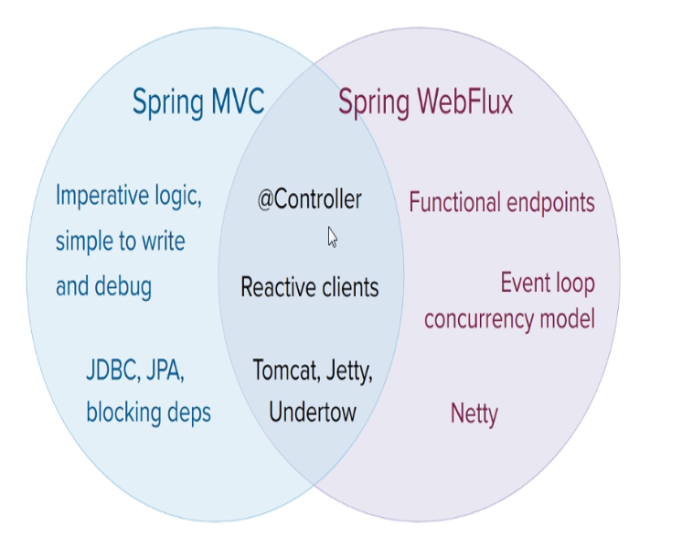

#### 2、响应式编程（Java实现）

> 响应式编程是一种面向数据流和变化传播的编程范式。这意味着可以在编程语言中很方便地表达静态或动态的数据流，而相关的计算模型会自动将变化的值通过数据流进行传播。 
>
> 电子表格程序就是响应式编程的一个例子。单元格可以包含字面值或类似"=B1+C1"的公式，而包含公式的单元格的值会依据其他单元格的值的变化而变化。

- Java8及其之前版本

  提供的【观察者模式】两个类Observer和Observable

  ```java
  public class ObserverDemo extends Observable {
      public static void main(String[] args) {
          ObserverDemo observerDemo = new ObserverDemo();
          // 添加观察者
          observerDemo.addObserver((o,arg)->{
              System.out.println("发生变化"+arg);
          });
          observerDemo.addObserver((o,arg)->{
              System.out.println("收到被观察者通知，准备改变"+arg);
          });
          observerDemo.setChanged();// 数据变化
          observerDemo.notifyObservers();//通知
      }
  }
  ```

+ java9中Flow实现响应式编程

```java
import java.util.concurrent.Flow;

public class Main {

    public static void main(String[] args) {
        
        Flow.Publisher<String> publisher = subscriber -> {
            subscriber.onNext("1"); // 1
            subscriber.onNext("2");
            subscriber.onError(new RuntimeException("ณ๖ดํ")); // 2
            //  subscriber.onComplete();
        };


        publisher.subscribe(new Flow.Subscriber<>() {
            @Override
            public void onSubscribe(Flow.Subscription subscription) {
                subscription.cancel();
            }

            @Override
            public void onNext(String item) {
                System.out.println(item);
            }

            @Override
            public void onError(Throwable throwable) {
                System.out.println("ณ๖ดํมห");
            }

            @Override
            public void onComplete() {
                System.out.println("publish complete");
            }
        });
    }
}
```

#### 3、响应式编程(Reactor实现)

（1）响应式编程操作中，Reactor是满足Reactive规范框架

（2）Reactor有两个核心类，Mono和Flux，这两个实现接口Publisher,提供丰富操作符。flux对象实现发布者，返回N个元素；Mono实现发布者，返回0或者1个元素

（3）Flux和Mono都是数据流的发布者，使用Flux和Mono都可以发出三种数据信号： `元素值，错误信号，完成信号`，错误信号和完成信号都代表终止信号，终止信号用于告诉订阅者数据流结束了，错误信号终止数据流同时把错误信息传递给订阅者

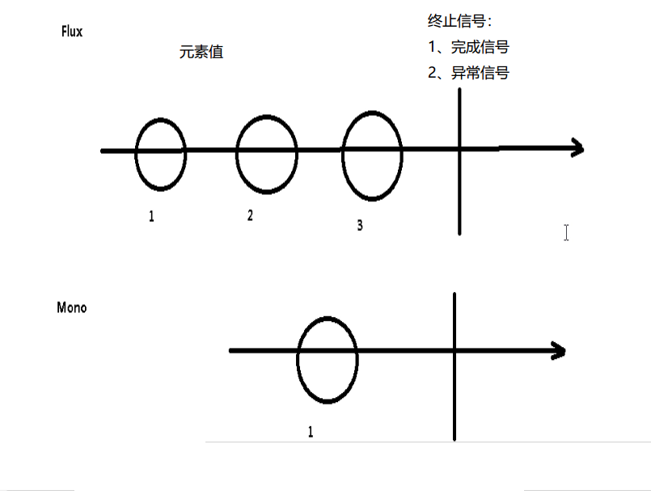

#### 4、代码演示Flux和Mono

第一步 引入依赖

```xml
<dependencies>
    <dependency>
        <groupId>io.projectreactor</groupId>
        <artifactId>reactor-core</artifactId>
        <version>3.1.5.RELEASE</version>
    </dependency>
</dependencies>
```

第二步 编程代码

```java
public static void main(String[] args) {
    // just方法直接声明
    Flux.just(1,2,3,4);
    Mono.just(1);
    // 其他方法
    Integer[] array = {1,2,3,4};
    Flux.fromArray(array);//数组

    List<Integer> list = Arrays.asList(array);
    Flux.fromIterable(list);//集合

    Stream<Integer> stream = list.stream();
    Flux.fromStream(stream);//stream
}
```

#### 5、**三中信号特点**

- 错误信号和完成信号都是终止信号，不能共存的
- 如果没有发送任何信号元素值，而是直接发送错误或者完成信号，表示是空数据流
- 如果没有错误信号，没有完成信号，表示是无限数据流

#### 6、调用just或者其他方法只是声明数据流，数据流并没有发出，只有进行订阅之后才会触发数据流，不订阅声明都不会发生的

```java
    public static void main(String[] args) {
        // just方法直接声明
        Flux.just(1,2,3,4).subscribe(System.out::print);
        Mono.just(1).subscribe(System.out::println);
    }
```

#### 7、**操作符**

对数据流进行一道道操作，成为操作符，比如工厂流水线

- 第一 map 元素映射为新元素

  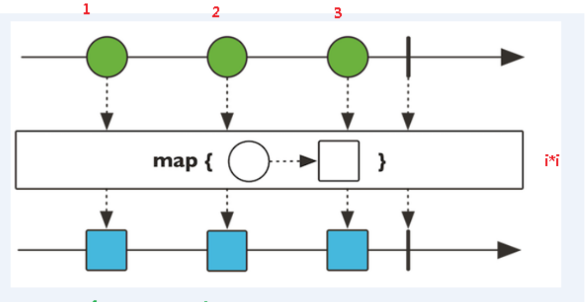

- 第二 flatMap 元素映射为流
   把每个元素转换流，把转换之后多个流合并大的流

  

  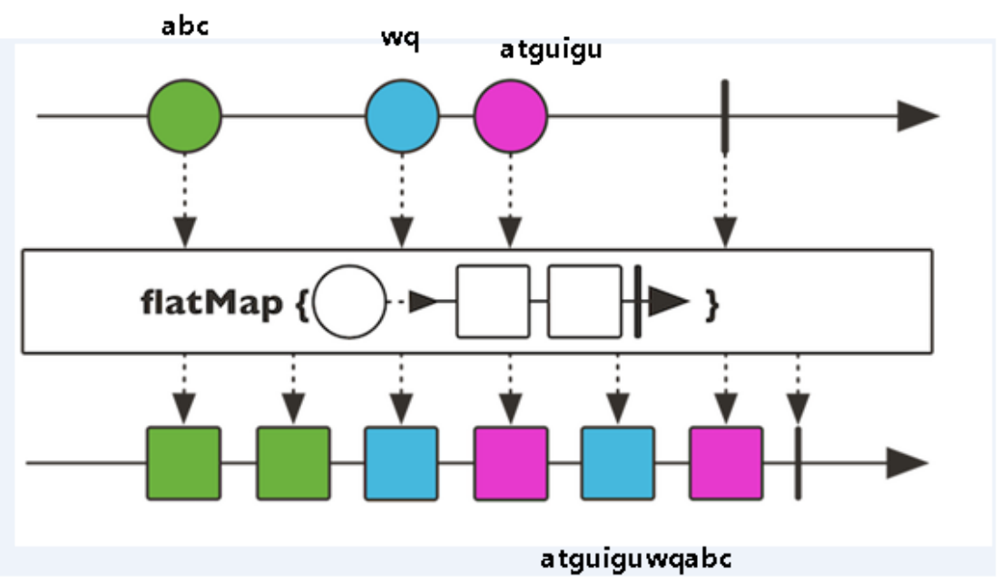

### 2、SpringWebflux执行流程和核心API

SpringWebflux就Reactor，默认使用容器Netty，Netty是高性能的NIO框架，异步非阻塞的框架

- Netty

  BIO

  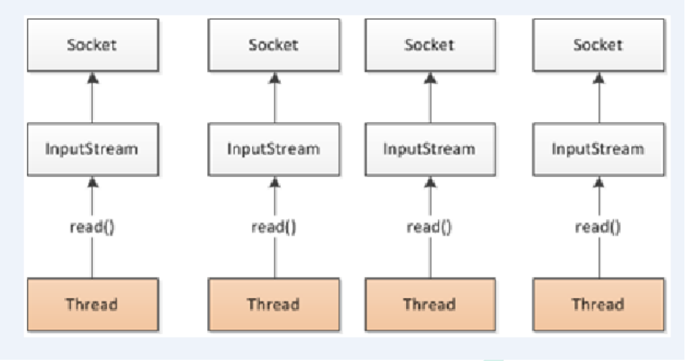

  NIO

  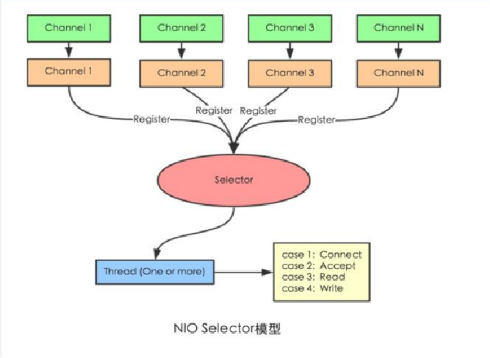

- SpringWebflux 执行过程和 SpringMVC 相似的

  - SpringWebflux 核心控制器 `DispatchHandler`，实现接口 WebHandler

  - 接口 WebHandler 有一个方法

    ```java
    public interface WebHandler {
        Mono<Void> handle(ServerWebExchang var1)
    }
    ```
    
  
  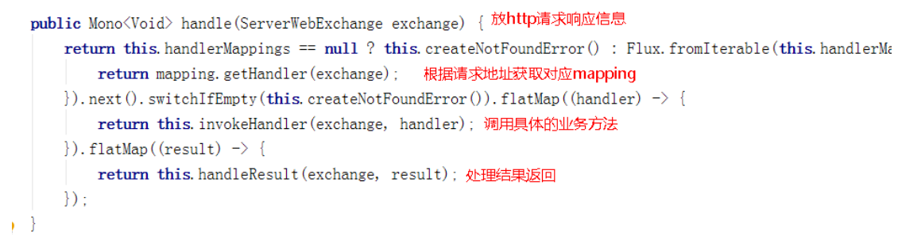
  
- SpringWebflux 里面 DispatcherHandler，负责请求的处理

  - HandlerMapping：请求查询到处理的方法
  - HandlerAdapter：真正负责请求处理
  - HandlerResultHandler：响应结果处理

- SpringWebflux 实现函数式编程，两个接口：`RouterFunction`（路由处理）和 `HandlerFunction`（处理函数）

### 5、SpringWebflux（基于注解编程模型）

- SpringWebflux 实现方式有两种：

  - 注解编程模型
    - 使用注解编程模型方式，和之前 SpringMVC 使用相似的，只需要把相关依赖配置到项目中，SpringBoot 自动配置相关运行容器，默认情况下使用 Netty 服务器
  - 函数式编程模型

- 演示

  第一步 创建 SpringBoot 工程，引入 Webflux 依赖

  ```xml
  <!--pom.xml-->
  <dependencies>
      <dependency>
          <groupId>org.springframework.boot</groupId>
          <artifactId>spring-boot-starter-webflux</artifactId>
      </dependency>
  </dependencies>
  
  ```

  第二步 配置启动端口号application.properties

  ```
  server.port=8080
  ```

  

  第三步 创建包和相关类

  ```java
  // 实体类
  public class User {
      private String name;
      private String gender;
      private Integer age;
  
      public User(){}
      public User(String name, String gender, Integer age) {
          this.name = name;
          this.gender = gender;
          this.age = age;
      }
  
      public String getName() {
          return name;
      }
  
      public void setName(String name) {
          this.name = name;
      }
  
      public String getGender() {
          return gender;
      }
  
      public void setGender(String gender) {
          this.gender = gender;
      }
  
      public Integer getAge() {
          return age;
      }
  
      public void setAge(Integer age) {
          this.age = age;
      }
  }
  ```

  创建接口定义操作的方法

  ```java
  //用户操作接口
  public interface UserService {
      /** 根据id查询用户*/
      Mono<User> getUserById(int id);
  
      /** 查询所有用户*/
      Flux<User> getAllUser();
  
      /** 添加用户*/
      Mono<Void> saveUserInfo(Mono<User> user);
  }
  ```

  接口实现类

  ```java
  public class UserServiceImpl implements UserService {
      /** 创建map集合存储数据*/
      private final Map<Integer,User> userMap = new HashMap<>();
  
      public UserServiceImpl() {
          this.userMap.put(1, new User("lucy","nan",20));
          this.userMap.put(2, new User("mary","nv",30));
          this.userMap.put(3, new User("jack","nan",40));
          this.userMap.put(4, new User("WeiSanJin","nan",50));
      }
  
      /** 根据id查询*/
      @Override
      public Mono<User> getUserById(int id) {
          return Mono.justOrEmpty(this.userMap.get(id));
      }
  
      /** 查询多个用户*/
      @Override
      public Flux<User> getAllUser() {
          return Flux.fromIterable(this.userMap.values());
      }
  
      /** 添加用户*/
      @Override
      public Mono<Void> saveUserInfo(Mono<User> userMono) {
          return userMono.doOnNext(person -> {
              /* 向map集合里面放值*/
              int id = userMap.size()+1;
              userMap.put(id,person);
          }).thenEmpty(Mono.empty());
      }
  }
  ```

  创建 controller

  ```java
  @RestController
  public class UserController {
      /** 注入service*/
      @Autowired
      private UserService userService;
  
      /** id查询*/
      @GetMapping("/user/{id}")
      public Mono<User> getUserId(@PathVariable int id){
          return userService.getUserById(id);
      }
  
      /** 查询所有*/
      @GetMapping("/user")
      public Flux<User> getUser(){
          return userService.getAllUser();
      }
  
      /** 添加*/
      @PostMapping("/saveUser")
      public Mono<Void> saveUser(@RequestBody User user){
          Mono<User> userMono = Mono.just(user);
          return userService.saveUserInfo(userMono);
      }
  
  }
  ```

- 说明
  SpringMVC 方式实现，同步阻塞的方式，基于 SpringMVC+Servlet+Tomcat
  SpringWebflux 方式实现，异步非阻塞 方式，基于 SpringWebflux+Reactor+Netty

### 4、SpringWebflux（基于函数式编程模型）

（1）在使用函数式编程模型操作时候，需要自己初始化服务器
（2）基于函数式编程模型时候，有两个核心接口：RouterFunction（实现路由功能，请求转发给对应的 handler）和 HandlerFunction（处理请求生成响应的函数）。核心任务定义两个函数式接口的实现并且启动需要的服务器。
（ 3 ） SpringWebflux 请 求 和 响 应 不 再 是 ServletRequest 和 ServletResponse ， 而 是ServerRequest 和 ServerResponse

- 第一步 把注解编程模型工程复制一份 ，保留 entity 和 service 内容

- 第二步 创建 Handler（具体实现方法）

  ```java
  public class UserHandler {
      private final UserService userService;
      public UserHandler(UserService userService){
          this.userService = userService;
      }
  
      /** 根据id查询*/
      public Mono<ServerResponse> getUserById(ServerRequest request){
          /* 获取id*/
          int userId = Integer.valueOf(request.pathVariable("id"));
          /* 空值处理*/
          Mono<ServerResponse> notFound = ServerResponse.notFound().build();
          /* 调用service方法得到数据*/
          Mono<User> userMono = this.userService.getUserById(userId);
          /* userMono进行转换返回*/
          /* 使用Reactor操作符fluxMap*/
          return userMono
                      .flatMap(person -> ServerResponse.ok().contentType(MediaType.APPLICATION_JSON)
                          .body(BodyInserters.fromObject(person)))
                          .switchIfEmpty(notFound);
      }
  
      /** 查询所有*/
      public Mono<ServerResponse> getAllUser(){
          /* 调用service得到结果*/
          Flux<User> userFlux = this.userService.getAllUser();
          return ServerResponse.ok().contentType(MediaType.APPLICATION_JSON).body(userFlux,User.class);
      }
  
      /** 添加*/
      public Mono<ServerResponse> saveUser(ServerRequest request){
          /* 得到user对象*/
          Mono<User> userMono = request.bodyToMono(User.class);
          return ServerResponse.ok().build(this.userService.saveUserInfo(userMono));
      }
  ```

- 第三步 初始化服务器，编写 Router
  创建路由的方法

  ```java
  public class Server {
      /** 创建Router路由*/
      public RouterFunction<ServerResponse> routerFunction(){
          /* 创建hanler对象*/
          UserService userService = new UserServiceImpl();
          UserHandler handler = new UserHandler(userService);
          /* 设置路由*/
          return RouterFunctions.route(
                  GET("/user/{id}").and(accept(APPLICATION_JSON)),handler::getUserById)
                  .andRoute(GET("/user").and(accept(APPLICATION_JSON)),handler::getAllUser);
  
      }
  }
  ```

- 创建服务器完成适配

  ```java
  public class Server {
      
      
      /** 创建服务器完成配置*/
      public void createReactorServer(){
          /*路由和handler适配*/
          RouterFunction<ServerResponse> route = routerFunction();
          HttpHandler httpHandler = RouterFunctions.toHttpHandler(route);
          ReactorHttpHandlerAdapter adapter = new ReactorHttpHandlerAdapter(httpHandler);
  
          /* 创建服务器*/
          HttpServer httpServer = HttpServer.create();
          httpServer.handle(adapter).bindNow();
      }
      
  }
  ```

- 最终调用

  ```java
  public class Server {
      
      
      public static void main(String[] args) throws Exception {
          Server server = new Server();
          server.createReactorServer();
          System.out.println("enter to exit");
          System.in.read();
      }
  }
  ```


通过url测试：`GET http://localhost:9727/user/3`


（4）使用 WebClient 调用url

```java
public class Client {
    public static void main(String[] args) {
        /* 调用服务器地址*/
        WebClient webClient = WebClient.create("http://127.0.0.1:8080");

        /* 根据ID查询*/
        //fix: 给User类添加无参构造
        String id = "1";
        User userResult = webClient.get().uri("/user/{id}",id)
                .accept(MediaType.APPLICATION_JSON).retrieve().bodyToMono(User.class)
                .block();
        System.out.println(userResult.getName());

        /* 查询所有*/
        Flux<User> results = webClient.get().uri("/user").accept(MediaType.APPLICATION_JSON).retrieve().bodyToFlux(User.class);
        results.map(stu ->stu.getName()).buffer().doOnNext(System.out::println).blockFirst();
    }
}
```

## 课程总结

1 、Spring 框架概述
（1）轻量级开源 JavaEE 框架，为了解决企业复杂性，两个核心组成：IOC 和 AOP
（2）Spring5.2.6 版本
2 、IOC 容器
**（1）IOC 底层原理（工厂、反射等）**
（2）IOC 接口（BeanFactory）
**（3）IOC 操作 Bean 管理（基于 xml）**
**（4）IOC 操作 Bean 管理（基于注解）**
3 、Aop
（1）AOP 底层原理：动态代理，有接口（JDK 动态代理），没有接口（CGLIB 动态代理）
（2）术语：切入点、增强（通知）、切面
（3）基于 AspectJ 实现 AOP 操作
4 、JdbcTemplate
（1）使用 JdbcTemplate 实现数据库 curd 操作
（2）使用 JdbcTemplate 实现数据库批量操作
5 、事务管理
（1）事务概念
（2）重要概念（传播行为和隔离级别）
（3）基于注解实现声明式事务管理
（4）完全注解方式实现声明式事务管理
6 、Spring5 新功能
（1）整合日志框架
（2）@Nullable 注解
（3）函数式注册对象
（4）整合 JUnit5 单元测试框架
（5）SpringWebflux 使用