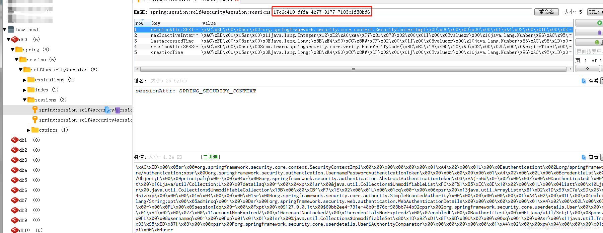

> 本文由 [简悦 SimpRead](http://ksria.com/simpread/) 转码， 原文地址 [blog.csdn.net](https://blog.csdn.net/liman65727/article/details/118881993)

### 文章目录

*   [前言](#_1)
*   [单机 session 管理](#session_5)
*   *   [Session 超时管理](#Session_9)
    *   [session 过期处理](#session_20)
    *   [Session 并发控制](#Session_32)
*   [集群 session 管理](#session_80)
*   [安全退出](#_113)
*   [总结](#_151)

前言
==

本篇博客介绍 spring-security 中会话的管理以及安全退出的操作

单机 [session](https://so.csdn.net/so/search?q=session&spm=1001.2101.3001.7020) 管理
================================================================================

单机值得是单服务器，单服务器的 session 管理比较容易

Session 超时管理
------------

指定 session 的超时时间，其实这个不限于单机的 session 管理，在集群的 session 管理下，配置的 session 超时时间依旧有效。配置超时时间，我们只需要在配置文件中配置如下属性即可

```
#session超时时间，单位秒
server.session.timeout=600
```

需要说明的是，如果使用的是 springboot 内嵌的 tomcat 启动系统，则在 springboot 的`TomcatEmbeddedServletContainerFactory`类中，这个过时时间最低会被设置为 60 秒，因此**如果使用 springboot 内嵌的 tomcat 启动应用，则 session 最少的过期时间为 1 分钟。**

session 过期处理
------------

针对 session 过期的处理，在配置中加上如下配置即可

```
http.and()
	.sessionManagement()
	.invalidSessionUrl("/authentication/sessiontimeout")//这里配置session失效的url
```

invalidSessionUrl 指定 session 失效以后跳转的目标 url。

Session 并发控制
------------

session 的并发控制是指，同一个用户在服务器端只能存在的会话个数，如果指定为 1，则表示客户在服务器中只能存在一个会话，对于客户来说，也只能在一台设备上登录，不能在多台设备上登录，如果在未知设备上登录，则会根据 session 并发控制的相关策略进行处理。

```
http.and()
    .sessionManagement()
    .invalidSessionUrl("/authentication/sessiontimeout")//这里配置session失效的url
    .maximumSessions(1)//最大会话数
	.expiredSessionStrategy(new SelfExpireSessionStrategy())//自定义的淘汰会话策略
	.and()
```

自定义的会话淘汰策略

```
/**
 * autor:liman
 * createtime:2021/7/18
 * comment:自定义的会话淘汰策略
 * 实现SessionInformationExpiredStrategy接口，这个接口有一个SessionInformationExpiredEvent属性
 * 这个属性记录了最新的登录请求响应的所有数据。
 */
public class SelfExpireSessionStrategy implements SessionInformationExpiredStrategy {

    @Override
    public void onExpiredSessionDetected(SessionInformationExpiredEvent event) throws IOException, ServletException {
        //这里可以记录新的登录信息
        event.getResponse().setContentType("application/json;charset=UTF-8");
        event.getResponse().getWriter().write("在新的设备上登录了");
    }
}
```

如果会话已经存在，想阻止登录，则加一行配置即可

```
http.and()
    .sessionManagement()
    .invalidSessionUrl("/authentication/sessiontimeout")//这里配置session失效的url
    .maximumSessions(1)//最大会话数
    .expiredSessionStrategy(new SelfExpireSessionStrategy())//自定义的淘汰会话策略
    .maxSessionsPreventsLogin(true)//如果会话存在，则阻止后续登录
    .and()
```

集群 session 管理
=============

针对集群下的 session 共享，这里不解释为啥需要 session 共享。只是记录解决方案。这里我们使用 spring-session 来完成集群 session 共享。

需要在 pom 中引入 spring-session（版本号根据自己项目特性进行指定）

```
<dependency>
    <groupId>org.springframework.session</groupId>
    <artifactId>spring-session</artifactId>
</dependency>
```

其实 spring-session 支持很多持久化 session 的方式，这里我们以 Redis 为例进行总结，我们需要做的并不多，因为本身也不复杂。之后我们需要在配置文件中指定 session 持久化方式即可

```
#集群session存储方式
spring.session.store-type=REDIS
```

我们不需要编写其他代码，如果想自定义 session 过期时间或者自定义 session 的命名空间，则可以在启动类上加如下注解

```
@EnableRedisHttpSession(maxInactiveIntervalInSeconds = 60*10,redisNamespace = "self#security#session")
```

登录之后，进入到 Redis，可以看到存放的会话信息



图中圈出的就是 sessionid

安全退出
====

这个比较简单，只需要在配置中指定自定义的退出逻辑即可，其余的交给 spring-security 指定帮我们完成

```
http.and()
    .logout()
    .logoutUrl("/logout")//针对安全配置的请求
    .logoutSuccessHandler(new SelfLogoutSuccessHandler())//这个与下面的logoutSuccessUrl互斥
//    .logoutSuccessUrl("/demo-logout.html")
//    .deleteCookies("JSESSIONID")//删除cookid，如果前后端分离的，则不需要处理
```

自定义的登录处理

```
/**
 * autor:liman
 * createtime:2021/7/18
 * comment: 自定义退出登录的处理
 */
@Slf4j
public class SelfLogoutSuccessHandler implements LogoutSuccessHandler {

    private ObjectMapper objectMapper = new ObjectMapper();

    @Override
    public void onLogoutSuccess(HttpServletRequest request, HttpServletResponse response, Authentication authentication) throws IOException, ServletException {
        //如果没有配置退出页面
        response.setContentType("application/json;charset=UTF-8");
        response.getWriter().write(objectMapper.writeValueAsString(new BaseResponse(StatusCode.Success)));
        log.info("退出登录成功");
    }
}
```

上述是前后端分离的退出操作，如果不想前后端分离，则可以指定 logoutSuccessUrl，在退出后跳转至指定的页面即可。

总结
==

总结一下会话和安全退出的功能