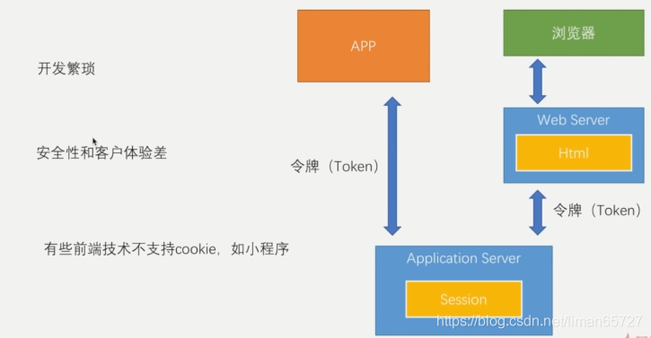
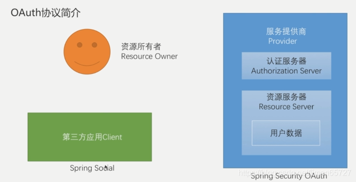
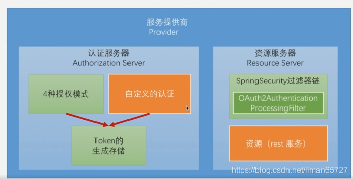
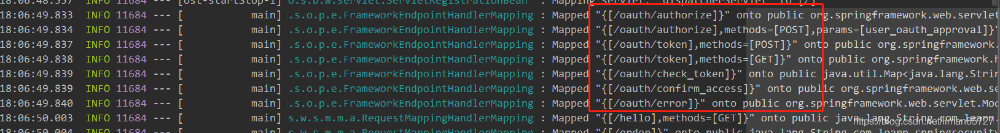
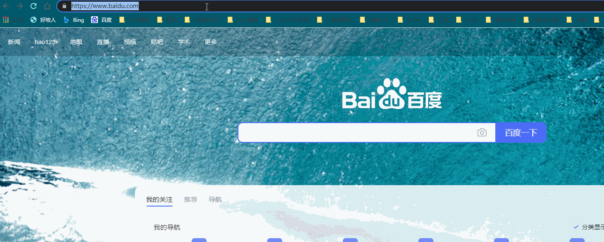
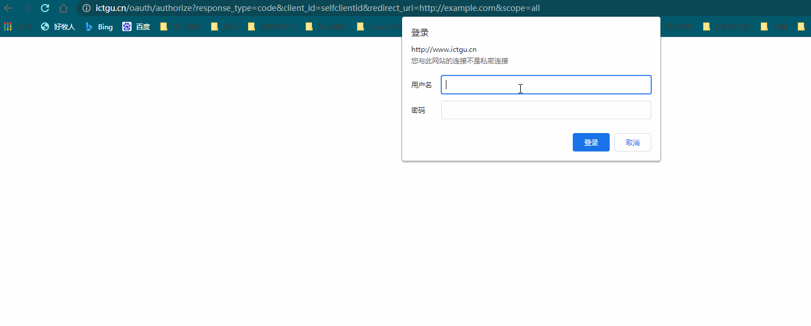
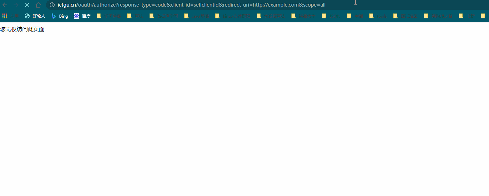
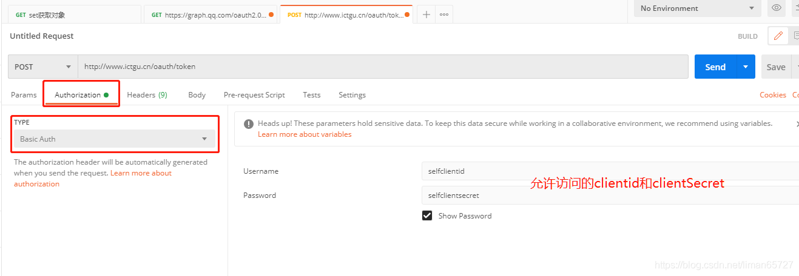
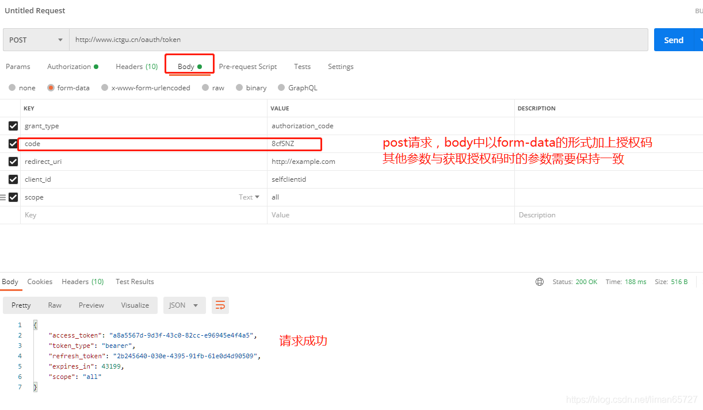
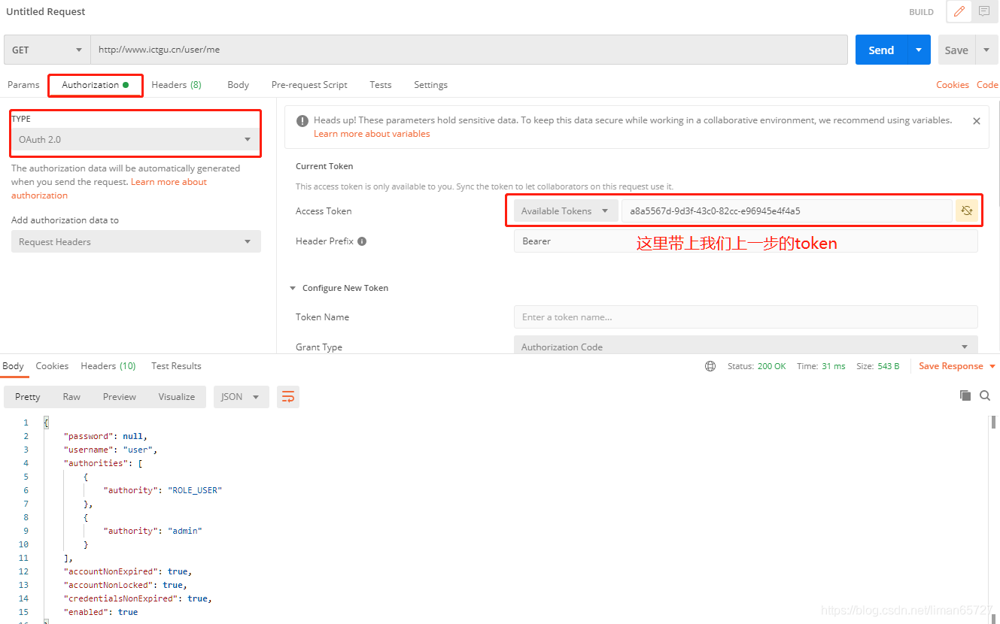

> 本文由 [简悦 SimpRead](http://ksria.com/simpread/) 转码， 原文地址 [blog.csdn.net](https://blog.csdn.net/liman65727/article/details/119085780)

### 文章目录

*   [前言](#_1)
*   [基于 token 的认证方式](#token_5)
*   [简单实例](#_26)
*   *   [准备工作](#_30)
    *   [实现认证服务器](#_93)
    *   *   [获取授权码](#_112)
        *   [根据授权码获取 token](#token_161)
    *   [实现资源服务器](#_173)
    *   *   [根据 token 调用业务接口](#token_191)
*   [总结](#_198)

前言
==

通过前面十篇博客，算是总结完成了各种登录方式，[表单](https://so.csdn.net/so/search?q=%E8%A1%A8%E5%8D%95&spm=1001.2101.3001.7020)登录，短信验证码登录以及社交账号登录。但是如果在真正的前后端分离的情况下，会采用基于 token 的认证方式，这时候就需要用到 spring security oauth 的内容了，spring security oauth 是 spring-security 框架的一个子模块。

基于 token 的认证方式
==============

针对[前后端分离](https://so.csdn.net/so/search?q=%E5%89%8D%E5%90%8E%E7%AB%AF%E5%88%86%E7%A6%BB&spm=1001.2101.3001.7020)以及开放平台的情况，如果单纯的用现有的登录方式，已经很难满足，目前存在的一些前端框架其实都有自己独立的 Web Server ，比如 node.js。这些前端应用的请求发动到后端的时候，是先去 Web Server 获取相关的静态资源，然后再去后端服务器获取相关数据，一个请求其实并不在一个会话中，而且如果使用的是小程序，则并不支持 cookie 机制，基于 sessionid 的会话机制无法满足相关的交互需求。这个时候有了一种新的认知方式——基于 token 的认证方式。



我们再回到之前博客的一张图




前面几篇博客介绍的 spring-social 是封装了第三方应用，去服务提供商，通过 OAuth 协议获取用户信息的操作。而这里我们是需要完成服务提供商的逻辑开发，这里就需要用到 spring security OAuth

使用 spring security OAuth 我们就能快速搭建起服务提供商的逻辑，往外提供 token 并验证 token。



作为一个服务提供商的角色，需要两大块内容，一个是认证服务器，一个是资源服务器，所谓认证服务器其实可以简单理解为就是生成 token 的逻辑，所谓资源服务器，就是我们的业务代码。这二者只是一个逻辑上的概念，并不是物理上独立的两台服务器。

简单实例
====

我们依旧在原有的项目中实现相关实例，关于实例的代码组织结构，可以参看我们之前写的博客——[spring -security 开篇简介](https://blog.csdn.net/liman65727/article/details/118313213)。

准备工作
----

本篇博客的实例会在 App 模块中完成，同时 demo 的引用需要修改为应用 App，如下所示：

```
<dependencies>
    <dependency>
        <groupId>com.coderman.learn</groupId>
        <artifactId>spring-security-core</artifactId>
        <version>${self.app.version}</version>
    </dependency>
</dependencies>
```

同时准备一个获取用户信息的业务接口

```
@GetMapping("/me")
public Object getCurrentUser(@AuthenticationPrincipal UserDetails userDetails){
    log.info("user me test");
    return userDetails;
}
```

之前我们自定义的 UserDetailsService 也需要存在

```
/**
 * autor:liman
 * createtime:2021/7/8
 * comment:
 */
@Component
@Slf4j
public class MyUserDetailService implements UserDetailsService{

    @Autowired
    private PasswordEncoder passwordEncoder;


    /**
     * 根据用户名查找用户信息
     * @param username
     * @return
     * @throws UsernameNotFoundException
     */
    @Override
    public UserDetails loadUserByUsername(String username) throws UsernameNotFoundException {
        log.info("根据用户名查找用户信息:{}",username);
        return new User(username,passwordEncoder.encode("123456"),
                true,true,true,true,
                AuthorityUtils.commaSeparatedStringToAuthorityList("admin"));
    }
}
```

为了避免每次重启输入的 clientid 的繁琐，这里在配置文件中配置一下 clientid 和 clientsecret

```
security.oauth2.client.clientId=selfclientid
security.oauth2.client.clientSecret=selfclientsecret
```

实现认证服务器
-------

回想一下社交登录中认证服务器的功能（以授权码登录为例），需要基于 OAuth2 协议生成授权码，并将授权码附在第三方应用配置的回调地址之后，之后第三方应用根据得到的授权码换取 token，最后再根据 token 获取对应的用户信息。

基于 spring security oauth，这个不难，几个配置搞定。

```
/**
 * autor:liman
 * createtime:2021/7/22
 * comment: app的认证服务器配置类
 *
 */
@Configuration
@EnableAuthorizationServer
public class AppAuthorizationServerConfig {
}
```

### 获取授权码

这个时候，我们应用就具备了认证服务器的功能。在项目启动的时候，我们会发现 spring security oauth 为我们加入了几个 oauth 开头的请求路径，如下所示：



这些请求路径就是对应的 OAuth 访问路径，我们可以根据 OAuth2 的相关协议参数，访问`oauth/authorize`，关于 OAuth2 的协议请求参数，可以参考 OAuth2 官网的第四章——[OAuth2 协议官网](https://datatracker.ietf.org/doc/html/rfc6749#section-4)。

在浏览器中输入如下路径

```
http://localhost:8090/oauth/authorize?response_type=code&client_id=selfclientid&redirect_uri=http://example.com&scope=all
```

这里配置的回调路径是 http://expample.com，client_id 就是我们准备工作中配置的 clientid，这个其实标示的是第三方应用编号，response_type 我们固定为 code，scope 我们指定的是 all，这些都是在 OAuth2 官网中有详细说明。

浏览器中输入上述地址之后，会弹出认证对话框



为什么会弹出认证对话框呢？因为这里我们认证服务器要确定是第三方应用中的那一个用户在进行授权，因此我们需要输入相关用户信息，用户信息的认证，就是我们之前自定义的`MyUserDetailService`，这里我们的实例里头只需要保证用户密码是 123456 即可，正常情况下，在输入完用户名和密码之后，会跳到授权页面。但是……



翻车了，这是因为这个访问授权页面，需要有 "`ROLE_USER`“的角色（关于角色权限，在 spring-security 的最后一章会学习总结），因此我们需要给用户赋予”`ROLE_USER`" 角色才行

```
@Override
public UserDetails loadUserByUsername(String username) throws UsernameNotFoundException {
    log.info("根据用户名查找用户信息:{}",username);
    return new User(username,passwordEncoder.encode("123456"),
            true,true,true,true,
            AuthorityUtils.commaSeparatedStringToAuthorityList("admin,ROLE_USER"));
}
```

之后重启系统（如有必要会重新输入用户名和密码）就可看到授权页面，如以下动图所示



在授权页面点击 Approval（同意）之后，就会看到浏览器显示回调的 url，并且附上了授权码。之后既可以根据这个授权码去获取 token

### 根据授权码获取 token

这一步可以用 postman 完成，指定请求路径为`/oauth/token`（我配置了相关的 host 文件，因此不需要输入 ip 和端口）



需要在 Basic Auth 认证信息中加上我们配置的 clientid 和 clientSecret，还需要在 body 中加上授权码



实现资源服务器
-------

上面其实已经完成认证服务器的所有工作，资源服务器其实也是个配置

```
/**
 * autor:liman
 * createtime:2021/7/23
 * comment:
 */
@Configuration
@EnableResourceServer
public class ResourceServerConfig {
}
```

有了资源服务器，就可以验证 token 并访问指定的业务接口了 。

### 根据 token 调用业务接口

请求头中需要在 Authorization 中带上我们上一步获取的 token。



总结
==

简单的 spring security oauth 的实例，后面会简单介绍一下其中的源码，并在此基础上完成自定义短信登录，表单登录，社交登录的 token 认证方式。