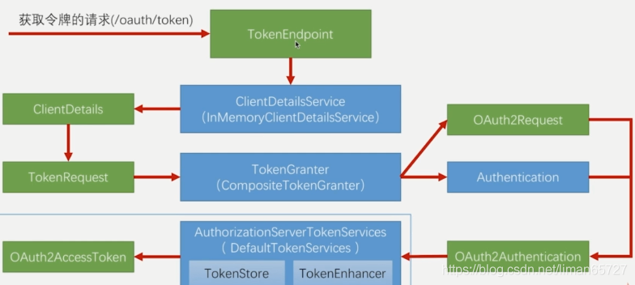

> 本文由 [简悦 SimpRead](http://ksria.com/simpread/) 转码， 原文地址 [blog.csdn.net](https://blog.csdn.net/liman65727/article/details/119296307)

### 文章目录

*   [前言](#_1)
*   [spring security oauth 源码简析](#spring_security_oauth_5)
*   *   [TokenEndPoint](#TokenEndPoint_18)
    *   [ClientDetailsService](#ClientDetailsService_107)
    *   [TokenGranter](#TokenGranter_111)
    *   [构造 OAuth2Authentication](#OAuth2Authentication_177)
    *   [token 的存储与创建](#token_224)
*   [总结](#_298)

前言
==

上一篇博客在 spring security oauth 的基础上实现了资源服务器和认证服务器，使得服务能顺利按照常用的 4 种授权模式签发 token，这一篇博客就是在原来已经实现好的短信验证码登录，[表单](https://so.csdn.net/so/search?q=%E8%A1%A8%E5%8D%95&spm=1001.2101.3001.7020)登录以及社交登录的基础上，实现基于 token 的认证方式

spring security oauth [源码](https://so.csdn.net/so/search?q=%E6%BA%90%E7%A0%81&spm=1001.2101.3001.7020)简析
========================================================================================================

这篇博客的主要目的是使得我们自己的认证模式嫁接到标准的 oauth 协议上，在此之前，我们需要简单研究一下 spring security oauth 的源码

先给出一张图



肯定是懵逼的

这个图只是涉及到了的接口和相关的类，蓝色的表示接口，其中的括号表示实现类

TokenEndPoint
-------------

这个是用来处理`/oauth/token`这个请求的，上篇博客说道，简单集成 spring-security-oauth 之后，会自动注入一些请求路径，其中就包括 oauth/token，这个请求就是获取 token 的关键请求，而 TokenEndPoint 可以看成是处理这个请求的 controller，其部分源码如下

```
//以下源码位于org.springframework.security.oauth2.provider.endpoint.TokenEndpoint
@FrameworkEndpoint
public class TokenEndpoint extends AbstractEndpoint {

	private OAuth2RequestValidator oAuth2RequestValidator = new DefaultOAuth2RequestValidator();

	private Set<HttpMethod> allowedRequestMethods = new HashSet<HttpMethod>(Arrays.asList(HttpMethod.POST));

    //针对oauth/token的get请求处理
	@RequestMapping(value = "/oauth/token", method=RequestMethod.GET)
	public ResponseEntity<OAuth2AccessToken> getAccessToken(Principal principal, @RequestParam
	Map<String, String> parameters) throws HttpRequestMethodNotSupportedException {
		if (!allowedRequestMethods.contains(HttpMethod.GET)) {
			throw new HttpRequestMethodNotSupportedException("GET");
		}
		return postAccessToken(principal, parameters);
	}
	//针对oauth/token的 post 请求处理
	@RequestMapping(value = "/oauth/token", method=RequestMethod.POST)
	public ResponseEntity<OAuth2AccessToken> postAccessToken(Principal principal, @RequestParam
	Map<String, String> parameters) throws HttpRequestMethodNotSupportedException {

		if (!(principal instanceof Authentication)) {
			throw new InsufficientAuthenticationException(
					"There is no client authentication. Try adding an appropriate authentication filter.");
		}

		String clientId = getClientId(principal);
        //TODO：注意这里，父类中维护了一个clientDetailsService的属性，这里是获取clientDetailsService，然后调用clientDetailsService的loadClientByClientId方法
		ClientDetails authenticatedClient = getClientDetailsService().loadClientByClientId(clientId);

        //TODO:根据ClientDetails信息封装TokenRequest， 这个tokenRequest中包含请求中的其他信息，比如：认证类型grant_type，以及对应的认证参数
		TokenRequest tokenRequest = getOAuth2RequestFactory().createTokenRequest(parameters, authenticatedClient);

        //判断clientid是否匹配
		if (clientId != null && !clientId.equals("")) {
			// Only validate the client details if a client authenticated during this
			// request.
			if (!clientId.equals(tokenRequest.getClientId())) {
				// double check to make sure that the client ID in the token request is the same as that in the
				// authenticated client
				throw new InvalidClientException("Given client ID does not match authenticated client");
			}
		}
        //校验scope
		if (authenticatedClient != null) {
			oAuth2RequestValidator.validateScope(tokenRequest, authenticatedClient);
		}
		if (!StringUtils.hasText(tokenRequest.getGrantType())) {
			throw new InvalidRequestException("Missing grant type");
		}
		if (tokenRequest.getGrantType().equals("implicit")) {
			throw new InvalidGrantException("Implicit grant type not supported from token endpoint");
		}

        //是否是授权码模式（这里涉及一个稍微复杂点的scope的读取）
		if (isAuthCodeRequest(parameters)) {
			// The scope was requested or determined during the authorization step
			if (!tokenRequest.getScope().isEmpty()) {
				logger.debug("Clearing scope of incoming token request");
				tokenRequest.setScope(Collections.<String> emptySet());
			}
		}

		if (isRefreshTokenRequest(parameters)) {
			// A refresh token has its own default scopes, so we should ignore any added by the factory here.
			tokenRequest.setScope(OAuth2Utils.parseParameterList(parameters.get(OAuth2Utils.SCOPE)));
		}

        //TODO:这里会调用TokenGrant中的grant方法，TokenGrant其实封装的是我们四种认证方式的具体实现，
        //TODO:这里会根据请求中指定的grant_type调用具体的认证方式，并返回相关token
        //TODO:这个token由两部分组成，一部分为OAuth2Request，另一部分为Authentication（这个是具体用户的认证信息）
		OAuth2AccessToken token = getTokenGranter().grant(tokenRequest.getGrantType(), tokenRequest);
		if (token == null) {
			throw new UnsupportedGrantTypeException("Unsupported grant type: " + tokenRequest.getGrantType());
		}

		return getResponse(token);

	}
	//以下省略
}
```

ClientDetailsService
--------------------

可以联想到我们之前的 UserDetailsService，这个用于获取用户详细信息的服务类，`ClientDetailsService`就是用来根据请求中传递进来的 clientId，去读取客户端的相关信息，然后封装到 ClientDetails 中

TokenGranter
------------

这个接口定义了根据不同的认证类型，生成 token 的方式，其源码只有一行

```
public interface TokenGranter {

	OAuth2AccessToken grant(String grantType, TokenRequest tokenRequest);

}
```

在`TokenEndPoint`请求处理方法的最后，会调用 TokenGranter 中的该方法完成`OAuth2AccessToken`的生成。下面以密码认证方式为例，从 TokenGranter 开始，走一遍源码流程。

在之前的分析基础上，oauth/token 的请求，会首先走到这里

```
//TODO:这里会调用TokenGrant中的grant方法，TokenGrant其实封装的是我们四种认证方式的具体实现，
//TODO:这里会根据请求中指定的grant_type调用具体的认证方式，并返回相关token
//TODO:这个token由两部分组成，一部分为OAuth2Request，另一部分为Authentication（这个是具体用户的认证信息）
OAuth2AccessToken token = getTokenGranter().grant(tokenRequest.getGrantType(), tokenRequest);
```

之后调用`CompositeTokenGranter`中的 grant 方法（`CompositeTokenGranter`是一个聚合了所有 TokenGranter 的组件）。

```
public OAuth2AccessToken grant(String grantType, TokenRequest tokenRequest) {
	for (TokenGranter granter : tokenGranters) {
		OAuth2AccessToken grant = granter.grant(grantType, tokenRequest);
		if (grant!=null) {
			return grant;
		}
	}
	return null;
}
```

逻辑也很简单，根据上传的 grantType 选择合适的`TokenGranter`，并调用其中的 grant 方法

TokenGranter 还有一个抽象类，调用 grant 方法的时候，会先进入到这个抽象类中的方法

```
//以下代码位于：org.springframework.security.oauth2.provider.token.AbstractTokenGranter#grant
public OAuth2AccessToken grant(String grantType, TokenRequest tokenRequest) {
	//TODO：校验grantType
	if (!this.grantType.equals(grantType)) {
		return null;
	}
	//获取ClientDetails
	String clientId = tokenRequest.getClientId();
	ClientDetails client = clientDetailsService.loadClientByClientId(clientId);
	validateGrantType(grantType, client);
	
	logger.debug("Getting access token for: " + clientId);
	//TODO：这里就是利用ClientDetails和tokenRequest创建AccessToken
	return getAccessToken(client, tokenRequest);

}

//org.springframework.security.oauth2.provider.token.AbstractTokenGranter#getAccessToken
protected OAuth2AccessToken getAccessToken(ClientDetails client, TokenRequest tokenRequest) {
	//TODO：在创建AccessToken之前，会先去获取OAuth2Authentication对象
	return tokenServices.createAccessToken(getOAuth2Authentication(client, tokenRequest));
}
```

构造 OAuth2Authentication
-----------------------

构造 OAuth2Authentication，不同的授权方式也会有不同，毕竟认证的方式不同。以密码授权模式为例。如果是密码的授权模式，则 TokenGranter 中 getAccessToken 中获取 OAuth2Authentication 对象的方法，最终会走到如下实例中

```
//以下代码位于：
//org.springframework.security.oauth2.provider.password.ResourceOwnerPasswordTokenGranter#getOAuth2Authentication
@Override
protected OAuth2Authentication getOAuth2Authentication(ClientDetails client, TokenRequest tokenRequest) {

	Map<String, String> parameters = new LinkedHashMap<String, String>(tokenRequest.getRequestParameters());
	String username = parameters.get("username");
	String password = parameters.get("password");
	// Protect from downstream leaks of password
	parameters.remove("password");

    //初始化一个UsernamePasswordAuthenticationToken
	Authentication userAuth = new UsernamePasswordAuthenticationToken(username, password);
	((AbstractAuthenticationToken) userAuth).setDetails(parameters);
	try {
        //TODO：调用authenticate进行认证，这里实际就会调用我们自定义的认证UserDetailsService
		userAuth = authenticationManager.authenticate(userAuth);
	}
	catch (AccountStatusException ase) {
		//covers expired, locked, disabled cases (mentioned in section 5.2, draft 31)
		throw new InvalidGrantException(ase.getMessage());
	}
	catch (BadCredentialsException e) {
		// If the username/password are wrong the spec says we should send 400/invalid grant
		throw new InvalidGrantException(e.getMessage());
	}
	if (userAuth == null || !userAuth.isAuthenticated()) {
		throw new InvalidGrantException("Could not authenticate user: " + username);
	}
	//初始化 OAuth2Request（包含ClientDetails信息和TokenRequest）
	OAuth2Request storedOAuth2Request = getRequestFactory().createOAuth2Request(client, tokenRequest);		
    //初始化OAuth2Authentication（包含OAuth2Request和认证成功之后的用户认证信息）
	return new OAuth2Authentication(storedOAuth2Request, userAuth);
}

//TODO:org.springframework.security.oauth2.provider.request.DefaultOAuth2RequestFactory#createOAuth2Request(org.springframework.security.oauth2.provider.ClientDetails, org.springframework.security.oauth2.provider.TokenRequest)
//TODO:简单的将client传给tokenRequest创建OAuth2Request
public OAuth2Request createOAuth2Request(ClientDetails client, TokenRequest tokenRequest) {
	return tokenRequest.createOAuth2Request(client);
}
```

token 的存储与创建
------------

在创建完成了 OAuth2Authentication 之后，就是创建令牌了，spring-security-oauth 提供了一个默认的 tokenService 的实现，名称为`DefaultTokenServices`，相关的源码如下

```
//TODO：位于org.springframework.security.oauth2.provider.token.DefaultTokenServices#createAccessToken(org.springframework.security.oauth2.provider.OAuth2Authentication)
@Transactional
public OAuth2AccessToken createAccessToken(OAuth2Authentication authentication) throws AuthenticationException {
	//TODO：根据OAuth2Authentication获取之前的 AccessToken
	OAuth2AccessToken existingAccessToken = tokenStore.getAccessToken(authentication);
	OAuth2RefreshToken refreshToken = null;
	if (existingAccessToken != null) {//如果之前的 AccessToken 不为空，
		if (existingAccessToken.isExpired()) {//如果之前的AccessToken过期了
			if (existingAccessToken.getRefreshToken() != null) {
				refreshToken = existingAccessToken.getRefreshToken();
				// The token store could remove the refresh token when the
				// access token is removed, but we want to
				// be sure...
				tokenStore.removeRefreshToken(refreshToken);//移除
			}
			tokenStore.removeAccessToken(existingAccessToken);//移除
		}
		else {//如果没有过期，则重新存储一下原有的AccessToken 
			// Re-store the access token in case the authentication has changed
			tokenStore.storeAccessToken(existingAccessToken, authentication);
			return existingAccessToken;
		}
	}

	// Only create a new refresh token if there wasn't an existing one
	// associated with an expired access token.
	// Clients might be holding existing refresh tokens, so we re-use it in
	// the case that the old access token
	// expired.
	if (refreshToken == null) {//TODO：如果原有的AccessToken 为空，则创建一个刷新令牌，不是初始化的AccessToken
		refreshToken = createRefreshToken(authentication);
	}
	// But the refresh token itself might need to be re-issued if it has
	// expired.
	else if (refreshToken instanceof ExpiringOAuth2RefreshToken) {
		ExpiringOAuth2RefreshToken expiring = (ExpiringOAuth2RefreshToken) refreshToken;
		if (System.currentTimeMillis() > expiring.getExpiration().getTime()) {
			refreshToken = createRefreshToken(authentication);
		}
	}

    //TODO:创建 AccessToken
	OAuth2AccessToken accessToken = createAccessToken(authentication, refreshToken);
	tokenStore.storeAccessToken(accessToken, authentication);
	// In case it was modified
	refreshToken = accessToken.getRefreshToken();
	if (refreshToken != null) {
		tokenStore.storeRefreshToken(refreshToken, authentication);
	}
	return accessToken;

}

//TODO:org.springframework.security.oauth2.provider.token.DefaultTokenServices#createAccessToken(org.springframework.security.oauth2.provider.OAuth2Authentication, org.springframework.security.oauth2.common.OAuth2RefreshToken)
//TODO:创建 AccessToken
private OAuth2AccessToken createAccessToken(OAuth2Authentication authentication, OAuth2RefreshToken refreshToken) {
	DefaultOAuth2AccessToken token = new DefaultOAuth2AccessToken(UUID.randomUUID().toString());
	int validitySeconds = getAccessTokenValiditySeconds(authentication.getOAuth2Request());
	if (validitySeconds > 0) {
		token.setExpiration(new Date(System.currentTimeMillis() + (validitySeconds * 1000L)));
	}
	token.setRefreshToken(refreshToken);
	token.setScope(authentication.getOAuth2Request().getScope());

    //TODO：如果有 accessTokenEnhancer 则调用其enhance方法，这个方法中可以完成对token的自定义
	return accessTokenEnhancer != null ? accessTokenEnhancer.enhance(token, authentication) : token;
}
```

总结
==

有点絮叨，有点凌乱，不过看完需要耐心，看到这里，再回过头看总结的图片，或许会清晰很多

