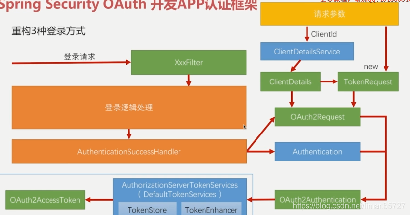
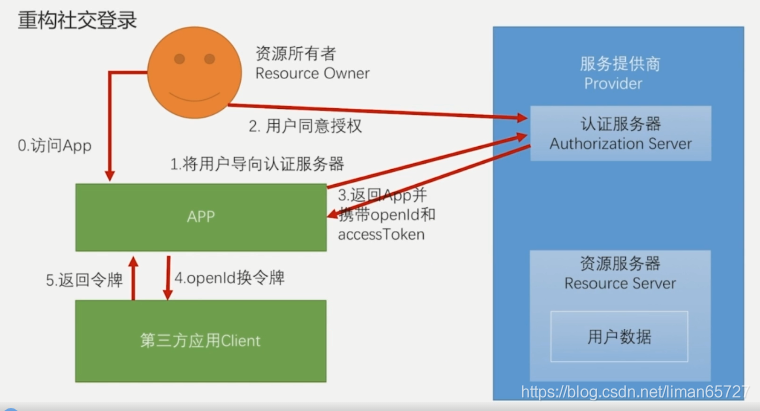
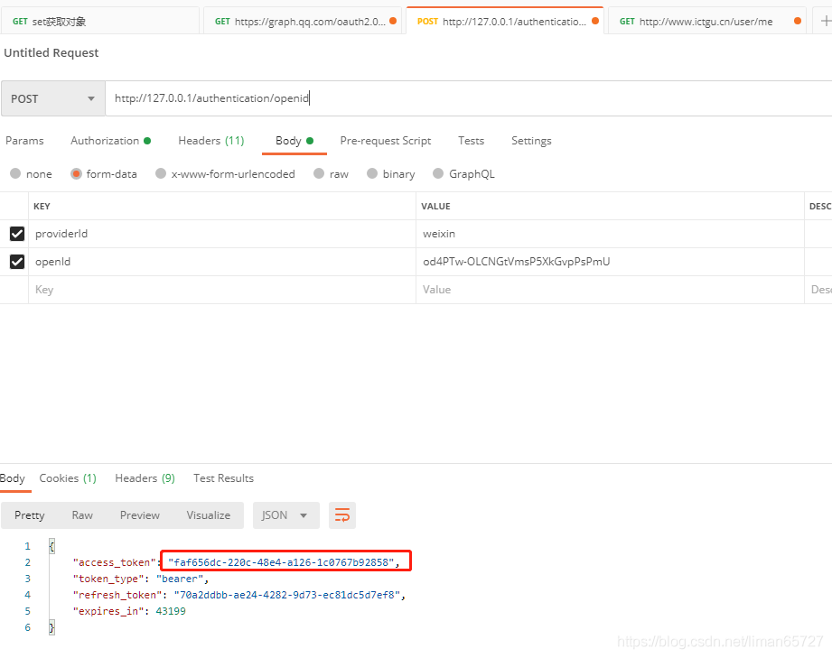
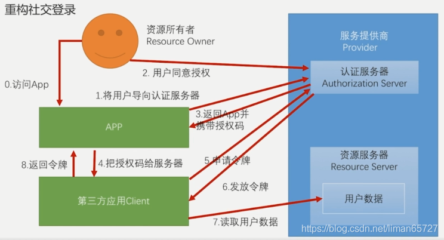

> 本文由 [简悦 SimpRead](http://ksria.com/simpread/) 转码， 原文地址 [blog.csdn.net](https://blog.csdn.net/liman65727/article/details/119493316)

### 文章目录

*   [前言](#_1)
*   [基于 token 的表单登录](#token_5)
*   [基于 token 的短信验证码登录](#token_106)
*   [基于 token 的社交登录](#token_168)
*   *   [简化的 OAuth 的授权改造](#OAuth_172)
    *   *   [测试结果](#_466)
    *   [标准的 OAuth 授权改造](#OAuth_471)
    *   [关于用户的绑定](#_580)
    *   *   [之前的社交登录绑定用户](#_584)
        *   [自定义 providerSignUtils](#providerSignUtils_688)
*   [总结](#_829)

前言
==

上一篇博客简析了一下 spring security oauth 中生成 AccessToken 的[源码](https://so.csdn.net/so/search?q=%E6%BA%90%E7%A0%81&spm=1001.2101.3001.7020)，目的就是为了方便我们将原有的表单登录，短信登录以及社交登录的认证方法，都改造成基于 AccessToken 的认证方式

基于 token 的[表单](https://so.csdn.net/so/search?q=%E8%A1%A8%E5%8D%95&spm=1001.2101.3001.7020)登录
============================================================================================

在简析了 spring security oauth 的源码之后，我们发现，其实有些源码我们并不能用，至少，TokenEndPoint 这个组件，我们就没法用，因为这个组件只会响应`/oauth/token`的请求，而且 spring security oauth 会根据 OAuth 协议中常用的 4 种授权模式去生成令牌，而我们这里是自定义的登录，自然用不上 OAuth 协议中的授权模式，**因此我们改造自定义的登录，只能借鉴其令牌生成方式。**

如果有印象，在前几篇博客中总结过自定义登录成功处理的方式，无论前面登录逻辑如何认证，我们只需要在认证成功之后，自定义生成 AccessToken 即可，因此**我们只需要重新处理我们自定义登录成功的处理方式即可**。

那么如何处理，依旧是一个问题，这就回到了上一篇博客中的内容，构造 AccessToken 需要 OAuth2Request 和 Authentication，其中 Authentication 是登录成功后的认证详情信息，在登录成功处理器中，会有相关参数传递进来。OAuth2Request 由 ClientDeatails 和 TokenRequest 组成，这在上一篇博客中我们已经总结过了，ClientDetails 根据传递参数中的 ClientId 和 clientSecret 等 client 配置信息组成，TokenRequest 则由请求中其他参数实例化而成，具体如下图所示

 
相关改造代码如下

```
/**
 * autor:liman
 * createtime:2021/7/10
 * comment: 自定义登录成功处理器
 */
@Component("selfAuthenticationSuccessHandler")
@Slf4j
public class SelfAuthenticationSuccessHandler extends SimpleUrlAuthenticationSuccessHandler {

    @Autowired
    private SecurityProperties securityProperties;
    @Autowired
    private ObjectMapper objectMapper;
    @Autowired
    private ClientDetailsService clientDetailsService;
    @Autowired
    private AuthorizationServerTokenServices authenticationServerTokenServices;

    @Override
    public void onAuthenticationSuccess(HttpServletRequest request, HttpServletResponse response
            , Authentication authentication) throws IOException, ServletException {

        log.info("自定义登录成功的处理器");

        String header = request.getHeader("Authorization");

        if (header == null || !header.startsWith("Basic ")) {
            throw new UnapprovedClientAuthenticationException("请求头中没有client相关的信息");
        }

        String[] tokens = extractAndDecodeHeader(header, request);
        assert tokens.length == 2;
        String clientId = tokens[0];
        String clientSecret = tokens[1];
        //得到clientDeatils信息
        ClientDetails clientDetails = clientDetailsService.loadClientByClientId(clientId);//得到clientDetails信息

        if (null == clientDetails) {
            throw new UnapprovedClientAuthenticationException("clientid对应的信息不存在" + clientId);
        } else if (!StringUtils.equals(clientSecret, clientDetails.getClientSecret())) {
            throw new UnapprovedClientAuthenticationException("clientSecret信息不匹配" + clientSecret);
        }

        //构建自己的tokenRequest，由于这里不能使用OAuth2中的四种授权模式，因此这里第四个参数设置为"customer"
        //同理，第一个参数主要用于组装并生成Authentication，而这里的Authentication已经通过参数传递进来，因此可以直接赋一个空的Map
        TokenRequest tokenRequest = new TokenRequest(MapUtils.EMPTY_MAP, clientId, clientDetails.getScope(), "customer");

        //构建OAuth2Request
        OAuth2Request oAuth2Request = tokenRequest.createOAuth2Request(clientDetails);
		//构建 OAuth2Authentication
        OAuth2Authentication oAuth2Authentication = new OAuth2Authentication(oAuth2Request, authentication);
		//生成accessToken，这里依旧使用的是spring security oauth中默认的DefaultTokenService
        OAuth2AccessToken accessToken = authenticationServerTokenServices.createAccessToken(oAuth2Authentication);
        response.setContentType("application/json;charset=utf-8");
        response.getWriter().write(objectMapper.writeValueAsString(accessToken));//将authentication作为json写到前端

    }

    /**
     * Decodes the header into a username and password.
     *
     * @throws BadCredentialsException if the Basic header is not present or is not valid
     *                                 Base64
     */
    //TODO:解码请求头中的Base64编码的 appId和AppSecret
    private String[] extractAndDecodeHeader(String header, HttpServletRequest request)
            throws IOException {
		//格式：Basic+空格+Base64加密的appid和AppSecret，所以这里substring(6)
        byte[] base64Token = header.substring(6).getBytes("UTF-8");
        byte[] decoded;
        try {
            decoded = Base64.decode(base64Token);
        } catch (IllegalArgumentException e) {
            throw new BadCredentialsException(
                    "Failed to decode basic authentication token");
        }

        String token = new String(decoded, "UTF-8");

        int delim = token.indexOf(":");

        if (delim == -1) {
            throw new BadCredentialsException("Invalid basic authentication token");
        }
        return new String[]{token.substring(0, delim), token.substring(delim + 1)};
    }
}
```

基于 token 的短信验证码登录
=================

之前提到过，由于基于 token 的认证交互，其实不一定会有 session 会话的概念，如果我们的验证码依旧存于 session 中，则并不能正常校验，**因此在基于 token 的短信验证码登录的重构中，我们唯一要做的，就是将验证码存于 Redis 等缓存中间件中**，验证码的 key 值为 deviceid。

方案比较简单，这里只贴出 Redis 操作验证码的方法

```
/**
 * 基于redis的验证码存取器，避免由于没有session导致无法存取验证码的问题
 */
@Component
public class RedisValidateCodeRepository implements ValidateCodeRepository {

	@Autowired
	private RedisTemplate<Object, Object> redisTemplate;

	/*
	 * (non-Javadoc)
	 */
	@Override
	public void save(ServletWebRequest request, ValidateCode code, ValidateCodeType type) {
		redisTemplate.opsForValue().set(buildKey(request, type), code, 30, TimeUnit.MINUTES);
	}

	/*
	 * (non-Javadoc)
	 */
	@Override
	public ValidateCode get(ServletWebRequest request, ValidateCodeType type) {
		Object value = redisTemplate.opsForValue().get(buildKey(request, type));
		if (value == null) {
			return null;
		}
		return (ValidateCode) value;
	}

	/*
	 * (non-Javadoc)
	 * 
	 */
	@Override
	public void remove(ServletWebRequest request, ValidateCodeType type) {
		redisTemplate.delete(buildKey(request, type));
	}

	/**
	 * @param request
	 * @param type
	 * @return
	 */
	private String buildKey(ServletWebRequest request, ValidateCodeType type) {
		String deviceId = request.getHeader("deviceId");
		if (StringUtils.isBlank(deviceId)) {
			throw new ValidateCodeException("请在请求头中携带deviceId参数");
		}
		return "code:" + type.toString().toLowerCase() + ":" + deviceId;
	}

}
```

基于 token 的社交登录
==============

在调通微信社交登录之后，再进行总结，只是需要明确的是，这里分为两种情况，一种是简化模式，一种是标准的 OAuth2 授权模式（这两种的区别，在 QQ 登录和微信登录流程中有详细的体现）。

简化的 OAuth 的授权改造
---------------

简化的 OAuth 模式，OAuth 协议简化的认证模式，与标准最大的不同，其实就是在获取授权码的时候，顺带将 openId（第三方用户 id）和 accessToken（获取用户信息的令牌），在这种前后端彻底分离的架构中，前三步前端可以通过服务提供商的 SDK 完成 openId 和 AccessToken 的获取。但是并不能根据 openId 作为我们自己登录系统凭证，因此**我们需要提供一个根据 openId 进行登录的方式**这个与之前短信登录方式大同小异



1、OpenIdAuthenticationToken

```
/**
 * autor:liman
 * createtime:2021/8/4
 * comment:OpenIdAuthenticationToken
 */
public class OpenIdAuthenticationToken extends AbstractAuthenticationToken {

    private static final long serialVersionUID = SpringSecurityCoreVersion.SERIAL_VERSION_UID;

    private final Object principal;
    private String providerId;


	/**
		openId，和providerId作为principal
	*/
    public OpenIdAuthenticationToken(String openId, String providerId) {
        super(null);
        this.principal = openId;
        this.providerId = providerId;
        setAuthenticated(false);
    }

    /**
     * This constructor should only be used by <code>AuthenticationManager</code> or
     * <code>AuthenticationProvider</code> implementations that are satisfied with
     * producing a trusted (i.e. {@link #isAuthenticated()} = <code>true</code>)
     * authentication token.
     *
     * @param principal
     * @param credentials
     * @param authorities
     */
    public OpenIdAuthenticationToken(Object principal,
                                     Collection<? extends GrantedAuthority> authorities) {
        super(authorities);
        this.principal = principal;
        super.setAuthenticated(true); // must use super, as we override
    }

    public Object getCredentials() {
        return null;
    }

    public Object getPrincipal() {
        return this.principal;
    }

    public String getProviderId() {
        return providerId;
    }

    public void setAuthenticated(boolean isAuthenticated) throws IllegalArgumentException {
        if (isAuthenticated) {
            throw new IllegalArgumentException(
                    "Cannot set this token to trusted - use constructor which takes a GrantedAuthority list instead");
        }

        super.setAuthenticated(false);
    }

    @Override
    public void eraseCredentials() {
        super.eraseCredentials();
    }
}
```

2、OpenIdAuthenticationFilter

```
/**
 * autor:liman
 * createtime:2021/8/4
 * comment:基于openId登录的过滤器
 */
@Slf4j
public class OpenIdAuthenticationFilter extends AbstractAuthenticationProcessingFilter {


    private String openIdParameter = "openId";
    private String providerIdParameter = "providerId";
    private boolean postOnly = true;

    public OpenIdAuthenticationFilter() {
        super(new AntPathRequestMatcher("/authentication/openid", "POST"));
    }

    public Authentication attemptAuthentication(HttpServletRequest request, HttpServletResponse response)
            throws AuthenticationException {
        if (postOnly && !request.getMethod().equals("POST")) {
            throw new AuthenticationServiceException("Authentication method not supported: " + request.getMethod());
        }
		//获取请求中的openId和providerId
        String openid = obtainOpenId(request);
        String providerId = obtainProviderId(request);

        if (openid == null) {
            openid = "";
        }
        if (providerId == null) {
            providerId = "";
        }

        openid = openid.trim();
        providerId = providerId.trim();
		//构造OpenIdAuthenticationToken
        OpenIdAuthenticationToken authRequest = new OpenIdAuthenticationToken(openid, providerId);

        // Allow subclasses to set the "details" property
        setDetails(request, authRequest);
		//交给AuthenticationManager进行认证
        return this.getAuthenticationManager().authenticate(authRequest);
    }


    /**
     * 获取openId
     */
    protected String obtainOpenId(HttpServletRequest request) {
        return request.getParameter(openIdParameter);
    }

    /**
     * 获取提供商id
     */
    protected String obtainProviderId(HttpServletRequest request) {
        return request.getParameter(providerIdParameter);
    }

    protected void setDetails(HttpServletRequest request, OpenIdAuthenticationToken authRequest) {
        authRequest.setDetails(authenticationDetailsSource.buildDetails(request));
    }

    public void setOpenIdParameter(String openIdParameter) {
        Assert.hasText(openIdParameter, "Username parameter must not be empty or null");
        this.openIdParameter = openIdParameter;
    }

    public void setPostOnly(boolean postOnly) {
        this.postOnly = postOnly;
    }

    public final String getOpenIdParameter() {
        return openIdParameter;
    }

    public String getProviderIdParameter() {
        return providerIdParameter;
    }

    public void setProviderIdParameter(String providerIdParameter) {
        this.providerIdParameter = providerIdParameter;
    }
}
```

3、OpenIdAuthenticationProvider

```
/**
 * 
 */
package com.learn.springsecurity.app.social.openid;
/**
 * @author zhailiang
 *
 */
public class OpenIdAuthenticationProvider implements AuthenticationProvider {

	private SocialUserDetailsService userDetailsService;

	private UsersConnectionRepository usersConnectionRepository;

	/*
	 * (non-Javadoc)
	 * 
	 * @see org.springframework.security.authentication.AuthenticationProvider#
	 * authenticate(org.springframework.security.core.Authentication)
	 */
	@Override
	public Authentication authenticate(Authentication authentication) throws AuthenticationException {

		OpenIdAuthenticationToken authenticationToken = (OpenIdAuthenticationToken) authentication;
		
		Set<String> providerUserIds = new HashSet<>();
		providerUserIds.add((String) authenticationToken.getPrincipal());
		//之前社交登录中介绍的usersConnectionRepository，从user_connection表中根据providerId和openId查询用户id
		Set<String> userIds = usersConnectionRepository.findUserIdsConnectedTo(authenticationToken.getProviderId(), providerUserIds);
		
		if(CollectionUtils.isEmpty(userIds) || userIds.size() != 1) {
			throw new InternalAuthenticationServiceException("无法获取用户信息");
		}
		
		//获取到userId了
		String userId = userIds.iterator().next();
		
		//利用UserDetailsService根据userId查询用户信息
		UserDetails user = userDetailsService.loadUserByUserId(userId);

		if (user == null) {
			throw new InternalAuthenticationServiceException("无法获取用户信息");
		}
		
		OpenIdAuthenticationToken authenticationResult = new OpenIdAuthenticationToken(user, user.getAuthorities());
		
		authenticationResult.setDetails(authenticationToken.getDetails());

		return authenticationResult;
	}

	/*
	 * (non-Javadoc)
	 * 
	 * @see org.springframework.security.authentication.AuthenticationProvider#
	 * supports(java.lang.Class)
	 */
	@Override
	public boolean supports(Class<?> authentication) {
		return OpenIdAuthenticationToken.class.isAssignableFrom(authentication);
	}

	public SocialUserDetailsService getUserDetailsService() {
		return userDetailsService;
	}

	public void setUserDetailsService(SocialUserDetailsService userDetailsService) {
		this.userDetailsService = userDetailsService;
	}

	public UsersConnectionRepository getUsersConnectionRepository() {
		return usersConnectionRepository;
	}

	public void setUsersConnectionRepository(UsersConnectionRepository usersConnectionRepository) {
		this.usersConnectionRepository = usersConnectionRepository;
	}

}
```

4、配置类

```
/**
 * @author zhailiang
 *
 */
@Component
public class OpenIdAuthenticationSecurityConfig extends SecurityConfigurerAdapter<DefaultSecurityFilterChain, HttpSecurity> {
	
	@Autowired
	private AuthenticationSuccessHandler selfAuthenticationSuccessHandler;
	
	@Autowired
	private AuthenticationFailureHandler selfAuthenticationFailureHandler;
	
	@Autowired
	private SocialUserDetailsService userDetailsService;
	
	@Autowired
	private UsersConnectionRepository usersConnectionRepository;
	
	@Override
	public void configure(HttpSecurity http) throws Exception {
		
		OpenIdAuthenticationFilter OpenIdAuthenticationFilter = new OpenIdAuthenticationFilter();
		OpenIdAuthenticationFilter.setAuthenticationManager(http.getSharedObject(AuthenticationManager.class));
		OpenIdAuthenticationFilter.setAuthenticationSuccessHandler(selfAuthenticationSuccessHandler);
		OpenIdAuthenticationFilter.setAuthenticationFailureHandler(selfAuthenticationFailureHandler);
		
		OpenIdAuthenticationProvider OpenIdAuthenticationProvider = new OpenIdAuthenticationProvider();
		OpenIdAuthenticationProvider.setUserDetailsService(userDetailsService);
		OpenIdAuthenticationProvider.setUsersConnectionRepository(usersConnectionRepository);
		
		http.authenticationProvider(OpenIdAuthenticationProvider)
			.addFilterAfter(OpenIdAuthenticationFilter, UsernamePasswordAuthenticationFilter.class);
		
	}

}
```

### 测试结果



标准的 OAuth 授权改造
--------------

标准的 OAuth 模式



针对标准的授权模式，我们并不需要做多少改动，因为在社交登录那一节中我们已经做了相关开发，只是需要说明的是，只是在 spring-social 的过滤器——`SocialAuthenticationFilter`中，在正常社交登录流程完成之后会默认跳转到某个页面，而这个并不适用于前后端分离的项目，因此要针对这个问题定制化解决。这需要回到之前`SocialAuthenticationFilter`加入到认证过滤器链上的代码。之前我们说过社交登录的过滤器链不需要我们手动配置，只需要初始化 SpringSocialConfiguer 的时候，会自动加入到社交登录的认证过滤器链上

```
@Configuration
@EnableSocial
public class SocialConfig extends SocialConfigurerAdapter {
	@Bean
	public SpringSocialConfigurer selfSocialSecurityConfig(){ 
		SpringSocialConfigurer selfSpringSocialConfig = new SpringSocialConfigurer();
		return selfSpringSocialConfig;
	}
}
```

我们只需要改变`SocialAuthenticationFilter`的默认处理即可，因此我们给他加一个后置处理器，但是这个后置处理器是在 SpringSocialConfigurer 的 postProcess 函数中进行处理

```
/**
 * autor:liman
 * createtime:2021/7/15
 * comment:自定义的springsocial配置类
 */
public class SelfSpringSocialConfig extends SpringSocialConfigurer {

    private String processFilterUrl;

    @Autowired(required = false)
    private ConnectionSignUp connectionSignUp;

    @Autowired(required = false)
    private SocialAuthenticationFilterPostProcessor socialAuthenticationFilterPostProcessor;

    public SelfSpringSocialConfig(String processFilterUrl) {
        this.processFilterUrl = processFilterUrl;
    }

    @Override
    protected <T> T postProcess(T object) {
        SocialAuthenticationFilter socialAuthenticationFilter = (SocialAuthenticationFilter) super.postProcess(object);
        socialAuthenticationFilter.setFilterProcessesUrl(processFilterUrl);
        if(null!=socialAuthenticationFilterPostProcessor){
            socialAuthenticationFilterPostProcessor.process(socialAuthenticationFilter);
        }
        return (T) socialAuthenticationFilter;
    }

    public ConnectionSignUp getConnectionSignUp() {
        return connectionSignUp;
    }

    public void setConnectionSignUp(ConnectionSignUp connectionSignUp) {
        this.connectionSignUp = connectionSignUp;
    }

    public SocialAuthenticationFilterPostProcessor getSocialAuthenticationFilterPostProcessor() {
        return socialAuthenticationFilterPostProcessor;
    }

    public void setSocialAuthenticationFilterPostProcessor(SocialAuthenticationFilterPostProcessor socialAuthenticationFilterPostProcessor) {
        this.socialAuthenticationFilterPostProcessor = socialAuthenticationFilterPostProcessor;
    }
}

//将我们自定义的 SpringSocialConfigurer交给spring托管
@Configuration
@EnableSocial
public class SocialConfig extends SocialConfigurerAdapter {
    @Bean
    public SpringSocialConfigurer selfSocialSecurityConfig(){
        String processFilterUrl = securityProperties.getSocial().getProcessFilterUrl();
        SelfSpringSocialConfig selfSpringSocialConfig = new SelfSpringSocialConfig(processFilterUrl);

        //指定第三方用户信息认证不存在的注册页
        selfSpringSocialConfig.signupUrl(securityProperties.getBrowser().getSiguUpPage());
        selfSpringSocialConfig.setConnectionSignUp(connectionSignUp);
        selfSpringSocialConfig.setSocialAuthenticationFilterPostProcessor(socialAuthenticationFilterPostProcessor);
        return selfSpringSocialConfig;
    }
}
```

我们自定义的过滤器后置处理器如下

```
/**
 * autor:liman
 * createtime:2021/8/7
 * comment:APP社交登录认证后置处理器
 */
@Component
public class AppSocialAuthenticationFilterPostProcessor implements SocialAuthenticationFilterPostProcessor {

    @Autowired
    private AuthenticationSuccessHandler selfAuthenticationSuccessHandler;

    @Override
    public void process(SocialAuthenticationFilter socialAuthenticationFilter) {
        socialAuthenticationFilter.setAuthenticationSuccessHandler(selfAuthenticationSuccessHandler);
    }
}
```

关于用户的绑定
-------

这里需要总结一下之前的社交登录中用户注册绑定的操作。

### 之前的社交登录绑定用户

在之前的社交登录中，如果 spring social 发现用户是第一次登录，则会跳转到相关的页面，这个页面我们其实也可以自己定义并配置

```
@Configuration
@EnableSocial
public class SocialConfig extends SocialConfigurerAdapter {
    @Bean
    public SpringSocialConfigurer selfSocialSecurityConfig(){
        String processFilterUrl = securityProperties.getSocial().getProcessFilterUrl();
        SelfSpringSocialConfig selfSpringSocialConfig = new SelfSpringSocialConfig(processFilterUrl);

        //指定第三方用户信息认证不存在的注册页
        selfSpringSocialConfig.signupUrl(securityProperties.getBrowser().getSiguUpPage());
        selfSpringSocialConfig.setConnectionSignUp(connectionSignUp);
        selfSpringSocialConfig.setSocialAuthenticationFilterPostProcessor(socialAuthenticationFilterPostProcessor);
        return selfSpringSocialConfig;
    }
    
    @Bean
public ProviderSignInUtils providerSignInUtils(ConnectionFactoryLocator connectionFactoryLocator){
    return new ProviderSignInUtils(connectionFactoryLocator,
            getUsersConnectionRepository(connectionFactoryLocator));
}
}
```

我们配置的代码中，可以自定义页面路径，我们自定义页面如下（一个简单的登录绑定页面）

```
<!DOCTYPE html>
<html>
<head>
<meta charset="UTF-8">
<title>登录</title>
</head>
<body>
	<h2>Demo注册页</h2>
	
	<form action="user/regist" method="post">
		<table>
			<tr>
				<td>用户名:</td> 
				<td><input type="text" ></td>
			</tr>
			<tr>
				<td>密码:</td>
				<td><input type="password" ></td>
			</tr>
			<tr>
				<td colspan="2">
					<button type="submit" >注册</button>
					<button type="submit" >绑定</button>
				</td>
			</tr>
		</table>
	</form>
</body>
</html>
```

在用户第一次跳转到这个页面的用户选择注册，或者绑定，都会请求 / user/register 接口，这个接口借助 providerSignInUtils 完成会话中的用户数据更新

```
@Autowired
private ProviderSignInUtils providerSignInUtils;

@PostMapping("/register")
public void userRegister(@RequestBody User user, HttpServletRequest request) {

    //利用providerSignInUtils，将注册之后的用户信息，关联到会话中
    providerSignInUtils.doPostSignUp(user.getId(),new ServletWebRequest(request));

}
```

在跳转之前，spring social 已经帮我们将用户信息存入会话（在`SocialAuthenticationFilter`中可以看到相关代码）

```
//以下代码位于：org.springframework.social.security.SocialAuthenticationFilter#doAuthentication
private Authentication doAuthentication(SocialAuthenticationService<?> authService, HttpServletRequest request, SocialAuthenticationToken token) {
	try {
		if (!authService.getConnectionCardinality().isAuthenticatePossible()) return null;
		token.setDetails(authenticationDetailsSource.buildDetails(request));
		Authentication success = getAuthenticationManager().authenticate(token);
		Assert.isInstanceOf(SocialUserDetails.class, success.getPrincipal(), "unexpected principle type");
		updateConnections(authService, token, success);			
		return success;
	} catch (BadCredentialsException e) {
		// connection unknown, register new user?
		if (signupUrl != null) {
			//这里就是将社交用户信息存入会话
			// store ConnectionData in session and redirect to register page
			sessionStrategy.setAttribute(new ServletWebRequest(request), ProviderSignInAttempt.SESSION_ATTRIBUTE, new ProviderSignInAttempt(token.getConnection()));
			throw new SocialAuthenticationRedirectException(buildSignupUrl(request));
		}
		throw e;
	}
}
```

**但是基于前后端分离，且并没有会话对象交互的系统，这种方式并不适用，因为并不存在会话，如何处理，需要用其他方案**，其实我们可以在验证码登录的改造中受到启发，将用户数据存入会话即可，我们自定义实现一个`providerSignInUtils`将用户信息存入 Redis 即可。

### 自定义 providerSignUtils

1、将第三方用户数据存入 Redis 的工具类

```
/**
 * autor:liman
 * createtime:2021/8/7
 * comment:app端用户信息存入Redis的工具类
 */
@Component
public class AppSignUpUtils {

    public static final String SOCIAL_REDIS_USER_PREFIX = "self:security:social:connectionData";

    @Autowired
    private RedisTemplate<Object, Object> redisTemplate;
    @Autowired
    private UsersConnectionRepository usersConnectionRepository;
    @Autowired
    private ConnectionFactoryLocator connectionFactoryLocator;

    public void saveConnectionData(WebRequest webRequest, ConnectionData connectionData) {
        redisTemplate.opsForValue().set(getKey(webRequest), connectionData, 10, TimeUnit.MINUTES);
    }

    /**
     * 将用户与数据库中的信息进行绑定
     * @param request
     * @param userId
     */
    public void doPostSignUp(WebRequest request,String userId){
        String key = getKey(request);
        if(!redisTemplate.hasKey(key)){
            throw new RuntimeException("无法找到缓存的用户社交账号信息");
        }
        ConnectionData connectionData = (ConnectionData) redisTemplate.opsForValue().get(key);

        //根据ConnectionData实例化创建一个Connection
        Connection<?> connection = connectionFactoryLocator.getConnectionFactory(connectionData.getProviderId())
                .createConnection(connectionData);
       //将数据库中的用户与Redis中的用户信息关联
        usersConnectionRepository.createConnectionRepository(userId).addConnection(connection);
    }

    /**
     * 获取设备id作为key
     *
     * @param webRequest
     * @return
     */
    public String getKey(WebRequest webRequest) {
        String deviceId = webRequest.getHeader("deviceId");
        if (StringUtils.isBlank(deviceId)) {
            throw new RuntimeException("设备id不能为空");
        }
        return SOCIAL_REDIS_USER_PREFIX + deviceId;
    }
}
```

2、复写掉原来的配置类

为了避免对原有代码的侵入性处理，这里我们需要自定义一个实现`BeanPostProcessor`接口的类

```
/**
 * autor:liman
 * createtime:2021/8/7
 * comment:由于app端的社交用户绑定，不能采用跳转，也不能操作会话，需要用自定义的providerSignUpUtils工具类
 * 因此需要定义一个后置处理器，针对SpringSocialConfigurer进行一些后置处理
 */
@Component
public class AppSpringSocialConfigurerPostProcessor implements BeanPostProcessor {
    @Override
    public Object postProcessBeforeInitialization(Object bean, String beanName) throws BeansException {
        return null;
    }

    @Override
    public Object postProcessAfterInitialization(Object bean, String beanName) throws BeansException {

        if(StringUtils.equals(beanName,"selfSocialSecurityConfig")){
            SelfSpringSocialConfig configurer = (SelfSpringSocialConfig) bean;
            //复写掉原有的SelfSpringSocialConfig的signupUrl
            configurer.signupUrl("/app/social/signup");
            return configurer;
        }
        return bean;
    }
}
```

针对上述的请求路径，我们也要写一个对应路径的 controller 处理方法

```
@RestController
@Slf4j
public class AppSecurityController {

    @Autowired
    private ProviderSignInUtils providerSignInUtils;
    @Autowired
    private AppSignUpUtils appSignUpUtils;

    @GetMapping("/app/social/signup")
    @ResponseStatus(HttpStatus.UNAUTHORIZED)
    public BaseResponse getSocialUserInfo(HttpServletRequest request){
        BaseResponse result = new BaseResponse(StatusCode.Success);
        log.info("【app模式】开始获取会话中的第三方用户信息");
        //先从其中拿出数据，毕竟这个时候还没有完全跳转，下一个会话，就没有该数据了
        Connection<?> connectionFromSession = providerSignInUtils.getConnectionFromSession(new ServletWebRequest(request));
        SocialUserInfo socialUserInfo = new SocialUserInfo();
        socialUserInfo.setProviderId(connectionFromSession.getKey().getProviderId());
        socialUserInfo.setProviderUserId(connectionFromSession.getKey().getProviderUserId());
        socialUserInfo.setNickName(connectionFromSession.getDisplayName());
        socialUserInfo.setHeadImg(connectionFromSession.getImageUrl());

        //转存到自己的工具类中
        appSignUpUtils.saveConnectionData(new ServletWebRequest(request),connectionFromSession.createData());
        result.setData(socialUserInfo);
        return result;
    }

}
```

对于用户注册的接口也需要做调整

```
@PostMapping("/register")
public void userRegister(@RequestBody User user, HttpServletRequest request) {

    //如果是浏览器的应用利用providerSignInUtils，将注册之后的用户信息，关联到会话中
    providerSignInUtils.doPostSignUp(user.getId(),new ServletWebRequest(request));
	//如果是app的应用，则利用appSignUpUtils 将注册之后的用户信息，关联到会话中
    appSignUpUtils.doPostSignUp(new ServletWebRequest(request),user.getId());

}
```

总结
==

总结了基于 token 认证的三种登录方式，最为复杂的为社交登录方式