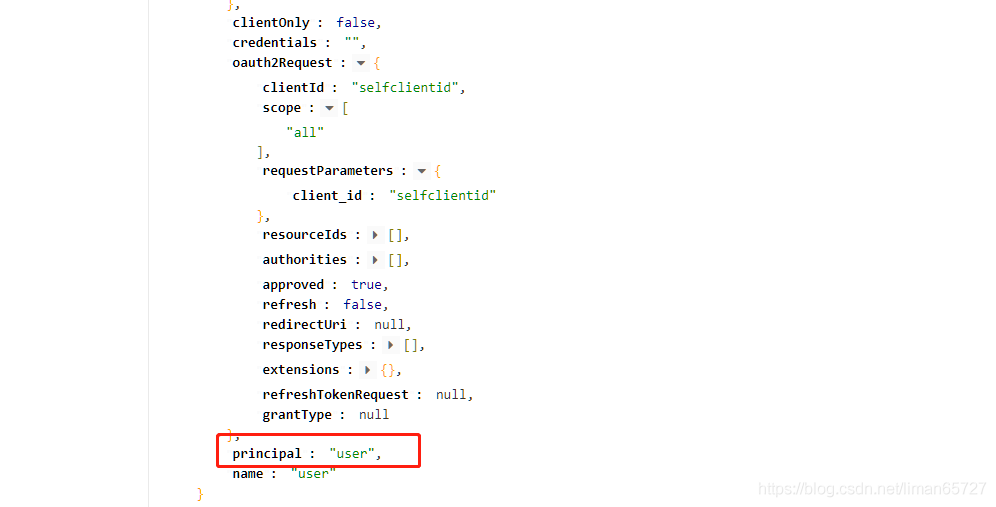

> 本文由 [简悦 SimpRead](http://ksria.com/simpread/) 转码， 原文地址 [blog.csdn.net](https://blog.csdn.net/liman65727/article/details/119716878)

### 文章目录

*   [前言](#_1)
*   [自定义 token 基本参数配置](#token_24)
*   *   [针对 endpoint 的配置](#endpoint_64)
    *   [针对客户端的配置](#_83)
    *   [针对令牌持久化的配置](#_139)
*   [什么是 JWT](#JWT_200)
*   [自定义 JWT 生成 token](#JWTtoken_211)
*   *   [1、JWT 生成的配置](#1JWT_215)
    *   [2、根据 JWT 获取用户信息](#2JWT_267)
    *   [JWT 中加入自定义扩展信息](#JWT_290)
*   [总结](#_449)

前言
==

上一篇博客总结了各种登录方式，是如何嫁接到 token 的认证方式上的。这篇博客会总结如何生成自定义的 token，并总结一下如何通过 JWT 实现[单点登录](https://so.csdn.net/so/search?q=%E5%8D%95%E7%82%B9%E7%99%BB%E5%BD%95&spm=1001.2101.3001.7020)（SSO）

在 spring security oauth 中生成 token 的源码如下

```
//以下源码位于：org.springframework.security.oauth2.provider.token.DefaultTokenServices#createAccessToken(org.springframework.security.oauth2.provider.OAuth2Authentication, org.springframework.security.oauth2.common.OAuth2RefreshToken)
private OAuth2AccessToken createAccessToken(OAuth2Authentication authentication, OAuth2RefreshToken refreshToken) {
	DefaultOAuth2AccessToken token = new DefaultOAuth2AccessToken(UUID.randomUUID().toString());
	int validitySeconds = getAccessTokenValiditySeconds(authentication.getOAuth2Request());
	if (validitySeconds > 0) {
		token.setExpiration(new Date(System.currentTimeMillis() + (validitySeconds * 1000L)));
	}
	token.setRefreshToken(refreshToken);
	token.setScope(authentication.getOAuth2Request().getScope());

	return accessTokenEnhancer != null ? accessTokenEnhancer.enhance(token, authentication) : token;
}
```

可以看到，spring security oauth 默认生成 token，就是一串没有意义的 UUID

自定义 token 基本参数配置
================

由于上篇博客中提到，token 的生成是基于认证服务器，因此我们如果需要实现自定义 token，则需要改造我们的认证服务器的代码，我们在 [spring security oauth 入门](https://blog.csdn.net/liman65727/article/details/119085780)，这篇博客中，总结过 OAuth 认证服务器和资源服务器的概念，已经只需要通过两个注解，就可以完成认证服务器和资源服务器的标记。这些 spring security oauth 都为我们封装的很好了。我们自定义 token，自然需要在认证服务器的代码中做相应的配置，相关的配置也并不复杂。

只需要继承`AuthorizationServerConfigurerAdapter`，其中有三个方法

```
@Configuration
@EnableAuthorizationServer
public class AppAuthorizationServerConfig extends AuthorizationServerConfigurerAdapter {

    /**
     配置安全性相关的内容，暂时用不到
    */
    @Override
    public void configure(AuthorizationServerSecurityConfigurer security) throws Exception {
        super.configure(security);
    }

    /**
     * 要给那些客户端发送appid和Appsecret，通过配置指定
     * @param clients
     * @throws Exception
     */
    @Override
    public void configure(ClientDetailsServiceConfigurer clients) throws Exception {


    }

    /**
    配置endpoints的内容，一个EndPoint可简单理解为Controller（TokenEndPoint是用于处理/oauth/token等响应的controller）
    */
    @Override
    public void configure(AuthorizationServerEndpointsConfigurer endpoints) throws Exception {

    }
}
```

针对 endpoint 的配置
---------------

endpoint 是 oauth 认证的入口，针对 endpoint 我们可以配置 token 的存储，可自定义认证逻辑，这里和之前一样，可以注入`AuthenticationManager`和`UserDetailsService`的实现

```
@Autowired
private AuthenticationManager authenticationManager;

@Autowired
private UserDetailsService userDetailsService;

@Override
public void configure(AuthorizationServerEndpointsConfigurer endpoints) throws Exception {
    endpoints
            .userDetailsService(userDetailsService)
            .authenticationManager(authenticationManager);
}
```

针对客户端的配置
--------

如果我们想通过配置，只是针对指定的客户端发放令牌，则我们需要在 clients 的配置方法中进行配置

```
@Data
public class OAuth2ClientProperties {

    private String clientId;

    private String clientSecret;

    private int accessTokenValidSeconds;

    private String grantTypes;
}

/**
 * 要给那些客户端发送appid和Appsecret，通过配置指定
 * @param clients
 * @throws Exception
 */
@Override
public void configure(ClientDetailsServiceConfigurer clients) throws Exception {

    InMemoryClientDetailsServiceBuilder builder = clients.inMemory();
    OAuth2ClientProperties[] clientArrays = securityProperties.getOauth2().getClients();

    if(ArrayUtils.isNotEmpty(clientArrays)){
        for(OAuth2ClientProperties oauth2ClientConfig:clientArrays){
            //读取配置中配置的可支持的授权模式，
            String[] grantTypes = oauth2ClientConfig.getGrantTypes().split(",");
            builder.withClient(oauth2ClientConfig.getClientId())//配置clientId
                    .secret(oauth2ClientConfig.getClientSecret())//配置clientSecret
                    .accessTokenValiditySeconds(oauth2ClientConfig.getAccessTokenValidSeconds())//配置令牌过期时间
                    .authorizedGrantTypes(grantTypes)
                    .scopes("all","read","write");//授权范围
        }
    }
}
```

由于为了简单，这里采用的是将 client 的相关配置信息存于内存中，如果要存于数据库中，则需要指定数据源即可。同时这里我们的配置支持多个 client 信息的配置

```
##自定义令牌配置
self.security.core.oauth2.clients[0].clientId=selfclientid
self.security.core.oauth2.clients[0].clientSecret=selfclientsecret
self.security.core.oauth2.clients[0].accessTokenValidSeconds=7200
self.security.core.oauth2.clients[0].grantTypes=refresh_token,password,authorization_code
##令牌有效期如果为0，表示不会过期
self.security.core.oauth2.clients[1].clientId=newclientid
self.security.core.oauth2.clients[1].clientSecret=newclientsecret
self.security.core.oauth2.clients[1].grantTypes=refresh_token,password
```

针对令牌持久化的配置
----------

没有指定 endpoint 中令牌的相关配置，则令牌（token）默认存于数据库中，系统重启之后令牌就会失效。可以针对令牌做一个持久化的操作，一般由于令牌访问较为频繁，不推荐将令牌存于数据库中，推荐将令牌存于 Redis 一类的非关系型数据库中，便于访问。

自定义的`TokenStoreConfig`

```
/**
 * autor:liman
 * createtime:2021/8/15
 * comment:令牌存储的配置
 */
@Configuration
public class TokenStoreConfig {

    @Autowired
    private RedisConnectionFactory redisConnectionFactory;

    @Bean
    public TokenStore redisTokenStore(){
        return new RedisTokenStore(redisConnectionFactory);
    }
}
```

在 endpoint 的配置中，配置 Redis 的存储方式

```
/**
 * autor:liman
 * createtime:2021/7/22
 * comment: app的认证服务器配置类
 *
 * http://www.ictgu.cn/oauth/authorize?response_type=code&client_id=selfclientid&redirect_uri=http://example.com&scope=all
 * 这里包含服务端token生成规则的配置
 */
@Configuration
@EnableAuthorizationServer
public class AppAuthorizationServerConfig extends AuthorizationServerConfigurerAdapter {

    @Autowired
    private AuthenticationManager authenticationManager;

    @Autowired
    private UserDetailsService userDetailsService;

    @Autowired
    private TokenStore redisTokenStore;

    @Override
    public void configure(AuthorizationServerEndpointsConfigurer endpoints) throws Exception {
        endpoints
                .tokenStore(redisTokenStore)//将token存入到redis
                .userDetailsService(userDetailsService)
                .authenticationManager(authenticationManager);
    }
}
```

在梳理了一些基本配置项之后，我们就可以用我们自定义的 token 生成方式，替换掉 spring security oauth 中默认的 token 生成方式。

什么是 JWT
=======

这个不做具体介绍，网上百度很多，这里推荐一个博客——[JWT 简介](http://www.ruanyifeng.com/blog/2018/07/json_web_token-tutorial.html)。JWT 最重要的一个特性就是自包含，意味着本身生成的 JWT，其实就可以存储相关用户信息（当然不是重要的用户信息）

只是需要知道的是 JWT 分为如下三个部分


且都为明文传输，最重要的是签名部分，可以简单理解为：SIGNATURE =encode（HEADER+PAYLOAD）; 加密密钥只有具备签发 token 的服务端才有，且这个密钥不可泄漏。同时加密方式在 HEADER 中会指明。同时 PAYLOAD 部分其实可以指定我们自己需要存放的信息。JWT 只能解决认证的问题，无法完全解决完全性的问题

自定义 JWT 生成 token
================

其实 spring security oauth 也默认为我们集成了相关组件，我们只需要调用即可。为了与之前的 Redis 存储 token 的实例冲突，这里采用了`@ConditionalOnProperty`注解，用于根据相关的配置属性值，完成指定的 bean 生成与注入。

1、JWT 生成的配置
-----------

```
/**
 * autor:liman
 * createtime:2021/8/9
 * comment: token存储的配置
 */
@Configuration
public class TokenStoreConfig {

    @Autowired
    private RedisConnectionFactory redisConnectionFactory;

    @Bean
    //如果是存在self.security.core.oauth2.storeType的配置项，且该配置的值为 redis，如下配置才会生效，matchIfMissing=false 表示如果没有这个配置项，这个不生效
    @ConditionalOnProperty(prefix = "self.security.core.oauth2",)
    public TokenStore redisTokenStore(){
        return new RedisTokenStore(redisConnectionFactory);
    }

    @Configuration
    //如果是存在self.security.core.oauth2.storeType的配置项，且该配置的值为jwt，如下配置才会生效，matchIfMissing=true表示如果没有这个配置项，这个也生效
    @ConditionalOnProperty(prefix = "self.security.core.oauth2",,matchIfMissing = true)
    public static class JwtTokenStoreConfig{

        @Autowired
        private SecurityProperties securityProperties;

        //由于JWT本身可以存储用户信息，因此JWT有自己的tokenStore
        @Bean
        public TokenStore tokenStore(){
            //构造JwtTokenStore需要一个JwtAccessTokenConverter
            return new JwtTokenStore(jwtAccessTokenConverter());
        }

        //JwtAccessTokenConverter中指定签名密钥的配置
        @Bean
        public JwtAccessTokenConverter jwtAccessTokenConverter(){
            JwtAccessTokenConverter accessTokenConverter = new JwtAccessTokenConverter();
            String signKey = "self-security-jwt-key";
            accessTokenConverter.setSigningKey(signKey);//设置生成签名的密钥
            return accessTokenConverter;
        }
    }
}
```

完成之后，相关接口的返回结果，下图以密码授权登录为例，获得的 token

[外链图片转存失败, 源站可能有防盗链机制, 建议将图片保存下来直接上传 (img-I741rqCH-1629020239028)(E:\blogPic\spring-security-learn\image-20210815164441515.png)]

2、根据 JWT 获取用户信息
---------------

获取用户信息的接口如下：

```
//Oauth获取用户信息的方法
@GetMapping("/me")
public Object getCurrentUser(Authentication user){
    log.info("user me test");
    return user;
}
```

请求头为：


返回结果比较多，但是需要注意的是，这里是直接返回了 spring security 中为我们封装的 Authentication 信息，这个信息中的 principal 并不是完成的用户信息，spring security 的默认实现是将 JWT 中本身包含的用户信息做了一个适配，在这里的时候，返回的 Authentication 中的 principal 信息就是一个简单的字符串：



JWT 中加入自定义扩展信息
--------------

这一步需要之前提到的`TokenEnhance`

1、自定义实现 TokenEnhancer 接口

```
/**
 * autor:liman
 * createtime:2021/8/11
 * comment:自定义token的enhancer，用于JWT中生成扩展信息
 */
public class SelfJwtTokenEnhancer implements TokenEnhancer {
    @Override
    public OAuth2AccessToken enhance(OAuth2AccessToken accessToken, OAuth2Authentication authentication) {

        Map<String,Object> info = new HashMap<String,Object>();
        info.put("self_extention_info","这个是JWT的扩展信息");

        //扩展信息放入accessToken中
        ((DefaultOAuth2AccessToken)accessToken).setAdditionalInformation(info);
        return accessToken;
    }
}
```

2、配置中加入自定义的 tokenEnhancer

```
@Configuration
//如果是存在self.security.core.oauth2.storeType的配置项，且该配置的值为jwt，如下配置才会生效，matchIfMissing=true表示如果没有这个配置项，这个也生效
@ConditionalOnProperty(prefix = "self.security.core.oauth2",,matchIfMissing = true)
public static class JwtTokenStoreConfig{

    @Autowired
    private SecurityProperties securityProperties;

    @Bean
    public TokenStore tokenStore(){
        return new JwtTokenStore(jwtAccessTokenConverter());
    }

    @Bean
    public JwtAccessTokenConverter jwtAccessTokenConverter(){
        JwtAccessTokenConverter accessTokenConverter = new JwtAccessTokenConverter();
        String signKey = securityProperties.getOauth2().getJwtSigninKey();
        accessTokenConverter.setSigningKey(signKey);//设置生成签名的密钥
        return accessTokenConverter;
    }

    @Bean
    @ConditionalOnMissingBean(name = "jwtTokenEnhancer")//没有配置jwtTokenEnhancer，则会提供一个默认的实现
    public TokenEnhancer jwtTokenEnhancer(){
        return new SelfJwtTokenEnhancer();
    }
}
```

3、资源服务器中完成配置并注入

```
/**
 * autor:liman
 * createtime:2021/7/22
 * comment: app的认证服务器配置类
 * <p>
 * http://www.ictgu.cn/oauth/authorize?response_type=code&client_id=selfclientid&redirect_uri=http://example.com&scope=all
 * 这里包含服务端token生成规则的配置
 */
@Configuration
@EnableAuthorizationServer
public class AppAuthorizationServerConfig extends AuthorizationServerConfigurerAdapter {

    @Autowired
    private AuthenticationManager authenticationManager;

    @Autowired
    private UserDetailsService userDetailsService;

    @Autowired
    private TokenStore tokenStore;

    @Autowired
    private SecurityProperties securityProperties;

    @Autowired(required = false)
    private JwtAccessTokenConverter jwtAccessTokenConverter;

    @Autowired(required = false)
    private TokenEnhancer jwtTokenEnhancer;


    @Override
    public void configure(AuthorizationServerEndpointsConfigurer endpoints) throws Exception {
        endpoints
                .tokenStore(tokenStore)//将token存入到redis
                .userDetailsService(userDetailsService)
                .authenticationManager(authenticationManager);
        
        //判断是否指定jwtAccessTokenConverter和jwtTokenEnhancer
        if (null != jwtAccessTokenConverter && null != jwtTokenEnhancer) {
            //如果指定了，需要以TokenEnhancerChain的方式加入，否则二者都不会生效
            TokenEnhancerChain enhancerChain = new TokenEnhancerChain();
            List<TokenEnhancer> enchancerList = new ArrayList<>();
            enchancerList.add(jwtTokenEnhancer);
            enchancerList.add(jwtAccessTokenConverter);
            enhancerChain.setTokenEnhancers(enchancerList);

            endpoints
                    .tokenEnhancer(enhancerChain)
                    .accessTokenConverter(jwtAccessTokenConverter);
        }
    }
}
```

3、验证 JWT 的报文，并获取其中的自定义信息

这一步，spring security oauth 并没有为我们集成，需要我们手动引入 JWT 解析的依赖

```
<dependency>
    <groupId>io.jsonwebtoken</groupId>
    <artifactId>jjwt</artifactId>
    <version>0.9.1</version>
</dependency>
```

在获取用户信息的接口中，进行 JWT 的验证与解析

```
@GetMapping("/me")
public Object getCurrentUser(Authentication user,HttpServletRequest request) throws Exception {
    log.info("user me test");

    log.info("开始解析JWT中的用户信息");
    //从header中截取token（JWT）
    String authorization = request.getHeader("Authorization");
    String token = StringUtils.substringAfter(authorization, "bearer ");
    //这里要指定密钥的编码方式
    Claims playload = Jwts.parser().setSigningKey("self-security-jwt-key".getBytes("UTF-8")).parseClaimsJws(token).getBody();

    String extentionInfo = (String) playload.get("self_extention_info");
    log.info("extention_info,{}",extentionInfo);

    return user;
}
```

需要注意的是，在`jwtAccessTokenConverter`中，我们设置签名密钥的时候，spring security oauth 会根据 UTF-8 的编码为我们写入到 JWT 中，因此我们在解析的时候，也要指定密钥的编码为 UTF-8，否则会抛出报文不受信任的异常。


成功获取自定义信息的结果：


总结
==

完成了 JWT 作为 token 的相关操作，在自定义 JWT 扩展字段部分，实例偏简单，如果用 JWT 认证并存在用户信息，只需要在自定义的 tokenEnhancer 中存入更为复杂的数据即可。