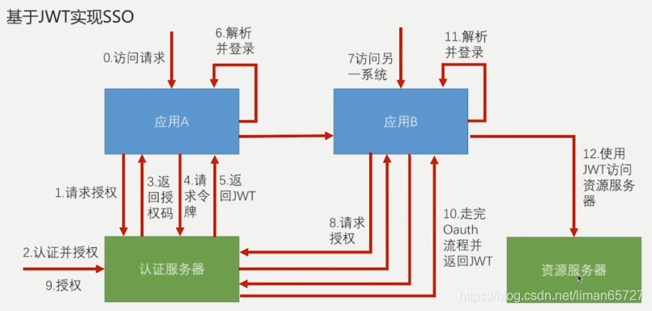
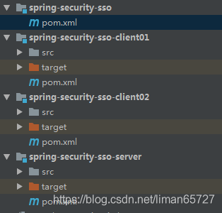
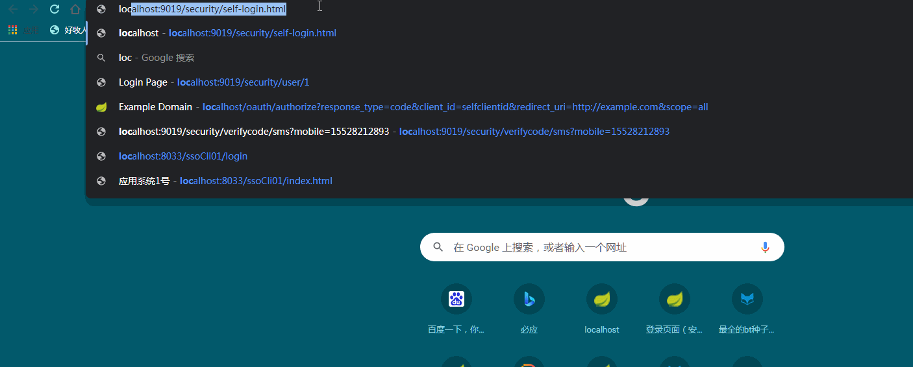
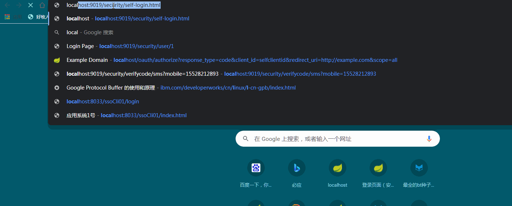

> 本文由 [简悦 SimpRead](http://ksria.com/simpread/) 转码， 原文地址 [blog.csdn.net](https://blog.csdn.net/liman65727/article/details/119845195)

### 文章目录

*   [前言](#_2)
*   [何为 SSO](#SSO_6)
*   [准备工作](#_51)
*   *   [引入相关依赖](#_62)
*   [认证服务的配置](#_180)
*   [应用服务的实例](#_272)
*   [验证测试](#_320)
*   [一些锦上添花的内容](#_351)
*   *   [登录认证改为表单认证](#_355)
    *   [简单的取消授权页面](#_403)
*   [总结](#_535)

前言
==

上一篇博客总结了自定义 token，以 JWT 为例，简单总结了自定义 token 的一些配置与实例，这一篇博客在原有的基础上，基于 JWT 完成 SSO 的一个简单的实例，利用 spring security+spring security oauth+spring security jwt，很容易就能开发出一个简单的 SSO 的应用，几乎不用写什么代码。

何为 SSO
======

SSO 即为[单点登录](https://so.csdn.net/so/search?q=%E5%8D%95%E7%82%B9%E7%99%BB%E5%BD%95&spm=1001.2101.3001.7020)，针对何为单点登录，这里依旧不做太多细致的总结。推荐几个介绍 SSO 的博客文章

[细说 SSO 单点登录](https://www.cnblogs.com/yubaolee/p/sso.html)

[什么是单点登录](https://zhuanlan.zhihu.com/p/66037342)

[单点登录介绍（简书）](https://www.jianshu.com/p/75edcc05acfd)。

具体流程如下图所示：



这个时候的认证服务器已经完全独立的，多个应用之前其实本身是跨域的，应用本身并不做认证的逻辑，所有的认证逻辑均在认证服务器上。

基于 JWT 实现一个简单的 SSO，我们也要建三个简单的应用，现在梳理一下图中的步骤

0、用户访问应用 A

1、应用 A 将用户请求跳转到认证服务器上

2、用户在认证服务器上认证并授权（用户认证的动作是在认证服务器上做的，不是在应用 A 上做的）

3、返回授权码给应用 A

4、应用 A 根据得到的授权码换取令牌

5、应用 A 根据令牌组装生成的 JWT 返回给应用 A

6、应用 A 解析 JWT 并完成登录。

7、之后用户访问应用 B（另一个应用）

8、授权操作依旧被导向到认证服务器

9、用户在认证服务器完成对应用 B 的访问授权

10、应用 B 走完应用 A 换取 JWT 的流程（这一步认证服务器发送给应用 B 的 JWT 与应用 A 并不是一个，虽然解析出来都是同一个用户信息，但并不是同一个 JWT）

11、用户在应用 B 上完成登录

12、用户根据 JWT 访问应用的资源（可以任意访问应用 A 或应用 B 的资源）

准备工作
====

前面说了，需要准备三个应用，一个表示认证服务器，一个标示应用 A，一个表示应用 B。



这里为了简单管理依赖，引入了一个 spring-security-sso 来管理各个项目的依赖。spring-security-sso-client1 和 spring-security-sso-client2 表示两个应用。spring-security-sso-server 表示认证服务器。

引入相关依赖
------

1、spring-security-sso 中的依赖配置，主要是管理与子项目的依赖管理

```
<?xml version="1.0" encoding="UTF-8"?>
<project xmlns="http://maven.apache.org/POM/4.0.0"
         xmlns:xsi="http://www.w3.org/2001/XMLSchema-instance"
         xsi:schemaLocation="http://maven.apache.org/POM/4.0.0 http://maven.apache.org/xsd/maven-4.0.0.xsd">
    <modelVersion>4.0.0</modelVersion>

    <groupId>com.coderman.learn</groupId>
    <artifactId>spring-security-sso</artifactId>
    <version>1.0-SNAPSHOT</version>

    <properties>
        <project.build.sourceEncoding>UTF-8</project.build.sourceEncoding>
        <java.version>1.8</java.version>
        <maven.compiler.source>${java.version}</maven.compiler.source>
        <maven.compiler.target>${java.version}</maven.compiler.target>
        <lombok.version>1.16.10</lombok.version>
        <javax-validation.version>2.0.1.Final</javax-validation.version>
        <spring.boot.version>2.4.4</spring.boot.version>
    </properties>

    <dependencyManagement>
        <dependencies>
            <!--spring io 将具体的版本依赖交给spring IO 去管理-->
            <dependency>
                <groupId>io.spring.platform</groupId>
                <artifactId>platform-bom</artifactId>
                <version>Brussels-SR4</version>
                <type>pom</type>
                <scope>import</scope>
            </dependency>

            <!--以spring cloud相关组件为基础-->
            <dependency>
                <groupId>org.springframework.cloud</groupId>
                <artifactId>spring-cloud-dependencies</artifactId>
                <version>Dalston.SR2</version>
                <type>pom</type>
                <scope>import</scope>
            </dependency>
        </dependencies>
    </dependencyManagement>

    <build>
        <plugins>
            <!--指定编译的插件版本-->
            <plugin>
                <groupId>org.apache.maven.plugins</groupId>
                <artifactId>maven-compiler-plugin</artifactId>
                <version>2.3.2</version>
                <configuration>
                    <source>1.8</source>
                    <target>1.8</target>
                    <encoding>UTF-8</encoding>
                </configuration>
            </plugin>
        </plugins>
    </build>

    <modules>
        <module>../spring-security-sso-server</module>
        <module>../spring-security-sso-client01</module>
        <module>../spring-security-sso-client02</module>
    </modules>
</project>
```

2、认证服务器与 sso-client 的依赖配置如下，三者的依赖都一样

```
<?xml version="1.0" encoding="UTF-8"?>
<project xmlns="http://maven.apache.org/POM/4.0.0"
         xmlns:xsi="http://www.w3.org/2001/XMLSchema-instance"
         xsi:schemaLocation="http://maven.apache.org/POM/4.0.0 http://maven.apache.org/xsd/maven-4.0.0.xsd">
    <modelVersion>4.0.0</modelVersion>

    <parent>
        <groupId>com.coderman.learn</groupId>
        <artifactId>spring-secrity-learn-parent</artifactId>
        <version>1.0.0-SNAPSHOT</version>
        <relativePath>../spring-security-sso/pom.xml</relativePath>
    </parent>


    <groupId>com.coderman.learn</groupId>
    <artifactId>spring-security-sso-server</artifactId>
    <version>1.0-SNAPSHOT</version>

    <dependencies>
        <!--spring security的依赖-->
        <dependency>
            <groupId>org.springframework.boot</groupId>
            <artifactId>spring-boot-starter-security</artifactId>
        </dependency>
        <!--web mvc的依赖-->
        <dependency>
            <groupId>org.springframework.boot</groupId>
            <artifactId>spring-boot-starter-web</artifactId>
        </dependency>
        <!--spring oauth2的依赖-->
        <dependency>
            <groupId>org.springframework.security.oauth</groupId>
            <artifactId>spring-security-oauth2</artifactId>
        </dependency>
        <!--生成的令牌是JWT的，所以要有JWT的依赖-->
        <dependency>
            <groupId>org.springframework.security</groupId>
            <artifactId>spring-security-jwt</artifactId>
        </dependency>
    </dependencies>
    
</project>
```

认证服务的配置
=======

spring-security-sso-server 是模拟的认证服务器的角色，既然是认证服务器的角色，自然需要有认证服务器相关的配置，首先需要做的是开启`@EnableAuthorizationServer`注解，相关代码如下所示

```
/**
 * autor:liman
 * createtime:2021/8/16
 * comment:
 */
@Configuration
//有了这个注解，我们的应用就是一个OAuth认证服务器了
@EnableAuthorizationServer
public class SsoAuthenticationServerConfig extends AuthorizationServerConfigurerAdapter {

    /**
     * 配置认证服务器的appid与appSecret（认证服务器可以给哪些应用访问），这里为了简单直接配置在内存里头
     * @param clients
     * @throws Exception
     */
    @Override
    public void configure(ClientDetailsServiceConfigurer clients) throws Exception {
        clients.inMemory()
                //第一个应用
                .withClient("selfSSOClient01")
                .secret("ssoClientSecret01")
                .authorizedGrantTypes("authorization_code", "refresh_token")
                .scopes("all")
                .and()
                //第二个应用
                .withClient("selfSSOClient02")
                .secret("ssoClientSecret02")
                .authorizedGrantTypes("authorization_code", "refresh_token")
                .scopes("all");
    }

    /**
     * 配置获取签名的密钥需要通过认证
     * @param security
     * @throws Exception
     */
    @Override
    public void configure(AuthorizationServerSecurityConfigurer security) throws Exception {
        //业务应用为了验证JWT需要获取认证服务器签发JWT的密钥
        //这里配置的就是业务应用服务器为了获取认证服务器签发JWT的密钥，需要通过认证服务器的认证操作
        security.tokenKeyAccess("isAuthenticated()");//获取签名的密钥需要认证
    }


    /**
     * 生成令牌的配置
     * @param endpoints
     * @throws Exception
     */
    @Override
    public void configure(AuthorizationServerEndpointsConfigurer endpoints) throws Exception {
        endpoints
                .tokenStore(tokenStore())
                .accessTokenConverter(jwtAccessTokenConverter());
    }

    //配置JWT的tokenStore
    @Bean
    public TokenStore tokenStore() {
        return new JwtTokenStore(jwtAccessTokenConverter());
    }

    @Bean
    public JwtAccessTokenConverter jwtAccessTokenConverter() {
        JwtAccessTokenConverter accessTokenConverter = new JwtAccessTokenConverter();
        String signKey = "self-sso-server";
        accessTokenConverter.setSigningKey(signKey);//设置生成签名的密钥
        return accessTokenConverter;
    }
}
```

一些地址配置信息

```
##认证服务器的启动端口和context-path
server.port=8022
server.context-path=/ssoServer

##这里仅仅还是一个实例，直接简单的将认证用户密码在配置中写出
security.user.name=user
security.user.password=123456
```

应用服务的实例
=======

应用服务端其实没什么需要做到，准备一个简单的业务接口，然后开启 SSO 配置，并配置一些信息即可。两个应用服务器的代码和配置都差别不大，只是有些自身的配置信息有些许差异，这里只贴出其中一个应用的即可。

1、启动类加入`@EnableOAuth2Sso`注解，这一步比较关键

```
/**
 * autor:liman
 * createtime:2021/8/16
 * comment:
 */
@SpringBootApplication
@EnableOAuth2Sso//让sso生效
@RestController
public class SsoClient02Application {

    @GetMapping("/user")
    public Authentication user(Authentication user) {
        return user;
    }

    public static void main(String[] args) {
        SpringApplication.run(SsoClient02Application.class, args);
    }
}
```

2、配置认证服务器的地址，以及认证服务器认证时所需要的 appid 和 appSecret 等信息

```
##应用本身的启动context-path和端口
server.port=8055
server.context-path=/ssoCli02

##appid和appsecret
security.oauth2.client.clientId = selfSSOClient02
security.oauth2.client.clientSecret = ssoClientSecret02
##认证服务器接受认证的接口地址，这里的地址和端口要与认证服务器中的配置一致
security.oauth2.client.user-authorization-uri = http://127.0.0.1:8022/ssoServer/oauth/authorize
##获取根据授权码去请求令牌的地址
security.oauth2.client.access-token-uri = http://127.0.0.1:8022/ssoServer/oauth/token
##去认证服务器获取解析JWT的密钥的地址
security.oauth2.resource.jwt.key-uri = http://127.0.0.1:8022/ssoServer/oauth/token_key
```

两个应用都差不多，无需要其他额外代码，目前几乎已经成功完成了 SSO 实例的所有开发

验证测试
====

为了测试方便，我们需要在应用服务器上准备一个简单的页面——index.html

```
<!DOCTYPE html>
<html>
<head>
<meta charset="UTF-8">
<title>应用系统1号</title>
</head>
<body>
	<h1>应用系统1号</h1>
	<a href="http://127.0.0.1:8055/ssoCli02/index.html">访问应用系统2号</a>
</body>
</html>
```

我们访问应用服务器这个页面就需要认证，这个时候应用服务器就会跳转到认证服务器，引导用户完成认证，认证完成之后才会回到这个页面

先启动认证服务器，之后启动两个应用服务器，直接访问任意一台应用服务器中的 index.html

启动各个系统之后，简单的测试动图如下



在访问应用系统 1 的时候，可以清楚的看到浏览器中的认证地址已经跳转到认证服务器的地址，并要求输入用户名和密码。之后弹出了认证授权的窗口，点击确认，即可顺利的登入应用系统 1。

之后在应用系统 1 中访问应用系统 2 的时候，便不需要认证的过程，只需要授权的过程即可。在应用系统 1 与应用系统 2 均认证完成之后，应用系统间便可以互相访问了。

一些锦上添花的内容
=========

上面我们看到了简单的配置，即可实现一个 SSO 的登录认证。但是有些可以简单优化一下，关于认证，我们可以整成表单的模式，认证服务器的认证，我们希望通过从数据库中读取信息进行认证，而不是在配置文件中配置用户名和密码。这些也不是很难

登录认证改为表单认证
----------

1、加入自定义的 userDetailsServer

```
/**
 * autor:liman
 * createtime:2021/8/17
 * comment:自定义的userDetailsServer
 */
@Component
public class SsoUserDetailsService implements UserDetailsService {
    @Override
    public UserDetails loadUserByUsername(String username) throws UsernameNotFoundException {
        return new User(username,"123456",
                AuthorityUtils.commaSeparatedStringToAuthorityList("ROLE_USER"));
    }
}
```

2、相关认证的配置

```
/**
 * autor:liman
 * createtime:2021/8/17
 * comment:关于认证的表单登录已经认证操作的配置
 */
@Configuration
public class SsoSecurityConfig extends WebSecurityConfigurerAdapter {

    @Autowired
    private UserDetailsService userDetailsService;

    //表单登录
    @Override
    protected void configure(HttpSecurity http) throws Exception {
        http.formLogin().and().authorizeRequests().anyRequest().authenticated();
    }

    //通过默认的userDetailsService进行用户认证
    @Override
    protected void configure(AuthenticationManagerBuilder auth) throws Exception {
        auth.userDetailsService(userDetailsService);
    }
}
```

简单的取消授权页面
---------

在最初版本的实例中，我们需要点击 approval 之后，才能完成授权，在实际中，几乎不会存在这种情况，这里介绍一个比较 low 的方式取消这种页面点击授权的过程。

页面点击授权的表单是在 spring security oauth2 中的某一个 EndPoint 中提供的（具体为：`org.springframework.security.oauth2.provider.endpoint.WhitelabelApprovalEndpoint`）

EndPoint 上有一个`@FrameworkEndPoint`的注解，这个注解和 controller 注解的左右几乎一样。我们需要做的就是 copy 这个类的源码，然后在我们自己的代码中将`@FrameworkEndPoint`改成`@RestController`，这样 spring mvc 请求的时候，会进入到我们自己定义的处理逻辑中，代码如下

```
/**
 * autor:liman
 * createtime:2021/8/17
 * comment:
 */
@RestController
@SessionAttributes("authorizationRequest")
public class SsoApprovalEndpoint {

    @RequestMapping("/oauth/confirm_access")
    public ModelAndView getAccessConfirmation(Map<String, Object> model, HttpServletRequest request) throws Exception {
        String template = createTemplate(model, request);
        if (request.getAttribute("_csrf") != null) {
            model.put("_csrf", request.getAttribute("_csrf"));
        }
        return new ModelAndView(new SsoSpelView(template), model);
    }

    protected String createTemplate(Map<String, Object> model, HttpServletRequest request) {
        String template = TEMPLATE;
        if (model.containsKey("scopes") || request.getAttribute("scopes") != null) {
            template = template.replace("%scopes%", createScopes(model, request)).replace("%denial%", "");
        }
        else {
            template = template.replace("%scopes%", "").replace("%denial%", DENIAL);
        }
        if (model.containsKey("_csrf") || request.getAttribute("_csrf") != null) {
            template = template.replace("%csrf%", CSRF);
        }
        else {
            template = template.replace("%csrf%", "");
        }
        return template;
    }

    private CharSequence createScopes(Map<String, Object> model, HttpServletRequest request) {
        StringBuilder builder = new StringBuilder("<ul>");
        @SuppressWarnings("unchecked")
        Map<String, String> scopes = (Map<String, String>) (model.containsKey("scopes") ? model.get("scopes") : request
                .getAttribute("scopes"));
        for (String scope : scopes.keySet()) {
            String approved = "true".equals(scopes.get(scope)) ? " checked" : "";
            String denied = !"true".equals(scopes.get(scope)) ? " checked" : "";
            String value = SCOPE.replace("%scope%", scope).replace("%key%", scope).replace("%approved%", approved)
                    .replace("%denied%", denied);
            builder.append(value);
        }
        builder.append("</ul>");
        return builder.toString();
    }

    private static String CSRF = "<input type='hidden' name='${_csrf.parameterName}' value='${_csrf.token}' />";

    private static String DENIAL = "<form id='denialForm' name='denialForm' action='${path}/oauth/authorize' method='post'><input ;
    //这里返回的模板中，加入自动提交的js脚本（这种方式比较low），这样提交就默认确认了
    private static String TEMPLATE = "<html><body><div style = 'display:none'><h1>OAuth Approval</h1>"
            + "<p>Do you authorize '${authorizationRequest.clientId}' to access your protected resources?</p>"
            + "<form id='confirmationForm' name='confirmationForm' action='${path}/oauth/authorize' method='post'><input 
            + "%denial%</div><script>document.getElementById('confirmationForm').submit()</script></body></html>";

    private static String SCOPE = "<li><div class='form-group'>%scope%: <input type='radio' 
            + " value='true'%approved%>Approve</input> <input type='radio' ;
}
```

方法`getAccessConfirmation`需要返回一个`SpelView`由于`SpelView`不是公共类，因此我们也需要自定义

```
/**
 * autor:liman
 * createtime:2021/8/17
 * comment:
 */
public class SsoSpelView implements View {
    private final String template;

    private final String prefix;

    private final SpelExpressionParser parser = new SpelExpressionParser();

    private final StandardEvaluationContext context = new StandardEvaluationContext();

    private PropertyPlaceholderHelper.PlaceholderResolver resolver;

    public SsoSpelView(String template) {
        this.template = template;
        this.prefix = new RandomValueStringGenerator().generate() + "{";
        this.context.addPropertyAccessor(new MapAccessor());
        this.resolver = new PropertyPlaceholderHelper.PlaceholderResolver() {
            public String resolvePlaceholder(String name) {
                Expression expression = parser.parseExpression(name);
                Object value = expression.getValue(context);
                return value == null ? null : value.toString();
            }
        };
    }

    public String getContentType() {
        return "text/html";
    }

    public void render(Map<String, ?> model, HttpServletRequest request, HttpServletResponse response)
            throws Exception {
        Map<String, Object> map = new HashMap<String, Object>(model);
        String path = ServletUriComponentsBuilder.fromContextPath(request).build()
                .getPath();
        map.put("path", (Object) path==null ? "" : path);
        context.setRootObject(map);
        String maskedTemplate = template.replace("${", prefix);
        PropertyPlaceholderHelper helper = new PropertyPlaceholderHelper(prefix, "}");
        String result = helper.replacePlaceholders(maskedTemplate, resolver);
        result = result.replace(prefix, "${");
        response.setContentType(getContentType());
        response.getWriter().append(result);
    }
}
```

完成这些，再启动项目，SSO，就会变成表单登录，且不会自动跳出授权认证页面。测试结果如下动图所示：



总结
==

基于 spring security 总结了一个简单的 SSO 实例。

相关代码地址——[spring security sso 开头的项目模块](https://github.com/liman657/2021_learn_project)。