> 本文由 [简悦 SimpRead](http://ksria.com/simpread/) 转码， 原文地址 [blog.csdn.net](https://blog.csdn.net/liman65727/article/details/119977606)

### 文章目录

*   [前言](#_1)
*   [何为授权](#_5)
*   [spring security 权限校验的 helloworld](#spring_security_helloworld_18)
*   [spring security 控制权限源码简析](#spring_security_127)
*   *   [AnonymousAuthenticationFilter](#AnonymousAuthenticationFilter_138)
    *   [后续授权源码](#_204)
    *   *   [FilterSecurityInterceptor](#FilterSecurityInterceptor_215)
        *   [AccessDecisionVoter](#AccessDecisionVoter_223)
        *   [AccessDecisionManager](#AccessDecisionManager_229)
    *   [开始调试查看源码](#_241)
    *   [debug 之后](#debug_330)
*   [总结](#_360)

前言
==

spring security 学习总结到这里，其实已经进入到尾声了，只是还剩下授权的部分需要简单总结一下。这篇博客简单总结一下 spring security 的 helloworld，通过 helloworld 进行一下简单的[源码](https://so.csdn.net/so/search?q=%E6%BA%90%E7%A0%81&spm=1001.2101.3001.7020)分析

何为授权
====

可能目前很多开发人员，对授权的认知还是简单的认为隐藏菜单，其实这并不全面，根据权限显示菜单与否，只能算是从 UI 层面控制住了菜单的显示与否，如果某一天，数据库被黑掉了，黑客拿到了所有的访问链接路径，依旧可以顺利访问相关接口。针对这些访问的安全问题，spring security 也提供了相关的方案。

不同系统也有不同的授权复杂程度。

如下图所示：

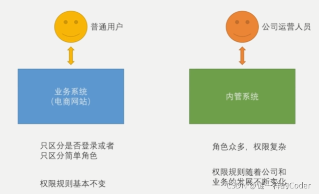

大部分企业中，开发一个业务系统的同时，还会开发一个内管系统，真正的业务系统其实权限角色并不复杂，大体上只会区分 VIP 和非 VIP 的用户，而且权限角色也较为稳定，不会频繁的变动，比如某电商网站在推出了 VIP 角色之后，并不会很频繁的退出 VVIP。所以正常来说真正对客的业务系统权限其实是比较简单的。但是针对内部的运营人员使用的内管系统，权限角色变化就会比较频繁，比如某技术总监，在升职之后去了管理部门，其角色和权限都会产生相应的变化。所以其实权限模式也是随着业务的不同而不同的。

spring security 权限校验的 helloworld
================================

其实在之前的学习中，针对某些未登录即可访问，与某些接口登录才能访问的配置，就是 spring security 权限的一种配置，只是这种比较简单。下面根据一个简单的实例来说明 spring security 的角色权限控制

准备一个简单的业务接口（这个接口在之前的实例已经用到过很多次了）

```
/**
 * autor:liman
 * createtime:2021/6/29
 * comment:
 */
@RestController
@RequestMapping("/user")
@Slf4j
public class UserController {
    @GetMapping(value = "/{id:\\d+}")
    @JsonView(User.userDetailView.class)
    public User getUserById(@PathVariable(name = "id") String id) {
        User user = new User();
        user.setUsername("tom");
        return user;
    }
}
```

关于登录的配置

```
http
	.and()
    .authorizeRequests()//并且要认证请求
    .antMatchers("/authentication/require", securityProperties.getBrowser().getLoginPage(),
            securityProperties.getBrowser().getSiguUpPage(),//第三方认证跳转的注册页不需要登录认证
            "/authentication/sessiontimeout",//session失效的路径放开登录校验
            "/verifycode/*","/login/weixin")
    .permitAll()//以上的请求不需要认证即可访问
    .anyRequest()//对其余任意的请求
    .authenticated()//都需要做认证
    .and().csrf().disable()//关闭csrf
```

上面的登录配置中，只是针对某些 url 的访问做了登录与非登录可访问的区分。并没有针对角色的访问进行区分

指定角色访问的配置，依旧是通过 antMatchers

```
http
	.and()
    .authorizeRequests()//并且要认证请求
    .antMatchers("/authentication/require", securityProperties.getBrowser().getLoginPage(),
            securityProperties.getBrowser().getSiguUpPage(),//第三方认证跳转的注册页不需要登录认证
            "/authentication/sessiontimeout",//session失效的路径放开登录校验
            "/verifycode/*","/login/weixin").permitAll()//登录页的请求不需要认证
    .antMatchers("/user/*").hasRole("ADMIN")//这里指定只有ADMIN角色的用户才能访问/user/*
    .anyRequest()//对其余任意的请求
    .authenticated()//都需要做认证
    .and().csrf().disable()//关闭csrf
```

注意上述代码第 8 行，利用 antMatchers 配置指定了访问 / user/* 接口，需要 ADMIN 的角色，antMatcher 的 url 指定支持通配符。

最后剩下一个问题，就是用户的角色如何指定的。答案是在用户认证通过之后的实例化时，指定用户的角色

最简单的实例就是在我们之前自定义的 UserDetailsServer 中

```
/**
 * autor:liman
 * createtime:2021/7/8
 * comment:
 */
@Component
@Slf4j
public class MyUserDetailService implements UserDetailsService{

    @Autowired
    private PasswordEncoder passwordEncoder;


    /**
     * 根据用户名查找用户信息
     * @param username
     * @return
     * @throws UsernameNotFoundException
     */
    @Override
    public UserDetails loadUserByUsername(String username) throws UsernameNotFoundException {
        log.info("根据用户名查找用户信息:{}",username);
        return new User(username,passwordEncoder.encode("123456"),
                true,true,true,true,
               //这里指定了用户的角色（需要加“ROLE_"前缀）
                        AuthorityUtils.commaSeparatedStringToAuthorityList("ROLE_USER,ROLE_ADMIN"));
    }
}
```

在认证结束之后，构造返回的 UserDetails 对象的时候，指定用户角色的时候，需要加 "ROLE_" 前缀，至于为什么要加这个前缀，后面会继续介绍。

完成以上代码之后，登录后的用户，才能正常访问 / user/* 的接口，因为 spring security 赋予了访问用户相关的角色。

最后再絮叨一句，针对 RESTful 应用中，同一个请求可以支持不同的 HTTP 方法。antMatchers 的配置其实也可以指定 HTTP 方法的，例如如下配置

```
antMatchers(HttpMethod.POST,"/user/*").hasRole("ADMIN")
```

第一个参数指定 HTTP 的方法为 post，表示针对 post 的 / user/* 请求，需要有 ADMIN 的角色才能进行访问。

spring security 控制权限源码简析
========================

为了后续总结角色访问控制权限的方案，这里先在 helloworld 的基础上简析一下源码流程。

先回归到 spring security 的原理部分

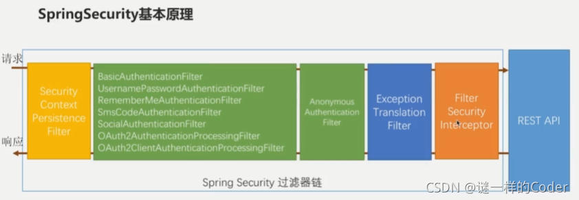

我们之前介绍过，在 spring security 是基于一堆过滤器链完成认证，上图中绿色的过滤器链就完成了用户认证的逻辑，完成之后将用户信息封装到 Authentication 中，由最后的`FilterSecurityInterceptor`决定当前的访问是否能正常访问 REST API 接口。其实在绿色的过滤器中，左边的，比较多的过滤器我们前面的博客几乎都总结过。无非就是各种认证模式的过滤器。但是在这些业务认证的过滤器完成之后，还会执行一个`AnonymousAuthenticationFilter`Anonymous 英文单词的意思是匿名的。这个过滤器我们需要看看其中做了什么，这里我只贴出认为比较重要的核心代码，并在下述代码的注解中解释其做了什么

AnonymousAuthenticationFilter
-----------------------------

```
public class AnonymousAuthenticationFilter extends GenericFilterBean implements
		InitializingBean {

	private AuthenticationDetailsSource<HttpServletRequest, ?> authenticationDetailsSource = new WebAuthenticationDetailsSource();
	private String key;
	private Object principal;
	private List<GrantedAuthority> authorities;
	//构造函数，设置key，principal（这里的principal设置为了一个字符串），权限列表
    public AnonymousAuthenticationFilter(String key) {
		this(key, "anonymousUser", AuthorityUtils.createAuthorityList("ROLE_ANONYMOUS"));
	}

    //构造函数，
	public AnonymousAuthenticationFilter(String key, Object principal,
			List<GrantedAuthority> authorities) {
		Assert.hasLength(key, "key cannot be null or empty");
		Assert.notNull(principal, "Anonymous authentication principal must be set");
		Assert.notNull(authorities, "Anonymous authorities must be set");
		this.key = key;
		this.principal = principal;
		this.authorities = authorities;
	}

	//核心的doFilter函数
	public void doFilter(ServletRequest req, ServletResponse res, FilterChain chain)
			throws IOException, ServletException {
		//判断前面的过滤器执行完成之后的Authentication是否为空（其实就是判断是否登录成功）
		if (SecurityContextHolder.getContext().getAuthentication() == null) {
            //如果没有登录成功，则创建一个Authentication对象
			SecurityContextHolder.getContext().setAuthentication(
					createAuthentication((HttpServletRequest) req));

			if (logger.isDebugEnabled()) {
				logger.debug("Populated SecurityContextHolder with anonymous token: '"
						+ SecurityContextHolder.getContext().getAuthentication() + "'");
			}
		}
        //已经认证成功了，不做任何事情，直接调用后面的过滤器
		else {
			if (logger.isDebugEnabled()) {
				logger.debug("SecurityContextHolder not populated with anonymous token, as it already contained: '"
						+ SecurityContextHolder.getContext().getAuthentication() + "'");
			}
		}

		chain.doFilter(req, res);
	}

    //创建一个Authentication，指定默认构造的principal
	protected Authentication createAuthentication(HttpServletRequest request) {
		AnonymousAuthenticationToken auth = new AnonymousAuthenticationToken(key,
				principal, authorities);
		auth.setDetails(authenticationDetailsSource.buildDetails(request));

		return auth;
	}
}
```

通过这个`AnonymousAuthenticationFilter`的源码，我们发现，其实逻辑也比较简单，无非就是判断前面的认证过滤器是否认证成功，如果认证成功了，则不作任何事情，如果没有认证成功，则内部新建一个`Authentication`对象，指定 principal 为一个匿名用户的因为字符串。

请求在通过 AnonymousAuthenticationFilter 之后，会进入到最后的守门员——`FilterSecurityInterceptor`最终鉴权的操作，就在这里面完成

后续授权源码
------

`FilterSecurityInterceptor`就是权限认证的入口，在正式解析源码之前，先看看基础的构造，以便看源码的时候不至于迷失。

基本的代码调用流程如下

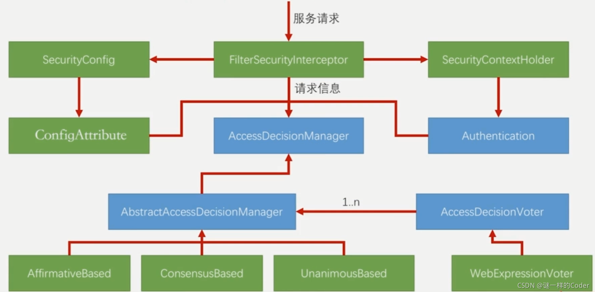

先做一个简单的说明：其中蓝色标记的都是抽象类或者接口，绿色标记的是具体的类。图虽然看上去比较复杂，但是核心的类或者接口，也就三个——`FilterSecurityInterceptor`，`AccessDecisionManager`，`AccessDecisionVoter`，这里先对这三个类做一个简单的介绍

### FilterSecurityInterceptor

这个是权限认证的入口，最终的请求是发送到`FilterSecurityInterceptor`，同时前面也说过`FilterSecurityInterceptor`也是 spring security 过滤器上面的最后一环。

`FilterSecurityInterceptor`会从我们的配置类中读取出我们的配置项，将其封装为`SecurityConfig`，同时，也会通过`SecurityContextHolder`获取`Authentication`认证信息。

在获取到上述信息之后，FilterSecurityInterceptor 会将当前的请求对象`request`，配置信息`SecurityConfig`，认证信息`Authentication`，这三者封装成一个 Object，并将这个 Object 传递给后面的`AccessDecisionManager`进行处理。

### AccessDecisionVoter

可以理解为一个投票员，针对当前的请求从不同的维度进行认证，如果认为当前请求可以访问后置的业务接口，则投票为通过，否则为不通过。

在 spring3 之前，spring security 中其实是有一组这个接口的实现的，spring3 之后，引入 EL 表达式之后，`AccessDecisionVoter`实际的实现类就只有一个了——`WebExpressionVoter`每一个投票器根据自己的逻辑决定认证是否通过还是不通过，比如有的投票器认证的是当前请求是否具有权限，有的投票器认证的是当前密码是否正确，有的投票器认证的是当前用户角色是否匹配等等。

### AccessDecisionManager

这个是一个接口，是访问决定的管理者，所谓的管理者就是管理相关的请求是否通过认证，其有一个抽象的实现——`AbstractAccessDecisionManager`，以及三个具体的实现`AffirmativeBased`，`ConsensusBased`，`UnanimousBased`。

其中`AbstractAccessDecisionManager`管理并维护了一堆`AccessDecisionVoter`，`AccessDecisionVoter`从名字可以看出，就是一个投票并决定当前请求是否完全通过认证和授权的接口。N 多的投票器的结果最后汇总到`AbstractAccessDecisionManager`中，`AbstractAccessDecisionManager`三个具体的实现类，决定当前的请求是否认证通过。

`AffirmativeBased`——如果有一个投票器通过，则当前请求认证通过，这个也是 spring security 默认的决策管理器。

`UnanimousBased`——如果有一个投票器投票不通过，则当前请求认证不通过

`ConsensusBased`——汇总所有投票器的结果，如果大部分投票器认为可以通过，则当前决策管理器认为目前的请求可以通过认证，相反则为不通过。

开始调试查看源码
--------

下面开始在未登录和登录情况下，debug 调试相关代码，首先未登录去访问业务接口，请求会先进入到`FilterSecurityInterceptor`

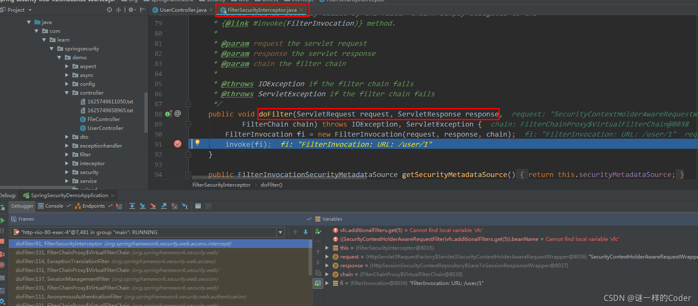

doFilter 方法中，可以看到，将 request，response 与 FilterChain 三个实体构造成 FilterInvocation，然后利用 FilterInvocation 进行后续的 invoke 操作，我们进入到 invoke 方法中，源码如下

```
public void invoke(FilterInvocation fi) throws IOException, ServletException {
	if ((fi.getRequest() != null)
			&& (fi.getRequest().getAttribute(FILTER_APPLIED) != null)
			&& observeOncePerRequest) {//如果之前经过了 FilterSecurityInterceptor 的判断，则直接通过
		// filter already applied to this request and user wants us to observe
		// once-per-request handling, so don't re-do security checking
		fi.getChain().doFilter(fi.getRequest(), fi.getResponse());
	}
	else {
		// first time this request being called, so perform security checking
		if (fi.getRequest() != null) {//如果之前没有经过FilterSecurityInterceptor，则在request请求头中设置FILTER_APPLIED属性为true
			fi.getRequest().setAttribute(FILTER_APPLIED, Boolean.TRUE);
		}

		InterceptorStatusToken token = super.beforeInvocation(fi);

		try {
            //这里就是通过了FilterSecurityInterceptor的判断，开始调用后面的业务接口了。
			fi.getChain().doFilter(fi.getRequest(), fi.getResponse());
		}
		finally {
			super.finallyInvocation(token);
		}

		super.afterInvocation(token, null);
	}
}
```

可以看到在正式调用后续的业务接口之前，会调用父类的 beforeInvocation 方法，这个方法其中如果抛出异常，则认证流程就会发生改变，如果没有异常，则就会在后面调用相关的业务接口。

debug 的请求也会到这里

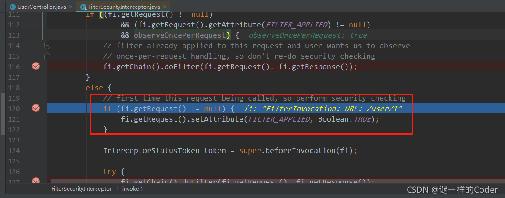

后续调用 beforeInvocation 方法，会进入到父类（这里是`AbstractSecurityInterceptor`）的`beforeInvocation`方法中

该方法中会首先读取安全配置类中的配置信息

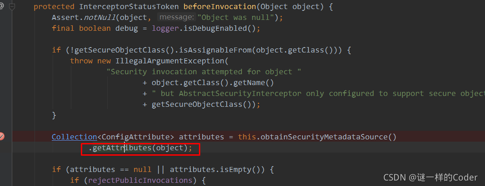

这里有一个`getAttributes`方法这个方法的具体实现在`DefaultFilterInvocationSecurityMetadataSource`中，我们进入到这个方法中，可以看到，spring security 已经将我们的认证配置信息转换成了一个 map

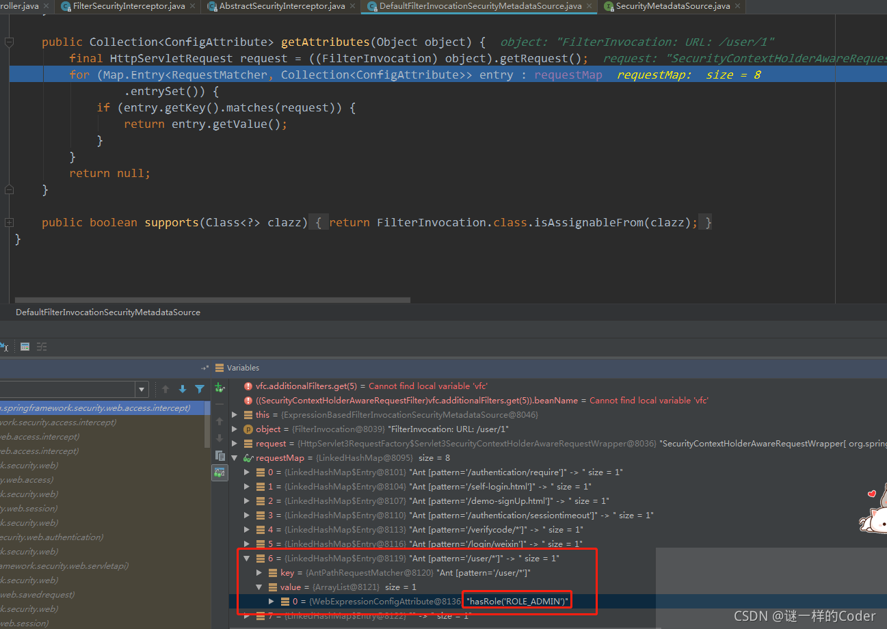

在其中我们可以看到我们对 / user/* 请求的配置，key 值为 hasRole(“ROLE_ADMIN”)，这是一个权限认证表达式（后续会介绍）

回到`beforeInvocation`方法中，最后得到上述 map 中的 key 值其实就是最终的 attributes。

经过一些判断之后，下一步就会去获取 Authentication 信息

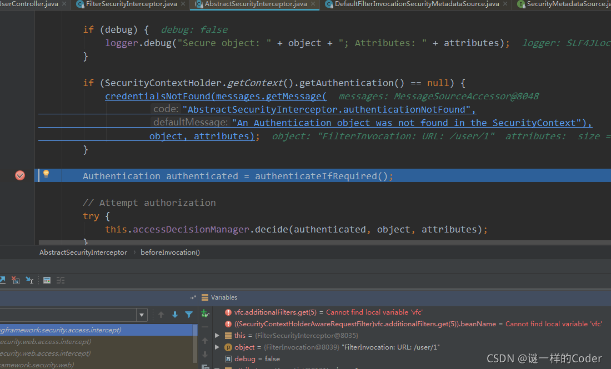

如图中高亮的哪一行代码。就是获取 spring security 中的 Authentication 信息。至此，请求信息，配置信息，认证信息在`FilterSecurityInterceptor`中都获取到了，需要做的就是将这些信息封装并交给投票决策管理器

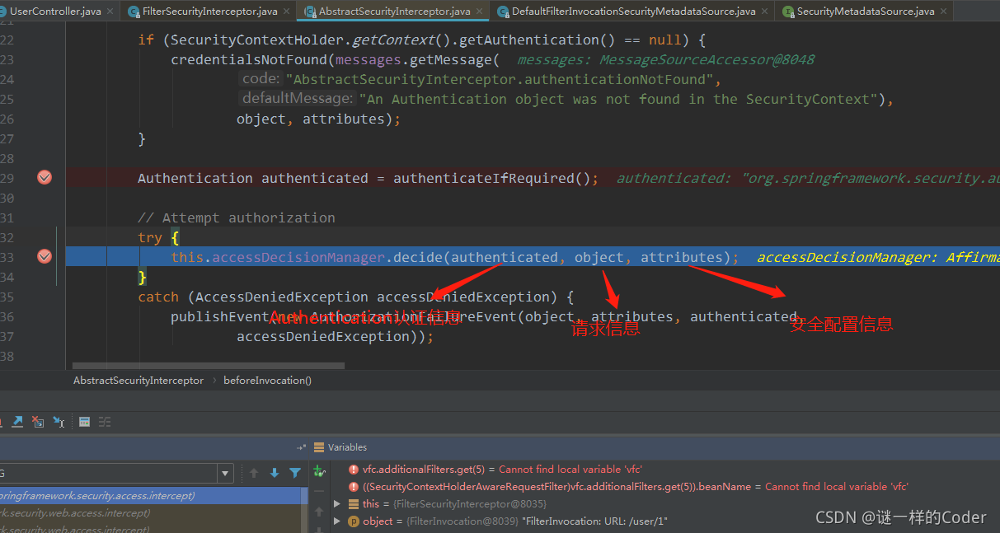

可以看到这个 decide 有三个具体的实现类

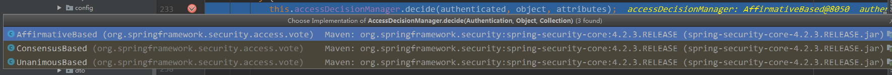

spring security 默认的是第一个，这个投票器的决策是只要有一个相关信息认证不通过，则投票结果为不通过

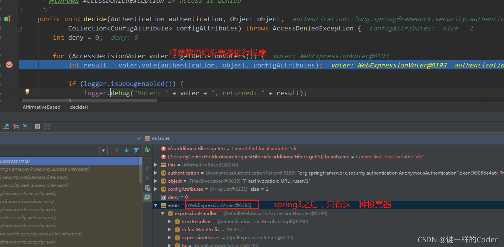

由于我们是没有进行登录，就访问业务接口并开启了调试，因此到这里的认证结果为不通过

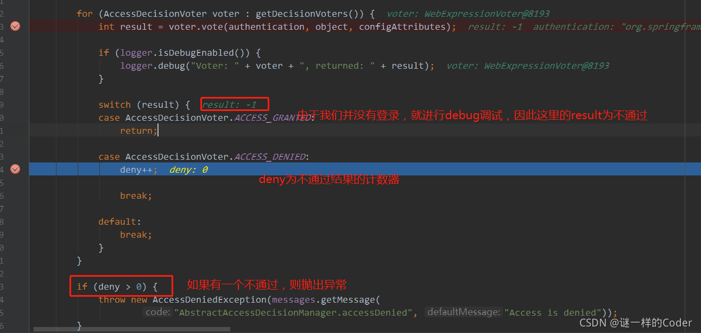

最后由于不通过，则会抛出一个访问拒绝的异常，这个异常会抛给上层——FilterSecurityInterceptor，FilterSecurityInterceptor 捕获该异常之后，会继续抛出，由过滤器链上的`ExceptionTranslationFilter`进行处理，这部分源码就不继续 debug 跟踪了。

debug 之后
--------

在未认证的情况下，访问需要相关权限的业务接口，debug 跟踪源码之后，我们进行一个小结，我个人认为在读取到配置信息的时候，针对 / user/* 的 url，最终读取的 attribute 的表达式为 hasRole(“ADMIN”)。之后具体的投票器解析权限认证表达式，决定当前请求是否通过，这个是整个权限认证的核心流程。只需要知道这一点即可。

这里解释一下 hasRole 方法，源码如下：

```
//以下方法位于：org.springframework.security.config.annotation.web.configurers.ExpressionUrlAuthorizationConfigurer.AuthorizedUrl#hasRole
//hasRole的入口方法
public ExpressionInterceptUrlRegistry hasRole(String role) {
	return access(ExpressionUrlAuthorizationConfigurer.hasRole(role));
}
//源码位于：org.springframework.security.config.annotation.web.configurers.ExpressionUrlAuthorizationConfigurer#hasRole
//上述hasRole的调用方法，我们传入的是ADMIN
private static String hasRole(String role) {
	Assert.notNull(role, "role cannot be null");
	if (role.startsWith("ROLE_")) {//如果我们指定的权限名为“ROLE_"开头，则会抛出提示异常。
		throw new IllegalArgumentException(
				"role should not start with 'ROLE_' since it is automatically inserted. Got '"
						+ role + "'");
	}
    //默认会加上“ROLE_"的前缀，并形成”hasRole('ROLE_ADIMIN)'“的权限表达式
	return "hasRole('ROLE_" + role + "')";
}
```

可以看到 spring security 中会默认根据我们传入的 ADMIN 权限，默认形成 "hasRole(‘ROLE_ADIMIN)’" 的权限表达式

。这也是为什么我们需要在自定义的 UserDetailsServer 中构造指定用户权限的时候，需要加 "ROLE_" 的前缀。

总结
==

spring security 权限认证的 helloworld，以及简单的源码梳理与解析。

相关代码地址：[spring security 开头的项目](https://github.com/liman657/2021_learn_project)。