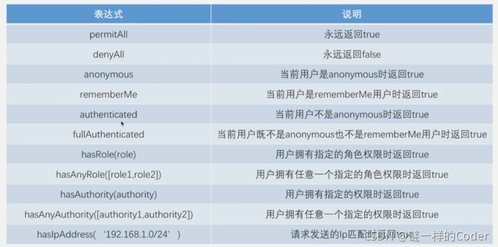
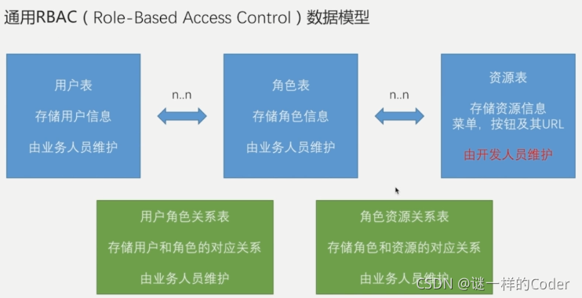

> 本文由 [简悦 SimpRead](http://ksria.com/simpread/) 转码， 原文地址 [blog.csdn.net](https://blog.csdn.net/liman65727/article/details/120114439)

前言
==

### 文章目录

*   [前言](#_0)
*   [权限表达式](#_6)
*   [通用的 RBAC 数据模型](#RBAC_43)
*   [总结](#_124)

进入到这里，算是 spring-security 真正的尾声了，这篇博客简单介绍一下权限表达式，以及如何将我们系统中自定义的 RBAC 模型与 spring-security 进行整合。

上篇博客中，我们分析了 spring security 中针对权限认证的源码调用流程，其中提到一个 WebExpressionVoter，这个是解析权限表达式的一个投票器。因此这篇博客我们先简单介绍一下权限表达式。

权限表达式
=====

直接上图吧，其实并不复杂



需要说明一下，之前我们在项目中的配置大体上如下

```
//基本上是一个antMatchers与一个permitAll成对出现
.antMatchers("/authentication/require", securityProperties.getBrowser().getLoginPage(),
        securityProperties.getBrowser().getSiguUpPage(),//第三方认证跳转的注册页不需要登录认证
        "/authentication/sessiontimeout",//session失效的路径放开登录校验
        "/verifycode/*","/login/weixin")
.permitAll()//登录页的请求不需要认证
.antMatchers(HttpMethod.POST,"/user/*")
.hasRole("ADMIN")//对于post请求的 /user/*，需要ADMIN权限
.anyRequest()//对其余任意的请求
.authenticated()//都需要做认证
```

在实际配置代码中，基本上是一个 antMatchers 成对出现，指明这个 antMatchers 中的请求对应的权限表达式。

其中第一个 permitAll 已经用的很多了，就是对应上述代码中的第一组配置，针对前面指定的 antMatchers 中的请求路径，无需认证即可访问。

hasRole————用户拥有指定的角色才能访问，需要注意的是 “ROLE_” 前缀。以及后面的 authenticated 方法，是指定请求需要认证。

如果想多个权限表达式组合使用，并不能通过级联调用的方式实现，而是需要通过 access 方法进行指定，如下实例所示：

```
.antMatchers(HttpMethod.POST,"/user/*")
    .access("hasRole('ADMIN') and hasIpAddress('192.168.0.103')")
```

在 access 中指定的权限表达式是需要具有 ADMIN 角色，并且 IP 为 192.168.0.103 的用户才能访问。如果可以将 access 中的信息从数据库中读取，就完成了我们自定义的权限角色认证方式与 spring security 的整合。

通用的 RBAC 数据模型
=============

在介绍权限认证的时候，我们针对不同的系统其拥有的权限角色管理逻辑是不同的。常见于内管系统中的权限角色模型是较为复杂的，在之前学习 shiro 的时候，我们介绍过一个简单的权限角色模型，并通过 SQL 实例做了相关说明——[身份认证简单实例](https://blog.csdn.net/liman65727/article/details/113810625)。这里再简单提一下 RBAC 数据模型，简单通过一张图进行表述



其中用户表与角色表为多对多的关系，角色表与资源表也为多对多的关系，学过数据库设计应该知道，多对多的实体之间必须要建立一个关系映射表，因此就有了用户角色关系表和角色资源关系表。因此常用的内管系统基础的就是这 5 张数据表。

针对这些在后管系统中的具体实现，本篇博客不做过多介绍，可以参考我之前的——[身份认证简单实例](https://blog.csdn.net/liman65727/article/details/113810625)一文。

这里需要介绍的是，如果将通用的 RBAC 与 spring security 进行整合。

1、定义一个接口，这个接口中定义权限角色的校验方法

```
/**
 * autor:liman
 * createtime:2021/9/5
 * comment:简单的rbac实例类
 */
public interface RbacService {

	//定义一个方法，根据请求对象，判断其是否有权限访问某些资源
    public boolean hasPermission(HttpServletRequest request, Authentication authentication);
}
```

2、具体的实现类

```
/**
 * autor:liman
 * createtime:2021/9/5
 * comment: Rbac服务类的实现类
 */
@Component("rbacService")
public class RbacServiceImpl implements RbacService {

    private AntPathMatcher antPathMatcher = new AntPathMatcher();

    /**
     * 判断是否有权限
     * @param request
     * @param authentication
     * @return
     */
    @Override
    public boolean hasPermission(HttpServletRequest request, Authentication authentication) {
        Object principal = authentication.getPrincipal();
        boolean hasPermission =false;
        if(principal instanceof UserDetails){
            String username = ((UserDetails) principal).getUsername();

            //TODO:从数据库读取当前用户所拥有权限的url
            Set<String> urls = new HashSet<>();

            //判断当前请求url，是否在拥有权限的url列表中（这里用antPathMatcher）
            for(String url:urls){
                if(antPathMatcher.match(url,request.getRequestURI())){
                    hasPermission = true;
                    break;
                }
            }
        }
        return hasPermission;
    }
}
```

3、将上述方法，通过权限表达式的方式，告知 spring security 的配置

```
//TODO：这个需要放在最后读取
config.anyRequest().access("@rbacService.hasPermission(request,authentication)");
```

上述中的 @符号后面的 rbacService 就是我们具体实现类在容器中的 bean 名称。同时需要说明的是，如果实际开发中，针对 spring security 的配置被拆分成多个配置类，这个关于权限表达式的配置，需要放在所有 spring security 的配置类最后启动（可以通过 @Order 注解实现启动顺序的指定）。

至此，即完成自定义 RBAC 与 spring security 的简单集成。真的不复杂

总结
==

针对 spring security 的内容总结大部分完成，还有一个 rememberMe 作为一个额外的内容，下篇博客进行总结。