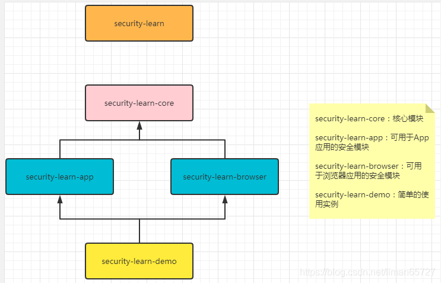
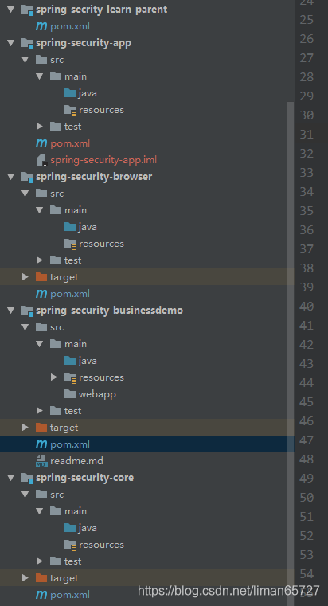
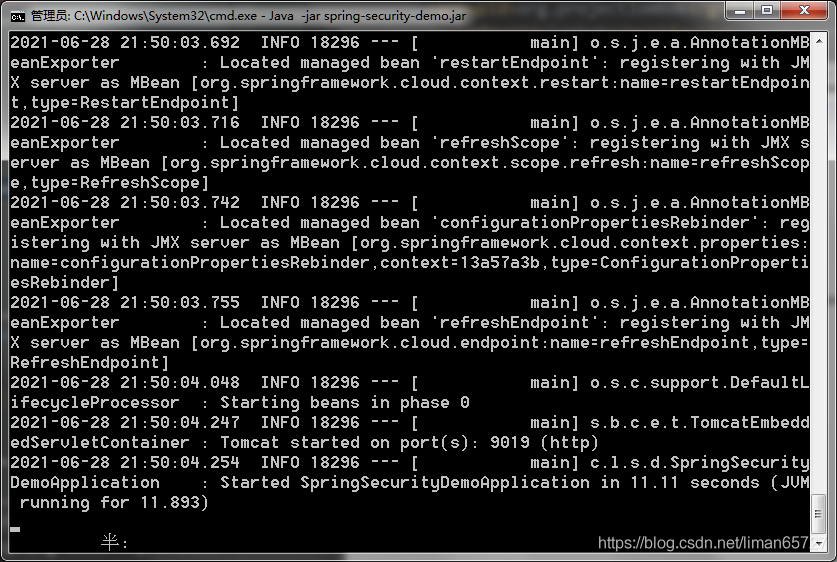

> 本文由 [简悦 SimpRead](http://ksria.com/simpread/) 转码， 原文地址 [blog.csdn.net](https://blog.csdn.net/liman65727/article/details/118313213)

### 文章目录

*   [前言](#_1)
*   [准备工作](#_5)
*   *   [spring-security-learn-parent](#springsecuritylearnparent_29)
    *   [spring-security-core](#springsecuritycore_73)
    *   [spring-security-app](#springsecurityapp_138)
    *   [spring-security-browser](#springsecuritybrowser_152)
    *   [spring-security-demo](#springsecuritydemo_170)
*   [hello world](#hello_world_189)
*   [总结](#_285)

前言
==

前不久一直在忙工作和生活上的一些事情，几乎没有任何时间进行博客总结，今天开始针对前期学习的 spring-security 的学习做一个总结，这里依旧不会介绍什么是 spring-security 这种问题，看官们自行百度即可。在之前自己学习的过程中发现，网上大部分针对 spring-security 的总结，并没有根据官网，而是根据 mk 网的某一课程进行的总结（几乎 98% 都是），为此十分好奇这个课程的，遂也加入学习这门课程的队伍，结果——真香。这门课程的含量确实很高，因此我也不能免俗，也会根据这门课程进行总结。相关地址如下：[muke spring-security 高含量课程](https://coding.imooc.com/class/chapter/134.html)。这里并不是做广告，而是单纯的作为总结，贴出自己所参考的东西。

准备工作
====

需要准备一下 JDK+MySQL + 相关的 IDE（都是基本吃饭的家伙）。相关代码模块结构如下

其中 security-learn 只是一个管理 pom 依赖的模块，没有具体代码



security-learn-core 是我们的核心代码，我们登录的所有公共逻辑都会放在这个模块中

security-learn-app 是以 App 应用接入方式为实例的模块，在这个模块中会详细介绍 APP 应用中如何调用 core 模块中的相关登录逻辑

security-learn-browser 是以浏览器应用接入方式为实例的模块，相对 App 而言，PC 端的应用 session 会话机制较为简单，但是其处理起来与 App 有些不同，故而分出两个不同应用

security-learn-demo 是一个综合的使用实例。

相关代码结果如下，一共 5 个模块



相关 pom 如下

spring-security-learn-parent
----------------------------

这个模块需要指定如下依赖，其中用到的 io.spring.platform 会管理 spring 相关依赖的版本号，我们不需要在每次依赖的地方指定版本号，这个组件会自动给我们管理好相关的依赖版本

```xml
<dependencyManagement>
    <dependencies>
        <!--spring io 将具体的版本依赖交给spring IO 去管理-->
        <dependency>
            <groupId>io.spring.platform</groupId>
            <artifactId>platform-bom</artifactId>
            <version>Brussels-SR4</version>
            <type>pom</type>
            <scope>import</scope>
        </dependency>

        <!--以spring cloud相关组件为基础-->
        <dependency>
            <groupId>org.springframework.cloud</groupId>
            <artifactId>spring-cloud-dependencies</artifactId>
            <version>Dalston.SR2</version>
            <type>pom</type>
            <scope>import</scope>
        </dependency>
    </dependencies>
</dependencyManagement>

<build>
    <plugins>
        <!--指定编译的插件版本-->
        <plugin>
            <groupId>org.apache.maven.plugins</groupId>
            <artifactId>maven-compiler-plugin</artifactId>
            <version>2.3.2</version>
            <configuration>
                <source>1.8</source>
                <target>1.8</target>
                <encoding>UTF-8</encoding>
            </configuration>
        </plugin>
    </plugins>
</build>
```

spring-security-core
--------------------

这个是我们的核心代码模块，其所用到的依赖如下

```xml
<dependencies>
    <!--后续会学习oauth协议，这里用到oauth2-->
    <dependency>
        <groupId>org.springframework.cloud</groupId>
        <artifactId>spring-cloud-starter-oauth2</artifactId>
    </dependency>
    
    <!--会用到redis 处理session会话-->
    <dependency>
    	<groupId>org.springframework.boot</groupId>
    	<artifactId>spring-boot-starter-data-redis</artifactId>
	</dependency>
    
    <!--数据库连接-->
    <dependency>
        <groupId>org.springframework.boot</groupId>
        <artifactId>spring-boot-starter-jdbc</artifactId>
    </dependency>
    
    <!--mysql-->
    <dependency>
        <groupId>mysql</groupId>
        <artifactId>mysql-connector-java</artifactId>
    </dependency>
    
    <!--spring-social  start-->
    <dependency>
        <groupId>org.springframework.social</groupId>
        <artifactId>spring-social-config</artifactId>
    </dependency>
    <dependency>
        <groupId>org.springframework.social</groupId>
        <artifactId>spring-social-core</artifactId>
    </dependency>
    <dependency>
        <groupId>org.springframework.social</groupId>
        <artifactId>spring-social-security</artifactId>
    </dependency>
    <dependency>
        <groupId>org.springframework.social</groupId>
        <artifactId>spring-social-web</artifactId>
    </dependency>
    <!--spring-social  end-->
    
    <!--相关工具类-->
    <dependency>
        <groupId>commons-lang</groupId>
        <artifactId>commons-lang</artifactId>
    </dependency>
    <dependency>
        <groupId>commons-collections</groupId>
        <artifactId>commons-collections</artifactId>
    </dependency>
    <dependency>
        <groupId>commons-beanutils</groupId>
        <artifactId>commons-beanutils</artifactId>
    </dependency>
</dependencies>
```

spring-security-app
-------------------

只需要依赖 core 模块即可

```xml
<dependencies>
    <dependency>
        <groupId>com.coderman.learn</groupId>
        <artifactId>spring-security-core</artifactId>
        <version>${self.app.version}</version>
    </dependency>
</dependencies>
```

spring-security-browser
-----------------------

相比于 App 模块，这里需要依赖一个 spring-session，需要通过 spring-session 来管理会话

```xml
<dependencies>
    <dependency>
        <groupId>com.coderman.learn</groupId>
        <artifactId>spring-security-core</artifactId>
        <version>${self.app.version}</version>
    </dependency>
    <dependency>
        <groupId>org.springframework.session</groupId>
        <artifactId>spring-session</artifactId>
    </dependency>
</dependencies>
```

spring-security-demo
--------------------

这个是编写实例的主要模块，直接引入 App 和 browser 模块的依赖就可以

```xml
<dependency>
    <groupId>com.coderman.learn</groupId>
    <artifactId>spring-security-browser</artifactId>
    <version>${self.app.version}</version>
</dependency>
<dependency>
    <groupId>com.coderman.learn</groupId>
    <artifactId>spring-security-core</artifactId>
    <version>${self.app.version}</version>
</dependency>
```

在后续学习总结中，不会详细说明每个模块的名字，在某个模块中增加代码的时候，会直接写明模块名的简称

hello world
===========

下面开始 spring security 的 helloworld

1、在 demo 模块中，准备如下配置

```properties
server.port=9019
##全局路径的配置
server.context-path=/security
#数据库连接配置
spring.datasource.driver-class-name=com.mysql.jdbc.Driver
spring.datasource.url=jdbc:mysql://127.0.0.1:3306/db_spring_security_demo?useUnicode=yes&characterEncoding=UTF-8&useSSL=false
spring.datasource.username=root
spring.datasource.password=root
logging.level.root=info
#是否自动生成/修改数据库表
spring.jpa.generate-ddl=true
#是否在控制台打印sql语句
spring.jpa.show-sql=true
#打印sql语句时是否格式化
spring.jpa.properties.hibernate.format_sql=true
#数据库表和字段命名策略
#spring.jpa.hibernate.naming.implicit-strategy = com.imooc.security.rbac.repository.support.ImoocImplicitNamingStrategy
#连接池及重试配置，防止mysql如果8小时自动断开连接问题
spring.datasource.max-active=100
spring.datasource.min-idle=10
spring.datasource.min-evictable-idle-time-millis=1800000
spring.datasource.test-on-borrow=true
spring.datasource.test-on-return=true
spring.datasource.test-while-idle=true
spring.datasource.validation-query=select 1
#集群session存储方式 这里暂时关闭
spring.session.store-type=none
#session超时时间，单位秒
server.session.timeout=600
## spring-security的认证，这里也暂时关闭
security.basic.enabled = false
```

2、准备一个启动类

```java
/**
 * autor:liman
 * createtime:2021/6/28
 * comment:
 */
@SpringBootApplication
@RestController
public class SpringSecurityDemoApplication {

    public static void main(String[] args) {
        SpringApplication.run(SpringSecurityDemoApplication.class);
    }

    @GetMapping("/hello")
    public String hello(){
        return "hello spring security";
    }
}
```

启动没有报错之后，直接访问页面上会打印 "hello spring security"，表示应用启动成功

3、关于打包

如果需要将项目直接打包成 jar 包，让后部署，这里需要在 dem 引入如下 build，这里注意属性中 relativePath 的配置

```xml
<build>
    <plugins>
        <plugin>
            <groupId>org.springframework.boot</groupId>
            <artifactId>spring-boot-maven-plugin</artifactId>
            <version>1.5.6.RELEASE</version>
            <executions>
                <execution>
                    <goals>
                        <goal>repackage</goal>
                    </goals>
                </execution>
            </executions>
        </plugin>
    </plugins>
    <finalName>spring-security-demo</finalName>
</build>
```

打包完成之后，可看到相关 jar 包，然后通过 java -jar 命令，可以直接执行，启动成功，如下所示



浏览器直接访问，也能得到相关返回语句

总结
==

spring-security 学习开篇的~~~ 序