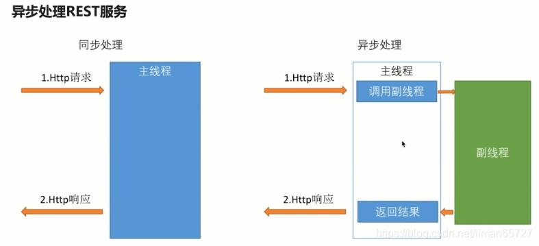

> 本文由 [简悦 SimpRead](http://ksria.com/simpread/) 转码， 原文地址 [blog.csdn.net](https://blog.csdn.net/liman65727/article/details/118439859)

### 文章目录

*   [前言](#_1)
*   [一个 RESTful API 的应用](#RESTful_API_10)
*   *   [通过简单的 CRUD 学到的](#CRUD_12)
    *   *   [针对 RestfulApi 的测试用例](#RestfulApi_14)
        *   [相关 Restful api 的注解](#Restful_api_84)
        *   [关于 JsonView 的使用](#JsonView_134)
        *   [参数校验](#_216)
    *   [统一的异常处理](#_292)
    *   *   [springboot 默认的处理机制](#springboot_294)
        *   [自定义异常处理](#_308)
    *   [过滤器与拦截器](#_370)
    *   *   [Filter](#Filter_374)
        *   [拦截器](#_438)
        *   [AOP 统一处理异常](#AOP_529)
        *   [全局异常的处理顺序](#_568)
    *   [多线程提高 rest 服务性能的方式](#rest_577)
    *   *   [利用 Callable 异步处理结果](#Callable_600)
        *   [DeferredResult](#DeferredResult_632)
    *   [swagger](#swagger_795)
    *   [WireMock 工具](#WireMock_831)
*   [总结](#_880)

前言
==

上一篇博客算是絮叨了一下 spring security 的序，这篇…… 依旧是序，只不过应该是高级版本的序，我们需要在实际学习 spring security 之前，准备一个 [RESTful](https://so.csdn.net/so/search?q=RESTful&spm=1001.2101.3001.7020) 的 web 应用

这里依旧不会介绍什么是 RESTful，感兴趣的可以直接参考这篇大牛的博客——[什么是 RESTful](https://www.cnblogs.com/zhangruifeng/p/13257731.html) 。需要说明的是 RESTful 并不是一个技术框架，而是一个简单的规范，其引入了资源的概念，每个资源都有对应的 url。


一个 RESTful API 的应用
==================

通过简单的 CRUD 学到的
--------------

### 针对 RestfulApi 的测试用例

springmvc 其实提供了一些 Restful 的测试用例，只是平时工作用 postman 用的较多，因此并没有较好的使用这些测试用例，这里做一个简单的实例归纳

在我们引入如下 pom 的时候，其实已经包含了 mvc 测试相关的依赖

```xml
<!--引入-->
<dependency>
    <groupId>org.springframework.boot</groupId>
    <artifactId>spring-boot-starter-test</artifactId>
</dependency>
```

在测试包下编写如下测试代码

```java
import org.springframework.mock.web.MockMultipartFile;
import org.springframework.test.context.junit4.SpringRunner;
import org.springframework.test.web.servlet.MockMvc;
import org.springframework.test.web.servlet.setup.MockMvcBuilders;
import org.springframework.web.context.WebApplicationContext;
import static org.springframework.test.web.servlet.request.MockMvcRequestBuilders.*;
import static org.springframework.test.web.servlet.result.MockMvcResultMatchers.status;
import static org.springframework.test.web.servlet.result.MockMvcResultMatchers.jsonPath;

/**
 * autor:liman
 * createtime:2021/6/29
 * comment: 模拟mvc的controller测试
 */
@RunWith(SpringRunner.class)
@SpringBootTest(classes = SpringSecurityDemoApplication.class)
@Slf4j
public class UserControllerTest {

    //注入webApplicationContext容器
    @Autowired
    private WebApplicationContext webApplicationContext;

    private MockMvc mockMvc;

	/**
	初始化构建MockMvc
	*/
    @Before
    public void setUp() {
        mockMvc = MockMvcBuilders.webAppContextSetup(webApplicationContext).build();
    }

    /**
     * 简单的模拟mvc的测试，由于import中引入了相关静态方法，所以这里并不用指定静态方法所在的类，直接调用方法名即可
     * @throws Exception
     */
    @Test
    public void whenQuerySuccess() throws Exception {
        String responseData = mockMvc.perform(get("/user")//get请求
                .param("username", "coderMan")//构造请求参数
                .contentType(MediaType.APPLICATION_JSON_UTF8))//JSON，UTF-8
            
            	//构造期望的结果
                .andExpect(status().isOk())//返回200
                .andExpect(jsonPath("$.length()").value(3))//jsonPath中长度为3
                .andReturn().getResponse().getContentAsString();//获取返回数据

        log.info("返回的数据为:{}",responseData);
    }
}
```

### 相关 Restful api 的注解

<table><thead><tr><th align="center">注解</th><th align="center">作用</th></tr></thead><tbody><tr><td align="center">@RestController</td><td align="center">标明此 controller 提供 RestAPI</td></tr><tr><td align="center">@RequestMapping</td><td align="center">这个注解有很多变体，比如 @GetMapping，@PostMapping，@PutMapping，@DeleteMapping 等。主要作用就是映射 url 到指定的 java 方法上</td></tr><tr><td align="center">@RequestParam</td><td align="center">常用于 GET 请求中的参数映射配置</td></tr><tr><td align="center">@RequestBody</td><td align="center">POST 请求中用于对象参数的映射</td></tr><tr><td align="center">@PageableDefault</td><td align="center">默认的分页注解，如果数据访问层用的是 JPA 使用这个注解会很方便</td></tr><tr><td align="center">@PathVariable</td><td align="center">从路径中读取变量值的注解</td></tr></tbody></table>

相关实例如下

```java
/**
 * Pageable 用于分页的对象，如果用的是spring-data 这个会很方便
 *
 * @param userQueryCondition
 * @param pageable
 * @return
 */
@GetMapping(value = "")
public List<User> query(UserQueryCondition userQueryCondition, @PageableDefault(page = 1, size = 17) Pageable pageable) {
    List<User> userList = new ArrayList<>();
    userList.add(new User());
    userList.add(new User());
    userList.add(new User());
    return userList;
}

@PostMapping
public User createUser(@Valid @RequestBody User user, BindingResult bindingResult){
    if(bindingResult.hasErrors()){
        bindingResult.getAllErrors().stream().forEach(e->{System.out.println(e.getDefaultMessage());});
    }
    log.info("前端上送的用户信息为:{}",user);
    user.setId("1");
    return user;
}

//这里是使用的正则表达式，\\d+表示，id只能接受数值，不能接受字母
@GetMapping(value = "/{id:\\d+}")
@JsonView(User.userDetailView.class)
public User getUserById(@PathVariable(name = "id") String id) {
    User user = new User();
    user.setUsername("tom");
    return user;
}
```

### 关于 JsonView 的使用

针对不同场景，不同接口，可能需要返回的字段是不同的，但是这些字段又存于一个 VO 实体中，这个时候我们就可以用上 JsonView 注解，由于这个注解是 fastjson 中提供的，不是 mvc 中提供的，因此单独列一个小标题总结

定义几个视图，并在指定的 get 方法中指定字段在那个视图中返回，如下代码中声明了两个视图——userSimpleView，userDetailView，后者继承至前置。userSimpleView 只返回 userName 字段，userDetailView 返回密码字段。

```java
@ToString
public class User {

	//指定视图userSimpleView
    public interface userSimpleView {};

	//指定视图userSimpleView
    public interface userDetailView extends userSimpleView {};

    private String username;

    private String password;

    private String id;

    private Date birthday;

    @JsonView(userSimpleView.class)
    public String getUsername() {
        return username;
    }

    public void setUsername(String username) {
        this.username = username;
    }

    @JsonView(userDetailView.class)
    public String getPassword() {
        return password;
    }

    public void setPassword(String password) {
        this.password = password;
    }

    public String getId() {
        return id;
    }

    public void setId(String id) {
        this.id = id;
    }

    public Date getBirthday() {
        return birthday;
    }

    public void setBirthday(Date birthday) {
        this.birthday = birthday;
    }
}
```

在相关的 api 接口中，指定返回的视图即可

```java
@GetMapping(value = "")
@JsonView(User.userSimpleView.class)
public List<User> query(UserQueryCondition userQueryCondition, @PageableDefault(page = 1, size = 17) Pageable pageable) {
    List<User> userList = new ArrayList<>();
    userList.add(new User());
    userList.add(new User());
    userList.add(new User());
    return userList;
}

@GetMapping(value = "/{id:\\d+}")
@JsonView(User.userDetailView.class)
public User getUserById(@PathVariable(name = "id") String id) {
    User user = new User();
    user.setUsername("tom");
    return user;
}
```

### 参数校验

spring-boot-start-web 中提供了 hibernate-validator 的校验，我们不需要单独引入校验框架，关于 hibernate-validator 详细可以参考大牛博客——[hibernate-validator 使用详解](https://www.cnblogs.com/leeego-123/p/10820099.html)。这里我们做一个简单实例即可

在相关的请求对象中加入 hibernate 的校验注解

```java
public class User {
    @NotBlank(message = "用户名不能为空")
    private String username;
}
```

在相关的请求中加入 @Validate 注解和 BindingResult 参数

```java
@PostMapping
public User createUser(@Valid @RequestBody User user, BindingResult bindingResult){
    if(bindingResult.hasErrors()){//这里做校验信息的提示
        bindingResult.getAllErrors().stream().forEach(e->{System.out.println(e.getDefaultMessage());});
    }
    log.info("前端上送的用户信息为:{}",user);
    user.setId("1");
    return user;
}
```

如果是自定义的校验，需要准备一个自定义注解，以及自定义注解校验类

自定义校验注解

```java
/**
 * autor:liman
 * createtime:2021/6/30
 * comment:自定义校验注解
 */
@Target({ElementType.METHOD, ElementType.FIELD})
@Retention(RetentionPolicy.RUNTIME)
@Constraint(validatedBy=SelfValidatorImpl.class)
public @interface SelfValidator {
    String message();

    Class<?>[] groups() default { };

    Class<? extends Payload>[] payload() default { };

    String field() default "";
}
```

自定义的校验逻辑类

```java
public class SelfValidatorImpl implements ConstraintValidator<SelfValidator, Object> {

    @Autowired
    private HelloService helloService;

    @Override
    public void initialize(SelfValidator constraintAnnotation) {
        System.out.println("my validator init");
    }

    @Override
    public boolean isValid(Object value, ConstraintValidatorContext context) {
//        helloService.greeting("tom");
        //TODO:这里处理校验逻辑，如果校验通过，则返回true，否则返回false
        System.out.println(value);
        return false;
    }
}
```

需要说明的是在 SelfValidatorImpl 类中可以注入我们任意想注入的类，spring 会自动帮我们将 SelfValidatorImpl 加入到容器中

统一的异常处理
-------

### springboot 默认的处理机制

springboot 中默认的处理机制位于 springboot 给我们统一提供的异常处理类——BasicErrorController 中，可以查看其源码

其中有一段比较有意思的代码，这两个其实都是处理 / error 的请求，在同一个 url 中产生了不同的处理，唯一的区别就是识别不同的请求头中是否带上了 “text/html” 如果带上了这个请求头，则直接返回 HTML 页面，如果没有带上通过 json 返回异常数据。


如果是前后端为分离的应用，如果需要针对 404 等常见异常作出自定义的响应的话，需要在 resources 下建立相关自定义响应文件


### 自定义异常处理

如果需要针对自定义的异常作出处理，需要用到 @ControllerAdvice

自定义的异常

```java
/**
 * autor:liman
 * createtime:2021/6/30
 * comment:
 */
public class CommonException extends RuntimeException {
    /**
     *
     */
    private static final long serialVersionUID = -6112780192479692859L;

    private String message;

    public CommonException(String message) {
        super("common exception");
        this.message = message;
    }

    public String getId() {
        return message;
    }

    public void setId(String id) {
        this.message = id;
    }
}
```

@ControllerAdvice 处理自定义异常

```java
/**
 * autor:liman
 * createtime:2021/6/30
 * comment: 通用的异常处理模块
 */
@ControllerAdvice
public class ControllerExceptionHandler {

    @ExceptionHandler(CommonException.class)
    @ResponseBody
    @ResponseStatus(HttpStatus.INTERNAL_SERVER_ERROR)
    public Map<String, Object> handleUserNotExistException(CommonException ex) {
        Map<String, Object> result = new HashMap<>();
        result.put("id", ex.getId());
        result.put("message", ex.getMessage());
        return result;
    }

}
```

过滤器与拦截器
-------

需求：还是以记录接口耗时为出发点

### Filter

自定义的 filter

```java
@Slf4j
@Component
public class TimeFilter implements Filter {
    @Override
    public void init(FilterConfig filterConfig) throws ServletException {
        log.info("filter init");
    }

    @Override
    public void doFilter(ServletRequest request, ServletResponse response, FilterChain chain) throws IOException, ServletException {
        log.info("time filter start");
        long start = new Date().getTime();
        //调用目标方法
        chain.doFilter(request, response);
        long now = new Date().getTime();
        log.info("time filter 耗时:{}", now - start);
        log.info("time filter finished");
    }

    @Override
    public void destroy() {
        log.info("self time filter destory");
    }
}
```

如果直接通过 @Component 加入之后，则所有的 url 都会通过这个过滤器

如果是第三方的过滤器，我们无法通过 @Component 加入到容器中，则需要通过配置加入，在通过配置加入的时候，还可以指定其映射的 url。

```java
/**
 * autor:liman
 * createtime:2021/7/1
 * comment:
 */
@Configuration
public class WebMvcConfig extends WebMvcConfigurerAdapter {


    /**
     * web容器中加入第三方的filter
     * @return
     */
    @Bean
    public FilterRegistrationBean initFilterChain(){
        FilterRegistrationBean filterRegistrationBean = new FilterRegistrationBean();
        ThirdTimeFilter thirdTimeFilter = new ThirdTimeFilter();
        filterRegistrationBean.setFilter(thirdTimeFilter);
        List<String> urls = new ArrayList<>();
        urls.add("/user/*");
        filterRegistrationBean.setUrlPatterns(urls);

        return filterRegistrationBean;
    }

}
```

### 拦截器

Filter 过滤器只能拿到请求的请求和响应，无法获取请求是由那个控制器处理的，这些都无法获取（因为 Filter 是 J2ee 的产物，而控制器处理器是 spring mvc 的产物）。所以如果我们想获取更多信息，需要利用拦截器。

1、自定义拦截器

```java
/**
 * autor:liman
 * createtime:2021/7/1
 * comment: 记录耗时的拦截器
 */
@Slf4j
@Component//声明成component并不能使这个inteceptor起作用
public class TimeInteceptor implements HandlerInterceptor {


    /**
     * 在调用目标controller之前这个方法会被调用
     * @param request
     * @param response
     * @param handler
     * @return
     * @throws Exception
     */
    @Override
    public boolean preHandle(HttpServletRequest request, HttpServletResponse response, Object handler) throws Exception {
        log.info("pre handle");
        request.setAttribute("startTime",new Date().getTime());
        String requestClassName = ((HandlerMethod) handler).getBean().getClass().getName();
        String requestMethodName = ((HandlerMethod) handler).getMethod().getName();
        log.info("处理目标请求的类和方法：{}，{}",requestClassName,requestMethodName);
        return true;//这里如果返回的是false，则不会调用后面的处理
    }

    /**
     * 目标controller调用之后，这个被调用，但是如果出现异常，这个不会被调用
     * @param request
     * @param response
     * @param handler
     * @param modelAndView
     * @throws Exception
     */
    @Override
    public void postHandle(HttpServletRequest request, HttpServletResponse response, Object handler, ModelAndView modelAndView) throws Exception {

        log.info("posthanlder");
        Long startTime = (Long) request.getAttribute("startTime");
        Long endTime = new Date().getTime();
        log.info("总耗时:{}",endTime - startTime);

    }

    /**
     * 不论出现异常或者没有出现异常，这个方法都会被调用
     * @param request
     * @param response
     * @param handler
     * @param ex
     * @throws Exception
     */
    @Override
    public void afterCompletion(HttpServletRequest request, HttpServletResponse response, Object handler, Exception ex) throws Exception {

    }
}
```

声明 @Component 并不能让拦截器起作用，需要手动加入到配置中

```java
@Configuration
public class WebMvcConfig extends WebMvcConfigurerAdapter {

    @Autowired
    private TimeInteceptor timeInteceptor;

    /**
     * 将自己定义的拦截器加入到web容器中
     * @param registry
     */
    @Override
    public void addInterceptors(InterceptorRegistry registry) {
        registry.addInterceptor(timeInteceptor);
    }
}
```

这里就可以通过拦截器中的请求，获取到指定的处理器方法，但是没法拿到真正的请求参数。如果想进一步获取更请求参数等信息，这个时候就需要 AOP 了。

### AOP 统一处理异常

1、引入 aop

```java
<dependency>
    <groupId>org.springframework.boot</groupId>
    <artifactId>spring-boot-starter-aop</artifactId>
</dependency>
```

2、定义一个 Aspect 类

```java
@Aspect
@Component
@Slf4j
public class TimeAspect {

    //用的是around切面，具体有很多种参考spring官网即可
    @Around("execution(* com.learn.springsecurity.demo.controller.UserController.*(..))")
    public Object handleControllerMethod(ProceedingJoinPoint point) throws Throwable {
        Long startTime = new Date().getTime();
        Object[] args = point.getArgs();
        for(Object obj:args){
            log.info("目标方法的参数为:{}",obj);
        }
        Object object = point.proceed();
        Long endTime = new Date().getTime();
        log.info("【aop】目标接口调用耗时:{}",endTime-startTime);
        log.info("【aop】切面结束");
        return null;
    }

}
```

这样就可以获取目标方法的所有信息

### 全局异常的处理顺序

一张图说明，最先捕获到异常的是 Aspect，之后是 ControllerAdvice，之后是 Inteceptor，最后是 Filter。


通过这些琐碎的梳理，应该能知道 Filter 和 inteceptor 之间的差异。

多线程提高 rest 服务性能的方式
------------------

一张图说明，异步处理的好处


1、正常的处理方式



```java
@RequestMapping("/order")
public String order() throws InterruptedException {
    log.info("主线程开始下单操作");
    Thread.sleep(1000);
    log.info("主线程下单处理完成");
    return "success";
}
```

始终由主线程处理所有逻辑

### 利用 Callable 异步处理结果

```java
/**
 * callable的处理
 * @return
 * @throws InterruptedException
 */
@RequestMapping("/order/callable")
public Callable<String> orderCallable() throws InterruptedException {
    log.info("主线程开始下单操作");
    Callable<String> result = new Callable<String>() {
        @Override
        public String call() throws Exception {
            log.info("副线程开始");
            Thread.sleep(1000);
            log.info("副线程结束");
            return "success";
        }
    };
    log.info("主线程下单处理完成");
    return result;
}
```

当然这里返回的是 String 类型的结果，自然可以返回其他类型，通过日志可以看到请求的响应情况


可以看到，主线程在收到请求之后立即返回，其他逻辑交给子线程去处理

### DeferredResult

如果采用 Callable，则其子线程必须由主线程唤醒，但真正在实际中，场景比这个要复杂的多


为了模拟这个简单的异步处理，需要构建一个 mock 队列

MockQueue

```java
@Component
@Slf4j
public class MockQueue {

    private String placeOrder;

    private String completeOrder;


    public String getPlaceOrder() {
        return placeOrder;
    }

    public void setPlaceOrder(String placeOrder) throws Exception {
        new Thread(() -> {//这里就是模拟的图中的应用2
            log.info("接到下单的请求");
            this.placeOrder = placeOrder;
            try {
                Thread.sleep(1000);//模拟下单的处理
            } catch (InterruptedException e) {
                e.printStackTrace();
            }
            this.completeOrder = placeOrder;
            log.info("下单请求处理完毕");
        }).start();
    }

    public String getCompleteOrder() {
        return completeOrder;
    }

    public void setCompleteOrder(String completeOrder) {
        this.completeOrder = completeOrder;
    }
}
```

对 DeferredResult 的处理

```java
@Component
public class DefferredResultHolder {

    /**
     * DeferredResult订单的处理结果
     */
    private Map<String,DeferredResult<String>> map = new HashMap<String,DeferredResult<String>>();

    public Map<String, DeferredResult<String>> getMap() {
        return map;
    }

    public void setMap(Map<String, DeferredResult<String>> map) {
        this.map = map;
    }
}
```

相关 API 的 controller

```java
@RestController
@Slf4j
public class AsyncController {

    @Autowired
    private MockQueue mockQueue;

    @Autowired
    private DefferredResultHolder defferredResultHolder;

    /**
     * defferedResult的处理 这里模拟的就是图中的线程1
     * @return
     * @throws InterruptedException
     */
    @RequestMapping("/order/defferresult")
    public DeferredResult<String> orderDefferresult() throws Exception {
        log.info("主线程开始下单操作");
        String randomNo = RandomStringUtils.randomNumeric(8);
        mockQueue.setPlaceOrder(randomNo);

        //这里用到的DeferredResult
        DeferredResult<String> result = new DeferredResult<>();
        defferredResultHolder.getMap().put(randomNo,result);
        log.info("主线程下单处理完成");
        return result;
    }
}
```

对结果的监听

```java
/**
 * autor:liman
 * createtime:2021/7/2
 * comment: 模拟监听的线程
 */
@Component
@Slf4j
public class QueueListener implements ApplicationListener<ContextRefreshedEvent> {

    @Autowired
    private MockQueue mockQueue;
    @Autowired
    private DefferredResultHolder defferredResultHolder;

    //这里模拟的就是图中的线程2，监听处理相关结果
    @Override
    public void onApplicationEvent(ContextRefreshedEvent event) {
        new Thread(()->{
            while(true){
                if(StringUtils.isNotBlank(mockQueue.getCompleteOrder())){
                    String orderNo = mockQueue.getCompleteOrder();
                    log.info("返回订单处理结果:{}",orderNo);
                    defferredResultHolder.getMap().get(orderNo).setResult("place order success");
                    mockQueue.setCompleteOrder(null);
                }else{
                    try {
                        Thread.sleep(100);
                    } catch (InterruptedException e) {
                        e.printStackTrace();
                    }
                }
            }
        }).start();
    }
}
```

从日志看结果，可以看出有三个线程全程参与


顺便提一句，如果想定制化线程的一些配置，需要在如下方法中进行

```java
@Configuration
public class WebMvcConfig extends WebMvcConfigurerAdapter {

    //异步支持相关的配置
    @Override
    public void configureAsyncSupport(AsyncSupportConfigurer configurer) {
        super.configureAsyncSupport(configurer);
    }

}
```

swagger
-------

关于 swagger 中的相关注解可以参考这篇博客——[swagger 详解](https://blog.csdn.net/zhanggonglalala/article/details/98070986)。

如果想在项目中引入 swagger，其实我们不需要做什么，只需要引入相关依赖，并开启 swagger 的注解即可

```java
<!--swagger-->
<dependency>
    <groupId>io.springfox</groupId>
    <artifactId>springfox-swagger2</artifactId>
    <version>2.7.0</version>
</dependency>
<dependency>
    <groupId>io.springfox</groupId>
    <artifactId>springfox-swagger-ui</artifactId>
    <version>2.7.0</version>
</dependency>
```

在启动类上开启注解

```java
@SpringBootApplication
@EnableSwagger2//开启swagger的注解
public class SpringSecurityDemoApplication {

    public static void main(String[] args) {
        SpringApplication.run(SpringSecurityDemoApplication.class);
    }

}
```

至于其他 swagger 的注解，参考相关博客介绍即可。

WireMock 工具
-----------

WireMock 是一个 mock 服务器返回结果的工具，在真正服务没开发好的时候，可以利用 WireMock 提供相关伪造的返回数据，这样便于前端工作人员调试相关接口。

[wiremock 官网](http://wiremock.org/)

进入官网的 doc ，然后下载相关的 Jar 包


下载完成之后，指定 java -jar 可以启动相关服务


通过命令行指定端口，启动成功，最后的红框表示其还有很多高级参数可以设置

但是这个时候 wiremock 并不知道我们的 mock 逻辑。这个时候我们就需要编写相关的代码，告知服务器我们的 mock 逻辑

```java
import static com.github.tomakehurst.wiremock.client.WireMock.*;
/**
 * autor:liman
 * createtime:2021/7/2
 * comment:
 */
public class MockServer {

    public static void main(String[] args) throws IOException {

        configureFor(9099);
        removeAllMappings();

        mock("/order/1", "01");
        mock("/order/2", "02");
    }

    private static void mock(String url, String file) throws IOException {
        ClassPathResource resource = new ClassPathResource("mock/response/" + file + ".txt");
        String content = StringUtils.join(FileUtils.readLines(resource.getFile(), "UTF-8").toArray(), "\n");
       
 //构建我们自己的mock逻辑，根据不同的请求，去找不同的文件，文件存于/resources/mock/response下
        stubFor(get(urlPathEqualTo(url)).willReturn(aResponse().withBody(content).withStatus(200)));
    }

}
```

总结
==

非常之零散，但是总结了 restful api 开发中用到的几乎所有内容。