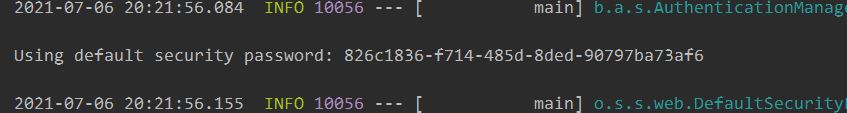
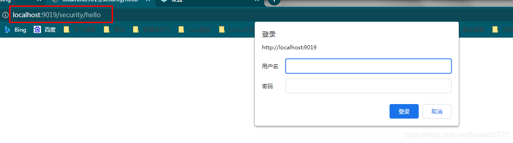
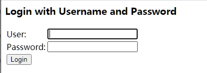
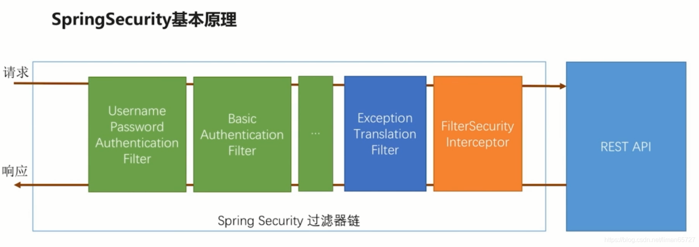
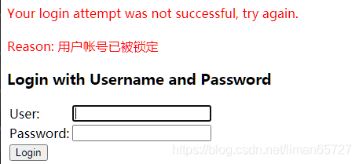
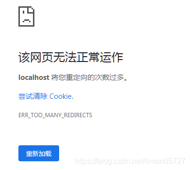
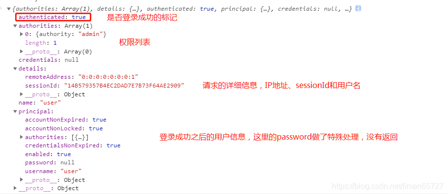
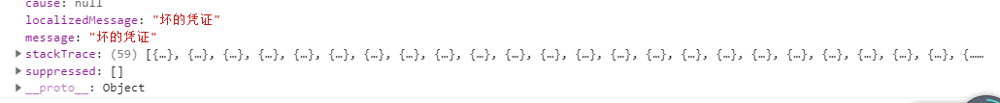

> 本文由 [简悦 SimpRead](http://ksria.com/simpread/) 转码， 原文地址 [blog.csdn.net](https://blog.csdn.net/liman65727/article/details/118633463)

### 文章目录

*   [前言](#_1)
*   [helloworld](#helloworld_5)
*   *   [絮叨一下原理](#_60)
*   [自定义用户认证逻辑](#_71)
*   *   [用户信息的获取](#_75)
    *   [用户信息的校验](#_129)
    *   [加解密](#_209)
*   [自定义认证流程](#_291)
*   *   [自定义登录页面](#_295)
    *   [自定义登录成功的处理](#_413)
    *   [自定义登录失败的处理](#_462)
    *   [自定义登录的扩展](#_496)
*   [总结](#_538)

前言
==

从本篇开始，算是正式学习 spring-security，在前两篇博客的基础上，慢慢丰富我们的实例（不是我的，是 mk 网上某一个课程的）

helloworld
==========

spring-security 的开发，和我们普通项目的[应用开发](https://so.csdn.net/so/search?q=%E5%BA%94%E7%94%A8%E5%BC%80%E5%8F%91&spm=1001.2101.3001.7020)还不太一样，我们在原有的基础上先跑通 spring-security 简单的 helloworld

```
security.basic.enabled = true
```

在 spring-security-demo 应用中加入（如果不清楚应用之间关系的，可以翻看本系列博客的第一章），上面的配置，然后启动项目，

启动日志中有这样一行



这就是默认的密码，然后随便访问一个业务接口，会弹出一个密码框



输入用户名——user，密码就是日志中的哪一长串，之后才能正常访问业务接口

上述还不是 helloworld 的全部，还有一些要絮叨的

在 browser 模块中加入如下的配置类

```
import org.springframework.context.annotation.Configuration;
import org.springframework.security.config.annotation.web.builders.HttpSecurity;
import org.springframework.security.config.annotation.web.configuration.WebSecurityConfigurerAdapter;

/**
 * autor:liman
 * createtime:2021/7/6
 * comment:
 */
@Configuration
public class BrowserSecurityConfig extends WebSecurityConfigurerAdapter {

    @Override
    protected void configure(HttpSecurity http) throws Exception {
        http.formLogin()//采用表单登录
                .and()
                .authorizeRequests()//并且要认证请求
                .anyRequest()//对任意的请求
                .authenticated();//都需要做认证
    }
}
```

这里配置的采用[表单](https://so.csdn.net/so/search?q=%E8%A1%A8%E5%8D%95&spm=1001.2101.3001.7020)登录，之后登录页面会变成如下所示，而不是弹出一本 basic 对话框，进行登录，这里默认实现表单登录，如果想通过上述配置类变成 Basic 的对话框登录，只需要将 http.formLogin 变成 http.httpBasic 即可。



絮叨一下原理
------

spring-security 和我们传统的开发方式不一样。一张图可以简述 spring-security 的原理



spring-security 是基于过滤器链进行开发的，最核心的也就是一组过滤器，最右边的其实就表示我们的应用，在 spring-security 中的这些过滤器，springboot 启动的时候会自动为我们注入，其中绿色的过滤器就是用来认证用户身份的。比如我们上表面的 helloworld 实际介绍了两种认证方式，一种是用户名密码的表单登录，一种是 HTTPBasic 的登录，每个过滤器会检查请求头中是否有自己需要的参数，如果有，自己则会处理当前的用户认证，处理完成之后，将用户标记为已登录。最后一个 FilterSecurityInterceptor 是最终的一个守门人，在这个拦截器中会决定当前请求是否能访问到后面的业务接口。如果能访问则会放过当前请求，如果不能访问，则会根据不同的原因抛出不同的异常。后续的 ExceptionTranslationFilter 会捕获 FilterSecurityInterceptor 抛出的相关异常，并进行不同的处理。

实际中 spring-security 中的过滤器链远比这个复杂的多。这里只是针对最基本的 helloworld 的实例进行简单的介绍。

自定义用户认证逻辑
=========

helloworld 中简单介绍了表单登录，但是密码是 spring-security 自动生成的，这种肯定不能满足我们自定义的开发。

用户信息的获取
-------

关于用户信息的获取，spring-security 是定义在`UserDetailsService`接口中，这个接口只有一个方法，源码如下

```
public interface UserDetailsService {
	// ~ Methods
	// ========================================================================================================

	/**
	 * Locates the user based on the username. In the actual implementation, the search
	 * may possibly be case sensitive, or case insensitive depending on how the
	 * implementation instance is configured. In this case, the <code>UserDetails</code>
	 * object that comes back may have a username that is of a different case than what
	 * was actually requested..
	 *
	 * @param username the username identifying the user whose data is required.
	 *
	 * @return a fully populated user record (never <code>null</code>)
	 *
	 * @throws UsernameNotFoundException if the user could not be found or the user has no
	 * GrantedAuthority
	 */
	UserDetails loadUserByUsername(String username) throws UsernameNotFoundException;
}
```

我们只需要自定义实现这个接口，然后交个 spring 管理即可

自定义的读取用户信息服务里，这里没有操作数据库，但是这个类已经通过 @Component 进行了声明，其中可以依赖自定义的其他处理逻辑。

```
@Component
@Slf4j
public class MyUserDetailService implements UserDetailsService {


    /**
     * 根据用户名查找用户信息
     * @param username
     * @return
     * @throws UsernameNotFoundException
     */
    @Override
    public UserDetails loadUserByUsername(String username) throws UsernameNotFoundException {
        log.info("根据用户名查找用户信息:{}",username);
        //初始话一个User对象，User对象实现了UserDetails信息，目前可以忽略第三个参数
        return new User(username,"123456",AuthorityUtils.commaSeparatedStringToAuthorityList("admin"));
    }
}
```

之后，表单登录的密码变成了 123456，而不是每次启动 spring-security 自动生成的密码。

用户信息的校验
-------

用户的校验分为两部分，密码校验和其他用户状态的校验（比如账号是否过期）。关于这些，在 **UserDetails** 接口中都有定义

```
public interface UserDetails extends Serializable {

	/**
	 * Returns the authorities granted to the user. Cannot return <code>null</code>.
	 *
	 * @return the authorities, sorted by natural key (never <code>null</code>)
	 */
	Collection<? extends GrantedAuthority> getAuthorities();

	/**
	 * Returns the password used to authenticate the user.
	 *
	 * @return the password
	 */
	String getPassword();

	/**
	 * Returns the username used to authenticate the user. Cannot return <code>null</code>
	 * .
	 *
	 * @return the username (never <code>null</code>)
	 */
	String getUsername();

	/**
	 * Indicates whether the user's account has expired. An expired account cannot be
	 * authenticated.
	 *
	 * @return <code>true</code> if the user's account is valid (ie non-expired),
	 * <code>false</code> if no longer valid (ie expired)
	 */
	boolean isAccountNonExpired();

	/**
	 * Indicates whether the user is locked or unlocked. A locked user cannot be
	 * authenticated.
	 *
	 * @return <code>true</code> if the user is not locked, <code>false</code> otherwise
	 */
	boolean isAccountNonLocked();

	/**
	 * Indicates whether the user's credentials (password) has expired. Expired
	 * credentials prevent authentication.
	 *
	 * @return <code>true</code> if the user's credentials are valid (ie non-expired),
	 * <code>false</code> if no longer valid (ie expired)
	 */
	boolean isCredentialsNonExpired();

	/**
	 * Indicates whether the user is enabled or disabled. A disabled user cannot be
	 * authenticated.
	 *
	 * @return <code>true</code> if the user is enabled, <code>false</code> otherwise
	 */
	boolean isEnabled();
}
```

其中有 4 个 boolean 类型的方法，分别表示：账户是否过期，账户是否锁定，认证是否过期，用户是否可用（按照方法声明顺序是这样）。

在上一小结中，我们初始化 User 对象的时候，并没有指定这 4 个参数，User 对象其实还提供了几个构造函数，这几个多出的几个参数，就是指定这四个值。

```
return new User(username,"123456",
        true,true,true,false,
        AuthorityUtils.commaSeparatedStringToAuthorityList("admin"));
```

在自定义的 UserDetailService 中，可以构造上面的 User 对象，第四个参数，表示用户被锁定（实际开发中，这些肯定需要根据自身逻辑进行设置）。这个时候，如果密码即使输入正确，也会有如下提示



加解密
---

应该没有系统存储用户的明文密码吧，加解密这玩意肯定还是得有的。spring-security 中处理加解密的接口是一个 **PasswordEncoder** 的接口。这个接口其中就两个方法

```
public interface PasswordEncoder {

	/**
	 * Encode the raw password. Generally, a good encoding algorithm applies a SHA-1 or
	 * greater hash combined with an 8-byte or greater randomly generated salt.
	 */
	String encode(CharSequence rawPassword);

	/**
	 * Verify the encoded password obtained from storage matches the submitted raw
	 * password after it too is encoded. Returns true if the passwords match, false if
	 * they do not. The stored password itself is never decoded.
	 *
	 * @param rawPassword the raw password to encode and match
	 * @param encodedPassword the encoded password from storage to compare with
	 * @return true if the raw password, after encoding, matches the encoded password from
	 * storage
	 */
	boolean matches(CharSequence rawPassword, String encodedPassword);

}
```

从名字也可以看出，一个方法是加密，一个方法是匹配密文。

只需要在配置中加上 PasswordEncoder 的具体实现类，spring-security 会自动为我们加密前端上送的密码

```
@Configuration
public class BrowserSecurityConfig extends WebSecurityConfigurerAdapter {

    @Bean
    public PasswordEncoder passwordEncoder(){
        return new BCryptPasswordEncoder();
    }

    @Override
    protected void configure(HttpSecurity http) throws Exception {
        http.formLogin()//采用表单登录
                .and()
                .authorizeRequests()//并且要认证请求
                .anyRequest()//对任意的请求
                .authenticated();//都需要做认证
    }
}
```

配置类中加入我们需要的加解密组件。后续我们匹配密文需要用到 PasswordEncoder 的话，也只需要注入即可。

```
@Component
@Slf4j
public class MyUserDetailService implements UserDetailsService {

    @Autowired
    private PasswordEncoder passwordEncoder;


    /**
     * 根据用户名查找用户信息
     * @param username
     * @return
     * @throws UsernameNotFoundException
     */
    @Override
    public UserDetails loadUserByUsername(String username) throws UsernameNotFoundException {
        log.info("根据用户名查找用户信息:{}",username);
        //这里是匹配加密后的结果
        return new User(username,passwordEncoder.encode("123456"),
                true,true,true,true,
                AuthorityUtils.commaSeparatedStringToAuthorityList("admin"));
    }
}
```

通过打印日志，可以看到每次请求看到的密文都是不一样的。

自定义认证流程
=======

如果单纯的需要实现自定义的用户认证逻辑，其实并不复杂上面的实例基本够用，但是如果想实现自定义的认证流程，就有些复杂了

自定义登录页面
-------

指定自定义登录页面比较简单，只需要在我们之前的配置类——BrowserSecurityConfig 中配置如下结果即可

```
@Override
protected void configure(HttpSecurity http) throws Exception {

    http.formLogin()//采用表单登录
            .loginPage("/self-login.html")//指定登录的页面
            .and()
            .authorizeRequests()//并且要认证请求
        	//如果加上了自定义的登录页面，一定要将自定义的登录页面请求放开，否则会出现重定向过多的问题
            .antMatchers("/self-login.html").permitAll()//登录页的请求不需要认证
            .anyRequest()//对任意的请求
            .authenticated()//都需要做认证
}
```

如果只指定了登录页面，没有将针对登录页面的请求放开登录认证，则会出现如下页面异常。



上述的登录页面 HTML 如下所示：

```
<!DOCTYPE html>
<html lang="en">
<head>
    <meta charset="UTF-8">
    <title>自定义登录页面</title>
</head>
<body>
<form action="authentication/form" method="post">
    <table>
        <tr>
            <td>用户名:</td>
            <td><input type="text" ></td>
        </tr>
        <tr>
            <td>密码:</td>
            <td><input type="password" ></td>
        </tr>
        <tr>
            <td colspan="2"><button type="submit">登录</button></td>
        </tr>
    </table>
</form>
</body>
</html>
```

简单的用户名和密码，简单的登录按钮，这些并没有什么奇特的，但是，需要注意的是，我们登录表单的提交请求有了变化，不再是 spring-security 中默认的 login 了，而是 authentication/form。为此我们需要让 spring-security 知道我们自定义的登录请求不是 login 而是 authentication/form，需要做如下配置

```
@Override
protected void configure(HttpSecurity http) throws Exception {

    http.formLogin()//采用表单登录
            .loginPage("/self-login.html")//指定登录的页面
            .loginProcessingUrl("/authentication/form")//覆盖 UsernamePasswordAuthenticationFilter 中的请求配置，但最终处理这个请求的还是 UsernamePasswordAuthenticationFilter
            .and()
            .authorizeRequests()//并且要认证请求
            .antMatchers("/self-login.html").permitAll()//登录页的请求不需要认证
            .anyRequest()//对任意的请求
            .authenticated()//都需要做认证
            .and().csrf().disable();//关闭csrf
}
```

这里加入了 loginProcessingUrl 的配置，同时关闭了从 csrf 的跨域防护（后续会介绍），针对这个 url 的请求，spring-security 依旧会调用 UsernamePasswordAuthenticationFilter 进行登录的认证处理（后续会介绍自定义 Filter 处理登录的方式）

关于 loginPage 的配置，在多说几句，如果考虑到扩展性，loginPage 中指定的可以是一个针对 Controller 访问的请求，在目标 controller 中可以根据跳转的 url 进行判断，如果是 html 结尾引发的跳转，则可以重定向到自定义的登录页面，如果是 Restful 风格的请求引发的跳转，则可以直接返回相关的响应报文。如下是一个实现的参考

```
/**
 * autor:liman
 * createtime:2021/7/9
 * comment:
 */
@RestController
@Slf4j
public class SecurityHandlerController {

    //引发请求的缓存对象
    private RequestCache requestCache = new HttpSessionRequestCache();

    //用于跳转
    private RedirectStrategy redirectStrategy = new DefaultRedirectStrategy();

    @Autowired
    private SecurityProperties securityProperties;

    /**
     * 需要身份认证的时候，跳转到这里
     * @param request
     * @param response
     * @return
     */
    @RequestMapping("/authentication/require")
    @ResponseStatus(code = HttpStatus.UNAUTHORIZED)
    public BaseResponse authenticationHandle(HttpServletRequest request, HttpServletResponse response) throws IOException {
        SavedRequest savedRequest = requestCache.getRequest(request, response);
        if(null!=savedRequest){
            String target = savedRequest.getRedirectUrl();
            log.info("引发跳转的请求是：{}",target);
            if(StringUtils.endsWithIgnoreCase(target,".html")){
                //如果用户配置了登录页，则跳转到登录页，如果没配置，则返回401，未认证的状态码
                String loginPage = securityProperties.getBrowser().getLoginPage();
                redirectStrategy.sendRedirect(request,response,loginPage);
            }
        }
        return new BaseResponse(StatusCode.NEED_LOGIN);
    }
}
```

自定义登录成功的处理
----------

spring-security 自定义登录处理也比较容易，只需要简单实现 AuthenticationSuccessHandler 接口即可

```
/**
 * autor:liman
 * createtime:2021/7/10
 * comment: 自定义登录成功处理器
 */
@Component("selfAuthenticationSuccessHandler")
@Slf4j
public class SelfAuthenticationSuccessHandler implements AuthenticationSuccessHandler {

    @Autowired
    private ObjectMapper objectMapper;

    @Override
    public void onAuthenticationSuccess(HttpServletRequest request, HttpServletResponse response, Authentication authentication) throws IOException, ServletException {
        log.info("自定义登录成功处理器");
        response.setContentType("application/json;charset=utf-8");
        response.getWriter().write(objectMapper.writeValueAsString(authentication));//将authentication作为json写到前端

    }
}
```

之后，将登录成功的处理器交给 spring-security 管理

```
http.formLogin()//采用表单登录
        .loginPage("/authentication/require")//指定登录的页面
        .loginProcessingUrl("/authentication/form")//覆盖 UsernamePasswordAuthenticationFilter 中的请求配置，但最终处理这个请求的还是 UsernamePasswordAuthenticationFilter
        .successHandler(selfAuthenticationSuccessHandler)//自定义登录成功处理器
        .and()
        .authorizeRequests()//并且要认证请求
        .antMatchers("/authentication/require",securityProperties.getBrowser().getLoginPage()).permitAll()//登录页的请求不需要认证
        .anyRequest()//对任意的请求
        .authenticated()//都需要做认证
        .and().csrf().disable();//关闭csrf
```

其中第三个参数包含了登录请求的参数以及登录之后返回的相关用户信息，这里将 authentication 信息作为 json 返回给了前端，通过调试工具可以看到如下信息



其中的 principal 就是返回的 UserDetail 信息，如果采用的是第三方登录（QQ 登录或者微信登录）则 authentication 信息会有所不同

自定义登录失败的处理
----------

自定义登录失败的处理和自定义登录成功的处理大同小异。直接实现 AuthenticationFailureHandler 接口，然后在登录配置中告知 spring-security 即可（这里不再贴出配置信息）

```
/**
 * autor:liman
 * createtime:2021/7/10
 * comment:自定义登录失败的处理
 */
@Component("selfAuthenticationFailureHandler")
@Slf4j
public class SelfAuthenticationFailureHandler implements AuthenticationFailureHandler {

    @Autowired
    private ObjectMapper objectMapper;

    @Override
    public void onAuthenticationFailure(HttpServletRequest request, HttpServletResponse response
            , AuthenticationException exception) throws IOException, ServletException {
        log.info("自定义认证失败处理器");
        response.setContentType("application/json;charset=utf-8");
        response.getWriter().write(objectMapper.writeValueAsString(exception));//将 exception 作为json写到前端
    }
}
```

启动系统，通过简单调试得到如下信息



堆栈信息也返回到了前端，这里我们不用关注，只需要关注 message 即可。

自定义登录的扩展
--------

在上述自定义登录成功和失败的处理中，我们通过实现`AuthenticationSuccessHandler`和`AuthenticationFailureHandler`接口来实现自定义的登录成功和失败的处理逻辑，但是其实 spring-security 中有一个默认的实现——`SimpleUrlAuthenticationFailureHandler`，我们可通过继承这个类，使我们的登录处理更加灵活

以登录成功的处理为例

```
/**
 * autor:liman
 * createtime:2021/7/10
 * comment: 自定义登录成功处理器
 */
@Component("selfAuthenticationSuccessHandler")
@Slf4j
public class SelfAuthenticationSuccessHandler extends SimpleUrlAuthenticationSuccessHandler {

    @Autowired
    private SecurityProperties securityProperties;

    @Autowired
    private ObjectMapper objectMapper;

    @Override
    public void onAuthenticationSuccess(HttpServletRequest request, HttpServletResponse response
            , Authentication authentication) throws IOException, ServletException {
//        log.info("自定义登录成功处理器");
//        response.setContentType("application/json;charset=utf-8");
//        response.getWriter().write(objectMapper.writeValueAsString(authentication));//将authentication作为json写到前端

        log.info("自定义登录成功的处理器");
        if (LoginType.JSON.equals(securityProperties.getBrowser().getLoginType())) {//如果配置的登录方式是json返回
            response.setContentType("application/json;charset=utf-8");
            response.getWriter().write(objectMapper.writeValueAsString(authentication));//将authentication作为json写到前端
        }else{//如果不是json的登录返回方式，则调用父类的方式进行跳转（这也是为啥要继承SimpleUrlAuthenticationSuccessHandler的原因）
            super.onAuthenticationSuccess(request,response,authentication);
        }
    }
}
```

我们可以让使用我们登录模块的开发者，通过指定配置实现登录成功的处理逻辑是返回 json 还是跳转到登录之前访问的页面，这些都是可以配置化实现的

总结
==

简单总结了一下基于表单登录的一些内容，关于源码可以参考如下 github——[my 2021_learn_project_source_code](https://github.com/liman657/2021_learn_project)。其中以 spring-security 开头的模块既是这个系列的代码。下一篇博客将会总结 spring-security 中验证码登录的相关问题。