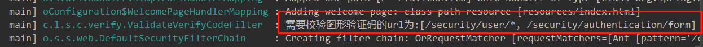

> 本文由 [简悦 SimpRead](http://ksria.com/simpread/) 转码， 原文地址 [blog.csdn.net](https://blog.csdn.net/liman65727/article/details/118652233?spm=1001.2014.3001.5502)

### 文章目录

*   [前言](#_1)
*   [图形验证码校验](#_15)
*   *   [初级版本](#_19)
    *   [简单重构一下](#_323)
    *   *   [1、图形验证参数可配置](#1_327)
        *   [2、需要验证的接口可配置](#2_436)
        *   [3、图形验证码的生成逻辑可配置](#3_525)
*   [短信验证码校验](#_624)
*   [总结](#_701)

前言
==

上一篇博客总结了一下 spring-security 基于表单登录的一些细节，但是正常开发中，一个登录很多都会有验证码，这篇博客会在表单登录的基础上，总结一个灵活的，可扩展的验证码模块。如果说对验证码校验流程不熟悉的话，可以先大致看看下面这张[时序图](https://so.csdn.net/so/search?q=%E6%97%B6%E5%BA%8F%E5%9B%BE&spm=1001.2101.3001.7020)。在介绍短信验证码登录之前，顺便介绍一下图形验证码的校验


图形验证码校验
=======

spring-security 没有自带的验证码功能，因此需要我们自己开发相关验证码功能，这里实际代码会多一些。

初级版本
----

1、定义一个图形验证码类型

```
/**
 * autor:liman
 * createtime:2021/7/10
 * comment: 图形验证码
 */
@Data
public class ImageVerifyCode {
	//要输出到前端的图形验证码
    private BufferedImage image;
	//验证码的值
    private String verifyCode;
	//过期时间
    private LocalDateTime expireTime;

    public ImageVerifyCode(BufferedImage image, String verifyCode, int expireSecond) {
        this.image = image;
        this.verifyCode = verifyCode;
        this.expireTime = LocalDateTime.now().plusSeconds(expireSecond);
    }

    public ImageVerifyCode(BufferedImage image, String verifyCode, LocalDateTime expireTime) {
        this.image = image;
        this.verifyCode = verifyCode;
        this.expireTime = expireTime;
    }
    //判断验证码是否过期
    public boolean isExpire(){
        return LocalDateTime.now().isAfter(expireTime);
    }
}
```

2、生成验证码的请求

```
/**
 * autor:liman
 * createtime:2021/7/10
 * comment:校验码的请求
 */
@RestController
@Slf4j
public class VerifyCodeController {

    //图形验证码的key值
    public static final String SESSION_VERIFY_IMG_CODE = "SESSION_KEY_IMG_CODE";

    //用于往session中存入验证码
    private SessionStrategy sessionStrategy = new HttpSessionSessionStrategy();

    @GetMapping("/verifycode/img")
    public void createImgCode(HttpServletRequest request,HttpServletResponse response) throws IOException {
        ImageVerifyCode imageVerifyCode = generateImageVerifyCode(request);
        //验证码放入session 
        sessionStrategy.setAttribute(new ServletWebRequest(request),SESSION_VERIFY_IMG_CODE,imageVerifyCode);
        //验证码输出到页面
        ImageIO.write(imageVerifyCode.getImage(),"JPEG",response.getOutputStream());
    }

    /**
     * 生成图形验证码
     * @param request
     * @return
     */
    private ImageVerifyCode generateImageVerifyCode(HttpServletRequest request){
        int width = 67;
        int height = 23;
        BufferedImage image = new BufferedImage(width, height, BufferedImage.TYPE_INT_RGB);

        Graphics g = image.getGraphics();

        Random random = new Random();

        g.setColor(getRandColor(200, 250));
        g.fillRect(0, 0, width, height);
        g.setFont(new Font("Times New Roman", Font.ITALIC, 20));
        g.setColor(getRandColor(160, 200));
        for (int i = 0; i < 155; i++) {
            int x = random.nextInt(width);
            int y = random.nextInt(height);
            int xl = random.nextInt(12);
            int yl = random.nextInt(12);
            g.drawLine(x, y, x + xl, y + yl);
        }

        String sRand = "";
        for (int i = 0; i < 4; i++) {
            String rand = String.valueOf(random.nextInt(10));
            sRand += rand;
            g.setColor(new Color(20 + random.nextInt(110), 20 + random.nextInt(110), 20 + random.nextInt(110)));
            g.drawString(rand, 13 * i + 6, 16);
        }

        g.dispose();

        return new ImageVerifyCode(image, sRand, 60);
    }

    /**
     * 生成随机背景条纹
     *
     * @param fc
     * @param bc
     * @return
     */
    private Color getRandColor(int fc, int bc) {
        Random random = new Random();
        if (fc > 255) {
            fc = 255;
        }
        if (bc > 255) {
            bc = 255;
        }
        int r = fc + random.nextInt(bc - fc);
        int g = fc + random.nextInt(bc - fc);
        int b = fc + random.nextInt(bc - fc);
        return new Color(r, g, b);
    }
}
```

3、定义一个过滤器，校验图形验证码

这个过滤器继承至`OncePerRequestFilter`表示只可能被拦截一次。需要说明的是，下面的认证过滤器针对认证失败的处理，是我们在上一篇博客中自定义的认证失败处理器

```
/**
 * autor:liman
 * createtime:2021/7/10
 * comment:校验验证码的过滤器
 */
@Slf4j
public class ValidateVerifyCodeFilter extends OncePerRequestFilter {

    //认证失败的异常处理
    private AuthenticationFailureHandler authenticationFailureHandler;

    //用于获取session
    private SessionStrategy sessionStrategy = new HttpSessionSessionStrategy();

    @Override
    protected void doFilterInternal(HttpServletRequest request, HttpServletResponse response, FilterChain filterChain) throws ServletException, IOException {
        String requestUrl = request.getRequestURI();
        String requestMethod = request.getMethod();
        if(StringUtils.equalsIgnoreCase("/security/authentication/form",requestUrl)
                && StringUtils.endsWithIgnoreCase("post",requestMethod)){//如果是表单登录的认证请求
            //开始验证码的校验
            try{
                validateVerifyCode(new ServletWebRequest(request));
            }catch (VerifyCodeException e){//这里抛出自定义的验证码异常，这个异常继承至AuthenticationException
                authenticationFailureHandler.onAuthenticationFailure(request,response,e);
                log.error("校验验证码异常");
                return;
            }
        }

        //如果不是登录的校验请求，则直接放过
        filterChain.doFilter(request,response);
    }

    //真正校验验证码的方法
    private void validateVerifyCode(ServletWebRequest request) throws VerifyCodeException{
        //从会话中获取验证码
        ImageVerifyCode codeInSession = (ImageVerifyCode) sessionStrategy.getAttribute(request,VerifyCodeController.SESSION_VERIFY_IMG_CODE);
        String codeInRequest;
        try {
            //从请求中获取图形验证码
            codeInRequest = ServletRequestUtils.getStringParameter(request.getRequest(),
                    "imgCode");
        } catch (ServletRequestBindingException e) {
            throw new VerifyCodeException("获取验证码的值失败");
        }

        if (StringUtils.isBlank(codeInRequest)) {
            throw new VerifyCodeException("请填写验证码");
        }

        if (codeInSession == null) {
            throw new VerifyCodeException("验证码不存在");
        }

        if (codeInSession.isExpire()) {
            //验证码过期直接移除
            sessionStrategy.removeAttribute(request, VerifyCodeController.SESSION_VERIFY_IMG_CODE);
            throw new VerifyCodeException("验证码已过期，请重新获取");
        }

        if (!StringUtils.equals(codeInSession.getVerifyCode(), codeInRequest)) {
            throw new VerifyCodeException("验证码不正确");
        }
		//验证完验证码之后，直接移除
        sessionStrategy.removeAttribute(request, VerifyCodeController.SESSION_VERIFY_IMG_CODE);
    }


    public AuthenticationFailureHandler getAuthenticationFailureHandler() {
        return authenticationFailureHandler;
    }

    public void setAuthenticationFailureHandler(AuthenticationFailureHandler authenticationFailureHandler) {
        this.authenticationFailureHandler = authenticationFailureHandler;
    }
}
```

4、自定义验证码验证的异常

这个自定义异常继承至 spring-security 中的`AuthenticationException`

```
/**
 * autor:liman
 * createtime:2021/7/10
 * comment:自定义的验证码异常
 */
public class VerifyCodeException extends AuthenticationException {

    public VerifyCodeException(String detail) {
        super(detail);
    }
}
```

5、页面作出相关调整

```
<form action="authentication/form" method="post">
    <table>
        <tr>
            <td>用户名:</td>
            <td><input type="text" ></td>
        </tr>
        <tr>
            <td>密码:</td>
            <td><input type="password" ></td>
        </tr>
        <tr>
            <td>图形验证码:</td>
            <td>
                <input type="text" >
                
            </td>
        </tr>
        <tr>
            <td colspan="2"><button type="submit">登录</button></td>
        </tr>
    </table>
</form>
```

表单中加入了图形验证码的部分

6、最关键的配置

需要将我们定义的过滤器加入到 spring-security 的过滤器链中（前面几篇博客介绍过，spring-security 是基于过滤器链进行的认证）

```
@Configuration
public class BrowserSecurityConfig extends WebSecurityConfigurerAdapter {

    @Autowired
    private SecurityProperties securityProperties;
    //自定义登录成功处理器
    @Autowired
    private SelfAuthenticationSuccessHandler selfAuthenticationSuccessHandler;
    @Autowired
    private SelfAuthenticationFailureHandler selfAuthenticationFailureHandler;

    @Bean
    public PasswordEncoder passwordEncoder() {
        return new BCryptPasswordEncoder();
    }

    @Override
    protected void configure(HttpSecurity http) throws Exception {
		//初始化自定义的认证过滤器（这里不能用注入的方式）
        ValidateVerifyCodeFilter validateVerifyCodeFilter = new ValidateVerifyCodeFilter();
        validateVerifyCodeFilter.setAuthenticationFailureHandler(selfAuthenticationFailureHandler);

//将自定义的验证码认证过滤器加入到     UsernamePasswordAuthenticationFilter之前
        http.addFilterBefore(validateVerifyCodeFilter,UsernamePasswordAuthenticationFilter.class)
                .formLogin()//采用表单登录
                .loginPage("/authentication/require")//指定登录的页面
                .loginProcessingUrl("/authentication/form")//覆盖 UsernamePasswordAuthenticationFilter 中的请求配置，但最终处理这个请求的还是 UsernamePasswordAuthenticationFilter
                .successHandler(selfAuthenticationSuccessHandler)//自定义登录成功处理器
                .failureHandler(selfAuthenticationFailureHandler)
                .and()
                .authorizeRequests()//并且要认证请求
                .antMatchers("/authentication/require",securityProperties.getBrowser().getLoginPage(),
                        "/verifycode/img").permitAll()//登录页的请求不需要认证
                .anyRequest()//对任意的请求
                .authenticated()//都需要做认证
                .and().csrf().disable();//关闭csrf
    }
}
```

抛开业务层面的东西，最核心，最关键的也就是第 6 步，将自己用于认证校验的过滤器交给 spring-security 进行托管。以上的初级版本也只是实现了一个功能，并没有考虑过多的扩展和配置性

简单重构一下
------

以上代码只是简单的实现了图形验证的功能，针对图形验证码的过期时间，字符长度，以及目标接口的路径都是固定写在代码中的，这些其实都可以抽取成配置。更进一步考虑，我们完全可以将生成图形验证码的方法抽取成一个接口，使得系统在增加其他验证方式的时候可以很方便的集成进来。

### 1、图形验证参数可配置

针对图形验证码参数可配置的要求，我们采用自定义配置项的方式实现

准备如下配置项

SecurityProperties

```
@ConfigurationProperties(prefix = "self.security.core")
public class SecurityProperties {

    private VerifyCodeProperties verifyCode = new VerifyCodeProperties();

    public VerifyCodeProperties getVerifyCode() {
        return verifyCode;
    }

    public void setVerifyCode(VerifyCodeProperties verifyCode) {
        this.verifyCode = verifyCode;
    }
}
```

VerifyCodeProperties

```
@Data
public class VerifyCodeProperties {
    private ImageVerifyCodeProperties image = new ImageVerifyCodeProperties();
}
```

ImageVerifyCodeProperties

```
/**
 * autor:liman
 * createtime:2021/7/10
 * comment: 图形验证码的配置类
 */
 @Data
public class ImageVerifyCodeProperties {

    private int width = 67;
    private int height = 23;
    private int length = 4;
    private int expireSecond = 60;

    //需要校验图形验证码的url（为后续准备的）
    private String urls = "";
}
```

将配置项暴露出去

```
/**
 * autor:liman
 * createtime:2021/7/9
 * comment:
 */
@Configuration
@EnableConfigurationProperties(SecurityProperties.class)
public class SecurityCoreConfig {
}
```

这样可以在自己的项目中对图形验证码的相关属性进行配置

```
#验证码的配置
##图形验证码的配置
self.security.core.verifyCode.image.length = 6
self.security.core.verifyCode.image.width=200
```

这里只配置了长度和验证码图片的宽度，在生成验证码的逻辑中，需要做相关改动

```
/**
 * 生成图形验证码
 * @param request
 * @return
 */
private ImageVerifyCode generateImageVerifyCode(ServletWebRequest request){
    //width和height如果参数未读取到，则从配置中进行读取
    int width = ServletRequestUtils.getIntParameter(request.getRequest(), "width", securityProperties.getVerifyCode().getImage().getWidth());
    int height = ServletRequestUtils.getIntParameter(request.getRequest(), "height", securityProperties.getVerifyCode().getImage().getHeight());
    BufferedImage image = new BufferedImage(width, height, BufferedImage.TYPE_INT_RGB);

	//省略其他代码......

    //从配置中读取验证码的长度和过期时间
    int length = securityProperties.getVerifyCode().getImage().getLength();
    int expireSecond = securityProperties.getVerifyCode().getImage().getExpireSecond();


    //省略其他代码......

    return new ImageVerifyCode(image, sRand, expireSecond);
}
```

测试结果：


### 2、需要验证的接口可配置

如果要访问某一个接口需要图形验证码，想通过直接配置实现，这个也是可以实现的，上面的`ImageVerifyCodeProperties`增加了 urls 属性，这个就是指定需要验证图形验证码的配置项，这里需要针对验证验证码的过滤器进行一些调整，通过实现`InitializingBean`接口，通过实现其中的`afterPropertiesSet`方法完成对需要校验 url 的初始化

```
/**
 * autor:liman
 * createtime:2021/7/10
 * comment:校验验证码的过滤器
 */
@Slf4j
public class ValidateVerifyCodeFilter extends OncePerRequestFilter implements InitializingBean {
    //认证失败的异常处理
    private AuthenticationFailureHandler authenticationFailureHandler;
    //拥有获取session
    private SessionStrategy sessionStrategy = new HttpSessionSessionStrategy();
    //配置类
    private SecurityProperties securityProperties;
    //存储需要验证的url
    private Set<String> toVerifyUrls=new HashSet<>();

    //用于判断url是否是目标url
    private AntPathMatcher antPathMatcher=new AntPathMatcher();

    //实现了InitializingBean接口，可以在属性初始化完成之后进行一些操作
    @Override
    public void afterPropertiesSet() throws ServletException {
        super.afterPropertiesSet();
        String configUrls = securityProperties.getVerifyCode().getImage().getUrls();
        String[] configTargetUrls = StringUtils.splitByWholeSeparatorPreserveAllTokens(configUrls,",");
        for(String url:configTargetUrls){
            toVerifyUrls.add(url);
        }
        toVerifyUrls.add("/security/authentication/form");//登录的url是一定要校验图形验证码的
        log.info("需要校验图形验证码的url为:{}",toVerifyUrls);
    }

    @Override
    protected void doFilterInternal(HttpServletRequest request, HttpServletResponse response, FilterChain filterChain) throws ServletException, IOException {
        String requestUrl = request.getRequestURI();
        String requestMethod = request.getMethod();

        //匹配请求url是否在需要校验的url集合中，如果在，则表明需要校验图形验证码
        boolean isNeedVerify = false;
        for(String url:toVerifyUrls){
            if(antPathMatcher.match(url,requestUrl)){
                isNeedVerify = true;
            }
        }
        if(isNeedVerify){//如果需要校验
            //开始验证码的校验
            //这里省略验证码验证的逻辑……
        }

        //如果不是登录的校验请求，则直接放过
        filterChain.doFilter(request,response);
    }

    public SecurityProperties getSecurityProperties() {
        return securityProperties;
    }

    public void setSecurityProperties(SecurityProperties securityProperties) {
        this.securityProperties = securityProperties;
    }

    public AuthenticationFailureHandler getAuthenticationFailureHandler() {
        return authenticationFailureHandler;
    }

    public void setAuthenticationFailureHandler(AuthenticationFailureHandler authenticationFailureHandler) {
        this.authenticationFailureHandler = authenticationFailureHandler;
    }
}
```

在配置文件中直接配置

```
##图形验证码需要校验的url配置
self.security.core.verifyCode.image.urls=/security/user/*
```

项目启动的时候，可以看到相关日志输出



### 3、图形验证码的生成逻辑可配置

更进一步考虑，如果我们的应用作为一个模块提供给其他人员调用，我们的验证码逻辑就高度定制了。是否可以做到图形验证码的逻辑可配置？这个也是可以的

1、我们将生成验证码的功能抽象成一个接口，原来是直接杂糅在 controller 中的

```
/**
 * autor:liman
 * createtime:2021/7/10
 * comment: 验证码生成接口
 */
public interface IVerifyCodeGenerator {

    /**
     * 生成验证码的接口
     * @param request
     * @return
     */
    public ImageVerifyCode generateVerifyCode(ServletWebRequest request);

}
```

2、生成验证码的具体实现代码

```
/**
 * autor:liman
 * createtime:2021/7/10
 * comment:图形验证码生成器
 */
public class ImageVerifyCodeGenerator implements IVerifyCodeGenerator{

    private SecurityProperties securityProperties;

    @Override
    public ImageVerifyCode generateVerifyCode(ServletWebRequest request) {
		//和上文一样，这里省略
    }

    public SecurityProperties getSecurityProperties() {
        return securityProperties;
    }

    public void setSecurityProperties(SecurityProperties securityProperties) {
        this.securityProperties = securityProperties;
    }
}
```

3、controller 就变得简单了

```
@RestController
@Slf4j
public class VerifyCodeController {

    public static final String SESSION_VERIFY_IMG_CODE = "SESSION_KEY_IMG_CODE";

    //用于往session中存入验证码
    private SessionStrategy sessionStrategy = new HttpSessionSessionStrategy();

    @Autowired
    private SecurityProperties securityProperties;
    @Autowired
    private IVerifyCodeGenerator imageVerifyCodeGenerator;

    @GetMapping("/verifycode/img")
    public void createImgCode(HttpServletRequest request,HttpServletResponse response) throws IOException {
        ServletWebRequest servletWebRequest = new ServletWebRequest(request);
        //这里生成验证码，通过注入的接口多态调用实现类的方法
        ImageVerifyCode imageVerifyCode = imageVerifyCodeGenerator.generateVerifyCode(servletWebRequest);
        sessionStrategy.setAttribute(servletWebRequest,SESSION_VERIFY_IMG_CODE,imageVerifyCode);
        ImageIO.write(imageVerifyCode.getImage(),"JPEG",response.getOutputStream());
    }
}
```

4、通过配置注入`IVerifyCodeGenerator`这里需要加上`@ConditionalOnMissingBean`这个是 springboot 提供的条件注入的注解之一

```
@Configuration
public class VerifyCodeGeneratorConfig {
    @Autowired
    private SecurityProperties securityProperties;

    @Bean
    @ConditionalOnMissingBean(name = "imageVerifyCodeGenerator")//启动时在容器中如果找到imageVerifyCodeGenerator的bean，则不会调用下面的逻辑
    public IVerifyCodeGenerator imageVerifyCodeGenerator() {
        ImageVerifyCodeGenerator imageVerifyCodeGenerator = new ImageVerifyCodeGenerator();
        imageVerifyCodeGenerator.setSecurityProperties(securityProperties);
        return imageVerifyCodeGenerator;
    }
}
```

如果其他开发者引入了我们的安全认证模块，同时他们又不想用我们的短信验证码模块，则可以自行实现`IVerifyCodeGenerator`接口，同时将其名称声明为`imageVerifyCodeGenerator`即可。

短信验证码校验
=======

大体与图片验证码没有什么差别，唯一的差别就是短信是发送出去的，而不是以图片流的方式写到前端的

1、发送短信验证码的业务接口

```
@Autowired
private ISmsCoderSender smsCoderSender;
@Autowired
private IVerifyCodeGenerator smsVerifyCodeGenerator;
/**
 * 短信验证码
 *
 * @param request
 * @param response
 * @throws IOException
 */
@GetMapping("/verifycode/sms")
public void createSmsCode(HttpServletRequest request, HttpServletResponse response) throws IOException, ServletRequestBindingException {
    ServletWebRequest servletWebRequest = new ServletWebRequest(request);
    BaseVerifyCode smsVerifyCode = smsVerifyCodeGenerator.generateVerifyCode(servletWebRequest);
    String mobile = ServletRequestUtils.getRequiredStringParameter(request,"mobile");
    //存入session
    sessionStrategy.setAttribute(servletWebRequest, SESSION_VERIFY_SMS_CODE+mobile, smsVerifyCode);
    //验证码发送
    smsCoderSender.sendSms(mobile,smsVerifyCode.getVerifyCode());
}
```

关于验证码发送，这里絮叨一下，调用我们这个模块的开发者，会有不同的短信发送供应商，不同供应商的发送实现方式不同，因此我们这里提供一个默认实现，同时将短信发送的功能暴露出去

```
/**
 * autor:liman
 * createtime:2021/7/10
 * comment:发送短信验证码的接口
 */
public interface ISmsCoderSender {

    public void sendSms(String mobile,String verifyCode);

}

/**
 * autor:liman
 * createtime:2021/7/10
 * comment: 默认的短信验证码发送方式
 */
@Slf4j
@Component("smsCoderSender")
public class DefaultISmsSender implements ISmsCoderSender {
    @Override
    public void sendSms(String mobile, String verifyCode) {
        log.info("向手机：{}发送短信验证码:{}",mobile,verifyCode);
    }
}
```

添加一个配置类，同时将发送短信的功能暴露出去

```
/**
 * 默认的短信发送方式
 * @return
 */
@Bean
@ConditionalOnMissingBean(ISmsCoderSender.class)
public ISmsCoderSender smsCoderSender(){
    return new DefaultISmsSender();
}
```

这样外部调用的时候，只需要实现`ISmsCoderSender`接口，即可完成短信的发送。

后续实现短信验证码的功能，无非就是定义一个校验过滤器，让后放到 spring-security 认证的过滤器链上，交由 spring-security 进行托管即可。这一步与上面图形验证码校验大同小异。这里就不贴出代码了。

总结
==

这篇博客简单总结了图形验证码和短信验证码的校验逻辑，但是并没有实现短信验证码的登录，同时可以看到在图形验证码和短信验证码校验中，二者似乎有些共性，都是随机生成一个数字串，然后放入 session，唯一不同的是图形验证码是以图片流的方式返回给前端，而验证码是调用通信供应商进行短信发送。这里可以通过模板方法模式对齐进行重构。这些会在下一篇博客中进行总结。