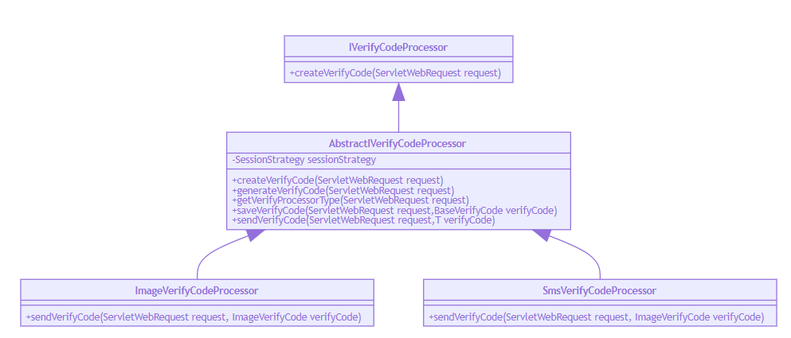

> 本文由 [简悦 SimpRead](http://ksria.com/simpread/) 转码， 原文地址 [blog.csdn.net](https://blog.csdn.net/liman65727/article/details/118653852)

### 文章目录

*   [前言](#_1)
*   [原有代码](#_5)
*   [利用模板方法模式重构](#_64)
*   [总结](#_330)

前言
==

上一篇提供了一个简单版本的图形和验证码校验功能，初步能用，也能满足校验接口的可配置，但是针对图形验证码和短信验证码有许多共同的特性，决定引入模板方法模式对其进行重构为了方便后面介绍短信验证码登录的功能，还是有必要单独开一篇总结一下验证码重构的部分。

原有代码
====

先贴出原有的代码

```
public static final String SESSION_VERIFY_IMG_CODE = "SESSION_KEY_IMG_CODE";
public static final String SESSION_VERIFY_SMS_CODE = "SESSION_KEY_SMS_CODE";

//用于往session中存入验证码
private SessionStrategy sessionStrategy = new HttpSessionSessionStrategy();

@Autowired
private SecurityProperties securityProperties;
@Autowired
private IVerifyCodeGenerator imageVerifyCodeGenerator;
@Autowired
private ISmsCoderSender smsCoderSender;
@Autowired
private IVerifyCodeGenerator smsVerifyCodeGenerator;
/**
 * 图形验证码
 *
 * @param request
 * @param response
 * @throws IOException
 */
@GetMapping("/verifycode/image")
public void createImgCode(HttpServletRequest request, HttpServletResponse response) throws IOException {
    ServletWebRequest servletWebRequest = new ServletWebRequest(request);
    //1、生成验证码
    ImageVerifyCode imageVerifyCode = (ImageVerifyCode) imageVerifyCodeGenerator.generateVerifyCode(servletWebRequest);
    //2、验证码存入session
    sessionStrategy.setAttribute(servletWebRequest, SESSION_VERIFY_IMG_CODE, imageVerifyCode);
    //3、验证码返回给前端
    ImageIO.write(imageVerifyCode.getImage(), "JPEG", response.getOutputStream());
}

/**
 * 短信验证码
 *
 * @param request
 * @param response
 * @throws IOException
 */
@GetMapping("/verifycode/sms")
public void createSmsCode(HttpServletRequest request, HttpServletResponse response) throws IOException, ServletRequestBindingException {
    ServletWebRequest servletWebRequest = new ServletWebRequest(request);
    //1、生成验证码
    BaseVerifyCode smsVerifyCode = smsVerifyCodeGenerator.generateVerifyCode(servletWebRequest);
    String mobile = ServletRequestUtils.getRequiredStringParameter(request,"mobile");
    //2、验证码存入session
    sessionStrategy.setAttribute(servletWebRequest, SESSION_VERIFY_SMS_CODE+mobile, smsVerifyCode);
    //3、发送验证码的短信
    smsCoderSender.sendSms(mobile,smsVerifyCode.getVerifyCode());
}
```

可以看到，验证码接口有其共有的特性，都是生成验证码，验证存入 [session](https://so.csdn.net/so/search?q=session&spm=1001.2101.3001.7020)，然后发送验证码，只是最后一步稍微有些不同，这里就可以通过模板方法模式重构验证码校验模块

利用模板方法模式重构
==========

什么是模板方法模式，这里不做介绍，百度一下，很多大佬介绍的非常到位。这里只是介绍重构后的类结构



我们针对其中的共性进行了抽象提取，封装成一个顶层接口——`IVerifyCodeProcessor`这个类的方法如下

```
/**
 * autor:liman
 * createtime:2021/7/10
 * comment:由于图形验证码和短信验证都是分为三步
 * 1、生成。2、存入session。3、发送。完全可以抽象成模板方法模式
 * 这个就是顶层接口
 */
public interface IVerifyCodeProcessor {

    //验证码前缀
    public static final String SESSOIN_VERIFY_CODE_PREFIX = "SESSION_VERIFY_CODE_FOR_";

    /**
     * 创建验证码
     * @param request
     * @throws Exception
     */
    public void createVerifyCode(ServletWebRequest request) throws Exception;

}
```

其中只有一个创建验证码的接口，针对验证码的生成和存入 session 这两步，可以通过一个抽象类——`AbstractIVerifyCodeProcessor`来完成，其代码如下

```
/**
 * autor:liman
 * createtime:2021/7/10
 * comment:IVerifyCodeProcessor的抽象实现 只处理验证码（BaseVerifyCode）的类型
 */
public abstract class AbstractIVerifyCodeProcessor<T extends BaseVerifyCode> implements IVerifyCodeProcessor {

    //操作session的工具
    private SessionStrategy sessionStrategy = new HttpSessionSessionStrategy();

    /**
     * 注入这个属性的时候，spring会收集系统中所有的 {@link IVerifyCodeGenerator} 接口的实现。
     * 这个就是依赖查找
     */
    @Autowired
    private Map<String, IVerifyCodeGenerator> verifyCodeGenerators;

    @Override
    public void createVerifyCode(ServletWebRequest request) throws Exception {
        T verifyCode = generateVerifyCode(request);//生成验证码
        //保存验证码到session中
        saveVerifyCode(request,verifyCode);
        //发送验证码，这个是个抽象方法，具体实现交给了子类
        sendVerifyCode(request,verifyCode);
    }
    
    /**
     * 生成验证码
     * @param request
     * @return
     */
    private T generateVerifyCode(ServletWebRequest request){
        //先获取生成验证码的类型（是图形验证码还是短信验证码）
        String verifyProcessorType = getVerifyProcessorType(request);
        IVerifyCodeGenerator iVerifyCodeGenerator = verifyCodeGenerators.get(verifyProcessorType);
        //调用指定类型的验证码生成器进行生成相应的验证码
        return (T) iVerifyCodeGenerator.generateVerifyCode(request);
    }

    /**
     * 保存验证码
     * @param request
     */
    private void saveVerifyCode(ServletWebRequest request,BaseVerifyCode verifyCode){
	//验证码存入session
        sessionStrategy.setAttribute(request,SESSOIN_VERIFY_CODE_PREFIX+getVerifyProcessorType(request).toUpperCase(),verifyCode);
    }

    /**
     * 根据请求的url的后半段获取对应校验验证码的类型
     * 图形验证码请求:/verifycode/image
     * 短信验证码请求:/verifycode/sms
     * @param request
     * @return
     */
    private String getVerifyProcessorType(ServletWebRequest request){
        return StringUtils.substringAfter(request.getRequest().getRequestURI(),"/verifycode/");
    }

    /**
     * 由于图形验证码和短信验证码的发送不一样，因此定义为抽象方法，具体实现交给了子类
     * @param request
     * @param verifyCode
     */
    protected abstract void sendVerifyCode(ServletWebRequest request,T verifyCode) throws Exception;
}
```

这个抽象类中，生成验证码的部分用到了 spring 的依赖查找。其中有一个属性

```
@Autowired
private Map<String, IVerifyCodeGenerator> verifyCodeGenerators;
```

只是注入了一个普通的 map，spring 在初始化容器的时候，会自动将实现了`IVerifyCodeGenerator`接口的实现类放入到这个集合中，其中 key 即为 bean 的名称，`IVerifyCodeGenerator`就定义了验证码生成的相关规范。具体代码如下，正因为有了这个依赖查找的方式，所以我们才有了可以根据 Url 的后半段获取具体的验证码生成器。

```
/**
 * autor:liman
 * createtime:2021/7/10
 * comment: 验证码生成接口
 */
public interface IVerifyCodeGenerator {

    /**
     * 生成验证码的接口
     * @param request
     * @return
     */
    public BaseVerifyCode generateVerifyCode(ServletWebRequest request);

}

/**
 * autor:liman
 * createtime:2021/7/10
 * comment:短信验证码生成器
 */
@Component("smsVerifyCodeGenerator")
public class SmsVerifyCodeGenerator implements IVerifyCodeGenerator{

    private SecurityProperties securityProperties;

    @Override
    public BaseVerifyCode generateVerifyCode(ServletWebRequest request) {
        int defaultSmsLength = securityProperties.getVerifyCode().getSms().getLength();
        int defaultSmsExpireSecond = securityProperties.getVerifyCode().getSms().getExpireSecond();
        String verifyCode = RandomStringUtils.randomNumeric(defaultSmsLength);
        return new BaseVerifyCode(verifyCode,defaultSmsExpireSecond);
    }

    public SecurityProperties getSecurityProperties() {
        return securityProperties;
    }

    public void setSecurityProperties(SecurityProperties securityProperties) {
        this.securityProperties = securityProperties;
    }
}

/**
 * autor:liman
 * createtime:2021/7/10
 * comment:图形验证码生成器
 */
public class ImageVerifyCodeGenerator implements IVerifyCodeGenerator{

    private SecurityProperties securityProperties;

    @Override
    public ImageVerifyCode generateVerifyCode(ServletWebRequest request) {
        //width和height如果参数未读取到，则从配置中进行读取
        int width = ServletRequestUtils.getIntParameter(request.getRequest(), "width", securityProperties.getVerifyCode().getImage().getWidth());
        int height = ServletRequestUtils.getIntParameter(request.getRequest(), "height", securityProperties.getVerifyCode().getImage().getHeight());
        
        //这里省略核心逻辑，参考上一篇博客的具体代码即可

        return new ImageVerifyCode(image, sRand, expireSecond);
    }

    public SecurityProperties getSecurityProperties() {
        return securityProperties;
    }

    public void setSecurityProperties(SecurityProperties securityProperties) {
        this.securityProperties = securityProperties;
    }
}
```

抽象类中固定了验证码生成和发送的具体流程，这就是模板方法设计模式的具体体现。下面贴出两个子类——`ImageVerifyCodeProcessor`，`SmsVerifyCodeProcessor`的代码

```
/**
 * autor:liman
 * createtime:2021/7/10
 * comment:图形验证码的处理器
 */
@Component("imageVerifyCodeProcessor")
@Slf4j
public class ImageVerifyCodeProcessor extends AbstractIVerifyCodeProcessor<ImageVerifyCode> {

    @Override
    protected void sendVerifyCode(ServletWebRequest request, ImageVerifyCode verifyCode) throws Exception {
        ImageIO.write(verifyCode.getImage(),"JPEG",request.getResponse().getOutputStream());
    }
}

/**
 * autor:liman
 * createtime:2021/7/10
 * comment: 短信验证码的处理器
 */
@Component("smsVerifyCodeProcessor")
@Slf4j
public class SmsVerifyCodeProcessor extends AbstractIVerifyCodeProcessor<BaseVerifyCode> {

    @Autowired
    private ISmsCoderSender smsCoderSender;

    @Override
    protected void sendVerifyCode(ServletWebRequest request, BaseVerifyCode verifyCode) throws Exception{

    }
}
```

如此重构完成之后，我们的 controller 就变得非常简单了

```
/**
 * autor:liman
 * createtime:2021/7/10
 * comment:校验码的请求
 */
@RestController
@Slf4j
public class VerifyCodeController {
    @Autowired
    private Map<String,IVerifyCodeProcessor> verifyCodeProcessors;
	
	@GetMapping("/verifycode/{type}")
    public void createVerifyCode(HttpServletRequest request, HttpServletResponse response, @PathVariable String type) throws Exception {
        verifyCodeProcessors.get(type+"VerifyCodeProcessor").createVerifyCode(new ServletWebRequest(request,response));
    }
}
```

总结
==

利用模板方法模式，采用 spring 的依赖查找的方式，重构了登录实例中的验证码模块（个人认为这是 mk 网上这个教程比较有含量的一节）。

源码地址——[请参看以 spring-security 开头的文件夹](https://github.com/liman657/2021_learn_project)。